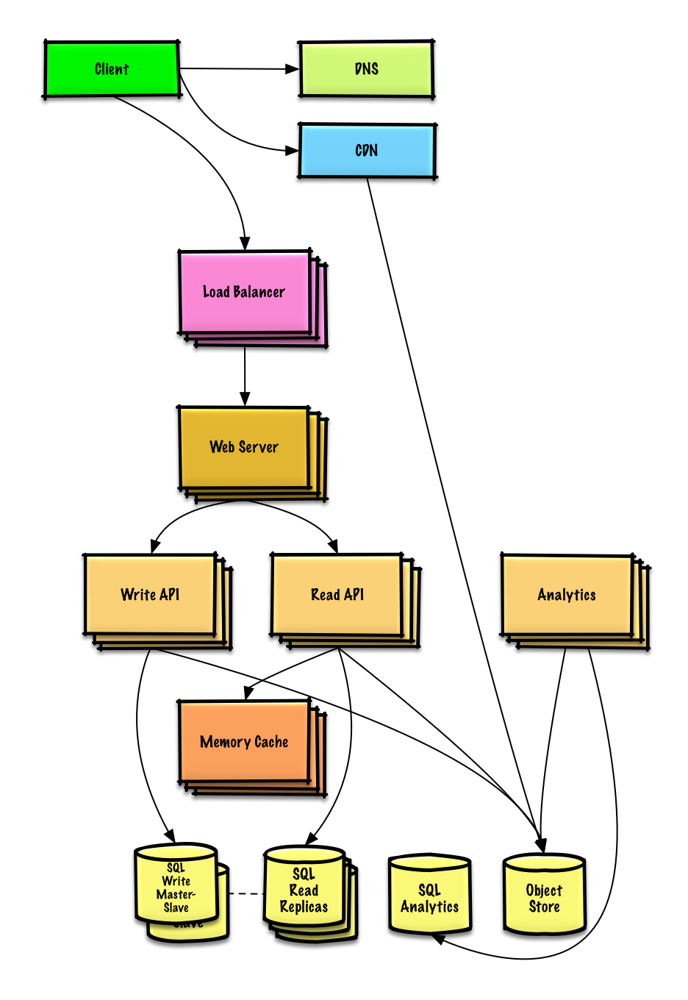
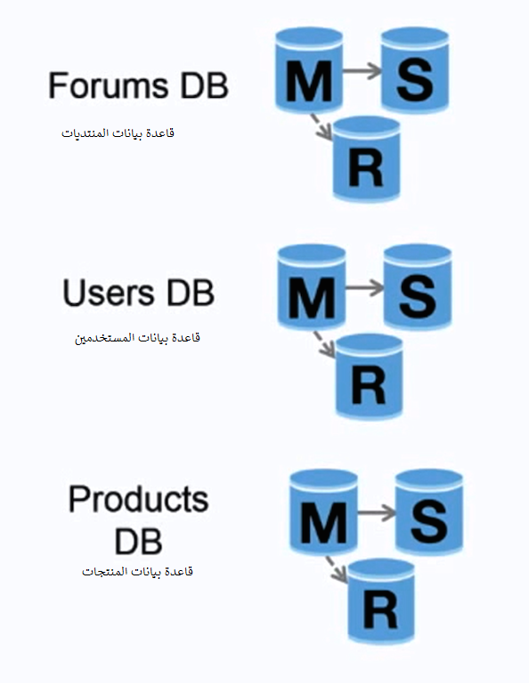
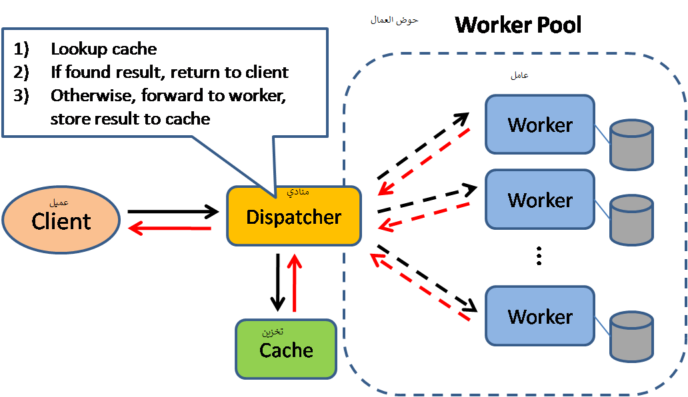
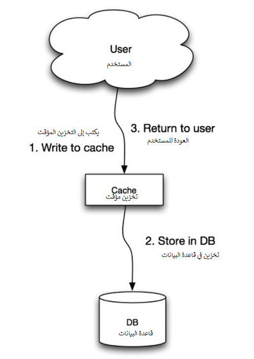
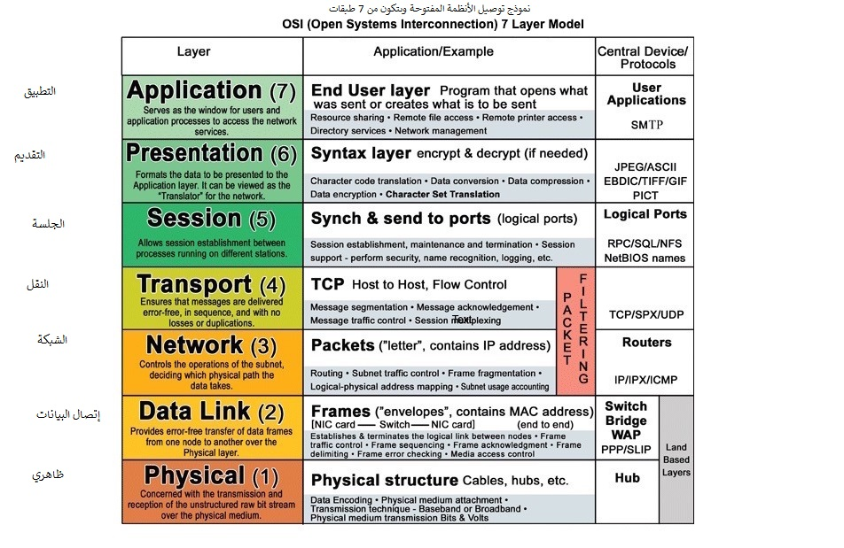

*[English](README.md) ∙ [日本語](README-ja.md) ∙ [简体中文](README-zh-Hans.md) ∙ [繁體中文](README-zh-TW.md) | [العَرَبِيَّة‎](README-ar.md) ∙ [বাংলা](https://github.com/donnemartin/system-design-primer/issues/220) ∙ [Português do Brasil](https://github.com/donnemartin/system-design-primer/issues/40) ∙ [Deutsch](https://github.com/donnemartin/system-design-primer/issues/186) ∙ [ελληνικά](https://github.com/donnemartin/system-design-primer/issues/130) ∙ [עברית](https://github.com/donnemartin/system-design-primer/issues/272) ∙ [Italiano](https://github.com/donnemartin/system-design-primer/issues/104) ∙ [한국어](https://github.com/donnemartin/system-design-primer/issues/102) ∙ [فارسی](https://github.com/donnemartin/system-design-primer/issues/110) ∙ [Polski](https://github.com/donnemartin/system-design-primer/issues/68) ∙ [русский язык](https://github.com/donnemartin/system-design-primer/issues/87) ∙ [Español](https://github.com/donnemartin/system-design-primer/issues/136) ∙ [ภาษาไทย](https://github.com/donnemartin/system-design-primer/issues/187) ∙ [Türkçe](https://github.com/donnemartin/system-design-primer/issues/39) ∙ [tiếng Việt](https://github.com/donnemartin/system-design-primer/issues/127) ∙ [Français](https://github.com/donnemartin/system-design-primer/issues/250) | [Add Translation](https://github.com/donnemartin/system-design-primer/issues/28)*

**ساعد [بترجمة](TRANSLATIONS.md) هذا الدليل!**

# تمهيد لتصميم النظام

<p align="center">
  
  <br/>
</p>

## الدافع

> التعرف على كيفية تصميم أنظمة واسعة النطاق.
>
> التحضير لمقابلة تصميم النظام.

### التعرف على كيفية تصميم أنظمة واسعة النطاق

سيساعدك تعلم كيفية تصميم أنظمة قابلة للتطوير على أن تصبح مهندسًا أفضل.

تصميم النظام هو موضوع واسع. هنالك ** قدر هائل من الموارد المنتشرة في جميع أنحاء الشبكة ** حول مبادئ تصميم النظام.

هذا المستودع عبارة عن ** مجموعة منظمة ** من الموارد لمساعدتك على تعلم كيفية إنشاء أنظمة على نطاق واسع.

### تعلم من مجتمع المصادر المفتوحة

هذا مشروع مفتوح المصدر يتم تحديثه باستمرار.

[المساهمات](#contributing) مُرحب بها!

### التحضير لمقابلة تصميم النظام

بالإضافة إلى مقابلات البرمجة ، يعد تصميم النظام ** عنصرًا مطلوبًا ** من ** عملية المقابلة الفنية ** في العديد من شركات التكنولوجيا.

** تدرب على أسئلة المقابلة العامة لتصميم النظام ** و ** قارن ** نتائجك مع ** نماذج الحلول **: المناقشات ، والتعليمات البرمجية ، والرسوم التخطيطية.

مواضيع إضافية للتحضير للمقابلة:

* [دليل الدراسة](#study-guide)
* [كيفية التعامل مع سؤال مقابلة تصميم النظام](#how-to-approach-a-system-design-interview-question)
* [أسئلة مقابلة تصميم النظام ** مع حلول **](#system-design-interview-questions-with-solutions)
* [أسئلة مقابلة التصميم الموجه للكائنات ، ** مع حلول **](#object-oriented-design-interview-questions-with-solutions)
* [أسئلة مقابلة تصميم النظام الإضافية](#additional-system-design-interview-questions)

## بطاقات أنكي التعليمية

<p align="center">
  
  <br/>
</p>

 [بطاقات أنكي التعليمية](https://apps.ankiweb.net/) المقدمة تستخدم التكرار المتباعد لمساعدتك في الاحتفاظ بمفاهيم تصميم النظام الرئيسية.

* [سطح تصميم النظام](https://github.com/donnemartin/system-design-primer/tree/master/resources/flash_cards/System%20Design.apkg)
* [سطح تمارين تصميم النظام](https://github.com/donnemartin/system-design-primer/tree/master/resources/flash_cards/System%20Design%20Exercises.apkg)
* [تمارين التصميم الكينوني على سطح السفينة](https://github.com/donnemartin/system-design-primer/tree/master/resources/flash_cards/OO%20Design.apkg)

عظيم للاستخدام أثناء التنقل.

### مصادر البرمجة : تحديات البرمجة التفاعلية
أتبحث عن موارد لمساعدتك على التحضير لـ [** مقابلة البرمجة **](https://github.com/donnemartin/interactive-coding-challenges)?

<p align="center">
  
  <br/>
</p>

تحقق من المستودع النظير [** تحديات البرمجة التفاعلية **](https://github.com/donnemartin/interactive-coding-challenges), which contains an additional Anki deck:

* [وِحده واحدة من الرموز](https://github.com/donnemartin/interactive-coding-challenges/tree/master/anki_cards/Coding.apkg)

## المساهمة

> تعلم من المجتمع.

لا تتردد في إرسال طلبات السحب للمساعدة:

* إصلاح الأخطاء
* تحسين الأجزاء
* إضافة أجزاء جديدة
* [الترجمة](https://github.com/donnemartin/system-design-primer/issues/28)

يتم وضع المحتوى الذي يحتاج إلى بعض التحسين [تحت التطوير](#under-development).

راجع ال [المبادئ التوجيهية للمساهمة](CONTRIBUTING.md).

## فهرس موضوعات تصميم النظام

> ملخصات لموضوعات تصميم النظام المختلفة ، بما في ذلك الإيجابيات والسلبيات. ** كل شيء هو مقايضة **.
>
> يحتوي كل قسم على روابط لمزيد من الموارد المتعمقة.

<p align="center">
  
  <br/>
</p>

* [مواضيع تصميم النظام: ابدأ من هنا](#system-design-topics-start-here)
    * [الخطوة 1: راجع محاضرة فيديو قابلية التوسع](#step-1-review-the-scalability-video-lecture)
    * [الخطوة 2: راجع مقالة قابلية التوسع](#step-2-review-the-scalability-article)
    * [الخطوات التالية](#next-steps)
* [الأداء مقابل قابلية التوسع](#performance-vs-scalability)
* [الكمون مقابل معالجة النظام للمعلومات](#latency-vs-throughput)
* [التوافر مقابل الاتساق](#availability-vs-consistency)
    * [نظرية CAP](#cap-theorem)
        * [CP - الاتساق والتسامح في التقسيم](#cp---consistency-and-partition-tolerance)
        * [AP - التوافر والتسامح في التقسيم](#ap---availability-and-partition-tolerance)
* [أنماط الاتساق](#consistency-patterns)
    * [تناسق ضعيف](#weak-consistency)
    * [الاتساق في نهاية المطاف](#eventual-consistency)
    * [اتساق قوي](#strong-consistency)
* [أنماط التوفر](#availability-patterns)
    * [تجاوز الفشل](#fail-over)
    * [تكرار](#replication)
    * [التوافر بالأرقام](#availability-in-numbers)
* [نظام اسم المجال](#domain-name-system)
* [شبكة توصيل المحتوى](#content-delivery-network)
    * [دفع CDNs](#push-cdns)
    * [سحب شبكات CDN](#pull-cdns)
* [موازن الحمل](#load-balancer)
    * [نشط سلبي](#active-passive)
    * [نشط نشط](#active-active)
    * [موازنة حمل الطبقة الرابعة](#layer-4-load-balancing)
    * [موازنة تحميل الطبقة السابعة](#layer-7-load-balancing)
    * [التحجيم الأفقي](#horizontal-scaling)
* [وكيل عكسي (خادم الشبكة)](#reverse-proxy-web-server)
    * [موازن التحميل مقابل الوكيل العكسي](#load-balancer-vs-reverse-proxy)
* [طبقة التطبيقات](#application-layer)
    * [الخدمات المصغرة](#microservices)
    * [اكتشاف الخدمة](#service-discovery)
* [قاعدة البيانات](#database)
    * [نظام إدارة قواعد البيانات الارتباطية (RDBMS)](#relational-database-management-system-rdbms)
        * [تكرار السيد والخادم](#master-slave-replication)
        * [تكرار السيد السيد](#master-master-replication)
        * [الاتحاد](#federation)
        * [التشرذم](#sharding)
        * [عدم التطابق](#denormalization)
        * [ضبط SQL](#sql-tuning)
    * [NoSQL](#nosql)
        * [مخزن مفتاح-قيمة](#key-value-store)
        * [مخزن المستندات](#document-store)
        * [مخزن العمود الواسع](#wide-column-store)
        * [قاعدة بيانات الرسم البياني](#graph-database)
    * [SQL أو NoSQL](#sql-or-nosql)
* [مخزن مؤقت](#cache)
    * [التخزين المؤقت للعميل](#client-caching)
    * [تخزين CDN المؤقت](#cdn-caching)
    * [التخزين المؤقت لخادم الويب](#web-server-caching)
    * [التخزين المؤقت لقاعدة البيانات](#database-caching)
    * [التخزين المؤقت للتطبيق](#application-caching)
    * [التخزين المؤقت على مستوى استعلام قاعدة البيانات](#caching-at-the-database-query-level)
    * [التخزين المؤقت على مستوى الكائن](#caching-at-the-object-level)
    * [متى يتم تحديث ذاكرة التخزين المؤقت](#when-to-update-the-cache)
        * [تخزين مؤقت جانبي](#cache-aside)
        * [الكتابة من خلال](#write-through)
        * [الكتابة الخلفية (إعادة الكتابة)](#write-behind-write-back)
        * [تحديث للأمام](#refresh-ahead)
* [عدم التزامن](#asynchronism)
    * [قوائم انتظار الرسائل](#message-queues)
    * [قوائم انتظار المهام](#task-queues)
    * [الضغط الخلفي](#back-pressure)
* [تواصل](#communication)
    * [بروتوكول التحكم في الإرسال (TCP)](#transmission-control-protocol-tcp)
    * [بروتوكول مخطط بيانات المستخدم (UDP)](#user-datagram-protocol-udp)
    * [استدعاء الإجراء البعيد (RPC)](#remote-procedure-call-rpc)
    * [نقل الحالة التمثيلية (REST)](#representational-state-transfer-rest)
* [حماية](#security)
* [زائدة](#appendix)
    * [صلاحيات اثنين من الجدول](#powers-of-two-table)
    * [أرقام التأخير يجب أن يعرفها كل مبرمج](#latency-numbers-every-programmer-should-know)
    * [أسئلة مقابلة تصميم النظام الإضافية](#additional-system-design-interview-questions)
    * [أبنية العالم الحقيقي](#real-world-architectures)
    * [معماريات الشركة](#company-architectures)
    * [مدونات هندسة الشركة](#company-engineering-blogs)
* [تحت التطوير](#under-development)
* [الاعتمادات](#credits)
* [معلومات الاتصال](#contact-info)
* [ترخيص](#license)

## دليل الدراسة

> الموضوعات المقترحة للمراجعة بناءً على الجدول الزمني للمقابلة (قصير ، متوسط ، طويل).


**س: لإجراء المقابلات ، هل أحتاج إلى معرفة كل شيء هنا? **

**ج: لا ، لست بحاجة إلى معرفة كل شيء هنا للاستعداد للمقابلة **.

يعتمد ما يُطلب منك في المقابلة على متغيرات مثل:

* ما مدى خبرتك
* ما هي خلفيتك التقنية
* ما هي المواقف التي تجري مقابلات معها
* ما هي الشركات التي تجري مقابلات معها
* حظ

من المتوقع عمومًا أن يعرف المرشحون الأكثر خبرة المزيد عن تصميم النظام. من المتوقع أن يعرف المهندسون ذوي الخبرة أو قادة الفريق أكثر من المساهمين الفرديين. من المرجح أن تجري شركات التكنولوجيا الكبرى جولة أو أكثر من مقابلات التصميم.

ابدأ على نطاق واسع وتعمق في مناطق قليلة. من المفيد معرفة القليل عن مواضيع تصميم النظام الرئيسية المختلفة. اضبط الدليل التالي بناءً على جدولك الزمني وخبرتك والوظائف التي تجري مقابلة معها والشركات التي تجري مقابلات معها.

* ** جدول زمني قصير ** - استهدف ** اتساع نطاق ** بمواضيع تصميم النظام. تدرب على حل ** بعض ** أسئلة المقابلة.
* ** مخطط زمني متوسط ​​** - استهدف ** اتساع نطاق ** و ** بعض العمق ** مع مواضيع تصميم النظام. الممارسة عن طريق حل ** العديد ** أسئلة المقابلة.
* ** جدول زمني طويل ** - استهدف ** اتساع نطاق ** و ** مزيد من العمق ** مع مواضيع تصميم النظام. تدرب على حل ** معظم ** أسئلة المقابلة.

| | قصيرة | وسط | طويلة |
|---|---|---|---|
| اقرأ من خلال [موضوعات تصميم النظام](#index-of-system-design-topics) للحصول على فهم واسع لكيفية عمل الأنظمة | :+1: | :+1: | :+1: |
| اقرأ بعض المقالات في [مدونات الشركة الهندسية](#company-engineering-blogs) للشركات التي تجري مقابلات معها | :+1: | :+1: | :+1: |
| اقرأ بعضًا من [أبنية العالم الحقيقي](#real-world-architectures) | :+1: | :+1: | :+1: |
| مراجعة [كيفية التعامل مع سؤال مقابلة تصميم النظام](#how-to-approach-a-system-design-interview-question) | :+1: | :+1: | :+1: |
| العمل من خلال [أسئلة مقابلة تصميم النظام مع الحلول](#system-design-interview-questions-with-solutions) | بعض | كثير | أغلب |
| العمل من خلال [أسئلة مقابلة التصميم الموجه للكائنات مع الحلول](#object-oriented-design-interview-questions-with-solutions) | بعض | كثير | أغلب |
| مراجعة [أسئلة مقابلة تصميم النظام الإضافية](#additional-system-design-interview-questions) | بعض | كثير | أغلب |

## كيفية التعامل مع سؤال مقابلة تصميم النظام

> كيفية معالجة سؤال مقابلة تصميم النظام.

مقابلة تصميم النظام هي ** محادثة مفتوحة **. من المتوقع أن تقودها.

يمكنك استخدام الخطوات التالية لتوجيه المناقشة. للمساعدة في ترسيخ هذه العملية ، اعمل من خلال [أسئلة مقابلة تصميم النظام مع حلول](#system-design-interview-questions-with-solutions) باستخدام الخطوات التالية.

### الخطوة الأولى: حدد حالات الاستخدام والقيود والافتراضات

اجمع المتطلبات وحدد نطاق المشكلة. اطرح أسئلة لتوضيح حالات الاستخدام والقيود. ناقش الافتراضات.

* من سيستخدمها?
* كيف سيستخدمونها?
* كم عدد المستخدمين هناك?
* ماذا يفعل النظام?
* ما هي مداخل ومخرجات النظام?
* ما مقدار البيانات التي نتوقع معالجتها?
* كم عدد الطلبات التي نتوقعها في الثانية?
* ما هي نسبة القراءة إلى الكتابة المتوقعة?

### الخطوة الثانية: إنشاء تصميم عالي المستوى

حدد تصميمًا عالي المستوى مع جميع المكونات المهمة.

* رسم المكونات والتوصيلات الرئيسية
* برر أفكارك

### الخطوة الثالثة: تصميم المكونات الأساسية

الغوص في التفاصيل لكل مكون أساسي. على سبيل المثال ، إذا طُلب منك [تصميم خدمة تقصير عناوين url](solutions/system_design/pastebin/README.md), ناقش:

* إنشاء وتخزين تجزئة عنوان url الكامل
     * [MD5](Solutions/system_design/pastebin/README.md) و [Base62](Solutions/system_design/pastebin/README.md)
     * تجزئة الاصطدامات
     * SQL أو NoSQL
     * مخطط قاعدة البيانات
* ترجمة عنوان url مجزأ إلى عنوان url الكامل
     * البحث في قاعدة البيانات
* API والتصميم الشيئي

### الخطوة 4: قياس التصميم

تحديد ومعالجة الاختناقات ، في ضوء القيود. على سبيل المثال ، هل تحتاج إلى ما يلي لمعالجة مشكلات قابلية التوسع?

* موازن التحميل
* التحجيم الأفقي
* التخزين المؤقت
* تقسيم قاعدة البيانات

ناقش الحلول والمفاضلات المحتملة. كل شيء هو مقايضة. قم بمعالجة الاختناقات باستخدام [مبادئ تصميم النظام القابل للتطوير](#index-of-system-design-topics).

### حسابات ظهر المغلف

قد يُطلب منك القيام ببعض التقديرات يدويًا. راجع [الملحق](#appendix) للحصول على الموارد التالية:

* [استخدم الجزء الخلفي من حسابات المغلف](http://highscalability.com/blog/2011/1/26/google-pro-tip-use-back-of-the-envelope-calculations-to-choo.html)
* [صلاحيات جدولين](#powers-of-two-table)
* [أرقام زمن الانتقال التي يجب على كل مبرمج معرفتها](#latency-number-every-programmer-should-know)

### المصدر (المصادر) وقراءات أخرى

تحقق من الروابط التالية للحصول على فكرة أفضل عما يمكن توقعه:

* [كيفية الحصول على مقابلة تصميم الأنظمة](https://www.palantir.com/2011/10/how-to-rock-a-systems-design-interview/)
* [مقابلة تصميم النظام](http://www.hiredintech.com/system-design)
* [مقدمة لمقابلات تصميم النظم والنظم المعمارية](https://www.youtube.com/watch?v=ZgdS0EUmn70)
* [نموذج تصميم النظام](https://leetcode.com/discuss/career/229177/My-System-Design-Template)

## أسئلة مقابلة تصميم النظام مع الحلول

> أسئلة مقابلة تصميم النظام الشائعة مع نماذج المناقشات ، والتعليمات البرمجية ، والرسوم التخطيطية.
>
> حلول مرتبطة بالمحتوى في مجلد `` Solutions / `.

| سؤال | |
|---|---|
| صمم Pastebin.com (or Bit.ly) | [الحل](solutions/system_design/pastebin/README.md) |
| صمم الجدول الزمني والبحث في Twitter (أو موجز Facebook والبحث) | [الحل](solutions/system_design/twitter/README.md) |
| صمم web crawler | [الحل](solutions/system_design/web_crawler/README.md) |
| صمم Mint.com | [الحل](solutions/system_design/mint/README.md) |
| صمم هياكل البيانات لشبكة اجتماعية | [الحل](solutions/system_design/social_graph/README.md) |
| صمم مخزن مفتاح-قيمة لمحرك بحث | [الحل](solutions/system_design/query_cache/README.md) |
| صمم ترتيب مبيعات أمازون حسب ميزة الفئة | [الحل](solutions/system_design/sales_rank/README.md) |
| صمم نظام يتسع لملايين المستخدمين على AWS | [الحل](solutions/system_design/scaling_aws/README.md) |
| أضف سؤال تصميم النظام | [المساهمة](#contributing) |

### تصميم Pastebin.com (أو Bit.ly)

[عرض التمرين والحل](solutions/system_design/pastebin/README.md)



### تصميم الجدول الزمني على Twitter والبحث (أو موجز Facebook والبحث)

[عرض التمرين والحل](solutions/system_design/twitter/README.md)


### تصميم زاحف الويب

[عرض التمرين والحل](solutions/system_design/web_crawler/README.md)


### صمم Mint.com

[عرض التمرين والحل](solutions/system_design/mint/README.md)


### تصميم هياكل البيانات لشبكة اجتماعية

[عرض التمرين والحل](solutions/system_design/social_graph/README.md)


### تصميم مخزن مفتاح-قيمة لمحرك بحث

[عرض التمرين والحل](solutions/system_design/query_cache/README.md)


### تصميم ترتيب مبيعات أمازون حسب ميزة الفئة

[عرض التمرين والحل](solutions/system_design/sales_rank/README.md)


### تصميم نظام يتسع لملايين المستخدمين على AWS

[عرض التمرين والحل](solutions/system_design/scaling_aws/README.md)


## أسئلة مقابلة التصميم الموجه مع الحلول

> أسئلة مقابلة التصميم الموجه للكائنات الشائعة مع نماذج المناقشات ، والتعليمات البرمجية ، والرسوم التخطيطية.
>
> حلول مرتبطة بالمحتوى في مجلد `` Solutions / `.

> ** ملاحظة: هذا القسم قيد التطوير **

| Question | |
|---|---|
| تصميم خريطة التجزئة | [الحل](solutions/object_oriented_design/hash_table/hash_map.ipynb)  |
| تصميم ذاكرة التخزين المؤقت الأقل استخدامًا مؤخرًا | [الحل](solutions/object_oriented_design/lru_cache/lru_cache.ipynb)  |
| تصميم مركز اتصال | [الحل](solutions/object_oriented_design/call_center/call_center.ipynb)  |
| صمم مجموعة من البطاقات | [الحل](solutions/object_oriented_design/deck_of_cards/deck_of_cards.ipynb)  |
| تصميم موقف للسيارات | [الحل](solutions/object_oriented_design/parking_lot/parking_lot.ipynb)  |
| صمم خادم دردشة | [الحل](solutions/object_oriented_design/online_chat/online_chat.ipynb)  |
| تصميم مصفوفة دائرية | [المساهمة](#contributing)  |
| أضف سؤال تصميم موجه للكائنات | [المساهمة](#contributing) |

## مواضيع تصميم النظام: ابدأ من هنا

جديد في تصميم النظام?

أولاً ، ستحتاج إلى فهم أساسي للمبادئ المشتركة ، والتعرف على ماهيتها وكيفية استخدامها ومزاياها وعيوبها.

### الخطوة الأولى: مراجعة محاضرة الفيديو حول قابلية التوسع

[محاضرة حول قابلية التوسع في جامعة هارفارد](https://www.youtube.com/watch?v=-W9F__D3oY4)

* المواضيع التي تمت تغطيتها:
     * التحجيم العمودي
     * التحجيم الأفقي
     * التخزين المؤقت
     * توزيع الحمل
     * تكرار قاعدة البيانات
     * تقسيم قاعدة البيانات

### الخطوة الثانية: مراجعة مقالة قابلية التوسع

[قابلية التوسع](http://www.lecloud.net/tagged/scalability/chrono)

* المواضيع مالتاحة:
    * [النُسَخ](http://www.lecloud.net/post/7295452622/scalability-for-dummies-part-1-clones)
    * [قواعد البيانات](http://www.lecloud.net/post/7994751381/scalability-for-dummies-part-2-database)
    * [تخزينات مؤقتة](http://www.lecloud.net/post/9246290032/scalability-for-dummies-part-3-cache)
    * [عدم التزامن](http://www.lecloud.net/post/9699762917/scalability-for-dummies-part-4-asynchronism)

### الخطوات التالية

بعد ذلك ، سنلقي نظرة على المقايضات عالية المستوى:

* ** الأداء ** مقابل ** قابلية التوسع **
* ** الكمون ** مقابل ** الإنتاجية **
* ** التوفر ** مقابل ** الاتساق **

ضع في اعتبارك أن ** كل شيء هو مقايضة **.

ثم سنغوص في مواضيع أكثر تحديدًا مثل DNS و CDNs وموازنات التحميل.

## الأداء مقابل قابلية التوسع

تكون الخدمة ** قابلة للتطوير ** إذا أدت إلى زيادة ** الأداء ** بطريقة تتناسب مع الموارد المضافة. بشكل عام ، تعني زيادة الأداء خدمة المزيد من وحدات العمل ، ولكن يمكن أيضًا التعامل مع وحدات عمل أكبر ، مثل عندما تنمو مجموعات البيانات. <sup><a href=http://www.allthingsdistributed.com/2006/03/a_word_on_scalability.html>1</a></sup>

طريقة أخرى للنظر إلى الأداء مقابل قابلية التوسع:

* إذا كانت لديك مشكلة ** في الأداء ** ، فهذا يعني أن نظامك بطيء لمستخدم واحد.
* إذا كانت لديك مشكلة ** قابلية التوسع ** ، فإن نظامك سريع لمستخدم واحد ولكنه بطيء في ظل الحمل الثقيل.

### المصدر (المصادر) وقراءات أخرى

* [كلمة عن قابلية التوسع](http://www.allthingsdistributed.com/2006/03/a_word_on_scalability.html)
* [قابلية التوسع ، التوافر ، الاستقرار ، الأنماط](http://www.slideshare.net/jboner/scalability-availability-stability-patterns/)

## الكمون مقابل معالجة النظام للمعلومات

** الكمون ** هو الوقت المناسب للقيام ببعض الإجراءات أو لإنتاج بعض النتائج.

** الإنتاجية ** هي عدد هذه الإجراءات أو النتائج لكل وحدة زمنية.

بشكل عام ، يجب أن تهدف إلى تحقيق ** أقصى قدر من الإنتاجية ** مع ** زمن انتقال مقبول **.

### المصدر (المصادر) وقراءات أخرى

* [فهم وقت الاستجابة مقابل معالجة النظام للمعلومات](https://community.cadence.com/cadence_blogs_8/b/sd/archive/2010/09/13/understanding-latency-vs-throughput)

## التوافر مقابل الاتساق

### نظرية CAP

<p align="center">
  
  <br/>
  <i><a href=http://robertgreiner.com/2014/08/cap-theorem-revisited>Source: CAP theorem revisited</a></i>
</p>

في نظام الكمبيوتر الموزع ، يمكنك فقط دعم اثنين من الضمانات التالية:

* ** الاتساق ** - تتلقى كل قراءة أحدث كتابة أو خطأ
* ** التوفر ** - يتلقى كل طلب استجابة ، دون ضمان احتوائه على أحدث نسخة من المعلومات
* ** التسامح التقسيم ** - يستمر النظام في العمل على الرغم من التقسيم التعسفي بسبب أعطال الشبكة

* الشبكات ليست موثوقة ، لذا ستحتاج إلى دعم تسامح التقسيم. ستحتاج إلى مقايضة البرامج بين الاتساق والتوافر. *

#### CP - الاتساق والتسامح في التقسيم

قد يؤدي انتظار استجابة من العقدة المقسمة إلى حدوث خطأ انتهاء المهلة. يعد CP خيارًا جيدًا إذا كانت احتياجات عملك تتطلب قراءة وكتابة ذرية.

#### AP - التوافر والتسامح في القسم

تُرجع الردود النسخة الأكثر توفرًا من البيانات المتاحة على أي عقدة ، والتي قد لا تكون الأحدث. قد يستغرق نشر عمليات الكتابة عند حل القسم بعض الوقت.

AP هو اختيار جيد إذا سمحت احتياجات العمل بذلك [الاتساق في نهاية المطاف](#eventual-consistency) أو عندما يحتاج النظام إلى مواصلة العمل بالرغم من الأخطاء الخارجية.

### المصدر (المصادر) وقراءات أخرى

* [إعادة النظر في نظرية CAP](http://robertgreiner.com/2014/08/cap-theorem-revisited/)
* [مقدمة إنجليزية بسيطة لنظرية CAP](http://ksat.me/a-plain-english-introduction-to-cap-theorem)
* [الأسئلة الشائعة حول CAP](https://github.com/henryr/cap-faq)
* [نظرية CAP](https://www.youtube.com/watch?v=k-Yaq8AHlFA)

## أنماط الاتساق

من خلال نسخ متعددة من نفس البيانات ، نواجه خيارات حول كيفية مزامنتها بحيث يكون لدى العملاء عرض متسق للبيانات. تذكر تعريف التناسق من [نظرية CAP](#cap-theorem) - كل قراءة تتلقى أحدث كتابة أو خطأ.

### تناسق ضعيف

بعد الكتابة ، قد تراه أو لا تراه. يتم اتباع نهج أفضل جهد.

يظهر هذا النهج في أنظمة مثل memcached. يعمل التناسق الضعيف بشكل جيد في حالات الاستخدام في الوقت الفعلي مثل VoIP ودردشة الفيديو والألعاب متعددة اللاعبين في الوقت الفعلي. على سبيل المثال ، إذا كنت تجري مكالمة هاتفية وفقدت الاستقبال لبضع ثوان ، فعند استعادة الاتصال ، لا تسمع ما تم التحدث به أثناء فقدان الاتصال.

### الاتساق في نهاية المطاف

بعد الكتابة ، ستراها القراءات في النهاية (عادةً في غضون مللي ثانية). يتم نسخ البيانات بشكل غير متزامن.

يظهر هذا النهج في أنظمة مثل DNS والبريد الإلكتروني. يعمل الاتساق النهائي بشكل جيد في الأنظمة المتاحة للغاية.

### الاتساق القوي

بعد الكتابة ، ستراها القراءات. يتم نسخ البيانات بشكل متزامن.

يظهر هذا النهج في أنظمة الملفات و RDBMSes. يعمل الاتساق القوي بشكل جيد في الأنظمة التي تحتاج إلى معاملات.

### المصدر (المصادر) وقراءات أخرى

* [المعاملات عبر مراكز البيانات](http://snarfed.org/transactions_across_datacenters_io.html)

## أنماط التوفر

هناك نوعان من الأنماط التكميلية لدعم الإتاحة العالية: ** تجاوز الفشل ** و ** النسخ المتماثل **.

### الفشل

#### المبني للمجهول

مع تجاوز الفشل السلبي النشط ، يتم إرسال دقات القلب بين الخادم النشط والخادم الخامل في وضع الاستعداد. في حالة مقاطعة نبضات القلب ، يتولى الخادم الخامل عنوان IP الخاص بالنشط ويستأنف الخدمة.

يتم تحديد مدة التعطل من خلال ما إذا كان الخادم الخامل يعمل بالفعل في وضع الاستعداد "الساخن" أو ما إذا كان يحتاج إلى بدء التشغيل من وضع الاستعداد "البارد". فقط الخادم النشط يتعامل مع حركة المرور.

يمكن أيضًا الإشارة إلى تجاوز الفشل النشط والسلبي باسم تجاوز الفشل الرئيسي والعبد.

#### النشط النشط

في حالة النشاط النشط ، يقوم كلا الخادمين بإدارة حركة المرور ، وتوزيع الحمل بينهما.

إذا كانت الخوادم تواجه الجمهور ، فسيحتاج DNS إلى معرفة عناوين IP العامة لكلا الخادمين. إذا كانت الخوادم مواجهة داخلية ، فسيحتاج منطق التطبيق إلى معرفة كلا الخادمين.

يمكن أيضًا الإشارة إلى تجاوز الفشل النشط النشط باسم تجاوز الفشل الرئيسي / الرئيسي.

### العيوب: تجاوز الفشل

* يضيف تجاوز الفشل مزيدًا من الأجهزة وتعقيدًا إضافيًا.
* هناك احتمال لفقدان البيانات في حالة فشل النظام النشط قبل نسخ أي بيانات مكتوبة حديثًا إلى الخامل.

### تكرار

#### السيد والخادم والسيد السيد

تمت مناقشة هذا الموضوع بمزيد من التفصيل في فصل [قاعدة البيانات](#database):

* [إستنساخ السيد والخادم](#master-slave-replication)
* [إستنساخ السيد السيد](#master-master-replication)

### التوافرية بالأعداد

غالبًا ما يتم تحديد مدى التوفر حسب وقت التشغيل (أو وقت التوقف عن العمل) كنسبة مئوية من الوقت الذي تتوفر فيه الخدمة. يُقاس التوافر عمومًا بعدد 9 ثوانٍ - توصف خدمة توفر بنسبة 99.99٪ بأنها تحتوي على أربع 9 ثوانٍ.

#### توفر بنسبة 99.9٪ - ثلاث 9 ثوانٍ

| المدة               |  وقت التوقف المقبول|
|---------------------|--------------------|
| التوقف عن العمل في السنة | 8 س 45 د 57 ث |
| تعطل في الشهر      |         43 م 49.7 ث |
| التوقف في الأسبوع   |          10 م 4.8 ث |
| التوقف عن العمل في اليوم |  1 م و 26.4 ث |

#### التوفر بنسبة 99.99٪ - أربع 9 ثوانٍ

| المدة   |      وقت التوقف المقبول                |
| ---------------------    |   -------------------- |
| التوقف عن العمل في السنة | 52 دقيقة و 35.7 ثانية |
| تعطل في الشهر          |                4 م 23 ث |
| التوقف في الأسبوع |                 1 م 5 ث       |
| التوقف عن العمل في اليوم |             8.6 ثانية |

#### التوفر بالتوازي مقابل التسلسل

إذا كانت الخدمة تتكون من مكونات متعددة معرضة للفشل ، فإن التوافر الكلي للخدمة يعتمد على ما إذا كانت المكونات متسلسلة أو متوازية.

###### في تسلسل

يتناقص التوافر الإجمالي عندما يكون هناك مكونان بتوفر <100٪ في تسلسل:

""
التوفر (الإجمالي) = التوفر (Foo) * التوفر (Bar)
""

إذا كان لكل من "Foo" و "Bar" توفرًا بنسبة 99.9٪ ، فسيكون إجمالي الإتاحة في التسلسل 99.8٪.

###### بالتوازي

يزداد التوافر الإجمالي عندما يتوازى مكونان مع توفر <100٪:

""
التوفر (الإجمالي) = 1 - (1 - التوفر (Foo)) * (1 - التوفر (Bar))
""

إذا كان لكل من "Foo" و "Bar" توفرًا بنسبة 99.9٪ ، فإن الإتاحة الإجمالية على التوازي ستكون 99.9999٪.

## نظام اسم المجال

<p align="center">
  
  <br/>
  <i><a href=http://www.slideshare.net/srikrupa5/dns-security-presentation-issa>Source: DNS security presentation</a></i>
</p>

يترجم نظام اسم المجال (DNS) اسم مجال مثل www.example.com إلى عنوان IP.

DNS هرمي ، مع وجود عدد قليل من الخوادم الموثوقة في المستوى الأعلى. يوفر جهاز التوجيه أو موفر خدمة الإنترنت معلومات حول خادم (خوادم) DNS الذي يجب الاتصال به عند إجراء بحث. تعيينات ذاكرة التخزين المؤقت لخوادم DNS ذات المستوى الأدنى ، والتي قد تصبح قديمة بسبب تأخيرات انتشار DNS. يمكن أيضًا تخزين نتائج نظام أسماء النطاقات مؤقتًا بواسطة المتصفح أو نظام التشغيل لفترة زمنية معينة ، يتم تحديدها بواسطة [وقت البقاء (TTL)](https://en.wikipedia.org/wiki/Time_to_live).

* ** سجل NS (خادم الاسم) ** - يحدد خوادم DNS للمجال / المجال الفرعي الخاص بك.
* ** سجل MX (تبادل البريد) ** - يحدد خوادم البريد لقبول الرسائل.
* ** سجل (العنوان) ** - يشير اسمًا إلى عنوان IP.
* ** CNAME (أساسي) ** - يشير اسمًا إلى اسم آخر أو "CNAME" (example.com إلى www.example.com) أو إلى سجل "A".

خدمات مثل[CloudFlare](https://www.cloudflare.com/dns/) و [Route 53](https://aws.amazon.com/route53/) تقدم خدمات DNS المُدارة. يمكن لبعض خدمات DNS توجيه حركة المرور من خلال طرق مختلفة:

* [بمعيار round robin](https://www.jscape.com/blog/load-balancing-algorithms)
     * منع حركة المرور من الذهاب إلى الخوادم تحت الصيانة
     * التوازن بين أحجام الكتلة المختلفة
     * اختبار أ / ب
* [معتمدة على التأخير](https://docs.aws.amazon.com/Route53/latest/DeveloperGuide/routing-policy.html#routing-policy-latency)
* [معتمدة عالموقع الجغرافي](https://docs.aws.amazon.com/Route53/latest/DeveloperGuide/routing-policy.html#routing-policy-geo)

### العيوب: DNS

* يؤدي الوصول إلى خادم DNS إلى تأخير طفيف ، على الرغم من التخفيف من حدته عن طريق التخزين المؤقت الموضح أعلاه.
* قد تكون إدارة خادم DNS معقدة وتتم إدارتها بشكل عام بواسطة [الحكومات ومزودي خدمة الإنترنت والشركات الكبيرة](http://superuser.com/questions/472695/who-controls-the-dns-servers/472729).
* تعرضت خدمات DNS مؤخرًا إلى [هجوم DDoS](http://dyn.com/blog/dyn-analysis-summary-of-friday-october-21-attack/) ، مما يمنع المستخدمين من الوصول إلى مواقع الويب مثل Twitter دون معرفة عنوان (عناوين) IP الخاص بتويتر.

### المصدر (المصادر) وقراءات أخرى

* [هندسة DNS](https://technet.microsoft.com/en-us/library/dd197427(v=ws.10).aspx)
* [ويكيبيديا](https://en.wikipedia.org/wiki/Domain_Name_System)
* [مقالات DNS](https://support.dnsimple.com/categories/dns/)

## شبكة توصيل المحتوى

<p align="center">
  
  <br/>
  <i><a href=https://www.creative-artworks.eu/why-use-a-content-delivery-network-cdn/>Source: Why use a CDN</a></i>
</p>

شبكة توصيل المحتوى (CDN) هي شبكة موزعة عالميًا من الخوادم الوكيلة ، تخدم المحتوى من مواقع أقرب إلى المستخدم. بشكل عام ، يتم تقديم الملفات الثابتة مثل HTML / CSS / JS والصور ومقاطع الفيديو من CDN ، على الرغم من أن بعض شبكات CDN مثل Amazon's CloudFront تدعم المحتوى الديناميكي. سيخبر حل DNS الخاص بالموقع العملاء بالخادم الذي يجب الاتصال به.

يمكن أن يؤدي تقديم المحتوى من شبكات CDN إلى تحسين الأداء بشكل ملحوظ بطريقتين:

* يتلقى المستخدمون المحتوى من مراكز البيانات القريبة منهم
* لا يتعين على الخوادم الخاصة بك أن تخدم الطلبات التي تفي بها شبكة CDN

### دفع CDNs

يتلقى دفع CDNs محتوى جديدًا كلما حدثت تغييرات على الخادم الخاص بك. أنت تتحمل المسؤولية الكاملة عن توفير المحتوى والتحميل مباشرة إلى CDN وإعادة كتابة عناوين URL للإشارة إلى CDN. يمكنك تكوين وقت انتهاء صلاحية المحتوى ووقت تحديثه. يتم تحميل المحتوى فقط عندما يكون جديدًا أو متغيرًا ، مما يقلل من حركة المرور ، مع زيادة التخزين.

تعمل المواقع التي تحتوي على قدر ضئيل من حركة المرور أو المواقع ذات المحتوى الذي لا يتم تحديثه غالبًا بشكل جيد مع شبكات CDN للدفع. يتم وضع المحتوى على شبكات CDN مرة واحدة ، بدلاً من إعادة سحبه على فترات منتظمة.

### سحب CDNs

تحصل شبكات CDN على محتوى جديد من الخادم الخاص بك عندما يطلب المستخدم الأول المحتوى. تترك المحتوى على الخادم الخاص بك وتعيد كتابة عناوين URL للإشارة إلى CDN. ينتج عن هذا طلب أبطأ حتى يتم تخزين المحتوى مؤقتًا على CDN.

تحدد [مدة البقاء (TTL)](https://en.wikipedia.org/wiki/Time_to_live) مدة تخزين المحتوى مؤقتًا. تعمل شبكات CDN على تقليل مساحة التخزين على شبكة CDN ، ولكن يمكنها إنشاء حركة مرور زائدة عن الحاجة إذا انتهت صلاحية الملفات وتم سحبها قبل تغييرها بالفعل.

تعمل المواقع ذات حركة المرور الكثيفة بشكل جيد مع شبكات CDN ، حيث تنتشر حركة المرور بشكل متساوٍ مع بقاء المحتوى المطلوب مؤخرًا فقط على شبكة CDN.

### العيوب: CDN

* قد تكون تكاليف CDN كبيرة اعتمادًا على حركة المرور ، على الرغم من أنه يجب موازنة ذلك مع التكاليف الإضافية التي قد تتحملها عند عدم استخدام CDN.
* قد يكون المحتوى قديمًا إذا تم تحديثه قبل انتهاء مدة البقاء (TTL).
* تتطلب CDNs تغيير عناوين URL للمحتوى الثابت للإشارة إلى CDN.

### المصدر (المصادر) وقراءات أخرى

* [توصيل المحتوى الموزع عالميًا](https://figshare.com/articles/Globally_distributed_content_delivery/6605972)
* [الاختلافات بين شبكات CDN للدفع والسحب](http://www.travelblogadvice.com/technical/the-differences-between-push-and-pull-cdns/)
* [ويكيبيديا](https://en.wikipedia.org/wiki/Content_delivery_network)

## موازن التحميل

<p align="center">
  
  <br/>
  <i><a href=http://horicky.blogspot.com/2010/10/scalable-system-design-patterns.html>Source: Scalable system design patterns</a></i>
</p>

تقوم موازين التحميل بتوزيع طلبات العميل الواردة على موارد الحوسبة مثل خوادم التطبيقات وقواعد البيانات. في كل حالة ، يُرجع موازن التحميل الاستجابة من مورد الحوسبة إلى العميل المناسب. موازنات التحميل فعالة في:

* منع الطلبات من الذهاب إلى الخوادم غير الصحية
* منع إثقال الموارد
* المساعدة في القضاء على نقطة واحدة من الفشل

يمكن تنفيذ موازنات التحميل باستخدام أجهزة (باهظة الثمن) أو باستخدام برامج مثل HAProxy.

تشمل المزايا الإضافية ما يلي:

* ** إنهاء SSL ** - فك تشفير الطلبات الواردة واستجابات الخادم المشفرة حتى لا تضطر الخوادم الخلفية إلى إجراء هذه العمليات التي يحتمل أن تكون باهظة الثمن
    * يزيل الحاجة إلى تثبيت شهادات [X.509](https://en.wikipedia.org/wiki/X.509) على كل خادم
* ** استمرار الجلسة ** - إصدار ملفات تعريف الارتباط وتوجيه طلبات عميل معين إلى الحالة نفسها إذا كانت تطبيقات الويب لا تتعقب الجلسات

للحماية من حالات الفشل ، من الشائع إعداد موازين تحميل متعددة ، إما في وضع [نشط-سلبي](#active-passive) أو [نشط-نشط](#active-active) .

يمكن لموازن التحميل توجيه حركة المرور بناءً على مقاييس مختلفة ، بما في ذلك:

* عشوائي
* أقل تحميل
* الجلسة / ملفات تعريف الارتباط
* [روبن دائري أو روبن دائري مرجح](https://www.g33kinfo.com/info/round-robin-vs-weighted-round-robin-lb)
* [Layer 4](#layer-4-load-balancing)
* [Layer 7](#layer-7-load-balancing)

### موازنة الحمل بالطبقة الرابعة

تنظر موازنات أحمال الطبقة 4 إلى المعلومات الموجودة في [طبقة النقل](#communication) لتحديد كيفية توزيع الطلبات. بشكل عام ، يتضمن هذا المصدر وعناوين IP الوجهة والمنافذ الموجودة في الرأس ، ولكن ليس محتويات الحزمة. تقوم موازنات تحميل الطبقة 4 بإعادة توجيه حزم الشبكة من وإلى الخادم الرئيسي ، مع تنفيذ [ترجمة عنوان الشبكة (NAT)](https://www.nginx.com/resources/glossary/layer-4-load-balancing/).

### موازنة أحمال الطبقة السابعة

تنظر موازن تحميل الطبقة 7 إلى [طبقة التطبيق](#communication) لتحديد كيفية توزيع الطلبات. يمكن أن يشمل ذلك محتويات الرأس والرسالة وملفات تعريف الارتباط. تنهي موازنات تحميل الطبقة 7 حركة مرور الشبكة ، وتقرأ الرسالة ، وتتخذ قرار موازنة التحميل ، ثم تفتح اتصالاً بالخادم المحدد. على سبيل المثال ، يمكن لموازنة تحميل الطبقة 7 توجيه حركة مرور الفيديو إلى الخوادم التي تستضيف مقاطع فيديو مع توجيه حركة مرور فوترة المستخدم الأكثر حساسية إلى خوادم مشددة الأمان.

على حساب المرونة ، تتطلب موازنة تحميل الطبقة 4 وقتًا وموارد حوسبة أقل من الطبقة 7 ، على الرغم من أن تأثير الأداء يمكن أن يكون ضئيلًا على الأجهزة السلعية الحديثة.

### القياس الأفقي

يمكن أن تساعد موازين التحميل أيضًا في القياس الأفقي ، وتحسين الأداء والتوافر. يعد التوسع في استخدام آلات السلع الأساسية أكثر فعالية من حيث التكلفة وينتج عنه توافر أعلى من توسيع نطاق خادم واحد على أجهزة أكثر تكلفة ، تسمى ** التحجيم الرأسي **. كما أنه من الأسهل توظيف المواهب التي تعمل على الأجهزة السلعية مقارنةً بأنظمة المؤسسات المتخصصة.

#### العيوب: القياس الأفقي

* يُدخل التحجيم أفقيًا التعقيد وينطوي على استنساخ الخوادم
    * يجب أن تكون الخوادم بدون حالة: يجب ألا تحتوي على أي بيانات متعلقة بالمستخدم مثل الجلسات أو صور الملف الشخصي
    * يمكن تخزين الجلسات في مخزن بيانات مركزي مثل [قاعدة بيانات](#database) (SQL ، NoSQL) أو [ذاكرة تخزين مؤقت](#cache) (Redis ، Memcached)
* تحتاج الخوادم النهائية مثل ذاكرات التخزين المؤقت وقواعد البيانات إلى التعامل مع المزيد من الاتصالات المتزامنة مع زيادة حجم الخوادم الأولية

### العيوب: موازن التحميل

* يمكن أن يصبح موازن التحميل عنق زجاجة في الأداء إذا لم يكن لديه موارد كافية أو إذا لم يتم تكوينه بشكل صحيح.
* يؤدي إدخال موازن التحميل للمساعدة في التخلص من نقطة فشل واحدة إلى زيادة التعقيد.
* موازن التحميل الفردي هو نقطة فشل واحدة ، حيث يؤدي تكوين موازين تحميل متعددة إلى زيادة التعقيد.

### المصدر (المصادر) وقراءات أخرى

* [هندسة NGINX](https://www.nginx.com/blog/inside-nginx-how-we-designed-for-performance-scale/)
* [دليل هندسة HAProxy](http://www.haproxy.org/download/1.2/doc/architecture.txt)
* [قابلية التوسع](http://www.lecloud.net/post/7295452622/scalability-for-dummies-part-1-clones)
* [ويكيبيديا](https://en.wikipedia.org/wiki/Load_balancing_(computing))
* [موازنة حمل الطبقة 4](https://www.nginx.com/resources/glossary/layer-4-load-balancing/)
* [موازنة تحميل الطبقة 7](https://www.nginx.com/resources/glossary/layer-7-load-balancing/)
* [تكوين مستمع ELB](http://docs.aws.amazon.com/elasticloadbalancing/latest/classic/elb-listener-config.html)

## وكيل عكسي (خادم الشبكة)

<p align="center">
  
  <br/>
  <i><a href=https://upload.wikimedia.org/wikipedia/commons/6/67/Reverse_proxy_h2g2bob.svg>Source: Wikipedia</a></i>
  <br/>
</p>

الوكيل العكسي هو خادم ويب يركز الخدمات الداخلية ويوفر واجهات موحدة للجمهور. يتم إعادة توجيه الطلبات الواردة من العملاء إلى خادم يمكنه الوفاء بها قبل أن يقوم الوكيل العكسي بإرجاع استجابة الخادم للعميل.

تشمل المزايا الإضافية ما يلي:

* ** زيادة الأمان ** - إخفاء المعلومات حول خوادم الواجهة الخلفية ، وعناوين IP للقائمة السوداء ، والحد من عدد الاتصالات لكل عميل
* ** زيادة قابلية التوسع والمرونة ** - يرى العملاء فقط عنوان IP للوكيل العكسي ، مما يسمح لك بتوسيع نطاق الخوادم أو تغيير تكوينها
* ** إنهاء SSL ** - فك تشفير الطلبات الواردة واستجابات الخادم المشفرة حتى لا تضطر الخوادم الخلفية إلى إجراء هذه العمليات التي يحتمل أن تكون باهظة الثمن
    * يزيل الحاجة إلى تثبيت شهادات [X.509](https://en.wikipedia.org/wiki/X.509) على كل خادم
* ** ضغط ** - ضغط استجابات الخادم
* ** التخزين المؤقت ** - إرجاع الاستجابة للطلبات المخزنة مؤقتًا
* ** محتوى ثابت ** - لخدمة المحتوى الثابت مباشرة
    * HTML / CSS / JS
    * الصور
    * أشرطة فيديو
    * إلخ

### تحميل الموازن مقابل الوكيل العكسي

* يعد نشر موازن التحميل مفيدًا عندما يكون لديك عدة خوادم. في كثير من الأحيان ، توجه موازين التحميل حركة المرور إلى مجموعة من الخوادم التي تخدم نفس الوظيفة.
* يمكن أن تكون البروكسيات العكسية مفيدة حتى مع خادم ويب أو خادم تطبيق واحد فقط ، مما يفتح الفوائد الموضحة في القسم السابق.
* يمكن أن تدعم الحلول مثل NGINX و HAProxy كلاً من البروكسي العكسي للطبقة 7 وموازنة الحمل.

### العيوب: عكس الوكيل

* يؤدي إدخال وكيل عكسي إلى زيادة التعقيد.
* الوكيل العكسي المنفرد هو نقطة فشل واحدة ، حيث يؤدي تكوين العديد من الوكلاء العكسيين (على سبيل المثال ، [تجاوز الفشل](https://en.wikipedia.org/wiki/Failover)) إلى زيادة التعقيد.

### المصدر (المصادر) وقراءات أخرى

* [عكس الوكيل مقابل موازن التحميل](https://www.nginx.com/resources/glossary/reverse-proxy-vs-load-balancer/)
* [هندسة NGINX](https://www.nginx.com/blog/inside-nginx-how-we-designed-for-performance-scale/)
* [دليل هندسة HAProxy](http://www.haproxy.org/download/1.2/doc/architecture.txt)
* [ويكيبيديا](https://en.wikipedia.org/wiki/Reverse_proxy)

## طبقة التطبيقات

<p align="center">
  
  <br/>
  <i><a href=http://lethain.com/introduction-to-architecting-systems-for-scale/#platform_layer>Source: Intro to architecting systems for scale</a></i>
</p>

يسمح لك فصل طبقة الويب عن طبقة التطبيق (المعروفة أيضًا باسم طبقة النظام الأساسي) بتوسيع نطاق كلتا الطبقتين وتكوينهما بشكل مستقل. تؤدي إضافة واجهة برمجة تطبيقات جديدة إلى إضافة خوادم التطبيقات دون الحاجة إلى إضافة خوادم ويب إضافية. يناصر مبدأ ** المسؤولية الفردية ** الخدمات الصغيرة والمستقلة التي تعمل معًا. يمكن للفرق الصغيرة ذات الخدمات الصغيرة التخطيط بقوة أكبر للنمو السريع.

يساعد العاملون في طبقة التطبيق أيضًا في تمكين [عدم التزامن](#asynchronism).

### الخدمات المصغرة

تتعلق بهذه المناقشة [microservices](https://en.wikipedia.org/wiki/Microservices) ، والتي يمكن وصفها بأنها مجموعة من الخدمات المعيارية الصغيرة والقابلة للنشر بشكل مستقل. تدير كل خدمة عملية فريدة وتتواصل من خلال آلية خفيفة الوزن ومحددة جيدًا لخدمة هدف العمل. <sup><ahref=https://smartbear.com/learn/api-design/what-are-microservices>1</a></sup>

على سبيل المثال ، يمكن أن يكون لدى Pinterest الخدمات المصغرة التالية: ملف تعريف المستخدم ، والمتابع ، والخلاصة ، والبحث ، وتحميل الصور ، وما إلى ذلك.

### اكتشاف الخدمة

أنظمة مثل [Consul](https://www.consul.io/docs/index.html) و [Etcd](https://coreos.com/etcd/docs/latest) و [Zookeeper](http: //www.slideshare.net/sauravhaloi/introduction-to-apache-zookeeper) يمكن أن تساعد الخدمات في العثور على بعضها البعض من خلال تتبع الأسماء والعناوين والمنافذ المسجلة. تساعد [الفحوصات الصحية](https://www.consul.io/intro/getting-started/checks.html) في التحقق من سلامة الخدمة ويتم إجراؤها غالبًا باستخدام نقطة نهاية [HTTP](#hypertext-transfer-protocol-http). يحتوي كل من Consul و Etcd على [مخزن قيمة المفتاح](#key-value-store) والذي يمكن أن يكون مفيدًا لتخزين قيم التكوين والبيانات المشتركة الأخرى.

### العيوب: طبقة التطبيق

* تتطلب إضافة طبقة تطبيق بخدمات مقترنة بشكل غير محكم نهجًا مختلفًا عن وجهة نظر معمارية وعملياتية وعملية (مقابل نظام متآلف).
* يمكن أن تضيف الخدمات المصغرة تعقيدًا من حيث عمليات النشر والعمليات.

### المصدر (المصادر) وقراءات أخرى

* [مقدمة عن أنظمة هندسة المقاييس](http://lethain.com/introduction-to-architecting-systems-for-scale)
* [Crack the system design interview](http://www.puncsky.com/blog/2016-02-13-crack-the-system-design-interview)
* [بنية موجهة للخدمة](https://en.wikipedia.org/wiki/Service-oriented_architecture)
* [مقدمة إلى Zookeeper](http://www.slideshare.net/sauravhaloi/introduction-to-apache-zookeeper)
* [هذا ما تحتاج إلى معرفته حول إنشاء الخدمات المصغرة](https://cloudncode.wordpress.com/2016/07/22/msa-getting-started/)

## قاعدة البيانات

<p align="center">
  
  <br/>
  <i><a href=https://www.youtube.com/watch?v=kKjm4ehYiMs>Source: Scaling up to your first 10 million users</a></i>
</p>

### نظام إدارة قواعد البيانات الارتباطية (RDBMS)

قاعدة البيانات العلائقية مثل SQL هي مجموعة من عناصر البيانات المنظمة في جداول.

** ACID ** هي مجموعة من خصائص قاعدة البيانات العلائقية [المعاملات](https://en.wikipedia.org/wiki/Database_transaction).

* ** الذرية ** - كل معاملة هي كل شيء أو لا شيء
* ** الاتساق ** - ستؤدي أي معاملة إلى نقل قاعدة البيانات من حالة صالحة إلى أخرى
* ** العزل ** - تنفيذ المعاملات بشكل متزامن له نفس النتائج كما لو تم تنفيذ المعاملات بشكل متسلسل
* ** المتانة ** - بمجرد إتمام الصفقة ، ستظل كذلك

هناك العديد من الأساليب لتوسيع نطاق قاعدة البيانات العلائقية: ** النسخ المتماثل الرئيسي والعبد ** ، ** النسخ المتماثل الرئيسي / الرئيسي ** ، ** الاتحاد ** ، ** التجزئة ** ، ** عدم التطابق ** ، و ** SQL ضبط**.

#### تكرار السيد والخادم

يخدم السيد القراءة والكتابة ، ويكرر الكتابة إلى واحد أو أكثر من الخدم ، والتي تخدم القراءة فقط. يمكن للخدم أيضًا نسخ الخدم الإضافيين بطريقة تشبه الأشجار. إذا كان السيد غير متصل ، يمكن للنظام أن يستمر في العمل في وضع القراءة فقط حتى يتم ترقية العبد إلى سيد أو توفير سيد جديد.

<p align="center">
  
  <br/>
  <i><a href=http://www.slideshare.net/jboner/scalability-availability-stability-patterns/>Source: Scalability, availability, stability, patterns</a></i>
</p>

##### العيوب: النسخ المتماثل السيد والعبد

* هناك حاجة إلى منطق إضافي لترقية عبد إلى سيد.
* راجع [عيوب (عيوب): النسخ المتماثل](#disadvantages-replication) للنقاط المتعلقة بـ ** كل من ** السيد والعبد والسيد والسيد.

#### النسخ المتماثل الرئيسي والسيد

يعمل كلا السيدين على القراءة والكتابة والتنسيق مع بعضهما البعض في عمليات الكتابة. في حالة تعطل أي منهما ، يمكن للنظام الاستمرار في العمل مع كل من عمليات القراءة والكتابة.

<p align="center">
  
  <br/>
  <i><a href=http://www.slideshare.net/jboner/scalability-availability-stability-patterns/>Source: Scalability, availability, stability, patterns</a></i>
</p>

##### العيوب: النسخ المتماثل الرئيسي والسيد

* ستحتاج إلى موازن تحميل أو ستحتاج إلى إجراء تغييرات على منطق التطبيق الخاص بك لتحديد مكان الكتابة.
* معظم الأنظمة الرئيسية الرئيسية إما متسقة بشكل فضفاض (تنتهك ACID) أو تزيد من زمن انتقال الكتابة بسبب المزامنة.
* يصبح حل النزاع أكثر فاعلية مع إضافة المزيد من عقد الكتابة وزيادة زمن الوصول.
* راجع [المساوئ (العيوب): النسخ المتماثل](#disadvantages-replication) للنقاط المتعلقة بـ ** كل من ** السيد والعبد والسيد والسيد.

##### العيوب: النسخ المتماثل

* هناك احتمال لفقدان البيانات إذا فشل البرنامج الرئيسي قبل أن يتم نسخ أي بيانات مكتوبة حديثًا إلى العقد الأخرى.
* يتم إعادة عمليات الكتابة إلى النسخ المتماثلة للقراءة. إذا كان هناك الكثير من عمليات الكتابة ، فيمكن أن تتعثر النسخ المتماثلة للقراءة في إعادة قراءة الكتابات ولا يمكنها إجراء العديد من القراءات.
* كلما زاد عدد العبيد الذين تمت قراءتهم ، زادت الحاجة إلى التكرار ، مما يؤدي إلى تأخر النسخ المتماثل بشكل أكبر.
* في بعض الأنظمة ، يمكن أن تؤدي الكتابة إلى المعلم إلى إنتاج خيوط متعددة للكتابة بالتوازي ، بينما تدعم النسخ المتماثلة للقراءة الكتابة بالتسلسل باستخدام مؤشر ترابط واحد.
* يضيف النسخ المتماثل المزيد من الأجهزة وتعقيدًا إضافيًا.

##### المصدر (المصادر) وقراءات إضافية: النسخ المتماثل

* [قابلية التوسع ، التوافر ، الاستقرار ، الأنماط](http://www.slideshare.net/jboner/scalability-availability-stability-patterns/)
* [نسخ متعدد الماجستير](https://en.wikipedia.org/wiki/Multi-master_replication)

#### الاتحاد

<p align="center">
  
  <br/>
  <i><a href=https://www.youtube.com/watch?v=kKjm4ehYiMs>Source: Scaling up to your first 10 million users</a></i>
</p>

يقسم الاتحاد (أو التقسيم الوظيفي) قواعد البيانات حسب الوظيفة. على سبيل المثال ، بدلاً من قاعدة بيانات واحدة متجانسة ، يمكن أن يكون لديك ثلاث قواعد بيانات: ** المنتديات ** ، ** المستخدمون ** ، و ** المنتجات ** ، مما يؤدي إلى تقليل حركة القراءة والكتابة لكل قاعدة بيانات وبالتالي تقليل النسخ المتماثل بطئ. ينتج عن قواعد البيانات الأصغر حجمًا أكبر من البيانات التي يمكن أن تتسع في الذاكرة ، مما يؤدي بدوره إلى المزيد من نتائج ذاكرة التخزين المؤقت بسبب موقع ذاكرة التخزين المؤقت المحسّن. مع عدم وجود تسلسل رئيسي مركزي واحد للكتابات ، يمكنك الكتابة بالتوازي ، وزيادة الإنتاجية.

##### العيوب: الاتحاد

* الاتحاد غير فعال إذا كان مخططك يتطلب وظائف أو جداول ضخمة.
* ستحتاج إلى تحديث منطق التطبيق الخاص بك لتحديد قاعدة البيانات التي يجب قراءتها وكتابتها.
* يعد ربط البيانات من قاعدتي بيانات أكثر تعقيدًا باستخدام [رابط الخادم](http://stackoverflow.com/questions/5145637/querying-data-by-joining-two-tables-in-two-database-on-different- الخوادم).
* يضيف الاتحاد المزيد من الأجهزة وتعقيدًا إضافيًا.

##### المصدر (المصادر) وقراءات إضافية: الفيدرالية

* [زيادة عدد المستخدمين إلى أول 10 ملايين مستخدم](https://www.youtube.com/watch?v=kKjm4ehYiMs)

#### التجزئة

<p align="center">
  
  <br/>
  <i><a href=http://www.slideshare.net/jboner/scalability-availability-stability-patterns/>Source: Scalability, availability, stability, patterns</a></i>
</p>

تقوم المشاركة بتوزيع البيانات عبر قواعد بيانات مختلفة بحيث يمكن لكل قاعدة بيانات فقط إدارة مجموعة فرعية من البيانات. أخذ قاعدة بيانات المستخدمين كمثال ، مع زيادة عدد المستخدمين ، تتم إضافة المزيد من القطع إلى المجموعة.

على غرار مزايا [الاتحاد](#federation) ، ينتج عن التجزئة حركة مرور أقل للقراءة والكتابة ، وتكرار أقل ، والمزيد من نتائج ذاكرة التخزين المؤقت. يتم أيضًا تقليل حجم الفهرس ، مما يؤدي بشكل عام إلى تحسين الأداء باستخدام استعلامات أسرع. إذا تعطلت إحدى القطع ، فإن الأجزاء الأخرى لا تزال تعمل ، على الرغم من أنك سترغب في إضافة شكل من أشكال النسخ المتماثل لتجنب فقد البيانات. مثل الفدرالية ، لا يوجد أي كتابات رئيسية مركزية متسلسلة واحدة ، مما يسمح لك بالكتابة بالتوازي مع زيادة الإنتاجية.

الطرق الشائعة لتقسيم جدول المستخدمين هي إما من خلال الاسم الأخير للمستخدم أو الموقع الجغرافي للمستخدم.

##### العيوب: التجزئة

* ستحتاج إلى تحديث منطق التطبيق الخاص بك للعمل مع الأجزاء ، مما قد يؤدي إلى استعلامات SQL معقدة.
* يمكن أن يصبح توزيع البيانات غير متوازن في جزء. على سبيل المثال ، يمكن أن تؤدي مجموعة من المستخدمين المتمرسين على أحد الأجزاء إلى زيادة التحميل على هذا الجزء مقارنة بالآخرين.
    * يضيف إعادة التوازن تعقيدًا إضافيًا. يمكن أن تقلل وظيفة التجزئة القائمة على [التجزئة المتسقة](http://www.paperplanes.de/2011/12/9/the-magic-of-consistent-hashing.html) من كمية البيانات المنقولة.
* يعد ربط البيانات من أجزاء متعددة أكثر تعقيدًا.
* تضيف التجزئة المزيد من الأجهزة وتعقيدًا إضافيًا.

##### المصدر (المصادر) وقراءات أخرى: التجزئة

* [مجيء الجزء](http://highscalability.com/blog/2009/8/6/an-unorthodox-approach-to-database-design-the-coming-of-the.html)
* [هندسة قاعدة بيانات Shard](https://en.wikipedia.org/wiki/Shard_(database_architecture))
* [تجزئة ثابتة](http://www.paperplanes.de/2011/12/9/the-magic-of-consistent-hashing.html)

#### عدم التطابق

تحاول Denormalization تحسين أداء القراءة على حساب بعض أداء الكتابة. تتم كتابة نسخ مكررة من البيانات في جداول متعددة لتجنب الصلات باهظة الثمن. بعض أنظمة RDBMS مثل [PostgreSQL](https://en.wikipedia.org/wiki/PostgreSQL) ودعم أوراكل [المشاهدات المادية](https://en.wikipedia.org/wiki/Materialized_view) التي تتعامل مع عمل التخزين المعلومات الزائدة عن الحاجة والاحتفاظ بالنسخ الزائدة عن الحاجة.

بمجرد توزيع البيانات باستخدام تقنيات مثل [الاتحاد](#federationالاتحاد) و [التجزئة](#sharding) ، تؤدي إدارة الصلات عبر مراكز البيانات إلى زيادة التعقيد. قد يؤدي عدم التطابق إلى الالتفاف على الحاجة إلى مثل هذه الصلات المعقدة.

في معظم الأنظمة ، يمكن أن يفوق عدد القراءات عدد عمليات الكتابة 100: 1 أو حتى 1000: 1. يمكن أن تكون القراءة الناتجة عن ربط قاعدة بيانات معقدة باهظة الثمن ، مما يؤدي إلى قضاء قدر كبير من الوقت في عمليات القرص.

##### العيوب: عدم التطابق

* البيانات مكررة.
* يمكن أن تساعد القيود في بقاء النسخ المتكررة من المعلومات متزامنة ، مما يزيد من تعقيد تصميم قاعدة البيانات.
* قد تؤدي قاعدة البيانات التي لم تتم تسويتها تحت حمل كتابة ثقيل أداءً أسوأ من نظيرتها الطبيعية.

###### المصدر (المصادر) وقراءات إضافية: عدم التطابق

* [عدم التطابق](https://en.wikipedia.org/wiki/Denormalization)

#### ضبط SQL

يعد ضبط SQL موضوعًا واسعًا وقد تمت كتابة العديد من [الكتب](https://www.amazon.com/s/ref=nb_sb_noss_2?url=search-alias٪3Daps&field-keywords=sql+tuning) كمرجع.

من المهم إجراء ** قياس الأداء ** و ** الملف الشخصي ** لمحاكاة الاختناقات وكشف النقاب عنها.

* ** Benchmark ** - محاكاة المواقف عالية الحمل باستخدام أدوات مثل [ab](http://httpd.apache.org/docs/2.2/programs/ab.html).
* ** الملف الشخصي ** - قم بتمكين أدوات مثل [سجل الاستعلام البطيء](http://dev.mysql.com/doc/refman/5.7/en/slow-query-log.html) للمساعدة في تتبع مشكلات الأداء.

قد توجهك المقارنة المعيارية والتنميط إلى التحسينات التالية.

##### تشديد المخطط

* يتم تفريغ MySQL على القرص في كتل متجاورة للوصول السريع.
* استخدم "CHAR" بدلاً من "VARCHAR" للحقول ذات الطول الثابت.
    * يسمح "CHAR" بشكل فعال بالوصول السريع والعشوائي ، بينما مع "VARCHAR" ، يجب أن تجد نهاية سلسلة قبل الانتقال إلى السلسلة التالية.
* استخدم "TEXT" للكتل الكبيرة من النص مثل مشاركات المدونة. يسمح "TEXT" أيضًا بإجراء عمليات بحث منطقية. يؤدي استخدام حقل "TEXT" إلى تخزين مؤشر على القرص يُستخدم لتحديد موقع كتلة النص.
* استخدم "INT" للأعداد الأكبر حتى 2 ^ 32 أو 4 مليار.
* استخدم "DECIMAL" للعملة لتجنب أخطاء تمثيل النقطة العائمة.
* تجنب تخزين "BLOBS" كبيرة ، قم بتخزين مكان مكان الحصول على الكائن بدلاً من ذلك.
* `` VARCHAR (255) '' هو أكبر عدد من الأحرف يمكن عده بعدد 8 بت ، وغالبًا ما يزيد استخدام البايت في بعض أنظمة RDBMS.
* قم بتعيين القيد "NOT NULL" حيثما ينطبق ذلك على [تحسين أداء البحث](http://stackoverflow.com/questions/1017239/how-do-null-values-affect-performance-in-a-database-search).

##### استخدم مؤشرات جيدة

* الأعمدة التي تستعلم عنها (`SELECT` ،` GROUP BY` ، `ORDER BY` ،` JOIN`) يمكن أن تكون أسرع مع الفهارس.
* يتم تمثيل المؤشرات عادةً على أنها ذاتية التوازن [B-tree](https://en.wikipedia.org/wiki/B-tree) التي تحافظ على البيانات مرتبة وتسمح بعمليات البحث والوصول المتسلسل والإدخالات والحذف في الوقت اللوغاريتمي.
* يمكن أن يؤدي وضع فهرس إلى الاحتفاظ بالبيانات في الذاكرة ، مما يتطلب مساحة أكبر.
* يمكن أيضًا أن تكون عمليات الكتابة أبطأ نظرًا لأن الفهرس يحتاج أيضًا إلى التحديث.
* عند تحميل كميات كبيرة من البيانات ، قد يكون من الأسرع تعطيل الفهارس وتحميل البيانات ثم إعادة بناء المؤشرات.

##### تجنب الصلات باهظة الثمن

* [عدم التطابق](#denormalization) حيث يتطلب ذلك الأداء.

##### جداول التقسيم

* قسّم طاولة عن طريق وضع نقاط ساخنة في طاولة منفصلة للمساعدة في الاحتفاظ بها في الذاكرة.

##### ضبط ذاكرة التخزين المؤقت للاستعلام

* في بعض الحالات ، قد يؤدي [استعلام التخزين المؤقت](https://dev.mysql.com/doc/refman/5.7/en/query-cache.html) إلى [مشكلات في الأداء](https://www.percona.com/blog/2016/10/12/mysql-5-7-performance-tuning-immediately-after-installation/).

##### المصدر (المصادر) وقراءات إضافية: ضبط SQL

* [نصائح لتحسين استعلامات MySQL](http://aiddroid.com/10-tips-optimizing-mysql-queries-dont-suck/)
* [هل هناك سبب وجيه لاستخدام VARCHAR (255) كثيرًا?](http://stackoverflow.com/questions/1217466/is-there-a-good-reason-i-see-varchar255-used-so-often-as-opposed-to-another-l)
* [كيف تؤثر القيم الخالية على الأداء?](http://stackoverflow.com/questions/1017239/how-do-null-values-affect-performance-in-a-database-search)
* [سجل الاستعلام البطيء](http://dev.mysql.com/doc/refman/5.7/en/slow-query-log.html)

### NoSQL

NoSQL عبارة عن مجموعة من عناصر البيانات ممثلة في ** متجر القيمة الرئيسية ** أو ** مخزن المستندات ** أو ** مخزن الأعمدة العريض ** أو ** قاعدة بيانات الرسم البياني **. يتم إلغاء تنسيق البيانات ، ويتم إجراء الصلات بشكل عام في رمز التطبيق. تفتقر معظم مخازن NoSQL إلى معاملات حمض صحيح ويفضل [التناسق النهائي](#eventual-consistency).

يستخدم ** BASE ** غالبًا لوصف خصائص قواعد بيانات NoSQL. بالمقارنة مع [نظرية CAP](#cap-theorem) ، تختار BASE الإتاحة على التناسق.

* ** متوفر أساسًا ** - يضمن النظام التوافر.
* ** الحالة الناعمة ** - قد تتغير حالة النظام بمرور الوقت ، حتى بدون إدخال.
* ** الاتساق النهائي ** - سيصبح النظام متسقًا على مدار فترة زمنية ، نظرًا لأن النظام لا يتلقى مدخلات خلال تلك الفترة.

بالإضافة إلى الاختيار بين [SQL أو NoSQL] (#sql-or-nosql) ، من المفيد فهم نوع قاعدة بيانات NoSQL الأنسب لحالة (حالات) الاستخدام الخاصة بك. سنراجع ** مخازن القيمة الرئيسية ** و ** مخازن المستندات ** و ** مخازن الأعمدة الواسعة ** و ** قواعد بيانات الرسم البياني ** في القسم التالي.

#### متجر القيمة الرئيسية

> التجريد: جدول التجزئة

يسمح مخزن القيمة الرئيسية عمومًا لـ O (1) بالقراءة والكتابة وغالبًا ما يكون مدعومًا بالذاكرة أو SSD. يمكن لمخازن البيانات الاحتفاظ بالمفاتيح في [ترتيب معجمي](https://en.wikipedia.org/wiki/Lexicographical_order) ، مما يسمح بالاسترداد الفعال لنطاقات المفاتيح. يمكن أن تسمح مخازن القيمة الرئيسية بتخزين البيانات الوصفية ذات القيمة.

توفر مخازن القيمة الرئيسية أداءً عاليًا وغالبًا ما تُستخدم لنماذج البيانات البسيطة أو للبيانات سريعة التغير ، مثل طبقة ذاكرة التخزين المؤقت في الذاكرة. نظرًا لأنها تقدم مجموعة محدودة فقط من العمليات ، يتم نقل التعقيد إلى طبقة التطبيق إذا كانت هناك حاجة لعمليات إضافية.

مخزن القيمة الرئيسية هو الأساس لأنظمة أكثر تعقيدًا مثل مخزن المستندات ، وفي بعض الحالات ، قاعدة بيانات الرسم البياني.

##### المصدر (المصادر) وقراءات إضافية: متجر القيمة الرئيسية

* [قاعدة بيانات القيمة الأساسية](https://en.wikipedia.org/wiki/Key-value_database)
* [عيوب متاجر القيمة الرئيسية](http://stackoverflow.com/questions/4056093/what-are-the-disadvantages-of-using-a-key-value-table-over-nullable-columns-or)
* [هندسة ريديس](http://qnimate.com/overview-of-redis-architecture/)
* [Memcached architecture](https://www.adayinthelifeof.nl/2011/02/06/memcache-internals/)

#### متجر المستندات

> التجريد: مخزن ذو قيمة مفتاح مع مستندات مخزنة كقيم

يتمركز مخزن المستندات حول المستندات (XML ، JSON ، ثنائي ، إلخ) ، حيث يخزن المستند جميع المعلومات الخاصة بكائن معين. توفر مخازن المستندات واجهات برمجة تطبيقات أو لغة استعلام للاستعلام بناءً على البنية الداخلية للمستند نفسه. * ملاحظة ، تتضمن العديد من متاجر القيمة الرئيسية ميزات للعمل مع البيانات الوصفية للقيمة ، مما يؤدي إلى تعتيم الخطوط بين هذين النوعين من التخزين. *

بناءً على التنفيذ الأساسي ، يتم تنظيم المستندات حسب المجموعات أو العلامات أو البيانات الوصفية أو الدلائل. على الرغم من إمكانية تنظيم المستندات أو تجميعها معًا ، فقد تحتوي المستندات على حقول مختلفة تمامًا عن بعضها البعض.

بعض مخازن المستندات مثل [MongoDB](https://www.mongodb.com/mongodb-architecture) و [CouchDB](https://blog.couchdb.org/2016/08/01/couchdb-2-0-architecture /) توفر أيضًا لغة شبيهة بلغة SQL لإجراء استعلامات معقدة. [DynamoDB](http://www.read.seas.harvard.edu/~kohler/class/cs239-w08/decandia07dynamo.pdf) يدعم كلاً من القيم الأساسية والمستندات.

توفر مخازن المستندات مرونة عالية وغالبًا ما تستخدم للعمل مع البيانات المتغيرة أحيانًا.

##### المصدر (المصادر) وقراءات إضافية: متجر المستندات

* [قاعدة بيانات موجهة للمستندات](https://en.wikipedia.org/wiki/Document-oriented_database)
* [هندسة MongoDB](https://www.mongodb.com/mongodb-architecture)
* [هندسة CouchDB](https://blog.couchdb.org/2016/08/01/couchdb-2-0-architecture/)
* [هندسة البحث المرنة](https://www.elastic.co/blog/found-elasticsearch-from-the-bottom-up)

#### مخزن واسع الأعمدة

<p align="center">
  
  <br/>
  <i><a href=http://blog.grio.com/2015/11/sql-nosql-a-brief-history.html>Source: SQL & NoSQL, a brief history</a></i>
</p>

> الملخص: خريطة متداخلة `ColumnFamily <RowKey، Columns <ColKey، Value، Timestamp >>`

وحدة البيانات الأساسية لمخزن الأعمدة العريضة هي العمود (زوج الاسم / القيمة). يمكن تجميع العمود في مجموعات الأعمدة (مماثلة لجدول SQL). عائلات الأعمدة الفائقة مجموعات أعمدة المجموعة. يمكنك الوصول إلى كل عمود بشكل مستقل باستخدام مفتاح صف ، وتشكل الأعمدة التي تحتوي على مفتاح الصف نفسه صفًا. تحتوي كل قيمة على طابع زمني لتعيين الإصدار وحل التعارض.

قدمت Google [Bigtable](http://www.read.seas.harvard.edu/~kohler/class/cs239-w08/chang06bigtable.pdf) كأول مخزن عمود عريض ، والذي أثر على المصدر المفتوح [HBase] ( https://www.edureka.co/blog/hbase-architecture/) غالبًا ما تستخدم في نظام Hadoop البيئي ، و [Cassandra] (http://docs.datastax.com/en/cassandra/3.0/cassandra/architecture/ archIntro.html) من Facebook. تحتفظ المتاجر مثل BigTable و HBase و Cassandra بالمفاتيح بترتيب معجمي ، مما يسمح بالاسترداد الفعال لنطاقات المفاتيح الانتقائية.

توفر مخازن الأعمدة العريضة توافرًا عاليًا وقابلية تطوير عالية. غالبًا ما يتم استخدامها لمجموعات البيانات الكبيرة جدًا.

##### المصدر (المصادر) وقراءات إضافية: مخزن الأعمدة العريض

* [SQL و NoSQL ، نبذة تاريخية](http://blog.grio.com/2015/11/sql-nosql-a-brief-history.html)
* [هندسة الطاولة الكبيرة](http://www.read.seas.harvard.edu/~kohler/class/cs239-w08/chang06bigtable.pdf)
* [HBase هندسة] (https://www.edureka.co/blog/hbase-architecture/)
* [هندسة كاساندرا] (http://docs.datastax.com/en/cassandra/3.0/cassandra/architecture/archIntro.html)

#### قاعدة بيانات الرسم البياني

<p align="center">
  
  <br/>
  <i><a href=https://en.wikipedia.org/wiki/File:GraphDatabase_PropertyGraph.png>Source: Graph database</a></i>
</p>

> التجريد: رسم بياني

في قاعدة بيانات الرسم البياني ، كل عقدة عبارة عن سجل وكل قوس عبارة عن علاقة بين عقدتين. تم تحسين قواعد بيانات الرسم البياني لتمثيل العلاقات المعقدة مع العديد من المفاتيح الخارجية أو علاقات أطراف بأطراف.

تقدم قواعد بيانات الرسوم البيانية أداءً عاليًا لنماذج البيانات ذات العلاقات المعقدة ، مثل الشبكات الاجتماعية. فهي جديدة نسبيًا ولم يتم استخدامها على نطاق واسع بعد ؛ قد يكون من الصعب العثور على أدوات التطوير والموارد. لا يمكن الوصول إلى العديد من الرسوم البيانية إلا باستخدام [REST APIs](#Representational-state-transfer-rest).

##### المصدر (المصادر) وقراءات أخرى: الرسم البياني

* [قاعدة بيانات الرسم البياني](https://en.wikipedia.org/wiki/Graph_database)
* [Neo4j](https://neo4j.com/)
* [FlockDB](https://blog.twitter.com/2010/introducing-flockdb)

#### المصدر (المصادر) وقراءات أخرى: NoSQL

* [شرح المصطلحات الأساسية](http://stackoverflow.com/questions/3342497/explanation-of-base-terminology)
* [قواعد بيانات NoSQL - استطلاع وإرشادات قرار](https://medium.com/baqend-blog/nosql-databases-a-survey-and-decision-guidance-ea7823a822d#.wskogqenq)
* [قابلية التوسع](http://www.lecloud.net/post/7994751381/scalability-for-dummies-part-2-database)
* [مقدمة إلى NoSQL](https://www.youtube.com/watch?v=qI_g07C_Q5I)
* [أنماط NoSQL](http://horicky.blogspot.com/2009/11/nosql-patterns.html)

### SQL أو NoSQL

<p align="center">
  
  <br/>
  <i><a href=https://www.infoq.com/articles/Transition-RDBMS-NoSQL/>Source: Transitioning from RDBMS to NoSQL</a></i>
</p>

أسباب ** SQL **:

* البيانات المنظمة
* مخطط صارم
* البيانات العلائقية
* الحاجة إلى صلات معقدة
* المعاملات
* أنماط واضحة للقياس
* أكثر رسوخًا: المطورون ، المجتمع ، الكود ، الأدوات ، إلخ
* عمليات البحث حسب الفهرس سريعة جدًا

أسباب ** NoSQL **:

* البيانات شبه المنظمة
* مخطط ديناميكي أو مرن
* البيانات غير العلائقية
* لا حاجة لوصلات معقدة
* تخزين العديد من تيرابايت (أو PB) من البيانات
* عبء عمل كثيف البيانات
* إنتاجية عالية جدًا لـ IOPS

عينة بيانات مناسبة تمامًا لـ NoSQL:

* استيعاب سريع لبيانات الدخول وتسجيل النقرات
* المتصدرين أو بيانات التهديف
* بيانات مؤقتة ، مثل عربة التسوق
* يتم الوصول إليها بشكل متكرر ("الساخنة") الجداول
* البيانات الوصفية / جداول البحث

##### المصدر (المصادر) وقراءات أخرى: SQL أو NoSQL

* [زيادة عدد المستخدمين إلى أول 10 ملايين مستخدم](https://www.youtube.com/watch?v=kKjm4ehYiMs)
* [اختلافات SQL مقابل NoSQL](https://www.sitepoint.com/sql-vs-nosql-differences/)

## تخزين مؤقت

<p align="center">
  
  <br/>
  <i><a href=http://horicky.blogspot.com/2010/10/scalable-system-design-patterns.html>Source: Scalable system design patterns</a></i>
</p>

يعمل التخزين المؤقت على تحسين أوقات تحميل الصفحة ويمكن أن يقلل الحمل على الخوادم وقواعد البيانات الخاصة بك. في هذا النموذج ، سيقوم المرسل أولاً بالبحث عما إذا كان الطلب قد تم تقديمه من قبل ومحاولة العثور على النتيجة السابقة لإرجاعها ، من أجل حفظ التنفيذ الفعلي.

غالبًا ما تستفيد قواعد البيانات من التوزيع المنتظم للقراءات والكتابة عبر أقسامها. يمكن أن تؤدي العناصر الشائعة إلى انحراف التوزيع ، مما يتسبب في حدوث اختناقات. يمكن أن يساعد وضع ذاكرة التخزين المؤقت أمام قاعدة البيانات على امتصاص الأحمال غير المتكافئة والزيادات المفاجئة في حركة المرور.

### تخزين العميل المؤقت

يمكن أن توجد ذاكرات التخزين المؤقت على جانب العميل (نظام التشغيل أو المستعرض) ، [جانب الخادم](#reverse-proxy-web-server) ، أو في طبقة ذاكرة تخزين مؤقت مميزة.

### تخزين CDN المؤقت

[CDNs](#content-delivery-network) تعتبر نوعًا من ذاكرة التخزين المؤقت.

### التخزين المؤقت لخادم الويب

يمكن أن تخدم [الوكلاء العكسيون](#reverse-proxy-web-server) وذاكرة التخزين المؤقت مثل [Varnish](https://www.varnish-cache.org/) محتوى ثابتًا وديناميكيًا بشكل مباشر. يمكن لخوادم الويب أيضًا تخزين الطلبات مؤقتًا ، وإرجاع الردود دون الحاجة إلى الاتصال بخوادم التطبيق.

### التخزين المؤقت لقاعدة البيانات

تتضمن قاعدة البيانات الخاصة بك عادةً مستوى معينًا من التخزين المؤقت في تكوين افتراضي ، محسّن لحالة استخدام عامة. يمكن أن يؤدي التغيير والتبديل في هذه الإعدادات لأنماط استخدام معينة إلى زيادة تعزيز الأداء.

### التطبيق التخزين المؤقت

إن ذاكرات التخزين المؤقت في الذاكرة مثل Memcached و Redis هي مخازن ذات قيمة أساسية بين تطبيقك وتخزين البيانات. نظرًا لأن البيانات محفوظة في ذاكرة الوصول العشوائي ، فهي أسرع بكثير من قواعد البيانات النموذجية حيث يتم تخزين البيانات على القرص. ذاكرة الوصول العشوائي محدودة أكثر من القرص ، لذا [إلغاء ذاكرة التخزين المؤقت](https://en.wikipedia.org/wiki/Cache_algorithms) خوارزميات مثل [الأقل استخدامًا مؤخرًا (LRU)](https://en.wikipedia.org/wiki/Cache_replacement_policies#Least_recently_used_(LRU)) يمكن أن تساعد في إبطال الإدخالات "الباردة" والحفاظ على البيانات "الساخنة" في ذاكرة الوصول العشوائي.

يتمتع Redis بالميزات الإضافية التالية:

* خيار الثبات
* هياكل البيانات المضمنة مثل المجموعات والقوائم المصنفة

هناك عدة مستويات يمكنك تخزينها مؤقتًا والتي تنقسم إلى فئتين عامتين: ** استعلامات قاعدة البيانات ** و ** الكائنات **:

* مستوى الصف
* على مستوى الاستعلام
* كائنات قابلة للتسلسل مشكلة بالكامل
* تم تقديم HTML بالكامل

بشكل عام ، يجب أن تحاول تجنب التخزين المؤقت المستند إلى الملفات ، لأنه يجعل الاستنساخ والتحجيم التلقائي أكثر صعوبة.

### التخزين المؤقت على مستوى استعلام قاعدة البيانات

عندما تقوم بالاستعلام عن قاعدة البيانات ، قم بتجزئة الاستعلام كمفتاح وقم بتخزين النتيجة في ذاكرة التخزين المؤقت. هذا النهج يعاني من مشاكل انتهاء الصلاحية:

* من الصعب حذف نتيجة مخبأة مع استعلامات معقدة
* إذا تغير جزء واحد من البيانات مثل خلية جدول ، فأنت بحاجة إلى حذف جميع الاستعلامات المخزنة مؤقتًا التي قد تتضمن الخلية التي تم تغييرها

### التخزين المؤقت على مستوى الكائن

انظر إلى بياناتك ككائن ، على غرار ما تفعله برمز التطبيق الخاص بك. اجعل تطبيقك يجمع مجموعة البيانات من قاعدة البيانات إلى مثيل فئة أو بنية (هياكل) بيانات:

* إزالة الكائن من ذاكرة التخزين المؤقت إذا تغيرت البيانات الأساسية الخاصة به
* يسمح بالمعالجة غير المتزامنة: يقوم العمال بتجميع الكائنات عن طريق استهلاك أحدث كائن مخزّن مؤقتًا

اقتراحات لما سيتم تخزينه مؤقتًا:

* جلسات المستخدم
* صفحات الويب المقدمة بالكامل
* تيارات النشاط
* بيانات الرسم البياني للمستخدم

### متى يتم تحديث ذاكرة التخزين المؤقت

نظرًا لأنه لا يمكنك تخزين سوى كمية محدودة من البيانات في ذاكرة التخزين المؤقت ، فستحتاج إلى تحديد استراتيجية تحديث ذاكرة التخزين المؤقت التي تعمل بشكل أفضل لحالة الاستخدام الخاصة بك.

#### وضع ذاكرة التخزين المؤقت جانبًا

<p align="center">
  
  <br/>
  <i><a href=http://www.slideshare.net/tmatyashovsky/from-cache-to-in-memory-data-grid-introduction-to-hazelcast>Source: From cache to in-memory data grid</a></i>
</p>

التطبيق مسؤول عن القراءة والكتابة من التخزين. ذاكرة التخزين المؤقت لا تتفاعل مع التخزين مباشرة. يقوم التطبيق بما يلي:

* ابحث عن الإدخال في ذاكرة التخزين المؤقت ، مما أدى إلى فقدان ذاكرة التخزين المؤقت
* تحميل دخول من قاعدة البيانات
* إضافة إدخال إلى ذاكرة التخزين المؤقت
* عودة الدخول

```python
def get_user(self, user_id):
    user = cache.get("user.{0}", user_id)
    if user is None:
        user = db.query("SELECT * FROM users WHERE user_id = {0}", user_id)
        if user is not None:
            key = "user.{0}".format(user_id)
            cache.set(key, json.dumps(user))
    return user
```

يتم استخدام [Memcached] (https://memcached.org/) بشكل عام بهذه الطريقة.

تتم القراءات اللاحقة للبيانات المضافة إلى ذاكرة التخزين المؤقت بسرعة. يشار إلى ذاكرة التخزين المؤقت الجانبية أيضًا باسم التحميل البطيء. يتم تخزين البيانات المطلوبة فقط مؤقتًا ، مما يؤدي إلى تجنب ملء ذاكرة التخزين المؤقت بالبيانات غير المطلوبة.

##### العيوب: cache-aside

* ينتج عن كل خطأ في ذاكرة التخزين المؤقت ثلاث رحلات ، مما قد يتسبب في تأخير ملحوظ.
* يمكن أن تصبح البيانات قديمة إذا تم تحديثها في قاعدة البيانات. يتم تخفيف هذه المشكلة عن طريق تعيين مدة البقاء (TTL) التي تفرض تحديثًا لإدخال ذاكرة التخزين المؤقت ، أو باستخدام الكتابة.
* عندما تفشل عقدة ، يتم استبدالها بعقدة جديدة فارغة ، مما يؤدي إلى زيادة زمن الوصول.

#### الكتابة عبر

<p align="center">
  
  <br/>
  <i><a href=http://www.slideshare.net/jboner/scalability-availability-stability-patterns/>Source: Scalability, availability, stability, patterns</a></i>
</p>

يستخدم التطبيق ذاكرة التخزين المؤقت كمخزن بيانات رئيسي لقراءة البيانات وكتابتها عليها ، بينما يكون التخزين المؤقت مسؤولاً عن القراءة والكتابة في قاعدة البيانات:

* يضيف التطبيق / تحديثات الإدخال في ذاكرة التخزين المؤقت
* ذاكرة التخزين المؤقت تكتب الدخول إلى مخزن البيانات بشكل متزامن
* عودة

أمر التطبيق:

```python
set_user(12345, {"foo":"bar"})
```

أمر التخزين المؤقت:

```python
def set_user(user_id, values):
    user = db.query("UPDATE Users WHERE id = {0}", user_id, values)
    cache.set(user_id, user)
```

الكتابة من خلال عملية إجمالية بطيئة بسبب عملية الكتابة ، لكن القراءات اللاحقة للبيانات المكتوبة للتو تكون سريعة. يتسامح المستخدمون بشكل عام مع وقت الاستجابة عند تحديث البيانات أكثر من قراءة البيانات. البيانات في ذاكرة التخزين المؤقت ليست قديمة.

##### العيوب: اكتب

* عند إنشاء عقدة جديدة بسبب فشل أو تحجيم ، لن تقوم العقدة الجديدة بتخزين الإدخالات مؤقتًا حتى يتم تحديث الإدخال في قاعدة البيانات. يمكن أن يؤدي وضع ذاكرة التخزين المؤقت جنبًا إلى جنب مع الكتابة من خلال إلى التخفيف من هذه المشكلة.
* قد لا تتم قراءة معظم البيانات المكتوبة مطلقًا ، ويمكن تصغيرها باستخدام TTL.

#### الكتابة الخلفية (إعادة الكتابة)

<p align="center">
  
  <br/>
  <i><a href=http://www.slideshare.net/jboner/scalability-availability-stability-patterns/>Source: Scalability, availability, stability, patterns</a></i>
</p>

في الكتابة الخلفية ، يقوم التطبيق بما يلي:

* إضافة / تحديث الإدخال في ذاكرة التخزين المؤقت
* كتابة الإدخال بشكل غير متزامن إلى مخزن البيانات ، مما يؤدي إلى تحسين أداء الكتابة

##### العيوب: الكتابة الخلفية

* قد يكون هناك فقدان للبيانات إذا تعطلت ذاكرة التخزين المؤقت قبل أن تصل محتوياتها إلى مخزن البيانات.
* يعد تنفيذ الكتابة الخلفية أكثر تعقيدًا من تنفيذ التخزين المؤقت جانبًا أو الكتابة.

#### التحديث إلى الأمام

<p align="center">
  
  <br/>
  <i><a href=http://www.slideshare.net/tmatyashovsky/from-cache-to-in-memory-data-grid-introduction-to-hazelcast>Source: From cache to in-memory data grid</a></i>
</p>

يمكنك تكوين ذاكرة التخزين المؤقت لتحديث أي إدخال مخبأ تم الوصول إليه مؤخرًا تلقائيًا قبل انتهاء صلاحيته.

يمكن أن يؤدي التحديث المسبق إلى تقليل وقت الاستجابة مقابل القراءة الكاملة إذا كان بإمكان ذاكرة التخزين المؤقت التنبؤ بدقة بالعناصر التي من المحتمل أن تكون مطلوبة في المستقبل.

##### العيوب: التحديث إلى الأمام

* عدم التنبؤ بدقة بالعناصر التي من المحتمل أن تكون مطلوبة في المستقبل يمكن أن يؤدي إلى انخفاض الأداء مقارنة بغير التحديث المسبق.

### العيوب: ذاكرة التخزين المؤقت

* تحتاج إلى الحفاظ على الاتساق بين ذاكرات التخزين المؤقت ومصدر الحقيقة مثل قاعدة البيانات من خلال [إبطال ذاكرة التخزين المؤقت](https://en.wikipedia.org/wiki/Cache_algorithms).
* يعد إبطال ذاكرة التخزين المؤقت مشكلة صعبة ، وهناك تعقيد إضافي مرتبط بموعد تحديث ذاكرة التخزين المؤقت.
* تحتاج إلى إجراء تغييرات على التطبيق مثل إضافة Redis أو memcached.

### المصدر (المصادر) وقراءات أخرى

* [من ذاكرة التخزين المؤقت إلى شبكة البيانات في الذاكرة](http://www.slideshare.net/tmatyashovsky/from-cache-to-in-memory-data-grid-introduction-to-hazelcast)
* [أنماط تصميم النظام القابلة للتطوير](http://horicky.blogspot.com/2010/10/scalable-system-design-patterns.html)
* [مقدمة في هندسة أنظمة القياس](http://lethain.com/introduction-to-architecting-systems-for-scale/)
* [قابلية التوسع ، التوافر ، الاستقرار ، الأنماط](http://www.slideshare.net/jboner/scalability-availability-stability-patterns/)
* [قابلية التوسع](http://www.lecloud.net/post/9246290032/scalability-for-dummies-part-3-cache)
* [استراتيجيات AWS ElastiCache](http://docs.aws.amazon.com/AmazonElastiCache/latest/UserGuide/Strategies.html)
* [ويكيبيديا](https://en.wikipedia.org/wiki/Cache_(الحوسبة))

## عدم التزامن

<p align="center">
  
  <br/>
  <i><a href=http://lethain.com/introduction-to-architecting-systems-for-scale/#platform_layer>Source: Intro to architecting systems for scale</a></i>
</p>

تساعد تدفقات العمل غير المتزامنة على تقليل أوقات الطلب للعمليات الباهظة التي كان من الممكن إجراؤها في نفس الوقت. يمكنهم أيضًا المساعدة من خلال القيام بعمل يستغرق وقتًا طويلاً مسبقًا ، مثل التجميع الدوري للبيانات.

### قوائم انتظار الرسائل

تقوم قوائم انتظار الرسائل باستلام الرسائل والاحتفاظ بها وتسليمها. إذا كانت العملية بطيئة جدًا بحيث لا يمكن تنفيذها بشكل مضمّن ، فيمكنك استخدام قائمة انتظار الرسائل مع سير العمل التالي:

* يقوم أحد التطبيقات بنشر وظيفة في قائمة الانتظار ، ثم يقوم بإعلام المستخدم بحالة الوظيفة
* يلتقط عامل الوظيفة من قائمة الانتظار ، ويعالجها ، ثم يشير إلى اكتمال المهمة

لا يتم حظر المستخدم وتتم معالجة المهمة في الخلفية. خلال هذا الوقت ، قد يقوم العميل اختياريًا بكمية صغيرة من المعالجة لجعل الأمر يبدو وكأن المهمة قد اكتملت. على سبيل المثال ، في حالة نشر تغريدة ، يمكن نشر التغريدة على الفور على جدولك الزمني ، ولكن قد يستغرق الأمر بعض الوقت قبل أن يتم تسليم تغريدتك فعليًا إلى جميع متابعيك.

** [Redis](https://redis.io/) ** مفيد كوسيط رسائل بسيط ولكن يمكن فقد الرسائل.

** [RabbitMQ](https://www.rabbitmq.com/) ** شائعة ولكنها تتطلب منك التكيف مع بروتوكول "AMQP" وإدارة العقد الخاصة بك.

** [Amazon SQS](https://aws.amazon.com/sqs/) ** مستضاف ولكن يمكن أن يكون له وقت استجابة مرتفع ولديه إمكانية تسليم الرسائل مرتين.

### قوائم انتظار المهام

تستقبل قوائم انتظار المهام المهام والبيانات المتعلقة بها ، وتقوم بتشغيلها ، ثم تسليم نتائجها. يمكنهم دعم الجدولة ويمكن استخدامها لتشغيل وظائف حسابية مكثفة في الخلفية.

** [كرفس](https://docs.celeryproject.org/en/stable/) ** لديه دعم للجدولة ولديه دعم Python بشكل أساسي.

### الضغط الخلفي

إذا بدأت قوائم الانتظار في النمو بشكل ملحوظ ، يمكن أن يصبح حجم قائمة الانتظار أكبر من الذاكرة ، مما يؤدي إلى فقد ذاكرة التخزين المؤقت وقراءة القرص وحتى أداء أبطأ. يمكن أن يساعد [الضغط الخلفي](http://mechanical-sympathy.blogspot.com/2012/05/apply-back-pressure-when-overloaded.html) في الحد من حجم قائمة الانتظار ، وبالتالي الحفاظ على معدل إنتاجية مرتفع واستجابة جيدة مرات للوظائف الموجودة بالفعل في قائمة الانتظار. بمجرد امتلاء قائمة الانتظار ، يحصل العملاء على خادم مشغول أو رمز حالة HTTP 503 للمحاولة مرة أخرى لاحقًا. يمكن للعملاء إعادة محاولة الطلب في وقت لاحق ، ربما باستخدام [التراجع الأسي](https://en.wikipedia.org/wiki/Exponential_backoff).

### العيوب: عدم التزامن

* قد تكون حالات الاستخدام مثل العمليات الحسابية غير المكلفة وسير العمل في الوقت الفعلي مناسبة بشكل أفضل للعمليات المتزامنة ، حيث يمكن أن يؤدي إدخال قوائم الانتظار إلى زيادة التأخير والتعقيد.

### المصدر (المصادر) وقراءات أخرى

* [إنها لعبة أرقام](https://www.youtube.com/watch?v=1KRYH75wgy4)
* [تطبيق الضغط الخلفي عند التحميل الزائد](http://mechanical-sympathy.blogspot.com/2012/05/apply-back-pressure-when-overloaded.html)
* [قانون ليتل](https://en.wikipedia.org/wiki/Little٪27s_law)
* [ما الفرق بين قائمة انتظار الرسائل وقائمة انتظار المهام?](https://www.quora.com/What-is-the-difference-between-a-message-queue-and-a-task-queue -لماذا تتطلب قائمة انتظار مهمة وسيط رسالة مثل RabbitMQ-Redis-Celery-or-IronMQ-to-function)

## تواصل

<p align="center">
  
  <br/>
  <i><a href=http://www.escotal.com/osilayer.html>Source: OSI 7 layer model</a></i>
</p>

### بروتوكول نقل النص التشعبي (HTTP)

HTTP هي طريقة لتشفير ونقل البيانات بين العميل والخادم. إنه بروتوكول طلب / استجابة: يصدر العملاء طلبات ويصدر الخوادم استجابات بالمحتوى ذي الصلة ومعلومات حالة الإكمال حول الطلب. HTTP قائم بذاته ، مما يسمح للطلبات والاستجابات بالتدفق عبر العديد من أجهزة التوجيه والخوادم الوسيطة التي تقوم بموازنة التحميل والتخزين المؤقت والتشفير والضغط.

يتكون طلب HTTP الأساسي من فعل (طريقة) ومورد (نقطة نهاية). فيما يلي أفعال HTTP الشائعة:

| Verb | Description | Idempotent* | Safe | Cacheable |
|---|---|---|---|---|
| GET | Reads a resource | Yes | Yes | Yes |
| POST | Creates a resource or trigger a process that handles data | No | No | Yes if response contains freshness info |
| PUT | Creates or replace a resource | Yes | No | No |
| PATCH | Partially updates a resource | No | No | Yes if response contains freshness info |
| DELETE | Deletes a resource | Yes | No | No |

* يمكن استدعاؤه عدة مرات دون نتائج مختلفة.

HTTP هو بروتوكول طبقة تطبيق يعتمد على بروتوكولات المستوى الأدنى مثل ** TCP ** و ** UDP **.

#### المصدر (المصادر) وقراءات أخرى: HTTP

* [ما هو HTTP?](https://www.nginx.com/resources/glossary/http/)
* [الفرق بين HTTP و TCP](https://www.quora.com/What-is-the-difference-between-HTTP-protocol-and-TCP-protocol)
* [الفرق بين PUT و PATCH](https://laracasts.com/discuss/channels/general-discussion/whats-the-differences-between-put-and-patch?page=1)

### بروتوكول التحكم في الإرسال (TCP)

<p align="center">
  
  <br/>
  <i><a href=http://www.wildbunny.co.uk/blog/2012/10/09/how-to-make-a-multi-player-game-part-1/>Source: How to make a multiplayer game</a></i>
</p>

TCP هو بروتوكول مهيأ للاتصال عبر [شبكة IP](https://en.wikipedia.org/wiki/Internet_Protocol). يتم إنشاء الاتصال وإنهائه باستخدام [المصافحة](https://en.wikipedia.org/wiki/Handshaking). نضمن وصول جميع الحزم المرسلة إلى الوجهة بالترتيب الأصلي وبدون فساد من خلال:

* أرقام التسلسل و [حقول المجموع الاختباري](https://en.wikipedia.org/wiki/Transmission_Control_Protocol#Checksum_computation) لكل حزمة
* [Acknowledgement](https://en.wikipedia.org/wiki/Acknowledgement_(data_networks)) الحزم وإعادة الإرسال التلقائي

إذا لم يتلق المرسل استجابة صحيحة ، فسيعيد إرسال الحزم. إذا كانت هناك مهلات متعددة ، فسيتم قطع الاتصال. ينفذ TCP أيضًا [التحكم في التدفق](https://en.wikipedia.org/wiki/Flow_control_(data)) و [التحكم في الازدحام](https://en.wikipedia.org/wiki/Network_congestion#Congestion_control). تتسبب هذه الضمانات في حدوث تأخيرات وتؤدي عمومًا إلى نقل أقل كفاءة من UDP.

لضمان إنتاجية عالية ، يمكن لخوادم الويب الاحتفاظ بعدد كبير من اتصالات TCP مفتوحة ، مما يؤدي إلى استخدام ذاكرة عالية. قد يكون وجود عدد كبير من الاتصالات المفتوحة بين سلاسل عمليات خادم الويب مكلفًا ، ولنقل ، خادم [memcached](https://memcached.org/). يمكن أن يساعد [تجميع الاتصال](https://en.wikipedia.org/wiki/Connection_pool) بالإضافة إلى التبديل إلى UDP عند الاقتضاء.

يعد بروتوكول TCP مفيدًا للتطبيقات التي تتطلب موثوقية عالية ولكنها تستغرق وقتًا أقل أهمية. تتضمن بعض الأمثلة خوادم الويب ومعلومات قاعدة البيانات و SMTP و FTP و SSH.

استخدم TCP عبر UDP عندما:

* أنت بحاجة إلى جميع البيانات لتصل سليمة
* تريد إجراء أفضل تقدير تلقائيًا لاستخدام معدل نقل الشبكة

### بروتوكول مخطط بيانات المستخدم (UDP)

<p align="center">
  
  <br/>
  <i><a href=http://www.wildbunny.co.uk/blog/2012/10/09/how-to-make-a-multi-player-game-part-1/>Source: How to make a multiplayer game</a></i>
</p>

UDP غير متصل. يتم ضمان مخططات البيانات (المشابهة للحزم) فقط على مستوى مخطط البيانات. قد تصل مخططات البيانات إلى وجهتها خارج الترتيب أو لا تصل على الإطلاق. لا يدعم UDP التحكم في الازدحام. بدون الضمانات التي يدعمها TCP ، يكون UDP أكثر كفاءة بشكل عام.

يمكن لـ UDP البث وإرسال مخططات البيانات إلى جميع الأجهزة الموجودة على الشبكة الفرعية. هذا مفيد مع [DHCP](https://en.wikipedia.org/wiki/Dynamic_Host_Configuration_Protocol) لأن العميل لم يتلق عنوان IP بعد ، وبالتالي يمنع طريقة لبث TCP بدون عنوان IP.

يعد UDP أقل موثوقية ولكنه يعمل بشكل جيد في حالات الاستخدام في الوقت الفعلي مثل VoIP ودردشة الفيديو والبث المباشر والألعاب متعددة اللاعبين في الوقت الفعلي.

استخدم UDP عبر TCP عندما:

* أنت بحاجة إلى أقل زمن انتقال
* البيانات المتأخرة أسوأ من فقدان البيانات
* تريد تنفيذ تصحيح الخطأ الخاص بك

#### المصدر (المصادر) وقراءات إضافية: TCP و UDP

* [الشبكات لبرمجة الألعاب](http://gafferongames.com/networking-for-game-programmers/udp-vs-tcp/)
* [الاختلافات الرئيسية بين بروتوكولات TCP و UDP](http://www.cyberciti.biz/faq/key-differences-between-tcp-and-udp-protocols/)
* [الفرق بين TCP و UDP](http://stackoverflow.com/questions/5970383/difference-between-tcp-and-udp)
* [بروتوكول التحكم في الإرسال](https://en.wikipedia.org/wiki/Transmission_Control_Protocol)
* [بروتوكول مخطط بيانات المستخدم](https://en.wikipedia.org/wiki/User_Datagram_Protocol)
* [تحجيم memcache على Facebook](http://www.cs.bu.edu/~jappavoo/jappavoo.github.com/451/papers/memcache-fb.pdf)

### استدعاء الإجراء البعيد (RPC)

<p align="center">
  
  <br/>
  <i><a href=http://www.puncsky.com/blog/2016-02-13-crack-the-system-design-interview>Source: Crack the system design interview</a></i>
</p>

في RPC ، يتسبب العميل في تنفيذ إجراء على مساحة عنوان مختلفة ، عادةً ما يكون خادمًا بعيدًا. يتم ترميز الإجراء كما لو كان استدعاء إجراء محلي ، مع استبعاد تفاصيل كيفية الاتصال بالخادم من برنامج العميل. عادةً ما تكون المكالمات عن بُعد أبطأ وأقل موثوقية من المكالمات المحلية ، لذا من المفيد التمييز بين مكالمات RPC والمكالمات المحلية. تتضمن أطر عمل RPC الشائعة [Protobuf](https://developers.google.com/protocol-buffers/) و [Thrift](https://thrift.apache.org/) و [Avro](https://avro.apache.org/docs/current/).

RPC هو بروتوكول استجابة للطلب:

* ** برنامج العميل ** - استدعاء إجراء كعب العميل. يتم دفع المعلمات إلى المكدس مثل استدعاء إجراء محلي.
* ** إجراء كعب العميل ** - معرف إجراء المشير (الحزم) والوسيطات في رسالة طلب.
* ** وحدة اتصالات العميل ** - يرسل نظام التشغيل الرسالة من العميل إلى الخادم.
* ** وحدة اتصالات الخادم ** - يمرر نظام التشغيل الحزم الواردة إلى إجراء كعب الخادم.
* ** إجراء كعب الخادم ** - إلغاء تنظيم النتائج ، واستدعاء إجراء الخادم المطابق لمعرف الإجراء وتمرير الوسائط المحددة.
* تكرر استجابة الخادم الخطوات المذكورة أعلاه بترتيب عكسي.

نماذج استدعاءات RPC:

```
GET /someoperation?data=anId

POST /anotheroperation
{
  "data":"anId";
  "anotherdata": "another value"
}
```

يركز RPC على فضح السلوكيات. غالبًا ما يتم استخدام RPCs لأسباب تتعلق بالأداء مع الاتصالات الداخلية ، حيث يمكنك إجراء مكالمات محلية يدويًا لتناسب حالات الاستخدام الخاصة بك بشكل أفضل.

اختر مكتبة أصلية (تُعرف أيضًا باسم SDK) عندما:

* أنت تعرف النظام الأساسي الذي تستهدفه.
* تريد التحكم في كيفية الوصول إلى "المنطق" الخاص بك.
* تريد التحكم في كيفية حدوث التحكم في الأخطاء خارج مكتبتك.
* يعد الأداء وتجربة المستخدم النهائي شاغلك الأساسي.

تميل واجهات برمجة تطبيقات HTTP التي تتبع ** REST ** إلى الاستخدام في كثير من الأحيان لواجهات برمجة التطبيقات العامة.

#### العيوب: RPC

* يصبح عملاء RPC مرتبطين بإحكام بتنفيذ الخدمة.
* يجب تحديد واجهة برمجة تطبيقات جديدة لكل عملية أو حالة استخدام جديدة.
* قد يكون من الصعب تصحيح أخطاء RPC.
* قد لا تتمكن من الاستفادة من التقنيات الحالية خارج الصندوق. على سبيل المثال ، قد يتطلب الأمر جهدًا إضافيًا للتأكد من أن [مكالمات RPC مخبأة بشكل صحيح](http://etherealbits.com/2012/12/debunking-the-myths-of-rpc-rest/) على خوادم التخزين المؤقت مثل [Squid ](http://www.squid-cache.org/).

### النقل التمثيلي للدولة (REST)

REST هو أسلوب معماري يفرض نموذج العميل / الخادم حيث يعمل العميل على مجموعة من الموارد التي يديرها الخادم. يوفر الخادم تمثيلاً للموارد والإجراءات التي يمكنها إما معالجة أو الحصول على تمثيل جديد للموارد. يجب أن تكون جميع الاتصالات عديمة الحالة وقابلة للتخزين المؤقت.

هناك أربع خصائص لواجهة RESTful:

* ** تحديد الموارد (URI في HTTP) ** - استخدم نفس URI بغض النظر عن أي عملية.
* ** التغيير مع التمثيلات (الأفعال في HTTP) ** - استخدم الأفعال والعناوين والجسم.
* ** رسالة خطأ وصفية ذاتية (استجابة الحالة في HTTP) ** - استخدم أكواد الحالة ، ولا تعيد اختراع العجلة.
* ** [HATEOAS](http://restcookbook.com/Basics/hateoas/) (واجهة HTML لـ HTTP) ** - يجب أن تكون خدمة الويب الخاصة بك قابلة للوصول بالكامل في المتصفح.

عينة مكالمات REST:

```
GET /someresources/anId

PUT /someresources/anId
{"anotherdata": "another value"}
```

يركز REST على كشف البيانات. إنه يقلل من الاقتران بين العميل / الخادم وغالبًا ما يستخدم لواجهات برمجة تطبيقات HTTP العامة. يستخدم REST طريقة أكثر عمومية وموحدة لعرض الموارد من خلال URIs ، [التمثيل من خلال الرؤوس](https://github.com/for-GET/know-your-http-well/blob/master/headers.md) ، و الإجراءات من خلال أفعال مثل GET و POST و PUT و DELETE و PATCH. كونه عديم الحالة ، فإن REST رائع للقياس والتقسيم الأفقي.

#### العيوب: REST

* مع تركيز REST على كشف البيانات ، قد لا يكون مناسبًا إذا لم يتم تنظيم الموارد بشكل طبيعي أو الوصول إليها في تسلسل هرمي بسيط. على سبيل المثال ، لا يتم التعبير بسهولة عن إعادة جميع السجلات المحدثة من الساعة الماضية التي تتطابق مع مجموعة معينة من الأحداث كمسار. باستخدام REST ، من المحتمل أن يتم تنفيذه بمجموعة من مسار URI ومعلمات الاستعلام وربما نص الطلب.
* يعتمد REST عادةً على بعض الأفعال (GET و POST و PUT و DELETE و PATCH) والتي لا تناسب أحيانًا حالة الاستخدام الخاصة بك. على سبيل المثال ، قد لا يتناسب نقل المستندات منتهية الصلاحية إلى مجلد الأرشيف تمامًا مع هذه الأفعال.
* يتطلب جلب الموارد المعقدة ذات التسلسلات الهرمية المتداخلة رحلات ذهاب وإياب متعددة بين العميل والخادم لعرض طرق عرض فردية ، على سبيل المثال جلب محتوى إدخال مدونة والتعليقات على هذا الإدخال. بالنسبة لتطبيقات الهاتف المحمول التي تعمل في ظروف شبكة متغيرة ، فإن هذه الرحلات المتعددة ذهابًا وإيابًا غير مرغوب فيها إلى حد كبير.
* بمرور الوقت ، قد تتم إضافة المزيد من الحقول إلى استجابة API وسيتلقى العملاء الأكبر سنًا جميع حقول البيانات الجديدة ، حتى تلك التي لا يحتاجونها ، ونتيجة لذلك ، يؤدي ذلك إلى تضخيم حجم الحمولة ويؤدي إلى زمن انتقال أكبر.

### مقارنة مكالمات RPC و REST

| Operation | RPC | REST |
|---|---|---|
| Signup    | **POST** /signup | **POST** /persons |
| Resign    | **POST** /resign<br/>{<br/>"personid": "1234"<br/>} | **DELETE** /persons/1234 |
| Read a person | **GET** /readPerson?personid=1234 | **GET** /persons/1234 |
| Read a person’s items list | **GET** /readUsersItemsList?personid=1234 | **GET** /persons/1234/items |
| Add an item to a person’s items | **POST** /addItemToUsersItemsList<br/>{<br/>"personid": "1234";<br/>"itemid": "456"<br/>} | **POST** /persons/1234/items<br/>{<br/>"itemid": "456"<br/>} |
| Update an item    | **POST** /modifyItem<br/>{<br/>"itemid": "456";<br/>"key": "value"<br/>} | **PUT** /items/456<br/>{<br/>"key": "value"<br/>} |
| Delete an item | **POST** /removeItem<br/>{<br/>"itemid": "456"<br/>} | **DELETE** /items/456 |

<p align="center">
  <i><a href=https://apihandyman.io/do-you-really-know-why-you-prefer-rest-over-rpc/>Source: Do you really know why you prefer REST over RPC</a></i>
</p>

#### المصدر (المصادر) وقراءات أخرى: REST و RPC

* [هل تعرف حقًا سبب تفضيلك لـ REST على RPC](https://apihandyman.io/do-you-really-know-why-you-prefer-rest-over-rpc/)
* [متى تكون أساليب RPC-ish أكثر ملاءمة من REST?](http://programmers.stackexchange.com/a/181186)
* [REST مقابل JSON-RPC](http://stackoverflow.com/questions/15056878/rest-vs-json-rpc)
* [دحض خرافات RPC و REST](http://etherealbits.com/2012/12/debunking-the-myths-of-rpc-rest/)
* [ما هي عيوب استخدام REST](https://www.quora.com/What-are-the-drawbacks-of-using-RESTful-APIs)
* [Crack the system design interview](http://www.puncsky.com/blog/2016-02-13-crack-the-system-design-interview)
* [Thrift](https://code.facebook.com/posts/1468950976659943/)
* [لماذا REST للاستخدام الداخلي وليس RPC](http://arstechnica.com/civis/viewtopic.php?t=1190508)

## حماية

هذا القسم يمكن أن يستخدم بعض التحديثات. ضع في اعتبارك [المساهمة](#contributing)!

الأمن موضوع واسع. ما لم تكن لديك خبرة كبيرة ، أو خلفية أمنية ، أو تتقدم لوظيفة تتطلب معرفة بالأمان ، فربما لن تحتاج إلى معرفة أكثر من الأساسيات:

* تشفير أثناء النقل وأثناء الراحة.
* قم بتعقيم جميع إدخالات المستخدم أو أي معلمات إدخال معروضة للمستخدم لمنع [XSS](https://en.wikipedia.org/wiki/Cross-site_scripting) و [إدخال SQL](https://en.wikipedia.org/wiki/SQL_injection).
* استخدم الاستعلامات ذات المعلمات لمنع إدخال SQL.
* استخدم مبدأ [الامتياز الأقل](https://en.wikipedia.org/wiki/Principle_of_least_privilege).

### المصدر (المصادر) وقراءات أخرى

* [قائمة التحقق من أمان واجهة برمجة التطبيقات](https://github.com/shieldfy/API-Security-Checklist)
* [دليل الأمان للمطورين](https://github.com/FallibleInc/security-guide-for-developers)
* [OWASP العشرة الأوائل](https://www.owasp.org/index.php/OWASP_Top_Ten_Cheat_Sheet)

## زائدة

سيُطلب منك أحيانًا عمل تقديرات "ظهر الظرف". على سبيل المثال ، قد تحتاج إلى تحديد المدة التي سيستغرقها إنشاء 100 صورة مصغرة من القرص أو مقدار الذاكرة التي ستستغرقها بنية البيانات. تعد ** صلاحيات الجدولين ** و ** أرقام وقت الاستجابة التي يجب أن يعرفها كل مبرمج ** من المراجع المفيدة.

### صلاحيات طاولتين

```
Power           Exact Value         Approx Value        Bytes
---------------------------------------------------------------
7                             128
8                             256
10                           1024   1 thousand           1 KB
16                         65,536                       64 KB
20                      1,048,576   1 million            1 MB
30                  1,073,741,824   1 billion            1 GB
32                  4,294,967,296                        4 GB
40              1,099,511,627,776   1 trillion           1 TB
```

#### المصدر (المصادر) وقراءات أخرى

* [صلاحيات اثنين] (https://en.wikipedia.org/wiki/Power_of_two)

### أرقام التأخير التي يجب على كل مبرمج معرفتها

```
أرقام مقارنة زمن الوصول
--------------------------
L1 cache reference                           0.5 ns
Branch mispredict                            5   ns
L2 cache reference                           7   ns                      14x L1 cache
Mutex lock/unlock                           25   ns
Main memory reference                      100   ns                      20x L2 cache, 200x L1 cache
Compress 1K bytes with Zippy            10,000   ns       10 us
Send 1 KB bytes over 1 Gbps network     10,000   ns       10 us
Read 4 KB randomly from SSD*           150,000   ns      150 us          ~1GB/sec SSD
Read 1 MB sequentially from memory     250,000   ns      250 us
Round trip within same datacenter      500,000   ns      500 us
Read 1 MB sequentially from SSD*     1,000,000   ns    1,000 us    1 ms  ~1GB/sec SSD, 4X memory
HDD seek                            10,000,000   ns   10,000 us   10 ms  20x datacenter roundtrip
Read 1 MB sequentially from 1 Gbps  10,000,000   ns   10,000 us   10 ms  40x memory, 10X SSD
Read 1 MB sequentially from HDD     30,000,000   ns   30,000 us   30 ms 120x memory, 30X SSD
Send packet CA->Netherlands->CA    150,000,000   ns  150,000 us  150 ms

ملاحظات
-----
1 ns = 10^-9 seconds
1 us = 10^-6 seconds = 1,000 ns
1 ms = 10^-3 seconds = 1,000 us = 1,000,000 ns
```

مقاييس مفيدة تستند إلى الأرقام أعلاه:

* Read sequentially from HDD at 30 MB/s
* Read sequentially from 1 Gbps Ethernet at 100 MB/s
* Read sequentially from SSD at 1 GB/s
* Read sequentially from main memory at 4 GB/s
* 6-7 world-wide round trips per second
* 2,000 round trips per second within a data center

#### عرض أرقام وقت الاستجابة

! [](https://camo.githubusercontent.com/77f72259e1eb58596b564d1ad823af1853bc60a3/687474703a2f2f692e696d6775722e636f6d2f6b307431652e706e67)

#### المصدر (المصادر) وقراءات أخرى

* [أرقام وقت الاستجابة التي يجب على كل مبرمج معرفتها - 1](https://gist.github.com/jboner/2841832)
* [أرقام وقت الاستجابة التي يجب على كل مبرمج معرفتها - 2](https://gist.github.com/hellerbarde/2843375)
* [تصاميم ودروس ومشورة من بناء أنظمة موزعة كبيرة](http://www.cs.cornell.edu/projects/ladis2009/talks/dean-keynote-ladis2009.pdf)
* [نصائح هندسة البرمجيات من بناء أنظمة موزعة كبيرة الحجم](https://static.googleusercontent.com/media/research.google.com/en//people/jeff/stanford-295-talk.pdf)

### أسئلة مقابلة تصميم النظام الإضافية

> أسئلة مقابلة تصميم النظام الشائعة ، مع روابط لمصادر حول كيفية حل كل منها.

| Question | Reference(s) |
|---|---|
| Design a file sync service like Dropbox | [youtube.com](https://www.youtube.com/watch?v=PE4gwstWhmc) |
| Design a search engine like Google | [queue.acm.org](http://queue.acm.org/detail.cfm?id=988407)<br/>[stackexchange.com](http://programmers.stackexchange.com/questions/38324/interview-question-how-would-you-implement-google-search)<br/>[ardendertat.com](http://www.ardendertat.com/2012/01/11/implementing-search-engines/)<br/>[stanford.edu](http://infolab.stanford.edu/~backrub/google.html) |
| Design a scalable web crawler like Google | [quora.com](https://www.quora.com/How-can-I-build-a-web-crawler-from-scratch) |
| Design Google docs | [code.google.com](https://code.google.com/p/google-mobwrite/)<br/>[neil.fraser.name](https://neil.fraser.name/writing/sync/) |
| Design a key-value store like Redis | [slideshare.net](http://www.slideshare.net/dvirsky/introduction-to-redis) |
| Design a cache system like Memcached | [slideshare.net](http://www.slideshare.net/oemebamo/introduction-to-memcached) |
| Design a recommendation system like Amazon's | [hulu.com](https://web.archive.org/web/20170406065247/http://tech.hulu.com/blog/2011/09/19/recommendation-system.html)<br/>[ijcai13.org](http://ijcai13.org/files/tutorial_slides/td3.pdf) |
| Design a tinyurl system like Bitly | [n00tc0d3r.blogspot.com](http://n00tc0d3r.blogspot.com/) |
| Design a chat app like WhatsApp | [highscalability.com](http://highscalability.com/blog/2014/2/26/the-whatsapp-architecture-facebook-bought-for-19-billion.html)
| Design a picture sharing system like Instagram | [highscalability.com](http://highscalability.com/flickr-architecture)<br/>[highscalability.com](http://highscalability.com/blog/2011/12/6/instagram-architecture-14-million-users-terabytes-of-photos.html) |
| Design the Facebook news feed function | [quora.com](http://www.quora.com/What-are-best-practices-for-building-something-like-a-News-Feed)<br/>[quora.com](http://www.quora.com/Activity-Streams/What-are-the-scaling-issues-to-keep-in-mind-while-developing-a-social-network-feed)<br/>[slideshare.net](http://www.slideshare.net/danmckinley/etsy-activity-feeds-architecture) |
| Design the Facebook timeline function | [facebook.com](https://www.facebook.com/note.php?note_id=10150468255628920)<br/>[highscalability.com](http://highscalability.com/blog/2012/1/23/facebook-timeline-brought-to-you-by-the-power-of-denormaliza.html) |
| Design the Facebook chat function | [erlang-factory.com](http://www.erlang-factory.com/upload/presentations/31/EugeneLetuchy-ErlangatFacebook.pdf)<br/>[facebook.com](https://www.facebook.com/note.php?note_id=14218138919&id=9445547199&index=0) |
| Design a graph search function like Facebook's | [facebook.com](https://www.facebook.com/notes/facebook-engineering/under-the-hood-building-out-the-infrastructure-for-graph-search/10151347573598920)<br/>[facebook.com](https://www.facebook.com/notes/facebook-engineering/under-the-hood-indexing-and-ranking-in-graph-search/10151361720763920)<br/>[facebook.com](https://www.facebook.com/notes/facebook-engineering/under-the-hood-the-natural-language-interface-of-graph-search/10151432733048920) |
| Design a content delivery network like CloudFlare | [figshare.com](https://figshare.com/articles/Globally_distributed_content_delivery/6605972) |
| Design a trending topic system like Twitter's | [michael-noll.com](http://www.michael-noll.com/blog/2013/01/18/implementing-real-time-trending-topics-in-storm/)<br/>[snikolov .wordpress.com](http://snikolov.wordpress.com/2012/11/14/early-detection-of-twitter-trends/) |
| Design a random ID generation system | [blog.twitter.com](https://blog.twitter.com/2010/announcing-snowflake)<br/>[github.com](https://github.com/twitter/snowflake/) |
| Return the top k requests during a time interval | [cs.ucsb.edu](https://www.cs.ucsb.edu/sites/cs.ucsb.edu/files/docs/reports/2005-23.pdf)<br/>[wpi.edu](http://davis.wpi.edu/xmdv/docs/EDBT11-diyang.pdf) |
| Design a system that serves data from multiple data centers | [highscalability.com](http://highscalability.com/blog/2009/8/24/how-google-serves-data-from-multiple-datacenters.html) |
| Design an online multiplayer card game | [indieflashblog.com](https://web.archive.org/web/20180929181117/http://www.indieflashblog.com/how-to-create-an-asynchronous-multiplayer-game.html)<br/>[buildnewgames.com](http://buildnewgames.com/real-time-multiplayer/) |
| Design a garbage collection system | [stuffwithstuff.com](http://journal.stuffwithstuff.com/2013/12/08/babys-first-garbage-collector/)<br/>[washington.edu](http://courses.cs.washington.edu/courses/csep521/07wi/prj/rick.pdf) |
| Design an API rate limiter | [https://stripe.com/blog/](https://stripe.com/blog/rate-limiters) |
| Design a Stock Exchange (like NASDAQ or Binance) | [Jane Street](https://youtu.be/b1e4t2k2KJY)<br/>[Golang Implementation](https://around25.com/blog/building-a-trading-engine-for-a-crypto-exchange/)<br/>[Go Implemenation](http://bhomnick.net/building-a-simple-limit-order-in-go/) |
| Add a system design question | [المساهمة](#contributing) |

### أبنية العالم الحقيقي

> مقالات حول كيفية تصميم أنظمة العالم الحقيقي.

<p align="center">
  
  <br/>
  <i><a href=https://www.infoq.com/presentations/Twitter-Timeline-Scalability>Source: Twitter timelines at scale</a></i>
</p>

** لا تركز على التفاصيل الدقيقة للمقالات التالية ، بدلاً من ذلك: **

* تحديد المبادئ المشتركة والتقنيات والأنماط المشتركة في هذه المقالات
* ادرس المشكلات التي يتم حلها بواسطة كل مكون ، وأين يعمل ، وأين لا يعمل
* مراجعة الدروس المستفادة

|Type | System | Reference(s) |
|---|---|---|
| Data processing | **MapReduce** - Distributed data processing from Google | [research.google.com](http://static.googleusercontent.com/media/research.google.com/zh-CN/us/archive/mapreduce-osdi04.pdf) |
| Data processing | **Spark** - Distributed data processing from Databricks | [slideshare.net](http://www.slideshare.net/AGrishchenko/apache-spark-architecture) |
| Data processing | **Storm** - Distributed data processing from Twitter | [slideshare.net](http://www.slideshare.net/previa/storm-16094009) |
| | | |
| Data store | **Bigtable** - Distributed column-oriented database from Google | [harvard.edu](http://www.read.seas.harvard.edu/~kohler/class/cs239-w08/chang06bigtable.pdf) |
| Data store | **HBase** - Open source implementation of Bigtable | [slideshare.net](http://www.slideshare.net/alexbaranau/intro-to-hbase) |
| Data store | **Cassandra** - Distributed column-oriented database from Facebook | [slideshare.net](http://www.slideshare.net/planetcassandra/cassandra-introduction-features-30103666)
| Data store | **DynamoDB** - Document-oriented database from Amazon | [harvard.edu](http://www.read.seas.harvard.edu/~kohler/class/cs239-w08/decandia07dynamo.pdf) |
| Data store | **MongoDB** - Document-oriented database | [slideshare.net](http://www.slideshare.net/mdirolf/introduction-to-mongodb) |
| Data store | **Spanner** - Globally-distributed database from Google | [research.google.com](http://research.google.com/archive/spanner-osdi2012.pdf) |
| Data store | **Memcached** - Distributed memory caching system | [slideshare.net](http://www.slideshare.net/oemebamo/introduction-to-memcached) |
| Data store | **Redis** - Distributed memory caching system with persistence and value types | [slideshare.net](http://www.slideshare.net/dvirsky/introduction-to-redis) |
| | | |
| File system | **Google File System (GFS)** - Distributed file system | [research.google.com](http://static.googleusercontent.com/media/research.google.com/zh-CN/us/archive/gfs-sosp2003.pdf) |
| File system | **Hadoop File System (HDFS)** - Open source implementation of GFS | [apache.org](http://hadoop.apache.org/docs/stable/hadoop-project-dist/hadoop-hdfs/HdfsDesign.html) |
| | | |
| Misc | **Chubby** - Lock service for loosely-coupled distributed systems from Google | [research.google.com](http://static.googleusercontent.com/external_content/untrusted_dlcp/research.google.com/en/us/archive/chubby-osdi06.pdf) |
| Misc | **Dapper** - Distributed systems tracing infrastructure | [research.google.com](http://static.googleusercontent.com/media/research.google.com/en//pubs/archive/36356.pdf)
| Misc | **Kafka** - Pub/sub message queue from LinkedIn | [slideshare.net](http://www.slideshare.net/mumrah/kafka-talk-tri-hug) |
| Misc | **Zookeeper** - Centralized infrastructure and services enabling synchronization | [slideshare.net](http://www.slideshare.net/sauravhaloi/introduction-to-apache-zookeeper) |
| | Add an architecture | [المساهمة](#contributing) |

### هندسة الشركة

| Company | Reference(s) |
|---|---|
| Amazon | [Amazon architecture](http://highscalability.com/amazon-architecture) |
| Cinchcast | [Producing 1,500 hours of audio every day](http://highscalability.com/blog/2012/7/16/cinchcast-architecture-producing-1500-hours-of-audio-every-d.html) |
| DataSift | [Realtime datamining At 120,000 tweets per second](http://highscalability.com/blog/2011/11/29/datasift-architecture-realtime-datamining-at-120000-tweets-p.html) |
| Dropbox | [How we've scaled Dropbox](https://www.youtube.com/watch?v=PE4gwstWhmc) |
| ESPN | [Operating At 100,000 duh nuh nuhs per second](http://highscalability.com/blog/2013/11/4/espns-architecture-at-scale-operating-at-100000-duh-nuh-nuhs.html) |
| Google | [Google architecture](http://highscalability.com/google-architecture) |
| Instagram | [14 million users, terabytes of photos](http://highscalability.com/blog/2011/12/6/instagram-architecture-14-million-users-terabytes-of-photos.html)<br/>[What powers Instagram](http://instagram-engineering.tumblr.com/post/13649370142/what-powers-instagram-hundreds-of-instances) |
| Justin.tv | [Justin.Tv's live video broadcasting architecture](http://highscalability.com/blog/2010/3/16/justintvs-live-video-broadcasting-architecture.html) |
| Facebook | [Scaling memcached at Facebook](https://cs.uwaterloo.ca/~brecht/courses/854-Emerging-2014/readings/key-value/fb-memcached-nsdi-2013.pdf)<br/>[TAO: Facebook’s distributed data store for the social graph](https://cs.uwaterloo.ca/~brecht/courses/854-Emerging-2014/readings/data-store/tao-facebook-distributed-datastore-atc-2013.pdf)<br/>[Facebook’s photo storage](https://www.usenix.org/legacy/event/osdi10/tech/full_papers/Beaver.pdf)<br/>[How Facebook Live Streams To 800,000 Simultaneous Viewers](http://highscalability.com/blog/2016/6/27/how-facebook-live-streams-to-800000-simultaneous-viewers.html) |
| Flickr | [Flickr architecture](http://highscalability.com/flickr-architecture) |
| Mailbox | [From 0 to one million users in 6 weeks](http://highscalability.com/blog/2013/6/18/scaling-mailbox-from-0-to-one-million-users-in-6-weeks-and-1.html) |
| Netflix | [A 360 Degree View Of The Entire Netflix Stack](http://highscalability.com/blog/2015/11/9/a-360-degree-view-of-the-entire-netflix-stack.html)<br/>[Netflix: What Happens When You Press Play?](http://highscalability.com/blog/2017/12/11/netflix-what-happens-when-you-press-play.html) |
| Pinterest | [From 0 To 10s of billions of page views a month](http://highscalability.com/blog/2013/4/15/scaling-pinterest-from-0-to-10s-of-billions-of-page-views-a.html)<br/>[18 million visitors, 10x growth, 12 employees](http://highscalability.com/blog/2012/5/21/pinterest-architecture-update-18-million-visitors-10x-growth.html) |
| Playfish | [50 million monthly users and growing](http://highscalability.com/blog/2010/9/21/playfishs-social-gaming-architecture-50-million-monthly-user.html) |
| PlentyOfFish | [PlentyOfFish architecture](http://highscalability.com/plentyoffish-architecture) |
| Salesforce | [How they handle 1.3 billion transactions a day](http://highscalability.com/blog/2013/9/23/salesforce-architecture-how-they-handle-13-billion-transacti.html) |
| Stack Overflow | [Stack Overflow architecture](http://highscalability.com/blog/2009/8/5/stack-overflow-architecture.html) |
| TripAdvisor | [40M visitors, 200M dynamic page views, 30TB data](http://highscalability.com/blog/2011/6/27/tripadvisor-architecture-40m-visitors-200m-dynamic-page-view.html) |
| Tumblr | [15 billion page views a month](http://highscalability.com/blog/2012/2/13/tumblr-architecture-15-billion-page-views-a-month-and-harder.html) |
| Twitter | [Making Twitter 10000 percent faster](http://highscalability.com/scaling-twitter-making-twitter-10000-percent-faster)<br/>[Storing 250 million tweets a day using MySQL](http://highscalability.com/blog/2011/12/19/how-twitter-stores-250-million-tweets-a-day-using-mysql.html)<br/>[150M active users, 300K QPS, a 22 MB/S firehose](http://highscalability.com/blog/2013/7/8/the-architecture-twitter-uses-to-deal-with-150m-active-users.html)<br/>[Timelines at scale](https://www.infoq.com/presentations/Twitter-Timeline-Scalability)<br/>[Big and small data at Twitter](https://www.youtube.com/watch?v=5cKTP36HVgI)<br/>[Operations at Twitter: scaling beyond 100 million users](https://www.youtube.com/watch?v=z8LU0Cj6BOU)<br/>[How Twitter Handles 3,000 Images Per Second](http://highscalability.com/blog/2016/4/20/how-twitter-handles-3000-images-per-second.html) |
| Uber | [How Uber scales their real-time market platform](http://highscalability.com/blog/2015/9/14/how-uber-scales-their-real-time-market-platform.html)<br/>[Lessons Learned From Scaling Uber To 2000 Engineers, 1000 Services, And 8000 Git Repositories](http://highscalability.com/blog/2016/10/12/lessons-learned-from-scaling-uber-to-2000-engineers-1000-ser.html) |
| WhatsApp | [The WhatsApp architecture Facebook bought for $19 billion](http://highscalability.com/blog/2014/2/26/the-whatsapp-architecture-facebook-bought-for-19-billion.html) |
| YouTube | [YouTube scalability](https://www.youtube.com/watch?v=w5WVu624fY8)<br/>[YouTube architecture](http://highscalability.com/youtube-architecture) |

### مدونات هندسة الشركات

> بنى للشركات التي تجري مقابلات معها.
>
> الأسئلة التي تواجهها قد تكون من نفس المجال.

* [Airbnb Engineering](http://nerds.airbnb.com/)
* [Atlassian Developers](https://developer.atlassian.com/blog/)
* [AWS Blog](https://aws.amazon.com/blogs/aws/)
* [Bitly Engineering Blog](http://word.bitly.com/)
* [Box Blogs](https://blog.box.com/blog/category/engineering)
* [Cloudera Developer Blog](http://blog.cloudera.com/)
* [Dropbox Tech Blog](https://tech.dropbox.com/)
* [Engineering at Quora](https://www.quora.com/q/quoraengineering)
* [Ebay Tech Blog](http://www.ebaytechblog.com/)
* [Evernote Tech Blog](https://blog.evernote.com/tech/)
* [Etsy Code as Craft](http://codeascraft.com/)
* [Facebook Engineering](https://www.facebook.com/Engineering)
* [Flickr Code](http://code.flickr.net/)
* [Foursquare Engineering Blog](http://engineering.foursquare.com/)
* [GitHub Engineering Blog](https://github.blog/category/engineering)
* [Google Research Blog](http://googleresearch.blogspot.com/)
* [Groupon Engineering Blog](https://engineering.groupon.com/)
* [Heroku Engineering Blog](https://engineering.heroku.com/)
* [Hubspot Engineering Blog](http://product.hubspot.com/blog/topic/engineering)
* [High Scalability](http://highscalability.com/)
* [Instagram Engineering](http://instagram-engineering.tumblr.com/)
* [Intel Software Blog](https://software.intel.com/en-us/blogs/)
* [Jane Street Tech Blog](https://blogs.janestreet.com/category/ocaml/)
* [LinkedIn Engineering](http://engineering.linkedin.com/blog)
* [Microsoft Engineering](https://engineering.microsoft.com/)
* [Microsoft Python Engineering](https://blogs.msdn.microsoft.com/pythonengineering/)
* [Netflix Tech Blog](http://techblog.netflix.com/)
* [Paypal Developer Blog](https://medium.com/paypal-engineering)
* [Pinterest Engineering Blog](https://medium.com/@Pinterest_Engineering)
* [Reddit Blog](http://www.redditblog.com/)
* [Salesforce Engineering Blog](https://developer.salesforce.com/blogs/engineering/)
* [Slack Engineering Blog](https://slack.engineering/)
* [Spotify Labs](https://labs.spotify.com/)
* [Twilio Engineering Blog](http://www.twilio.com/engineering)
* [Twitter Engineering](https://blog.twitter.com/engineering/)
* [Uber Engineering Blog](http://eng.uber.com/)
* [Yahoo Engineering Blog](http://yahooeng.tumblr.com/)
* [Yelp Engineering Blog](http://engineeringblog.yelp.com/)
* [Zynga Engineering Blog](https://www.zynga.com/blogs/engineering)

#### المصدر (المصادر) وقراءات أخرى

تبحث لإضافة مدونة? لتجنب تكرار العمل ، ضع في اعتبارك إضافة مدونة شركتك إلى الريبو التالي:

* [kilimchoi / engineering-blogs](https://github.com/kilimchoi/engineering-blogs)

## تحت التطوير

هل أنت مهتم بإضافة قسم أو المساعدة في إكمال قسم قيد التنفيذ? [مجلّة] (#contributing)!

* الحوسبة الموزعة باستخدام MapReduce
* تجزئة متسقة
* جمع مبعثر
* [مجلّة](#contributing)

## الاعتمادات

يتم توفير الاعتمادات والمصادر في جميع أنحاء هذا المستودع.

شُكر خاص ل:

* [Hired in tech](http://www.hiredintech.com/system-design/the-system-design-process/)
* [Cracking the coding interview](https://www.amazon.com/dp/0984782850/)
* [قابلية عالية للتوسع](http://highscalability.com/)
* [checkcheckzz / system-design-interview](https://github.com/checkcheckzz/system-design-interview)
* [shashank88 / system_design](https://github.com/shashank88/system_design)
* [mmcgrana / services-engineering](https://github.com/mmcgrana/services-engineering)
* [ورقة ملاحظات تصميم النظام](https://gist.github.com/vasanthk/485d1c25737e8e72759f)
* [قائمة قراءة الأنظمة الموزعة](http://dancres.github.io/Pages/)
* [Cracking the system design interview](http://www.puncsky.com/blog/2016-02-13-crack-the-system-design-interview)

## معلومات الاتصال

لا تتردد في الاتصال بي لمناقشة أي قضايا أو أسئلة أو تعليقات.

يمكن العثور على معلومات الاتصال الخاصة بي على [صفحة GitHub](https://github.com/donnemartin).

## رخصة

* أقوم بتوفير التعليمات البرمجية والموارد في هذا المستودع لك بموجب ترخيص مفتوح المصدر. نظرًا لأن هذا هو مستودعي الشخصي ، فإن الترخيص الذي تتلقاه للرمز الخاص بي وموارده هو مني وليس من صاحب العمل (Facebook). *

    Copyright 2017 Donne Martin

    Creative Commons Attribution 4.0 International License (CC BY 4.0)

    http://creativecommons.org/licenses/by/4.0/
