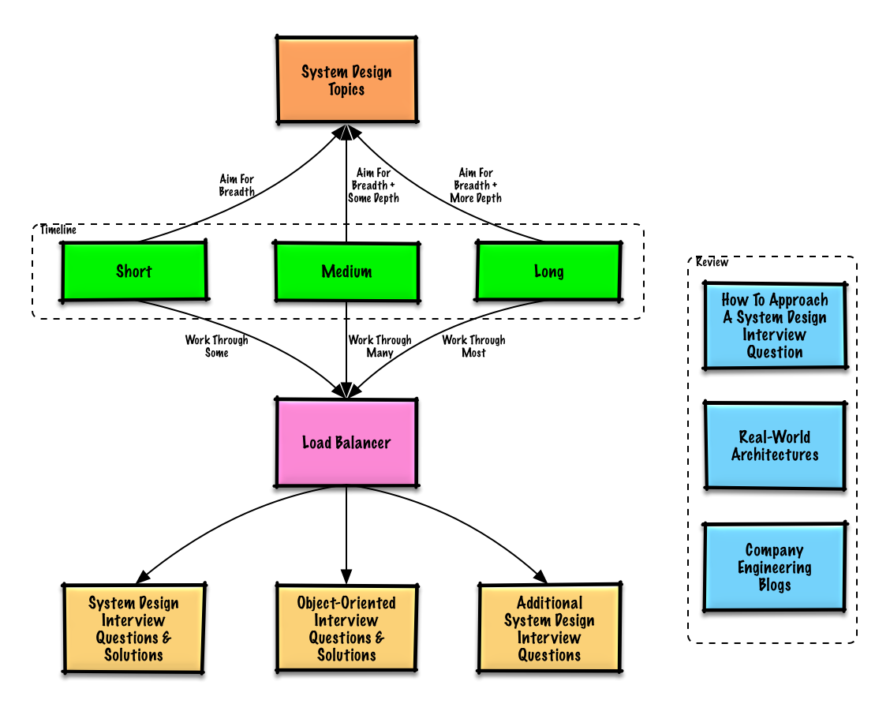
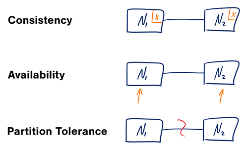

*[English](README.md) ∙ [日本語](README-ja.md) ∙ [简体中文](README-zh-Hans.md) ∙ [繁體中文](README-zh-TW.md) | [العَرَبِيَّة‎](https://github.com/donnemartin/system-design-primer/issues/170) ∙ [বাংলা](https://github.com/donnemartin/system-design-primer/issues/220) ∙ [Português do Brasil](https://github.com/donnemartin/system-design-primer/issues/40) ∙ [Deutsch](README-de.md) ∙ [ελληνικά](https://github.com/donnemartin/system-design-primer/issues/130) ∙ [עברית](https://github.com/donnemartin/system-design-primer/issues/272) ∙ [Italiano](https://github.com/donnemartin/system-design-primer/issues/104) ∙ [한국어](https://github.com/donnemartin/system-design-primer/issues/102) ∙ [فارسی](https://github.com/donnemartin/system-design-primer/issues/110) ∙ [Polski](https://github.com/donnemartin/system-design-primer/issues/68) ∙ [русский язык](https://github.com/donnemartin/system-design-primer/issues/87) ∙ [Español](https://github.com/donnemartin/system-design-primer/issues/136) ∙ [ภาษาไทย](https://github.com/donnemartin/system-design-primer/issues/187) ∙ [Türkçe](https://github.com/donnemartin/system-design-primer/issues/39) ∙ [tiếng Việt](https://github.com/donnemartin/system-design-primer/issues/127) ∙ [Français](https://github.com/donnemartin/system-design-primer/issues/250) | [Add Translation](https://github.com/donnemartin/system-design-primer/issues/28)*

**Helfe diesen Leitfaden zu [übersetzen](TRANSLATIONS.md)!**

# The System Design Primer

  
   

## Motivation

> Lerne wie man umfangreiche Systeme entwirft.
>
> Bereite dich auf ein System Design Interview vor

### Lerne wie man umfangreiche Systeme entwirft

Das Lernen wie man skalierbare Systeme entwrift wird dir helfen ein besserer Engineer zu werden.

System-Design ist ein breites Fach. Es gibt **viele Ressourcen verteilt über das ganze Internet** über System Design Prizipien.

Dieses Repo ist eine **organisierte Sammlung** der Ressourcen um dich beim Lernen wie man Systeme im großen Ausmaß baut zu unterstützen.

### Lerne von der Open-Source Gemeinschaft

Dies ist ein ständig aktualisiertes, Open-Source Projekt.

[Mitwirken](#mitwirken) ist willkommen!

### Bereite dich für das System Design Interview vor

Als Ergänzung zu Coding Interviews, System Design ist eine **erforderliche Komponente** im **technischen Interview Prozess** in viele Tech-Firmen.

**Übe häufige System Design Interview Fragen** und **vergleiche** deine Ergebnisse mit **Beispiellösungen**: Diskussionen, Code, und Diagramme.

Zusätzliche Themen für die Vorbereitung auf ein Coding Interview:
# TODO links überarbeiten
* [Studienführer](#studienfuhrer)
* [Wie man ein Interview Frage System-Design enträtselt](#how-to-approach-a-system-design-interview-question)
* [Interview Fragen System-Design, **mit Lösungen**](#system-design-interview-questions-with-solutions)
* [Interview Fragen Objektorientiertes Design, **mit Lösungen**](#object-oriented-design-interview-questions-with-solutions)
* [Zusätzliche Interview Fragen System-Design](#additional-system-design-interview-questions)

## Anki Karteikarten

  
   

Die hier zur Verfügung gestellten [Anki Karteikarten](https://apps.ankiweb.net/) nutzen das Konzept der verteilten Wiederholung. Damit sollst du beim Behalten der Schlüsselkonzepte des System Designs unterstützt werden.

* [Karteikarten System Design](https://github.com/donnemartin/system-design-primer/tree/master/resources/flash_cards/System%20Design.apkg)
* [Übungskarteikarten System Design](https://github.com/donnemartin/system-design-primer/tree/master/resources/flash_cards/System%20Design%20Exercises.apkg)
* [Übungskarteikarten Objektorientiertes Design](https://github.com/donnemartin/system-design-primer/tree/master/resources/flash_cards/OO%20Design.apkg)

Super um unterwegs zu üben!

### Coding Ressourcen: Interaktive Coding Herausforderungen

Auf der Suche nach Ressourcen um dich bei der Vorbereitung auf ein [**Coding Interview**](https://github.com/donnemartin/interactive-coding-challenges) vorzubereiten?

  
   

Schau dir das Partner Repo [**Interaktive Coding Herausforderungen**](https://github.com/donnemartin/interactive-coding-challenges) mit einem zusätzlichen Anki Deck an:

* [Coding Deck](https://github.com/donnemartin/interactive-coding-challenges/tree/master/anki_cards/Coding.apkg)

## Mitwirken

> Lerne von der Gemeinschaft.

Zögere nicht durch Pull Requests zu helfen:

* Fehler beheben
* Abschnitte verbessern
* Abschnitte hinzufügen
* [Übersetzen](https://github.com/donnemartin/system-design-primer/issues/28)

Inhalte die etwas verbessert werden können finden sich [in Entwicklung](#in-entwicklung).

Beachte die [Richtlinien zum Mitwirken](CONTRIBUTING.md).

## Inhaltsverzeichnis der System Design Themen

> Zusammenfassung verschiedener System Design Themen inklusive der Vor- und Nachteile  **Alles ist ein Kompromiss**.
>
> Jedes Kapitel beinhaltet Links zu vertiefenden Ressourcen.

  
   

* [System Design Themen: Starte hier](#system-desing-themen-starte-hier)
    * [Schritt 1: Schaue das Video über Skalierbarkeit an](#schritt-1-schaue-das-video-uber-skalierbarkeit-an)
    * [Schritt 2: Lese den Artikel zu Skalierbarkeit](#schritt-2-lese-den-artikel-zu-skalierbarkeit)
    * [Nächste Schritte](#nachste-schritte)
* [Leistung vs Skalierbarkeit](#leistung-vs-skalierbarkeit)
* [Latenz vs Durchsatz](#latenz-vs-durchsatz)
* [Verfügbarkeit vs Konsistenz](#verfugbarkeit-vs-konsistenz)
    * [Das CAP-Theorem](#das-cap-theorem)
        * [CP - Konsistenz und Ausfalltoleranz](#cp---konsistenz-und-ausfalltoleranz)
        * [AP - Verfügbarkeit und Ausfalltoleranz](#ap---verfugbarkeit-und-ausfalltoleranz)
* [Konsistenzklassen](#konsistenzklassen)
    * [Schwache Konsistenz](#schwache-konsistenz)
    * [Eventual Consistency](#eventual-consistency)
    * [Starke Konsistenz](#starke-konsistenz)
* [Verfügbarkeitsklassen](#verfugbarkeitsklassen)
    * [Fail-over](#fail-over)
    * [Replizierung](#replizierung)
    * [Verfügbarkeit in Zahlen](#verfugbarkeit-in-zahlen)
* [Domain name system](#domain-name-system)
* [Netzwerk für die Bereitstellung von Inhalten (CDN)](#netzwerk-fur-die-bereitstellung-von-inhalten)
    * [Push CDNs](#push-cdns)
    * [Pull CDNs](#pull-cdns)
* [Load balancer](#load-balancer)
    * [Aktiv-passiv](#aktiv-passiv)
    * [Aktiv-passiv](#aktiv-aktive)
    * [Schicht 4 load balancing](#schicht-4-load-balancing)
    * [Schicht 7 load balancing](#schicht-7-load-balancing)
    * [Horizontale Skalierung](#horizontale-skalierung)
* [Reverse proxy (web server)](#reverse-proxy-web-server)
    * [Load balancer vs reverse proxy](#load-balancer-vs-reverse-proxy)
* [Applikationsschicht](#applikationsschicht)
    * [Microservices](#microservices)
    * [Serviceerkennung](#serviceerkennung)
* [Datenbanken](#datenbanken)
    * [Relationale Datenbankmanagementsysteme (RDBMS)](#relationale-datenbankmanagementsysteme)
        * [Master-slave Replizierung](#master-slave-replizierung)
        * [Master-master Replizierung](#master-master-replizierung)
        * [Federation](#federation)
        * [Sharding](#sharding)
        * [Denormalisierung](#denormalisierung)
        * [SQL tuning](#sql-tuning)
    * [NoSQL](#nosql)
        * [Key-value Speicher](#key-value-speicher)
        * [Dokumentenspeicher](#dokumentenspeicher)
        * [Spaltenorientierte Datenbanken](#spaltenorientierte-datenbanken)
        * [Graph Datenbanken](#graph-datenbanken)
    * [SQL oder NoSQL](#sql-or-nosql)
* [Cache](#cache)
    * [Client caching](#client-caching)
    * [CDN caching](#cdn-caching)
    * [Web server caching](#web-server-caching)
    * [Datenbankcaching](#datenbankcaching)
    * [Applikationscaching](#applikationscaching)
    * [Caching auf Datenbank-Abfragelevel](#caching-auf-datenbank-abfragelevel)
    * [Caching auf Objektlevel](#caching-auf-objektlevel)
    * [Wann den Cache aktualisieren](#wann-den-cache-aktualisieren)
        * [Cache-aside](#cache-aside)
        * [Write-through](#write-through)
        * [Write-behind (write-back)](#write-behind-write-back)
        * [Refresh-ahead](#refresh-ahead)
* [Asynchronie](#asynchronie)
    * [Message queues](#message-queues)
    * [Task queues](#task-queues)
    * [Gegendruck](#gegendruck)
* [Kommunikationstechniken](#kommunikationstechniken)
    * [Transmission control protocol (TCP)](#transmission-control-protocol-tcp)
    * [User datagram protocol (UDP)](#user-datagram-protocol-udp)
    * [Remote procedure call (RPC)](#remote-procedure-call-rpc)
    * [Representational state transfer (REST)](#representational-state-transfer-rest)
* [Sicherheit](#sicherheit)
* [Appendix](#appendix)
    * [Zweierpotenzen](#zweierpotenzen)
    * [Latenzen die jeder Programmierer kennen sollte](#latenzen-die-jeder-programmierer-kennen-sollte)
    * [Zusätzliche System Design Interviewfragen](#zusatzliche-system-design-interviewfragen)
    * [Architekturen aus der echten Welt](#architekturen-aus-der-echten-welt)
    * [Unternehmensarchitekturen](#unternehmensarchitekturen)
    * [Engineering Blogs von Unternehmen](#engineering-blogs-von-unternehmen)
* [In Entwicklung](#in-entwicklung)
* [Danksagung](#danksagung)
* [Kontakt](#kontakt)
* [Lizenz](#lizenz)

## Studienführer

> Empfohlene Themen basierend auf deinen Zeithorizont zum Interview (kurz, mittel, lang).

**F: Muss ich für Interviews alles von hier wissen?**

**A: Nein, du musst nicht alles hier wissen um dich auf ein Interview vorzubereiten**.

Was man dich bei einem Interview frägt hängt von verschiedenen Variablen ab:

* Wie viel Erfahrung hast du
* Welchen technischen Hintergrund hast du
* Auf welche Position bewirbst du dich
* Bei welcher Firma ist das Interview
* Glück

Von erfahreneren Kandidaten wird allgemein mehr Wissen im Bereich System Design erwartet. Von Architekten oder Teamleitern wird mehr Wissen als vom individuellen Teammitglied erwartet. Moderne Tech-Unternehmen haben häufig multiple Vorstellungsrunden.

Beginne breit und fokussiere dich auf einige wenige Bereiche. Es hilft wenn man ein wenig über verschiedene Schlüsselthemen des System Designs. Passe den folgenden Studienführer basierend auf deinem Zeithorizont, deiner Erfahrung, die Position auf die du dich bewirbst und die Firma bei der du dich bewirbst, an.

* **Kurzer Zeithorizont** - Strebe ein **breites** Wissen über System Design Themen an. Übe mit dem Lösen **einiger** Interview Fragen.
* **Mittlerer Zeithorizont** - Strebe ein **breites** Wissen und **etwas** Tiefe über System Design Themen. Übe mit dem Lösen **vieler** Interview Fragen.
* **Langer Zeithorizont** - Strebe ein **breites** Wissen und **weit mehr** Tiefe über System Design Themen. Übe mit dem Lösen der **meisten** Interview Fragen.

# TODO Links überarbeiten

| | Kurzfristig | Mittelfristig | Langfristig |
|---|---|---|---|
| Lese dir [System Design Themen: Starte hier](#system-desing-themen-starte-hier) durch um ein breites Verständnis vom Zusammenspiel von Systemen zu bekommen | :+1: | :+1: | :+1: |
| Lese dir ein paar Artikel von [Engineering Blogs von Unternehmen](#engineering-blogs-von-unternehmen) zu den Firmen bei denen du dich vorstellst durch | :+1: | :+1: | :+1: |
| Lese dir ein paar Artikel von [Architekturen aus der echten Welt](#architekturen-aus-der-echten-welt) durch | :+1: | :+1: | :+1: |
| Beschäftige dich mit [How to approach a system design interview question](#how-to-approach-a-system-design-interview-question) | :+1: | :+1: | :+1: |
| Arbeite dich durch [System design interview questions with solutions](#system-design-interview-questions-with-solutions) | Einige | Viele | Alle |
| Arbeite dich durch [Object-oriented design interview questions with solutions](#object-oriented-design-interview-questions-with-solutions) | Einige | Viele | Alle |
| Beschäftige dich mit [Additional system design interview questions](#additional-system-design-interview-questions) | Einige | Viele | Alle |

## Wie ein System-Design Interview Frage zu angehen

> Wie ein System-Design Interview Frage zu anpacken.

Das System-Design Interview ist ein **unbegrenzt Gespräch**.  Du solltest es bestimmen.

Du kannst die folgende Schritte nutzen um die Diskussion zu leiten.  Um sich diese Vorgang zu festigen, arbeite dich durch [System design interview questions with solutions](#system-design-interview-questions-with-solutions) Abschnitt mit die folgende Schritte.

### Schritt 1: Umreiße Anwendungsfälle, Grenzen, und Annahmen

Sammelt Anforderungen und Weit das Problem aus.  Stelle Fragen um Anwendungsfälle und Grenzen zu klarmachen.  Diskutiert die Annahmen.

* Wer wird es nutzen?
* Wie werden sie es nutzen?
* Wie viele Nutzer wird es geben?
* Was macht das System?
* Was sind die Eingaben und Ausgaben des Systems?
* Wie viel Daten erwarten wir zu handeln?
* Wie viele Ersuchen erwarten wir pro Sekunde?
* Was ist die erwartete Lese-zu-Schreib-Verhältnis?

### Schritt 2: Schafft ein höher Entwurf

Umreiße ein höher Entwurf mit alle wichtige Komponenten.

* Skizziere die Hauptkomponenten und Verbindungen
* Gründen deine Ideen

### Schritt 3: Entwurft wichtige Komponenten

Einzutaucht in den Einzelheiten für jedes wichtiges Komponent.  Zum Beispiel, wenn du musst [design a url shortening service](solutions/system_design/pastebin/README.md), diskutiert:

* Ein hash des volles url generieren und speichern
    * [MD5](solutions/system_design/pastebin/README.md) und [Base62](solutions/system_design/pastebin/README.md)
    * Hash collisions
    * SQL or NoSQL
    * Database schema
* Ein hashed url zu volles url übersetzen
    * Database lookup
* API and Objektorientiertes Design

### Schritt 4: Skaliert den Entwurf

Identifiziert und addressiert Engpassen, angesichts der Grenzen.  Zum Beispiel, brauchst du die folgende um Probleme der Skalierung addressieren?

* Load Balancer
* Horizontale Skalierung
* Caching
* Datenbank Sharding

Diskutiert potentielle Lösungen und Abtauschen.  Alles ist ein Abtausch.  Addressiert Engpassen mit [principles of scalable system design](#index-of-system-design-topics).

### Back-of-the-envelope calculations

Du wirst vielleicht einige Schätzungen von Hand vorzunehmen gebeten.  Hinweist zu [Appendix](#appendix) um die folgende Ressourcen zu sehen:

* [Use back of the envelope calculations](http://highscalability.com/blog/2011/1/26/google-pro-tip-use-back-of-the-envelope-calculations-to-choo.html)
* [Powers of two table](#powers-of-two-table)
* [Latency numbers every programmer should know](#latency-numbers-every-programmer-should-know)

### Quellen und weiterführende Artikel

Schau die folgende Links um eine bessere Idee was erwarten zu haben:

* [How to ace a systems design interview](https://www.palantir.com/2011/10/how-to-rock-a-systems-design-interview/)
* [The system design interview](http://www.hiredintech.com/system-design)
* [Intro to Architecture and Systems Design Interviews](https://www.youtube.com/watch?v=ZgdS0EUmn70)
* [System design template](https://leetcode.com/discuss/career/229177/My-System-Design-Template)

## Verfügbarkeit vs Konsistenz

### Das CAP-Theorem

  
   
  <i><a href=http://robertgreiner.com/2014/08/cap-theorem-revisited>Source: CAP theorem revisited</a></i>

In einem verteilten System können lediglich zwei der folgenden Eigenschaften erfüllt werden:

* **Konsistenz** - Alle lesenden Zugriffe erhalten den neuesten Stand oder einen Fehler
* **Verfügbarkeit** - Alle Anfragen erhalten eine Antwort, jedoch ohne Garantie, dass diese den neuesten Informationsstand enthält
* **Ausfalltoleranz** - Das System arbeitet auch dann weiter, wenn es durch den Ausfall von Knoten partitioniert wird

*Netzwerke sind nie zuverlässig, weshalb du Ausfalltoleranz unterstützen und zwischen Konsistenz und Verfügbarkeit abwägen müssen wirst.*

#### CP - Konsistenz und Ausfalltoleranz

Das Warten auf die Antwort eines ausgefallenen Knotens kann zu einem Timeout-Fehler führen. CP ist eine gute Wahl, wenn deine Geschäftsanforderungen atomare Lese- und Schreibzugriffe fordern.

#### AP - Verfügbarkeit und Ausfalltoleranz

Antworten liefern die neueste verfügbare Version der Daten auf einem Knoten, wobei es sich nicht um die tatsächlich neueste Version handeln muss. Schreiboperationen können eine Weile brauchen, um sich auf die ausgefallenen Knoten zu verbreiten, sobald sie wieder verfügbar sind.

AP ist eine gute Wahl, wenn die Geschäftsanforderungen [Eventual Consistency](#eventual-consistency) erlauben oder wenn das System auch trotz Fehlern von Außerhalb weiterarbeiten muss.

### Quellen und weiterführende Artikel

* [CAP theorem revisited](http://robertgreiner.com/2014/08/cap-theorem-revisited/)
* [A plain english introduction to CAP theorem](http://ksat.me/a-plain-english-introduction-to-cap-theorem)
* [CAP FAQ](https://github.com/henryr/cap-faq)
* [The CAP theorem](https://www.youtube.com/watch?v=k-Yaq8AHlFA)
