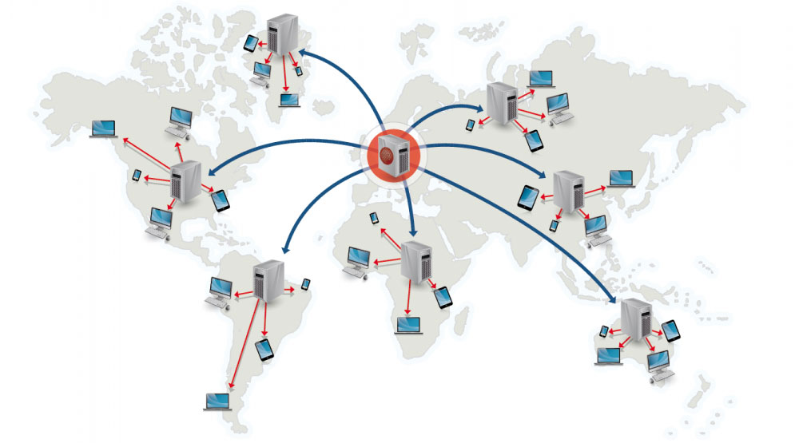
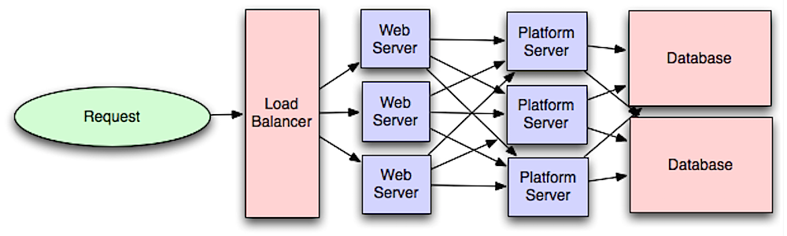
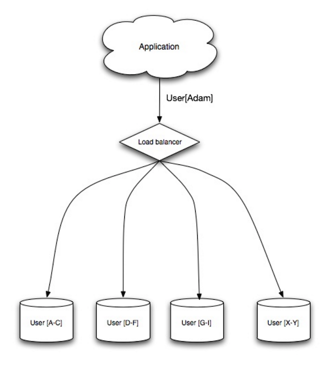
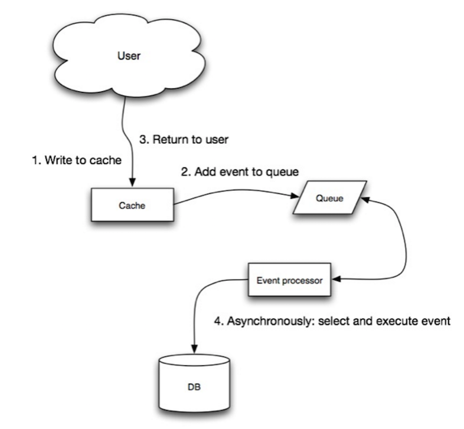

*[English](README.md) ∙ [日本語](README-ja.md) ∙ [简体中文](README-zh-Hans.md) ∙ [繁體中文](README-zh-TW.md) | [العَرَبِيَّة‎](https://github.com/donnemartin/system-design-primer/issues/170) ∙ [বাংলা](https://github.com/donnemartin/system-design-primer/issues/220) ∙ [Português do Brasil](https://github.com/donnemartin/system-design-primer/issues/40) ∙ [Deutsch](https://github.com/donnemartin/system-design-primer/issues/186) ∙ [ελληνικά](https://github.com/donnemartin/system-design-primer/issues/130) ∙ [עברית](https://github.com/donnemartin/system-design-primer/issues/272) ∙ [Italiano](https://github.com/donnemartin/system-design-primer/issues/104) ∙ [한국어](https://github.com/donnemartin/system-design-primer/issues/102) ∙ [فارسی](https://github.com/donnemartin/system-design-primer/issues/110) ∙ [Polski](https://github.com/donnemartin/system-design-primer/issues/68) ∙ [русский язык](https://github.com/donnemartin/system-design-primer/issues/87) ∙ [Español](https://github.com/donnemartin/system-design-primer/issues/136) ∙ [ภาษาไทย](https://github.com/donnemartin/system-design-primer/issues/187) ∙ [Türkçe](https://github.com/donnemartin/system-design-primer/issues/39) ∙ [tiếng Việt](https://github.com/donnemartin/system-design-primer/issues/127) ∙ [Français](https://github.com/donnemartin/system-design-primer/issues/250) | [Add Translation](https://github.com/donnemartin/system-design-primer/issues/28)*

**Helfen Sie bei der [Übersetzung](TRANSLATIONS.md) dieses Leitfadens!**

# The System Design Primer (System Design Fibel)

<p align="center">
  
  <br/>
</p>

## Motivation

> Lerne wie man groß skalierte Systeme entwirft.
>
> Vorbereitung für das Systemdesign Interview.

### Lerne wie man groß skalierte Systeme entwirft.

Während Sie lernen, wie Sie skalierbare Systeme entwerfen, werden Sie zum besseren Ingenieur.

Systemdesign ist ein breites Thema. Es ist eine **große Menge an Ressourcen verteilt im ganzen Web** basierend auf dem Thema der Systemdesign Prinzipien.

Dieses Repo ist eine **organisierte Ansammlung** der Ressourcen und wird Ihnen dabei helfen skalierte Systeme zu erlernen.

### Lernen Sie von der Open Source Community.

Dies ist ein ständig aktualisiertes, quelloffenes Projekt.

[Hilfe zu Beiträgen](#Beitragen) ist erwünscht!

### Vorbereitung für das Systemdesign Interview.


Neben der Interviews zur Softwareentwicklung ist das Systemdesign bei vielen Technologieunternehmen ein **erforderlicher Bestandteil** des **technischen Interviewprozesses**.

**Üben Sie allgemeine Interviewfragen zum Systemdesign** und vergleichen Sie Ihre Ergebnisse mit **Beispiellösungen**: Diskussionen, Code und Diagramme.

Weitere Themen für die Interviewvorbereitung:

* [Studienführer](#Studienführer)
* [Wie man sich für eine Interviewfrage zum Systemdesign vorbereitet](#Wie-man-sich-für-eine-Interviewfrage-zum-Systemdesign-vorbereitet)
* [Interviewfragen zum Systemdesign, **mit Lösungen**](#Systemdesign-Interview-Fragen-mit-Lösungen)
* [Fragen zu Objektorientiertem Design, **mit Lösungen**](#Objektorientierte-Design-Interview-Fragen-mit-Lösungen)
* [Zusätzliche Fragen zum Systemdesign Interview](#Zusätzliche-Fragen-zum-Systemdesign-Interview)

## Anki flashcards

<p align="center">
  
  <br/>
</p>

Die Bereitgestellten [Anki flashcard decks](https://apps.ankiweb.net/) verwenden "spaced repetition" um sich wichtige Systemdesign Konzepte einzuprägen.

* [Systemdesign Deck](https://github.com/donnemartin/system-design-primer/tree/master/resources/flash_cards/System%20Design.apkg)
* [Systemdesign Übungen Deck](https://github.com/donnemartin/system-design-primer/tree/master/resources/flash_cards/System%20Design%20Exercises.apkg)
* [Objektorientiertes Design Übungen Deck](https://github.com/donnemartin/system-design-primer/tree/master/resources/flash_cards/OO%20Design.apkg)

Ideal für den Einsatz unterwegs.

### Programmier Ressourcen: Interaktive Programmierübungen

Suchen Sie nach Ressourcen, die Ihnen bei der Vorbereitung auf das [**Coding Interview**](https://github.com/donnemartin/interactive-coding-challenges) helfen?

<p align="center">
  
  <br/>
</p>

Schauen Sie sich das Schwester-Repo [**Interaktive Coding Challenges**](https://github.com/donnemartin/interactive-coding-challenges) an, das ein zusätzliches Anki-Deck enthält:

* [Programmier Deck](https://github.com/donnemartin/interactive-coding-challenges/tree/master/anki_cards/Coding.apkg)

## Beitragen

> Lernen Sie von der Community.

Hilfe erwünscht, um beizutragen können Sie pull requests einreichen:

* Fehler beheben
* Abschnitte verbessern
* Neue Abschnitte hinzufügen
* [Übersetzen](https://github.com/donnemartin/system-design-primer/issues/28)

Inhalte, die noch überarbeitet werden müssen werden [in Entwicklung](#In-Entwicklung) eingestellt.

Beachten Sie die [Beitragsrichtlinien](CONTRIBUTING.md).

## Index der Systemdesign Themen

> Zusammenfassung verschiedener Systemdesign Themen, einschließlich der Vor- und Nachteile.  **Alles ist ein Kompromiss**.
>
> Jeder Abschnitt enthält Links zu weiterführenden Ressourcen.

<p align="center">
  
  <br/>
</p>

* [Systemdesign Themen: hier beginnen](#Systemdesign-Themen-hier-beginnen)
    * [Schritt 1: Skalierbarkeits-Videovorlesung](#Schritt-1-Skalierbarkeits-Videovorlesung)
    * [Schritt 2: Artikel zur Skalierbarkeit lesen](#Schritt-2-Artikel-zur-Skalierbarkeit-lesen)
    * [Nächste Schritte](#Nächste-Schritte)
* [Leistung vs. Skalierbarkeit](#Leistung-vs-Skalierbarkeit)
* [Latenz vs. Durchsatz](#Latenz-vs-Durchsatz)
* [Verfügbarkeit vs. Konsistenz](#Verfügbarkeit-vs-Konsistenz)
    * [CAP Theorem](#CAP-Theorem)
        * [CP - Konsistenz und Partitionstoleranz](#CP---Konsistenz-und-Partitionstoleranz)
        * [AP - Verfügbarkeits und Partitionstoleranz](#AP---Verfügbarkeits-und-Partitionstoleranz)
* [Konsistenz Muster](#Konsistenz-Muster)
    * [Schwache Konsistenz](#Schwache-Konsistenz)
    * [Eventuelle Konsistenz](#Eventuelle-Konsistenz)
    * [Starke Konsistenz](#Starke-Konsistenz)
* [Verfügbarkeits Muster](#Verfügbarkeits-Muster)
    * [Ausfallsicherung](#Ausfallsicherung)
    * [Replikation](#Replikation)
    * [Verfügbarkeit in Zahlen](#Verfügbarkeit-in-Zahlen)
* [Domain Namen System](#Domain-Namen-System)
* [Netzwerk zur Bereitstellung von Inhalten](#Kontent-distributions-Netzwerk)
    * [Push CDNs](#push-cdns)
    * [Pull CDNs](#pull-cdns)
* [Lastverteilung](#load-balancer)
    * [Aktiv-Passiv](#Aktiv-Passiv)
    * [Aktiv-Aktiv](#Aktiv-Aktiv)
    * [Schicht 4 lastverteilung](#Schicht-4-Lastverteilung)
    * [Schicht 7 lastverteilung](#Schicht-4-Lastverteilung)
    * [Horizontales skalieren](#Horizontales-skalieren)
* [Umkehr Proxy Web Server](#Umkehr-Proxy-Web-Server)
    * [Lastverteilung vs Umkehr Proxy](#Lastverteilung-vs-Umkehr-Proxy)
* [Applikatins Schicht](#Applikatins-Schicht)
    * [Mikrodienste](#Mikrodienste)
    * [Service Discovery](#service-discovery)
* [Datenbanken](#Datenbanken)
    * [Relationales Datenbank Management System (RDBMS)](#Relationales-Datenbank-Management-System-rdbms)
        * [Master-Slave Replikation](#Master-Slave-Replikation)
        * [Master-Master Replikation](#Master-Master-Replikation)
        * [Föderation](#Föderation)
        * [Fragmentierung](#Fragmentierung)
        * [Denormalisierung](#Denormalisierung)
        * [SQL Abstimmung](#SQL-Abstimmung)
    * [NoSQL](#nosql)
        * [Schlüsselwertspeicher](#Schlüsselwertspeicher)
        * [Dokumentspeicher](#Dokumentspeicher)
        * [Spaltenorientierte Datenbank](#Spaltenorientierte-Datenbank)
        * [Diagramm Datenbank](#Diagramm-Datenbank)
    * [SQL oder NoSQL](#SQL-oder-NoSQL)
* [Zwischenspeicher - Cache](#Zwischenspeicher---Cache)
    * [Client Zwischenspeicher](#Client-Zwischenspeicher)
    * [CDN Zwischenspeicher](#CDN-Zwischenspeicher)
    * [Web Server Zwischenspeicher](#Web-Server-Zwischenspeicher)
    * [Datanbank Zwischenspeicher](#Datanbank-Zwischenspeicher)
    * [Anwendungs Zwischenspeicher](#Anwendungs-Zwischenspeicher)
    * [Zwischenspeicherung auf der Ebene der Datenbankabfrage](#Zwischenspeicherung-auf-der-Ebene-der-Datenbankabfrage)
    * [Zwischenspeicher auf Objekt Ebene](#Zwischenspeicher-auf-Objekt-Ebene)
    * [Wann wird der Zwischenspeicher aktualisiert?](#Wann-wird-der-Zwischenspeicher-aktualisiert?)
        * [Zwischenspeicher Auslagerung](#Zwischenspeicher-Auslagerung)
        * [Durchschreiben](#Durchschreiben)
        * [Hinterher schreiben (write-back)](#Hinterher-schreiben-write-back)
        * [Aktualisieren im Voraus](#Aktualisieren-im-Voraus)
* [Asynchronität](#Asynchronität)
    * [Nachrichtenwarteschlangen](#Nachrichtenwarteschlangen)
    * [Aufgabenwarteschlangen](#task-queues)
    * [Gegendruck](#Kommunikation)
* [Kommunikation](#Kommunikation)
    * [Übertragungskontrollprotokoll (TCP)](#Übertragungskontrollprotokoll-TCP)
    * [Benutzer Datagramm Protokoll (UDP)](#Benutzer-Datagramm-Protokoll-UDP)
    * [Ferngesteuerter Prozeduraufruf (RPC)](#Ferngesteuerter-Prozeduraufruf-RPC)
    * [Representative Zustandsübertragung (REST)](#Representative-Zustandsübertragung-rest)
* [Sicherheit](#Sicherheit)
* [Anhang](#Anhang)
    * [Tabelle der Zweierpotenzen](#powers-of-two-table)
    * [Latenzzeiten, die jeder Programmierer kennen sollte](#Latenzzeiten-die-jeder-Programmierer-kennen-sollte])
    * [Zusätzliche Fragen zum Systemdesign Interview](#Zusätzliche-Fragen-zum-Systemdesign-Interview)
    * [Anwendungs Architekturen](#Anwendungs-Architekturen)
    * [Unternehmensarchitekturen](#Unternehmensarchitekturen)
    * [Unternehmensblogs zur Technik](#Unternehmensblogs-zur-Technik)
* [In Entwicklung](#In-Entwicklung)
* [Credits](#credits)
* [Kontakt Info](#Kontakt-Info)
* [Lizenz](#Lizenz)

## Studienführer

> Vorgeschlagene Themen, die Sie je nach Zeitplan für Ihr Vorstellungsgespräch (kurz, mittel, lang) durchgehen sollten.


**Q: Muss ich für Vorstellungsgespräche alles wissen, was hier steht?**

**A: Nein, Sie müssen nicht alles wissen, was hier steht, um sich auf das Vorstellungsgespräch vorzubereiten**.

Was Sie in einem Vorstellungsgespräch gefragt werden, hängt von verschiedenen Faktoren ab, wie z. B.:

* Wie viel Erfahrung Sie haben
* Welchen technischen Hintergrund Sie haben
* Für welche Stellen Sie sich bewerben
* Bei welchen Unternehmen Sie sich bewerben
* Glück

Von erfahreneren Bewerbern wird im Allgemeinen erwartet, dass sie mehr über das Systemdesign wissen.  Von Architekten oder Projektleitern kann man erwarten, dass sie mehr wissen als einzelne Mitarbeiter.  Top-Tech-Unternehmen werden wahrscheinlich eine oder mehrere Design-Interview-Runden durchführen.

Beginnen Sie mit einem breiten Spektrum und vertiefen Sie es in einigen Bereichen.  Es ist hilfreich, ein wenig über verschiedene Schlüsselthemen des Systemdesigns zu wissen.  Passen Sie den folgenden Leitfaden an Ihren Zeitplan, Ihre Erfahrung, die Stellen, für die Sie sich bewerben, und die Unternehmen, bei denen Sie sich bewerben, an.

* **Kurzer Zeitplan** - Streben Sie nach **Breite** bei Systemdesign-Themen.  Üben Sie durch das Lösen **einiger** Interviewfragen.
* **Mittlere Zeitspanne** - Streben Sie eine **Breite** und **einige Tiefe** bei Systemdesign-Themen an.  Üben Sie durch das Lösen von **vielen** Interviewfragen.
* **Langer Zeitrahmen** - Streben Sie eine **Breite** und **mehr Tiefe** bei Systemdesign-Themen an.  Üben Sie durch das Lösen der **meisten** Interviewfragen.

| | Kurz | Mittel | Lang |
|---|---|---|---|
| Lesen Sie sich die [Systemdesign Themen](#Index-der-Systemdesign-Themen) tdurch, um ein umfassendes Verständnis der Funktionsweise von Systemen zu erlangen. | :+1: | :+1: | :+1: |
| Lesen Sie einige Artikel in den [Unternehmensblogs zur Technik](#Unternehmensblogs-zur-Technik) für die Unternehmen, bei denen Sie sich bewerben | :+1: | :+1: | :+1: |
| Lesen Sie einige der [Anwendungs Architekturen](#Anwendungs-Architekturen) | :+1: | :+1: | :+1: |
| Übersicht [Wie man sich für eine Interviewfrage zum Systemdesign vorbereitet](#Wie-man-sich-für-eine-Interviewfrage-zum-Systemdesign-vorbereitet) | :+1: | :+1: | :+1: |
| Arbeiten Sie durch [Systemdesign Interview Fragen mit Lösungen](#Systemdesign-Interview-Fragen-mit-Lösungen) | Einige | Viele | Großteil |
| Arbeiten Sie durch [objektorientierte Design-Interview-Fragen mit Lösungen](#Objektorientierte-Design-Interview-Fragen-mit-Lösungen) | Einige | Viele | Großteil |
| Überprüfung [Zusätzliche Fragen zum Systemdesign Interview](#Zusätzliche-Fragen-zum-Systemdesign-Interview) | Einige | Viele | Großteil |

## Wie man sich für eine Interviewfrage zum Systemdesign vorbereitet

> Wie man eine Frage im Vorstellungsgespräch zum Systemdesign angeht.

Das Systemdesign Gespräch ist ein **Gespräch mit offenem Ausgang**.  Es wird von Ihnen erwartet, dass Sie es führen.

Sie können die folgenden Schritte als Leitfaden für die Diskussion verwenden.  Um diesen Prozess zu festigen, arbeiten Sie den Abschnitt [Systemdesign-Interview-Fragen mit Lösungen](#Systemdesign-Interview-Fragen-mit-Lösungen) anhand der folgenden Schritte durch.

### Schritt 1: Skizzieren Sie Anwendungsfälle, Beschränkungen und Annahmen

Anforderungen sammeln und das Problem erfassen.  Stellen Sie Fragen zur Klärung von Anwendungsfällen und Beschränkungen.  Diskutieren Sie Annahmen.

* Wer wird es nutzen?
* Wie werden sie es nutzen?
* Wie viele Benutzer gibt es?
* Was tut das System?
* Was sind die Ein- und Ausgaben des Systems?
* Wie viele Daten werden voraussichtlich verarbeitet?
* Wie viele Anfragen pro Sekunde sind zu erwarten?
* Wie ist das erwartete Verhältnis zwischen Lese- und Schreibvorgängen?

### Schritt 2: Erstellen eines übergeordneten Entwurfs

Skizzieren Sie einen Entwurf auf hoher Ebene mit allen wichtigen Komponenten.


* Skizzieren Sie die wichtigsten Komponenten und Verbindungen.
* Begründen Sie Ihre Ideen

### Schritt 3: Entwerfen Sie die Kernkomponenten

Gehen Sie für jede Kernkomponente ins Detail. Wenn Sie zum Beispiel gebeten wurden, [einen Dienst zur Verkürzung von URLs zu entwerfen](solutions/system_design/pastebin/README.md), diskutieren Sie:

* Generierung und Speicherung eines hash der vollständigen Url
    * [MD5](solutions/system_design/pastebin/README.md) and [Base62](solutions/system_design/pastebin/README.md)
    * Hash-Kollisionen
    * SQL oder NoSQL
    * Datenbankschema
* Übersetzen einer Hash-Url in die vollständige Url
    * Datenbank-Lookup
* API und objektorientierter Entwurf

### Schritt 4: Skalierung des Entwurfs

Identifizieren Sie Engpässe und beheben Sie diese, wenn die Einschränkungen dies zulassen.  Benötigen Sie beispielsweise die folgenden Komponenten, um Skalierungsprobleme zu beheben?

* Lastverteiler
* Horizontale Skalierung
* Caching
* Database sharding

Diskutieren Sie mögliche Lösungen und Kompromisse.  Alles ist ein Kompromiss.  Beheben Sie Engpässe mit Hilfe von [Prinzipien des skalierbaren Systemdesigns](#Index-der-Systemdesign-Themen).

### Back-of-the-envelope Berechnungen

Möglicherweise werden Sie aufgefordert, einige Schätzungen von Hand vorzunehmen.  Im [Anhang](#Anhang) finden Sie die folgenden Ressourcen:

* [Use back of the envelope calculations](http://highscalability.com/blog/2011/1/26/google-pro-tip-use-back-of-the-envelope-calculations-to-choo.html)
* [Tabelle der Zweierpotenzen](#Tabelle-der-Zweierpotenzen)
* [Latenzzeiten, die jeder Programmierer kennen sollte](#Latenzzeiten,-die-jeder-Programmierer-kennen-sollte)

### Quelle(n) und weiterführende Literatur

Schauen Sie sich die folgenden Links an, um eine bessere Vorstellung davon zu bekommen, was Sie erwartet:

* [How to ace a systems design interview](https://www.palantir.com/2011/10/how-to-rock-a-systems-design-interview/)
* [The system design interview](http://www.hiredintech.com/system-design)
* [Intro to Architecture and Systems Design Interviews](https://www.youtube.com/watch?v=ZgdS0EUmn70)
* [System design template](https://leetcode.com/discuss/career/229177/My-System-Design-Template)

## Systemdesign Interview Fragen mit Lösungen
> Allgemeine Fragen zum Systemdesign mit Diskussionsbeispielen, Code und Diagrammen.
>
> Lösungen, die mit dem Inhalt des Ordners `solutions/` verknüpft sind.

| Frage | |
|---|---|
| Entwerfen Sie Pastebin.com (or Bit.ly) | [Lösung](solutions/system_design/pastebin/README.md) |
| Entwerfen Sie die Twitter-Timeline und die Suche (oder den Facebook-Feed und die Suche) | [Lösung](solutions/system_design/twitter/README.md) |
| Entwerfen Sie einen Webcrawler | [Lösung](solutions/system_design/web_crawler/README.md) |
| Entwerfen Sie Mint.com | [Lösung](solutions/system_design/mint/README.md) |
| Entwerfen Sie die Datenstrukturen für ein soziales Netzwerk | [Lösung](solutions/system_design/social_graph/README.md) |
| Entwurf eines Key-Value-Speichers für eine Suchmaschine | [Lösung](solutions/system_design/query_cache/README.md) |
| Gestaltung der Amazon-Verkaufsrangliste nach Kategorie | [Lösung](solutions/system_design/sales_rank/README.md) |
| Entwerfen Sie ein System, das für Millionen von Benutzern auf AWS skalierbar ist. | [Lösung](solutions/system_design/scaling_aws/README.md) |
| Eine Frage zum Systemdesign hinzufügen | [Beitragen](#Beitragen) |

### Entwerfen Sie Pastebin.com (or Bit.ly)

[Übung und Lösung ansehen](solutions/system_design/pastebin/README.md)


### Entwerfen Sie die Twitter-Timeline und die Suche (oder den Facebook-Feed und die Suche)

[Übung und Lösung ansehen](solutions/system_design/twitter/README.md)


### Entwerfen Sie einen Webcrawler

[Übung und Lösung ansehen](solutions/system_design/web_crawler/README.md)


### Entwerfen Sie Mint.com

[Übung und Lösung ansehen](solutions/system_design/mint/README.md)


### Entwerfen Sie die Datenstrukturen für ein soziales Netzwerk

[Übung und Lösung ansehen](solutions/system_design/social_graph/README.md)


### Entwurf eines Key-Value-Speichers für eine Suchmaschine

[Übung und Lösung ansehen](solutions/system_design/query_cache/README.md)


### Gestaltung der Amazon-Verkaufsrangliste nach Kategorie

[Übung und Lösung ansehen](solutions/system_design/sales_rank/README.md)


### Entwerfen Sie ein System, das für Millionen von Benutzern auf AWS skalierbar ist.

[Übung und Lösung ansehen](solutions/system_design/scaling_aws/README.md)


## Objektorientierte Design Interview Fragen mit Lösungen

> Allgemeine Fragen zum objektorientierten Design mit Diskussionsbeispielen, Code und Diagrammen.
>
> Lösungen, die mit dem Inhalt des Ordners `solutions/` verknüpft sind.

>**Hinweis: Dieser Abschnitt befindet sich in der Entwicklung**

| Frage | |
|---|---|
| Entwurf einer Hash Map | [Lösung](solutions/object_oriented_design/hash_table/hash_map.ipynb)  |
| Entwurf eines vor Kurzem benutzten Caches  | [Lösung](solutions/object_oriented_design/lru_cache/lru_cache.ipynb)  |
| Entwurf eines Callcenters | [Lösung](solutions/object_oriented_design/call_center/call_center.ipynb)  |
| Entwurf eines Kartenspiels | [Lösung](solutions/object_oriented_design/deck_of_cards/deck_of_cards.ipynb)  |
| Entwurf eines Parkplatzes | [Lösung](solutions/object_oriented_design/parking_lot/parking_lot.ipynb)  |
| Entwurf eines Chatservers  | [Lösung](solutions/object_oriented_design/online_chat/online_chat.ipynb)  |
| Entwurf eines kreisförmigen Arrays | [Beitragen](#Beitragen)  |
| Hinzufügen einer objektorientierten Entwurfsfrage | [Beitragen](#Beitragen) |

## Systemdesign Themen: hier beginnen

Sind Sie neu im Systemdesign?

Zunächst benötigen Sie ein grundlegendes Verständnis der allgemeinen Prinzipien, um zu erfahren, was sie sind, wie sie verwendet werden und welche Vor- und Nachteile sie haben.

### Schritt 1: Skalierbarkeits-Videovorlesung

[Scalability Lecture at Harvard](https://www.youtube.com/watch?v=-W9F__D3oY4)

* Behandelte Themen:
    * Vertikale Skalierung
    * Horizontale Skalierung
    * Caching
    * Lastausgleich
    * Datenbankreplikation
    * Datenbank-Partitionierung

### Schritt 2: Artikel zur Skalierbarkeit lesen

[Skalierbarkeit](http://www.lecloud.net/tagged/scalability/chrono)

* Behandelte Themen:
    * [Klones](http://www.lecloud.net/post/7295452622/scalability-for-dummies-part-1-clones)
    * [Datenbanken](http://www.lecloud.net/post/7994751381/scalability-for-dummies-part-2-database)
    * [Caches](http://www.lecloud.net/post/9246290032/scalability-for-dummies-part-3-cache)
    * [Asynchronität](http://www.lecloud.net/post/9699762917/scalability-for-dummies-part-4-asynchronism)

### Nächste Schritte

Als Nächstes werden wir uns die Kompromisse auf höchster Ebene ansehen:

* **Leistung** gegen **Skalierbarkeit**
* **Latenz** vs. **Durchsatz**
* **Verfügbarkeit** vs. **Konsistenz**

Denken Sie daran, dass **alles ein Kompromiss** ist.

Danach werden wir uns mit spezifischeren Themen wie DNS, CDNs und Lastverteilern beschäftigen.

## Leistung vs. Skalierbarkeit

Ein Dienst ist **skalierbar**, wenn er die **Leistung** proportional zu den hinzugefügten Ressourcen erhöht. Im Allgemeinen bedeutet eine Leistungssteigerung, dass mehr Arbeitseinheiten bedient werden, aber es kann auch darum gehen, größere Arbeitseinheiten zu bewältigen, z. B. wenn Datensätze wachsen.<sup><a href=http://www.allthingsdistributed.com/2006/03/a_word_on_scalability.html>1</a></sup>

Leistung und Skalierbarkeit können auch anders betrachtet werden:

* Wenn Sie ein **Leistungsproblem** haben, ist Ihr System für einen einzelnen Benutzer langsam.
* Wenn Sie ein **Skalierbarkeit**-Problem haben, ist Ihr System für einen einzelnen Benutzer schnell, aber unter hoher Last langsam.

### Quelle(n) und weiterführende Literatur

* [Ein Wort zur Skalierbarkeit](http://www.allthingsdistributed.com/2006/03/a_word_on_scalability.html)
* [Skalierbarkeit, Verfügbarkeit, Stabilität, Muster](http://www.slideshare.net/jboner/scalability-availability-stability-patterns/)

## Latenz vs. Durchsatz

**Latenz** ist die Zeit, die benötigt wird, um eine Aktion durchzuführen oder ein Ergebnis zu erzielen.

**Durchsatz** ist die Anzahl solcher Aktionen oder Ergebnisse pro Zeiteinheit.

Im Allgemeinen sollten Sie einen **maximalen Durchsatz** bei **akzeptabler Latenz** anstreben.

### Quelle(n) und weiterführende Literatur

* [Latenz vs. Durchsatz verstehen](https://community.cadence.com/cadence_blogs_8/b/sd/archive/2010/09/13/understanding-latency-vs-throughput)

## Verfügbarkeit vs. Konsistenz

### CAP-Theorem

### Quelle(n) und weiterführende Literatur

<p align="center">
  
  <br/>
  <i><a href=http://robertgreiner.com/2014/08/cap-theorem-revisited>Quelle: Das CAP-Theorem überarbeitet</a></i>
</p>

In einem verteilten Computersystem können Sie nur zwei der folgenden Garantien unterstützen:

* **Konsistenz** - Jeder Lesevorgang erhält den letzten Schreibvorgang oder einen Fehler
* **Verfügbarkeit** - Jede Anfrage erhält eine Antwort, ohne Garantie, dass diese die aktuellste Version der Information enthält
* **Partitionstoleranz** - Das System arbeitet trotz willkürlicher Partitionierung aufgrund von Netzwerkausfällen weiter

*Netzwerke sind nicht zuverlässig, daher müssen Sie die Partitionstoleranz unterstützen.  Sie müssen einen Software-Kompromiss zwischen Konsistenz und Verfügbarkeit eingehen.

#### CP - Konsistenz und Partitionstoleranz

Übersetzt mit www.DeepL.com/Translator (kostenlose Version)

Das Warten auf eine Antwort vom partitionierten Knoten kann zu einem Timeout-Fehler führen.  CP ist eine gute Wahl, wenn Ihre Geschäftsanforderungen atomare Lese- und Schreibvorgänge erfordern.

#### AP - Verfügbarkeits und Partitionstoleranz

Antworten geben die am leichtesten verfügbare Version der Daten zurück, die auf jedem Knoten verfügbar ist, was nicht unbedingt die neueste ist.  Bei Schreibvorgängen kann es einige Zeit dauern, bis die Daten übertragen werden, wenn die Partition aufgelöst ist.

AP ist eine gute Wahl, wenn die geschäftlichen Anforderungen eine [eventuelle Konsistenz](#Eventuelle-Konsistenz) zulassen oder wenn das System trotz externer Fehler weiterarbeiten muss.

### Quelle(n) und weiterführende Literatur

* [Das CAP-Theorem überarbeitet](http://robertgreiner.com/2014/08/cap-theorem-revisited/)
* [Eine einfache englische Einführung in das CAP-Theorem](http://ksat.me/a-plain-english-introduction-to-cap-theorem)
* [CAP FAQ](https://github.com/henryr/cap-faq)
* [Das CAP-Theorem](https://www.youtube.com/watch?v=k-Yaq8AHlFA)

## Konsistenz Muster

Bei mehreren Kopien der gleichen Daten stehen wir vor der Frage, wie wir sie synchronisieren können, damit die Clients eine konsistente Sicht auf die Daten haben.  Erinnern Sie sich an die Definition von Konsistenz aus dem [CAP-Theorem](#CAP-Theorem) - Jeder Lesevorgang erhält den letzten Schreibvorgang oder einen Fehler.

### Schwache Konsistenz

Nach einem Schreibvorgang kann es sein, dass die Lesenden ihn nicht sehen.  Es wird ein Best-Effort-Ansatz verfolgt.

Dieser Ansatz findet sich in Systemen wie Memcached.  Schwache Konsistenz eignet sich gut für Echtzeitanwendungen wie VoIP, Video-Chat und Multiplayer-Spiele in Echtzeit.  Wenn Sie z. B. ein Telefongespräch führen und den Empfang für einige Sekunden unterbrechen, hören Sie bei Wiederherstellung der Verbindung nicht, was während des Verbindungsverlustes gesprochen wurde.

### Eventuelle Konsistenz

Nach einem Schreibvorgang werden die Daten schließlich gelesen (normalerweise innerhalb von Millisekunden). Die Daten werden asynchron repliziert.

Dieser Ansatz findet sich in Systemen wie DNS und E-Mail. Eventuelle Konsistenz funktioniert gut in hochverfügbaren Systemen.

### Starke Konsistenz

Nach einem Schreibvorgang werden die Daten gelesen.  Die Daten werden synchron repliziert.

Dieser Ansatz findet sich in Dateisystemen und RDBMS.  Starke Konsistenz funktioniert gut in Systemen, die Transaktionen benötigen.

### Quelle(n) und weiterführende Literatur

* [Rechenzentrumsübergreifende Transaktionen](http://snarfed.org/transactions_across_datacenters_io.html)

## Verfügbarkeits Muster

Es gibt zwei sich ergänzende Muster zur Unterstützung der Hochverfügbarkeit: **Fail-over** und **Replikation**.

### Ausfallsicherung

#### Aktiv-Passiv

Bei aktiv-passivem Failover werden Heartbeats zwischen dem aktiven und dem passiven Server im Standby-Modus gesendet.  Wird der Heartbeat unterbrochen, übernimmt der passive Server die IP-Adresse des aktiven und nimmt den Dienst wieder auf.

Die Länge der Ausfallzeit hängt davon ab, ob der passive Server bereits im "heißen" Standby-Modus läuft oder ob er aus dem "kalten" Standby-Modus gestartet werden muss.  Nur der aktive Server wickelt den Datenverkehr ab.

Aktiv-Passiv Failover kann auch als Master-Slave Failover bezeichnet werden.

#### Aktiv-Aktiv

Bei aktiv-aktiv verwalten beide Server den Datenverkehr und verteilen die Last auf beide.

Wenn die Server der Öffentlichkeit zugänglich sind, muss das DNS die öffentlichen IPs beider Server kennen.  Sind die Server intern ausgerichtet, muss die Anwendungslogik beide Server kennen.

Aktiv-aktive Ausfallsicherung kann auch als Master-Master-Ausfallsicherung bezeichnet werden.

### Nachteile: Ausfallsicherung

* Ausfallsicherung bedeutet mehr Hardware und zusätzliche Komplexität.
* Es besteht die Gefahr von Datenverlusten, wenn das aktive System ausfällt, bevor die neu geschriebenen Daten auf das passive System repliziert werden können.

### Replikation

#### Master-Slave und Master-Master

Dieses Thema wird im Abschnitt [Datenbanken](#Datenbanken) weiter behandelt:

* [Master-Slave-Replikation](#Master-Slave-Replikation)
* [Master-Master-Replikation](#Master-Master-Replikation)

### Verfügbarkeit in Zahlen

Die Verfügbarkeit wird oft durch die Betriebszeit (oder Ausfallzeit) als Prozentsatz der Zeit, in der der Dienst verfügbar ist, quantifiziert.  Die Verfügbarkeit wird im Allgemeinen in der Anzahl von 9s gemessen - ein Dienst mit 99,99% Verfügbarkeit wird mit vier 9s beschrieben.

#### 99,9 % Verfügbarkeit - drei 9s

| Dauer                  | Akzeptable Ausfallzeit|
|------------------------|-----------------------|
| Ausfallzeit pro Jahr   | 8h 45min 57s          |
| Ausfallzeit pro Monat  | 43m 49.7s             |
| Ausfallzeit pro Woche  | 10m 4.8s              |
| Ausfallzeit pro Tag    | 1m 26.4s              |

#### 99.99% Verfügbarkeit - vier 9s

| Dauer                  | Akzeptable Ausfallzeit|
|------------------------|-----------------------|
| Ausfallzeit pro Jahr   | 52min 35.7s           |
| Ausfallzeit pro Monat  | 4m 23s                |
| Ausfallzeit pro Woche  | 1m 5s                 |
| Ausfallzeit pro Tag    | 8.6s                  |

#### Verfügbarkeit parallel vs. in Reihenfolge

Wenn ein Dienst aus mehreren ausfallgefährdeten Komponenten besteht, hängt die Gesamtverfügbarkeit des Dienstes davon ab, ob die Komponenten nacheinander oder parallel angeordnet sind.

###### In Reihenfolge

Die Gesamtverfügbarkeit nimmt ab, wenn zwei Komponenten mit einer Verfügbarkeit < 100 % hintereinander geschaltet sind:
```
Verfügbarkeit (Gesamt) = Verfügbarkeit (Foo) * Verfügbarkeit (Bar)
```

Wenn sowohl `Foo` als auch `Bar` jeweils eine Verfügbarkeit von 99,9% hätten, wäre ihre Gesamtverfügbarkeit in Folge 99,8%.

###### Parallelschaltung

Die Gesamtverfügbarkeit erhöht sich, wenn zwei Komponenten mit einer Verfügbarkeit < 100% parallel geschalten werden:

```
Verfügbarkeit (Gesamt) = 1 - (1 - Verfügbarkeit (Foo)) * (1 - Verfügbarkeit (Bar))

```

Wenn sowohl `Foo` als auch `Bar` jeweils eine Verfügbarkeit von 99,9% hätten, würde ihre Gesamtverfügbarkeit parallel 99,9999% betragen.

## Domain Namen System

<p align="center">
  
  <br/>
  <i><a href=http://www.slideshare.net/srikrupa5/dns-security-presentation-issa>Quelle: DNS-Sicherheitspräsentation</a></i>
</p>

Ein Domain Name System (DNS) übersetzt einen Domain-Namen wie www.example.com in eine IP-Adresse.

DNS ist hierarchisch aufgebaut, mit einigen wenigen autoritativen Servern auf der obersten Ebene.  Ihr Router oder ISP liefert Informationen darüber, welche(r) DNS-Server zu kontaktieren ist/sind, wenn Sie eine Suche durchführen.  DNS-Server der unteren Ebene speichern Zuordnungen, die aufgrund von Verzögerungen bei der DNS-Verbreitung veraltet sein können.  DNS-Ergebnisse können auch von Ihrem Browser oder Betriebssystem für einen bestimmten Zeitraum zwischengespeichert werden, der durch die [time to live (TTL)](https://en.wikipedia.org/wiki/Time_to_live) bestimmt wird.

* **NS-Eintrag (Nameserver)** - Gibt die DNS-Server für Ihre Domäne/Subdomäne an.
* **MX-Eintrag (Mail Exchange)** - Gibt die Mailserver für die Annahme von Nachrichten an.
* **A-Eintrag (Adresse)** - Verweist einen Namen auf eine IP-Adresse.
**CNAME (kanonisch)** - Verweist einen Namen auf einen anderen Namen oder `CNAME` (example.com auf www.example.com) oder auf einen `A`-Eintrag.

Dienste wie [CloudFlare](https://www.cloudflare.com/dns/) und [Route 53](https://aws.amazon.com/route53/) bieten verwaltete DNS-Dienste an.  Einige DNS-Dienste können den Datenverkehr über verschiedene Methoden weiterleiten:

* [Weighted round robin](https://www.g33kinfo.com/info/round-robin-vs-weighted-round-robin-lb)
    * Verhindern, dass Datenverkehr zu Servern gelangt, die gewartet werden
    * Gleichgewicht zwischen verschiedenen Clustergrößen
    * A/B-Tests
* [Latency-based](https://docs.aws.amazon.com/Route53/latest/DeveloperGuide/routing-policy.html#routing-policy-latency)
* [Geolocation-based](https://docs.aws.amazon.com/Route53/latest/DeveloperGuide/routing-policy.html#routing-policy-geo)

### Nachteil(e): DNS

* Der Zugriff auf einen DNS-Server führt zu einer leichten Verzögerung, die jedoch durch die oben beschriebene Zwischenspeicherung gemildert wird.
* Die Verwaltung von DNS-Servern kann komplex sein und wird im Allgemeinen von [Regierungen, Internetanbietern und großen Unternehmen](http://superuser.com/questions/472695/who-controls-the-dns-servers/472729) verwaltet.
* DNS-Dienste sind in letzter Zeit unter [DDoS-Angriff](http://dyn.com/blog/dyn-analysis-summary-of-friday-october-21-attack/) geraten, wodurch Benutzer daran gehindert wurden, auf Websites wie Twitter zuzugreifen, ohne die IP-Adresse(n) von Twitter zu kennen.

### Quelle(n) und weiterführende Literatur

* [DNS-Architektur](https://technet.microsoft.com/en-us/library/dd197427(v=ws.10).aspx)
* [Wikipedia](https://en.wikipedia.org/wiki/Domain_Name_System)
* [DNS-Artikel](https://support.dnsimple.com/categories/dns/)

## Kontent distributions Netzwerk

<p align="center">
  
  <br/>
  <i><a href=https://www.creative-artworks.eu/why-use-a-content-delivery-network-cdn/>Quelle: Warum ein CDN verwenden</a></i>
</p>

Ein Content-Delivery-Network (CDN) ist ein weltweit verteiltes Netz von Proxy-Servern, die Inhalte von Orten aus bereitstellen, die näher am Nutzer liegen.  Im Allgemeinen werden statische Dateien wie HTML/CSS/JS, Fotos und Videos von einem CDN bereitgestellt, obwohl einige CDNs wie Amazons CloudFront dynamische Inhalte unterstützen.  Die DNS-Auflösung der Website teilt den Clients mit, welcher Server zu kontaktieren ist.

Die Bereitstellung von Inhalten über CDNs kann die Leistung in zweierlei Hinsicht erheblich verbessern:

* Die Benutzer erhalten Inhalte aus Datenzentren in ihrer Nähe.
* Ihre Server müssen keine Anfragen bedienen, die vom CDN erfüllt werden.

### Push CDNs

Push-CDNs erhalten neue Inhalte, sobald Änderungen auf Ihrem Server auftreten.  Sie übernehmen die volle Verantwortung für die Bereitstellung von Inhalten, das direkte Hochladen in das CDN und das Umschreiben von URLs, die auf das CDN verweisen.  Sie konfigurieren, wann Inhalte ablaufen und wann sie aktualisiert werden.  Inhalte werden nur dann hochgeladen, wenn sie neu sind oder geändert werden, wodurch der Datenverkehr minimiert, der Speicherplatz jedoch maximiert wird.

Websites mit geringem Datenverkehr oder Websites mit Inhalten, die nicht oft aktualisiert werden, eignen sich gut für Push-CDNs.  Die Inhalte werden einmal in die CDNs eingestellt, anstatt in regelmäßigen Abständen neu abgerufen zu werden.

### Pull CDNs

Pull-CDNs ziehen neue Inhalte von Ihrem Server ab, wenn der erste Nutzer den Inhalt anfordert.  Sie belassen die Inhalte auf Ihrem Server und schreiben die URLs um, damit sie auf das CDN verweisen.  Dies führt zu einer langsameren Anfrage, bis der Inhalt im CDN zwischengespeichert ist.

Eine [time-to-live (TTL)](https://en.wikipedia.org/wiki/Time_to_live) bestimmt, wie lange Inhalte zwischengespeichert werden.  Pull-CDNs minimieren den Speicherplatz im CDN, können aber redundanten Datenverkehr erzeugen, wenn Dateien ablaufen und geladen werden, bevor sie sich tatsächlich geändert haben.

Websites mit hohem Datenverkehr eignen sich gut für Pull-CDNs, da der Datenverkehr gleichmäßiger verteilt wird und nur die zuletzt angeforderten Inhalte im CDN verbleiben.

### Nachteil(e): CDN

* Die CDN-Kosten können je nach Datenverkehr beträchtlich sein, obwohl dies mit den zusätzlichen Kosten abgewogen werden sollte, die Ihnen ohne CDN entstehen würden.
* Inhalte können veraltet sein, wenn sie aktualisiert werden, bevor die TTL abläuft.
* CDNs erfordern eine Änderung der URLs für statische Inhalte, damit diese auf das CDN verweisen.

### Quelle(n) und weiterführende Literatur

* [Global verteilte Bereitstellung von Inhalten](https://figshare.com/articles/Globally_distributed_content_delivery/6605972)
* [Die Unterschiede zwischen Push- und Pull-CDNs](http://www.travelblogadvice.com/technical/the-differences-between-push-and-pull-cdns/)
* [Wikipedia](https://en.wikipedia.org/wiki/Content_delivery_network)

## Lastverteiler

<p align="center">
  
  <br/>
  <i><a href=http://horicky.blogspot.com/2010/10/scalable-system-design-patterns.html>Quelle: Entwurfsmuster für skalierbare Systeme</a></i>
</p>

Load Balancer (Lastverteiler) verteilen eingehende Client-Anfragen an Rechenressourcen wie Anwendungsserver und Datenbanken.  In jedem Fall gibt der Load Balancer die Antwort der Rechenressource an den entsprechenden Client zurück.  Load Balancer sind wirksam bei:

* Verhindern, dass Anfragen an ungesunde Server gehen
* Verhinderung der Überlastung von Ressourcen
* Sie helfen, einen einzelnen Ausfallpunkt zu eliminieren.

Load Balancer können mit Hardware (teuer) oder mit Software wie HAProxy implementiert werden.

Weitere Vorteile sind:

* **SSL-Terminierung** - Entschlüsselung eingehender Anfragen und Verschlüsselung von Serverantworten, so dass Backend-Server diese potenziell teuren Operationen nicht durchführen müssen
  * Macht die Installation von [X.509-Zertifikaten](https://en.wikipedia.org/wiki/X.509) auf jedem Server überflüssig
* **Sitzungspersistenz** - Ausgabe von Cookies und Weiterleitung der Anfragen eines bestimmten Clients an dieselbe Instanz, wenn die Webanwendungen die Sitzungen nicht aufzeichnen

Um sich gegen Ausfälle zu schützen, ist es üblich, mehrere Load Balancer einzurichten, entweder im Modus [aktiv-passiv](#Aktiv-Passiv) oder [aktiv-aktiv](#Aktive-Aktiv).

Lastverteiler (Load Balancer) können den Datenverkehr auf der Grundlage verschiedener Metriken weiterleiten, darunter:

* Zufällig
* Geringste Belastung
* Sitzung/Cookies
* [Round robin oder weighted round robin](https://www.g33kinfo.com/info/round-robin-vs-weighted-round-robin-lb)
* [Schicht 4](#Schicht-4-Lastverteilung)
* [Schicht 7](#Schicht-7-Lastverteilung)

### Schicht 4 Lastverteilung

Schicht-4-Load-Balancer sehen sich Informationen auf der [Transportschicht](#Kommunikation) an, um zu entscheiden, wie Anfragen verteilt werden sollen.  In der Regel handelt es sich dabei um die Quell- und Ziel-IP-Adressen sowie die Ports in dem Header, aber nicht um den Inhalt des Pakets.  Layer-4-Load-Balancer leiten Netzwerkpakete zum und vom Upstream-Server weiter und führen [Network Address Translation (NAT)](https://www.nginx.com/resources/glossary/layer-4-load-balancing/) durch.

### Schicht 7 Lastverteilung

Load Balancer der Schicht 7 betrachten die [Anwendungsschicht](#Kommunikation), um zu entscheiden, wie die Anfragen verteilt werden sollen.  Dies kann den Inhalt des Headers, der Nachricht und der Cookies betreffen.  Load Balancer der Schicht 7 beenden den Netzwerkverkehr, lesen die Nachricht, treffen eine Lastausgleichsentscheidung und öffnen dann eine Verbindung zum ausgewählten Server.  Ein Schicht-7-Load-Balancer kann beispielsweise den Videodatenverkehr zu Servern leiten, auf denen Videos gehostet werden, während er den sensibleren Benutzerabrechnungsverkehr zu sicherheitsgesicherten Servern leitet.

Auf Kosten der Flexibilität erfordert der Lastausgleich auf Schicht 4 weniger Zeit und Rechenressourcen als auf Schicht 7, obwohl die Auswirkungen auf die Leistung auf moderner Standardhardware minimal sein können.

### Horizontales skalieren

Load Balancer können auch bei der horizontalen Skalierung helfen und die Leistung und Verfügbarkeit verbessern.  Die Skalierung mit Standardmaschinen ist kosteneffizienter und führt zu einer höheren Verfügbarkeit als die Skalierung eines einzelnen Servers auf teurerer Hardware, die **vertikale Skalierung** genannt wird.  Außerdem ist es einfacher, Talente für die Arbeit auf Standardhardware einzustellen als für spezialisierte Unternehmenssysteme.

#### Nachteil(e): horizontale Skalierung

* Horizontale Skalierung führt zu Komplexität und erfordert das Klonen von Servern.
    * Server sollten zustandslos sein: sie sollten keine benutzerbezogenen Daten wie Sitzungen oder Profilbilder enthalten
    * Sitzungen können in einem zentralisierten Datenspeicher wie einer [Datenbanken](#Datenbanken) (SQL, NoSQL) oder einem persistenten [Zwischenspeicher](#Zwischenspeicher) (Redis, Memcached) gespeichert werden
* Downstream-Server wie Caches und Datenbanken müssen mehr gleichzeitige Verbindungen verarbeiten, wenn die Upstream-Server verkleinert werden

### Nachteil(e): Lastverteiler

* Der Load Balancer kann zu einem Leistungsengpass werden, wenn er nicht über genügend Ressourcen verfügt oder nicht richtig konfiguriert ist.
* Die Einführung eines Load Balancers zur Beseitigung eines Single Point of Failure führt zu einer erhöhten Komplexität.
* Ein einzelner Load Balancer ist ein Single Point of Failure, die Konfiguration mehrerer Load Balancer erhöht die Komplexität weiter.

### Quelle(n) und weiterführende Literatur

* [NGINX Architektur](https://www.nginx.com/blog/inside-nginx-how-we-designed-for-performance-scale/)
* [HAProxy-Architektur-Leitfaden](http://www.haproxy.org/download/1.2/doc/architecture.txt)
* [Skalierbarkeit](http://www.lecloud.net/post/7295452622/scalability-for-dummies-part-1-clones)
* [Wikipedia](https://en.wikipedia.org/wiki/Load_balancing_(computing))
* [Layer 4 load balancing](https://www.nginx.com/resources/glossary/layer-4-load-balancing/)
* [Layer 7 load balancing](https://www.nginx.com/resources/glossary/layer-7-load-balancing/)
* [ELB-Listener-Konfiguration](http://docs.aws.amazon.com/elasticloadbalancing/latest/classic/elb-listener-config.html)

## Umkehr Proxy (web server)

<p align="center">
  
  <br/>
  <i><a href=https://upload.wikimedia.org/wikipedia/commons/6/67/Reverse_proxy_h2g2bob.svg>Quelle: Wikipedia</a></i>
  <br/>
</p>

Ein Reverse-Proxy ist ein Webserver, der interne Dienste zentralisiert und einheitliche Schnittstellen für die Öffentlichkeit bereitstellt.  Anfragen von Clients werden an einen Server weitergeleitet, der sie erfüllen kann, bevor der Reverse Proxy die Antwort des Servers an den Client zurücksendet.

Weitere Vorteile sind:

* **Erhöhte Sicherheit** - Ausblenden von Informationen über Backend-Server, Blacklisting von IPs, Begrenzung der Anzahl von Verbindungen pro Client
* ** Erhöhte Skalierbarkeit und Flexibilität** - Clients sehen nur die IP des Reverse-Proxys, so dass Sie Server skalieren oder deren Konfiguration ändern können
* **SSL-Terminierung** - Entschlüsselung eingehender Anfragen und Verschlüsselung von Serverantworten, so dass Backend-Server diese potenziell kostspieligen Vorgänge nicht durchführen müssen
    * Entfällt die Notwendigkeit der Installation [X.509 certificates](https://en.wikipedia.org/wiki/X.509) on each server
* **Komprimierung** - Komprimiert Serverantworten
* **Zwischenspeichern** - Gibt die Antwort für zwischengespeicherte Anfragen zurück
* **Statischer Inhalt** - Statische Inhalte direkt bereitstellen
    * HTML/CSS/JS
    * Fotos
    * Videos
    * Etc

### Lastverteilung vs Umkehr Proxy

* Der Einsatz eines Load Balancers ist sinnvoll, wenn Sie mehrere Server haben.  Die Load Balancer leiten den Datenverkehr an eine Reihe von Servern weiter, die die gleiche Funktion erfüllen.
* Reverse Proxies können auch bei nur einem Web- oder Anwendungsserver nützlich sein und bieten die im vorherigen Abschnitt beschriebenen Vorteile.
* Lösungen wie NGINX und HAProxy können sowohl Layer 7 Reverse Proxying als auch Load Balancing unterstützen.

### Nachteil(e): Reverse proxy

* Die Einführung eines Reverse-Proxys führt zu einer erhöhten Komplexität.
* Ein einzelner Reverse-Proxy ist eine einzige Fehlerquelle, die Konfiguration mehrerer Reverse-Proxys (d. h. ein [Failover](https://en.wikipedia.org/wiki/Failover)) erhöht die Komplexität.

### Quelle(n) und weiterführende Literatur

* [Reverse proxy vs load balancer](https://www.nginx.com/resources/glossary/reverse-proxy-vs-load-balancer/)
* [NGINX architecture](https://www.nginx.com/blog/inside-nginx-how-we-designed-for-performance-scale/)
* [HAProxy architecture guide](http://www.haproxy.org/download/1.2/doc/architecture.txt)
* [Wikipedia](https://en.wikipedia.org/wiki/Reverse_proxy)

## Applikatins Schicht

<p align="center">
  
  <br/>
  <i><a href=http://lethain.com/introduction-to-architecting-systems-for-scale/#platform_layer>Quelle: Einführung in die skalierbare Architektur von Systemen</a></i>
</p>

Durch die Trennung der Webschicht von der Anwendungsschicht (auch als Plattformschicht bezeichnet) können Sie beide Schichten unabhängig voneinander skalieren und konfigurieren.  Das Hinzufügen einer neuen API führt zum Hinzufügen von Anwendungsservern, ohne notwendigerweise zusätzliche Webserver hinzuzufügen.  Das **Prinzip der einzigen Verantwortung** plädiert für kleine und autonome Dienste, die zusammenarbeiten.  Kleine Teams mit kleinen Diensten können aggressiver für schnelles Wachstum planen.

Worker in der Anwendungsschicht tragen ebenfalls dazu bei, [Asynchronität](#Asynchronität) zu ermöglichen.

### Mikrodienste

Im Zusammenhang mit dieser Diskussion stehen [Mikrodienste](https://en.wikipedia.org/wiki/Microservices), die als eine Reihe von unabhängig voneinander einsetzbaren, kleinen, modularen Diensten beschrieben werden können.  Jeder Dienst führt einen eigenen Prozess aus und kommuniziert über einen genau definierten, leichtgewichtigen Mechanismus, um ein Geschäftsziel zu erreichen. <sup><a href=https://smartbear.com/learn/api-design/what-are-microservices>1</a></sup>

Pinterest könnte zum Beispiel folgende Mikrodienste haben: Benutzerprofil, Follower, Feed, Suche, Foto-Upload usw.

### Service Discovery 

Systeme wie [Consul](https://www.consul.io/docs/index.html), [Etcd](https://coreos.com/etcd/docs/latest) und [Zookeeper](http://www.slideshare.net/sauravhaloi/introduction-to-apache-zookeeper) können Dienste dabei unterstützen, sich gegenseitig zu finden, indem sie die registrierten Namen, Adressen und Ports verfolgen.  [Health Checks](https://www.consul.io/intro/getting-started/checks.html) helfen bei der Überprüfung der Integrität von Diensten und werden oft über einen [HTTP](#hypertext-transfer-protocol-http) Endpunkt durchgeführt.  Sowohl Consul als auch Etcd haben einen eingebauten [Schlüsselwertspeicher](#Schlüsselwertspeicher), der für die Speicherung von Konfigurationswerten und anderen gemeinsamen Daten nützlich sein kann.

### Nachteil(e): Anwendungsschicht

* Das Hinzufügen einer Anwendungsschicht mit lose gekoppelten Diensten erfordert einen anderen Ansatz der Architektur, Betrieb und Prozesse (im Vergleich zu einem monolithischen System).
* Microservices können die Komplexität in Bezug auf Bereitstellung und Betrieb erhöhen.

### Quelle(n) und weiterführende Literatur

* [Einführung in die skalierbare Architektur von Systemen](http://lethain.com/introduction-to-architecting-systems-for-scale)
* [Das Systemdesign-Interview meistern](http://www.puncsky.com/blog/2016-02-13-crack-the-system-design-interview)
* [Dienstorientierte Architektur](https://en.wikipedia.org/wiki/Service-oriented_architecture)
* [Einführung zu Zookeeper](http://www.slideshare.net/sauravhaloi/introduction-to-apache-zookeeper)
* [Was Sie über den Aufbau von Mikrodiensten wissen müssen](https://cloudncode.wordpress.com/2016/07/22/msa-getting-started/)

## Datenbanken

<p align="center">
  
  <br/>
  <i><a href=https://www.youtube.com/watch?v=kKjm4ehYiMs>Quelle: Die Skalierung auf Ihre ersten 10 Millionen Nutzer</a></i>
</p>

### Relationales Datenbank Management System (RDBMS)

Eine relationale Datenbank wie SQL ist eine Sammlung von Datenelementen, die in Tabellen organisiert sind.

**ACID** ist eine Reihe von Eigenschaften einer relationalen Datenbank [Transaktion](https://en.wikipedia.org/wiki/Database_transaction).

* **Atomizität** - Jede Transaktion ist alles oder nichts
* **Konsistenz** - Jede Transaktion bringt die Datenbank von einem gültigen Zustand in einen anderen
* **Isolation** - Die gleichzeitige Ausführung von Transaktionen hat die gleichen Ergebnisse, als ob die Transaktionen seriell ausgeführt würden
* **Dauerhaftigkeit** - Wenn eine Transaktion einmal festgeschrieben wurde, bleibt sie es auch

Es gibt viele Techniken zur Skalierung einer relationalen Datenbank: **Master-Slave-Replikation**, **Master-Master-Replikation**, **Föderation**, **Sharding**, **Denormalisierung** und **SQL-Tuning**.

#### Master-Slave Replikation

Der Master bedient Lese- und Schreibvorgänge und repliziert Schreibvorgänge an einen oder mehrere Slaves, die nur Lesevorgänge ausführen.  Die Slaves können auch auf weitere Slaves in einer baumartigen Struktur replizieren.  Wenn der Master offline geht, kann das System im Nur-Lese-Modus weiterarbeiten, bis ein Slave zum Master befördert wird oder ein neuer Master bereitgestellt wird.

<p align="center">
  
  <br/>
  <i><a href=http://www.slideshare.net/jboner/scalability-availability-stability-patterns/>Quelle: Skalierbarkeit, Verfügbarkeit, Stabilität, Muster</a></i>
</p>

##### Nachteil(e): Master-Slave Replikation

* Zusätzliche Logik ist erforderlich, um einen Slave zu einem Master zu machen.
* Siehe [Nachteil(e): Replikation](#Nachteil(e)-Replikation) für Punkte, die sich auf **beide** Master-Slave und Master-Master beziehen.

#### Master-Master Replikation

Beide Master bedienen Lese- und Schreibvorgänge und koordinieren sich bei Schreibvorgängen.  Fällt einer der beiden Master aus, kann das System sowohl mit Lese- als auch mit Schreibzugriffen weiterarbeiten.
<p align="center">
  
  <br/>
  <i><a href=http://www.slideshare.net/jboner/scalability-availability-stability-patterns/>Quelle: Skalierbarkeit, Verfügbarkeit, Stabilität, Muster</a></i>
</p>

##### Nachteil(e): Master-Master Replikation

* Sie benötigen einen Load Balancer oder müssen Änderungen an Ihrer Anwendungslogik vornehmen, um zu bestimmen, wo geschrieben werden soll.
* Die meisten Master-Master-Systeme sind entweder wenig konsistent (was gegen ACID verstößt) oder haben aufgrund der Synchronisierung eine erhöhte Schreiblatenz.
* Die Konfliktlösung kommt umso mehr ins Spiel, je mehr Schreibknoten hinzugefügt werden und je größer die Latenz ist.
* Siehe [Nachteil(e): Replikation](#Nachteil(e)-Replikation) für Punkte, die sich auf **beide** Master-Slave und Master-Master beziehen.

##### Nachteil(e): Replikation

* Es besteht die Gefahr von Datenverlusten, wenn der Master ausfällt, bevor die neu geschriebenen Daten auf andere Knoten repliziert werden können.
* Schreibvorgänge werden an die Lese-Replikate weitergegeben. Viele Schreibvorgänge können die Lesereplikate mit der Wiedergabe von Schreibvorgängen überfordern und nicht so viele Lesevorgänge durchführen.
* Je mehr Lese-Slaves, desto mehr müssen Sie replizieren, was zu einer größeren Replikationsverzögerung führt.
* Auf einigen Systemen können beim Schreiben in den Master mehrere Threads zum parallelen Schreiben gestartet werden, während Lesereplikate nur sequentielles Schreiben mit einem einzigen Thread unterstützen.
* Replikation bedeutet mehr Hardware und zusätzliche Komplexität.

##### Quelle(n) und weiterführende Literatur: Replikation

* [Skalierbarkeit, Verfügbarkeit, Stabilität, Muster](http://www.slideshare.net/jboner/scalability-availability-stability-patterns/)
* [Multi-Master Replikation](https://en.wikipedia.org/wiki/Multi-master_replication)

#### Föderation

<p align="center">
  
  <br/>
  <i><a href=https://www.youtube.com/watch?v=kKjm4ehYiMs>Quelle: Die Skalierung auf Ihre ersten 10 Millionen Nutzer</a></i>
</p>

Föderation (oder funktionale Partitionierung) teilt Datenbanken nach Funktionen auf.  Anstelle einer einzigen, monolithischen Datenbank könnten Sie beispielsweise drei Datenbanken haben: **Foren**, **Benutzer** und **Produkte**, was zu weniger Lese- und Schreibzugriffen auf die einzelnen Datenbanken und damit zu einer geringeren Replikationsverzögerung führt.  Kleinere Datenbanken führen zu mehr Daten, die in den Speicher passen, was wiederum zu mehr Cache-Treffern führt, da die Cache-Lokalität verbessert wird.  Da kein zentraler Master die Schreibvorgänge serialisiert, können Sie parallel schreiben, was den Durchsatz erhöht.

##### Nachteil(e): Föderation

* Federation ist nicht effektiv, wenn Ihr Schema große Funktionen oder Tabellen erfordert.
* Sie müssen Ihre Anwendungslogik aktualisieren, um zu bestimmen, welche Datenbank zu lesen und zu schreiben ist.
* Das Zusammenführen von Daten aus zwei Datenbanken ist komplexer mit einer [Server Link](http://stackoverflow.com/questions/5145637/querying-data-by-joining-two-tables-in-two-database-on-different-servers).
* Federation bedeutet mehr Hardware und zusätzliche Komplexität.

##### Quelle(n) und weiterführende Literatur: Föderation

* [Skalierung auf Ihre ersten 10 Millionen Nutzer](https://www.youtube.com/watch?v=kKjm4ehYiMs)

#### Fragmentierung

<p align="center">
  
  <br/>
  <i><a href=http://www.slideshare.net/jboner/scalability-availability-stability-patterns/>Quelle: Skalierbarkeit, Verfügbarkeit, Stabilität, Muster</a></i>
</p>

Beim Sharding werden die Daten auf verschiedene Datenbanken verteilt, so dass jede Datenbank nur eine Teilmenge der Daten verwalten kann.  Nimmt man eine Benutzerdatenbank als Beispiel, so werden mit zunehmender Anzahl der Benutzer mehr Shards zum Cluster hinzugefügt.

Ähnlich wie bei den Vorteilen von [Föderation](#Föderation) führt das Sharding zu weniger Lese- und Schreibverkehr, weniger Replikation und mehr Cache-Treffern.  Auch die Indexgröße wird reduziert, was im Allgemeinen die Leistung bei schnelleren Abfragen verbessert.  Wenn ein Shard ausfällt, sind die anderen Shards immer noch betriebsbereit, obwohl Sie eine Form der Replikation hinzufügen sollten, um Datenverluste zu vermeiden.  Wie bei der Föderation gibt es keinen zentralen Master, der Schreibvorgänge serialisiert, so dass Sie parallel schreiben und den Durchsatz erhöhen können.

Üblicherweise wird eine Benutzertabelle entweder nach dem Anfangsbuchstaben des Nachnamens des Benutzers oder nach dem geografischen Standort des Benutzers aufgeteilt.

##### Nachteile(e): Fragmentierung

* Sie müssen Ihre Anwendungslogik für die Arbeit mit Shards aktualisieren, was zu komplexen SQL-Abfragen führen kann.
* Die Datenverteilung kann in einem Shard einseitig werden.  So kann beispielsweise eine Gruppe von Power-Usern auf einem Shard zu einer höheren Belastung dieses Shards im Vergleich zu anderen führen.
    * Das Rebalancing führt zu zusätzlicher Komplexität.  Eine Sharding-Funktion, die auf [consistent hashing](http://www.paperplanes.de/2011/12/9/the-magic-of-consistent-hashing.html) basiert, kann die Menge der übertragenen Daten reduzieren.
* Das Zusammenführen von Daten aus mehreren Shards ist komplexer.
* Sharding erfordert mehr Hardware und zusätzliche Komplexität.

##### Quelle(n) und weiterführende Literatur: Fragmentierung

* [The coming of the shard](http://highscalability.com/blog/2009/8/6/an-unorthodox-approach-to-database-design-the-coming-of-the.html)
* [Shard database architecture](https://en.wikipedia.org/wiki/Shard_(database_architecture))
* [Consistent hashing](http://www.paperplanes.de/2011/12/9/the-magic-of-consistent-hashing.html)

#### Denormalisierung

Durch Denormalisierung wird versucht, die Leseleistung auf Kosten einer gewissen Schreibleistung zu verbessern. Redundante Kopien der Daten werden in mehrere Tabellen geschrieben, um teure Verknüpfungen zu vermeiden. Einige RDBMS wie [PostgreSQL](https://en.wikipedia.org/wiki/PostgreSQL) und Oracle unterstützen [materialisierte Ansichten](https://en.wikipedia.org/wiki/Materialized_view), die die Speicherung redundanter Informationen und die Konsistenz der redundanten Kopien übernehmen.

Sobald Daten mit Techniken wie [Föderation](#Föderation) und [Fragmentierung](#Fragmentierung) verteilt werden, erhöht sich die Komplexität der Verwaltung von Joins über verschiedene Rechenzentren hinweg weiter.  Durch Denormalisierung kann die Notwendigkeit solcher komplexen Joins umgangen werden.

In den meisten Systemen können die Lesevorgänge 100:1 oder sogar 1000:1 überwiegen. Ein Lesevorgang, der zu einem komplexen Datenbank-Join führt, kann teuer sein und viel Zeit für Plattenoperationen benötigen.

##### Nachteil(e): Denormalisierung

* Daten werden dupliziert.
* Constraints können dazu beitragen, dass redundante Kopien von Informationen synchron bleiben, was die Komplexität des Datenbankdesigns erhöht.
* Eine denormalisierte Datenbank kann bei hoher Schreiblast schlechter abschneiden als ihr normalisiertes Gegenstück.

###### Quelle(n) und weiterführende Literatur: Denormalisierung

* [Denormalisierung](https://en.wikipedia.org/wiki/Denormalization)

#### SQL Abstimmung

SQL-Tuning ist ein breites Thema und viele [Bücher](https://www.amazon.com/s/ref=nb_sb_noss_2?url=search-alias%3Daps&field-keywords=sql+tuning) wurden als Referenz geschrieben.
Es ist wichtig, **Benchmarks** und **Profile** zu erstellen, um Engpässe zu simulieren und aufzudecken.

**Benchmark** - Simulieren Sie Hochlastsituationen mit Tools wie [ab](http://httpd.apache.org/docs/2.2/programs/ab.html).
* **Profil** - Aktivieren Sie Tools wie das [slow query log](http://dev.mysql.com/doc/refman/5.7/en/slow-query-log.html), um Leistungsprobleme zu verfolgen.

Benchmarking und Profiling können Sie auf die folgenden Optimierungen hinweisen.

##### Straffung des Verfahrens

* MySQL speichert Daten in zusammenhängenden Blöcken auf der Festplatte, um einen schnellen Zugriff zu ermöglichen.
* Verwenden Sie `CHAR` anstelle von `VARCHAR` für Felder mit fester Länge.
    * `CHAR` ermöglicht einen schnellen, zufälligen Zugriff, während man bei `VARCHAR` das Ende einer Zeichenkette finden muss, bevor man zur nächsten übergeht.
* Verwenden Sie `TEXT` für große Textblöcke wie z.B. Blogbeiträge.  `TEXT` ermöglicht auch die boolesche Suche.  Die Verwendung eines `TEXT`-Feldes führt zur Speicherung eines Zeigers auf der Festplatte, der zum Auffinden des Textblocks verwendet wird.
* Verwenden Sie `INT` für größere Zahlen bis zu 2^32 oder 4 Milliarden.
* Verwenden Sie `DECIMAL` für Währungen, um Fehler bei der Fließkommadarstellung zu vermeiden.
* Vermeiden Sie die Speicherung großer `BLOBs`, speichern Sie stattdessen den Ort, an dem das Objekt zu finden ist.
* `VARCHAR(255)` ist die größte Anzahl von Zeichen, die in einer 8-Bit-Zahl gezählt werden können, was in einigen RDBMS oft die Verwendung eines Bytes maximiert.
* Setzen Sie die Einschränkung `NICHT NULL`, wo dies möglich ist, um [die Suchleistung zu verbessern](http://stackoverflow.com/questions/1017239/how-do-null-values-affect-performance-in-a-database-search).

##### Gute Indizes verwenden

* Spalten, die Sie abfragen (`SELECT`, `GROUP BY`, `ORDER BY`, `JOIN`), könnten mit Indizes schneller sein.
* Indizes werden in der Regel als selbstbalancierender [B-Baum](https://en.wikipedia.org/wiki/B-tree) dargestellt, der die Daten sortiert hält und Suchen, sequentiellen Zugriff, Einfügungen und Löschungen in    
  logarithmischer Zeit ermöglicht.
* Durch die Platzierung eines Index können die Daten im Speicher gehalten werden, was mehr Platz erfordert.
* Schreibvorgänge können auch langsamer sein, da der Index ebenfalls aktualisiert werden muss.
* Beim Laden großer Datenmengen kann es schneller sein, die Indizes zu deaktivieren, die Daten zu laden und dann die Indizes neu aufzubauen.

##### Vermeiden Sie teure Verbindungen

* [Denormalisieren](#Denormalisierung), wenn die Leistung es erfordert.

##### Partitionstabellen

* Teilen Sie eine Tabelle auf, indem Sie Hotspots in einer separaten Tabelle unterbringen, damit sie nicht vergessen werden.

##### Abstimmen des Abfrage-Caches

* In einigen Fällen kann der [Abfrage-Cache](https://dev.mysql.com/doc/refman/5.7/en/query-cache.html) zu 
  [Leistungsproblemen](https://www.percona.com/blog/2016/10/12/mysql-5-7-performance-tuning-immediately-after-installation/) führen.

##### Quelle(n) und weiterführende Literatur: SQL-Tuning

* [Tipps zur Optimierung von MySQL-Abfragen](http://aiddroid.com/10-tips-optimizing-mysql-queries-dont-suck/)
* [Gibt es einen guten Grund, warum  VARCHAR(255) so oft wird?](http://stackoverflow.com/questions/1217466/is-there-a-good-reason-i-see-varchar255-used-so-often-as-opposed-to-another-l)
* [Wie wirken sich Nullwerte auf die Leistung aus?](http://stackoverflow.com/questions/1017239/how-do-null-values-affect-performance-in-a-database-search)
* [Langsames Abfrageprotokoll](http://dev.mysql.com/doc/refman/5.7/en/slow-query-log.html)

### NoSQL

NoSQL ist eine Sammlung von Datenelementen, die in einem **Schlüsselwertspeicher**, **Dokumentenspeicher**, **weiten Spaltenspeicher** oder einer **Graphendatenbank** dargestellt werden.  Die Daten sind denormalisiert, und Verbindungen werden im Allgemeinen im Anwendungscode durchgeführt.  Die meisten NoSQL-Speicher bieten keine echten ACID-Transaktionen und bevorzugen [eventuelle Konsistenz](#Eventuelle-Konsistenz).

**BASE** wird häufig verwendet, um die Eigenschaften von NoSQL-Datenbanken zu beschreiben.  Im Vergleich zum [CAP-Theorem](#CAP-Theorem) wählt BASE die Verfügbarkeit gegenüber der Konsistenz.

* **Grundsätzlich verfügbar** - das System garantiert die Verfügbarkeit.
* **Soft state** - der Zustand des Systems kann sich im Laufe der Zeit ändern, auch ohne Eingaben.
* **Eventuelle Konsistenz** - das System wird über einen bestimmten Zeitraum hinweg konsistent, vorausgesetzt, dass es in diesem Zeitraum keine Eingaben erhält.

Neben der Entscheidung zwischen [SQL oder NoSQL](#SQL-oder-NoSQL) ist es hilfreich zu verstehen, welche Art von NoSQL-Datenbank am besten zu Ihrem Anwendungsfall passt.  Im nächsten Abschnitt werden **Schlüsselwertspeicher**, **Dokumentenspeicher**, **Breitspaltenspeicher** und **Graphendatenbanken** behandelt.

#### Schlüsselwertspeicher

> Abstraktion: Hash Tabelle

Ein Schlüsselwertspeicher ermöglicht in der Regel O(1)-Lese- und -Schreibvorgänge und wird häufig durch Speicher oder SSD gesichert.  Datenspeicher können Schlüssel in 
[lexikografischer Reihenfolge](https://en.wikipedia.org/wiki/Lexicographical_order) verwalten, was eine effiziente Abfrage von Schlüsselbereichen ermöglicht.  
Schlüsselwertspeicher können die Speicherung von Metadaten mit einem Wert ermöglichen.

Schlüsselwertspeicher bieten eine hohe Leistung und werden häufig für einfache Datenmodelle oder für sich schnell ändernde Daten verwendet, z. B. als In-Memory-Cache-Schicht.  Da sie nur eine begrenzte Anzahl von Operationen bieten, wird die Komplexität auf die Anwendungsschicht verlagert, wenn zusätzliche Operationen erforderlich sind.

Ein Schlüsselwertspeicher ist die Grundlage für komplexere Systeme wie einen Dokumentenspeicher und in einigen Fällen auch eine Graphdatenbank.

##### Quelle(n) und weiterführende Literatur: Schlüsselwertspeicher (key-value store)

* [Schlüsselwert-Datenbank](https://en.wikipedia.org/wiki/Key-value_database)
* [Nachteile von Schlüsselwertspeichern](http://stackoverflow.com/questions/4056093/what-are-the-disadvantages-of-using-a-key-value-table-over-nullable-columns-or)
* [Redis-Architektur](http://qnimate.com/overview-of-redis-architecture/)
* [Memcached-Architektur](https://www.adayinthelifeof.nl/2011/02/06/memcache-internals/)

#### Dokumentspeicher

> Abstraktion: Schlüsselwertspeicher mit Dokumenten, die als Werte gespeichert werden

Ein Dokumenten Speicher basiert auf Dokumenten (XML, JSON, binär usw.), wobei ein Dokument alle Informationen zu einem bestimmten Objekt speichert.  Dokumentenspeicher bieten APIs oder eine Abfragesprache für Abfragen auf der Grundlage der internen Struktur des Dokuments selbst.  *Beachten Sie, dass viele Schlüsselwertspeicher Funktionen für die Arbeit mit den Metadaten eines Wertes enthalten, wodurch die Grenzen zwischen diesen beiden Speichertypen verschwimmen.*

Je nach der zugrundeliegenden Implementierung werden die Dokumente nach Sammlungen, Tags, Metadaten oder Verzeichnissen organisiert.  Obwohl Dokumente organisiert oder gruppiert werden können, können Dokumente Felder haben, die sich völlig voneinander unterscheiden.

Einige Dokumenten Speicher wie [MongoDB](https://www.mongodb.com/mongodb-architecture) und [CouchDB](https://blog.couchdb.org/2016/08/01/couchdb-2-0-architecture/) bieten auch eine SQL-ähnliche Sprache zur Durchführung komplexer Abfragen.  [DynamoDB](http://www.read.seas.harvard.edu/~kohler/class/cs239-w08/decandia07dynamo.pdf) unterstützt sowohl Schlüsselwerte als auch Dokumente.

Dokumenten Speicher bieten eine hohe Flexibilität und werden häufig für die Arbeit mit sich gelegentlich ändernden Daten verwendet.

##### Quelle(n) und weiterführende Literatur: Dokumentenspeicher

* [Dokumentorientierte Datenbank](https://en.wikipedia.org/wiki/Document-oriented_database)
* [MongoDB Architektur](https://www.mongodb.com/mongodb-architecture)
* [CouchDB Architektur](https://blog.couchdb.org/2016/08/01/couchdb-2-0-architecture/)
* [Elasticsearch Architektur](https://www.elastic.co/blog/found-elasticsearch-from-the-bottom-up)

#### Spaltenorientierte Datenbank (Wide column store)

<p align="center">
  
  <br/>
  <i><a href=http://blog.grio.com/2015/11/sql-nosql-a-brief-history.html>Source: SQL & NoSQL, a brief history</a></i>
</p>

> Abstraktion: nested map `ColumnFamily<RowKey, Columns<ColKey, Value, Timestamp>>`

Die Grundeinheit der Daten einer Wide Column Store ist eine Spalte (Name/Wert-Paar).  Eine Spalte kann in Spaltenfamilien gruppiert werden (analog zu einer SQL-Tabelle).  Superspaltenfamilien gruppieren die Spaltenfamilien weiter.  Sie können auf jede Spalte unabhängig mit einem Zeilenschlüssel zugreifen, und Spalten mit demselben Zeilenschlüssel bilden eine Zeile.  Jeder Wert enthält einen Zeitstempel zur Versionierung und zur Konfliktlösung.

Google führte [Bigtable](http://www.read.seas.harvard.edu/~kohler/class/cs239-w08/chang06bigtable.pdf) als ersten breiten Spaltenspeicher ein, der das im Hadoop-Ökosystem häufig verwendete Open-Source-System [HBase](https://www.edureka.co/blog/hbase-architecture/) und [Cassandra](http://docs.datastax.com/en/cassandra/3.0/cassandra/architecture/archIntro.html) von Facebook beeinflusste.  Speicher wie BigTable, HBase und Cassandra verwalten die Schlüssel in lexikografischer Reihenfolge, was einen effizienten Abruf von selektiven Schlüsselbereichen ermöglicht.

Breite Spaltenspeicher bieten hohe Verfügbarkeit und hohe Skalierbarkeit.  Sie werden häufig für sehr große Datensätze verwendet.

##### Quelle(n) und weiterführende Literatur: Wide Column Store

* [SQL & NoSQL, eine kurze Darstellung](http://blog.grio.com/2015/11/sql-nosql-a-brief-history.html)
* [Bigtable Architektur](http://www.read.seas.harvard.edu/~kohler/class/cs239-w08/chang06bigtable.pdf)
* [HBase Architektur](https://www.edureka.co/blog/hbase-architecture/)
* [Cassandra Architektur](http://docs.datastax.com/en/cassandra/3.0/cassandra/architecture/archIntro.html)

#### Diagramm Datenbank

<p align="center">
  
  <br/>
  <i><a href=https://en.wikipedia.org/wiki/File:GraphDatabase_PropertyGraph.png>Quelle: Graphdatenbank</a></i>
</p>

> Abstraktion: Graph

In einer Graphdatenbank ist jeder Knoten ein Datensatz und jeder Bogen ist eine Beziehung zwischen zwei Knoten.  Graphdatenbanken sind für die Darstellung komplexer Beziehungen mit vielen Fremdschlüsseln oder Many-to-many-Beziehungen optimiert.

Graphdatenbanken bieten eine hohe Leistung für Datenmodelle mit komplexen Beziehungen, wie z. B. ein soziales Netzwerk.  Sie sind relativ neu und noch nicht weit verbreitet; es könnte schwieriger sein, Entwicklungswerkzeuge und Ressourcen zu finden.  Auf viele Graphen kann nur mit [REST-APIs](#Representative-Zustandsübertragung-rest) zugegriffen werden.

##### Quelle(n) und weiterführende Literatur: Graph

* [Graph database](https://en.wikipedia.org/wiki/Graph_database)
* [Neo4j](https://neo4j.com/)
* [FlockDB](https://blog.twitter.com/2010/introducing-flockdb)

#### Quelle(n) und weiterführende Literatur: NoSQL

* [Erläuterung der grundlegenden Terminologie](http://stackoverflow.com/questions/3342497/explanation-of-base-terminology)
* [NoSQL-Datenbanken eine Übersicht und Entscheidungshilfe](https://medium.com/baqend-blog/nosql-databases-a-survey-and-decision-guidance-ea7823a822d#.wskogqenq)
* [Skalierbarkeit](http://www.lecloud.net/post/7994751381/scalability-for-dummies-part-2-database)
* [Einführung in NoSQL](https://www.youtube.com/watch?v=qI_g07C_Q5I)
* [NoSQL Muster](http://horicky.blogspot.com/2009/11/nosql-patterns.html)

### SQL oder NoSQL

<p align="center">
  
  <br/>
  <i><a href=https://www.infoq.com/articles/Transition-RDBMS-NoSQL/>Quelle: Umstellung von RDBMS auf NoSQL</a></i>
</p>

Gründe für **SQL**:

* Strukturierte Daten
* Strenges Schema
* Relationale Daten
* Notwendigkeit komplexer Verknüpfungen
* Transaktionen
* Klare Muster für die Skalierung
* Mehr etabliert: Entwickler, Community, Code, Tools, etc.
* Suchvorgänge nach Index sind sehr schnell

Gründe für **NoSQL**:

* Semi-strukturierte Daten
* Dynamisches oder flexibles Schema
* Nicht-relationale Daten
* Keine Notwendigkeit für komplexe Verknüpfungen
* Speicherung vieler TB (oder PB) an Daten
* Sehr datenintensive Arbeitslast
* Sehr hoher Durchsatz für IOPS

Datenbeispiele, die sich gut für NoSQL eignen:

* Schnelle Aufnahme von Clickstream- und Protokolldaten
* Leaderboard- oder Scoring-Daten
* Temporäre Daten, wie z. B. ein Einkaufswagen
* Tabellen mit häufigem Zugriff ("hot")
* Metadaten/Lookup-Tabellen

##### Quelle(n) und weiterführende Literatur: SQL oder NoSQL

* [Skalierung auf Ihre ersten 10 Millionen Nutzer](https://www.youtube.com/watch?v=kKjm4ehYiMs)
* [SQL vs NoSQL Unterschiede](https://www.sitepoint.com/sql-vs-nosql-differences/)

## Zwischenspeicher (Cache)

<p align="center">
  
  <br/>
  <i><a href=http://horicky.blogspot.com/2010/10/scalable-system-design-patterns.html>Quelle: Entwurfsmuster für skalierbare Systeme</a></i>
</p>

Die Zwischenspeicherung verbessert die Ladezeiten von Seiten und kann die Belastung Ihrer Server und Datenbanken verringern.  Bei diesem Modell prüft der Dispatcher zunächst, ob die Anfrage schon einmal gestellt wurde und versucht, das vorherige Ergebnis zu finden, um die eigentliche Ausführung zu sparen.

Datenbanken profitieren oft von einer gleichmäßigen Verteilung der Lese- und Schreibvorgänge auf ihre Partitionen.  Beliebte Elemente können die Verteilung verzerren und zu Engpässen führen.  Ein Cache vor einer Datenbank kann helfen, ungleichmäßige Lasten und Spitzen im Datenverkehr aufzufangen.

### Client Zwischenspeicher

Caches können sich auf der Client-Seite (Betriebssystem oder Browser), auf der [Server-Seite](#Umkehr-Proxy-Web-Server) oder in einer eigenen Cache-Schicht befinden.

### CDN Zwischenspeicher

[CDNs](#content-delivery-network) werden als eine Art Cache betrachtet.

### Web Server Zwischenspeicher

[Umkehr Proxies](#Umkehr-Proxy-Web-Server) und Zwischenspeicher wie [Varnish](https://www.varnish-cache.org/) können statische und dynamische Inhalte direkt bereitstellen.  Webserver können auch Anfragen zwischenspeichern und Antworten zurücksenden, ohne Anwendungsserver kontaktieren zu müssen.

### Datenbank Zwischenspeicher

Ihre Datenbank enthält in der Regel ein gewisses Maß an Caching in einer Standardkonfiguration, die für einen allgemeinen Anwendungsfall optimiert ist.  Durch die Anpassung dieser Einstellungen an bestimmte Nutzungsmuster kann die Leistung weiter gesteigert werden.

### Anwendungs Zwischenspeicher

In-Memory-Cachespeicher wie Memcached und Redis sind Key-Value-Speicher zwischen Ihrer Anwendung und Ihrem Datenspeicher.  Da die Daten im RAM gehalten werden, sind sie viel schneller als typische Datenbanken, bei denen die Daten auf der Festplatte gespeichert werden.  Da der Arbeitsspeicher begrenzter ist als die Festplatte, können [Cache-Invalidierungsalgorithmen](https://en.wikipedia.org/wiki/Cache_algorithms) wie [Least Recently Used (LRU)](https://en.wikipedia.org/wiki/Cache_replacement_policies#Least_recently_used_(LRU)) dabei helfen, "kalte" Einträge zu invalidieren und "heiße" Daten im Arbeitsspeicher zu halten.

Redis verfügt über die folgenden zusätzlichen Funktionen:

* Persistenz Option.
* Eingebaute Datenstrukturen wie sortierte Mengen und Listen

Es gibt mehrere Ebenen, die Sie zwischenspeichern können und die in zwei allgemeine Kategorien fallen: **Datenbankabfragen** und **Objekte**:

* Zeilen-Ebene.
* Abfrage-Ebene
* Vollständig geformte serialisierbare Objekte
* Vollständig gerendertes HTML

Generell sollten Sie versuchen, dateibasiertes Caching zu vermeiden, da es das Klonen und automatische Skalieren erschwert.

### Zwischenspeicherung auf der Ebene der Datenbankabfrage

Bei jeder Datenbankabfrage wird die Abfrage als Schlüssel gehasht und das Ergebnis im Cache gespeichert.  Dieser Ansatz leidet unter Verfallsproblemen:

* Es ist schwierig, ein zwischengespeichertes Ergebnis bei komplexen Abfragen zu löschen.
* Wenn sich ein Teil der Daten ändert, z. B. eine Tabellenzelle, müssen Sie alle im Cache gespeicherten Abfragen löschen, die die geänderte Zelle enthalten könnten.

### Zwischenspeicher auf Objekt Ebene

Betrachten Sie Ihre Daten als Objekt, ähnlich wie Sie es mit Ihrem Anwendungscode tun.  Lassen Sie Ihre Anwendung den Datensatz aus der Datenbank in eine Klasseninstanz oder Datenstruktur(en) zusammenstellen:

* Entfernen Sie das Objekt aus dem Cache, wenn sich die zugrunde liegenden Daten geändert haben.
* Ermöglicht eine asynchrone Verarbeitung: Worker stellen Objekte zusammen, indem sie das letzte Objekt aus dem Cache verwenden.

Vorschläge, was zwischengespeichert werden sollte:

* Benutzersitzungen
* Vollständig gerenderte Webseiten
* Aktivitätsströme
* Benutzerdiagrammdaten

### Wann wird der Zwischenspeicher aktualisiert?

Da Sie nur eine begrenzte Menge an Daten im Cache speichern können, müssen Sie festlegen, welche Cache-Aktualisierungsstrategie für Ihren Anwendungsfall am besten geeignet ist.

#### Zwischenspeicher Auslagerung

<p align="center">
  
  <br/>
  <i><a href=http://www.slideshare.net/tmatyashovsky/from-cache-to-in-memory-data-grid-introduction-to-hazelcast>Quelle: Vom Cache zum In-Memory-Datengitter</a></i>
</p>

Die Anwendung ist für das Lesen und Schreiben aus dem Speicher verantwortlich.  Der Cache interagiert nicht direkt mit dem Speicher.  Die Anwendung führt die folgenden Aufgaben aus:

* Suche nach einem Eintrag im Cache, was zu einem Cache-Miss führt
* Eintrag aus der Datenbank laden
* Eintrag in den Cache aufnehmen
* Eintrag zurückgeben

```python
def get_user(self, user_id):
    user = cache.get("user.{0}", user_id)
    if user is None:
        user = db.query("SELECT * FROM users WHERE user_id = {0}", user_id)
        if user is not None:
            key = "user.{0}".format(user_id)
            cache.set(key, json.dumps(user))
    return user
```

[Memcached](https://memcached.org/) wird im Allgemeinen auf diese Weise verwendet.

Nachfolgende Lesevorgänge von Daten, die dem Cache hinzugefügt wurden, sind schnell.  Cache-aside wird auch als "Lazy Loading" bezeichnet.  Es werden nur angeforderte Daten zwischengespeichert, wodurch vermieden wird, den Cache mit Daten zu füllen, die nicht angefordert wurden.

##### Nachteil(e): cache-aside

* Jeder Cache Fehlschlag resultiert in drei Fahrten, was zu einer spürbaren Verzögerung führen kann.
* Daten können veralten, wenn sie in der Datenbank aktualisiert werden. Dieses Problem wird durch die Festlegung einer Time-to-Live (TTL), 
  die eine Aktualisierung des Cache-Eintrags erzwingt, oder durch die Verwendung von Write-Through entschärft.
* Wenn ein Knoten ausfällt, wird er durch einen neuen, leeren Knoten ersetzt, was die Latenzzeit erhöht.

#### Durchschreiben

<p align="center">
  
  <br/>
  <i><a href=http://www.slideshare.net/jboner/scalability-availability-stability-patterns/>Quelle: Skalierbarkeit, Verfügbarkeit, Stabilität, Muster</a></i>
</p>

Die Anwendung verwendet den Cache als Hauptdatenspeicher, liest und schreibt Daten in ihn, während der Cache für das Lesen und Schreiben in die Datenbank zuständig ist:

* Anwendung fügt Eintrag im Cache hinzu/aktualisiert ihn
* Der Cache schreibt den Eintrag synchron in den Datenspeicher.
* Rückgabe

Anwendungscode:

```python
set_user(12345, {"foo":"bar"})
```

Cache Code:

```python
def set_user(user_id, values):
    user = db.query("UPDATE Users WHERE id = {0}", user_id, values)
    cache.set(user_id, user)
```

Das Durchschreiben ist aufgrund des Schreibvorgangs insgesamt langsam, aber das anschließende Lesen der gerade geschriebenen Daten ist schnell.  Die Benutzer sind im Allgemeinen toleranter gegenüber Latenzzeiten beim Aktualisieren von Daten als beim Lesen von Daten.  Die Daten im Cache sind nicht veraltet.

##### Nachteil(e): Durchschreiben

* Wenn ein neuer Knoten aufgrund eines Ausfalls oder einer Skalierung erstellt wird, speichert der neue Knoten keine Einträge im Cache, 
  bis der Eintrag in der Datenbank aktualisiert wird.  Cache-Aside in Verbindung mit Write-Through kann dieses Problem entschärfen.
* Die meisten geschriebenen Daten werden möglicherweise nie gelesen, was mit einer TTL minimiert werden kann.

#### Write-behind (write-back)

<p align="center">
  
  <br/>
  <i><a href=http://www.slideshare.net/jboner/scalability-availability-stability-patterns/>Quelle: Skalierbarkeit, Verfügbarkeit, Stabilität, Muster</a></i>
</p>

In write-behind, tut die Anwendung Folgendes:

* Hinzufügen/Aktualisieren von Einträgen im Cache
* Asynchrones Schreiben von Einträgen in den Datenspeicher zur Verbesserung der Schreibleistung

##### Nachteil(e): write-behind

* Es könnte zu Datenverlusten kommen, wenn der Cache ausfällt, bevor sein Inhalt in den Datenspeicher gelangt.
* Es ist komplexer, Write-Behind zu implementieren als Cache-Aside oder Write-Through.

#### Aktualisieren im Voraus

<p align="center">
  
  <br/>
  <i><a href=http://www.slideshare.net/tmatyashovsky/from-cache-to-in-memory-data-grid-introduction-to-hazelcast>Quelle: Vom Cache zum In-Memory-Datengitter</a></i>
</p>

Sie können den Cache so konfigurieren, dass er jeden kürzlich aufgerufenen Cache-Eintrag automatisch aktualisiert, bevor er abläuft.

Eine vorausschauende Aktualisierung kann die Latenzzeit im Vergleich zum Durchlesen verringern, wenn der Cache genau vorhersagen kann, welche Elemente wahrscheinlich in der Zukunft benötigt werden.

##### Nachteil(e): Vorausschauende Aktualisierung

* Eine ungenaue Vorhersage, welche Elemente wahrscheinlich in der Zukunft benötigt werden, kann zu einer geringeren Leistung führen als ohne Refresh-Ahead.

### Nachteil(e): Zwischenspeicher (cache)

* Notwendigkeit, die Konsistenz zwischen Caches und der Quelle der Wahrheit, z. B. der Datenbank, durch [Cache-Invalidierung](https://en.wikipedia.org/wiki/Cache_algorithms) zu wahren.
* Die Cache-Invalidierung ist ein schwieriges Problem, da die Frage, wann der Cache zu aktualisieren ist, zusätzliche Komplexität mit sich bringt.
* Es müssen Anwendungsänderungen vorgenommen werden, z. B. das Hinzufügen von Redis oder Memcached.

### Quelle(n) und weiterführende Literatur

* [Vom Cache zum In-Memory-Datengitter](http://www.slideshare.net/tmatyashovsky/from-cache-to-in-memory-data-grid-introduction-to-hazelcast)
* [Skalierbare Systemdesignmuster](http://horicky.blogspot.com/2010/10/scalable-system-design-patterns.html)
* [Einführung in die skalierbare Architektur von Systemen](http://lethain.com/introduction-to-architecting-systems-for-scale/)
* [Skalierbarkeit, Verfügbarkeit, Stabilität, Muster](http://www.slideshare.net/jboner/scalability-availability-stability-patterns/)
* [Skalierbarkeit](http://www.lecloud.net/post/9246290032/scalability-for-dummies-part-3-cache)
* [AWS ElastiCache Strategien](http://docs.aws.amazon.com/AmazonElastiCache/latest/UserGuide/Strategies.html)
* [Wikipedia](https://en.wikipedia.org/wiki/Cache_(computing))

## Asynchronität

<p align="center">
  
  <br/>
  <i><a href=http://lethain.com/introduction-to-architecting-systems-for-scale/#platform_layer>Quelle: Einführung in die Architektur von Systemen für die Skalierung</a></i>
</p>

Asynchrone Workflows tragen dazu bei, die Anforderungszeiten für teure Vorgänge zu verkürzen, die sonst inline ausgeführt würden.  Sie können auch helfen, indem sie zeitaufwändige Arbeiten im Voraus erledigen, wie z. B. die regelmäßige Aggregation von Daten.

### Nachrichtenwarteschlangen

Nachrichtenwarteschlangen empfangen, halten und liefern Nachrichten. Wenn ein Vorgang zu langsam ist, um ihn inline auszuführen, können Sie eine Nachrichtenwarteschlange mit dem folgenden Arbeitsablauf verwenden:

* Eine Anwendung veröffentlicht einen Auftrag in der Warteschlange und benachrichtigt den Benutzer über den Auftragsstatus.
* Ein Arbeiter holt den Auftrag aus der Warteschlange ab, verarbeitet ihn und meldet die Fertigstellung des Auftrags.

Der Benutzer wird nicht blockiert und der Auftrag wird im Hintergrund verarbeitet.  Während dieser Zeit kann der Client optional einen kleinen Teil der Verarbeitung durchführen, um den Eindruck zu erwecken, dass die Aufgabe abgeschlossen ist.  Wenn Sie z. B. einen Tweet veröffentlichen, könnte dieser sofort in Ihrer Timeline erscheinen, aber es könnte einige Zeit dauern, bis Ihr Tweet tatsächlich an alle Ihre Follower übermittelt wird.

**[Redis](https://redis.io/)** ist als einfacher Nachrichtenvermittler nützlich, aber Nachrichten können verloren gehen..

**[RabbitMQ](https://www.rabbitmq.com/)** st weit verbreitet, erfordert jedoch eine Anpassung an das AMQP-Protokoll und die Verwaltung eigener Knoten.

**[Amazon SQS](https://aws.amazon.com/sqs/)** wird gehostet, kann aber hohe Latenzzeiten haben und es besteht die Möglichkeit, dass Nachrichten doppelt zugestellt werden.

### Aufgaben Warteschlangen

Aufgaben Warteschlangen nehmen Aufgaben und die zugehörigen Daten entgegen, führen sie aus und liefern dann ihre Ergebnisse.  
Sie können die Zeitplanung unterstützen und zur Ausführung rechenintensiver Aufgaben im Hintergrund verwendet werden.

**[Celery](https://docs.celeryproject.org/en/stable/)** hat Unterstützung für Scheduling und bietet vor allem Python-Unterstützung.

### Gegendruck

Wenn die Warteschlangen stark anwachsen, kann die Größe der Warteschlange den Arbeitsspeicher übersteigen, was zu Fehlern im Cache, Lesevorgängen auf der Festplatte und einer noch langsameren Leistung führt.  [Back pressure](http://mechanical-sympathy.blogspot.com/2012/05/apply-back-pressure-when-overloaded.html) kann helfen, indem es die Größe der Warteschlange begrenzt und so eine hohe Durchsatzrate und gute Antwortzeiten für die bereits in der Warteschlange befindlichen Aufträge aufrechterhält.  Sobald die Warteschlange voll ist, erhalten die Clients einen Server-Busy- oder HTTP 503-Statuscode, um es später erneut zu versuchen.  Die Clients können die Anfrage zu einem späteren Zeitpunkt wiederholen, vielleicht mit [exponential backoff](https://en.wikipedia.org/wiki/Exponential_backoff).

### Nachteil(e): Asynchronität

* Anwendungsfälle wie kostengünstige Berechnungen und Echtzeit-Workflows eignen sich möglicherweise besser für synchrone Vorgänge, 
  da die Einführung von Warteschlangen Verzögerungen und Komplexität verursachen kann.

### Quelle(n) und weiterführende Literatur

* [Es ist alles ein Zahlenspiel](https://www.youtube.com/watch?v=1KRYH75wgy4)
* [Anwendung von Gegendruck bei Überlastung](http://mechanical-sympathy.blogspot.com/2012/05/apply-back-pressure-when-overloaded.html)
* [Little's Gesetz](https://en.wikipedia.org/wiki/Little%27s_law)
* [Was ist der Unterschied zwischen einer Nachrichtenwarteschlange und einer Aufgabenwarteschlange?](https://www.quora.com/What-is-the-difference-between-a-message-queue-and-a-task-queue-Why-would-a-task-queue-require-a-message-broker-like-RabbitMQ-Redis-Celery-or-IronMQ-to-function)

## Kommunikation

<p align="center">
  
  <br/>
  <i><a href=http://www.escotal.com/osilayer.html>Quelle: OSI 7 Schicht Model</a></i>
</p>

### Hypertext transfer protocol (HTTP)

HTTP ist eine Methode zur Kodierung und Übertragung von Daten zwischen einem Client und einem Server.  Es handelt sich um ein Anfrage/Antwort-Protokoll: Clients stellen Anfragen und Server geben Antworten mit relevanten Inhalten und Informationen über den Status der Anfrage.  HTTP ist in sich geschlossen und ermöglicht es, dass Anfragen und Antworten durch viele zwischengeschaltete Router und Server fließen, die Lastausgleich, Zwischenspeicherung, Verschlüsselung und Komprimierung durchführen.

Eine grundlegende HTTP-Anfrage besteht aus einem Verb (Methode) und einer Ressource (Endpunkt).  Im Folgenden sind gängige HTTP-Verben aufgeführt:

| Verb | Description | Idempotent* | Safe | Cacheable |
|---|---|---|---|---|
| GET | Reads a resource | Yes | Yes | Yes |
| POST | Creates a resource or trigger a process that handles data | No | No | Yes if response contains freshness info |
| PUT | Creates or replace a resource | Yes | No | No |
| PATCH | Partially updates a resource | No | No | Yes if response contains freshness info |
| DELETE | Deletes a resource | Yes | No | No |

*Kann viele Male aufgerufen werden, ohne dass sich das Ergebnis ändert.

HTTP ist ein Protokoll der Anwendungsschicht, das auf Protokollen der unteren Ebene wie **TCP** und **UDP** beruht.

#### Quelle(n) und weiterführende Literatur: HTTP

* [Was ist HTTP?](https://www.nginx.com/resources/glossary/http/)
* [Unterschied zwischen HTTP und TCP](https://www.quora.com/What-is-the-difference-between-HTTP-protocol-and-TCP-protocol)
* [Unterschied zwischen PUT und PATCH](https://laracasts.com/discuss/channels/general-discussion/whats-the-differences-between-put-and-patch?page=1)

### Übertragungskontrollprotokoll (TCP)

<p align="center">
  
  <br/>
  <i><a href=http://www.wildbunny.co.uk/blog/2012/10/09/how-to-make-a-multi-player-game-part-1/>Source: How to make a multiplayer game</a></i>
</p>

TCP ist ein verbindungsorientiertes Protokoll über ein [IP-Netzwerk](https://en.wikipedia.org/wiki/Internet_Protocol).  Der Verbindungsaufbau und -abbau erfolgt über einen [Handshake](https://en.wikipedia.org/wiki/Handshaking).  Es wird garantiert, dass alle gesendeten Pakete das Ziel in der ursprünglichen Reihenfolge und ohne Beschädigung erreichen:

* Sequenznummern und [Prüfsummenfelder](https://en.wikipedia.org/wiki/Transmission_Control_Protocol#Checksum_computation) für jedes Paket
* [Bestätigungspakete](https://en.wikipedia.org/wiki/Acknowledgement_(data_networks)) und automatische Neuübermittlung

Erhält der Absender keine korrekte Antwort, sendet er die Pakete erneut.  Bei mehreren Zeitüberschreitungen wird die Verbindung abgebrochen.  TCP implementiert auch [Flusskontrolle](https://en.wikipedia.org/wiki/Flow_control_(Daten)) und [Staukontrolle](https://en.wikipedia.org/wiki/Network_congestion#Congestion_control).  Diese Garantien verursachen Verzögerungen und führen im Allgemeinen zu einer weniger effizienten Übertragung als bei UDP.

Um einen hohen Durchsatz zu gewährleisten, können Webserver eine große Anzahl von TCP-Verbindungen offen halten, was zu einem hohen Speicherverbrauch führt.  Eine große Anzahl offener Verbindungen zwischen Webserver-Threads und beispielsweise einem [memcached](https://memcached.org/)-Server kann teuer werden.  [Connection pooling](https://en.wikipedia.org/wiki/Connection_pool) kann helfen, zusätzlich zum Wechsel zu UDP, wo dies möglich ist.

TCP ist nützlich für Anwendungen, die eine hohe Zuverlässigkeit erfordern, aber weniger zeitkritisch sind.  Einige Beispiele sind Webserver, Datenbankinformationen, SMTP, FTP und SSH.

Verwenden Sie TCP statt UDP, wenn:

* Sie wollen, dass alle Daten unversehrt ankommen.
* Sie möchten den Netzdurchsatz automatisch bestmöglich ausnutzen.

### Benutzer Datagramm Protokoll (UDP)

<p align="center">
  
  <br/>
  <i><a href=http://www.wildbunny.co.uk/blog/2012/10/09/how-to-make-a-multi-player-game-part-1/>Quelle: Wie man ein Multiplayer-Spiel entwickelt</a></i>
</p>

UDP ist verbindungslos.  Datagramme (analog zu Paketen) werden nur auf der Ebene der Datagramme garantiert.  Datagramme können ihr Ziel in der falschen Reihenfolge oder gar nicht erreichen.  UDP unterstützt keine Staukontrolle.  Ohne die Garantien, die TCP unterstützt, ist UDP im Allgemeinen effizienter.

UDP kann Broadcasting betreiben und Datagramme an alle Geräte im Subnetz senden.  Dies ist bei [DHCP](https://en.wikipedia.org/wiki/Dynamic_Host_Configuration_Protocol) nützlich, da der Client noch keine IP-Adresse erhalten hat und somit verhindert wird, dass TCP ohne die IP-Adresse streamen kann.

UDP ist weniger zuverlässig, eignet sich aber gut für Echtzeitanwendungen wie VoIP, Video-Chat, Streaming und Multiplayer-Spiele in Echtzeit.

Verwenden Sie UDP statt TCP, wenn:

* Sie brauchen die geringste Latenzzeit.
* Verspätete Daten sind schlimmer als der Verlust von Daten
* Sie möchten Ihre eigene Fehlerkorrektur implementieren.

#### Quelle(n) und weiterführende Literatur: TCP und UDP

* [Netzwerke für die Spieleprogrammierung](http://gafferongames.com/networking-for-game-programmers/udp-vs-tcp/)
* [Hauptunterschiede zwischen TCP- und UDP-Protokollen](http://www.cyberciti.biz/faq/key-differences-between-tcp-and-udp-protocols/)
* [Unterschiede zwischen TCP und UDP](http://stackoverflow.com/questions/5970383/difference-between-tcp-and-udp)
* [Transmission control protocol](https://en.wikipedia.org/wiki/Transmission_Control_Protocol)
* [User datagram protocol](https://en.wikipedia.org/wiki/User_Datagram_Protocol)
* [Skalierung des Memcache bei Facebook](http://www.cs.bu.edu/~jappavoo/jappavoo.github.com/451/papers/memcache-fb.pdf)

### Ferngesteuerter Prozeduraufruf (RPC)

<p align="center">
  
  <br/>
  <i><a href=http://www.puncsky.com/blog/2016-02-13-crack-the-system-design-interview>Quelle: Knacken Sie das Systemdesign-Interview</a></i>
</p>

Bei einer RPC veranlasst ein Client die Ausführung einer Prozedur in einem anderen Adressraum, in der Regel einem entfernten Server.  Die Prozedur wird so kodiert, als ob es sich um einen lokalen Prozeduraufruf handeln würde, wobei die Details der Kommunikation mit dem Server vom Client-Programm abstrahiert werden.  Fernaufrufe sind in der Regel langsamer und weniger zuverlässig als lokale Aufrufe, so dass es hilfreich ist, RPC-Aufrufe von lokalen Aufrufen zu unterscheiden.  Beliebte RPC-Frameworks sind [Protobuf](https://developers.google.com/protocol-buffers/), [Thrift](https://thrift.apache.org/) und [Avro](https://avro.apache.org/docs/current/).

RPC ist ein Anfrage Antwort Protokoll:

* **Client-Programm** - Ruft die Client-Stub-Prozedur auf.  Die Parameter werden wie bei einem lokalen Prozeduraufruf auf den Stack gelegt.
* **Client-Stub-Prozedur** - Marschiert (packt) Prozedur-ID und Argumente in eine Anforderungsnachricht.
* **Client-Kommunikationsmodul** - Das Betriebssystem sendet die Nachricht vom Client an den Server.
* **Server-Kommunikationsmodul** - Das Betriebssystem leitet die eingehenden Pakete an die Server-Stub-Prozedur weiter.
* **Server-Stub-Prozedur** - Hebt den Abruf der Ergebnisse auf, ruft die Server-Prozedur auf, die der Prozedur-ID entspricht, und übergibt die angegebenen Argumente.
* Die Serverantwort wiederholt die obigen Schritte in umgekehrter Reihenfolge.

Beispiele für RPC-Aufrufe:

```
GET /someoperation?data=anId

POST /anotheroperation
{
  "data":"anId";
  "anotherdata": "another value"
}
```

RPC konzentriert sich auf die Offenlegung von Verhaltensweisen.  RPCs werden häufig aus Leistungsgründen für die interne Kommunikation verwendet, 
da Sie native Aufrufe so gestalten können, dass sie Ihren Anwendungsfällen besser entsprechen.

Wählen Sie eine native Bibliothek (auch SDK genannt), wenn:

* Sie kennen Ihre Zielplattform.
* Sie wollen kontrollieren, wie auf Ihre "Logik" zugegriffen wird.
* Sie wollen kontrollieren, wie die Fehlerkontrolle in Ihrer Bibliothek abläuft.
* Leistung und Endbenutzererfahrung sind Ihr Hauptanliegen.

HTTP-APIs nach **REST** werden in der Regel häufiger für öffentliche APIs verwendet.

#### Nachteil(e): RPC

* RPC-Clients werden eng an die Dienstimplementierung gekoppelt.
* Für jede neue Operation oder jeden neuen Anwendungsfall muss eine neue API definiert werden.
* Es kann schwierig sein, RPC zu debuggen.
* Es kann sein, dass Sie die vorhandenen Technologien nicht ohne weiteres nutzen können.  Zum Beispiel könnte es zusätzlichen Aufwand erfordern, um sicherzustellen, 
  dass [RPC-Aufrufe richtig zwischengespeichert werden](http://etherealbits.com/2012/12/debunking-the-myths-of-rpc-rest/) auf Caching-Servern wie [Squid](http://www.squid-cache.org/).

### Representative Zustandsübertragung (REST)

REST ist ein architektonischer Stil, der ein Client/Server-Modell durchsetzt, bei dem der Client auf eine Reihe von Ressourcen einwirkt, die vom Server verwaltet werden.  Der Server stellt eine Darstellung der Ressourcen und Aktionen bereit, mit denen die Ressourcen entweder manipuliert oder eine neue Darstellung der Ressourcen erhalten werden können.  Die gesamte Kommunikation muss zustandslos und cachefähig sein.

Es gibt vier Eigenschaften einer RESTful-Schnittstelle:

* **Ressourcen identifizieren (URI in HTTP)** - unabhängig von jeder Operation dieselbe URI verwenden.
* **Ändern Sie mit Darstellungen (Verben in HTTP)** - verwenden Sie Verben, Header und Body.
* **Selbstbeschreibende Fehlermeldung (Statusantwort in HTTP)** - Verwenden Sie Statuscodes, erfinden Sie das Rad nicht neu.
* **[HATEOAS](http://restcookbook.com/Basics/hateoas/) (HTML-Schnittstelle für HTTP)** - Ihr Webdienst sollte in einem Browser vollständig zugänglich sein.

Beispiel für REST-Aufrufe:

```
GET /someresources/anId

PUT /someresources/anId
{"anotherdata": "another value"}
```

REST konzentriert sich auf die Offenlegung von Daten.  Es minimiert die Kopplung zwischen Client und Server und wird häufig für öffentliche HTTP-APIs verwendet.  REST verwendet eine allgemeinere und einheitlichere Methode zur Offenlegung von Ressourcen durch URIs, [Darstellung durch Header](https://github.com/for-GET/know-your-http-well/blob/master/headers.md) und Aktionen durch Verben
wie GET, POST, PUT, DELETE und PATCH.  Da REST zustandslos ist, eignet es sich hervorragend für horizontale Skalierung und Partitionierung.

#### Nachteil(e): REST

* Da der Schwerpunkt von REST auf der Offenlegung von Daten liegt, ist es möglicherweise nicht geeignet, wenn die Ressourcen nicht auf natürliche Weise in einer einfachen Hierarchie organisiert oder zugänglich sind.  Die Rückgabe aller aktualisierten Datensätze der letzten Stunde, die einer bestimmten Gruppe von Ereignissen entsprechen, lässt sich beispielsweise nicht einfach als Pfad ausdrücken.  Bei REST wird dies wahrscheinlich mit einer Kombination aus URI-Pfad, Abfrageparametern und möglicherweise dem Anforderungskörper implementiert.
* REST stützt sich in der Regel auf einige wenige Verben (GET, POST, PUT, DELETE und PATCH), die manchmal nicht für Ihren Anwendungsfall geeignet sind.  Das Verschieben von abgelaufenen Dokumenten in den Archivordner lässt sich beispielsweise mit diesen Verben nicht sauber realisieren.
* Das Abrufen komplizierter Ressourcen mit verschachtelten Hierarchien erfordert mehrere Roundtrips zwischen dem Client und dem Server, um einzelne Ansichten zu rendern, z. B. das Abrufen des Inhalts eines Blogeintrags und der Kommentare zu diesem Eintrag. Für mobile Anwendungen, die unter variablen Netzwerkbedingungen arbeiten, sind diese mehrfachen Roundtrips höchst unerwünscht.
* Im Laufe der Zeit können einer API-Antwort weitere Felder hinzugefügt werden, und ältere Clients erhalten alle neuen Datenfelder, auch solche, die sie nicht benötigen.

### Vergleich von RPC- und REST-Aufrufen

| Operation | RPC | REST |
|---|---|---|
| Signup    | **POST** /signup | **POST** /persons |
| Resign    | **POST** /resign<br/>{<br/>"personid": "1234"<br/>} | **DELETE** /persons/1234 |
| Read a person | **GET** /readPerson?personid=1234 | **GET** /persons/1234 |
| Read a person’s items list | **GET** /readUsersItemsList?personid=1234 | **GET** /persons/1234/items |
| Add an item to a person’s items | **POST** /addItemToUsersItemsList<br/>{<br/>"personid": "1234";<br/>"itemid": "456"<br/>} | **POST** /persons/1234/items<br/>{<br/>"itemid": "456"<br/>} |
| Update an item    | **POST** /modifyItem<br/>{<br/>"itemid": "456";<br/>"key": "value"<br/>} | **PUT** /items/456<br/>{<br/>"key": "value"<br/>} |
| Delete an item | **POST** /removeItem<br/>{<br/>"itemid": "456"<br/>} | **DELETE** /items/456 |

<p align="center">
  <i><a href=https://apihandyman.io/do-you-really-know-why-you-prefer-rest-over-rpc/>Quelle: Wissen Sie wirklich, warum Sie REST gegenüber RPC bevorzugen?</a></i>
</p>

#### Quelle(n) und weiterführende Literatur: REST und RPC

* [Wissen Sie wirklich, warum Sie REST gegenüber RPC bevorzugen](https://apihandyman.io/do-you-really-know-why-you-prefer-rest-over-rpc/)
* [Wann sind RPC-ähnliche Ansätze besser geeignet als REST?](http://programmers.stackexchange.com/a/181186)
* [REST vs JSON-RPC](http://stackoverflow.com/questions/15056878/rest-vs-json-rpc)
* [Entlarvung der Mythen von RPC und REST](http://etherealbits.com/2012/12/debunking-the-myths-of-rpc-rest/)
* [Was sind die Nachteile der Verwendung von REST](https://www.quora.com/What-are-the-drawbacks-of-using-RESTful-APIs)
* [Das Systemdesign-Interview meistern](http://www.puncsky.com/blog/2016-02-13-crack-the-system-design-interview)
* [Thrift](https://code.facebook.com/posts/1468950976659943/)
* [Warum REST für den internen Gebrauch und nicht RPC](http://arstechnica.com/civis/viewtopic.php?t=1190508)

## Sicherheit

Dieser Abschnitt könnte einige Aktualisierungen vertragen.  Erwägen Sie einen [Beitrag](#Beitragen)!

Sicherheit ist ein breites Thema.  Sofern Sie nicht über umfangreiche Erfahrungen verfügen, einen Sicherheitshintergrund haben oder sich für eine Stelle bewerben, die Kenntnisse im Bereich Sicherheit erfordert, müssen Sie wahrscheinlich nicht mehr als die Grundlagen kennen:

* Verschlüsselung bei der Übertragung und im Ruhezustand.
* Bereinigen Sie alle Benutzereingaben oder Eingabeparameter, die dem Benutzer zugänglich sind, um [XSS](https://en.wikipedia.org/wiki/Cross-site_scripting) und
  [SQL injection](https://en.wikipedia.org/wiki/SQL_injection) zu verhindern.* Use parameterized queries to prevent SQL injection.
* Anwendung des Prinzips der [geringsten Rechte](https://en.wikipedia.org/wiki/Principle_of_least_privilege).

### Quelle(n) und weiterführende Literatur

* [API-Sicherheits-Checkliste](https://github.com/shieldfy/API-Security-Checklist)
* [Sicherheitsleitfaden für Entwickler](https://github.com/FallibleInc/security-guide-for-developers)
* [OWASP Top Ten](https://www.owasp.org/index.php/OWASP_Top_Ten_Cheat_Sheet)

## Anhang

Manchmal werden Sie gebeten, Schätzungen vorzunehmen.  So müssen Sie z. B. ermitteln, wie lange es dauert, 100 Miniaturbilder von der Festplatte zu generieren, oder wie viel Speicher eine Datenstruktur benötigt.  Die **Tabelle der Zweierpotenzen** und die **Latenzzahlen, die jeder Programmierer kennen sollte** sind praktische Referenzen.

### Tabelle der Zweierpotenzen

```
Power           Exact Value         Approx Value        Bytes
---------------------------------------------------------------
7                             128
8                             256
10                           1024   1 thousand           1 KB
16                         65,536                       64 KB
20                      1,048,576   1 million            1 MB
30                  1,073,741,824   1 billion            1 GB
32                  4,294,967,296                        4 GB
40              1,099,511,627,776   1 trillion           1 TB
```

#### Quelle(n) und weiterführende Literatur

* [Zweierpotenzen](https://en.wikipedia.org/wiki/Power_of_two)

### Latenzzeiten, die jeder Programmierer kennen sollte

```
Latenzzeit-Vergleichszahlen
--------------------------
L1 cache reference                           0.5 ns
Branch mispredict                            5   ns
L2 cache reference                           7   ns                      14x L1 cache
Mutex lock/unlock                           25   ns
Main memory reference                      100   ns                      20x L2 cache, 200x L1 cache
Compress 1K bytes with Zippy            10,000   ns       10 us
Send 1 KB bytes over 1 Gbps network     10,000   ns       10 us
Read 4 KB randomly from SSD*           150,000   ns      150 us          ~1GB/sec SSD
Read 1 MB sequentially from memory     250,000   ns      250 us
Round trip within same datacenter      500,000   ns      500 us
Read 1 MB sequentially from SSD*     1,000,000   ns    1,000 us    1 ms  ~1GB/sec SSD, 4X memory
HDD seek                            10,000,000   ns   10,000 us   10 ms  20x datacenter roundtrip
Read 1 MB sequentially from 1 Gbps  10,000,000   ns   10,000 us   10 ms  40x memory, 10X SSD
Read 1 MB sequentially from HDD     30,000,000   ns   30,000 us   30 ms 120x memory, 30X SSD
Send packet CA->Netherlands->CA    150,000,000   ns  150,000 us  150 ms

Anmerkungen
-----
1 ns = 10^-9 seconds
1 us = 10^-6 seconds = 1,000 ns
1 ms = 10^-3 seconds = 1,000 us = 1,000,000 ns
```

Praktische Messwerte auf der Grundlage der obigen Zahlen:

* Read sequentially from HDD at 30 MB/s
* Read sequentially from 1 Gbps Ethernet at 100 MB/s
* Read sequentially from SSD at 1 GB/s
* Read sequentially from main memory at 4 GB/s
* 6-7 world-wide round trips per second
* 2,000 round trips per second within a data center

#### Latenzzahlen visualisiert


#### Quelle(n) und weiterführende Literatur

* [Latenzzeiten, die jeder Programmierer kennen sollte - 1](https://gist.github.com/jboner/2841832)
* [Latenzzeiten, die jeder Programmierer kennen sollte - 2](https://gist.github.com/hellerbarde/2843375)
* [Entwürfe, Lektionen und Ratschläge für den Aufbau großer verteilter Systeme](http://www.cs.cornell.edu/projects/ladis2009/talks/dean-keynote-ladis2009.pdf)
* [Software-Engineering-Ratschläge für den Aufbau großer verteilter Systeme](https://static.googleusercontent.com/media/research.google.com/en//people/jeff/stanford-295-talk.pdf)

### Zusätzliche Fragen zum Systemdesign Interview

> Allgemeine Fragen zum Systemdesign in Vorstellungsgesprächen, mit Links zu Ressourcen, wie man sie lösen kann.

| Frage | Verweis(e) |
|---|---|
| Entwerfen Sie einen Dateisynchronisierungsdienst wie Dropbox | [youtube.com](https://www.youtube.com/watch?v=PE4gwstWhmc) |
| Entwerfen Sie eine Suchmaschine wie Google | [queue.acm.org](http://queue.acm.org/detail.cfm?id=988407)<br/>[stackexchange.com](http://programmers.stackexchange.com/questions/38324/interview-question-how-would-you-implement-google-search)<br/>[ardendertat.com](http://www.ardendertat.com/2012/01/11/implementing-search-engines/)<br/>[stanford.edu](http://infolab.stanford.edu/~backrub/google.html) |
| Entwerfen Sie einen skalierbaren Web-Crawler wie Google | [quora.com](https://www.quora.com/How-can-I-build-a-web-crawler-from-scratch) |
| Entwerfen Sie Google docs | [code.google.com](https://code.google.com/p/google-mobwrite/)<br/>[neil.fraser.name](https://neil.fraser.name/writing/sync/) |
| Entwerfen Sie einen Schlüsselwertspeicher wie Redis | [slideshare.net](http://www.slideshare.net/dvirsky/introduction-to-redis) |
| Entwurf eines Cache-Systems wie Memcached | [slideshare.net](http://www.slideshare.net/oemebamo/introduction-to-memcached) |
| Entwerfen Sie ein Empfehlungssystem wie das von Amazon | [hulu.com](https://web.archive.org/web/20170406065247/http://tech.hulu.com/blog/2011/09/19/recommendation-system.html)<br/>[ijcai13.org](http://ijcai13.org/files/tutorial_slides/td3.pdf) |
| Entwerfen Sie ein Tinyurl-System wie Bitly | [n00tc0d3r.blogspot.com](http://n00tc0d3r.blogspot.com/) |
| Entwerfen Sie eine Chat-App wie WhatsApp | [highscalability.com](http://highscalability.com/blog/2014/2/26/the-whatsapp-architecture-facebook-bought-for-19-billion.html)
| Entwerfen Sie ein System zur gemeinsamen Nutzung von Bildern wie Instagram | [highscalability.com](http://highscalability.com/flickr-architecture)<br/>[highscalability.com](http://highscalability.com/blog/2011/12/6/instagram-architecture-14-million-users-terabytes-of-photos.html) |
| Gestaltung der Facebook-Newsfeed-Funktion | [quora.com](http://www.quora.com/What-are-best-practices-for-building-something-like-a-News-Feed)<br/>[quora.com](http://www.quora.com/Activity-Streams/What-are-the-scaling-issues-to-keep-in-mind-while-developing-a-social-network-feed)<br/>[slideshare.net](http://www.slideshare.net/danmckinley/etsy-activity-feeds-architecture) |
| Gestalten Sie die Facebook-Timeline-Funktion | [facebook.com](https://www.facebook.com/note.php?note_id=10150468255628920)<br/>[highscalability.com](http://highscalability.com/blog/2012/1/23/facebook-timeline-brought-to-you-by-the-power-of-denormaliza.html) |
| Gestaltung der Facebook-Chatfunktion | [erlang-factory.com](http://www.erlang-factory.com/upload/presentations/31/EugeneLetuchy-ErlangatFacebook.pdf)<br/>[facebook.com](https://www.facebook.com/note.php?note_id=14218138919&id=9445547199&index=0) |
| Entwerfen Sie eine Graph-Suchfunktion wie die von Facebook | [facebook.com](https://www.facebook.com/notes/facebook-engineering/under-the-hood-building-out-the-infrastructure-for-graph-search/10151347573598920)<br/>[facebook.com](https://www.facebook.com/notes/facebook-engineering/under-the-hood-indexing-and-ranking-in-graph-search/10151361720763920)<br/>[facebook.com](https://www.facebook.com/notes/facebook-engineering/under-the-hood-the-natural-language-interface-of-graph-search/10151432733048920) |
| Entwerfen Sie ein Content Delivery Network wie CloudFlare | [figshare.com](https://figshare.com/articles/Globally_distributed_content_delivery/6605972) |
| Entwerfen Sie ein Trending-Topic-System wie das von Twitter | [michael-noll.com](http://www.michael-noll.com/blog/2013/01/18/implementing-real-time-trending-topics-in-storm/)<br/>[snikolov .wordpress.com](http://snikolov.wordpress.com/2012/11/14/early-detection-of-twitter-trends/) |
| Entwurf eines Systems zur Erzeugung von Zufalls-IDs | [blog.twitter.com](https://blog.twitter.com/2010/announcing-snowflake)<br/>[github.com](https://github.com/twitter/snowflake/) |
| Rückgabe der obersten k Anfragen während eines Zeitintervalls | [cs.ucsb.edu](https://www.cs.ucsb.edu/sites/cs.ucsb.edu/files/docs/reports/2005-23.pdf)<br/>[wpi.edu](http://davis.wpi.edu/xmdv/docs/EDBT11-diyang.pdf) |
| Entwerfen Sie ein System, das Daten aus mehreren Rechenzentren bedient. | [highscalability.com](http://highscalability.com/blog/2009/8/24/how-google-serves-data-from-multiple-datacenters.html) |
| Entwurf eines Online-Multiplayer-Kartenspiels | [indieflashblog.com](https://web.archive.org/web/20180929181117/http://www.indieflashblog.com/how-to-create-an-asynchronous-multiplayer-game.html)<br/>[buildnewgames.com](http://buildnewgames.com/real-time-multiplayer/) |
| Entwurf eines Müllabfuhrsystems | [stuffwithstuff.com](http://journal.stuffwithstuff.com/2013/12/08/babys-first-garbage-collector/)<br/>[washington.edu](http://courses.cs.washington.edu/courses/csep521/07wi/prj/rick.pdf) |
| Entwurf eines API-Ratenbegrenzers | [https://stripe.com/blog/](https://stripe.com/blog/rate-limiters) |
| Entwerfen Sie eine Börse (wie NASDAQ oder Binance) | [Jane Street](https://youtu.be/b1e4t2k2KJY)<br/>[Golang Implementation](https://around25.com/blog/building-a-trading-engine-for-a-crypto-exchange/)<br/>[Go Implemenation](http://bhomnick.net/building-a-simple-limit-order-in-go/) |
| Eine Frage zum Systementwurf hinzufügen | [Beitragen](#Beitragen) |

### Anwendungs Architekturen


> Artikel darüber, wie Systeme in der realen Welt entworfen werden.

<p align="center">
  
  <br/>
  <i><a href=https://www.infoq.com/presentations/Twitter-Timeline-Scalability>Quelle: Twitter-Timelines im Maßstab</a></i>
</p>

**Für die folgenden Artikel sollten Sie sich nicht auf die kleinsten Details konzentrieren, sondern:**

* Identifizierung gemeinsamer Prinzipien, gemeinsamer Technologien und Muster innerhalb dieser Artikel
* Untersuchung, welche Probleme durch die einzelnen Komponenten gelöst werden, wo sie funktionieren und wo nicht
* Überprüfung der gewonnenen Erkenntnisse

|Type | System | Reference(s) |
|---|---|---|
| Data processing | **MapReduce** - Distributed data processing from Google | [research.google.com](http://static.googleusercontent.com/media/research.google.com/zh-CN/us/archive/mapreduce-osdi04.pdf) |
| Data processing | **Spark** - Distributed data processing from Databricks | [slideshare.net](http://www.slideshare.net/AGrishchenko/apache-spark-architecture) |
| Data processing | **Storm** - Distributed data processing from Twitter | [slideshare.net](http://www.slideshare.net/previa/storm-16094009) |
| | | |
| Data store | **Bigtable** - Distributed column-oriented database from Google | [harvard.edu](http://www.read.seas.harvard.edu/~kohler/class/cs239-w08/chang06bigtable.pdf) |
| Data store | **HBase** - Open source implementation of Bigtable | [slideshare.net](http://www.slideshare.net/alexbaranau/intro-to-hbase) |
| Data store | **Cassandra** - Distributed column-oriented database from Facebook | [slideshare.net](http://www.slideshare.net/planetcassandra/cassandra-introduction-features-30103666)
| Data store | **DynamoDB** - Document-oriented database from Amazon | [harvard.edu](http://www.read.seas.harvard.edu/~kohler/class/cs239-w08/decandia07dynamo.pdf) |
| Data store | **MongoDB** - Document-oriented database | [slideshare.net](http://www.slideshare.net/mdirolf/introduction-to-mongodb) |
| Data store | **Spanner** - Globally-distributed database from Google | [research.google.com](http://research.google.com/archive/spanner-osdi2012.pdf) |
| Data store | **Memcached** - Distributed memory caching system | [slideshare.net](http://www.slideshare.net/oemebamo/introduction-to-memcached) |
| Data store | **Redis** - Distributed memory caching system with persistence and value types | [slideshare.net](http://www.slideshare.net/dvirsky/introduction-to-redis) |
| | | |
| File system | **Google File System (GFS)** - Distributed file system | [research.google.com](http://static.googleusercontent.com/media/research.google.com/zh-CN/us/archive/gfs-sosp2003.pdf) |
| File system | **Hadoop File System (HDFS)** - Open source implementation of GFS | [apache.org](http://hadoop.apache.org/docs/stable/hadoop-project-dist/hadoop-hdfs/HdfsDesign.html) |
| | | |
| Misc | **Chubby** - Lock service for loosely-coupled distributed systems from Google | [research.google.com](http://static.googleusercontent.com/external_content/untrusted_dlcp/research.google.com/en/us/archive/chubby-osdi06.pdf) |
| Misc | **Dapper** - Distributed systems tracing infrastructure | [research.google.com](http://static.googleusercontent.com/media/research.google.com/en//pubs/archive/36356.pdf)
| Misc | **Kafka** - Pub/sub message queue from LinkedIn | [slideshare.net](http://www.slideshare.net/mumrah/kafka-talk-tri-hug) |
| Misc | **Zookeeper** - Centralized infrastructure and services enabling synchronization | [slideshare.net](http://www.slideshare.net/sauravhaloi/introduction-to-apache-zookeeper) |
| | Add an architecture | [Beitragen](#Beitragen) |

### Unternehmensarchitekturen

| Company | Reference(s) |
|---|---|
| Amazon | [Amazon architecture](http://highscalability.com/amazon-architecture) |
| Cinchcast | [Producing 1,500 hours of audio every day](http://highscalability.com/blog/2012/7/16/cinchcast-architecture-producing-1500-hours-of-audio-every-d.html) |
| DataSift | [Realtime datamining At 120,000 tweets per second](http://highscalability.com/blog/2011/11/29/datasift-architecture-realtime-datamining-at-120000-tweets-p.html) |
| Dropbox | [How we've scaled Dropbox](https://www.youtube.com/watch?v=PE4gwstWhmc) |
| ESPN | [Operating At 100,000 duh nuh nuhs per second](http://highscalability.com/blog/2013/11/4/espns-architecture-at-scale-operating-at-100000-duh-nuh-nuhs.html) |
| Google | [Google architecture](http://highscalability.com/google-architecture) |
| Instagram | [14 million users, terabytes of photos](http://highscalability.com/blog/2011/12/6/instagram-architecture-14-million-users-terabytes-of-photos.html)<br/>[What powers Instagram](http://instagram-engineering.tumblr.com/post/13649370142/what-powers-instagram-hundreds-of-instances) |
| Justin.tv | [Justin.Tv's live video broadcasting architecture](http://highscalability.com/blog/2010/3/16/justintvs-live-video-broadcasting-architecture.html) |
| Facebook | [Scaling memcached at Facebook](https://cs.uwaterloo.ca/~brecht/courses/854-Emerging-2014/readings/key-value/fb-memcached-nsdi-2013.pdf)<br/>[TAO: Facebook’s distributed data store for the social graph](https://cs.uwaterloo.ca/~brecht/courses/854-Emerging-2014/readings/data-store/tao-facebook-distributed-datastore-atc-2013.pdf)<br/>[Facebook’s photo storage](https://www.usenix.org/legacy/event/osdi10/tech/full_papers/Beaver.pdf)<br/>[How Facebook Live Streams To 800,000 Simultaneous Viewers](http://highscalability.com/blog/2016/6/27/how-facebook-live-streams-to-800000-simultaneous-viewers.html) |
| Flickr | [Flickr architecture](http://highscalability.com/flickr-architecture) |
| Mailbox | [From 0 to one million users in 6 weeks](http://highscalability.com/blog/2013/6/18/scaling-mailbox-from-0-to-one-million-users-in-6-weeks-and-1.html) |
| Netflix | [A 360 Degree View Of The Entire Netflix Stack](http://highscalability.com/blog/2015/11/9/a-360-degree-view-of-the-entire-netflix-stack.html)<br/>[Netflix: What Happens When You Press Play?](http://highscalability.com/blog/2017/12/11/netflix-what-happens-when-you-press-play.html) |
| Pinterest | [From 0 To 10s of billions of page views a month](http://highscalability.com/blog/2013/4/15/scaling-pinterest-from-0-to-10s-of-billions-of-page-views-a.html)<br/>[18 million visitors, 10x growth, 12 employees](http://highscalability.com/blog/2012/5/21/pinterest-architecture-update-18-million-visitors-10x-growth.html) |
| Playfish | [50 million monthly users and growing](http://highscalability.com/blog/2010/9/21/playfishs-social-gaming-architecture-50-million-monthly-user.html) |
| PlentyOfFish | [PlentyOfFish architecture](http://highscalability.com/plentyoffish-architecture) |
| Salesforce | [How they handle 1.3 billion transactions a day](http://highscalability.com/blog/2013/9/23/salesforce-architecture-how-they-handle-13-billion-transacti.html) |
| Stack Overflow | [Stack Overflow architecture](http://highscalability.com/blog/2009/8/5/stack-overflow-architecture.html) |
| TripAdvisor | [40M visitors, 200M dynamic page views, 30TB data](http://highscalability.com/blog/2011/6/27/tripadvisor-architecture-40m-visitors-200m-dynamic-page-view.html) |
| Tumblr | [15 billion page views a month](http://highscalability.com/blog/2012/2/13/tumblr-architecture-15-billion-page-views-a-month-and-harder.html) |
| Twitter | [Making Twitter 10000 percent faster](http://highscalability.com/scaling-twitter-making-twitter-10000-percent-faster)<br/>[Storing 250 million tweets a day using MySQL](http://highscalability.com/blog/2011/12/19/how-twitter-stores-250-million-tweets-a-day-using-mysql.html)<br/>[150M active users, 300K QPS, a 22 MB/S firehose](http://highscalability.com/blog/2013/7/8/the-architecture-twitter-uses-to-deal-with-150m-active-users.html)<br/>[Timelines at scale](https://www.infoq.com/presentations/Twitter-Timeline-Scalability)<br/>[Big and small data at Twitter](https://www.youtube.com/watch?v=5cKTP36HVgI)<br/>[Operations at Twitter: scaling beyond 100 million users](https://www.youtube.com/watch?v=z8LU0Cj6BOU)<br/>[How Twitter Handles 3,000 Images Per Second](http://highscalability.com/blog/2016/4/20/how-twitter-handles-3000-images-per-second.html) |
| Uber | [How Uber scales their real-time market platform](http://highscalability.com/blog/2015/9/14/how-uber-scales-their-real-time-market-platform.html)<br/>[Lessons Learned From Scaling Uber To 2000 Engineers, 1000 Services, And 8000 Git Repositories](http://highscalability.com/blog/2016/10/12/lessons-learned-from-scaling-uber-to-2000-engineers-1000-ser.html) |
| WhatsApp | [The WhatsApp architecture Facebook bought for $19 billion](http://highscalability.com/blog/2014/2/26/the-whatsapp-architecture-facebook-bought-for-19-billion.html) |
| YouTube | [YouTube scalability](https://www.youtube.com/watch?v=w5WVu624fY8)<br/>[YouTube architecture](http://highscalability.com/youtube-architecture) |

### Unternehmensblogs zur Technik

> Architekturen von Unternehmen, mit denen Sie sich bewerben.
>
> Die Fragen, auf die Sie stoßen, könnten aus demselben Bereich stammen.

* [Airbnb Engineering](http://nerds.airbnb.com/)
* [Atlassian Developers](https://developer.atlassian.com/blog/)
* [AWS Blog](https://aws.amazon.com/blogs/aws/)
* [Bitly Engineering Blog](http://word.bitly.com/)
* [Box Blogs](https://blog.box.com/blog/category/engineering)
* [Cloudera Developer Blog](http://blog.cloudera.com/)
* [Dropbox Tech Blog](https://tech.dropbox.com/)
* [Engineering at Quora](https://www.quora.com/q/quoraengineering)
* [Ebay Tech Blog](http://www.ebaytechblog.com/)
* [Evernote Tech Blog](https://blog.evernote.com/tech/)
* [Etsy Code as Craft](http://codeascraft.com/)
* [Facebook Engineering](https://www.facebook.com/Engineering)
* [Flickr Code](http://code.flickr.net/)
* [Foursquare Engineering Blog](http://engineering.foursquare.com/)
* [GitHub Engineering Blog](http://githubengineering.com/)
* [Google Research Blog](http://googleresearch.blogspot.com/)
* [Groupon Engineering Blog](https://engineering.groupon.com/)
* [Heroku Engineering Blog](https://engineering.heroku.com/)
* [Hubspot Engineering Blog](http://product.hubspot.com/blog/topic/engineering)
* [High Scalability](http://highscalability.com/)
* [Instagram Engineering](http://instagram-engineering.tumblr.com/)
* [Intel Software Blog](https://software.intel.com/en-us/blogs/)
* [Jane Street Tech Blog](https://blogs.janestreet.com/category/ocaml/)
* [LinkedIn Engineering](http://engineering.linkedin.com/blog)
* [Microsoft Engineering](https://engineering.microsoft.com/)
* [Microsoft Python Engineering](https://blogs.msdn.microsoft.com/pythonengineering/)
* [Netflix Tech Blog](http://techblog.netflix.com/)
* [Paypal Developer Blog](https://medium.com/paypal-engineering)
* [Pinterest Engineering Blog](https://medium.com/@Pinterest_Engineering)
* [Reddit Blog](http://www.redditblog.com/)
* [Salesforce Engineering Blog](https://developer.salesforce.com/blogs/engineering/)
* [Slack Engineering Blog](https://slack.engineering/)
* [Spotify Labs](https://labs.spotify.com/)
* [Twilio Engineering Blog](http://www.twilio.com/engineering)
* [Twitter Engineering](https://blog.twitter.com/engineering/)
* [Uber Engineering Blog](http://eng.uber.com/)
* [Yahoo Engineering Blog](http://yahooeng.tumblr.com/)
* [Yelp Engineering Blog](http://engineeringblog.yelp.com/)
* [Zynga Engineering Blog](https://www.zynga.com/blogs/engineering)

#### Quelle(n) und weiterführende Literatur

Möchten Sie einen Blog hinzufügen?  Um doppelte Arbeit zu vermeiden, sollten Sie Ihr Unternehmensblog in das folgende Repo aufnehmen:

* [kilimchoi/engineering-blogs](https://github.com/kilimchoi/engineering-blogs)

## In Entwicklung

Sind Sie daran interessiert, einen Abschnitt hinzuzufügen oder bei der Fertigstellung eines laufenden Abschnitts zu helfen?  [Beitragen](#Beitragen)!

* Verteiltes Rechnen mit MapReduce
* Konsistentes Hashing
* Verteiltes Sammeln
* [Beitragen](#Beitragen)

## Credits

Danksagungen und Quellenangaben sind in diesem Repo enthalten.

Besonderen Dank an:

* [Hired in tech](http://www.hiredintech.com/system-design/the-system-design-process/)
* [Cracking the coding interview](https://www.amazon.com/dp/0984782850/)
* [High scalability](http://highscalability.com/)
* [checkcheckzz/system-design-interview](https://github.com/checkcheckzz/system-design-interview)
* [shashank88/system_design](https://github.com/shashank88/system_design)
* [mmcgrana/services-engineering](https://github.com/mmcgrana/services-engineering)
* [System design cheat sheet](https://gist.github.com/vasanthk/485d1c25737e8e72759f)
* [A distributed systems reading list](http://dancres.github.io/Pages/)
* [Cracking the system design interview](http://www.puncsky.com/blog/2016-02-13-crack-the-system-design-interview)

## Kontakt Info

Sie können mich gerne kontaktieren, um Probleme, Fragen oder Kommentare zu besprechen.

Meine Kontaktinformationen finden Sie auf meiner [GitHub-Seite](https://github.com/donnemartin).

## Lizenz

*Ich stelle Ihnen den Code und die Ressourcen in diesem Repository unter einer Open-Source-Lizenz zur Verfügung.  Da dies mein persönliches Repository ist, stammt die Lizenz, die Sie für meinen Code und meine Ressourcen erhalten, von mir und nicht von meinem Arbeitgeber (Facebook).*

    Copyright 2017 Donne Martin

    Creative Commons Attribution 4.0 International License (CC BY 4.0)

    http://creativecommons.org/licenses/by/4.0/