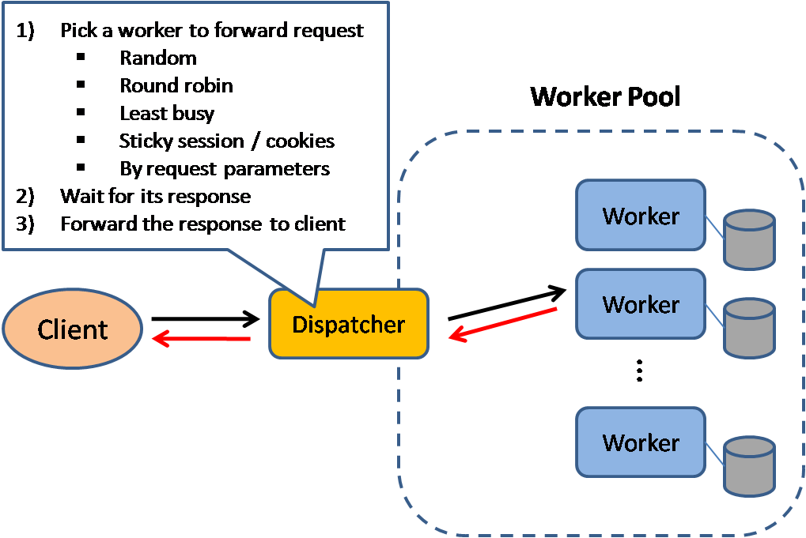

*[English](README.md) ∙ [日本語](README-ja.md) ∙ [简体中文](README-zh-Hans.md) ∙ [繁體中文](README-zh-TW.md) | [العَرَبِيَّة‎](https://github.com/donnemartin/system-design-primer/issues/170) ∙ [বাংলা](https://github.com/donnemartin/system-design-primer/issues/220) ∙ [Português do Brasil](https://github.com/donnemartin/system-design-primer/issues/40) ∙ [Deutsch](https://github.com/donnemartin/system-design-primer/issues/186) ∙ [ελληνικά](https://github.com/donnemartin/system-design-primer/issues/130) ∙ [עברית](https://github.com/donnemartin/system-design-primer/issues/272) ∙ [Italiano](https://github.com/donnemartin/system-design-primer/issues/104) ∙ [한국어](https://github.com/donnemartin/system-design-primer/issues/102) ∙ [فارسی](https://github.com/donnemartin/system-design-primer/issues/110) ∙ [Polski](https://github.com/donnemartin/system-design-primer/issues/68) ∙ [русский язык](https://github.com/donnemartin/system-design-primer/issues/87) ∙ [Español](https://github.com/donnemartin/system-design-primer/issues/136) ∙ [ภาษาไทย](https://github.com/donnemartin/system-design-primer/issues/187) ∙ [Türkçe](https://github.com/donnemartin/system-design-primer/issues/39) ∙ [tiếng Việt](https://github.com/donnemartin/system-design-primer/issues/127) ∙ [Français](https://github.com/donnemartin/system-design-primer/issues/250) | [Add Translation](https://github.com/donnemartin/system-design-primer/issues/28)*

**עזרו [לתרגם](TRANSLATIONS.md) את המדריך!**

# המדריך לתכנון מערכות (The System Design Primer)

<p align="center">
  
  <br/>
</p>

## מוטיבציה

<div dir="rtl">

> ללמוד איך לתכנן מערכות ב-scale גדול.
>
> להתכונן לראיונות ארכיטקטורה.


### ללמוד איך לתכנן מערכות ב-scale גדול

ללמוד כיצד לתכנן מערכות סְקֵילָבִּילִיוּת יסייע לך להפוך למהנדס תוכנה טוב יותר.

תכנון מערכות הוא נושא רחב. יש **כמות אדירה של משאבים ברחבי הרשת** על עקרונות של תכנון מערכות.

ה-repo הזה הוא **אוסף מסודר** של משאבים שנועדו לעזור לך ללמוד איך לבנות מערכות ב-scale.

### ללמוד מקהילת הקוד הפתוח

מדובר בפרויקט קוד פתוח (open source) שמתעדכן באופן מתמשך.

מוזמנים [לתרום!](#contributing)

### להתכונן לראיונות ארכיטקטורה

בנוסף לראיונות קידוד, ארכיטקטורה היא **רכיב נדרש** כחלק מתהליך **ראיונות טכניים** בהרבה חברות טכנולוגיות.

**תוכל לתרגל שאלות ארכיטקטורה נפוצות** ואף **להשוות** את התוצאות שלך עם **פתרונות לדוגמה**: דיונים, קוד, ודיאגרמות.

### נושאים נוספים להכנה לראיונות:

<ul>
  <li><a href="#study-guide">מדריך למידה</a></li>
  <li><a href="#how-to-approach-a-system-design-interview-question">איך לגשת לשאלת תכנון מערכת בראיון</a></li>
  <li><a href="#system-design-interview-questions-with-solutions">שאלות ראיון בתכנון מערכות, <strong>כולל פתרונות</strong></a></li>
  <li><a href="#object-oriented-design-interview-questions-with-solutions">שאלות ראיון בתכנון מונחה עצמים, <strong>כולל פתרונות</strong></a></li>
  <li><a href="#additional-system-design-interview-questions">שאלות נוספות לראיונות תכנון מערכות</a></li>
</ul>

</div>

## כרטיסיות Anki

<div dir="rtl">

<p align="center">
  
  <br/>
</p>

החבילות המוכנות של כרטיסיות [Anki](https://apps.ankiweb.net/) משתמשות בשיטת **חזרתיות מבוססת מרווחים (Spaced Repetition)** כדי לעזור לך לזכור מושגים חשובים בתכנון מערכות.

<ul dir="rtl">
  <li><a href="https://github.com/donnemartin/system-design-primer/tree/master/resources/flash_cards/System%20Design.apkg">חבילת תכנון מערכות</a></li>
  <li><a href="https://github.com/donnemartin/system-design-primer/tree/master/resources/flash_cards/System%20Design%20Exercises.apkg">חבילת תרגילים בתכנון מערכות</a></li>
  <li><a href="https://github.com/donnemartin/system-design-primer/tree/master/resources/flash_cards/OO%20Design.apkg">חבילת תכנון מונחה עצמים</a></li>
</ul>

מומלצות לשימוש בדרכים.

### משאב לראיונות קידוד: אתגרי קידוד אינטראקטיביים

מחפש משאבים שיעזרו לך להתכונן [**לראיונות קידוד**](https://github.com/donnemartin/interactive-coding-challenges)?

<p align="center">
  
  <br/>
</p>

תעיף מבט על ה-repo המקביל [**Interactive Coding Challenges**](https://github.com/donnemartin/interactive-coding-challenges), שמכיל חבילת Anki נוספת:

<ul dir="rtl">
  <li><a href="https://github.com/donnemartin/interactive-coding-challenges/tree/master/anki_cards/Coding.apkg">חבילת קידוד</a></li>
</ul>

</div>

## תרומה למדריך

<div dir="rtl">

> ללמוד מהקהילה.

אל תהסס להגיש pull requests כדי לעזור:

<ul dir="rtl">
  <li>תיקון שגיאות</li>
  <li>שיפור קטעים קיימים</li>
  <li>הוספת קטעים חדשים</li>
  <li><a href="https://github.com/donnemartin/system-design-primer/issues/28">תרגום לשפות נוספות</a></li>
</ul>

תכנים שעדיין דורשים ליטוש מסומנים בתור <a href="#under-development">תחת פיתוח</a>.

מומלץ לעיין ב<a href="CONTRIBUTING.md">הנחיות לתרומה</a> לפני התחלה.

</div>

## אינדקס נושאים בארכיטקטורה

<div dir="rtl">

> סיכומים של נושאים שונים בתכנון מערכות, כולל יתרונות וחסרונות. **כל החלטה כוללת פשרות (trade-offs)**.
>
> כל חלק מכיל קישורים להרחבה וללמידה מעמיקה יותר.

<p align="center">
  
  <br/>
</p>

<details dir="rtl">
  <summary>אינדקס נושאים</summary>
    <ul dir="rtl">
    <li><a href="#נושאים-בתכנון-מערכות-התחל-כאן">נושאים בתכנון מערכות: התחל כאן</a>
        <ul>
        <li><a href="#שלב-1-צפה-בהרצאה-על-סקילביליות">שלב 1: צפה בהרצאה על סקילביליות</a></li>
        <li><a href="#שלב-2-קרא-מאמר-על-סקילביליות">שלב 2: קרא מאמרים על סקילביליות</a></li>
        <li><a href="#השלבים-הבאים">השלבים הבאים</a></li>
        </ul>
    </li>
    <li><a href="#ביצועים-performance-מול-סקילביליות-scalability">ביצועים (performance) מול סקילביליות (scalability)</a></li>
    <li><a href="#שיהוי-latency-מול-תפוקה-throughput">שיהוי (latency) מול תפוקה (throughput)</a></li>
    <li><a href="#זמינות-availability-מול-עקביות-consistency">זמינות (availability) מול עקביות (consistency)</a>
        <ul>
        <li><a href="#משפט-cap">משפט CAP</a>
            <ul>
            <li><a href="#בחירה-ב-cp---עקביות-ויכולת-חלוקה">עקביות וטולרנטיות לפיצול (CP)</a></li>
            <li><a href="#בחירה-ב-ap---זמינות-ויכולת-חלוקה">זמינות וטולרנטיות לפיצול (AP)</a></li>
            </ul>
        </li>
        </ul>
    </li>
    <li><a href="#דפוסי-עקביות-consistency-patterns">דפוסי עקביות</a>
        <ul>
        <li><a href="#עקביות-חלשה-weak-consistency">עקביות חלשה (weak)</a></li>
        <li><a href="#עקביות-לא-מיידית-eventual-consistency">עקביות לא מיידית (eventual)</a></li>
        <li><a href="#עקביות-חזקה-strong-consistency">עקביות חזקה (strong)</a></li>
        </ul>
    </li>
    <li><a href="#דפוסי-זמינות-availability-patterns">דפוסי זמינות</a>
        <ul>
        <li><a href="#גיבוי-בזמן-כישלון-fail-over">גיבוי בזמן כישלון (fail-over)</a></li>
        <li><a href="#שכפול-replication">שכפול (replication)</a></li>
        <li><a href="#זמינות-במספרים">זמינות במספרים</a></li>
        </ul>
    </li>
    <li><a href="#מערכת-שמות-דומיינים-dns">מערכת שמות דומיינים (DNS)</a></li>
    <li><a href="#רשתות-הפצת-תוכן-cdn">רשתות הפצת תוכן (CDN)</a>
        <ul>
        <li><a href="#דחיפה-push">דחיפה (Push)</a></li>
        <li><a href="#משיכה-pull">משיכה (Pull)</a></li>
        </ul>
    </li>
    <li><a href="#מאזן-עומסים-load-balancer">מאזן עומסים (load balancer)</a>
        <ul>
        <li><a href="#מאזן-עומסים-load-balancer">אקטיבי-פסיבי (active-passive)</a></li>
        <li><a href="#אקטיבי-אקטיבי-active-active">אקטיבי-אקטיבי (active-active)</a></li>
        <li><a href="#איזון-עומסים-בשכבה-4">איזון עומסים בשכבה 4</a></li>
        <li><a href="#איזון-עומסים-בשכבה-7">איזון עומסים בשכבה 7</a></li>
        <li><a href="#גדילה-אופקית-horizontal-scaling">גדילה אופקית (horizontal)</a></li>
        </ul>
    </li>
    <li><a href="#reverse-proxy-web-server">פרוקסי 'הפוך' (Reverse Proxy)</a>
        <ul>
        <li><a href="#load-balancer-vs-reverse-proxy">מאזן עומסים לעומת פרוקסי הפוך</a></li>
        </ul>
    </li>
    <li><a href="#application-layer">שכבת האפליקציה</a>
        <ul>
        <li><a href="#microservices">מיקרוסרביסים (microservices)</a></li>
        <li><a href="#service-discovery">גילוי שירותים (service discovery)</a></li>
        </ul>
    </li>
    <li><a href="#database">מסדי נתונים</a>
        <ul>
        <li><a href="#relational-database-management-system-rdbms">מסדי נתונים רלציוניים (RDBMS)</a>
            <ul>
            <li><a href="#master-slave-replication">שכפול Master-Slave</a></li>
            <li><a href="#master-master-replication">שכפול Master-Master</a></li>
            <li><a href="#federation">פדרציה (federation)</a></li>
            <li><a href="#sharding">חלוקה (sharding)</a></li>
            <li><a href="#denormalization">דה-נורמליזציה (denormalization)</a></li>
            <li><a href="#sql-tuning">SQL Tuning</a></li>
            </ul>
        </li>
        <li><a href="#nosql">NoSQL</a>
            <ul>
            <li><a href="#key-value-store">מפתח-ערך (Key-Value)</a></li>
            <li><a href="#document-store">מסמכים (Document Store)</a></li>
            <li><a href="#wide-column-store">רב-עמודות (Wide Column)</a></li>
            <li><a href="#graph-database">גרפים (Graph DB)</a></li>
            </ul>
        </li>
        <li><a href="#sql-or-nosql">SQL או NoSQL</a></li>
        </ul>
    </li>
    <li><a href="#cache">מטמון (Cache)</a>
        <ul>
        <li><a href="#client-caching">מטמון בצד לקוח</a></li>
        <li><a href="#cdn-caching">מטמון ב-CDN</a></li>
        <li><a href="#web-server-caching">מטמון בשרת</a></li>
        <li><a href="#database-caching">מטמון במסד נתונים</a></li>
        <li><a href="#application-caching">מטמון באפליקציה</a></li>
        <li><a href="#caching-at-the-database-query-level">מטמון ברמת שאילתה</a></li>
        <li><a href="#caching-at-the-object-level">מטמון ברמת אובייקט</a></li>
        <li><a href="#when-to-update-the-cache">מתי לעדכן את ה-cache?</a>
            <ul>
            <li><a href="#cache-aside">אסטרטגיית Cache-aside</a></li>
            <li><a href="#write-through">אסטרטגיית Write-through</a></li>
            <li><a href="#write-behind-write-back">אסטרטגיית Write-behind (write-back)</a></li>
            <li><a href="#refresh-ahead">אסטרטגיית Refresh-ahead</a></li>
            </ul>
        </li>
        </ul>
    </li>
    <li><a href="#asynchronism">אסינכרוניות (asynchronism)</a>
        <ul>
        <li><a href="#message-queues">תורי הודעות (MQ)</a></li>
        <li><a href="#task-queues">תורי משימות</a></li>
        <li><a href="#back-pressure">לחץ אחורי (Back Pressure)</a></li>
        </ul>
    </li>
    <li><a href="#communication">תקשורת</a>
        <ul>
        <li><a href="#transmission-control-protocol-tcp">פרוטוקול Transmission control protocol (TCP)</a></li>
        <li><a href="#user-datagram-protocol-udp">פרוטוקול User datagram protocol (UDP)</a></li>
        <li><a href="#remote-procedure-call-rpc">קריאת Remote procedure call (RPC)</a></li>
        <li><a href="#representational-state-transfer-rest">פרוטוקול Representational state transfer (REST)</a></li>
        </ul>
    </li>
    <li><a href="#security">אבטחה</a></li>
    <li><a href="#appendix">נספחים</a>
        <ul>
        <li><a href="#powers-of-two-table">טבלת חזקות של 2</a></li>
        <li><a href="#latency-numbers-every-programmer-should-know">מספרי latency חשובים</a></li>
        <li><a href="#additional-system-design-interview-questions">שאלות נוספות לראיונות</a></li>
        <li><a href="#real-world-architectures">ארכיטקטורות מהעולם האמיתי</a></li>
        <li><a href="#company-architectures">ארכיטקטורות של חברות</a></li>
        <li><a href="#company-engineering-blogs">בלוגים טכניים של חברות</a></li>
        </ul>
    </li>
    <li><a href="#under-development">תחת פיתוח</a></li>
    <li><a href="#credits">קרדיטים</a></li>
    <li><a href="#contact-info">פרטי קשר</a></li>
    <li><a href="#license">רישיון</a></li>
    </ul>
</details>

</div>

## מדריך למידה

<div dir="rtl">

> נושאים מוצעים ללימוד לפי לוח הזמנים לריאיון שלך (קצר, בינוני, ארוך)

<p align="center">
  
  <br/>
</p>

**ש: עבור הראיונות, האם אני אמור לדעת כל מה שכתוב כאן?**

**ת: לא, אתה לא צריך לדעת הכול כדי להתכונן לריאיון**.

מה שאתה תישאל עליו בריאיון תלוי בדברים כגון:

<ul dir="rtl">
  <li>כמה ניסיון יש לך</li>
  <li>מה הרקע הטכני שלך</li>
  <li>לאילו משרות אתה מתראיין</li>
  <li>באילו חברות אתה מתראיין</li>
  <li>מזל</li>
</ul>

לרוב מצופה ממועמדים מנוסים יותר לדעת יותר על ארכיטקטורה ותכנון מערכות. ארכיטקטים או ראשי צוותים מצופים לדעת יותר מאשר עובדים בודדים. חברות טכנולוגיות מובילות לרוב יערכו ריאיון אחד או יותר של ארכיטקטורה.

רצוי להתחיל רחב ולהעמיק במספר תחומים. זה עוזר לדעת קצת בנוגע למספר נושאי מפתח בתכנון מערכות. תתאים את המדריך לפי לוח הזמן שלך, הניסיון, המשרות שאתה מתראיין אליהן, והחברות שבהן אתה מתראיין.

<ul dir="rtl">
  <li><strong>לוח זמנים קצר</strong> – התמקד ב<strong>רוחב</strong> של נושאים בתכנון מערכות. תרגל פתרון של <strong>כמה</strong> שאלות ריאיון.</li>
  <li><strong>לוח זמנים בינוני</strong> – התמקד ב<strong>רוחב</strong> ו<strong>קצת עומק</strong> של נושאים בתכנון מערכות. תרגל פתרון של <strong>הרבה</strong> שאלות ריאיון.</li>
  <li><strong>לוח זמנים ארוך</strong> – התמקד ב<strong>רוחב</strong> ו<strong>יותר עומק</strong> של נושאים בתכנון מערכות. תרגל פתרון של <strong>רוב</strong> שאלות הריאיון.</li>
</ul>

<table dir="rtl" border="1" cellspacing="0" cellpadding="6">
  <thead>
    <tr>
      <th></th>
      <th>קצר</th>
      <th>בינוני</th>
      <th>ארוך</th>
    </tr>
  </thead>
  <tbody>
    <tr>
      <td>קרא את <a href="#index-of-system-design-topics">הנושאים בתכנון מערכות</a> כדי לקבל הבנה כללית של איך מערכות עובדות</td>
      <td>:+1:</td>
      <td>:+1:</td>
      <td>:+1:</td>
    </tr>
    <tr>
      <td>קרא כמה מאמרים מתוך <a href="#company-engineering-blogs">בלוגים של חברות</a> שאתה מתראיין אליהן</td>
      <td>:+1:</td>
      <td>:+1:</td>
      <td>:+1:</td>
    </tr>
    <tr>
      <td>קרא על כמה <a href="#real-world-architectures">ארכיטקטורות מהעולם האמיתי</a></td>
      <td>:+1:</td>
      <td>:+1:</td>
      <td>:+1:</td>
    </tr>
    <tr>
      <td>חזור על <a href="#how-to-approach-a-system-design-interview-question">איך לגשת לשאלת ריאיון בתכנון מערכות</a></td>
      <td>:+1:</td>
      <td>:+1:</td>
      <td>:+1:</td>
    </tr>
    <tr>
      <td>תרגל <a href="#system-design-interview-questions-with-solutions">שאלות ריאיון בתכנון מערכות עם פתרונות</a></td>
      <td>כמה</td>
      <td>הרבה</td>
      <td>רוב</td>
    </tr>
    <tr>
      <td>תרגל <a href="#object-oriented-design-interview-questions-with-solutions">שאלות ריאיון בתכנון מונחה עצמים עם פתרונות</a></td>
      <td>כמה</td>
      <td>הרבה</td>
      <td>רוב</td>
    </tr>
    <tr>
      <td>חזור על <a href="#additional-system-design-interview-questions">שאלות ריאיון נוספות בתכנון מערכות</a></td>
      <td>כמה</td>
      <td>הרבה</td>
      <td>רוב</td>
    </tr>
  </tbody>
</table>

</div>

## איך לגשת לשאלת ריאיון ארכיטקטורה

<div dir="rtl">

> איך לפתור שאלת ראיון ארכיטקטורה.

ראיון ארכיטקטורה הוא **שיחה פתוחה**. מצופה ממך להוביל אותה.

אתה יכול להיעזר בצעדים הבאים כדי להנחות את הדיון. כדי לחזק את ההבנה של התהליך, תעבור על [שאלות ריאיון בתכנון מערכות עם פתרונות](#system-design-interview-questions-with-solutions) אל מול הצעדים הבאים:

### תאר מקרי שימוש, אילוצים והנחות עבודה

אסוף דרישות והגדר את ה-scope של הבעיה.
שאל שאלות כדי להבהיר את מקרי השימוש והאילוצים. דון בהנחות העבודה שאתה עושה.

<ul dir="rtl">
  <li>מי הולך להשתמש במערכת?</li>
  <li>איך הם הולכים להשתמש בה?</li>
  <li>כמה משתמשים יהיו?</li>
  <li>מה המערכת עושה?</li>
  <li>מה הקלטים והפלטים של המערכת?</li>
  <li>בכמה דאטא נצטרך לטפל?</li>
  <li>כמה בקשות לשניה מחכות לנו?</li>
  <li>מה היחס הצפוי בין קריאה לכתיבה?</li>
</ul>

### שלב 2: כתוב תכנון במבט על (high level design)

כתוב תכנון high level עם כל הרכיבים החשובים.

<ul dir="rtl">
  <li>שרטט את הרכיבים החשובים והקשרים ביניהם</li>
  <li>תצדיק את הרעיונות שלך</li>
</ul>

### שלב 3: תכנן את הרכיבים המרכזיים

צלול לפרטים של כל רכיב מרכזי. לדוגמה, אם התבקשת לתכנן [שירות קיצור כתובות url](solutions/system_design/pastebin/README.md), דון בנושאים הבאים:

<ul dir="rtl">
  <li>יצירה ואחסון hash של ה-url המלא
    <ul>
      <li>דרכים כמו <a href="solutions/system_design/pastebin/README.md">MD5</a> ו-<a href="solutions/system_design/pastebin/README.md">Base62</a></li>
      <li>התנגשויות hash</li>
      <li>מסד נתונים SQL או NoSQL</li>
      <li>סכמת הנתונים</li>
    </ul>
  </li>
  <li>המרה של כתובת מקוצרת לכתובת המלאה
    <ul>
      <li>חיפוש ב-DB</li>
    </ul>
  </li>
  <li>תכנון API ותכנון מונחה עצמים</li>
</ul>

### שלב 4: תבצע scale לתכנון

זהה וטפל בצווארי בקבוק, בהתאם לאילוצים. למשל, האם תזדקק לאחד מהפתרונות הבאים כדי להתמודד עם בעיות של סקילביליות?

<ul dir="rtl">
  <li>מאזן עומסים (Load balancer)</li>
  <li>סקיילינג אופקי (Horizontal scaling)</li>
  <li>שמירה במטמון (Caching)</li>
  <li>פיצול בסיס נתונים (Database sharding)</li>
</ul>

דון בפתרונות אפשריים וה-trade-offs. הכול הוא trade-off. התמודד עם צווארי בקבוק בעזרת [עקרונות תכנון מערכת סקילבילית](#index-of-system-design-topics).

### חישובים "על גב המעטפה" (מהירים)

ייתכן שיבקשו ממך לבצע הערכות באופן ידני. ראה את [הנספח](#appendix) עבור המשאבים הבאים:

* [Use back of the envelope calculations](http://highscalability.com/blog/2011/1/26/google-pro-tip-use-back-of-the-envelope-calculations-to-choo.html)
* [Powers of two table](#powers-of-two-table)
* [Latency numbers every programmer should know](#latency-numbers-every-programmer-should-know)

### מקורות לקריאה נוספת

עיין בקישורים הבאים כדי להבין טוב יותר למה לצפות:

* [How to ace a systems design interview](https://www.palantir.com/2011/10/how-to-rock-a-systems-design-interview/)
* [The system design interview](http://www.hiredintech.com/system-design)
* [Intro to Architecture and Systems Design Interviews](https://www.youtube.com/watch?v=ZgdS0EUmn70)
* [System design template](https://leetcode.com/discuss/career/229177/My-System-Design-Template)

</div>


## שאלות ריאיון תכנון מערכות עם פתרונות

<div dir="rtl">

> שאלות נפוצות בריאיון ארכיטקטורה עם הסברים לדוגמה, קוד, ודיאגרמות.
>
> הפתרונות מפנים לתוכן שנמצא בתיקיית `solutions/`.

<table dir="rtl">
  <thead>
    <tr>
      <th>שאלה</th>
      <th>פתרון</th>
    </tr>
  </thead>
  <tbody>
    <tr>
      <td>תכנן את pastebin.com (או bit.ly)</td>
      <td><a href="solutions/system_design/pastebin/README.md">פתרון</a></td>
    </tr>
    <tr>
      <td>תכנן את ציר הזמן והחיפוש של טוויטר (או הפיד והחיפוש של פייסבוק)</td>
      <td><a href="solutions/system_design/twitter/README.md">פתרון</a></td>
    </tr>
    <tr>
      <td>תכנן web crawler</td>
      <td><a href="solutions/system_design/web_crawler/README.md">פתרון</a></td>
    </tr>
    <tr>
      <td>תכנן את Mint.com</td>
      <td><a href="solutions/system_design/mint/README.md">פתרון</a></td>
    </tr>
    <tr>
      <td>תכנן את מבני הנתונים של רשת חברתית</td>
      <td><a href="solutions/system_design/social_graph/README.md">פתרון</a></td>
    </tr>
    <tr>
      <td>תכנן אחסון key-value למנוע חיפוש</td>
      <td><a href="solutions/system_design/query_cache/README.md">פתרון</a></td>
    </tr>
    <tr>
      <td>תכנן את מנגנון דירוג המכירות לפי קטגוריה של אמזון</td>
      <td><a href="solutions/system_design/sales_rank/README.md">פתרון</a></td>
    </tr>
    <tr>
      <td>תכנן מערכת שיכולה לגדול למיליוני משתמשים על AWS</td>
      <td><a href="solutions/system_design/scaling_aws/README.md">פתרון</a></td>
    </tr>
    <tr>
      <td>הוסף שאלה לתכנון מערכת</td>
      <td><a href="#contributing">תרום</a></td>
    </tr>
  </tbody>
</table>

### תכנן את pastebin.com (או bit.ly)

[צפה בתרגיל ובפתרון](solutions/system_design/pastebin/README.md)

<details>
  <summary>הצג/הסתר דיאגרמה</summary>
  <p align="center">
    
    <br/>
  </p>
</details>

### תכנן את ציר הזמן והחיפוש של טוויטר (או הפיד והחיפוש של פייסבוק)

[צפה בתרגיל ובפתרון](solutions/system_design/twitter/README.md)

<details>
  <summary>הצג/הסתר דיאגרמה</summary>
  <p align="center">
    
    <br/>
  </p>
</details>

### תכנן web crawler

[צפה בתרגיל ובפתרון](solutions/system_design/web_crawler/README.md)

<details>
  <summary>הצג/הסתר דיאגרמה</summary>
  <p align="center">
    
    <br/>
  </p>
</details>

### תכנן את Mint.com

[צפה בתרגיל ובפתרון](solutions/system_design/mint/README.md)

<details>
  <summary>הצג/הסתר דיאגרמה</summary>
  <p align="center">
    
    <br/>
  </p>
</details>

### תכנן את מבני הנתונים של רשת חברתית

[צפה בתרגיל ובפתרון](solutions/system_design/social_graph/README.md)

<details>
  <summary>הצג/הסתר דיאגרמה</summary>
  <p align="center">
    
    <br/>
  </p>
</details>

### תכנן אחסון key-value למנוע חיפוש

[צפה בתרגיל ובפתרון](solutions/system_design/query_cache/README.md)

<details>
  <summary>הצג/הסתר דיאגרמה</summary>
  <p align="center">
    
    <br/>
  </p>
</details>

### תכנן את מנגנון דירוג המכירות לפי קטגוריה של אמזון

[צפה בתרגיל ובפתרון](solutions/system_design/sales_rank/README.md)

<details>
  <summary>הצג/הסתר דיאגרמה</summary>
  <p align="center">
    
    <br/>
  </p>
</details>

### תכנן מערכת שיכולה לגדול למיליוני משתמשים על AWS

[צפה בתרגיל ובפתרון](solutions/system_design/scaling_aws/README.md)

<details>
  <summary>הצג/הסתר דיאגרמה</summary>
  <p align="center">
    
    <br/>
  </p>
</details>

</div>


## שאלות ריאיון בתכנון מונחה עצמים עם פתרונות

<div dir="rtl">

> שאלות נפוצות בתכנון מונחה עצמים עם הסברים לדוגמה, קוד, ודיאגרמות.
>
> הפתרונות מפנים לתוכן שנמצא בתיקיית `solutions/`.

>**הערה: החלק הזה עדיין בפיתוח**


<table>
<thead>
    <tr>
    <th>שאלה</th>
    <th>פתרון</th>
    </tr>
</thead>
<tbody>
    <tr>
    <td>תכנן Hash Map</td>
    <td><a href="solutions/object_oriented_design/hash_table/hash_map.ipynb">פתרון</a></td>
    </tr>
    <tr>
    <td>תכנן מנגנון Cache בשיטת Least Recently Used</td>
    <td><a href="solutions/object_oriented_design/lru_cache/lru_cache.ipynb">פתרון</a></td>
    </tr>
    <tr>
    <td>תכנן מרכז שירות טלפוני (Call Center)</td>
    <td><a href="solutions/object_oriented_design/call_center/call_center.ipynb">פתרון</a></td>
    </tr>
    <tr>
    <td>תכנן חפיסת קלפים</td>
    <td><a href="solutions/object_oriented_design/deck_of_cards/deck_of_cards.ipynb">פתרון</a></td>
    </tr>
    <tr>
    <td>תכנן חניון</td>
    <td><a href="solutions/object_oriented_design/parking_lot/parking_lot.ipynb">פתרון</a></td>
    </tr>
    <tr>
    <td>תכנן שרת צ'אט</td>
    <td><a href="solutions/object_oriented_design/online_chat/online_chat.ipynb">פתרון</a></td>
    </tr>
    <tr>
    <td>תכנן מערך מעגלי</td>
    <td><a href="#contributing">תרום</a></td>
    </tr>
    <tr>
    <td>הוסף שאלה בעיצוב מונחה עצמים</td>
    <td><a href="#contributing">תרום</a></td>
    </tr>
</tbody>
</table>

</div>

## נושאים בתכנון מערכות: התחל כאן

<div dir="rtl">

חדש בתחום תכנון מערכות?

ראשית, תצטרך לקבל הבנה בסיסית של העקרונות הנפוצים, ללמוד מה הם, איך משתמשים בהם, מה היתרונות והחסרונות של כל אחד מהם.

### שלב 1: צפה בהרצאה על סקילביליות

[Scalability Lecture at Harvard](https://www.youtube.com/watch?v=-W9F__D3oY4)

* Topics covered:
    * Vertical scaling
    * Horizontal scaling
    * Caching
    * Load balancing
    * Database replication
    * Database partitioning

### שלב 2: קרא מאמר על סקילביליות

[Scalability](https://web.archive.org/web/20221030091841/http://www.lecloud.net/tagged/scalability/chrono)

* Topics covered:
    * [Clones](https://web.archive.org/web/20220530193911/https://www.lecloud.net/post/7295452622/scalability-for-dummies-part-1-clones)
    * [Databases](https://web.archive.org/web/20220602114024/https://www.lecloud.net/post/7994751381/scalability-for-dummies-part-2-database)
    * [Caches](https://web.archive.org/web/20230126233752/https://www.lecloud.net/post/9246290032/scalability-for-dummies-part-3-cache)
    * [Asynchronism](https://web.archive.org/web/20220926171507/https://www.lecloud.net/post/9699762917/scalability-for-dummies-part-4-asynchronism)

### השלבים הבאים

בהמשך, נסתכל על trade-offs ב-high level:

* **Performance** vs **scalability**
* **Latency** vs **throughput**
* **Availability** vs **consistency**

נזכור כי **הכול זה trade-off**.
לאחר מכן נצלול לנושאים ספציפיים יותר כמו DNS, CDN ו-load balancers.

</div>


## ביצועים (Performance) מול סקילביליות (Scalability)

<div dir="rtl">

שירות הוא **סקילבילי (scalable)** אם הוא משתפר **בביצועים (performance)** שלו באופן פרופורציונלי למשאבים שנוספו. באופן כללי, שיפור בביצועים פירושו היכולת לתת שירות ליותר יחידות עבודה, אך הוא יכול גם לבוא לידי ביטוי ביכולת להתמודד עם יחידות עבודה גדולות יותר, ככל שהדאטא גדל.<sup><a href=http://www.allthingsdistributed.com/2006/03/a_word_on_scalability.html>1</a></sup>

דרך נוספת להסתכל על ביצועים מול סקילביליות

<ul>
      <li>אם יש לך בעיית <strong>ביצועים</strong>, המערכת איטית עבור משתמש בודד.</li>
      <li>אם יש לך בעיית <strong>סקילביליות</strong>, המערכת מהירה עבור משתמש בודד אך איטית בעומס כבד.</li>
    </ul>

### מקורות וקריאה נוספת

* [A word on scalability](http://www.allthingsdistributed.com/2006/03/a_word_on_scalability.html)
* [Scalability, availability, stability, patterns](http://www.slideshare.net/jboner/scalability-availability-stability-patterns/)

</div>

## שיהוי (Latency) מול תפוקה (Throughput)

<div dir="rtl">

**שיהוי** הוא הזמן שנדרש כדי לבצע פעולה כלשהי או להפיק תוצאה כלשהי

**תפוקה** היא מספר הפעולות או התוצאות ליחידת זמן.

באופן כללי, כדאי לשאוף **לתפוקה מקסימלית** עם **שיהוי סביר**.

### חומרים וקריאה נוספת

* [Understanding latency vs throughput](https://community.cadence.com/cadence_blogs_8/b/fv/posts/understanding-latency-vs-throughput)

</div>

## זמינות (Availability) מול עקביות (Consistency)

<div dir="rtl">

### משפט CAP

<p align="center">
  
  <br/>
  <i><a href=http://robertgreiner.com/2014/08/cap-theorem-revisited>Source: CAP theorem revisited</a></i>
</p>

במערכות מחשוב מבוזרות, ניתן לתמוך רק בשניים מתוך שלושת התנאים הבאים:

<ul>
  <li><strong>עקביות (Consistency)</strong> – כל קריאה מקבלת את הכתיבה העדכנית ביותר, או שגיאה.</li>
  <li><strong>זמינות (Availability)</strong> - כל בקשה תקבל מענה, ללא הבטחה שהמידע שיחזור יהיה העדכני ביותר.</li>
  <li><strong>יכולת חלוקה (Partition Tolerance)</strong> - המערכת ממשיכה לתפקד גם במקרים בהם נאבדות או מתעכבות מספר הודעות בין שרתי המערכת בגלל בעיות תקשורת.</li>
</ul>

*ניתן לצאת מנקודת הנחה שרשתות לא אמינות - כך שנהיה חייבים לתמוך ב-״Partition tolerance״. 
לכן, נצטרך לבחור אחד משני האחרים - זמינות או עקביות.*

#### בחירה ב-CP - עקביות ויכולת חלוקה

המתנה לתשובה מהמערכת (אשר סובלת מ-network partition) עלולה להסתיים בשגיאת timeout. לכן, CP הוא בחירה טובה במידה ויש הצדקה עסקית לקריאות וכתיבות אטומיות.

#### בחירה ב-AP - זמינות ויכולת חלוקה

תשובות לבקשות מהמערכת מחזירות את הגרסה הזמינה ביותר של הנתונים הזמינים בשרת הרלוונטי, שאינה בהכרח האחרונה. כתיבה עשויה לקחת זמן מסוים עד שתסתיים, עד אשר התקשורת הבעייתית תיפתר.

לכן, AP הוא בחירה טובה במידה ויש הצדקה עסקית לעבוד במצב של [eventual consistency](#eventual-consistency) או במידה והמערכת צריכה להמשיך לשרת למרות שגיאות בלתי-תלויות.

### חומרים וקריאה נוספת

* [CAP theorem revisited](http://robertgreiner.com/2014/08/cap-theorem-revisited/)
* [A plain english introduction to CAP theorem](http://ksat.me/a-plain-english-introduction-to-cap-theorem)
* [CAP FAQ](https://github.com/henryr/cap-faq)
* [The CAP theorem](https://www.youtube.com/watch?v=k-Yaq8AHlFA)

</div>


## דפוסי עקביות (Consistency Patterns)

<div dir="rtl">

כאשר קיימים מספר עותקים של אותם נתונים, עלינו להחליט כיצד לסנכרן ביניהם כדי שלקוחות יקבלו תצוגה עקבית של המידע.  
ניזכר בהגדרה של עקביות מתוך [משפט CAP](#cap-theorem): כל קריאה מקבלת את הכתיבה העדכנית ביותר או שגיאה.

### עקביות חלשה (Weak Consistency)

לאחר כתיבה, קריאות עשויות לראות או לא לראות את הערך החדש שנכתב. הגישה כאן היא של best effort - המאמץ הטוב ביותר.

גישה זו נפוצה במערכות כמו memcached. עקביות חלשה מתאימה למקרים של מערכות זמן-אמת, כמו VoIP, שיחות וידאו, ומשחקים מרובי משתתפים.  
לדוגמה, אם אתה בשיחת טלפון ומאבד קליטה לכמה שניות, כשאתה חוזר אתה לא שומע מה שנאמר בזמן שלא הייתה קליטה.

### עקביות לא מיידית (Eventual Consistency)

לאחר כתיבה, הקריאות יראו בסופו של דבר את מה שנכתב (בדרך כלל תוך מספר מילישניות). הנתונים משוכפלים באופן אסינכרוני.

גישה זו נפוצה במערכות כמו DNS ומייל. עקביות לא מיידית מתאימה למערכות ששומרות על זמינות גבוהה במיוחד.

### עקביות חזקה (Strong Consistency)

לאחר כתיבה, הקריאות יראו תמיד את הערך החדש שנכתב. השכפול מתבצע באופן סינכרוני.

גישה זו נפוצה במערכות קבצים ובמסדי נתונים רלציוניים (RDBMS). עקביות חזקה מתאימה למערכות שדורשות טרנזקציות.

### מקורות וקריאה נוספת

- [Transactions across data centers](http://snarfed.org/transactions_across_datacenters_io.html)

</div>

## דפוסי זמינות (Availability Patterns)

<div dir="rtl">

קיימים שני דפוסים משלימים לתמיכה בזמינות גבוהה: **מעבר אוטומטי (fail-over)** ו-**שכפול (replication)**.

### גיבוי בזמן כישלון (Fail-Over)

#### אקטיבי-פסיבי (Active-Passive)

במבנה אקטיבי-פסיבי, נשלחים heartbeat-ים בין השרת הפעיל לשרת הרזרבי (הפסיבי). אם ה-heartbeat נקטע, השרת הפסיבי לוקח את כתובת ה-IP של הפעיל וממשיך את השירות.

משך זמן ההשבתה תלוי אם השרת הפסיבי פועל מראש במצב 'חם' (hot standby), או שיש להפעילו ממצב 'קר' (cold standby). רק השרת הפעיל מקבל תעבורה.

סוג זה נקרא גם Master-Slave.

#### אקטיבי-אקטיבי (Active-Active)

במבנה אקטיבי-אקטיבי, שני השרתים מקבלים תעבורה ומחלקים ביניהם את העומס.

אם השרתים חשופים פומבית, שרת ה-DNS צריך לדעת על כתובות ה-IP הציבוריות של שניהם. אם השרתים פנימיים, על לוגיקת האפליקציה להכיר את שניהם.

סוג זה נקרא גם Master-Master.

### חסרונות של מעבר אוטומטי

<ul dir="rtl">
  <li>מעבר אוטומטי מוסיף חומרה ועלות תפעולית.</li>
  <li>קיימת אפשרות לאובדן נתונים אם המערכת הפעילה קורסת לפני שהספיקה לשכפל את המידע למערכת הפסיבית.</li>
</ul>

### שכפול (Replication)

#### עבור Master-Slave/Master-Master

נושא זה נדון בפירוט נוסף בחלק על [מסדי נתונים](#database):

- [Master-slave replication](#master-slave-replication)
- [Master-master replication](#master-master-replication)

</div>

### זמינות במספרים

נהוג למדוד זמינות לפי זמן פעילות (uptime) או חוסר פעילות (downtime)כאחוז מהזמן שבו השירות פועל. המדד הנפוץ הוא לפי מספר התשיעיות — לדוגמה: שירות עם זמינות של 99.99% מתואר כבעל ארבע תשיעיות.

#### זמינות של 99.9% — שלוש תשיעיות

| Duration            | Acceptable downtime|
|---------------------|--------------------|
| Downtime per year   | 8h 45min 57s       |
| Downtime per month  | 43m 49.7s          |
| Downtime per week   | 10m 4.8s           |
| Downtime per day    | 1m 26.4s           |

#### זמינות של 99.99% — ארבע תשיעיות

| Duration            | Acceptable downtime|
|---------------------|--------------------|
| Downtime per year   | 52min 35.7s        |
| Downtime per month  | 4m 23s             |
| Downtime per week   | 1m 5s              |
| Downtime per day    | 8.6s               |

#### זמינות במקביל לעומת בטור

אם שירות מורכב ממספר רכיבים שעלולים להיכשל, הזמינות הכוללת של השירות תלויה באופן שבו הם מסודרים - בטור או במקביל.

###### בטור

כאשר שני רכיבים עם זמינות קטנה מ-100% מסודרים בטור, הזמינות הכוללת יורדת:

```
Availability (Total) = Availability (Foo) * Availability (Bar)
```

אם גם `Foo` וגם `Bar` זמינים ברמה של 99.9%, הזמינות הכוללת שלהם בטור תהיה 99.8%.

###### במקביל

הזמינות הכוללת עולה כאשר שני רכיבים בעלי זמינות קטנה מ־100% פועלים במקביל:

```
Availability (Total) = 1 - (1 - Availability (Foo)) * (1 - Availability (Bar))
```

אם גם `Foo` וגם `Bar` זמינים ברמה של 99.9%, הזמינות הכוללת שלהם במקביל תהיה 99.9999%.

## מערכת שמות דומיינים (DNS)

<div dir="rtl">

<p align="center">
  
  <br/>
  <i><a href="http://www.slideshare.net/srikrupa5/dns-security-presentation-issa">מקור: מצגת אבטחת DNS</a></i>
</p>

מערכת שמות דומיינים (DNS) ממירה שם דומיין כמו `www.example.com` לכתובת IP.

ה-DNS בנוי בהיררכיה: כאשר ישנם כמה שרתי ניהול בשכבה העליונה.  ה-router שלך או ספק האינטרנט (ISP) מספקים כתובות לשרת(י) DNS שיש לפנות אליהם בעת ביצוע חיפוש של כתובת.  
שרתי DNS בשכבה נמוכה יותר, מבצעים cache למיפויים, שעלולים להיות לא עדכניים (stale) אם הרשומה המעודכנת עוד לא עברה מהשרת בשכבה הגבוהה עד למטה (propagation delays).
המיפוי של ה-DNS יכול להישמר על ידי הדפדפן או מערכת ההפעלה לפרק זמן מסוים, הנקבע על ידי [TTL – Time To Live](https://he.wikipedia.org/wiki/Time_to_live).

<ul dir="rtl">
  <li><strong>NS record (Name Server)</strong> – מגדירה את שרתי DNS עבור הדומיין/תת-דומיין.</li>
  <li><strong>MX record (Mail Exchange)</strong> – מגדירה את שרתי הדואר לקבלת הודעות.</li>
  <li><strong>A record (Address)</strong> – ממפה שם לכתובת IP.</li>
  <li><strong>CNAME (Canonical Name)</strong> – ממפה שם לשם אחר (למשל example.com → <code>www.example.com</code>) או לרשומת <code>A</code>.</li>
</ul>

שירותים מנוהלים כמו [CloudFlare](https://www.cloudflare.com/dns/) ו-[Route 53](https://aws.amazon.com/route53/) מספקים DNS מנוהל.  
חלקם מאפשרים ניתוב תעבורה בשיטות שונות:

- [Weighted round robin](https://www.jscape.com/blog/load-balancing-algorithms)
    - Prevent traffic from going to servers under maintenance
    - Balance between varying cluster sizes
    - A/B testing
- [Latency-based](https://docs.aws.amazon.com/Route53/latest/DeveloperGuide/routing-policy-latency.html)
- [Geolocation-based](https://docs.aws.amazon.com/Route53/latest/DeveloperGuide/routing-policy-geo.html)

### חסרונות (DNS)

<ul dir="rtl">
  <li>פנייה לשרת DNS מוסיפה עיכוב קל, אם כי ברוב המקרים הוא מתמתן בזכות caching כפי שתואר קודם.</li>
  <li>ניהול שרתי DNS יכול להיות מורכב, ולרוב מנוהל על-ידי <a href="http://superuser.com/questions/472695/who-controls-the-dns-servers/472729">ממשלות, ISPs וחברות גדולות</a>.</li>
  <li>שירותי DNS היו יעד לאחרונה ל-<a href="http://dyn.com/blog/dyn-analysis-summary-of-friday-october-21-attack/">מתקפות DDoS</a>, מה שמנע מגולשים להגיע לאתרים (למשל Twitter) בלי להכיר כתובות IP ידניות.</li>
</ul>

### מקורות וקריאה נוספת

- [DNS architecture](https://technet.microsoft.com/en-us/library/dd197427(v=ws.10).aspx)
- [Wikipedia](https://en.wikipedia.org/wiki/Domain_Name_System)
- [DNS articles](https://support.dnsimple.com/categories/dns/)

</div>

## רשתות הפצת תוכן (CDN)

<div dir="rtl">

<p align="center">
  
  <br/>
  <i><a href="https://www.creative-artworks.eu/why-use-a-content-delivery-network-cdn/">מקור: Why use a CDN</a></i>
</p>

רשת הפצת תוכן (CDN) היא רשת גלובלית ומבוזרת של שרתי proxy, אשר מנגישים תכנים ממיקומים הקרובים יותר למשתמש הקצה.
בדרך כלל, קבצים סטטיים כמו HTML/CSS/JS, תמונות וסרטונים, מונגשים על ידי CDN, למרות שיש כאלו כמו CloudFront של Amazon התומכים גם בתכנים דינמיים.
מיפוי ה-DNS שיתקבל ינחה את הלקוחות לאיזה שרת להתחבר.

הגשת תוכן מ-CDN משפר ביצועים משמעותית בשני אופנים:

<ul dir="rtl">
  <li>המשתמש מקבל תוכן מ-data center הקרוב אליו פיזית.</li>
  <li>השרתים אינם צריכים לשרת בקשות שה-CDN מספק במקומם.</li>
</ul>

### דחיפה (Push)

ב-Push CDN התוכן נדחף אל ה-CDN בכל פעם שהוא משתנה בשרת המקור.  האחריות על העלאת הקבצים וכתיבת ה-URLs המופנים ל-CDN היא שלך.  אתה מגדיר את הזמן שבו פג תוקפו של תוכן מסוים, ומתי הוא מתעדכן.

תוכן מועלה רק כאשר הוא חדש, או עבר שינוי, מה שמפחית תעבורה אבל ממקסם על האחסון. אתרים עם מעט תוכן או תעבורה, או עם תוכן שלא מתעדכן באופן תדיר עובדים טוב עם Push CDN. התוכן נמצא ב-CDN פעם אחת, במקום שישלפו אותו מחדש בתדירות קבועה.

### משיכה (Pull)

ב-Pull CDN התוכן נשלף מהשרת המקור רק כאשר משתמש מבקש אותו לראשונה.  הקבצים נשארים בשרת שלך ו-URLs מפנים ל-CDN.
הבקשה הראשונית איטית יותר עד שהקובץ נשמר ב-CDN.
משך הזמן שבו ישאר ה-cache נקבע על-ידי [TTL – Time to Live](https://he.wikipedia.org/wiki/Time_to_live).  

ה-Pull CDN חוסך שטח אחסון על ה-CDN, אך עלול ליצור תעבורה מיותרת אם קבצים פגי-תוקף נשלפים שוב לפני ששונו בפועל.
Pull CDN מתאים לאתרים עתירי תעבורה, שכן העומס מתפזר וה-CDN שומר רק קבצים שנדרשו לאחרונה.

### חסרונות (CDN)

<ul dir="rtl">
  <li>עלויות CDN עשויות להיות משמעותיות בהתאם לנפח התעבורה, אך יש לשקול אותן מול העלויות שהיית משלם ללא CDN.</li>
  <li>תוכן עלול להיות מיושן (stale) אם עודכן לפני שפג תוקף ה-TTL.</li>
  <li>יש צורך לשנות את כתובות ה-URL של תוכן סטטי כך שיפנו אל ה-CDN.</li>
</ul>

### מקורות וקריאה נוספת

- [Globally distributed content delivery](https://figshare.com/articles/Globally_distributed_content_delivery/6605972)
- [The differences between push and pull CDNs](http://www.travelblogadvice.com/technical/the-differences-between-push-and-pull-cdns/)
- [Wikipedia](https://en.wikipedia.org/wiki/Content_delivery_network)

</div>

## מאזן עומסים (Load Balancer)

<div dir="rtl">

<p align="center">
  
  <br/>
  <i><a href=http://horicky.blogspot.com/2010/10/scalable-system-design-patterns.html>Source: Scalable system design patterns</a></i>
</p>

מאזן עומסים מבזר בקשות נכנסות מלקוח בין משאבי חישוב שונים כגון שרתי אפליקציה ומסדי נתונים. עבור כל בקשה, הוא מחזיר את התשובה ממשאב החישוב המתאים, אל הלקוח המתאים. מאזן עומסים יעיל ב:

<ul dir="rtl">
  <li>מניעת שליחת בקשות לשרתים לא יציבים (unhealthy)</li>
  <li>מניעת העמסת־יתר על משאבים</li>
  <li>סילוק נקודת כשל בודדת (SPOF)</li>
</ul>

מאזן עומסים ניתן למימוש כחומרה (יקר) או כתוכנה כדוגמת HAProxy.

יתרונות נוספים:

<ul dir="rtl">
  <li><strong>SSL Termination </strong>  – טכניקת אבטחה שבה מפענחים בקשות נכנסות לפני שהן מגיעות לשרת הקצה, ומצפינים את התשובות של השרת כך ששרתי ה-backend לא צריכים לבצע את הפעולות היקרות הללו.
    <ul>
      <li>מוריד את הצורך להתקין תעודות <a href="https://he.wikipedia.org/wiki/X.509">X.509</a> על כל שרת.
      </li>
    </ul>
  </li>
  <li><strong>Session Persistence</strong> – יצירת עוגיות (cookies) וניתוב בקשות של לקוח מסוים לאותו מופע שהתנהל מולו, אם האפליקציה לא מנהלת סשנים בעצמה.
  </li>
</ul>

כדי להגן מפני כישלונות נהוג להקים מספר מאזני עומסים, במצב  
[Active-Passive](#אקטיבי-פסיבי-active-passive) או [Active-Active](#אקטיבי-אקטיבי-active-active).

מאזן עומסים יכול לנתב את התעבורה על פי מדדים שונים:

- Random
- Least loaded
- Session/cookies
- [Round robin or weighted round robin](https://www.g33kinfo.com/info/round-robin-vs-weighted-round-robin-lb)
- [Layer 4](#layer-4-load-balancing)
- [Layer 7](#layer-7-load-balancing)

### איזון עומסים בשכבה 4

מאזני עומסים בשכבה 4 בוחנים מידע בשכבת התעבורה ([transport layer](#communication)) כדי להחליט כיצד להפיץ בקשות.  
בדרך כלל, מדובר בכתובות ה-IP של המקור והיעד ובפורטים שבכותרת (header), ולא בתוכן הפקטה (packet).  
מאזני עומסים בשכבה 4 מעבירים את חבילות הרשת אל ומן השרת הנבחר (upstream server) תוך ביצוע  
[תרגום כתובות רשת (NAT)](https://www.nginx.com/resources/glossary/layer-4-load-balancing/).


### איזון עומסים בשכבה 7

מאזני עומסים בשכבה 7 בוחנים את [שכבת האפליקציה](#communication) כדי להחליט כיצד להפיץ בקשות. ההחלטה יכולה להתבסס על תוכן הכותרות (headers), גוף ההודעה, ועוגיות (cookies).

מאזן עומסים בשכבה 7 מסיים (terminates) את תעבורת הרשת אל מול הלקוח, קורא את ההודעה, מקבל החלטת איזון-עומסים, ואז פותח חיבור לשרת שנבחר.  
למשל, מאזן כזה יכול לשלוח תעבורת וידאו לשרתים שמאחסנים קטעי וידאו, ובמקביל לנתב תעבורת חיוב משתמשים (billing) לשרתים מוקשחים אבטחתית.

לעומת זאת, איזון עומסים בשכבה 4 דורש פחות זמן ומשאבי מחשוב מאשר שכבה 7, אם כי על חומרה מודרנית ההשפעה הביצועית עשויה להיות מזערית.

### גדילה אופקית (Horizontal Scaling)

מאזני עומסים מסייעים גם בגדילה אופקית (Horizontal Scaling), וכך משפרים ביצועים וזמינות.  
הרחבת המערכת באמצעות שרתים זולים חסכונית יותר ומביאה לרמת זמינות גבוהה  לעומת **הגדלה אנכית (Vertical Scaling)** – חיזוק שרת יחיד בחומרה יקרה. בנוסף, קל יותר לגייס אנשי מקצוע המיומנים בעבודה עם שרתים סטנדרטיים   מאשר כאלה המתמחים במערכות ארגוניות ייעודיות ויקרות.

#### חסרונות: גדילה אופקית

<ul dir="rtl">
  <li>גדילה אופקית מוסיפה מורכבות וכוללת שכפול שרתים
    <ul>
      <li>השרתים צריכים להיות stateless: אין לאחסן בהם מידע משתמש כגון סשנים או תמונות פרופיל</li>
      <li>ניתן לשמור סשנים באחסון נתונים מרכזי כגון <a href="#database">מסד־נתונים</a> (SQL או NoSQL) או <a href="#cache">מטמון</a> פרסיסטנטי (Redis, Memcached)</li>
    </ul>
  </li>
  <li>שרתים בהמשך השרשרת (downstream) למשל cache ו-DB צריכים להתמודד עם יותר חיבורים בו-זמנית ככל שמספר שרתי האפליקציה גדל</li>
</ul>

### חסרונות: מאזן עומסים

<ul dir="rtl">
  <li>מאזן העומסים עצמו עלול להפוך לצוואר בקבוק בביצועים אם אין לו מספיק משאבים או אם הוא מוגדר בצורה לא נכונה.</li>
  <li>הוספת מאזן עומסים כדי להסיר נקודת כשל בודדת (SPOF) מוסיפה מורכבות למערכת.</li>
  <li>מאזן עומסים יחיד הוא SPOF, ועבודה עם מספר מאזני עומסים מגדילה עוד יותר את המורכבות.</li>
</ul>

### מקורות וקריאה נוספת

- [NGINX architecture](https://www.nginx.com/blog/inside-nginx-how-we-designed-for-performance-scale/)
- [HAProxy architecture guide](http://www.haproxy.org/download/1.2/doc/architecture.txt)
- [Scalability](https://web.archive.org/web/20220530193911/https://www.lecloud.net/post/7295452622/scalability-for-dummies-part-1-clones)
- [Wikipedia](https://en.wikipedia.org/wiki/Load_balancing_(computing))
- [Layer 4 load balancing](https://www.nginx.com/resources/glossary/layer-4-load-balancing/)
- [Layer 7 load balancing](https://www.nginx.com/resources/glossary/layer-7-load-balancing/)
- [ELB listener config](http://docs.aws.amazon.com/elasticloadbalancing/latest/classic/elb-listener-config.html)

</div>
