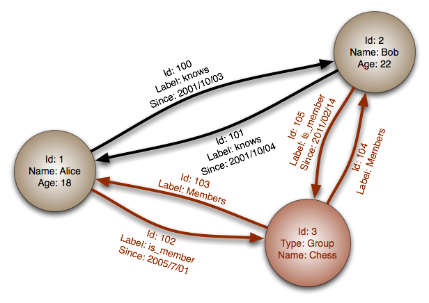
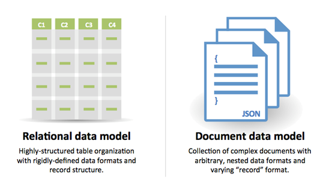
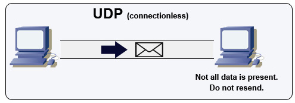

*[English](README.md) ∙ [日本語](README-ja.md) ∙ [简体中文](README-zh-Hans.md) ∙ [繁體中文](README-zh-TW.md) | [العَرَبِيَّة‎](https://github.com/donnemartin/system-design-primer/issues/170) ∙ [বাংলা](https://github.com/donnemartin/system-design-primer/issues/220) ∙ [Português do Brasil](https://github.com/donnemartin/system-design-primer/issues/40) ∙ [Deutsch](https://github.com/donnemartin/system-design-primer/issues/186) ∙ [ελληνικά](https://github.com/donnemartin/system-design-primer/issues/130) ∙ [עברית](https://github.com/donnemartin/system-design-primer/issues/272) ∙ [Italiano](https://github.com/donnemartin/system-design-primer/issues/104) ∙ [한국어](https://github.com/donnemartin/system-design-primer/issues/102) ∙ [فارسی](https://github.com/donnemartin/system-design-primer/issues/110) ∙ [Polski](https://github.com/donnemartin/system-design-primer/issues/68) ∙ [русский язык](https://github.com/donnemartin/system-design-primer/issues/87) ∙ [Español](https://github.com/donnemartin/system-design-primer/issues/136) ∙ [ภาษาไทย](https://github.com/donnemartin/system-design-primer/issues/187) ∙ [Türkçe](https://github.com/donnemartin/system-design-primer/issues/39) ∙ [tiếng Việt](https://github.com/donnemartin/system-design-primer/issues/127) ∙ [Français](https://github.com/donnemartin/system-design-primer/issues/250) | [Add Translation](https://github.com/donnemartin/system-design-primer/issues/28)*

**עזרו [לתרגם](TRANSLATIONS.md) את המדריך!**

# המדריך לתכנון מערכות (The System Design Primer)

<p align="center">
  
  <br/>
</p>

## מוטיבציה

<div dir="rtl">

> ללמוד איך לתכנן מערכות ב-scale גדול.
>
> להתכונן לראיונות ארכיטקטורה.


### ללמוד איך לתכנן מערכות ב-scale גדול

ללמוד כיצד לתכנן מערכות סְקֵילָבִּילִיוּת יסייע לך להפוך למהנדס תוכנה טוב יותר.

תכנון מערכות הוא נושא רחב. יש **כמות אדירה של משאבים ברחבי הרשת** על עקרונות של תכנון מערכות.

ה-repo הזה הוא **אוסף מסודר** של משאבים שנועדו לעזור לך ללמוד איך לבנות מערכות ב-scale.

### ללמוד מקהילת הקוד הפתוח

מדובר בפרויקט קוד פתוח (open source) שמתעדכן באופן מתמשך.

מוזמנים [לתרום!](#תרומה-למדריך)

### להתכונן לראיונות ארכיטקטורה

בנוסף לראיונות קידוד, ארכיטקטורה היא **רכיב נדרש** כחלק מתהליך **ראיונות טכניים** בהרבה חברות טכנולוגיות.

**תוכל לתרגל שאלות ארכיטקטורה נפוצות** ואף **להשוות** את התוצאות שלך עם **פתרונות לדוגמה**: דיונים, קוד, ודיאגרמות.

### נושאים נוספים להכנה לראיונות:

<ul>
  <li><a href="#מדריך-למידה">מדריך למידה</a></li>
  <li><a href="#איך-לגשת-לשאלת-ריאיון-ארכיטקטורה">איך לגשת לשאלת ריאיון ארכיטקטורה</a></li>
  <li><a href="#שאלות-ריאיון-ארכיטקטורה-עם-פתרונות">שאלות ריאיון ארכיטקטורה עם פתרונות</li>
  <li><a href="#שאלות-ריאיון-בתכנון-מונחה-עצמים-עם-פתרונות">שאלות ראיון בתכנון מונחה עצמים, עם פתרונות</a></li>
  <li><a href="#שאלות-נוספות-לראיונות">שאלות נוספות לראיונות </a></li>
</ul>

</div>

## כרטיסיות Anki

<div dir="rtl">

<p align="center">
  
  <br/>
</p>

החבילות המוכנות של כרטיסיות [Anki](https://apps.ankiweb.net/) משתמשות בשיטת **חזרתיות מבוססת מרווחים (Spaced Repetition)** כדי לעזור לך לזכור מושגים חשובים בתכנון מערכות.

<ul dir="rtl">
  <li><a href="https://github.com/donnemartin/system-design-primer/tree/master/resources/flash_cards/System%20Design.apkg">חבילת תכנון מערכות</a></li>
  <li><a href="https://github.com/donnemartin/system-design-primer/tree/master/resources/flash_cards/System%20Design%20Exercises.apkg">חבילת תרגילים בתכנון מערכות</a></li>
  <li><a href="https://github.com/donnemartin/system-design-primer/tree/master/resources/flash_cards/OO%20Design.apkg">חבילת תכנון מונחה עצמים</a></li>
</ul>

מומלצות לשימוש בדרכים.

### משאב לראיונות קידוד: אתגרי קידוד אינטראקטיביים

מחפש משאבים שיעזרו לך להתכונן [**לראיונות קידוד**](https://github.com/donnemartin/interactive-coding-challenges)?

<p align="center">
  
  <br/>
</p>

תעיף מבט על ה-repo המקביל [**Interactive Coding Challenges**](https://github.com/donnemartin/interactive-coding-challenges), שמכיל חבילת Anki נוספת:

<ul dir="rtl">
  <li><a href="https://github.com/donnemartin/interactive-coding-challenges/tree/master/anki_cards/Coding.apkg">חבילת קידוד</a></li>
</ul>

</div>

## תרומה למדריך

<div dir="rtl">

> ללמוד מהקהילה.

אל תהסס להגיש pull requests כדי לעזור:

<ul dir="rtl">
  <li>תיקון שגיאות</li>
  <li>שיפור קטעים קיימים</li>
  <li>הוספת קטעים חדשים</li>
  <li><a href="https://github.com/donnemartin/system-design-primer/issues/28">תרגום לשפות נוספות</a></li>
</ul>

תכנים שעדיין דורשים ליטוש מסומנים בתור <a href="#תחת-פיתוח">תחת פיתוח</a>.

מומלץ לעיין ב<a href="CONTRIBUTING.md">הנחיות לתרומה</a> לפני התחלה.

</div>

## אינדקס נושאים בארכיטקטורה

<div dir="rtl">

> סיכומים של נושאים שונים בתכנון מערכות, כולל יתרונות וחסרונות. **כל החלטה כוללת פשרות (trade-offs)**.
>
> כל חלק מכיל קישורים להרחבה וללמידה מעמיקה יותר.

<p align="center">
  
  <br/>
</p>

<details dir="rtl">
  <summary>אינדקס נושאים</summary>
    <ul dir="rtl">
    <li><a href="#נושאים-בתכנון-מערכות-התחל-כאן">נושאים בתכנון מערכות: התחל כאן</a>
        <ul>
        <li><a href="#שלב-1-צפה-בהרצאה-על-סקילביליות">שלב 1: צפה בהרצאה על סקילביליות</a></li>
        <li><a href="#שלב-2-קרא-מאמר-על-סקילביליות">שלב 2: קרא מאמרים על סקילביליות</a></li>
        <li><a href="#השלבים-הבאים">השלבים הבאים</a></li>
        </ul>
    </li>
    <li><a href="#ביצועים-performance-מול-סקילביליות-scalability">ביצועים (Performance) מול סקילביליות (Scalability)</a></li>
    <li><a href="#שיהוי-latency-מול-תפוקה-throughput">שיהוי (Latency) מול תפוקה (Throughput)</a></li>
    <li><a href="#זמינות-availability-מול-עקביות-consistency">זמינות (Availability) מול עקביות (Consistency)</a>
        <ul>
        <li><a href="#משפט-cap">משפט CAP</a>
            <ul>
            <li><a href="#בחירה-ב-cp---עקביות-ועמידות-לפיצול">עקביות ועמידות לפיצול (CP)</a></li>
            <li><a href="#בחירה-ב-ap---זמינות-ועמידות-לפיצול">זמינות ועמידות לפיצול (AP)</a></li>
            </ul>
        </li>
        </ul>
    </li>
    <li><a href="#דפוסי-עקביות-consistency-patterns">דפוסי עקביות (Consistency Patterns)</a>
        <ul>
        <li><a href="#עקביות-חלשה-weak-consistency">עקביות חלשה (Weak Consistency)</a></li>
        <li><a href="#עקביות-לא-מיידית-eventual-consistency">עקביות לא מיידית (Eventual Consistency)</a></li>
        <li><a href="#עקביות-חזקה-strong-consistency">עקביות חזקה (Strong Consistency)</a></li>
        </ul>
    </li>
    <li><a href="#דפוסי-זמינות-availability-patterns">דפוסי זמינות (Availability Patterns)</a>
        <ul>
        <li><a href="#גיבוי-בזמן-כישלון-fail-over">גיבוי בזמן כישלון (Fail-Over)</a></li>
        <li><a href="#שכפול-replication">שכפול (Replication)</a></li>
        <li><a href="#זמינות-במספרים">זמינות במספרים</a></li>
        </ul>
    </li>
    <li><a href="#מערכת-שמות-דומיינים-dns">מערכת שמות דומיינים (DNS)</a></li>
    <li><a href="#רשתות-הפצת-תוכן-cdn">רשתות הפצת תוכן (CDN)</a>
        <ul>
        <li><a href="#דחיפה-push">דחיפה (Push)</a></li>
        <li><a href="#משיכה-pull">משיכה (Pull)</a></li>
        </ul>
    </li>
    <li><a href="#מאזן-עומסים-load-balancer">מאזן עומסים (Load Balancer)</a>
        <ul>
        <li><a href="#אקטיבי-פסיבי-active-passive">אקטיבי-פסיבי (Active-Passive)</a></li>
        <li><a href="#אקטיבי-אקטיבי-active-active">אקטיבי-אקטיבי (Active-Active)</a></li>
        <li><a href="#איזון-עומסים-בשכבה-4">איזון עומסים בשכבה 4</a></li>
        <li><a href="#איזון-עומסים-בשכבה-7">איזון עומסים בשכבה 7</a></li>
        <li><a href="#גדילה-אופקית-horizontal-scaling">גדילה אופקית (Horizontal Scaling)</a></li>
        </ul>
    </li>
    <li><a href="#פרוקסי-הפוך-reverse-proxy">פרוקסי הפוך (Reverse Proxy)</a>
        <ul>
        <li><a href="#מאזן-עומסים-לעומת-פרוקסי-הפוך">מאזן עומסים לעומת פרוקסי הפוך</a></li>
        </ul>
    </li>
    <li><a href="#שכבת-האפליקציה">שכבת האפליקציה</a>
        <ul>
        <li><a href="#מיקרוסרביסים-microservices">מיקרוסרביסים (Microservices)</a></li>
        <li><a href="#גילוי-סרביסים-service-discovery">גילוי סרביסים (Service Discovery)</a></li>
        </ul>
    </li>
    <li><a href="#מסדי-נתונים-db">מסדי נתונים (DB)</a>
        <ul>
        <li><a href="#מסדי-נתונים-רלציוניים-rdbms">מסדי נתונים רלציוניים (RDBMS)</a>
            <ul>
            <li><a href="#שכפול-master-slave">שכפול Master-Slave</a></li>
            <li><a href="#שכפול-master-master">שכפול Master-Master</a></li>
            <li><a href="#פדרציה-federation">פדרציה (Federation)</a></li>
            <li><a href="#חלוקה-sharding">חלוקה (Sharding)</a></li>
            <li><a href="#דנורמליזציה-denormalization">דנורמליזציה (Denormalization)</a></li>
            <li><a href="#אופטימיזציית-sql-tuning">אופטימיזציית SQL Tuning</a></li>
            </ul>
        </li>
        <li><a href="#מסדי-נתונים-nosql">מסדי נתונים NoSQL</a>
            <ul>
            <li><a href="#אחסון-key-value">אחסון Key-Value</a></li>
            <li><a href="#אחסון-document">אחסון Document</a></li>
            <li><a href="#אחסון-wide-column">אחסון Wide Column</a></li>
            <li><a href="#אחסון-graph">אחסון Graph</a></li>
            </ul>
        </li>
        <li><a href="#השוואה-sql-or-nosql">השוואה: SQL or NoSQL</a></li>
        </ul>
    </li>
    <li><a href="#מטמון-cache">מטמון (Cache)</a>
        <ul>
        <li><a href="#מטמון-בצד-לקוח">מטמון בצד לקוח</a></li>
        <li><a href="#מטמון-cdn">מטמון CDN</a></li>
        <li><a href="#מטמון-בשרת">מטמון בשרת</a></li>
        <li><a href="#מטמון-במסד-נתונים">מטמון במסד נתונים</a></li>
        <li><a href="#מטמון-באפליקציה">מטמון באפליקציה</a></li>
        <li><a href="#מטמון-ברמת-שאילתה">מטמון ברמת שאילתה</a></li>
        <li><a href="#מטמון-ברמת-אובייקט">מטמון ברמת אובייקט</a></li>
        <li><a href="#מתי-לעדכן-את-ה-cache">מתי לעדכן את ה-cache?</a>
            <ul>
            <li><a href="#אסטרטגיית-cache-aside">אסטרטגיית Cache-Aside</a></li>
            <li><a href="#אסטרטגיית-write-through">אסטרטגיית Write-Through</a></li>
            <li><a href="#אסטרטגיית-write-behindback">אסטרטגיית Write-Behind/Back</a></li>
            <li><a href="#אסטרטגיית-refresh-ahead">אסטרטגיית Refresh-Ahead</a></li>
            </ul>
        </li>
        </ul>
    </li>
    <li><a href="#אסינכרוניות-asynchronism">אסינכרוניות (Asynchronism)</a>
        <ul>
        <li><a href="#תורי-הודעות-message-queues">תורי הודעות (Message Queues)</a></li>
        <li><a href="#תורי-משימות-task-queues">תורי משימות (Task Queues)</a></li>
        <li><a href="#לחץ-נגדי-back-pressure">לחץ נגדי (Back Pressure)</a></li>
        </ul>
    </li>
    <li><a href="#תקשורת-communication">תקשורת (Communication)</a>
        <ul>
        <li><a href="#פרוטוקול-http">פרוטוקול HTTP</a></li>
        <li><a href="#פרוטוקול-tcp">פרוטוקול TCP</a></li>
        <li><a href="#פרוטוקול-udp">פרוטוקול UDP</a></li>
        <li><a href="#פרוטוקול-rpc">פרוטוקול RPC</a></li>
        <li><a href="#ממשק-rest">ממשק REST</a></li>
        </ul>
    </li>
    <li><a href="#אבטחת-מידע-security">אבטחת מידע (Security)</a></li>
    <li><a href="#נספחים">נספחים</a>
        <ul>
        <li><a href="#טבלת-חזקות-של-2">טבלת חזקות של 2</a></li>
        <li><a href="#מספרי-latency-חשובים">מספרי latency חשובים</a></li>
        <li><a href="#שאלות-נוספות-לראיונות">שאלות נוספות לראיונות</a></li>
        <li><a href="#ארכיטקטורות-מהעולם-האמיתי">ארכיטקטורות מהעולם האמיתי</a></li>
        <li><a href="#ארכיטקטורות-של-חברות">ארכיטקטורות של חברות</a></li>
        <li><a href="#בלוגים-טכניים-של-חברות">בלוגים טכניים של חברות</a></li>
        </ul>
    </li>
    <li><a href="#תחת-פיתוח">תחת פיתוח</a></li>
    <li><a href="#קרדיטים">קרדיטים</a></li>
    <li><a href="#יצירת-קשר">פרטי קשר</a></li>
    <li><a href="#רישיון">רישיון</a></li>
    </ul>
</details>

</div>

## מדריך למידה

<div dir="rtl">

> נושאים מוצעים ללימוד לפי לוח הזמנים לריאיון שלך (קצר, בינוני, ארוך)

<p align="center">
  
  <br/>
</p>

**ש: עבור הראיונות, האם אני אמור לדעת כל מה שכתוב כאן?**

**ת: לא, אתה לא צריך לדעת הכול כדי להתכונן לריאיון**.

מה שאתה תישאל עליו בריאיון תלוי בדברים כגון:

<ul dir="rtl">
  <li>כמה ניסיון יש לך</li>
  <li>מה הרקע הטכני שלך</li>
  <li>לאילו משרות אתה מתראיין</li>
  <li>באילו חברות אתה מתראיין</li>
  <li>מזל</li>
</ul>

לרוב מצופה ממועמדים מנוסים יותר לדעת יותר על ארכיטקטורה ותכנון מערכות. ארכיטקטים או ראשי צוותים מצופים לדעת יותר מאשר עובדים בודדים. חברות טכנולוגיות מובילות לרוב יערכו ריאיון אחד או יותר של ארכיטקטורה.

רצוי להתחיל רחב ולהעמיק במספר תחומים. זה עוזר לדעת קצת בנוגע למספר נושאי מפתח בתכנון מערכות. תתאים את המדריך לפי לוח הזמן שלך, הניסיון, המשרות שאתה מתראיין אליהן, והחברות שבהן אתה מתראיין.

<ul dir="rtl">
  <li><strong>לוח זמנים קצר</strong> – התמקד ב<strong>רוחב</strong> של נושאים בתכנון מערכות. תרגל פתרון של <strong>כמה</strong> שאלות ריאיון.</li>
  <li><strong>לוח זמנים בינוני</strong> – התמקד ב<strong>רוחב</strong> ו<strong>קצת עומק</strong> של נושאים בתכנון מערכות. תרגל פתרון של <strong>הרבה</strong> שאלות ריאיון.</li>
  <li><strong>לוח זמנים ארוך</strong> – התמקד ב<strong>רוחב</strong> ו<strong>יותר עומק</strong> של נושאים בתכנון מערכות. תרגל פתרון של <strong>רוב</strong> שאלות הריאיון.</li>
</ul>

<table dir="rtl" border="1" cellspacing="0" cellpadding="6">
  <thead>
    <tr>
      <th></th>
      <th>קצר</th>
      <th>בינוני</th>
      <th>ארוך</th>
    </tr>
  </thead>
  <tbody>
    <tr>
      <td>קרא את <a href="#אינדקס-נושאים-בארכיטקטורה">אינדקס נושאים בארכיטקטורה</a> כדי לקבל הבנה כללית של איך מערכות עובדות</td>
      <td>:+1:</td>
      <td>:+1:</td>
      <td>:+1:</td>
    </tr>
    <tr>
      <td>קרא כמה מאמרים מתוך <a href="#בלוגים-טכניים-של-חברות">בלוגים טכניים של חברות</a> שאתה מתראיין אליהן</td>
      <td>:+1:</td>
      <td>:+1:</td>
      <td>:+1:</td>
    </tr>
    <tr>
      <td>קרא על כמה <a href="#ארכיטקטורות-מהעולם-האמיתי">ארכיטקטורות מהעולם האמיתי</a></td>
      <td>:+1:</td>
      <td>:+1:</td>
      <td>:+1:</td>
    </tr>
    <tr>
      <td>חזור על <a href="#איך-לגשת-לשאלת-ריאיון-ארכיטקטורה">איך לגשת לשאלת ריאיון ארכיטקטורה</a></td>
      <td>:+1:</td>
      <td>:+1:</td>
      <td>:+1:</td>
    </tr>
    <tr>
      <td>תרגל <a href="#שאלות-ריאיון-ארכיטקטורה-עם-פתרונות">שאלות ריאיון ארכיטקטורה עם פתרונות</a></td>
      <td>כמה</td>
      <td>הרבה</td>
      <td>רוב</td>
    </tr>
    <tr>
      <td>תרגל <a href="#שאלות-ריאיון-בתכנון-מונחה-עצמים-עם-פתרונות">שאלות ריאיון בתכנון מונחה עצמים עם פתרונות</a></td>
      <td>כמה</td>
      <td>הרבה</td>
      <td>רוב</td>
    </tr>
    <tr>
      <td>חזור על <a href="#שאלות-נוספות-לראיונות">שאלות ריאיון נוספות</a></td>
      <td>כמה</td>
      <td>הרבה</td>
      <td>רוב</td>
    </tr>
  </tbody>
</table>

</div>

## איך לגשת לשאלת ריאיון ארכיטקטורה

<div dir="rtl">

> איך לפתור שאלת ראיון ארכיטקטורה.

ראיון ארכיטקטורה הוא **שיחה פתוחה**. מצופה ממך להוביל אותה.

אתה יכול להיעזר בצעדים הבאים כדי להנחות את הדיון. כדי לחזק את ההבנה של התהליך, תעבור על [שאלות ריאיון ארכיטקטורה עם פתרונות](#שאלות-ריאיון-ארכיטקטורה-עם-פתרונות) אל מול הצעדים הבאים:

### תאר מקרי שימוש, אילוצים והנחות עבודה

אסוף דרישות והגדר את ה-scope של הבעיה.
שאל שאלות כדי להבהיר את מקרי השימוש והאילוצים. דון בהנחות העבודה שאתה עושה.

<ul dir="rtl">
  <li>מי הולך להשתמש במערכת?</li>
  <li>איך הם הולכים להשתמש בה?</li>
  <li>כמה משתמשים יהיו?</li>
  <li>מה המערכת עושה?</li>
  <li>מה הקלטים והפלטים של המערכת?</li>
  <li>בכמה דאטא נצטרך לטפל?</li>
  <li>כמה בקשות לשניה מחכות לנו?</li>
  <li>מה היחס הצפוי בין קריאה לכתיבה?</li>
</ul>

### שלב 2: כתוב תכנון במבט על (high level design)

כתוב תכנון high level עם כל הרכיבים החשובים.

<ul dir="rtl">
  <li>שרטט את הרכיבים החשובים והקשרים ביניהם</li>
  <li>תצדיק את הרעיונות שלך</li>
</ul>

### שלב 3: תכנן את הרכיבים המרכזיים

צלול לפרטים של כל רכיב מרכזי. לדוגמה, אם התבקשת לתכנן [שירות קיצור כתובות url](solutions/system_design/pastebin/README.md), דון בנושאים הבאים:

<ul dir="rtl">
  <li>יצירה ואחסון hash של ה-url המלא
    <ul>
      <li>דרכים כמו <a href="solutions/system_design/pastebin/README.md">MD5</a> ו-<a href="solutions/system_design/pastebin/README.md">Base62</a></li>
      <li>התנגשויות hash</li>
      <li>מסד נתונים SQL או NoSQL</li>
      <li>סכמת הנתונים</li>
    </ul>
  </li>
  <li>המרה של כתובת מקוצרת לכתובת המלאה
    <ul>
      <li>חיפוש ב-DB</li>
    </ul>
  </li>
  <li>תכנון API ותכנון מונחה עצמים</li>
</ul>

### שלב 4: תבצע scale לתכנון

זהה וטפל בצווארי בקבוק, בהתאם לאילוצים. למשל, האם תזדקק לאחד מהפתרונות הבאים כדי להתמודד עם בעיות של סקילביליות?

<ul dir="rtl">
  <li>מאזן עומסים (Load balancer)</li>
  <li>סקיילינג אופקי (Horizontal scaling)</li>
  <li>שמירה במטמון (Caching)</li>
  <li>פיצול בסיס נתונים (Database sharding)</li>
</ul>

דון בפתרונות אפשריים וה-trade-offs. הכול הוא trade-off. התמודד עם צווארי בקבוק בעזרת [עקרונות תכנון מערכת סקילבילית](#אינדקס-נושאים-בארכיטקטורה).

### חישובי מספרים (back-of-the-enveloppe)

ייתכן שיבקשו ממך לבצע הערכות באופן ידני. ראה את [הנספחים](#נספחים) עבור המשאבים הבאים:

- [Use back of the envelope calculations](http://highscalability.com/blog/2011/1/26/google-pro-tip-use-back-of-the-envelope-calculations-to-choo.html)
- [Powers of two table](#powers-of-two-table)
- [Latency numbers every programmer should know](#latency-numbers-every-programmer-should-know)

### מקורות לקריאה נוספת

עיין בקישורים הבאים כדי להבין טוב יותר למה לצפות:

- [How to ace a systems design interview](https://www.palantir.com/2011/10/how-to-rock-a-systems-design-interview/)
- [The system design interview](http://www.hiredintech.com/system-design)
- [Intro to Architecture and Systems Design Interviews](https://www.youtube.com/watch?v=ZgdS0EUmn70)
- [System design template](https://leetcode.com/discuss/career/229177/My-System-Design-Template)

</div>


## שאלות ריאיון ארכיטקטורה עם פתרונות

<div dir="rtl">

> שאלות נפוצות בריאיון ארכיטקטורה עם הסברים לדוגמה, קוד, ודיאגרמות.
>
> הפתרונות מפנים לתוכן שנמצא בתיקיית `solutions/`.

<table dir="rtl">
  <thead>
    <tr>
      <th>שאלה</th>
      <th>פתרון</th>
    </tr>
  </thead>
  <tbody>
    <tr>
      <td>תכנן את pastebin.com (או bit.ly)</td>
      <td><a href="solutions/system_design/pastebin/README.md">פתרון</a></td>
    </tr>
    <tr>
      <td>תכנן את ציר הזמן והחיפוש של טוויטר (או הפיד והחיפוש של פייסבוק)</td>
      <td><a href="solutions/system_design/twitter/README.md">פתרון</a></td>
    </tr>
    <tr>
      <td>תכנן web crawler</td>
      <td><a href="solutions/system_design/web_crawler/README.md">פתרון</a></td>
    </tr>
    <tr>
      <td>תכנן את Mint.com</td>
      <td><a href="solutions/system_design/mint/README.md">פתרון</a></td>
    </tr>
    <tr>
      <td>תכנן את מבני הנתונים של רשת חברתית</td>
      <td><a href="solutions/system_design/social_graph/README.md">פתרון</a></td>
    </tr>
    <tr>
      <td>תכנן אחסון key-value למנוע חיפוש</td>
      <td><a href="solutions/system_design/query_cache/README.md">פתרון</a></td>
    </tr>
    <tr>
      <td>תכנן את מנגנון דירוג המכירות לפי קטגוריה של אמזון</td>
      <td><a href="solutions/system_design/sales_rank/README.md">פתרון</a></td>
    </tr>
    <tr>
      <td>תכנן מערכת שיכולה לגדול למיליוני משתמשים על AWS</td>
      <td><a href="solutions/system_design/scaling_aws/README.md">פתרון</a></td>
    </tr>
    <tr>
      <td>הוסף שאלה לתכנון מערכת</td>
      <td><a href="#תרומה-למדריך
    ">תרום</a></td>
    </tr>
  </tbody>
</table>

### תכנן את pastebin.com (או bit.ly)

[צפה בתרגיל ובפתרון](solutions/system_design/pastebin/README.md)

<details>
  <summary>הצג/הסתר דיאגרמה</summary>
  <p align="center">
    
    <br/>
  </p>
</details>

### תכנן את ציר הזמן והחיפוש של טוויטר (או הפיד והחיפוש של פייסבוק)

[צפה בתרגיל ובפתרון](solutions/system_design/twitter/README.md)

<details>
  <summary>הצג/הסתר דיאגרמה</summary>
  <p align="center">
    
    <br/>
  </p>
</details>

### תכנן web crawler

[צפה בתרגיל ובפתרון](solutions/system_design/web_crawler/README.md)

<details>
  <summary>הצג/הסתר דיאגרמה</summary>
  <p align="center">
    
    <br/>
  </p>
</details>

### תכנן את Mint.com

[צפה בתרגיל ובפתרון](solutions/system_design/mint/README.md)

<details>
  <summary>הצג/הסתר דיאגרמה</summary>
  <p align="center">
    
    <br/>
  </p>
</details>

### תכנן את מבני הנתונים של רשת חברתית

[צפה בתרגיל ובפתרון](solutions/system_design/social_graph/README.md)

<details>
  <summary>הצג/הסתר דיאגרמה</summary>
  <p align="center">
    
    <br/>
  </p>
</details>

### תכנן אחסון key-value למנוע חיפוש

[צפה בתרגיל ובפתרון](solutions/system_design/query_cache/README.md)

<details>
  <summary>הצג/הסתר דיאגרמה</summary>
  <p align="center">
    
    <br/>
  </p>
</details>

### תכנן את מנגנון דירוג המכירות לפי קטגוריה של אמזון

[צפה בתרגיל ובפתרון](solutions/system_design/sales_rank/README.md)

<details>
  <summary>הצג/הסתר דיאגרמה</summary>
  <p align="center">
    
    <br/>
  </p>
</details>

### תכנן מערכת שיכולה לגדול למיליוני משתמשים על AWS

[צפה בתרגיל ובפתרון](solutions/system_design/scaling_aws/README.md)

<details>
  <summary>הצג/הסתר דיאגרמה</summary>
  <p align="center">
    
    <br/>
  </p>
</details>

</div>


## שאלות ריאיון בתכנון מונחה עצמים עם פתרונות

<div dir="rtl">

> שאלות נפוצות בתכנון מונחה עצמים עם הסברים לדוגמה, קוד, ודיאגרמות.
>
> הפתרונות מפנים לתוכן שנמצא בתיקיית `solutions/`.

>**הערה: החלק הזה עדיין בפיתוח**

<table>
<thead>
    <tr>
    <th>שאלה</th>
    <th>פתרון</th>
    </tr>
</thead>
<tbody>
    <tr>
    <td>תכנן Hash Map</td>
    <td><a href="solutions/object_oriented_design/hash_table/hash_map.ipynb">פתרון</a></td>
    </tr>
    <tr>
    <td>תכנן מנגנון Cache בשיטת Least Recently Used</td>
    <td><a href="solutions/object_oriented_design/lru_cache/lru_cache.ipynb">פתרון</a></td>
    </tr>
    <tr>
    <td>תכנן מרכז שירות טלפוני (Call Center)</td>
    <td><a href="solutions/object_oriented_design/call_center/call_center.ipynb">פתרון</a></td>
    </tr>
    <tr>
    <td>תכנן חפיסת קלפים</td>
    <td><a href="solutions/object_oriented_design/deck_of_cards/deck_of_cards.ipynb">פתרון</a></td>
    </tr>
    <tr>
    <td>תכנן חניון</td>
    <td><a href="solutions/object_oriented_design/parking_lot/parking_lot.ipynb">פתרון</a></td>
    </tr>
    <tr>
    <td>תכנן שרת צ'אט</td>
    <td><a href="solutions/object_oriented_design/online_chat/online_chat.ipynb">פתרון</a></td>
    </tr>
    <tr>
    <td>תכנן מערך מעגלי</td>
    <td><a href="#תרומה-למדריך
  ">תרום</a></td>
    </tr>
    <tr>
    <td>הוסף שאלה בעיצוב מונחה עצמים</td>
    <td><a href="#תרומה-למדריך
  ">תרום</a></td>
    </tr>
</tbody>
</table>

</div>

## נושאים בתכנון מערכות: התחל כאן

<div dir="rtl">

חדש בתחום תכנון מערכות?

ראשית, תצטרך לקבל הבנה בסיסית של העקרונות הנפוצים, ללמוד מה הם, איך משתמשים בהם, מה היתרונות והחסרונות של כל אחד מהם.

### שלב 1: צפה בהרצאה על סקילביליות

[Scalability Lecture at Harvard](https://www.youtube.com/watch?v=-W9F__D3oY4)

* Topics covered:
    * Vertical scaling
    * Horizontal scaling
    * Caching
    * Load balancing
    * Database replication
    * Database partitioning

### שלב 2: קרא מאמר על סקילביליות

[Scalability](https://web.archive.org/web/20221030091841/http://www.lecloud.net/tagged/scalability/chrono)

* Topics covered:
    * [Clones](https://web.archive.org/web/20220530193911/https://www.lecloud.net/post/7295452622/scalability-for-dummies-part-1-clones)
    * [Databases](https://web.archive.org/web/20220602114024/https://www.lecloud.net/post/7994751381/scalability-for-dummies-part-2-database)
    * [Caches](https://web.archive.org/web/20230126233752/https://www.lecloud.net/post/9246290032/scalability-for-dummies-part-3-cache)
    * [Asynchronism](https://web.archive.org/web/20220926171507/https://www.lecloud.net/post/9699762917/scalability-for-dummies-part-4-asynchronism)

### השלבים הבאים

בהמשך, נסתכל על trade-offs ב-high level:

* **Performance** vs **scalability**
* **Latency** vs **throughput**
* **Availability** vs **consistency**

נזכור כי **הכול זה trade-off**.
לאחר מכן נצלול לנושאים ספציפיים יותר כמו DNS, CDN ו-load balancers.

</div>


## ביצועים (Performance) מול סקילביליות (Scalability)

<div dir="rtl">

שירות הוא **סקילבילי (scalable)** אם הוא משתפר **בביצועים (performance)** שלו באופן פרופורציונלי למשאבים שנוספו. באופן כללי, שיפור בביצועים פירושו היכולת לתת שירות ליותר יחידות עבודה, אך הוא יכול גם לבוא לידי ביטוי ביכולת להתמודד עם יחידות עבודה גדולות יותר, ככל שהדאטא גדל.<sup><a href=http://www.allthingsdistributed.com/2006/03/a_word_on_scalability.html>1</a></sup>

דרך נוספת להסתכל על ביצועים מול סקילביליות

<ul>
      <li>אם יש לך בעיית <strong>ביצועים</strong>, המערכת איטית עבור משתמש בודד.</li>
      <li>אם יש לך בעיית <strong>סקילביליות</strong>, המערכת מהירה עבור משתמש בודד אך איטית בעומס כבד.</li>
    </ul>

### מקורות וקריאה נוספת

* [A word on scalability](http://www.allthingsdistributed.com/2006/03/a_word_on_scalability.html)
* [Scalability, availability, stability, patterns](http://www.slideshare.net/jboner/scalability-availability-stability-patterns/)

</div>

## שיהוי (Latency) מול תפוקה (Throughput)

<div dir="rtl">

**שיהוי** הוא הזמן שנדרש כדי לבצע פעולה כלשהי או להפיק תוצאה כלשהי

**תפוקה** היא מספר הפעולות או התוצאות ליחידת זמן.

באופן כללי, כדאי לשאוף **לתפוקה מקסימלית** עם **שיהוי סביר**.

### חומרים וקריאה נוספת

* [Understanding latency vs throughput](https://community.cadence.com/cadence_blogs_8/b/fv/posts/understanding-latency-vs-throughput)

</div>

## זמינות (Availability) מול עקביות (Consistency)

<div dir="rtl">

### משפט CAP

<p align="center">
  
  <br/>
  <i><a href=http://robertgreiner.com/2014/08/cap-theorem-revisited>Source: CAP theorem revisited</a></i>
</p>

במערכות מחשוב מבוזרות, ניתן לתמוך רק בשניים מתוך שלושת התנאים הבאים:

<ul>
  <li><strong>עקביות (Consistency)</strong> – כל קריאה מקבלת את הכתיבה העדכנית ביותר, או שגיאה.</li>
  <li><strong>זמינות (Availability)</strong> - כל בקשה תקבל מענה, ללא הבטחה שהמידע שיחזור יהיה העדכני ביותר.</li>
  <li><strong>עמידות לפיצול (Partition Tolerance)</strong> - המערכת ממשיכה לתפקד גם במקרים בהם נאבדות או מתעכבות מספר הודעות בין שרתי המערכת בגלל בעיות תקשורת.</li>
</ul>

*ניתן לצאת מנקודת הנחה שרשתות לא אמינות - כך שנהיה חייבים לתמוך ב-״Partition tolerance״. 
לכן, נצטרך לבחור אחד משני האחרים - זמינות או עקביות.*

#### בחירה ב-CP - עקביות ועמידות לפיצול

המתנה לתשובה מהמערכת (אשר סובלת מ-network partition) עלולה להסתיים בשגיאת timeout. לכן, CP הוא בחירה טובה במידה ויש הצדקה עסקית לקריאות וכתיבות אטומיות.

#### בחירה ב-AP - זמינות ועמידות לפיצול

תשובות לבקשות מהמערכת מחזירות את הגרסה הזמינה ביותר של הנתונים הזמינים בשרת הרלוונטי, שאינה בהכרח האחרונה. כתיבה עשויה לקחת זמן מסוים עד שתסתיים, עד אשר התקשורת הבעייתית תיפתר.

לכן, AP הוא בחירה טובה במידה ויש הצדקה עסקית לעבוד במצב של [eventual consistency](#עקביות-לא-מיידית-eventual-consistency) או במידה והמערכת צריכה להמשיך לשרת למרות שגיאות בלתי-תלויות.

### חומרים וקריאה נוספת

* [CAP theorem revisited](http://robertgreiner.com/2014/08/cap-theorem-revisited/)
* [A plain english introduction to CAP theorem](http://ksat.me/a-plain-english-introduction-to-cap-theorem)
* [CAP FAQ](https://github.com/henryr/cap-faq)
* [The CAP theorem](https://www.youtube.com/watch?v=k-Yaq8AHlFA)

</div>


## דפוסי עקביות (Consistency Patterns)

<div dir="rtl">

כאשר קיימים מספר עותקים של אותם נתונים, עלינו להחליט כיצד לסנכרן ביניהם כדי שלקוחות יקבלו תצוגה עקבית של המידע.  
ניזכר בהגדרה של עקביות מתוך [משפט CAP](#משפט-cap): כל קריאה מקבלת את הכתיבה העדכנית ביותר או שגיאה.

### עקביות חלשה (Weak Consistency)

לאחר כתיבה, קריאות עשויות לראות או לא לראות את הערך החדש שנכתב. הגישה כאן היא של best effort - המאמץ הטוב ביותר.

גישה זו נפוצה במערכות כמו memcached. עקביות חלשה מתאימה למקרים של מערכות זמן-אמת, כמו VoIP, שיחות וידאו, ומשחקים מרובי משתתפים.  
לדוגמה, אם אתה בשיחת טלפון ומאבד קליטה לכמה שניות, כשאתה חוזר אתה לא שומע מה שנאמר בזמן שלא הייתה קליטה.

### עקביות לא מיידית (Eventual Consistency)

לאחר כתיבה, הקריאות יראו בסופו של דבר את מה שנכתב (בדרך כלל תוך מספר מילישניות). הנתונים משוכפלים באופן אסינכרוני.

גישה זו נפוצה במערכות כמו DNS ומייל. עקביות לא מיידית מתאימה למערכות ששומרות על זמינות גבוהה במיוחד.

### עקביות חזקה (Strong Consistency)

לאחר כתיבה, הקריאות יראו תמיד את הערך החדש שנכתב. השכפול מתבצע באופן סינכרוני.

גישה זו נפוצה במערכות קבצים ובמסדי נתונים רלציוניים (RDBMS). עקביות חזקה מתאימה למערכות שדורשות טרנזקציות.

### מקורות וקריאה נוספת

- [Transactions across data centers](http://snarfed.org/transactions_across_datacenters_io.html)

</div>

## דפוסי זמינות (Availability Patterns)

<div dir="rtl">

קיימים שני דפוסים משלימים לתמיכה בזמינות גבוהה: **מעבר אוטומטי (fail-over)** ו-**שכפול (replication)**.

### גיבוי בזמן כישלון (Fail-Over)

#### אקטיבי-פסיבי (Active-Passive)

במבנה אקטיבי-פסיבי, נשלחים heartbeat-ים בין השרת הפעיל לשרת הרזרבי (הפסיבי). אם ה-heartbeat נקטע, השרת הפסיבי לוקח את כתובת ה-IP של הפעיל וממשיך את השירות.

משך זמן ההשבתה תלוי אם השרת הפסיבי פועל מראש במצב 'חם' (hot standby), או שיש להפעילו ממצב 'קר' (cold standby). רק השרת הפעיל מקבל תעבורה.

סוג זה נקרא גם Master-Slave.

#### אקטיבי-אקטיבי (Active-Active)

במבנה אקטיבי-אקטיבי, שני השרתים מקבלים תעבורה ומחלקים ביניהם את העומס.

אם השרתים חשופים פומבית, שרת ה-DNS צריך לדעת על כתובות ה-IP הציבוריות של שניהם. אם השרתים פנימיים, על לוגיקת האפליקציה להכיר את שניהם.

סוג זה נקרא גם Master-Master.

### חסרונות של מעבר אוטומטי

<ul dir="rtl">
  <li>מעבר אוטומטי מוסיף חומרה ועלות תפעולית.</li>
  <li>קיימת אפשרות לאובדן נתונים אם המערכת הפעילה קורסת לפני שהספיקה לשכפל את המידע למערכת הפסיבית.</li>
</ul>

### שכפול (Replication)

#### עבור Master-Slave/Master-Master

נושא זה נדון בפירוט נוסף בחלק על [מסדי נתונים](#מסדי-נתונים-db):

- [Master-slave replication](#שכפול-master-slave)
- [Master-master replication](#שכפול-master-master)

</div>

### זמינות במספרים

נהוג למדוד זמינות לפי זמן פעילות (uptime) או חוסר פעילות (downtime)כאחוז מהזמן שבו השירות פועל. המדד הנפוץ הוא לפי מספר התשיעיות — לדוגמה: שירות עם זמינות של 99.99% מתואר כבעל ארבע תשיעיות.

#### זמינות של 99.9% — שלוש תשיעיות

| Duration            | Acceptable downtime|
|---------------------|--------------------|
| Downtime per year   | 8h 45min 57s       |
| Downtime per month  | 43m 49.7s          |
| Downtime per week   | 10m 4.8s           |
| Downtime per day    | 1m 26.4s           |

#### זמינות של 99.99% — ארבע תשיעיות

| Duration            | Acceptable downtime|
|---------------------|--------------------|
| Downtime per year   | 52min 35.7s        |
| Downtime per month  | 4m 23s             |
| Downtime per week   | 1m 5s              |
| Downtime per day    | 8.6s               |

#### זמינות במקביל לעומת בטור

אם שירות מורכב ממספר רכיבים שעלולים להיכשל, הזמינות הכוללת של השירות תלויה באופן שבו הם מסודרים - בטור או במקביל.

###### בטור

כאשר שני רכיבים עם זמינות קטנה מ-100% מסודרים בטור, הזמינות הכוללת יורדת:

```
Availability (Total) = Availability (Foo) * Availability (Bar)
```

אם גם `Foo` וגם `Bar` זמינים ברמה של 99.9%, הזמינות הכוללת שלהם בטור תהיה 99.8%.

###### במקביל

הזמינות הכוללת עולה כאשר שני רכיבים בעלי זמינות קטנה מ־100% פועלים במקביל:

```
Availability (Total) = 1 - (1 - Availability (Foo)) * (1 - Availability (Bar))
```

אם גם `Foo` וגם `Bar` זמינים ברמה של 99.9%, הזמינות הכוללת שלהם במקביל תהיה 99.9999%.

## מערכת שמות דומיינים (DNS)

<div dir="rtl">

<p align="center">
  
  <br/>
  <i><a href="http://www.slideshare.net/srikrupa5/dns-security-presentation-issa">מקור: מצגת אבטחת DNS</a></i>
</p>

מערכת שמות דומיינים (DNS) ממירה שם דומיין כמו `www.example.com` לכתובת IP.

ה-DNS בנוי בהיררכיה: כאשר ישנם כמה שרתי ניהול בשכבה העליונה.  ה-router שלך או ספק האינטרנט (ISP) מספקים כתובות לשרת(י) DNS שיש לפנות אליהם בעת ביצוע חיפוש של כתובת.  
שרתי DNS בשכבה נמוכה יותר, מבצעים cache למיפויים, שעלולים להיות לא עדכניים (stale) אם הרשומה המעודכנת עוד לא עברה מהשרת בשכבה הגבוהה עד למטה (propagation delays).
המיפוי של ה-DNS יכול להישמר על ידי הדפדפן או מערכת ההפעלה לפרק זמן מסוים, הנקבע על ידי [TTL – Time To Live](https://he.wikipedia.org/wiki/Time_to_live).

<ul dir="rtl">
  <li><strong>NS record (Name Server)</strong> – מגדירה את שרתי DNS עבור הדומיין/תת-דומיין.</li>
  <li><strong>MX record (Mail Exchange)</strong> – מגדירה את שרתי הדואר לקבלת הודעות.</li>
  <li><strong>A record (Address)</strong> – ממפה שם לכתובת IP.</li>
  <li><strong>CNAME (Canonical Name)</strong> – ממפה שם לשם אחר (למשל example.com → <code>www.example.com</code>) או לרשומת <code>A</code>.</li>
</ul>

שירותים מנוהלים כמו [CloudFlare](https://www.cloudflare.com/dns/) ו-[Route 53](https://aws.amazon.com/route53/) מספקים DNS מנוהל.  
חלקם מאפשרים ניתוב תעבורה בשיטות שונות:

- [Weighted round robin](https://www.jscape.com/blog/load-balancing-algorithms)
    - Prevent traffic from going to servers under maintenance
    - Balance between varying cluster sizes
    - A/B testing
- [Latency-based](https://docs.aws.amazon.com/Route53/latest/DeveloperGuide/routing-policy-latency.html)
- [Geolocation-based](https://docs.aws.amazon.com/Route53/latest/DeveloperGuide/routing-policy-geo.html)

### חסרונות (DNS)

<ul dir="rtl">
  <li>פנייה לשרת DNS מוסיפה עיכוב קל, אם כי ברוב המקרים הוא מתמתן בזכות caching כפי שתואר קודם.</li>
  <li>ניהול שרתי DNS יכול להיות מורכב, ולרוב מנוהל על-ידי <a href="http://superuser.com/questions/472695/who-controls-the-dns-servers/472729">ממשלות, ISPs וחברות גדולות</a>.</li>
  <li>שירותי DNS היו יעד לאחרונה ל-<a href="http://dyn.com/blog/dyn-analysis-summary-of-friday-october-21-attack/">מתקפות DDoS</a>, מה שמנע מגולשים להגיע לאתרים (למשל Twitter) בלי להכיר כתובות IP ידניות.</li>
</ul>

### מקורות וקריאה נוספת

- [DNS architecture](https://technet.microsoft.com/en-us/library/dd197427(v=ws.10).aspx)
- [Wikipedia](https://en.wikipedia.org/wiki/Domain_Name_System)
- [DNS articles](https://support.dnsimple.com/categories/dns/)

</div>

## רשתות הפצת תוכן (CDN)

<div dir="rtl">

<p align="center">
  
  <br/>
  <i><a href="https://www.creative-artworks.eu/why-use-a-content-delivery-network-cdn/">מקור: Why use a CDN</a></i>
</p>

רשת הפצת תוכן (CDN) היא רשת גלובלית ומבוזרת של שרתי proxy, אשר מנגישים תכנים ממיקומים הקרובים יותר למשתמש הקצה.
בדרך כלל, קבצים סטטיים כמו HTML/CSS/JS, תמונות וסרטונים, מונגשים על ידי CDN, למרות שיש כאלו כמו CloudFront של Amazon התומכים גם בתכנים דינמיים.
מיפוי ה-DNS שיתקבל ינחה את הלקוחות לאיזה שרת להתחבר.

הגשת תוכן מ-CDN משפר ביצועים משמעותית בשני אופנים:

<ul dir="rtl">
  <li>המשתמש מקבל תוכן מ-data center הקרוב אליו פיזית.</li>
  <li>השרתים אינם צריכים לשרת בקשות שה-CDN מספק במקומם.</li>
</ul>

### דחיפה (Push)

ב-Push CDN התוכן נדחף אל ה-CDN בכל פעם שהוא משתנה בשרת המקור.  האחריות על העלאת הקבצים וכתיבת ה-URLs המופנים ל-CDN היא שלך.  אתה מגדיר את הזמן שבו פג תוקפו של תוכן מסוים, ומתי הוא מתעדכן.

תוכן מועלה רק כאשר הוא חדש, או עבר שינוי, מה שמפחית תעבורה אבל ממקסם על האחסון. אתרים עם מעט תוכן או תעבורה, או עם תוכן שלא מתעדכן באופן תדיר עובדים טוב עם Push CDN. התוכן נמצא ב-CDN פעם אחת, במקום שישלפו אותו מחדש בתדירות קבועה.

### משיכה (Pull)

ב-Pull CDN התוכן נשלף מהשרת המקור רק כאשר משתמש מבקש אותו לראשונה.  הקבצים נשארים בשרת שלך ו-URLs מפנים ל-CDN.
הבקשה הראשונית איטית יותר עד שהקובץ נשמר ב-CDN.
משך הזמן שבו ישאר ה-cache נקבע על-ידי [TTL – Time to Live](https://he.wikipedia.org/wiki/Time_to_live).  

ה-Pull CDN חוסך שטח אחסון על ה-CDN, אך עלול ליצור תעבורה מיותרת אם קבצים פגי-תוקף נשלפים שוב לפני ששונו בפועל.
Pull CDN מתאים לאתרים עתירי תעבורה, שכן העומס מתפזר וה-CDN שומר רק קבצים שנדרשו לאחרונה.

### חסרונות (CDN)

<ul dir="rtl">
  <li>עלויות CDN עשויות להיות משמעותיות בהתאם לנפח התעבורה, אך יש לשקול אותן מול העלויות שהיית משלם ללא CDN.</li>
  <li>תוכן עלול להיות מיושן (stale) אם עודכן לפני שפג תוקף ה-TTL.</li>
  <li>יש צורך לשנות את כתובות ה-URL של תוכן סטטי כך שיפנו אל ה-CDN.</li>
</ul>

### מקורות וקריאה נוספת

- [Globally distributed content delivery](https://figshare.com/articles/Globally_distributed_content_delivery/6605972)
- [The differences between push and pull CDNs](http://www.travelblogadvice.com/technical/the-differences-between-push-and-pull-cdns/)
- [Wikipedia](https://en.wikipedia.org/wiki/Content_delivery_network)

</div>

## מאזן עומסים (Load Balancer)

<div dir="rtl">

<p align="center">
  
  <br/>
  <i><a href=http://horicky.blogspot.com/2010/10/scalable-system-design-patterns.html>Source: Scalable system design patterns</a></i>
</p>

מאזן עומסים מבזר בקשות נכנסות מלקוח בין משאבי חישוב שונים כגון שרתי אפליקציה ומסדי נתונים. עבור כל בקשה, הוא מחזיר את התשובה ממשאב החישוב המתאים, אל הלקוח המתאים. מאזן עומסים יעיל ב:

<ul dir="rtl">
  <li>מניעת שליחת בקשות לשרתים לא יציבים (unhealthy)</li>
  <li>מניעת העמסת־יתר על משאבים</li>
  <li>סילוק נקודת כשל בודדת (SPOF)</li>
</ul>

מאזן עומסים ניתן למימוש כחומרה (יקר) או כתוכנה כדוגמת HAProxy.

יתרונות נוספים:

<ul dir="rtl">
  <li><strong>SSL Termination </strong>  – טכניקת אבטחה שבה מפענחים בקשות נכנסות לפני שהן מגיעות לשרת הקצה, ומצפינים את התשובות של השרת כך ששרתי ה-backend לא צריכים לבצע את הפעולות היקרות הללו.
    <ul>
      <li>מוריד את הצורך להתקין תעודות <a href="https://he.wikipedia.org/wiki/X.509">X.509</a> על כל שרת.
      </li>
    </ul>
  </li>
  <li><strong>Session Persistence</strong> – יצירת עוגיות (cookies) וניתוב בקשות של לקוח מסוים לאותו מופע שהתנהל מולו, אם האפליקציה לא מנהלת סשנים בעצמה.
  </li>
</ul>

כדי להגן מפני כישלונות נהוג להקים מספר מאזני עומסים, במצב [Active-Passive](#אקטיבי-פסיבי-active-passive) או [Active-Active](#אקטיבי-אקטיבי-active-active).

מאזן עומסים יכול לנתב את התעבורה על פי מדדים שונים:

- Random
- Least loaded
- Session/cookies
- [Round robin or weighted round robin](https://www.g33kinfo.com/info/round-robin-vs-weighted-round-robin-lb)
- [Layer 4](#layer-4-load-balancing)
- [Layer 7](#layer-7-load-balancing)

### איזון עומסים בשכבה 4

מאזני עומסים בשכבה 4 בוחנים מידע בשכבת התעבורה ([transport layer](#תקשורת-communication)) כדי להחליט כיצד להפיץ בקשות.  
בדרך כלל, מדובר בכתובות ה-IP של המקור והיעד ובפורטים שבכותרת (header), ולא בתוכן הפקטה (packet).  
מאזני עומסים בשכבה 4 מעבירים את חבילות הרשת אל ומן השרת הנבחר (upstream server) תוך ביצוע  
[תרגום כתובות רשת (NAT)](https://www.nginx.com/resources/glossary/layer-4-load-balancing/).


### איזון עומסים בשכבה 7

מאזני עומסים בשכבה 7 בוחנים את [שכבת האפליקציה](#תקשורת-communication) כדי להחליט כיצד להפיץ בקשות. ההחלטה יכולה להתבסס על תוכן הכותרות (headers), גוף ההודעה, ועוגיות (cookies).

מאזן עומסים בשכבה 7 מסיים (terminates) את תעבורת הרשת אל מול הלקוח, קורא את ההודעה, מקבל החלטת איזון-עומסים, ואז פותח חיבור לשרת שנבחר.  
למשל, מאזן כזה יכול לשלוח תעבורת וידאו לשרתים שמאחסנים קטעי וידאו, ובמקביל לנתב תעבורת חיוב משתמשים (billing) לשרתים מוקשחים אבטחתית.

לעומת זאת, איזון עומסים בשכבה 4 דורש פחות זמן ומשאבי מחשוב מאשר שכבה 7, אם כי על חומרה מודרנית ההשפעה הביצועית עשויה להיות מזערית.

### גדילה אופקית (Horizontal Scaling)

מאזני עומסים מסייעים גם בגדילה אופקית (Horizontal Scaling), וכך משפרים ביצועים וזמינות.  
הרחבת המערכת באמצעות שרתים זולים חסכונית יותר ומביאה לרמת זמינות גבוהה  לעומת **הגדלה אנכית (Vertical Scaling)** – חיזוק שרת יחיד בחומרה יקרה. בנוסף, קל יותר לגייס אנשי מקצוע המיומנים בעבודה עם שרתים סטנדרטיים   מאשר כאלה המתמחים במערכות ארגוניות ייעודיות ויקרות.

#### חסרונות: גדילה אופקית

<ul dir="rtl">
  <li>גדילה אופקית מוסיפה מורכבות וכוללת שכפול שרתים
    <ul>
      <li>השרתים צריכים להיות stateless: אין לאחסן בהם מידע משתמש כגון סשנים או תמונות פרופיל</li>
      <li>ניתן לשמור סשנים באחסון נתונים מרכזי כגון <a href="#מסדי-נתונים-db">מסד־נתונים</a> (SQL או NoSQL) או <a href="#מטמון-cache">מטמון</a> פרסיסטנטי (Redis, Memcached)</li>
    </ul>
  </li>
  <li>שרתים בהמשך השרשרת (downstream) למשל cache ו-DB צריכים להתמודד עם יותר חיבורים בו-זמנית ככל שמספר שרתי האפליקציה גדל</li>
</ul>

### חסרונות: מאזן עומסים

<ul dir="rtl">
  <li>מאזן העומסים עצמו עלול להפוך לצוואר בקבוק בביצועים אם אין לו מספיק משאבים או אם הוא מוגדר בצורה לא נכונה.</li>
  <li>הוספת מאזן עומסים כדי להסיר נקודת כשל בודדת (SPOF) מוסיפה מורכבות למערכת.</li>
  <li>מאזן עומסים יחיד הוא SPOF, ועבודה עם מספר מאזני עומסים מגדילה עוד יותר את המורכבות.</li>
</ul>

### מקורות וקריאה נוספת

- [NGINX architecture](https://www.nginx.com/blog/inside-nginx-how-we-designed-for-performance-scale/)
- [HAProxy architecture guide](http://www.haproxy.org/download/1.2/doc/architecture.txt)
- [Scalability](https://web.archive.org/web/20220530193911/https://www.lecloud.net/post/7295452622/scalability-for-dummies-part-1-clones)
- [Wikipedia](https://en.wikipedia.org/wiki/Load_balancing_(computing))
- [Layer 4 load balancing](https://www.nginx.com/resources/glossary/layer-4-load-balancing/)
- [Layer 7 load balancing](https://www.nginx.com/resources/glossary/layer-7-load-balancing/)
- [ELB listener config](http://docs.aws.amazon.com/elasticloadbalancing/latest/classic/elb-listener-config.html)

</div>

## פרוקסי הפוך (Reverse Proxy)

<div dir="rtl">

פרוקסי הפוך הוא שרת אינטרנט המרכז שירותים פנימיים ומספק ממשק אחיד החוצה.  בקשות שמגיעות מלקוחות מועברות לשרת ה-backend המסוגל לטפל בהן, ולאחר מכן הפרוקסי מחזיר ללקוח את תגובת השרת.

יתרונות הכלולים בצורה זו:

<ul dir="rtl">
  <li><strong>אבטחה מוגברת</strong> – הסתרת מידע על שרתי ה-backend, חסימת כתובות IP, הגבלת מספר חיבורים לכל לקוח</li>
  <li><strong>גמישות וסקילביליות מוגברת</strong> – הלקוחות רואים רק את כתובת ה-IP של הפרוקסי, מה שמאפשר להגדיל/לשנות שרתים בלי להשפיע על הלקוחות</li>
  <li><strong>SSL Termination </strong>  – טכניקת אבטחה שבה מפענחים בקשות נכנסות לפני שהן מגיעות לשרת הקצה, ומצפינים את התשובות של השרת כך ששרתי ה-backend לא צריכים לבצע את הפעולות היקרות הללו.
    <ul>
      <li>מוריד את הצורך להתקין תעודות <a href="https://he.wikipedia.org/wiki/X.509">X.509</a> על כל שרת.
      </li>
    </ul>
  </li>
  <li><strong>דחיסה</strong> – דחיסת תגובות השרת</li>
  <li><strong>מטמון</strong> – החזרת תגובות עבור בקשות שמורות (cached)</li>
  <li><strong>תוכן סטטי</strong> – הנגשת קבצים סטטיים ישירות
    <ul dir="rtl">
      <li>קבצי HTML/CSS/JS</li>
      <li>תמונות</li>
      <li>סרטונים</li>
    </ul>
  </li>
</ul>

### מאזן עומסים לעומת פרוקסי הפוך

<ul dir="rtl">
  <li>פריסת מאזן עומסים שימושית כשקיימים מספר שרתים. לרוב הוא מנתב תעבורה לקבוצת שרתים המבצעים אותה לוגיקה.</li>
  <li>פרוקסי הפוך מועיל גם כאשר יש רק שרת אינטרנט/אפליקציה אחד – ומעניק את כל היתרונות שפורטו לעיל.</li>
  <li>פתרונות כמו NGINX ו-HAProxy תומכים גם בפרוקסי הפוך בשכבה 7 וגם באיזון עומסים.</li>
</ul>

### חסרונות: פרוקסי הפוך

<ul dir="rtl">
  <li>הכנסת פרוקסי הפוך מוסיפה מורכבות לארכיטקטורה.</li>
  <li>פרוקסי הפוך יחיד הוא SPOF. הגדרת כמה כאלו להפחתת סיכון (<a href="https://en.wikipedia.org/wiki/Failover">Fail-over</a>) מוסיפה מורכבות נוספת.</li>
</ul>

### מקורות וקריאה נוספת

- [Reverse proxy vs load balancer](https://www.nginx.com/resources/glossary/reverse-proxy-vs-load-balancer/)
- [NGINX architecture](https://www.nginx.com/blog/inside-nginx-how-we-designed-for-performance-scale/)
- [HAProxy architecture guide](http://www.haproxy.org/download/1.2/doc/architecture.txt)
- [Wikipedia](https://en.wikipedia.org/wiki/Reverse_proxy)

</div>


## שכבת האפליקציה

<div dir="rtl">

הפרדת שכבת הרשת משכבת האפליקציה (ידועה גם כשכבת ה-platform), מאפשרת לבצע scaling ולקנפג את שתי השכבות באופן בלתי תלוי. הוספת API חדש גוררת הוספתי שרתי אפליקציה, מבלי להוסיף בהכרח גם שרתי המטפלים בלוגיקת הרשת. 

עקרון האחריות היחידה (**single respoinsibility principle**) מעודד סרביסים עצמאיים וקטנים שעובדים יחד. צוותים קטנים המטפלים שירותים קטנים יכלוים להתכוונן בצורה מיטבית לגדילה מהירה.
Workers בשכבת האפליקציה מסייעים גם [לאסינכרוניות](#אסינכרוניות-asynchronism).

### מיקרוסרביסים (Microservices)

במונח [Microservices](https://he.wikipedia.org/wiki/מיקרו-שירותים) הכוונה למערך של שירותים קטנים,  מודולריים, הניתנים לפריסה עצמאית. כל שירות רץ כתהליך נפרד ומתקשר באמצעות מנגנון פשוט ומוגדר היטב כדי להשיג יעד עסקי.<sup><a href="https://smartbear.com/learn/api-design/what-are-microservices">1</a></sup>

לדוגמה, ב-Pinterest יכולים להיות המיקרוסרביסים הבאים: פרופיל משתמש, עוקבים, פיד, חיפוש, העלאת תמונה וכו'.

### גילוי סרביסים (Service Discovery)

מערכות כמו [Consul](https://www.consul.io/docs/index.html), [Etcd](https://coreos.com/etcddocs/latest), ו-[Zookeeper](http://www.slideshare.net/sauravhaloi/introduction-to-apache-zookeeper) מסייעות לשירותים “למצוא” זה את זה על ידי ניהול ומעקב אחר שמות הסרביסים, כתובות IP, ופורטים.
בדיקות דופק ([Health checks](https://www.consul.io/intro/getting-started/checks.html)) — מאמתות את תקינות השירות, לעיתים קרובות באמצעות endpoint HTTP.
גם Consul וגם Etcd כוללים
[אחסון key-value](#אחסון-key-value) מובנה, השימושי לאחסון קונפיגורציה ונתונים משותפים.

### חסרונות: שכבת האפליקציה

<ul dir="rtl">
  <li>הוספת שכבת אפליקציה עם סרביסים שהקשר ביניהם רופף (loosely coupled) דורשת גישה שונה בארכיטקטורה, תפעול ותהליכי פיתוח (לעומת מערכת מונוליטית).</li>
  <li>מיקרוסרביסים עלולים להוסיף מורכבות מבחינת פריסות ותפעול.</li>
</ul>

### מקורות וקריאה נוספת
- [Intro to architecting systems for scale](http://lethain.com/introduction-to-architecting-systems-for-scale)
- [Crack the system design interview](http://www.puncsky.com/blog/2016-02-13-crack-the-system-design-interview)
- [Service oriented architecture](https://en.wikipedia.org/wiki/Service-oriented_architecture)
- [Introduction to Zookeeper](http://www.slideshare.net/sauravhaloi/introduction-to-apache-zookeeper)
- [Here's what you need to know about building microservices](https://cloudncode.wordpress.com/2016/07/22/msa-getting-started/)

</div>

## מסדי נתונים (DB)

<div dir="rtl">

<p align="center">
  
  <br/>
  <i><a href=https://www.youtube.com/watch?v=kKjm4ehYiMs>Source: Scaling up to your first 10 million users</a></i>
</p>

### מסדי נתונים רלציוניים (RDBMS)

מסד נתונים רלציוני כמו SQL הוא אוסף פריטי מידע המאורגנים בטבלאות. **ACID** הוא סט מאפיינים של [טרנזקציות](https://he.wikipedia.org/wiki/טרנזקציה_(בסיס_נתונים)) במסדי נתונים רלציוניים:

<ul dir="rtl">
  <li><strong>Atomicity</strong> – כל טרנזקציה מתבצעת בשלמותה או שלא מתבצעת כלל (all or nothing).</li>
  <li><strong>Consistency</strong> – טרנזקציה מעבירה את ה-DB ממצב תקין אחד למצב תקין אחר.</li>
  <li><strong>Isolation</strong> – הרצה במקביל של טרנזקציות שקולה להרצה סדרתית שלהן.</li>
  <li><strong>Durability</strong> – לאחר שטרנזקציה הסתיימה, היא תישאר קבועה גם בקריסת מערכת.</li>
</ul>

ישנן טכניקות רבות להגדלת (scaling) מסד נתונים רלציוני:  
<strong>שכפול Master-Slave</strong>, <strong>שכפול Master-Master</strong>, <strong>פדרציה (Federation)</strong>, <strong>חלוקה (Sharding)</strong>, <strong>דה-נורמליזציה (Denormalization)</strong>, ו-<strong>SQL Tuning</strong>.

---

#### שכפול Master-Slave

ה-master משרת קריאות וכתיבות (RW), ומשכפל את הכתיבות ל-slave אחד או יותר שמשרת רק קריאות (R). ה-slaves יכול לשכפל את הדאטא ל-slaves נוספים במבנה של מעין עץ.
אם ה-master נופל, המערכת יכולה להמשיך לרוץ במצב read-only עד שאחד ה-slaves מקודם להיות master, או שמקצים master חדש.

<p align="center">
  
  <br/>
  <i><a href=http://www.slideshare.net/jboner/scalability-availability-stability-patterns/>Source: Scalability, availability, stability, patterns</a></i>
</p>


##### חסרונות: Master-Slave

<ul dir="rtl">
  <li>נדרשת לוגיקה לקידום slave ל-master.</li>
  <li>ראה <a href="#חסרונות-replication-כללי">חסרונות: replication</a> – רלוונטי גם ל-Master-Slave וגם ל-Master-Master.</li>
</ul>

---

#### שכפול Master-Master

שני ה-masters משרתים קריאה וכתיבה (RW) ומתאמים אחד עם השני את הכתיבות. אם אחד מהם נופל, המערכת יכולה להמשיך לתפקד במצב של קריאה וכתיבה.

<p align="center">
  
  <br/>
  <i><a href=http://www.slideshare.net/jboner/scalability-availability-stability-patterns/>Source: Scalability, availability, stability, patterns</a></i>
</p>

##### חסרונות: Master-Master

<ul dir="rtl">
  <li>נדרש מאזן עומסים או שינוי לוגיקת האפליקציה כדי להחליט לאן לכתוב.</li>
  <li>רוב מערכות ה-Master-Master מפרות עקרון של עקביות (לכן מפרות ACID) או סובלות מאיטיות כתיבה עקב הצורך לבצע סנכרון.</li>
  <li>ככל שמתרבים שרתים שמאפשרים כתיבה וה-latency גדל, יש צורך להכריע יותר מקרים של conflict.</li>
  <li>ראה <a href="#חסרונות-replication-כללי">חסרונות: replication</a>.</li>
</ul>

##### חסרונות: Replication (כללי)

<ul dir="rtl">
  <li>סכנת אובדן נתונים אם ה-master נופל לפני ששוכפל מידע חדש שנכתב.</li>
  <li>כל שינוי ב-master משתכפל לרפליקות, מה שגורם להן להיות עסוקות בשחזור הכתיבות, וזה מאט את הקריאות מהן.</li>
  <li>כל רפליקה נוספת מובילה ל-lag גדול יותר בקריאה עקב הצורך לשכפל את כל המידע לכל הרפליקות.</li>
  <li>בחלק מהמערכות, כתיבה ל-master יכולה להיות multi-threaded בעוד שברפליקות לרוב הכתיבה היא סנכרונית עם thread בודד.</li>
  <li>שכפול מוסיף עוד חומרה ומורכבות.</li>
</ul>

##### מקורות וקריאה נוספת: Replication

- [Scalability, availability, stability, patterns](http://www.slideshare.net/jboner/scalability-availability-stability-patterns/)
- [Multi-master replication](https://en.wikipedia.org/wiki/Multi-master_replication)

---

#### פדרציה (Federation)

<p align="center">
  
  <br/>
  <i><a href=https://www.youtube.com/watch?v=kKjm4ehYiMs>Source: Scaling up to your first 10 million users</a></i>
</p>

בפדרציה (או חלוקה פונקציונלית) מפצלת DB לפי הפונקציות שלו. לדוגמה, במקום DB מונוליטי בודד, ניתן לנהל 3 DBים נפרדים: **פורומים, משתמשים, ומוצרים**, מה שגורר פחות תעבורת קריאה וכתיבה לכל DB, ועקב כך פחות replication lag.
מסדי נתונים קטנים יותר מאפשרים יותר דאטא שנכנס בזיכרון, שיכול להוביל ליותר cache hits מוצלחים. בלי master אחד מרכזי שאחראי לדאוג לכל הכתיבות באופן סדרתי, אפשר לכתוב במקביל ל-DB שונים עבור כל סוג של נתונים, ובכך להגדיל את ה-throughput.

##### חסרונות: פדרציה

<ul dir="rtl">
  <li>לא יעיל אם הסכימה דורשת טבלאות עצומות.</li>
  <li>הלוגיקה באפליקציה צריכה להתעדכן כדי לדעת לאיזה DB לפנות.</li>
  <li>ביצוע פעולת JOIN  משני DBים קשה יותר ודורש <a href="http://stackoverflow.com/questions/5145637/querying-data-by-joining-two-tables-in-two-database-on-different-servers">server link</a>.</li>
  <li>דורשת הוספה של עוד חומרה ומורכבות.</li>
</ul>

##### מקורות וקריאה נוספת: פדרציה

- [Scaling up to your first 10 million users](https://www.youtube.com/watch?v=kKjm4ehYiMs)

---

#### חלוקה (Sharding)

<p align="center">
  
  <br/>
  <i><a href=http://www.slideshare.net/jboner/scalability-availability-stability-patterns/>Source: Scalability, availability, stability, patterns</a></i>
</p>

חלוקה מפזרת את הדאטא בין DBים שונים כך שכל DB מנהל חלק (subset) מסוים של הדאטא. נסתכל למשל על DB של משתמשים, ככל שכמות המשתמשים עולה, יותר חלקים (shards) מתווספים ל-cluster.

בדומה ליתרונות של [פדרציה](#פדרציה-federation), חלוקה גוררת פחות תעבורה של קריאות וכתיבות, פחות שכפול, ויותר cache hits. גודל ה-index גם קטן, מה שלרוב משפר את קצב ביצוע השאילתות.
אם shard אחד נופל, כל שאר ה-shards עדיין פעילים, למרות שנרצה לבצע שכפול מסוים כדי להימנע מאיבוד מידע. כמו פדרציה, אין master מרכזי אחיד שכל הכתיבות עוברות דרכו, מה שמאפשר לכתוב במקביל ל-DBים שונים ולהגביר את ה-throughput.

דרכים נפוצות לבצע sharding לטבלה של משתמשים הן באמצעות האות הראשונה של שם המשפחה, או המיקום הגיאוגרפי של המשתמש.

##### חסרונות: Sharding

<ul dir="rtl">
  <li>הקוד צריך לדעת באיזה shard הנתונים נמצאים, דבר הגורר שאילתות SQL מורכבות.</li>
  <li>התפלגות נתונים עלולה להיות לא אחידה, קבוצה של power users על אותו ה-shard יכולה להביא לעומס מוגבר לאותו ה-shard ביחס לאחרים.
  ביצוע rebalance גורר מורכבות נוספת. פונקציית sharding המבוססת על <a href="http://www.paperplanes.de/2011/12/9/the-magic-of-consistent-hashing.html">Consistent Hashing</a> יכול להקטין את כמות הדאטא שמועבר בין shardים.
  <li>ביצוע פעולת JOIN על מספר shardים מורכבת יותר.</li>
  <li>sharding מוסיף חומרה ומורכבות.</li>
</ul>

###### מקורות וקריאה נוספת

- [The coming of the shard](http://highscalability.com/blog/2009/8/6/an-unorthodox-approach-to-database-design-the-coming-of-the.html)
- [Shard database architecture](https://en.wikipedia.org/wiki/Shard_(database_architecture))
- [Consistent hashing](http://www.paperplanes.de/2011/12/9/the-magic-of-consistent-hashing.html)

---

#### דנורמליזציה (Denormalization)

דנורמליזציה שואפת לשפר ביצועים של קריאות על חשבון חלק מהביצועים של הכתיבות. עותקים מיותרים (משוכפלים באופן מכוון, Redundant) של הדאטא נכתבים במספר טבלאות שונות כדי להימנע מביצוע JOINים יקרים. חלק מה-RDBMSים כמו [PostgreSQL](https://en.wikipedia.org/wiki/PostgreSQL) ו-Oracle תומכים ב-[materialized views](https://en.wikipedia.org/wiki/Materialized_view) אשר דואגים לשמירה של מידע מיותר ושמירת עותקים מיותרים עקביים.

כאשר הדאטא מבוזר באמצעות טכניקות כמו [פדרציה]() או [חלוקה](), ניהול JOINים בין ריכוזי מידע שונים מגדיר את המורכבות. דנורמליזציה יכולה לייתר את הצורך לבצע JOINים מורכבים.

ברוב המערכות, כמות הקריאות גדולה בהרבה מכמות הכתיבות, ביחס של 100:1 ואף 1000:1. קריה יכולה להוביל לביצוע JOIN מורכב ויקר, מה שעולה בביצוע פעולות דיסק זמן רב.

##### חסרונות: דנורמליזציה

<ul dir="rtl">
  <li>הדאטא משוכפל.</li>
  <li>אף שדנורמליזציה משפרת קריאות, היא דורשת שכבת אילוצים (constraints) וחוקים מסוימים כדי לשמור על עקביות העותקים — מה שמסבך את תכנון ה-DB.</li>
  <li>במערכת עם עומס כתיבה כבד ייתכן שדנורמליזציה דווקא תפגע בביצועים.</li>
</ul>

###### מקורות וקריאה נוספת

- [Denormalization](https://en.wikipedia.org/wiki/Denormalization)

---

#### אופטימיזציית SQL Tuning 

התחום של SQL Tuning הוא  רחב, ונכתבו עליו לא מעט [ספרים](https://www.amazon.com/s/ref=nb_sb_noss_2?url=search-alias%3Daps&field-keywords=sql+tuning).
חשוב לבצע **Benchmark** ו-**Profile** כדי לדמות עומסים ולגלות צווארי-בקבוק.

<ul dir="rtl">
  <li><strong>Benchmark</strong> – סימולציית עומס כבד באמצעות כלים כמו <a href="http://httpd.apache.org/docs/2.2/programs/ab.html">ab</a>.</li>
  <li><strong>Profile</strong> – הפעלת כלים כגון <a href="http://dev.mysql.com/doc/refman/5.7/en/slow-query-log.html">Slow Query Log</a> למעקב אחר בעיות ביצועים.</li>
</ul>

התוצאות של השימוש בכלים אלו עשויה להוביל לאופטימיזציות הבאות:

##### הידוק הסכימה (Tighten up the schema)

<ul dir="rtl">
  <li>MySQL כותב לדיסק בבלוקים עוקבים, לגישה מהירה.</li>
  <li>השתמש ב-<code>CHAR</code> במקום <code>VARCHAR</code> לשדות קבועי-אורך.
    code>CHAR</code> מאפשר גישה אקראית מהירה; ב-<code>VARCHAR</code> צריך לחפש את סוף-המחרוזת.
  </li>
  <li>השתמש ב-<code>TEXT</code> למקטעי טקסט גדולים (למשל פוסטים של בלוג); מאפשר גם חיפושים בוליאניים. השדה מאחסן מצביע על הדיסק שמטרתו לאתר את בלוק הטקסט.</li>
  <li>השתמש ב-<code>INT</code> למספרים עד 2<sup>32</sup> (≈ 4 מיליארד).</li>
  <li>השתמש ב-<code>DECIMAL</code> לערכים כספיים – כדי להימנע משגיאות Floating Point.</li>
  <li>הימנע מאחסון <code>BLOB</code>-ים גדולים; שמור רק את המיקום שלהם.</li>
  <li><code>VARCHAR(255)</code> – המספר שמנצל בתים בצורה מיטבית בחלק מה-RDBMS-ים.</li>
  <li>הגדר <code>NOT NULL</code> כשאפשר כדי <a href="http://stackoverflow.com/questions/1017239/how-do-null-values-affect-performance-in-a-database-search">לשפר ביצועי חיפוש</a>.</li>
</ul>

##### השתמש באינדקסים טובים (Use good indices)

<ul dir="rtl">
  <li>עמודות הנשלפות באמצעות פקודות כמו <code>SELECT</code>, <code>GROUP BY</code>, <code>ORDER BY</code>, <code>JOIN</code> יכולות להיות מהירות יותר עם אינדקסים.</li>
  <li>אינדקסים מיוצגים בדרך-כלל כ-<a href="https://en.wikipedia.org/wiki/B-tree">B-Tree</a> מאוזן: שומר על הדאטא ממוין, ומאפשר חיפוש/הוספה/מחיקה בזמן לוגריתמי.</li>
  <li>אינדקס שומר את הנתונים בזיכרון – אבל צורך יותר מקום.</li>
  <li>כתיבות עלולות להיות איטיות יותר כי צריך לעדכן גם את האינדקס.</li>
  <li>בעת טעינת נתונים גדולה ייתכן שיותר מהיר להשבית אינדקסים, לטעון את הנתונים ואז לבנות את האינדקסים מחדש.</li>
</ul>

##### מניעת JOIN יקר

<ul dir="rtl">
  <li>לשקול <a href="#דנורמליזציה-denormalization">דנורמליזציה</a> כאשר הביצועים דורשים זאת.</li>
</ul>

##### חלוקה לטבלאות (Partitioning)

<ul dir="rtl">
  <li>חלוקה לטבלאות (Partitioning) מאפשרת לשמור את ה־hot spots (אזורים “חמים” בטבלה, כלומר רשומות שנקראות/נכתבות הכי הרבה) במחיצה קטנה שנשארת בזיכרון, ולכן שאילתות על הנתונים העדכניים רצות מהר יותר ומעמיסות פחות על הדיסק.</li>
</ul>

##### כוונון Query Cache

<ul dir="rtl">
  <li>במקרים מסוימים, <a href="https://dev.mysql.com/doc/refman/5.7/en/query-cache.html">query cache</a> עלול לגרום ל<a href="https://www.percona.com/blog/2016/10/12/mysql-5-7-performance-tuning-immediately-after-installation/">בעיות ביצועים</a>.</li>
</ul>

##### מקורות וקריאה נוספת

- [Tips for optimizing MySQL queries](http://aiddroid.com/10-tips-optimizing-mysql-queries-dont-suck/)
- [Is there a good reason i see VARCHAR(255) used so often?](http://stackoverflow.com/questions/1217466/is-there-a-good-reason-i-see-varchar255-used-so-often-as-opposed-to-another-l)
- [How do null values affect performance?](http://stackoverflow.com/questions/1017239/how-do-null-values-affect-performance-in-a-database-search)
- [Slow query log](http://dev.mysql.com/doc/refman/5.7/en/slow-query-log.html)

### מסדי נתונים NoSQL

לעומת SQL קלאסי, NoSQL הוא אוסף של מבני נתונים הנשמרים בתור **Key-Value Store**, **Document Store**, **Wide Column Store** או **Graph Database**.  
הנתונים מנורמלים פחות, ופעולות JOIN מבוצעות לרוב בקוד האפליקציה עצמה.  
רוב האחסונים מסוג NoSQL אינם תומכים בטרנזקציות ACID מלאות ומספקים [עקביות לא מיידית](#עקביות-לא-מיידית-eventual-consistency).

מקובל לסמן את מאפייני NoSQL בראשי התיבות **BASE** (תווך שימוש ב[משפט CAP](#משפט-cap), תכונות BASE מתעדפות זמינות (A) על פני עקביות (C)):

<ul dir="rtl">
  <li><strong>Basically Available</strong> – המערכת מבטיחה זמינות.</li>
  <li><strong>Soft State</strong> – מצב המערכת עשוי להשתנות עם הזמן, גם ללא קלט.</li>
  <li><strong>Eventual Consistency</strong> – המערכת תהפוך עקבית בסופו של דבר, בהנחה שלא מתקבל קלט נוסף בתקופה זו.</li>
</ul>

מעבר לבחירה בין [SQL ל-NoSQL](#השוואה-sql-or-nosql), חשוב להבין איזה סוג NoSQL מתאים ביותר לשימוש שלך.  נדון בסוגים **Key-Value Stores**, **Document Stores**, **Wide Column Stores** ו-**Graph Databases**.

---

#### אחסון Key-Value
> הפשטה: Hash Table

אחסון Key-Value לרוב מאפשר קריאות וכתיבות ב-O(1) ומגובה באמצעות זיכרון או SSD. ניתן לשמור מפתחות ב[סדר לקסיקוגרפי](https://he.wikipedia.org/wiki/%D7%99%D7%97%D7%A1_%D7%A1%D7%93%D7%A8_%D7%9E%D7%99%D7%9C%D7%95%D7%A0%D7%99), מה שמאפשר שליפה יעילה של טווחי המפתחות.
אחסון זה מאפשר תמיכה ב-metadadta עם ערכים.

אחסון זה מספק ביצועים גבוהים ולרוב בשימוש עבור מודלי דאטא פשוטים או לדאטא שמשתנה במהירות, כמו שכבת cache in-memory. כיוון שסוגי אחסון זה מציעים סט מצומצם של פעולות, המורכבות נמצאת בשכבת האפלקציה אם נדרשות פעולות נוספות.

אחסון זה הוא הבסיס למערכות מורכבות יותר כמו document store ובמקרים מסוימים גם graph db.

##### מקורות וקריאה נוספת: אחסון Key-Value

- [Key-value database](https://en.wikipedia.org/wiki/Key-value_database)
- [Disadvantages of key-value stores](http://stackoverflow.com/questions/4056093/what-are-the-disadvantages-of-using-a-key-value-table-over-nullable-columns-or)
- [Redis architecture](http://qnimate.com/overview-of-redis-architecture/)
- [Memcached architecture](https://adayinthelifeof.nl/2011/02/06/memcache-internals/)

---

#### אחסון Document  
> הפשטה: אחסון Key-Value שבו הערך הוא מסמך

אחסון Document מתרכז סביב מסמכים (XML, JSON, binary, etc.) כאשר מסמך שומר את כל המידע שקשור לאובייקט מסוים. אחסון זה מספק API או query language כדי לתשאל על בסיס המבנה הפנימי של המסמך עצמו. נשים לב, כי הרבה אחסונים מסוג Key-Value כוללים פיצ'רים כדי לעבוד עם ה-metadata של ה-value, מה שמטשטש את הגבול בין שני סוגי אחסון אלו.

על בסיס המימוש הספציפי מאחורי הקלעים, מסמכים מאורגנים לפי אוספים, תגים, metadata או תיקיות. למרות שמסמכים יכולים להיות מאורגנים או מקובצים יחדיו, יכולים להיות להם שדות שונים לחלוטין אחד מהשני.


אחסונים כמו [MongoDB](https://www.mongodb.com/mongodb-architecture) ו-[CouchDB](https://blog.couchdb.org/2016/08/01/couchdb-2-0-architecture/) מציעים שפה דמוית SQL על מנת לבצע שאילתות מורכבות.
[DynamoDB](http://www.read.seas.harvard.edu/~kohler/class/cs239-w08/decandia07dynamo.pdf) תומך גם ב-Key-Value וגם במסמכים.

אחסונים אלו מספקים גמישות גבוהה ולרוב בשימוש עבור דאטא שמשתנה בתדירות גבוהה.

##### מקורות וקריאה נוספת: אחסון Document

- [Document-oriented database](https://en.wikipedia.org/wiki/Document-oriented_database)
- [MongoDB architecture](https://www.mongodb.com/mongodb-architecture)
- [CouchDB architecture](https://blog.couchdb.org/2016/08/01/couchdb-2-0-architecture/)
- [Elasticsearch architecture](https://www.elastic.co/blog/found-elasticsearch-from-the-bottom-up)

---

#### אחסון Wide Column

<p align="center">
  
  <br/>
  <i><a href=http://blog.grio.com/2015/11/sql-nosql-a-brief-history.html>Source: SQL & NoSQL, a brief history</a></i>
</p>

> הפשטה: Map מקונן מסוג

> <code>ColumnFamily&lt;RowKey, Columns&lt;ColKey, Value, Timestamp&gt;&gt;</code>

אחסון Wide Column עובד עם יחידת דאטא בסיסית שהיא עמודה (זוג שם/ערך).
עמודות מקובצות תחת column families (כמו טבלת SQL). Super column families הן אוסף של column families. אפשר לגשת לכל עמודה בנפרד עם row key, כאשר עמודות בעלות אותו row key יוצרות שורה.
כל ערך מכיל timestamp עבור גרסאות ופתרון קונפליקטים.

דוגמאות: Google הציגה את [Bigtable](http://www.read.seas.harvard.edu/~kohler/class/cs239-w08/chang06bigtable.pdf) כאחסון הראשון מסוג זה.  זה השפיע על פרויקט הקוד הפתוח [HBase](https://www.edureka.co/blog/hbase-architecture/) (באקוסיסטם Hadoop) ו-[Cassandra](http://docs.datastax.com/en/cassandra/3.0/cassandra/architecture/archIntro.html) של Facebook.  
מערכות כמו Bigtable, HBase ו-Cassandra שומרות מפתחות בסדר **לקסיקוגרפי**, וכך מאפשרות שליפת טווחי מפתחות ביעילות.

אחסונים אלו מציעים זמינות גבוהה, וסקילביליות גבוהה. לרוב משתמשים בהם לאחסון דאטאסטים מאוד גדולים.

##### מקורות וקריאה נוספת: אחסון Wide Column

- [SQL & NoSQL, a brief history](http://blog.grio.com/2015/11/sql-nosql-a-brief-history.html)
- [Bigtable architecture](http://www.read.seas.harvard.edu/~kohler/class/cs239-w08/chang06bigtable.pdf)
- [HBase architecture](https://www.edureka.co/blog/hbase-architecture/)
- [Cassandra architecture](http://docs.datastax.com/en/cassandra/3.0/cassandra/architecture/archIntro.html)
  
---

#### אחסון Graph

<p align="center">
  
  <br/>
  <i><a href=https://en.wikipedia.org/wiki/File:GraphDatabase_PropertyGraph.png>Source: Graph database</a></i>
</p>

> הפשטה: גרף

ב-DB גרפי כל **צומת** (Node) הוא רשומה, וכל **קשת** (Arc/Edge) היא קשר בין שני צמתים.  
ה-DB מותאם לייצוג קשרים מורכבים – עם הרבה מפתחות זרים (Foreign Keys) או יחסי Many-to-Many.

אחסון זה מאפשר ביצועים גבוהים למודלים עם יחסים מורכבים, למשל כמו רשת חברתית. הטכנולוגיה הזו יחסית חדשה ופות נפוצה; ייתכן קושי למצוא כלי פיתוח ומשאבים. הרבה אחסונים מסוג זה נגישים רק באמצעות
[REST APIs](#ממשק-rest).

##### מקורות וקריאה נוספת: Graph

- [Graph database](https://en.wikipedia.org/wiki/Graph_database)
- [Neo4j](https://neo4j.com/)
- [FlockDB](https://blog.twitter.com/2010/introducing-flockdb)

#### מקורות וקריאה נוספת: NoSQL

- [Explanation of base terminology](http://stackoverflow.com/questions/3342497/explanation-of-base-terminology)
- [NoSQL databases a survey and decision guidance](https://medium.com/baqend-blog/nosql-databases-a-survey-and-decision-guidance-ea7823a822d#.wskogqenq)
- [Scalability](https://web.archive.org/web/20220602114024/https://www.lecloud.net/post/7994751381/scalability-for-dummies-part-2-database)
- [Introduction to NoSQL](https://www.youtube.com/watch?v=qI_g07C_Q5I)
- [NoSQL patterns](http://horicky.blogspot.com/2009/11/nosql-patterns.html)

### השוואה: SQL or NoSQL

<p align="center">
  
  <br/>
  <i><a href=https://www.infoq.com/articles/Transition-RDBMS-NoSQL/>Source: Transitioning from RDBMS to NoSQL</a></i>
</p>

סיבות לשימוש ב-**SQL**:

<ul dir="rtl">
  <li>נתונים עם מבנה קבוע</li>
  <li>סכמה ברורה עם אילוצים וטיפוסים</li>
  <li>דאטא עם קשרי Foreign Key ו־Many-to-Many</li>
  <li>צורך בביצוע JOIN-ים מורכבים</li>
  <li>טרנזקציות (עקרונות ACID)</li>
  <li>תבניות ברורות לביצוע Scaling</li>
  <li>אקו־סיסטם ענק של כלים, קוד וקהילה</li>
  <li>חיפושים לפי אינדקס מהירים מאוד</li>
</ul>

סיבות לשימוש ב-**NoSQL**:

<ul dir="rtl">
  <li>דאטא שהוא מובנה באופן חלקי</li>
  <li>סכמה דינמית או גמישה</li>
  <li>דאטא ללא relations</li>
  <li>אין צורך ב־JOIN־ים מורכבים</li>
  <li>אחסון TB או PB של דאטא</li>
  <li>פעולות רבות של כתיבה וקריאה בשנייה</li>
  <li>כמות גדולה של פעולות דיסק בשנייה</li>
</ul>

דאטא לדוגמה שמתאים מאוד עבור **NoSQL**:

- Rapid ingest of clickstream and log data
- Leaderboard or scoring data
- Temporary data, such as a shopping cart
- Frequently accessed ('hot') tables
- Metadata/lookup tables

##### מקורות וקריאה נוספת: SQL or NoSQL

- [Scaling up to your first 10 million users](https://www.youtube.com/watch?v=kKjm4ehYiMs)
- [SQL vs NoSQL differences](https://www.sitepoint.com/sql-vs-nosql-differences/)

</div>


## מטמון (Cache)

<div dir="rtl">

<p align="center">
  
  <br/>
  <i><a href=http://horicky.blogspot.com/2010/10/scalable-system-design-patterns.html>Source: Scalable system design patterns</a></i>
</p>

שמירת נתונים ב-cache משפרת את זמן טעינת הדפים, ומפחיתה את העומס על השרתים ועל ה-DBים. 
במודל זה, השרת מחפש האם הבקשה שהגיעה כבר נעשתה בעבר, ומנסה למצוא תוצאה מוכנה, כדי לחסוך את זמן העיבוד על אותה ההודעה מחדש.

מסדי נתונים לרוב מרוויחים מהתפלגות אחידה של קריאות וכתיבה על פני החלוקות שלהם (partitions). פריטים שניגשים אליהם הרבה יכולים ליצור זינוק בקריאות וכתיבה לחלוקה מסוימת וליצור צווארי-בקבוק. כאשר שמים שכבת cache לפני ה-DB, פיקים קיצוניים בתעבורה נספגים בזיכרון המהיר של המטמון ולא מעמיסים על ה-DB.

### מטמון בצד לקוח

מטמון יכול להיות ממוקם בצד הלקוח (מערכת ההפעלה או הדפדפן), [צד השרת](#פרוקסי-הפוך-reverse-proxy), או בשכבה נפרדת.

### מטמון CDN

ניתן להסתכל על [CDN](#רשתות-הפצת-תוכן-cdn) גם בתור שכבה של מטמון.

### מטמון בשרת

[פרוקסי הפוך](#פרוקסי-הפוך-reverse-proxy) ומנגנוני cache כמו [Varnish](https://www.varnish-cache.org/) יכולים להנגיש תוכן סטטי ודינמי ישירות. שרתי web יכולים גם לבצע cache לבקשות כדי להחזיר תשובות בלי צורך להגיע עד לשרתי האפליקציה.

### מטמון במסד נתונים

ה-DB לרוב כולל רמה מסוימת של caching באופן דיפולטי, אשר מאופטמת למקרה הכללי. ביצוע כיוונון להגדרות האלה עבור תבניות שימוש ספציפיות יכול להאיץ את הביצועים.


### מטמון באפליקציה

מטמון in-memory כמו Memcached ו-Redis מהווים אחסון key-value בין האפליקציה ובין ה-DB. כיוון שהדאטא מוחזק ב-RAM, זה הרבה יותר מהיר מ-DB טיפוסי שם הדאטא נשמר על הדיסק.
ה-RAM יותר מוגבל מהדיסק, לכן אלגוריתמים של [cache invalidation](https://en.wikipedia.org/wiki/Cache_algorithms) כמו [least recently used (LRU)](https://en.wikipedia.org/wiki/Cache_replacement_policies#Least_recently_used_(LRU)) עוזרים "לזרוק" את הפריטים שלא נגעו בהן זמן רב (cold) ולהשאיר את הנתונים הרלוונטיים (hot).

ל-Redis יש את הפיצ'רים הבאים:

<ul dir="rtl">
  <li>אופציה פרסיסטנטית</li>
  <li>מבני נתונים כמו sorted sets ו-lists</li>
</ul>

יש הרבה רמות שניתן לבצע בהן cache, והן מתחלקות לשתי קטגוריות עיקריות: **database queries** ו-**objects**:

- Row level
- Query-level
- Fully-formed serializable objects
- Fully-rendered HTML

באופן כללי, עדיף להימנע מביצוע caching לקבצים, דבר המקשה על cloning - שכפול, ועל auto-scaling - הוספה או הורדה של מכונות.

### מטמון ברמת שאילתה

בכל פעם שמבצעים שאילתה ל-DB, נעשה hash על השאילתה בתור key, ונאחסן את התוצאה שלה ל-cache. הגישה הזאת סובלת מבעיות של תוקף:


<ul dir="rtl">
  <li>קשה למחוק תוצאה שמורה של שאילתה מורכבת (באילו טבלאות הוא משתמש)</li>
  <li>שינוי קטן ב-DB מחייב מחיקה של כל השאילתות הרלוונטיות שנשמרו, התוצאות כבר לא מעודכנות</li>
</ul>

### מטמון ברמת אובייקט

במקום לשמור תוצאה של שאילתה, נחשוב על הנתונים כמו על "אובייקט" בקוד. 
האפליקציה שולפת את המידע מה-DB ומרכיבה ממנו מופע שמתאר אותו תוך שימוש ב-class כלשהו:

<ul dir="rtl">
  <li>יש להסיר את האובייקט מה-cache אם אחד מהשדות שלו השתנה</li>
  <li>מאפשר עיבוד אסינכרוני: תהליכים ברקע יכולים להרכיב אובייקטים על ידי הדבר האחרון שנמצא ב-cache</li>
</ul>

הצעות לדברים שכדאי לבצע להם cache:

- User sessions
- Fully rendered web pages
- Activity streams
- User graph data

### מתי לעדכן את ה-cache?

כיוון שאפשר לאחסן רק כמות מוגבלת של מידע ב-cache, יש לבחור באסטרטגיית עדכון ופינוי המקום ב-cache שמתאימה ביותר עבור המערכת.

#### אסטרטגיית Cache-Aside

<p align="center">
  
  <br/>
  <i><a href=http://www.slideshare.net/tmatyashovsky/from-cache-to-in-memory-data-grid-introduction-to-hazelcast>Source: From cache to in-memory data grid</a></i>
</p>

האפליקציה אחראית לבצע קריאה וכתיבה מול האחסון. ה-cache לא מדבר עם האחסון ישירות. האפליקציה עושה את הדברים הבאים:
<ul dir="rtl">
  <li>חיפוש הרשומה ב-cache, מה שמוביל ל-cache miss</li>
 <li>טוענים את הרשומה מהאחסון</li>
 <li>שומרים את התוצאה ב-cache</li>
 <li>מחזירים את הרשומה ללקוח</li>
</ul>

```python
def get_user(self, user_id):
    user = cache.get("user.{0}", user_id)
    if user is None:
        user = db.query("SELECT * FROM users WHERE user_id = {0}", user_id)
        if user is not None:
            key = "user.{0}".format(user_id)
            cache.set(key, json.dumps(user))
    return user
```
למשל [Memcached](https://memcached.org/) יכול להיות בשימוש בקטע קוד מהסוג הזה, האפליקציה היא זו שקובעת מתי לקרוא ולכתוב ל-cache.
אחרי שהפריט נכתב ל-cache, כל קריאה חוזרת אליו מהירה במיוחד. אסטרטגייה זו נקראת גם lazy loading. רק מידע שנעשתה אליו גישה נכנס ל-cache, מה שמונע שמירה של הרבה דאטא שאין בו שימוש.

##### חסרונות: cache-aside

<ul dir="rtl">
 <li>כל cache miss עולה לנו ב-3 שלבים, מה שיכול לגרום לעיכוב משמעותי.</li>
 <li>הדאטא יכול להתיישן אם הוא מתעדכן ב-DB. הרשומה ב-RAM כבר לא רלוונטית. אפשר לקבוע TTL קצר או לעבור לאסטרטגיה של write-through.</li>
 <li>כאשר שרת ה-cache קורס, הוא מוחלף באחד חדש שעולה ריק מאפס, מה שגורם ל-latency גבוה.</li>
</ul>

#### אסטרטגיית Write-Through

<p align="center">
  
  <br/>
  <i><a href=http://www.slideshare.net/jboner/scalability-availability-stability-patterns/>Source: Scalability, availability, stability, patterns</a></i>
</p>

האפליקציה מתייחסת אל ה-cache כאחסון המרכזי, מבצעת קריאות וכתיבות מולו, כאשר ה-cache אחרי לבצע את הקריאות והכתיבות מול ה-DB:

<ul dir="rtl">
 <li>האפליקציה מוסיפה או מעדכנת רשומה ב-cache</li>
 <li>ה-cache מסנכרן כל כתיבה ל-DB</li>
 <li>הפעולה חוזרת למשתמש</li>
</ul>

Application code:

```python
set_user(12345, {"foo":"bar"})
```

Cache code:

```python
def set_user(user_id, values):
    user = db.query("UPDATE Users WHERE id = {0}", user_id, values)
    cache.set(user_id, user)
```

אסטרטגיה זו איטית יותר בשל ביצוע ה-write (שתי כתיבות במקום אחת), אבל קריאות שיקרו בהמשך של הדאטא שזה עתה נכתב יהיו מהירות. המשתמשים לרוב יותר סבלניים לגבי שיהוי כאשר מעדכנים את הדאטא לעומת קריאה שלו. הדאטא ב-cache תמיד עדכני.

##### חסרונות: write through

<ul dir="rtl">
 <li>כאשר עולה node חדש של ה-cache הוא לא יכיר אף רשומה עד שהיא לא תתעדכן ב-DB, המערכת צריכה קודם לבצע עדכונים לאותם הערכים. שילוב של cache-aside עם write-through יכול לצמצם את הבעיה - אם אין ערך, האפליקציה טוענת מה-DB ושומרת ב-cache, ואז העדכון נכנס גם ל-cache וגם ל-DB.</li>
 <li>חלק גדול מהנתונים שנכתבים לעולם לא ייקראו, כל כתיבה נשמרת ל-cache ותופסת RAM יקר בלי שבהכרח יש בה שימוש. אפשר למנוע את בזבוז הזיכרון באמצעות TTL על ערכים שאינם נקראים. הערכים שעדיין "חמים" יתעדכנו מחדש ב-TTL בכל קריאה או כתיבה.</li>
</ul>

#### אסטרטגיית Write-Behind/Back

<p align="center">
  
  <br/>
  <i><a href=http://www.slideshare.net/jboner/scalability-availability-stability-patterns/>Source: Scalability, availability, stability, patterns</a></i>
</p>

האפליקציה מבצעת את הפעולות הבאות:
<ul dir="rtl">
 <li>הוספה או עדכון של רשומה ב-cache.</li>
 <li>כתיבת הרשומה באופן אסינכרוני ל-DB, כך זמן הכתיבה שנתפס בעיני המשתמש קצר מאוד, מפני שהחלק האיטי (לדיסק) נעשה ברקע.</li>
</ul>

##### חסרונות: write-behind

<ul dir="rtl">
 <li>יכול להיות אובדן מידע אם ה-cache נופל לפני שהכתיבה האסינכרונית ל-DB הסתיימה, ואז הרשומות נעלמו לנצח.</li>
 <li>יותר מורכב לממש write-behind מאז לממש את האסטרטגיות הקודמות כמו cache-aside או write-through.</li>
</ul>

#### אסטרטגיית Refresh-Ahead

<p align="center">
  
  <br/>
  <i><a href=http://www.slideshare.net/tmatyashovsky/from-cache-to-in-memory-data-grid-introduction-to-hazelcast>Source: From cache to in-memory data grid</a></i>
</p>

אפשר לקנפג את ה-cache כך שהוא ירענן כל פריט שניגשו אליו לאחרונה לפני שתפוג תקופת ה-TTL שלו (יבצע fetch מול ה-DB).

אם המערכת יודעת לחזות בצורה טובה אילו פריטים יבוקשו שוב בקרוב, נקבל latency נמוך יותר משיטות read-through רגילות: המשתמש יקבל תשובה מ-cache שכבר עבר עדכון ברקע (ואין cache miss).

##### חסרונות: refresh-ahead

<ul dir="rtl">
 <li>חיזוי לא מדויק של פריטים שיידרשו בעתיד יכול לגרום לרענון מיותר, ובזבוז של RAM וחיבורים ל-DB, מה שעלול לגרום לתוצאות איטיות יותר מאשר בלי לבצע refresh-ahead.</li>
</ul>

### חסרונות: cache

<ul dir="rtl">
 <li>חייבים לשמר עקביות בין ה-cache ומקור המידע האמיתי (ה-DB) באמצעות <a href="https://en.wikipedia.org/wiki/Cache_algorithms">cache invalidation</a>, כללים הקובעים מתי מוחקים או מרעננים ערכים ב-cache.</li>
 <li>cache invalidation הוא אתגר לא פשוט, יש מורכבות נוספת להבנה מתי בדיוק ערך ב-cache הוא כבר לא עדכני. </li>
 <li>נדרשים לבצע שינויים בקוד ובתשתית להוספת רכיבים כמו Redis או Memcached.</li>
</ul>

### מקורות וקריאה נוספת

- [From cache to in-memory data grid](http://www.slideshare.net/tmatyashovsky/from-cache-to-in-memory-data-grid-introduction-to-hazelcast)
- [Scalable system design patterns](http://horicky.blogspot.com/2010/10/scalable-system-design-patterns.html)
- [Introduction to architecting systems for scale](http://lethain.com/introduction-to-architecting-systems-for-scale/)
- [Scalability, availability, stability, patterns](http://www.slideshare.net/jboner/scalability-availability-stability-patterns/)
- [Scalability](https://web.archive.org/web/20230126233752/https://www.lecloud.net/post/9246290032/scalability-for-dummies-part-3-cache)
- [AWS ElastiCache strategies](http://docs.aws.amazon.com/AmazonElastiCache/latest/UserGuide/Strategies.html)
- [Wikipedia](https://en.wikipedia.org/wiki/Cache_(computing))

</div>


## אסינכרוניות (Asynchronism)

<div dir="rtl">

<p align="center">
  
  <br/>
  <i><a href=http://lethain.com/introduction-to-architecting-systems-for-scale/#platform_layer>Source: Intro to architecting systems for scale</a></i>
</p>

ביצוע פעולות באופן אסינכרוני עוזר לקצר זמני תגובה לבקשות עצמן. פעולות כבדות אינן מבוצעות ישירות אלא מתווספות לתור משימות, כאשר התשובה חוזר כמעט מיד. ברקע, המשימה מתבצעת מאוחר יותר. 
משימות שלוקחות זמן רב יכולות להתבצע מבעוד מועד, כמו aggregation תקופתי של דאטא. הנתונים כבר מוכנים מראש והשליפה תהיה מהירה.

### תורי הודעות (Message Queues)

תורי הודעות מקבלים, מחזיקים, ושולחים הודעות. אם פעולה איטית מידי לביצוע באופן סינכרוני, אפשר להשתמש בתור הודעות באופן הבא:

<ul dir="rtl">
 <li>האפליקציה מקבלת בקשת משתמש לביצוע פעולה כבדה, היא בונה הודעה ומכניסה אותה לתור. המשתמש מקבל תשובה על כך שהבקשה התקבלה והיא בתהליך.</li>
 <li>תהליך worker רץ ברקע ומאזין לתור, שולף את ההודעה ומתחיל לבצע את הפעולה. כשהוא מסיים, הוא מאשר לתור שההודעה טופלה בהצלחה, ומעדכן את האפליקציה.</li>
</ul>

המשתמש לא נתקע (blocked) והעבודה מתבצעת ברקע. בזמן הזה, המשתמש יכול לבצע פעולות כדי לגרום לכך להיראות כאילו הפעולה בוצעה. למשל, אם מדובר על העלאה של ציוץ (tweet), הוא יכול להתרפסם מיידית ב-timeline של המשתמש, אבל יקח זמן עד שהוא באמת יישלח לכל העוקבים (ייתכן פער של כמה שניות).

דוגמאות לסוגי תורים:

- [Redis](https://redis.io/) is useful as a simple message broker but messages can be lost.

- [RabbitMQ](https://www.rabbitmq.com/) is popular but requires you to adapt to the 'AMQP' protocol and manage your own nodes.

- [Amazon SQS](https://aws.amazon.com/sqs/) is hosted but can have high latency and has the possibility of messages being delivered twice.

### תורי משימות (Task Queues)

תורי משימות מקבלים משימות לצד המידע הרלוונטי שלהן, מריצים אותן, ושולחים את התוצאות. הם יכולים לתמוך ב-scheduling, כלומר להריץ משימה כל זמן מסוים או בשעה קבועה. בנוסף, הם יכולים להריץ משימות כבדות מבחינה חישובית ברקע.

- [Celery](https://docs.celeryproject.org/en/stable/) has support for scheduling and primarily has python support.

### לחץ נגדי (Back Pressure)

אם התור מתחיל לגדול באופן משמעותי מעבר לקצב שבו ה-workers מסוגלים לעבד, גודל התור יכול להיות מעבר למה שפנוי לנו בזיכרון, מה שיגרום ל-cache misses, יותר קריאות מהדיסק, וביצועים נמוכים יותר. [Back pressure](http://mechanical-sympathy.blogspot.com/2012/05/apply-back-pressure-when-overloaded.html) יכול לעזור באמצעות הגדלת גודל התור, מה ששומר על קצב הטיפול בבקשות לכאלו שכבר בתוך התור. אם התור מתמלא, השרת מפסיק לקבל עבודות חדשות ומחזיר ללקוח שגיאת HTTP 503 (עסוק). הלקוח יכול לנסות שוב לאחר זמן המתנה הולך וגדל כמו [exponential backoff](https://en.wikipedia.org/wiki/Exponential_backoff).

### חסרונות: asynchronism

<ul dir="rtl">
 <li>במצבים שבהם מדובר בחישובים זולים במיוחד, או בתהליכים הדורשים עיבוד בזמן אמת, עדיף לעיתים לבצע את הפעולה באופן סינכרוני, משום שהוספת תור למערכת עלולה להוסיף עיכובים ומורכבות מיותרת.</li>
</ul>

### מקורות וקריאה נוספת

* [It's all a numbers game](https://www.youtube.com/watch?v=1KRYH75wgy4)
* [Applying back pressure when overloaded](http://mechanical-sympathy.blogspot.com/2012/05/apply-back-pressure-when-overloaded.html)
* [Little's law](https://en.wikipedia.org/wiki/Little%27s_law)
* [What is the difference between a message queue and a task queue?](https://www.quora.com/What-is-the-difference-between-a-message-queue-and-a-task-queue-Why-would-a-task-queue-require-a-message-broker-like-RabbitMQ-Redis-Celery-or-IronMQ-to-function)

</div>

## תקשורת (Communication)

<p align="center">
  
  <br/>
  <i><a href=http://www.escotal.com/osilayer.html>Source: OSI 7 layer model</a></i>
</p>

<div dir="rtl">

### פרוטוקול HTTP

פרוטוקול HTTP מאפשר ללקוח ולשרת אינטרנט להחליף מידע בפורמט מוגדר. הוא מבוסס על מבנה של request/response: הלקוח/הדפדפן שולח בקשה לתוכן או פעולה מסוימת, והשרת מחזיר תגובה הכוללת את הנתונים המבוקשים, לצד קוד סטטוס שמצהיר אם הבקשה הצליחה, נכשלה, או הופנתה למקום אחר.
פרוטוקול זה הוא self-contained, כלומר כל המידע הנחוץ - הכותרות, סוג הבקשה, הנתונים - עובר כחבילה אחת. לכן החבילות האלה יכולות לעבור דרך router, load balancer בלי שהמתווכים יידרשו להבין את הלוגיקה. לאורך הדרך אותם גורמי ביניים יכולים להוסיף הצפנה, לדחוס נתונים, מבלי שהפרוטוקול עצמו ייפגע.

בקשת HTTP טיפוסית מכילה verb (מתודה) ו-resource (נקודת קצה). דוגמאות:

| Verb | Description | Idempotent* | Safe | Cacheable |
|---|---|---|---|---|
| GET | Reads a resource | Yes | Yes | Yes |
| POST | Creates a resource or trigger a process that handles data | No | No | Yes if response contains freshness info |
| PUT | Creates or replace a resource | Yes | No | No |
| PATCH | Partially updates a resource | No | No | Yes if response contains freshness info |
| DELETE | Deletes a resource | Yes | No | No |

*ניתן לבצע מספר פעמים את אותה הבקשה ולקבל את אותה התוצאה כל פעם.

פרוטוקול זה הוא בשכבת האפליקציה, והוא מסתמך על פרוטוקולים בשכבות נמוכות יותר כמו **TCP** ו-**UDP**.

#### מקורות וקריאה נוספת

* [What is HTTP?](https://www.nginx.com/resources/glossary/http/)
* [Difference between HTTP and TCP](https://www.quora.com/What-is-the-difference-between-HTTP-protocol-and-TCP-protocol)
* [Difference between PUT and PATCH](https://laracasts.com/discuss/channels/general-discussion/whats-the-differences-between-put-and-patch?page=1)

### פרוטוקול TCP

<p align="center">
  
  <br/>
  <i><a href=http://www.wildbunny.co.uk/blog/2012/10/09/how-to-make-a-multi-player-game-part-1/>Source: How to make a multiplayer game</a></i>
</p>

פרוטוקול זה הוא מבוסס מעל [IP network](https://en.wikipedia.org/wiki/Internet_Protocol). החיבור נבנה ונסגר באמצעות [handshake](https://en.wikipedia.org/wiki/Handshaking). כל הפקטות שנשלחות מובטחות להגיע ליעד בדיוק בסדר המקורי שבו הן נשלחו, ובאופן תקין (uncorrupted):

- Sequence numbers and [checksum fields](https://en.wikipedia.org/wiki/Transmission_Control_Protocol#Checksum_computation) for each packet
- [Acknowledgement](https://en.wikipedia.org/wiki/Acknowledgement_(data_networks)) packets and automatic retransmission

אם השולח לא מקבל תשובה תקינה בתוך פרק זמן קצוב, הוא מניח שהמקטע אבד ומשדר אותו שוב. אם יש מספר timeouts כמה פעמים ברצף, אז החיבור נסגר. TCP מממש גם  [flow control](https://en.wikipedia.org/wiki/Flow_control_(data)) וגם [congestion control](https://en.wikipedia.org/wiki/Network_congestion#Congestion_control) על מנת לפקח על קצב הנתונים. ההבטחות הללו מוסיפות תזמונים, חישובים, וחבילות בקרה, מה שעלול לגרום לעיכובים וליצור תעבורה פחות מהירה מאשר UDP.

כדי לאפשר throughput מהיר, שרתים שומרים הרבה חיבורי TCP פתוחים, מה שמוביל לצריכת זיכרון גבוהה. הבעיה מחריפה כאשר אותו שרת מפעיל חיבורים נפרדים בין התהליכים שלו לבין שירותים פנימיים אחרים, כמו לדוגמה אל שרת [memcached](https://memcached.org/). ביצוע [Connection pooling](https://en.wikipedia.org/wiki/Connection_pool), שמירת אוסף חיבורים פתוחים המשותפים בין כל ה-threads, יכול לסייע ומצמצם את מספר החיבורים האמיתיים וחוסך זיכרון. בנוסף, ניתן לעבור ל-UDP היכן שניתן, שם אין שמירה של חיבור.

 פרוטוקול TCP שימושי לאפליקציות שדורשות אמינות גבוהה, על פני מהירות וזמן תגובה מיידי. דוגמאות: שרתי HTTP, FTP, SMTP, SSH או MySQL בוחרים ב-TCP. שיקולים לבחירה בפרוטוקול זה על פני UDP:

<ul dir="rtl">
 <li>אנו זקוקים שכל הנתונים יגיעו בשלמותם, ללא אובדן מידע</li>
 <li>נרצה להתאים את קצב הנתונים ברשת באופן אוטומטי, בלי להציף את הקו</li>
</ul>


### פרוטוקול UDP

<p align="center">
  
  <br/>
  <i><a href=http://www.wildbunny.co.uk/blog/2012/10/09/how-to-make-a-multi-player-game-part-1/>Source: How to make a multiplayer game</a></i>
</p>

בפרוטוקול זה אין חיבור קבוע בין הלקוח לשרת. כל חבילה (Datagram) נשלחת בנפרד, ללא מעקב אחרי מה שכבר נשלח. החבילות יכולות להגיע ליעד בסדר שונה, או בכלל לא. אין תמיכה ב-congestion control. עם זאת, כיוון שאין את כל ההבטחות שכלולות ב-TCP, ה-overhead קטן מאוד ולכן UDP יעיל ומהיר יותר. האפליקציה צריכה להתמודד בעצמה עם איבוד חבילות וסדר החבילות.

ב-UDP מתאפשר שידור (broadcast) - שליחת חבילה אחת לכל המכשירים של אותו ה-subnet. זה שימושי בשילוב עם [DHCP](https://en.wikipedia.org/wiki/Dynamic_Host_Configuration_Protocol) כיוון שבתחילת התהליך המחשב עדיין לא קיבל כתובת IP, ולכן אינו יודע למי לפנות ישירות. הוא משדר הודעה ברשת וכל שרת DHCP שומע את ההודעה, בוחר להשיב ומציע כתובת IP. ב-TCP זה לא היה עובד, כי שם אנו נדרשים לדעת כתובת יעד ספציפית. 

פרוטוקול זה הינו פחות אמין אבל עובד בצורה טובה במקרים של real time כמו VoIP, וידאו צ'אט, streaming, ומשחקים מרובי משתתפים. מתי הוא עדיף על TCP?

<ul dir="rtl">
 <li>אנו זקוקים ל-latency נמוך ביותר</li>
 <li>דאטא שמגיע באיחור גרוע יותר מאיבוד הדאטא</li>
 <li>נרצה לממש מנגנון תיקון שגיאות משלנו</li>
</ul>

#### מקורות וקריאה נוספת: TCP and UDP

- [Networking for game programming](http://gafferongames.com/networking-for-game-programmers/udp-vs-tcp/)
- [Key differences between TCP and UDP protocols](http://www.cyberciti.biz/faq/key-differences-between-tcp-and-udp-protocols/)
- [Difference between TCP and UDP](http://stackoverflow.com/questions/5970383/difference-between-tcp-and-udp)
- [Transmission control protocol](https://en.wikipedia.org/wiki/Transmission_Control_Protocol)
- [User datagram protocol](https://en.wikipedia.org/wiki/User_Datagram_Protocol)
- [Scaling memcache at Facebook](http://www.cs.bu.edu/~jappavoo/jappavoo.github.com/451/papers/memcache-fb.pdf)

</div>


### פרוטוקול RPC

<p align="center">
  
  <br/>
  <i><a href=http://www.puncsky.com/blog/2016-02-13-crack-the-system-design-interview>Source: Crack the system design interview</a></i>
</p>

ב-RPC, לקוח גורם לריצה של פונקציה במרחב כתובות שונה, לרוב על שרת מרוחק, כאילו הייתה פונקציה מקומית בקוד שלו. הלקוח פשוט קורא לפונקציה, ומאחורי הקלעים ישנה ספריה אשר מטפלת באריזה (serialization) של הפרמטרים, שליחת הבקשה ב-TCP, קבלת התשובה ותרגומה לאובייקט. 
RPC הינו לרוב איטי יותר ופחות אמין מאשר קריאה מקומית, לכן חשוב לסמן קריאות כאלו כ-RPC כדי שמפתחים יבינו שהן עלולות להיכשל או להתעכב. תשתיות נפוצות כוללות את [Protobuf](https://developers.google.com/protocol-buffers/), [Thrift](https://thrift.apache.org/), [Avro](https://avro.apache.org/docs/current/).

פרוטוקול זה מבוסס על בקשה-תגובה:

<ul dir="rtl">
 <li><b>תוכנית הלקוח</b> - הקוד קורא לפונקציית ה-stub של ה-client. הפרמטרים נדחפים למחסנית כמו בקריאה לוקאלית רגילה לפונקציה (LPC).</li>
 <li><b>client stub</b> - הספריה אורזת את מזהה הפונקציה ואת הארגומנטים ומקודדת אותם בפורמט שניתן להעביר לצד השני.</li>
 <li><b>תקשורת בצד הלקוח</b> - מערכת ההפעלה שולחת את ההודעה אל השרת</li>
 <li><b>תקשורת בצד השרת</b> - מערכת ההפעלה מקבלת את ההודעה ומעבירה אותה ל-server stub המתאים.</li>
 <li><b>server stub</b> - מפענחת את המזהה ואת הארגומנטים, קוראת לפונקציה האמיתית בקוד השרת עם אותם הפרמטרים.</li>
 <li>השרת אורז את התוצאה ומחזיר אותה ללקוח על פי הצעדים הללו בסדר הפוך.</li>
</ul>

קריאות RPC לדוגמה:

```
GET /someoperation?data=anId

POST /anotheroperation
{
  "data":"anId";
  "anotherdata": "another value"
}
```

פרוטוקול מתמקד בהגדרת התנהגות של פונקציות כאילו הן חלק מהממשק המקומי של השפה. הקריאה עובדת מאחורי הקלעים לשרת אחר, אבל למפתח זה נראה כמו פונקציה רגילה. RPC מאפשר גם שליטה מוחלטת על הפונקציונליות והתקשורת, ומתאים לפיתוח מערכת פנימית. נרצה לבחור בספריה משלנו (SDK) כאשר:

<ul dir="rtl">
 <li>ישנה שפת יעד קבועה</li>
 <li>נרצה לשלוט באיך שניגשים ללוגיקה שלנו</li>
 <li>נרצה לשלוט בלוגיקה של טיפול בשגיאות</li>
 <li>ביצועים וחווית המשתמש בקצה היא שיקול מרכזי</li>
</ul>

ממשקים שעוקבים אחרי פרוטוקול **REST** נוטים להיות יותר בשימוש עבור APIים פומביים.

#### חסרונות: RPC

<ul dir="rtl">
 <li>תלות חזקה בין הלקוח לשרת</li>
 <li>צריך להגדיר API נפרד לכל פעולה חדשה</li>
 <li>קשה יותר לדבג RPC</li>
 <li>לא קל בהכרח לעשות שימוש בטכנולוגיות נוכחיות בלי התאמות נוספות. יש לוודא שהקריאות עוברות <a href="https://web.archive.org/web/20170608193645/http://etherealbits.com/2012/12/debunking-the-myths-of-rpc-rest/">caching כמו שצריך</a> על שרתים כמו <a href="http://www.squid-cache.org/">Squid</a></li>
</ul>

### ממשק REST

בממשק REST הלקוח מבקש סט מסוים של משאבים המנוהלים על ידי השרת. השרת מספק ייצוג של המשאבים ופעולות שניתן לעשות עליהם. כל התקשורת היא 
stateless ו-cacheable. יש 4 תכונות של ממשק RESTful:

<ul dir="rtl">
 <li><b>זיהוי משאבים (URI ב-HTTP)</b> - כל דבר שה-API חושף מקבל כתובת URL אחידה.</li>
 <li><b>הפעולה נקבעת לפי הפועל והכותרות</b> - הפעלים השונים ב-HTTP בתוספת לכותרות ולגוף הבקשה מגדירים מה יקרה. עקרון זה מפריד בין ה-URI /orders/7 לבין הפעולה GET/PUT/PATCH.</li>
 <li><b>סטטוס שגיאות סטנדרטי</b> - אין צורך להמציא קודי שגיאות, משתמשים בסטטוסים של HTTP כמו 404, 200 וכו'.</li>
 <li><b><a href="http://restcookbook.com/Basics/hateoas/">HATEOAS</a></b> - ממשק HTML עבור HTTP, התשובה עצמה כוללת קישורים לפעולות הבאות האפשריות.</li>
</ul>

קריאות REST לדוגמה:
```
GET /someresources/anId

PUT /someresources/anId
{"anotherdata": "another value"}
```

הפרוטוקול מתמקד בחשיפת הנתונים בתור משאבים (בשונה מהפעלת פונקציות ב-RPC) באמצעות כתובת URL קבועה. הלקוח שולח בקשות HTTP סטנדרטיות והשרת מחזיר את התשובה המתאימה. זה מאפשר coupling נמוך בין הלקוח לשרת: הלקוח רק צריך לדעת אילו URI-ים קיימים ואילו פעלים מותר להפעיל (GET, POST), אין תלות בשפת התכנות של השרת או בספריות מיוחדות. REST מספק ממשק אחיד לייצוג הפעולות - [representation through headers](https://github.com/for-GET/know-your-http-well/blob/master/headers.md). כיוון שהוא stateless, קל לפרוס עותקים רבים שלו מאחורי load balancer ולבזר את העומסים. 

#### חסרונות: REST

<ul dir="rtl">
 <li>כיוון ש-REST מתמקד שחשיפת נתונים בתור משאבים, אם הדאטא לא מסתדר באופן טבעי בהיררכיה הזאת, זה יכול פחות להתאים. למשל, להחזיר את כל הרשומות שהתעדכנו מהשעה האחרונה, עונה על סט מסוים של אירועים שלאו דווקא קל לבטא בתור path. עם REST, ניתן לשלב URI path, query parameters, ואולי גם להשתמש ב-request body.</li>
 <li>REST מתבסס לרוב על כמה פעולות ספציפיות (GET, POST, PUT, DELETE, PATCH) שלא תמיד מתאים בדיוק לשימוש המבוקש. פעולה כמו "העבר מסמכים שפג תוקפם לארכיון" אינה יושבת בצורה קלאסית על אחת הפקודות.</li>
 <li>כדי לשלוף משאב מורכב שכולל היררכייה מסועפת, יש לבצע מספר בקשות הולכות וחוזרות בין הלקוח לשרת. למשל, כדי לקבל פוסט עם תגובות מסוימות, הלקוח צריך לבצע כמה קריאות נפרדות (קודם לפוסט, ואז לתגובות). עבור אפליקציות mobile עם תנאי חיבוריות משתנים, כמות הבקשות הללו אינה רצויה.</li>
 <li>עם הזמן, שדות נוספים יכולים להתווסף לתגובה שחוזרת מה-API, ומשתמשים ישנים יכולים לקבל מידע שאינם זקוקים לו. הדבר מעמיס על גודל ה-payload ובכך על ה-latency.</li>
</ul>

### השוואה בין קריאות RPC ובין REST
| Operation | RPC | REST |
|---|---|---|
| Signup    | **POST** /signup | **POST** /persons |
| Resign    | **POST** /resign<br/>{<br/>"personid": "1234"<br/>} | **DELETE** /persons/1234 |
| Read a person | **GET** /readPerson?personid=1234 | **GET** /persons/1234 |
| Read a person’s items list | **GET** /readUsersItemsList?personid=1234 | **GET** /persons/1234/items |
| Add an item to a person’s items | **POST** /addItemToUsersItemsList<br/>{<br/>"personid": "1234";<br/>"itemid": "456"<br/>} | **POST** /persons/1234/items<br/>{<br/>"itemid": "456"<br/>} |
| Update an item    | **POST** /modifyItem<br/>{<br/>"itemid": "456";<br/>"key": "value"<br/>} | **PUT** /items/456<br/>{<br/>"key": "value"<br/>} |
| Delete an item | **POST** /removeItem<br/>{<br/>"itemid": "456"<br/>} | **DELETE** /items/456 |

<p align="center">
  <i><a href=https://apihandyman.io/do-you-really-know-why-you-prefer-rest-over-rpc/>Source: Do you really know why you prefer REST over RPC</a></i>
</p>

#### מקורות וקריאה נוספת: REST and RPC

- [Do you really know why you prefer REST over RPC](https://apihandyman.io/do-you-really-know-why-you-prefer-rest-over-rpc/)
- [When are RPC-ish approaches more appropriate than REST?](http://programmers.stackexchange.com/a/181186)
- [REST vs JSON-RPC](http://stackoverflow.com/questions/15056878/rest-vs-json-rpc)
- [Debunking the myths of RPC and REST](https://web.archive.org/web/20170608193645/http://etherealbits.com/2012/12/debunking-the-myths-of-rpc-rest/)
- [What are the drawbacks of using REST](https://www.quora.com/What-are-the-drawbacks-of-using-RESTful-APIs)
- [Crack the system design interview](http://www.puncsky.com/blog/2016-02-13-crack-the-system-design-interview)
- [Thrift](https://code.facebook.com/posts/1468950976659943/)
- [Why REST for internal use and not RPC](http://arstechnica.com/civis/viewtopic.php?t=1190508)

## אבטחת מידע (Security)

הפרק הזה זקוק לעדכונים. מוזמנים [לעזור](#תרומה-למדריך)!

אבטחת מידע היא תחום רחב ומורכב, אבל לרוב הראיונות (כל עוד אינך מומחה אבטחה) מספיק להכיר את העקרונות הבסיסיים:

<ul dir="rtl">
 <li>יש לדאוג שגם התקשורת (HTTPS/TLS) וגם הדאטא השמור על אחסון כלשהו יהיו מוצפנים.</li>
 <li>יש לנקות ולאמת כל קלט שמגיע מהדפדפן, ממשקי API חיצוניים או מקבצים כדי למנוע מתקפות כמו <a href="https://en.wikipedia.org/wiki/Cross-site_scripting">XSS</a> או <a href="https://en.wikipedia.org/wiki/SQL_injection">SQL injection</a>.</li>
 <li>כשמרכיבים שאילתת SQL רצוי להשתמש במשתנים או ORM שמוסיף אותם אוטומטית, בלי לשרשר מחרוזות. כך המנוע לוקח את הפרמטרים כערכים ולא כחלק מהקוד.</li>
 <li>לפעול לפי עיקרון מינימום ההרשאות - <a href="https://en.wikipedia.org/wiki/Principle_of_least_privilege">least privilege</a>. לכל תהליך, שירות, או משתמש יש להעניק רק את ההרשאות ההכרחיות לביצוע עבודתו ולא יותר.</li>
</ul>

### מקורות וקריאה נוספת

- [API security checklist](https://github.com/shieldfy/API-Security-Checklist)
- [Security guide for developers](https://github.com/FallibleInc/security-guide-for-developers)
- [OWASP top ten](https://www.owasp.org/index.php/OWASP_Top_Ten_Cheat_Sheet)


## נספחים

לפעמים תידרש לבצע חישובים מהירים (back-of-the-enveloppe) על מנת להעריך סדרי גודל. למשל, תצטרך אולי להעריך כמה זמן ייקח לייצר 100 thumbnails של תמונות מהדיסק, או כמה מקום בזיכרון מבנה נתונים כלשהו יצטרך. לשם כך יש את הטבלאות הבאות שיוכלו לעזור. טבלת החזקות של 2 עוזרת לנו לחשב גדלים של קבצים, הודעות וכו'. מספרי השיהוי נותנת לנו מושג כמה זמן בערך לוקחים תהליכים נפוצים.

### טבלת חזקות של 2

```
Power           Exact Value         Approx Value        Bytes
---------------------------------------------------------------
7                             128
8                             256
10                           1024   1 thousand           1 KB
16                         65,536                       64 KB
20                      1,048,576   1 million            1 MB
30                  1,073,741,824   1 billion            1 GB
32                  4,294,967,296                        4 GB
40              1,099,511,627,776   1 trillion           1 TB
```

#### מקורות וקריאה נוספת

- [Powers of two](https://en.wikipedia.org/wiki/Power_of_two)

### מספרי latency חשובים

```
Latency Comparison Numbers
--------------------------
L1 cache reference                           0.5 ns
Branch mispredict                            5   ns
L2 cache reference                           7   ns                      14x L1 cache
Mutex lock/unlock                           25   ns
Main memory reference                      100   ns                      20x L2 cache, 200x L1 cache
Compress 1K bytes with Zippy            10,000   ns       10 us
Send 1 KB bytes over 1 Gbps network     10,000   ns       10 us
Read 4 KB randomly from SSD*           150,000   ns      150 us          ~1GB/sec SSD
Read 1 MB sequentially from memory     250,000   ns      250 us
Round trip within same datacenter      500,000   ns      500 us
Read 1 MB sequentially from SSD*     1,000,000   ns    1,000 us    1 ms  ~1GB/sec SSD, 4X memory
HDD seek                            10,000,000   ns   10,000 us   10 ms  20x datacenter roundtrip
Read 1 MB sequentially from 1 Gbps  10,000,000   ns   10,000 us   10 ms  40x memory, 10X SSD
Read 1 MB sequentially from HDD     30,000,000   ns   30,000 us   30 ms 120x memory, 30X SSD
Send packet CA->Netherlands->CA    150,000,000   ns  150,000 us  150 ms

Notes
-----
1 ns = 10^-9 seconds
1 us = 10^-6 seconds = 1,000 ns
1 ms = 10^-3 seconds = 1,000 us = 1,000,000 ns
```

מטריקות שימושיות בהתבסס על המספרים הללו:

* Read sequentially from HDD at 30 MB/s
* Read sequentially from 1 Gbps Ethernet at 100 MB/s
* Read sequentially from SSD at 1 GB/s
* Read sequentially from main memory at 4 GB/s
* 6-7 world-wide round trips per second
* 2,000 round trips per second within a data center

#### Latency numbers visualized


#### מקורות וקריאה נוספת

- [Latency numbers every programmer should know - 1](https://gist.github.com/jboner/2841832)
- [Latency numbers every programmer should know - 2](https://gist.github.com/hellerbarde/2843375)
- [Designs, lessons, and advice from building large distributed systems](http://www.cs.cornell.edu/projects/ladis2009/talks/dean-keynote-ladis2009.pdf)
- [Software Engineering Advice from Building Large-Scale Distributed Systems](https://static.googleusercontent.com/media/research.google.com/en//people/jeff/stanford-295-talk.pdf)

### שאלות נוספות לראיונות

> שאלות ריאיון נפוצות, עם קישורים למשאבים המסבירים כיצד לפתור כל אחת

| Question | Reference(s) |
|---|---|
| Design a file sync service like Dropbox | [youtube.com](https://www.youtube.com/watch?v=PE4gwstWhmc) |
| Design a search engine like Google | [queue.acm.org](http://queue.acm.org/detail.cfm?id=988407)<br/>[stackexchange.com](http://programmers.stackexchange.com/questions/38324/interview-question-how-would-you-implement-google-search)<br/>[ardendertat.com](http://www.ardendertat.com/2012/01/11/implementing-search-engines/)<br/>[stanford.edu](http://infolab.stanford.edu/~backrub/google.html) |
| Design a scalable web crawler like Google | [quora.com](https://www.quora.com/How-can-I-build-a-web-crawler-from-scratch) |
| Design Google docs | [code.google.com](https://code.google.com/p/google-mobwrite/)<br/>[neil.fraser.name](https://neil.fraser.name/writing/sync/) |
| Design a key-value store like Redis | [slideshare.net](http://www.slideshare.net/dvirsky/introduction-to-redis) |
| Design a cache system like Memcached | [slideshare.net](http://www.slideshare.net/oemebamo/introduction-to-memcached) |
| Design a recommendation system like Amazon's | [hulu.com](https://web.archive.org/web/20170406065247/http://tech.hulu.com/blog/2011/09/19/recommendation-system.html)<br/>[ijcai13.org](http://ijcai13.org/files/tutorial_slides/td3.pdf) |
| Design a tinyurl system like Bitly | [n00tc0d3r.blogspot.com](http://n00tc0d3r.blogspot.com/) |
| Design a chat app like WhatsApp | [highscalability.com](http://highscalability.com/blog/2014/2/26/the-whatsapp-architecture-facebook-bought-for-19-billion.html)
| Design a picture sharing system like Instagram | [highscalability.com](http://highscalability.com/flickr-architecture)<br/>[highscalability.com](http://highscalability.com/blog/2011/12/6/instagram-architecture-14-million-users-terabytes-of-photos.html) |
| Design the Facebook news feed function | [quora.com](http://www.quora.com/What-are-best-practices-for-building-something-like-a-News-Feed)<br/>[quora.com](http://www.quora.com/Activity-Streams/What-are-the-scaling-issues-to-keep-in-mind-while-developing-a-social-network-feed)<br/>[slideshare.net](http://www.slideshare.net/danmckinley/etsy-activity-feeds-architecture) |
| Design the Facebook timeline function | [facebook.com](https://www.facebook.com/note.php?note_id=10150468255628920)<br/>[highscalability.com](http://highscalability.com/blog/2012/1/23/facebook-timeline-brought-to-you-by-the-power-of-denormaliza.html) |
| Design the Facebook chat function | [erlang-factory.com](http://www.erlang-factory.com/upload/presentations/31/EugeneLetuchy-ErlangatFacebook.pdf)<br/>[facebook.com](https://www.facebook.com/note.php?note_id=14218138919&id=9445547199&index=0) |
| Design a graph search function like Facebook's | [facebook.com](https://www.facebook.com/notes/facebook-engineering/under-the-hood-building-out-the-infrastructure-for-graph-search/10151347573598920)<br/>[facebook.com](https://www.facebook.com/notes/facebook-engineering/under-the-hood-indexing-and-ranking-in-graph-search/10151361720763920)<br/>[facebook.com](https://www.facebook.com/notes/facebook-engineering/under-the-hood-the-natural-language-interface-of-graph-search/10151432733048920) |
| Design a content delivery network like CloudFlare | [figshare.com](https://figshare.com/articles/Globally_distributed_content_delivery/6605972) |
| Design a trending topic system like Twitter's | [michael-noll.com](http://www.michael-noll.com/blog/2013/01/18/implementing-real-time-trending-topics-in-storm/)<br/>[snikolov .wordpress.com](http://snikolov.wordpress.com/2012/11/14/early-detection-of-twitter-trends/) |
| Design a random ID generation system | [blog.twitter.com](https://blog.twitter.com/2010/announcing-snowflake)<br/>[github.com](https://github.com/twitter/snowflake/) |
| Return the top k requests during a time interval | [cs.ucsb.edu](https://www.cs.ucsb.edu/sites/default/files/documents/2005-23.pdf)<br/>[wpi.edu](http://davis.wpi.edu/xmdv/docs/EDBT11-diyang.pdf) |
| Design a system that serves data from multiple data centers | [highscalability.com](http://highscalability.com/blog/2009/8/24/how-google-serves-data-from-multiple-datacenters.html) |
| Design an online multiplayer card game | [indieflashblog.com](https://web.archive.org/web/20180929181117/http://www.indieflashblog.com/how-to-create-an-asynchronous-multiplayer-game.html)<br/>[buildnewgames.com](http://buildnewgames.com/real-time-multiplayer/) |
| Design a garbage collection system | [stuffwithstuff.com](http://journal.stuffwithstuff.com/2013/12/08/babys-first-garbage-collector/)<br/>[washington.edu](http://courses.cs.washington.edu/courses/csep521/07wi/prj/rick.pdf) |
| Design an API rate limiter | [https://stripe.com/blog/](https://stripe.com/blog/rate-limiters) |
| Design a Stock Exchange (like NASDAQ or Binance) | [Jane Street](https://youtu.be/b1e4t2k2KJY)<br/>[Golang Implementation](https://around25.com/blog/building-a-trading-engine-for-a-crypto-exchange/)<br/>[Go Implementation](http://bhomnick.net/building-a-simple-limit-order-in-go/) |
| Add a system design question | [Contribute](#תרומה-למדריך) |

### ארכיטקטורות מהעולם האמיתי

> מאמרים על מערכות אמיתיות ואיך בנו את הארכיטקטורה שלהן

<p align="center">
  
  <br/>
  <i><a href=https://www.infoq.com/presentations/Twitter-Timeline-Scalability>Source: Twitter timelines at scale</a></i>
</p>

**אין צורך לצלול לתוך כל הפרטים הטכניים הקטנים בכל מאמר, אלא:**

<ul dir="rtl">
 <li>לזהות עקרונות משותפים, טכנולוגיות נפוצות, ותבניות שחוזרות על עצמן</li>
 <li>ללמוד אילו בעיות נפתרות על ידי אילו רכיבים, איפה זה עובד ואיפה לא</li>
 <li>להבין את הלקחים שהופקו</li>
</ul>

|Type | System | Reference(s) |
|---|---|---|
| Data processing | **MapReduce** - Distributed data processing from Google | [research.google.com](http://static.googleusercontent.com/media/research.google.com/zh-CN/us/archive/mapreduce-osdi04.pdf) |
| Data processing | **Spark** - Distributed data processing from Databricks | [slideshare.net](http://www.slideshare.net/AGrishchenko/apache-spark-architecture) |
| Data processing | **Storm** - Distributed data processing from Twitter | [slideshare.net](http://www.slideshare.net/previa/storm-16094009) |
| | | |
| Data store | **Bigtable** - Distributed column-oriented database from Google | [harvard.edu](http://www.read.seas.harvard.edu/~kohler/class/cs239-w08/chang06bigtable.pdf) |
| Data store | **HBase** - Open source implementation of Bigtable | [slideshare.net](http://www.slideshare.net/alexbaranau/intro-to-hbase) |
| Data store | **Cassandra** - Distributed column-oriented database from Facebook | [slideshare.net](http://www.slideshare.net/planetcassandra/cassandra-introduction-features-30103666)
| Data store | **DynamoDB** - Document-oriented database from Amazon | [harvard.edu](http://www.read.seas.harvard.edu/~kohler/class/cs239-w08/decandia07dynamo.pdf) |
| Data store | **MongoDB** - Document-oriented database | [slideshare.net](http://www.slideshare.net/mdirolf/introduction-to-mongodb) |
| Data store | **Spanner** - Globally-distributed database from Google | [research.google.com](http://research.google.com/archive/spanner-osdi2012.pdf) |
| Data store | **Memcached** - Distributed memory caching system | [slideshare.net](http://www.slideshare.net/oemebamo/introduction-to-memcached) |
| Data store | **Redis** - Distributed memory caching system with persistence and value types | [slideshare.net](http://www.slideshare.net/dvirsky/introduction-to-redis) |
| | | |
| File system | **Google File System (GFS)** - Distributed file system | [research.google.com](http://static.googleusercontent.com/media/research.google.com/zh-CN/us/archive/gfs-sosp2003.pdf) |
| File system | **Hadoop File System (HDFS)** - Open source implementation of GFS | [apache.org](http://hadoop.apache.org/docs/stable/hadoop-project-dist/hadoop-hdfs/HdfsDesign.html) |
| | | |
| Misc | **Chubby** - Lock service for loosely-coupled distributed systems from Google | [research.google.com](http://static.googleusercontent.com/external_content/untrusted_dlcp/research.google.com/en/us/archive/chubby-osdi06.pdf) |
| Misc | **Dapper** - Distributed systems tracing infrastructure | [research.google.com](http://static.googleusercontent.com/media/research.google.com/en//pubs/archive/36356.pdf)
| Misc | **Kafka** - Pub/sub message queue from LinkedIn | [slideshare.net](http://www.slideshare.net/mumrah/kafka-talk-tri-hug) |
| Misc | **Zookeeper** - Centralized infrastructure and services enabling synchronization | [slideshare.net](http://www.slideshare.net/sauravhaloi/introduction-to-apache-zookeeper) |
| | Add an architecture | [Contribute](#תרומה-למדריך) |

### ארכיטקטורות של חברות

| Company | Reference(s) |
|---|---|
| Amazon | [Amazon architecture](http://highscalability.com/amazon-architecture) |
| Cinchcast | [Producing 1,500 hours of audio every day](http://highscalability.com/blog/2012/7/16/cinchcast-architecture-producing-1500-hours-of-audio-every-d.html) |
| DataSift | [Realtime datamining At 120,000 tweets per second](http://highscalability.com/blog/2011/11/29/datasift-architecture-realtime-datamining-at-120000-tweets-p.html) |
| Dropbox | [How we've scaled Dropbox](https://www.youtube.com/watch?v=PE4gwstWhmc) |
| ESPN | [Operating At 100,000 duh nuh nuhs per second](http://highscalability.com/blog/2013/11/4/espns-architecture-at-scale-operating-at-100000-duh-nuh-nuhs.html) |
| Google | [Google architecture](http://highscalability.com/google-architecture) |
| Instagram | [14 million users, terabytes of photos](http://highscalability.com/blog/2011/12/6/instagram-architecture-14-million-users-terabytes-of-photos.html)<br/>[What powers Instagram](http://instagram-engineering.tumblr.com/post/13649370142/what-powers-instagram-hundreds-of-instances) |
| Justin.tv | [Justin.Tv's live video broadcasting architecture](http://highscalability.com/blog/2010/3/16/justintvs-live-video-broadcasting-architecture.html) |
| Facebook | [Scaling memcached at Facebook](https://cs.uwaterloo.ca/~brecht/courses/854-Emerging-2014/readings/key-value/fb-memcached-nsdi-2013.pdf)<br/>[TAO: Facebook’s distributed data store for the social graph](https://cs.uwaterloo.ca/~brecht/courses/854-Emerging-2014/readings/data-store/tao-facebook-distributed-datastore-atc-2013.pdf)<br/>[Facebook’s photo storage](https://www.usenix.org/legacy/event/osdi10/tech/full_papers/Beaver.pdf)<br/>[How Facebook Live Streams To 800,000 Simultaneous Viewers](http://highscalability.com/blog/2016/6/27/how-facebook-live-streams-to-800000-simultaneous-viewers.html) |
| Flickr | [Flickr architecture](http://highscalability.com/flickr-architecture) |
| Mailbox | [From 0 to one million users in 6 weeks](http://highscalability.com/blog/2013/6/18/scaling-mailbox-from-0-to-one-million-users-in-6-weeks-and-1.html) |
| Netflix | [A 360 Degree View Of The Entire Netflix Stack](http://highscalability.com/blog/2015/11/9/a-360-degree-view-of-the-entire-netflix-stack.html)<br/>[Netflix: What Happens When You Press Play?](http://highscalability.com/blog/2017/12/11/netflix-what-happens-when-you-press-play.html) |
| Pinterest | [From 0 To 10s of billions of page views a month](http://highscalability.com/blog/2013/4/15/scaling-pinterest-from-0-to-10s-of-billions-of-page-views-a.html)<br/>[18 million visitors, 10x growth, 12 employees](http://highscalability.com/blog/2012/5/21/pinterest-architecture-update-18-million-visitors-10x-growth.html) |
| Playfish | [50 million monthly users and growing](http://highscalability.com/blog/2010/9/21/playfishs-social-gaming-architecture-50-million-monthly-user.html) |
| PlentyOfFish | [PlentyOfFish architecture](http://highscalability.com/plentyoffish-architecture) |
| Salesforce | [How they handle 1.3 billion transactions a day](http://highscalability.com/blog/2013/9/23/salesforce-architecture-how-they-handle-13-billion-transacti.html) |
| Stack Overflow | [Stack Overflow architecture](http://highscalability.com/blog/2009/8/5/stack-overflow-architecture.html) |
| TripAdvisor | [40M visitors, 200M dynamic page views, 30TB data](http://highscalability.com/blog/2011/6/27/tripadvisor-architecture-40m-visitors-200m-dynamic-page-view.html) |
| Tumblr | [15 billion page views a month](http://highscalability.com/blog/2012/2/13/tumblr-architecture-15-billion-page-views-a-month-and-harder.html) |
| Twitter | [Making Twitter 10000 percent faster](http://highscalability.com/scaling-twitter-making-twitter-10000-percent-faster)<br/>[Storing 250 million tweets a day using MySQL](http://highscalability.com/blog/2011/12/19/how-twitter-stores-250-million-tweets-a-day-using-mysql.html)<br/>[150M active users, 300K QPS, a 22 MB/S firehose](http://highscalability.com/blog/2013/7/8/the-architecture-twitter-uses-to-deal-with-150m-active-users.html)<br/>[Timelines at scale](https://www.infoq.com/presentations/Twitter-Timeline-Scalability)<br/>[Big and small data at Twitter](https://www.youtube.com/watch?v=5cKTP36HVgI)<br/>[Operations at Twitter: scaling beyond 100 million users](https://www.youtube.com/watch?v=z8LU0Cj6BOU)<br/>[How Twitter Handles 3,000 Images Per Second](http://highscalability.com/blog/2016/4/20/how-twitter-handles-3000-images-per-second.html) |
| Uber | [How Uber scales their real-time market platform](http://highscalability.com/blog/2015/9/14/how-uber-scales-their-real-time-market-platform.html)<br/>[Lessons Learned From Scaling Uber To 2000 Engineers, 1000 Services, And 8000 Git Repositories](http://highscalability.com/blog/2016/10/12/lessons-learned-from-scaling-uber-to-2000-engineers-1000-ser.html) |
| WhatsApp | [The WhatsApp architecture Facebook bought for $19 billion](http://highscalability.com/blog/2014/2/26/the-whatsapp-architecture-facebook-bought-for-19-billion.html) |
| YouTube | [YouTube scalability](https://www.youtube.com/watch?v=w5WVu624fY8)<br/>[YouTube architecture](http://highscalability.com/youtube-architecture) |

### בלוגים טכניים של חברות

> ארכיטקטורות של חברות שאתה מתראיין אליהן.
>
> שאלות שישאלו אותך אולי יהיו מאותו הדומיין של המוצר ומהערכת.

* [Airbnb Engineering](http://nerds.airbnb.com/)
* [Atlassian Developers](https://developer.atlassian.com/blog/)
* [AWS Blog](https://aws.amazon.com/blogs/aws/)
* [Bitly Engineering Blog](http://word.bitly.com/)
* [Box Blogs](https://blog.box.com/blog/category/engineering)
* [Cloudera Developer Blog](http://blog.cloudera.com/)
* [Dropbox Tech Blog](https://tech.dropbox.com/)
* [Engineering at Quora](https://www.quora.com/q/quoraengineering)
* [Ebay Tech Blog](http://www.ebaytechblog.com/)
* [Evernote Tech Blog](https://blog.evernote.com/tech/)
* [Etsy Code as Craft](http://codeascraft.com/)
* [Facebook Engineering](https://www.facebook.com/Engineering)
* [Flickr Code](http://code.flickr.net/)
* [Foursquare Engineering Blog](http://engineering.foursquare.com/)
* [GitHub Engineering Blog](https://github.blog/category/engineering)
* [Google Research Blog](http://googleresearch.blogspot.com/)
* [Groupon Engineering Blog](https://engineering.groupon.com/)
* [Heroku Engineering Blog](https://engineering.heroku.com/)
* [Hubspot Engineering Blog](http://product.hubspot.com/blog/topic/engineering)
* [High Scalability](http://highscalability.com/)
* [Instagram Engineering](http://instagram-engineering.tumblr.com/)
* [Intel Software Blog](https://software.intel.com/en-us/blogs/)
* [Jane Street Tech Blog](https://blogs.janestreet.com/category/ocaml/)
* [LinkedIn Engineering](http://engineering.linkedin.com/blog)
* [Microsoft Engineering](https://engineering.microsoft.com/)
* [Microsoft Python Engineering](https://blogs.msdn.microsoft.com/pythonengineering/)
* [Netflix Tech Blog](http://techblog.netflix.com/)
* [Paypal Developer Blog](https://medium.com/paypal-engineering)
* [Pinterest Engineering Blog](https://medium.com/@Pinterest_Engineering)
* [Reddit Blog](http://www.redditblog.com/)
* [Salesforce Engineering Blog](https://developer.salesforce.com/blogs/engineering/)
* [Slack Engineering Blog](https://slack.engineering/)
* [Spotify Labs](https://labs.spotify.com/)
* [Stripe Engineering Blog](https://stripe.com/blog/engineering)
* [Twilio Engineering Blog](http://www.twilio.com/engineering)
* [Twitter Engineering](https://blog.twitter.com/engineering/)
* [Uber Engineering Blog](http://eng.uber.com/)
* [Yahoo Engineering Blog](http://yahooeng.tumblr.com/)
* [Yelp Engineering Blog](http://engineeringblog.yelp.com/)
* [Zynga Engineering Blog](https://www.zynga.com/blogs/engineering)

#### מקורות וקריאה נוספת

Looking to add a blog?  To avoid duplicating work, consider adding your company blog to the following repo:

* [kilimchoi/engineering-blogs](https://github.com/kilimchoi/engineering-blogs)

## תחת פיתוח

מעוניין להוסיף חלק או לעזור לסיים אחד שנמצא בעבודה? [תרום](#תרומה-למדריך)!

- Distributed computing with MapReduce
- Consistent hashing
- Scatter gather
- [Contribute](#תרומה-למדריך)

## קרדיטים

קרדיטים ומקורות נמצאים לכל אורך המדריך.
תודות מיוחדות ל:

- [Hired in tech](http://www.hiredintech.com/system-design/the-system-design-process/)
- [Cracking the coding interview](https://www.amazon.com/dp/0984782850/)
- [High scalability](http://highscalability.com/)
- [checkcheckzz/system-design-interview](https://github.com/checkcheckzz/system-design-interview)
- [shashank88/system_design](https://github.com/shashank88/system_design)
- [mmcgrana/services-engineering](https://github.com/mmcgrana/services-engineering)
- [System design cheat sheet](https://gist.github.com/vasanthk/485d1c25737e8e72759f)
- [A distributed systems reading list](http://dancres.github.io/Pages/)
- [Cracking the system design interview](http://www.puncsky.com/blog/2016-02-13-crack-the-system-design-interview)


## יצירת קשר

מוזמנים ליצור קשר ולדון על בעיות, שאלות, או הערות.
פרטי הקשר שלי נמצאים בעמוד הבא - [GitHub page](https://github.com/donnemartin).

## רישיון

*I am providing code and resources in this repository to you under an open source license.  Because this is my personal repository, the license you receive to my code and resources is from me and not my employer (Facebook).*

    Copyright 2017 Donne Martin

    Creative Commons Attribution 4.0 International License (CC BY 4.0)

    http://creativecommons.org/licenses/by/4.0/

