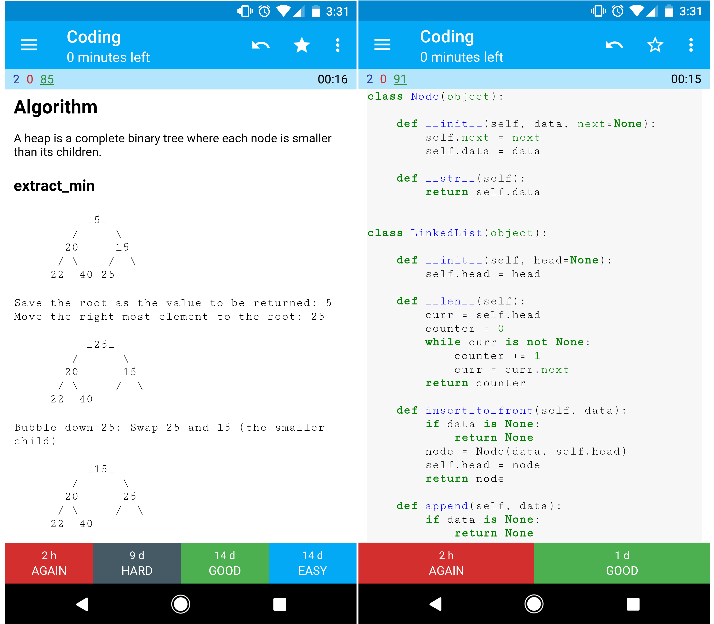

*[English](README.md) ∙ [日本語](README-ja.md) ∙ [简体中文](README-zh-Hans.md) ∙ [繁體中文](README-zh-TW.md) | [العَرَبِيَّة‎](https://github.com/donnemartin/system-design-primer/issues/170) ∙ [বাংলা](https://github.com/donnemartin/system-design-primer/issues/220) ∙ [Português do Brasil](https://github.com/donnemartin/system-design-primer/issues/40) ∙ [Deutsch](https://github.com/donnemartin/system-design-primer/issues/186) ∙ [ελληνικά](https://github.com/donnemartin/system-design-primer/issues/130) ∙ [עברית](https://github.com/donnemartin/system-design-primer/issues/272) ∙ [Italiano](https://github.com/donnemartin/system-design-primer/issues/104) ∙ [한국어](https://github.com/donnemartin/system-design-primer/issues/102) ∙ [فارسی](https://github.com/donnemartin/system-design-primer/issues/110) ∙ [Polski](https://github.com/donnemartin/system-design-primer/issues/68) ∙ [русский язык](https://github.com/donnemartin/system-design-primer/issues/87) ∙ [Español](https://github.com/donnemartin/system-design-primer/issues/136) ∙ [ภาษาไทย](https://github.com/donnemartin/system-design-primer/issues/187) ∙ [Türkçe](https://github.com/donnemartin/system-design-primer/issues/39) ∙ [tiếng Việt](https://github.com/donnemartin/system-design-primer/issues/127) ∙ [Français](https://github.com/donnemartin/system-design-primer/issues/250) | [Add Translation](https://github.com/donnemartin/system-design-primer/issues/28)*

**עזרו [לתרגם](TRANSLATIONS.md) את המדריך!**

# המדריך לתכנון מערכות (The System Design Primer)

  
   

## מוטיבציה

> ללמוד איך לתכנן מערכות ב-scale גדול.
>
> להתכונן לראיונות ארכיטקטורה.

### ללמוד איך לתכנן מערכות ב-scale גדול

ללמוד כיצד לתכנן מערכות סְקֵילָבִּילִיוּת יסייע לך להפוך למהנדס תוכנה טוב יותר.

תכנון מערכות הוא נושא רחב. יש **כמות אדירה של משאבים ברחבי הרשת** על עקרונות של תכנון מערכות.

ה-repo הזה הוא **אוסף מסודר** של משאבים שנועדו לעזור לך ללמוד איך לבנות מערכות ב-scale.

### ללמוד מקהילת הקוד הפתוח

מדובר בפרויקט קוד פתוח (open source) שמתעדכן באופן מתמשך.

מוזמנים [לתרום!](#contributing)

### להתכונן לראיונות ארכיטקטורה

בנוסף לראיונות קידוד, ארכיטקטורה היא **רכיב נדרש** כחלק מתהליך **ראיונות טכניים** בהרבה חברות טכנולוגיות.

**תוכל לתרגל שאלות ארכיטקטורה נפוצות** ואף **להשוות** את התוצאות שלך עם **פתרונות לדוגמה**: דיונים, קוד, ודיאגרמות.

### נושאים נוספים להכנה לראיונות:

<ul>
  <li><a href="#study-guide">מדריך למידה</a></li>
  <li><a href="#how-to-approach-a-system-design-interview-question">איך לגשת לשאלת תכנון מערכת בראיון</a></li>
  <li><a href="#system-design-interview-questions-with-solutions">שאלות ראיון בתכנון מערכות, <strong>כולל פתרונות</strong></a></li>
  <li><a href="#object-oriented-design-interview-questions-with-solutions">שאלות ראיון בתכנון מונחה עצמים, <strong>כולל פתרונות</strong></a></li>
  <li><a href="#additional-system-design-interview-questions">שאלות נוספות לראיונות תכנון מערכות</a></li>
</ul>

## כרטיסיות Anki

  
   

החבילות המוכנות של כרטיסיות [Anki](https://apps.ankiweb.net/) משתמשות בשיטת **חזרתיות מבוססת מרווחים (Spaced Repetition)** כדי לעזור לך לזכור מושגים חשובים בתכנון מערכות.

<ul dir="rtl">
  <li><a href="https://github.com/donnemartin/system-design-primer/tree/master/resources/flash_cards/System%20Design.apkg">חבילת תכנון מערכות</a></li>
  <li><a href="https://github.com/donnemartin/system-design-primer/tree/master/resources/flash_cards/System%20Design%20Exercises.apkg">חבילת תרגילים בתכנון מערכות</a></li>
  <li><a href="https://github.com/donnemartin/system-design-primer/tree/master/resources/flash_cards/OO%20Design.apkg">חבילת תכנון מונחה עצמים</a></li>
</ul>

מומלצות לשימוש בדרכים.

### משאב לראיונות קידוד: אתגרי קידוד אינטראקטיביים

מחפש משאבים שיעזרו לך להתכונן [**לראיונות קידוד**](https://github.com/donnemartin/interactive-coding-challenges)?

  
   

תעיף מבט על ה-repo המקביל [**Interactive Coding Challenges**](https://github.com/donnemartin/interactive-coding-challenges), שמכיל חבילת Anki נוספת:

<ul dir="rtl">
  <li><a href="https://github.com/donnemartin/interactive-coding-challenges/tree/master/anki_cards/Coding.apkg">חבילת קידוד</a></li>
</ul>

## תרומה למדריך

> ללמוד מהקהילה.

אל תהסס להגיש pull requests כדי לעזור:

<ul dir="rtl">
  <li>תיקון שגיאות</li>
  <li>שיפור קטעים קיימים</li>
  <li>הוספת קטעים חדשים</li>
  <li><a href="https://github.com/donnemartin/system-design-primer/issues/28">תרגום לשפות נוספות</a></li>
</ul>

תכנים שעדיין דורשים ליטוש מסומנים בתור <a href="#under-development">תחת פיתוח</a>.

מומלץ לעיין ב<a href="CONTRIBUTING.md">הנחיות לתרומה</a> לפני התחלה.

## אינדקס נושאים בתכנון מערכות

> סיכומים של נושאים שונים בתכנון מערכות, כולל יתרונות וחסרונות. **כל החלטה כוללת פשרות (trade-offs)**.
>
> כל חלק מכיל קישורים להרחבה וללמידה מעמיקה יותר.

  
   

<ul dir="rtl">
  <li><a href="#system-design-topics-start-here">נושאים בתכנון מערכות: התחל כאן</a>
    <ul>
      <li><a href="#step-1-review-the-scalability-video-lecture">שלב 1: צפה בהרצאה על סקילביליות</a></li>
      <li><a href="#step-2-review-the-scalability-article">שלב 2: קרא מאמרים על סקילביליות</a></li>
      <li><a href="#next-steps">השלבים הבאים</a></li>
    </ul>
  </li>
  <li><a href="#performance-vs-scalability">ביצועים (performance) מול סקילביליות (scalability)</a></li>
  <li><a href="#latency-vs-throughput">שיהוי (latency) מול תפוקה (throughput)</a></li>
  <li><a href="#availability-vs-consistency">זמינות (availability) מול עקביות (consistency)</a>
    <ul>
      <li><a href="#cap-theorem">משפט CAP</a>
        <ul>
          <li><a href="#cp---consistency-and-partition-tolerance">עקביות וטולרנטיות לפיצול (CP)</a></li>
          <li><a href="#ap---availability-and-partition-tolerance">זמינות וטולרנטיות לפיצול (AP)</a></li>
        </ul>
      </li>
    </ul>
  </li>
  <li><a href="#consistency-patterns">דפוסי עקביות</a>
    <ul>
      <li><a href="#weak-consistency">עקביות חלשה (weak)</a></li>
      <li><a href="#eventual-consistency">עקביות לא מיידית (eventual)</a></li>
      <li><a href="#strong-consistency">עקביות חזקה (strong)</a></li>
    </ul>
  </li>
  <li><a href="#availability-patterns">דפוסי זמינות</a>
    <ul>
      <li><a href="#fail-over">גיבוי בזמן כישלון (fail-over)</a></li>
      <li><a href="#replication">שכפול (replication)</a></li>
      <li><a href="#availability-in-numbers">זמינות במספרים</a></li>
    </ul>
  </li>
  <li><a href="#domain-name-system">מערכת שמות דומיינים (DNS)</a></li>
  <li><a href="#content-delivery-network">רשתות הפצת תוכן (CDN)</a>
    <ul>
      <li><a href="#push-cdns">דחיפה (Push)</a></li>
      <li><a href="#pull-cdns">משיכה (Pull)</a></li>
    </ul>
  </li>
  <li><a href="#load-balancer">מאזן עומסים (load balancer)</a>
    <ul>
      <li><a href="#active-passive">אקטיבי-פסיבי (active-passive)</a></li>
      <li><a href="#active-active">אקטיבי-אקטיבי (active-active)</a></li>
      <li><a href="#layer-4-load-balancing">איזון עומסים בשכבה 4</a></li>
      <li><a href="#layer-7-load-balancing">איזון עומסים בשכבה 7</a></li>
      <li><a href="#horizontal-scaling">גדילה אופקית (horizontal)</a></li>
    </ul>
  </li>
  <li><a href="#reverse-proxy-web-server">פרוקסי 'הפוך' (Reverse Proxy)</a>
    <ul>
      <li><a href="#load-balancer-vs-reverse-proxy">מאזן עומסים לעומת פרוקסי הפוך</a></li>
    </ul>
  </li>
  <li><a href="#application-layer">שכבת האפליקציה</a>
    <ul>
      <li><a href="#microservices">מיקרוסרביסים (microservices)</a></li>
      <li><a href="#service-discovery">גילוי שירותים (service discovery)</a></li>
    </ul>
  </li>
  <li><a href="#database">מסדי נתונים</a>
    <ul>
      <li><a href="#relational-database-management-system-rdbms">מסדי נתונים רלציוניים (RDBMS)</a>
        <ul>
          <li><a href="#master-slave-replication">שכפול Master-Slave</a></li>
          <li><a href="#master-master-replication">שכפול Master-Master</a></li>
          <li><a href="#federation">פדרציה (federation)</a></li>
          <li><a href="#sharding">חלוקה (sharding)</a></li>
          <li><a href="#denormalization">דה-נורמליזציה (denormalization)</a></li>
          <li><a href="#sql-tuning">SQL Tuning</a></li>
        </ul>
      </li>
      <li><a href="#nosql">NoSQL</a>
        <ul>
          <li><a href="#key-value-store">מפתח-ערך (Key-Value)</a></li>
          <li><a href="#document-store">מסמכים (Document Store)</a></li>
          <li><a href="#wide-column-store">רב-עמודות (Wide Column)</a></li>
          <li><a href="#graph-database">גרפים (Graph DB)</a></li>
        </ul>
      </li>
      <li><a href="#sql-or-nosql">SQL או NoSQL</a></li>
    </ul>
  </li>
  <li><a href="#cache">מטמון (Cache)</a>
    <ul>
      <li><a href="#client-caching">מטמון בצד לקוח</a></li>
      <li><a href="#cdn-caching">מטמון ב-CDN</a></li>
      <li><a href="#web-server-caching">מטמון בשרת</a></li>
      <li><a href="#database-caching">מטמון במסד נתונים</a></li>
      <li><a href="#application-caching">מטמון באפליקציה</a></li>
      <li><a href="#caching-at-the-database-query-level">מטמון ברמת שאילתה</a></li>
      <li><a href="#caching-at-the-object-level">מטמון ברמת אובייקט</a></li>
      <li><a href="#when-to-update-the-cache">מתי לעדכן את ה-cache?</a>
        <ul>
          <li><a href="#cache-aside">אסטרטגיית Cache-aside</a></li>
          <li><a href="#write-through">אסטרטגיית Write-through</a></li>
          <li><a href="#write-behind-write-back">אסטרטגיית Write-behind (write-back)</a></li>
          <li><a href="#refresh-ahead">אסטרטגיית Refresh-ahead</a></li>
        </ul>
      </li>
    </ul>
  </li>
  <li><a href="#asynchronism">אסינכרוניות (asynchronism)</a>
    <ul>
      <li><a href="#message-queues">תורי הודעות (MQ)</a></li>
      <li><a href="#task-queues">תורי משימות</a></li>
      <li><a href="#back-pressure">לחץ אחורי (Back Pressure)</a></li>
    </ul>
  </li>
  <li><a href="#communication">תקשורת</a>
    <ul>
      <li><a href="#transmission-control-protocol-tcp">פרוטוקול Transmission control protocol (TCP)</a></li>
      <li><a href="#user-datagram-protocol-udp">פרוטוקול User datagram protocol (UDP)</a></li>
      <li><a href="#remote-procedure-call-rpc">קריאת Remote procedure call (RPC)</a></li>
      <li><a href="#representational-state-transfer-rest">פרוטוקול Representational state transfer (REST)</a></li>
    </ul>
  </li>
  <li><a href="#security">אבטחה</a></li>
  <li><a href="#appendix">נספחים</a>
    <ul>
      <li><a href="#powers-of-two-table">טבלת חזקות של 2</a></li>
      <li><a href="#latency-numbers-every-programmer-should-know">מספרי latency חשובים</a></li>
      <li><a href="#additional-system-design-interview-questions">שאלות נוספות לראיונות</a></li>
      <li><a href="#real-world-architectures">ארכיטקטורות מהעולם האמיתי</a></li>
      <li><a href="#company-architectures">ארכיטקטורות של חברות</a></li>
      <li><a href="#company-engineering-blogs">בלוגים טכניים של חברות</a></li>
    </ul>
  </li>
  <li><a href="#under-development">תחת פיתוח</a></li>
  <li><a href="#credits">קרדיטים</a></li>
  <li><a href="#contact-info">פרטי קשר</a></li>
  <li><a href="#license">רישיון</a></li>
</ul>

## מדריך למידה

> נושאים מוצעים ללימוד לפי לוח הזמנים לריאיון שלך (קצר, בינוני, ארוך)

**ש: עבור הראיונות, האם אני אמור לדעת כל מה שכתוב כאן?**

**ת: לא, אתה לא צריך לדעת הכול כדי להתכונן לריאיון**.

מה שאתה תישאל עליו בריאיון תלוי בדברים כגון:

<ul dir="rtl">
  <li>כמה ניסיון יש לך</li>
  <li>מה הרקע הטכני שלך</li>
  <li>לאילו משרות אתה מתראיין</li>
  <li>באילו חברות אתה מתראיין</li>
  <li>מזל</li>
</ul>

לרוב מצופה ממועמדים מנוסים יותר לדעת יותר על ארכיטקטורה ותכנון מערכות. ארכיטקטים או ראשי צוותים מצופים לדעת יותר מאשר עובדים בודדים. חברות טכנולוגיות מובילות לרוב יערכו ריאיון אחד או יותר של ארכיטקטורה.

רצוי להתחיל רחב ולהעמיק במספר תחומים. זה עוזר לדעת קצת בנוגע למספר נושאי מפתח בתכנון מערכות. תתאים את המדריך לפי לוח הזמן שלך, הניסיון, המשרות שאתה מתראיין אליהן, והחברות שבהן אתה מתראיין.

<ul dir="rtl">
  <li><strong>לוח זמנים קצר</strong> – התמקד ב<strong>רוחב</strong> של נושאים בתכנון מערכות. תרגל פתרון של <strong>כמה</strong> שאלות ריאיון.</li>
  <li><strong>לוח זמנים בינוני</strong> – התמקד ב<strong>רוחב</strong> ו<strong>קצת עומק</strong> של נושאים בתכנון מערכות. תרגל פתרון של <strong>הרבה</strong> שאלות ריאיון.</li>
  <li><strong>לוח זמנים ארוך</strong> – התמקד ב<strong>רוחב</strong> ו<strong>יותר עומק</strong> של נושאים בתכנון מערכות. תרגל פתרון של <strong>רוב</strong> שאלות הריאיון.</li>
</ul>

<table dir="rtl" border="1" cellspacing="0" cellpadding="6">
  <thead>
    <tr>
      <th></th>
      <th>קצר</th>
      <th>בינוני</th>
      <th>ארוך</th>
    </tr>
  </thead>
  <tbody>
    <tr>
      <td>קרא את <a href="#index-of-system-design-topics">הנושאים בתכנון מערכות</a> כדי לקבל הבנה כללית של איך מערכות עובדות</td>
      <td>:+1:</td>
      <td>:+1:</td>
      <td>:+1:</td>
    </tr>
    <tr>
      <td>קרא כמה מאמרים מתוך <a href="#company-engineering-blogs">בלוגים של חברות</a> שאתה מתראיין אליהן</td>
      <td>:+1:</td>
      <td>:+1:</td>
      <td>:+1:</td>
    </tr>
    <tr>
      <td>קרא על כמה <a href="#real-world-architectures">ארכיטקטורות מהעולם האמיתי</a></td>
      <td>:+1:</td>
      <td>:+1:</td>
      <td>:+1:</td>
    </tr>
    <tr>
      <td>חזור על <a href="#how-to-approach-a-system-design-interview-question">איך לגשת לשאלת ריאיון בתכנון מערכות</a></td>
      <td>:+1:</td>
      <td>:+1:</td>
      <td>:+1:</td>
    </tr>
    <tr>
      <td>תרגל <a href="#system-design-interview-questions-with-solutions">שאלות ריאיון בתכנון מערכות עם פתרונות</a></td>
      <td>כמה</td>
      <td>הרבה</td>
      <td>רוב</td>
    </tr>
    <tr>
      <td>תרגל <a href="#object-oriented-design-interview-questions-with-solutions">שאלות ריאיון בתכנון מונחה עצמים עם פתרונות</a></td>
      <td>כמה</td>
      <td>הרבה</td>
      <td>רוב</td>
    </tr>
    <tr>
      <td>חזור על <a href="#additional-system-design-interview-questions">שאלות ריאיון נוספות בתכנון מערכות</a></td>
      <td>כמה</td>
      <td>הרבה</td>
      <td>רוב</td>
    </tr>
  </tbody>
</table>

