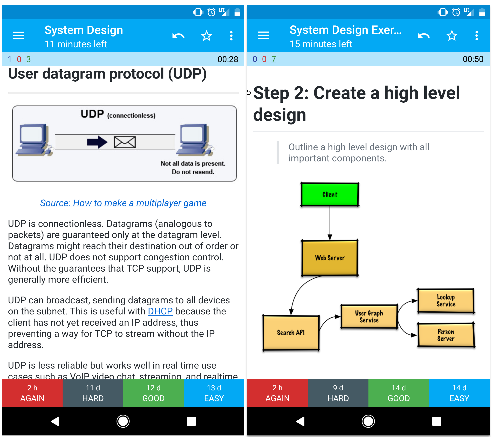

*[English](README.md) ∙ [日本語](README-ja.md) ∙ [简体中文](README-zh-Hans.md) ∙ [繁體中文](README-zh-TW.md) | [العَرَبِيَّة‎](https://github.com/donnemartin/system-design-primer/issues/170) ∙ [বাংলা](https://github.com/donnemartin/system-design-primer/issues/220) ∙ [Português do Brasil](https://github.com/donnemartin/system-design-primer/issues/40) ∙ [Deutsch](https://github.com/donnemartin/system-design-primer/issues/186) ∙ [ελληνικά](https://github.com/donnemartin/system-design-primer/issues/130) ∙ [עברית](https://github.com/donnemartin/system-design-primer/issues/272) ∙ [Italiano](https://github.com/donnemartin/system-design-primer/issues/104) ∙ [한국어](https://github.com/donnemartin/system-design-primer/issues/102) ∙ [فارسی](https://github.com/donnemartin/system-design-primer/issues/110) ∙ [Polski](https://github.com/donnemartin/system-design-primer/issues/68) ∙ [русский язык](https://github.com/donnemartin/system-design-primer/issues/87) ∙ [Español](https://github.com/donnemartin/system-design-primer/issues/136) ∙ [ภาษาไทย](https://github.com/donnemartin/system-design-primer/issues/187) ∙ [Türkçe](https://github.com/donnemartin/system-design-primer/issues/39) ∙ [tiếng Việt](https://github.com/donnemartin/system-design-primer/issues/127) ∙ [Français](https://github.com/donnemartin/system-design-primer/issues/250) | [Add Translation](https://github.com/donnemartin/system-design-primer/issues/28)*

# सिस्टम डिजाइन प्राइमर

  
   

## प्रेरणा

> बड़े पैमाने पर सिस्टम डिजाइन करना सीखें।
>
> सिस्टम डिजाइन साक्षात्कार के लिए तैयारी करें।

### बड़े पैमाने पर सिस्टम डिजाइन करना सीखें

स्केलेबल सिस्टम को डिजाइन करने का तरीका सीखने से आपको एक बेहतर इंजीनियर बनने में मदद मिलेगी।

सिस्टम डिजाइन एक व्यापक विषय है। सिस्टम डिज़ाइन सिद्धांतों पर **पूरे वेब में बड़ी मात्रा में संसाधन फैले हुए हैं**।

यह रेपो संसाधनों का एक **संगठित संग्रह** है जो आपको बड़े पैमाने पर सिस्टम बनाने का तरीका सीखने में मदद करता है।

### मुक्त स्रोत समुदाय से सीखें

यह लगातार अद्यतन, ओपन सोर्स प्रोजेक्ट है।

[Contributions](#contributing) are welcome!

### सिस्टम डिज़ाइन साक्षात्कार के लिए तैयारी करें

साक्षात्कार कोडिंग के अलावा, कई तकनीकी कंपनियों में सिस्टम डिज़ाइन **तकनीकी साक्षात्कार प्रक्रिया** का एक **आवश्यक घटक** है।

**सामान्य सिस्टम डिज़ाइन साक्षात्कार प्रश्नों का अभ्यास करें** और **नमूना समाधान** के साथ अपने परिणामों की तुलना करें**: चर्चा, कोड और आरेख।

साक्षात्कार की तैयारी के लिए अतिरिक्त विषय:

* [स्टडी गाइड](#स्टडी-गाइड)
* [सिस्टम डिज़ाइन साक्षात्कार प्रश्न कैसे प्राप्त करें](#कैसे-टू-एप्रोच-ए-सिस्टम-डिज़ाइन-साक्षात्कार-प्रश्न)
* [सिस्टम डिज़ाइन साक्षात्कार प्रश्न, **समाधान के साथ**](#सिस्टम-डिज़ाइन-साक्षात्कार-प्रश्न-साथ-समाधान)
* [वस्तु-उन्मुख डिज़ाइन साक्षात्कार प्रश्न, **समाधान के साथ**](#वस्तु-उन्मुख-डिज़ाइन-साक्षात्कार-प्रश्न-साथ-समाधान)
* [अतिरिक्त सिस्टम डिज़ाइन साक्षात्कार प्रश्न](#अतिरिक्त-सिस्टम-डिज़ाइन-साक्षात्कार-प्रश्न)

## Anki flashcards

  
   

दिए गए [Anki फ्लैशकार्ड डेक](https://apps.ankiweb.net/) सिस्टम डिज़ाइन के मुख्य कॉन्सेप्ट को बनाए रखने में आपकी मदद करने के लिए स्पेस्ड रिपीटिशन का इस्तेमाल करते हैं।

* [सिस्टम डिज़ाइन डेक] (resources/flash_cards/System%20Design.apkg)
* [सिस्टम डिज़ाइन अभ्यास डेक](resources/flash_cards/System%20Design%20Exercises.apkg)
* [वस्तु उन्मुख डिजाइन अभ्यास डेक](resources/flash_cards/OO%20Design.apkg)

चलते समय उपयोग के लिए बढ़िया।

### कोडिंग संसाधन: इंटरएक्टिव कोडिंग चुनौतियां

[**कोडिंग इंटरव्यू**](https://github.com/donnemartin/interactive-coding-challenges) के लिए तैयारी करने में आपकी मदद करने के लिए संसाधनों की तलाश है?

  
   

सिस्टर रेपो [**इंटरएक्टिव कोडिंग चैलेंज**](https://github.com/donnemartin/interactive-coding-challenges) देखें, जिसमें एक अतिरिक्त Anki डेक है:

* [कोडिंग डेक] (https://github.com/donnemartin/interactive-coding-challenges/tree/master/anki_cards/Coding.apkg)

## योगदान

> समुदाय से सीखें।

मदद के लिए बेझिझक पुल अनुरोध सबमिट करें:

* त्रुटियों को ठीक करें
* वर्गों में सुधार करें
* नए खंड जोड़ें
* [अनुवाद] (https://github.com/donnemartin/system-design-primer/issues/28)

जिस सामग्री को कुछ पॉलिश करने की आवश्यकता है उसे [विकास के तहत](#अंडर-डेवलपमेंट) रखा गया है।

[योगदान दिशानिर्देश](CONTRIBUTING.md) की समीक्षा करें।

## सिस्टम डिजाइन विषयों का सूचकांक

> पेशेवरों और विपक्षों सहित विभिन्न सिस्टम डिज़ाइन विषयों का सारांश। **सब कुछ एक समझौता है**।
>
> प्रत्येक अनुभाग में अधिक गहन संसाधनों के लिंक होते हैं।

  
   

* [सिस्टम डिजाइन विषय: यहां से शुरू करें](#सिस्टम-डिजाइन-विषय-शुरू-यहां)
    * [चरण 1: मापनीयता वीडियो व्याख्यान की समीक्षा करें](#चरण-1-समीक्षा-अनुमापकता-वीडियो-व्याख्यान)
    * [चरण 2: मापनीयता लेख की समीक्षा करें](#चरण-2-समीक्षा-अनुमाननीयता-लेख)
    * [अगले चरण](#अगले चरण)
* [प्रदर्शन बनाम स्केलेबिलिटी](#प्रदर्शन-बनाम-स्केलेबिलिटी)
* [लेटेंसी बनाम थ्रूपुट](#लेटेंसी-बनाम-थ्रूपुट)
* [उपलब्धता बनाम संगति](#उपलब्धता-बनाम-संगति)
    * [कैप प्रमेय](#कैप-प्रमेय)
        * [सीपी - संगति और विभाजन सहिष्णुता](#cp---संगति-और-विभाजन-सहिष्णुता)
        * [एपी - उपलब्धता और विभाजन सहिष्णुता](#ap---उपलब्धता-और-विभाजन-सहिष्णुता)
* [कंसिस्टेंसी पैटर्न](#कंसिस्टेंसी-पैटर्न)
    * [कमजोर संगति](#कमजोर-संगति)
    * [अंतिम स्थिरता](#अंतिम-संगति)
    * [मजबूत संगति](#मजबूत-संगति)
* [उपलब्धता पैटर्न](#उपलब्धता-पैटर्न)
    * [फेल-ओवर](#फेल-ओवर)
    * [प्रतिकृति](#प्रतिकृति)
    * [संख्या में उपलब्धता](#उपलब्धता-में-संख्या)
* [डोमेन नाम प्रणाली](#डोमेन-नाम-प्रणाली)
* [सामग्री वितरण नेटवर्क](#सामग्री-वितरण-नेटवर्क)
    * [पुश सीडीएन](#पुश-सीडीएनएस)
    * [पुल सीडीएन](#पुल-सीडीएनएस)
* [लोड बैलेंसर](#लोड-बैलेंसर)
    * [सक्रिय-निष्क्रिय](#सक्रिय-निष्क्रिय)
    * [सक्रिय-सक्रिय](#सक्रिय-सक्रिय)
    * [लेयर 4 लोड बैलेंसिंग](#लेयर-4-लोड-बैलेंसिंग)
    * [लेयर 7 लोड बैलेंसिंग](#लेयर-7-लोड-बैलेंसिंग)
    * [क्षैतिज स्केलिंग](#क्षैतिज-स्केलिंग)
* [रिवर्स प्रॉक्सी (वेब सर्वर)](#रिवर्स-प्रॉक्सी-वेब-सर्वर)
    * [लोड बैलेंसर बनाम रिवर्स प्रॉक्सी](#लोड-बैलेंसर-बनाम-रिवर्स-प्रॉक्सी)
* [अनुप्रयोग परत](#अनुप्रयोग-परत)
    * [माइक्रोसर्विसेज](#माइक्रोसर्विसेज)
    * [सेवा खोज](#सेवा-खोज)
* [डाटाबेस](#डाटाबेस)
    * [रिलेशनल डेटाबेस मैनेजमेंट सिस्टम (RDBMS)](#रिलेशनल-डेटाबेस-मैनेजमेंट-सिस्टम-आरडीबीएमएस)
        * [मास्टर-स्लेव प्रतिकृति](#मास्टर-स्लेव-प्रतिकृति)
        * [मास्टर-मास्टर प्रतिकृति](#मास्टर-मास्टर-प्रतिकृति)
        * [फेडरेशन](#फेडरेशन)
        * [शार्डिंग](#शार्डिंग)
        * [विसामान्यकरण](#विसामान्यकरण)
        * [एसक्यूएल ट्यूनिंग](#एसक्यूएल-ट्यूनिंग)
    * [नोएसक्यूएल](#नोएसक्यूएल)
        * [की-वैल्यू स्टोर](#की-वैल्यू-स्टोर)
        * [दस्तावेज़ स्टोर](#दस्तावेज़-स्टोर)
        * [वाइड कॉलम स्टोर](#वाइड-कॉलम-स्टोर)
        * [ग्राफ़ डेटाबेस](#ग्राफ़-डेटाबेस)
    * [SQL या NoSQL](#sql-or-nosql)
