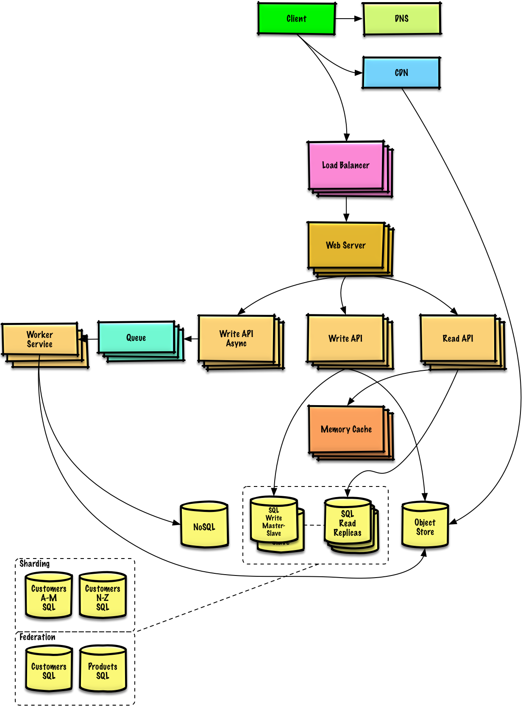

*[English](README.md) ∙ [日本語](README-ja.md) ∙ [简体中文](README-zh-Hans.md) ∙ [繁體中文](README-zh-TW.md) | [العَرَبِيَّة‎](https://github.com/donnemartin/system-design-primer/issues/170) ∙ [বাংলা](https://github.com/donnemartin/system-design-primer/issues/220) ∙ [Português do Brasil](https://github.com/donnemartin/system-design-primer/issues/40) ∙ [Deutsch](https://github.com/donnemartin/system-design-primer/issues/186) ∙ [ελληνικά](https://github.com/donnemartin/system-design-primer/issues/130) ∙ [עברית](https://github.com/donnemartin/system-design-primer/issues/272) ∙ [Italiano](https://github.com/donnemartin/system-design-primer/issues/104) ∙ [한국어](https://github.com/donnemartin/system-design-primer/issues/102) ∙ [فارسی](https://github.com/donnemartin/system-design-primer/issues/110) ∙ [Polski](https://github.com/donnemartin/system-design-primer/issues/68) ∙ [русский язык](https://github.com/donnemartin/system-design-primer/issues/87) ∙ [Español](https://github.com/donnemartin/system-design-primer/issues/136) ∙ [ภาษาไทย](https://github.com/donnemartin/system-design-primer/issues/187) ∙ [Türkçe](https://github.com/donnemartin/system-design-primer/issues/39) ∙ [tiếng Việt](https://github.com/donnemartin/system-design-primer/issues/127) ∙ [Français](https://github.com/donnemartin/system-design-primer/issues/250) | [Add Translation](https://github.com/donnemartin/system-design-primer/issues/28)*

# システム設計入門

<p align="center">
  
  <br/>
</p>

## 動機・目的

> 大規模システムのシステム設計を学ぶ
>
> システム設計面接課題に備える

### 大規模システムの設計を学ぶ

スケーラブルなシステムのシステム設計を学ぶことは、より良いエンジニアになることに資するでしょう。

システム設計はとても広範なトピックを含みます。システム設計原理については **インターネット上には膨大な量の文献が散らばっています。**

このリポジトリは大規模システム構築に必要な知識を学ぶことができる **文献リストを体系的にまとめたもの** です。

### オープンソースコミュニティから学ぶ

このプロジェクトは、これからもずっと更新されていくオープンソースプロジェクトの初期段階にすぎません。

[Contributions](#contributing) は大歓迎です！

### システム設計面接課題に備える

コード技術面接に加えて、システム設計に関する知識は、多くのテック企業における **技術採用面接プロセス** で **必要不可欠な要素** です。

**システム設計面接での頻出質問に備え**、自分の解答と*模範解答*:ディスカッション、コードそして図表などを*比較*して学びましょう。

面接準備に役立つその他のトピック:

* [学習指針](#学習指針)
* [システム設計面接課題にどのように準備するか](#システム設計面接にどのようにして臨めばいいか)
* [システム設計課題例 **とその解答**](#システム設計課題例とその解答)
* [オブジェクト指向設計課題例、 **とその解答**](#オブジェクト指向設計問題と解答)
* [その他のシステム設計面接課題例](#他のシステム設計面接例題)

## 暗記カード

<p align="center">
  
  <br/>
</p>

この[Anki用フラッシュカードデッキ](https://apps.ankiweb.net/) は、間隔反復を活用して、システム設計のキーコンセプトの学習を支援します。

* [システム設計デッキ](resources/flash_cards/System%20Design.apkg)
* [システム設計練習課題デッキ](resources/flash_cards/System%20Design%20Exercises.apkg)
* [オブジェクト指向練習課題デッキ](resources/flash_cards/OO%20Design.apkg)

外出先や移動中の勉強に役立つでしょう。

### コーディング技術課題用の問題: 練習用インタラクティブアプリケーション

コード技術面接用の問題を探している場合は[**こちら**](https://github.com/donnemartin/interactive-coding-challenges)

<p align="center">
  
  <br/>
</p>

姉妹リポジトリの [**Interactive Coding Challenges**](https://github.com/donnemartin/interactive-coding-challenges)も見てみてください。追加の暗記デッキカードも入っています。

* [Coding deck](https://github.com/donnemartin/interactive-coding-challenges/tree/master/anki_cards/Coding.apkg)

## コントリビュート

> コミュニティから学ぶ

プルリクエスト等の貢献は積極的にお願いします:

* エラー修正
* セクション内容改善
* 新規セクション追加
* [翻訳する](https://github.com/donnemartin/system-design-primer/issues/28)

現在、内容の改善が必要な作業中のコンテンツは[こちら](#進行中の作業)です。

コントリビュートの前に[Contributing Guidelines](CONTRIBUTING.md)を読みましょう。

## システム設計目次

> 賛否も含めた様々なシステム設計の各トピックの概要。 **全てはトレードオフの関係にあります。**
>
> それぞれのセクションはより学びを深めるような他の文献へのリンクが貼られています。

<p align="center">
  
  <br/>
</p>

* [システム設計トピック: まずはここから](#システム設計トピックス-まずはここから)
    * [Step 1: スケーラビリティに関する動画を見る](#ステップ-1-スケーラビリティに関する動画を観て復習する)
    * [Step 2: スケーラビリティに関する記事を読む](#ステップ-2-スケーラビリティに関する資料を読んで復習する)
    * [次のステップ](#次のステップ)
* [パフォーマンス vs スケーラビリティ](#パフォーマンス-vs-スケーラビリティ)
* [レイテンシー vs スループット](#レイテンシー-vs-スループット)
* [可用性 vs 一貫性](#可用性-vs-一貫性)
    * [CAP理論](#cap-理論)
        * [CP - 一貫性(consistency)と分割性(partition)耐性](#cp---一貫性と分断耐性consistency-and-partition-tolerance)
        * [AP - 可用性(availability)と分割性(partition)耐性](#ap---可用性と分断耐性availability-and-partition-tolerance)
* [一貫性 パターン](#一貫性パターン)
    * [弱い一貫性](#弱い一貫性)
    * [結果整合性](#結果整合性)
    * [強い一貫性](#強い一貫性)
* [可用性 パターン](#可用性パターン)
    * [フェイルオーバー](#フェイルオーバー)
    * [レプリケーション](#レプリケーション)
* [ドメインネームシステム(DNS)](#ドメインネームシステム)
* [コンテンツデリバリーネットワーク(CDN)](#コンテンツデリバリーネットワークcontent-delivery-network)
    * [プッシュCDN](#プッシュcdn)
    * [プルCDN](#プルcdn)
* [ロードバランサー](#ロードバランサー)
    * [アクティブ/パッシブ構成](#アクティブパッシブ)
    * [アクティブ/アクティブ構成](#アクティブアクティブ)
    * [Layer 4 ロードバランシング](#layer-4-ロードバランシング)
    * [Layer 7 ロードバランシング](#layer-7-ロードバランシング)
    * [水平スケーリング](#水平スケーリング)
* [リバースプロキシ (WEBサーバー)](#リバースプロキシwebサーバー)
    * [ロードバランサー vs リバースプロキシ](#ロードバランサー-vs-リバースプロキシ)
* [アプリケーションレイヤー](#アプリケーション層)
    * [マイクロサービス](#マイクロサービス)
    * [サービスディスカバリー](#service-discovery)
* [データベース](#データベース)
    * [リレーショナルデータベースマネジメントシステム (RDBMS)](#リレーショナルデータベースマネジメントシステム-rdbms)
        * [マスター/スレーブ レプリケーション](#マスタースレーブ-レプリケーション)
        * [マスター/マスター レプリケーション](#マスターマスター-レプリケーション)
        * [フェデレーション](#federation)
        * [シャーディング](#シャーディング)
        * [デノーマライゼーション](#非正規化)
        * [SQL チューニング](#sqlチューニング)
    * [NoSQL](#nosql)
        * [キー/バリューストア](#キーバリューストア)
        * [ドキュメントストア](#ドキュメントストア)
        * [ワイドカラムストア](#ワイドカラムストア)
        * [グラフ データベース](#グラフデータベース)
    * [SQL or NoSQL](#sqlかnosqlか)
* [キャッシュ](#キャッシュ)
    * [クライアントキャッシング](#クライアントキャッシング)
    * [CDNキャッシング](#cdnキャッシング)
    * [Webサーバーキャッシング](#webサーバーキャッシング)
    * [データベースキャッシング](#データベースキャッシング)
    * [アプリケーションキャッシング](#アプリケーションキャッシング)
    * [データベースクエリレベルでキャッシングする](#データベースクエリレベルでのキャッシング)
    * [オブジェクトレベルでキャッシングする](#オブジェクトレベルでのキャッシング)
    * [いつキャッシュを更新するのか](#いつキャッシュを更新するか)
        * [キャッシュアサイド](#キャッシュアサイド)
        * [ライトスルー](#ライトスルー)
        * [ライトビハインド (ライトバック)](#ライトビハインド-ライトバック)
        * [リフレッシュアヘッド](#リフレッシュアヘッド)
* [非同期処理](#非同期処理)
    * [メッセージキュー](#メッセージキュー)
    * [タスクキュー](#タスクキュー)
    * [バックプレッシャー](#バックプレッシャー)
* [通信](#通信)
    * [伝送制御プロトコル (TCP)](#伝送制御プロトコル-tcp)
    * [ユーザデータグラムプロトコル (UDP)](#ユーザデータグラムプロトコル-udp)
    * [遠隔手続呼出 (RPC)](#遠隔手続呼出-rpc)
    * [Representational state transfer (REST)](#representational-state-transfer-rest)
* [セキュリティ](#セキュリティ)
* [補遺](#補遺)
    * [2の乗数表](#2の乗数表)
    * [全てのプログラマーが知るべきレイテンシー値](#全てのプログラマーが知るべきレイテンシー値)
    * [他のシステム設計面接例題](#他のシステム設計面接例題)
    * [実世界でのアーキテクチャ](#実世界のアーキテクチャ)
    * [各企業のアーキテクチャ](#各企業のアーキテクチャ)
    * [企業のエンジニアブログ](#企業のエンジニアブログ)
* [作業中](#進行中の作業)
* [クレジット](#クレジット)
* [連絡情報](#contact-info)
* [ライセンス](#license)

## 学習指針

> 学習スパンに応じてみるべきトピックス (short, medium, long)


**Q: 面接のためには、ここにあるものすべてをやらないといけないのでしょうか？**

**A: いえ、ここにあるすべてをやる必要はありません。**

面接で何を聞かれるかは以下の条件によって変わってきます:

* どれだけの技術経験があるか
* あなたの技術背景が何であるか
* どのポジションのために面接を受けているか
* どの企業の面接を受けているか
* 運

より経験のある候補者は一般的にシステム設計についてより深い知識を有していることを要求されるでしょう。システムアーキテクトやチームリーダーは各メンバーの持つような知識よりは深い見識を持っているべきでしょう。一流テック企業では複数回の設計面接を課されることが多いです。

まずは広く始めて、そこからいくつかの分野に絞って深めていくのがいいでしょう。様々なシステム設計のトピックについて少しずつ知っておくことはいいことです。以下の学習ガイドを自分の学習に当てられる時間、技術経験、どの職位、どの会社に応募しているかなどを加味して自分用に調整して使うといいでしょう。

* **短期間** - **幅広く** システム設計トピックを学ぶ。**いくつかの** 面接課題を解くことで対策する。
* **中期間** - **幅広く** そして **それなりに深く**システム設計トピックを学ぶ。**多くの** 面接課題を解くことで対策する。
* **長期間** - **幅広く** そして **もっと深く**システム設計トピックを学ぶ。**ほぼ全ての** 面接課題を解くことで対策する。

| | 短期間 | 中期間 | 長期間 |
|---|---|---|---|
| [システム設計トピック](#システム設計目次) を読み、システム動作機序について広く知る | :+1: | :+1: | :+1: |
| 次のリンク先のいくつかのページを読んで [各企業のエンジニアリングブログ](#企業のエンジニアブログ) 応募する会社について知る | :+1: | :+1: | :+1: |
| 次のリンク先のいくつかのページを読む [実世界でのアーキテクチャ](#実世界のアーキテクチャ) | :+1: | :+1: | :+1: |
| 復習する [システム設計面接課題にどのように準備するか](#システム設計面接にどのようにして臨めばいいか) | :+1: | :+1: | :+1: |
| とりあえず一周する [システム設計課題例](#システム設計課題例とその解答) | Some | Many | Most |
| とりあえず一周する [オブジェクト指向設計問題と解答](#オブジェクト指向設計問題と解答) | Some | Many | Most |
| 復習する [その他システム設計面接での質問例](#他のシステム設計面接例題) | Some | Many | Most |

## システム設計面接にどのようにして臨めばいいか

> システム設計面接試験問題にどのように取り組むか

システム設計面接は **open-ended conversation(Yes/Noでは答えられない口頭質問)です**。 自分で会話を組み立てることを求められます。

以下のステップに従って議論を組み立てることができるでしょう。この過程を確かなものにするために、次のセクション[システム設計課題例とその解答](#system-design-interview-questions-with-solutions) を以下の指針に従って読み込むといいでしょう。

### ステップ 1: そのシステム使用例の概要、制約、推計値等を聞き出し、まとめる

システム仕様の要求事項を聞き出し、問題箇所を特定しましょう。使用例と制約を明確にするための質問を投げかけましょう。要求する推計値についても議論しておきましょう。

* 誰がそのサービスを使うのか？
* どのように使うのか？
* 何人のユーザーがいるのか？
* システムはどのような機能を果たすのか？
* システムへの入力と出力は？
* どれだけの容量のデータを捌く必要があるのか？
* 一秒間に何リクエストの送信が想定されるか？
* 読み書き比率の推定値はいくら程度か？

### ステップ 2: より高レベルのシステム設計を組み立てる

重要なコンポーネントを全て考慮した高レベルのシステム設計概要を組み立てる。

* 主要なコンポーネントと接続をスケッチして書き出す
* 考えの裏付けをする

### ステップ 3: 核となるコンポーネントを設計する

それぞれの主要なコンポーネントについての詳細を学ぶ。例えば、[url短縮サービス](solutions/system_design/pastebin/README.md)の設計を問われた際には次のようにするといいでしょう:

* 元のURLのハッシュ化したものを作り、それを保存する
    * [MD5](solutions/system_design/pastebin/README.md) と [Base62](solutions/system_design/pastebin/README.md)
    * ハッシュ衝突
    * SQL もしくは NoSQL
    * データベーススキーマ
* ハッシュ化されたURLを元のURLに再翻訳する
    * データベース参照
* API & オブジェクト指向の設計

### ステップ 4: システム設計のスケール

与えられた制約条件からボトルネックとなりそうなところを割り出し、明確化する。  例えば、スケーラビリティの問題解決のために以下の要素を考慮する必要があるだろうか？

* ロードバランサー
* 水平スケーリング
* キャッシング
* データベースシャーディング

取りうる解決策とそのトレードオフについて議論をしよう。全てのことはトレードオフの関係にある。ボトルネックについては[スケーラブルなシステム設計の原理](#システム設計目次)を読むといいでしょう。

### ちょっとした暗算問題

ちょっとした推計値を手計算ですることを求められることもあるかもしれません。[補遺](#補遺)の以下の項目が役に立つでしょう:

* [チラ裏計算でシステム設計する](http://highscalability.com/blog/2011/1/26/google-pro-tip-use-back-of-the-envelope-calculations-to-choo.html)
* [2の乗数表](#2の乗数表)
* [全てのプログラマーが知っておくべきレイテンシの参考値](#全てのプログラマーが知るべきレイテンシー値)

### 文献とその他の参考資料

以下のリンク先ページを見てどのような質問を投げかけられるか概要を頭に入れておきましょう:

* [システム設計面接で成功するには？](https://www.palantir.com/2011/10/how-to-rock-a-systems-design-interview/)
* [システム設計面接](http://www.hiredintech.com/system-design)
* [アーキテクチャ、システム設計面接への導入](https://www.youtube.com/watch?v=ZgdS0EUmn70)

## システム設計課題例とその解答

> 頻出のシステム設計面接課題と参考解答、コード及びダイアグラム
>
> 解答は `solutions/` フォルダ以下にリンクが貼られている

| 問題 | |
|---|---|
| Pastebin.com (もしくは Bit.ly) を設計する| [解答](solutions/system_design/pastebin/README.md) |
| Twitterタイムライン (もしくはFacebookフィード)を設計する<br/>Twitter検索(もしくはFacebook検索)機能を設計する | [解答](solutions/system_design/twitter/README.md) |
| ウェブクローラーを設計する | [解答](solutions/system_design/web_crawler/README.md) |
| Mint.comを設計する | [解答](solutions/system_design/mint/README.md) |
| SNSサービスのデータ構造を設計する | [解答](solutions/system_design/social_graph/README.md) |
| 検索エンジンのキー/バリュー構造を設計する | [解答](solutions/system_design/query_cache/README.md) |
| Amazonのカテゴリ毎の売り上げランキングを設計する | [解答](solutions/system_design/sales_rank/README.md) |
| AWS上で100万人規模のユーザーを捌くサービスを設計する | [解答](solutions/system_design/scaling_aws/README.md) |
| システム設計問題を追加する | [Contribute](#contributing) |

### Pastebin.com (もしくは Bit.ly) を設計する

[問題と解答を見る](solutions/system_design/pastebin/README.md)


### Twitterタイムライン&検索 (もしくはFacebookフィード&検索)を設計する

[問題と解答を見る](solutions/system_design/twitter/README.md)


### ウェブクローラーの設計

[問題と解答を見る](solutions/system_design/web_crawler/README.md)


### Mint.comの設計

[問題と解答を見る](solutions/system_design/mint/README.md)


### SNSサービスのデータ構造を設計する

[問題と解答を見る](solutions/system_design/social_graph/README.md)


### 検索エンジンのキー/バリュー構造を設計する

[問題と解答を見る](solutions/system_design/query_cache/README.md)


### Amazonのカテゴリ毎の売り上げランキングを設計する

[問題と解答を見る](solutions/system_design/sales_rank/README.md)


### AWS上で100万人規模のユーザーを捌くサービスを設計する

[問題と解答を見る](solutions/system_design/scaling_aws/README.md)


## オブジェクト指向設計問題と解答

> 頻出のオブジェクト指向システム設計面接課題と参考解答、コード及びダイアグラム
>
> 解答は `solutions/` フォルダ以下にリンクが貼られている

>**備考: このセクションは作業中です**

| 問題 | |
|---|---|
| ハッシュマップの設計 | [解答](solutions/object_oriented_design/hash_table/hash_map.ipynb)  |
| LRUキャッシュの設計 | [解答](solutions/object_oriented_design/lru_cache/lru_cache.ipynb)  |
| コールセンターの設計 | [解答](solutions/object_oriented_design/call_center/call_center.ipynb)  |
| カードのデッキの設計 | [解答](solutions/object_oriented_design/deck_of_cards/deck_of_cards.ipynb)  |
| 駐車場の設計 | [解答](solutions/object_oriented_design/parking_lot/parking_lot.ipynb)  |
| チャットサーバーの設計 | [解答](solutions/object_oriented_design/online_chat/online_chat.ipynb)  |
| 円形配列の設計 | [Contribute](#contributing)  |
| オブジェクト指向システム設計問題を追加する | [Contribute](#contributing) |

## システム設計トピックス: まずはここから

システム設計の勉強は初めて？

まず初めに、よく使われる設計原理について、それらが何であるか、どのように用いられるか、長所短所について基本的な知識を得る必要があります

### ステップ 1: スケーラビリティに関する動画を観て復習する

[Harvardでのスケーラビリティの講義](https://www.youtube.com/watch?v=-W9F__D3oY4)

* ここで触れられているトピックス:
    * 垂直スケーリング
    * 水平スケーリング
    * キャッシング
    * ロードバランシング
    * データベースレプリケーション
    * データベースパーティション

### ステップ 2: スケーラビリティに関する資料を読んで復習する

[スケーラビリティ](http://www.lecloud.net/tagged/scalability/chrono)

* ここで触れられているトピックス:
    * [クローン](http://www.lecloud.net/post/7295452622/scalability-for-dummies-part-1-clones)
    * [データベース](http://www.lecloud.net/post/7994751381/scalability-for-dummies-part-2-database)
    * [キャッシュ](http://www.lecloud.net/post/9246290032/scalability-for-dummies-part-3-cache)
    * [非同期](http://www.lecloud.net/post/9699762917/scalability-for-dummies-part-4-asynchronism)

### 次のステップ

次に、ハイレベルでのトレードオフについてみていく:

* **パフォーマンス** vs **スケーラビリティ**
* **レイテンシ** vs **スループット**
* **可用性** vs **一貫性**

**全てはトレードオフの関係にある**というのを肝に命じておきましょう。

それから、より深い内容、DNSやCDNそしてロードバランサーなどについて学習を進めていきましょう。

## パフォーマンス vs スケーラビリティ

リソースが追加されるのにつれて **パフォーマンス** が向上する場合そのサービスは **スケーラブル** であると言えるでしょう。一般的に、パフォーマンスを向上させるというのはすなわち計算処理を増やすことを意味しますが、データセットが増えた時などより大きな処理を捌けるようになることでもあります。<sup><a href=http://www.allthingsdistributed.com/2006/03/a_word_on_scalability.html>1</a></sup>

パフォーマンスvsスケーラビリティをとらえる他の考え方:

* **パフォーマンス** での問題を抱えている時、あなたのシステムは一人のユーザーにとって遅いと言えるでしょう。
* **スケーラビリティ** での問題を抱えているとき、一人のユーザーにとっては速いですが、多くのリクエストがある時には遅くなってしまうでしょう。

### その他の参考資料、ページ

* [スケーラビリティについて](http://www.allthingsdistributed.com/2006/03/a_word_on_scalability.html)
* [スケーラビリティ、可用性、安定性、パターン](http://www.slideshare.net/jboner/scalability-availability-stability-patterns/)

## レイテンシー vs スループット

**レイテンシー** とはなにがしかの動作を行う、もしくは結果を算出するのに要する時間

**スループット** とはそのような動作や結果算出が単位時間に行われる回数

一般的に、 **最大限のスループット** を **許容範囲内のレイテンシー** で実現することを目指すのが普通だ。

### その他の参考資料、ページ

* [レイテンシー vs スループットを理解する](https://community.cadence.com/cadence_blogs_8/b/sd/archive/2010/09/13/understanding-latency-vs-throughput)

## 可用性 vs 一貫性

### CAP 理論

<p align="center">
  
  <br/>
  <i><a href=http://robertgreiner.com/2014/08/cap-theorem-revisited>Source: CAP theorem revisited</a></i>
</p>

分散型コンピュータシステムにおいては下の三つのうち二つまでしか同時に保証することはできない。:

* **一貫性** - 全ての読み込みは最新の書き込みもしくはエラーを受け取る
* **可用性** - 受け取る情報が最新のものだという保証はないが、全てのリクエストはレスポンスを必ず受け取る
* **分断耐性** - ネットワーク問題によって順不同の分断が起きてもシステムが動作を続ける

*ネットワークは信頼できないので、分断耐性は必ず保証しなければなりません。つまりソフトウェアシステムとしてのトレードオフは、一貫性を取るか、可用性を取るかを考えなければなりません。*

#### CP - 一貫性と分断耐性(consistency and partition tolerance)

分断されたノードからのレスポンスを待ち続けているとタイムアウトエラーに陥る可能性があります。CPはあなたのサービスがアトミックな読み書き（不可分操作）を必要とする際にはいい選択肢でしょう。

#### AP - 可用性と分断耐性(availability and partition tolerance)

レスポンスはノード上にあるデータで最新のものを返します。つまり、最新版のデータが返されるとは限りません。分断が解消された後も、書き込みが反映されるのには時間がかかります。

[結果整合性](#結果整合性)　を求めるサービスの際にはAPを採用するのがいいでしょう。もしくは、外部エラーに関わらずシステムが稼働する必要がある際にも同様です。

### その他の参考資料、ページ

* [CAP 理論を振り返る](http://robertgreiner.com/2014/08/cap-theorem-revisited/)
* [平易な英語でのCAP 理論のイントロ](http://ksat.me/a-plain-english-introduction-to-cap-theorem/)
* [CAP FAQ](https://github.com/henryr/cap-faq)

## 一貫性パターン

同じデータの複製が複数ある状態では、クライアントが一貫したデータ表示を受け取るために、どのようにそれらを同期すればいいのかという課題があります。 [CAP 理論](#cap-理論) における一貫性の定義を思い出してみましょう。全ての読み取りは最新の書き込みデータもしくはエラーを受け取るはずです。

### 弱い一貫性

書き込み後の読み取りでは、その最新の書き込みを読めたり読めなかったりする。ベストエフォート型のアプローチに基づく。

このアプローチはmemcachedなどのシステムに見られます。弱い一貫性はリアルタイム性が必要なユースケース、例えばVoIP、ビデオチャット、リアルタイムマルチプレイヤーゲームなどと相性がいいでしょう。例えば、電話に出ているときに数秒間音声が受け取れなくなったとしたら、その後に接続が回復してもその接続が切断されていた間に話されていたことは聞き取れないというような感じです。

### 結果整合性

書き込みの後、読み取りは最終的にはその結果を読み取ることができる(ミリ秒ほど遅れてというのが一般的です)。データは非同期的に複製されます。

このアプローチはDNSやメールシステムなどに採用されています。結果整合性は多くのリクエストを捌くサービスと相性がいいでしょう。

### 強い一貫性

書き込みの後、読み取りはそれを必ず読むことができます。データは同期的に複製されます。

このアプローチはファイルシステムやRDBMSなどで採用されています。トランザクションを扱うサービスでは強い一貫性が必要でしょう。

### その他の参考資料、ページ

* [データセンター間でのトランザクション](http://snarfed.org/transactions_across_datacenters_io.html)

## 可用性パターン

高い可用性を担保するには主に次の二つのパターンがあります: **フェイルオーバー** と **レプリケーション** です。

### フェイルオーバー

#### アクティブ・パッシブ

アクティブ・パッシブフェイルオーバーにおいては、周期信号はアクティブもしくはスタンバイ中のパッシブなサーバーに送られます。周期信号が中断された時には、パッシブだったサーバーがアクティブサーバーのIPアドレスを引き継いでサービスを再開します。

起動までのダウンタイムはパッシブサーバーが「ホット」なスタンバイ状態にあるか、「コールド」なスタンバイ状態にあるかで変わります。アクティブなサーバーのみがトラフィックを捌きます。

アクティブ・パッシブフェイルオーバーはマスター・スレーブフェイルオーバーと呼ばれることもあります。

#### アクティブ・アクティブ

アクティブアクティブ構成では両方のサーバーがトラフィックを捌くことで負荷を分散します。

これらのサーバーがパブリックなものの場合、DNSは両方のサーバーのパブリックIPを知っている必要があります。もし、プライベートなものな場合、アプリケーションロジックが両方のサーバーの情報について知っている必要があります。

アクティブ・アクティブなフェイルオーバーはマスター・マスターフェイルオーバーと呼ばれることもあります。

### 短所: フェイルオーバー

* フェイルオーバーではより多くのハードウェアを要し、複雑さが増します。
* 最新の書き込みがパッシブサーバーに複製される前にアクティブが落ちると、データ欠損が起きる潜在可能性があります。

### レプリケーション

#### マスター・スレーブ　と　マスター・マスター

このトピックは [データベース](#データベース) セクションにおいてより詳細に解説されています:

* [マスター・スレーブ レプリケーション](#マスタースレーブ-レプリケーション)
* [マスター・マスター レプリケーション](#マスターマスター-レプリケーション)

## ドメインネームシステム

<p align="center">
  
  <br/>
  <i><a href=http://www.slideshare.net/srikrupa5/dns-security-presentation-issa>Source: DNS security presentation</a></i>
</p>

ドメインネームシステム (DNS) は www.example.com などのドメインネームをIPアドレスへと翻訳します。

DNSは少数のオーソライズされたサーバーが上位に位置する階層的構造です。あなたのルーターもしくはISPは検索をする際にどのDNSサーバーに接続するかという情報を提供します。低い階層のDNSサーバーはその経路マップをキャッシュします。ただ、この情報は伝搬遅延によって陳腐化する可能性があります。DNSの結果はあなたのブラウザもしくはOSに一定期間（[time to live (TTL)](https://en.wikipedia.org/wiki/Time_to_live)に設定された期間）キャッシュされます。

* **NS record (name server)** - あなたのドメイン・サブドメインでのDNSサーバーを特定します。
* **MX record (mail exchange)** - メッセージを受け取るメールサーバーを特定します。
* **A record (address)** - IPアドレスに名前をつけます。
* **CNAME (canonical)** - 他の名前もしくは　`CNAME` (example.com を www.example.com) もしくは `A` recordへと名前を指し示す。

[CloudFlare](https://www.cloudflare.com/dns/) や [Route 53](https://aws.amazon.com/route53/) などのサービスはマネージドDNSサービスを提供しています。いくつかのDNSサービスでは様々な手法を使ってトラフィックを捌くことができます:

* [加重ラウンドロビン](http://g33kinfo.com/info/archives/2657)
    * トラフィックがメンテナンス中のサーバーに行くのを防ぎます
    * 様々なクラスターサイズに応じて調整します
    * A/B テスト
* レイテンシーベース
* 地理ベース

### 欠点: DNS

* 上記で示されているようなキャッシングによって緩和されているとはいえ、DNSサーバーへの接続には少し遅延が生じる。
* DNSサーバーは、[政府、ISP企業,そして大企業](http://superuser.com/questions/472695/who-controls-the-dns-servers/472729)に管理されているが、それらの管理は複雑である。
* DNSサービスは[DDoS attack](http://dyn.com/blog/dyn-analysis-summary-of-friday-october-21-attack/)の例で、IPアドレスなしにユーザーがTwitterなどにアクセスできなくなったように、攻撃を受ける可能性がある。

### その他の参考資料、ページ

* [DNS アーキテクチャ](https://technet.microsoft.com/en-us/library/dd197427(v=ws.10).aspx)
* [Wikipedia](https://en.wikipedia.org/wiki/Domain_Name_System)
* [DNS 記事](https://support.dnsimple.com/categories/dns/)

## コンテンツデリバリーネットワーク(Content delivery network)

<p align="center">
  
  <br/>
  <i><a href=https://www.creative-artworks.eu/why-use-a-content-delivery-network-cdn/>Source: Why use a CDN</a></i>
</p>

コンテンツデリバリーネットワーク(CDN)は世界中に配置されたプロキシサーバーのネットワークがユーザーに一番地理的に近いサーバーからコンテンツを配信するシステムのことです。AmazonのCloudFrontなどは例外的にダイナミックなコンテンツも配信しますが、一般的に、HTML/CSS/JS、写真、そして動画などの静的ファイルがCDNを通じて配信されます。そのサイトのDNSがクライアントにどのサーバーと交信するかという情報を伝えます。

CDNを用いてコンテンツを配信することで以下の二つの理由でパフォーマンスが劇的に向上します:

* ユーザーは近くにあるデータセンターから受信できる
* バックエンドサーバーはCDNが処理してくれるリクエストに関しては処理する必要がなくなります

### プッシュCDN

プッシュCDNではサーバーデータに更新があった時には必ず、新しいコンテンツを受け取る方式です。コンテンツを用意し、CDNに直接アップロードし、URLをCDNを指すように指定するところまで、全て自分で責任を負う形です。コンテンツがいつ期限切れになるのか更新されるのかを設定することができます。コンテンツは新規作成時、更新時のみアップロードされることでトラフィックは最小化される一方、ストレージは最大限消費されてしまいます。

トラフィックの少ない、もしくは頻繁にはコンテンツが更新されないサイトの場合にはプッシュCDNと相性がいいでしょう。コンテンツは定期的に再びプルされるのではなく、CDNに一度のみ配置されます。

### プルCDN

プルCDNでは一人目のユーザーがリクエストした時に、新しいコンテンツをサービスのサーバーから取得します。コンテンツは自分のサーバーに保存して、CDNを指すURLを書き換えます。結果として、CDNにコンテンツがキャッシュされるまではリクエスト処理が遅くなります。

[time-to-live (TTL)](https://en.wikipedia.org/wiki/Time_to_live) はコンテンツがどれだけの期間キャッシュされるかを規定します。プルCDNはCDN 上でのストレージスペースを最小化しますが、有効期限が切れたファイルが更新前にプルされてしまうことで冗長なトラフィックに繋がってしまう可能性があります。

大規模なトラフィックのあるサイトではプルCDNが相性がいいでしょう。というのも、トラフィックの大部分は最近リクエストされ、CDNに残っているコンテンツにアクセスするものであることが多いからです。

### 欠点: CDN

* CDNのコストはトラフィック量によって変わります。もちろん、CDNを使わない場合のコストと比較するべきでしょう。
* TTLが切れる前にコンテンツが更新されると陳腐化する恐れがあります。
* CDNでは静的コンテンツがCDNを指すようにURLを更新する必要があります。

### その他の参考資料、ページ

* [グローバルに分散されたコンテンツデリバリーネットワーク](http://repository.cmu.edu/cgi/viewcontent.cgi?article=2112&context=compsci)
* [プッシュCDNとプルCDNの違い](http://www.travelblogadvice.com/technical/the-differences-between-push-and-pull-cdns/)
* [Wikipedia](https://en.wikipedia.org/wiki/Content_delivery_network)

## ロードバランサー

<p align="center">
  
  <br/>
  <i><a href=http://horicky.blogspot.com/2010/10/scalable-system-design-patterns.html>Source: Scalable system design patterns</a></i>
</p>

ロードバランサーは入力されるクライアントのリクエストをアプリケーションサーバーやデータベースへと分散させる。どのケースでもロードバランサーはサーバー等計算リソースからのレスポンスを適切なクライアントに返す。ロードバランサーは以下のことに効果的です:

* リクエストが状態の良くないサーバーに行くのを防ぐ
* リクエストを過剰に送るのを防ぐ
* 特定箇所の欠陥でサービスが落ちることを防ぐ

ロードバランサーは (費用の高い) ハードウェアもしくはHAProxyなどのソフトウェアで実現できる。

他の利点としては:

* **SSL termination** - 入力されるリクエストを解読する、また、サーバーレスポンスを暗号化することでバックエンドのサーバーがこのコストが高くつきがちな処理を請け負わなくていいように肩代わりします。
    * [X.509 certificates](https://en.wikipedia.org/wiki/X.509) をそれぞれのサーバーにインストールする必要をなくします
* **セッション管理** - クッキーを取り扱うウェブアプリがセッション情報を保持していない時などに、特定のクライアントのリクエストを同じインスタンスへと流します。

障害に対応するために、[アクティブ・パッシブ](#アクティブパッシブ) もしくは [アクティブ・アクティブ](#アクティブアクティブ) モードのどちらにおいても、複数のロードバランサーを配置するのが一般的です。

ロードバランサーは以下のような種々のメトリックを用いてトラフィックルーティングを行うことができます:

* ランダム
* Least loaded
* セッション/クッキー
* [ラウンドロビンもしくは加重ラウンドロビン](http://g33kinfo.com/info/archives/2657)
* [Layer 4](#layer-4-ロードバランシング)
* [Layer 7](#layer-7-ロードバランシング)

### Layer 4 ロードバランシング

Layer 4 ロードバランサーは [トランスポートレイヤー](#通信) を参照してどのようにリクエストを配分するか判断します。一般的に、トランスポートレイヤーとしては、ソース、送信先IPアドレス、ヘッダーに記述されたポート番号が含まれますが、パケットの中身のコンテンツは含みません。 Layer 4 ロードバランサーはネットワークパケットを上流サーバーへ届け、上流サーバーから配信することでネットワークアドレス変換 [Network Address Translation (NAT)](https://www.nginx.com/resources/glossary/layer-4-load-balancing/) を実現します。

### Layer 7 ロードバランシング

Layer 7 ロードバランサーは [アプリケーションレイヤー](#通信) を参照してどのようにリクエストを配分するか判断します。ヘッダー、メッセージ、クッキーなどのコンテンツのことです。Layer 7 ロードバランサーはネットワークトラフィックの終端を受け持ち メッセージを読み込み、ロードバランシングの判断をし、選択したサーバーとの接続を繋ぎます。例えば layer 7 ロードバランサーは動画のトラフィックを直接、そのデータをホストしているサーバーにつなぐと同時に、決済処理などのより繊細なトラフィックをセキュリティ強化されたサーバーに流すということもできる。

柔軟性とのトレードオフになりますが、 layer 4 ロードバランサーではLayer 7ロードバランサーよりも所要時間、計算リソースを少なく済ませることができます。ただし、昨今の汎用ハードウェアではパフォーマンスは最小限のみしか発揮できないでしょう。

### 水平スケーリング

ロードバランサーでは水平スケーリングによってパフォーマンスと可用性を向上させることができます。手頃な汎用マシンを追加することによってスケールアウトさせる方が、一つのサーバーをより高価なマシンにスケールアップする（**垂直スケーリング**）より費用対効果も高くなり、結果的に可用性も高くなります。また、汎用ハードウェアを扱える人材を雇う方が、特化型の商用ハードウェアを扱える人材を雇うよりも簡単でしょう。

#### 欠点: 水平スケーリング

* 水平的にスケーリングしていくと、複雑さが増す上に、サーバーのクローニングが必要になる。
    * サーバーはステートレスである必要がある: ユーザーに関連するセッションや、プロフィール写真などのデータを持ってはいけない
    * セッションは一元的な[データベース](#データベース) (SQL、 NoSQL)などのデータストアにストアされるか [キャッシュ](#キャッシュ) (Redis、 Memcached)に残す必要があります。
* キャッシュやデータベースなどの下流サーバーは上流サーバーがスケールアウトするにつれてより多くの同時接続を保たなければなりません。

### 欠点: ロードバランサー

* ロードバランサーはリソースが不足していたり、設定が適切でない場合、システム全体のボトルネックになる可能性があります。
* 単一障害点を除こうとしてロードバランサーを導入した結果、複雑さが増してしまうことになります。
* ロードバランサーが一つだけだとそこが単一障害点になってしまいます。一方で、ロードバランサーを複数にすると、さらに複雑さが増してしまいます。

### その他の参考資料、ページ

* [NGINX アーキテクチャ](https://www.nginx.com/blog/inside-nginx-how-we-designed-for-performance-scale/)
* [HAProxy アーキテクチャガイド](http://www.haproxy.org/download/1.2/doc/architecture.txt)
* [スケーラビリティ](http://www.lecloud.net/post/7295452622/scalability-for-dummies-part-1-clones)
* [Wikipedia](https://en.wikipedia.org/wiki/Load_balancing_(computing))
* [Layer 4 ロードバランシング](https://www.nginx.com/resources/glossary/layer-4-load-balancing/)
* [Layer 7 ロードバランシング](https://www.nginx.com/resources/glossary/layer-7-load-balancing/)
* [ELB listener config](http://docs.aws.amazon.com/elasticloadbalancing/latest/classic/elb-listener-config.html)

## リバースプロキシ(webサーバー)

<p align="center">
  
  <br/>
  <i><a href=https://upload.wikimedia.org/wikipedia/commons/6/67/Reverse_proxy_h2g2bob.svg>Source: Wikipedia</a></i>
  <br/>
</p>

リバースプロキシサーバーは内部サービスをまとめて外部に統一されたインターフェースを提供するウェブサーバーです。クライアントからのリクエストはそれに対応するサーバーに送られて、その後レスポンスをリバースプロキシがクライアントに返します。

他には以下のような利点があります:

* **より堅牢なセキュリティ** - バックエンドサーバーの情報を隠したり、IPアドレスをブラックリスト化したり、クライアントごとの接続数を制限したりできます。
* **スケーラビリティや柔軟性が増します** - クライアントはリバースプロキシのIPしか見ないので、裏でサーバーをスケールしたり、設定を変えやすくなります。
* **SSL termination** - 入力されるリクエストを解読し、サーバーのレスポンスを暗号化することでサーバーがこのコストのかかりうる処理をしなくて済むようになります。
    * [X.509 証明書](https://en.wikipedia.org/wiki/X.509) を各サーバーにインストールする必要がなくなります。
* **圧縮** - サーバーレスポンスを圧縮できます
* **キャッシング** - キャッシュされたリクエストに対して、レスポンスを返します
* **静的コンテンツ** - 静的コンテンツを直接送信することができます。
    * HTML/CSS/JS
    * 写真
    * 動画
    * などなど

### ロードバランサー vs リバースプロキシ

* 複数のサーバーがある時にはロードバランサーをデプロイすると役に立つでしょう。 しばしば、ロードバランサーは同じ機能を果たすサーバー群へのトラフィックを捌きます。
* リバースプロキシでは、上記に述べたような利点を、単一のウェブサーバーやアプリケーションレイヤーに対しても示すことができます。
* NGINX や HAProxy などの技術はlayer 7 リバースプロキシとロードバランサーの両方をサポートします。

### 欠点: リバースプロキシ

* リバースプロキシを導入するとシステムの複雑性が増します。
* 単一のリバースプロキシは単一障害点になりえます。一方で、複数のリバースプロキシを導入すると(例: [フェイルオーバー](https://en.wikipedia.org/wiki/Failover)) 複雑性はより増します。

### その他の参考資料、ページ

* [リバースプロキシ vs ロードバランサー](https://www.nginx.com/resources/glossary/reverse-proxy-vs-load-balancer/)
* [NGINX アーキテクチャ](https://www.nginx.com/blog/inside-nginx-how-we-designed-for-performance-scale/)
* [HAProxy アーキテクチャ ガイド](http://www.haproxy.org/download/1.2/doc/architecture.txt)
* [Wikipedia](https://en.wikipedia.org/wiki/Reverse_proxy)

## アプリケーション層

<p align="center">
  
  <br/>
  <i><a href=http://lethain.com/introduction-to-architecting-systems-for-scale/#platform_layer>Source: Intro to architecting systems for scale</a></i>
</p>

ウェブレイヤーをアプリケーション層 (プラットフォーム層とも言われる) と分離することでそれぞれの層を独立にスケール、設定することができるようになります。新しいAPIをアプリケーション層に追加する際に、不必要にウェブサーバーを追加する必要がなくなります。

 **単一責任の原則** では、小さい自律的なサービスが協調して動くように提唱しています。小さいサービスの小さいチームが急成長のためにより積極的な計画を立てられるようにするためです。

アプリケーション層は[非同期処理](#非同期処理)もサポートします。

### マイクロサービス

独立してデプロイできる、小規模なモジュール様式である[マイクロサービス](https://en.wikipedia.org/wiki/Microservices)もこの議論に関係してくる技術でしょう。それぞれのサービスは独自のプロセスを処理し、明確で軽量なメカニズムで通信して、その目的とする機能を実現します。<sup><a href=https://smartbear.com/learn/api-design/what-are-microservices>1</a></sup>

例えばPinterestでは以下のようなマイクロサービスに分かれています。ユーザープロフィール、フォロワー、フィード、検索、写真アップロードなどです。

### サービスディスカバリー

[Consul](https://www.consul.io/docs/index.html)、 [Etcd](https://coreos.com/etcd/docs/latest)、 [Zookeeper](http://www.slideshare.net/sauravhaloi/introduction-to-apache-zookeeper) などのシステムでは、登録されているサービスの名前、アドレス、ポートの情報を監視することで、サービス同士が互いを見つけやすくしています。サービスの完全性の確認には [Health checks](https://www.consul.io/intro/getting-started/checks.html) が便利で、これには [HTTP](#hypertext-transfer-protocol-http) エンドポイントがよく使われます。 Consul と Etcd のいずれも組み込みの [key-value store](#キーバリューストア) を持っており、設定データや共有データなどのデータを保存しておくことに使われます。

### 欠点: アプリケーション層

* アーキテクチャ、運用、そしてプロセスを考慮すると、緩く結び付けられたアプリケーション層を追加するには、モノリシックなシステムとは異なるアプローチが必要です。
* マイクロサービスはデプロイと運用の点から見ると複雑性が増すことになります。

### その他の参考資料、ページ

* [スケールするシステムアーキテクチャを設計するためのイントロ](http://lethain.com/introduction-to-architecting-systems-for-scale)
* [システム設計インタビューを紐解く](http://www.puncsky.com/blog/2016-02-13-crack-the-system-design-interview)
* [サービス指向アーキテクチャ](https://en.wikipedia.org/wiki/Service-oriented_architecture)
* [Zookeeperのイントロダクション](http://www.slideshare.net/sauravhaloi/introduction-to-apache-zookeeper)
* [マイクロサービスを作るために知っておきたいこと](https://cloudncode.wordpress.com/2016/07/22/msa-getting-started/)

## データベース

<p align="center">
  
  <br/>
  <i><a href=https://www.youtube.com/watch?v=w95murBkYmU>Source: Scaling up to your first 10 million users</a></i>
</p>

### リレーショナルデータベースマネジメントシステム (RDBMS)

SQLなどのリレーショナルデータベースはテーブルに整理されたデータの集合である。

**ACID** はリレーショナルデータベースにおける[トランザクション](https://en.wikipedia.org/wiki/Database_transaction)のプロパティの集合である

* **不可分性** - それぞれのトランザクションはあるかないかのいずれかである
* **一貫性** - どんなトランザクションもデータベースをある確かな状態から次の状態に遷移させる。
* **独立性** - 同時にトランザクションを処理することは、連続的にトランザクションを処理するのと同じ結果をもたらす。
* **永続性** - トランザクションが処理されたら、そのように保存される

リレーショナルデータベースをスケールさせるためにはたくさんの技術がある: **マスター・スレーブ レプリケーション**、 **マスター・マスター レプリケーション**、 **federation**、 **シャーディング**、 **非正規化**、 そして **SQL チューニング**

#### マスタースレーブ レプリケーション

マスターデータベースが読み取りと書き込みを処理し、書き込みを一つ以上のスレーブデータベースに複製します。スレーブデータベースは読み取りのみを処理します。スレーブデータベースは木構造のように追加のスレーブにデータを複製することもできます。マスターデータベースがオフラインになった場合には、いずれかのスレーブがマスターに昇格するか、新しいマスターデータベースが追加されるまでは読み取り専用モードで稼働します。

<p align="center">
  
  <br/>
  <i><a href=http://www.slideshare.net/jboner/scalability-availability-stability-patterns/>Source: Scalability, availability, stability, patterns</a></i>
</p>

##### 欠点: マスタースレーブ レプリケーション

* スレーブをマスターに昇格させるには追加のロジックが必要になる。
* マスタースレーブ レプリケーション、マスターマスター レプリケーションの **両方** の欠点は[欠点: レプリケーション](#欠点-マスタースレーブ-レプリケーション)を参照

#### マスターマスター レプリケーション

いずれのマスターも読み取り書き込みの両方に対応する。書き込みに関してはそれぞれ協調する。いずれかのマスターが落ちても、システム全体としては読み書き両方に対応したまま運用できる。

<p align="center">
  
  <br/>
  <i><a href=http://www.slideshare.net/jboner/scalability-availability-stability-patterns/>Source: Scalability, availability, stability, patterns</a></i>
</p>

##### 欠点: マスターマスター レプリケーション

* ロードバランサーを導入するか、アプリケーションロジックを変更することでどこに書き込むかを指定しなければならない。
* 大体のマスターマスターシステムは、一貫性が緩い（ACID原理を守っていない）もしくは、同期する時間がかかるために書き込みのレイテンシーが増加してしまっている。
* 書き込みノードが追加され、レイテンシーが増加するにつれ書き込みの衝突の可能性が増える。
* マスタースレーブ レプリケーション、マスターマスター レプリケーションの **両方** の欠点は[欠点: レプリケーション](#欠点-マスタースレーブ-レプリケーション) を参照

##### 欠点: レプリケーション

* 新しいデータ書き込みを複製する前にマスターが落ちた場合にはそのデータが失われてしまう可能性がある。
* 書き込みは読み取りレプリカにおいてリプレイされる。書き込みが多い場合、複製ノードが書き込みの処理のみで行き詰まって、読み取りの処理を満足に行えない可能性がある。
* 読み取りスレーブノードの数が多ければ多いほど、複製しなければならない数も増え、複製時間が伸びてしまいます。
* システムによっては、マスターへの書き込みはマルチスレッドで並列処理できる一方、スレーブへの複製は単一スレッドで連続的に処理しなければならない場合があります。
* レプリケーションでは追加のハードウェアが必要になり、複雑性も増します。

##### その他の参考資料、ページ: レプリケーション

* [スケーラビリティ、 可用性、 スタビリティ パターン](http://www.slideshare.net/jboner/scalability-availability-stability-patterns/)
* [マルチマスター レプリケーション](https://en.wikipedia.org/wiki/Multi-master_replication)

#### Federation

<p align="center">
  
  <br/>
  <i><a href=https://www.youtube.com/watch?v=w95murBkYmU>Source: Scaling up to your first 10 million users</a></i>
</p>

フェデレーション (もしくは機能分割化とも言う) はデータベースを機能ごとに分割する。例えば、モノリシックな単一データベースの代わりに、データベースを **フォーラム**、 **ユーザー**、 **プロダクト** のように三つにすることで、データベース一つあたりの書き込み・読み取りのトラフィックが減り、その結果レプリケーションのラグも短くなります。データベースが小さくなることで、メモリーに収まるデータが増えます。キャッシュの局所性が高まるため、キャッシュヒット率も上がります。単一の中央マスターで書き込みを直列化したりしないため、並列で書き込みを処理することができ、スループットの向上が期待できます。

##### 欠点: federation

* 大規模な処理やテーブルを要するスキーマの場合、フェデレーションは効果的とは言えないでしょう。
* どのデータベースに読み書きをするのかを指定するアプリケーションロジックを更新しなければなりません。
* [server link](http://stackoverflow.com/questions/5145637/querying-data-by-joining-two-tables-in-two-database-on-different-servers)で二つのデータベースからのデータを連結するのはより複雑になるでしょう。
* フェデレーションでは追加のハードウェアが必要になり、複雑性も増します。

##### その他の参考資料、ページ: federation

* [Scaling up to your first 10 million users](https://www.youtube.com/watch?v=w95murBkYmU)

#### シャーディング

<p align="center">
  
  <br/>
  <i><a href=http://www.slideshare.net/jboner/scalability-availability-stability-patterns/>Source: Scalability, availability, stability, patterns</a></i>
</p>

シャーディングでは異なるデータベースにそれぞれがデータのサブセット断片のみを持つようにデータを分割します。ユーザーデータベースを例にとると、ユーザー数が増えるにつれてクラスターにはより多くの断片が加えられることになります。

[federation](#federation)の利点に似ていて、シャーディングでは読み書きのトラフィックを減らし、レプリケーションを減らし、キャッシュヒットを増やすことができます。インデックスサイズも減らすことができます。一般的にはインデックスサイズを減らすと、パフォーマンスが向上しクエリ速度が速くなります。なにがしかのデータを複製する機能がなければデータロスにつながりますが、もし、一つのシャードが落ちても、他のシャードが動いていることになります。フェデレーションと同じく、単一の中央マスターが書き込みの処理をしなくても、並列で書き込みを処理することができ、スループットの向上が期待できます。

ユーザーテーブルをシャードする一般的な方法は、ユーザーのラストネームイニシャルでシャードするか、ユーザーの地理的配置でシャードするなどです。

##### 欠点: シャーディング

* シャードに対応するようにアプリケーションロジックを変更しなければなりません。結果としてSQLクエリが複雑になります。
* シャードではデータ配分がいびつになってしまう可能性があります。例えば、標準ユーザーの集合を持つシャードがある場合、そのシャードが他のシャードよりも重い負荷を負うことになります。
    * リバランシングをすると複雑性がより増します。[consistent hashing](http://www.paperplanes.de/2011/12/9/the-magic-of-consistent-hashing.html) に基づいたシャーディングでは、通信データを削減することもできます。
* 複数のシャードからのデータを連結するのはより複雑です。
* シャーディングでは追加のハードウェアが必要になり、複雑性も増します。

##### その他の参考資料、ページ: シャーディング

* [シャードの登場](http://highscalability.com/blog/2009/8/6/an-unorthodox-approach-to-database-design-the-coming-of-the.html)
* [シャードデータベースアーキテクチャ](https://en.wikipedia.org/wiki/Shard_(database_architecture))
* [Consistent hashing](http://www.paperplanes.de/2011/12/9/the-magic-of-consistent-hashing.html)

#### 非正規化

非正規化では、書き込みのパフォーマンスをいくらか犠牲にして読み込みのパフォーマンスを向上させようとします。計算的に重いテーブルの結合などをせずに、複数のテーブルに冗長なデータのコピーが書き込まれるのを許容します。いくつかのRDBMS例えば、[PostgreSQL](https://en.wikipedia.org/wiki/PostgreSQL) やOracleはこの冗長な情報を取り扱い、一貫性を保つための[materialized views](https://en.wikipedia.org/wiki/Materialized_view) という機能をサポートしています。

[フェデレーション](#federation) や [シャーディング](#シャーディング)などのテクニックによってそれぞれのデータセンターに分配されたデータを合一させることはとても複雑な作業です。非正規化によってそのような複雑な処理をしなくて済むようになります。

多くのシステムで、100対1あるいは1000対1くらいになるくらい読み取りの方が、書き込みのトラフィックよりも多いことでしょう。読み込みを行うために、複雑なデータベースのジョイン処理が含まれるものは計算的に高価につきますし、ディスクの処理時間で膨大な時間を費消してしまうことになります。

##### 欠点: 非正規化

* データが複製される。
* 冗長なデータの複製が同期されるように制約が存在し、そのことでデータベース全体の設計が複雑化する。
* 非正規化されたデータベースは過大な書き込みを処理しなければならない場合、正規化されているそれよりもパフォーマンスにおいて劣る可能性がある。

###### その他の参考資料、ページ: 非正規化

* [Denormalization](https://en.wikipedia.org/wiki/Denormalization)

#### SQLチューニング

SQLチューニングは広範な知識を必要とする分野で多くの [本](https://www.amazon.com/s/ref=nb_sb_noss_2?url=search-alias%3Daps&field-keywords=sql+tuning) が書かれています。

ボトルネックを明らかにし、シミュレートする上で、 **ベンチマーク** を定め、 **プロファイル** することはとても重要です。

* **ベンチマーク** - [ab](http://httpd.apache.org/docs/2.2/programs/ab.html)などのツールを用いて、高負荷の状況をシミュレーションしてみましょう。
* **プロファイル** - [slow query log](http://dev.mysql.com/doc/refman/5.7/en/slow-query-log.html) などのツールを用いて、パフォーマンス状況の確認をしましょう。

ベンチマークとプロファイルをとることで以下のような効率化の選択肢をとることになるでしょう。

##### スキーマを絞る

* MySQLはアクセス速度向上のため、ディスク上の連続したブロックへデータを格納しています。
* 長さの決まったフィールドに対しては `VARCHAR` よりも `CHAR` を使うようにしましょう。
    * `CHAR` の方が効率的に速くランダムにデータにアクセスできます。 一方、 `VARCHAR` では次のデータに移る前にデータの末尾を検知しなければならないために速度が犠牲になります。
* ブログの投稿など、大きなテキストには TEXT を使いましょう。 TEXT ではブーリアン型の検索も可能です。 TEXT フィールドには、テキストブロックが配置されている、ディスク上の場所へのポインターが保存されます。
* 2の32乗や40億以下を超えない程度の大きな数には INT を使いましょう。
* 通貨に関しては小数点表示上のエラーを避けるために `DECIMAL` を使いましょう。
* 大きな `BLOBS` を保存するのは避けましょう。どこからそのオブジェクトを取ってくることができるかの情報を保存しましょう。
* `VARCHAR(255)` は8ビットで数えられる最大の文字数です。一部のDBMSでは、1バイトの利用効率を最大化するためにこの文字数がよく使われます。
* [検索性能向上のため](http://stackoverflow.com/questions/1017239/how-do-null-values-affect-performance-in-a-database-search) 、可能であれば `NOT NULL` 制約を設定しましょう。

##### インデックスを効果的に用いる

* クエリ(`SELECT`、 `GROUP BY`、 `ORDER BY`、 `JOIN`) の対象となる列にインデックスを使うことで速度を向上できるかもしれません。
* インデックスは通常、平衡探索木である[B木](https://en.wikipedia.org/wiki/B-tree)の形で表されます。B木によりデータは常にソートされた状態になります。また検索、順次アクセス、挿入、削除を対数時間で行えます。
* インデックスを配置することはデータをメモリーに残すことにつながりより容量を必要とします。
* インデックスの更新も必要になるため書き込みも遅くなります。
* 大量のデータをロードする際には、インデックスを切ってからデータをロードして再びインデックスをビルドした方が速いことがあります。

##### 高負荷なジョインを避ける

* パフォーマンス上必要なところには[非正規化](#非正規化)を適用する

##### テーブルのパーティション

* テーブルを分割し、ホットスポットを独立したテーブルに分離してメモリーに乗せられるようにする。

##### クエリキャッシュを調整する

* 場合によっては[クエリキャッシュ](http://dev.mysql.com/doc/refman/5.7/en/query-cache) が[パフォーマンス問題](https://www.percona.com/blog/2014/01/28/10-mysql-performance-tuning-settings-after-installation/) を引き起こす可能性がある

##### その他の参考資料、ページ: SQLチューニング

* [MySQLクエリを最適化するためのTips](http://20bits.com/article/10-tips-for-optimizing-mysql-queries-that-dont-suck)
* [VARCHAR(255)をやたらよく見かけるのはなんで？](http://stackoverflow.com/questions/1217466/is-there-a-good-reason-i-see-varchar255-used-so-often-as-opposed-to-another-l)
* [null値はどのようにパフォーマンスに影響するのか？](http://stackoverflow.com/questions/1017239/how-do-null-values-affect-performance-in-a-database-search)
* [Slow query log](http://dev.mysql.com/doc/refman/5.7/en/slow-query-log.html)

### NoSQL

NoSQL は **key-value store**、 **document-store**、 **wide column store**、 もしくは **graph database**によって表現されるデータアイテムの集合です。データは一般的に正規化されておらず、アプリケーション側でジョインが行われます。大部分のNoSQLは真のACIDトランザクションを持たず、 [結果整合性](#結果整合性) 的な振る舞いの方を好みます。

**BASE** はしばしばNoSQLデータベースのプロパティを説明するために用いられます。[CAP Theorem](#cap-理論) と対照的に、BASEは一貫性よりも可用性を優先します。

* **Basically available** - システムは可用性を保証します。
* **Soft state** - システムの状態は入力がなくても時間経過とともに変化する可能性があります。
* **結果整合性** - システム全体は時間経過とともにその間に入力がないという前提のもと、一貫性が達成されます。

[SQLか？NoSQLか？](#sqlかnosqlか) を選択するのに加えて、どのタイプのNoSQLがどの使用例に最も適するかを理解するのはとても有益です。このセクションでは **キーバリューストア**、 **ドキュメントストア**、 **ワイドカラムストア**、 と **グラフデータベース** について触れていきます。

#### キーバリューストア

> 概要: ハッシュテーブル

キーバリューストアでは一般的にO(1)の読み書きができ、それらはメモリないしSSDで裏付けられています。データストアはキーを [辞書的順序](https://en.wikipedia.org/wiki/Lexicographical_order) で保持することでキーの効率的な取得を可能にしています。キーバリューストアではメタデータを値とともに保持することが可能です。

キーバリューストアはハイパフォーマンスな挙動が可能で、単純なデータモデルやインメモリーキャッシュレイヤーなどのデータが急速に変わる場合などに使われます。単純な処理のみに機能が制限されているので、追加の処理機能が必要な場合にはその複雑性はアプリケーション層に載せることになります。

キーバリューストアはもっと複雑なドキュメントストアや、グラフデータベースなどの基本です。

##### その他の参考資料、ページ: キーバリューストア

* [キーバリューデータベース](https://en.wikipedia.org/wiki/Key-value_database)
* [キーバリューストアの欠点](http://stackoverflow.com/questions/4056093/what-are-the-disadvantages-of-using-a-key-value-table-over-nullable-columns-or)
* [Redisアーキテクチャ](http://qnimate.com/overview-of-redis-architecture/)
* [メムキャッシュアーキテクチャ](https://adayinthelifeof.nl/2011/02/06/memcache-internals/)

#### ドキュメントストア

> 概要: ドキュメントがバリューとして保存されたキーバリューストア

ドキュメントストアはオブジェクトに関する全ての情報を持つドキュメント(XML、 JSON、 binaryなど)を中心に据えたシステムです。ドキュメントストアでは、ドキュメント自身の内部構造に基づいた、APIもしくはクエリ言語を提供します。 *メモ：多くのキーバリューストアでは、値のメタデータを扱う機能を含んでいますが、そのことによって二つドキュメントストアとの境界線が曖昧になってしまっています。*

以上のことを実現するために、ドキュメントはコレクション、タグ、メタデータやディレクトリなどとして整理されています。ドキュメント同士はまとめてグループにできるものの、それぞれで全く異なるフィールドを持つ可能性があります。

[MongoDB](https://www.mongodb.com/mongodb-architecture) や [CouchDB](https://blog.couchdb.org/2016/08/01/couchdb-2-0-architecture/) などのドキュメントストアも、複雑なクエリを処理するためのSQLのような言語を提供しています。[DynamoDB](http://www.read.seas.harvard.edu/~kohler/class/cs239-w08/decandia07dynamo.pdf) はキーバリューとドキュメントの両方をサポートしています。

ドキュメントストアは高い柔軟性を担保するので、頻繁に変化するデータを扱う時に用いられます。

##### その他の参考資料、ページ:  ドキュメントストア

* [ドキュメント指向 データベース](https://en.wikipedia.org/wiki/Document-oriented_database)
* [MongoDB アーキテクチャ](https://www.mongodb.com/mongodb-architecture)
* [CouchDB アーキテクチャ](https://blog.couchdb.org/2016/08/01/couchdb-2-0-architecture/)
* [Elasticsearch アーキテクチャ](https://www.elastic.co/blog/found-elasticsearch-from-the-bottom-up)

#### ワイドカラムストア

<p align="center">
  
  <br/>
  <i><a href=http://blog.grio.com/2015/11/sql-nosql-a-brief-history.html>Source: SQL & NoSQL, a brief history</a></i>
</p>

> 概要: ネストされたマップ `カラムファミリー<行キー、 カラム<ColKey、 Value、 Timestamp>>`

ワイドカラムストアのデータの基本単位はカラム（ネーム・バリューのペア）です。それぞれのカラムはカラムファミリーとして（SQLテーブルのように）グループ化することができます。スーパーカラムファミリーはカラムファミリーの集合です。それぞれのカラムには行キーでアクセスすることができます。同じ行キーを持つカラムは同じ行として認識されます。それぞれの値は、バージョン管理とコンフリクトが起きた時のために、タイムスタンプを含みます。

Googleは[Bigtable](http://www.read.seas.harvard.edu/~kohler/class/cs239-w08/chang06bigtable.pdf)を初のワイドカラムストアとして発表しました。それがオープンソースでHadoopなどでよく使われる[HBase](https://www.mapr.com/blog/in-depth-look-hbase-architecture) やFacebookによる[Cassandra](http://docs.datastax.com/en/archived/cassandra/2.0/cassandra/architecture/architectureIntro_c.html) などのプロジェクトに影響を与えました。BigTable、HBaseやCassandraなどのストアはキーを辞書形式で保持することで選択したキーレンジでのデータ取得を効率的にします。

ワイドカラムストアは高い可用性とスケーラビリティを担保します。これらはとても大規模なデータセットを扱うことによく使われます。

##### その他の参考資料、ページ:  ワイドカラムストア

* [SQL & NoSQL簡単に歴史をさらう](http://blog.grio.com/2015/11/sql-nosql-a-brief-history.html)
* [Bigtable アーキテクチャ](http://www.read.seas.harvard.edu/~kohler/class/cs239-w08/chang06bigtable.pdf)
* [HBase アーキテクチャ](https://www.mapr.com/blog/in-depth-look-hbase-architecture)
* [Cassandra アーキテクチャ](http://docs.datastax.com/en/archived/cassandra/2.0/cassandra/architecture/architectureIntro_c.html)

#### グラフデータベース

<p align="center">
  
  <br/>
  <i><a href=https://en.wikipedia.org/wiki/File:GraphDatabase_PropertyGraph.png>Source: Graph database</a></i>
</p>

> 概要: グラフ

グラフデータベースでは、それぞれのノードがレコードで、それぞれのアークは二つのノードを繋ぐ関係性として定義されます。グラフデータベースは多数の外部キーや多対多などの複雑な関係性を表すのに最適です。

グラフデータベースはSNSなどのサービスの複雑な関係性モデルなどについて高いパフォーマンスを発揮します。比較的新しく、まだ一般的には用いられていないので、開発ツールやリソースを探すのが他の方法に比べて難しいかもしれません。多くのグラフは[REST APIs](#representational-state-transfer-rest)を通じてのみアクセスできます。

##### その他の参考資料、ページ:  グラフ

* [Graphデータベース](https://en.wikipedia.org/wiki/Graph_database)
* [Neo4j](https://neo4j.com/)
* [FlockDB](https://blog.twitter.com/2010/introducing-flockdb)

#### その他の参考資料、ページ:  NoSQL

* [基本用語の説明](http://stackoverflow.com/questions/3342497/explanation-of-base-terminology)
* [NoSQLデータベースについて調査と選択ガイド](https://medium.com/baqend-blog/nosql-databases-a-survey-and-decision-guidance-ea7823a822d#.wskogqenq)
* [スケーラビリティ](http://www.lecloud.net/post/7994751381/scalability-for-dummies-part-2-database)
* [NoSQLのイントロダクション](https://www.youtube.com/watch?v=qI_g07C_Q5I)
* [NoSQLパターン](http://horicky.blogspot.com/2009/11/nosql-patterns.html)

### SQLか？NoSQLか？

<p align="center">
  
  <br/>
  <i><a href=https://www.infoq.com/articles/Transition-RDBMS-NoSQL/>Source: Transitioning from RDBMS to NoSQL</a></i>
</p>

**SQL** を選ぶ理由:

* 構造化されたデータ
* 厳格なスキーマ
* リレーショナルデータ
* 複雑なジョインをする必要性
* トランザクション
* スケールする際のパターンが明確なとき
* 開発者の数、コミュニティ、コード等がより充実している
* インデックスによるデータ探索はとても速い

**NoSQL** を選ぶ理由:

* 準構造化されたデータ
* ダイナミックないし、フレキシブルなスキーマ
* ノンリレーショナルなデータ
* 複雑なジョインをする必要がない
* データの多くのTB (もしくは PB) を保存する
* 集中的、大規模なデータ負荷に耐えられる
* IOPSについては極めて高いスループットを示す

NoSQLに適するサンプルデータ:

* 急激なクリックストリームやログデータの収集
* リーダーボードやスコアリングデータ
* ショッピングカートなどの一時的情報
* 頻繁にアクセスされる ('ホットな') テーブル
* メタデータやルックアップテーブル

##### その他の参考資料、ページ:  　SQLもしくはNoSQL

* [最初の1000万ユーザーにスケールアップするために](https://www.youtube.com/watch?v=w95murBkYmU)
* [SQLとNoSQLの違い](https://www.sitepoint.com/sql-vs-nosql-differences/)

## キャッシュ

<p align="center">
  
  <br/>
  <i><a href=http://horicky.blogspot.com/2010/10/scalable-system-design-patterns.html>Source: Scalable system design patterns</a></i>
</p>

キャッシュはページの読み込み時間を削減し、サーバーやデータベースへの負荷を低減することができます。このモデルでは、実際の処理を保存するために、ディスパッチャーがまず以前にリクエストが送信されたかどうかを確認し、直前の結果を受け取ります。

データベースはそのパーティションに渡って統合された読み取り書き込みの分配を要求しますが、人気アイテムはその分配を歪めてシステム全体のボトルネックになってしまうことがあります。データベースの前にキャッシュを差し込むことでこのように、均一でない負荷やトラフィックの急激な増加を吸収することができます。

### クライアントキャッシング

キャッシュはOSやブラウザーなどのクライアントサイド、[サーバーサイド](#リバースプロキシwebサーバー) もしくは独立のキャッシュレイヤーに設置することができます。

### CDNキャッシング

[CDN](#コンテンツデリバリーネットワークcontent-delivery-network) もキャッシュの一つとして考えることができます。

### Webサーバーキャッシング

[リバースプロキシ](#リバースプロキシwebサーバー) や [Varnish](https://www.varnish-cache.org/) などのキャッシュは静的そして動的なコンテンツを直接配信することができます。 webサーバーもリクエストをキャッシュしてアプリケーションサーバーに接続することなしにレスポンスを返すことができます。

### データベースキャッシング

データベースは普通、一般的な使用状況に適するようなキャッシングの設定を初期状態で持っています。この設定を特定の仕様に合わせて調整することでパフォーマンスを向上させることができます。

### アプリケーションキャッシング

メムキャッシュなどのIn-memoryキャッシュやRedisはアプリケーションとデータストレージの間のキーバリューストアです。データはRAMで保持されるため、データがディスクで保存される一般的なデータベースよりもだいぶ速いです。RAM容量はディスクよりも限られているので、[least recently used (LRU)](https://en.wikipedia.org/wiki/Cache_algorithms#Least_Recently_Used)などの[cache invalidation](https://en.wikipedia.org/wiki/Cache_algorithms) アルゴリズムが 'コールド' なエントリを弾き、'ホット' なデータをRAMに保存します。

Redisはさらに以下のような機能を備えています:

* パージステンス設定
* ソート済みセット、リストなどの組み込みデータ構造

キャッシュには様々なレベルのものがありますが、いずれも大きく二つのカテゴリーのいずれかに分類することができます: **データベースクエリ** と **オブジェクト** です:

* 行レベル
* クエリレベル
* Fully-formed serializable objects
* Fully-rendered HTML

一般的に、ファイルベースキャッシングはクローンを作り出してオートスケーリングを難しくしてしまうので避けるべきです。

### データベースクエリレベルでのキャッシング

データベースをクエリする際には必ずクエリをキーとしてハッシュして結果をキャッシュに保存しましょう。この手法はキャッシュ期限切れ問題に悩むことになります:

* 複雑なクエリによりキャッシュされた結果を削除することが困難
* テーブルセルなどのデータ断片が変化した時に、その変化したセルを含むかもしれない全てのキャッシュされたクエリを削除する必要がある。

### オブジェクトレベルでのキャッシング

データをアプリケーションコードでそうするように、オブジェクトとして捉えてみましょう。アプリケーションに、データベースからのデータセットをクラスインスタンスやデータ構造として組み立てさせます。:

* そのデータが変更されたら、オブジェクトをキャッシュから削除すること
* 非同期処理を許容します: ワーカーがキャッシュされたオブジェクトの中で最新のものを集めてきます

何をキャッシュするか:

* ユーザーのセッション
* 完全にレンダーされたウェブページ
* アクテビティストリーム
* ユーザーグラフデータ

### いつキャッシュを更新するか

キャッシュに保存できる容量は限られているため、自分のケースではどのキャッシュ手法が一番いいかは検討する必要があります。

#### キャッシュアサイド

<p align="center">
  
  <br/>
  <i><a href=http://www.slideshare.net/tmatyashovsky/from-cache-to-in-memory-data-grid-introduction-to-hazelcast>Source: From cache to in-memory data grid</a></i>
</p>

アプリケーションはストレージへの読み書きの処理をします。キャッシュはストレージとは直接やりとりをしません。アプリケーションは以下のことをします:

* キャッシュの中のエントリを参照しますが、結果としてキャッシュミスになります
* データベースからエントリを取得します
* エントリをキャッシュに追加します
* エントリを返します

```python
def get_user(self, user_id):
    user = cache.get("user.{0}", user_id)
    if user is None:
        user = db.query("SELECT * FROM users WHERE user_id = {0}", user_id)
        if user is not None:
            key = "user.{0}".format(user_id)
            cache.set(key, json.dumps(user))
    return user
```

[Memcached](https://memcached.org/) は通常このように使われる。

その後のキャッシュデータ読み込みは速いです。キャッシュアサイドはレージーローディングであるとも言われます。リクエストされたデータのみがキャッシュされ、リクエストされていないデータでキャッシュが溢れるのを防止します。

##### 欠点: キャッシュアサイド

* 各キャッシュミスは三つのトリップを呼び出すことになり、体感できるほどの遅延が起きてしまいます。
* データベースのデータが更新されるとキャッシュデータは古いものになってしまいます。time-to-live (TTL)を設定することでキャッシュエントリの更新を強制的に行う、もしくはライトスルーを採用することでこの問題は緩和できます。
* ノードが落ちると、新規の空のノードで代替されることでレイテンシーが増加することになります。

#### ライトスルー

<p align="center">
  
  <br/>
  <i><a href=http://www.slideshare.net/jboner/scalability-availability-stability-patterns/>Source: Scalability, availability, stability, patterns</a></i>
</p>

アプリケーションはキャッシュをメインのデータストアとして使い、そこにデータの読み書きを行います。一方、キャッシュはデータベースへの読み書きを担当します。

* アプリケーションはキャッシュにあるエントリを追加・更新します
* キャッシュは同期的にデータストアに書き込みを行います
* エントリを返します

アプリケーションコード:

```
set_user(12345, {"foo":"bar"})
```

キャッシュコード:

```python
def set_user(user_id, values):
    user = db.query("UPDATE Users WHERE id = {0}", user_id, values)
    cache.set(user_id, user)
```

ライトスルーは書き込み処理のせいで全体としては遅いオペレーションですが、書き込まれたばかりのデータに関する読み込みは速いです。ユーザー側は一般的にデータ更新時の方が読み込み時よりもレイテンシーに許容的です。キャッシュ内のデータは最新版で保たれます。

##### 欠点: ライトスルー

* ノードが落ちたこと、もしくはスケーリングによって新しいノードが作成された時に、新しいノードはデータベース内のエントリーが更新されるまではエントリーをキャッシュしません。キャッシュアサイドとライトスルーを併用することでこの問題を緩和できます。
* 書き込まれたデータの大部分は一度も読み込まれることはありません。このデータはTTLによって圧縮することができます。

#### ライトビハインド (ライトバック)

<p align="center">
  
  <br/>
  <i><a href=http://www.slideshare.net/jboner/scalability-availability-stability-patterns/>Source: Scalability, availability, stability, patterns</a></i>
</p>

ライトビハインドではアプリケーションは以下のことをします:

* キャッシュのエントリーを追加・更新します
* データストアへの書き込みを非同期的に行うことで、書き込みパフォーマンスを向上させます。

##### 欠点: ライトビハインド

* キャッシュがデータストア内のコンテンツにヒットする前にキャッシュが落ちるとデータ欠損が起きる可能性があります。
* キャッシュアサイドやライトスルーよりも実装が複雑になります。

#### リフレッシュアヘッド

<p align="center">
  
  <br/>
  <i><a href=http://www.slideshare.net/tmatyashovsky/from-cache-to-in-memory-data-grid-introduction-to-hazelcast>Source: From cache to in-memory data grid</a></i>
</p>

期限切れよりも前に、直近でアクセスされた全てのキャッシュエントリを自動的に更新するように設定することができます。

もしどのアイテムが将来必要になるのかを正確に予測することができるのならば、リードスルーよりもレイテンシーを削減することができます。

##### 欠点: リフレッシュアヘッド

* どのアイテムが必要になるかの予測が正確でない場合にはリフレッシュアヘッドがない方がレイテンシーは良いという結果になってしまいます。

### 欠点: キャッシュ

* [cache invalidation](https://en.wikipedia.org/wiki/Cache_algorithms)などを用いて、データベースなどの真のデータとキャッシュの間の一貫性を保つ必要があります。
* Redisやmemcachedを追加することでアプリケーション構成を変更する必要があります。
* Cache invalidationも難しいですがそれに加えて、いつキャッシュを更新するかという複雑な問題にも悩まされることになります。

### その他の参考資料、ページ

* [From cache to in-memory data grid](http://www.slideshare.net/tmatyashovsky/from-cache-to-in-memory-data-grid-introduction-to-hazelcast)
* [スケーラブルなシステムデザインパターン](http://horicky.blogspot.com/2010/10/scalable-system-design-patterns.html)
* [スケールできるシステムを設計するためのイントロダクション](http://lethain.com/introduction-to-architecting-systems-for-scale/)
* [スケーラビリティ、可用性、安定性、パターン](http://www.slideshare.net/jboner/scalability-availability-stability-patterns/)
* [スケーラビリティ](http://www.lecloud.net/post/9246290032/scalability-for-dummies-part-3-cache)
* [AWS ElastiCacheのストラテジー](http://docs.aws.amazon.com/AmazonElastiCache/latest/UserGuide/Strategies.html)
* [Wikipedia](https://en.wikipedia.org/wiki/Cache_(computing))

## 非同期処理

<p align="center">
  
  <br/>
  <i><a href=http://lethain.com/introduction-to-architecting-systems-for-scale/#platform_layer>Source: Intro to architecting systems for scale</a></i>
</p>

非同期のワークフローはもし、連続的に行われるとリクエスト時間を圧迫してしまうような重い処理を別で処理する手法です。また、定期的にデータを集合させるなどの時間がかかるような処理を前もって処理しておくことにも役立ちます。

### メッセージキュー

メッセージキューはメッセージを受け取り、保存し、配信します。もし、処理がインラインで行うには遅すぎる場合、以下のようなワークフローでメッセージキューを用いるといいでしょう:

* アプリケーションはジョブをキューに配信し、ユーザーにジョブステータスを伝えます。
* ワーカーがジョブキューから受け取って、処理を行い、終了したらそのシグナルを返します。

ユーザーの処理が止まることはなく、ジョブはバックグラウンドで処理されます。この間に、クライアントはオプションとして、タスクが完了したかのように見せるために小規模の処理を行います。例えば、ツイートを投稿するときに、ツイートはすぐにあなたのタイムラインに反映されたように見えますが、そのツイートが実際に全てのフォロワーに配信されるまでにはもう少し時間がかかっているでしょう。

**Redis** はシンプルなメッセージ仲介としてはいいですが、メッセージが失われてしまう可能性があります。

**RabbitMQ** はよく使われていますが、'AMQP'プロトコルに対応して、自前のノードを立てる必要があります。

**Amazon SQS** という選択肢もありますが、レイテンシーが高く、メッセージが重複して配信されてしまう可能性があります。

### タスクキュー

タスクキューはタスクとその関連するデータを受け取り、処理した上でその結果を返します。スケジュール管理をできるほか、バックグラウンドでとても重いジョブをこなすこともできます。

**Celery** はスケジューリングとpythonのサポートがあります。

### バックプレッシャー

もし、キューが拡大しすぎると、メモリーよりもキューの方が大きくなりキャッシュミスが起こり、ディスク読み出しにつながり、パフォーマンスが低下することにつながります。[バックプレッシャー](http://mechanical-sympathy.blogspot.com/2012/05/apply-back-pressure-when-overloaded.html)はキューサイズを制限することで回避することができ、高いスループットを確保しキューにすでにあるジョブについてのレスポンス時間を短縮できます。キューがいっぱいになると、クライアントはサーバービジーもしくはHTTP 503をレスポンスとして受け取りまた後で時間をおいてアクセスするようにメッセージを受け取ります。クライアントは[exponential backoff](https://en.wikipedia.org/wiki/Exponential_backoff)などによって後ほど再度時間を置いてリクエストすることができます。

### 欠点: 非同期処理

* キューを用いることで遅延が起こり、複雑さも増すため、あまり重くない計算処理やリアルタイムワークフローにおいては同期処理の方がいいでしょう。

### その他の参考資料、ページ

* [It's all a numbers game](https://www.youtube.com/watch?v=1KRYH75wgy4)
* [オーバーロードした時にバックプレッシャーを適用する](http://mechanical-sympathy.blogspot.com/2012/05/apply-back-pressure-when-overloaded.html)
* [Little's law](https://en.wikipedia.org/wiki/Little%27s_law)
* [メッセージキューとタスクキューの違いとは？](https://www.quora.com/What-is-the-difference-between-a-message-queue-and-a-task-queue-Why-would-a-task-queue-require-a-message-broker-like-RabbitMQ-Redis-Celery-or-IronMQ-to-function)

## 通信

<p align="center">
  
  <br/>
  <i><a href=http://www.escotal.com/osilayer.html>Source: OSI 7 layer model</a></i>
</p>

### Hypertext transfer protocol (HTTP)

HTTP はクライアントとサーバー間でのデータをエンコードして転送するための手法です。リクエスト・レスポンスに関わるプロトコルです。クライアントがリクエストをサーバーに投げ、サーバーがリクエストに関係するコンテンツと完了ステータス情報をレスポンスとして返します。HTTPは自己完結するので、間にロードバランサー、キャッシュ、エンクリプション、圧縮などのどんな中間ルーターが入っても動くようにできています。

基本的なHTTPリクエストはHTTP動詞(メソッド)とリソース(エンドポイント)で成り立っています。以下がよくあるHTTP動詞です。:

| 動詞 | 詳細 | 冪等性* | セーフ | キャッシュできるか |
|---|---|---|---|---|
| GET | リソースを読み取る | Yes | Yes | Yes |
| POST | リソースを作成するもしくはデータを処理するトリガー | No | No | Yes レスポンスが新しい情報を含む場合 |
| PUT | リソースを作成もしくは入れ替える | Yes | No | No |
| PATCH | リソースを部分的に更新する | No | No | Yes レスポンスが新しい情報を含む場合 |
| DELETE | リソースを削除する | Yes | No | No |

*何度呼んでも同じ結果が返ってくること*

HTTPは**TCP** や **UDP** などの低級プロトコルに依存しているアプリケーションレイヤーのプロトコルである。

#### その他の参考資料、ページ: HTTP

* [HTTPってなに?](https://www.nginx.com/resources/glossary/http/)
* [HTTP と TCPの違い](https://www.quora.com/What-is-the-difference-between-HTTP-protocol-and-TCP-protocol)
* [PUT と PATCHの違い](https://laracasts.com/discuss/channels/general-discussion/whats-the-differences-between-put-and-patch?page=1)

### 伝送制御プロトコル (TCP)

<p align="center">
  
  <br/>
  <i><a href=http://www.wildbunny.co.uk/blog/2012/10/09/how-to-make-a-multi-player-game-part-1/>Source: How to make a multiplayer game</a></i>
</p>

TCPは[IP network](https://en.wikipedia.org/wiki/Internet_Protocol)の上で成り立つ接続プロトコルです。接続は[handshake](https://en.wikipedia.org/wiki/Handshaking)によって開始、解除されます。全ての送信されたパケットは欠損なしで送信先に送信された順番で到達するように以下の方法で保証されています:

* シーケンス番号と[checksum fields](https://en.wikipedia.org/wiki/Transmission_Control_Protocol#Checksum_computation)が全てのパケットに用意されている
* [Acknowledgement](https://en.wikipedia.org/wiki/Acknowledgement_(data_networks))パケットと自動再送信

もし送信者が正しいレスポンスを受け取らなかったとき、パケットを再送信します。複数のタイムアウトがあったとき、接続は解除されます。TCP は[フロー制御](https://en.wikipedia.org/wiki/Flow_control_(data)) と [輻輳制御](https://en.wikipedia.org/wiki/Network_congestion#Congestion_control)も実装しています。これらの機能によって速度は低下し、一般的にUDPよりも非効率な転送手段になっています。

ハイスループットを実現するために、ウェブサーバーはかなり大きな数のTCP接続を開いておくことがあり、そのことでメモリー使用が圧迫されます。ウェブサーバスレッドと例えば[memcached](#memcached) サーバーの間で多数のコネクションを保っておくことは高くつくかもしれません。可能なところではUDPに切り替えるだけでなく[コネクションプーリング](https://en.wikipedia.org/wiki/Connection_pool)なども役立つかもしれません。

TCPは高い依存性を要し、時間制約が厳しくないものに適しているでしょう。ウェブサーバー、データベース情報、SMTP、FTPやSSHなどの例に適用されます。

以下の時にUDPよりもTCPを使うといいでしょう:

* 全てのデータが欠損することなしに届いてほしい
* ネットワークスループットの最適な自動推測をしてオペレーションしたい

### ユーザデータグラムプロトコル (UDP)

<p align="center">
  
  <br/>
  <i><a href=http://www.wildbunny.co.uk/blog/2012/10/09/how-to-make-a-multi-player-game-part-1/>Source: How to make a multiplayer game</a></i>
</p>

UDPはコネクションレスです。データグラム（パケットのようなもの）はデータグラムレベルでの保証しかされません。データグラムは順不同で受け取り先に到着したりそもそも着かなかったりします。UDPは輻輳制御をサポートしません。TCPにおいてはサポートされているこれらの保証がないため、UDPは一般的に、TCPよりも効率的です。

UDPはサブネット上のすべての機器にデータグラムを送信することができます。これは[DHCP](https://en.wikipedia.org/wiki/Dynamic_Host_Configuration_Protocol) において役に立ちます。というのも、クライアントはまだIPアドレスを取得していないので、IPアドレスを必要とするTCPによるストリームができないからです。

UDPは信頼性の面では劣りますが、VoIP、ビデオチャット、ストリーミングや同時通信マルチプレイヤーゲームなどのリアルタイム性が重視される時にはとても効果的です。

TCPよりもUDPを使うのは:

* レイテンシーを最低限に抑えたい時
* データ欠損よりも、データ遅延を重視するとき
* エラー修正を自前で実装したいとき

#### その他の参考資料、ページ: TCP と UDP

* [ゲームプログラミングのためのネットワーク](http://gafferongames.com/networking-for-game-programmers/udp-vs-tcp/)
* [TCP と UDP プロトコルの主な違い](http://www.cyberciti.biz/faq/key-differences-between-tcp-and-udp-protocols/)
* [TCP と UDPの違い](http://stackoverflow.com/questions/5970383/difference-between-tcp-and-udp)
* [Transmission control protocol](https://en.wikipedia.org/wiki/Transmission_Control_Protocol)
* [User datagram protocol](https://en.wikipedia.org/wiki/User_Datagram_Protocol)
* [Facebookのメムキャッシュスケーリング](http://www.cs.bu.edu/~jappavoo/jappavoo.github.com/451/papers/memcache-fb.pdf)

### 遠隔手続呼出 (RPC)

<p align="center">
  
  <br/>
  <i><a href=http://www.puncsky.com/blog/2016-02-13-crack-the-system-design-interview>Source: Crack the system design interview</a></i>
</p>

RPCではクライアントがリモートサーバーなどの異なるアドレス空間でプロシージャーが処理されるようにします。プロシージャーはローカルでのコールのように、クライアントからサーバーにどのように通信するかという詳細を省いた状態でコードが書かれます。リモートのコールは普通、ローカルのコールよりも遅く、信頼性に欠けるため、RPCコールをローカルコールと区別させておくことが好ましいでしょう。人気のRPCフレームワークは以下です。[Protobuf](https://developers.google.com/protocol-buffers/)、 [Thrift](https://thrift.apache.org/)、[Avro](https://avro.apache.org/docs/current/)

RPC は リクエストレスポンスプロトコル:

* **クライアントプログラム** - クライアントスタブプロシージャーを呼び出します。パラメータはローカルでのプロシージャーコールのようにスタックへとプッシュされていきます。
* **クライアントスタブプロシージャー** - プロシージャIDとアーギュメントをパックしてリクエストメッセージにします。
* **クライアント通信モジュール** - OSがクライアントからサーバーへとメッセージを送ります。
* **サーバー通信モジュール** - OSが受け取ったパケットをサーバースタブプロシージャーに受け渡します。
* **サーバースタブプロシージャー** -  結果を展開し、プロシージャーIDにマッチするサーバープロシージャーを呼び出し、結果を返します。
* サーバーレスポンスは上記のステップを逆順で繰り返します。

Sample RPC calls:

```
GET /someoperation?data=anId

POST /anotheroperation
{
  "data":"anId";
  "anotherdata": "another value"
}
```

RPCは振る舞いを公開することに焦点を当てています。RPCは内部通信パフォーマンスを理由として使われることが多いです。というのも、使用する状況に合わせてネイティブコールを自作することができるからです。

ネイティブライブラリー (aka SDK) を呼ぶのは以下の時:

* ターゲットのプラットフォームを知っている時
* ロジックがどのようにアクセスされるのかを管理したいとき
* ライブラリー外でエラーがどのようにコントロールされるかを管理したい時
* パフォーマンスとエンドユーザーエクスペリエンスが最優先の時

**REST** プロトコルに従うHTTP APIはパブリックAPIにおいてよく用いられます。

#### 欠点: RPC

* RPCクライアントとはサービス実装により厳密に左右されることになります。
* 新しいオペレーション、使用例があるたびに新しくAPIが定義されなければなりません。
* RPCをデバッグするのは難しい可能性があります。
* 既存のテクノロジーをそのまま使ってサービスを構築することはできないかもしれません。例えば、[Squid](http://www.squid-cache.org/)などのサーバーに[RPCコールが正しくキャッシュ](https://web.archive.org/web/20170608193645/http://etherealbits.com/2012/12/debunking-the-myths-of-rpc-rest/) されるように追加で骨を折る必要があるかもしれません。

### Representational state transfer (REST)

RESTは、クライアントがサーバーによってマネージされるリソースに対して処理を行うクライアント・サーバーモデルを支持するアーキテキチャスタイルです。サーバーは操作できるもしくは新しいリソースレプレゼンテーションを受け取ることができるようなリソースやアクションのレプレゼンテーションを提供します。すべての通信はステートレスでキャッシュ可能でなければなりません。

RESTful なインターフェースには次の四つの特徴があります:

* **特徴的なリソース (URI in HTTP)** - どのオペレーションであっても同じURIを使う。
* **HTTP動詞によって変わる (Verbs in HTTP)** - 動詞、ヘッダー、ボディを使う
* **自己説明的なエラーメッセージ (status response in HTTP)** - ステータスコードを使い、新しく作ったりしないこと。
* **[HATEOAS](http://restcookbook.com/Basics/hateoas/) (HTML interface for HTTP)** - 自分のwebサービスがブラウザで完全にアクセスできること。

サンプル REST コール:

```
GET /someresources/anId

PUT /someresources/anId
{"anotherdata": "another value"}
```

RESTはデータを公開することに焦点を当てています。クライアントとサーバーのカップリングを最小限にするもので、パブリックAPIなどによく用いられます。RESTはURI、 [representation through headers](https://github.com/for-GET/know-your-http-well/blob/master/headers.md)、そして、GET、POST、PUT、 DELETE、PATCHなどのHTTP動詞等のよりジェネリックで統一されたメソッドを用います。ステートレスであるのでRESTは水平スケーリングやパーティショニングに最適です。

#### 欠点: REST

* RESTはデータ公開に焦点を当てているので、リソースが自然に整理されていなかったり、シンプルなヒエラルキーで表せられない時にはよい選択肢とは言えないかもしれません。例えば、とあるイベントのセットにマッチするすべての更新情報を返すと言った処理は簡単にはパスで表現することができません。RESTでは、URIパス、クエリパラメータ、そして場合によってはリクエストボディなどによって実装されることが多いでしょう。
* RESTは少数の動詞に依存しています(GET、POST、PUT、DELETE、そして PATCH) が時には使いたい事例に合わないことがあります。例えば、期限の切れたドキュメントをアーカイブに移したい場合などはこれらの動詞の中には綺麗にはフィットしません。
* ネストされたヒエラルキーの中にあるリソースをとってくるのはシングルビューを描画するのにクライアントとサーバー間で数回やりとりしなければなりません。例として、ブログエントリーのコンテンツとそれに対するコメントを表示する場合などです。様々なネットワーク環境で動作する可能性が考えられるモバイルアプリケーションにおいてはこのような複数のやり取りは好ましくありません。
* 時が経つにつれて、APIレスポンスにより多くのフィールドが与えられて、古いクライアントはすでにいらないものも含めてすべてのデータフィールドを受け取ることになります。そのことで、ペイロードが大きくなりすぎて、レイテンシーも拡大することになります。

### RPCとREST比較

| Operation | RPC | REST |
|---|---|---|
| サインアップ	| **POST** /signup | **POST** /persons |
| リザイン	| **POST** /resign<br/>{<br/>"personid": "1234"<br/>} | **DELETE** /persons/1234 |
| Person読み込み | **GET** /readPerson?personid=1234 | **GET** /persons/1234 |
| Personのアイテムリスト読み込み | **GET** /readUsersItemsList?personid=1234 | **GET** /persons/1234/items |
| Personのアイテムへのアイテム追加 | **POST** /addItemToUsersItemsList<br/>{<br/>"personid": "1234";<br/>"itemid": "456"<br/>} | **POST** /persons/1234/items<br/>{<br/>"itemid": "456"<br/>} |
| アイテム更新	| **POST** /modifyItem<br/>{<br/>"itemid": "456";<br/>"key": "value"<br/>} | **PUT** /items/456<br/>{<br/>"key": "value"<br/>} |
| アイテム削除 | **POST** /removeItem<br/>{<br/>"itemid": "456"<br/>} | **DELETE** /items/456 |

<p align="center">
  <i><a href=https://apihandyman.io/do-you-really-know-why-you-prefer-rest-over-rpc/>Source: Do you really know why you prefer REST over RPC</a></i>
</p>

#### その他の参考資料、ページ: REST と RPC

* [Do you really know why you prefer REST over RPC](https://apihandyman.io/do-you-really-know-why-you-prefer-rest-over-rpc/)
* [When are RPC-ish approaches more appropriate than REST?](http://programmers.stackexchange.com/a/181186)
* [REST vs JSON-RPC](http://stackoverflow.com/questions/15056878/rest-vs-json-rpc)
* [Debunking the myths of RPC and REST](https://web.archive.org/web/20170608193645/http://etherealbits.com/2012/12/debunking-the-myths-of-rpc-rest/)
* [What are the drawbacks of using REST](https://www.quora.com/What-are-the-drawbacks-of-using-RESTful-APIs)
* [Crack the system design interview](http://www.puncsky.com/blog/2016-02-13-crack-the-system-design-interview)
* [Thrift](https://code.facebook.com/posts/1468950976659943/)
* [Why REST for internal use and not RPC](http://arstechnica.com/civis/viewtopic.php?t=1190508)

## セキュリティ

このセクションは更新が必要です。[contributing](#contributing)してください！

セキュリティは幅広いトピックです。十分な経験、セキュリティ分野のバックグラウンドがなくても、セキュリティの知識を要する職に応募するのでない限り、基本以上のことを知る必要はないでしょう。

* 情報伝達、保存における暗号化
* [XSS](https://en.wikipedia.org/wiki/Cross-site_scripting) や [SQL injection](https://en.wikipedia.org/wiki/SQL_injection)を防ぐために、全てのユーザー入力もしくはユーザーに露出される入力パラメーターをサニタイズする
* SQL injectionを防ぐためにパラメータ化されたクエリを用いる。
* [least privilege](https://en.wikipedia.org/wiki/Principle_of_least_privilege)の原理を用いる

### その他の参考資料、ページ:

* [開発者のためのセキュリティガイド](https://github.com/FallibleInc/security-guide-for-developers)
* [OWASP top ten](https://www.owasp.org/index.php/OWASP_Top_Ten_Cheat_Sheet)

## 補遺

暗算で、推計値を求める必要があることも時にはあります。例えば、ディスクから100枚イメージ分のサムネイルを作る時間を求めたり、その時にどれだけディスクメモリーが消費されるかなどの値です。**2の乗数表** と **全てのプログラマーが知るべきレイテンシー値** は良い参考になるでしょう。

### 2の乗数表

```
乗数           厳密な値         約        Bytes
---------------------------------------------------------------
7                             128
8                             256
10                           1024   1 thousand           1 KB
16                         65,536                       64 KB
20                      1,048,576   1 million            1 MB
30                  1,073,741,824   1 billion            1 GB
32                  4,294,967,296                        4 GB
40              1,099,511,627,776   1 trillion           1 TB
```

#### その他の参考資料、ページ:

* [2の乗数表](https://en.wikipedia.org/wiki/Power_of_two)

### 全てのプログラマーが知るべきレイテンシー値

```
Latency Comparison Numbers
--------------------------
L1 cache reference                           0.5 ns
Branch mispredict                            5   ns
L2 cache reference                           7   ns                      14x L1 cache
Mutex lock/unlock                           25   ns
Main memory reference                      100   ns                      20x L2 cache, 200x L1 cache
Compress 1K bytes with Zippy            10,000   ns       10 us
Send 1 KB bytes over 1 Gbps network     10,000   ns       10 us
Read 4 KB randomly from SSD*           150,000   ns      150 us          ~1GB/sec SSD
Read 1 MB sequentially from memory     250,000   ns      250 us
Round trip within same datacenter      500,000   ns      500 us
Read 1 MB sequentially from SSD*     1,000,000   ns    1,000 us    1 ms  ~1GB/sec SSD, 4X memory
Disk seek                           10,000,000   ns   10,000 us   10 ms  20x datacenter roundtrip
Read 1 MB sequentially from 1 Gbps  10,000,000   ns   10,000 us   10 ms  40x memory, 10X SSD
Read 1 MB sequentially from disk    30,000,000   ns   30,000 us   30 ms 120x memory, 30X SSD
Send packet CA->Netherlands->CA    150,000,000   ns  150,000 us  150 ms

Notes
-----
1 ns = 10^-9 seconds
1 us = 10^-6 seconds = 1,000 ns
1 ms = 10^-3 seconds = 1,000 us = 1,000,000 ns
```

上記表に基づいた役に立つ数値:

* ディスクからの連続読み取り速度 30 MB/s
* 1 Gbps Ethernetからの連続読み取り速度　100 MB/s
* SSDからの連続読み取り速度 1 GB/s
* main memoryからの連続読み取り速度 4 GB/s
* 1秒で地球6-7周できる
* 1秒でデータセンターと2000周やりとりできる

#### レイテンシーの視覚的表


#### その他の参考資料、ページ:

* [全てのプログラマーが知るべきレイテンシー値 - 1](https://gist.github.com/jboner/2841832)
* [全てのプログラマーが知るべきレイテンシー値 - 2](https://gist.github.com/hellerbarde/2843375)
* [Designs, lessons, and advice from building large distributed systems](http://www.cs.cornell.edu/projects/ladis2009/talks/dean-keynote-ladis2009.pdf)
* [Software Engineering Advice from Building Large-Scale Distributed Systems](https://static.googleusercontent.com/media/research.google.com/en//people/jeff/stanford-295-talk.pdf)

### 他のシステム設計面接例題

> 頻出のシステム設計面接課題とその解答へのリンク

| 質問 | 解答 |
|---|---|
| Dropboxのようなファイル同期サービスを設計する | [youtube.com](https://www.youtube.com/watch?v=PE4gwstWhmc) |
| Googleのような検索エンジンの設計 | [queue.acm.org](http://queue.acm.org/detail.cfm?id=988407)<br/>[stackexchange.com](http://programmers.stackexchange.com/questions/38324/interview-question-how-would-you-implement-google-search)<br/>[ardendertat.com](http://www.ardendertat.com/2012/01/11/implementing-search-engines/)<br/>[stanford.edu](http://infolab.stanford.edu/~backrub/google.html) |
| Googleのようなスケーラブルなwebクローラーの設計 | [quora.com](https://www.quora.com/How-can-I-build-a-web-crawler-from-scratch) |
| Google docsの設計 | [code.google.com](https://code.google.com/p/google-mobwrite/)<br/>[neil.fraser.name](https://neil.fraser.name/writing/sync/) |
| Redisのようなキーバリューストアの設計 | [slideshare.net](http://www.slideshare.net/dvirsky/introduction-to-redis) |
| Memcachedのようなキャッシュシステムの設計 | [slideshare.net](http://www.slideshare.net/oemebamo/introduction-to-memcached) |
| Amazonのようなレコメンデーションシステムの設計 | [hulu.com](http://tech.hulu.com/blog/2011/09/19/recommendation-system.html)<br/>[ijcai13.org](http://ijcai13.org/files/tutorial_slides/td3.pdf) |
| BitlyのようなURL短縮サービスの設計 | [n00tc0d3r.blogspot.com](http://n00tc0d3r.blogspot.com/) |
| WhatsAppのようなチャットアプリの設計 | [highscalability.com](http://highscalability.com/blog/2014/2/26/the-whatsapp-architecture-facebook-bought-for-19-billion.html)
| Instagramのような写真共有サービスの設計 | [highscalability.com](http://highscalability.com/flickr-architecture)<br/>[highscalability.com](http://highscalability.com/blog/2011/12/6/instagram-architecture-14-million-users-terabytes-of-photos.html) |
| Facebookニュースフィードの設計 | [quora.com](http://www.quora.com/What-are-best-practices-for-building-something-like-a-News-Feed)<br/>[quora.com](http://www.quora.com/Activity-Streams/What-are-the-scaling-issues-to-keep-in-mind-while-developing-a-social-network-feed)<br/>[slideshare.net](http://www.slideshare.net/danmckinley/etsy-activity-feeds-architecture) |
| Facebookタイムラインの設計 | [facebook.com](https://www.facebook.com/note.php?note_id=10150468255628920)<br/>[highscalability.com](http://highscalability.com/blog/2012/1/23/facebook-timeline-brought-to-you-by-the-power-of-denormaliza.html) |
| Facebookチャットの設計 | [erlang-factory.com](http://www.erlang-factory.com/upload/presentations/31/EugeneLetuchy-ErlangatFacebook.pdf)<br/>[facebook.com](https://www.facebook.com/note.php?note_id=14218138919&id=9445547199&index=0) |
| Facebookのようなgraph検索の設計 | [facebook.com](https://www.facebook.com/notes/facebook-engineering/under-the-hood-building-out-the-infrastructure-for-graph-search/10151347573598920)<br/>[facebook.com](https://www.facebook.com/notes/facebook-engineering/under-the-hood-indexing-and-ranking-in-graph-search/10151361720763920)<br/>[facebook.com](https://www.facebook.com/notes/facebook-engineering/under-the-hood-the-natural-language-interface-of-graph-search/10151432733048920) |
| CloudFlareのようなCDNの設計 | [cmu.edu](http://repository.cmu.edu/cgi/viewcontent.cgi?article=2112&context=compsci) |
| Twitterのトレンド機能の設計 | [michael-noll.com](http://www.michael-noll.com/blog/2013/01/18/implementing-real-time-trending-topics-in-storm/)<br/>[snikolov .wordpress.com](http://snikolov.wordpress.com/2012/11/14/early-detection-of-twitter-trends/) |
| ランダムID発行システムの設計 | [blog.twitter.com](https://blog.twitter.com/2010/announcing-snowflake)<br/>[github.com](https://github.com/twitter/snowflake/) |
| 一定のインターバル時間での上位k件を返す | [ucsb.edu](https://icmi.cs.ucsb.edu/research/tech_reports/reports/2005-23.pdf)<br/>[wpi.edu](http://davis.wpi.edu/xmdv/docs/EDBT11-diyang.pdf) |
| 複数のデータセンターからデータを配信するサービスの設計 | [highscalability.com](http://highscalability.com/blog/2009/8/24/how-google-serves-data-from-multiple-datacenters.html) |
| オンラインの複数プレイヤーカードゲームの設計 | [indieflashblog.com](https://web.archive.org/web/20180929181117/http://www.indieflashblog.com/how-to-create-an-asynchronous-multiplayer-game.html)<br/>[buildnewgames.com](http://buildnewgames.com/real-time-multiplayer/) |
| ガーベッジコレクションシステムの設計 | [stuffwithstuff.com](http://journal.stuffwithstuff.com/2013/12/08/babys-first-garbage-collector/)<br/>[washington.edu](http://courses.cs.washington.edu/courses/csep521/07wi/prj/rick.pdf) |
| システム設計例題を追加する | [Contribute](#contributing) |

### 実世界のアーキテクチャ

> 世の中のシステムがどのように設計されているかについての記事

<p align="center">
  
  <br/>
  <i><a href=https://www.infoq.com/presentations/Twitter-Timeline-Scalability>Source: Twitter timelines at scale</a></i>
</p>

**以下の記事の重箱の隅をつつくような細かい詳細にこだわらないこと。むしろ**

* 共通の原理、技術、パターンを探ること
* それぞれのコンポーネントでどんな問題が解決され、コンポーネントはどこでうまく使えもしくは使えないかを知ること
* 学んだことを復習すること

|種類 | システム | 参考ページ |
|---|---|---|
| データ処理 | **MapReduce** - Googleの分散データ処理システム | [research.google.com](http://static.googleusercontent.com/media/research.google.com/zh-CN/us/archive/mapreduce-osdi04.pdf) |
| データ処理 | **Spark** - Databricksの分散データ処理システム | [slideshare.net](http://www.slideshare.net/AGrishchenko/apache-spark-architecture) |
| データ処理 | **Storm** - Twitterの分散データ処理システム | [slideshare.net](http://www.slideshare.net/previa/storm-16094009) |
| | | |
| データストア | **Bigtable** - Googleのカラム指向分散データベース | [harvard.edu](http://www.read.seas.harvard.edu/~kohler/class/cs239-w08/chang06bigtable.pdf) |
| データストア | **HBase** - Bigtableのオープンソース実装 | [slideshare.net](http://www.slideshare.net/alexbaranau/intro-to-hbase) |
| データストア | **Cassandra** - Facebookのカラム指向分散データベース | [slideshare.net](http://www.slideshare.net/planetcassandra/cassandra-introduction-features-30103666)
| データストア | **DynamoDB** - Amazonのドキュメント指向分散データベース | [harvard.edu](http://www.read.seas.harvard.edu/~kohler/class/cs239-w08/decandia07dynamo.pdf) |
| データストア | **MongoDB** - ドキュメント指向分散データベース | [slideshare.net](http://www.slideshare.net/mdirolf/introduction-to-mongodb) |
| データストア | **Spanner** - Googleのグローバル分散データベース | [research.google.com](http://research.google.com/archive/spanner-osdi2012.pdf) |
| データストア | **Memcached** - 分散メモリーキャッシングシステム | [slideshare.net](http://www.slideshare.net/oemebamo/introduction-to-memcached) |
| データストア | **Redis** - 永続性とバリュータイプを兼ね備えた分散メモリーキャッシングシステム | [slideshare.net](http://www.slideshare.net/dvirsky/introduction-to-redis) |
| | | |
| ファイルシステム | **Google File System (GFS)** - 分散ファイルシステム | [research.google.com](http://static.googleusercontent.com/media/research.google.com/zh-CN/us/archive/gfs-sosp2003.pdf) |
| ファイルシステム | **Hadoop File System (HDFS)** - GFSのオープンソース実装 | [apache.org](https://hadoop.apache.org/docs/r1.2.1/hdfs_design.html) |
| | | |
| Misc | **Chubby** - 疎結合の分散システムをロックするGoogleのサービス | [research.google.com](http://static.googleusercontent.com/external_content/untrusted_dlcp/research.google.com/en/us/archive/chubby-osdi06.pdf) |
| Misc | **Dapper** - 分散システムを追跡するインフラ | [research.google.com](http://static.googleusercontent.com/media/research.google.com/en//pubs/archive/36356.pdf)
| Misc | **Kafka** - LinkedInによるPub/subメッセージキュー | [slideshare.net](http://www.slideshare.net/mumrah/kafka-talk-tri-hug) |
| Misc | **Zookeeper** - 同期を可能にする中央集権インフラとサービス | [slideshare.net](http://www.slideshare.net/sauravhaloi/introduction-to-apache-zookeeper) |
| | アーキテクチャを追加する | [Contribute](#contributing) |

### 各企業のアーキテクチャ

| 企業 | 参考ページ |
|---|---|
| Amazon | [Amazon architecture](http://highscalability.com/amazon-architecture) |
| Cinchcast | [Producing 1,500 hours of audio every day](http://highscalability.com/blog/2012/7/16/cinchcast-architecture-producing-1500-hours-of-audio-every-d.html) |
| DataSift | [Realtime datamining At 120,000 tweets per second](http://highscalability.com/blog/2011/11/29/datasift-architecture-realtime-datamining-at-120000-tweets-p.html) |
| DropBox | [How we've scaled Dropbox](https://www.youtube.com/watch?v=PE4gwstWhmc) |
| ESPN | [Operating At 100,000 duh nuh nuhs per second](http://highscalability.com/blog/2013/11/4/espns-architecture-at-scale-operating-at-100000-duh-nuh-nuhs.html) |
| Google | [Google architecture](http://highscalability.com/google-architecture) |
| Instagram | [14 million users, terabytes of photos](http://highscalability.com/blog/2011/12/6/instagram-architecture-14-million-users-terabytes-of-photos.html)<br/>[What powers Instagram](http://instagram-engineering.tumblr.com/post/13649370142/what-powers-instagram-hundreds-of-instances) |
| Justin.tv | [Justin.Tv's live video broadcasting architecture](http://highscalability.com/blog/2010/3/16/justintvs-live-video-broadcasting-architecture.html) |
| Facebook | [Scaling memcached at Facebook](https://cs.uwaterloo.ca/~brecht/courses/854-Emerging-2014/readings/key-value/fb-memcached-nsdi-2013.pdf)<br/>[TAO: Facebook’s distributed data store for the social graph](https://cs.uwaterloo.ca/~brecht/courses/854-Emerging-2014/readings/data-store/tao-facebook-distributed-datastore-atc-2013.pdf)<br/>[Facebook’s photo storage](https://www.usenix.org/legacy/event/osdi10/tech/full_papers/Beaver.pdf) |
| Flickr | [Flickr architecture](http://highscalability.com/flickr-architecture) |
| Mailbox | [From 0 to one million users in 6 weeks](http://highscalability.com/blog/2013/6/18/scaling-mailbox-from-0-to-one-million-users-in-6-weeks-and-1.html) |
| Pinterest | [From 0 To 10s of billions of page views a month](http://highscalability.com/blog/2013/4/15/scaling-pinterest-from-0-to-10s-of-billions-of-page-views-a.html)<br/>[18 million visitors, 10x growth, 12 employees](http://highscalability.com/blog/2012/5/21/pinterest-architecture-update-18-million-visitors-10x-growth.html) |
| Playfish | [50 million monthly users and growing](http://highscalability.com/blog/2010/9/21/playfishs-social-gaming-architecture-50-million-monthly-user.html) |
| PlentyOfFish | [PlentyOfFish architecture](http://highscalability.com/plentyoffish-architecture) |
| Salesforce | [How they handle 1.3 billion transactions a day](http://highscalability.com/blog/2013/9/23/salesforce-architecture-how-they-handle-13-billion-transacti.html) |
| Stack Overflow | [Stack Overflow architecture](http://highscalability.com/blog/2009/8/5/stack-overflow-architecture.html) |
| TripAdvisor | [40M visitors, 200M dynamic page views, 30TB data](http://highscalability.com/blog/2011/6/27/tripadvisor-architecture-40m-visitors-200m-dynamic-page-view.html) |
| Tumblr | [15 billion page views a month](http://highscalability.com/blog/2012/2/13/tumblr-architecture-15-billion-page-views-a-month-and-harder.html) |
| Twitter | [Making Twitter 10000 percent faster](http://highscalability.com/scaling-twitter-making-twitter-10000-percent-faster)<br/>[Storing 250 million tweets a day using MySQL](http://highscalability.com/blog/2011/12/19/how-twitter-stores-250-million-tweets-a-day-using-mysql.html)<br/>[150M active users, 300K QPS, a 22 MB/S firehose](http://highscalability.com/blog/2013/7/8/the-architecture-twitter-uses-to-deal-with-150m-active-users.html)<br/>[Timelines at scale](https://www.infoq.com/presentations/Twitter-Timeline-Scalability)<br/>[Big and small data at Twitter](https://www.youtube.com/watch?v=5cKTP36HVgI)<br/>[Operations at Twitter: scaling beyond 100 million users](https://www.youtube.com/watch?v=z8LU0Cj6BOU) |
| Uber | [How Uber scales their real-time market platform](http://highscalability.com/blog/2015/9/14/how-uber-scales-their-real-time-market-platform.html) |
| WhatsApp | [The WhatsApp architecture Facebook bought for $19 billion](http://highscalability.com/blog/2014/2/26/the-whatsapp-architecture-facebook-bought-for-19-billion.html) |
| YouTube | [YouTube scalability](https://www.youtube.com/watch?v=w5WVu624fY8)<br/>[YouTube architecture](http://highscalability.com/youtube-architecture) |

### 企業のエンジニアブログ

> 面接を受ける企業のアーキテクチャ
>
> 投げられる質問は同じ分野から来ることもあるでしょう

* [Airbnb Engineering](http://nerds.airbnb.com/)
* [Atlassian Developers](https://developer.atlassian.com/blog/)
* [Autodesk Engineering](http://cloudengineering.autodesk.com/blog/)
* [AWS Blog](https://aws.amazon.com/blogs/aws/)
* [Bitly Engineering Blog](http://word.bitly.com/)
* [Box Blogs](https://www.box.com/blog/engineering/)
* [Cloudera Developer Blog](http://blog.cloudera.com/blog/)
* [Dropbox Tech Blog](https://tech.dropbox.com/)
* [Engineering at Quora](http://engineering.quora.com/)
* [Ebay Tech Blog](http://www.ebaytechblog.com/)
* [Evernote Tech Blog](https://blog.evernote.com/tech/)
* [Etsy Code as Craft](http://codeascraft.com/)
* [Facebook Engineering](https://www.facebook.com/Engineering)
* [Flickr Code](http://code.flickr.net/)
* [Foursquare Engineering Blog](http://engineering.foursquare.com/)
* [GitHub Engineering Blog](https://github.blog/category/engineering)
* [Google Research Blog](http://googleresearch.blogspot.com/)
* [Groupon Engineering Blog](https://engineering.groupon.com/)
* [Heroku Engineering Blog](https://engineering.heroku.com/)
* [Hubspot Engineering Blog](http://product.hubspot.com/blog/topic/engineering)
* [High Scalability](http://highscalability.com/)
* [Instagram Engineering](http://instagram-engineering.tumblr.com/)
* [Intel Software Blog](https://software.intel.com/en-us/blogs/)
* [Jane Street Tech Blog](https://blogs.janestreet.com/category/ocaml/)
* [LinkedIn Engineering](http://engineering.linkedin.com/blog)
* [Microsoft Engineering](https://engineering.microsoft.com/)
* [Microsoft Python Engineering](https://blogs.msdn.microsoft.com/pythonengineering/)
* [Netflix Tech Blog](http://techblog.netflix.com/)
* [Paypal Developer Blog](https://devblog.paypal.com/category/engineering/)
* [Pinterest Engineering Blog](http://engineering.pinterest.com/)
* [Quora Engineering](https://engineering.quora.com/)
* [Reddit Blog](http://www.redditblog.com/)
* [Salesforce Engineering Blog](https://developer.salesforce.com/blogs/engineering/)
* [Slack Engineering Blog](https://slack.engineering/)
* [Spotify Labs](https://labs.spotify.com/)
* [Stripe Engineering Blog](https://stripe.com/blog/engineering)
* [Twilio Engineering Blog](http://www.twilio.com/engineering)
* [Twitter Engineering](https://engineering.twitter.com/)
* [Uber Engineering Blog](http://eng.uber.com/)
* [Yahoo Engineering Blog](http://yahooeng.tumblr.com/)
* [Yelp Engineering Blog](http://engineeringblog.yelp.com/)
* [Zynga Engineering Blog](https://www.zynga.com/blogs/engineering)

#### その他の参考資料、ページ:

* [kilimchoi/engineering-blogs](https://github.com/kilimchoi/engineering-blogs)

ここにあるリストは比較的小規模なものにとどめ、[kilimchoi/engineering-blogs](https://github.com/kilimchoi/engineering-blogs)により詳細に記すことで重複しないようにしておくことにする。エンジニアブログへのリンクを追加する場合はここではなく、engineering-blogsレボジトリに追加することを検討してください。

## 進行中の作業

セクションの追加や、進行中の作業を手伝っていただける場合は[こちら](#contributing)!

* MapReduceによる分散コンピューティング
* Consistent hashing
* Scatter gather
* [Contribute](#contributing)

## クレジット

クレジット及び、参照ページは適時このリポジトリ内に記載してあります

Special thanks to:

* [Hired in tech](http://www.hiredintech.com/system-design/the-system-design-process/)
* [Cracking the coding interview](https://www.amazon.com/dp/0984782850/)
* [High scalability](http://highscalability.com/)
* [checkcheckzz/system-design-interview](https://github.com/checkcheckzz/system-design-interview)
* [shashank88/system_design](https://github.com/shashank88/system_design)
* [mmcgrana/services-engineering](https://github.com/mmcgrana/services-engineering)
* [System design cheat sheet](https://gist.github.com/vasanthk/485d1c25737e8e72759f)
* [A distributed systems reading list](http://dancres.github.io/Pages/)
* [Cracking the system design interview](http://www.puncsky.com/blog/2016-02-13-crack-the-system-design-interview)

## Contact info

Feel free to contact me to discuss any issues, questions, or comments.

My contact info can be found on my [GitHub page](https://github.com/donnemartin).

## License

*I am providing code and resources in this repository to you under an open source license.  Because this is my personal repository, the license you receive to my code and resources is from me and not my employer (Facebook).*

    Copyright 2017 Donne Martin

    Creative Commons Attribution 4.0 International License (CC BY 4.0)

    http://creativecommons.org/licenses/by/4.0/
