*[English](README.md) ∙ [日本語](README-ja.md) ∙ [简体中文](README-zh-Hans.md) ∙ [繁體中文](README-zh-TW.md) | [العَرَبِيَّة‎](https://github.com/donnemartin/system-design-primer/issues/170) ∙ [বাংলা](https://github.com/donnemartin/system-design-primer/issues/220) ∙ [Português do Brasil](https://github.com/donnemartin/system-design-primer/issues/40) ∙ [Deutsch](https://github.com/donnemartin/system-design-primer/issues/186) ∙ [ελληνικά](https://github.com/donnemartin/system-design-primer/issues/130) ∙ [עברית](https://github.com/donnemartin/system-design-primer/issues/272) ∙ [Italiano](https://github.com/donnemartin/system-design-primer/issues/104) ∙ [한국어](README-ko.md) ∙ [فارسی](https://github.com/donnemartin/system-design-primer/issues/110) ∙ [Polski](https://github.com/donnemartin/system-design-primer/issues/68) ∙ [русский язык](https://github.com/donnemartin/system-design-primer/issues/87) ∙ [Español](https://github.com/donnemartin/system-design-primer/issues/136) ∙ [ภาษาไทย](https://github.com/donnemartin/system-design-primer/issues/187) ∙ [Türkçe](https://github.com/donnemartin/system-design-primer/issues/39) ∙ [tiếng Việt](https://github.com/donnemartin/system-design-primer/issues/127) ∙ [Français](https://github.com/donnemartin/system-design-primer/issues/250) | [Add Translation](https://github.com/donnemartin/system-design-primer/issues/28)*

# 시스템 설계 입문

<p align="center">
  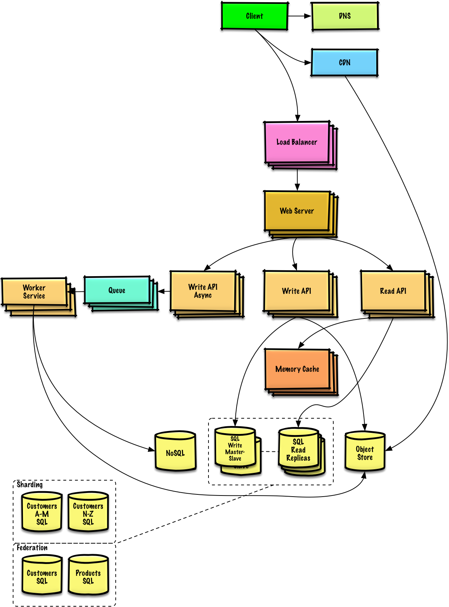
  <br/>
</p>

## 동기

> 대규모 시스템 설계를 배우자.
>
> 시스템 설계 면접을 준비하자.

### 대규모 시스템 설계를 배우자

확장 가능한 시스템을 설계하는 법을 배우면 더 나은 엔지니어가 될 수 있습니다.

시스템 설계는 매우 광범위한 주제입니다. 시스템 설계 원칙에 관한 **방대한 양의 자료가 인터넷 곳곳에 흩어져 있습니다.**

이 저장소는 대규모 시스템 구축 방법을 배울 수 있도록 자료를 **체계적으로 정리한 모음집**입니다.

### 오픈 소스 커뮤니티에서 배우자

이 프로젝트는 지속적으로 업데이트되는 오픈 소스 프로젝트입니다.

[기여](#기여)를 환영합니다!

### 시스템 설계 면접을 준비하자

코딩 면접 외에도, 시스템 설계는 많은 IT 기업의 **기술 면접 과정**에서 **필수 요소**입니다.

**자주 나오는 시스템 설계 면접 문제를 연습**하고, 자신의 답변을 **모범 답안**과 **비교**해 보세요: 토론, 코드, 다이어그램 등이 포함되어 있습니다.

면접 준비에 도움이 되는 추가 주제:

* [학습 가이드](#학습-가이드)
* [시스템 설계 면접 문제에 접근하는 방법](#시스템-설계-면접-문제에-접근하는-방법)
* [시스템 설계 면접 문제 **풀이 포함**](#시스템-설계-면접-문제-풀이-포함)
* [객체 지향 설계 면접 문제 **풀이 포함**](#객체-지향-설계-면접-문제-풀이-포함)
* [추가 시스템 설계 면접 문제](#추가-시스템-설계-면접-문제)

## Anki 플래시카드

<p align="center">
  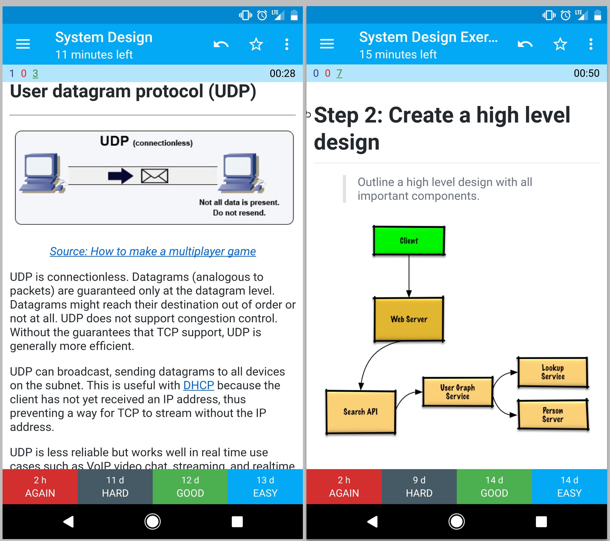
  <br/>
</p>

제공된 [Anki 플래시카드 덱](https://apps.ankiweb.net/)은 간격 반복 학습법을 활용하여 핵심 시스템 설계 개념을 기억하는 데 도움을 줍니다.

* [시스템 설계 덱](https://github.com/donnemartin/system-design-primer/tree/master/resources/flash_cards/System%20Design.apkg)
* [시스템 설계 연습 덱](https://github.com/donnemartin/system-design-primer/tree/master/resources/flash_cards/System%20Design%20Exercises.apkg)
* [객체 지향 설계 연습 덱](https://github.com/donnemartin/system-design-primer/tree/master/resources/flash_cards/OO%20Design.apkg)

이동 중에 사용하기 좋습니다.

### 코딩 자료: 대화형 코딩 챌린지

[**코딩 면접**](https://github.com/donnemartin/interactive-coding-challenges) 준비에 도움이 되는 자료를 찾고 계신가요?

<p align="center">
  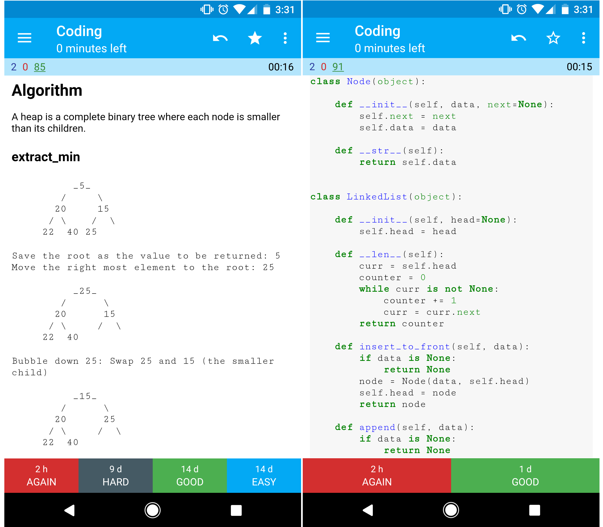
  <br/>
</p>

자매 저장소인 [**Interactive Coding Challenges**](https://github.com/donnemartin/interactive-coding-challenges)를 확인해 보세요. 추가 Anki 덱이 포함되어 있습니다:

* [코딩 덱](https://github.com/donnemartin/interactive-coding-challenges/tree/master/anki_cards/Coding.apkg)

## 기여

> 커뮤니티에서 배우자.

풀 리퀘스트를 자유롭게 제출해 주세요:

* 오류 수정
* 섹션 개선
* 새로운 섹션 추가
* [번역](https://github.com/donnemartin/system-design-primer/issues/28)

다듬기가 필요한 내용은 [개발 중](#개발-중)에 배치되어 있습니다.

[기여 가이드라인](CONTRIBUTING.md)을 확인해 주세요.

## 시스템 설계 주제 목차

> 다양한 시스템 설계 주제의 요약으로, 장단점을 포함합니다. **모든 것은 트레이드오프입니다**.
>
> 각 섹션에는 더 심층적인 자료로의 링크가 포함되어 있습니다.

<p align="center">
  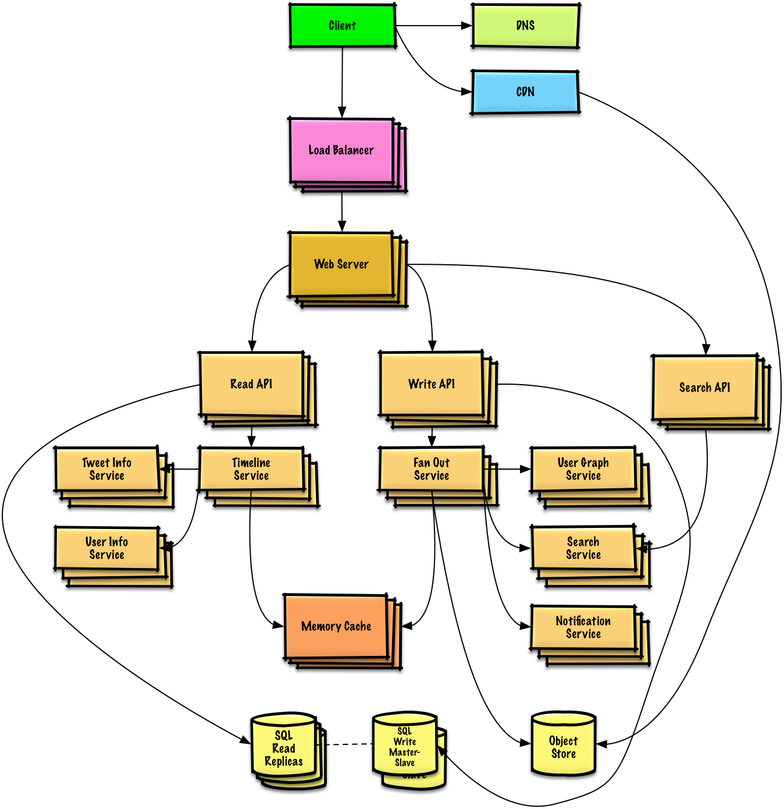
  <br/>
</p>

* [시스템 설계 주제: 여기서 시작하세요](#시스템-설계-주제-여기서-시작하세요)
    * [1단계: 확장성 강의 영상 복습](#1단계-확장성-강의-영상-복습)
    * [2단계: 확장성 아티클 복습](#2단계-확장성-아티클-복습)
    * [다음 단계](#다음-단계)
* [성능 vs 확장성](#성능-vs-확장성)
* [지연 시간 vs 처리량](#지연-시간-vs-처리량)
* [가용성 vs 일관성](#가용성-vs-일관성)
    * [CAP 이론](#cap-이론)
        * [CP - 일관성과 분할 내성](#cp---일관성과-분할-내성)
        * [AP - 가용성과 분할 내성](#ap---가용성과-분할-내성)
* [일관성 패턴](#일관성-패턴)
    * [약한 일관성](#약한-일관성)
    * [최종 일관성](#최종-일관성)
    * [강한 일관성](#강한-일관성)
* [가용성 패턴](#가용성-패턴)
    * [장애 조치](#장애-조치)
    * [복제](#복제)
    * [가용성 수치](#가용성-수치)
* [도메인 네임 시스템](#도메인-네임-시스템)
* [콘텐츠 전송 네트워크](#콘텐츠-전송-네트워크)
    * [Push CDN](#push-cdn)
    * [Pull CDN](#pull-cdn)
* [로드 밸런서](#로드-밸런서)
    * [액티브-패시브](#액티브-패시브)
    * [액티브-액티브](#액티브-액티브)
    * [4계층 로드 밸런싱](#4계층-로드-밸런싱)
    * [7계층 로드 밸런싱](#7계층-로드-밸런싱)
    * [수평 확장](#수평-확장)
* [리버스 프록시 (웹 서버)](#리버스-프록시-웹-서버)
    * [로드 밸런서 vs 리버스 프록시](#로드-밸런서-vs-리버스-프록시)
* [애플리케이션 계층](#애플리케이션-계층)
    * [마이크로서비스](#마이크로서비스)
    * [서비스 디스커버리](#서비스-디스커버리)
* [데이터베이스](#데이터베이스)
    * [관계형 데이터베이스 관리 시스템 (RDBMS)](#관계형-데이터베이스-관리-시스템-rdbms)
        * [마스터-슬레이브 복제](#마스터-슬레이브-복제)
        * [마스터-마스터 복제](#마스터-마스터-복제)
        * [페더레이션](#페더레이션)
        * [샤딩](#샤딩)
        * [비정규화](#비정규화)
        * [SQL 튜닝](#sql-튜닝)
    * [NoSQL](#nosql)
        * [키-값 저장소](#키-값-저장소)
        * [문서 저장소](#문서-저장소)
        * [와이드 컬럼 저장소](#와이드-컬럼-저장소)
        * [그래프 데이터베이스](#그래프-데이터베이스)
    * [SQL 또는 NoSQL](#sql-또는-nosql)
* [캐시](#캐시)
    * [클라이언트 캐싱](#클라이언트-캐싱)
    * [CDN 캐싱](#cdn-캐싱)
    * [웹 서버 캐싱](#웹-서버-캐싱)
    * [데이터베이스 캐싱](#데이터베이스-캐싱)
    * [애플리케이션 캐싱](#애플리케이션-캐싱)
    * [데이터베이스 쿼리 수준의 캐싱](#데이터베이스-쿼리-수준의-캐싱)
    * [객체 수준의 캐싱](#객체-수준의-캐싱)
    * [캐시 갱신 시점](#캐시-갱신-시점)
        * [캐시 어사이드](#캐시-어사이드)
        * [라이트 스루](#라이트-스루)
        * [라이트 비하인드 (라이트 백)](#라이트-비하인드-라이트-백)
        * [리프레시 어헤드](#리프레시-어헤드)
* [비동기](#비동기)
    * [메시지 큐](#메시지-큐)
    * [태스크 큐](#태스크-큐)
    * [백프레셔](#백프레셔)
* [통신](#통신)
    * [전송 제어 프로토콜 (TCP)](#전송-제어-프로토콜-tcp)
    * [사용자 데이터그램 프로토콜 (UDP)](#사용자-데이터그램-프로토콜-udp)
    * [원격 프로시저 호출 (RPC)](#원격-프로시저-호출-rpc)
    * [REST (Representational State Transfer)](#rest-representational-state-transfer)
* [보안](#보안)
* [부록](#부록)
    * [2의 거듭제곱 표](#2의-거듭제곱-표)
    * [모든 프로그래머가 알아야 할 지연 시간 수치](#모든-프로그래머가-알아야-할-지연-시간-수치)
    * [추가 시스템 설계 면접 문제](#추가-시스템-설계-면접-문제)
    * [실제 아키텍처](#실제-아키텍처)
    * [기업 아키텍처](#기업-아키텍처)
    * [기업 엔지니어링 블로그](#기업-엔지니어링-블로그)
* [개발 중](#개발-중)
* [크레딧](#크레딧)
* [연락처](#연락처)
* [라이선스](#라이선스)

## 학습 가이드

> 면접 일정에 따라 복습할 주제를 추천합니다 (단기, 중기, 장기).

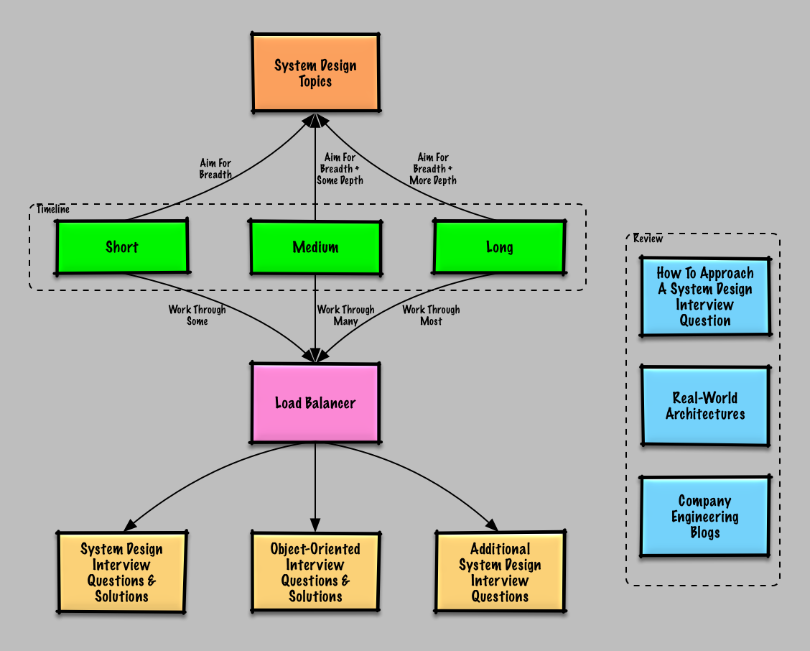

**Q: 면접을 위해 여기 있는 모든 것을 알아야 하나요?**

**A: 아니요, 면접 준비를 위해 여기 있는 모든 것을 알 필요는 없습니다**.

면접에서 무엇을 질문받을지는 다음과 같은 변수에 따라 달라집니다:

* 경력이 얼마나 되는지
* 기술적 배경이 무엇인지
* 어떤 직책에 지원하는지
* 어떤 회사에 지원하는지
* 운

경력이 많은 지원자는 일반적으로 시스템 설계에 대해 더 많이 알기를 기대받습니다. 아키텍트나 팀 리드는 개인 기여자보다 더 많은 지식을 요구받을 수 있습니다. 최상위 IT 기업은 하나 이상의 설계 면접 라운드가 있을 가능성이 높습니다.

폭넓게 시작하고 몇 가지 영역에서 깊이 들어가세요. 다양한 핵심 시스템 설계 주제에 대해 조금이라도 아는 것이 도움이 됩니다. 아래 가이드를 자신의 일정, 경험, 지원 직책, 지원 회사에 맞게 조정하세요.

* **단기 일정** - 시스템 설계 주제의 **폭**을 목표로 하세요. **일부** 면접 문제를 풀어보며 연습하세요.
* **중기 일정** - 시스템 설계 주제의 **폭**과 **약간의 깊이**를 목표로 하세요. **다수의** 면접 문제를 풀어보며 연습하세요.
* **장기 일정** - 시스템 설계 주제의 **폭**과 **더 많은 깊이**를 목표로 하세요. **대부분의** 면접 문제를 풀어보며 연습하세요.

| | 단기 | 중기 | 장기 |
|---|---|---|---|
| [시스템 설계 주제](#시스템-설계-주제-목차)를 읽고 시스템 작동 방식에 대한 폭넓은 이해를 갖추세요 | :+1: | :+1: | :+1: |
| 지원하는 회사의 [기업 엔지니어링 블로그](#기업-엔지니어링-블로그)에서 몇 가지 아티클을 읽으세요 | :+1: | :+1: | :+1: |
| [실제 아키텍처](#실제-아키텍처)를 몇 가지 읽으세요 | :+1: | :+1: | :+1: |
| [시스템 설계 면접 문제에 접근하는 방법](#시스템-설계-면접-문제에-접근하는-방법)을 복습하세요 | :+1: | :+1: | :+1: |
| [시스템 설계 면접 문제 풀이 포함](#시스템-설계-면접-문제-풀이-포함)을 풀어보세요 | 일부 | 다수 | 대부분 |
| [객체 지향 설계 면접 문제 풀이 포함](#객체-지향-설계-면접-문제-풀이-포함)을 풀어보세요 | 일부 | 다수 | 대부분 |
| [추가 시스템 설계 면접 문제](#추가-시스템-설계-면접-문제)를 복습하세요 | 일부 | 다수 | 대부분 |

## 시스템 설계 면접 문제에 접근하는 방법

> 시스템 설계 면접 문제를 다루는 방법.

시스템 설계 면접은 **열린 형식의 대화**입니다. 여러분이 대화를 이끌어야 합니다.

다음 단계를 사용하여 토론을 이끌어 보세요. 이 과정을 확실히 익히기 위해 [시스템 설계 면접 문제 풀이 포함](#시스템-설계-면접-문제-풀이-포함) 섹션에서 다음 단계를 적용하며 풀어보세요.

### 1단계: 유스케이스, 제약 조건, 가정 정리

요구사항을 수집하고 문제의 범위를 정의하세요. 유스케이스와 제약 조건을 명확히 하기 위해 질문하세요. 가정을 논의하세요.

* 누가 사용할 것인가?
* 어떻게 사용할 것인가?
* 사용자는 몇 명인가?
* 시스템이 무엇을 하는가?
* 시스템의 입력과 출력은 무엇인가?
* 얼마나 많은 데이터를 처리해야 하는가?
* 초당 요청 수는 얼마나 되는가?
* 예상 읽기/쓰기 비율은 어떻게 되는가?

### 2단계: 상위 수준 설계 작성

모든 중요한 컴포넌트를 포함한 상위 수준 설계를 개략적으로 그리세요.

* 주요 컴포넌트와 연결을 스케치하세요
* 아이디어를 정당화하세요

### 3단계: 핵심 컴포넌트 설계

각 핵심 컴포넌트의 세부 사항을 파고드세요. 예를 들어, [URL 단축 서비스 설계](solutions/system_design/pastebin/README.md)를 요청받았다면 다음을 논의하세요:

* 전체 URL의 해시 생성 및 저장
    * [MD5](solutions/system_design/pastebin/README.md)와 [Base62](solutions/system_design/pastebin/README.md)
    * 해시 충돌
    * SQL 또는 NoSQL
    * 데이터베이스 스키마
* 해시된 URL을 전체 URL로 변환
    * 데이터베이스 조회
* API 및 객체 지향 설계

### 4단계: 설계 확장

제약 조건을 고려하여 병목 현상을 식별하고 해결하세요. 예를 들어, 확장성 문제를 해결하기 위해 다음이 필요한가요?

* 로드 밸런서
* 수평 확장
* 캐싱
* 데이터베이스 샤딩

잠재적 해결책과 트레이드오프를 논의하세요. 모든 것은 트레이드오프입니다. [확장 가능한 시스템 설계 원칙](#시스템-설계-주제-목차)을 사용하여 병목 현상을 해결하세요.

### 봉투 뒷면 계산

면접에서 직접 추정치를 계산하도록 요청받을 수 있습니다. 다음 자료는 [부록](#부록)을 참조하세요:

* [봉투 뒷면 계산 활용하기](http://highscalability.com/blog/2011/1/26/google-pro-tip-use-back-of-the-envelope-calculations-to-choo.html)
* [2의 거듭제곱 표](#2의-거듭제곱-표)
* [모든 프로그래머가 알아야 할 지연 시간 수치](#모든-프로그래머가-알아야-할-지연-시간-수치)

### 출처 및 추가 자료

무엇을 기대해야 하는지 더 잘 이해하려면 다음 링크를 확인하세요:

* [시스템 설계 면접 잘 보는 법](https://web.archive.org/web/20210505130322/https://www.palantir.com/2011/10/how-to-rock-a-systems-design-interview/)
* [시스템 설계 면접](http://www.hiredintech.com/system-design)
* [아키텍처 및 시스템 설계 면접 입문](https://www.youtube.com/watch?v=ZgdS0EUmn70)
* [시스템 설계 템플릿](https://leetcode.com/discuss/career/229177/My-System-Design-Template)

## 시스템 설계 면접 문제 풀이 포함

> 자주 나오는 시스템 설계 면접 문제와 모범 토론, 코드, 다이어그램.
>
> 풀이는 `solutions/` 폴더의 내용과 연결되어 있습니다.

| 문제 | |
|---|---|
| Pastebin.com (또는 Bit.ly) 설계 | [풀이](solutions/system_design/pastebin/README.md) |
| Twitter 타임라인 및 검색 (또는 Facebook 피드 및 검색) 설계 | [풀이](solutions/system_design/twitter/README.md) |
| 웹 크롤러 설계 | [풀이](solutions/system_design/web_crawler/README.md) |
| Mint.com 설계 | [풀이](solutions/system_design/mint/README.md) |
| 소셜 네트워크의 데이터 구조 설계 | [풀이](solutions/system_design/social_graph/README.md) |
| 검색 엔진용 키-값 저장소 설계 | [풀이](solutions/system_design/query_cache/README.md) |
| Amazon 카테고리별 판매 순위 기능 설계 | [풀이](solutions/system_design/sales_rank/README.md) |
| AWS에서 수백만 사용자로 확장하는 시스템 설계 | [풀이](solutions/system_design/scaling_aws/README.md) |
| 시스템 설계 문제 추가 | [기여](#기여) |

### Pastebin.com (또는 Bit.ly) 설계

[연습 문제 및 풀이 보기](solutions/system_design/pastebin/README.md)

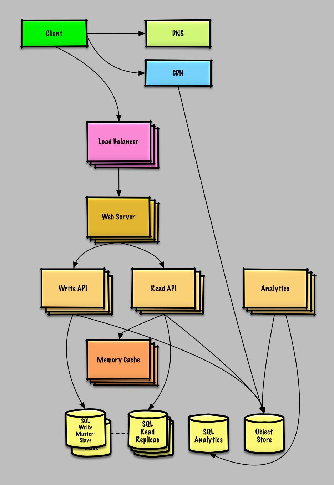

### Twitter 타임라인 및 검색 (또는 Facebook 피드 및 검색) 설계

[연습 문제 및 풀이 보기](solutions/system_design/twitter/README.md)


### 웹 크롤러 설계

[연습 문제 및 풀이 보기](solutions/system_design/web_crawler/README.md)

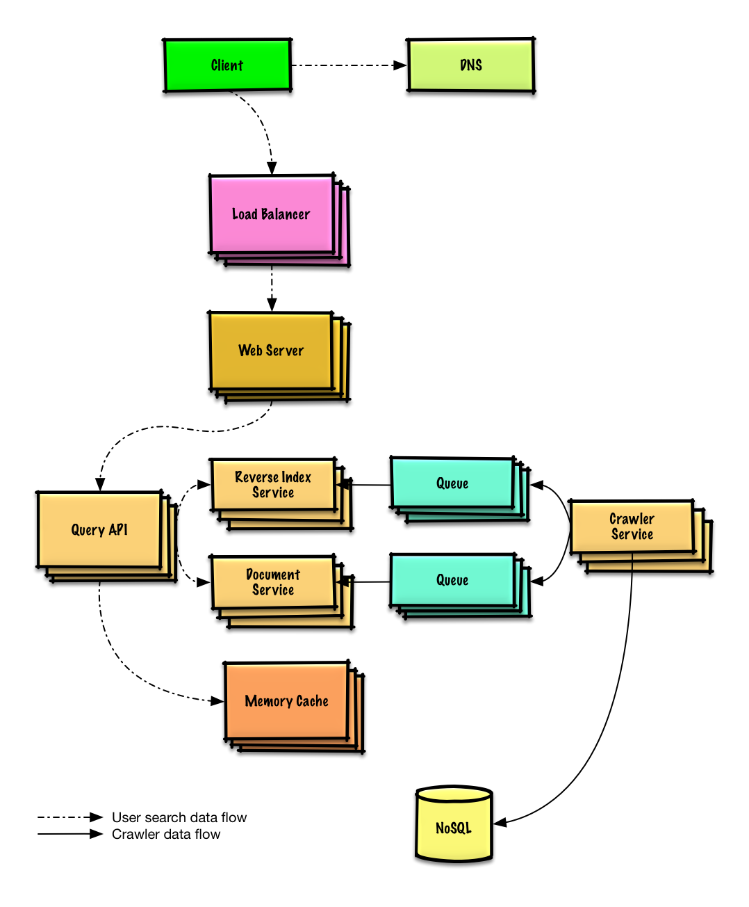

### Mint.com 설계

[연습 문제 및 풀이 보기](solutions/system_design/mint/README.md)

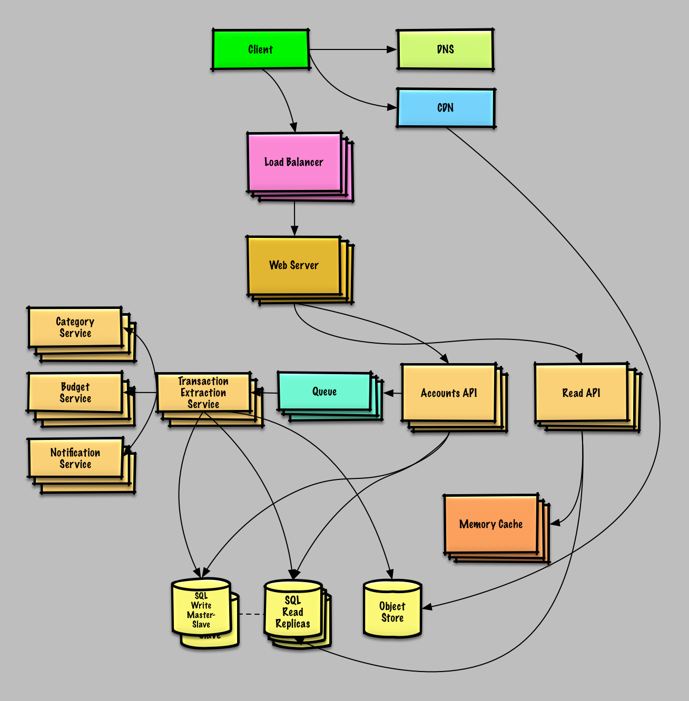

### 소셜 네트워크의 데이터 구조 설계

[연습 문제 및 풀이 보기](solutions/system_design/social_graph/README.md)

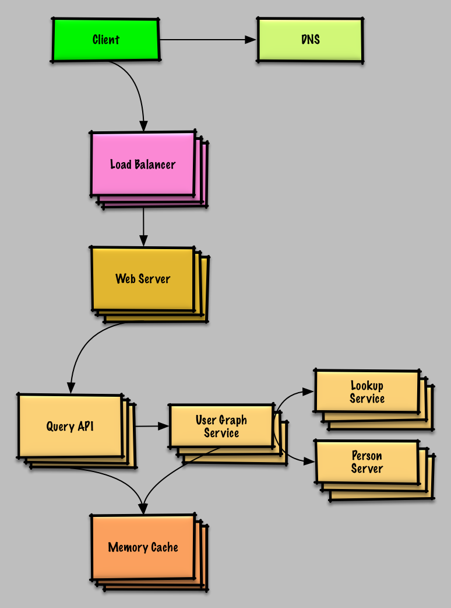

### 검색 엔진용 키-값 저장소 설계

[연습 문제 및 풀이 보기](solutions/system_design/query_cache/README.md)

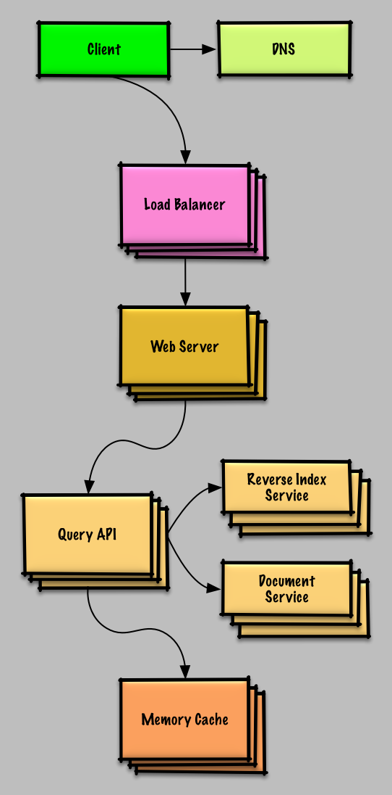

### Amazon 카테고리별 판매 순위 기능 설계

[연습 문제 및 풀이 보기](solutions/system_design/sales_rank/README.md)

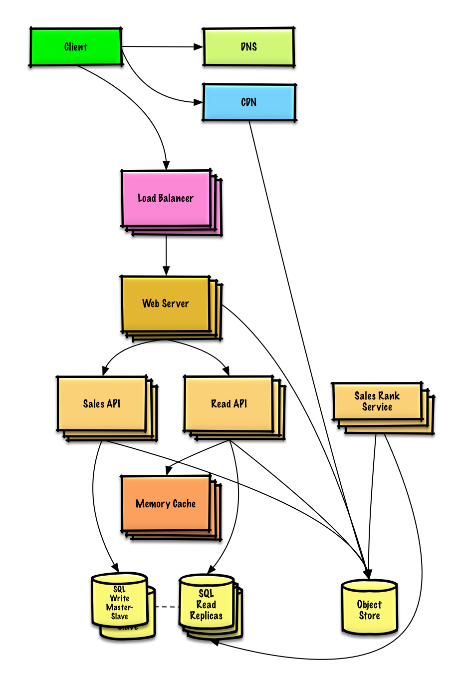

### AWS에서 수백만 사용자로 확장하는 시스템 설계

[연습 문제 및 풀이 보기](solutions/system_design/scaling_aws/README.md)


## 객체 지향 설계 면접 문제 풀이 포함

> 자주 나오는 객체 지향 설계 면접 문제와 모범 토론, 코드, 다이어그램.
>
> 풀이는 `solutions/` 폴더의 내용과 연결되어 있습니다.

>**참고: 이 섹션은 개발 중입니다**

| 문제 | |
|---|---|
| 해시맵 설계 | [풀이](solutions/object_oriented_design/hash_table/hash_map.ipynb) |
| LRU 캐시 설계 | [풀이](solutions/object_oriented_design/lru_cache/lru_cache.ipynb) |
| 콜센터 설계 | [풀이](solutions/object_oriented_design/call_center/call_center.ipynb) |
| 카드 덱 설계 | [풀이](solutions/object_oriented_design/deck_of_cards/deck_of_cards.ipynb) |
| 주차장 설계 | [풀이](solutions/object_oriented_design/parking_lot/parking_lot.ipynb) |
| 채팅 서버 설계 | [풀이](solutions/object_oriented_design/online_chat/online_chat.ipynb) |
| 원형 배열 설계 | [기여](#기여) |
| 객체 지향 설계 문제 추가 | [기여](#기여) |

## 시스템 설계 주제: 여기서 시작하세요

시스템 설계가 처음이신가요?

먼저 일반적인 원칙에 대한 기본적인 이해가 필요합니다. 각 원칙이 무엇인지, 어떻게 사용되는지, 장단점은 무엇인지 배우세요.

### 1단계: 확장성 강의 영상 복습

[하버드 확장성 강의](https://www.youtube.com/watch?v=-W9F__D3oY4)

* 다루는 주제:
    * 수직 확장
    * 수평 확장
    * 캐싱
    * 로드 밸런싱
    * 데이터베이스 복제
    * 데이터베이스 파티셔닝

### 2단계: 확장성 아티클 복습

[확장성](https://web.archive.org/web/20221030091841/http://www.lecloud.net/tagged/scalability/chrono)

* 다루는 주제:
    * [클론](https://web.archive.org/web/20220530193911/https://www.lecloud.net/post/7295452622/scalability-for-dummies-part-1-clones)
    * [데이터베이스](https://web.archive.org/web/20220602114024/https://www.lecloud.net/post/7994751381/scalability-for-dummies-part-2-database)
    * [캐시](https://web.archive.org/web/20230126233752/https://www.lecloud.net/post/9246290032/scalability-for-dummies-part-3-cache)
    * [비동기](https://web.archive.org/web/20220926171507/https://www.lecloud.net/post/9699762917/scalability-for-dummies-part-4-asynchronism)

### 다음 단계

다음으로 상위 수준의 트레이드오프를 살펴보겠습니다:

* **성능** vs **확장성**
* **지연 시간** vs **처리량**
* **가용성** vs **일관성**

**모든 것은 트레이드오프**라는 점을 기억하세요.

그런 다음 DNS, CDN, 로드 밸런서 등 더 구체적인 주제를 다루겠습니다.

## 성능 vs 확장성

서비스가 추가된 자원에 비례하여 **성능**이 향상되면 해당 서비스는 **확장 가능**합니다. 일반적으로 성능 향상은 더 많은 작업 단위를 처리하는 것을 의미하지만, 데이터 셋이 커질 때처럼 더 큰 작업 단위를 처리할 수 있는 것도 포함됩니다.<sup><a href=http://www.allthingsdistributed.com/2006/03/a_word_on_scalability.html>1</a></sup>

성능 vs 확장성을 바라보는 또 다른 방법:

* **성능** 문제가 있으면, 단일 사용자에 대해 시스템이 느립니다.
* **확장성** 문제가 있으면, 단일 사용자에 대해서는 빠르지만 높은 부하에서 느려집니다.

### 출처 및 추가 자료

* [확장성에 대한 한마디](http://www.allthingsdistributed.com/2006/03/a_word_on_scalability.html)
* [확장성, 가용성, 안정성, 패턴](http://www.slideshare.net/jboner/scalability-availability-stability-patterns/)

## 지연 시간 vs 처리량

**지연 시간(Latency)**은 어떤 작업을 수행하거나 결과를 생성하는 데 걸리는 시간입니다.

**처리량(Throughput)**은 단위 시간당 수행되는 작업 또는 결과의 수입니다.

일반적으로 **허용 가능한 지연 시간** 내에서 **최대 처리량**을 목표로 해야 합니다.

### 출처 및 추가 자료

* [지연 시간 vs 처리량 이해하기](https://community.cadence.com/cadence_blogs_8/b/fv/posts/understanding-latency-vs-throughput)

## 가용성 vs 일관성

### CAP 이론

<p align="center">
  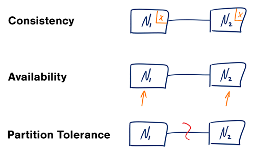
  <br/>
  <i><a href="https://robertgreiner.com/cap-theorem-revisited">출처: CAP theorem revisited</a></i>
</p>

분산 컴퓨터 시스템에서는 다음 세 가지 보장 중 두 가지만 지원할 수 있습니다:

* **일관성(Consistency)** - 모든 읽기가 가장 최근의 쓰기 또는 에러를 받습니다
* **가용성(Availability)** - 모든 요청이 응답을 받지만, 가장 최신 정보를 포함한다는 보장은 없습니다
* **분할 내성(Partition Tolerance)** - 네트워크 장애로 인한 임의의 분할에도 시스템이 계속 동작합니다

*네트워크는 신뢰할 수 없으므로 분할 내성을 지원해야 합니다. 따라서 일관성과 가용성 사이에서 소프트웨어적 트레이드오프를 해야 합니다.*

#### CP - 일관성과 분할 내성

분할된 노드의 응답을 기다리면 타임아웃 에러가 발생할 수 있습니다. CP는 비즈니스에서 원자적 읽기와 쓰기가 필요한 경우 좋은 선택입니다.

#### AP - 가용성과 분할 내성

응답은 어떤 노드에서든 가장 쉽게 접근 가능한 버전의 데이터를 반환하며, 이는 최신이 아닐 수 있습니다. 분할이 해소되면 쓰기가 전파되는 데 시간이 걸릴 수 있습니다.

AP는 비즈니스에서 [최종 일관성](#최종-일관성)을 허용하거나, 외부 오류에도 시스템이 계속 작동해야 할 때 좋은 선택입니다.

### 출처 및 추가 자료

* [CAP theorem revisited](https://robertgreiner.com/cap-theorem-revisited/)
* [CAP 이론 쉽게 설명하기](http://ksat.me/a-plain-english-introduction-to-cap-theorem)
* [CAP FAQ](https://github.com/henryr/cap-faq)
* [CAP 이론](https://www.youtube.com/watch?v=k-Yaq8AHlFA)

## 일관성 패턴

동일한 데이터의 여러 복사본이 있을 때, 클라이언트가 일관된 데이터 뷰를 갖도록 동기화하는 방법에 대한 선택을 해야 합니다. [CAP 이론](#cap-이론)에서의 일관성 정의를 떠올려 보세요 - 모든 읽기가 가장 최근의 쓰기 또는 에러를 받습니다.

### 약한 일관성

쓰기 후, 읽기가 해당 데이터를 볼 수도 있고 못 볼 수도 있습니다. 최선의 노력을 다하는 접근 방식입니다.

이 접근 방식은 memcached와 같은 시스템에서 볼 수 있습니다. 약한 일관성은 VoIP, 화상 채팅, 실시간 멀티플레이어 게임과 같은 실시간 사용 사례에서 잘 작동합니다. 예를 들어, 통화 중에 몇 초간 수신이 끊기면, 다시 연결되었을 때 끊긴 동안 말한 내용은 들을 수 없습니다.

### 최종 일관성

쓰기 후, 읽기가 최종적으로 해당 데이터를 보게 됩니다 (보통 밀리초 이내). 데이터는 비동기적으로 복제됩니다.

이 접근 방식은 DNS나 이메일과 같은 시스템에서 볼 수 있습니다. 최종 일관성은 고가용성 시스템에서 잘 작동합니다.

### 강한 일관성

쓰기 후, 읽기가 즉시 해당 데이터를 봅니다. 데이터는 동기적으로 복제됩니다.

이 접근 방식은 파일 시스템이나 RDBMS에서 볼 수 있습니다. 강한 일관성은 트랜잭션이 필요한 시스템에서 잘 작동합니다.

### 출처 및 추가 자료

* [데이터 센터 간 트랜잭션](http://snarfed.org/transactions_across_datacenters_io.html)

## 가용성 패턴

고가용성을 지원하는 두 가지 상호 보완적인 패턴이 있습니다: **장애 조치**와 **복제**.

### 장애 조치

#### 액티브-패시브

액티브-패시브 장애 조치에서는 액티브 서버와 대기 중인 패시브 서버 간에 하트비트가 전송됩니다. 하트비트가 중단되면, 패시브 서버가 액티브 서버의 IP 주소를 인수하고 서비스를 재개합니다.

다운타임 길이는 패시브 서버가 이미 '핫' 대기 상태로 실행 중인지, '콜드' 대기 상태에서 시작해야 하는지에 따라 결정됩니다. 액티브 서버만 트래픽을 처리합니다.

액티브-패시브 장애 조치는 마스터-슬레이브 장애 조치라고도 합니다.

#### 액티브-액티브

액티브-액티브에서는 두 서버 모두 트래픽을 관리하며, 부하를 분산합니다.

서버가 공개 서비스인 경우, DNS가 두 서버의 공개 IP를 알아야 합니다. 서버가 내부 서비스인 경우, 애플리케이션 로직이 두 서버를 모두 알아야 합니다.

액티브-액티브 장애 조치는 마스터-마스터 장애 조치라고도 합니다.

### 장애 조치의 단점

* 장애 조치는 더 많은 하드웨어와 추가적인 복잡성을 추가합니다.
* 새로 쓰여진 데이터가 패시브로 복제되기 전에 액티브 시스템이 실패하면 데이터 손실 가능성이 있습니다.

### 복제

#### 마스터-슬레이브 및 마스터-마스터

이 주제는 [데이터베이스](#데이터베이스) 섹션에서 더 자세히 논의됩니다:

* [마스터-슬레이브 복제](#마스터-슬레이브-복제)
* [마스터-마스터 복제](#마스터-마스터-복제)

### 가용성 수치

가용성은 서비스가 사용 가능한 시간의 백분율로 가동 시간(또는 다운타임)으로 자주 정량화됩니다. 가용성은 일반적으로 9의 개수로 측정됩니다 - 99.99% 가용성을 가진 서비스는 네 개의 9를 가진다고 표현합니다.

#### 99.9% 가용성 - 세 개의 9

| 기간 | 허용 다운타임 |
|---|---|
| 연간 다운타임 | 8시간 45분 57초 |
| 월간 다운타임 | 43분 49.7초 |
| 주간 다운타임 | 10분 4.8초 |
| 일간 다운타임 | 1분 26.4초 |

#### 99.99% 가용성 - 네 개의 9

| 기간 | 허용 다운타임 |
|---|---|
| 연간 다운타임 | 52분 35.7초 |
| 월간 다운타임 | 4분 23초 |
| 주간 다운타임 | 1분 5초 |
| 일간 다운타임 | 8.6초 |

#### 병렬 vs 직렬 가용성

서비스가 장애가 발생할 수 있는 여러 컴포넌트로 구성된 경우, 서비스의 전체 가용성은 컴포넌트가 직렬인지 병렬인지에 따라 달라집니다.

###### 직렬

가용성이 100% 미만인 두 컴포넌트가 직렬로 연결되면 전체 가용성은 감소합니다:

```
가용성 (전체) = 가용성 (Foo) * 가용성 (Bar)
```

`Foo`와 `Bar` 모두 99.9% 가용성이라면, 직렬 전체 가용성은 99.8%입니다.

###### 병렬

가용성이 100% 미만인 두 컴포넌트가 병렬로 연결되면 전체 가용성은 증가합니다:

```
가용성 (전체) = 1 - (1 - 가용성 (Foo)) * (1 - 가용성 (Bar))
```

`Foo`와 `Bar` 모두 99.9% 가용성이라면, 병렬 전체 가용성은 99.9999%입니다.

## 도메인 네임 시스템

<p align="center">
  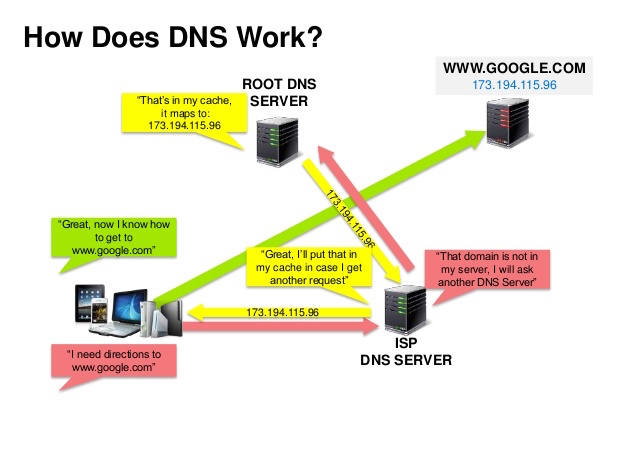
  <br/>
  <i><a href=http://www.slideshare.net/srikrupa5/dns-security-presentation-issa>출처: DNS security presentation</a></i>
</p>

도메인 네임 시스템(DNS)은 www.example.com과 같은 도메인 이름을 IP 주소로 변환합니다.

DNS는 계층적이며, 최상위에 몇 개의 권한 있는 서버가 있습니다. 라우터나 ISP가 조회 시 연결할 DNS 서버 정보를 제공합니다. 하위 수준 DNS 서버는 매핑을 캐시하며, DNS 전파 지연으로 인해 오래된 정보가 될 수 있습니다. DNS 결과는 [TTL(Time to Live)](https://en.wikipedia.org/wiki/Time_to_live)에 의해 결정된 일정 기간 동안 브라우저나 OS에서도 캐시될 수 있습니다.

* **NS 레코드 (네임 서버)** - 도메인/서브도메인의 DNS 서버를 지정합니다.
* **MX 레코드 (메일 교환)** - 메시지를 수신하는 메일 서버를 지정합니다.
* **A 레코드 (주소)** - 이름을 IP 주소로 연결합니다.
* **CNAME (정규 이름)** - 이름을 다른 이름이나 `CNAME` (example.com을 www.example.com으로) 또는 `A` 레코드로 연결합니다.

[CloudFlare](https://www.cloudflare.com/dns/)와 [Route 53](https://aws.amazon.com/route53/) 같은 서비스가 관리형 DNS 서비스를 제공합니다. 일부 DNS 서비스는 다양한 방법으로 트래픽을 라우팅할 수 있습니다:

* [가중 라운드 로빈](https://www.jscape.com/blog/load-balancing-algorithms)
    * 유지보수 중인 서버로의 트래픽 방지
    * 다양한 클러스터 크기 간 균형 조절
    * A/B 테스트
* [지연 시간 기반](https://docs.aws.amazon.com/Route53/latest/DeveloperGuide/routing-policy-latency.html)
* [지리적 위치 기반](https://docs.aws.amazon.com/Route53/latest/DeveloperGuide/routing-policy-geo.html)

### DNS의 단점

* DNS 서버 접근 시 약간의 지연이 발생하지만, 위에서 설명한 캐싱으로 완화됩니다.
* DNS 서버 관리가 복잡할 수 있으며, 일반적으로 [정부, ISP, 대기업](http://superuser.com/questions/472695/who-controls-the-dns-servers/472729)이 관리합니다.
* DNS 서비스가 최근 [DDoS 공격](http://dyn.com/blog/dyn-analysis-summary-of-friday-october-21-attack/)을 받아, 사용자가 Twitter의 IP 주소를 모르면 접속할 수 없는 상황이 발생했습니다.

### 출처 및 추가 자료

* [DNS 아키텍처](https://technet.microsoft.com/en-us/library/dd197427(v=ws.10).aspx)
* [Wikipedia](https://en.wikipedia.org/wiki/Domain_Name_System)
* [DNS 아티클](https://support.dnsimple.com/categories/dns/)

## 콘텐츠 전송 네트워크

<p align="center">
  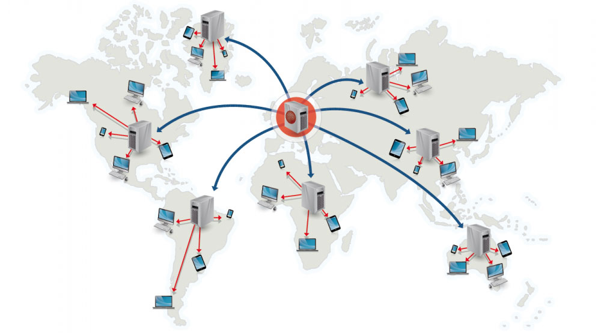
  <br/>
  <i><a href=https://www.creative-artworks.eu/why-use-a-content-delivery-network-cdn/>출처: Why use a CDN</a></i>
</p>

콘텐츠 전송 네트워크(CDN)는 사용자에게 더 가까운 위치에서 콘텐츠를 제공하는 전 세계에 분산된 프록시 서버 네트워크입니다. 일반적으로 HTML/CSS/JS, 사진, 동영상과 같은 정적 파일이 CDN에서 제공되지만, Amazon CloudFront처럼 동적 콘텐츠를 지원하는 CDN도 있습니다. 사이트의 DNS 해석이 클라이언트에게 어떤 서버에 연결할지 알려줍니다.

CDN에서 콘텐츠를 제공하면 두 가지 방면에서 성능이 크게 향상될 수 있습니다:

* 사용자가 가까운 데이터 센터에서 콘텐츠를 받습니다
* CDN이 처리하는 요청을 서버가 직접 처리할 필요가 없습니다

### Push CDN

Push CDN은 서버에 변경이 발생할 때마다 새 콘텐츠를 받습니다. 콘텐츠 제공, CDN에 직접 업로드, CDN을 가리키도록 URL 재작성 등의 전체 책임을 집니다. 콘텐츠의 만료 시점과 갱신 시점을 설정할 수 있습니다. 콘텐츠는 새로 생성되거나 변경될 때만 업로드되므로 트래픽은 최소화되지만 저장 공간은 최대화됩니다.

트래픽이 적은 사이트나 콘텐츠가 자주 업데이트되지 않는 사이트는 Push CDN에 적합합니다. 콘텐츠는 정기적으로 다시 가져오는 대신 한 번만 CDN에 배치됩니다.

### Pull CDN

Pull CDN은 첫 번째 사용자가 콘텐츠를 요청할 때 서버에서 새 콘텐츠를 가져옵니다. 콘텐츠를 서버에 그대로 두고 CDN을 가리키도록 URL을 재작성합니다. CDN에 콘텐츠가 캐시되기 전까지는 요청이 느려집니다.

[TTL(Time-to-Live)](https://en.wikipedia.org/wiki/Time_to_live)이 콘텐츠 캐시 기간을 결정합니다. Pull CDN은 CDN의 저장 공간을 최소화하지만, 파일이 실제로 변경되기 전에 만료되어 다시 가져오면 중복 트래픽이 발생할 수 있습니다.

트래픽이 많은 사이트는 Pull CDN에 적합합니다. 최근 요청된 콘텐츠만 CDN에 남으므로 트래픽이 더 균등하게 분산됩니다.

### CDN의 단점

* CDN 비용이 트래픽에 따라 상당할 수 있지만, CDN을 사용하지 않을 때 발생하는 추가 비용과 비교하여 판단해야 합니다.
* TTL이 만료되기 전에 콘텐츠가 업데이트되면 오래된 콘텐츠가 제공될 수 있습니다.
* CDN은 정적 콘텐츠의 URL을 CDN을 가리키도록 변경해야 합니다.

### 출처 및 추가 자료

* [전 세계 분산 콘텐츠 전송](https://figshare.com/articles/Globally_distributed_content_delivery/6605972)
* [Push CDN과 Pull CDN의 차이점](http://www.travelblogadvice.com/technical/the-differences-between-push-and-pull-cdns/)
* [Wikipedia](https://en.wikipedia.org/wiki/Content_delivery_network)

## 로드 밸런서

<p align="center">
  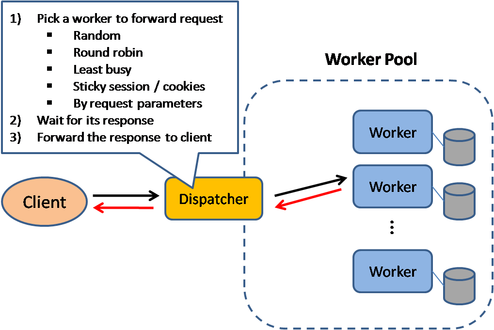
  <br/>
  <i><a href=http://horicky.blogspot.com/2010/10/scalable-system-design-patterns.html>출처: Scalable system design patterns</a></i>
</p>

로드 밸런서는 들어오는 클라이언트 요청을 애플리케이션 서버나 데이터베이스 같은 컴퓨팅 자원에 분배합니다. 각 경우에 로드 밸런서는 컴퓨팅 자원의 응답을 적절한 클라이언트에 반환합니다. 로드 밸런서의 효과:

* 비정상 서버로의 요청 방지
* 자원 과부하 방지
* 단일 장애 지점 제거 지원

로드 밸런서는 하드웨어(비용이 높음) 또는 HAProxy 같은 소프트웨어로 구현할 수 있습니다.

추가 이점:

* **SSL 종료** - 들어오는 요청을 복호화하고 서버 응답을 암호화하여 백엔드 서버가 이런 비용이 큰 작업을 수행할 필요가 없습니다
    * 각 서버에 [X.509 인증서](https://en.wikipedia.org/wiki/X.509)를 설치할 필요가 없습니다
* **세션 유지** - 웹 앱이 세션을 추적하지 않는 경우 쿠키를 발급하고 특정 클라이언트의 요청을 같은 인스턴스로 라우팅합니다

장애로부터 보호하기 위해 여러 로드 밸런서를 [액티브-패시브](#액티브-패시브) 또는 [액티브-액티브](#액티브-액티브) 모드로 설정하는 것이 일반적입니다.

로드 밸런서는 다양한 메트릭을 기반으로 트래픽을 라우팅할 수 있습니다:

* 랜덤
* 최소 부하
* 세션/쿠키
* [라운드 로빈 또는 가중 라운드 로빈](https://www.g33kinfo.com/info/round-robin-vs-weighted-round-robin-lb)
* [4계층](#4계층-로드-밸런싱)
* [7계층](#7계층-로드-밸런싱)

### 4계층 로드 밸런싱

4계층 로드 밸런서는 [전송 계층](#통신)의 정보를 보고 요청 분배 방법을 결정합니다. 일반적으로 헤더의 소스 IP, 대상 IP 주소, 포트를 포함하지만, 패킷 내용은 포함하지 않습니다. 4계층 로드 밸런서는 네트워크 패킷을 업스트림 서버로 전달하며, [NAT(Network Address Translation)](https://www.nginx.com/resources/glossary/layer-4-load-balancing/)를 수행합니다.

### 7계층 로드 밸런싱

7계층 로드 밸런서는 [애플리케이션 계층](#통신)을 보고 요청 분배 방법을 결정합니다. 헤더, 메시지, 쿠키의 내용을 포함할 수 있습니다. 7계층 로드 밸런서는 네트워크 트래픽을 종료하고, 메시지를 읽고, 로드 밸런싱 결정을 내린 후, 선택된 서버에 연결을 엽니다. 예를 들어, 7계층 로드 밸런서는 비디오 트래픽을 비디오 호스팅 서버로, 민감한 사용자 결제 트래픽을 보안이 강화된 서버로 보낼 수 있습니다.

유연성을 대가로, 4계층 로드 밸런싱은 7계층보다 시간과 컴퓨팅 자원이 적게 필요하지만, 현대 상용 하드웨어에서는 성능 영향이 미미할 수 있습니다.

### 수평 확장

로드 밸런서는 수평 확장에도 도움이 되며, 성능과 가용성을 향상시킵니다. 상용 머신을 사용한 스케일 아웃은 비용이 높은 하드웨어에서 단일 서버를 스케일 업하는 **수직 확장**보다 비용 효율적이고 가용성이 높습니다. 또한 상용 하드웨어에서 일하는 인재를 고용하는 것이 전문 기업 시스템보다 쉽습니다.

#### 수평 확장의 단점

* 수평 확장은 복잡성을 도입하며 서버 복제를 수반합니다
    * 서버는 상태 비저장이어야 합니다: 세션이나 프로필 사진 같은 사용자 관련 데이터를 포함하면 안 됩니다
    * 세션은 [데이터베이스](#데이터베이스) (SQL, NoSQL)나 영속적인 [캐시](#캐시) (Redis, Memcached) 같은 중앙 집중형 데이터 저장소에 저장할 수 있습니다
* 업스트림 서버가 스케일 아웃되면 캐시나 데이터베이스 같은 다운스트림 서버가 더 많은 동시 연결을 처리해야 합니다

### 로드 밸런서의 단점

* 로드 밸런서가 충분한 자원이 없거나 올바르게 설정되지 않으면 성능 병목이 될 수 있습니다.
* 단일 장애 지점을 제거하기 위해 로드 밸런서를 도입하면 복잡성이 증가합니다.
* 단일 로드 밸런서는 단일 장애 지점이며, 여러 로드 밸런서를 구성하면 복잡성이 더 증가합니다.

### 출처 및 추가 자료

* [NGINX 아키텍처](https://www.nginx.com/blog/inside-nginx-how-we-designed-for-performance-scale/)
* [HAProxy 아키텍처 가이드](http://www.haproxy.org/download/1.2/doc/architecture.txt)
* [확장성](https://web.archive.org/web/20220530193911/https://www.lecloud.net/post/7295452622/scalability-for-dummies-part-1-clones)
* [Wikipedia](https://en.wikipedia.org/wiki/Load_balancing_(computing))
* [4계층 로드 밸런싱](https://www.nginx.com/resources/glossary/layer-4-load-balancing/)
* [7계층 로드 밸런싱](https://www.nginx.com/resources/glossary/layer-7-load-balancing/)
* [ELB 리스너 설정](http://docs.aws.amazon.com/elasticloadbalancing/latest/classic/elb-listener-config.html)

## 리버스 프록시 (웹 서버)

<p align="center">
  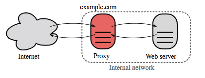
  <br/>
  <i><a href=https://upload.wikimedia.org/wikipedia/commons/6/67/Reverse_proxy_h2g2bob.svg>출처: Wikipedia</a></i>
  <br/>
</p>

리버스 프록시는 내부 서비스를 중앙 집중화하고 외부에 통합된 인터페이스를 제공하는 웹 서버입니다. 클라이언트의 요청은 해당 요청을 처리할 수 있는 서버로 전달되고, 리버스 프록시가 서버의 응답을 클라이언트에 반환합니다.

추가 이점:

* **보안 강화** - 백엔드 서버 정보 숨기기, IP 차단, 클라이언트당 연결 수 제한
* **확장성과 유연성 향상** - 클라이언트는 리버스 프록시의 IP만 보므로, 서버를 확장하거나 설정을 변경할 수 있습니다
* **SSL 종료** - 들어오는 요청을 복호화하고 서버 응답을 암호화하여 백엔드 서버가 이런 비용이 큰 작업을 수행할 필요가 없습니다
    * 각 서버에 [X.509 인증서](https://en.wikipedia.org/wiki/X.509)를 설치할 필요가 없습니다
* **압축** - 서버 응답 압축
* **캐싱** - 캐시된 요청에 대한 응답 반환
* **정적 콘텐츠** - 정적 콘텐츠를 직접 제공
    * HTML/CSS/JS
    * 사진
    * 동영상
    * 기타

### 로드 밸런서 vs 리버스 프록시

* 로드 밸런서 배포는 여러 서버가 있을 때 유용합니다. 로드 밸런서는 보통 동일한 기능을 수행하는 서버 세트로 트래픽을 라우팅합니다.
* 리버스 프록시는 웹 서버나 애플리케이션 서버가 하나뿐이어도 유용하며, 이전 섹션에서 설명한 이점을 제공합니다.
* NGINX와 HAProxy 같은 솔루션은 7계층 리버스 프록시와 로드 밸런싱을 모두 지원할 수 있습니다.

### 리버스 프록시의 단점

* 리버스 프록시를 도입하면 복잡성이 증가합니다.
* 단일 리버스 프록시는 단일 장애 지점이며, 여러 리버스 프록시를 구성하면 ([장애 조치](https://en.wikipedia.org/wiki/Failover)) 복잡성이 더 증가합니다.

### 출처 및 추가 자료

* [리버스 프록시 vs 로드 밸런서](https://www.nginx.com/resources/glossary/reverse-proxy-vs-load-balancer/)
* [NGINX 아키텍처](https://www.nginx.com/blog/inside-nginx-how-we-designed-for-performance-scale/)
* [HAProxy 아키텍처 가이드](http://www.haproxy.org/download/1.2/doc/architecture.txt)
* [Wikipedia](https://en.wikipedia.org/wiki/Reverse_proxy)

## 애플리케이션 계층

<p align="center">
  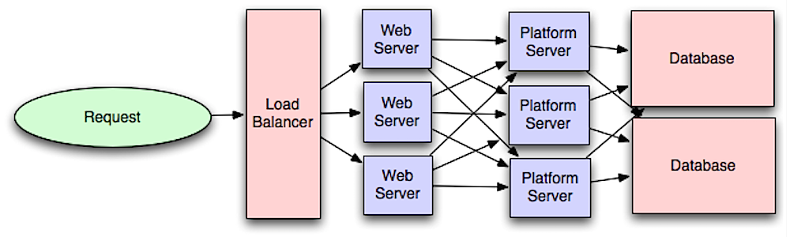
  <br/>
  <i><a href=http://lethain.com/introduction-to-architecting-systems-for-scale/#platform_layer>출처: Intro to architecting systems for scale</a></i>
</p>

웹 계층과 애플리케이션 계층(플랫폼 계층이라고도 함)을 분리하면 두 계층을 독립적으로 확장하고 설정할 수 있습니다. 새 API를 추가하면 추가 웹 서버 없이도 애플리케이션 서버만 추가할 수 있습니다. **단일 책임 원칙**은 함께 작동하는 작고 자율적인 서비스를 지지합니다. 작은 서비스를 가진 작은 팀은 빠른 성장을 위해 더 적극적으로 계획할 수 있습니다.

애플리케이션 계층의 워커는 [비동기](#비동기) 처리를 가능하게 합니다.

### 마이크로서비스

이 논의와 관련된 것이 [마이크로서비스](https://en.wikipedia.org/wiki/Microservices)로, 독립적으로 배포 가능한 작고 모듈화된 서비스의 모음입니다. 각 서비스는 고유한 프로세스를 실행하고, 비즈니스 목표를 달성하기 위해 잘 정의되고 경량화된 메커니즘을 통해 통신합니다. <sup><a href=https://smartbear.com/learn/api-design/what-are-microservices>1</a></sup>

예를 들어, Pinterest는 사용자 프로필, 팔로워, 피드, 검색, 사진 업로드 등의 마이크로서비스를 가질 수 있습니다.

### 서비스 디스커버리

[Consul](https://www.consul.io/docs/index.html), [Etcd](https://coreos.com/etcd/docs/latest), [Zookeeper](http://www.slideshare.net/sauravhaloi/introduction-to-apache-zookeeper) 같은 시스템은 등록된 이름, 주소, 포트를 추적하여 서비스가 서로를 찾을 수 있도록 합니다. [헬스 체크](https://www.consul.io/intro/getting-started/checks.html)는 서비스 무결성을 확인하는 데 도움이 되며, 보통 [HTTP](#하이퍼텍스트-전송-프로토콜-http) 엔드포인트를 사용합니다. Consul과 Etcd 모두 설정 값 및 기타 공유 데이터를 저장하는 데 유용한 내장 [키-값 저장소](#키-값-저장소)를 가지고 있습니다.

### 애플리케이션 계층의 단점

* 느슨하게 결합된 서비스로 애플리케이션 계층을 추가하면 아키텍처, 운영, 프로세스 관점에서 (모놀리식 시스템과 비교하여) 다른 접근 방식이 필요합니다.
* 마이크로서비스는 배포 및 운영 측면에서 복잡성을 추가할 수 있습니다.

### 출처 및 추가 자료

* [확장 가능한 시스템 아키텍처 입문](http://lethain.com/introduction-to-architecting-systems-for-scale)
* [시스템 설계 면접 정복하기](http://www.puncsky.com/blog/2016-02-13-crack-the-system-design-interview)
* [서비스 지향 아키텍처](https://en.wikipedia.org/wiki/Service-oriented_architecture)
* [Zookeeper 소개](http://www.slideshare.net/sauravhaloi/introduction-to-apache-zookeeper)
* [마이크로서비스 구축에 대해 알아야 할 것](https://cloudncode.wordpress.com/2016/07/22/msa-getting-started/)

## 데이터베이스

<p align="center">
  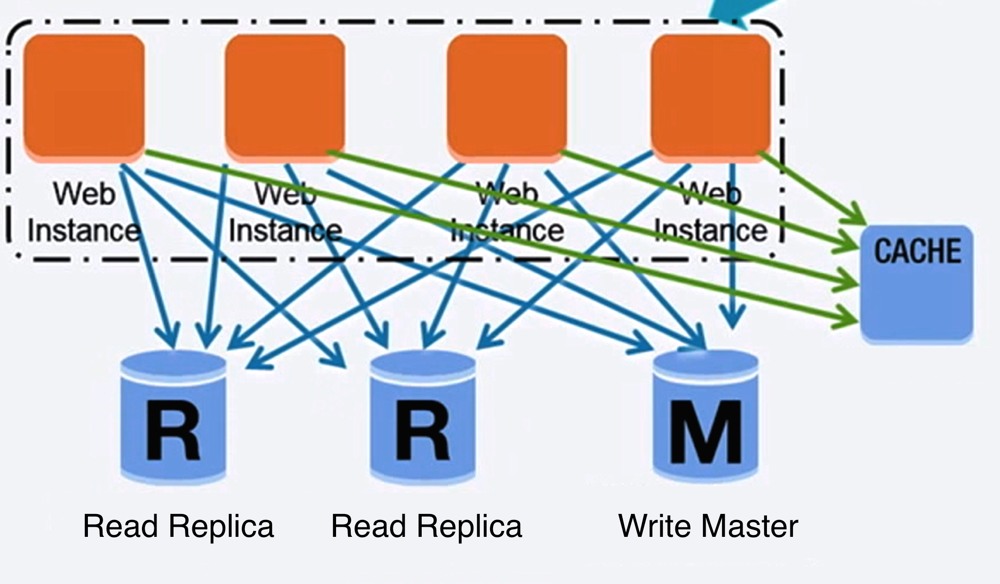
  <br/>
  <i><a href=https://www.youtube.com/watch?v=kKjm4ehYiMs>출처: Scaling up to your first 10 million users</a></i>
</p>

### 관계형 데이터베이스 관리 시스템 (RDBMS)

SQL과 같은 관계형 데이터베이스는 테이블로 구성된 데이터 항목의 모음입니다.

**ACID**는 관계형 데이터베이스 [트랜잭션](https://en.wikipedia.org/wiki/Database_transaction)의 속성 집합입니다.

* **원자성(Atomicity)** - 각 트랜잭션은 전부 아니면 전무입니다
* **일관성(Consistency)** - 모든 트랜잭션은 데이터베이스를 하나의 유효한 상태에서 다른 유효한 상태로 전환합니다
* **격리성(Isolation)** - 트랜잭션을 동시에 실행해도 순차적으로 실행한 것과 같은 결과를 가집니다
* **지속성(Durability)** - 트랜잭션이 커밋되면 그 상태를 유지합니다

관계형 데이터베이스를 확장하는 많은 기법이 있습니다: **마스터-슬레이브 복제**, **마스터-마스터 복제**, **페더레이션**, **샤딩**, **비정규화**, **SQL 튜닝**.

#### 마스터-슬레이브 복제

마스터는 읽기와 쓰기를 처리하고, 쓰기를 하나 이상의 슬레이브에 복제합니다. 슬레이브는 읽기만 처리합니다. 슬레이브는 트리 형태로 추가 슬레이브에 복제할 수도 있습니다. 마스터가 오프라인이 되면, 슬레이브가 마스터로 승격되거나 새 마스터가 프로비저닝될 때까지 읽기 전용 모드로 시스템이 계속 운영될 수 있습니다.

<p align="center">
  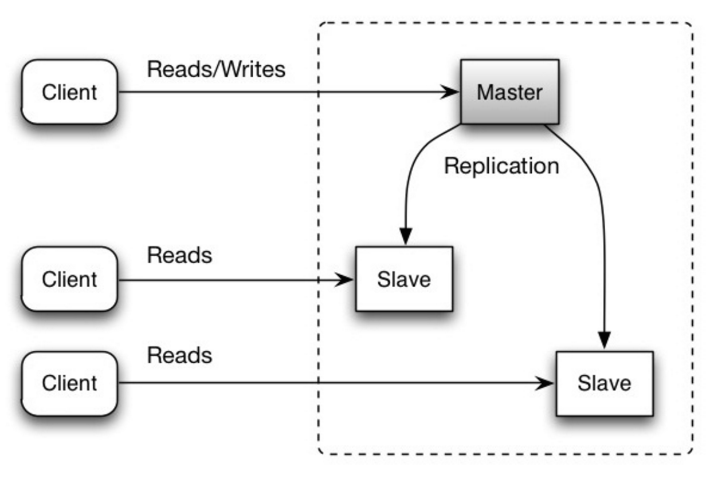
  <br/>
  <i><a href=http://www.slideshare.net/jboner/scalability-availability-stability-patterns/>출처: Scalability, availability, stability, patterns</a></i>
</p>

##### 마스터-슬레이브 복제의 단점

* 슬레이브를 마스터로 승격하기 위한 추가 로직이 필요합니다.
* 마스터-슬레이브와 마스터-마스터 **모두**에 관련된 사항은 [복제의 단점](#복제의-단점)을 참조하세요.

#### 마스터-마스터 복제

두 마스터 모두 읽기와 쓰기를 처리하며, 쓰기에 대해 서로 조율합니다. 어느 하나의 마스터가 다운되어도 시스템은 읽기와 쓰기 모두를 계속 처리할 수 있습니다.

<p align="center">
  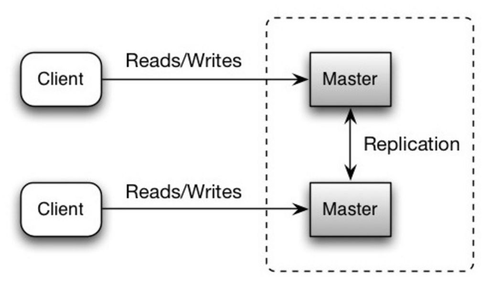
  <br/>
  <i><a href=http://www.slideshare.net/jboner/scalability-availability-stability-patterns/>출처: Scalability, availability, stability, patterns</a></i>
</p>

##### 마스터-마스터 복제의 단점

* 로드 밸런서가 필요하거나, 쓰기 위치를 결정하기 위해 애플리케이션 로직을 변경해야 합니다.
* 대부분의 마스터-마스터 시스템은 느슨한 일관성(ACID 위반)이거나, 동기화로 인해 쓰기 지연이 증가합니다.
* 쓰기 노드가 추가되고 지연 시간이 증가할수록 충돌 해결이 더 중요해집니다.
* 마스터-슬레이브와 마스터-마스터 **모두**에 관련된 사항은 [복제의 단점](#복제의-단점)을 참조하세요.

##### 복제의 단점

* 새로 쓰여진 데이터가 다른 노드에 복제되기 전에 마스터가 실패하면 데이터 손실 가능성이 있습니다.
* 쓰기가 읽기 복제본에 재생됩니다. 쓰기가 많으면 읽기 복제본이 쓰기 재생에 바빠져 읽기 처리가 어려워질 수 있습니다.
* 읽기 슬레이브가 많을수록 더 많이 복제해야 하며, 이는 복제 지연을 증가시킵니다.
* 일부 시스템에서 마스터에 쓰기를 하면 여러 스레드가 병렬로 쓸 수 있지만, 읽기 복제본은 단일 스레드로 순차적 쓰기만 지원합니다.
* 복제는 더 많은 하드웨어와 추가적인 복잡성을 추가합니다.

##### 출처 및 추가 자료: 복제

* [확장성, 가용성, 안정성, 패턴](http://www.slideshare.net/jboner/scalability-availability-stability-patterns/)
* [다중 마스터 복제](https://en.wikipedia.org/wiki/Multi-master_replication)

#### 페더레이션

<p align="center">
  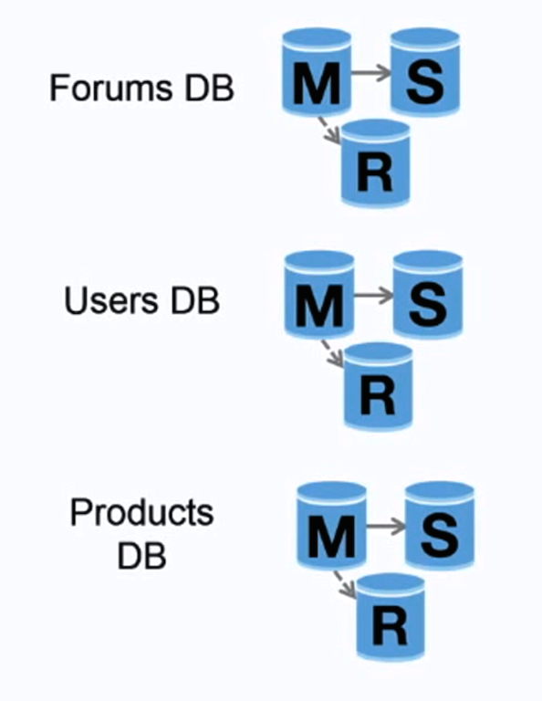
  <br/>
  <i><a href=https://www.youtube.com/watch?v=kKjm4ehYiMs>출처: Scaling up to your first 10 million users</a></i>
</p>

페더레이션(또는 기능적 파티셔닝)은 데이터베이스를 기능별로 분할합니다. 예를 들어, 단일 모놀리식 데이터베이스 대신 **포럼**, **사용자**, **제품** 세 개의 데이터베이스를 가질 수 있으며, 각 데이터베이스의 읽기/쓰기 트래픽이 줄어들어 복제 지연이 감소합니다. 더 작은 데이터베이스는 메모리에 더 많은 데이터를 저장할 수 있어, 캐시 지역성 향상으로 캐시 히트가 증가합니다. 쓰기를 직렬화하는 단일 중앙 마스터가 없으므로 병렬 쓰기가 가능하여 처리량이 증가합니다.

##### 페더레이션의 단점

* 스키마에 거대한 함수나 테이블이 필요한 경우 페더레이션은 효과적이지 않습니다.
* 어떤 데이터베이스에서 읽고 쓸지 결정하기 위해 애플리케이션 로직을 업데이트해야 합니다.
* 두 데이터베이스의 데이터를 조인하는 것이 [서버 링크](http://stackoverflow.com/questions/5145637/querying-data-by-joining-two-tables-in-two-database-on-different-servers)로 더 복잡해집니다.
* 페더레이션은 더 많은 하드웨어와 추가적인 복잡성을 추가합니다.

##### 출처 및 추가 자료: 페더레이션

* [천만 사용자까지 확장하기](https://www.youtube.com/watch?v=kKjm4ehYiMs)

#### 샤딩

<p align="center">
  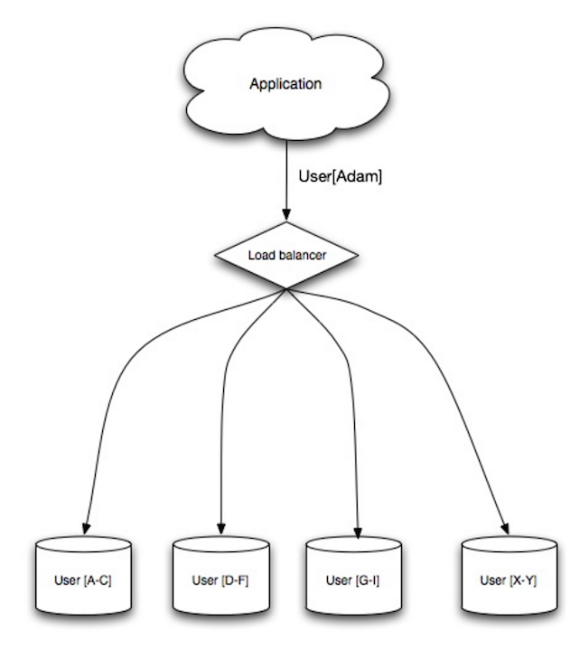
  <br/>
  <i><a href=http://www.slideshare.net/jboner/scalability-availability-stability-patterns/>출처: Scalability, availability, stability, patterns</a></i>
</p>

샤딩은 각 데이터베이스가 데이터의 일부만 관리하도록 서로 다른 데이터베이스에 데이터를 분산합니다. 사용자 데이터베이스를 예로 들면, 사용자 수가 증가함에 따라 클러스터에 더 많은 샤드가 추가됩니다.

[페더레이션](#페더레이션)의 이점과 유사하게, 샤딩은 읽기/쓰기 트래픽 감소, 복제 감소, 캐시 히트 증가를 가져옵니다. 인덱스 크기도 줄어들어 일반적으로 더 빠른 쿼리로 성능이 향상됩니다. 하나의 샤드가 다운되어도 다른 샤드는 계속 운영되지만, 데이터 손실을 방지하기 위해 복제를 추가하는 것이 좋습니다. 페더레이션처럼 쓰기를 직렬화하는 단일 중앙 마스터가 없으므로 병렬 쓰기가 가능하여 처리량이 증가합니다.

사용자 테이블을 샤딩하는 일반적인 방법은 사용자의 성 이니셜이나 지리적 위치를 기준으로 합니다.

##### 샤딩의 단점

* 샤드와 작동하도록 애플리케이션 로직을 업데이트해야 하며, 이는 복잡한 SQL 쿼리를 초래할 수 있습니다.
* 샤드 내에서 데이터 분포가 불균형해질 수 있습니다. 예를 들어, 한 샤드에 파워 유저가 집중되면 다른 샤드에 비해 해당 샤드의 부하가 증가합니다.
    * 재균형은 추가적인 복잡성을 더합니다. [일관성 해싱](http://www.paperplanes.de/2011/12/9/the-magic-of-consistent-hashing.html) 기반의 샤딩 함수는 전송되는 데이터 양을 줄일 수 있습니다.
* 여러 샤드의 데이터를 조인하는 것이 더 복잡합니다.
* 샤딩은 더 많은 하드웨어와 추가적인 복잡성을 추가합니다.

##### 출처 및 추가 자료: 샤딩

* [샤드의 등장](http://highscalability.com/blog/2009/8/6/an-unorthodox-approach-to-database-design-the-coming-of-the.html)
* [샤드 데이터베이스 아키텍처](https://en.wikipedia.org/wiki/Shard_(database_architecture))
* [일관성 해싱](http://www.paperplanes.de/2011/12/9/the-magic-of-consistent-hashing.html)

#### 비정규화

비정규화는 쓰기 성능을 일부 희생하여 읽기 성능을 향상시키려는 시도입니다. 비용이 큰 조인을 피하기 위해 여러 테이블에 중복된 데이터 복사본을 작성합니다. [PostgreSQL](https://en.wikipedia.org/wiki/PostgreSQL)이나 Oracle 같은 일부 RDBMS는 중복 정보의 저장과 일관성 유지를 처리하는 [구체화된 뷰](https://en.wikipedia.org/wiki/Materialized_view)를 지원합니다.

[페더레이션](#페더레이션)이나 [샤딩](#샤딩) 같은 기법으로 데이터가 분산되면, 데이터 센터 간 조인 관리가 더욱 복잡해집니다. 비정규화는 이런 복잡한 조인의 필요성을 우회할 수 있습니다.

대부분의 시스템에서 읽기가 쓰기보다 100:1 또는 1000:1로 압도적으로 많을 수 있습니다. 복잡한 데이터베이스 조인을 수반하는 읽기는 디스크 작업에 상당한 시간을 소비하므로 매우 비용이 클 수 있습니다.

##### 비정규화의 단점

* 데이터가 중복됩니다.
* 제약 조건이 중복된 정보의 동기화를 도울 수 있지만, 데이터베이스 설계의 복잡성이 증가합니다.
* 쓰기 부하가 높은 비정규화된 데이터베이스는 정규화된 데이터베이스보다 성능이 나쁠 수 있습니다.

###### 출처 및 추가 자료: 비정규화

* [비정규화](https://en.wikipedia.org/wiki/Denormalization)

#### SQL 튜닝

SQL 튜닝은 광범위한 주제이며, 참고용으로 많은 [책](https://www.amazon.com/s/ref=nb_sb_noss_2?url=search-alias%3Daps&field-keywords=sql+tuning)이 출판되어 있습니다.

병목 현상을 시뮬레이션하고 발견하기 위해 **벤치마크**와 **프로파일링**을 수행하는 것이 중요합니다.

* **벤치마크** - [ab](http://httpd.apache.org/docs/2.2/programs/ab.html) 같은 도구로 고부하 상황을 시뮬레이션합니다.
* **프로파일링** - [슬로우 쿼리 로그](http://dev.mysql.com/doc/refman/5.7/en/slow-query-log.html) 같은 도구를 활성화하여 성능 문제를 추적합니다.

벤치마크와 프로파일링은 다음과 같은 최적화를 가리킬 수 있습니다.

##### 스키마 최적화

* MySQL은 빠른 접근을 위해 연속 블록으로 디스크에 덤프합니다.
* 고정 길이 필드에는 `VARCHAR` 대신 `CHAR`를 사용하세요.
    * `CHAR`는 효과적으로 빠른 랜덤 접근을 허용하지만, `VARCHAR`는 다음 문자열로 이동하기 전에 문자열의 끝을 찾아야 합니다.
* 블로그 게시물 같은 대용량 텍스트 블록에는 `TEXT`를 사용하세요. `TEXT`는 불리언 검색도 허용합니다. `TEXT` 필드를 사용하면 텍스트 블록을 찾는 데 사용되는 포인터가 디스크에 저장됩니다.
* 최대 2^32 또는 40억까지의 큰 숫자에는 `INT`를 사용하세요.
* 통화에는 부동 소수점 표현 오류를 피하기 위해 `DECIMAL`을 사용하세요.
* 큰 `BLOB`를 저장하지 말고, 객체를 가져올 위치를 저장하세요.
* `VARCHAR(255)`는 8비트 숫자로 셀 수 있는 최대 문자 수이며, 일부 RDBMS에서 바이트 사용을 최대화합니다.
* 해당되는 경우 `NOT NULL` 제약 조건을 설정하여 [검색 성능을 향상](http://stackoverflow.com/questions/1017239/how-do-null-values-affect-performance-in-a-database-search)시키세요.

##### 좋은 인덱스 사용

* 쿼리하는 컬럼 (`SELECT`, `GROUP BY`, `ORDER BY`, `JOIN`)에 인덱스를 사용하면 더 빨라질 수 있습니다.
* 인덱스는 보통 데이터를 정렬 상태로 유지하고 로그 시간 내에 검색, 순차 접근, 삽입, 삭제를 허용하는 자기 균형 [B-트리](https://en.wikipedia.org/wiki/B-tree)로 표현됩니다.
* 인덱스를 추가하면 데이터를 메모리에 유지할 수 있어 더 많은 공간이 필요합니다.
* 인덱스도 업데이트해야 하므로 쓰기가 느려질 수 있습니다.
* 대량의 데이터를 로드할 때는 인덱스를 비활성화하고, 데이터를 로드한 후 인덱스를 다시 구축하는 것이 더 빠를 수 있습니다.

##### 비용이 큰 조인 피하기

* 성능이 요구하는 곳에서 [비정규화](#비정규화)를 적용하세요.

##### 테이블 파티셔닝

* 핫스팟을 별도 테이블로 분리하여 메모리에 유지하세요.

##### 쿼리 캐시 튜닝

* 경우에 따라 [쿼리 캐시](https://dev.mysql.com/doc/refman/5.7/en/query-cache.html)가 [성능 문제](https://www.percona.com/blog/2016/10/12/mysql-5-7-performance-tuning-immediately-after-installation/)를 유발할 수 있습니다.

##### 출처 및 추가 자료: SQL 튜닝

* [MySQL 쿼리 최적화 팁](http://aiddroid.com/10-tips-optimizing-mysql-queries-dont-suck/)
* [VARCHAR(255)를 자주 보는 이유가 있나요?](http://stackoverflow.com/questions/1217466/is-there-a-good-reason-i-see-varchar255-used-so-often-as-opposed-to-another-l)
* [null 값이 성능에 어떤 영향을 미치나요?](http://stackoverflow.com/questions/1017239/how-do-null-values-affect-performance-in-a-database-search)
* [슬로우 쿼리 로그](http://dev.mysql.com/doc/refman/5.7/en/slow-query-log.html)

### NoSQL

NoSQL은 **키-값 저장소**, **문서 저장소**, **와이드 컬럼 저장소**, **그래프 데이터베이스**로 표현되는 데이터 항목의 모음입니다. 데이터는 비정규화되어 있으며, 조인은 일반적으로 애플리케이션 코드에서 수행됩니다. 대부분의 NoSQL 저장소는 진정한 ACID 트랜잭션이 부족하며 [최종 일관성](#최종-일관성)을 선호합니다.

**BASE**는 NoSQL 데이터베이스의 속성을 설명하는 데 자주 사용됩니다. [CAP 이론](#cap-이론)과 비교하면, BASE는 일관성보다 가용성을 선택합니다.

* **기본적으로 가용(Basically available)** - 시스템이 가용성을 보장합니다.
* **소프트 상태(Soft state)** - 입력이 없어도 시간이 지남에 따라 시스템 상태가 변할 수 있습니다.
* **최종 일관성(Eventual consistency)** - 일정 기간 동안 입력을 받지 않으면 시스템은 결국 일관된 상태가 됩니다.

[SQL 또는 NoSQL](#sql-또는-nosql) 중 선택하는 것 외에도, 사용 사례에 가장 적합한 NoSQL 데이터베이스 유형을 이해하는 것이 도움이 됩니다. 다음 섹션에서 **키-값 저장소**, **문서 저장소**, **와이드 컬럼 저장소**, **그래프 데이터베이스**를 검토합니다.

#### 키-값 저장소

> 추상화: 해시 테이블

키-값 저장소는 일반적으로 O(1) 읽기와 쓰기를 허용하며, 메모리나 SSD에 의해 지원됩니다. 데이터 저장소는 키를 [사전 순서](https://en.wikipedia.org/wiki/Lexicographical_order)로 유지하여 키 범위의 효율적인 검색을 허용할 수 있습니다. 키-값 저장소는 값에 메타데이터를 저장할 수도 있습니다.

키-값 저장소는 높은 성능을 제공하며, 인메모리 캐시 계층과 같은 단순한 데이터 모델이나 빠르게 변하는 데이터에 자주 사용됩니다. 제한된 작업 집합만 제공하므로, 추가 작업이 필요하면 복잡성이 애플리케이션 계층으로 이동합니다.

키-값 저장소는 문서 저장소, 경우에 따라 그래프 데이터베이스 같은 더 복잡한 시스템의 기반입니다.

##### 출처 및 추가 자료: 키-값 저장소

* [키-값 데이터베이스](https://en.wikipedia.org/wiki/Key-value_database)
* [키-값 저장소의 단점](http://stackoverflow.com/questions/4056093/what-are-the-disadvantages-of-using-a-key-value-table-over-nullable-columns-or)
* [Redis 아키텍처](http://qnimate.com/overview-of-redis-architecture/)
* [Memcached 아키텍처](https://adayinthelifeof.nl/2011/02/06/memcache-internals/)

#### 문서 저장소

> 추상화: 문서가 값으로 저장된 키-값 저장소

문서 저장소는 문서(XML, JSON, 바이너리 등)를 중심으로 하며, 주어진 객체의 모든 정보를 문서에 저장합니다. 문서 저장소는 문서 자체의 내부 구조를 기반으로 쿼리하는 API나 쿼리 언어를 제공합니다. *참고: 많은 키-값 저장소가 값의 메타데이터 작업 기능을 포함하여, 이 두 저장소 유형의 경계가 모호해집니다.*

기본 구현에 따라 문서는 컬렉션, 태그, 메타데이터, 디렉토리로 구성됩니다. 문서가 함께 구성되거나 그룹화될 수 있지만, 서로 완전히 다른 필드를 가질 수 있습니다.

[MongoDB](https://www.mongodb.com/mongodb-architecture)나 [CouchDB](https://blog.couchdb.org/2016/08/01/couchdb-2-0-architecture/) 같은 일부 문서 저장소는 복잡한 쿼리를 수행하기 위한 SQL과 유사한 언어도 제공합니다. [DynamoDB](http://www.read.seas.harvard.edu/~kohler/class/cs239-w08/decandia07dynamo.pdf)는 키-값과 문서를 모두 지원합니다.

문서 저장소는 높은 유연성을 제공하며, 가끔 변경되는 데이터를 다루는 데 자주 사용됩니다.

##### 출처 및 추가 자료: 문서 저장소

* [문서 지향 데이터베이스](https://en.wikipedia.org/wiki/Document-oriented_database)
* [MongoDB 아키텍처](https://www.mongodb.com/mongodb-architecture)
* [CouchDB 아키텍처](https://blog.couchdb.org/2016/08/01/couchdb-2-0-architecture/)
* [Elasticsearch 아키텍처](https://www.elastic.co/blog/found-elasticsearch-from-the-bottom-up)

#### 와이드 컬럼 저장소

<p align="center">
  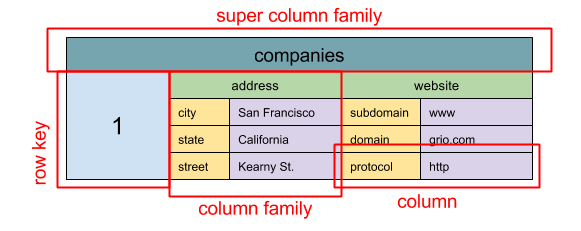
  <br/>
  <i><a href=http://blog.grio.com/2015/11/sql-nosql-a-brief-history.html>출처: SQL & NoSQL, a brief history</a></i>
</p>

> 추상화: 중첩 맵 `ColumnFamily<RowKey, Columns<ColKey, Value, Timestamp>>`

와이드 컬럼 저장소의 기본 데이터 단위는 컬럼(이름/값 쌍)입니다. 컬럼은 컬럼 패밀리(SQL 테이블과 유사)로 그룹화될 수 있습니다. 슈퍼 컬럼 패밀리는 컬럼 패밀리를 추가로 그룹화합니다. 각 컬럼은 행 키로 독립적으로 접근할 수 있으며, 같은 행 키를 가진 컬럼이 행을 형성합니다. 각 값은 버전 관리와 충돌 해결을 위한 타임스탬프를 포함합니다.

Google이 최초의 와이드 컬럼 저장소인 [Bigtable](http://www.read.seas.harvard.edu/~kohler/class/cs239-w08/chang06bigtable.pdf)을 도입했으며, 이는 Hadoop 생태계에서 자주 사용되는 오픈소스 [HBase](https://www.edureka.co/blog/hbase-architecture/)와 Facebook의 [Cassandra](http://docs.datastax.com/en/cassandra/3.0/cassandra/architecture/archIntro.html)에 영향을 주었습니다. BigTable, HBase, Cassandra 같은 저장소는 키를 사전 순서로 유지하여 선택적 키 범위의 효율적인 검색을 허용합니다.

와이드 컬럼 저장소는 높은 가용성과 높은 확장성을 제공합니다. 매우 큰 데이터 세트에 자주 사용됩니다.

##### 출처 및 추가 자료: 와이드 컬럼 저장소

* [SQL & NoSQL, 간략한 역사](http://blog.grio.com/2015/11/sql-nosql-a-brief-history.html)
* [Bigtable 아키텍처](http://www.read.seas.harvard.edu/~kohler/class/cs239-w08/chang06bigtable.pdf)
* [HBase 아키텍처](https://www.edureka.co/blog/hbase-architecture/)
* [Cassandra 아키텍처](http://docs.datastax.com/en/cassandra/3.0/cassandra/architecture/archIntro.html)

#### 그래프 데이터베이스

<p align="center">
  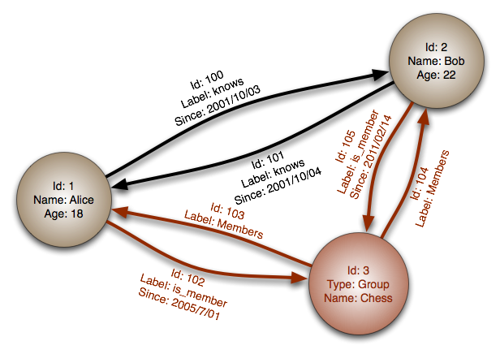
  <br/>
  <i><a href=https://en.wikipedia.org/wiki/File:GraphDatabase_PropertyGraph.png>출처: Graph database</a></i>
</p>

> 추상화: 그래프

그래프 데이터베이스에서 각 노드는 레코드이고 각 아크는 두 노드 간의 관계입니다. 그래프 데이터베이스는 많은 외래 키나 다대다 관계가 있는 복잡한 관계를 표현하는 데 최적화되어 있습니다.

그래프 데이터베이스는 소셜 네트워크와 같은 복잡한 관계를 가진 데이터 모델에 높은 성능을 제공합니다. 비교적 새롭고 아직 널리 사용되지 않아 개발 도구와 자료를 찾기가 더 어려울 수 있습니다. 많은 그래프 데이터베이스는 [REST API](#rest-representational-state-transfer)로만 접근할 수 있습니다.

##### 출처 및 추가 자료: 그래프

* [그래프 데이터베이스](https://en.wikipedia.org/wiki/Graph_database)
* [Neo4j](https://neo4j.com/)
* [FlockDB](https://blog.twitter.com/2010/introducing-flockdb)

#### 출처 및 추가 자료: NoSQL

* [BASE 용어 설명](http://stackoverflow.com/questions/3342497/explanation-of-base-terminology)
* [NoSQL 데이터베이스 조사 및 선택 가이드](https://medium.com/baqend-blog/nosql-databases-a-survey-and-decision-guidance-ea7823a822d#.wskogqenq)
* [확장성](https://web.archive.org/web/20220602114024/https://www.lecloud.net/post/7994751381/scalability-for-dummies-part-2-database)
* [NoSQL 소개](https://www.youtube.com/watch?v=qI_g07C_Q5I)
* [NoSQL 패턴](http://horicky.blogspot.com/2009/11/nosql-patterns.html)

### SQL 또는 NoSQL

<p align="center">
  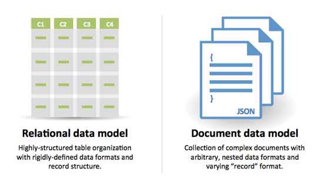
  <br/>
  <i><a href=https://www.infoq.com/articles/Transition-RDBMS-NoSQL/>출처: Transitioning from RDBMS to NoSQL</a></i>
</p>

**SQL**을 선택하는 이유:

* 구조화된 데이터
* 엄격한 스키마
* 관계형 데이터
* 복잡한 조인이 필요한 경우
* 트랜잭션
* 명확한 확장 패턴
* 더 확립된 생태계: 개발자, 커뮤니티, 코드, 도구 등
* 인덱스 기반 조회가 매우 빠름

**NoSQL**을 선택하는 이유:

* 반구조화된 데이터
* 동적이거나 유연한 스키마
* 비관계형 데이터
* 복잡한 조인이 불필요한 경우
* 수 TB (또는 PB)의 데이터 저장
* 매우 데이터 집약적인 워크로드
* IOPS에 대한 매우 높은 처리량

NoSQL에 적합한 데이터 예시:

* 클릭스트림 및 로그 데이터의 빠른 수집
* 리더보드 또는 점수 데이터
* 장바구니 같은 임시 데이터
* 자주 접근하는 ('핫') 테이블
* 메타데이터/조회 테이블

##### 출처 및 추가 자료: SQL 또는 NoSQL

* [천만 사용자까지 확장하기](https://www.youtube.com/watch?v=kKjm4ehYiMs)
* [SQL vs NoSQL 차이점](https://www.sitepoint.com/sql-vs-nosql-differences/)

## 캐시

<p align="center">
  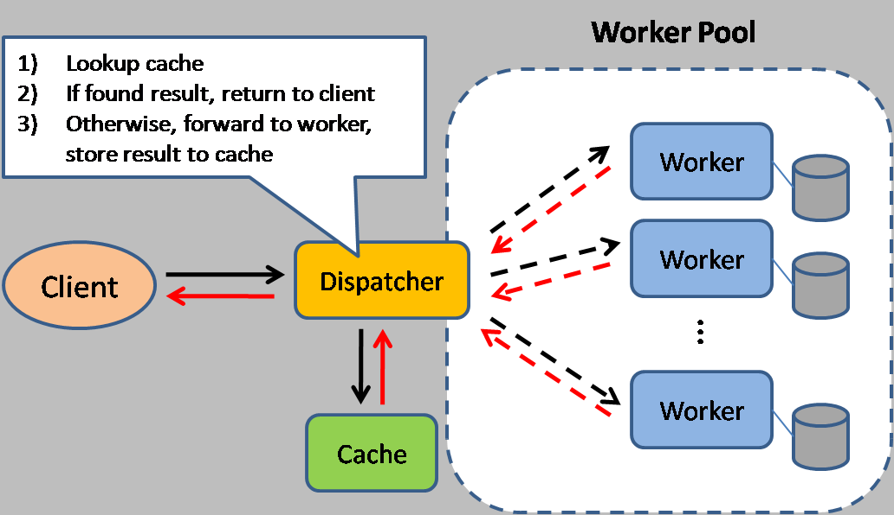
  <br/>
  <i><a href=http://horicky.blogspot.com/2010/10/scalable-system-design-patterns.html>출처: Scalable system design patterns</a></i>
</p>

캐싱은 페이지 로드 시간을 개선하고 서버와 데이터베이스의 부하를 줄일 수 있습니다. 이 모델에서 디스패처는 먼저 요청이 이전에 수행된 적이 있는지 조회하고, 실제 실행을 절약하기 위해 이전 결과를 찾아 반환합니다.

데이터베이스는 파티션 전체에 걸쳐 균일한 읽기/쓰기 분포로 이점을 얻는 경우가 많습니다. 인기 항목이 분포를 왜곡하여 병목을 유발할 수 있습니다. 데이터베이스 앞에 캐시를 두면 불균일한 부하와 트래픽 급증을 흡수하는 데 도움이 됩니다.

### 클라이언트 캐싱

캐시는 클라이언트 측(OS 또는 브라우저), [서버 측](#리버스-프록시-웹-서버), 또는 별도의 캐시 계층에 위치할 수 있습니다.

### CDN 캐싱

[CDN](#콘텐츠-전송-네트워크)은 캐시의 일종으로 간주됩니다.

### 웹 서버 캐싱

[리버스 프록시](#리버스-프록시-웹-서버)와 [Varnish](https://www.varnish-cache.org/) 같은 캐시가 정적 및 동적 콘텐츠를 직접 제공할 수 있습니다. 웹 서버도 요청을 캐시하여 애플리케이션 서버에 연결하지 않고 응답을 반환할 수 있습니다.

### 데이터베이스 캐싱

데이터베이스는 보통 기본 설정에 어느 정도의 캐싱을 포함하고 있으며, 일반적인 사용 사례에 최적화되어 있습니다. 특정 사용 패턴에 맞게 이 설정을 조정하면 성능을 더욱 향상시킬 수 있습니다.

### 애플리케이션 캐싱

Memcached와 Redis 같은 인메모리 캐시는 애플리케이션과 데이터 저장소 사이의 키-값 저장소입니다. 데이터가 RAM에 보관되므로 디스크에 저장되는 일반 데이터베이스보다 훨씬 빠릅니다. RAM은 디스크보다 제한적이므로, [LRU(Least Recently Used)](https://en.wikipedia.org/wiki/Cache_replacement_policies#Least_recently_used_(LRU)) 같은 [캐시 무효화](https://en.wikipedia.org/wiki/Cache_algorithms) 알고리즘이 '콜드' 항목을 무효화하고 '핫' 데이터를 RAM에 유지하는 데 도움을 줍니다.

Redis는 다음과 같은 추가 기능을 제공합니다:

* 영속성 옵션
* 정렬된 집합과 리스트 같은 내장 데이터 구조

캐싱할 수 있는 여러 수준이 있으며, 크게 두 가지 범주로 나뉩니다: **데이터베이스 쿼리**와 **객체**:

* 행 수준
* 쿼리 수준
* 완전히 직렬화된 객체
* 완전히 렌더링된 HTML

일반적으로 파일 기반 캐싱은 클로닝과 자동 확장을 어렵게 하므로 피해야 합니다.

### 데이터베이스 쿼리 수준의 캐싱

데이터베이스를 쿼리할 때마다 쿼리를 해시하여 키로 사용하고 결과를 캐시에 저장합니다. 이 접근 방식은 만료 문제가 있습니다:

* 복잡한 쿼리의 캐시 결과를 삭제하기 어렵습니다
* 테이블 셀 같은 하나의 데이터가 변경되면 변경된 셀을 포함할 수 있는 모든 캐시된 쿼리를 삭제해야 합니다

### 객체 수준의 캐싱

애플리케이션 코드에서 하듯이 데이터를 객체로 바라보세요. 데이터베이스에서 데이터 세트를 클래스 인스턴스나 데이터 구조로 조합하세요:

* 기본 데이터가 변경되면 캐시에서 객체를 제거합니다
* 비동기 처리 허용: 워커가 최신 캐시된 객체를 소비하여 객체를 조합합니다

캐시할 항목 제안:

* 사용자 세션
* 완전히 렌더링된 웹 페이지
* 활동 스트림
* 사용자 그래프 데이터

### 캐시 갱신 시점

캐시에 제한된 양의 데이터만 저장할 수 있으므로, 사용 사례에 가장 적합한 캐시 갱신 전략을 결정해야 합니다.

#### 캐시 어사이드

<p align="center">
  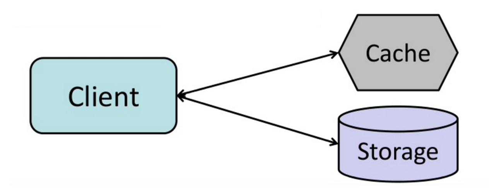
  <br/>
  <i><a href=http://www.slideshare.net/tmatyashovsky/from-cache-to-in-memory-data-grid-introduction-to-hazelcast>출처: From cache to in-memory data grid</a></i>
</p>

애플리케이션이 저장소에서의 읽기와 쓰기를 담당합니다. 캐시는 저장소와 직접 상호작용하지 않습니다. 애플리케이션은 다음을 수행합니다:

* 캐시에서 항목 조회, 캐시 미스 발생
* 데이터베이스에서 항목 로드
* 캐시에 항목 추가
* 항목 반환

```python
def get_user(self, user_id):
    user = cache.get("user.{0}", user_id)
    if user is None:
        user = db.query("SELECT * FROM users WHERE user_id = {0}", user_id)
        if user is not None:
            key = "user.{0}".format(user_id)
            cache.set(key, json.dumps(user))
    return user
```

[Memcached](https://memcached.org/)는 일반적으로 이 방식으로 사용됩니다.

캐시에 추가된 데이터의 후속 읽기는 빠릅니다. 캐시 어사이드는 지연 로딩(lazy loading)이라고도 합니다. 요청된 데이터만 캐시되므로, 요청되지 않은 데이터로 캐시가 채워지는 것을 방지합니다.

##### 캐시 어사이드의 단점

* 각 캐시 미스는 세 번의 왕복을 초래하여 눈에 띄는 지연을 유발할 수 있습니다.
* 데이터베이스에서 데이터가 업데이트되면 캐시 데이터가 오래될 수 있습니다. TTL(Time-to-Live)을 설정하여 캐시 항목 갱신을 강제하거나, 라이트 스루를 사용하여 이 문제를 완화할 수 있습니다.
* 노드가 실패하면 새 빈 노드로 교체되어 지연 시간이 증가합니다.

#### 라이트 스루

<p align="center">
  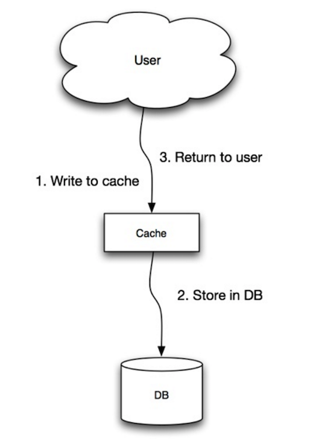
  <br/>
  <i><a href=http://www.slideshare.net/jboner/scalability-availability-stability-patterns/>출처: Scalability, availability, stability, patterns</a></i>
</p>

애플리케이션이 캐시를 주요 데이터 저장소로 사용하여 데이터를 읽고 쓰며, 캐시가 데이터베이스에 읽기와 쓰기를 담당합니다:

* 애플리케이션이 캐시에 항목 추가/갱신
* 캐시가 동기적으로 데이터 저장소에 항목 쓰기
* 반환

애플리케이션 코드:

```python
set_user(12345, {"foo":"bar"})
```

캐시 코드:

```python
def set_user(user_id, values):
    user = db.query("UPDATE Users WHERE id = {0}", user_id, values)
    cache.set(user_id, user)
```

라이트 스루는 쓰기 작업으로 인해 전체적으로 느리지만, 방금 쓴 데이터의 후속 읽기는 빠릅니다. 사용자는 일반적으로 읽기보다 쓰기에서의 지연을 더 잘 받아들입니다. 캐시의 데이터는 오래되지 않습니다.

##### 라이트 스루의 단점

* 장애나 확장으로 새 노드가 생성되면, 데이터베이스에서 항목이 갱신될 때까지 새 노드는 항목을 캐시하지 않습니다. 캐시 어사이드와 라이트 스루를 함께 사용하면 이 문제를 완화할 수 있습니다.
* 작성된 데이터의 대부분은 읽히지 않을 수 있으며, TTL로 최소화할 수 있습니다.

#### 라이트 비하인드 (라이트 백)

<p align="center">
  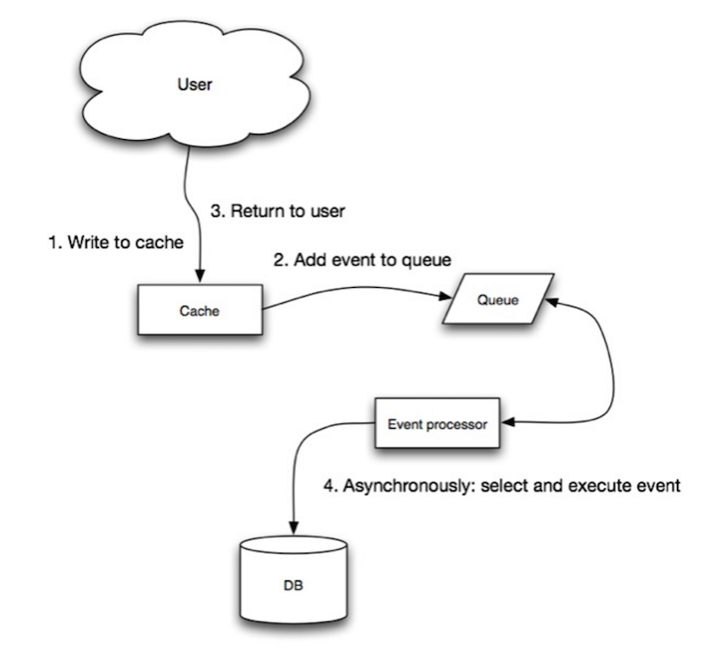
  <br/>
  <i><a href=http://www.slideshare.net/jboner/scalability-availability-stability-patterns/>출처: Scalability, availability, stability, patterns</a></i>
</p>

라이트 비하인드에서 애플리케이션은 다음을 수행합니다:

* 캐시에 항목 추가/갱신
* 비동기적으로 데이터 저장소에 항목 쓰기, 쓰기 성능 향상

##### 라이트 비하인드의 단점

* 캐시 내용이 데이터 저장소에 기록되기 전에 캐시가 다운되면 데이터 손실이 발생할 수 있습니다.
* 라이트 비하인드는 캐시 어사이드나 라이트 스루보다 구현이 더 복잡합니다.

#### 리프레시 어헤드

<p align="center">
  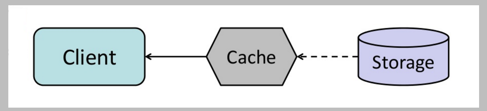
  <br/>
  <i><a href=http://www.slideshare.net/tmatyashovsky/from-cache-to-in-memory-data-grid-introduction-to-hazelcast>출처: From cache to in-memory data grid</a></i>
</p>

캐시가 만료 전에 최근 접근된 캐시 항목을 자동으로 갱신하도록 설정할 수 있습니다.

리프레시 어헤드는 캐시가 미래에 필요할 항목을 정확히 예측할 수 있다면 리드 스루보다 지연 시간을 줄일 수 있습니다.

##### 리프레시 어헤드의 단점

* 미래에 필요할 항목을 정확히 예측하지 못하면 리프레시 어헤드 없이보다 성능이 저하될 수 있습니다.

### 캐시의 단점

* 데이터베이스와 같은 원본 데이터와 캐시 간의 일관성을 [캐시 무효화](https://en.wikipedia.org/wiki/Cache_algorithms)를 통해 유지해야 합니다.
* 캐시 무효화는 어려운 문제이며, 캐시 갱신 시점과 관련된 추가적인 복잡성이 있습니다.
* Redis나 memcached를 추가하는 등 애플리케이션 변경이 필요합니다.

### 출처 및 추가 자료

* [캐시에서 인메모리 데이터 그리드까지](http://www.slideshare.net/tmatyashovsky/from-cache-to-in-memory-data-grid-introduction-to-hazelcast)
* [확장 가능한 시스템 설계 패턴](http://horicky.blogspot.com/2010/10/scalable-system-design-patterns.html)
* [확장 가능한 시스템 아키텍처 입문](http://lethain.com/introduction-to-architecting-systems-for-scale/)
* [확장성, 가용성, 안정성, 패턴](http://www.slideshare.net/jboner/scalability-availability-stability-patterns/)
* [확장성](https://web.archive.org/web/20230126233752/https://www.lecloud.net/post/9246290032/scalability-for-dummies-part-3-cache)
* [AWS ElastiCache 전략](http://docs.aws.amazon.com/AmazonElastiCache/latest/UserGuide/Strategies.html)
* [Wikipedia](https://en.wikipedia.org/wiki/Cache_(computing))

## 비동기

<p align="center">
  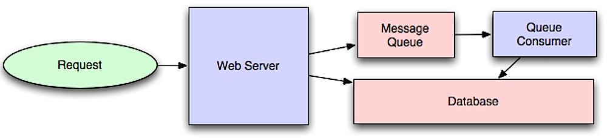
  <br/>
  <i><a href=http://lethain.com/introduction-to-architecting-systems-for-scale/#platform_layer>출처: Intro to architecting systems for scale</a></i>
</p>

비동기 워크플로는 인라인으로 수행하면 비용이 큰 작업의 요청 시간을 줄이는 데 도움이 됩니다. 또한 주기적인 데이터 집계와 같이 시간이 많이 걸리는 작업을 미리 수행하는 데도 도움이 됩니다.

### 메시지 큐

메시지 큐는 메시지를 수신, 보관, 전달합니다. 작업이 인라인으로 수행하기에 너무 느리면, 다음 워크플로와 함께 메시지 큐를 사용할 수 있습니다:

* 애플리케이션이 큐에 작업을 게시한 후 사용자에게 작업 상태를 알립니다
* 워커가 큐에서 작업을 가져와 처리한 후 작업 완료를 알립니다

사용자는 차단되지 않으며 작업은 백그라운드에서 처리됩니다. 이 시간 동안 클라이언트는 선택적으로 작업이 완료된 것처럼 보이도록 약간의 처리를 할 수 있습니다. 예를 들어, 트윗을 게시하면 타임라인에 즉시 게시될 수 있지만, 실제로 모든 팔로워에게 전달되기까지는 시간이 걸릴 수 있습니다.

**[Redis](https://redis.io/)**는 간단한 메시지 브로커로 유용하지만 메시지가 손실될 수 있습니다.

**[RabbitMQ](https://www.rabbitmq.com/)**는 인기가 있지만 'AMQP' 프로토콜에 적응하고 자체 노드를 관리해야 합니다.

**[Amazon SQS](https://aws.amazon.com/sqs/)**는 호스팅 서비스지만 높은 지연 시간이 있을 수 있고 메시지가 두 번 전달될 가능성이 있습니다.

### 태스크 큐

태스크 큐는 태스크와 관련 데이터를 수신하고 실행한 후 결과를 전달합니다. 스케줄링을 지원할 수 있으며 백그라운드에서 계산 집약적인 작업을 실행하는 데 사용할 수 있습니다.

**[Celery](https://docs.celeryproject.org/en/stable/)**는 스케줄링을 지원하며 주로 Python을 지원합니다.

### 백프레셔

큐가 크게 증가하기 시작하면, 큐 크기가 메모리보다 커져 캐시 미스, 디스크 읽기, 더 느린 성능을 초래할 수 있습니다. [백프레셔](http://mechanical-sympathy.blogspot.com/2012/05/apply-back-pressure-when-overloaded.html)는 큐 크기를 제한하여 높은 처리율과 이미 큐에 있는 작업의 좋은 응답 시간을 유지하는 데 도움이 됩니다. 큐가 가득 차면 클라이언트는 나중에 다시 시도하도록 서버 바쁨 또는 HTTP 503 상태 코드를 받습니다. 클라이언트는 나중에 [지수 백오프](https://en.wikipedia.org/wiki/Exponential_backoff)로 요청을 재시도할 수 있습니다.

### 비동기의 단점

* 비용이 적은 계산이나 실시간 워크플로와 같은 사용 사례는 동기 작업이 더 적합할 수 있습니다. 큐를 도입하면 지연과 복잡성이 추가될 수 있습니다.

### 출처 및 추가 자료

* [숫자 게임이다](https://www.youtube.com/watch?v=1KRYH75wgy4)
* [과부하 시 백프레셔 적용하기](http://mechanical-sympathy.blogspot.com/2012/05/apply-back-pressure-when-overloaded.html)
* [리틀의 법칙](https://en.wikipedia.org/wiki/Little%27s_law)
* [메시지 큐와 태스크 큐의 차이점은?](https://www.quora.com/What-is-the-difference-between-a-message-queue-and-a-task-queue-Why-would-a-task-queue-require-a-message-broker-like-RabbitMQ-Redis-Celery-or-IronMQ-to-function)

## 통신

<p align="center">
  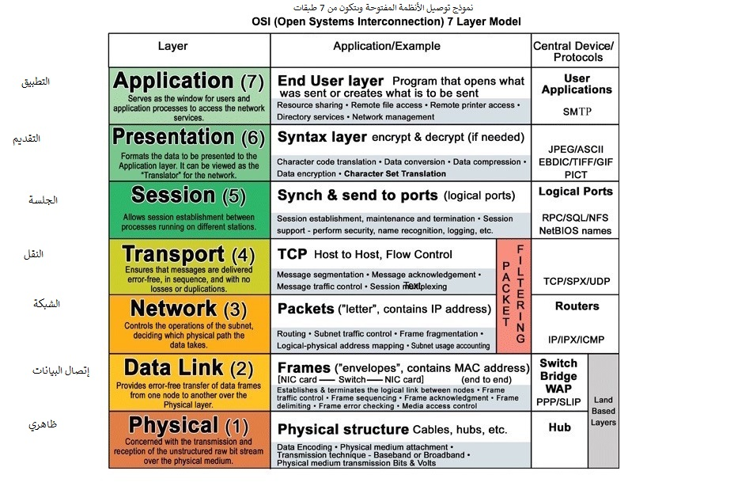
  <br/>
  <i><a href=http://www.escotal.com/osilayer.html>출처: OSI 7 layer model</a></i>
</p>

### 하이퍼텍스트 전송 프로토콜 (HTTP)

HTTP는 클라이언트와 서버 간에 데이터를 인코딩하고 전송하는 방법입니다. 요청/응답 프로토콜로, 클라이언트가 요청을 보내고 서버가 관련 콘텐츠와 요청에 대한 완료 상태 정보로 응답합니다. HTTP는 자체 완결적이어서 로드 밸런싱, 캐싱, 암호화, 압축을 수행하는 많은 중간 라우터와 서버를 통해 요청과 응답이 흐를 수 있습니다.

기본 HTTP 요청은 동사(메서드)와 리소스(엔드포인트)로 구성됩니다. 일반적인 HTTP 동사:

| 동사 | 설명 | 멱등성* | 안전 | 캐시 가능 |
|---|---|---|---|---|
| GET | 리소스 읽기 | Yes | Yes | Yes |
| POST | 리소스 생성 또는 데이터를 처리하는 프로세스 트리거 | No | No | 응답에 신선도 정보가 있으면 Yes |
| PUT | 리소스 생성 또는 교체 | Yes | No | No |
| PATCH | 리소스 부분 업데이트 | No | No | 응답에 신선도 정보가 있으면 Yes |
| DELETE | 리소스 삭제 | Yes | No | No |

*다른 결과 없이 여러 번 호출할 수 있습니다.

HTTP는 **TCP**와 **UDP** 같은 하위 수준 프로토콜에 의존하는 애플리케이션 계층 프로토콜입니다.

#### 출처 및 추가 자료: HTTP

* [HTTP란?](https://www.nginx.com/resources/glossary/http/)
* [HTTP와 TCP의 차이](https://www.quora.com/What-is-the-difference-between-HTTP-protocol-and-TCP-protocol)
* [PUT과 PATCH의 차이](https://laracasts.com/discuss/channels/general-discussion/whats-the-differences-between-put-and-patch?page=1)

### 전송 제어 프로토콜 (TCP)

<p align="center">
  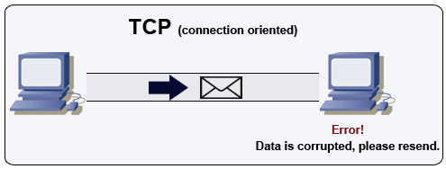
  <br/>
  <i><a href=http://www.wildbunny.co.uk/blog/2012/10/09/how-to-make-a-multi-player-game-part-1/>출처: How to make a multiplayer game</a></i>
</p>

TCP는 [IP 네트워크](https://en.wikipedia.org/wiki/Internet_Protocol) 위의 연결 지향 프로토콜입니다. 연결은 [핸드셰이크](https://en.wikipedia.org/wiki/Handshaking)를 사용하여 설정되고 종료됩니다. 전송된 모든 패킷은 다음을 통해 원래 순서대로 손상 없이 목적지에 도달이 보장됩니다:

* 각 패킷의 시퀀스 번호와 [체크섬 필드](https://en.wikipedia.org/wiki/Transmission_Control_Protocol#Checksum_computation)
* [확인 응답](https://en.wikipedia.org/wiki/Acknowledgement_(data_networks)) 패킷과 자동 재전송

보내는 측이 올바른 응답을 받지 못하면 패킷을 재전송합니다. 여러 번 타임아웃이 발생하면 연결이 끊어집니다. TCP는 [흐름 제어](https://en.wikipedia.org/wiki/Flow_control_(data))와 [혼잡 제어](https://en.wikipedia.org/wiki/Network_congestion#Congestion_control)도 구현합니다. 이러한 보장은 지연을 발생시키며 일반적으로 UDP보다 효율성이 낮은 전송을 초래합니다.

높은 처리량을 보장하기 위해 웹 서버는 많은 수의 TCP 연결을 열어둘 수 있으며, 이는 높은 메모리 사용을 초래합니다. 웹 서버 스레드와 [memcached](https://memcached.org/) 서버 간에 많은 수의 열린 연결을 유지하는 것은 비용이 클 수 있습니다. [연결 풀링](https://en.wikipedia.org/wiki/Connection_pool)이 도움이 될 수 있으며, 해당되는 경우 UDP로 전환할 수도 있습니다.

TCP는 높은 신뢰성이 필요하지만 시간에 덜 민감한 애플리케이션에 유용합니다. 웹 서버, 데이터베이스 정보, SMTP, FTP, SSH 등이 예입니다.

TCP를 UDP 대신 사용하는 경우:

* 모든 데이터가 손상 없이 도착해야 할 때
* 네트워크 처리량의 최선의 추정치를 자동으로 활용하고 싶을 때

### 사용자 데이터그램 프로토콜 (UDP)

<p align="center">
  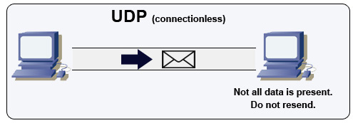
  <br/>
  <i><a href=http://www.wildbunny.co.uk/blog/2012/10/09/how-to-make-a-multi-player-game-part-1/>출처: How to make a multiplayer game</a></i>
</p>

UDP는 비연결형입니다. 데이터그램(패킷과 유사)은 데이터그램 수준에서만 보장됩니다. 데이터그램은 순서가 뒤바뀌거나 아예 도착하지 않을 수 있습니다. UDP는 혼잡 제어를 지원하지 않습니다. TCP가 지원하는 보장 없이 UDP는 일반적으로 더 효율적입니다.

UDP는 브로드캐스트가 가능하여 서브넷의 모든 장치에 데이터그램을 전송할 수 있습니다. 이는 [DHCP](https://en.wikipedia.org/wiki/Dynamic_Host_Configuration_Protocol)에서 유용합니다. 클라이언트가 아직 IP 주소를 받지 못했기 때문에 IP 주소 없이는 TCP 스트리밍이 불가능합니다.

UDP는 신뢰성이 낮지만 VoIP, 화상 채팅, 스트리밍, 실시간 멀티플레이어 게임과 같은 실시간 사용 사례에서 잘 작동합니다.

UDP를 TCP 대신 사용하는 경우:

* 가장 낮은 지연 시간이 필요할 때
* 데이터 손실보다 늦은 데이터가 더 나쁠 때
* 자체 오류 수정을 구현하고 싶을 때

#### 출처 및 추가 자료: TCP와 UDP

* [게임 프로그래밍을 위한 네트워킹](http://gafferongames.com/networking-for-game-programmers/udp-vs-tcp/)
* [TCP와 UDP 프로토콜의 주요 차이점](http://www.cyberciti.biz/faq/key-differences-between-tcp-and-udp-protocols/)
* [TCP와 UDP의 차이](http://stackoverflow.com/questions/5970383/difference-between-tcp-and-udp)
* [전송 제어 프로토콜](https://en.wikipedia.org/wiki/Transmission_Control_Protocol)
* [사용자 데이터그램 프로토콜](https://en.wikipedia.org/wiki/User_Datagram_Protocol)
* [Facebook에서 memcache 확장하기](http://www.cs.bu.edu/~jappavoo/jappavoo.github.com/451/papers/memcache-fb.pdf)

### 원격 프로시저 호출 (RPC)

<p align="center">
  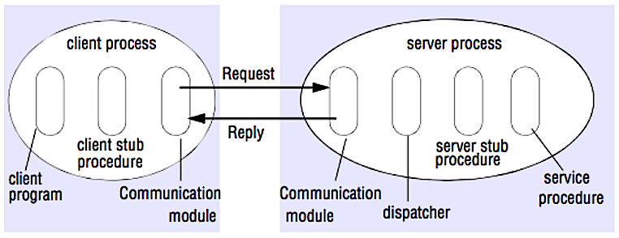
  <br/>
  <i><a href=http://www.puncsky.com/blog/2016-02-13-crack-the-system-design-interview>출처: Crack the system design interview</a></i>
</p>

RPC에서 클라이언트는 다른 주소 공간, 보통 원격 서버에서 프로시저를 실행합니다. 프로시저는 로컬 프로시저 호출처럼 코딩되어, 서버와 통신하는 방법의 세부 사항을 클라이언트 프로그램에서 추상화합니다. 원격 호출은 보통 로컬 호출보다 느리고 덜 신뢰할 수 있으므로 RPC 호출을 로컬 호출과 구분하는 것이 도움이 됩니다. 인기 있는 RPC 프레임워크에는 [Protobuf](https://developers.google.com/protocol-buffers/), [Thrift](https://thrift.apache.org/), [Avro](https://avro.apache.org/docs/current/)가 있습니다.

RPC는 요청-응답 프로토콜입니다:

* **클라이언트 프로그램** - 클라이언트 스텁 프로시저를 호출합니다. 파라미터는 로컬 프로시저 호출처럼 스택에 푸시됩니다.
* **클라이언트 스텁 프로시저** - 프로시저 ID와 인자를 요청 메시지로 마샬링(패킹)합니다.
* **클라이언트 통신 모듈** - OS가 메시지를 클라이언트에서 서버로 전송합니다.
* **서버 통신 모듈** - OS가 들어오는 패킷을 서버 스텁 프로시저에 전달합니다.
* **서버 스텁 프로시저** - 결과를 언마샬링하고, 프로시저 ID에 맞는 서버 프로시저를 호출하며 주어진 인자를 전달합니다.
* 서버 응답은 위 단계를 역순으로 반복합니다.

RPC 호출 예시:

```
GET /someoperation?data=anId

POST /anotheroperation
{
  "data":"anId";
  "anotherdata": "another value"
}
```

RPC는 동작(behavior)을 노출하는 데 집중합니다. RPC는 내부 통신에서 성능상의 이유로 자주 사용되며, 사용 사례에 더 적합하도록 네이티브 호출을 수동으로 작성할 수 있습니다.

네이티브 라이브러리(SDK)를 선택하는 경우:

* 대상 플랫폼을 알고 있을 때
* "로직"에 대한 접근 방법을 제어하고 싶을 때
* 라이브러리에서 오류 제어가 어떻게 발생하는지 제어하고 싶을 때
* 성능과 최종 사용자 경험이 주요 관심사일 때

**REST**를 따르는 HTTP API는 공개 API에 더 자주 사용됩니다.

#### RPC의 단점

* RPC 클라이언트가 서비스 구현에 강하게 결합됩니다.
* 모든 새로운 작업이나 사용 사례에 대해 새 API를 정의해야 합니다.
* RPC를 디버깅하기 어려울 수 있습니다.
* 기존 기술을 그대로 활용하지 못할 수 있습니다. 예를 들어, [Squid](http://www.squid-cache.org/) 같은 캐싱 서버에서 [RPC 호출이 제대로 캐시](https://web.archive.org/web/20170608193645/http://etherealbits.com/2012/12/debunking-the-myths-of-rpc-rest/)되도록 추가 노력이 필요할 수 있습니다.

### REST (Representational State Transfer)

REST는 서버가 관리하는 리소스 세트에 대해 클라이언트가 작동하는 클라이언트/서버 모델을 강제하는 아키텍처 스타일입니다. 서버는 리소스의 표현과 리소스를 조작하거나 새 표현을 가져올 수 있는 작업을 제공합니다. 모든 통신은 상태 비저장이고 캐시 가능해야 합니다.

RESTful 인터페이스의 네 가지 특성:

* **리소스 식별 (HTTP의 URI)** - 어떤 작업이든 같은 URI를 사용합니다.
* **표현을 통한 변경 (HTTP의 동사)** - 동사, 헤더, 본문을 사용합니다.
* **자기 설명적 에러 메시지 (HTTP의 상태 응답)** - 상태 코드를 사용하고, 바퀴를 재발명하지 마세요.
* **[HATEOAS](http://restcookbook.com/Basics/hateoas/) (HTTP를 위한 HTML 인터페이스)** - 웹 서비스가 브라우저에서 완전히 접근 가능해야 합니다.

REST 호출 예시:

```
GET /someresources/anId

PUT /someresources/anId
{"anotherdata": "another value"}
```

REST는 데이터를 노출하는 데 집중합니다. 클라이언트/서버 간 결합을 최소화하며, 공개 HTTP API에 자주 사용됩니다. REST는 URI를 통한 리소스 노출, [헤더를 통한 표현](https://github.com/for-GET/know-your-http-well/blob/master/headers.md), GET, POST, PUT, DELETE, PATCH 같은 동사를 통한 작업의 더 범용적이고 균일한 방법을 사용합니다. 상태 비저장이므로 REST는 수평 확장과 파티셔닝에 적합합니다.

#### REST의 단점

* REST가 데이터 노출에 집중하므로, 리소스가 자연스럽게 단순한 계층 구조로 조직되거나 접근되지 않는 경우 적합하지 않을 수 있습니다. 예를 들어, 특정 이벤트 세트와 일치하는 지난 한 시간의 모든 업데이트된 레코드를 반환하는 것은 경로로 쉽게 표현하기 어렵습니다. REST에서는 URI 경로, 쿼리 파라미터, 그리고 가능하면 요청 본문의 조합으로 구현될 가능성이 높습니다.
* REST는 일반적으로 몇 가지 동사(GET, POST, PUT, DELETE, PATCH)에 의존하며, 때때로 사용 사례에 맞지 않을 수 있습니다. 예를 들어, 만료된 문서를 아카이브 폴더로 이동하는 것은 이러한 동사에 깔끔하게 맞지 않을 수 있습니다.
* 중첩된 계층 구조를 가진 복잡한 리소스를 가져오면 단일 뷰를 렌더링하기 위해 클라이언트와 서버 간에 여러 번의 왕복이 필요합니다. 가변적인 네트워크 조건에서 운영되는 모바일 애플리케이션에게 이 다수의 왕복은 매우 바람직하지 않습니다.
* 시간이 지남에 따라 API 응답에 더 많은 필드가 추가될 수 있으며, 구 버전 클라이언트는 필요하지 않은 새 데이터 필드를 모두 받게 되어 페이로드 크기가 커지고 지연 시간이 증가합니다.

### RPC와 REST 호출 비교

| 작업 | RPC | REST |
|---|---|---|
| 가입 | **POST** /signup | **POST** /persons |
| 탈퇴 | **POST** /resign<br/>{<br/>"personid": "1234"<br/>} | **DELETE** /persons/1234 |
| 사람 조회 | **GET** /readPerson?personid=1234 | **GET** /persons/1234 |
| 사람의 아이템 목록 조회 | **GET** /readUsersItemsList?personid=1234 | **GET** /persons/1234/items |
| 사람의 아이템에 추가 | **POST** /addItemToUsersItemsList<br/>{<br/>"personid": "1234";<br/>"itemid": "456"<br/>} | **POST** /persons/1234/items<br/>{<br/>"itemid": "456"<br/>} |
| 아이템 수정 | **POST** /modifyItem<br/>{<br/>"itemid": "456";<br/>"key": "value"<br/>} | **PUT** /items/456<br/>{<br/>"key": "value"<br/>} |
| 아이템 삭제 | **POST** /removeItem<br/>{<br/>"itemid": "456"<br/>} | **DELETE** /items/456 |

<p align="center">
  <i><a href=https://apihandyman.io/do-you-really-know-why-you-prefer-rest-over-rpc/>출처: Do you really know why you prefer REST over RPC</a></i>
</p>

#### 출처 및 추가 자료: REST와 RPC

* [REST보다 RPC를 선호하는 진짜 이유를 아시나요](https://apihandyman.io/do-you-really-know-why-you-prefer-rest-over-rpc/)
* [RPC 방식이 REST보다 적절한 때는?](http://programmers.stackexchange.com/a/181186)
* [REST vs JSON-RPC](http://stackoverflow.com/questions/15056878/rest-vs-json-rpc)
* [RPC와 REST의 미신 깨기](https://web.archive.org/web/20170608193645/http://etherealbits.com/2012/12/debunking-the-myths-of-rpc-rest/)
* [REST 사용의 단점은?](https://www.quora.com/What-are-the-drawbacks-of-using-RESTful-APIs)
* [시스템 설계 면접 정복하기](http://www.puncsky.com/blog/2016-02-13-crack-the-system-design-interview)
* [Thrift](https://code.facebook.com/posts/1468950976659943/)
* [내부 사용에 RPC 대신 REST를 사용하는 이유](http://arstechnica.com/civis/viewtopic.php?t=1190508)

## 보안

이 섹션은 업데이트가 필요합니다. [기여](#기여)를 고려해 주세요!

보안은 광범위한 주제입니다. 상당한 경험이 있거나, 보안 배경이 있거나, 보안 지식이 필요한 직책에 지원하지 않는 한, 기본 사항 이상을 알 필요는 없을 것입니다:

* 전송 중 및 저장 시 암호화합니다.
* [XSS](https://en.wikipedia.org/wiki/Cross-site_scripting)와 [SQL 인젝션](https://en.wikipedia.org/wiki/SQL_injection)을 방지하기 위해 모든 사용자 입력 또는 사용자에게 노출된 입력 파라미터를 살균합니다.
* SQL 인젝션을 방지하기 위해 파라미터화된 쿼리를 사용합니다.
* [최소 권한의 원칙](https://en.wikipedia.org/wiki/Principle_of_least_privilege)을 사용합니다.

### 출처 및 추가 자료

* [API 보안 체크리스트](https://github.com/shieldfy/API-Security-Checklist)
* [개발자를 위한 보안 가이드](https://github.com/FallibleInc/security-guide-for-developers)
* [OWASP 상위 10](https://www.owasp.org/index.php/OWASP_Top_Ten_Cheat_Sheet)

## 부록

때때로 '봉투 뒷면' 추정치를 구하도록 요청받을 수 있습니다. 예를 들어, 디스크에서 100개의 이미지 썸네일을 생성하는 데 걸리는 시간이나 데이터 구조가 차지하는 메모리 양을 결정해야 할 수 있습니다. **2의 거듭제곱 표**와 **모든 프로그래머가 알아야 할 지연 시간 수치**가 편리한 참고 자료입니다.

### 2의 거듭제곱 표

```
Power           Exact Value         Approx Value        Bytes
---------------------------------------------------------------
7                             128
8                             256
10                           1024   1 thousand           1 KB
16                         65,536                       64 KB
20                      1,048,576   1 million            1 MB
30                  1,073,741,824   1 billion            1 GB
32                  4,294,967,296                        4 GB
40              1,099,511,627,776   1 trillion           1 TB
```

#### 출처 및 추가 자료

* [2의 거듭제곱](https://en.wikipedia.org/wiki/Power_of_two)

### 모든 프로그래머가 알아야 할 지연 시간 수치

```
Latency Comparison Numbers
--------------------------
L1 cache reference                           0.5 ns
Branch mispredict                            5   ns
L2 cache reference                           7   ns                      14x L1 cache
Mutex lock/unlock                           25   ns
Main memory reference                      100   ns                      20x L2 cache, 200x L1 cache
Compress 1K bytes with Zippy            10,000   ns       10 us
Send 1 KB bytes over 1 Gbps network     10,000   ns       10 us
Read 4 KB randomly from SSD*           150,000   ns      150 us          ~1GB/sec SSD
Read 1 MB sequentially from memory     250,000   ns      250 us
Round trip within same datacenter      500,000   ns      500 us
Read 1 MB sequentially from SSD*     1,000,000   ns    1,000 us    1 ms  ~1GB/sec SSD, 4X memory
HDD seek                            10,000,000   ns   10,000 us   10 ms  20x datacenter roundtrip
Read 1 MB sequentially from 1 Gbps  10,000,000   ns   10,000 us   10 ms  40x memory, 10X SSD
Read 1 MB sequentially from HDD     30,000,000   ns   30,000 us   30 ms 120x memory, 30X SSD
Send packet CA->Netherlands->CA    150,000,000   ns  150,000 us  150 ms

Notes
-----
1 ns = 10^-9 seconds
1 us = 10^-6 seconds = 1,000 ns
1 ms = 10^-3 seconds = 1,000 us = 1,000,000 ns
```

위 수치를 기반으로 한 유용한 지표:

* HDD에서 순차 읽기 속도 30 MB/s
* 1 Gbps 이더넷에서 순차 읽기 속도 100 MB/s
* SSD에서 순차 읽기 속도 1 GB/s
* 메인 메모리에서 순차 읽기 속도 4 GB/s
* 초당 6-7번의 전 세계 왕복
* 데이터 센터 내 초당 2,000번의 왕복

#### 지연 시간 수치 시각화


#### 출처 및 추가 자료

* [모든 프로그래머가 알아야 할 지연 시간 수치 - 1](https://gist.github.com/jboner/2841832)
* [모든 프로그래머가 알아야 할 지연 시간 수치 - 2](https://gist.github.com/hellerbarde/2843375)
* [대규모 분산 시스템 구축의 설계, 교훈, 조언](http://www.cs.cornell.edu/projects/ladis2009/talks/dean-keynote-ladis2009.pdf)
* [대규모 분산 시스템 구축의 소프트웨어 엔지니어링 조언](https://static.googleusercontent.com/media/research.google.com/en//people/jeff/stanford-295-talk.pdf)

### 추가 시스템 설계 면접 문제

> 자주 나오는 시스템 설계 면접 문제와 각 문제 해결 방법에 대한 자료 링크.

| 문제 | 참고 자료 |
|---|---|
| Dropbox 같은 파일 동기화 서비스 설계 | [youtube.com](https://www.youtube.com/watch?v=PE4gwstWhmc) |
| Google 같은 검색 엔진 설계 | [queue.acm.org](http://queue.acm.org/detail.cfm?id=988407)<br/>[stackexchange.com](http://programmers.stackexchange.com/questions/38324/interview-question-how-would-you-implement-google-search)<br/>[ardendertat.com](http://www.ardendertat.com/2012/01/11/implementing-search-engines/)<br/>[stanford.edu](http://infolab.stanford.edu/~backrub/google.html) |
| Google 같은 확장 가능한 웹 크롤러 설계 | [quora.com](https://www.quora.com/How-can-I-build-a-web-crawler-from-scratch) |
| Google Docs 설계 | [code.google.com](https://code.google.com/p/google-mobwrite/)<br/>[neil.fraser.name](https://neil.fraser.name/writing/sync/) |
| Redis 같은 키-값 저장소 설계 | [slideshare.net](http://www.slideshare.net/dvirsky/introduction-to-redis) |
| Memcached 같은 캐시 시스템 설계 | [slideshare.net](http://www.slideshare.net/oemebamo/introduction-to-memcached) |
| Amazon 같은 추천 시스템 설계 | [hulu.com](https://web.archive.org/web/20170406065247/http://tech.hulu.com/blog/2011/09/19/recommendation-system.html)<br/>[ijcai13.org](http://ijcai13.org/files/tutorial_slides/td3.pdf) |
| Bitly 같은 tinyurl 시스템 설계 | [n00tc0d3r.blogspot.com](http://n00tc0d3r.blogspot.com/) |
| WhatsApp 같은 채팅 앱 설계 | [highscalability.com](http://highscalability.com/blog/2014/2/26/the-whatsapp-architecture-facebook-bought-for-19-billion.html)
| Instagram 같은 사진 공유 시스템 설계 | [highscalability.com](http://highscalability.com/flickr-architecture)<br/>[highscalability.com](http://highscalability.com/blog/2011/12/6/instagram-architecture-14-million-users-terabytes-of-photos.html) |
| Facebook 뉴스 피드 기능 설계 | [quora.com](http://www.quora.com/What-are-best-practices-for-building-something-like-a-News-Feed)<br/>[quora.com](http://www.quora.com/Activity-Streams/What-are-the-scaling-issues-to-keep-in-mind-while-developing-a-social-network-feed)<br/>[slideshare.net](http://www.slideshare.net/danmckinley/etsy-activity-feeds-architecture) |
| Facebook 타임라인 기능 설계 | [facebook.com](https://www.facebook.com/note.php?note_id=10150468255628920)<br/>[highscalability.com](http://highscalability.com/blog/2012/1/23/facebook-timeline-brought-to-you-by-the-power-of-denormaliza.html) |
| Facebook 채팅 기능 설계 | [erlang-factory.com](http://www.erlang-factory.com/upload/presentations/31/EugeneLetuchy-ErlangatFacebook.pdf)<br/>[facebook.com](https://www.facebook.com/note.php?note_id=14218138919&id=9445547199&index=0) |
| Facebook 같은 그래프 검색 기능 설계 | [facebook.com](https://www.facebook.com/notes/facebook-engineering/under-the-hood-building-out-the-infrastructure-for-graph-search/10151347573598920)<br/>[facebook.com](https://www.facebook.com/notes/facebook-engineering/under-the-hood-indexing-and-ranking-in-graph-search/10151361720763920)<br/>[facebook.com](https://www.facebook.com/notes/facebook-engineering/under-the-hood-the-natural-language-interface-of-graph-search/10151432733048920) |
| CloudFlare 같은 콘텐츠 전송 네트워크 설계 | [figshare.com](https://figshare.com/articles/Globally_distributed_content_delivery/6605972) |
| Twitter 같은 트렌딩 토픽 시스템 설계 | [michael-noll.com](http://www.michael-noll.com/blog/2013/01/18/implementing-real-time-trending-topics-in-storm/)<br/>[snikolov.wordpress.com](http://snikolov.wordpress.com/2012/11/14/early-detection-of-twitter-trends/) |
| 랜덤 ID 생성 시스템 설계 | [blog.twitter.com](https://blog.twitter.com/2010/announcing-snowflake)<br/>[github.com](https://github.com/twitter/snowflake/) |
| 일정 시간 간격 동안 상위 k개 요청 반환 | [cs.ucsb.edu](https://www.cs.ucsb.edu/sites/default/files/documents/2005-23.pdf)<br/>[wpi.edu](http://davis.wpi.edu/xmdv/docs/EDBT11-diyang.pdf) |
| 여러 데이터 센터에서 데이터를 제공하는 시스템 설계 | [highscalability.com](http://highscalability.com/blog/2009/8/24/how-google-serves-data-from-multiple-datacenters.html) |
| 온라인 멀티플레이어 카드 게임 설계 | [indieflashblog.com](https://web.archive.org/web/20180929181117/http://www.indieflashblog.com/how-to-create-an-asynchronous-multiplayer-game.html)<br/>[buildnewgames.com](http://buildnewgames.com/real-time-multiplayer/) |
| 가비지 컬렉션 시스템 설계 | [stuffwithstuff.com](http://journal.stuffwithstuff.com/2013/12/08/babys-first-garbage-collector/)<br/>[washington.edu](http://courses.cs.washington.edu/courses/csep521/07wi/prj/rick.pdf) |
| API 속도 제한기 설계 | [stripe.com](https://stripe.com/blog/rate-limiters) |
| 주식 거래소 (NASDAQ 또는 Binance 같은) 설계 | [Jane Street](https://youtu.be/b1e4t2k2KJY)<br/>[Golang 구현](https://around25.com/blog/building-a-trading-engine-for-a-crypto-exchange/)<br/>[Go 구현](http://bhomnick.net/building-a-simple-limit-order-in-go/) |
| 시스템 설계 문제 추가 | [기여](#기여) |

### 실제 아키텍처

> 실제 시스템이 어떻게 설계되었는지에 대한 아티클.

<p align="center">
  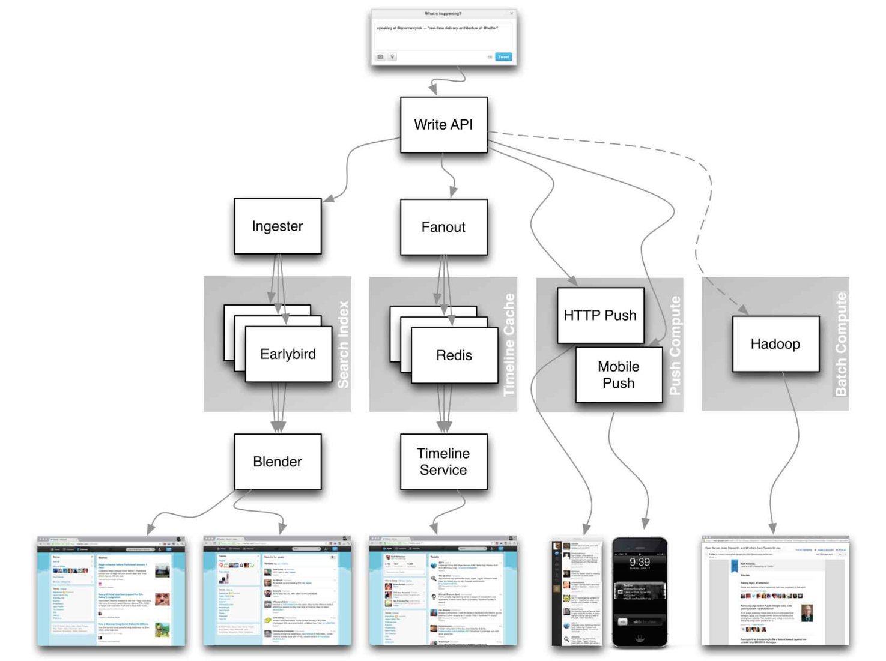
  <br/>
  <i><a href=https://www.infoq.com/presentations/Twitter-Timeline-Scalability>출처: Twitter timelines at scale</a></i>
</p>

**다음 아티클의 세세한 디테일에 집중하지 마세요. 대신:**

* 이 아티클들에서 공유 원칙, 공통 기술, 패턴을 식별하세요
* 각 컴포넌트가 해결하는 문제, 작동하는 곳, 작동하지 않는 곳을 학습하세요
* 배운 교훈을 복습하세요

|유형 | 시스템 | 참고 자료 |
|---|---|---|
| 데이터 처리 | **MapReduce** - Google의 분산 데이터 처리 | [research.google.com](http://static.googleusercontent.com/media/research.google.com/zh-CN/us/archive/mapreduce-osdi04.pdf) |
| 데이터 처리 | **Spark** - Databricks의 분산 데이터 처리 | [slideshare.net](http://www.slideshare.net/AGrishchenko/apache-spark-architecture) |
| 데이터 처리 | **Storm** - Twitter의 분산 데이터 처리 | [slideshare.net](http://www.slideshare.net/previa/storm-16094009) |
| | | |
| 데이터 저장소 | **Bigtable** - Google의 분산 컬럼 지향 데이터베이스 | [harvard.edu](http://www.read.seas.harvard.edu/~kohler/class/cs239-w08/chang06bigtable.pdf) |
| 데이터 저장소 | **HBase** - Bigtable의 오픈소스 구현 | [slideshare.net](http://www.slideshare.net/alexbaranau/intro-to-hbase) |
| 데이터 저장소 | **Cassandra** - Facebook의 분산 컬럼 지향 데이터베이스 | [slideshare.net](http://www.slideshare.net/planetcassandra/cassandra-introduction-features-30103666)
| 데이터 저장소 | **DynamoDB** - Amazon의 문서 지향 데이터베이스 | [harvard.edu](http://www.read.seas.harvard.edu/~kohler/class/cs239-w08/decandia07dynamo.pdf) |
| 데이터 저장소 | **MongoDB** - 문서 지향 데이터베이스 | [slideshare.net](http://www.slideshare.net/mdirolf/introduction-to-mongodb) |
| 데이터 저장소 | **Spanner** - Google의 전 세계 분산 데이터베이스 | [research.google.com](http://research.google.com/archive/spanner-osdi2012.pdf) |
| 데이터 저장소 | **Memcached** - 분산 메모리 캐싱 시스템 | [slideshare.net](http://www.slideshare.net/oemebamo/introduction-to-memcached) |
| 데이터 저장소 | **Redis** - 영속성과 값 유형을 지원하는 분산 메모리 캐싱 시스템 | [slideshare.net](http://www.slideshare.net/dvirsky/introduction-to-redis) |
| | | |
| 파일 시스템 | **Google File System (GFS)** - 분산 파일 시스템 | [research.google.com](http://static.googleusercontent.com/media/research.google.com/zh-CN/us/archive/gfs-sosp2003.pdf) |
| 파일 시스템 | **Hadoop File System (HDFS)** - GFS의 오픈소스 구현 | [apache.org](http://hadoop.apache.org/docs/stable/hadoop-project-dist/hadoop-hdfs/HdfsDesign.html) |
| | | |
| 기타 | **Chubby** - Google의 느슨하게 결합된 분산 시스템용 락 서비스 | [research.google.com](http://static.googleusercontent.com/external_content/untrusted_dlcp/research.google.com/en/us/archive/chubby-osdi06.pdf) |
| 기타 | **Dapper** - 분산 시스템 추적 인프라 | [research.google.com](http://static.googleusercontent.com/media/research.google.com/en//pubs/archive/36356.pdf)
| 기타 | **Kafka** - LinkedIn의 Pub/sub 메시지 큐 | [slideshare.net](http://www.slideshare.net/mumrah/kafka-talk-tri-hug) |
| 기타 | **Zookeeper** - 동기화를 가능하게 하는 중앙 집중형 인프라 및 서비스 | [slideshare.net](http://www.slideshare.net/sauravhaloi/introduction-to-apache-zookeeper) |
| | 아키텍처 추가 | [기여](#기여) |

### 기업 아키텍처

| 기업 | 참고 자료 |
|---|---|
| Amazon | [Amazon 아키텍처](http://highscalability.com/amazon-architecture) |
| Cinchcast | [매일 1,500시간의 오디오 생산](http://highscalability.com/blog/2012/7/16/cinchcast-architecture-producing-1500-hours-of-audio-every-d.html) |
| DataSift | [초당 120,000 트윗 실시간 데이터마이닝](http://highscalability.com/blog/2011/11/29/datasift-architecture-realtime-datamining-at-120000-tweets-p.html) |
| Dropbox | [Dropbox를 어떻게 확장했는가](https://www.youtube.com/watch?v=PE4gwstWhmc) |
| ESPN | [초당 100,000 duh nuh nuh 운영](http://highscalability.com/blog/2013/11/4/espns-architecture-at-scale-operating-at-100000-duh-nuh-nuhs.html) |
| Google | [Google 아키텍처](http://highscalability.com/google-architecture) |
| Instagram | [1,400만 사용자, 테라바이트급 사진](http://highscalability.com/blog/2011/12/6/instagram-architecture-14-million-users-terabytes-of-photos.html)<br/>[Instagram을 움직이는 것](http://instagram-engineering.tumblr.com/post/13649370142/what-powers-instagram-hundreds-of-instances) |
| Justin.tv | [Justin.Tv의 라이브 비디오 방송 아키텍처](http://highscalability.com/blog/2010/3/16/justintvs-live-video-broadcasting-architecture.html) |
| Facebook | [Facebook에서 memcached 확장하기](https://cs.uwaterloo.ca/~brecht/courses/854-Emerging-2014/readings/key-value/fb-memcached-nsdi-2013.pdf)<br/>[TAO: Facebook의 소셜 그래프용 분산 데이터 저장소](https://cs.uwaterloo.ca/~brecht/courses/854-Emerging-2014/readings/data-store/tao-facebook-distributed-datastore-atc-2013.pdf)<br/>[Facebook의 사진 저장소](https://www.usenix.org/legacy/event/osdi10/tech/full_papers/Beaver.pdf)<br/>[Facebook Live가 80만 동시 시청자에게 스트리밍하는 방법](http://highscalability.com/blog/2016/6/27/how-facebook-live-streams-to-800000-simultaneous-viewers.html) |
| Flickr | [Flickr 아키텍처](http://highscalability.com/flickr-architecture) |
| Mailbox | [6주 만에 0에서 100만 사용자](http://highscalability.com/blog/2013/6/18/scaling-mailbox-from-0-to-one-million-users-in-6-weeks-and-1.html) |
| Netflix | [Netflix 스택 360도 뷰](http://highscalability.com/blog/2015/11/9/a-360-degree-view-of-the-entire-netflix-stack.html)<br/>[Netflix: 재생 버튼을 누르면 무슨 일이?](http://highscalability.com/blog/2017/12/11/netflix-what-happens-when-you-press-play.html) |
| Pinterest | [월간 0에서 수백억 페이지뷰까지](http://highscalability.com/blog/2013/4/15/scaling-pinterest-from-0-to-10s-of-billions-of-page-views-a.html)<br/>[1,800만 방문자, 10배 성장, 12명의 직원](http://highscalability.com/blog/2012/5/21/pinterest-architecture-update-18-million-visitors-10x-growth.html) |
| Playfish | [월간 5,000만 사용자와 성장](http://highscalability.com/blog/2010/9/21/playfishs-social-gaming-architecture-50-million-monthly-user.html) |
| PlentyOfFish | [PlentyOfFish 아키텍처](http://highscalability.com/plentyoffish-architecture) |
| Salesforce | [하루 13억 트랜잭션 처리 방법](http://highscalability.com/blog/2013/9/23/salesforce-architecture-how-they-handle-13-billion-transacti.html) |
| Stack Overflow | [Stack Overflow 아키텍처](http://highscalability.com/blog/2009/8/5/stack-overflow-architecture.html) |
| TripAdvisor | [4,000만 방문자, 2억 동적 페이지뷰, 30TB 데이터](http://highscalability.com/blog/2011/6/27/tripadvisor-architecture-40m-visitors-200m-dynamic-page-view.html) |
| Tumblr | [월간 150억 페이지뷰](http://highscalability.com/blog/2012/2/13/tumblr-architecture-15-billion-page-views-a-month-and-harder.html) |
| Twitter | [Twitter를 10,000% 빠르게 만들기](http://highscalability.com/scaling-twitter-making-twitter-10000-percent-faster)<br/>[MySQL로 하루 2억 5천만 트윗 저장](http://highscalability.com/blog/2011/12/19/how-twitter-stores-250-million-tweets-a-day-using-mysql.html)<br/>[1억 5천만 활성 사용자, 30만 QPS, 22 MB/S 파이어호스](http://highscalability.com/blog/2013/7/8/the-architecture-twitter-uses-to-deal-with-150m-active-users.html)<br/>[대규모 타임라인](https://www.infoq.com/presentations/Twitter-Timeline-Scalability)<br/>[Twitter의 빅 데이터와 스몰 데이터](https://www.youtube.com/watch?v=5cKTP36HVgI)<br/>[Twitter 운영: 1억 사용자 이상 확장](https://www.youtube.com/watch?v=z8LU0Cj6BOU)<br/>[Twitter가 초당 3,000개 이미지를 처리하는 방법](http://highscalability.com/blog/2016/4/20/how-twitter-handles-3000-images-per-second.html) |
| Uber | [Uber의 실시간 마켓 플랫폼 확장 방법](http://highscalability.com/blog/2015/9/14/how-uber-scales-their-real-time-market-platform.html)<br/>[Uber를 2,000명 엔지니어, 1,000개 서비스, 8,000개 Git 저장소로 확장하며 배운 교훈](http://highscalability.com/blog/2016/10/12/lessons-learned-from-scaling-uber-to-2000-engineers-1000-ser.html) |
| WhatsApp | [Facebook이 190억 달러에 인수한 WhatsApp 아키텍처](http://highscalability.com/blog/2014/2/26/the-whatsapp-architecture-facebook-bought-for-19-billion.html) |
| YouTube | [YouTube 확장성](https://www.youtube.com/watch?v=w5WVu624fY8)<br/>[YouTube 아키텍처](http://highscalability.com/youtube-architecture) |

### 기업 엔지니어링 블로그

> 면접을 보는 기업의 아키텍처.
>
> 면접에서 같은 도메인의 질문을 받을 수 있습니다.

* [Airbnb Engineering](http://nerds.airbnb.com/)
* [Atlassian Developers](https://developer.atlassian.com/blog/)
* [AWS Blog](https://aws.amazon.com/blogs/aws/)
* [Bitly Engineering Blog](http://word.bitly.com/)
* [Box Blogs](https://blog.box.com/blog/category/engineering)
* [Cloudera Developer Blog](http://blog.cloudera.com/)
* [Dropbox Tech Blog](https://tech.dropbox.com/)
* [Engineering at Quora](https://www.quora.com/q/quoraengineering)
* [Ebay Tech Blog](http://www.ebaytechblog.com/)
* [Evernote Tech Blog](https://blog.evernote.com/tech/)
* [Etsy Code as Craft](http://codeascraft.com/)
* [Facebook Engineering](https://www.facebook.com/Engineering)
* [Flickr Code](http://code.flickr.net/)
* [Foursquare Engineering Blog](http://engineering.foursquare.com/)
* [GitHub Engineering Blog](https://github.blog/category/engineering)
* [Google Research Blog](http://googleresearch.blogspot.com/)
* [Groupon Engineering Blog](https://engineering.groupon.com/)
* [Heroku Engineering Blog](https://engineering.heroku.com/)
* [Hubspot Engineering Blog](http://product.hubspot.com/blog/topic/engineering)
* [High Scalability](http://highscalability.com/)
* [Instagram Engineering](http://instagram-engineering.tumblr.com/)
* [Intel Software Blog](https://software.intel.com/en-us/blogs/)
* [Jane Street Tech Blog](https://blogs.janestreet.com/category/ocaml/)
* [LinkedIn Engineering](http://engineering.linkedin.com/blog)
* [Microsoft Engineering](https://engineering.microsoft.com/)
* [Microsoft Python Engineering](https://blogs.msdn.microsoft.com/pythonengineering/)
* [Netflix Tech Blog](http://techblog.netflix.com/)
* [Paypal Developer Blog](https://medium.com/paypal-engineering)
* [Pinterest Engineering Blog](https://medium.com/@Pinterest_Engineering)
* [Reddit Blog](http://www.redditblog.com/)
* [Salesforce Engineering Blog](https://developer.salesforce.com/blogs/engineering/)
* [Slack Engineering Blog](https://slack.engineering/)
* [Spotify Labs](https://labs.spotify.com/)
* [Stripe Engineering Blog](https://stripe.com/blog/engineering)
* [Twilio Engineering Blog](http://www.twilio.com/engineering)
* [Twitter Engineering](https://blog.twitter.com/engineering/)
* [Uber Engineering Blog](http://eng.uber.com/)
* [Yahoo Engineering Blog](http://yahooeng.tumblr.com/)
* [Yelp Engineering Blog](http://engineeringblog.yelp.com/)
* [Zynga Engineering Blog](https://www.zynga.com/blogs/engineering)

#### 출처 및 추가 자료

블로그를 추가하고 싶으신가요? 중복 작업을 피하기 위해 다음 저장소에 기업 블로그를 추가하는 것을 고려하세요:

* [kilimchoi/engineering-blogs](https://github.com/kilimchoi/engineering-blogs)

## 개발 중

섹션을 추가하거나 진행 중인 것을 완성하는 데 관심이 있으신가요? [기여](#기여)해 주세요!

* MapReduce를 이용한 분산 컴퓨팅
* 일관성 해싱
* 스캐터 개더
* [기여](#기여)

## 크레딧

크레딧과 출처는 이 저장소 전체에 걸쳐 제공됩니다.

특별히 감사드립니다:

* [Hired in tech](http://www.hiredintech.com/system-design/the-system-design-process/)
* [Cracking the coding interview](https://www.amazon.com/dp/0984782850/)
* [High scalability](http://highscalability.com/)
* [checkcheckzz/system-design-interview](https://github.com/checkcheckzz/system-design-interview)
* [shashank88/system_design](https://github.com/shashank88/system_design)
* [mmcgrana/services-engineering](https://github.com/mmcgrana/services-engineering)
* [System design cheat sheet](https://gist.github.com/vasanthk/485d1c25737e8e72759f)
* [A distributed systems reading list](http://dancres.github.io/Pages/)
* [Cracking the system design interview](http://www.puncsky.com/blog/2016-02-13-crack-the-system-design-interview)

## 연락처

문제, 질문, 의견을 논의하기 위해 자유롭게 연락해 주세요.

연락처 정보는 제 [GitHub 페이지](https://github.com/donnemartin)에서 확인할 수 있습니다.

## 라이선스

*이 저장소의 코드와 리소스를 오픈 소스 라이선스로 제공합니다. 이것은 개인 저장소이므로, 코드와 리소스에 대한 라이선스는 고용주(Facebook)가 아닌 제가 부여합니다.*

    Copyright 2017 Donne Martin

    Creative Commons Attribution 4.0 International License (CC BY 4.0)

    http://creativecommons.org/licenses/by/4.0/
