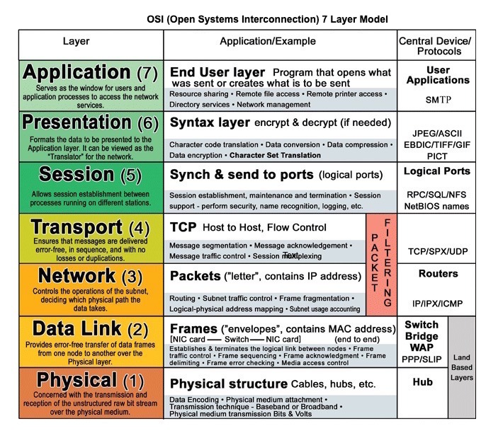
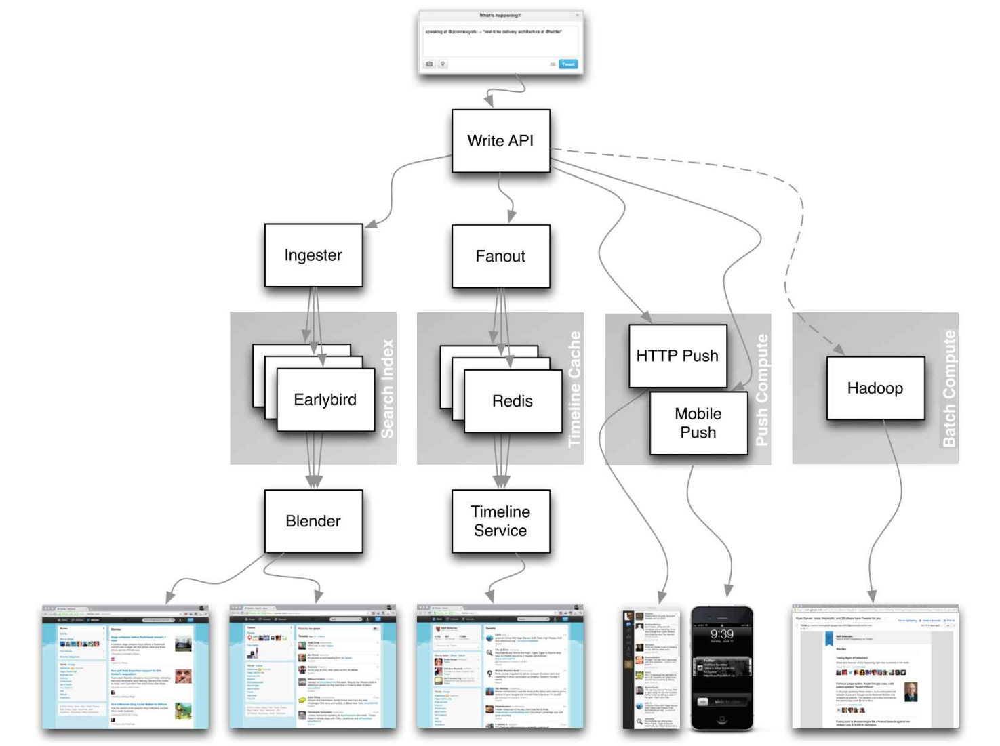

*[English](README.md) ∙ [日本語](README-ja.md) ∙ [简体中文](README-zh-Hans.md) ∙ [繁體中文](README-zh-TW.md) ∙ [한국어](README-ko.md) | [العَرَبِيَّة‎](https://github.com/donnemartin/system-design-primer/issues/170) ∙ [বাংলা](https://github.com/donnemartin/system-design-primer/issues/220) ∙ [Português do Brasil](https://github.com/donnemartin/system-design-primer/issues/40) ∙ [Deutsch](https://github.com/donnemartin/system-design-primer/issues/186) ∙ [ελληνικά](https://github.com/donnemartin/system-design-primer/issues/130) ∙ [עברית](https://github.com/donnemartin/system-design-primer/issues/272) ∙ [Italiano](https://github.com/donnemartin/system-design-primer/issues/104) ∙ [فارسی](https://github.com/donnemartin/system-design-primer/issues/110) ∙ [Polski](https://github.com/donnemartin/system-design-primer/issues/68) ∙ [русский язык](https://github.com/donnemartin/system-design-primer/issues/87) ∙ [Español](https://github.com/donnemartin/system-design-primer/issues/136) ∙ [ภาษาไทย](https://github.com/donnemartin/system-design-primer/issues/187) ∙ [Türkçe](https://github.com/donnemartin/system-design-primer/issues/39) ∙ [tiếng Việt](https://github.com/donnemartin/system-design-primer/issues/127) ∙ [Français](https://github.com/donnemartin/system-design-primer/issues/250) | [Add Translation](https://github.com/donnemartin/system-design-primer/issues/28)*

# 시스템 설계 입문

<p align="center">
  
  <br/>
</p>

## 동기 부여 및 목적

> 대규모 시스템을 어떻게 설계하는지 배웁니다.
>
> 시스템 설계 면접을 준비합니다.

### 대규모 시스템 설계 방법 배우기

확장 가능한 시스템의 설계를 배우는 것은 더 나은 엔지니어가 되는 것에 도움이 될 수 있습니다.

시스템 설계는 광범위한 주제입니다. 시스템 설계 원리에 관한 **웹 상에 방대한 양의 문서 및 자료가 흩어져** 있습니다.

해당 저장소는 확장 가능한 대규모 시스템의 설계 및 구축 방법을 배우는데 큰 도움이 되는 자료들을 **모아서 정리하였습니다.**

### 오픈소스 커뮤니티로부터 배우기

해당 저장소는 오픈소스 프로젝트이며 지속적으로 업데이트되고 있습니다.

[기여](#기여)는 언제나 환영입니다!

### 시스템 설계 면접 준비

코딩 면접뿐만 아니라 시스템 설계에 대한 지식도 많은 기술 회사에서의 **꼭 필요한 기술 면접 과정 중 요소**로 자리 잡았습니다.

**일반적인 시스템 설계 면접 질문들**을 대비하여 본인의 해답과 **예제 해답**을 토론, 코드, 다이어그램을 통해 **비교** 연습하세요.

면접 준비와 관련된 추가 주제들:

* [학습 지침](#학습-지침)
* [시스템 설계 면접 질문에 접근하는 방법](#시스템-설계-면접-질문에-접근하는-방법)
* [**해답이 포함된** 시스템 설계 면접 질문 목록](#해답이-포함된-시스템-설계-면접-질문-목록)
* [**해답이 포함된** 객체 지향 설계 면접 목록](#해답이-포함된-객체-지향-설계-면접-목록)
* [추가적인 시스템 설계 면접 목록](#추가적인-시스템-설계-면접-목록)

## Anki flashcard

<p align="center">
  
  <br/>
</p>

함께 제공되는 [Anki flashcard decks](https://apps.ankiweb.net/)은 반복 학습을 통해 시스템 설계의 핵심 개념을 기억할 수 있도록 도와줍니다.

* [시스템 설계 덱](https://github.com/donnemartin/system-design-primer/tree/master/resources/flash_cards/System%20Design.apkg)
* [시스템 설계 연습 문제 덱](https://github.com/donnemartin/system-design-primer/tree/master/resources/flash_cards/System%20Design%20Exercises.apkg)
* [객체 지향 설계 연습 문제 덱](https://github.com/donnemartin/system-design-primer/tree/master/resources/flash_cards/OO%20Design.apkg)

외출 혹은 이동 중에 공부하기 편리합니다.

### 코딩 학습 자료: 인터랙티브 코딩 문제 목록

[**코딩 면접**](https://github.com/donnemartin/interactive-coding-challenges) 준비를 위한 자료를 찾고 계신가요?

<p align="center">
  
  <br/>
</p>

추가 Anki deck이 포함되어 있는 이웃 저장소 [**인터랙티브 코딩 문제 목록**](https://github.com/donnemartin/interactive-coding-challenges)을 참고하세요.

* [Coding deck](https://github.com/donnemartin/interactive-coding-challenges/tree/master/anki_cards/Coding.apkg)

## 기여

> 커뮤니티로부터 배우기

자유로운 Pull Request 제출을 통한 지원이 가능합니다.:

* 오류 수정
* 섹션 보강
* 새로운 섹션 추가
* [번역](https://github.com/donnemartin/system-design-primer/issues/28)

보충이 필요한 자료의 경우 [개발 중](#개발-중) 섹션에 있습니다.

[기여 가이드라인](CONTRIBUTING.md)을 참고해주시기 바랍니다.

## 시스템 설계 목차

> 장단점을 포함한 시스템 설계 주제의 요약. **모든 주제는 상충 관계를 가집니다.**
>
> 각 섹션은 심화 문서 자료에 대한 링크가 포함되어 있습니다.

<p align="center">
  
  <br/>
</p>

* [시스템 설계 주제: 여기서부터 시작](#시스템-설계-주제-여기서부터-시작)
    * [Step 1: 확장성에 관련된 영상 강의 참고](#step-1-확장성에-관련된-영상-강의-참고)
    * [Step 2: 확장성에 관련된 문서 참고](#step-2-확장성에-관련된-문서-참고)
    * [다음 단계](#다음-단계)
* [성능 vs 확장성](#성능-vs-확장성)
* [지연 시간 vs 처리량](#지연-시간-vs-처리량)
* [가용성 vs 일관성](#가용성-vs-일관성)
    * [CAP 정리](#cap-정리)
        * [CP - 일관성과 (Consistency) Partition Tolerance](#cp---일관성과-consistency-partition-tolerance)
        * [AP - 가용성과 (Availability) Partition Tolerance](#ap---가용성과-availability-partition-tolerance)
* [일관성 유형들](#일관성-유형들)
    * [약한 일관성](#약한-일관성)
    * [궁극적 일관성](#궁극적-일관성)
    * [강한 일관성](#강한-일관성)
    * [출처 및 기타 참고 자료](#출처-및-기타-참고-자료-4)
* [가용성 유형들](#가용성-유형들)
    * [페일오버](#페일오버)
    * [복제](#복제)
    * [숫자로 표현한 가용성](#숫자로-표현한-가용성)
* [도메인 네임 시스템](#도메인-네임-시스템)
* [컨텐츠 전송 네트워크](#컨텐츠-전송-네트워크)
    * [Push CDNs](#push-cdns)
    * [Pull CDNs](#pull-cdns)
* [로드 밸런서](#로드-밸런서)
    * [레이어 4 로드 밸런싱](#레이어-4-로드-밸런싱)
    * [레이어 7 로드 밸런싱](#레이어-7-로드-밸런싱)
    * [수평 스케일링](#수평-스케일링)
* [리버스 프록시 (웹 서버)](#리버스-프록시-웹-서버)
    * [로드 밸런서 vs 리버스 프록시](#로드-밸런서-vs-리버스-프록시)
* [응용 계층](#응용-계층)
    * [마이크로서비스](#마이크로서비스)
    * [서비스 탐색](#서비스-탐색)
* [데이터베이스](#데이터베이스)
    * [관계형 데이터베이스 관리 시스템 (RDBMS)](#관계형-데이터베이스-관리-시스템-rdbms)
        * [마스터-슬레이브 복제](#마스터-슬레이브-복제)
        * [마스터-마스터 복제](#마스터-마스터-복제)
        * [페더레이션](#페더레이션)
        * [샤딩](#샤딩)
        * [비정규화](#비정규화)
        * [SQL 튜닝](#sql-튜닝)
    * [NoSQL](#nosql)
        * [키-값 저장소](#키-값-저장소)
        * [문서 저장소](#문서-저장소)
        * [와이드 컬럼 저장소](#와이드-컬럼-저장소)
        * [그래프 데이터베이스](#그래프-데이터베이스)
    * [SQL 혹은 NoSQL](#sql-혹은-nosql)
* [캐시](#캐시)
    * [클라이언트 캐싱](#클라이언트-캐싱)
    * [CDN 캐싱](#cdn-캐싱)
    * [웹 서버 캐싱](#웹-서버-캐싱)
    * [데이터베이스 캐싱](#데이터베이스-캐싱)
    * [애플리케이션 캐싱](#애플리케이션-캐싱)
    * [데이터베이스 쿼리 수준에서의 캐싱](#데이터베이스-쿼리-수준에서의-캐싱)
    * [객체 수준에서의 캐싱](#객체-수준에서의-캐싱)
    * [캐시 업데이트 시기](#캐시-업데이트-시기)
        * [Cache-aside](#cache-aside)
        * [Write-through](#write-through)
        * [Write-behind (write-back)](#write-behind-write-back)
        * [Refresh-ahead](#refresh-ahead)
* [비동기처리](#비동기처리)
    * [메시지 큐](#메시지-큐)
    * [Task queues](#task-queues)
    * [Back pressure](#back-pressure)
* [통신](#통신)
    * [Transmission control protocol (TCP)](#transmission-control-protocol-tcp)
    * [User datagram protocol (UDP)](#user-datagram-protocol-udp)
    * [Remote procedure call (RPC)](#remote-procedure-call-rpc)
    * [Representational state transfer (REST)](#representational-state-transfer-rest)
* [보안](#보안)
* [부록](#부록)
    * [2의 제곱표](#2의-제곱표)
    * [프로그래머가 알아야 할 지연 시간 값](#프로그래머가-알아야-할-지연-시간-값)
    * [추가적인 시스템 설계 면접 목록](#추가적인-시스템-설계-면접-목록)
    * [실생활 아키텍쳐](#실생활-아키텍쳐)
    * [기업의 아키텍쳐](#기업의-아키텍쳐)
    * [기업의 기술 블로그](#기업의-기술-블로그)
* [개발 중](#개발-중)
* [Credits](#credits)
* [연락처 정보](#연락처-정보)
* [라이센스](#라이센스)

## 학습 지침

> 면접 타임라인에 따라 참고해야 할 제안 주제입니다. (단시간, 중시간, 장시간)


**질문: 면접을 위해 해당 문서 전부를 알 필요가 있나요?**

**대답: 아뇨, 전부 알 필요는 없습니다.**

면접에서 질문받는 내용은 아래의 변수에 따라 달라질 수 있습니다.:

* 면접자의 기술 경험 깊이
* 기술 배경이 무엇인지
* 어떤 포지션을 위해 면접을 진행하는지
* 어떠한 기업과 면접을 진행했는지
* 운

경험이 풍부한 지원자들은 일반적으로 시스템 설계에 대한 심화 지식이 있을 것으로 예상됩니다. 아키텍트 또는 팀 리더의 경우에는 개인 멤버보다 더욱 풍부한 지식이 있을 것으로 예상됩니다. 세계적인 수준의 기술 기업들은 한 번 이상의 시스템 설계 면접을 진행할 가능성이 큽니다.

처음에는 큰 틀에서 시작하여 몇 가지 영역에 대해 깊이 들어가는 방식을 취하세요. 다양한 핵심 시스템 설계에 대해서 조금이라도 알고 있는 것이 면접을 유리하게 이끌 수 있습니다. 타임라인, 경험, 면접 대상의 직책 및 회사에 따라 다음 안내를 참고하시기 바랍니다.

* **단시간 타임라인** - 시스템 설계 주제에 대해 폭넓게 다루십시오. 면접 문제를 몇 가지 풀어보면서 익숙해지기 바랍니다.
* **중시간 타임라인** -  시스템 설계 주제에 대해서 폭넓게 다루되 몇 가지 영역에서는 깊이 있게 다루십시오. 많은 양의 연습 문제를 풀어보면서 익숙해지기 바랍니다.
* **장시간 타임라인** - 시스템 설계 주제에 대해 폭넓고 깊이 있게 다루십시오. 대부분의 연습 문제를 풀어보면서 익숙해지기 바랍니다.

| | 단시간 | 중시간 | 장시간 |
|---|---|---|---|
| [시스템 설계 목차](#시스템-설계-목차)을 읽고 시스템 동작 메커니즘에 대해 폭넓게 이해하십시오. | :+1: | :+1: | :+1: |
|  면접 중인 회사의 [기업 엔지니어링 블로그](#기업의-기술-블로그)에서 몇 가지 글을 읽어보십시오. | :+1: | :+1: | :+1: |
| 몇 가지의 [실생활 아키텍쳐](#실생활-아키텍쳐) 사례를 읽어보십시오. | :+1: | :+1: | :+1: |
| [시스템 설계 면접 질문에 접근하는 방법](#시스템-설계-면접-질문에-접근하는-방법)을 참고하십시오. | :+1: | :+1: | :+1: |
| [해답이 포함된 시스템 설계 면접 질문 목록](#해답이-포함된-시스템-설계-면접-질문-목록)을 풀어보십시오. | Some | Many | Most |
| [해답이 포함된 객체 지향 설계 면접 질문 목록](#해답이-포함된-객체-지향-설계-면접-목록)을 풀어보십시오. | Some | Many | Most |
| [추가적인 시스템 설계 면접 목록](#추가적인-시스템-설계-면접-목록)을 참고하십시오. | Some | Many | Most |

## 시스템 설계 면접 질문에 접근하는 방법

> 시스템 설계 면접 질문에 어떻게 대응할 것인지 배웁니다.

시스템 설계 면접은 **open-ended coversation (Yes or No로는 대답할 수 없는 구두 질답) 입니다.** 스스로 대화를 이끌어야 합니다.

아래 단계들을 따른다면 토의을 이끌 수 있을 것입니다. 해당 프로세스를 확실히 진행하려면 [해답이 포함된 시스템 설계 면접 질문 목록](#해답이-포함된-시스템-설계-면접-질문-목록) 섹션을 이하의 단계에 따라 읽기를 권합니다.

### Step 1: 시스템 사용 사례에 대한 개요, 제약, 추정치 등을 알아냅니다

요구 사항을 수집하고 문제 발생 지점을 알아냅니다. 사용 사례와 제약 사항을 확실히 알기 위해 질문을 해보세요.

* 누가 해당 서비스를 사용하는지?
* 어떻게 사용할 것인지?
* 사용자의 규모는 어떠한지?
* 시스템은 어떠한 기능을 해야 하는지?
* 시스템의 입력과 출력은 무엇인지?
* 얼마나 많은 양의 데이터를 처리할 것으로 예상되는지?
* 초당 요청 건수가 얼마나 될 것으로 예상되는지?
* 예상되는 쓰기 및 읽기 작업의 비율은 어떻게 되는지?

### Step 2: 보다 높은 수준의 설계를 만들어봅니다

중요한 구성 요소를 통해 보다 높은 수준의 설계 개요를 작성해봅니다.

* 주요 구성 요소 및 연결부를 스케치하세요.
* 이렇게 생각한 근거를 제시하세요.

### Step 3: 핵심 구성 요소를 설계해봅니다

각 핵심 구성 요소에 대해 세부 정보를 살펴봅니다. 예를 들어 [URL 단축 서비스 설계](solutions/system_design/pastebin/README.md)가 궁금할 때에는 다음을 참고하여 진행하세요.:

* 전체 URL의 해쉬 생성 및 저장 작업을 진행합니다.
    * [MD5](solutions/system_design/pastebin/README.md)와 [Base62](solutions/system_design/pastebin/README.md)
    * 해쉬 충돌
    * SQL 또는 NoSQL
    * 데이터베이스 스키마
* 해쉬화된 URL를 전체 URL로 변환합니다.
    * 데이터베이스 lookup
* API와 객체 지향 설계

### Step 4: 시스템 설계 확장

주어진 제약 사항에서 병목 현상이 발생할 수 있을만한 부분을 식별합니다. 예를 들어 확장성 문제 해결을 위해 다음 요소를 고려할 필요가 있으신가요?

* 로드 밸런서
* 수평 스케일링
* 캐싱
* 데이터베이스 샤딩

잠재적 해결책과 상충 관계에 대해서 토론합니다. 모든 것은 상충 관계를 가집니다. 병목 현상에 대해서는 [확장 가능한 시스템 설계의 원리](#시스템-설계-목차)를 참고하시기 바랍니다.

### 사소한 계산

간혹 약간의 추정치를 직접 계산할 필요가 생길 수 있습니다. [부록](#부록)의 다음 항목들이 도움이 되길 바랍니다.

* [사소한 암산 계산](http://highscalability.com/blog/2011/1/26/google-pro-tip-use-back-of-the-envelope-calculations-to-choo.html)
* [2의 제곱표](#2의-제곱표)
* [프로그래머가 알아야 할 지연 시간 값](#프로그래머가-알아야-할-지연-시간-값)

### 출처 및 기타 참고 자료

다음 링크를 참고하여 예상되는 면접 질문보다 더 좋은 생각들을 참고하세요.

* [시스템 설계 면접을 대응하는 방법](https://www.palantir.com/2011/10/how-to-rock-a-systems-design-interview/)
* [시스템 설계 면접](http://www.hiredintech.com/system-design)
* [아키텍쳐 및 시스템 설계 면접에 대한 소개](https://www.youtube.com/watch?v=ZgdS0EUmn70)
* [시스템 설계 템플릿](https://leetcode.com/discuss/career/229177/My-System-Design-Template)

## 해답이 포함된 시스템 설계 면접 질문 목록

> 일반적인 시스템 설계 면접 질문 및 예시 해답, 코드, 다이어그램입니다.
>
> 해답은 `solutions/` 폴더에 있습니다.

| 질문 | |
|---|---|
| Pastebin.com (또는 Bit.ly) 설계 | [해답](solutions/system_design/pastebin/README.md) |
| Twitter 타임라인 및 검색 (또는 Facebook 피드 및 검색) 설계 | [해답](solutions/system_design/twitter/README.md) |
| 웹 크롤러 설계 | [해답](solutions/system_design/web_crawler/README.md) |
| Mint.com 설계 | [해답](solutions/system_design/mint/README.md) |
| 소셜 네트워크의 데이터 구조 설계 | [해답](solutions/system_design/social_graph/README.md) |
| 검색 엔진의 키-값 저장 구조 설계 | [해답](solutions/system_design/query_cache/README.md) |
| Amazon의 카테고리별 매출 순위 설계 | [해답](solutions/system_design/sales_rank/README.md) |
| AWS에서의 수백만명의 사용자로 확장하는 시스템 설계 | [해답](solutions/system_design/scaling_aws/README.md) |
| 시스템 설계 질문 추가 | [기여](#기여) |

### Pastebin.com (또는 Bit.ly) 설계

[질문과 해답 보기](solutions/system_design/pastebin/README.md)


### Twitter 타임라인 및 검색 (또는 Facebook 피드 및 검색) 설계

[질문과 해답 보기](solutions/system_design/twitter/README.md)


### 웹 크롤러 설계

[질문과 해답 보기](solutions/system_design/web_crawler/README.md)


### Mint.com 설계

[질문과 해답 보기](solutions/system_design/mint/README.md)


### 소셜 네트워크의 데이터 구조 설계

[질문과 해답 보기](solutions/system_design/social_graph/README.md)


### 검색 엔진의 키-값 저장 구조 설계

[질문과 해답 보기](solutions/system_design/query_cache/README.md)


### Amazon의 카테고리별 매출 순위 설계

[질문과 해답 보기](solutions/system_design/sales_rank/README.md)


### AWS에서의 수백만명의 사용자로 확장하는 시스템 설계

[질문과 해답 보기](solutions/system_design/scaling_aws/README.md)


## 해답이 포함된 객체 지향 설계 면접 목록

> 일반적인 객체 지향 설계 면접 질문 및 예시 해답, 코드, 다이어그램이 있습니다.
>
> 해답은 `solutions/` 폴더에 있습니다.

>**참고: 해당 섹션은 개발 중입니다.**

| 질문 | |
|---|---|
| 해쉬 맵 설계 | [해답](solutions/object_oriented_design/hash_table/hash_map.ipynb) |
| LRU (Least Recently Used) 캐시 설계 | [해답](solutions/object_oriented_design/lru_cache/lru_cache.ipynb) |
| 콜 센터 설계 | [해답](solutions/object_oriented_design/call_center/call_center.ipynb) |
| 카드 덱 설계 | [해답](solutions/object_oriented_design/deck_of_cards/deck_of_cards.ipynb) |
| 주차장 설계 | [해답](solutions/object_oriented_design/parking_lot/parking_lot.ipynb) |
| 채팅 서버 설계 | [해답](solutions/object_oriented_design/online_chat/online_chat.ipynb) |
| 원형 배열 설계 | [기여](#기여) |
| 객체 지향 설계 질문 추가 | [기여](#기여) |

## 시스템 설계 주제: 여기서부터 시작

시스템 설계는 처음이신가요?

먼저 일반적인 시스템 설계의 기본적인 원리 및 그것들이 무엇인지, 어떻게 사용되는지, 장단점에 대한 기본 지식이 필요합니다.

### Step 1: 확장성에 관련된 영상 강의 참고

[Harvard에서의 확장성 강의](https://www.youtube.com/watch?v=-W9F__D3oY4)

* 언급되는 주제:
    * 수직 스케일링
    * 수평 스케일링
    * 캐싱
    * 로드 밸런싱
    * 데이터베이스 복제
    * 데이터베이스 파티셔닝

### Step 2: 확장성에 관련된 문서 참고

[확장성](http://www.lecloud.net/tagged/scalability/chrono)

* 언급되는 주제:
    * [복제](http://www.lecloud.net/post/7295452622/scalability-for-dummies-part-1-clones)
    * [데이터베이스](http://www.lecloud.net/post/7994751381/scalability-for-dummies-part-2-database)
    * [캐시](http://www.lecloud.net/post/9246290032/scalability-for-dummies-part-3-cache)
    * [비동기](http://www.lecloud.net/post/9699762917/scalability-for-dummies-part-4-asynchronism)

### 다음 단계

다음으로 높은 수준의 상충 관계를 살펴봅니다.:

* **성능** vs **확장성**
* **지연 시간** vs **처리량**
* **가용성** vs **일관성**

**모든 것은 상충 관계에 있다는 것**을 명심해야합니다.

그 후에 조금 더 심화 주제인 DNS, CDNs, 로드 밸런서 등에 대하여 학습하세요.

## 성능 vs 확장성

자원이 추가됨에 따라 **성능**이 향상되는 경우 해당 서비스는 **확장 가능**하다고 볼 수 있습니다. 일반적으로 성능이 향상된다는 말은 더 많은 작업을 할 수 있다는 것을 뜻하며 데이터셋이 증가하는 경우 더 큰 단위의 작업을 처리할 수 있습니다.<sup><a href=http://www.allthingsdistributed.com/2006/03/a_word_on_scalability.html>1</a></sup>

성능 vs 확장성의 또 다른 관점:

* **성능**에 문제가 있을 경우 단일 사용자의 시스템 속도가 느려집니다.
* **확장성**에 문제가 있을 경우 단일 사용자의 시스템 속도는 빠르지만 부하가 많을 경우 느려집니다.

### 출처 및 기타 참고 자료

* [확장성에 대하여](http://www.allthingsdistributed.com/2006/03/a_word_on_scalability.html)
* [확장성, 가용성, 안정성 유형들](http://www.slideshare.net/jboner/scalability-availability-stability-patterns/)

## 지연 시간 vs 처리량

**지연 시간**은 어떠한 작업 혹은 결과를 산출하기 위해 사용되는 시간을 뜻합니다.

**처리량**은 이러한 어떠한 작업 혹은 결과 산출이 단위 시간으로 이뤄지는 것을 수치화한 것입니다.

일반적으로 **최대한의 처리량**을 **허용 범위 내의 지연 시간**으로 처리하는 것을 목표로 두어야 합니다.

### 출처 및 기타 참고 자료

* [지연 시간 vs 처리량에 대한 이해](https://community.cadence.com/cadence_blogs_8/b/sd/archive/2010/09/13/understanding-latency-vs-throughput)

## 가용성 vs 일관성

### CAP 정리

<p align="center">
  
  <br/>
  <i><a href=http://robertgreiner.com/2014/08/cap-theorem-revisited>Source: CAP theorem revisited</a></i>
</p>

분산 컴퓨터 시스템의 경우 다음 3개 선택지 중 2개만을 보장할 수 있습니다.

* **일관성** - 모든 읽기 작업은 가장 최근에 발생한 쓰기 작업이나 오류를 읽어들입니다.
* **가용성** - 모든 요청에는 최신 버전의 정보가 포함되어 있다는 보장은 없지만 반드시 응답이 수신됩니다.
* **Partition Tolerance** - 네트워크 장애로 인한 임의 파티셔닝에도 불구하고 시스템은 지속적으로 동작합니다.

*네트워크는 신뢰할 수 없기 때문에 Partition Tolerance은 반드시 지원해야 합니다. 일관성과 가용성 사이에서의 소프트웨어 절충안이 필요합니다.*

#### CP - 일관성과 (Consistency) Partition Tolerance

분할된 노드에서 요청을 기다리는 동안 타임아웃 오류가 발생할 수 있습니다. CP는 원자성 읽기/쓰기 작업이 필요한 경우 좋은 선택이 될 수 있습니다.

#### AP - 가용성과 (Availability) Partition Tolerance

응답은 어떤 노드에서든 가장 쉽게 읽을 수 있는 버전의 데이터를 반환하기 때문에 항상 최신이라는 보장을 할 수 없습니다. 분할이 발생했을 때 쓰기 작업을 통한 데이터가 반영되려면 시간이 조금 더 걸릴 수 있습니다.

AP는 [궁극적 일관성](#궁극적-일관성) 혹은 외부 오류와 관계 없이 지속적으로 동작 가능한 시스템의 경우 좋은 선택이 될 수 있습니다.

### 출처 및 기타 참고 자료

* [CAP 정리 재검토](http://robertgreiner.com/2014/08/cap-theorem-revisited/)
* [CAP 정리에 대한 간단한 영어 소개](http://ksat.me/a-plain-english-introduction-to-cap-theorem)
* [CAP FAQ](https://github.com/henryr/cap-faq)
* [CAP 정리](https://www.youtube.com/watch?v=k-Yaq8AHlFA)

## 일관성 유형들

동일한 데이터의 복사본이 여러 개 있는 경우 클라이언트가 해당 데이터에 대해 일관된 뷰를 가질 수 있도록 하는 동기화 방법에 대한 몇 가지 문제가 발생합니다. [CAP 정리](#CAP-정리)를 통해 일관성의 정의를 생각해봅시다. - 모든 읽기 작업은 가장 최근에 발생한 쓰기 작업 데이터 혹은 오류를 읽어들입니다.

### 약한 일관성

쓰기 작업 후 읽기 작업에서는 작성한 데이터를 읽을 수도 읽지 못할 수도 있습니다. 최선의 접근 방식을 취함에도 불구하고 이러한 결과가 나올 수 있습니다.

해당 접근 방식은 memcached 등의 시스템에서 볼 수 있습니다. VoIP, 영상 통화, 실시간 멀티플레이어 게임 등에서 역할을 발휘합니다. 예를 들어 전화 통화 중이고 몇 초 동안 연결이 끊겨 음성을 수신할 수 없을 때 그 후 연결이 회복되어도 연결이 끊긴 동안의 오갔던 이야기들은 알 수 없습니다.

### 궁극적 일관성

쓰기 작업 후 읽기 작업에서 궁극적으로 해당 데이터를 읽을 수는 있습니다. (일반적으로 밀리초만큼의 시간이 걸립니다.) 이 때, 데이터는 비동기적으로 복제됩니다.

해당 접근 방식은 DNS, E-mail 등 시스템에서 볼 수 있습니다. 궁극적 일관성은 고가용성 시스템에서 역할을 발휘합니다.

### 강한 일관성

쓰기 작업 후 반드시 해당 데이터를 읽을 수 있습니다. 이 때, 데이터는 동기적으로 복제됩니다.

해당 접근 방식은 파일 시스템, RDBMS 등 시스템에서 볼 수 있습니다. 강한 일관성은 트랜잭션이 필요한 시스템에서 역할을 발휘합니다.

### 출처 및 기타 참고 자료

* [데이터 센터 간 트랜잭션](http://snarfed.org/transactions_across_datacenters_io.html)

## 가용성 유형들

고가용성을 지원하는 유형은 2가지가 있습니다.: **페일오버**와 **복제**입니다.

### 페일오버

#### 액티브-패시브

액티브-패시브 페일오버를 사용하면 대기 중인 액티브 서버와 패시브 서버에 하트비트를 전송합니다. 만약 하트비트가 중단되면 패시브 서버는 액티브 서버의 IP 주소를 가져와 서비스를 재시작합니다.

재시작까지의 가동 중지 시간 (다운 타임)은 패시브 서버가 "Hot" 상태로 대기 중인지 혹은 "Cold" 상태로 대기 중인지에 따라 결정됩니다. 액티브 서버에서만 트래픽을 처리합니다.

액티브-패시브 페일오버는 마스터-슬레이브 페일오버라고 할 수 있습니다.

#### 액티브-액티브

액티브-액티브 페일오버는 두 서버 모두 트래픽을 관리하며 서버 간 부하를 분산하여 처리합니다.

만약 외부망 서버라면 DNS는 양 서버의 공용 IP를 알고 있어야합니다. 만약 내부망 서버라면 애플리케이션 로직은 양 서버의 대한 정보를 알고 있어야합니다.

액티브-액티브 페일오버는 마스터-마스터 페일오버라고 할 수 있습니다.

### 단점들: 페일오버

* 페일오버는 더 많은 하드웨어가 필요하며 추가적인 복잡성이 증가합니다.
* 새로 작성된 데이터가 패시브 서버에 복제되기 전에 액티브 서버가 장애로 인해 중지되어 있다면 데이터 손실 발생 가능성이 있습니다.

### 복제

#### 마스터-슬레이브 그리고 마스터-마스터

해당 주제는 [데이터베이스](#데이터베이스) 섹션에 자세히 설명되어 있습니다.

* [마스터-슬레이브 복제](#마스터-슬레이브-복제)
* [마스터-마스터 복제](#마스터-마스터-복제)

### 숫자로 표현한 가용성

가용성은 종종 가동 시간 (혹은 가동 중지 시간)에 의해 서비스 사용 가능 시간을 백분율로 표현할 수 있습니다. 가용성은 일반적으로 9초로 측정되며 99.99%의 가용성을 가진 서비스는 일반적으로 4개의 9로 설명될 수 있습니다.

#### 가용성 99.9% - 3개의 9

| 기간                | 허용 가능한 가동 중지 시간 |
| ------------------- | -------------------------- |
| 가동 중지 시간 / 년 | 8시간 45분 57초            |
| 가동 중지 시간 / 월 | 43분 49.7초                |
| 가동 중지 시간 / 주 | 10분 4.8초                 |
| 가동 중지 시간 / 일 | 1분 26.4초                 |

#### 가용성 99.99% - 4개의 9

| 기간                | 허용 가능한 가동 중지 시간 |
| ------------------- | -------------------------- |
| 가동 중지 시간 / 년 | 52분 35.7초                |
| 가동 중지 시간 / 월 | 4분 23초                   |
| 가동 중지 시간 / 주 | 1분 5초                    |
| 가동 중지 시간 / 일 | 8.6초                      |

#### 가용성에서의 병렬 vs 순차

서비스가 실패하기 쉬운 여러 구성 요소로 이루어져 있을 경우 서비스의 전체 가용성은 구성 요소의 순차 혹은 병렬에 따라 다릅니다.

###### 순차

가용성이 100% 미만인 두 구성 요소가 순차로 있다면 전체 가용성이 감소합니다.

```
가용성 (총합) = 가용성 (Foo) * 가용성 (Bar)
```

만약 `Foo`와 `Bar` 의 가용성이 각각 99.9%인 경우 총 가용성은 99.8% 입니다.

###### 병렬

가용성이 100% 미만인 두 구성 요소가 병렬로 있다면 전체 가용성이 증가합니다.

```
가용성 (총합) = 1 - (1 - 가용성 (Foo)) * (1 - 가용성 (Bar))
```

만약 `Foo`와 `Bar`의 가용성이 각각 99.9%인 경우 총 가용성은 99.9999% 입니다.

## 도메인 네임 시스템

<p align="center">
  
  <br/>
  <i><a href=http://www.slideshare.net/srikrupa5/dns-security-presentation-issa>Source: DNS 보안 프레젠테이션</a></i>
</p>


도메인 네임 시스템 (DNS)은 www.example.com 등과 같은 도메인 네임을 IP 주소로 변환합니다.

DNS는 상위 레벨에 몇 개의 권한을 가진 서버가 존재하는 계층형 구조입니다. lookup을 수행할 때 라우터나 ISP는 접속할 DNS의 정보를 제공합니다. 하위 레벨의 DNS 서버는 해당 매핑 정보를 캐싱하여 저장합니다. 다만 캐싱된 정보는 DNS 전파 지연으로 인해 최신 정보가 아닐 가능성도 있습니다. DNS 결과는 [time to live (TTL)](https://en.wikipedia.org/wiki/Time_to_live)에 따라 결정되는 일정 주기에 따라 브라우저 혹은 OS에서 별도로 캐싱할 수 있습니다.

* **NS 레코드 (네임 서버)** - 도메인 및 하위 도메인의 DNS 서버를 지정합니다.
* **MX 레코드 (메일 교환)** - 메시지를 수신할 메일 서버를 지정합니다.
* **A 레코드 (주소)** - 이름 주소를 통해 IP 주소를 가리킵니다.
* **CNAME (정규화)** - 별도의 이름 혹은 `CNAME` (example.com을 www.exmaple.com 등으로), `A` 레코드로 가리킵니다.

[CloudFalre](https://www.cloudflare.com/dns/)와 [Route 53](https://aws.amazon.com/route53/) 등의 서비스는 Managed DNS 서비스를 제공합니다. 일부 DNS 서비스는 다음과 같은 다양한 방법을 사용하여 트래픽을 라우팅 할 수 있습니다.:

* [가중치 라운드 로빈](https://www.g33kinfo.com/info/round-robin-vs-weighted-round-robin-lb)
    * 유지보수 중인 서버로 트래픽이 전송되는 것을 방지합니다.
    * 다양한 크기의 클러스터 간 균형을 조정합니다. 
    * A/B 테스트
* [레이턴시 기반](https://docs.aws.amazon.com/Route53/latest/DeveloperGuide/routing-policy.html#routing-policy-latency)
* [위치 기반](https://docs.aws.amazon.com/Route53/latest/DeveloperGuide/routing-policy.html#routing-policy-geo)

### 단점들: DNS

* 캐싱으로 인한 DNS 속도가 완화될 수 있지만 DNS 서버에 대한 접근은 약간의 지연이 있을 수 있습니다.
* DNS 서버 관리는 복잡하고 일반적으로 [정부, ISP, 대기업](http://superuser.com/questions/472695/who-controls-the-dns-servers/472729)에서 관리합니다.
* DNS 서비스는 최근 [DDoS 공격](http://dyn.com/blog/dyn-analysis-summary-of-friday-october-21-attack/)으로 인해 사용자가 Twitter 등의 IP 주소를 모른다면 Twitter에 접속할 수 없도록 보안 조치가 강화되었습니다.

### 출처 및 기타 참고 자료

* [DNS 아키텍쳐](https://technet.microsoft.com/en-us/library/dd197427(v=ws.10).aspx)
* [위키피디아](https://en.wikipedia.org/wiki/Domain_Name_System)
* [DNS 문서들](https://support.dnsimple.com/categories/dns/)

## 컨텐츠 전송 네트워크

<p align="center">
  
  <br/>
  <i><a href=https://www.creative-artworks.eu/why-use-a-content-delivery-network-cdn/>출처: CDN을 사용하는 이유</a></i>
</p>

컨텐츠 전송 네트워크 (CDN)은 전세계에 분산된 프록시 서버 네트워크로 사용자로부터 지리적으로 가까운 서버에서 컨텐츠를 전송하는 시스템입니다. 일반적으로 HTML/CSS/JS, 사진, 영상 등의 정적 파일을 CDN을 통해 전송됩니다만 Amazon의 CloudFront와 같은 일부 CDN은 동적 컨텐츠도 전송합니다. 해당 사이트의 DNS에서 클라이언트의 서버 통신 정보를 알려줍니다.

CDN을 통해 정보를 전송함으로서 다음과 같은 두가지 이유로 성능이 극적으로 향상됩니다.:

* 사용자는 근처의 데이터 센터를 사용할 수 있습니다.
* 백엔드 서버는 CDN이 처리하는 요청에 대해 처리할 필요가 없어집니다.

### Push CDNs

Push CDNs은 서버 데이터의 변경사항이 있을 경우 반드시 새로운 컨텐츠를 수신하는 방식입니다. 컨텐츠 제공, CDN 직접 업로드, URL에서 CDN을 가리키도록 재작성하는 부분까지 모두 사용자가 책임지는 방식입니다. 컨텐츠가 만료되는 시점과 업데이트되는 시점을 구성할 수 있습니다. 컨텐츠는 신규 혹은 변경 시에만 업로드되어 트래픽은 최소화되지만 저장소 사용량은 극대화됩니다.

트래픽이 적거나 혹은 빈번한 컨텐츠 변경 사항이 없을 경우에는 Push CDNs 방식과 궁합이 좋습니다. 컨텐츠는 정기적으로 불러오는 것이 아닌 CDN에 한 번만 배치됩니다.

### Pull CDNs

Pull CDNs은 첫번째 사용자가 컨텐츠를 요청했을 때 서버에서 새로운 컨텐츠를 서버에서 가져옵니다. 컨텐츠는 사용자 서버에 저장하고 URL이 CDN을 가리키도록 재작성합니다. 결과적으로 CDN에 컨텐츠가 캐시될 때까지 요청 처리가 늦어집니다.

[Time-To-Live (TTL)](https://en.wikipedia.org/wiki/Time_to_live)는 얼마만큼 기간 동안 컨텐츠가 캐시되는지에 따라 결정됩니다. Pull CDNs은 CDN 상에서의 저장소 사용량은 최소화하지만 유효기간이 지나 만료된 파일이 실제 변경되기 전에 불러오는 경우 중복 트래픽이 발생할 수 있습니다.

트래픽이 많은 사이트에서는 최근 요청된 트래픽만 남아있고 트래픽이 고르게 분산되기 때문에 Pull CDNs 방식과 궁합이 좋습니다.

### 단점들: CDN

* CDN 비용은 트래픽에 따라 달라지지만 CDN을 사용하지 않을 경우의 발생할 수 있는 추가 비용과 비교를 해야합니다.
* TTL이 만료되기 전에 업데이트된 컨텐츠는 오래되었을 가능성이 있습니다.
* CDN에서는 정적 컨텐츠가 CDN을 가리키도록 URL을 변경해야합니다.

### 출처 및 기타 참고 자료

* [전세계적으로 분산된 컨텐츠 전송 네트워크](https://figshare.com/articles/Globally_distributed_content_delivery/6605972)
* [Push CDNs과 Pull CDNs의 비교](http://www.travelblogadvice.com/technical/the-differences-between-push-and-pull-cdns/)
* [위키피디아](https://en.wikipedia.org/wiki/Content_delivery_network)

## 로드 밸런서

<p align="center">
  
  <br/>
  <i><a href=http://horicky.blogspot.com/2010/10/scalable-system-design-patterns.html>출처: 확장 가능한 시스템 설계 유형들</a></i>
</p>

로드 밸런서는 클라이언트의 요청을 애플리케이션 서버나 데이터베이스로 분산 처리하는 역할을 담당합니다. 어떠한 경우에도 로드 밸런서는 컴퓨팅 리소스로부터의 응답을 적절한 클라이언트로 반환합니다. 로드 밸런서는 다음과 같은 상황에서 효과적입니다.

* 요청이 비정상 서버에 이동하는 것을 방지합니다.
* 리소스의 과부화를 방지합니다.
* 특정 지점의 장애 제거를 지원합니다.

로드 밸런서는 고비용의 하드웨어 혹은 HAProxy와 같은 소프트웨어로 구현할 수 있습니다.

추가적인 장점:

* **SSL termination** - 요청 복호화 및 서버 응답 암호화를 통해 백엔드 서버가 이러한 잠재적 고비용 작업을 수행할 필요가 없도록 합니다.
    * 각 서버에 [X.509 인증서](https://en.wikipedia.org/wiki/X.509)를 설치할 필요가 없습니다.
* **세션 지속** - 쿠키를 다루는 웹 앱이 세션 정보를 보유하지 않아 추적하지 못할 경우 특정 클라이언트의 요청을 동일한 인스턴스로 라우팅합니다.

장애에 대응하기 위해 [액티브-패시브](#active-passive) 혹은 [액티브-액티브](#active-active) 모드에서 다중 로드 밸런서를 설정합니다.

로드 밸런서는 다음과 같은 다양한 메트릭스를 통해 트래픽을 라우팅할 수 있습니다.:

* 랜덤
* 최소 부하
* 세션 / 쿠키
* [라운드 로빈 혹은 가중 라운드 로빈](https://www.g33kinfo.com/info/round-robin-vs-weighted-round-robin-lb)
* [레이어 4](#레이어-4-로드-밸런싱)
* [레이어 7](#레이어-7-로드-밸런싱)

### 레이어 4 로드 밸런싱

레이어 4 로드 밸런서는 [전송 계층](#통신)을 참조하여 요청 분배 방법을 결정합니다. 일반적으로 전송 계층에는 수신, 송신 IP 주소, 헤더에 기술된 포트 번호가 포함되나 패킷 내용은 포함되지 않습니다. 레이어 4 로드 밸런서는 네트워크 패킷을 업스트림 서버로 전송하여 전달하기 때문에 [네트워크 주소 변환 (Network Address Translation, NAT)](https://www.nginx.com/resources/glossary/layer-4-load-balancing/)을 수행합니다.

### 레이어 7 로드 밸런싱

레이어 7 로드 밸런서는 [응용 계층](#통신)을 참조하여 요청 분배 방법을 결정합니다. 응용 계층에는 헤더, 메시지, 쿠키 등이 포함되어 있습니다. 레이어 7 로드 밸런서는 네트워크 트래픽을 종료하고 메시지를 읽어 로드 밸런싱을 판단한 후 선택한 서버와 연결합니다. 예를 들어 레이어 7 로드 밸런서는 영상 트래픽을 영상 호스팅 서버로 전송하는 동시에 결제 정보 등의 보다 민감한 트래픽을 보안 강화 서버로 전송하는 것이 가능합니다.

유연성과 상충 관계가 되지만 레이어 4 로드 밸런서에서는 레이어 7 로드 밸런서보다 적은 소요 시간 및 컴퓨팅 리소스를 필요로 합니다. 단, 현대 범용 하드웨어 성능에 미치는 영향은 미미할 수 있습니다.

### 수평 스케일링

로드 밸런서는 수평 스케일링을 통해 성능과 가용성을 향상할 수 있습니다. 하나의 서버를 고가 시스템으로 확장하는 **수직 스케일링**보다 적당한 범용 시스템을 사용하여 확장하는 것이 비용대비 효율적이며 고가용성을 낼 수 있습니다. 또한 특화 시스템을 다룰 수 있는 인력보다 범용 시스템을 다룰 수 있는 인력을 고용하는 것이 더 쉬운 방법입니다.

#### 단점들: 수평 스케일링

* 수평 스케일링은 시스템의 복잡도가 더해지며 서버 복제가 필요합니다.
    * 서버는 stateless 이어야 합니다.: 사용자와 관련된 세션 또는 프로필 사진과 같은 데이터를 포함할 수 없습니다.
    * 세션은 [데이터베이스](#데이터베이스) (SQL, NoSQL) 혹은 지속성 [캐시](#캐시) (Redis, Memcaches) 등과 같은 중앙 집중식 데이터 저장소에 저장이 가능합니다.
* 캐시나 데이터베이스와 같은 다운스트림 서버는 업스트림 서버의 스케일 아웃에 따라 더 많은 동시 연결을 처리할 필요가 있습니다.

### 단점들: 로드 밸런서

* 로드 밸런서는 리소스가 부족하거나 제대로 구성되지 않은 경우 시스템 전체의 성능 병목 상태가 발생할 수 있습니다.
* 특정 지점의 장애를 제거하기 위하여 로드 밸런서를 도입하면 시스템의 복잡도가 더해집니다.
* 로드 밸런서가 하나라면 해당 부분이 특정 지점 장애가 될 수 있기 때문에 여러 개의 로드 밸런서를 구성할 경우 복잡도가 더욱 증가합니다.

### 출처 및 기타 참고 자료

* [NGINX 아키텍쳐](https://www.nginx.com/blog/inside-nginx-how-we-designed-for-performance-scale/)
* [HAProxy 아키텍쳐 가이드](http://www.haproxy.org/download/1.2/doc/architecture.txt)
* [확장성](http://www.lecloud.net/post/7295452622/scalability-for-dummies-part-1-clones)
* [위키피디아](https://en.wikipedia.org/wiki/Load_balancing_(computing))
* [레이어 4 로드 밸런싱](https://www.nginx.com/resources/glossary/layer-4-load-balancing/)
* [레이어 7 로드 밸런싱](https://www.nginx.com/resources/glossary/layer-7-load-balancing/)
* [ELB (Elastic load Balancing) listener 설정](http://docs.aws.amazon.com/elasticloadbalancing/latest/classic/elb-listener-config.html)

## 리버스 프록시 (웹 서버)

<p align="center">
  
  <br/>
  <i><a href=https://upload.wikimedia.org/wikipedia/commons/6/67/Reverse_proxy_h2g2bob.svg>출처: 위키피디아</a></i>
  <br/>
</p>

리버스 프록시는 내부 서비스를 중앙 집중화하고 외부에 통일된 인터페이스를 제공하는 웹 서버입니다. 클라이언트로부터의 요청은 그에 대응하는 서버로 전송되고 그 후의 응답을 리버스 프록시가 클라이언트에 반환합니다.

추가적인 장점

* **보안 향상** - 백엔드 서버 정보 은닉 및 블랙리스트 IP, 클라이언트당 연결 수 제한 등을 할 수 있습니다.
* **확장성 및 유연성 향상** - Clients only see the reverse proxy's IP, allowing you to scale servers or change their configuration, 클라이언트는 리버스 프록시 IP만을 알 수 있기 때문에 서버를 확장하거나 구성을 변경할 수 있습니다.
* **SSL termination** - 입력되는 요청을 복호화하고 서버의 응답을 암호화함으로써 백엔드 서버가 잠재적 고비용 작업을 수행할 필요가 없도록 합니다.
    * 각 서버에 [X.509 인증서](https://en.wikipedia.org/wiki/X.509)를 설치할 필요가 없습니다.
* **압축** - 서버 응답을 압축할 수 있습니다.
* **캐싱** - 캐시된 요청에 대한 응답을 반환할 수 있습니다.
* **정적 컨텐츠** - 정적 컨텐츠를 직접 제공할 수 있습니다.
    * HTML/CSS/JS
    * 사진
    * 영상
    * 기타 등

### 로드 밸런서 vs 리버스 프록시

* 여러 서버가 있을 때는 로드 밸런서를 통한 배포가 도움됩니다. 종종 로드 밸런서는 동일한 기능을 제공하는 서버 군으로 트래픽을 라우팅하는 경우가 많습니다.
* 리버스 프록시는 위에서 언급한 장점을 단일 웹 서버나 애플리케이션 서버에서도 나타낼 수 있습니다.
* NGINX, HAProxy와 같은 기술은 레이어 7 리버스 프록시와 로드 밸런서를 모두 지원합니다.

### 단점들: 리버스 프록시

* 리버스 프록시를 도입하면 시스템의 복잡도가 더해집니다.
* 단일 리버스 프록시는 단일 장애 지점이 될 수 있으나 여러 리버스 프록시를 도입하면 (예: failover) 복잡도가 더욱 증가합니다.

### 출처 및 기타 참고 자료

* [리버스 프록시 vs 로드 밸런서](https://www.nginx.com/resources/glossary/reverse-proxy-vs-load-balancer/)
* [NGINX 아키텍쳐](https://www.nginx.com/blog/inside-nginx-how-we-designed-for-performance-scale/)
* [HAProxy 아키텍쳐 가이드](http://www.haproxy.org/download/1.2/doc/architecture.txt)
* [위키피디아](https://en.wikipedia.org/wiki/Reverse_proxy)

## 응용 계층

<p align="center">
  
  <br/>
  <i><a href=http://lethain.com/introduction-to-architecting-systems-for-scale/#platform_layer>출처: 확장을 위한 시스템 설계 소개</a></i>
</p>

웹 계층을 응용 계층 (플랫폼 계층, platform layer 라고도 합니다)에서 분리하면 두 계층을 독립적으로 확장하고 구성할 수 있습니다. 새로운 API를 추가할 때 웹 서버에 추가하지 않고 애플리케이션 서버에 추가할 수 있습니다. **단일 책임 원칙**에서는 소규모 자율 서비스가 협력하여 동작하도록 구성되어 있습니다. 소규모 서비스의 소규모 팀들은 빠른 성장을 위해 보다 적극적인 계획을 세울 수 있도록 하기 위해서입니다.

응용 계층은 [비동기처리](#비동기처리)도 지원합니다.

### 마이크로서비스

독립적으로 배포할 수 있고 소규모의 모듈형 서비스의 집합으로 이루어진 [마이크로서비스](https://en.wikipedia.org/wiki/Microservices)도 해당 논의와 관련된 기술입니다. 각 서비스는 독자적인 프로세스를 처리하고 명확하고 가벼운 메커니즘으로 통신하여 목적으로 하는 기능을 달성합니다. <sup><a href=https://smartbear.com/learn/api-design/what-are-microservices>1</a></sup> 

예를 들어 Pinterest 서비스에서는 다음과 같은 마이크로서비스로 나누어져 있습니다.: 사용자 프로필, 팔로워, 피드, 검색, 사진 업로드 등.

### 서비스 탐색

[Consul](https://www.consul.io/docs/index.html), [Etcd](https://coreos.com/etcd/docs/latest), [Zookeeper](http://www.slideshare.net/sauravhaloi/introduction-to-apache-zookeeper)와 같은 시스템에서는 등록된 서비스의 이름 주소, 포트의 정보를 추적하여 서비스끼리 서로를 쉽게 찾을 수 있도록 합니다. [Health checks](https://www.consul.io/intro/getting-started/checks.html)은 서비스 무결성을 확인하는 데 도움이 되며 해당 서비스는 [HTTP](#hypertext-transfer-protocol-http) 엔드포인트를 사용하여 수행되는 경우가 많습니다. Consul과 Etcd 시스템은 설정 및 공유 데이터 등을 저장하는 [key-value 저장소](#key-value-stroe)를 가지고 있습니다.

### 단점들: 응용 계층

* 느슨하게 연결된 서비스를 응용 계층에 추가하려면 아키텍쳐, 운영, 프로세스 관점 (vs 모놀리식 시스템) 과는 다른 접근방식을 필요로 합니다.
* 마이크로서비스는 배보 및 운영 측면에서 복잡도가 증가하게 됩니다.

### 출처 및 기타 참고 자료

* [확장을 위한 시스템 아키텍쳐를 설계하기 위한 소개](http://lethain.com/introduction-to-architecting-systems-for-scale)
* [시스템 설계 면접 부수기](http://www.puncsky.com/blog/2016-02-13-crack-the-system-design-interview)
* [서비스 지향 아키텍쳐](https://en.wikipedia.org/wiki/Service-oriented_architecture)
* [Zookeeper의 소개](http://www.slideshare.net/sauravhaloi/introduction-to-apache-zookeeper)
* [마이크로서비스 구축 시 알아야 할 사항들](https://cloudncode.wordpress.com/2016/07/22/msa-getting-started/)

## 데이터베이스

<p align="center">
  
  <br/>
  <i><a href=https://www.youtube.com/watch?v=kKjm4ehYiMs>출처: 최초 1,000만 사용자까지의 확장</a></i>
</p>

### 관계형 데이터베이스 관리 시스템 (RDBMS)

SQL과 같은 관계형 데이터베이스는 테이블로 구성된 데이터의 집합입니다.

**ACID**는 관계형 데이터베이스의 [트랜잭션](https://en.wikipedia.org/wiki/Database_transaction) 속성 집합입니다.

* **원자성** - 각 트랜잭선은 있거나 없거나 둘 중 하나입니다.
* **일관성** - 모든 트랜잭션은 데이터베이스를 어떠한 유효 상태에서 다른 상태로 전환합니다.
* **독립성** - 트랜잭션을 동시에 처리하는 것은 연속적으로 트랜잭션을 처리하는 것과 같은 결과가 나타납니다.
* **지속성** - 일단 트랜잭션이 처리되면 그대로 유지됩니다.

관계형 데이터베이스를 확장하기 위한 많은 기법들이 있습니다.: **마스터-슬레이브 복제**, **마스터-마스터 복제**, **페더레이션**, **샤딩**, **비정규화**, **SQL 튜닝**

#### 마스터-슬레이브 복제

마스터 데이터베이스가 읽기 및 작성을 처리하고 쓰기 작업을 하나 이상의 읽기 전용 슬레이브 데이터베이스에 복제합니다. 슬레이브 데이터베이스는 트리 방식처럼 추가 슬레이브로 데이터를 복제할 수 있습니다. 마스터 데이터베이스가 오프라인으로 전환되면 슬레이브가 마스터로 승격되거나 새로운 마스터 데이터베이스가 추가될 때까지는 읽기 전용 모드로 계속 동작합니다.

<p align="center">
  
  <br/>
  <i><a href=http://www.slideshare.net/jboner/scalability-availability-stability-patterns/>출처: 확장성, 가용성, 안정성 유형들</a></i>
</p>

##### 단점들: 마스터-슬레이브 복제

* 슬레이브를 마스터로 승격하기 위해서는 추가 로직이 필요합니다.
* 마스터-슬레이브, 마스터-마스터 복제의 **단점**은 [단점들: 복제](#단점들-복제)을 참고하세요.

#### 마스터-마스터 복제

어느 마스터든 읽기 및 작성을 처리하고 작성에 관해서는 서로 조율합니다. 마스터 중 하나가 동작 중단되어도 시스템 전체에서는 읽기 및 작성을 모두 사용하여 지속적으로 동작이 가능합니다.

<p align="center">
  
  <br/>
  <i><a href=http://www.slideshare.net/jboner/scalability-availability-stability-patterns/>출처: 확장성, 가용성, 안정성 유형들</a></i>
</p>

##### 단점들: 마스터-마스터 복제

* 작성 위치를 결정하기 위해서는 로드 밸런서가 필요하거나 애플리케이션 로직을 변경해야 합니다.
* 대부분의 마스터-마스터 시스템은 일관성이 느슨하거나 (ACID 원리를 지키지 않는 경우) 혹은 동기화하는 시간이 걸리기 때문에 작성 지연 시간이 증가합니다.
* 작성 노드가 추가되면 지연 시간이 증가함에 따라 작성 충돌 가능성이 증가합니다.
* 마스터-슬레이브, 마스터-마스터 복제의 **단점**은 [단점들: 복제](#단점들-복제)을 참고하세요.

##### 단점들: 복제

* 새로 작성된 데이터를 다른 노드로 복제하기 전에 마스터가 동작 중지되었을 경우 데이터가 손실될 가능성이 있습니다.
* 쓰기 작업은 작성 복제본에서 재생됩니다. 쓰기 작업이 많은 경우 복제 노드가 쓰기 작업으로 인해 처리를 제대로 못할 수 있어 읽기 작업이 제대로 이루어지지 않을 수 있습니다.
* 읽기 슬레이브 노드가 많을수록 복제해야하 하는 노드도 많아져 복제 시간이 길어집니다.
* 일부 시스템에서는 마스터에 대한 쓰기 작업은 멀티스레드를 통한 병렬 처리를 할 수 있는 반면 쓰기 작업 슬레이브 복제는 단일 스레드로 연속 처리해야 하는 경우가 있습니다.
* 복제는 추가 하드웨어가 필요하고 복잡도가 더해집니다.

##### 출처 및 기타 참고 자료: 복제

* [확장성, 가용성, 안정성 유형들](http://www.slideshare.net/jboner/scalability-availability-stability-patterns/)
* [멀티-마스터 복제](https://en.wikipedia.org/wiki/Multi-master_replication)

#### 페더레이션

<p align="center">
  
  <br/>
  <i><a href=https://www.youtube.com/watch?v=kKjm4ehYiMs>출처: 최초 1,000만 사용자까지의 확장</a></i>
</p>

페더레이션 (혹은 기능 분할화)은 데이터베이스를 기능별로 분할합니다. 예를 들어 단일 데이터베이스 대신 **포럼**, **사용자**, **제품**이라는 세 개의 데이터베이스를 사용할 수 있으므로 각 데이터베이스에 대한 읽기 및 쓰기 트래픽이 줄어들어들기 때문에 복제에 대한 지연 시간이 줄어들 수 있습니다. 데이터베이스가 작을수록 메모리에 들어갈 수 있는 데이터가 많아지고 캐시 히트가 향상되어 캐시 히트률이 향상됩니다. 단일 중앙 마스터를 통한 쓰기 작업을 직렬화하지 않으면 병렬로 쓰기를 처리할 수 있어 처리량의 향상을 기대할 수 있습니다.

##### 단점들: 페더레이션

* 대규모 처리 및 테이블을 필요로 하는 스키마의 경우 페더레이션은 효과적이지 않습니다.
* 어느 데이터베이스에 읽고 쓰는지 지정하려면 애플리케이션 로직을 갱신해야 합니다.
* [server link](http://stackoverflow.com/questions/5145637/querying-data-by-joining-two-tables-in-two-database-on-different-servers)로 두 개의 데이터베이스에서 데이터를 연결하는 것은 더욱 복잡합니다.
* 페더레이션에서는 추가 하드웨어가 필요하고 복잡도가 더해집니다.

##### 출처 및 기타 참고 자료

* [최초 1,000만 사용자까지의 확장](https://www.youtube.com/watch?v=kKjm4ehYiMs)

#### 샤딩

<p align="center">
  
  <br/>
  <i><a href=http://www.slideshare.net/jboner/scalability-availability-stability-patterns/>출처: 확장성, 가용성, 안정성 유형들</a></i>
</p>

샤딩은 각 데이터베이스가 데이터의 서브셋 단편만을 관리할 수 있도록 서로 다른 데이터베이스에 분할합니다. 사용자 데이터베이스를 예로 들면 사용자 수가 증가함에 따라 클러스터에는 더 많은 샤드가 추가됩니다.

[페더레이션](#페더레이션) 장점과 비슷하게 샤딩을 사용하면 읽기 및 쓰기 트래픽 및 복제가 줄어들고 캐시 히트를 늘릴 수 있습니다. 인덱스 사이즈도 줄일 수 있어 일반적으로 성능이 향상되고 쿼리 속도가 빨라집니다. 어떠한 데이터를 복제하는 기능이 없으면 데이터 손실로 이어지는 이를 방지하기 위해 하나의 샤드가 중단되어도 다른 샤드는 계속 동작하고 있습니다. 페더레이션과 동일하게 단일 중앙 마스터가 쓰기 작업을 직렬화하지 않는다면 병렬로 쓰기 작업 처리를 할 수 있어 처리량의 향상을 기대할 수 있습니다.

사용자 테이블을 샤드하는 일반적인 방법은 사용자의 성 이니셜 혹은 사용자의 지리적 위치를 통해 샤드할 수 있습니다.

##### 단점들: 샤딩

* 샤드에 대응할 수 있도록 애플리케이션 로직을 변경해야 하기 때문에 SQL 쿼리가 복잡해질 수 있습니다.
* 샤드의 데이터 배분이 한쪽으로 치우칠 수 있습니다. 예를 들어 표준 사용자 집합을 가진 샤드가 있는 경우 해당 샤드가 다른 샤드보다 부하가 증가할 수 있습니다.
    * 리밸런싱을 하면 복잡도가 더해집니다. [일관된 해싱](http://www.paperplanes.de/2011/12/9/the-magic-of-consistent-hashing.html)에 기반한 샤딩에서는 전송되는 데이터의 양을 줄일 수 있습니다.
* 여러 개의 샤드에서 데이터를 연결하는 것은 보다 복잡합니다.
* 샤딩은 추가적인 하드웨어가 필요하고 복잡도가 더해집니다.

##### 출처 및 기타 참고 자료

* [샤드의 등장](http://highscalability.com/blog/2009/8/6/an-unorthodox-approach-to-database-design-the-coming-of-the.html)
* [샤드 데이터베이스 아키텍쳐](https://en.wikipedia.org/wiki/Shard_(database_architecture))
* [일관된 해싱](http://www.paperplanes.de/2011/12/9/the-magic-of-consistent-hashing.html)

#### 비정규화

비정규화에서는 일부 쓰기 작업 성능을 희생하여 읽기 성능을 향상시키려고 합니다. 데이터의 불필요한 복사본은 고비용 결합을 피하기 위해 여러 테이블로 작성됩니다. [PostgreSQL](https://en.wikipedia.org/wiki/PostgreSQL)와 Orcale과 같은 일부 RDBMS에서는 불필요한 정보를 저장하고 불필요 복사복을 일관적으로 유지하는 작업을 처리하는 [materialized views](https://en.wikipedia.org/wiki/Materialized_view) 기능을 지원합니다.

데이터가 [페더레이션](#페더레이션)이나 [샤딩](#샤딩)과 같은 기법으로 데이터가 분산되면 데이터 센터 간에 결합을 관리하는 것은 복잡도가 더해집니다. 비정규화는 그런 복잡한 결합 처리를 하지 않아도 됩니다.

대부분의 시스템에서 100:1 혹은 1000:1가 될 정도로 읽기 작업 트래픽이 증가합니다. 읽기 작업을 처리하기 위해서 복잡한 데이터베이스의 결합 처리가 포함되는 것은 매우 고비용적이며 디스크 처리 시간에 방대한 지연 시간을 소비합니다.

##### 단점들: 비정규화

* 데이터가 중복됩니다.
* 불필요한 데이터의 복제가 동기화되야 하는 제약이 존재하며 그로 인해 데이터베이스 전체의 설계가 복잡도가 더해집니다.
* 쓰기 작업의 부하가 높은 상태에서의 비정규화된 데이터베이스는 정규화된 데이터베이스보다 성능이 뒤쳐질 수 있습니다.

###### 출처 및 기타 참고 자료: 비정규화

* [비정규화](https://en.wikipedia.org/wiki/Denormalization)

#### SQL 튜닝

SQL 튜닝은 광범위한 주제이며 해당 지식을 필요로 하는 분야에서 [많은 책들](https://www.amazon.com/s/ref=nb_sb_noss_2?url=search-alias%3Daps&field-keywords=sql+tuning)이 출판되어 있습니다.

병목 현상을 시뮬레이션하고 명백히 밝히는 데 있어 **벤치마크**와 **프로파일**은 중요합니다.

* **벤치마크** - [ab](http://httpd.apache.org/docs/2.2/programs/ab.html) 등의 도구를 사용하여 고부하 상황을 시뮬레이션 해보세요.
* **프로파일** - [slow query log](http://dev.mysql.com/doc/refman/5.7/en/slow-query-log.html) 등의 도구를 통해 성능 상황을 확인해보세요.

벤치마크와 프로파일링을 통해 다음과 같은 최적화 사항을 선택할 수 있도록 합니다.

##### 스키마 최적화

* MySQL은 빠른 접근을 위해 연속된 디스크 블록에 데이터를 덤프합니다.
* 길이가 지정된 필드에 대해서는 `VARCHAR`보다 `CHAR`을 사용하세요.
    * `CHAR`가 효율적으로 빠르고 랜덤하게 데이터에 접근할 수 있으며 `VARCHAR`의 경우 다음 문자열 데이터로 이동하기 전에 문자열의 끝을 찾아야합니다.
* 블로그 글과 같은 대용량 텍스트는 `TEXT`를 사용하세요. `TEXT`에서는 boolean 모드 검색도 가능합니다. `TEXT` 필드에는 텍스트 블록이 배치된 디스크 상 포인터가 저장됩니다.
* 2^32 혹은 40억을 넘지 않는 큰 수에 한해서는 `INT`를 사용하세요.
* 통화에 관해서는 부동 소수점 표현 오류를 방지하기 위해 `DECIMAL`을 사용하세요.
* 크기가 큰 `BLOBS`의 저장은 피하고 어디서 해당 객체를 가져올 수 있는지에 대한 정보를 저장하도록 하세요.
* `VARCHAR(255)`는 8비트 숫자로 계산할 수 잇는 가장 큰 문자로 일부 RDBMS에서는 바이트 당 효율을 극대화하기 위해서 이를 사용합니다.
* [검색 성능 향상](http://stackoverflow.com/questions/1017239/how-do-null-values-affect-performance-in-a-database-search)을 위해 가능한 `NOT NULL` 제약을 설정하세요.

##### 올바른 인덱스 사용

* 쿼리 (`SELECT`, `GROUP BY`, `ORDER BY`, `JOIN`)가 되는 대상이 되는 컬럼에 인덱스를 사용하여 속도를 향상하는 것이 가능합니다.
* 인덱스는 보통 데이터를 정렬하고 로그 타임에 검색, 순차 접근, 삽입 및 삭제를 허용하는 자가 균형 [B-Tree](https://en.wikipedia.org/wiki/B-tree)를 사용하여 표현합니다.
* 인덱스를 배치하는 것은 데이터를 메모리에 저장할 수 있기 때문에 추가적인 용량을 필요로 합니다.
* 인덱스의 변경으로 인해 쓰기 작업 속도가 느려질 수 있습니다.
* 대량의 데이터를 로드할 때는 인덱스를 비활성화하고 데이터를 로드한 후 인덱스를 재구성하는 것이 빠를 수 있습니다.

##### 고비용 결합 피하기

* 성능이 필요한 곳에 [비정규화](#비정규화)를 적용합니다.

##### 테이블 분할

* 테이블을 메모리에 저장할 수 있도록 별도의 테이블에 핫스팟을 넣어 분할하세요.

##### 쿼리 캐시 조정

* 경우에 따라 [쿼리 캐시](https://dev.mysql.com/doc/refman/5.7/en/query-cache.html)가 [성능 문제](https://www.percona.com/blog/2016/10/12/mysql-5-7-performance-tuning-immediately-after-installation/)로 이어질 수 있습니다.

##### 출처 및 기타 참고 자료: SQL 튜닝

* [MySQL 쿼리 최적화를 위한 Tips](http://aiddroid.com/10-tips-optimizing-mysql-queries-dont-suck/)
* [VARCHAR(255)가 자주 보이면 좋은 점은?](http://stackoverflow.com/questions/1217466/is-there-a-good-reason-i-see-varchar255-used-so-often-as-opposed-to-another-l)
* [null 값은 성능에 어떤 영향을 미치는지?](http://stackoverflow.com/questions/1017239/how-do-null-values-affect-performance-in-a-database-search)
* [Slow query log](http://dev.mysql.com/doc/refman/5.7/en/slow-query-log.html)

### NoSQL

NoSQL은 **키-값 저장소**, **문서 저장소**, **와이드 컬럼 저장소**, **그래프 데이터베이스**에 표시되는 데이터 항목의 집합입니다. 데이터는 일반적으로 비정규화 되어 있으며 애플리케이션 측에서 결합합니다. 대부분의 NoSQL 저장소는 진정한 ACID 트랜잭션을 갖지 않고 [궁극적 일관성](#궁극적-일관성) 선호합니다.

**BASE**는 종종 NoSQL 데이터베이스의 속성을 설명하기 위해 사용됩니다. [CAP 정리](#cap-정리)와 대조적으로 BASE는 일관성보다 가용성을 우선시합니다.

* **기본 가용성** - 시스템이 가용성을 보장합니다.
* **독립성** - 시스템 상태는 굳이 입력하지 않아도 시간이 지남에 따라 변경될 가능성이 있습니다.
* **궁극적 일관성** - 시스템 전체는 일정 시간동안 입력이 없다면 일관성이 달성됩니다.

[SQL or NoSQL](#sql-혹은-nosql) 을 선택하는데 추가적으로 어떤 유형의 NoSQL 데이터베이스가 사용 사례에 가장 적합한지 이해하는 것이 매우 유용합니다. 다음 섹션에서는 **키-값 저장소**, **문서 저장소**, **와이드 컬럼 저장소**, **그래프 데이터베이스**에 대해 알아봅니다.

#### 키-값 저장소

> 개요: 해시 테이블

키-값 저장소는 일반적으로 O(1) 읽기 및 쓰기를 허용하며 메모리 또는 SSD에 백업될 수 있습니다. 데이터 저장소는 키를 [사전적 순서](https://en.wikipedia.org/wiki/Lexicographical_order)로 유지하여 효율적인 키 검색을 수행할 수 있습니다.

키-값 저장소는 고성능 작업이 가능하여 단순한 데이터 모델이나 인메모리 캐시 계층 등과 같은 데이터가 급속하게 변경되는 곳에 자주 사용됩니다. 단순 처리만으로 기능이 제한되어 있기 때문에 추가 처리 기능이 필요한 경우의 복잡도는 응용 계층으로 이동하여 처리합니다.

키-값 저장소는 문서 저장소와 같은 보다 복잡한 시스템 혹은 경우에 따라 그래프 데이터베이스의 기반이 됩니다.

##### 출처 및 기타 참고 자료: 키-값 저장소

* [키-값 데이터베이스](https://en.wikipedia.org/wiki/Key-value_database)
* [키-값 저장소의 단점들](http://stackoverflow.com/questions/4056093/what-are-the-disadvantages-of-using-a-key-value-table-over-nullable-columns-or)
* [Redis 아키텍쳐](http://qnimate.com/overview-of-redis-architecture/)
* [Memcached 아키텍쳐](https://www.adayinthelifeof.nl/2011/02/06/memcache-internals/)

#### 문서 저장소

> 개요: 문서가 값으로 저장된 키-값 저장소

문서 저장소는 객체에 관한 모든 정보를 가진 문서 (XML, JSON, binary 등)을 중심으로 한 시스템입니다. 문서 자체의 내부 구조를 기반으로 질의할 API 혹은 쿼리 언어를 제공합니다. *메모: 많은 키-값 저장소는 값의 메타데이터를 사용하기 위한 기능을 포함하고 있어 이러한 두 개의 문서 저장소와의 경계를 흐리게 합니다.*

기초적인 구현을 기반으로 문서는 컬렉션, 태그, 메타데이터, 디렉토리별 등으로 정리됩니다. 문서끼리는 그룹이 될 수 있지만 각 문서는 전혀 다른 필드를 가질 가능성이 있습니다.

[MongoDB](https://www.mongodb.com/mongodb-architecture)나 [CouchDB](https://blog.couchdb.org/2016/08/01/couchdb-2-0-architecture/) 등의 문서 저장소도 복잡한 쿼리를 처리하기 위해 SQL과 같은 언어를 제공합니다. [DynamoDB](http://www.read.seas.harvard.edu/~kohler/class/cs239-w08/decandia07dynamo.pdf)는 키-값과 문서 저장소 모두를 지원합니다.

문서 저장소는 높은 유연성을 보장하며 빈번히 변경되는 데이터를 다룰 때 사용됩니다.

##### 출처 및 기타 참고 자료: 문서 저장소

* [문서 지향 데이터베이스](https://en.wikipedia.org/wiki/Document-oriented_database)
* [MongoDB 아키텍쳐](https://www.mongodb.com/mongodb-architecture)
* [CouchDB 아키텍쳐](https://blog.couchdb.org/2016/08/01/couchdb-2-0-architecture/)
* [Elasticsearch 아키텍쳐](https://www.elastic.co/blog/found-elasticsearch-from-the-bottom-up)

#### 와이드 컬럼 저장소

<p align="center">
  
  <br/>
  <i><a href=http://blog.grio.com/2015/11/sql-nosql-a-brief-history.html>출처: SQL & NoSQL 간략한 기록</a></i>
</p>

> 개요: nested map `ColumnFamily<RowKey, Columns<ColKey, Value, Timestamp>>`

와이드 컬럼 저장소의 기본 데이터 단위는 컬럼 (이름/값 쌍)입니다. 각 컬럼은 컬럼 패밀리로 (SQL 테이블과 유사) 그룹화할 수 있습니다. 슈퍼 컬럼 패밀리는 컬럼 패밀리의 집합입니다. 각 컬럼에는 row 키를 사용하여 독립적으로 접근할 수 있으며 같은 row 키를 가진 컬럼은 같은 row로 인식됩니다. 각 값에는 버전 관리와 충돌 해결을 위한 타임스탬프를 포함합니다.

Google은 Hadoop 생태계에서 자주 사용되는 오픈소스 [HBase](https://www.mapr.com/blog/in-depth-look-hbase-architecture)나 Facebook의 [Cassandra](http://docs.datastax.com/en/cassandra/3.0/cassandra/architecture/archIntro.html) 프로젝트에 영향을 미친 [Bigtable](http://www.read.seas.harvard.edu/~kohler/class/cs239-w08/chang06bigtable.pdf)을 소개했습니다. Bigtable, HBase, Cassandra 등의 저장소는 사전순으로 키를 유지하여 선택한 키 범위에서의 효율적은 데이터 검색을 처리할 수 있습니다.

와이드 컬럼 저장소는 고가용성과 확장성을 보장합니다. 해당 저장소는 매우 큰 규모의 데이터셋을 다룰 때 자주 사용됩니다.

##### 출처: 와이드 컬럼 저장소

* [SQL & NoSQL 간략한 기록](http://blog.grio.com/2015/11/sql-nosql-a-brief-history.html)
* [Bigtable 아키텍쳐](http://www.read.seas.harvard.edu/~kohler/class/cs239-w08/chang06bigtable.pdf)
* [HBase 아키텍쳐](https://www.mapr.com/blog/in-depth-look-hbase-architecture)
* [Cassandra 아키텍쳐](http://docs.datastax.com/en/cassandra/3.0/cassandra/architecture/archIntro.html)

#### 그래프 데이터베이스

<p align="center">
  
  <br/>
  <i><a href=https://en.wikipedia.org/wiki/File:GraphDatabase_PropertyGraph.png>출처: 그래프 데이터베이스</a></i>
</p>

> 개요: 그래프

그래프 데이터베이스에서는 각 노드가 레코드이고 각 arc는 두 노드를 연결하는 관계성입니다. 그래프 데이터베이스는 다수의 외부 키나 다대다 관계 (M:N) 등의 복잡한 관계성을 나타내도록 최적화되어 있습니다.

그래프 데이터베이스는 소셜 네트워크 등 서비스의 복잡한 관계성 모델에서 높은 성능을 발휘합니다. 비교적 새롭고 아직 일반적으로는 사용되지 않기 때문에 개발 도구나 리소를 찾는 것이 다른 저장소 방법에 비해 어려울 수 있습니다. 많은 그래프는 [REST APIs](#representational-state-transfer-rest) 통해서만 접근할 수 있습니다.

##### 출처 및 기타 참고 자료: 그래프

* [그래프 데이터베이스](https://en.wikipedia.org/wiki/Graph_database)
* [Neo4j](https://neo4j.com/)
* [FlockDB](https://blog.twitter.com/2010/introducing-flockdb)

#### 출처 및 기타 참고 자료: NoSQL

* [기본 용어 설명](http://stackoverflow.com/questions/3342497/explanation-of-base-terminology)
* [NoSQL 데이터베이스에 대한 조사와 선택 가이드](https://medium.com/baqend-blog/nosql-databases-a-survey-and-decision-guidance-ea7823a822d#.wskogqenq)
* [확장성](http://www.lecloud.net/post/7994751381/scalability-for-dummies-part-2-database)
* [NoSQL 소개](https://www.youtube.com/watch?v=qI_g07C_Q5I)
* [NoSQL 유형들](http://horicky.blogspot.com/2009/11/nosql-patterns.html)

### SQL 혹은 NoSQL

<p align="center">
  
  <br/>
  <i><a href=https://www.infoq.com/articles/Transition-RDBMS-NoSQL/>출처: RDBMS에서 NoSQL로 전환</a></i>
</p>

**SQL**을 선택하는 이유:

* 구조화된 데이터
* 엄격한 스키마
* 관계 데이터
* 복잡한 결합의 필요성
* 트랜잭션
* 확장에 대한 명확한 유형들
* 더 많은 정보들: 개발자, 커뮤니티, 코드 등
* 인덱스를 통한 데이터 검색이 매우 빠름

**NoSQL**을 선택하는 이유:

* 반구조 데이터
* 동적 혹은 유연한 스키마
* 비관계 데이터
* 복잡한 결합이 필요하지 않음
* 많은 TB (혹은 PB) 데이터 저장
* 매우 데이터 집약적인 워크로드
* IOPS에 대한 매우 높은 처리량

NoSQL에 적합한 샘플 데이터:

* 클릭스트림 및 로그 데이터의 빠른 수집
* 리더보드 혹은 스코어링 데이터
* 쇼핑 카트 등의 일시적 정보
* 자주 접근하는 ('Hot') 테이블
* Metadata/lookup 테이블

##### 출처 및 기타 참고 자료: SQL 혹은 NoSQL

* [최초 1,000만 사용자까지의 확장](https://www.youtube.com/watch?v=kKjm4ehYiMs)
* [SQL vs NoSQL 차이점](https://www.sitepoint.com/sql-vs-nosql-differences/)

## 캐시

<p align="center">
  
  <br/>
  <i><a href=http://horicky.blogspot.com/2010/10/scalable-system-design-patterns.html>출처: 확장 가능한 시스템 설계 유형들</a></i>
</p>

캐싱은 페이지 로드 시간을 줄이고 서버 및 데이터베이스의 부하를 줄일 수 있습니다. 해당 모델에서는 실제 처리를 저장하기 위해 먼저 디스패처가 요청이 전송되었는지 아닌지를 확인한 후 직전의 결과를 수신합니다.

데이터베이스는 종종 분할을 통해 통합된 읽기 및 쓰기 작업의 균일한 분배를 통해 이익을 얻습니다. 인기 아이템은 이러한 분배를 왜곡하여 시스템 전체의 병목이 발생할 수 있습니다. 데이터베이스 앞에 캐시를 삽입함으로써 이와 같은 불균일한 부하와 트래픽 급증을 흡수할 수 있습니다.

### 클라이언트 캐싱

캐시는 클라이언트 측 (OS 혹은 브라우저), [server side](#reverse-proxy-web-server-리버스-프록시-웹-서버), 독립적인 캐시 계층에 설치할 수 있습니다.

### CDN 캐싱

[CDNs](#content-delivery-network-컨텐츠-전송-네트워크)도 캐시의 한 종류로 생각할 수 있습니다.

### 웹 서버 캐싱

[리버스 프록시](#리버스-프록시-웹-서버)나 [Varnish](https://www.varnish-cache.org/) 등 캐시는 정적 혹은 동적 컨텐츠를 직접 제공할 수 있습니다. 웹 서버도 요청을 캐시할 수 있어 애플리케이션 서버에 접속하지 않고 응답을 반환할 수 있습니다.

### 데이터베이스 캐싱

데이터베이스는 보통 일반적인 사용 사례에 최적화된 캐싱 설정을 초기 상태로 포함하고 있습니다. 해당 설정을 특정 사용 유형들에 맞게 변경하면 성능 향상을 기대할 수 있습니다.

### 애플리케이션 캐싱

Memcached나 Redis와 같은 인메모리 캐시는 애플리케이션과 데이터 스토리지 사이의 키-값 저장소입니다. 데이터는 RAM에 저장되기 때문에 데이터가 디스크에 저장되는 일반적인 데이터베이스보다 빠릅니다. RAM 용량이 디스크보다 한정되어 있어 [Least Recently Used (LRU)](https://en.wikipedia.org/wiki/Cache_algorithms#Least_Recently_Used) 등의 [Cache Invalidation](https://en.wikipedia.org/wiki/Cache_algorithms) 알고리즘이 'cold' 항목을 무효화하고 'hot' data를 RAM에 저장합니다.

Redis는 다음과 같은 추가 기능이 있습니다.:

* 지속성 옵션
* 정렬된 세트 및 리스트 등의 삽입 데이터 구조

캐시에는 다양한 레벨이 존재하지만 크게 두 카테고리로 분류할 수 있습니다.: **데이터베이스 쿼리**와 **객체**:

* Row 레벨
* 쿼리 레벨
* Fully-formed serializable objects
* Fully-rendered HTML

일반적으로 파일 기반 캐싱은 클로닝과 자동 스케일링을 어렵게 만들기 때문에 피해야 합니다.

### 데이터베이스 쿼리 수준에서의 캐싱

데이터베이스를 질의할 때는 반드시 질의를 키로 해시하여 결과를 캐시에 저장해야 합니다. 해당 접근 방식은 다음과 같은 cache expiration 문제가 발생할 수 있습니다.:

* 복잡한 질의를 통한 캐시된 결과의 삭제가 어렵습니다.
* 테이블 셀 등과 같은 데이터 단편이 변경되면 변경된 셀을 포함할 수 있는 모든 캐시된 쿼리를 삭제해야 합니다.

### 객체 수준에서의 캐싱

애플리케이션 코드로 수행하는 작업과 유사한 데이터를 객체로 취급합니다. 애플리케이션이 데이터베이스에서 클래스 인스턴스 또는 데이터 구조로 데이터 집합을 취합하도록 하세요.:

* 데이터가 변경되면 객체를 캐시에서 제거합니다.
* 비동기 처리를 허용합니다.: 워커는 캐시된 객체 중 거정 최신인 것을 취합합니다.

캐시 대상에 대한 제안 항목:

* 사용자 세션
* Fully rendered web pages
* Activity streams
* 사용자 그래프 데이터

### 캐시 업데이트 시기

캐시에 저장할 수 있는 용량은 제한되어 있기 때문에 사용 사례에 맞게 어떠한 캐시 방법이 적합한지 결정해야 합니다.

#### Cache-aside

<p align="center">
  
  <br/>
  <i><a href=http://www.slideshare.net/tmatyashovsky/from-cache-to-in-memory-data-grid-introduction-to-hazelcast>출처: 캐시에서 메모리 내 데이터 그리드로</a></i>
</p>

애플리케이션은 스토리지에서의 읽기 및 쓰기 작업을 처리합니다. 캐시는 스토리지와 직접 상호 작용하지 않습니다. 애플리케이션은 다음과 같은 기능을 수행합니다.:

* 캐시 내 엔트리를 참조하지만 결과적으로 캐시 미스가 발생합니다.
* 데이터베이스에서 엔트리를 불러옵니다.
* 엔트리를 캐시에 추가합니다.
* 엔트리를 반환합니다.

```python
def get_user(self, user_id):
    user = cache.get("user.{0}", user_id)
    if user is None:
        user = db.query("SELECT * FROM users WHERE user_id = {0}", user_id)
        if user is not None:
            key = "user.{0}".format(user_id)
            cache.set(key, json.dumps(user))
    return user
```

[Memcached](https://memcached.org/)는 일반적으로 다음과 같은 방식으로 사용됩니다.

캐시에 추가된 뒤 후속 읽기 작업은 빠르게 이루어집니다. Cache-aside는 게으른 로딩 (lazy loading) 이라고도 합니다. 요청된 데이터만 캐싱되므로 요청되지 않은 데이터로 캐시를 채우는 것은 피하도록 합니다.

##### 단점들: cache-aside

* 각 캐시 미스는 세 개의 트립을 호출하게 되어 현저한 지연이 발생할 수 있습니다.
* 데이터베이스의 데이터가 변경되면 오래된 데이터가 남아있을 수 있습니다. 이러한 문제는 time-to-live (TTL)를 설정함으로써 캐시 엔트리 변경을 강제적으로 하거나 write-through 방식을 사용함으로써 완화 할 수 있습니다.
* 노드가 실패한다면 새로운 빈 노드로 대체됨으로써 지연 시간이 증가합니다.

#### Write-through

<p align="center">
  
  <br/>
  <i><a href=http://www.slideshare.net/jboner/scalability-availability-stability-patterns/>출처: 확장성, 가용성, 안정성 유형들</a></i>
</p>

애플리케이션은 캐시를 메인 데이터 저장소로 사용하여 데이터 읽기 및 쓰기를 수행하는 반면 캐시는 데이터베이스에 대한 읽기 및 쓰기를 담당합니다.:

* 애플리케이션은 캐시에 있는 엔트리를 추가하고 변경합니다.
* 캐시는 동기적으로 데이터 저장소에 엔트리를 작성합니다.
* 엔트리를 반환합니다.

애플리케이션 코드:

```python
set_user(12345, {"foo":"bar"})
```

캐시 코드:

```python
def set_user(user_id, values):
    user = db.query("UPDATE Users WHERE id = {0}", user_id, values)
    cache.set(user_id, user)
```

Write-through는 쓰기 작업으로 인해 전체적으로 동작이 느리지만 최신 업데이트된 데이터의 읽기 작업은 빠릅니다. 사용자는 일반적으로 데이터 읽기 처리보다 업데이트할 때의 지연 시간에 대해 더 관대합니다. 캐시 내의 데이터는 최신으로 유지됩니다.

##### 단점들: write through

* 노드의 작업 실패 및 확장 등으로 새로운 노드가 생성되면 새 노드는 데이터베이스에서 엔트리가 업데이트될 때까지 엔트리를 캐시하지 않습니다. cache-aside와 write through를 연계하여 해당 문제를 완화할 수 있습니다.
* 쓰기 작업을 통해 작성된 대부분의 데이터는 한 번도 읽혀지지 않았기 때문에 해당 데이터는 TTL로 압축할 수 있습니다.

#### Write-behind (write-back)

<p align="center">
  
  <br/>
  <i><a href=http://www.slideshare.net/jboner/scalability-availability-stability-patterns/>출처: 확장성, 가용성, 안정성 유형들</a></i>
</p>

애플리케이션은 write-behind에서 다음과 같은 작업을 수행합니다.:

* 캐시에 엔트리를 추가 및 업데이트합니다.
* 데이터 저장소에 비동기식으로 엔트리를 작성하여 쓰기 작업 성능을 향상합니다.

##### 단점들: write-behind

* 캐시가 데이터 저장소 내 컨텐츠에 도달하기 전 캐시가 다운될 경우 데이터 손실이 발생할 수 있습니다.
* cache-aside 혹은 write-through보다 구현하는 것이 복잡합니다.

#### Refresh-ahead

<p align="center">
  
  <br/>
  <i><a href=http://www.slideshare.net/tmatyashovsky/from-cache-to-in-memory-data-grid-introduction-to-hazelcast>출처: 캐시에서 인메모리 데이터 그리드로</a></i>
</p>

만료 전 가장 최근에 접근된 모든 캐시 엔트리를 자동으로 업데이트 하도록 설정할 수 있습니다.

만약 어떠한 항목이 앞으로 필요할지 정확히 예측할 수 있다면 read-through 대비 refresh-ahead가 지연 시간을 줄일 수 있습니다.

##### 단점: refresh-ahead

* 향후 어떠한 항목이 필요할지에 대한 예측이 정확하지 않다면 refresh-ahead가 없는 경우의 성능이 더 좋을 수 있습니다.

### 단점들: 캐시

* [캐시 무효화](https://en.wikipedia.org/wiki/Cache_algorithms)를 통해 캐시나 데이터베이스 등 진정한 데이터와 캐시 사이의 일관성을 유지해야합니다.
* 캐시 무효화는 어려운 문제이며 캐시 업데이트 시기와 관련된 추가적인 복잡한 문제도 존재합니다.
* Redis 또는 Memcaches 추가와 같은 애플리케이션 구성 변경이 필요합니다.

### 출처 및 기타 참고 자료

* [캐시에서 인메모리 데이터 그리드로](http://www.slideshare.net/tmatyashovsky/from-cache-to-in-memory-data-grid-introduction-to-hazelcast)
* [확장 가능한 시스템 설계 유형들](http://horicky.blogspot.com/2010/10/scalable-system-design-patterns.html)
* [확장할 수 있는 시스템을 설계하기 위한 소개](http://lethain.com/introduction-to-architecting-systems-for-scale/)
* [확장성, 가용성, 안정성 유형들](http://www.slideshare.net/jboner/scalability-availability-stability-patterns/)
* [확장성](http://www.lecloud.net/post/9246290032/scalability-for-dummies-part-3-cache)
* [AWS ElastiCache 전략](http://docs.aws.amazon.com/AmazonElastiCache/latest/UserGuide/Strategies.html)
* [위키피디아](https://en.wikipedia.org/wiki/Cache_(computing))

## 비동기처리

<p align="center">
  
  <br/>
  <i><a href=http://lethain.com/introduction-to-architecting-systems-for-scale/#platform_layer>출처: 확장을 위한 시스템 설계 소개</a></i>
</p>

비동기 워크플로우는 연속적으로 수행되는 고비용 작업에 대한 요청 시간을 줄이는데 도움이 됩니다. 또한 정기적으로 데이터를 수집하거나 집계하는 등과 같이 시간이 많이 소요되는 작업을 미리 수행하여 도움이 될 수 있습니다.

### 메시지 큐

메시지 큐는 메시지를 수신 및 보관, 전달을 수행합니다. 처리가 느려서 연속적인 작업을 수행할 수 없을 경우 다음의 워크플로우와 함께 메시지 큐를 사용할 수 있습니다.:

* 애플리케이션은 작업을 큐에 전달하여 사용자에게 작업 상태를 전달합니다.
* 워커가 큐에서 작업을 선택하여 처리한 후 작업이 완료되었음을 알립니다.

사용자의 처리가 멈추는 일은 없고 작업은 백그라운드에서 처리됩니다. 이 시간 동안 클라이언트는 작업이 완료된 것처럼 보이도록 선택적으로 소규모의 작업을 처리할 수 있습니다. 예를 들어 트윗을 올리면 해당 트윗이 즉시 타임라인에 게시되어 반영된 것처럼 보이지만 트윗이 실제로 모든 팔로워에게 전달되기까지는 다소 시간이 걸릴 수 있습니다.

**[Redis](https://redis.io/)**는 간단한 메시지 브로커로서 유용하지만 메시지가 손실될 수 있습니다.

**[RabbitMQ](https://www.rabbitmq.com/)**는 인기가 있어 많이 사용되고 있지만 'AMQP' 프로토콜에 따라 자체 노드를 관리하여야 합니다.

**[Amazon SQS](https://aws.amazon.com/sqs/)**의 선택지도 있으나 지연 시간이 길 수가 있고 메시지가 중복적으로 전달될 수 있습니다.

### Task queues

Task queues은 작업 및 관련 데이터를 수신하고 이를 실행한 후 결과를 전달합니다. 스케줄링을 지원하고 백그라운드에서 계산 집약적인 고비용 작업을 실행하는데 사용될 수 있습니다.

**Celery**는 스케줄링과 Python의 지원이 있습니다.

### Back pressure

만약 큐가 크게 확대되면 메모리보다 큐의 크기가 커져 캐시 미스 및 디스크 읽기, 성능 저하가 발생할 수 있습니다. [Back pressure](http://mechanical-sympathy.blogspot.com/2012/05/apply-back-pressure-when-overloaded.html)는 큐 크기를 제한하여 이미 큐에 있는 작업에 대해 높은 처리량과 양호환 응답 시간을 유지함으로써 도움이 될 수 있습니다. 큐가 가득 차면 클라이언트는 나중에 다시 시도하기 위해 Server Busy 혹은 HTTP 503 상태 코드를 응답을 받습니다. 클라이언트는 추후에 [지수 백오프](https://en.wikipedia.org/wiki/Exponential_backoff)로 요청을 재시도할 수 있습니다.

### 단점: 비동기

* 큐를 도입함으로써 지연과 복잡성이 더해질 수 있으므로 저비용 계산 및 실시간 워크플로우와 같은 사용 사례에서는 동기 작업이 더 적합할 수 있습니다.

### 출처 및 기타 참고 자료

* [It's all a numbers game](https://www.youtube.com/watch?v=1KRYH75wgy4)
* [과부하시 back pressure 적용](http://mechanical-sympathy.blogspot.com/2012/05/apply-back-pressure-when-overloaded.html)
* [리틀의 법칙](https://en.wikipedia.org/wiki/Little%27s_law)
* [메시지 큐와 Task queue의 차이점은?](https://www.quora.com/What-is-the-difference-between-a-message-queue-and-a-task-queue-Why-would-a-task-queue-require-a-message-broker-like-RabbitMQ-Redis-Celery-or-IronMQ-to-function)

## 통신

<p align="center">
  
  <br/>
  <i><a href=http://www.escotal.com/osilayer.html>출처: OSI 7 레이어 모델</a></i>
</p>

### Hypertext transfer protocol (HTTP)

HTTP는 클라이언트와 서버 간에 데이터를 인코딩하고 전송하는 방법입니다. 요청/응답에 관련된 프로토콜입니다. 클라이언트가 요청을 서버로 전송하고 서버는 요청과 관련된 컨텐츠 및 상태 정보를 응답으로 반환합니다. HTTP는 독립되어 있어 로드 밸런서, 캐시, 인크립션, 압축 등을 수행하는 어떠한 중간 라우터를 거치더라도 요청과 응답이 원활하게 통신될 수 있도록 되어 있습니다.

기본적인 HTTP 요청은 동사 (메서드) 그리고 리소스 (엔드포인트)로 구성됩니다. 다음은 HTTP 동사입니다.:

| 동사 | 상세 | 멱등성* | 안전 | 캐쉬 가능 |
|---|---|---|---|---|
| GET | 리소스를 읽어들입니다. | Yes | Yes | Yes |
| POST | 리소스를 생성하거나 데이터의 처리를 하는 트리거입니다. | No | No | Yes 응답이 새로운 정보를 포함하고 있는 경우에 한합니다. |
| PUT | 리소스를 생성하거나 새로 기입합니다. | Yes | No | No |
| PATCH | 리소스를 부분적으로 업데이트합니다. | No | No | Yes 응답이 새로운 정보를 포함하고 있는 경우에 한합니다. |
| DELETE | 리소스를 삭제합니다. | Yes | No | No |

*다른 결과 없이 여러 번의 호출 가능 여부를 말합니다.

HTTP는 **TCP**나 **UDP** 같은 하위 수준 프로토콜에 의존하는 애플리케이션 계층 프로토콜입니다.

#### 출처 및 기타 참고 자료: HTTP

* [HTTP란?](https://www.nginx.com/resources/glossary/http/)
* [HTTP와 TCP의 차이](https://www.quora.com/What-is-the-difference-between-HTTP-protocol-and-TCP-protocol)
* [PUT와 PATCH의 차이](https://laracasts.com/discuss/channels/general-discussion/whats-the-differences-between-put-and-patch?page=1)

### Transmission control protocol (TCP)

<p align="center">
  
  <br/>
  <i><a href=http://www.wildbunny.co.uk/blog/2012/10/09/how-to-make-a-multi-player-game-part-1/>출처: 멀티플레이어 게임을 만드는 방법</a></i>
</p>

TCP는 [IP 네트워크](https://en.wikipedia.org/wiki/Internet_Protocol)를 통한 연결 지향 프로토콜입니다.  [handshake](https://en.wikipedia.org/wiki/Handshaking)를 사용하여 연결을 설정하고 종료합니다. 전송된 모든 패킷은 다음을 통해 원래 순서에 따라 손상 없이 송신지에 도달하도록 보장됩니다.:

* 각 패킷에 시퀀스 번호와 [체크섬 필드](https://en.wikipedia.org/wiki/Transmission_Control_Protocol#Checksum_computation)가 존재합니다.
* [승인](https://en.wikipedia.org/wiki/Acknowledgement_(data_networks)) 및 자동 재전송 기능을 가지고 있습니다.

발신인이 정확한 응답을 받지 못했다면 패킷을 재전송합니다. 복수의 timeout이 있을 경우 연결이 해제됩니다. TCP는 [flow control](https://en.wikipedia.org/wiki/Flow_control_(data))과 [congestion control](https://en.wikipedia.org/wiki/Network_congestion#Congestion_control)가 구현되어 있습니다. 이러한 기능들로 인해 속도 지연을 초래하고 일반적으로 UDP보다 전송이 비효율적입니다.

높은 처리량을 보장하기 위해 웹 서버는 많은 수의 TCP 연결을 열 수 있기 때문에 이로 인해 메모리 사용량이 많아집니다. 웹 서버 스레드, 즉 memcaches 서버 간에 다수의 연결을 유지한다면 고비용이 소모될 수 있습니다. 가능하다면 UDP로 전환하거나 [connection pooling](https://en.wikipedia.org/wiki/Connection_pool) 등을 사용한다면 도움이 될 수 있습니다.

TCP는 높은 신뢰성을 요구하기 때문에 시간 제약이 엄격하지 않은 애플리케이션에서 유용합니다. 웹 서버, 데이터베이스 정보, SMTP, FTP, SSH 등에서 적용됩니다.

다음과 같은 경우 UDP보다 TCP를 사용합니다.:

* 모든 데이터가 누락없이 도착하여야 할 때 필요합니다.
* 자동으로 네트워크 처리량을 최상으로 예측하여 사용하려는 경우 필요합니다.

### User datagram protocol (UDP)

<p align="center">
  
  <br/>
  <i><a href=http://www.wildbunny.co.uk/blog/2012/10/09/how-to-make-a-multi-player-game-part-1/>출처: 멀티플레이어 게임을 만드는 방법</a></i>
</p>

UDP는 connectionless 입니다. 데이터그램 (패킷과 같은 아날로그)은 데이터그램 수준에서만 보장됩니다. 데이터그램은 송신지에 순서 없이 도착하거나 아예 도착하지 않을 수 있습니다. UDP는 congestion control을 지원하지 않습니다. TCP 지원의 보장이 없다면 UDP는 일반적으로 TCP보다 효율적입니다.

UDP는 서브넷 상의 모든 기기에 데이터그램을 전송하여 브로드캐스트 할 수 있습니다. 이는 클라이언트가 아직 IP 주소를 할당받지 못하였기 때문에 IP 주소를 필요로 하는 TCP에 의한 스트림을 할 수 없기 때문에 [DHCP](https://en.wikipedia.org/wiki/Dynamic_Host_Configuration_Protocol)에서 유용하게 사용됩니다.

UDP는 신뢰성 면에서는 떨어지지만 VoIP, 영상 통화, 스트리밍, 실시간 멀티플레이어 게임과 같은 실시간 통신이 중시될 때는 매우 효과적입니다.

다음과 같은 경우 TCP보다 UDP를 사용합니다.:

* 지연 시간을 최소한으로 억제할 필요가 있을 때 사용됩니다.
* 데이터 손실보다 데이터 지연이 중요할 때 사용됩니다.
* 자체 오류 수정을 구현하려는 경우 사용됩니다.

#### 출처 및 기타 참고 자료: TCP and UDP

* [게임 프로그래밍을 위한 네트워킹](http://gafferongames.com/networking-for-game-programmers/udp-vs-tcp/)
* [TCP와 UDP 프로토콜의 주요 차이점](http://www.cyberciti.biz/faq/key-differences-between-tcp-and-udp-protocols/)
* [TCP와 UDP의 차이](http://stackoverflow.com/questions/5970383/difference-between-tcp-and-udp)
* [Transmission control protocol](https://en.wikipedia.org/wiki/Transmission_Control_Protocol)
* [User datagram protocol](https://en.wikipedia.org/wiki/User_Datagram_Protocol)
* [Facebook에서의 memcache 확장](http://www.cs.bu.edu/~jappavoo/jappavoo.github.com/451/papers/memcache-fb.pdf)

### Remote procedure call (RPC)

<p align="center">
  
  <br/>
  <i><a href=http://www.puncsky.com/blog/2016-02-13-crack-the-system-design-interview>출처: 시스템 설계 면접 부수기</a></i>
</p>

RPC에서 클라이언트는 원격 서버 등과 같은 다른 주소 공간에서 프로시저가 처리되도록 합니다. 프로시저는 로컬 프로시저 호출과 같이 코딩되어 클라이언트 프로그램에서 서버와 통신하는 방법에 대한 세부사항이 추상화되어 있습니다. 원격 호출은 보통 로컬 호출보다 느리고 신뢰성이 떨어지기 때문에 RPC 호출과 로컬 호출을 구분하는 것이 도움됩니다. 인기 있는 RPC 프레임워크는 [Protobuf](https://developers.google.com/protocol-buffers/), [Thrift](https://thrift.apache.org/), [Avro](https://avro.apache.org/docs/current/) 등이 있습니다.

RPC는 요청-응답 프로토콜입니다.

* **클라이언트 프로그램** - 클라이언트 스텁 프로시저를 호출합니다. 호출 매개변수는 로컬 프로시저 호출과 같이 스택에 푸시됩니다.
* **클라이언트 스텁 프로시저**  - 프로시저 id 및 인자를 marshal (packs) 하여 요청 메시지에 포함합니다.
* **클라이언트 통신 모듈** - OS가 클라이언트에서 서버로 메시지를 전송합니다.
* **서버 통신 모듈** - OS가 수신 패킷을 서버 스텁 프로시저에 전달합니다.
* **서버 스텁 프로시저** - 결과를 unmarshal하여 프로시저 ID에 맞는 서버 프로시저를 호출한 후 결과를 반환합니다.
* 서버 응답은 위의 단계를 역순으로 반복합니다.

RCP 호출 예시입니다.:

```
GET /someoperation?data=anId

POST /anotheroperation
{
  "data":"anId";
  "anotherdata": "another value"
}
```

RPC는 행동을 공개하는 것에 초점을 맞춥니다. RPC는 사용 사례에 맞춰 네이티브 호출을 직접 제작할 수 있어 internal 통신 성능을 위해 사용되는 경우가 많습니다.

다음과 같은 경우 네이티브 라이브러리 (aka SDK)를 선택하세요.

* 대상 플랫폼을 알고 있을 때 사용합니다.
* "로직" 접근 방식을 제어하려는 경우 사용합니다.
* 라이브러리에서 오류 발생 방법을 제어하려고 할 때 사용합니다.
* 성능과 최종 사용자의 경험이 최우선일 때 사용합니다.

**REST** 프로토콜을 따르는 HTTP API는 퍼블릭 API에서 많이 사용됩니다.

#### 단점들: RPC

* RPC 클라이언트는 서비스 구현과 긴밀하게 연계되어야 합니다.
* 새로운 운영, 사용 사례가 있을 때마다 새로운 API가 정의되어야 합니다.
* RCP를 디버깅하는 것은 어려울 수 있습니다.
* 기존 기술을 그대로 사용하여 서비스를 구축할 수 없을 수 있습니다. 예를 들어 [Squid](http://www.squid-cache.org/)와 같은 캐싱 서버에 RPC 호출을 올바르게 캐시하려면 추가적인 노력이 필요할 수 있습니다.

### Representational state transfer (REST)

REST는 클라이언트가 서버에 의해 관리되는 리소스에 대해 처리하는 클라이언트/서버 모델을 강제하는 아키텍쳐 스타일입니다. 서버는 리소스의 representation과 리소스의 새로운 representation을 가져오거나 조작할 수 있는 처리를 제공합니다. 모든 통신은 stateless이고 캐시가 가능해야합니다.

RESTful 인터페이스에서는 다음과 같은 네 가지 특성이 있습니다.:

* **리소스 식별 (URI in HTTP)** - 처리에 관계없이 동일한 URI을 사용합니다.
* **표현에 따른 변경 (Verbs in HTTP)** - 동사, 헤더, 바디를 사용합니다.
* **자체 설명 오류 메시지 (status response in HTTP)** - 상태 코드를 사용하고 wheel을 새로 만들지 않습니다.
* **[HATEOAS](http://restcookbook.com/Basics/hateoas/) (HTML interface for HTTP)** - 웹 서비스가 브라우저에서 완전히 접근할 수 있어야 합니다.

Sample REST calls: REST 호출 예제:

```
GET /someresources/anId

PUT /someresources/anId
{"anotherdata": "another value"}
```

REST는 데이터를 공개하는 것에 초점을 맞추고 있습니다. 클라이언트/서버의 결합을 최소화하여 퍼블릭 HTTP API에 자주 사용됩니다. REST는 URI를 통한 리소스 공개, [헤더를 통한 representation](https://github.com/for-GET/know-your-http-well/blob/master/headers.md), GET, POST, PUT, DELETE, PATCH 등의 HTTP 동사로 통일된 메서드를 사용합니다. stateless이므로 REST는 수평 스케일링이나 분할화에 매우 적합합니다.

#### 단점들: REST

* REST는 데이터 공개에 초점을 맞추고 있기 때문에 리소스가 자연스럽게 정리되어 있지 않거나 단순 계층 구조로 나타낼 수 없을 때에는 좋은 선택이 아닐 수 있습니다. 예를 들어 특정 이벤트 집합과 일치하는 모든 업데이트 정보를 반환하는 처리는 쉽게 경로로 표현할 수 없습니다. REST에서는 URI 경로, 쿼리 매개 변수, 요청 바디를 조합하여 구현되는 경우가 많습니다.
* REST는 몇 개의 동사에 (GET, POST, PUT, DELETE, PATCH) 의존하고 있으나 일반적으로 사용 사례에 맞지 않을 수 있습니다. 예를 들어 기한이 지나 만료된 문서를 아카이브에 보관하려 옮기는 처리의 경우 이러한 동사 사용으로는 깔끔하게 해결되지 않을 수 있습니다.
* 중첩 계층 구조에서 복잡한 리소스를 가져오려면 단일 뷰를 렌더링하기 위해 클라이언트와 서버 간 여러 번의 round trip이 (예: 블로그 엔트리의 컨텐츠와 해당 엔트리에 대한 댓글을 가져오는 경우) 필요합니다. 다양한 네트워크 조건에서 동작하는 모바일 애플리케이션의 경우 이러한 round trips은 매우 적합하지 않습니다.
* 시간이 지남에 따라 API 응답을 통해 더욱 많은 필드가 추가되며 오래된 클라이언트는 더 이상 필요하지 않은 새로운 데이터 필드를 수신하게 되어 결과적으로 페이로드의 크기가 증가하고 지연 시간이 길어집니다.

### RPC와 REST의 호출 비교

| 처리 | RPC | REST |
|---|---|---|
| 회원 가입    | **POST** /signup | **POST** /persons |
| 탈퇴    | **POST** /resign<br/>{<br/>"personid": "1234"<br/>} | **DELETE** /persons/1234 |
| 회원 조회 | **GET** /readPerson?personid=1234 | **GET** /persons/1234 |
| 회원의 항목 목록 조회  | **GET** /readUsersItemsList?personid=1234 | **GET** /persons/1234/items |
| 회원 목록에 항목 추가 | **POST** /addItemToUsersItemsList<br/>{<br/>"personid": "1234";<br/>"itemid": "456"<br/>} | **POST** /persons/1234/items<br/>{<br/>"itemid": "456"<br/>} |
| 항목 업데이트    | **POST** /modifyItem<br/>{<br/>"itemid": "456";<br/>"key": "value"<br/>} | **PUT** /items/456<br/>{<br/>"key": "value"<br/>} |
| 항목 삭제 | **POST** /removeItem<br/>{<br/>"itemid": "456"<br/>} | **DELETE** /items/456 |

<p align="center">
  <i><a href=https://apihandyman.io/do-you-really-know-why-you-prefer-rest-over-rpc/>출처: RPC보다 REST를 선호하는 이유를 알고 계신가요?</a></i>
</p>

#### 출처 및 기타 참고 자료: REST and RPC

* [RPC보다 REST를 선호하는 이유를 알고 계신가요?](https://apihandyman.io/do-you-really-know-why-you-prefer-rest-over-rpc/)
* [RPC-ish 접근 방식이 REST보다 적절한 경우는?](http://programmers.stackexchange.com/a/181186)
* [REST vs JSON-RPC](http://stackoverflow.com/questions/15056878/rest-vs-json-rpc)
* [RPC와 REST에 대한 통념 파헤치기](http://etherealbits.com/2012/12/debunking-the-myths-of-rpc-rest/)
* [REST 사용의 단점](https://www.quora.com/What-are-the-drawbacks-of-using-RESTful-APIs)
* [시스템 설계 인터뷰 부수기](http://www.puncsky.com/blog/2016-02-13-crack-the-system-design-interview)
* [Thrift](https://code.facebook.com/posts/1468950976659943/)
* [내부용으로 RPC가 아닌 REST를 사용해야 하는 이유](http://arstechnica.com/civis/viewtopic.php?t=1190508)

## 보안

해당 섹션은 업데이트가 필요합니다. [기여](#기여)를 부탁드립니다!

보안은 폭넓은 주제입니다. 충분한 경험, 보안 분야의 경력이 없어도 보안 지식을 필요로 하는 직책에 지원하지 않는 한 기본 이상을 알 필요는 없습니다.:

* 전송 중 및 유휴 상태에서의 암호화를 수행합니다.
* [XSS](https://en.wikipedia.org/wiki/Cross-site_scripting)와 [SQL injection](https://en.wikipedia.org/wiki/SQL_injection)를 방지하기 위해 모든 사용자 입력 또는 사용자에게 노출되는 입력 매개변수를 검사합니다.
* SQL injection을 방지하려면 매개변수로된 쿼리를 사용하세요.
* [least privilege](https://en.wikipedia.org/wiki/Principle_of_least_privilege) 원리를 사용하세요.

### 출처 및 기타 참고 자료

* [API 보안 체크리스트](https://github.com/shieldfy/API-Security-Checklist)
* [개발자를 위한 보안가이드](https://github.com/FallibleInc/security-guide-for-developers)
* [OWASP top ten](https://www.owasp.org/index.php/OWASP_Top_Ten_Cheat_Sheet)

## 부록

때때로 암산을 통해 근사치를 구할 필요가 있습니다. 예를 들어 디스크에서 100장의 이미지만큼의 미리 보기를 생성하는 시간을 구하거나 그 때 얼마나 디스크 메모리가 소요되는 값을 구할 때가 있습니다. **2의 제곱표**와 **프로그래머가 알아야 할 지연 시간 값**은 유용한 참고 자료입니다.

### 2의 제곱표

```
제곱           정확한 값                근사치           Bytes
---------------------------------------------------------------
7                             128
8                             256
10                           1024   1 thousand           1 KB
16                         65,536                       64 KB
20                      1,048,576   1 million            1 MB
30                  1,073,741,824   1 billion            1 GB
32                  4,294,967,296                        4 GB
40              1,099,511,627,776   1 trillion           1 TB
```

#### 출처 및 기타 참고 자료

* [2의 제곱표](https://en.wikipedia.org/wiki/Power_of_two)

### 프로그래머가 알아야 할 지연 시간 값

```
지연 시간 비교
--------------------------
L1 cache reference                           0.5 ns
Branch mispredict                            5   ns
L2 cache reference                           7   ns                      14x L1 cache
Mutex lock/unlock                           25   ns
Main memory reference                      100   ns                      20x L2 cache, 200x L1 cache
Compress 1K bytes with Zippy            10,000   ns       10 us
Send 1 KB bytes over 1 Gbps network     10,000   ns       10 us
Read 4 KB randomly from SSD*           150,000   ns      150 us          ~1GB/sec SSD
Read 1 MB sequentially from memory     250,000   ns      250 us
Round trip within same datacenter      500,000   ns      500 us
Read 1 MB sequentially from SSD*     1,000,000   ns    1,000 us    1 ms  ~1GB/sec SSD, 4X memory
HDD seek                            10,000,000   ns   10,000 us   10 ms  20x datacenter roundtrip
Read 1 MB sequentially from 1 Gbps  10,000,000   ns   10,000 us   10 ms  40x memory, 10X SSD
Read 1 MB sequentially from HDD     30,000,000   ns   30,000 us   30 ms 120x memory, 30X SSD
Send packet CA->Netherlands->CA    150,000,000   ns  150,000 us  150 ms

참고
-----
1 ns = 10^-9 seconds
1 us = 10^-6 seconds = 1,000 ns
1 ms = 10^-3 seconds = 1,000 us = 1,000,000 ns
```

Handy metrics based on numbers above: 상기 표의 수치를 기준으로 한 편리한 측정 기준:

* HDD에서의 순차 읽기 속도는 30 MB/s 입니다.
* 이더넷에서의 순차 읽기 속도는 100 MB/s 입니다.
* SSD에서의 순차 읽기 속도는 1 GB/s 입니다.
* 메인 메모리에서의 순차 읽기 속도는 4 GB/s 입니다.
* 1초에 지구 6-7바퀴를 돌 수 있습니다.
* 1초에 데이터 센터와 2,000번 round trip 할 수 있습니다.

#### 지연 시간의 시각화


#### 출처 및 기타 참고 자료

* [모든 프로그래머가 알아야 할 지연 시간 값- 1](https://gist.github.com/jboner/2841832)
* [모든 프로그래머가 알아야 할 지연 시간 값 - 2](https://gist.github.com/hellerbarde/2843375)
* [대규모 분산 시스템 구축의 설계, 교훈, 조언](http://www.cs.cornell.edu/projects/ladis2009/talks/dean-keynote-ladis2009.pdf)
* [대규모 분산 시스템 구축의 소프트웨어 엔지니어링 조언](https://static.googleusercontent.com/media/research.google.com/en//people/jeff/stanford-295-talk.pdf)

### 추가적인 시스템 설계 면접 목록

> 공통 시스템 설계 면접 질문과 각 문제 해결 방법에 대한 해답의 링크가 있습니다.

| Question | Reference(s) |
|---|---|
| Dropbox와 같은 파일 동기화 서비스 설계 | [youtube.com](https://www.youtube.com/watch?v=PE4gwstWhmc) |
| Google과 같은 검색 엔진 설계 | [queue.acm.org](http://queue.acm.org/detail.cfm?id=988407)<br/>[stackexchange.com](http://programmers.stackexchange.com/questions/38324/interview-question-how-would-you-implement-google-search)<br/>[ardendertat.com](http://www.ardendertat.com/2012/01/11/implementing-search-engines/)<br/>[stanford.edu](http://infolab.stanford.edu/~backrub/google.html) |
| Google과 같은 확장 가능한 웹 크롤러 설계 | [quora.com](https://www.quora.com/How-can-I-build-a-web-crawler-from-scratch) |
| Google docs 설계 | [code.google.com](https://code.google.com/p/google-mobwrite/)<br/>[neil.fraser.name](https://neil.fraser.name/writing/sync/) |
| Redis와 같은 키-값 저장소 설계 | [slideshare.net](http://www.slideshare.net/dvirsky/introduction-to-redis) |
| Memcached와 같은 캐시 시스템 설계 | [slideshare.net](http://www.slideshare.net/oemebamo/introduction-to-memcached) |
| Amazon과 같은 recommendation 시스템 설계 | [hulu.com](https://web.archive.org/web/20170406065247/http://tech.hulu.com/blog/2011/09/19/recommendation-system.html)<br/>[ijcai13.org](http://ijcai13.org/files/tutorial_slides/td3.pdf) |
| bitly와 같은 URL 단축 시스템 설계 | [n00tc0d3r.blogspot.com](http://n00tc0d3r.blogspot.com/) |
| WhatsApp과 같은 채팅 애플리케이션 설계 | [highscalability.com](http://highscalability.com/blog/2014/2/26/the-whatsapp-architecture-facebook-bought-for-19-billion.html)
| Instagram과 같은 사진 공유 서비스 설계 | [highscalability.com](http://highscalability.com/flickr-architecture)<br/>[highscalability.com](http://highscalability.com/blog/2011/12/6/instagram-architecture-14-million-users-terabytes-of-photos.html) |
| Facebook 뉴스 피드 기능 설계 | [quora.com](http://www.quora.com/What-are-best-practices-for-building-something-like-a-News-Feed)<br/>[quora.com](http://www.quora.com/Activity-Streams/What-are-the-scaling-issues-to-keep-in-mind-while-developing-a-social-network-feed)<br/>[slideshare.net](http://www.slideshare.net/danmckinley/etsy-activity-feeds-architecture) |
| Facebook 타임라인 기능 설계 | [facebook.com](https://www.facebook.com/note.php?note_id=10150468255628920)<br/>[highscalability.com](http://highscalability.com/blog/2012/1/23/facebook-timeline-brought-to-you-by-the-power-of-denormaliza.html) |
| Facebook 채팅 기능 설계 | [erlang-factory.com](http://www.erlang-factory.com/upload/presentations/31/EugeneLetuchy-ErlangatFacebook.pdf)<br/>[facebook.com](https://www.facebook.com/note.php?note_id=14218138919&id=9445547199&index=0) |
| Facebook과 같은 그래프 검색 기능 설계 | [facebook.com](https://www.facebook.com/notes/facebook-engineering/under-the-hood-building-out-the-infrastructure-for-graph-search/10151347573598920)<br/>[facebook.com](https://www.facebook.com/notes/facebook-engineering/under-the-hood-indexing-and-ranking-in-graph-search/10151361720763920)<br/>[facebook.com](https://www.facebook.com/notes/facebook-engineering/under-the-hood-the-natural-language-interface-of-graph-search/10151432733048920) |
| CloudFlare와 같은 CDN 설계 | [figshare.com](https://figshare.com/articles/Globally_distributed_content_delivery/6605972) |
| Twitter 트렌드와 같은 기능 설계 | [michael-noll.com](http://www.michael-noll.com/blog/2013/01/18/implementing-real-time-trending-topics-in-storm/)<br/>[snikolov .wordpress.com](http://snikolov.wordpress.com/2012/11/14/early-detection-of-twitter-trends/) |
| 랜덤 ID 발급 시스템 설계 | [blog.twitter.com](https://blog.twitter.com/2010/announcing-snowflake)<br/>[github.com](https://github.com/twitter/snowflake/) |
| 일정한 시간 간격 동안 상위 요청 k건 반환 | [cs.ucsb.edu](https://www.cs.ucsb.edu/sites/cs.ucsb.edu/files/docs/reports/2005-23.pdf)<br/>[wpi.edu](http://davis.wpi.edu/xmdv/docs/EDBT11-diyang.pdf) |
| 여러 데이터 센터에서 데이터를 전송하는 서비스 설계 | [highscalability.com](http://highscalability.com/blog/2009/8/24/how-google-serves-data-from-multiple-datacenters.html) |
| 온라인 멀티플레이어 카드 게임 설계 | [indieflashblog.com](http://www.indieflashblog.com/how-to-create-an-asynchronous-multiplayer-game.html)<br/>[buildnewgames.com](http://buildnewgames.com/real-time-multiplayer/) |
| 가비지 컬렉션 시스템 설계 | [stuffwithstuff.com](http://journal.stuffwithstuff.com/2013/12/08/babys-first-garbage-collector/)<br/>[washington.edu](http://courses.cs.washington.edu/courses/csep521/07wi/prj/rick.pdf) |
| Design an API rate limiter | [https://stripe.com/blog/](https://stripe.com/blog/rate-limiters) |
| 증권 거래소 설계 (NASDAQ 또는 Binance와 같은) | [Jane Street](https://youtu.be/b1e4t2k2KJY)<br/>[Golang Implementation](https://around25.com/blog/building-a-trading-engine-for-a-crypto-exchange/)<br/>[Go Implemenation](http://bhomnick.net/building-a-simple-limit-order-in-go/) |
| 추가적인 시스템 설계 질문 | [기여](#기여) |

### 실생활 아키텍쳐

> 실제 시스템 설계 방법에 대한 자료들입니다.

<p align="center">
  
  <br/>
  <i><a href=https://www.infoq.com/presentations/Twitter-Timeline-Scalability>출처: Twitter 타임라인 규모</a></i>
</p>

**다음 자료들에서 사소한 세부 사항에 초점을 맞추지 마시고 대신 다음을 명심하세요.**:

* 각 자료 내에서 공통된 원리, 기술, 유형들을 식별합니다.
* 각 구성 요소에 의해 해결되는 문제, 동작 위치, 해결되지 않는 문제 등을 연구합니다.
* 학습한 내용을 복습하세요.

|Type | System | Reference(s) |
|---|---|---|
| 데이터 처리 | **MapReduce** - Google 분산 데이터 처리 시스템 | [research.google.com](http://static.googleusercontent.com/media/research.google.com/zh-CN/us/archive/mapreduce-osdi04.pdf) |
| 데이터 처리 | **Spark** - Databricks 분산 데이터 처리 시스템 | [slideshare.net](http://www.slideshare.net/AGrishchenko/apache-spark-architecture) |
| 데이터 처리 | **Storm** - Twitter 분산 데이터 처리 시스템 | [slideshare.net](http://www.slideshare.net/previa/storm-16094009) |
| | | |
| 데이터 저장소 | **Bigtable** - Google 컬럼 지향 분산 데이터베이스 | [harvard.edu](http://www.read.seas.harvard.edu/~kohler/class/cs239-w08/chang06bigtable.pdf) |
| 데이터 저장소 | **HBase** - Bigtable 오픈 소스 구현 | [slideshare.net](http://www.slideshare.net/alexbaranau/intro-to-hbase) |
| 데이터 저장소 | **Cassandra** - Facebook 컬럼 지향 분산 데이터베이스 | [slideshare.net](http://www.slideshare.net/planetcassandra/cassandra-introduction-features-30103666)
| 데이터 저장소 | **DynamoDB** - Amazon 문서 지향 데이터베이스 | [harvard.edu](http://www.read.seas.harvard.edu/~kohler/class/cs239-w08/decandia07dynamo.pdf) |
| 데이터 저장소 | **MongoDB** - 문서 지향 데이터베이스 | [slideshare.net](http://www.slideshare.net/mdirolf/introduction-to-mongodb) |
| 데이터 저장소 | **Spanner** - Google 글로벌 분산 데이터베이스 | [research.google.com](http://research.google.com/archive/spanner-osdi2012.pdf) |
| 데이터 저장소 | **Memcached** - 분산 메모리 캐싱 시스템 | [slideshare.net](http://www.slideshare.net/oemebamo/introduction-to-memcached) |
| 데이터 저장소 | **Redis** - 지속성 및 값 타입을 제공하는 분산 메모리 캐싱 시스템 | [slideshare.net](http://www.slideshare.net/dvirsky/introduction-to-redis) |
| | | |
| 파일 시스템 | **Google File System (GFS)** - 분산 파일 시스템 | [research.google.com](http://static.googleusercontent.com/media/research.google.com/zh-CN/us/archive/gfs-sosp2003.pdf) |
| 파일 시스템 | **Hadoop File System (HDFS)** - GFS 오픈 소스 구현 | [apache.org](http://hadoop.apache.org/docs/stable/hadoop-project-dist/hadoop-hdfs/HdfsDesign.html) |
| | | |
| Misc | **Chubby** - Google 느슨한 결합을 이용한 분산 시스템에 대한 Lock 서비스 | [research.google.com](http://static.googleusercontent.com/external_content/untrusted_dlcp/research.google.com/en/us/archive/chubby-osdi06.pdf) |
| Misc | **Dapper** - 분산 시스템 추적 인프라 | [research.google.com](http://static.googleusercontent.com/media/research.google.com/en//pubs/archive/36356.pdf)
| Misc | **Kafka** - LinkedIn Pub/sub 메시지 큐 | [slideshare.net](http://www.slideshare.net/mumrah/kafka-talk-tri-hug) |
| Misc | **Zookeeper** - 동기화를 지원하는 중앙 집중식 인프라 및 서비스 | [slideshare.net](http://www.slideshare.net/sauravhaloi/introduction-to-apache-zookeeper) |
| | 아키텍쳐 추가 | [기여](#기여) |

### 기업의 아키텍쳐

| Company | Reference(s) |
|---|---|
| Amazon | [Amazon architecture](http://highscalability.com/amazon-architecture) |
| Cinchcast | [Producing 1,500 hours of audio every day](http://highscalability.com/blog/2012/7/16/cinchcast-architecture-producing-1500-hours-of-audio-every-d.html) |
| DataSift | [Realtime datamining At 120,000 tweets per second](http://highscalability.com/blog/2011/11/29/datasift-architecture-realtime-datamining-at-120000-tweets-p.html) |
| DropBox | [How we've scaled Dropbox](https://www.youtube.com/watch?v=PE4gwstWhmc) |
| ESPN | [Operating At 100,000 duh nuh nuhs per second](http://highscalability.com/blog/2013/11/4/espns-architecture-at-scale-operating-at-100000-duh-nuh-nuhs.html) |
| Google | [Google architecture](http://highscalability.com/google-architecture) |
| Instagram | [14 million users, terabytes of photos](http://highscalability.com/blog/2011/12/6/instagram-architecture-14-million-users-terabytes-of-photos.html)<br/>[What powers Instagram](http://instagram-engineering.tumblr.com/post/13649370142/what-powers-instagram-hundreds-of-instances) |
| Justin.tv | [Justin.Tv's live video broadcasting architecture](http://highscalability.com/blog/2010/3/16/justintvs-live-video-broadcasting-architecture.html) |
| Facebook | [Scaling memcached at Facebook](https://cs.uwaterloo.ca/~brecht/courses/854-Emerging-2014/readings/key-value/fb-memcached-nsdi-2013.pdf)<br/>[TAO: Facebook’s distributed data store for the social graph](https://cs.uwaterloo.ca/~brecht/courses/854-Emerging-2014/readings/data-store/tao-facebook-distributed-datastore-atc-2013.pdf)<br/>[Facebook’s photo storage](https://www.usenix.org/legacy/event/osdi10/tech/full_papers/Beaver.pdf)<br/>[How Facebook Live Streams To 800,000 Simultaneous Viewers](http://highscalability.com/blog/2016/6/27/how-facebook-live-streams-to-800000-simultaneous-viewers.html) |
| Flickr | [Flickr architecture](http://highscalability.com/flickr-architecture) |
| Mailbox | [From 0 to one million users in 6 weeks](http://highscalability.com/blog/2013/6/18/scaling-mailbox-from-0-to-one-million-users-in-6-weeks-and-1.html) |
| Netflix | [A 360 Degree View Of The Entire Netflix Stack](http://highscalability.com/blog/2015/11/9/a-360-degree-view-of-the-entire-netflix-stack.html)<br/>[Netflix: What Happens When You Press Play?](http://highscalability.com/blog/2017/12/11/netflix-what-happens-when-you-press-play.html) |
| Pinterest | [From 0 To 10s of billions of page views a month](http://highscalability.com/blog/2013/4/15/scaling-pinterest-from-0-to-10s-of-billions-of-page-views-a.html)<br/>[18 million visitors, 10x growth, 12 employees](http://highscalability.com/blog/2012/5/21/pinterest-architecture-update-18-million-visitors-10x-growth.html) |
| Playfish | [50 million monthly users and growing](http://highscalability.com/blog/2010/9/21/playfishs-social-gaming-architecture-50-million-monthly-user.html) |
| PlentyOfFish | [PlentyOfFish architecture](http://highscalability.com/plentyoffish-architecture) |
| Salesforce | [How they handle 1.3 billion transactions a day](http://highscalability.com/blog/2013/9/23/salesforce-architecture-how-they-handle-13-billion-transacti.html) |
| Stack Overflow | [Stack Overflow architecture](http://highscalability.com/blog/2009/8/5/stack-overflow-architecture.html) |
| TripAdvisor | [40M visitors, 200M dynamic page views, 30TB data](http://highscalability.com/blog/2011/6/27/tripadvisor-architecture-40m-visitors-200m-dynamic-page-view.html) |
| Tumblr | [15 billion page views a month](http://highscalability.com/blog/2012/2/13/tumblr-architecture-15-billion-page-views-a-month-and-harder.html) |
| Twitter | [Making Twitter 10000 percent faster](http://highscalability.com/scaling-twitter-making-twitter-10000-percent-faster)<br/>[Storing 250 million tweets a day using MySQL](http://highscalability.com/blog/2011/12/19/how-twitter-stores-250-million-tweets-a-day-using-mysql.html)<br/>[150M active users, 300K QPS, a 22 MB/S firehose](http://highscalability.com/blog/2013/7/8/the-architecture-twitter-uses-to-deal-with-150m-active-users.html)<br/>[Timelines at scale](https://www.infoq.com/presentations/Twitter-Timeline-Scalability)<br/>[Big and small data at Twitter](https://www.youtube.com/watch?v=5cKTP36HVgI)<br/>[Operations at Twitter: scaling beyond 100 million users](https://www.youtube.com/watch?v=z8LU0Cj6BOU)<br/>[How Twitter Handles 3,000 Images Per Second](http://highscalability.com/blog/2016/4/20/how-twitter-handles-3000-images-per-second.html) |
| Uber | [How Uber scales their real-time market platform](http://highscalability.com/blog/2015/9/14/how-uber-scales-their-real-time-market-platform.html)<br/>[Lessons Learned From Scaling Uber To 2000 Engineers, 1000 Services, And 8000 Git Repositories](http://highscalability.com/blog/2016/10/12/lessons-learned-from-scaling-uber-to-2000-engineers-1000-ser.html) |
| WhatsApp | [The WhatsApp architecture Facebook bought for $19 billion](http://highscalability.com/blog/2014/2/26/the-whatsapp-architecture-facebook-bought-for-19-billion.html) |
| YouTube | [YouTube scalability](https://www.youtube.com/watch?v=w5WVu624fY8)<br/>[YouTube architecture](http://highscalability.com/youtube-architecture) |

### 기업의 기술 블로그

> 면접을 위한 기업의 아키텍쳐입니다.
>
> 접하는 질문들은 같은 영역에서 나올 수 있습니다.

* [Airbnb Engineering](http://nerds.airbnb.com/)
* [Atlassian Developers](https://developer.atlassian.com/blog/)
* [AWS Blog](https://aws.amazon.com/blogs/aws/)
* [Bitly Engineering Blog](http://word.bitly.com/)
* [Box Blogs](https://blog.box.com/blog/category/engineering)
* [Cloudera Developer Blog](http://blog.cloudera.com/)
* [Dropbox Tech Blog](https://tech.dropbox.com/)
* [Engineering at Quora](https://www.quora.com/q/quoraengineering)
* [Ebay Tech Blog](http://www.ebaytechblog.com/)
* [Evernote Tech Blog](https://blog.evernote.com/tech/)
* [Etsy Code as Craft](http://codeascraft.com/)
* [Facebook Engineering](https://www.facebook.com/Engineering)
* [Flickr Code](http://code.flickr.net/)
* [Foursquare Engineering Blog](http://engineering.foursquare.com/)
* [GitHub Engineering Blog](http://githubengineering.com/)
* [Google Research Blog](http://googleresearch.blogspot.com/)
* [Groupon Engineering Blog](https://engineering.groupon.com/)
* [Heroku Engineering Blog](https://engineering.heroku.com/)
* [Hubspot Engineering Blog](http://product.hubspot.com/blog/topic/engineering)
* [High Scalability](http://highscalability.com/)
* [Instagram Engineering](http://instagram-engineering.tumblr.com/)
* [Intel Software Blog](https://software.intel.com/en-us/blogs/)
* [Jane Street Tech Blog](https://blogs.janestreet.com/category/ocaml/)
* [LinkedIn Engineering](http://engineering.linkedin.com/blog)
* [Microsoft Engineering](https://engineering.microsoft.com/)
* [Microsoft Python Engineering](https://blogs.msdn.microsoft.com/pythonengineering/)
* [Netflix Tech Blog](http://techblog.netflix.com/)
* [Paypal Developer Blog](https://medium.com/paypal-engineering)
* [Pinterest Engineering Blog](https://medium.com/@Pinterest_Engineering)
* [Reddit Blog](http://www.redditblog.com/)
* [Salesforce Engineering Blog](https://developer.salesforce.com/blogs/engineering/)
* [Slack Engineering Blog](https://slack.engineering/)
* [Spotify Labs](https://labs.spotify.com/)
* [Twilio Engineering Blog](http://www.twilio.com/engineering)
* [Twitter Engineering](https://blog.twitter.com/engineering/)
* [Uber Engineering Blog](http://eng.uber.com/)
* [Yahoo Engineering Blog](http://yahooeng.tumblr.com/)
* [Yelp Engineering Blog](http://engineeringblog.yelp.com/)
* [Zynga Engineering Blog](https://www.zynga.com/blogs/engineering)

#### 출처 및 기타 참고 자료

블로그를 추가하시겠어요? 중복 작업을 방지하려면 다음 저장소에 회사 블로그를 추가하는 것을 고려하세요.

* [kilimchoi/engineering-blogs](https://github.com/kilimchoi/engineering-blogs)

## 개발 중

섹션을 추가하거나 진행 중인 섹션을 완료하는데에 [기여](#기여)를 통해 도와주세요!

* MapReduce에 의한 분산 컴퓨팅
* Consistent hashing
* Scatter gather
* [기여](#기여)

## Credits

Credits과 출처 페이지는 해당 repo에 기재되어 있습니다.

Special thanks to:

* [Hired in tech](http://www.hiredintech.com/system-design/the-system-design-process/)
* [Cracking the coding interview](https://www.amazon.com/dp/0984782850/)
* [High scalability](http://highscalability.com/)
* [checkcheckzz/system-design-interview](https://github.com/checkcheckzz/system-design-interview)
* [shashank88/system_design](https://github.com/shashank88/system_design)
* [mmcgrana/services-engineering](https://github.com/mmcgrana/services-engineering)
* [System design cheat sheet](https://gist.github.com/vasanthk/485d1c25737e8e72759f)
* [A distributed systems reading list](http://dancres.github.io/Pages/)
* [Cracking the system design interview](http://www.puncsky.com/blog/2016-02-13-crack-the-system-design-interview)

## 연락처 정보

이슈, 질문, 지적이 있다면 언제든지 문의해주세요.

제 연락처 정보는 [GitHub page](https://github.com/donnemartin)에 있습니다.

## 라이센스

*I am providing code and resources in this repository to you under an open source license.  Because this is my personal repository, the license you receive to my code and resources is from me and not my employer (Facebook).*

    Copyright 2017 Donne Martin
    
    Creative Commons Attribution 4.0 International License (CC BY 4.0)
    
    http://creativecommons.org/licenses/by/4.0/
