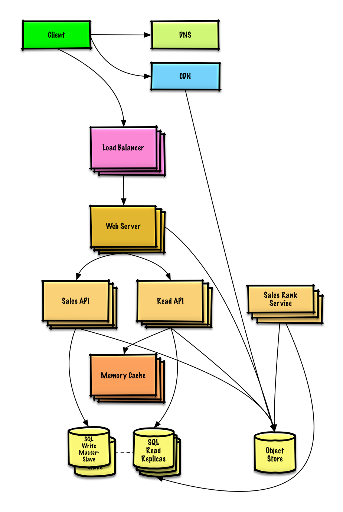
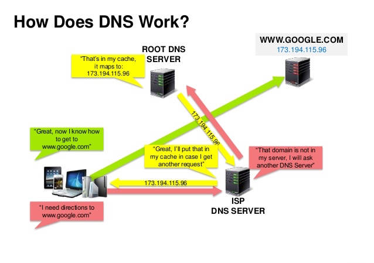
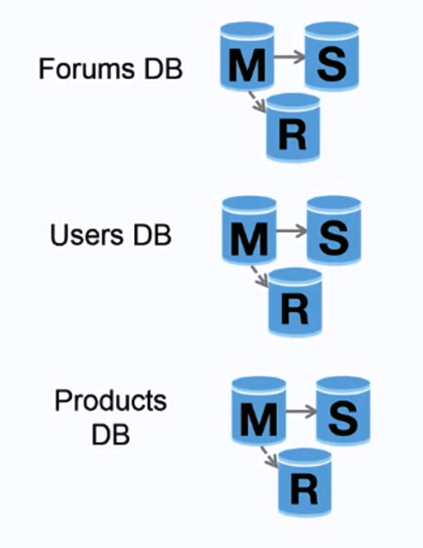
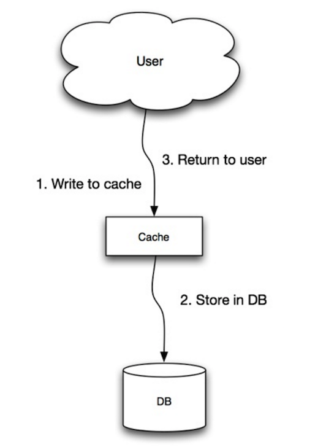

[English](README.md) | [日本語](README-ja.md) | **[Русский](README-ru.md)** | [简体中文](README-zh-Hans.md) | [繁體中文](README-zh-TW.md) <!-- l10n:select -->

<!-- l10n:p
**Help [translate](TRANSLATIONS.md) this guide!**
l10n:p -->

**Помогайте [переводить](TRANSLATIONS.md) это руководство!**

<!-- l10n:p
# The System Design Primer

<p align="center">
  
  <br/>
</p>
l10n:p -->

# Пособие по Проектированию Cистем

<!-- l10n:ignore start -->
[](https://github.com/voitau/system-design-primer/actions?query=workflow:l10n-sync-ru)
<!-- maintained with https://github.com/markdown-localization/mdlm-sh -->
<!-- l10n:ignore end -->

<p align="center">
  
  <br/>
</p>

<!-- l10n:p
## Motivation

> Learn how to design large-scale systems.
>
> Prep for the system design interview.
l10n:p -->

## Для чего это нужно

> Чтобы узнать, как проектировать крупномасштабные системы.
>
> Чтобы подготовиться к собеседованию по проектированию систем.

<!-- l10n:p
### Learn how to design large-scale systems

Learning how to design scalable systems will help you become a better engineer.

System design is a broad topic.  There is a **vast amount of resources scattered throughout the web** on system design principles.

This repo is an **organized collection** of resources to help you learn how to build systems at scale.
l10n:p -->

### Научитесь проектировать крупномасштабные системы

Умение проектировать масштабируемые системы поможет улучшить ваши инженерные навыки.

Проектирование систем - это обширная тема. В сети есть **огромное количество ресурсов** по принципам проектирования систем.

Этот репозиторий представляет собой **организованную коллекцию** ресурсов, которые помогут вам научиться создавать системы на большом масштабе.

<!-- l10n:p
### Learn from the open source community

This is a continually updated, open source project.

[Contributions](#contributing) are welcome!
l10n:p -->

### Учитесь у сообщества по разработке ПО с открытым исходным кодом

Это постоянно обновляемый проект с открытым исходным кодом.

[Содействие](#содействуйте) очень приветствуется!

<!-- l10n:p
### Prep for the system design interview

In addition to coding interviews, system design is a **required component** of the **technical interview process** at many tech companies.

**Practice common system design interview questions** and **compare** your results with **sample solutions**: discussions, code, and diagrams.

Additional topics for interview prep:

* [Study guide](#study-guide)
* [How to approach a system design interview question](#how-to-approach-a-system-design-interview-question)
* [System design interview questions, **with solutions**](#system-design-interview-questions-with-solutions)
* [Object-oriented design interview questions, **with solutions**](#object-oriented-design-interview-questions-with-solutions)
* [Additional system design interview questions](#additional-system-design-interview-questions)
l10n:p -->

### Подготовка к собеседованию по проектированию систем

Наряду с интервью по написанию кода, проектирование систем является **обязательным компонентом процесса технического интервью** во многих технологических компаниях.

**Практикуйте общие вопросы по проектированию систем** и **сравнивайте** свои результаты с **примерами решений**: обсуждения, код и диаграммы.

Дополнительные темы для подготовки к собеседованию:

* [Руководство](#руководство)
* [Как отвечать на вопросы на интервью по проектированию систем](#как-отвечать-на-вопросы-на-интервью-по-проектированию-систем)
* [Вопросы на интервью по проектированию систем с решениями](#вопросы-на-интервью-по-проектированию-систем-с-решениями)
* [Вопросы на интервью по объектно-ориентированному программированию с решениями](#вопросы-на-интервью-по-объектно-ориентированному-программированию-с-решениями)
* [Дополнительные вопросы на интервью по проектированию систем](#дополнительные-вопросы-на-интервью-по-проектированию-систем)

<!-- l10n:p
## Anki flashcards

<p align="center">
  
  <br/>
</p>

The provided [Anki flashcard decks](https://apps.ankiweb.net/) use spaced repetition to help you retain key system design concepts.

* [System design deck](https://github.com/donnemartin/system-design-primer/tree/master/resources/flash_cards/System%20Design.apkg)
* [System design exercises deck](https://github.com/donnemartin/system-design-primer/tree/master/resources/flash_cards/System%20Design%20Exercises.apkg)
* [Object oriented design exercises deck](https://github.com/donnemartin/system-design-primer/tree/master/resources/flash_cards/OO%20Design.apkg)

Great for use while on-the-go.
l10n:p -->

## Карточки Anki

<p align="center">
  
  <br/>
</p>

Предоставленные [карточки Anki](https://apps.ankiweb.net/) могут быть использованы для повторения и запоминания ключевых концепций проектирования систем.

* [System design deck](https://github.com/donnemartin/system-design-primer/tree/master/resources/flash_cards/System%20Design.apkg)
* [System design exercises deck](https://github.com/donnemartin/system-design-primer/tree/master/resources/flash_cards/System%20Design%20Exercises.apkg)
* [Object oriented design exercises deck](https://github.com/donnemartin/system-design-primer/tree/master/resources/flash_cards/OO%20Design.apkg)

<!-- l10n:p
### Coding Resource: Interactive Coding Challenges

Looking for resources to help you prep for the [**Coding Interview**](https://github.com/donnemartin/interactive-coding-challenges)?

<p align="center">
  
  <br/>
</p>

Check out the sister repo [**Interactive Coding Challenges**](https://github.com/donnemartin/interactive-coding-challenges), which contains an additional Anki deck:

* [Coding deck](https://github.com/donnemartin/interactive-coding-challenges/tree/master/anki_cards/Coding.apkg)
l10n:p -->

### Ресурсы по программированию: интерактивные задачи

Ищете ресурсы для подготовки к [**Coding Interview**](https://github.com/donnemartin/interactive-coding-challenges)?

<p align="center">
  
  <br/>
</p>

Посмотрите другой репозиторий [**Interactive Coding Challenges**](https://github.com/donnemartin/interactive-coding-challenges), который тоже содержит набор карт Anki:

* [Coding deck](https://github.com/donnemartin/interactive-coding-challenges/tree/master/anki_cards/Coding.apkg)

<!-- l10n:p
## Contributing

> Learn from the community.

Feel free to submit pull requests to help:

* Fix errors
* Improve sections
* Add new sections
* [Translate](https://github.com/donnemartin/system-design-primer/issues/28)

Content that needs some polishing is placed [under development](#under-development).

Review the [Contributing Guidelines](CONTRIBUTING.md).
l10n:p -->

## Содействуйте

> Учитесь у сообщества.

Не стесняйтесь отправлять запросы на:

* Исправление ошибок
* Улучшение разделов
* Добавление новых разделов
* [Перевод](https://github.com/donnemartin/system-design-primer/issues/28)

Контент, который нуждается в некоторой доработке, помещается в раздел [В разработке](#в-разработке).

Ознакомьтесь с [Принципами содействия](CONTRIBUTING.md).

<!-- l10n:p
## Index of system design topics

> Summaries of various system design topics, including pros and cons.  **Everything is a trade-off**.
>
> Each section contains links to more in-depth resources.

<p align="center">
  
  <br/>
</p>

* [System design topics: start here](#system-design-topics-start-here)
    * [Step 1: Review the scalability video lecture](#step-1-review-the-scalability-video-lecture)
    * [Step 2: Review the scalability article](#step-2-review-the-scalability-article)
    * [Next steps](#next-steps)
* [Performance vs scalability](#performance-vs-scalability)
* [Latency vs throughput](#latency-vs-throughput)
* [Availability vs consistency](#availability-vs-consistency)
    * [CAP theorem](#cap-theorem)
        * [CP - consistency and partition tolerance](#cp---consistency-and-partition-tolerance)
        * [AP - availability and partition tolerance](#ap---availability-and-partition-tolerance)
* [Consistency patterns](#consistency-patterns)
    * [Weak consistency](#weak-consistency)
    * [Eventual consistency](#eventual-consistency)
    * [Strong consistency](#strong-consistency)
* [Availability patterns](#availability-patterns)
    * [Fail-over](#fail-over)
    * [Replication](#replication)
    * [Availability in numbers](#availability-in-numbers)
* [Domain name system](#domain-name-system)
* [Content delivery network](#content-delivery-network)
    * [Push CDNs](#push-cdns)
    * [Pull CDNs](#pull-cdns)
* [Load balancer](#load-balancer)
    * [Active-passive](#active-passive)
    * [Active-active](#active-active)
    * [Layer 4 load balancing](#layer-4-load-balancing)
    * [Layer 7 load balancing](#layer-7-load-balancing)
    * [Horizontal scaling](#horizontal-scaling)
* [Reverse proxy (web server)](#reverse-proxy-web-server)
    * [Load balancer vs reverse proxy](#load-balancer-vs-reverse-proxy)
* [Application layer](#application-layer)
    * [Microservices](#microservices)
    * [Service discovery](#service-discovery)
* [Database](#database)
    * [Relational database management system (RDBMS)](#relational-database-management-system-rdbms)
        * [Master-slave replication](#master-slave-replication)
        * [Master-master replication](#master-master-replication)
        * [Federation](#federation)
        * [Sharding](#sharding)
        * [Denormalization](#denormalization)
        * [SQL tuning](#sql-tuning)
    * [NoSQL](#nosql)
        * [Key-value store](#key-value-store)
        * [Document store](#document-store)
        * [Wide column store](#wide-column-store)
        * [Graph Database](#graph-database)
    * [SQL or NoSQL](#sql-or-nosql)
* [Cache](#cache)
    * [Client caching](#client-caching)
    * [CDN caching](#cdn-caching)
    * [Web server caching](#web-server-caching)
    * [Database caching](#database-caching)
    * [Application caching](#application-caching)
    * [Caching at the database query level](#caching-at-the-database-query-level)
    * [Caching at the object level](#caching-at-the-object-level)
    * [When to update the cache](#when-to-update-the-cache)
        * [Cache-aside](#cache-aside)
        * [Write-through](#write-through)
        * [Write-behind (write-back)](#write-behind-write-back)
        * [Refresh-ahead](#refresh-ahead)
* [Asynchronism](#asynchronism)
    * [Message queues](#message-queues)
    * [Task queues](#task-queues)
    * [Back pressure](#back-pressure)
* [Communication](#communication)
    * [Hypertext transfer protocol (HTTP)](#hypertext-transfer-protocol-http)
    * [Transmission control protocol (TCP)](#transmission-control-protocol-tcp)
    * [User datagram protocol (UDP)](#user-datagram-protocol-udp)
    * [Remote procedure call (RPC)](#remote-procedure-call-rpc)
    * [Representational state transfer (REST)](#representational-state-transfer-rest)
* [Security](#security)
* [Appendix](#appendix)
    * [Powers of two table](#powers-of-two-table)
    * [Latency numbers every programmer should know](#latency-numbers-every-programmer-should-know)
    * [Additional system design interview questions](#additional-system-design-interview-questions)
    * [Real world architectures](#real-world-architectures)
    * [Company architectures](#company-architectures)
    * [Company engineering blogs](#company-engineering-blogs)
* [Under development](#under-development)
* [Credits](#credits)
* [Contact info](#contact-info)
* [License](#license)
l10n:p -->

## Содержание

> Обобщение различных тем по проектированию систем, включая преимущества и недостатки.  **Любое решение требует компромисса**.
>
> Каждый раздел содержит ссылки на более подробное описание.

<p align="center">
  
  <br/>
</p>

- [Темы про проектированию систем: начало](#темы-про-проектированию-систем-начало)
  - [Шаг 1: Посмотрите видео-лекцию по масштабированию](#шаг-1-посмотрите-видео-лекцию-по-масштабированию)
  - [Шаг 2: Прочитайте статьи по масштабированию](#шаг-2-прочитайте-статьи-по-масштабированию)
  - [Следующие шаги](#следующие-шаги)
- [Производительность и масштабируемость](#производительность-и-масштабируемость)
- [Задержка и пропускная способность](#задержка-и-пропускная-способность)
- [Доступность и согласованность данных](#доступность-и-согласованность-данных)
  - [Теорема CAP](#теорема-cap)
    - [CP - Согласованность данных и Устойчивость к разделению](#cp---согласованность-данных-и-устойчивость-к-разделению)
    - [AP - Доступность и Устойчивость к разделению](#ap---доступность-и-устойчивость-к-разделению)
- [Шаблоны реализации согласованности](#шаблоны-реализации-согласованности)
  - [Слабая согласованность](#слабая-согласованность)
  - [Согласованность в конечном счете](#согласованность-в-конечном-счете)
  - [Сильная согласованность](#сильная-согласованность)
- [Шаблоны доступности](#шаблоны-доступности)
  - [Отказоустойчивость](#отказоустойчивость)
    - [Активный-пассивный](#активный-пассивный)
    - [Активный-активный](#активный-активный)
  - [Репликация](#репликация)
    - [Master-Slave и Master-Master](#master-slave-и-master-master)
  - [Доступность в цифрах](#доступность-в-цифрах)
    - [Доступность 99.9% - 3 девятки](#доступность-999---3-девятки)
    - [Доступность 99.99% - четыре девятки](#доступность-9999---четыре-девятки)
    - [Параллельная и последовательная доступность](#параллельная-и-последовательная-доступность)
        - [Последовательная доступность](#последовательная-доступность)
        - [Параллельная доступность](#параллельная-доступность)
- [Систем доменных имен](#систем-доменных-имен)
- [Сеть доставки содержимого (CDN)](#сеть-доставки-содержимого-cdn)
  - [Push CDN](#push-cdn)
  - [Pull CDN](#pull-cdn)
- [Балансировщик нагрузки](#балансировщик-нагрузки)
  - [Layer 4 балансировка](#layer-4-балансировка)
  - [Layer 7 балансировка](#layer-7-балансировка)
  - [Горизонтальное масштабирование](#горизонтальное-масштабирование)
- [Обратный прокси-сервер (Reverse proxy)](#обратный-прокси-сервер-reverse-proxy)
  - [Сравнение балансировщика нагрузки и обратного прокси-сервера](#сравнение-балансировщика-нагрузки-и-обратного-прокси-сервера)
- [Уровень приложений](#уровень-приложений)
  - [Микросервисы](#микросервисы)
  - [Обнаружение сервисов (Service Discovery)](#обнаружение-сервисов-service-discovery)
- [Базы данных](#базы-данных)
  - [Реляционные системы управления базами данных](#реляционные-системы-управления-базами-данных)
    - [Репликация Master-Slave](#репликация-master-slave)
    - [Репликация Master-Master](#репликация-master-master)
    - [Федерализация](#федерализация)
    - [Шардирование](#шардирование)
    - [Денормализация](#денормализация)
    - [SQL тюнинг](#sql-тюнинг)
      - [Пересмотрите схему](#пересмотрите-схему)
      - [Используйте хорошие индексы](#используйте-хорошие-индексы)
      - [Избегайте больших объединений](#избегайте-больших-объединений)
      - [Разбиение таблиц](#разбиение-таблиц)
      - [Настройте кэширование запросов](#настройте-кэширование-запросов)
  - [NoSQL](#nosql)
    - [Хранилище типа ключ-значение](#хранилище-типа-ключ-значение)
    - [Хранилище документов](#хранилище-документов)
    - [Колоночное хранилище](#колоночное-хранилище)
    - [Графовая база данных](#графовая-база-данных)
  - [SQL или NoSQL](#sql-или-nosql)
- [Кэширование](#кэширование)
  - [Кэширование на клиенте](#кэширование-на-клиенте)
  - [Кэширование в CDN](#кэширование-в-cdn)
  - [Кэширование на веб-сервере](#кэширование-на-веб-сервере)
  - [Кэширование в Базах данных](#кэширование-в-базах-данных)
  - [Кэширование в приложениях](#кэширование-в-приложениях)
  - [Кэширование на уровне запросов в базу данных](#кэширование-на-уровне-запросов-в-базу-данных)
  - [Кэширование на уровне объектов](#кэширование-на-уровне-объектов)
  - [Когда обновлять кэш](#когда-обновлять-кэш)
    - [Кэширование Cache-aside (кэш отдельно)](#кэширование-cache-aside-кэш-отдельно)
    - [Кэширование Write-through (сквозное)](#кэширование-write-through-сквозное)
    - [Кэширование Write-behind / write-back (отложенная запись)](#кэширование-write-behind--write-back-отложенная-запись)
    - [Кэширование Refresh-ahead (предварительное обновление)](#кэширование-refresh-ahead-предварительное-обновление)
- [Асинхронность](#асинхронность)
  - [Очереди сообщений](#очереди-сообщений)
  - [Очереди задач](#очереди-задач)
  - [Обратное давление](#обратное-давление)
- [Взаимодействие](#взаимодействие)
  - [HTTP (Hypertext transfer protocol)](#http-hypertext-transfer-protocol)
  - [Transmission control protocol (TCP)](#transmission-control-protocol-tcp)
  - [User datagram protocol (UDP)](#user-datagram-protocol-udp)
  - [Удалённый вызов процедур (Remote procedure call, RPC)](#удалённый-вызов-процедур-remote-procedure-call-rpc)
  - [REST (Representational state transfer)](#rest-representational-state-transfer)
  - [Сравнение вызовов RPC и REST](#сравнение-вызовов-rpc-и-rest)
- [Безопасность](#безопасность)
- [Приложение](#приложение)
  - [Таблица степеней двойки](#таблица-степеней-двойки)
  - [Время выполнения задач, которые должен знать каждый программист](#время-выполнения-задач-которые-должен-знать-каждый-программист)
    - [Визуализация выполнения](#визуализация-выполнения)
  - [Дополнительные вопросы на интервью по проектированию систем](#дополнительные-вопросы-на-интервью-по-проектированию-систем)
  - [Архитектуры действующих систем](#архитектуры-действующих-систем)
  - [Архитектуры компаний](#архитектуры-компаний)
  - [Блоги инженерных компаний](#блоги-инженерных-компаний)
- [В разработке](#в-разработке)
- [Благодарность](#благодарность)
- [Контактная информация](#контактная-информация)
- [License](#license)

<!-- l10n:p
## Study guide

> Suggested topics to review based on your interview timeline (short, medium, long).


**Q: For interviews, do I need to know everything here?**

**A: No, you don't need to know everything here to prepare for the interview**.

What you are asked in an interview depends on variables such as:

* How much experience you have
* What your technical background is
* What positions you are interviewing for
* Which companies you are interviewing with
* Luck

More experienced candidates are generally expected to know more about system design.  Architects or team leads might be expected to know more than individual contributors.  Top tech companies are likely to have one or more design interview rounds.

Start broad and go deeper in a few areas.  It helps to know a little about various key system design topics.  Adjust the following guide based on your timeline, experience, what positions you are interviewing for, and which companies you are interviewing with.

* **Short timeline** - Aim for **breadth** with system design topics.  Practice by solving **some** interview questions.
* **Medium timeline** - Aim for **breadth** and **some depth** with system design topics.  Practice by solving **many** interview questions.
* **Long timeline** - Aim for **breadth** and **more depth** with system design topics.  Practice by solving **most** interview questions.

| | Short | Medium | Long |
|---|---|---|---|
| Read through the [System design topics](#index-of-system-design-topics) to get a broad understanding of how systems work | :+1: | :+1: | :+1: |
| Read through a few articles in the [Company engineering blogs](#company-engineering-blogs) for the companies you are interviewing with | :+1: | :+1: | :+1: |
| Read through a few [Real world architectures](#real-world-architectures) | :+1: | :+1: | :+1: |
| Review [How to approach a system design interview question](#how-to-approach-a-system-design-interview-question) | :+1: | :+1: | :+1: |
| Work through [System design interview questions with solutions](#system-design-interview-questions-with-solutions) | Some | Many | Most |
| Work through [Object-oriented design interview questions with solutions](#object-oriented-design-interview-questions-with-solutions) | Some | Many | Most |
| Review [Additional system design interview questions](#additional-system-design-interview-questions) | Some | Many | Most |
l10n:p -->

## Руководство

> Предлагаемые темы для повторения в зависимости от того, сколько у вас есть времени для подготовки к интервью (мало, средне, много)


**Вопрос: Надо ли мне знать все из этого документа для интервью?**

**Ответ: Нет, не обязательно**.

То, что вас будут спрашивать на интервью, зависит от:

* Вашего опыта - сколько времени и чем вы занимались
* Должности, на которую вы проходите собеседование
* Компании, в которую вы проходите собеседование
* Как повезёт

Ожидается, что более опытные кандидаты в общем случае знают больше о проектировании систем, а архитекторы и руководители команд знают больше, чем индивидуальные разработчики. Топовые IT компании скорее всего будут проводить один или более этапов собеседования по проектированию систем.

Начинайте широко, и углубляйтесь в некоторые области. Это поможет узнать больше о различных темах по проектированию систем. Корректируйте ваш план в зависимости от того, сколько у вас есть времени, какой у вас опыт, на какую должность вы проходите собеседование и в какие компании.

* **Короткий срок** - настраивайтесь на **широту** покрытия тем. Тренируйтесь отвечать на **некоторые** вопросы.
* **Средний срок** - настраивайтесь на **широту** и **немного глубины** покрытия тем. Тренируйтесь отвечать на **многие** вопросы.
* **Длительный срок** - настраивайтесь на **широту** и **больше глубины** покрытия тем. Тренируйтесь отвечать на **большинство** вопросов.

| | Малый срок | Средний срок | Длительный срок |
|---|---|---|---|
| Смотрите [Содержание](#содержание), чтобы получить общее понимание, как работают системы | :+1: | :+1: | :+1: |
| Почитайте несколько статей из блогов компаний, в которые вы проходите собеседование - [Блоги инженерных компаний](#блоги-инженерных-компаний)  | :+1: | :+1: | :+1: |
| Изучите несколько [Архитектур действующих систем](#архитектуры-действующих-систем) | :+1: | :+1: | :+1: |
| [Как отвечать на вопросы на интервью по проектированию систем](#как-отвечать-на-вопросы-на-интервью-по-проектированию-систем) | :+1: | :+1: | :+1: |
| [Вопросы на интервью по проектированию систем с решениями](#вопросы-на-интервью-по-проектированию-систем-с-решениями) | Немного | Много | Большинство |
| [Вопросы на интервью по объектно-ориентированному программированию с решениями](#вопросы-на-интервью-по-объектно-ориентированному-программированию-с-решениями) | Немного | Много | Большинство |
| [Дополнительные вопросы на интервью по проектированию систем](#дополнительные-вопросы-на-интервью-по-проектированию-систем) | Немного | Много | Большинство |

<!-- l10n:p
## How to approach a system design interview question

> How to tackle a system design interview question.

The system design interview is an **open-ended conversation**.  You are expected to lead it.

You can use the following steps to guide the discussion.  To help solidify this process, work through the [System design interview questions with solutions](#system-design-interview-questions-with-solutions) section using the following steps.
l10n:p -->

## Как отвечать на вопросы на интервью по проектированию систем

Это интервью является **открытой беседой**. Ожидается, что вы возьмете инициативу по его ведению на себя.

Изучите раздел [Вопросов на интервью по проектированию систем с решениями](#вопросы-на-интервью-по-проектированию-систем-с-решениями) и используйте шаги, описанные ниже.


<!-- l10n:p
### Step 1: Outline use cases, constraints, and assumptions

Gather requirements and scope the problem.  Ask questions to clarify use cases and constraints.  Discuss assumptions.

* Who is going to use it?
* How are they going to use it?
* How many users are there?
* What does the system do?
* What are the inputs and outputs of the system?
* How much data do we expect to handle?
* How many requests per second do we expect?
* What is the expected read to write ratio?
l10n:p -->

### Шаг 1: определите сценарии использования, ограничения и допущения

Соберите требования и оцените рамки задачи. Задавайте вопросы, чтобы уточнить варианты использования и ограничения. Обсудите допущения.

* Кто будет использовать решение?
* Как его будут использовать?
* Сколько пользователей?
* Что система должна делать?
* Что система получает на вход, и что должно быть на выходе?
* Какое количество данных система должна обрабатывать?
* Сколько ожидается запросов в секунду?
* Какое соотношение количества операций чтения и записи?

<!-- l10n:p
### Step 2: Create a high level design

Outline a high level design with all important components.

* Sketch the main components and connections
* Justify your ideas
l10n:p -->

### Шаг 2: Создайте высокоуровневый проект

Сделайте набросок проекта с наиболее важными компонентами:

* Выделите главные компоненты и связи между ними
* Обоснуйте ваши идеи

<!-- l10n:p
### Step 3: Design core components

Dive into details for each core component.  For example, if you were asked to [design a url shortening service](solutions/system_design/pastebin/README.md), discuss:

* Generating and storing a hash of the full url
    * [MD5](solutions/system_design/pastebin/README.md) and [Base62](solutions/system_design/pastebin/README.md)
    * Hash collisions
    * SQL or NoSQL
    * Database schema
* Translating a hashed url to the full url
    * Database lookup
* API and object-oriented design
l10n:p -->

### Шаг 3: Спроектируйте основные компоненты

Детализируйте каждый компонент. Например, если вас попросили разработать [сервис сокращения URL](solutions/system_design/pastebin/README.md), обсудите следующие моменты:

* Генерация и хранения хэша оригинального URL
    * [MD5](solutions/system_design/pastebin/README.md) и [Base62](solutions/system_design/pastebin/README.md)
    * Коллизии хэш-функции
    * SQL или NoSQL
    * Схема базы данных
* Перевод хэшированного URL в оригинальный URL
    * Поиск в базе данных
* API и объектно-ориентированное проектирование

<!-- l10n:p
### Step 4: Scale the design

Identify and address bottlenecks, given the constraints.  For example, do you need the following to address scalability issues?

* Load balancer
* Horizontal scaling
* Caching
* Database sharding

Discuss potential solutions and trade-offs.  Everything is a trade-off.  Address bottlenecks using [principles of scalable system design](#index-of-system-design-topics).
l10n:p -->

### Шаг 4: Увеличьте масштаб проекта

Определите узкие места и разберитесь с ними, учитывая данные ограничения. Например, для решения проблем с масштабируемостью, может ли вам понадобиться что-то из:

* Балансировщик нагрузки
* Горизонтальное масштабирование
* Кэширование
* Шардинг (sharding) базы данных

Обсудите потенциальные варианты и компромиссы. Разберитесь с узкими местами используя [принципы проектирования масштабируемых систем](#содержание).

<!-- l10n:p
### Back-of-the-envelope calculations

You might be asked to do some estimates by hand.  Refer to the [Appendix](#appendix) for the following resources:

* [Use back of the envelope calculations](http://highscalability.com/blog/2011/1/26/google-pro-tip-use-back-of-the-envelope-calculations-to-choo.html)
* [Powers of two table](#powers-of-two-table)
* [Latency numbers every programmer should know](#latency-numbers-every-programmer-should-know)
l10n:p -->

### Вычисления "на салфетке"

Вас могут попросить сделать оценку решения по некоторым параметрам. Разделы [Приложения](#приложение) могут с этим помочь:

* [Use back of the envelope calculations](http://highscalability.com/blog/2011/1/26/google-pro-tip-use-back-of-the-envelope-calculations-to-choo.html)
* [Таблица степеней двойки](#таблица-степеней-двойки)
* [Время выполнения задач, которые должен знать каждый программист](#время-выполнения-задач-которые-должен-знать-каждый-программист)

<!-- l10n:p
### Source(s) and further reading

Check out the following links to get a better idea of what to expect:

* [How to ace a systems design interview](https://www.palantir.com/2011/10/how-to-rock-a-systems-design-interview/)
* [The system design interview](http://www.hiredintech.com/system-design)
* [Intro to Architecture and Systems Design Interviews](https://www.youtube.com/watch?v=ZgdS0EUmn70)
* [System design template](https://leetcode.com/discuss/career/229177/My-System-Design-Template)
l10n:p -->

### Источники и другие ссылки

Посмотрите следующие ссылки, чтобы лучше понимать, что можно ожидать (внешние ссылки без перевода):

* [How to ace a systems design interview](https://www.palantir.com/2011/10/how-to-rock-a-systems-design-interview/)
* [The system design interview](http://www.hiredintech.com/system-design)
* [Intro to Architecture and Systems Design Interviews](https://www.youtube.com/watch?v=ZgdS0EUmn70)
* [System design template](https://leetcode.com/discuss/career/229177/My-System-Design-Template)

<!-- l10n:p
## System design interview questions with solutions

> Common system design interview questions with sample discussions, code, and diagrams.
>
> Solutions linked to content in the `solutions/` folder.

| Question | |
|---|---|
| Design Pastebin.com (or Bit.ly) | [Solution](solutions/system_design/pastebin/README.md) |
| Design the Twitter timeline and search (or Facebook feed and search) | [Solution](solutions/system_design/twitter/README.md) |
| Design a web crawler | [Solution](solutions/system_design/web_crawler/README.md) |
| Design Mint.com | [Solution](solutions/system_design/mint/README.md) |
| Design the data structures for a social network | [Solution](solutions/system_design/social_graph/README.md) |
| Design a key-value store for a search engine | [Solution](solutions/system_design/query_cache/README.md) |
| Design Amazon's sales ranking by category feature | [Solution](solutions/system_design/sales_rank/README.md) |
| Design a system that scales to millions of users on AWS | [Solution](solutions/system_design/scaling_aws/README.md) |
| Add a system design question | [Contribute](#contributing) |
l10n:p -->

## Вопросы на интервью по проектированию систем с решениями

> Распространенные задачи с обсуждением, кодом и диаграммами.
>
> Решение находятся в папке `solutions/`.

| Задача на проектирование | |
|---|---|
| Pastebin.com (или Bit.ly) | [Решение](solutions/system_design/pastebin/README.md) |
| Лента и поиск в Twitter (или Facebook) | [Решение](solutions/system_design/twitter/README.md) |
| Веб-сканер | [Решение](solutions/system_design/web_crawler/README.md) |
| Система управление личными финансами Mint.com | [Решение](solutions/system_design/mint/README.md) |
| Структура данных для социальной сети | [Решение](solutions/system_design/social_graph/README.md) |
| Хранилище типа ключ-значение для поисковика | [Решение](solutions/system_design/query_cache/README.md) |
| Рейтинг продаж по категориям в Amazon | [Решение](solutions/system_design/sales_rank/README.md) |
| Система, которая масштабируется до миллиона пользователей на AWS | [Решение](solutions/system_design/scaling_aws/README.md) |
| Добавьте задачу | [Добавить](#содействуйте) |

<!-- l10n:p
### Design Pastebin.com (or Bit.ly)

[View exercise and solution](solutions/system_design/pastebin/README.md)


l10n:p -->

### Спроектируйте Pastebin.com (or Bit.ly)

[Требования и решение](solutions/system_design/pastebin/README.md)


<!-- l10n:p
### Design the Twitter timeline and search (or Facebook feed and search)

[View exercise and solution](solutions/system_design/twitter/README.md)


l10n:p -->

### Спроектируйте ленту Twitter или Facebook и поиск

[Требования и решение](solutions/system_design/twitter/README.md)


<!-- l10n:p
### Design a web crawler

[View exercise and solution](solutions/system_design/web_crawler/README.md)


l10n:p -->

### Спроектируйте веб-сканер

[Требования и решение](solutions/system_design/web_crawler/README.md)


<!-- l10n:p
### Design Mint.com

[View exercise and solution](solutions/system_design/mint/README.md)


l10n:p -->

### Спроектируйте Mint.com

[Требования и решение](solutions/system_design/mint/README.md)


<!-- l10n:p
### Design the data structures for a social network

[View exercise and solution](solutions/system_design/social_graph/README.md)


l10n:p -->

### Спроектируйте структуру данных для социальной сети

[Требования и решение](solutions/system_design/social_graph/README.md)


<!-- l10n:p
### Design a key-value store for a search engine

[View exercise and solution](solutions/system_design/query_cache/README.md)


l10n:p -->

### Спроектируйте хранилище типа "ключ-значение" для поисковика

[Требования и решение](solutions/system_design/query_cache/README.md)


<!-- l10n:p
### Design Amazon's sales ranking by category feature

[View exercise and solution](solutions/system_design/sales_rank/README.md)


l10n:p -->

### Спроектируйте ранжированирование товаров Amazon по категориям

[Требование и решение](solutions/system_design/sales_rank/README.md)


<!-- l10n:p
### Design a system that scales to millions of users on AWS

[View exercise and solution](solutions/system_design/scaling_aws/README.md)


l10n:p -->

### Спроектируйте систему, которая масштабируются на миллионы пользователей с помощью AWS

[Требования и решение](solutions/system_design/scaling_aws/README.md)


<!-- l10n:p
## Object-oriented design interview questions with solutions

> Common object-oriented design interview questions with sample discussions, code, and diagrams.
>
> Solutions linked to content in the `solutions/` folder.

>**Note: This section is under development**

| Question | |
|---|---|
| Design a hash map | [Solution](solutions/object_oriented_design/hash_table/hash_map.ipynb)  |
| Design a least recently used cache | [Solution](solutions/object_oriented_design/lru_cache/lru_cache.ipynb)  |
| Design a call center | [Solution](solutions/object_oriented_design/call_center/call_center.ipynb)  |
| Design a deck of cards | [Solution](solutions/object_oriented_design/deck_of_cards/deck_of_cards.ipynb)  |
| Design a parking lot | [Solution](solutions/object_oriented_design/parking_lot/parking_lot.ipynb)  |
| Design a chat server | [Solution](solutions/object_oriented_design/online_chat/online_chat.ipynb)  |
| Design a circular array | [Contribute](#contributing)  |
| Add an object-oriented design question | [Contribute](#contributing) |
l10n:p -->

## Вопросы на интервью по объектно-ориентированному программированию с решениями

> Распространенные задачи с обсуждением, кодом и диаграммами.
>
> Решение находятся в папке `solutions/`.

>**Внимание, этот раздел находится в стадии разработки**

| Задачи на проектировние | |
|---|---|
| Хэш таблица | [Решение](solutions/object_oriented_design/hash_table/hash_map.ipynb)  |
| Кэширование с удалением давно используемых (Least recently used - LRU) | [Решение](solutions/object_oriented_design/lru_cache/lru_cache.ipynb)  |
| Центр обработки звонков | [Решение](solutions/object_oriented_design/call_center/call_center.ipynb)  |
| Набор карт | [Решение](solutions/object_oriented_design/deck_of_cards/deck_of_cards.ipynb)  |
| Парковка | [Решение](solutions/object_oriented_design/parking_lot/parking_lot.ipynb)  |
| Чат сервер | [Решение](solutions/object_oriented_design/online_chat/online_chat.ipynb)  |
| Циклический массив | [Добавить](#содействуйте)  |
| Добавьте задачу | [Добавить](#содействуйте) |

<!-- l10n:p
## System design topics: start here

New to system design?

First, you'll need a basic understanding of common principles, learning about what they are, how they are used, and their pros and cons.
l10n:p -->

## Темы про проектированию систем: начало

Только начинайте изучать проектирование систем?

Для начала, вам понадобится понимание базовых принципов, как они используются, их преимущества и недостатки.

<!-- l10n:p
### Step 1: Review the scalability video lecture

[Scalability Lecture at Harvard](https://www.youtube.com/watch?v=-W9F__D3oY4)

* Topics covered:
    * Vertical scaling
    * Horizontal scaling
    * Caching
    * Load balancing
    * Database replication
    * Database partitioning
l10n:p -->

### Шаг 1: Посмотрите видео-лекцию по масштабированию

[Лекция по масштабированию в Гарварде](https://www.youtube.com/watch?v=-W9F__D3oY4)

* Темы:
  * Вертикальное масштабирование
  * Горизонтальное масштабирование
  * Кэширование
  * Балансировка нагрузки
  * Репликация баз данных
  * Партицирование баз данных

<!-- l10n:p
### Step 2: Review the scalability article

[Scalability](http://www.lecloud.net/tagged/scalability/chrono)

* Topics covered:
    * [Clones](http://www.lecloud.net/post/7295452622/scalability-for-dummies-part-1-clones)
    * [Databases](http://www.lecloud.net/post/7994751381/scalability-for-dummies-part-2-database)
    * [Caches](http://www.lecloud.net/post/9246290032/scalability-for-dummies-part-3-cache)
    * [Asynchronism](http://www.lecloud.net/post/9699762917/scalability-for-dummies-part-4-asynchronism)
l10n:p -->

### Шаг 2: Прочитайте статьи по масштабированию

[Scalability](http://www.lecloud.net/tagged/scalability/chrono)

* Темы:
    * [Clones](http://www.lecloud.net/post/7295452622/scalability-for-dummies-part-1-clones)
    * [Databases](http://www.lecloud.net/post/7994751381/scalability-for-dummies-part-2-database)
    * [Caches](http://www.lecloud.net/post/9246290032/scalability-for-dummies-part-3-cache)
    * [Asynchronism](http://www.lecloud.net/post/9699762917/scalability-for-dummies-part-4-asynchronism)

<!-- l10n:p
### Next steps

Next, we'll look at high-level trade-offs:

* **Performance** vs **scalability**
* **Latency** vs **throughput**
* **Availability** vs **consistency**

Keep in mind that **everything is a trade-off**.

Then we'll dive into more specific topics such as DNS, CDNs, and load balancers.
l10n:p -->

### Следующие шаги

Далее, рассмотрим компромиссы в общем виде:

* **Производительность** и **масштабирование**
* **Задержка** и **пропускная способность**
* **Доступность** и **согласованность данных**

Помните, что **везде необходимы компромиссы**.

Далее, рассмотрим более детально DNS, CDN, балансировщики нагрузки и другие темы.

<!-- l10n:p
## Performance vs scalability

A service is **scalable** if it results in increased **performance** in a manner proportional to resources added. Generally, increasing performance means serving more units of work, but it can also be to handle larger units of work, such as when datasets grow.<sup><a href=http://www.allthingsdistributed.com/2006/03/a_word_on_scalability.html>1</a></sup>

Another way to look at performance vs scalability:

* If you have a **performance** problem, your system is slow for a single user.
* If you have a **scalability** problem, your system is fast for a single user but slow under heavy load.
l10n:p -->

## Производительность и масштабируемость

Сервис считается **масштабируемым**, если его **производительность** растет пропорционально добавленным ресурсам. Обычно под увеличением производительности подразумевают увеличение количества обрабатываемых единиц работы. Однако, это может быть и обработка более крупных единиц работы, как, например, при росте объема данных.<sup><a href=http://www.allthingsdistributed.com/2006/03/a_word_on_scalability.html>1</a></sup>

Иначе говоря:

* если у вас проблемы с **производительностью**, ваша система медленная для одного пользователя;
* если у вас проблемы с **масштабируемостью**, ваша система быстрая для одного пользователя, но становится медленной под большой нагрузкой.

<!-- l10n:p
### Source(s) and further reading

* [A word on scalability](http://www.allthingsdistributed.com/2006/03/a_word_on_scalability.html)
* [Scalability, availability, stability, patterns](http://www.slideshare.net/jboner/scalability-availability-stability-patterns/)
l10n:p -->

### Источники и дополнительные ссылки

* [A word on scalability](http://www.allthingsdistributed.com/2006/03/a_word_on_scalability.html)
* [Scalability, availability, stability, patterns](http://www.slideshare.net/jboner/scalability-availability-stability-patterns/)

<!-- l10n:p
## Latency vs throughput

**Latency** is the time to perform some action or to produce some result.

**Throughput** is the number of such actions or results per unit of time.

Generally, you should aim for **maximal throughput** with **acceptable latency**.
l10n:p -->

## Задержка и пропускная способность

**Задержка** - это время, необходимое для выполнения действия или достижения некоторого результата.

**Пропускная способность** - это количество таких действий или результатов в единицу времени.

Обычно следует стремиться к **максимальной пропускной способности**, при этом сохраняя **задержку приемлемой**.

<!-- l10n:p
### Source(s) and further reading

* [Understanding latency vs throughput](https://community.cadence.com/cadence_blogs_8/b/sd/archive/2010/09/13/understanding-latency-vs-throughput)
l10n:p -->

### Источники и дополнительные ссылки

* [Understanding latency vs throughput](https://community.cadence.com/cadence_blogs_8/b/sd/archive/2010/09/13/understanding-latency-vs-throughput)

<!-- l10n:p
## Availability vs consistency
l10n:p -->

## Доступность и согласованность данных

<!-- l10n:p
### CAP theorem

<p align="center">
  
  <br/>
  <i><a href=http://robertgreiner.com/2014/08/cap-theorem-revisited>Source: CAP theorem revisited</a></i>
</p>

In a distributed computer system, you can only support two of the following guarantees:

* **Consistency** - Every read receives the most recent write or an error
* **Availability** - Every request receives a response, without guarantee that it contains the most recent version of the information
* **Partition Tolerance** - The system continues to operate despite arbitrary partitioning due to network failures

*Networks aren't reliable, so you'll need to support partition tolerance.  You'll need to make a software tradeoff between consistency and availability.*
l10n:p -->

### Теорема CAP

<p align="center">
  
  <br/>
  <i><a href=http://robertgreiner.com/2014/08/cap-theorem-revisited>Источник: CAP theorem revisited</a></i>
  <br/>
  <i><a href=https://ru.wikipedia.org/wiki/%D0%A2%D0%B5%D0%BE%D1%80%D0%B5%D0%BC%D0%B0_CAP>Дополнительный источник: Wikipedia</a></i>
</p>

В распределённый системах можно обеспечить только два из трех свойств, указанных ниже:

* **Согласованность данных (Consistency)** - каждый запрос на чтение возвращает самые актуальные данные либо ошибку.
* **Доступность (Availability)** - любой запрос возвращает результат, но без гарантии, что он содержит самую актуальную версию данных.
* **Устойчивость к разделению (Partition Tolerance)** - система продолжает работать, несмотря на произвольное разделение узлов системы из-за проблем с сетью.

*Сетевые соединения ненадежны, поэтому поддерживать **устойчивость к разделению** необходимо. Выбор придется делать между **согласованностью данных** и **доступностью**.*

<!-- l10n:p
#### CP - consistency and partition tolerance

Waiting for a response from the partitioned node might result in a timeout error.  CP is a good choice if your business needs require atomic reads and writes.
l10n:p -->

#### CP - Согласованность данных и Устойчивость к разделению

При таком подходе ожидание ответа от узла может привести к ошибке - истечению времени ожидания (timeout error). CP решение хорошо подходит для систем, где необходима атомарность операций чтения и записи.

<!-- l10n:p
#### AP - availability and partition tolerance

Responses return the most readily available version of the data available on any node, which might not be the latest.  Writes might take some time to propagate when the partition is resolved.

AP is a good choice if the business needs allow for [eventual consistency](#eventual-consistency) or when the system needs to continue working despite external errors.
l10n:p -->

#### AP - Доступность и Устойчивость к разделению

При таком решении запросы возвращают готовую версию данных, доступную на каком-либо узле распределённой системы на данный момент, хотя она может быть не самой актуальной. Операция записи может занять некоторое время, если придется ожидать восстановления потерянного соединения с одним из узлов.

AP решение подходит для систем, где система должна продолжать работать несмотря на внешние ошибки и допустима [Согласованность в конечном счете](#согласованность-в-конечном-счете).

<!-- l10n:p
### Source(s) and further reading

* [CAP theorem revisited](http://robertgreiner.com/2014/08/cap-theorem-revisited/)
* [A plain english introduction to CAP theorem](http://ksat.me/a-plain-english-introduction-to-cap-theorem)
* [CAP FAQ](https://github.com/henryr/cap-faq)
* [The CAP theorem](https://www.youtube.com/watch?v=k-Yaq8AHlFA)
l10n:p -->

### Источники и дополнительные ссылки

* [CAP theorem revisited](http://robertgreiner.com/2014/08/cap-theorem-revisited/)
* [A plain english introduction to CAP theorem](http://ksat.me/a-plain-english-introduction-to-cap-theorem)
* [CAP FAQ](https://github.com/henryr/cap-faq)
* [The CAP theorem](https://www.youtube.com/watch?v=k-Yaq8AHlFA)

<!-- l10n:p
## Consistency patterns

With multiple copies of the same data, we are faced with options on how to synchronize them so clients have a consistent view of the data.  Recall the definition of consistency from the [CAP theorem](#cap-theorem) - Every read receives the most recent write or an error.
l10n:p -->

## Шаблоны реализации согласованности

В распределённой системе может существовать несколько копий одних и тех же данных. Для достижения согласованности данных, получаемых клиентским приложением, существует несколько подходов синхронизации этих копий. Вспомните определение согласованности из [Теоремы CAP](#теорема-cap) - каждая операция чтения возвращает либо самую последнюю записанную версию, либо ошибку.

<!-- l10n:p
### Weak consistency

After a write, reads may or may not see it.  A best effort approach is taken.

This approach is seen in systems such as memcached.  Weak consistency works well in real time use cases such as VoIP, video chat, and realtime multiplayer games.  For example, if you are on a phone call and lose reception for a few seconds, when you regain connection you do not hear what was spoken during connection loss.
l10n:p -->

### Слабая согласованность

После операции записи данных, операция чтения необязательно вернёт эти данные сразу. Реализуется в системах это настолько, насколько представляется возможным.

Этот подход используется в таких системах, как memcached. Слабая согласованность применяется в таких системах как VoIP, видео чаты и многопользовательские игры реального времени. Например, если вы на звонке и на несколько секунд пропала связь, после восстановления связи вы не услышите, что говорили, пока связь отсутствовала.

<!-- l10n:p
### Eventual consistency

After a write, reads will eventually see it (typically within milliseconds).  Data is replicated asynchronously.

This approach is seen in systems such as DNS and email.  Eventual consistency works well in highly available systems.
l10n:p -->

### Согласованность в конечном счете

После операции записи данных, операция чтения в конечном счете увидит эти данные (обычно в течение нескольких миллисекунд). Данных в таком случае реплицируются асинхронно.

Такой подход используется в таких системах, как DNS и электронная почта. Согласованность в конечном счете хорошо подходит для систем с высокой доступностью.

<!-- l10n:p
### Strong consistency

After a write, reads will see it.  Data is replicated synchronously.

This approach is seen in file systems and RDBMSes.  Strong consistency works well in systems that need transactions.
l10n:p -->

### Сильная согласованность

После операции записи данных, операция чтения увидит эти данные. Данные реплицируются синхронно.

Такой подход используется в файловых системах и реляционных БД. Сильная согласованность хорошо подходит для систем, где требуются транзакции.

<!-- l10n:p
### Source(s) and further reading

* [Transactions across data centers](http://snarfed.org/transactions_across_datacenters_io.html)
l10n:p -->

### Источники и дополнительные ссылки

* [Transactions across data centers](http://snarfed.org/transactions_across_datacenters_io.html)

<!-- l10n:p
## Availability patterns

There are two complementary patterns to support high availability: **fail-over** and **replication**.
l10n:p -->

## Шаблоны доступности

Для обеспечения высокой доступности существует два паттерна: **отказоустойчивость** и **репликация**.

<!-- l10n:p
### Fail-over
l10n:p -->

### Отказоустойчивость

<!-- l10n:p
#### Active-passive

With active-passive fail-over, heartbeats are sent between the active and the passive server on standby.  If the heartbeat is interrupted, the passive server takes over the active's IP address and resumes service.

The length of downtime is determined by whether the passive server is already running in 'hot' standby or whether it needs to start up from 'cold' standby.  Only the active server handles traffic.

Active-passive failover can also be referred to as master-slave failover.
l10n:p -->

#### Активный-пассивный

В таком режиме, активный и пассивный сервер, находящийся в режиме ожидания, обмениваются специальными сообщениями - heartbeats. Если такое сообщение не приходит, то пассивный сервер получает IP адрес активного сервера и восстанавливает работу сервера.

Время простоя определяется состоянием, в котором находится пассивный сервер:

* горячее (hot) ожидание - сервер уже работает
* холодное (cold) ожидание - сервер должен быть запущен.

Только активный сервер может обрабатывать клиентские запросы.

<!-- l10n:p
#### Active-active

In active-active, both servers are managing traffic, spreading the load between them.

If the servers are public-facing, the DNS would need to know about the public IPs of both servers.  If the servers are internal-facing, application logic would need to know about both servers.

Active-active failover can also be referred to as master-master failover.
l10n:p -->

#### Активный-активный

В таком режиме оба сервера обрабатывают клиентские запросы, распределяя нагрузку между собой.

Если серверы имеют общий доступ, то публичные IP адреса обоих серверов должны быть зарегистрированы в DNS. Если серверы находятся во внутренней сети, то клиентское приложение должно знать про оба сервера.

Режим "активный-активный" также известен как "Master-Master".

<!-- l10n:p
### Disadvantage(s): failover

* Fail-over adds more hardware and additional complexity.
* There is a potential for loss of data if the active system fails before any newly written data can be replicated to the passive.
l10n:p -->

### Недостатки отказоустойчивости

* Отказоустойчивость делает систему более сложной и требует большего количества аппаратного обеспечения.
* Существует вероятность потери данных, если данных не успели реплицироваться во время переключения активного и пассивного серверов.

<!-- l10n:p
### Replication
l10n:p -->

### Репликация

<!-- l10n:p
#### Master-slave and master-master

This topic is further discussed in the [Database](#database) section:

* [Master-slave replication](#master-slave-replication)
* [Master-master replication](#master-master-replication)
l10n:p -->

#### Master-Slave и Master-Master

Эта тема обсуждается далее в разделе [Базы данных](#базы-данных):

* [Репликация Master-Slave](#репликация-master-slave)
* [Репликация Master-Master](#репликация-master-master)

<!-- l10n:p
### Availability in numbers

Availability is often quantified by uptime (or downtime) as a percentage of time the service is available.  Availability is generally measured in number of 9s--a service with 99.99% availability is described as having four 9s.
l10n:p -->

### Доступность в цифрах

Доступность обычно измеряется как соотношение времени, когда система доступна ко всему промежутку времени измерения. Обычно это количество девяток. Говорят, что сервис с доступностью 99.99%, имеет доступность в четыре девятки.

<!-- l10n:p
#### 99.9% availability - three 9s

| Duration            | Acceptable downtime|
|---------------------|--------------------|
| Downtime per year   | 8h 45min 57s       |
| Downtime per month  | 43m 49.7s          |
| Downtime per week   | 10m 4.8s           |
| Downtime per day    | 1m 26.4s           |
l10n:p -->

#### Доступность 99.9% - 3 девятки

| Длительность           | Допустимое время простоя |
|------------------------|--------------------------|
| Время простоя в год    | 8ч 45мин 57сек           |
| Время простоя в месяц  | 43мин 49.7сек            |
| Время простоя в неделю | 10мин 4.8сек             |
| Время простоя в день   | 1мин 26.4сек             |

<!-- l10n:p
#### 99.99% availability - four 9s

| Duration            | Acceptable downtime|
|---------------------|--------------------|
| Downtime per year   | 52min 35.7s        |
| Downtime per month  | 4m 23s             |
| Downtime per week   | 1m 5s              |
| Downtime per day    | 8.6s               |
l10n:p -->

#### Доступность 99.99% - четыре девятки

| Длительность           | Допустимое время простоя |
|------------------------|--------------------------|
| Время простоя в год    | 52мин 35.7сек            |
| Время простоя в месяц  | 4мин 23сек               |
| Время простоя в неделю | 1мин 5сек                |
| Время простоя в день   | 8.6сек                   |

<!-- l10n:p
#### Availability in parallel vs in sequence

If a service consists of multiple components prone to failure, the service's overall availability depends on whether the components are in sequence or in parallel.
l10n:p -->

#### Параллельная и последовательная доступность

Если сервис состоит из нескольких компонентов, которые могут отказать в обслуживании, доступность сервиса зависит от того, как связаны эти компоненты - последовательно или параллельно.

<!-- l10n:p
###### In sequence

Overall availability decreases when two components with availability < 100% are in sequence:

```
Availability (Total) = Availability (Foo) * Availability (Bar)
```

If both `Foo` and `Bar` each had 99.9% availability, their total availability in sequence would be 99.8%.
l10n:p -->

###### Последовательная доступность

Общая доступность уменьшается, если два компонента (например, Foo и Bar) с доступностью менее 100% связаны последовательно:

```
Доступность (Общая) = Доступность (Foo) * Доступность (Bar)
```

<!-- l10n:p
###### In parallel

Overall availability increases when two components with availability < 100% are in parallel:

```
Availability (Total) = 1 - (1 - Availability (Foo)) * (1 - Availability (Bar))
```

If both `Foo` and `Bar` each had 99.9% availability, their total availability in parallel would be 99.9999%.
l10n:p -->

###### Параллельная доступность

Общая доступность увеличивается, если два компонента с доступностью менее 100% связаны параллельно:

```
Доступность (Общая) = 1 - (1 - Доступность (Foo)) * (1 - Доступность (Bar))
```

Если `Foo` и `Bar` имеют доступность 99.9%, их общая доступность при параллельной связи будет 99.9999%.
<!-- l10n:p
## Domain name system

<p align="center">
  
  <br/>
  <i><a href=http://www.slideshare.net/srikrupa5/dns-security-presentation-issa>Source: DNS security presentation</a></i>
</p>

A Domain Name System (DNS) translates a domain name such as www.example.com to an IP address.

DNS is hierarchical, with a few authoritative servers at the top level.  Your router or ISP provides information about which DNS server(s) to contact when doing a lookup.  Lower level DNS servers cache mappings, which could become stale due to DNS propagation delays.  DNS results can also be cached by your browser or OS for a certain period of time, determined by the [time to live (TTL)](https://en.wikipedia.org/wiki/Time_to_live).

* **NS record (name server)** - Specifies the DNS servers for your domain/subdomain.
* **MX record (mail exchange)** - Specifies the mail servers for accepting messages.
* **A record (address)** - Points a name to an IP address.
* **CNAME (canonical)** - Points a name to another name or `CNAME` (example.com to www.example.com) or to an `A` record.

Services such as [CloudFlare](https://www.cloudflare.com/dns/) and [Route 53](https://aws.amazon.com/route53/) provide managed DNS services.  Some DNS services can route traffic through various methods:

* [Weighted round robin](https://www.g33kinfo.com/info/round-robin-vs-weighted-round-robin-lb)
    * Prevent traffic from going to servers under maintenance
    * Balance between varying cluster sizes
    * A/B testing
* [Latency-based](https://docs.aws.amazon.com/Route53/latest/DeveloperGuide/routing-policy.html#routing-policy-latency)
* [Geolocation-based](https://docs.aws.amazon.com/Route53/latest/DeveloperGuide/routing-policy.html#routing-policy-geo)
l10n:p -->

## Система доменных имен

<p align="center">
  
  <br/>
  <i><a href=http://www.slideshare.net/srikrupa5/dns-security-presentation-issa>Источник: DNS security presentation</a></i>
</p>

Система доменных имен (DNS) преобразует доменное имя (например, www.example.com) в IP адрес.

DNS иерархична и имеет несколько корневых серверов. Информацию о том, какой DNS сервер надо использовать, предоставляется вашим маршрутизатором или интернет-провайдером. Нижестоящие DNS сервера кэшируют таблицы соответствия хостов и IP адресов, которые могут устаревать из-за задержки обновления. Результаты преобразования могут быть закэшированы браузером или операционной системой на определенное [Время жизни (Time to live - TTL)](https://ru.wikipedia.org/wiki/Time_to_live)

Типы записей:

* **Запись NS (name server)** - указывает DNS сервер для вашего домена/поддомена.
* **Запись MX (mail exchange)** - указывает сервера электронной почты для получения сообщений.
* **Запись A (address)** - связывает имя с IP адресом.
* **CNAME (canonical)** - связывает имя с другим именем, записью CNAME (example.com to www.example.com) или записью А.

Такие сервисы, как [CloudFlare](https://www.cloudflare.com/dns/) и [Route 53](https://aws.amazon.com/ru/route53/) предоставляют полностью управляемые DNS сервисы. Некоторые DNS сервисы могут направлять трафик, используя различные методы:

* взвешенный циклический ([Weighted round robin](https://www.g33kinfo.com/info/round-robin-vs-weighted-round-robin-lb)):
  * предотвращает попадание трафика на серверы, находящиеся на обслуживании
  * балансирует трафик для кластера, размер которого может меняться
  * может использоваться для A/B тестирования
* [на основе задержки отклика серверов](https://docs.aws.amazon.com/Route53/latest/DeveloperGuide/routing-policy.html#routing-policy-latency)
* [на основе гео-распределения серверов](https://docs.aws.amazon.com/Route53/latest/DeveloperGuide/routing-policy.html#routing-policy-geo)

<!-- l10n:p
### Disadvantage(s): DNS

* Accessing a DNS server introduces a slight delay, although mitigated by caching described above.
* DNS server management could be complex and is generally managed by [governments, ISPs, and large companies](http://superuser.com/questions/472695/who-controls-the-dns-servers/472729).
* DNS services have recently come under [DDoS attack](http://dyn.com/blog/dyn-analysis-summary-of-friday-october-21-attack/), preventing users from accessing websites such as Twitter without knowing Twitter's IP address(es).
l10n:p -->

### Недостатки DNS

* Запрос на DNS сервер занимает некоторое время, которое может быть сокращено, используя кэширование, описанное выше.
* Управление DNS серверами может быть трудоёмким и поэтому обычно они управляются [правительствами государств, интернет-провайдерами и большими компаниями](http://superuser.com/questions/472695/who-controls-the-dns-servers/472729)
* DNS серверы могут подвергаться [DDoS-атакам](http://dyn.com/blog/dyn-analysis-summary-of-friday-october-21-attack/), в результате пользователи не могут получить доступ к сервисам, например Twitter, не зная его IP адреса(-ов).

<!-- l10n:p
### Source(s) and further reading

* [DNS architecture](https://technet.microsoft.com/en-us/library/dd197427(v=ws.10).aspx)
* [Wikipedia](https://en.wikipedia.org/wiki/Domain_Name_System)
* [DNS articles](https://support.dnsimple.com/categories/dns/)
l10n:p -->

### Источники и дополнительные ссылки

* [DNS architecture](https://technet.microsoft.com/en-us/library/dd197427(v=ws.10).aspx)
* [Wikipedia (ru)](https://ru.wikipedia.org/wiki/DNS)
* [DNS articles](https://support.dnsimple.com/categories/dns/)

<!-- l10n:p
## Content delivery network

<p align="center">
  
  <br/>
  <i><a href=https://www.creative-artworks.eu/why-use-a-content-delivery-network-cdn/>Source: Why use a CDN</a></i>
</p>

A content delivery network (CDN) is a globally distributed network of proxy servers, serving content from locations closer to the user.  Generally, static files such as HTML/CSS/JS, photos, and videos are served from CDN, although some CDNs such as Amazon's CloudFront support dynamic content.  The site's DNS resolution will tell clients which server to contact.

Serving content from CDNs can significantly improve performance in two ways:

* Users receive content from data centers close to them
* Your servers do not have to serve requests that the CDN fulfills
l10n:p -->

## Сеть доставки содержимого (CDN)

<p align="center">
  
  <br/>
  <i><a href=https://www.creative-artworks.eu/why-use-a-content-delivery-network-cdn/>Источник: Why use a CDN</a></i>
</p>

Сеть доставки содержимого (Content Delivery Network, CDN) - это глобальная распределённая сеть прокси-серверов, которая доставляет содержимое с серверов, наиболее близко находящихся к пользователю. Обычно в CDN размещаются статические файлы, такие как HTML/CSS/JS, фотографии и видео. Некоторые сервисы, как, например Amazon CloudFront, поддерживают доставку динамического содержимого. DNS запрос на сайт даст ответ на какой CDN сервер клиент должен делать запрос.

Раздача содержимого из CDN может значительно улучшить производительность по двум причинам:

* Пользователи будут получать содержимое из дата-центров, которые находятся ближе к ним
* Вашим серверам не придется обрабатывать запросы, которые может обработать CDN

<!-- l10n:p
### Push CDNs

Push CDNs receive new content whenever changes occur on your server.  You take full responsibility for providing content, uploading directly to the CDN and rewriting URLs to point to the CDN.  You can configure when content expires and when it is updated.  Content is uploaded only when it is new or changed, minimizing traffic, but maximizing storage.

Sites with a small amount of traffic or sites with content that isn't often updated work well with push CDNs.  Content is placed on the CDNs once, instead of being re-pulled at regular intervals.
l10n:p -->

### Push CDN

Содержимое Push CDN обновляется тогда, когда оно обновляется на сервере. Разработчик сайта загружает содержимое на CDN и обновляет соответствующие URL адреса, чтобы они указывали на CDN. Далее, можно сконфигурировать время жизни содержимого в CDN и когда оно должно быть обновлено. Загружается только новое или обновленное содержимое, минимизируя трафик и увеличивая объем хранящихся данных в CDN.

С таким типом CDN хорошо работают сайты с небольшим трафиком, либо сайты с содержимым, которое редко обновляется. Содержимое размещается в CDN один раз, вместо того, чтобы регулярно обновляться.
<!-- l10n:p
### Pull CDNs

Pull CDNs grab new content from your server when the first user requests the content.  You leave the content on your server and rewrite URLs to point to the CDN.  This results in a slower request until the content is cached on the CDN.

A [time-to-live (TTL)](https://en.wikipedia.org/wiki/Time_to_live) determines how long content is cached.  Pull CDNs minimize storage space on the CDN, but can create redundant traffic if files expire and are pulled before they have actually changed.

Sites with heavy traffic work well with pull CDNs, as traffic is spread out more evenly with only recently-requested content remaining on the CDN.
l10n:p -->

### Pull CDN

Pull CDN загружает новое содержимое при первом обращении пользователя. Разработчик сайта оставляет содержимое на своем сервере, но обновляет адреса, чтобы они указывали на CDN. В результате, запрос обрабатывается медленнее, ожидая пока содержимое будет закэшировано в CDN.

[Время жизни (Time to live - TTL)](https://ru.wikipedia.org/wiki/Time_to_live) определяет как долго содержимое будет закэшировано. Pull CDN минимизирует объем хранящихся данных в CDN, но может привести к дополнительному трафику, если время жизни в CDN истекло, а файл на сервере изменен не был.

Pull CDN подходит для загруженных сайтов. Трафик в таком случае распределяется более равномерно и в результате в CDN хранится только то содержимое, к которому обращались недавно.

<!-- l10n:p
### Disadvantage(s): CDN

* CDN costs could be significant depending on traffic, although this should be weighed with additional costs you would incur not using a CDN.
* Content might be stale if it is updated before the TTL expires it.
* CDNs require changing URLs for static content to point to the CDN.
l10n:p -->

### Недостатки CDN

* Стоимость CDN может быть высока и зависит от объема трафика, но стоит иметь в виду и дополнительные расходы, которые будут, если CDN не использовать.
* Содержимое в CDN может оказаться устаревшим, если оно будет обновлено до того, как истечет время жизни (TTL).
* Исходные URL ссылки должны быть изменены и указывать на CDN.

<!-- l10n:p
### Source(s) and further reading

* [Globally distributed content delivery](https://figshare.com/articles/Globally_distributed_content_delivery/6605972)
* [The differences between push and pull CDNs](http://www.travelblogadvice.com/technical/the-differences-between-push-and-pull-cdns/)
* [Wikipedia](https://en.wikipedia.org/wiki/Content_delivery_network)
l10n:p -->

### Источники и дополнительные ссылки

* [Globally distributed content delivery](https://figshare.com/articles/Globally_distributed_content_delivery/6605972)
* [The differences between push and pull CDNs](http://www.travelblogadvice.com/technical/the-differences-between-push-and-pull-cdns/)
* [Wikipedia (ru)](https://ru.wikipedia.org/wiki/Content_Delivery_Network)

<!-- l10n:p
## Load balancer

<p align="center">
  
  <br/>
  <i><a href=http://horicky.blogspot.com/2010/10/scalable-system-design-patterns.html>Source: Scalable system design patterns</a></i>
</p>

Load balancers distribute incoming client requests to computing resources such as application servers and databases.  In each case, the load balancer returns the response from the computing resource to the appropriate client.  Load balancers are effective at:

* Preventing requests from going to unhealthy servers
* Preventing overloading resources
* Helping to eliminate a single point of failure

Load balancers can be implemented with hardware (expensive) or with software such as HAProxy.

Additional benefits include:

* **SSL termination** - Decrypt incoming requests and encrypt server responses so backend servers do not have to perform these potentially expensive operations
    * Removes the need to install [X.509 certificates](https://en.wikipedia.org/wiki/X.509) on each server
* **Session persistence** - Issue cookies and route a specific client's requests to same instance if the web apps do not keep track of sessions

To protect against failures, it's common to set up multiple load balancers, either in [active-passive](#active-passive) or [active-active](#active-active) mode.

Load balancers can route traffic based on various metrics, including:

* Random
* Least loaded
* Session/cookies
* [Round robin or weighted round robin](https://www.g33kinfo.com/info/round-robin-vs-weighted-round-robin-lb)
* [Layer 4](#layer-4-load-balancing)
* [Layer 7](#layer-7-load-balancing)
l10n:p -->

## Балансировщик нагрузки

<p align="center">
  
  <br/>
  <i><a href=http://horicky.blogspot.com/2010/10/scalable-system-design-patterns.html>Source: Scalable system design patterns</a></i>
</p>

Балансировщик нагрузки распределяет входящие клиентские запросы между серверами приложений или баз данных, возвращая ответ от конкретного сервера клиенту, от которого пришел запрос. Балансировщики нагрузки используются для:

* предотвращения запроса на неработающий сервер
* предотвращения чрезмерной нагрузки ресурсов
* избежания единой точки отказа

Балансировщики нагрузки могут быть аппаратными (дорогой вариант) или программными (например, HAProxy).

Дополнительные плюсы:

* **SSL-терминация** - расшифровка входящих запросов и шифровка ответов; в таком случае бэкенд-сервера не тратят свои ресурсы на эти потенциально трудоемкие операции
  * нет необходимости устанавливать [X.509 сертификаты](https://ru.wikipedia.org/wiki/X.509)
* **Сохранение сессии** - выдает куки и перенаправляет клиентский запрос на тот же сервер в случае, если сами веб-приложения не хранят сессии.

Для защиты от сбоев, можно использовать вместе несколько балансировщиков в режимах [Активный-Пассивный](#активный-пассивный) или [Активный-Активный](#активный-активный).

Балансировщики могут направлять трафик опираясь на различные метрики, включая:

* случайно
* наименее загруженные сервер
* сессия/куки
* взвешенный циклический ([Weighted round robin](https://www.g33kinfo.com/info/round-robin-vs-weighted-round-robin-lb))
* [Layer 4](#layer-4-балансировка)
* [Layer 7](#layer-7-балансировка)

<!-- l10n:p
### Layer 4 load balancing

Layer 4 load balancers look at info at the [transport layer](#communication) to decide how to distribute requests.  Generally, this involves the source, destination IP addresses, and ports in the header, but not the contents of the packet.  Layer 4 load balancers forward network packets to and from the upstream server, performing [Network Address Translation (NAT)](https://www.nginx.com/resources/glossary/layer-4-load-balancing/).
l10n:p -->

### Layer 4 балансировка

Для распределения запросов балансировщики 4-го уровня используют [Транспортный уровень](#взаимодействие) модели OSI. Обычно, используются IP адрес и порт источника и получателя из заголовков пакетов, но не из их содержимого. Балансировщики этого уровня перенаправляют сетевые пакеты с серверов, используя [Network Address Translation (NAT)](https://www.nginx.com/resources/glossary/layer-4-load-balancing/).

<!-- l10n:p
### Layer 7 load balancing

Layer 7 load balancers look at the [application layer](#communication) to decide how to distribute requests.  This can involve contents of the header, message, and cookies.  Layer 7 load balancers terminate network traffic, reads the message, makes a load-balancing decision, then opens a connection to the selected server.  For example, a layer 7 load balancer can direct video traffic to servers that host videos while directing more sensitive user billing traffic to security-hardened servers.

At the cost of flexibility, layer 4 load balancing requires less time and computing resources than Layer 7, although the performance impact can be minimal on modern commodity hardware.
l10n:p -->

### Layer 7 балансировка

Для распределения запросов балансировщики 7го уровня используют [Прикладной уровень](#взаимодействие) модели OSI. Для этого могут быть задействованы заголовок, сообщение и куки. Балансировщики на этом уровне прерывают сетевой трафик, сканируют сообщение, принимают решение, куда отправить запрос и открывают соединение с выбранным сервером. Например, они могут отправить видео запрос на видео-сервер, а биллинг запрос - на серверы с усиленной безопасностью.

Балансировка на 4м уровне быстрее и требует меньше ресурсов, чем на 7м уровне, но имеет меньшую гибкость. Хотя на современном аппаратном обеспечении эта разница может быть незаметна.

<!-- l10n:p
### Horizontal scaling

Load balancers can also help with horizontal scaling, improving performance and availability.  Scaling out using commodity machines is more cost efficient and results in higher availability than scaling up a single server on more expensive hardware, called **Vertical Scaling**.  It is also easier to hire for talent working on commodity hardware than it is for specialized enterprise systems.
l10n:p -->

### Горизонтальное масштабирование

Балансировщики нагрузки могут быть использованы для горизонтального масштабирования, улучшая производительность и доступность. "Масштабирование вширь", используя стандартные сервера, дешевле и приводит к более высокой доступности, чем "масштабирование вверх" одного сервера с более дорогим аппаратным обеспечением (**Вертикальное масштабирование**). Так же проще найти и специалиста, который умеет работать со стандартным аппаратным обеспечением, чем со специализированными Enterprise-системами.

<!-- l10n:p
#### Disadvantage(s): horizontal scaling

* Scaling horizontally introduces complexity and involves cloning servers
    * Servers should be stateless: they should not contain any user-related data like sessions or profile pictures
    * Sessions can be stored in a centralized data store such as a [database](#database) (SQL, NoSQL) or a persistent [cache](#cache) (Redis, Memcached)
* Downstream servers such as caches and databases need to handle more simultaneous connections as upstream servers scale out
l10n:p -->

#### Недостатки горизонтального масштабирования

* Горизонтальное масштабирование увеличивает сложность системы и предполагает клонирование серверов:
  * Сервера не должны хранить состояние, например сессию или изображение пользователя
  * Сессии должны хранится в централизованном хранилище, например в [Базе данных](#базы-данных) (SQL, NoSQL) или в [Кэше](#кэширование) (Redis, Memcached)
* С увеличением количества серверов, принимающие сервера на следующем уровне должны обрабатывать больше одновременных запросов

<!-- l10n:p
### Disadvantage(s): load balancer

* The load balancer can become a performance bottleneck if it does not have enough resources or if it is not configured properly.
* Introducing a load balancer to help eliminate a single point of failure results in increased complexity.
* A single load balancer is a single point of failure, configuring multiple load balancers further increases complexity.
l10n:p -->

### Недостатки балансировщика

* Балансировщик нагрузки может стать узким местом в производительности системы, если он неправильно настроен или его аппаратное обеспечение слишком слабое.
* Балансировщик нагрузки позволяет избежать единой точки отказа, но увеличивает совокупную сложность всей системы.
* Единственный балансировщик становится единой точкой отказа, использование нескольких балансировщиков еще больше усложняет систему.

<!-- l10n:p
### Source(s) and further reading

* [NGINX architecture](https://www.nginx.com/blog/inside-nginx-how-we-designed-for-performance-scale/)
* [HAProxy architecture guide](http://www.haproxy.org/download/1.2/doc/architecture.txt)
* [Scalability](http://www.lecloud.net/post/7295452622/scalability-for-dummies-part-1-clones)
* [Wikipedia](https://en.wikipedia.org/wiki/Load_balancing_(computing))
* [Layer 4 load balancing](https://www.nginx.com/resources/glossary/layer-4-load-balancing/)
* [Layer 7 load balancing](https://www.nginx.com/resources/glossary/layer-7-load-balancing/)
* [ELB listener config](http://docs.aws.amazon.com/elasticloadbalancing/latest/classic/elb-listener-config.html)
l10n:p -->

### Источники и дополнительные ссылки

* [NGINX architecture](https://www.nginx.com/blog/inside-nginx-how-we-designed-for-performance-scale/)
* [HAProxy architecture guide](http://www.haproxy.org/download/1.2/doc/architecture.txt)
* [Scalability](http://www.lecloud.net/post/7295452622/scalability-for-dummies-part-1-clones)
* [Wikipedia](https://en.wikipedia.org/wiki/Load_balancing_(computing))
* [Layer 4 load balancing](https://www.nginx.com/resources/glossary/layer-4-load-balancing/)
* [Layer 7 load balancing](https://www.nginx.com/resources/glossary/layer-7-load-balancing/)
* [ELB listener config](http://docs.aws.amazon.com/elasticloadbalancing/latest/classic/elb-listener-config.html)

<!-- l10n:p
## Reverse proxy (web server)

<p align="center">
  
  <br/>
  <i><a href=https://upload.wikimedia.org/wikipedia/commons/6/67/Reverse_proxy_h2g2bob.svg>Source: Wikipedia</a></i>
  <br/>
</p>

A reverse proxy is a web server that centralizes internal services and provides unified interfaces to the public.  Requests from clients are forwarded to a server that can fulfill it before the reverse proxy returns the server's response to the client.

Additional benefits include:

* **Increased security** - Hide information about backend servers, blacklist IPs, limit number of connections per client
* **Increased scalability and flexibility** - Clients only see the reverse proxy's IP, allowing you to scale servers or change their configuration
* **SSL termination** - Decrypt incoming requests and encrypt server responses so backend servers do not have to perform these potentially expensive operations
    * Removes the need to install [X.509 certificates](https://en.wikipedia.org/wiki/X.509) on each server
* **Compression** - Compress server responses
* **Caching** - Return the response for cached requests
* **Static content** - Serve static content directly
    * HTML/CSS/JS
    * Photos
    * Videos
    * Etc
l10n:p -->

## Обратный прокси-сервер (Reverse proxy)

<p align="center">
  
  <br/>
  <i><a href=https://upload.wikimedia.org/wikipedia/commons/6/67/Reverse_proxy_h2g2bob.svg>Source: Wikipedia</a></i>
  <br/>
</p>

Обратный прокси-сервер - это веб-сервер, который централизует внутренние сервисы и предоставляет для них унифицированный интерфейс для доступа из публичной сети. Клиентские запросы перенаправляются на сервер, который их будет обрабатывать, и затем обратный прокси возвращает ответ клиенту.

Дополнительные преимущества:

* **Повышенная безопасность** - скрывает информацию о бэкенд-серверах, блокирует IP адреса, ограничивает допустимое количество соединений на клиента
* **Повышенная масштабируемость и гибкость** - клиентское приложение знает только IP адрес прокси-сервера, таким образом можно менять количество серверов или изменять их конфигурацию
* **SSL терминация** - расшифровка входящих запросов и шифровка ответов; в таком случае бэкенд-серверы не тратят свои ресурсы на эти потенциально трудоемкие операции
  * нет необходимости устанавливать [X.509 сертификаты](https://ru.wikipedia.org/wiki/X.509)
* **Сжатие** - сжатие ответов сервера клиенту
* **Кэширование** - возвращает ответы для закэшированных запросов
* **Статическое содержимое** - предоставляет статическое содержимое напрямую:
  * HTML/CSS/JS
  * Фотографии
  * Видео
  * и т.д.

<!-- l10n:p
### Load balancer vs reverse proxy

* Deploying a load balancer is useful when you have multiple servers.  Often, load balancers  route traffic to a set of servers serving the same function.
* Reverse proxies can be useful even with just one web server or application server, opening up the benefits described in the previous section.
* Solutions such as NGINX and HAProxy can support both layer 7 reverse proxying and load balancing.
l10n:p -->

### Сравнение балансировщика нагрузки и обратного прокси-сервера

* Использование балансировщика нагрузки полезно при наличии нескольких серверов. Часто балансировщики направляют трафик на сервера, выполняющие одинаковую функцию.
* Обратный прокси-сервер может быть полезен даже при использовании одного веб-сервера или сервера приложений, предоставляет преимущества, описанные в предыдущей секции
* Такие решения, как NGINX и HAProxy могут поддерживать как обратный прокси-сервер 7го уровня, так и балансировку нагрузки

<!-- l10n:p
### Disadvantage(s): reverse proxy

* Introducing a reverse proxy results in increased complexity.
* A single reverse proxy is a single point of failure, configuring multiple reverse proxies (ie a [failover](https://en.wikipedia.org/wiki/Failover)) further increases complexity.
l10n:p -->

### Недостатки обратного прокси-сервера

* Использование обратного прокси-сервера увеличивает сложность системы в целом
* Использование одного прокси-сервера создает единую точку отказа. Настройка нескольких обратных прокси-серверов ([Аварийное переключение](https://ru.wikipedia.org/wiki/%D0%90%D0%B2%D0%B0%D1%80%D0%B8%D0%B9%D0%BD%D0%BE%D0%B5_%D0%BF%D0%B5%D1%80%D0%B5%D0%BA%D0%BB%D1%8E%D1%87%D0%B5%D0%BD%D0%B8%D0%B5)) еще больше усложняет систему.

<!-- l10n:p
### Source(s) and further reading

* [Reverse proxy vs load balancer](https://www.nginx.com/resources/glossary/reverse-proxy-vs-load-balancer/)
* [NGINX architecture](https://www.nginx.com/blog/inside-nginx-how-we-designed-for-performance-scale/)
* [HAProxy architecture guide](http://www.haproxy.org/download/1.2/doc/architecture.txt)
* [Wikipedia](https://en.wikipedia.org/wiki/Reverse_proxy)
l10n:p -->

### Источники и дополнительные ссылки

* [Reverse proxy vs load balancer](https://www.nginx.com/resources/glossary/reverse-proxy-vs-load-balancer/)
* [NGINX architecture](https://www.nginx.com/blog/inside-nginx-how-we-designed-for-performance-scale/)
* [HAProxy architecture guide](http://www.haproxy.org/download/1.2/doc/architecture.txt)
* [Wikipedia (ru)](https://ru.wikipedia.org/wiki/%D0%9E%D0%B1%D1%80%D0%B0%D1%82%D0%BD%D1%8B%D0%B9_%D0%BF%D1%80%D0%BE%D0%BA%D1%81%D0%B8)

<!-- l10n:p
## Application layer

<p align="center">
  
  <br/>
  <i><a href=http://lethain.com/introduction-to-architecting-systems-for-scale/#platform_layer>Source: Intro to architecting systems for scale</a></i>
</p>

Separating out the web layer from the application layer (also known as platform layer) allows you to scale and configure both layers independently.  Adding a new API results in adding application servers without necessarily adding additional web servers.  The **single responsibility principle** advocates for small and autonomous services that work together.  Small teams with small services can plan more aggressively for rapid growth.

Workers in the application layer also help enable [asynchronism](#asynchronism).
l10n:p -->

## Уровень приложений

<p align="center">
  
  <br/>
  <i><a href=http://lethain.com/introduction-to-architecting-systems-for-scale/#platform_layer>Source: Intro to architecting systems for scale</a></i>
</p>

Разделение веб-уровня и уровня приложения (так же известного как уровень платформы) позволяет масштабировать и настраивать оба уровня независимо. Для добавления нового API может понадобиться добавление нового сервера на уровне приложения, но необязательно на веб-уровне. **Принцип единственной ответственности** подразумевает создание небольших и автономных сервисов, которые работают вместе. Небольшие команды с небольшими сервисами могут быстрее расти.

Worker-сервера на уровне приложений позволяют поддерживать [Асинхронность](#асинхронность).

<!-- l10n:p
### Microservices

Related to this discussion are [microservices](https://en.wikipedia.org/wiki/Microservices), which can be described as a suite of independently deployable, small, modular services.  Each service runs a unique process and communicates through a well-defined, lightweight mechanism to serve a business goal. <sup><a href=https://smartbear.com/learn/api-design/what-are-microservices>1</a></sup>

Pinterest, for example, could have the following microservices: user profile, follower, feed, search, photo upload, etc.
l10n:p -->

### Микросервисы

[Микросервисная архитектура](https://ru.wikipedia.org/wiki/%D0%9C%D0%B8%D0%BA%D1%80%D0%BE%D1%81%D0%B5%D1%80%D0%B2%D0%B8%D1%81%D0%BD%D0%B0%D1%8F_%D0%B0%D1%80%D1%85%D0%B8%D1%82%D0%B5%D0%BA%D1%82%D1%83%D1%80%D0%B0) может быть описана как набор независимо развёртываемых, небольших, модульных сервисов. Каждый сервис работает как независимый процесс и взаимодействует на основе предустановленного легковесного протокола для обслуживания бизнес задачи. <sup><a href=https://smartbear.com/learn/api-design/what-are-microservices>1</a></sup>

Примеры микросервисов в Pinterest: профиль пользователя, подписчик, лента, поиск, загрузка фото и т.д.

<!-- l10n:p
### Service Discovery

Systems such as [Consul](https://www.consul.io/docs/index.html), [Etcd](https://coreos.com/etcd/docs/latest), and [Zookeeper](http://www.slideshare.net/sauravhaloi/introduction-to-apache-zookeeper) can help services find each other by keeping track of registered names, addresses, and ports.  [Health checks](https://www.consul.io/intro/getting-started/checks.html) help verify service integrity and are often done using an [HTTP](#hypertext-transfer-protocol-http) endpoint.  Both Consul and Etcd have a built in [key-value store](#key-value-store) that can be useful for storing config values and other shared data.
l10n:p -->

### Обнаружение сервисов (Service Discovery)

Ведя учет зарегистрированных имен, адресов и портов, такие системы как [Consul](https://www.consul.io/docs/index.html), [Etcd](https://coreos.com/etcd/docs/latest), и [Zookeeper](http://www.slideshare.net/sauravhaloi/introduction-to-apache-zookeeper) помогают сервисам находить друг друга. Проверки состояния [Health checks](https://www.consul.io/intro/getting-started/checks.html) позволяют убедиться в работоспособности сервера с помощью [HTTP](#http-hypertext-transfer-protocol) запроса. Consul и Etcd имеют [Хранилище типа ключ-значение](#хранилище-типа-ключ-значение), которое может быть полезно для хранения конфигурации и других общих данных.

<!-- l10n:p
### Disadvantage(s): application layer

* Adding an application layer with loosely coupled services requires a different approach from an architectural, operations, and process viewpoint (vs a monolithic system).
* Microservices can add complexity in terms of deployments and operations.
l10n:p -->

### Недостатки уровня приложений

* Добавление уровня приложений со слабо связанными сервисами требует другого подхода для архитектуры и процессов (в отличие от монолитной системы).
* Микросервисная архитектура усложняет развертывание и эксплуатацию сервисов.

<!-- l10n:p
### Source(s) and further reading

* [Intro to architecting systems for scale](http://lethain.com/introduction-to-architecting-systems-for-scale)
* [Crack the system design interview](http://www.puncsky.com/blog/2016-02-13-crack-the-system-design-interview)
* [Service oriented architecture](https://en.wikipedia.org/wiki/Service-oriented_architecture)
* [Introduction to Zookeeper](http://www.slideshare.net/sauravhaloi/introduction-to-apache-zookeeper)
* [Here's what you need to know about building microservices](https://cloudncode.wordpress.com/2016/07/22/msa-getting-started/)
l10n:p -->

### Источники и дополнительные ссылки

* [Intro to architecting systems for scale](http://lethain.com/introduction-to-architecting-systems-for-scale)
* [Crack the system design interview](http://www.puncsky.com/blog/2016-02-13-crack-the-system-design-interview)
* [Сервис-ориентированная архитектура](https://ru.wikipedia.org/wiki/%D0%A1%D0%B5%D1%80%D0%B2%D0%B8%D1%81-%D0%BE%D1%80%D0%B8%D0%B5%D0%BD%D1%82%D0%B8%D1%80%D0%BE%D0%B2%D0%B0%D0%BD%D0%BD%D0%B0%D1%8F_%D0%B0%D1%80%D1%85%D0%B8%D1%82%D0%B5%D0%BA%D1%82%D1%83%D1%80%D0%B0)
* [Introduction to Zookeeper](http://www.slideshare.net/sauravhaloi/introduction-to-apache-zookeeper)
* [Here's what you need to know about building microservices](https://cloudncode.wordpress.com/2016/07/22/msa-getting-started/)

<!-- l10n:p
## Database

<p align="center">
  
  <br/>
  <i><a href=https://www.youtube.com/watch?v=kKjm4ehYiMs>Source: Scaling up to your first 10 million users</a></i>
</p>
l10n:p -->

## Базы данных

<p align="center">
  
  <br/>
  <i><a href=https://www.youtube.com/watch?v=kKjm4ehYiMs>Source: Scaling up to your first 10 million users</a></i>
</p>

<!-- l10n:p
### Relational database management system (RDBMS)

A relational database like SQL is a collection of data items organized in tables.

**ACID** is a set of properties of relational database [transactions](https://en.wikipedia.org/wiki/Database_transaction).

* **Atomicity** - Each transaction is all or nothing
* **Consistency** - Any transaction will bring the database from one valid state to another
* **Isolation** - Executing transactions concurrently has the same results as if the transactions were executed serially
* **Durability** - Once a transaction has been committed, it will remain so

There are many techniques to scale a relational database: **master-slave replication**, **master-master replication**, **federation**, **sharding**, **denormalization**, and **SQL tuning**.
l10n:p -->

### Реляционные системы управления базами данных

Реляционная база данных (Relational database management system, RDBMS, SQL) - это набор данных, организованных в виде таблиц.

**ACID** - описывает набор свойств [транзакций для реляционных баз данных](https://ru.wikipedia.org/wiki/%D0%A2%D1%80%D0%B0%D0%BD%D0%B7%D0%B0%D0%BA%D1%86%D0%B8%D1%8F_(%D0%B8%D0%BD%D1%84%D0%BE%D1%80%D0%BC%D0%B0%D1%82%D0%B8%D0%BA%D0%B0)).

* **Атомарность (Atomicity)** - каждая транзакция выполняется либо целиком, либо не выполняется совсем (откатывается)
* **Согласованность (Consistency)** - любая транзакция переводит базу данных из одного правильного состояния в другое правильное состояние, сохраняя согласованность данных
* **Изолированность (Isolation)** - параллельное выполнение транзакций должно иметь такие же результаты, как и их последовательное выполнение
* **Стойкость (Durability)** - после завершение транзакции, данные должны остаться сохранёнными

Существует ряд подходов для масштабирования реляционных баз данных:

* репликация "Master-Slave"
* репликация "Master-Master"
* федерализация
* шардирование
* денормализация
* оптимизация SQL запросов

<!-- l10n:p
#### Master-slave replication

The master serves reads and writes, replicating writes to one or more slaves, which serve only reads.  Slaves can also replicate to additional slaves in a tree-like fashion.  If the master goes offline, the system can continue to operate in read-only mode until a slave is promoted to a master or a new master is provisioned.

<p align="center">
  
  <br/>
  <i><a href=http://www.slideshare.net/jboner/scalability-availability-stability-patterns/>Source: Scalability, availability, stability, patterns</a></i>
</p>
l10n:p -->

#### Репликация Master-Slave

Ведущий сервер работает на чтение и запись, реплицируя записи на один или более ведомых серверов. Ведомый сервер работает только на чтение. Ведомые сервера могут реплицировать на дополнительные ведомые сервера (как в древовидной структуре). Если ведущий сервер перестает работать, система продолжает работать в режиме только на чтение до тех пор, пока один из ведомых серверов не станет ведущим, или пока новый ведущий сервер не будет создан.

<p align="center">
  
  <br/>
  <i><a href=http://www.slideshare.net/jboner/scalability-availability-stability-patterns/>Источник: Scalability, availability, stability, patterns</a></i>
</p>


<!-- l10n:p
##### Disadvantage(s): master-slave replication

* Additional logic is needed to promote a slave to a master.
* See [Disadvantage(s): replication](#disadvantages-replication) for points related to **both** master-slave and master-master.
l10n:p -->

##### Недостатки репликации master-slave

* Для переключения ведомого сервера в ведущий необходима дополнительная логика
* См. [Недостатки репликации](#недостатки-репликации) для особенностей, характерных для подходов "Master-Slave" и "Master-Master".

<!-- l10n:p
#### Master-master replication

Both masters serve reads and writes and coordinate with each other on writes.  If either master goes down, the system can continue to operate with both reads and writes.

<p align="center">
  
  <br/>
  <i><a href=http://www.slideshare.net/jboner/scalability-availability-stability-patterns/>Source: Scalability, availability, stability, patterns</a></i>
</p>
l10n:p -->

#### Репликация Master-Master

Оба ведущих сервера работают на чтение и запись и координирует операции записи между собою. Если один из ведущих серверов перестаёт работать, система может продолжать работать на чтение и запись.

<p align="center">
  
  <br/>
  <i><a href=http://www.slideshare.net/jboner/scalability-availability-stability-patterns/>Источник: Scalability, availability, stability, patterns</a></i>
</p>

<!-- l10n:p
##### Disadvantage(s): master-master replication

* You'll need a load balancer or you'll need to make changes to your application logic to determine where to write.
* Most master-master systems are either loosely consistent (violating ACID) or have increased write latency due to synchronization.
* Conflict resolution comes more into play as more write nodes are added and as latency increases.
* See [Disadvantage(s): replication](#disadvantages-replication) for points related to **both** master-slave and master-master.
l10n:p -->

##### Недостатки репликации Master-Master

* Необходим балансировщик нагрузки или понадобиться изменить логику приложения для определения куда будет идти запись.
* Большинство систем "Master-Master" либо слабо согласованы (нарушая ACID) либо имеют большую задержку из-за необходимости синхронизации.
* При возрастании количества серверов для записи данных (ведущих) возрастает задержка и возникает необходимость разрешения конфликтов.
* См. [Недостатки репликации](#недостатки-репликации) для пунктом, характерных для подходов "Master-Slave" и "Master-Master".

<!-- l10n:p
##### Disadvantage(s): replication

* There is a potential for loss of data if the master fails before any newly written data can be replicated to other nodes.
* Writes are replayed to the read replicas.  If there are a lot of writes, the read replicas can get bogged down with replaying writes and can't do as many reads.
* The more read slaves, the more you have to replicate, which leads to greater replication lag.
* On some systems, writing to the master can spawn multiple threads to write in parallel, whereas read replicas only support writing sequentially with a single thread.
* Replication adds more hardware and additional complexity.
l10n:p -->

##### Недостатки репликации

* Существует риск потери данных, если ведущий сервер перестает работать до того, как новые данные будут реплицированы на другие сервера.
* Операции записи реплицируются на ведомые сервера. Если совершается много операций записи, ведомые сервера могут быть перегружены реплицированием этих операций, влияя на производительность операций чтения.
* С ростом количества ведомых серверов увеличивается объем репликации, что приводит к задержке репликации.
* На некоторых системах, запись на ведущем сервере может делаться в несколько потоков, выполняемых параллельно. Запись на ведомых серверах происходит последовательно в один поток.
* Репликация требует большего количества аппаратного обеспечения и увеличивает общую сложность системы.

<!-- l10n:p
##### Source(s) and further reading: replication

* [Scalability, availability, stability, patterns](http://www.slideshare.net/jboner/scalability-availability-stability-patterns/)
* [Multi-master replication](https://en.wikipedia.org/wiki/Multi-master_replication)
l10n:p -->

##### Источники и дополнительные ссылки

* [Scalability, availability, stability, patterns](http://www.slideshare.net/jboner/scalability-availability-stability-patterns/)
* [Multi-master replication](https://en.wikipedia.org/wiki/Multi-master_replication)

<!-- l10n:p
#### Federation

<p align="center">
  
  <br/>
  <i><a href=https://www.youtube.com/watch?v=kKjm4ehYiMs>Source: Scaling up to your first 10 million users</a></i>
</p>

Federation (or functional partitioning) splits up databases by function.  For example, instead of a single, monolithic database, you could have three databases: **forums**, **users**, and **products**, resulting in less read and write traffic to each database and therefore less replication lag.  Smaller databases result in more data that can fit in memory, which in turn results in more cache hits due to improved cache locality.  With no single central master serializing writes you can write in parallel, increasing throughput.
l10n:p -->

#### Федерализация

<p align="center">
  
  <br/>
  <i><a href=https://www.youtube.com/watch?v=kKjm4ehYiMs>Source: Scaling up to your first 10 million users</a></i>
</p>

Федерализация (или функциональное разделение) разбивает базы данных по функциям. Например, вместо одной монолитной базы данных, можно создать три отдельных базы данных:
**форум**, **пользователи** и **товары**, что приведет к меньшему количеству операций чтения и записи в каждую базу данных и, как следствие, сократить задержку репликации. Меньшие базы данных позволяют хранить больше данных в памяти, что приводит к более оптимальному использованию кэширования. Из-за отсутствия единого ведущего сервера, операции записи можно делать параллельно, увеличивая пропускную способность.

<!-- l10n:p
##### Disadvantage(s): federation

* Federation is not effective if your schema requires huge functions or tables.
* You'll need to update your application logic to determine which database to read and write.
* Joining data from two databases is more complex with a [server link](http://stackoverflow.com/questions/5145637/querying-data-by-joining-two-tables-in-two-database-on-different-servers).
* Federation adds more hardware and additional complexity.
l10n:p -->

##### Недостатки федерализации

* Федерализация неэффективна, если схема базы данных требует больших функций или таблиц.
* Необходимо изменить логику приложения, чтобы определить, с какими базами данных работать.
* Операция соединения данных (JOIN) становится сложнее с [server link](http://stackoverflow.com/questions/5145637/querying-data-by-joining-two-tables-in-two-database-on-different-servers).
* Федерализация требует большего количества аппаратного обеспечения и увеличивает общую сложность системы.

<!-- l10n:p
##### Source(s) and further reading: federation

* [Scaling up to your first 10 million users](https://www.youtube.com/watch?v=kKjm4ehYiMs)
l10n:p -->

##### Источники и дополнительные ссылки

* [Scaling up to your first 10 million users](https://www.youtube.com/watch?v=kKjm4ehYiMs)

<!-- l10n:p
#### Sharding

<p align="center">
  
  <br/>
  <i><a href=http://www.slideshare.net/jboner/scalability-availability-stability-patterns/>Source: Scalability, availability, stability, patterns</a></i>
</p>

Sharding distributes data across different databases such that each database can only manage a subset of the data.  Taking a users database as an example, as the number of users increases, more shards are added to the cluster.

Similar to the advantages of [federation](#federation), sharding results in less read and write traffic, less replication, and more cache hits.  Index size is also reduced, which generally improves performance with faster queries.  If one shard goes down, the other shards are still operational, although you'll want to add some form of replication to avoid data loss.  Like federation, there is no single central master serializing writes, allowing you to write in parallel with increased throughput.

Common ways to shard a table of users is either through the user's last name initial or the user's geographic location.
l10n:p -->

#### Шардирование

<p align="center">
  
  <br/>
  <i><a href=http://www.slideshare.net/jboner/scalability-availability-stability-patterns/>Источник: Scalability, availability, stability, patterns</a></i>
</p>

Шардирование распределяет данные между разными базами данных так, что каждая база данных управляет только частью данных. Например, с увеличением количества пользователей в базу данных пользователей добавляются новые серверы (шарды).

Аналогично [Федерализации](#федерализация), шардирование уменьшает количество операций записи и чтения на каждый сервер, уменьшая репликацию и улучшая кэширование. Размер индексов также уменьшается, что приводит к улучшению производительности и более быстрым запросам. Если один из шардов выходит из строя, другие шарды продолжают работать. Во избежание потери данных можно ввести дополнительную репликацию данных. Так же как и с федерализацией, нет централизованного сервера на запись, что позволяет делать запись параллельно, увеличивая пропускную способность.

Распространённый подход шардирования таблицы пользователей основан на разделении по имени или местоположению.

<!-- l10n:p
##### Disadvantage(s): sharding

* You'll need to update your application logic to work with shards, which could result in complex SQL queries.
* Data distribution can become lopsided in a shard.  For example, a set of power users on a shard could result in increased load to that shard compared to others.
    * Rebalancing adds additional complexity.  A sharding function based on [consistent hashing](http://www.paperplanes.de/2011/12/9/the-magic-of-consistent-hashing.html) can reduce the amount of transferred data.
* Joining data from multiple shards is more complex.
* Sharding adds more hardware and additional complexity.
l10n:p -->

##### Недостатки шардирования

* Логика приложения должна быть адаптирована к работе с шардами, что может привести к более сложным SQL запросам.
* Данные могут неравномерно распределяться среди шардов. Например, использование данных активных пользователей, находящихся на одном шарде, увеличивают нагрузку на него.
  * Балансировка усложняет систему. Функция шардирования, основанная на [consistent hashing](http://www.paperplanes.de/2011/12/9/the-magic-of-consistent-hashing.html) может уменьшить общий объем передаваемых данных.
* Соединение данных (JOIN) из нескольких шардов сложнее
* Шардирование требует большего количества аппаратного обеспечения и увеличивает общую сложность системы.

<!-- l10n:p
##### Source(s) and further reading: sharding

* [The coming of the shard](http://highscalability.com/blog/2009/8/6/an-unorthodox-approach-to-database-design-the-coming-of-the.html)
* [Shard database architecture](https://en.wikipedia.org/wiki/Shard_(database_architecture))
* [Consistent hashing](http://www.paperplanes.de/2011/12/9/the-magic-of-consistent-hashing.html)
l10n:p -->

##### Источники и дополнительные ссылки

* [The coming of the shard](http://highscalability.com/blog/2009/8/6/an-unorthodox-approach-to-database-design-the-coming-of-the.html)
* [Shard database architecture](https://en.wikipedia.org/wiki/Shard_(database_architecture))
* [Consistent hashing](http://www.paperplanes.de/2011/12/9/the-magic-of-consistent-hashing.html)

<!-- l10n:p
#### Denormalization

Denormalization attempts to improve read performance at the expense of some write performance.  Redundant copies of the data are written in multiple tables to avoid expensive joins.  Some RDBMS such as [PostgreSQL](https://en.wikipedia.org/wiki/PostgreSQL) and Oracle support [materialized views](https://en.wikipedia.org/wiki/Materialized_view) which handle the work of storing redundant information and keeping redundant copies consistent.

Once data becomes distributed with techniques such as [federation](#federation) and [sharding](#sharding), managing joins across data centers further increases complexity.  Denormalization might circumvent the need for such complex joins.

In most systems, reads can heavily outnumber writes 100:1 or even 1000:1.  A read resulting in a complex database join can be very expensive, spending a significant amount of time on disk operations.
l10n:p -->

#### Денормализация

Денормализация - это попытка улучшить скорость чтения за счет производительности записи. Избыточные копии данных записываются в несколько таблиц для избежания сложных операций соединения данных. Некоторые СУБД, например [PostgreSQL](https://ru.wikipedia.org/wiki/PostgreSQL) и Oracle поддерживают [материализованное представление](https://ru.wikipedia.org/wiki/%D0%9C%D0%B0%D1%82%D0%B5%D1%80%D0%B8%D0%B0%D0%BB%D0%B8%D0%B7%D0%BE%D0%B2%D0%B0%D0%BD%D0%BD%D0%BE%D0%B5_%D0%BF%D1%80%D0%B5%D0%B4%D1%81%D1%82%D0%B0%D0%B2%D0%BB%D0%B5%D0%BD%D0%B8%D0%B5), которое выполняют задачу хранения избыточных данных и поддержку их согласованности.

При использовании [Федерализации](#федерализация) и [Шардирования](#шардирование), данные становятся распределенными. В результате выполнения операций соединения данных, которые могут находится в разных дата-центрах, усложняется. Денормализация может позволить избавиться от необходимости в сложных JOIN запросах.

В большинстве систем, количество операций чтения значительно больше операций записи (100:1, или даже 1000:1). Операция чтения в результате сложного соединения данных может быть очень ресурсоемкой и требовать значительного времени, потраченного на операции c жестким диском.

<!-- l10n:p
##### Disadvantage(s): denormalization

* Data is duplicated.
* Constraints can help redundant copies of information stay in sync, which increases complexity of the database design.
* A denormalized database under heavy write load might perform worse than its normalized counterpart.
l10n:p -->

##### Недостатки денормализации

* Данные дублируются.
* Ограничения могут помочь поддерживать избыточные копии данных в актуальном состоянии, но увеличивают сложность архитектуры базы данных
* Денормализованная база данных под большой нагрузкой может работать медленнее, чем её нормализованный аналог.

<!-- l10n:p
###### Source(s) and further reading: denormalization

* [Denormalization](https://en.wikipedia.org/wiki/Denormalization)
l10n:p -->

###### Источники и дополнительные ссылки

* [Денормализация](https://ru.wikipedia.org/wiki/%D0%94%D0%B5%D0%BD%D0%BE%D1%80%D0%BC%D0%B0%D0%BB%D0%B8%D0%B7%D0%B0%D1%86%D0%B8%D1%8F)

<!-- l10n:p
#### SQL tuning

SQL tuning is a broad topic and many [books](https://www.amazon.com/s/ref=nb_sb_noss_2?url=search-alias%3Daps&field-keywords=sql+tuning) have been written as reference.

It's important to **benchmark** and **profile** to simulate and uncover bottlenecks.

* **Benchmark** - Simulate high-load situations with tools such as [ab](http://httpd.apache.org/docs/2.2/programs/ab.html).
* **Profile** - Enable tools such as the [slow query log](http://dev.mysql.com/doc/refman/5.7/en/slow-query-log.html) to help track performance issues.

Benchmarking and profiling might point you to the following optimizations.
l10n:p -->

#### Оптимизация SQL запросов

Оптимизация SQL запросов - это обширная тема, описанная во многих [книгах](https://www.amazon.com/s/ref=nb_sb_noss_2?url=search-alias%3Daps&field-keywords=sql+tuning).

Очень важно проводить **бенчмарки** и **профилирование** для имитации и обнаружения узких мест.

* **Бенчмарк** - эталонный тест производительности, имитация высокой нагрузки с помощью таких средств, как [ab](http://httpd.apache.org/docs/2.2/programs/ab.html).
* **Профилирование** - отслеживание проблем производительность с помощью таких средства, как [slow query log](http://dev.mysql.com/doc/refman/5.7/en/slow-query-log.html)

Проведение бенчмарков и профилирования может указать на следующие шаги оптимизации.

<!-- l10n:p
##### Tighten up the schema

* MySQL dumps to disk in contiguous blocks for fast access.
* Use `CHAR` instead of `VARCHAR` for fixed-length fields.
    * `CHAR` effectively allows for fast, random access, whereas with `VARCHAR`, you must find the end of a string before moving onto the next one.
* Use `TEXT` for large blocks of text such as blog posts.  `TEXT` also allows for boolean searches.  Using a `TEXT` field results in storing a pointer on disk that is used to locate the text block.
* Use `INT` for larger numbers up to 2^32 or 4 billion.
* Use `DECIMAL` for currency to avoid floating point representation errors.
* Avoid storing large `BLOBS`, store the location of where to get the object instead.
* `VARCHAR(255)` is the largest number of characters that can be counted in an 8 bit number, often maximizing the use of a byte in some RDBMS.
* Set the `NOT NULL` constraint where applicable to [improve search performance](http://stackoverflow.com/questions/1017239/how-do-null-values-affect-performance-in-a-database-search).
l10n:p -->

##### Пересмотрите схему

* Запись в MySQL на смежные блоки для быстрого доступа.
* Используйте `CHAR` вместо `VARCHAR` для полей с фиксированной длиной.
  * `CHAR` обеспечивает быстрый произвольный доступ, в случае с `VARCHAR` необходимо найти конец строки для перехода на следующую.
* Используйте `TEXT` для больших фрагментов текста (например, блог-посты). `TEXT` позволяет делать булевый поиск. Использование поля типа `TEXT` приводит к хранению указателя на диске, которые используется для поиска этого блока.
* Используйте `INT` для больших чисел до 2^32.
* Используйте `DECIMAL` для денежных единиц для избежания ошибок, связанных с представлением в формате с плавающей точкой.
* Избегайте хранения больших `BLOBS`, вместо этого храните указатель на объект.
* Установите ограничения `NOT NULL`, где возможно, для улучшения производительности ([improve search performance](http://stackoverflow.com/questions/1017239/how-do-null-values-affect-performance-in-a-database-search)).


<!-- l10n:p
##### Use good indices

* Columns that you are querying (`SELECT`, `GROUP BY`, `ORDER BY`, `JOIN`) could be faster with indices.
* Indices are usually represented as self-balancing [B-tree](https://en.wikipedia.org/wiki/B-tree) that keeps data sorted and allows searches, sequential access, insertions, and deletions in logarithmic time.
* Placing an index can keep the data in memory, requiring more space.
* Writes could also be slower since the index also needs to be updated.
* When loading large amounts of data, it might be faster to disable indices, load the data, then rebuild the indices.
l10n:p -->

##### Используйте хорошие индексы

* Запрос столбцов (включая операторы `SELECT`, `GROUP BY`, `ORDER BY`, `JOIN`) может быть быстрее с индексами.
* Индексы обычно представляют собой самобалансирующиеся [B-деревья](https://ru.wikipedia.org/wiki/B-%D0%B4%D0%B5%D1%80%D0%B5%D0%B2%D0%BE), которые хранят данные отсортированными, позволяют делать поиск, последовательный доступ, вставку и удаление с логарифмической сложностью.
* Добавление индекса может потребовать хранения данных в памяти, требуя больше места.
* Операции записи могут быть медленнее, так как индекс тоже необходимо обновлять.
* При загрузке большого объема данных отключение индексов может помочь для ускорения этой операции, индексы в таком случае обновляются после загрузки данных.

<!-- l10n:p
##### Avoid expensive joins

* [Denormalize](#denormalization) where performance demands it.
l10n:p -->

##### Избегайте больших объединений

* [Денормализируйте](#денормализация), если необходимо повысить производительность.

<!-- l10n:p
##### Partition tables

* Break up a table by putting hot spots in a separate table to help keep it in memory.
l10n:p -->

##### Разбиение таблиц

* Разбейте таблицу, поместив часто используемые данные в отдельную таблицу, для того, чтобы хранить ее в памяти.

<!-- l10n:p
##### Tune the query cache

* In some cases, the [query cache](https://dev.mysql.com/doc/refman/5.7/en/query-cache.html) could lead to [performance issues](https://www.percona.com/blog/2016/10/12/mysql-5-7-performance-tuning-immediately-after-installation/).
l10n:p -->

##### Настройте кэширование запросов

* В некоторых случаях, кэширование запросов ([query cache](https://dev.mysql.com/doc/refman/5.7/en/query-cache.html)) может привести к проблемам с производительностью ([performance issues](https://www.percona.com/blog/2016/10/12/mysql-5-7-performance-tuning-immediately-after-installation/)).

<!-- l10n:p
##### Source(s) and further reading: SQL tuning

* [Tips for optimizing MySQL queries](http://aiddroid.com/10-tips-optimizing-mysql-queries-dont-suck/)
* [Is there a good reason i see VARCHAR(255) used so often?](http://stackoverflow.com/questions/1217466/is-there-a-good-reason-i-see-varchar255-used-so-often-as-opposed-to-another-l)
* [How do null values affect performance?](http://stackoverflow.com/questions/1017239/how-do-null-values-affect-performance-in-a-database-search)
* [Slow query log](http://dev.mysql.com/doc/refman/5.7/en/slow-query-log.html)
l10n:p -->

##### Источники и дополнительные ссылки

* [Tips for optimizing MySQL queries](http://aiddroid.com/10-tips-optimizing-mysql-queries-dont-suck/)
* [Is there a good reason i see VARCHAR(255) used so often?](http://stackoverflow.com/questions/1217466/is-there-a-good-reason-i-see-varchar255-used-so-often-as-opposed-to-another-l)
* [How do null values affect performance?](http://stackoverflow.com/questions/1017239/how-do-null-values-affect-performance-in-a-database-search)
* [Slow query log](http://dev.mysql.com/doc/refman/5.7/en/slow-query-log.html)

<!-- l10n:p
### NoSQL

NoSQL is a collection of data items represented in a **key-value store**, **document store**, **wide column store**, or a **graph database**.  Data is denormalized, and joins are generally done in the application code.  Most NoSQL stores lack true ACID transactions and favor [eventual consistency](#eventual-consistency).

**BASE** is often used to describe the properties of NoSQL databases.  In comparison with the [CAP Theorem](#cap-theorem), BASE chooses availability over consistency.

* **Basically available** - the system guarantees availability.
* **Soft state** - the state of the system may change over time, even without input.
* **Eventual consistency** - the system will become consistent over a period of time, given that the system doesn't receive input during that period.

In addition to choosing between [SQL or NoSQL](#sql-or-nosql), it is helpful to understand which type of NoSQL database best fits your use case(s).  We'll review **key-value stores**, **document stores**, **wide column stores**, and **graph databases** in the next section.
l10n:p -->

### NoSQL

NoSQL - это набор данных, представленных в виде **базы ключ-значение**, **документориентированной базы данных**, **колоночной базы данных** или **графовой базы данных**. Данные денормализованы и операции соединения данных обычно происходят на уровне кода. Большинство NoSQL хранилищ не поддерживают ACID свойства транзакций и характеризуются [согласованностью в конечном счете](https://ru.wikipedia.org/wiki/%D0%A1%D0%BE%D0%B3%D0%BB%D0%B0%D1%81%D0%BE%D0%B2%D0%B0%D0%BD%D0%BD%D0%BE%D1%81%D1%82%D1%8C_%D0%B2_%D0%BA%D0%BE%D0%BD%D0%B5%D1%87%D0%BD%D0%BE%D0%BC_%D1%81%D1%87%D1%91%D1%82%D0%B5).

Для описания свойств NoSQL баз данных используют **BASE** свойства. Согласно [Теореме CAP](#теорема-cap), BASE придерживается доступности данных, а не их согласованности.

* **В целом доступные** - система гарантирует доступность.
* **Неокончательное (soft) удаление** - состояние ситемы может со временем измениться, даже без дополнительных операций.
* **Согласованность в конечном счете (eventual consistency)** - данные в системе станут согласованными в течение некоторого времени, если в течение этого времени не будут приходить новые данные.

Вместе с выбором между [SQL или NoSQL](#sql-или-nosql), надо сделать выбор типа NoSQL базы данных, которая подходит для вашего сценария использования. В следующей секции представлены **базы ключ-значение**, **документориентированные базы данных**, **колоночные базы данных** или **графовые базы данных**.

<!-- l10n:p
#### Key-value store

> Abstraction: hash table

A key-value store generally allows for O(1) reads and writes and is often backed by memory or SSD.  Data stores can maintain keys in [lexicographic order](https://en.wikipedia.org/wiki/Lexicographical_order), allowing efficient retrieval of key ranges.  Key-value stores can allow for storing of metadata with a value.

Key-value stores provide high performance and are often used for simple data models or for rapidly-changing data, such as an in-memory cache layer.  Since they offer only a limited set of operations, complexity is shifted to the application layer if additional operations are needed.

A key-value store is the basis for more complex systems such as a document store, and in some cases, a graph database.
l10n:p -->

#### Хранилище типа ключ-значение

> Абстракция: хэш-таблица

Хранилище типа ключ-значение обычно позволяет выполнять операции чтения и записи со сложностью O(1) и используют оперативную память или SSD. Эти хранилища могут поддерживать [лексикографический порядок](https://ru.wikipedia.org/wiki/%D0%9B%D0%B5%D0%BA%D1%81%D0%B8%D0%BA%D0%BE%D0%B3%D1%80%D0%B0%D1%84%D0%B8%D1%87%D0%B5%D1%81%D0%BA%D0%B8%D0%B9_%D0%BF%D0%BE%D1%80%D1%8F%D0%B4%D0%BE%D0%BA), позволяя эффективно выполнять запросы на диапазон ключей. Базы этого типа позволяют хранить мета-данные вместе с данными.

Такие хранилища имеют высокую производительность и обычно используют для простых моделей данных или для быстро изменяющихся данных, таких как кэши, находящиеся в оперативной памяти. Обычно они предоставляют ограниченный набор действий. Поэтому сложность смещается на уровень приложение в том случае, если необходимы дополнительные действия.

Хранилища типа ключ-значение являются основой для более сложных систем, таких как хранилище документов и, в некоторых случаях, графовые базы данных.

<!-- l10n:p
##### Source(s) and further reading: key-value store

* [Key-value database](https://en.wikipedia.org/wiki/Key-value_database)
* [Disadvantages of key-value stores](http://stackoverflow.com/questions/4056093/what-are-the-disadvantages-of-using-a-key-value-table-over-nullable-columns-or)
* [Redis architecture](http://qnimate.com/overview-of-redis-architecture/)
* [Memcached architecture](https://www.adayinthelifeof.nl/2011/02/06/memcache-internals/)
l10n:p -->

##### Источники и дополнительные ссылки

* [База данных "ключ-значение"](https://ru.wikipedia.org/wiki/%D0%91%D0%B0%D0%B7%D0%B0_%D0%B4%D0%B0%D0%BD%D0%BD%D1%8B%D1%85_%C2%AB%D0%BA%D0%BB%D1%8E%D1%87-%D0%B7%D0%BD%D0%B0%D1%87%D0%B5%D0%BD%D0%B8%D0%B5%C2%BB)
* [Disadvantages of key-value stores](http://stackoverflow.com/questions/4056093/what-are-the-disadvantages-of-using-a-key-value-table-over-nullable-columns-or)
* [Redis architecture](http://qnimate.com/overview-of-redis-architecture/)
* [Memcached architecture](https://www.adayinthelifeof.nl/2011/02/06/memcache-internals/)

<!-- l10n:p
#### Document store

> Abstraction: key-value store with documents stored as values

A document store is centered around documents (XML, JSON, binary, etc), where a document stores all information for a given object.  Document stores provide APIs or a query language to query based on the internal structure of the document itself.  *Note, many key-value stores include features for working with a value's metadata, blurring the lines between these two storage types.*

Based on the underlying implementation, documents are organized by collections, tags, metadata, or directories.  Although documents can be organized or grouped together, documents may have fields that are completely different from each other.

Some document stores like [MongoDB](https://www.mongodb.com/mongodb-architecture) and [CouchDB](https://blog.couchdb.org/2016/08/01/couchdb-2-0-architecture/) also provide a SQL-like language to perform complex queries.  [DynamoDB](http://www.read.seas.harvard.edu/~kohler/class/cs239-w08/decandia07dynamo.pdf) supports both key-values and documents.

Document stores provide high flexibility and are often used for working with occasionally changing data.
l10n:p -->

#### Хранилище документов

> Абстракция: база данных "ключ-значение" с документами в качестве значения

Хранилище документов работает с документами (XML, JSON, бинарные и др.), где документ хранит все информацию об объекте. Такие хранилища предоставляют API или язык для запросов по внутренней структуре самих документов. *Обратите внимание, что такая же функциональность может быть доступна и для метаданных, тем самым размывая разницу между этими двумя типа данных.*

В зависимости от реализации, документы могут быть организованы по коллекциям, меткам, метаданным или директориям. Документы могут быть организованы и сгруппированы вместе, и одновременно иметь поля, которых нет в других документах.

Такие базы данных как [MongoDB](https://www.mongodb.com/mongodb-architecture) и [CouchDB](https://blog.couchdb.org/2016/08/01/couchdb-2-0-architecture/) предоставляют SQL-подобный язык для выполнения сложных запросов. [DynamoDB](http://www.read.seas.harvard.edu/~kohler/class/cs239-w08/decandia07dynamo.pdf) работает с данными в виде "ключ-значение" и с документами.

Хранилища документов предоставляют высокую гибкость и часто используются для работы с данными, структура которых может меняться.

<!-- l10n:p
##### Source(s) and further reading: document store

* [Document-oriented database](https://en.wikipedia.org/wiki/Document-oriented_database)
* [MongoDB architecture](https://www.mongodb.com/mongodb-architecture)
* [CouchDB architecture](https://blog.couchdb.org/2016/08/01/couchdb-2-0-architecture/)
* [Elasticsearch architecture](https://www.elastic.co/blog/found-elasticsearch-from-the-bottom-up)
l10n:p -->

##### Источники и дополнительные ссылки

* [Документоориентированная СУБД](https://ru.wikipedia.org/wiki/%D0%94%D0%BE%D0%BA%D1%83%D0%BC%D0%B5%D0%BD%D1%82%D0%BE%D0%BE%D1%80%D0%B8%D0%B5%D0%BD%D1%82%D0%B8%D1%80%D0%BE%D0%B2%D0%B0%D0%BD%D0%BD%D0%B0%D1%8F_%D0%A1%D0%A3%D0%91%D0%94)
* [MongoDB architecture](https://www.mongodb.com/mongodb-architecture)
* [CouchDB architecture](https://blog.couchdb.org/2016/08/01/couchdb-2-0-architecture/)
* [Elasticsearch architecture](https://www.elastic.co/blog/found-elasticsearch-from-the-bottom-up)

<!-- l10n:p
#### Wide column store

<p align="center">
  
  <br/>
  <i><a href=http://blog.grio.com/2015/11/sql-nosql-a-brief-history.html>Source: SQL & NoSQL, a brief history</a></i>
</p>

> Abstraction: nested map `ColumnFamily<RowKey, Columns<ColKey, Value, Timestamp>>`

A wide column store's basic unit of data is a column (name/value pair).  A column can be grouped in column families (analogous to a SQL table).  Super column families further group column families.  You can access each column independently with a row key, and columns with the same row key form a row.  Each value contains a timestamp for versioning and for conflict resolution.

Google introduced [Bigtable](http://www.read.seas.harvard.edu/~kohler/class/cs239-w08/chang06bigtable.pdf) as the first wide column store, which influenced the open-source [HBase](https://www.edureka.co/blog/hbase-architecture/) often-used in the Hadoop ecosystem, and [Cassandra](http://docs.datastax.com/en/cassandra/3.0/cassandra/architecture/archIntro.html) from Facebook.  Stores such as BigTable, HBase, and Cassandra maintain keys in lexicographic order, allowing efficient retrieval of selective key ranges.

Wide column stores offer high availability and high scalability.  They are often used for very large data sets.
l10n:p -->

#### Колоночное хранилище

<p align="center">
  
  <br/>
  <i><a href=http://blog.grio.com/2015/11/sql-nosql-a-brief-history.html>Source: SQL & NoSQL, a brief history</a></i>
</p>

> Абстракция: вложенная ассоциативная таблица `ColumnFamily<RowKey, Columns<ColKey, Value, Timestamp>>`

Основной единицей данных в колоночных хранилищах является колонка - пара имя/значение. Колонки могут быть сгруппированы в семейства колонок (по аналогии с SQL таблицей). Следующим уровнем будет супер-семейство колонок. Значение каждой колонки можно получить по ключу строки. Все колонки с одинаковым ключом строки формируют строку. Каждое значение содержит временную метку для версионности и разрешения конфликтов.

Google представили [Bigtable](http://www.read.seas.harvard.edu/~kohler/class/cs239-w08/chang06bigtable.pdf), как первую колоночную базу данных, которая была создана под влиянием [HBase](https://www.edureka.co/blog/hbase-architecture/), часто используемой в экосистеме Hadoop, и [Cassandra](http://docs.datastax.com/en/cassandra/3.0/cassandra/architecture/archIntro.html) от Facebook. BigTable, HBase, and Cassandra и другие базы данных этого типа хранят ключи в лексикографическом порядке, позволяя делать эффективные запросы по диапазону ключей.

Колоночные хранилища имеют высокую доступность и масштабируемость. Часто они используются для очень больших объемов данных.

<!-- l10n:p
##### Source(s) and further reading: wide column store

* [SQL & NoSQL, a brief history](http://blog.grio.com/2015/11/sql-nosql-a-brief-history.html)
* [Bigtable architecture](http://www.read.seas.harvard.edu/~kohler/class/cs239-w08/chang06bigtable.pdf)
* [HBase architecture](https://www.edureka.co/blog/hbase-architecture/)
* [Cassandra architecture](http://docs.datastax.com/en/cassandra/3.0/cassandra/architecture/archIntro.html)
l10n:p -->

##### Источники и дополнительные ссылки

* [SQL & NoSQL, a brief history](http://blog.grio.com/2015/11/sql-nosql-a-brief-history.html)
* [Bigtable architecture](http://www.read.seas.harvard.edu/~kohler/class/cs239-w08/chang06bigtable.pdf)
* [HBase architecture](https://www.edureka.co/blog/hbase-architecture/)
* [Cassandra architecture](http://docs.datastax.com/en/cassandra/3.0/cassandra/architecture/archIntro.html)

<!-- l10n:p
#### Graph database

<p align="center">
  
  <br/>
  <i><a href=https://en.wikipedia.org/wiki/File:GraphDatabase_PropertyGraph.png>Source: Graph database</a></i>
</p>

> Abstraction: graph

In a graph database, each node is a record and each arc is a relationship between two nodes.  Graph databases are optimized to represent complex relationships with many foreign keys or many-to-many relationships.

Graphs databases offer high performance for data models with complex relationships, such as a social network.  They are relatively new and are not yet widely-used; it might be more difficult to find development tools and resources.  Many graphs can only be accessed with [REST APIs](#representational-state-transfer-rest).
l10n:p -->

#### Графовая база данных

<p align="center">
  
  <br/>
  <i><a href=https://en.wikipedia.org/wiki/File:GraphDatabase_PropertyGraph.png>Source: Graph database</a></i>
</p>

> Абстракция: граф

В графовой базе данных, каждый узел это запись, а ребра это связь между двумя узлами. Графовые базы данных оптимизированы для представления сложных связей с множеством внешних ключей или связей многих ко многим.

Графовые базы данных имеют высокую производительность для моделей данных со сложными связями, как в социальных сетях. Они относительно новые и пока не используются широко. Может быть сложно найти средства и ресурсы для их разработки. Получить доступ ко многим графам можно только с помощью [REST API](#rest-representational-state-transfer).
<!-- l10n:p
##### Source(s) and further reading: graph

* [Graph database](https://en.wikipedia.org/wiki/Graph_database)
* [Neo4j](https://neo4j.com/)
* [FlockDB](https://blog.twitter.com/2010/introducing-flockdb)
l10n:p -->

##### Источники и дополнительные ссылки

* [Графовая база данных](https://ru.wikipedia.org/wiki/%D0%93%D1%80%D0%B0%D1%84%D0%BE%D0%B2%D0%B0%D1%8F_%D0%B1%D0%B0%D0%B7%D0%B0_%D0%B4%D0%B0%D0%BD%D0%BD%D1%8B%D1%85)
* [Neo4j](https://neo4j.com/)
* [FlockDB](https://blog.twitter.com/2010/introducing-flockdb)

<!-- l10n:p
#### Source(s) and further reading: NoSQL

* [Explanation of base terminology](http://stackoverflow.com/questions/3342497/explanation-of-base-terminology)
* [NoSQL databases a survey and decision guidance](https://medium.com/baqend-blog/nosql-databases-a-survey-and-decision-guidance-ea7823a822d#.wskogqenq)
* [Scalability](http://www.lecloud.net/post/7994751381/scalability-for-dummies-part-2-database)
* [Introduction to NoSQL](https://www.youtube.com/watch?v=qI_g07C_Q5I)
* [NoSQL patterns](http://horicky.blogspot.com/2009/11/nosql-patterns.html)
l10n:p -->

#### Источники и дополнительные ссылки по NoSQL

* [Explanation of base terminology](http://stackoverflow.com/questions/3342497/explanation-of-base-terminology)
* [NoSQL databases a survey and decision guidance](https://medium.com/baqend-blog/nosql-databases-a-survey-and-decision-guidance-ea7823a822d#.wskogqenq)
* [Scalability](http://www.lecloud.net/post/7994751381/scalability-for-dummies-part-2-database)
* [Introduction to NoSQL](https://www.youtube.com/watch?v=qI_g07C_Q5I)
* [NoSQL patterns](http://horicky.blogspot.com/2009/11/nosql-patterns.html)

<!-- l10n:p
### SQL or NoSQL

<p align="center">
  
  <br/>
  <i><a href=https://www.infoq.com/articles/Transition-RDBMS-NoSQL/>Source: Transitioning from RDBMS to NoSQL</a></i>
</p>

Reasons for **SQL**:

* Structured data
* Strict schema
* Relational data
* Need for complex joins
* Transactions
* Clear patterns for scaling
* More established: developers, community, code, tools, etc
* Lookups by index are very fast

Reasons for **NoSQL**:

* Semi-structured data
* Dynamic or flexible schema
* Non-relational data
* No need for complex joins
* Store many TB (or PB) of data
* Very data intensive workload
* Very high throughput for IOPS

Sample data well-suited for NoSQL:

* Rapid ingest of clickstream and log data
* Leaderboard or scoring data
* Temporary data, such as a shopping cart
* Frequently accessed ('hot') tables
* Metadata/lookup tables
l10n:p -->

### SQL или NoSQL

<p align="center">
  
  <br/>
  <i><a href=https://www.infoq.com/articles/Transition-RDBMS-NoSQL/>Source: Transitioning from RDBMS to NoSQL</a></i>
</p>

Причины использовать **SQL**:

* Структурированные данные
* Строгая схема
* Реляционные данные
* Необходимость сложных соединений (JOIN)
* Транзакции
* Понятные шаблоны масштабирования
* Широко используются: разработчики, сообщество, код, средства и т.д.
* Поиск по индексу очень быстрый

Причины использовать **NoSQL**:

* Частично-структурированные данные
* Динамическая или гибкая схема данных
* Нереляционные данные
* Нет необходимости в сложных соединениях (JOIN)
* Хранение большого количества данных (TB или PB)
* Очень большая нагрузка связанная с работой с данными
* Большая пропускная способность для IOPS (количество операций ввода-вывода в секунду)

Примеры данных, хорошо подходящих для NoSQL:

* Быстрое сохранение данных потоков кликов (clickstream) и данных журналирования (logs)
* Список лидеров или общий счет
* Временные данные, например, корзина
* Таблицы с частым доступом (горячие таблицы)
* Метаданные или данные для поиска

<!-- l10n:p
##### Source(s) and further reading: SQL or NoSQL

* [Scaling up to your first 10 million users](https://www.youtube.com/watch?v=kKjm4ehYiMs)
* [SQL vs NoSQL differences](https://www.sitepoint.com/sql-vs-nosql-differences/)
l10n:p -->

##### Источники и дополнительные ссылки по SQL or NoSQL

* [Scaling up to your first 10 million users](https://www.youtube.com/watch?v=kKjm4ehYiMs)
* [SQL vs NoSQL differences](https://www.sitepoint.com/sql-vs-nosql-differences/)

<!-- l10n:p
## Cache

<p align="center">
  
  <br/>
  <i><a href=http://horicky.blogspot.com/2010/10/scalable-system-design-patterns.html>Source: Scalable system design patterns</a></i>
</p>

Caching improves page load times and can reduce the load on your servers and databases.  In this model, the dispatcher will first lookup if the request has been made before and try to find the previous result to return, in order to save the actual execution.

Databases often benefit from a uniform distribution of reads and writes across its partitions.  Popular items can skew the distribution, causing bottlenecks.  Putting a cache in front of a database can help absorb uneven loads and spikes in traffic.
l10n:p -->

## Кэширование

<p align="center">
  
  <br/>
  <i><a href=http://horicky.blogspot.com/2010/10/scalable-system-design-patterns.html>Источник: Scalable system design patterns</a></i>
</p>

Кэширование улучшает время загрузки страницы и может уменьшить нагрузку на серверы и базы данных. При таком подходе, диспетчер вначале проверяет, делался ли запрос ранее, чтобы найти ответ, который уже на него возвращался, сократив при этом время выполнения текущего запроса.

Базы данных работают оптимальным образом при равномерном распределении операций чтения и записи между их партициями (partitions). Популярные элементы могут нарушить равномерность распределения, создавая узкие места. Добавление системы кэширование перед базой данных может позволить сгладить неравномерность поступающего трафика.

<!-- l10n:p
### Client caching

Caches can be located on the client side (OS or browser), [server side](#reverse-proxy-web-server), or in a distinct cache layer.
l10n:p -->

### Кэширование на клиенте

Системы кэширования могут находиться на клиентской стороне (ОС или браузер), [на сервере](#обратный-прокси-сервер-reverse-proxy), или в выделенном уровне для кэширования.

<!-- l10n:p
### CDN caching

[CDNs](#content-delivery-network) are considered a type of cache.
l10n:p -->

### Кэширование в CDN

[Сети доставки содержимого (CDN)](#сеть-доставки-содержимого-cdn) считаются одним из видов кэширования.

<!-- l10n:p
### Web server caching

[Reverse proxies](#reverse-proxy-web-server) and caches such as [Varnish](https://www.varnish-cache.org/) can serve static and dynamic content directly.  Web servers can also cache requests, returning responses without having to contact application servers.
l10n:p -->

### Кэширование на веб-сервере

[Обратные прокси-сервера](#обратный-прокси-сервер-reverse-proxy) и такие системы кэширования как [Varnish](https://www.varnish-cache.org/) могут выдавать как статический, так и динамический контент. Веб-серверы тоже могут кэшировать запросы, возвращая ответы не обращаюсь к серверам приложений.

<!-- l10n:p
### Database caching

Your database usually includes some level of caching in a default configuration, optimized for a generic use case.  Tweaking these settings for specific usage patterns can further boost performance.
l10n:p -->

### Кэширование в Базах данных

Базы данных в конфигурации по умолчанию обычно уже включают кэширование, которое оптимизировано для стандартных сценариев использования. Настройка этих параметров для конкретных сценариев использования данных может еще больше улучшить её производительность.

<!-- l10n:p
### Application caching

In-memory caches such as Memcached and Redis are key-value stores between your application and your data storage.  Since the data is held in RAM, it is much faster than typical databases where data is stored on disk.  RAM is more limited than disk, so [cache invalidation](https://en.wikipedia.org/wiki/Cache_algorithms) algorithms such as [least recently used (LRU)](https://en.wikipedia.org/wiki/Cache_algorithms#Least_Recently_Used) can help invalidate 'cold' entries and keep 'hot' data in RAM.

Redis has the following additional features:

* Persistence option
* Built-in data structures such as sorted sets and lists

There are multiple levels you can cache that fall into two general categories: **database queries** and **objects**:

* Row level
* Query-level
* Fully-formed serializable objects
* Fully-rendered HTML

Generally, you should try to avoid file-based caching, as it makes cloning and auto-scaling more difficult.
l10n:p -->

### Кэширование в приложениях

Системы кэширования в памяти (например, Memcached и Redis) являются хранилищами типа "ключ-значение", которые находятся между вашим приложением и хранилищем данных. Они обычно быстрее, так как данныe хранятся в оперативной памяти, а не на жестком диске, как это обычно бывает в случае с базами данных. Количество оперативной памяти имеет больше ограничений, чем жесткий диск, поэтому [алгоритмы очистки кэша](https://ru.wikipedia.org/wiki/%D0%90%D0%BB%D0%B3%D0%BE%D1%80%D0%B8%D1%82%D0%BC%D1%8B_%D0%BA%D1%8D%D1%88%D0%B8%D1%80%D0%BE%D0%B2%D0%B0%D0%BD%D0%B8%D1%8F), как например [вытеснение давно неиспользуемых (Least recently used, LRU)](https://ru.wikipedia.org/wiki/%D0%90%D0%BB%D0%B3%D0%BE%D1%80%D0%B8%D1%82%D0%BC%D1%8B_%D0%BA%D1%8D%D1%88%D0%B8%D1%80%D0%BE%D0%B2%D0%B0%D0%BD%D0%B8%D1%8F#Least_recently_used_(%D0%92%D1%8B%D1%82%D0%B5%D1%81%D0%BD%D0%B5%D0%BD%D0%B8%D0%B5_%D0%B4%D0%B0%D0%B2%D0%BD%D0%BE_%D0%BD%D0%B5%D0%B8%D1%81%D0%BF%D0%BE%D0%BB%D1%8C%D0%B7%D1%83%D0%B5%D0%BC%D1%8B%D1%85)) помогают удалять из кэша "холодные" записи и оставлять в памяти "горячие".

Redis включает дополнительную функциональность:

* возможность сохранения данных (из памяти на диск)
* встроенные структуры данных, например сортированные множества или списки

Существует несколько уровней кэширования, которые можно обобщить в две категории: "запросы к БД" и "объекты":

* записи БД
* запросы
* сформированные сериализуемые объекты
* сформированный HTML

Как правило, стоит избегать кэширования файлов, так как такой подход усложняет клонирование и автоматическое масштабирование.

<!-- l10n:p
### Caching at the database query level

Whenever you query the database, hash the query as a key and store the result to the cache.  This approach suffers from expiration issues:

* Hard to delete a cached result with complex queries
* If one piece of data changes such as a table cell, you need to delete all cached queries that might include the changed cell
l10n:p -->

### Кэширование на уровне запросов в базу данных

При таком подходе результат сохраняется с ключом, которым является вычисленное хэш-значение для запроса в базу данных. Такой подход имеет ряд недостатков:

* Тяжело удалить закэшированный результат сложных запросов
* Если меняется значение одной ячейки данных, необходимо удалить все запросы, которые могут содержать эти данные

<!-- l10n:p
### Caching at the object level

See your data as an object, similar to what you do with your application code.  Have your application assemble the dataset from the database into a class instance or a data structure(s):

* Remove the object from cache if its underlying data has changed
* Allows for asynchronous processing: workers assemble objects by consuming the latest cached object

Suggestions of what to cache:

* User sessions
* Fully rendered web pages
* Activity streams
* User graph data
l10n:p -->

### Кэширование на уровне объектов

При таком подходе данные рассматриваются как объекты, аналогично объектам в коде приложения. Приложение собирает данные из базы в объект класса или структуру(ы) данных:

* Объект удаляется из кэша, если структура данных, которую он представляет, изменилась
* Возможна асинхронная обработка: новые объекты могут собираться из текущий версии закэшированных объектов

Что можно кэшировать как объекты:

* Пользовательские сессии
* Полностью сформированные веб-страницы
* Потоки активности
* Графовые данные пользователя

<!-- l10n:p
### When to update the cache

Since you can only store a limited amount of data in cache, you'll need to determine which cache update strategy works best for your use case.
l10n:p -->

### Когда обновлять кэш

Для каждого сценария использования необходимо определять, какая стратегия очистки кэша подходит наилучшим образом, так как количество данных, которые можно хранить в системе кэширования, ограничено.

<!-- l10n:p
#### Cache-aside

<p align="center">
  
  <br/>
  <i><a href=http://www.slideshare.net/tmatyashovsky/from-cache-to-in-memory-data-grid-introduction-to-hazelcast>Source: From cache to in-memory data grid</a></i>
</p>

The application is responsible for reading and writing from storage.  The cache does not interact with storage directly.  The application does the following:

* Look for entry in cache, resulting in a cache miss
* Load entry from the database
* Add entry to cache
* Return entry

```python
def get_user(self, user_id):
    user = cache.get("user.{0}", user_id)
    if user is None:
        user = db.query("SELECT * FROM users WHERE user_id = {0}", user_id)
        if user is not None:
            key = "user.{0}".format(user_id)
            cache.set(key, json.dumps(user))
    return user
```

[Memcached](https://memcached.org/) is generally used in this manner.

Subsequent reads of data added to cache are fast.  Cache-aside is also referred to as lazy loading.  Only requested data is cached, which avoids filling up the cache with data that isn't requested.
l10n:p -->

#### Кэширование Cache-aside (кэш отдельно)

<p align="center">
  
  <br/>
  <i><a href=http://www.slideshare.net/tmatyashovsky/from-cache-to-in-memory-data-grid-introduction-to-hazelcast>Источник: From cache to in-memory data grid</a></i>
</p>

Приложение читает данных из хранилища и записывает в него. Система кэширования не взаимодействует с хранилищем. Приложение выполняет следующие действия:

* Ищет элемент в кэше, которой там ещё нет
* Загружает данные из БД
* Добавляет элемент в кэш
* Возвращает результат клиенту

```python
def get_user(self, user_id):
    user = cache.get("user.{0}", user_id)
    if user is None:
        user = db.query("SELECT * FROM users WHERE user_id = {0}", user_id)
        if user is not None:
            key = "user.{0}".format(user_id)
            cache.set(key, json.dumps(user))
    return user
```

Обычно так используется [Memcached](https://memcached.org/).

Последующие запросы на чтение данных, находящихся в кэше, выполняются быстро. Такой подход также известен как ленивая загрузка. Только запрашиваемые данные попадают в систему кэширование, и не происходит её заполнения данными, которые не запрашиваются.

<!-- l10n:p
##### Disadvantage(s): cache-aside

* Each cache miss results in three trips, which can cause a noticeable delay.
* Data can become stale if it is updated in the database.  This issue is mitigated by setting a time-to-live (TTL) which forces an update of the cache entry, or by using write-through.
* When a node fails, it is replaced by a new, empty node, increasing latency.
l10n:p -->

##### Недостатки Сache-aside

* Если запрашиваемые данные отсутствуют в кэше, выполняется три дополнительных действия, которые могут привести к заметной задержке
* Данные могут устареть, если они обновляются в БД. Для смягчение последствий этой проблемы используют время жизни (TTL), которое вызывает обновление элемента в кэше, либо делают сквозную запись
* Когда выходит из строя сервер кэширования, он заменяется новым сервером с пустым кэшем, что увеличивает задержку.

<!-- l10n:p
#### Write-through

<p align="center">
  
  <br/>
  <i><a href=http://www.slideshare.net/jboner/scalability-availability-stability-patterns/>Source: Scalability, availability, stability, patterns</a></i>
</p>

The application uses the cache as the main data store, reading and writing data to it, while the cache is responsible for reading and writing to the database:

* Application adds/updates entry in cache
* Cache synchronously writes entry to data store
* Return

Application code:

```python
set_user(12345, {"foo":"bar"})
```

Cache code:

```python
def set_user(user_id, values):
    user = db.query("UPDATE Users WHERE id = {0}", user_id, values)
    cache.set(user_id, user)
```

Write-through is a slow overall operation due to the write operation, but subsequent reads of just written data are fast.  Users are generally more tolerant of latency when updating data than reading data.  Data in the cache is not stale.
l10n:p -->

#### Кэширование Write-through (сквозное)

<p align="center">
  
  <br/>
  <i><a href=http://www.slideshare.net/jboner/scalability-availability-stability-patterns/>Источник: Scalability, availability, stability, patterns</a></i>
</p>

Приложение использует систему кэширования, как основной источник данных, считывая и записывая данные в него. Система кэширования в свою очередь записывает и считывает данные из БД:

* Приложение добавляет и обновляет элемент в системе кэширования
* Система кэширования синхронно записывает данные в БД
* Возвращается результат

Код приложения:

```python
set_user(12345, {"foo":"bar"})
```

Код системы кэширования:

```python
def set_user(user_id, values):
    user = db.query("UPDATE Users WHERE id = {0}", user_id, values)
    cache.set(user_id, user)
```

В целом, подход со сквозной записью является медленным из-за операции записи, но последующие операции чтения выполняются быстро. Пользователи предпочитают такие системы из-за допустимой задержки при обновлении данных, но не их чтении. Данные в системе кэширования не устаревают.

<!-- l10n:p
##### Disadvantage(s): write through

* When a new node is created due to failure or scaling, the new node will not cache entries until the entry is updated in the database.  Cache-aside in conjunction with write through can mitigate this issue.
* Most data written might never be read, which can be minimized with a TTL.
l10n:p -->

##### Недостатки кэширования Write through

* Когда добавляется новый сервер из-за отказа другого, либо в результате масштабирования, его кэш не содержит никаких элементов, пока данные не обновятся в БД. Использование "отдельного" кэша может помочь смягчить последствия этой проблемы
* Большая часть записываемых данных может вообще не использоваться. Использование времени жизни данных (TTL) может смягчить последствия этой проблемы.

<!-- l10n:p
#### Write-behind (write-back)

<p align="center">
  
  <br/>
  <i><a href=http://www.slideshare.net/jboner/scalability-availability-stability-patterns/>Source: Scalability, availability, stability, patterns</a></i>
</p>

In write-behind, the application does the following:

* Add/update entry in cache
* Asynchronously write entry to the data store, improving write performance
l10n:p -->

#### Кэширование Write-behind / write-back (отложенная запись)

<p align="center">
  
  <br/>
  <i><a href=http://www.slideshare.net/jboner/scalability-availability-stability-patterns/>Источник: Scalability, availability, stability, patterns</a></i>
</p>

При таком подходе приложение делает следующее:

* Добавляет/обновляет элемент в системе кэширования
* Асинхронно делает запись в БД, улучшая скорость записи

<!-- l10n:p
##### Disadvantage(s): write-behind

* There could be data loss if the cache goes down prior to its contents hitting the data store.
* It is more complex to implement write-behind than it is to implement cache-aside or write-through.
l10n:p -->

##### Недостатки кэширования Write-behind

* Возможна потеря данных, если система кэширования выйдет из строя до сохранения данных в БД.
* Такую систему сложнее реализовать, чем "отдельный" или "сквозной" кэш.

<!-- l10n:p
#### Refresh-ahead

<p align="center">
  
  <br/>
  <i><a href=http://www.slideshare.net/tmatyashovsky/from-cache-to-in-memory-data-grid-introduction-to-hazelcast>Source: From cache to in-memory data grid</a></i>
</p>

You can configure the cache to automatically refresh any recently accessed cache entry prior to its expiration.

Refresh-ahead can result in reduced latency vs read-through if the cache can accurately predict which items are likely to be needed in the future.
l10n:p -->

#### Кэширование Refresh-ahead (предварительное обновление)

<p align="center">
  
  <br/>
  <i><a href=http://www.slideshare.net/tmatyashovsky/from-cache-to-in-memory-data-grid-introduction-to-hazelcast>Источник: From cache to in-memory data grid</a></i>
</p>

При таком подходе можно настроить автоматическое обновление закэшированных данных, к которым недавно обращались, не ожидая истечения их срока действия.

Кэширование методом "предварительного обновления" может уменьшить задержку, по сравнению с кэшем, который делает сквозное чтение, если можно точно определить, какие элементы могут быть запрошены в будущем.

<!-- l10n:p
##### Disadvantage(s): refresh-ahead

* Not accurately predicting which items are likely to be needed in the future can result in reduced performance than without refresh-ahead.
l10n:p -->

##### Недостатки Refresh-ahead

* Неточное определение элементов, которые могут понадобиться в будущем, может привести к ухудшению производительности.

<!-- l10n:p
### Disadvantage(s): cache

* Need to maintain consistency between caches and the source of truth such as the database through [cache invalidation](https://en.wikipedia.org/wiki/Cache_algorithms).
* Cache invalidation is a difficult problem, there is additional complexity associated with when to update the cache.
* Need to make application changes such as adding Redis or memcached.
l10n:p -->

### Недостатки кэширования

* Необходимость поддерживать согласованность данных в кэше и источнике данных, таком как БД, с помощью [инвалидации кэша](https://ru.wikipedia.org/wiki/%D0%90%D0%BB%D0%B3%D0%BE%D1%80%D0%B8%D1%82%D0%BC%D1%8B_%D0%BA%D1%8D%D1%88%D0%B8%D1%80%D0%BE%D0%B2%D0%B0%D0%BD%D0%B8%D1%8F).
* Инвалидация кэша является сложной задачей, и включает дополнительную задачу по определению времени, когда кэш нужно обновлять.
* Необходимы изменения в приложении, например, добавление Redis или Memcached.

<!-- l10n:p
### Source(s) and further reading

* [From cache to in-memory data grid](http://www.slideshare.net/tmatyashovsky/from-cache-to-in-memory-data-grid-introduction-to-hazelcast)
* [Scalable system design patterns](http://horicky.blogspot.com/2010/10/scalable-system-design-patterns.html)
* [Introduction to architecting systems for scale](http://lethain.com/introduction-to-architecting-systems-for-scale/)
* [Scalability, availability, stability, patterns](http://www.slideshare.net/jboner/scalability-availability-stability-patterns/)
* [Scalability](http://www.lecloud.net/post/9246290032/scalability-for-dummies-part-3-cache)
* [AWS ElastiCache strategies](http://docs.aws.amazon.com/AmazonElastiCache/latest/UserGuide/Strategies.html)
* [Wikipedia](https://en.wikipedia.org/wiki/Cache_(computing))
l10n:p -->

### Источники и дополнительные ссылки

* [From cache to in-memory data grid](http://www.slideshare.net/tmatyashovsky/from-cache-to-in-memory-data-grid-introduction-to-hazelcast)
* [Scalable system design patterns](http://horicky.blogspot.com/2010/10/scalable-system-design-patterns.html)
* [Introduction to architecting systems for scale](http://lethain.com/introduction-to-architecting-systems-for-scale/)
* [Scalability, availability, stability, patterns](http://www.slideshare.net/jboner/scalability-availability-stability-patterns/)
* [Scalability](http://www.lecloud.net/post/9246290032/scalability-for-dummies-part-3-cache)
* [AWS ElastiCache strategies](http://docs.aws.amazon.com/AmazonElastiCache/latest/UserGuide/Strategies.html)
* [Кэш - Wikipedia](https://ru.wikipedia.org/wiki/%D0%9A%D1%8D%D1%88)

<!-- l10n:p
## Asynchronism

<p align="center">
  
  <br/>
  <i><a href=http://lethain.com/introduction-to-architecting-systems-for-scale/#platform_layer>Source: Intro to architecting systems for scale</a></i>
</p>

Asynchronous workflows help reduce request times for expensive operations that would otherwise be performed in-line.  They can also help by doing time-consuming work in advance, such as periodic aggregation of data.
l10n:p -->

## Асинхронность

<p align="center">
  
  <br/>
  <i><a href=http://lethain.com/introduction-to-architecting-systems-for-scale/#platform_layer>Источник: Intro to architecting systems for scale</a></i>
</p>

Асинхронные процессы позволяют сократить время запросов для трудоёмких операций по сравнению со случаями, когда эти операции выполняются синхронно. Они также могут помочь с выполнением времязатратных операций, таких как периодическое агрегирование данных.

<!-- l10n:p
### Message queues

Message queues receive, hold, and deliver messages.  If an operation is too slow to perform inline, you can use a message queue with the following workflow:

* An application publishes a job to the queue, then notifies the user of job status
* A worker picks up the job from the queue, processes it, then signals the job is complete

The user is not blocked and the job is processed in the background.  During this time, the client might optionally do a small amount of processing to make it seem like the task has completed.  For example, if posting a tweet, the tweet could be instantly posted to your timeline, but it could take some time before your tweet is actually delivered to all of your followers.

**[Redis](https://redis.io/)** is useful as a simple message broker but messages can be lost.

**[RabbitMQ](https://www.rabbitmq.com/)** is popular but requires you to adapt to the 'AMQP' protocol and manage your own nodes.

**[Amazon SQS](https://aws.amazon.com/sqs/)** is hosted but can have high latency and has the possibility of messages being delivered twice.
l10n:p -->

### Очереди сообщений

Очереди сообщений позволяют принимать, хранить и доставлять сообщения. Если операция слишком медленная для синхронного выполнения, можно использовать очередь сообщений со следующим рабочим процессом:

* Приложение отправляет задачу в очередь, затем оповещает пользователя о состоянии задачи
* Рабочий процесс (воркер) берет задачу из очереди, выполняет её и посылает сообщение о том, что задача выполнена

При таком подходе пользователь не заблокирован и задача выполняется в фоне. В это время, клиентское приложение может частично обработать данные и сделать видимость выполнения. Например, сразу после публикации вашего сообщения в соц. сети, оно может появится в вашей ленте, но фактическая доставка этого сообщения фолловерам может занять некоторое время.

**[Redis](https://redis.io/)** - может использоваться как простой брокер сообщений (message broker), но сообщения могут быть утеряны.

**[RabbitMQ](https://www.rabbitmq.com/)** - широко распространен, но потребует адаптации к "AMQP" протоколу и поддержки серверов для его развертывания.

**[Amazon SQS](https://aws.amazon.com/ru/sqs/)** - полностью управляемый сервис, но может иметь большую задержку и возможность доставки сообщений дважды.


<!-- l10n:p
### Task queues

Tasks queues receive tasks and their related data, runs them, then delivers their results.  They can support scheduling and can be used to run computationally-intensive jobs in the background.

**[Celery](https://docs.celeryproject.org/en/stable/)** has support for scheduling and primarily has python support.
l10n:p -->

### Очереди задач

Очереди задач принимают задачи и связанные с ними данные, выполняют их, и затем выдают их результаты. Они могут поддерживать планирование и использоваться для выполнения задач, которые требуют высоких вычислительных мощностей, в фоне.

Планирование есть в **[Celery](https://docs.celeryproject.org/en/stable/)**, который в основном поддерживается на Python.

<!-- l10n:p
### Back pressure

If queues start to grow significantly, the queue size can become larger than memory, resulting in cache misses, disk reads, and even slower performance.  [Back pressure](http://mechanical-sympathy.blogspot.com/2012/05/apply-back-pressure-when-overloaded.html) can help by limiting the queue size, thereby maintaining a high throughput rate and good response times for jobs already in the queue.  Once the queue fills up, clients get a server busy or HTTP 503 status code to try again later.  Clients can retry the request at a later time, perhaps with [exponential backoff](https://en.wikipedia.org/wiki/Exponential_backoff).
l10n:p -->

### Обратное давление

Если очередь достигает больших размеров, ее размер может стать больше памяти, что приведет к запросу элементов, которых нет в кэше, увеличению количества операций чтения с жесткого диска и ухудшению производительности. [Обратное давление](http://mechanical-sympathy.blogspot.com/2012/05/apply-back-pressure-when-overloaded.html) может помочь, ограничивая размер очереди, поддерживая высокую пропускную способность и хорошее время отклика для задач, которые уже находятся в очереди. Как только очередь заполнится, клиентские приложения получают 503 код состояния HTTP ("Сервис недоступен"). Клиенты могут повторить запрос позже, в том числе и с [экспоненциальной выдержкой](https://ru.wikipedia.org/wiki/%D0%AD%D0%BA%D1%81%D0%BF%D0%BE%D0%BD%D0%B5%D0%BD%D1%86%D0%B8%D0%B0%D0%BB%D1%8C%D0%BD%D0%B0%D1%8F_%D0%B2%D1%8B%D0%B4%D0%B5%D1%80%D0%B6%D0%BA%D0%B0).

<!-- l10n:p
### Disadvantage(s): asynchronism

* Use cases such as inexpensive calculations and realtime workflows might be better suited for synchronous operations, as introducing queues can add delays and complexity.
l10n:p -->

### Недостатки асинхронности

* Для простых вычислений и процессов реального времени лучше подойдут синхронные операции, так как введение очередей может добавить задержку и усложнить систему.

<!-- l10n:p
### Source(s) and further reading

* [It's all a numbers game](https://www.youtube.com/watch?v=1KRYH75wgy4)
* [Applying back pressure when overloaded](http://mechanical-sympathy.blogspot.com/2012/05/apply-back-pressure-when-overloaded.html)
* [Little's law](https://en.wikipedia.org/wiki/Little%27s_law)
* [What is the difference between a message queue and a task queue?](https://www.quora.com/What-is-the-difference-between-a-message-queue-and-a-task-queue-Why-would-a-task-queue-require-a-message-broker-like-RabbitMQ-Redis-Celery-or-IronMQ-to-function)
l10n:p -->

### Источники и дополнительные ссылки

* [It's all a numbers game](https://www.youtube.com/watch?v=1KRYH75wgy4)
* [Applying back pressure when overloaded](http://mechanical-sympathy.blogspot.com/2012/05/apply-back-pressure-when-overloaded.html)
* [Закон Литтла](https://ru.wikipedia.org/wiki/%D0%97%D0%B0%D0%BA%D0%BE%D0%BD_%D0%9B%D0%B8%D1%82%D1%82%D0%BB%D0%B0)
* [What is the difference between a message queue and a task queue?](https://www.quora.com/What-is-the-difference-between-a-message-queue-and-a-task-queue-Why-would-a-task-queue-require-a-message-broker-like-RabbitMQ-Redis-Celery-or-IronMQ-to-function)

<!-- l10n:p
## Communication

<p align="center">
  
  <br/>
  <i><a href=http://www.escotal.com/osilayer.html>Source: OSI 7 layer model</a></i>
</p>
l10n:p -->

## Взаимодействие

<p align="center">
  
  <br/>
  <i><a href=http://www.escotal.com/osilayer.html>Источник: OSI 7 layer model</a></i>
</p>

<!-- l10n:p
### Hypertext transfer protocol (HTTP)

HTTP is a method for encoding and transporting data between a client and a server.  It is a request/response protocol: clients issue requests and servers issue responses with relevant content and completion status info about the request.  HTTP is self-contained, allowing requests and responses to flow through many intermediate routers and servers that perform load balancing, caching, encryption, and compression.

A basic HTTP request consists of a verb (method) and a resource (endpoint).  Below are common HTTP verbs:

| Verb | Description | Idempotent* | Safe | Cacheable |
|---|---|---|---|---|
| GET | Reads a resource | Yes | Yes | Yes |
| POST | Creates a resource or trigger a process that handles data | No | No | Yes if response contains freshness info |
| PUT | Creates or replace a resource | Yes | No | No |
| PATCH | Partially updates a resource | No | No | Yes if response contains freshness info |
| DELETE | Deletes a resource | Yes | No | No |

*Can be called many times without different outcomes.

HTTP is an application layer protocol relying on lower-level protocols such as **TCP** and **UDP**.
l10n:p -->

### HTTP (Hypertext transfer protocol)

HTTP - это метод для кодировки и передачи данных между клиентом и серверов. Этот протокол основан на модели запрос/ответ: клиенты делают запросы, серверы отвечают на них с соответствующим контентом и информацией о состоянии завершения запроса. HTTP самодостаточен, позволяя запросам и ответам свободно передаваться через множество маршрутизаторов и серверов посредников, которые выполняют балансировку, кэширование, шифрование и сжатие.

Стандартный HTTP запрос состоит из глагола (метода) и ресурса (конечной точки (endpoint)). Ниже приведены распространенные HTTP методы:

| Метод  | Описание                                                         | Идемпотентность* | Безопасность | Кэшируемость                                              |
|--------|------------------------------------------------------------------|------------------|--------------|-----------------------------------------------------------|
| GET    | Считывает ресурс                                                 | Да               | Да           | Да                                                        |
| POST   | Считывает ресурс, или начинает какой-то процесс обработки данных | Нет              | Нет          | Да, если ответ содержит информацию об актуальности данных |
| PUT    | Создает или замещает ресурс                                      | Да               | Нет          | Нет                                                       |
| PATCH  | Частично обновляет ресурс                                        | Нет              | Нет          | Да, если ответ содержит информацию об актуальности данных |
| DELETE | Удаляет ресурс                                                   | Да               | Нет          | Нет                                                       |

*Может быть вызван несколько раз, при этом результат будет всегда одинаковым.

HTTP - это протокол уровня приложений, который построен на более низкоуровневых протоколах, таких как **TCP** и **UDP**.

<!-- l10n:p
#### Source(s) and further reading: HTTP

* [What is HTTP?](https://www.nginx.com/resources/glossary/http/)
* [Difference between HTTP and TCP](https://www.quora.com/What-is-the-difference-between-HTTP-protocol-and-TCP-protocol)
* [Difference between PUT and PATCH](https://laracasts.com/discuss/channels/general-discussion/whats-the-differences-between-put-and-patch?page=1)
l10n:p -->

#### Источники и дополнительные ссылки по HTTP

* [What is HTTP?](https://www.nginx.com/resources/glossary/http/)
* [Difference between HTTP and TCP](https://www.quora.com/What-is-the-difference-between-HTTP-protocol-and-TCP-protocol)
* [Difference between PUT and PATCH](https://laracasts.com/discuss/channels/general-discussion/whats-the-differences-between-put-and-patch?page=1)

<!-- l10n:p
### Transmission control protocol (TCP)

<p align="center">
  
  <br/>
  <i><a href=http://www.wildbunny.co.uk/blog/2012/10/09/how-to-make-a-multi-player-game-part-1/>Source: How to make a multiplayer game</a></i>
</p>

TCP is a connection-oriented protocol over an [IP network](https://en.wikipedia.org/wiki/Internet_Protocol).  Connection is established and terminated using a [handshake](https://en.wikipedia.org/wiki/Handshaking).  All packets sent are guaranteed to reach the destination in the original order and without corruption through:

* Sequence numbers and [checksum fields](https://en.wikipedia.org/wiki/Transmission_Control_Protocol#Checksum_computation) for each packet
* [Acknowledgement](https://en.wikipedia.org/wiki/Acknowledgement_(data_networks)) packets and automatic retransmission

If the sender does not receive a correct response, it will resend the packets.  If there are multiple timeouts, the connection is dropped.  TCP also implements [flow control](https://en.wikipedia.org/wiki/Flow_control_(data)) and [congestion control](https://en.wikipedia.org/wiki/Network_congestion#Congestion_control).  These guarantees cause delays and generally result in less efficient transmission than UDP.

To ensure high throughput, web servers can keep a large number of TCP connections open, resulting in high memory usage.  It can be expensive to have a large number of open connections between web server threads and say, a [memcached](https://memcached.org/) server.  [Connection pooling](https://en.wikipedia.org/wiki/Connection_pool) can help in addition to switching to UDP where applicable.

TCP is useful for applications that require high reliability but are less time critical.  Some examples include web servers, database info, SMTP, FTP, and SSH.

Use TCP over UDP when:

* You need all of the data to arrive intact
* You want to automatically make a best estimate use of the network throughput
l10n:p -->

### Transmission control protocol (TCP)

<p align="center">
  
  <br/>
  <i><a href=http://www.wildbunny.co.uk/blog/2012/10/09/how-to-make-a-multi-player-game-part-1/>Источник: How to make a multiplayer game</a></i>
</p>

TCP - это протокол с установкой соединения, работающий поверх [межсетевого протокола IP](https://ru.wikipedia.org/wiki/IP). Соединение устанавливается и завершается с помощью [рукопожатия](https://en.wikipedia.org/wiki/Handshaking). Гарантия доставки пакетов получателю в оригинальном порядке и без искажений основана на:

* номерах последовательности и [полем контрольной суммы](https://ru.wikipedia.org/wiki/Transmission_Control_Protocol#%D0%9A%D0%BE%D0%BD%D1%82%D1%80%D0%BE%D0%BB%D1%8C%D0%BD%D0%B0%D1%8F_%D1%81%D1%83%D0%BC%D0%BC%D0%B0_(Checksum))
* [подтверждении](https://ru.wikipedia.org/wiki/Transmission_Control_Protocol#%D0%9D%D0%BE%D0%BC%D0%B5%D1%80_%D0%BF%D0%BE%D0%B4%D1%82%D0%B2%D0%B5%D1%80%D0%B6%D0%B4%D0%B5%D0%BD%D0%B8%D1%8F) пакетов и автоматической повторной передаче.

Если отправитель не получает правильного ответа, пакеты будут отправлены повторно. Если время ожидания истекает несколько раз, соединение разрывается. TCP также реализует [контроль потока](https://ru.wikipedia.org/wiki/%D0%9A%D0%BE%D0%BD%D1%82%D1%80%D0%BE%D0%BB%D1%8C_%D0%BF%D0%BE%D1%82%D0%BE%D0%BA%D0%B0) и [отслеживание перегрузок](https://en.wikipedia.org/wiki/Network_congestion#Congestion_control). Такие гарантии вызывают задержки и обычно приводят к менее эффективной передаче по сравнению с UDP.

Для поддержки высокой пропускной способности, веб-сервера могут содержать большое количество открытых TCP соединений, что приводит к использованию большого количества оперативной памяти. Ресурсозатратным можем быть поддержание большого количества открытых соединений между потоками веб-сервера и, например, сервером [Memcached](https://memcached.org/). В этом случае может помочь использование [пула соединений](https://en.wikipedia.org/wiki/Connection_pool) и UDP там, где он может быть применим.

TCP подходит для приложений, которым необходимы высокая надежность, но менее требовательным ко времени, например веб-серверы, базы данных, SMTP, FTP, SSH.

Используйте TCP (а не UDP) в случаях, когда необходимо:

* сохранить данные неповрежденными
* наилучшим образом использовать пропускную способность сети автоматически

<!-- l10n:p
### User datagram protocol (UDP)

<p align="center">
  
  <br/>
  <i><a href=http://www.wildbunny.co.uk/blog/2012/10/09/how-to-make-a-multi-player-game-part-1/>Source: How to make a multiplayer game</a></i>
</p>

UDP is connectionless.  Datagrams (analogous to packets) are guaranteed only at the datagram level.  Datagrams might reach their destination out of order or not at all.  UDP does not support congestion control.  Without the guarantees that TCP support, UDP is generally more efficient.

UDP can broadcast, sending datagrams to all devices on the subnet.  This is useful with [DHCP](https://en.wikipedia.org/wiki/Dynamic_Host_Configuration_Protocol) because the client has not yet received an IP address, thus preventing a way for TCP to stream without the IP address.

UDP is less reliable but works well in real time use cases such as VoIP, video chat, streaming, and realtime multiplayer games.

Use UDP over TCP when:

* You need the lowest latency
* Late data is worse than loss of data
* You want to implement your own error correction
l10n:p -->

### User datagram protocol (UDP)

<p align="center">
  
  <br/>
  <i><a href=http://www.wildbunny.co.uk/blog/2012/10/09/how-to-make-a-multi-player-game-part-1/>Источник: How to make a multiplayer game</a></i>
</p>

<!-- l10n:p
#### Source(s) and further reading: TCP and UDP

* [Networking for game programming](http://gafferongames.com/networking-for-game-programmers/udp-vs-tcp/)
* [Key differences between TCP and UDP protocols](http://www.cyberciti.biz/faq/key-differences-between-tcp-and-udp-protocols/)
* [Difference between TCP and UDP](http://stackoverflow.com/questions/5970383/difference-between-tcp-and-udp)
* [Transmission control protocol](https://en.wikipedia.org/wiki/Transmission_Control_Protocol)
* [User datagram protocol](https://en.wikipedia.org/wiki/User_Datagram_Protocol)
* [Scaling memcache at Facebook](http://www.cs.bu.edu/~jappavoo/jappavoo.github.com/451/papers/memcache-fb.pdf)
l10n:p -->

#### Источники и дополнительные ссылки по TCP и UDP

UPD не требует соединения. Датаграммы (по аналогии с пакетами данных) гарантированы только на уровне датаграммы. Датаграммы могут быть доставлены в порядке, отличном от того, в котором они были отправлены, либо не доставлены совсем. UDP не поддерживает контроля перегрузок. Из-за отсутствия гарантий TCP, обычно UDP является более эффективным.

UDP поддерживает широковещательную передачу данных, отправляя датаграммы всем устройствам подсети. Это полезно использовать вместе с [DHCP](https://ru.wikipedia.org/wiki/DHCP), так как с клиентом, который еще не получил IP адрес, нельзя установить TCP соединение.

UDP менее надежный, но работает хорошо для приложений реального времени, например, VoIP, видеочатов, потоковой передачи данных и мультиплеерных игр реального времени.

Используйте UDP (а не TCP) в случаях, когда:

* вам необходима минимальная задержка передачи данных
* данные, которые пришли поздно, хуже, чем потеря данных
* вы хотите сами реализовать исправление ошибок

<!-- l10n:p
### Remote procedure call (RPC)

<p align="center">
  
  <br/>
  <i><a href=http://www.puncsky.com/blog/2016-02-13-crack-the-system-design-interview>Source: Crack the system design interview</a></i>
</p>

In an RPC, a client causes a procedure to execute on a different address space, usually a remote server.  The procedure is coded as if it were a local procedure call, abstracting away the details of how to communicate with the server from the client program.  Remote calls are usually slower and less reliable than local calls so it is helpful to distinguish RPC calls from local calls.  Popular RPC frameworks include [Protobuf](https://developers.google.com/protocol-buffers/), [Thrift](https://thrift.apache.org/), and [Avro](https://avro.apache.org/docs/current/).

RPC is a request-response protocol:

* **Client program** - Calls the client stub procedure.  The parameters are pushed onto the stack like a local procedure call.
* **Client stub procedure** - Marshals (packs) procedure id and arguments into a request message.
* **Client communication module** - OS sends the message from the client to the server.
* **Server communication module** - OS passes the incoming packets to the server stub procedure.
* **Server stub procedure** -  Unmarshalls the results, calls the server procedure matching the procedure id and passes the given arguments.
* The server response repeats the steps above in reverse order.

Sample RPC calls:

```
GET /someoperation?data=anId

POST /anotheroperation
{
  "data":"anId";
  "anotherdata": "another value"
}
```

RPC is focused on exposing behaviors.  RPCs are often used for performance reasons with internal communications, as you can hand-craft native calls to better fit your use cases.

Choose a native library (aka SDK) when:

* You know your target platform.
* You want to control how your "logic" is accessed.
* You want to control how error control happens off your library.
* Performance and end user experience is your primary concern.

HTTP APIs following **REST** tend to be used more often for public APIs.
l10n:p -->

### Удалённый вызов процедур (Remote procedure call, RPC)

<p align="center">
  
  <br/>
  <i><a href=http://www.puncsky.com/blog/2016-02-13-crack-the-system-design-interview>Источник: Crack the system design interview</a></i>
</p>

При использовании RPC, клиент вызывает выполнение процедуры в другом адресном пространстве, обычно на удаленном сервере. Эта процедура запрограммирована для использования, как локальный вызов, абстрагируя детали взаимодействия сервера и клиентского приложения. Удаленные вызовы обычно медленнее и менее надежны, чем локальные вызовы. Поэтому полезно отличать удаленные вызовы от локальных. Популярными RPC фреймворками являются [Protobuf](https://developers.google.com/protocol-buffers/), [Thrift](https://thrift.apache.org/), и [Avro](https://avro.apache.org/docs/current/).

RPC - это протокол на основе запроса и ответа:

* **Клиентское приложение** - вызывает клиентскую процедуру-заглушку. Параметры передаются в стек, также как и с вызовом локальной процедуры.
* **Клиентская процедура-заглушка** - собирает идентификатор процедуры и её аргументы в сообщение для запроса.
* **Клиентский модуль взаимодействия** - ОС отправляет сообщение с клиента на сервер.
* **Серверный модуль взаимодействия** - ОС передает входящие пакеты серверной процедуре-заглушке.
* **Серверная процедура-заглушка** - разбирает входящее сообщение, вызывает процедуру по полученному идентификатору и передаёт ей полученные аргументы.
* Таким же образом, только в обратном порядке, идет ответ от сервера клиенту.

Примеры вызовов RPC:

```
GET /someoperation?data=anId

POST /anotheroperation
{
  "data":"anId";
  "anotherdata": "another value"
}
```

RPC сфокусированы на поведении системы. RPC обычно используются для достижения высокой производительности при внутренней передаче данных, так как можно использовать нативные вызовы, подходящие для ваших сценариев использования.

Используйте нативные библиотеки (SDK), когда:

* вы знаете целевую платформу
* вы хотите контролировать доступ к вашей логике
* вы хотите контролировать работу с ошибками в вашей библиотеке
* производительность и опыт конечного пользователя является вашим основным интересом.

REST API на основе HTTP часто используются для публичных API.


<!-- l10n:p
#### Disadvantage(s): RPC

* RPC clients become tightly coupled to the service implementation.
* A new API must be defined for every new operation or use case.
* It can be difficult to debug RPC.
* You might not be able to leverage existing technologies out of the box.  For example, it might require additional effort to ensure [RPC calls are properly cached](http://etherealbits.com/2012/12/debunking-the-myths-of-rpc-rest/) on caching servers such as [Squid](http://www.squid-cache.org/).
l10n:p -->

#### Недостатки RPC

* клиентские приложения RPC становятся сильно связанными с сервисной реализацией.
* необходимо делать новое API для каждой новой операции или сценария использования.
* отладка (debug) вызовов RPC может быть непростой.
* вы, возможно, не сможете использовать существующие технологии как есть "из коробки". Например, могут понадобиться дополнительные действия для того, чтобы убедиться, что [RPC запросы закэшированы]((http://etherealbits.com/2012/12/debunking-the-myths-of-rpc-rest/)) на серверах систем кэширования таких, как, например, [Squid](http://www.squid-cache.org/).

<!-- l10n:p
### Representational state transfer (REST)

REST is an architectural style enforcing a client/server model where the client acts on a set of resources managed by the server.  The server provides a representation of resources and actions that can either manipulate or get a new representation of resources.  All communication must be stateless and cacheable.

There are four qualities of a RESTful interface:

* **Identify resources (URI in HTTP)** - use the same URI regardless of any operation.
* **Change with representations (Verbs in HTTP)** - use verbs, headers, and body.
* **Self-descriptive error message (status response in HTTP)** - Use status codes, don't reinvent the wheel.
* **[HATEOAS](http://restcookbook.com/Basics/hateoas/) (HTML interface for HTTP)** - your web service should be fully accessible in a browser.

Sample REST calls:

```
GET /someresources/anId

PUT /someresources/anId
{"anotherdata": "another value"}
```

REST is focused on exposing data.  It minimizes the coupling between client/server and is often used for public HTTP APIs.  REST uses a more generic and uniform method of exposing resources through URIs, [representation through headers](https://github.com/for-GET/know-your-http-well/blob/master/headers.md), and actions through verbs such as GET, POST, PUT, DELETE, and PATCH.  Being stateless, REST is great for horizontal scaling and partitioning.
l10n:p -->

### REST (Representational state transfer)

REST - это архитектурный стиль взаимодействия клиента и сервера, где клиент работает с ресурсами, управляемыми сервером. Сервер предоставляет представление ресурсов и действия для их управления, или получения нового представления. Любое взаимодействие не должно иметь состояния и должно быть кэшируемым.

Существует четыре характеристики REST-интерфейса:

* **Определение ресурса (URI в HTTP)** - независимо от операции используется один и тот же URI.
* **Изменение представления** - используйте методы, заголовки и тело.
* **Самодостаточное сообщение об ошибке (код состояния в HTTP)** - используйте коды состояния и не изобретайте велосипед.
* **[HATEOAS](http://restcookbook.com/Basics/hateoas/) (HTML интерфейс для HTTP)** - ваш веб-сервис должен быть доступен через браузер.

Пример REST запроса:

```
GET /someresources/anId

PUT /someresources/anId
{"anotherdata": "another value"}
```

REST ориентирован на предоставление данных. Он снижает связность между клиентом и сервером и часто используется для публичных API. REST использует обобщенный и унифицированный метод предоставления ресурсов через URI, [представление через заголовки](https://github.com/for-GET/know-your-http-well/blob/master/headers.md), и действия с помощью методов, таких как GET, POST, PUT, DELETE и PATCH. Не имея состояния, REST хорошо подходит для горизонтального масштабирования и партицирования.

<!-- l10n:p
#### Disadvantage(s): REST

* With REST being focused on exposing data, it might not be a good fit if resources are not naturally organized or accessed in a simple hierarchy.  For example, returning all updated records from the past hour matching a particular set of events is not easily expressed as a path.  With REST, it is likely to be implemented with a combination of URI path, query parameters, and possibly the request body.
* REST typically relies on a few verbs (GET, POST, PUT, DELETE, and PATCH) which sometimes doesn't fit your use case.  For example, moving expired documents to the archive folder might not cleanly fit within these verbs.
* Fetching complicated resources with nested hierarchies requires multiple round trips between the client and server to render single views, e.g. fetching content of a blog entry and the comments on that entry. For mobile applications operating in variable network conditions, these multiple roundtrips are highly undesirable.
* Over time, more fields might be added to an API response and older clients will receive all new data fields, even those that they do not need, as a result, it bloats the payload size and leads to larger latencies.
l10n:p -->

#### Недостатки REST

* Учитывая, что REST ориентирован на предоставление данных, этот подход может не подойти, если ресурсы недостаточно организованы или их можно получить в виде простой иерархии. Например, возвращение всех обновленных за последних час записей, соответствующих определенному набору событий не так просто представить в виде пути. Скорее всего, в таком случае реализация будет включать сочетание пути URI, параметры запросов и, возможно, тело запроса.
* REST обычно полагается на несколько методов (GET, POST, PUT, DELETE и PATCH), что не всегда может подходить для вашего сценария использования. Например, нет определенного метода для представления перемещения документов с истекшим сроком в архивную папку.
* Получение сложных ресурсов с вложенными иерархиями требует нескольких повторных запросов между клиентов и сервером, например, получение контента записи в блоге и комментариев к этой записи. Для мобильных приложений, которые функционируют в условиях переменного качества сети, эти повторные запросы являются крайне нежелательными.
* С течением времени, больше полей может добавляться в ответ API, и более старые клиенты будут получать все новые поля, включая даже те, которые не нужны. В результате, увеличивается размер пересылаемых данных, что приводит к увеличению задержки передачи данных.

<!-- l10n:p
### RPC and REST calls comparison

| Operation | RPC | REST |
|---|---|---|
| Signup    | **POST** /signup | **POST** /persons |
| Resign    | **POST** /resign<br/>{<br/>"personid": "1234"<br/>} | **DELETE** /persons/1234 |
| Read a person | **GET** /readPerson?personid=1234 | **GET** /persons/1234 |
| Read a person’s items list | **GET** /readUsersItemsList?personid=1234 | **GET** /persons/1234/items |
| Add an item to a person’s items | **POST** /addItemToUsersItemsList<br/>{<br/>"personid": "1234";<br/>"itemid": "456"<br/>} | **POST** /persons/1234/items<br/>{<br/>"itemid": "456"<br/>} |
| Update an item    | **POST** /modifyItem<br/>{<br/>"itemid": "456";<br/>"key": "value"<br/>} | **PUT** /items/456<br/>{<br/>"key": "value"<br/>} |
| Delete an item | **POST** /removeItem<br/>{<br/>"itemid": "456"<br/>} | **DELETE** /items/456 |

<p align="center">
  <i><a href=https://apihandyman.io/do-you-really-know-why-you-prefer-rest-over-rpc/>Source: Do you really know why you prefer REST over RPC</a></i>
</p>
l10n:p -->

### Сравнение вызовов RPC и REST

| Действие                                       | RPC                                                                                       | REST                                                         |
|------------------------------------------------|-------------------------------------------------------------------------------------------|--------------------------------------------------------------|
| Регистрация                                    | **POST** /signup                                                                          | **POST** /persons                                            |
| Удаление пользователя                          | **POST** /resign<br/>{<br/>"personid": "1234"<br/>}                                       | **DELETE** /persons/1234                                     |
| Получение пользователя (person)                | **GET** /readPerson?personid=1234                                                         | **GET** /persons/1234                                        |
| Получения списка элементов (item) пользователя | **GET** /readUsersItemsList?personid=1234                                                 | **GET** /persons/1234/items                                  |
| Добавления элемента в список пользователя      | **POST** /addItemToUsersItemsList<br/>{<br/>"personid": "1234";<br/>"itemid": "456"<br/>} | **POST** /persons/1234/items<br/>{<br/>"itemid": "456"<br/>} |
| Обновления элемента                            | **POST** /modifyItem<br/>{<br/>"itemid": "456";<br/>"key": "value"<br/>}                  | **PUT** /items/456<br/>{<br/>"key": "value"<br/>}            |
| Удаление элемента                              | **POST** /removeItem<br/>{<br/>"itemid": "456"<br/>}                                      | **DELETE** /items/456                                        |

<p align="center">
  <i><a href=https://apihandyman.io/do-you-really-know-why-you-prefer-rest-over-rpc/>Source: Do you really know why you prefer REST over RPC</a></i>
</p>

<!-- l10n:p
#### Source(s) and further reading: REST and RPC

* [Do you really know why you prefer REST over RPC](https://apihandyman.io/do-you-really-know-why-you-prefer-rest-over-rpc/)
* [When are RPC-ish approaches more appropriate than REST?](http://programmers.stackexchange.com/a/181186)
* [REST vs JSON-RPC](http://stackoverflow.com/questions/15056878/rest-vs-json-rpc)
* [Debunking the myths of RPC and REST](http://etherealbits.com/2012/12/debunking-the-myths-of-rpc-rest/)
* [What are the drawbacks of using REST](https://www.quora.com/What-are-the-drawbacks-of-using-RESTful-APIs)
* [Crack the system design interview](http://www.puncsky.com/blog/2016-02-13-crack-the-system-design-interview)
* [Thrift](https://code.facebook.com/posts/1468950976659943/)
* [Why REST for internal use and not RPC](http://arstechnica.com/civis/viewtopic.php?t=1190508)
l10n:p -->

#### Источники и дополнительные ссылки по REST и RPC

* [Do you really know why you prefer REST over RPC](https://apihandyman.io/do-you-really-know-why-you-prefer-rest-over-rpc/)
* [When are RPC-ish approaches more appropriate than REST?](http://programmers.stackexchange.com/a/181186)
* [REST vs JSON-RPC](http://stackoverflow.com/questions/15056878/rest-vs-json-rpc)
* [Debunking the myths of RPC and REST](http://etherealbits.com/2012/12/debunking-the-myths-of-rpc-rest/)
* [What are the drawbacks of using REST](https://www.quora.com/What-are-the-drawbacks-of-using-RESTful-APIs)
* [Crack the system design interview](http://www.puncsky.com/blog/2016-02-13-crack-the-system-design-interview)
* [Thrift](https://code.facebook.com/posts/1468950976659943/)
* [Why REST for internal use and not RPC](http://arstechnica.com/civis/viewtopic.php?t=1190508)

<!-- l10n:p
## Security

This section could use some updates.  Consider [contributing](#contributing)!

Security is a broad topic.  Unless you have considerable experience, a security background, or are applying for a position that requires knowledge of security, you probably won't need to know more than the basics:

* Encrypt in transit and at rest.
* Sanitize all user inputs or any input parameters exposed to user to prevent [XSS](https://en.wikipedia.org/wiki/Cross-site_scripting) and [SQL injection](https://en.wikipedia.org/wiki/SQL_injection).
* Use parameterized queries to prevent SQL injection.
* Use the principle of [least privilege](https://en.wikipedia.org/wiki/Principle_of_least_privilege).
l10n:p -->

## Безопасность

Эта секция нуждается в дополнении. [Содействуйте](#содействуйте)!

Обеспечение безопасности - это обширная тема. Если у вас нет значительного опыта в безопасности, либо вы не подаётесь на вакансию, которая требует знаний по безопасности, возможно вам будет достаточно основ:

* Шифруйте данные во время передачи и при хранении
* Очищайте входные данные пользователи и любые параметры, которые доступны пользователю для избежания [межсайтового скриптинга](https://ru.wikipedia.org/wiki/%D0%9C%D0%B5%D0%B6%D1%81%D0%B0%D0%B9%D1%82%D0%BE%D0%B2%D1%8B%D0%B9_%D1%81%D0%BA%D1%80%D0%B8%D0%BF%D1%82%D0%B8%D0%BD%D0%B3) и [внедрения SQL-кода](https://ru.wikipedia.org/wiki/%D0%92%D0%BD%D0%B5%D0%B4%D1%80%D0%B5%D0%BD%D0%B8%D0%B5_SQL-%D0%BA%D0%BE%D0%B4%D0%B0).
* Используйте параметризуемые запросы для предотвращения внедрения SQL-кода
* Используйте [принцип минимальных привилегий](https://ru.wikipedia.org/wiki/%D0%9F%D1%80%D0%B8%D0%BD%D1%86%D0%B8%D0%BF_%D0%BC%D0%B8%D0%BD%D0%B8%D0%BC%D0%B0%D0%BB%D1%8C%D0%BD%D1%8B%D1%85_%D0%BF%D1%80%D0%B8%D0%B2%D0%B8%D0%BB%D0%B5%D0%B3%D0%B8%D0%B9)

<!-- l10n:p
### Source(s) and further reading

* [API security checklist](https://github.com/shieldfy/API-Security-Checklist)
* [Security guide for developers](https://github.com/FallibleInc/security-guide-for-developers)
* [OWASP top ten](https://www.owasp.org/index.php/OWASP_Top_Ten_Cheat_Sheet)
l10n:p -->

### Источники и дополнительные ссылки

* [API security checklist](https://github.com/shieldfy/API-Security-Checklist)
* [Security guide for developers](https://github.com/FallibleInc/security-guide-for-developers)
* [OWASP top ten](https://www.owasp.org/index.php/OWASP_Top_Ten_Cheat_Sheet)

<!-- l10n:p
## Appendix

You'll sometimes be asked to do 'back-of-the-envelope' estimates.  For example, you might need to determine how long it will take to generate 100 image thumbnails from disk or how much memory a data structure will take.  The **Powers of two table** and **Latency numbers every programmer should know** are handy references.
l10n:p -->

## Приложение

Вас иногда могут попросить сделать оценку по времени "на салфетке". Например, определить, сколько времени понадобится для генерации 100 миниатюр изображений с жесткого диска, или сколько памяти потребует структура данных. **Таблица степеней двойки** и **Время выполнения задач, которые должен знать любой программист** могут в этом помочь.

<!-- l10n:p
### Powers of two table

```
Power           Exact Value         Approx Value        Bytes
---------------------------------------------------------------
7                             128
8                             256
10                           1024   1 thousand           1 KB
16                         65,536                       64 KB
20                      1,048,576   1 million            1 MB
30                  1,073,741,824   1 billion            1 GB
32                  4,294,967,296                        4 GB
40              1,099,511,627,776   1 trillion           1 TB
```
l10n:p -->

### Таблица степеней двойки

```
Степень           Точное значение   Приблизительное значение    Байты
---------------------------------------------------------------------
7                             128
8                             256
10                           1024   1 тысяча                    1 KB
16                         65,536                               64 KB
20                      1,048,576   1 миллион                   1 MB
30                  1,073,741,824   1 миллиард                  1 GB
32                  4,294,967,296                               4 GB
40              1,099,511,627,776   1 триллион                  1 TB
```

<!-- l10n:p
#### Source(s) and further reading

* [Powers of two](https://en.wikipedia.org/wiki/Power_of_two)
l10n:p -->

#### Источники и дополнительные ссылки

* [Powers of two](https://en.wikipedia.org/wiki/Power_of_two)

<!-- l10n:p
### Latency numbers every programmer should know

```
Latency Comparison Numbers
--------------------------
L1 cache reference                           0.5 ns
Branch mispredict                            5   ns
L2 cache reference                           7   ns                      14x L1 cache
Mutex lock/unlock                           25   ns
Main memory reference                      100   ns                      20x L2 cache, 200x L1 cache
Compress 1K bytes with Zippy            10,000   ns       10 us
Send 1 KB bytes over 1 Gbps network     10,000   ns       10 us
Read 4 KB randomly from SSD*           150,000   ns      150 us          ~1GB/sec SSD
Read 1 MB sequentially from memory     250,000   ns      250 us
Round trip within same datacenter      500,000   ns      500 us
Read 1 MB sequentially from SSD*     1,000,000   ns    1,000 us    1 ms  ~1GB/sec SSD, 4X memory
HDD seek                            10,000,000   ns   10,000 us   10 ms  20x datacenter roundtrip
Read 1 MB sequentially from 1 Gbps  10,000,000   ns   10,000 us   10 ms  40x memory, 10X SSD
Read 1 MB sequentially from HDD     30,000,000   ns   30,000 us   30 ms 120x memory, 30X SSD
Send packet CA->Netherlands->CA    150,000,000   ns  150,000 us  150 ms

Notes
-----
1 ns = 10^-9 seconds
1 us = 10^-6 seconds = 1,000 ns
1 ms = 10^-3 seconds = 1,000 us = 1,000,000 ns
```

Handy metrics based on numbers above:

* Read sequentially from HDD at 30 MB/s
* Read sequentially from 1 Gbps Ethernet at 100 MB/s
* Read sequentially from SSD at 1 GB/s
* Read sequentially from main memory at 4 GB/s
* 6-7 world-wide round trips per second
* 2,000 round trips per second within a data center
l10n:p -->

### Время выполнения задач, которые должен знать каждый программист

```
Время выполнения
--------------------------
Обращение к кэшу первого уровня (L1)                                  0.5 ns
Использование альтернативной ветки                                    5   ns
Обращение к кэшу первого уровня (L2)                                  7   ns                      14x L1 кэша
Блокировка/снятие блокировки (mutex)                                 25   ns
Обращение к основной памяти                                         100   ns                      20x L2 кэша, 200x L1 кэша
Сжатие 1 КB с помощью Zippy                                      10,000   ns       10 us
Отправить 1 KB по сети 1 Gbps                                    10,000   ns       10 us
Считать 4 KB случайно с SSD*                                    150,000   ns      150 us          ~1GB/sec SSD
Считать 1 MB последовательно из памяти                          250,000   ns      250 us
Полный обход внутри дата-центра                                 500,000   ns      500 us
Считать 1 MB последовательно с SSD*                           1,000,000   ns    1,000 us    1 ms  ~1GB/sec SSD, 4X памяти
Поиск на HDD                                                 10,000,000   ns   10,000 us   10 ms  20x полного обхода дата-центра
Считать 1 MB последовательно по сети 1 Gbps                  10,000,000   ns   10,000 us   10 ms  40x памяти, 10X SSD
Считать 1 MB последовательно с HDD                           30,000,000   ns   30,000 us   30 ms 120x памяти, 30X SSD
Послать пакет данных Калифорния->Нидерланды->Калифорния     150,000,000   ns  150,000 us  150 ms

Заметки
-----
1 ns = 10^-9 seconds
1 us = 10^-6 seconds = 1,000 ns
1 ms = 10^-3 seconds = 1,000 us = 1,000,000 ns
```

Некоторые значения на основе данных выше

* Последовательное чтение с HDD - скорость 30 MB/s
* Последовательное чтение из канала 1 Gbps сети Ethernet - скорость 100 MB/s
* Последовательное чтение с SSD - скорость 1 GB/s
* Последовательное чтение из основной памяти - скоростью 4 GB/s
* Количество полных обходов вокруг земного шара в секунду - 6-7
* Количество полных обходов внутри дата-центра в секунду - 2,000

<!-- l10n:p
#### Latency numbers visualized


l10n:p -->

#### Визуализация времени выполнения задач


<!-- l10n:p
#### Source(s) and further reading

* [Latency numbers every programmer should know - 1](https://gist.github.com/jboner/2841832)
* [Latency numbers every programmer should know - 2](https://gist.github.com/hellerbarde/2843375)
* [Designs, lessons, and advice from building large distributed systems](http://www.cs.cornell.edu/projects/ladis2009/talks/dean-keynote-ladis2009.pdf)
* [Software Engineering Advice from Building Large-Scale Distributed Systems](https://static.googleusercontent.com/media/research.google.com/en//people/jeff/stanford-295-talk.pdf)
l10n:p -->

#### Источники и дополнительные ссылки

* [Latency numbers every programmer should know - 1](https://gist.github.com/jboner/2841832)
* [Latency numbers every programmer should know - 2](https://gist.github.com/hellerbarde/2843375)
* [Designs, lessons, and advice from building large distributed systems](http://www.cs.cornell.edu/projects/ladis2009/talks/dean-keynote-ladis2009.pdf)
* [Software Engineering Advice from Building Large-Scale Distributed Systems](https://static.googleusercontent.com/media/research.google.com/en//people/jeff/stanford-295-talk.pdf)

<!-- l10n:p
### Additional system design interview questions

> Common system design interview questions, with links to resources on how to solve each.

| Question | Reference(s) |
|---|---|
| Design a file sync service like Dropbox | [youtube.com](https://www.youtube.com/watch?v=PE4gwstWhmc) |
| Design a search engine like Google | [queue.acm.org](http://queue.acm.org/detail.cfm?id=988407)<br/>[stackexchange.com](http://programmers.stackexchange.com/questions/38324/interview-question-how-would-you-implement-google-search)<br/>[ardendertat.com](http://www.ardendertat.com/2012/01/11/implementing-search-engines/)<br/>[stanford.edu](http://infolab.stanford.edu/~backrub/google.html) |
| Design a scalable web crawler like Google | [quora.com](https://www.quora.com/How-can-I-build-a-web-crawler-from-scratch) |
| Design Google docs | [code.google.com](https://code.google.com/p/google-mobwrite/)<br/>[neil.fraser.name](https://neil.fraser.name/writing/sync/) |
| Design a key-value store like Redis | [slideshare.net](http://www.slideshare.net/dvirsky/introduction-to-redis) |
| Design a cache system like Memcached | [slideshare.net](http://www.slideshare.net/oemebamo/introduction-to-memcached) |
| Design a recommendation system like Amazon's | [hulu.com](https://web.archive.org/web/20170406065247/http://tech.hulu.com/blog/2011/09/19/recommendation-system.html)<br/>[ijcai13.org](http://ijcai13.org/files/tutorial_slides/td3.pdf) |
| Design a tinyurl system like Bitly | [n00tc0d3r.blogspot.com](http://n00tc0d3r.blogspot.com/) |
| Design a chat app like WhatsApp | [highscalability.com](http://highscalability.com/blog/2014/2/26/the-whatsapp-architecture-facebook-bought-for-19-billion.html)
| Design a picture sharing system like Instagram | [highscalability.com](http://highscalability.com/flickr-architecture)<br/>[highscalability.com](http://highscalability.com/blog/2011/12/6/instagram-architecture-14-million-users-terabytes-of-photos.html) |
| Design the Facebook news feed function | [quora.com](http://www.quora.com/What-are-best-practices-for-building-something-like-a-News-Feed)<br/>[quora.com](http://www.quora.com/Activity-Streams/What-are-the-scaling-issues-to-keep-in-mind-while-developing-a-social-network-feed)<br/>[slideshare.net](http://www.slideshare.net/danmckinley/etsy-activity-feeds-architecture) |
| Design the Facebook timeline function | [facebook.com](https://www.facebook.com/note.php?note_id=10150468255628920)<br/>[highscalability.com](http://highscalability.com/blog/2012/1/23/facebook-timeline-brought-to-you-by-the-power-of-denormaliza.html) |
| Design the Facebook chat function | [erlang-factory.com](http://www.erlang-factory.com/upload/presentations/31/EugeneLetuchy-ErlangatFacebook.pdf)<br/>[facebook.com](https://www.facebook.com/note.php?note_id=14218138919&id=9445547199&index=0) |
| Design a graph search function like Facebook's | [facebook.com](https://www.facebook.com/notes/facebook-engineering/under-the-hood-building-out-the-infrastructure-for-graph-search/10151347573598920)<br/>[facebook.com](https://www.facebook.com/notes/facebook-engineering/under-the-hood-indexing-and-ranking-in-graph-search/10151361720763920)<br/>[facebook.com](https://www.facebook.com/notes/facebook-engineering/under-the-hood-the-natural-language-interface-of-graph-search/10151432733048920) |
| Design a content delivery network like CloudFlare | [figshare.com](https://figshare.com/articles/Globally_distributed_content_delivery/6605972) |
| Design a trending topic system like Twitter's | [michael-noll.com](http://www.michael-noll.com/blog/2013/01/18/implementing-real-time-trending-topics-in-storm/)<br/>[snikolov .wordpress.com](http://snikolov.wordpress.com/2012/11/14/early-detection-of-twitter-trends/) |
| Design a random ID generation system | [blog.twitter.com](https://blog.twitter.com/2010/announcing-snowflake)<br/>[github.com](https://github.com/twitter/snowflake/) |
| Return the top k requests during a time interval | [cs.ucsb.edu](https://www.cs.ucsb.edu/sites/cs.ucsb.edu/files/docs/reports/2005-23.pdf)<br/>[wpi.edu](http://davis.wpi.edu/xmdv/docs/EDBT11-diyang.pdf) |
| Design a system that serves data from multiple data centers | [highscalability.com](http://highscalability.com/blog/2009/8/24/how-google-serves-data-from-multiple-datacenters.html) |
| Design an online multiplayer card game | [indieflashblog.com](http://www.indieflashblog.com/how-to-create-an-asynchronous-multiplayer-game.html)<br/>[buildnewgames.com](http://buildnewgames.com/real-time-multiplayer/) |
| Design a garbage collection system | [stuffwithstuff.com](http://journal.stuffwithstuff.com/2013/12/08/babys-first-garbage-collector/)<br/>[washington.edu](http://courses.cs.washington.edu/courses/csep521/07wi/prj/rick.pdf) |
| Design an API rate limiter | [https://stripe.com/blog/](https://stripe.com/blog/rate-limiters) |
| Design a Stock Exchange (like NASDAQ or Binance) | [Jane Street](https://youtu.be/b1e4t2k2KJY)<br/>[Golang Implementation](https://around25.com/blog/building-a-trading-engine-for-a-crypto-exchange/)<br/>[Go Implemenation](http://bhomnick.net/building-a-simple-limit-order-in-go/) |
| Add a system design question | [Contribute](#contributing) |
l10n:p -->

### Дополнительные вопросы на интервью по проектированию систем

> Распространенные задачи на интервью по проектированию систем со ссылками на решение.

| Задача | Ссылки |
|---|---|
| Design a file sync service like Dropbox | [youtube.com](https://www.youtube.com/watch?v=PE4gwstWhmc) |
| Design a search engine like Google | [queue.acm.org](http://queue.acm.org/detail.cfm?id=988407)<br/>[stackexchange.com](http://programmers.stackexchange.com/questions/38324/interview-question-how-would-you-implement-google-search)<br/>[ardendertat.com](http://www.ardendertat.com/2012/01/11/implementing-search-engines/)<br/>[stanford.edu](http://infolab.stanford.edu/~backrub/google.html) |
| Design a scalable web crawler like Google | [quora.com](https://www.quora.com/How-can-I-build-a-web-crawler-from-scratch) |
| Design Google docs | [code.google.com](https://code.google.com/p/google-mobwrite/)<br/>[neil.fraser.name](https://neil.fraser.name/writing/sync/) |
| Design a key-value store like Redis | [slideshare.net](http://www.slideshare.net/dvirsky/introduction-to-redis) |
| Design a cache system like Memcached | [slideshare.net](http://www.slideshare.net/oemebamo/introduction-to-memcached) |
| Design a recommendation system like Amazon's | [hulu.com](https://web.archive.org/web/20170406065247/http://tech.hulu.com/blog/2011/09/19/recommendation-system.html)<br/>[ijcai13.org](http://ijcai13.org/files/tutorial_slides/td3.pdf) |
| Design a tinyurl system like Bitly | [n00tc0d3r.blogspot.com](http://n00tc0d3r.blogspot.com/) |
| Design a chat app like WhatsApp | [highscalability.com](http://highscalability.com/blog/2014/2/26/the-whatsapp-architecture-facebook-bought-for-19-billion.html)
| Design a picture sharing system like Instagram | [highscalability.com](http://highscalability.com/flickr-architecture)<br/>[highscalability.com](http://highscalability.com/blog/2011/12/6/instagram-architecture-14-million-users-terabytes-of-photos.html) |
| Design the Facebook news feed function | [quora.com](http://www.quora.com/What-are-best-practices-for-building-something-like-a-News-Feed)<br/>[quora.com](http://www.quora.com/Activity-Streams/What-are-the-scaling-issues-to-keep-in-mind-while-developing-a-social-network-feed)<br/>[slideshare.net](http://www.slideshare.net/danmckinley/etsy-activity-feeds-architecture) |
| Design the Facebook timeline function | [facebook.com](https://www.facebook.com/note.php?note_id=10150468255628920)<br/>[highscalability.com](http://highscalability.com/blog/2012/1/23/facebook-timeline-brought-to-you-by-the-power-of-denormaliza.html) |
| Design the Facebook chat function | [erlang-factory.com](http://www.erlang-factory.com/upload/presentations/31/EugeneLetuchy-ErlangatFacebook.pdf)<br/>[facebook.com](https://www.facebook.com/note.php?note_id=14218138919&id=9445547199&index=0) |
| Design a graph search function like Facebook's | [facebook.com](https://www.facebook.com/notes/facebook-engineering/under-the-hood-building-out-the-infrastructure-for-graph-search/10151347573598920)<br/>[facebook.com](https://www.facebook.com/notes/facebook-engineering/under-the-hood-indexing-and-ranking-in-graph-search/10151361720763920)<br/>[facebook.com](https://www.facebook.com/notes/facebook-engineering/under-the-hood-the-natural-language-interface-of-graph-search/10151432733048920) |
| Design a content delivery network like CloudFlare | [figshare.com](https://figshare.com/articles/Globally_distributed_content_delivery/6605972) |
| Design a trending topic system like Twitter's | [michael-noll.com](http://www.michael-noll.com/blog/2013/01/18/implementing-real-time-trending-topics-in-storm/)<br/>[snikolov .wordpress.com](http://snikolov.wordpress.com/2012/11/14/early-detection-of-twitter-trends/) |
| Design a random ID generation system | [blog.twitter.com](https://blog.twitter.com/2010/announcing-snowflake)<br/>[github.com](https://github.com/twitter/snowflake/) |
| Return the top k requests during a time interval | [cs.ucsb.edu](https://www.cs.ucsb.edu/sites/cs.ucsb.edu/files/docs/reports/2005-23.pdf)<br/>[wpi.edu](http://davis.wpi.edu/xmdv/docs/EDBT11-diyang.pdf) |
| Design a system that serves data from multiple data centers | [highscalability.com](http://highscalability.com/blog/2009/8/24/how-google-serves-data-from-multiple-datacenters.html) |
| Design an online multiplayer card game | [indieflashblog.com](http://www.indieflashblog.com/how-to-create-an-asynchronous-multiplayer-game.html)<br/>[buildnewgames.com](http://buildnewgames.com/real-time-multiplayer/) |
| Design a garbage collection system | [stuffwithstuff.com](http://journal.stuffwithstuff.com/2013/12/08/babys-first-garbage-collector/)<br/>[washington.edu](http://courses.cs.washington.edu/courses/csep521/07wi/prj/rick.pdf) |
| Design an API rate limiter | [https://stripe.com/blog/](https://stripe.com/blog/rate-limiters) |
| Design a Stock Exchange (like NASDAQ or Binance) | [Jane Street](https://youtu.be/b1e4t2k2KJY)<br/>[Golang Implementation](https://around25.com/blog/building-a-trading-engine-for-a-crypto-exchange/)<br/>[Go Implemenation](http://bhomnick.net/building-a-simple-limit-order-in-go/) |
| Add a system design question | [Добавить](#содействуйте) |

<!-- l10n:p
### Real world architectures

> Articles on how real world systems are designed.

<p align="center">
  
  <br/>
  <i><a href=https://www.infoq.com/presentations/Twitter-Timeline-Scalability>Source: Twitter timelines at scale</a></i>
</p>

**Don't focus on nitty gritty details for the following articles, instead:**

* Identify shared principles, common technologies, and patterns within these articles
* Study what problems are solved by each component, where it works, where it doesn't
* Review the lessons learned

|Type | System | Reference(s) |
|---|---|---|
| Data processing | **MapReduce** - Distributed data processing from Google | [research.google.com](http://static.googleusercontent.com/media/research.google.com/zh-CN/us/archive/mapreduce-osdi04.pdf) |
| Data processing | **Spark** - Distributed data processing from Databricks | [slideshare.net](http://www.slideshare.net/AGrishchenko/apache-spark-architecture) |
| Data processing | **Storm** - Distributed data processing from Twitter | [slideshare.net](http://www.slideshare.net/previa/storm-16094009) |
| | | |
| Data store | **Bigtable** - Distributed column-oriented database from Google | [harvard.edu](http://www.read.seas.harvard.edu/~kohler/class/cs239-w08/chang06bigtable.pdf) |
| Data store | **HBase** - Open source implementation of Bigtable | [slideshare.net](http://www.slideshare.net/alexbaranau/intro-to-hbase) |
| Data store | **Cassandra** - Distributed column-oriented database from Facebook | [slideshare.net](http://www.slideshare.net/planetcassandra/cassandra-introduction-features-30103666)
| Data store | **DynamoDB** - Document-oriented database from Amazon | [harvard.edu](http://www.read.seas.harvard.edu/~kohler/class/cs239-w08/decandia07dynamo.pdf) |
| Data store | **MongoDB** - Document-oriented database | [slideshare.net](http://www.slideshare.net/mdirolf/introduction-to-mongodb) |
| Data store | **Spanner** - Globally-distributed database from Google | [research.google.com](http://research.google.com/archive/spanner-osdi2012.pdf) |
| Data store | **Memcached** - Distributed memory caching system | [slideshare.net](http://www.slideshare.net/oemebamo/introduction-to-memcached) |
| Data store | **Redis** - Distributed memory caching system with persistence and value types | [slideshare.net](http://www.slideshare.net/dvirsky/introduction-to-redis) |
| | | |
| File system | **Google File System (GFS)** - Distributed file system | [research.google.com](http://static.googleusercontent.com/media/research.google.com/zh-CN/us/archive/gfs-sosp2003.pdf) |
| File system | **Hadoop File System (HDFS)** - Open source implementation of GFS | [apache.org](http://hadoop.apache.org/docs/stable/hadoop-project-dist/hadoop-hdfs/HdfsDesign.html) |
| | | |
| Misc | **Chubby** - Lock service for loosely-coupled distributed systems from Google | [research.google.com](http://static.googleusercontent.com/external_content/untrusted_dlcp/research.google.com/en/us/archive/chubby-osdi06.pdf) |
| Misc | **Dapper** - Distributed systems tracing infrastructure | [research.google.com](http://static.googleusercontent.com/media/research.google.com/en//pubs/archive/36356.pdf)
| Misc | **Kafka** - Pub/sub message queue from LinkedIn | [slideshare.net](http://www.slideshare.net/mumrah/kafka-talk-tri-hug) |
| Misc | **Zookeeper** - Centralized infrastructure and services enabling synchronization | [slideshare.net](http://www.slideshare.net/sauravhaloi/introduction-to-apache-zookeeper) |
| | Add an architecture | [Contribute](#contributing) |
l10n:p -->

### Архитектуры действующих систем

> Статья о том, как спроектированы действующие системы.

<p align="center">
  
  <br/>
  <i><a href=https://www.infoq.com/presentations/Twitter-Timeline-Scalability>Источник: Twitter timelines at scale</a></i>
</p>

**Не вдавайтесь в мельчайшие подробности, вместо этого:*

* Определите основные принципы, общие технологии и шаблоны, которые встречаются в этих статьях
* Изучите, какие проблемы решаются каждым компонентом, где это работает, а где нет
* Обратите внимание на секции, описывающие полученный опыт и работу над ошибками

| Тип | Система | Ссылки |
|---|---|---|
| Обработка данных | **MapReduce** - распределённая обработка данных от Google | [research.google.com](http://static.googleusercontent.com/media/research.google.com/zh-CN/us/archive/mapreduce-osdi04.pdf) |
| Обработка данных | **Spark** - распределённая обработка данных от Databricks | [slideshare.net](http://www.slideshare.net/AGrishchenko/apache-spark-architecture) |
| Обработка данных | **Storm** - распределённая обработка данных от Twitter | [slideshare.net](http://www.slideshare.net/previa/storm-16094009) |
| | | |
| Хранилище данных | **Bigtable** - распределённая колоночная база данных от Google | [harvard.edu](http://www.read.seas.harvard.edu/~kohler/class/cs239-w08/chang06bigtable.pdf) |
| Хранилище данных | **HBase** - Реализация Bigtable с открытым исходным кодом | [slideshare.net](http://www.slideshare.net/alexbaranau/intro-to-hbase) |
| Хранилище данных | **Cassandra** - распределённая колоночная база данных от Facebook | [slideshare.net](http://www.slideshare.net/planetcassandra/cassandra-introduction-features-30103666)
| Хранилище данных | **DynamoDB** - Документно-ориенитрованная база данных от Amazon | [harvard.edu](http://www.read.seas.harvard.edu/~kohler/class/cs239-w08/decandia07dynamo.pdf) |
| Хранилище данных | **MongoDB** - Документно-ориенитрованная база данных | [slideshare.net](http://www.slideshare.net/mdirolf/introduction-to-mongodb) |
| Хранилище данных | **Spanner** - Глобально-распределённая база данных от Google | [research.google.com](http://research.google.com/archive/spanner-osdi2012.pdf) |
| Хранилище данных | **Memcached** - Распределённый кэш, хранящийся в памяти | [slideshare.net](http://www.slideshare.net/oemebamo/introduction-to-memcached) |
| Хранилище данных | **Redis** - Распределённая система кэширования с возможностью сохранения и типами данных | [slideshare.net](http://www.slideshare.net/dvirsky/introduction-to-redis) |
| | | |
| Файловая система | **Google File System (GFS)** - Распределённая файловая система | [research.google.com](http://static.googleusercontent.com/media/research.google.com/zh-CN/us/archive/gfs-sosp2003.pdf) |
| Файловая система | **Hadoop File System (HDFS)** - Реализация GFS с открытым исходным кодом | [apache.org](http://hadoop.apache.org/docs/stable/hadoop-project-dist/hadoop-hdfs/HdfsDesign.html) |
| | | |
| Другое | **Chubby** - Система блокировки для слабосвязанных распределённых систем от Google | [research.google.com](http://static.googleusercontent.com/external_content/untrusted_dlcp/research.google.com/en/us/archive/chubby-osdi06.pdf) |
| Другое | **Dapper** - Система отслеживания операций в распределённых системах | [research.google.com](http://static.googleusercontent.com/media/research.google.com/en//pubs/archive/36356.pdf)
| Другое | **Kafka** - Очередь сообщений Pub/sub от LinkedIn | [slideshare.net](http://www.slideshare.net/mumrah/kafka-talk-tri-hug) |
| Другое | **Zookeeper** - Централизованная инфраструктура и сервисы для синхронизации распределённых систем | [slideshare.net](http://www.slideshare.net/sauravhaloi/introduction-to-apache-zookeeper) |
| | Добавьте архитектуру | [Добавить](#содействуйте) |

<!-- l10n:p
### Company architectures

| Company | Reference(s) |
|---|---|
| Amazon | [Amazon architecture](http://highscalability.com/amazon-architecture) |
| Cinchcast | [Producing 1,500 hours of audio every day](http://highscalability.com/blog/2012/7/16/cinchcast-architecture-producing-1500-hours-of-audio-every-d.html) |
| DataSift | [Realtime datamining At 120,000 tweets per second](http://highscalability.com/blog/2011/11/29/datasift-architecture-realtime-datamining-at-120000-tweets-p.html) |
| DropBox | [How we've scaled Dropbox](https://www.youtube.com/watch?v=PE4gwstWhmc) |
| ESPN | [Operating At 100,000 duh nuh nuhs per second](http://highscalability.com/blog/2013/11/4/espns-architecture-at-scale-operating-at-100000-duh-nuh-nuhs.html) |
| Google | [Google architecture](http://highscalability.com/google-architecture) |
| Instagram | [14 million users, terabytes of photos](http://highscalability.com/blog/2011/12/6/instagram-architecture-14-million-users-terabytes-of-photos.html)<br/>[What powers Instagram](http://instagram-engineering.tumblr.com/post/13649370142/what-powers-instagram-hundreds-of-instances) |
| Justin.tv | [Justin.Tv's live video broadcasting architecture](http://highscalability.com/blog/2010/3/16/justintvs-live-video-broadcasting-architecture.html) |
| Facebook | [Scaling memcached at Facebook](https://cs.uwaterloo.ca/~brecht/courses/854-Emerging-2014/readings/key-value/fb-memcached-nsdi-2013.pdf)<br/>[TAO: Facebook’s distributed data store for the social graph](https://cs.uwaterloo.ca/~brecht/courses/854-Emerging-2014/readings/data-store/tao-facebook-distributed-datastore-atc-2013.pdf)<br/>[Facebook’s photo storage](https://www.usenix.org/legacy/event/osdi10/tech/full_papers/Beaver.pdf)<br/>[How Facebook Live Streams To 800,000 Simultaneous Viewers](http://highscalability.com/blog/2016/6/27/how-facebook-live-streams-to-800000-simultaneous-viewers.html) |
| Flickr | [Flickr architecture](http://highscalability.com/flickr-architecture) |
| Mailbox | [From 0 to one million users in 6 weeks](http://highscalability.com/blog/2013/6/18/scaling-mailbox-from-0-to-one-million-users-in-6-weeks-and-1.html) |
| Netflix | [A 360 Degree View Of The Entire Netflix Stack](http://highscalability.com/blog/2015/11/9/a-360-degree-view-of-the-entire-netflix-stack.html)<br/>[Netflix: What Happens When You Press Play?](http://highscalability.com/blog/2017/12/11/netflix-what-happens-when-you-press-play.html) |
| Pinterest | [From 0 To 10s of billions of page views a month](http://highscalability.com/blog/2013/4/15/scaling-pinterest-from-0-to-10s-of-billions-of-page-views-a.html)<br/>[18 million visitors, 10x growth, 12 employees](http://highscalability.com/blog/2012/5/21/pinterest-architecture-update-18-million-visitors-10x-growth.html) |
| Playfish | [50 million monthly users and growing](http://highscalability.com/blog/2010/9/21/playfishs-social-gaming-architecture-50-million-monthly-user.html) |
| PlentyOfFish | [PlentyOfFish architecture](http://highscalability.com/plentyoffish-architecture) |
| Salesforce | [How they handle 1.3 billion transactions a day](http://highscalability.com/blog/2013/9/23/salesforce-architecture-how-they-handle-13-billion-transacti.html) |
| Stack Overflow | [Stack Overflow architecture](http://highscalability.com/blog/2009/8/5/stack-overflow-architecture.html) |
| TripAdvisor | [40M visitors, 200M dynamic page views, 30TB data](http://highscalability.com/blog/2011/6/27/tripadvisor-architecture-40m-visitors-200m-dynamic-page-view.html) |
| Tumblr | [15 billion page views a month](http://highscalability.com/blog/2012/2/13/tumblr-architecture-15-billion-page-views-a-month-and-harder.html) |
| Twitter | [Making Twitter 10000 percent faster](http://highscalability.com/scaling-twitter-making-twitter-10000-percent-faster)<br/>[Storing 250 million tweets a day using MySQL](http://highscalability.com/blog/2011/12/19/how-twitter-stores-250-million-tweets-a-day-using-mysql.html)<br/>[150M active users, 300K QPS, a 22 MB/S firehose](http://highscalability.com/blog/2013/7/8/the-architecture-twitter-uses-to-deal-with-150m-active-users.html)<br/>[Timelines at scale](https://www.infoq.com/presentations/Twitter-Timeline-Scalability)<br/>[Big and small data at Twitter](https://www.youtube.com/watch?v=5cKTP36HVgI)<br/>[Operations at Twitter: scaling beyond 100 million users](https://www.youtube.com/watch?v=z8LU0Cj6BOU)<br/>[How Twitter Handles 3,000 Images Per Second](http://highscalability.com/blog/2016/4/20/how-twitter-handles-3000-images-per-second.html) |
| Uber | [How Uber scales their real-time market platform](http://highscalability.com/blog/2015/9/14/how-uber-scales-their-real-time-market-platform.html)<br/>[Lessons Learned From Scaling Uber To 2000 Engineers, 1000 Services, And 8000 Git Repositories](http://highscalability.com/blog/2016/10/12/lessons-learned-from-scaling-uber-to-2000-engineers-1000-ser.html) |
| WhatsApp | [The WhatsApp architecture Facebook bought for $19 billion](http://highscalability.com/blog/2014/2/26/the-whatsapp-architecture-facebook-bought-for-19-billion.html) |
| YouTube | [YouTube scalability](https://www.youtube.com/watch?v=w5WVu624fY8)<br/>[YouTube architecture](http://highscalability.com/youtube-architecture) |
l10n:p -->

### Архитектуры компаний

| Компания | Ссылки |
|---|---|
| Amazon | [Amazon architecture](http://highscalability.com/amazon-architecture) |
| Cinchcast | [Producing 1,500 hours of audio every day](http://highscalability.com/blog/2012/7/16/cinchcast-architecture-producing-1500-hours-of-audio-every-d.html) |
| DataSift | [Realtime datamining At 120,000 tweets per second](http://highscalability.com/blog/2011/11/29/datasift-architecture-realtime-datamining-at-120000-tweets-p.html) |
| DropBox | [How we've scaled Dropbox](https://www.youtube.com/watch?v=PE4gwstWhmc) |
| ESPN | [Operating At 100,000 duh nuh nuhs per second](http://highscalability.com/blog/2013/11/4/espns-architecture-at-scale-operating-at-100000-duh-nuh-nuhs.html) |
| Google | [Google architecture](http://highscalability.com/google-architecture) |
| Instagram | [14 million users, terabytes of photos](http://highscalability.com/blog/2011/12/6/instagram-architecture-14-million-users-terabytes-of-photos.html)<br/>[What powers Instagram](http://instagram-engineering.tumblr.com/post/13649370142/what-powers-instagram-hundreds-of-instances) |
| Justin.tv | [Justin.Tv's live video broadcasting architecture](http://highscalability.com/blog/2010/3/16/justintvs-live-video-broadcasting-architecture.html) |
| Facebook | [Scaling memcached at Facebook](https://cs.uwaterloo.ca/~brecht/courses/854-Emerging-2014/readings/key-value/fb-memcached-nsdi-2013.pdf)<br/>[TAO: Facebook’s distributed data store for the social graph](https://cs.uwaterloo.ca/~brecht/courses/854-Emerging-2014/readings/data-store/tao-facebook-distributed-datastore-atc-2013.pdf)<br/>[Facebook’s photo storage](https://www.usenix.org/legacy/event/osdi10/tech/full_papers/Beaver.pdf)<br/>[How Facebook Live Streams To 800,000 Simultaneous Viewers](http://highscalability.com/blog/2016/6/27/how-facebook-live-streams-to-800000-simultaneous-viewers.html) |
| Flickr | [Flickr architecture](http://highscalability.com/flickr-architecture) |
| Mailbox | [From 0 to one million users in 6 weeks](http://highscalability.com/blog/2013/6/18/scaling-mailbox-from-0-to-one-million-users-in-6-weeks-and-1.html) |
| Netflix | [A 360 Degree View Of The Entire Netflix Stack](http://highscalability.com/blog/2015/11/9/a-360-degree-view-of-the-entire-netflix-stack.html)<br/>[Netflix: What Happens When You Press Play?](http://highscalability.com/blog/2017/12/11/netflix-what-happens-when-you-press-play.html) |
| Pinterest | [From 0 To 10s of billions of page views a month](http://highscalability.com/blog/2013/4/15/scaling-pinterest-from-0-to-10s-of-billions-of-page-views-a.html)<br/>[18 million visitors, 10x growth, 12 employees](http://highscalability.com/blog/2012/5/21/pinterest-architecture-update-18-million-visitors-10x-growth.html) |
| Playfish | [50 million monthly users and growing](http://highscalability.com/blog/2010/9/21/playfishs-social-gaming-architecture-50-million-monthly-user.html) |
| PlentyOfFish | [PlentyOfFish architecture](http://highscalability.com/plentyoffish-architecture) |
| Salesforce | [How they handle 1.3 billion transactions a day](http://highscalability.com/blog/2013/9/23/salesforce-architecture-how-they-handle-13-billion-transacti.html) |
| Stack Overflow | [Stack Overflow architecture](http://highscalability.com/blog/2009/8/5/stack-overflow-architecture.html) |
| TripAdvisor | [40M visitors, 200M dynamic page views, 30TB data](http://highscalability.com/blog/2011/6/27/tripadvisor-architecture-40m-visitors-200m-dynamic-page-view.html) |
| Tumblr | [15 billion page views a month](http://highscalability.com/blog/2012/2/13/tumblr-architecture-15-billion-page-views-a-month-and-harder.html) |
| Twitter | [Making Twitter 10000 percent faster](http://highscalability.com/scaling-twitter-making-twitter-10000-percent-faster)<br/>[Storing 250 million tweets a day using MySQL](http://highscalability.com/blog/2011/12/19/how-twitter-stores-250-million-tweets-a-day-using-mysql.html)<br/>[150M active users, 300K QPS, a 22 MB/S firehose](http://highscalability.com/blog/2013/7/8/the-architecture-twitter-uses-to-deal-with-150m-active-users.html)<br/>[Timelines at scale](https://www.infoq.com/presentations/Twitter-Timeline-Scalability)<br/>[Big and small data at Twitter](https://www.youtube.com/watch?v=5cKTP36HVgI)<br/>[Operations at Twitter: scaling beyond 100 million users](https://www.youtube.com/watch?v=z8LU0Cj6BOU)<br/>[How Twitter Handles 3,000 Images Per Second](http://highscalability.com/blog/2016/4/20/how-twitter-handles-3000-images-per-second.html) |
| Uber | [How Uber scales their real-time market platform](http://highscalability.com/blog/2015/9/14/how-uber-scales-their-real-time-market-platform.html)<br/>[Lessons Learned From Scaling Uber To 2000 Engineers, 1000 Services, And 8000 Git Repositories](http://highscalability.com/blog/2016/10/12/lessons-learned-from-scaling-uber-to-2000-engineers-1000-ser.html) |
| WhatsApp | [The WhatsApp architecture Facebook bought for $19 billion](http://highscalability.com/blog/2014/2/26/the-whatsapp-architecture-facebook-bought-for-19-billion.html) |
| YouTube | [YouTube scalability](https://www.youtube.com/watch?v=w5WVu624fY8)<br/>[YouTube architecture](http://highscalability.com/youtube-architecture) |

<!-- l10n:p
### Company engineering blogs

> Architectures for companies you are interviewing with.
>
> Questions you encounter might be from the same domain.

* [Airbnb Engineering](http://nerds.airbnb.com/)
* [Atlassian Developers](https://developer.atlassian.com/blog/)
* [AWS Blog](https://aws.amazon.com/blogs/aws/)
* [Bitly Engineering Blog](http://word.bitly.com/)
* [Box Blogs](https://blog.box.com/blog/category/engineering)
* [Cloudera Developer Blog](http://blog.cloudera.com/)
* [Dropbox Tech Blog](https://tech.dropbox.com/)
* [Engineering at Quora](https://www.quora.com/q/quoraengineering)
* [Ebay Tech Blog](http://www.ebaytechblog.com/)
* [Evernote Tech Blog](https://blog.evernote.com/tech/)
* [Etsy Code as Craft](http://codeascraft.com/)
* [Facebook Engineering](https://www.facebook.com/Engineering)
* [Flickr Code](http://code.flickr.net/)
* [Foursquare Engineering Blog](http://engineering.foursquare.com/)
* [GitHub Engineering Blog](http://githubengineering.com/)
* [Google Research Blog](http://googleresearch.blogspot.com/)
* [Groupon Engineering Blog](https://engineering.groupon.com/)
* [Heroku Engineering Blog](https://engineering.heroku.com/)
* [Hubspot Engineering Blog](http://product.hubspot.com/blog/topic/engineering)
* [High Scalability](http://highscalability.com/)
* [Instagram Engineering](http://instagram-engineering.tumblr.com/)
* [Intel Software Blog](https://software.intel.com/en-us/blogs/)
* [Jane Street Tech Blog](https://blogs.janestreet.com/category/ocaml/)
* [LinkedIn Engineering](http://engineering.linkedin.com/blog)
* [Microsoft Engineering](https://engineering.microsoft.com/)
* [Microsoft Python Engineering](https://blogs.msdn.microsoft.com/pythonengineering/)
* [Netflix Tech Blog](http://techblog.netflix.com/)
* [Paypal Developer Blog](https://medium.com/paypal-engineering)
* [Pinterest Engineering Blog](https://medium.com/@Pinterest_Engineering)
* [Reddit Blog](http://www.redditblog.com/)
* [Salesforce Engineering Blog](https://developer.salesforce.com/blogs/engineering/)
* [Slack Engineering Blog](https://slack.engineering/)
* [Spotify Labs](https://labs.spotify.com/)
* [Twilio Engineering Blog](http://www.twilio.com/engineering)
* [Twitter Engineering](https://blog.twitter.com/engineering/)
* [Uber Engineering Blog](http://eng.uber.com/)
* [Yahoo Engineering Blog](http://yahooeng.tumblr.com/)
* [Yelp Engineering Blog](http://engineeringblog.yelp.com/)
* [Zynga Engineering Blog](https://www.zynga.com/blogs/engineering)
l10n:p -->

### Блоги инженерных компаний

> Вопросы могут быть связаны с архитектурой компаний, в которые вы собеседуетесь.

* [Airbnb Engineering](http://nerds.airbnb.com/)
* [Atlassian Developers](https://developer.atlassian.com/blog/)
* [AWS Blog](https://aws.amazon.com/blogs/aws/)
* [Bitly Engineering Blog](http://word.bitly.com/)
* [Box Blogs](https://blog.box.com/blog/category/engineering)
* [Cloudera Developer Blog](http://blog.cloudera.com/)
* [Dropbox Tech Blog](https://tech.dropbox.com/)
* [Engineering at Quora](https://www.quora.com/q/quoraengineering)
* [Ebay Tech Blog](http://www.ebaytechblog.com/)
* [Evernote Tech Blog](https://blog.evernote.com/tech/)
* [Etsy Code as Craft](http://codeascraft.com/)
* [Facebook Engineering](https://www.facebook.com/Engineering)
* [Flickr Code](http://code.flickr.net/)
* [Foursquare Engineering Blog](http://engineering.foursquare.com/)
* [GitHub Engineering Blog](http://githubengineering.com/)
* [Google Research Blog](http://googleresearch.blogspot.com/)
* [Groupon Engineering Blog](https://engineering.groupon.com/)
* [Heroku Engineering Blog](https://engineering.heroku.com/)
* [Hubspot Engineering Blog](http://product.hubspot.com/blog/topic/engineering)
* [High Scalability](http://highscalability.com/)
* [Instagram Engineering](http://instagram-engineering.tumblr.com/)
* [Intel Software Blog](https://software.intel.com/en-us/blogs/)
* [Jane Street Tech Blog](https://blogs.janestreet.com/category/ocaml/)
* [LinkedIn Engineering](http://engineering.linkedin.com/blog)
* [Microsoft Engineering](https://engineering.microsoft.com/)
* [Microsoft Python Engineering](https://blogs.msdn.microsoft.com/pythonengineering/)
* [Netflix Tech Blog](http://techblog.netflix.com/)
* [Paypal Developer Blog](https://medium.com/paypal-engineering)
* [Pinterest Engineering Blog](https://medium.com/@Pinterest_Engineering)
* [Reddit Blog](http://www.redditblog.com/)
* [Salesforce Engineering Blog](https://developer.salesforce.com/blogs/engineering/)
* [Slack Engineering Blog](https://slack.engineering/)
* [Spotify Labs](https://labs.spotify.com/)
* [Twilio Engineering Blog](http://www.twilio.com/engineering)
* [Twitter Engineering](https://blog.twitter.com/engineering/)
* [Uber Engineering Blog](http://eng.uber.com/)
* [Yahoo Engineering Blog](http://yahooeng.tumblr.com/)
* [Yelp Engineering Blog](http://engineeringblog.yelp.com/)
* [Zynga Engineering Blog](https://www.zynga.com/blogs/engineering)

<!-- l10n:p
#### Source(s) and further reading

Looking to add a blog?  To avoid duplicating work, consider adding your company blog to the following repo:

* [kilimchoi/engineering-blogs](https://github.com/kilimchoi/engineering-blogs)
l10n:p -->

#### Источники и дополнительные ссылки

Хотите добавить блог? Во избежание дублирования, добавьте его в этот репозиторий:

* [kilimchoi/engineering-blogs](https://github.com/kilimchoi/engineering-blogs)

<!-- l10n:p
## Under development

Interested in adding a section or helping complete one in-progress?  [Contribute](#contributing)!

* Distributed computing with MapReduce
* Consistent hashing
* Scatter gather
* [Contribute](#contributing)
l10n:p -->

## В разработке

Заинтересованы в добавлении раздела или в завершении того, что уже в процессе? [Содействуйте!](#содействуйте)!

* распределённые вычисления с MapReduce
* Согласованное хеширование
* Scatter gather
* [Содействие](#содействуйте)

<!-- l10n:p
## Credits

Credits and sources are provided throughout this repo.

Special thanks to:

* [Hired in tech](http://www.hiredintech.com/system-design/the-system-design-process/)
* [Cracking the coding interview](https://www.amazon.com/dp/0984782850/)
* [High scalability](http://highscalability.com/)
* [checkcheckzz/system-design-interview](https://github.com/checkcheckzz/system-design-interview)
* [shashank88/system_design](https://github.com/shashank88/system_design)
* [mmcgrana/services-engineering](https://github.com/mmcgrana/services-engineering)
* [System design cheat sheet](https://gist.github.com/vasanthk/485d1c25737e8e72759f)
* [A distributed systems reading list](http://dancres.github.io/Pages/)
* [Cracking the system design interview](http://www.puncsky.com/blog/2016-02-13-crack-the-system-design-interview)
l10n:p -->

## Благодарность

Источники указаны в самом документе.

Особая благодарность:

* [Hired in tech](http://www.hiredintech.com/system-design/the-system-design-process/)
* [Cracking the coding interview](https://www.amazon.com/dp/0984782850/)
* [High scalability](http://highscalability.com/)
* [checkcheckzz/system-design-interview](https://github.com/checkcheckzz/system-design-interview)
* [shashank88/system_design](https://github.com/shashank88/system_design)
* [mmcgrana/services-engineering](https://github.com/mmcgrana/services-engineering)
* [System design cheat sheet](https://gist.github.com/vasanthk/485d1c25737e8e72759f)
* [A distributed systems reading list](http://dancres.github.io/Pages/)
* [Cracking the system design interview](http://www.puncsky.com/blog/2016-02-13-crack-the-system-design-interview)

<!-- l10n:p
## Contact info

Feel free to contact me to discuss any issues, questions, or comments.

My contact info can be found on my [GitHub page](https://github.com/donnemartin).
l10n:p -->

## Контактная информация

Сообщайте мне, если вы хотите обсудить любые проблемы, вопросы или комментарии к этому документу.

Моя контактная информация доступна здесь: [GitHub page](https://github.com/donnemartin).

<!-- l10n:p
## License

*I am providing code and resources in this repository to you under an open source license.  Because this is my personal repository, the license you receive to my code and resources is from me and not my employer (Facebook).*

    Copyright 2017 Donne Martin

    Creative Commons Attribution 4.0 International License (CC BY 4.0)

    http://creativecommons.org/licenses/by/4.0/
l10n:p -->

## License

*I am providing code and resources in this repository to you under an open source license.  Because this is my personal repository, the license you receive to my code and resources is from me and not my employer (Facebook).*

    Copyright 2017 Donne Martin

    Creative Commons Attribution 4.0 International License (CC BY 4.0)

    http://creativecommons.org/licenses/by/4.0/
