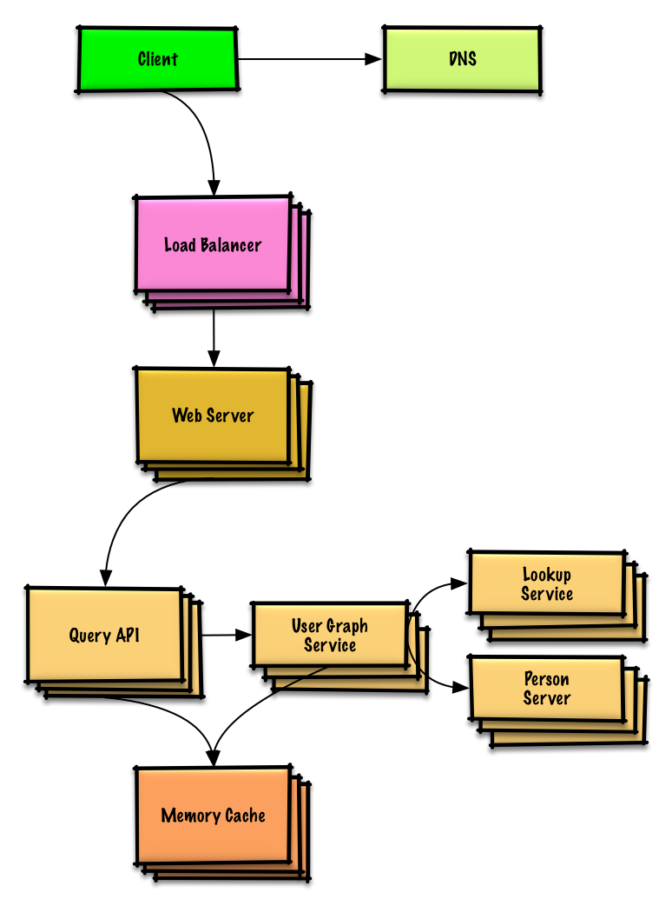
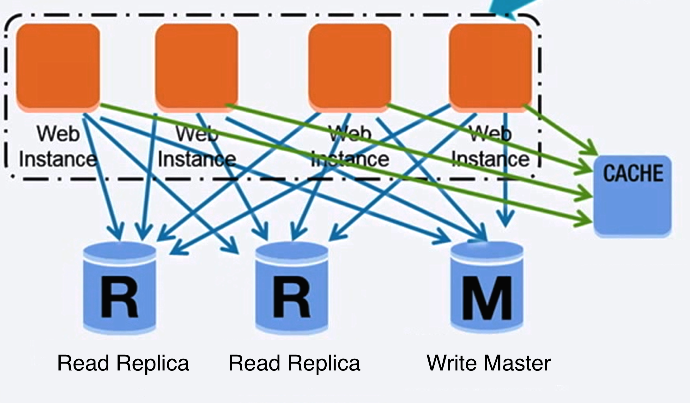
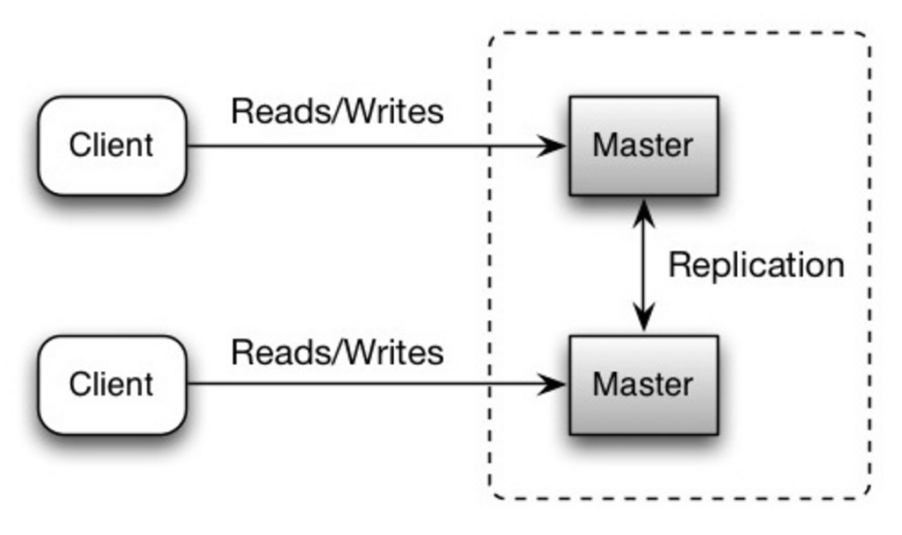
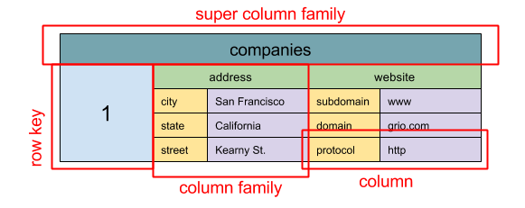
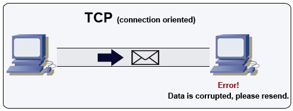

*[English](README.md) ∙ [日本語](README-ja.md) ∙ [简体中文](C ∙ [繁體中文](README-zh-TW.md) | [العَرَبِيَّة‎](https://github.com/donnemartin/system-design-primer/issues/170) ∙ [বাংলা](https://github.com/donnemartin/system-design-primer/issues/220) ∙ [Português do Brasil](https://github.com/donnemartin/system-design-primer/issues/40) ∙ [Deutsch](https://github.com/donnemartin/system-design-primer/issues/186) ∙ [ελληνικά](https://github.com/donnemartin/system-design-primer/issues/130) ∙ [עברית](https://github.com/donnemartin/system-design-primer/issues/272) ∙ [Italiano](https://github.com/donnemartin/system-design-primer/issues/104) ∙ [한국어](https://github.com/donnemartin/system-design-primer/issues/102) ∙ [فارسی](https://github.com/donnemartin/system-design-primer/issues/110) ∙ [Polski](https://github.com/donnemartin/system-design-primer/issues/68) ∙ [русский язык](https://github.com/donnemartin/system-design-primer/issues/87) ∙ [Español](https://github.com/donnemartin/system-design-primer/issues/136) ∙ [ภาษาไทย](https://github.com/donnemartin/system-design-primer/issues/187) ∙ [Türkçe](https://github.com/donnemartin/system-design-primer/issues/39) ∙ [tiếng Việt](https://github.com/donnemartin/system-design-primer/issues/127) ∙ [Français](https://github.com/donnemartin/system-design-primer/issues/250) . [Tamil](README-ta.md) | [Add Translation](https://github.com/donnemartin/system-design-primer/issues/28)*

**Help [translate](TRANSLATIONS.md) this guide!**

# The System Design Primer | சிஸ்டம் டிசைன் ப்ரைமர்

<p align="center">
  
  <br/>
</p>

## முயற்சி

> பெரிய அளவிலான அமைப்புகளை எப்படி வடிவமைப்பது என்பதை அறிக.
>
> கணினி வடிவமைப்பு நேர்காணலுக்கான தயாரிப்பு.
> ### பெரிய அளவிலான அமைப்புகளை எப்படி வடிவமைப்பது என்பதை அறிக

அளவிடக்கூடிய அமைப்புகளை எவ்வாறு வடிவமைப்பது என்பதைக் கற்றுக்கொள்வது, சிறந்த பொறியாளராக மாற உதவும்.

கணினி வடிவமைப்பு ஒரு பரந்த தலைப்பு. கணினி வடிவமைப்பு கொள்கைகளில் **இணையம் முழுவதும் பரந்த அளவிலான வளங்கள் உள்ளன**.

இந்த ரெப்போ என்பது ஒரு **ஒழுங்கமைக்கப்பட்ட சேகரிப்பு** ஆகும்

### திறந்த மூல சமூகத்திலிருந்து கற்றுக்கொள்ளுங்கள்

இது தொடர்ந்து புதுப்பிக்கப்பட்ட, திறந்த மூல திட்டமாகும்.

[பங்களிப்புகள்](#பங்களிப்பு) வரவேற்கிறோம்!

### கணினி வடிவமைப்பு நேர்காணலுக்கான தயாரிப்பு

குறியீட்டு நேர்காணல்களுடன் கூடுதலாக, கணினி வடிவமைப்பு என்பது பல தொழில்நுட்ப நிறுவனங்களில் **தொழில்நுட்ப நேர்காணல் செயல்முறை**யின் **தேவையான கூறு** ஆகும்.

**பொதுவான சிஸ்டம் வடிவமைப்பு நேர்காணல் கேள்விகளைப் பயிற்சி செய்யவும்** மற்றும் **உங்கள் முடிவுகளை **மாதிரி தீர்வுகளுடன் ஒப்பிடவும்**: விவாதங்கள், குறியீடு மற்றும் வரைபடங்கள்.

நேர்முகத் தயாரிப்புக்கான கூடுதல் தலைப்புகள்:
* [கல்வி வழிகாட்டி](#study-guide)
* [கணினி வடிவமைப்பு நேர்காணல் கேள்வியை எவ்வாறு அணுகுவது](#how-to-approach-a-system-design-interview-question)
* [System design interview questions, **with solutions**](#system-design-interview-questions-with-solutions)
* [பொருள் சார்ந்த வடிவமைப்பு நேர்காணல் கேள்விகள், **தீர்வுகளுடன்**](#object-oriented-design-interview-questions-with-solutions)
* [கூடுதல் கணினி வடிவமைப்பு நேர்காணல் கேள்விகள்](#additional-system-design-interview-questions)

## அங்கி ஃபிளாஷ் கார்டுகள்
<p align="center">
  
  <br/>
</p>
வழங்கப்பட்டுள்ள [Anki flashcard decks](https://apps.ankiweb.net/) முக்கிய சிஸ்டம் வடிவமைப்புக் கருத்துகளைத் தக்கவைக்க உங்களுக்கு உதவ, இடைவெளியில் திரும்பத் திரும்பப் பயன்படுத்துகிறது.
* [கணினி வடிவமைப்பு தளம்](https://github.com/donnemartin/system-design-primer/tree/master/resources/flash_cards/System%20Design.apkg)
* [கணினி வடிவமைப்பு பயிற்சிகள் தளம்](https://github.com/donnemartin/system-design-primer/tree/master/resources/flash_cards/System%20Design%20Exercises.apkg)
* [பொருள் சார்ந்த வடிவமைப்பு பயிற்சிகள் தளம்](https://github.com/donnemartin/system-design-primer/tree/master/resources/flash_cards/OO%20Design.apkg)

பயணத்தின் போது பயன்படுத்த சிறந்தது.

### குறியீட்டு ஆதாரம்: ஊடாடும் குறியீட்டு சவால்கள்

[**குறியீட்டு நேர்காணலுக்கு**](https://github.com/donnemartin/interactive-coding-challenges) தயாராவதற்கு உங்களுக்கு உதவ ஆதாரங்களைத் தேடுகிறீர்களா?
<p align="center">
  
  <br/>
</p>
சகோதரி ரெப்போவைப் பாருங்கள் [**ஊடாடும் குறியீட்டு சவால்கள்**](https://github.com/donnemartin/interactive-coding-challenges), இதில் கூடுதல் Anki டெக் உள்ளது:
. [Coding deck](https://github.com/donnemartin/interactive-coding-challenges/tree/master/anki_cards/Coding.apkg)
## பங்களிக்கிறது
> சமூகத்திலிருந்து கற்றுக்கொள்ளுங்கள்.

உதவிக்கு இழுக்கும் கோரிக்கைகளைச் சமர்ப்பிக்க தயங்க வேண்டாம்:

* பிழைகளை சரிசெய்யவும்
* பிரிவுகளை மேம்படுத்தவும்
* புதிய பிரிவுகளைச் சேர்க்கவும்
* [Translate](https://github.com/donnemartin/system-design-primer/issues/28)
சில மெருகூட்டல் தேவைப்படும் உள்ளடக்கம் [வளர்ச்சியில்] (#குறை வளர்ச்சி) வைக்கப்படுகிறது.

[பங்களிப்பு வழிகாட்டுதல்கள்] மதிப்பாய்வு செய்யவும்(CONTRIBUTING.md).
## கணினி வடிவமைப்பு தலைப்புகளின் அட்டவணை

> நன்மை தீமைகள் உட்பட பல்வேறு அமைப்பு வடிவமைப்பு தலைப்புகளின் சுருக்கங்கள்.  **எல்லாமே வியாபாரம்தான்**.
>
> ஒவ்வொரு பிரிவிலும் இன்னும் ஆழமான ஆதாரங்களுக்கான இணைப்புகள் உள்ளன.

<p align="center">
  
  <br/>
</p>


* [கணினி வடிவமைப்பு தலைப்புகள்: இங்கே தொடங்கவும்](#system-design-topics-start-here)
    * [படி 1: அளவிடுதல் வீடியோ விரிவுரையை மதிப்பாய்வு செய்யவும்](#படி-1-மதிப்பாய்வு-அளவிடல்-வீடியோ-விரிவுரை)
    * [படி 2: அளவிடுதல் கட்டுரையை மதிப்பாய்வு செய்யவும்](#படி-2-மதிப்பாய்வு-அளவிடல்-கட்டுரை)
    * [அடுத்த படிகள்](#அடுத்த-படிகள்)
* [செயல்திறன் மற்றும் அளவிடுதல்](#செயல்திறன்-எதிர்-அளவிடுதல்)
* [லேட்டன்சி vs த்ரோபுட்](#லேட்டன்சி-வுக்கு எதிராக-த்ரூபுட்)
* [கிடைக்கும் தன்மை மற்றும் நிலைத்தன்மை]
    * [CAP தேற்றம்](#cap-theorem)
        * [CP - நிலைத்தன்மை மற்றும் பகிர்வு சகிப்புத்தன்மை](#cp---நிலைத்தன்மை மற்றும் பகிர்வு-சகிப்புத்தன்மை)
        * [AP - கிடைக்கும் தன்மை மற்றும் பகிர்வு சகிப்புத்தன்மை](#ap--- கிடைக்கும் மற்றும் பகிர்வு-சகிப்புத்தன்மை)
* [நிலையான வடிவங்கள்](#நிலை-முறைகள்)
    * [பலவீனமான நிலைத்தன்மை](#பலவீனமான-நிலைத்தன்மை)
    * [இறுதி நிலைத்தன்மை](#இறுதி-நிலைத்தன்மை)
    * [வலுவான நிலைத்தன்மை](#strong-consistency)
* [கிடைக்கக்கூடிய வடிவங்கள்](#கிடைக்கக்கூடிய வடிவங்கள்)
    * [ஃபெயில்-ஓவர்](#ஃபெயில்-ஓவர்)
    * [பிரதி](#பிரதி)
    * [எண்களில் கிடைக்கும்](#எண்களில் கிடைக்கும்)
* [டொமைன் பெயர் அமைப்பு](#டொமைன்-நேம்-சிஸ்டம்)
* [உள்ளடக்க விநியோக நெட்வொர்க்](#content-delivery-network)
    * [புஷ் சிடிஎன்கள்](#புஷ்-சிடிஎன்ஸ்)
    * [சிடிஎன்களை இழுக்கவும்](#புல்-சிடிஎன்ஸ்)
* [லோட் பேலன்சர்](#லோட் பேலன்சர்)
    * [செயலில்-செயலற்ற](#செயலில்-செயலற்ற)
    * [செயலில்-செயலில்](#செயலில்-செயலில்)
    * [அடுக்கு 4 சுமை சமநிலை](#லேயர்-4-லோட்-பேலன்சிங்)
    * [லேயர் 7 சுமை சமநிலை](#லேயர்-7-லோட்-பேலன்சிங்)
    * [கிடைமட்ட அளவிடுதல்](#கிடைமட்ட அளவிடுதல்)
* [தலைகீழ் ப்ராக்ஸி (வலை சேவையகம்)](#ரிவர்ஸ்-ப்ராக்ஸி-வெப்-சர்வர்)
    * [லோட் பேலன்சர் vs ரிவர்ஸ் ப்ராக்ஸி](#load-balancer-vs-reverse-proxy)
* [பயன்பாட்டு அடுக்கு](#பயன்பாடு-அடுக்கு)
    * [மைக்ரோ சர்வீசஸ்](#மைக்ரோ சர்வீசஸ்)
    * [சேவை கண்டுபிடிப்பு](#சேவை-கண்டுபிடிப்பு)
* [தரவுத்தளம்](#தரவுத்தளம்)
    * [தொடர்பு தரவுத்தள மேலாண்மை அமைப்பு (RDBMS)](#relational-database-management-system-rdbms)
        * [மாஸ்டர்-ஸ்லேவ் ரெப்ளிகேஷன்](#மாஸ்டர்-ஸ்லேவ்-பிரதிபலிப்பு)
        * [மாஸ்டர்-மாஸ்டர் ரெப்ளிகேஷன்](#மாஸ்டர்-மாஸ்டர்-பிரதிபலிப்பு)
        * [கூட்டமைப்பு](#கூட்டமைப்பு)
        * [ஷார்டிங்](#ஷார்டிங்)
        * [டிநார்மலைசேஷன்](#நார்மலாக்கம்)
        * [SQL ட்யூனிங்](#sql-tuning)
    * [NoSQL](#nosql)
        * [முக்கிய மதிப்பு கடை](#முக்கிய மதிப்பு கடை)
        * [ஆவணக் கடை](#ஆவணக் கடை)
        * [பரந்த நெடுவரிசைக் கடை](#அகல-நெடுவரிசை-கடை)
        * [வரைபட தரவுத்தளம்](#வரைபட தரவுத்தளம்)
    * [SQL அல்லது NoSQL](#sql-or-nosql)
* [கேச்](#கேச்)
    * [கிளையண்ட் கேச்சிங்](#கிளையண்ட்-கேச்சிங்)
    * [சிடிஎன் கேச்சிங்](#சிடிஎன்-கேச்சிங்)
    * [இணைய சேவையக கேச்சிங்](#வலை சேவையகம்-கேச்சிங்)
    * [டேட்டாபேஸ் கேச்சிங்](#டேட்டாபேஸ்-கேச்சிங்)
    * [பயன்பாடு கேச்சிங்](#பயன்பாடு-கேச்சிங்)
    * [தரவுத்தள வினவல் மட்டத்தில் கேச்சிங்](#கேச்சிங்-அட்-டேட்டாபேஸ்-வினவல்-நிலை)
    * [பொருள் மட்டத்தில் கேச்சிங்](#பொருள்-நிலையில் கேச்சிங்)
    * [தேக்ககத்தை எப்போது புதுப்பிக்க வேண்டும்](#கேச்-ஐ எப்போது புதுப்பிக்க வேண்டும்)
        * [கேச்-அசைட்](#கேச்-அசைட்)
        * [எழுது-மூலம்](#எழுது-மூலம்)
        * [எழுது-பின்னால் (எழுது-திரும்ப)](#எழுத-பின்-எழுத-திரும்ப)
        * [புதுப்பித்தல்-முன்பு](#புதுப்பிப்பு-முன்பு)
* [அசின்க்ரோனிசம்](#அசின்க்ரோனிசம்)
    * [செய்தி வரிசைகள்](#செய்தி-வரிசைகள்)
    * [பணி வரிசைகள்](#பணி-வரிசைகள்)
    * [முதுகு அழுத்தம்](#முதுகு அழுத்தம்)
* [தொடர்பு](#தொடர்பு)
    * [டிரான்ஸ்மிஷன் கண்ட்ரோல் புரோட்டோகால் (TCP)](#transmission-control-protocol-tcp)
    * [பயனர் டேட்டாகிராம் புரோட்டோகால் (UDP)](#user-datagram-protocol-udp)
    * [தொலைநிலை நடைமுறை அழைப்பு (RPC)](#remote-procedure-call-rpc)
    * [பிரதிநிதித்துவ மாநில பரிமாற்றம் (REST)](#பிரதிநிதித்துவ-மாநில-பரிமாற்றம்-ஓய்வு)
* [பாதுகாப்பு](#பாதுகாப்பு)
* [இணைப்பு](#பின் இணைப்பு)
    * [இரண்டு அட்டவணையின் அதிகாரங்கள்](#பவர்ஸ் ஆஃப் டூ டேபிள்)
    * [ஒவ்வொரு புரோகிராமரும் தெரிந்து கொள்ள வேண்டிய லேட்டன்சி எண்கள்](#லேட்டன்சி-எண்கள்-ஒவ்வொரு புரோகிராமரும்-தெரிந்து கொள்ள வேண்டும்)
    * [கூடுதல் கணினி வடிவமைப்பு நேர்காணல் கேள்விகள்](#கூடுதல்-அமைப்பு-வடிவமைப்பு-நேர்காணல்-கேள்விகள்)
    * [உண்மையான உலக கட்டிடக்கலை](#நிஜ உலக கட்டிடக்கலை)
    * [நிறுவன கட்டமைப்புகள்](#நிறுவனம்-கட்டமைப்புகள்)
    * [நிறுவனத்தின் பொறியியல் வலைப்பதிவுகள்](#கம்பெனி-பொறியியல்-வலைப்பதிவுகள்)
* [வளர்ச்சியில் உள்ளது](#அபிவிருத்தியின் கீழ்)
* [வரவுகள்](#வரவுகள்)
* [தொடர்புத் தகவல்](#தொடர்புத் தகவல்)
* [உரிமம்](#உரிமம்)


## கல்வி வழிகாட்டி
> உங்கள் நேர்காணல் காலவரிசையின் (குறுகிய, நடுத்தர, நீண்ட) அடிப்படையில் மதிப்பாய்வு செய்ய பரிந்துரைக்கப்பட்ட தலைப்புகள்.
> 
> **கே: நேர்காணல்களுக்கு, நான் இங்கே அனைத்தையும் தெரிந்து கொள்ள வேண்டுமா?**

**ப: இல்லை, நேர்காணலுக்குத் தயாராவதற்கு நீங்கள் இங்கே அனைத்தையும் தெரிந்து கொள்ள வேண்டியதில்லை**.
ஒரு நேர்காணலில் உங்களிடம் கேட்கப்படுவது போன்ற மாறிகளைப் பொறுத்தது:

* உங்களுக்கு எவ்வளவு அனுபவம் இருக்கிறது
* உங்கள் தொழில்நுட்ப பின்னணி என்ன
* எந்தெந்த பதவிகளுக்கு நேர்காணல் செய்கிறீர்கள்
* எந்தெந்த நிறுவனங்களுடன் நேர்காணல் செய்கிறீர்கள்
* அதிர்ஷ்டம்

அதிக அனுபவம் வாய்ந்த விண்ணப்பதாரர்கள் பொதுவாக கணினி வடிவமைப்பைப் பற்றி மேலும் அறிந்து கொள்வார்கள் என்று எதிர்பார்க்கப்படுகிறது. தனிப்பட்ட பங்களிப்பாளர்களை விட கட்டிடக் கலைஞர்கள் அல்லது குழுத் தலைவர்கள் அதிகம் அறிந்திருப்பார்கள் என்று எதிர்பார்க்கலாம். சிறந்த தொழில்நுட்ப நிறுவனங்கள் ஒன்று அல்லது அதற்கு மேற்பட்ட வடிவமைப்பு நேர்காணல் சுற்றுகளைக் கொண்டிருக்கும்.

அகலமாகத் தொடங்கி ஒரு சில பகுதிகளில் ஆழமாகச் செல்லவும். பல்வேறு முக்கிய கணினி வடிவமைப்பு தலைப்புகளைப் பற்றி கொஞ்சம் தெரிந்துகொள்ள இது உதவுகிறது. உங்கள் காலக்கெடு, அனுபவம், எந்தெந்த பதவிகளுக்கு நேர்காணல் செய்கிறீர்கள், எந்தெந்த நிறுவனங்களுடன் நேர்காணல் செய்கிறீர்கள் என்பதன் அடிப்படையில் பின்வரும் வழிகாட்டியைச் சரிசெய்யவும்.

* **குறுகிய காலவரிசை** - கணினி வடிவமைப்பு தலைப்புகளுடன் **அகலம்**க்கான நோக்கம். **சில** நேர்காணல் கேள்விகளைத் தீர்ப்பதன் மூலம் பயிற்சி செய்யுங்கள்.
* **நடுத்தர காலவரிசை** - கணினி வடிவமைப்பு தலைப்புகளுடன் **அகலம்** மற்றும் **சிறிது ஆழம்** ஆகியவற்றை நோக்கமாகக் கொண்டது. **பல** நேர்காணல் கேள்விகளைத் தீர்ப்பதன் மூலம் பயிற்சி செய்யுங்கள்.
* **நீண்ட காலவரிசை** - கணினி வடிவமைப்பு தலைப்புகளுடன் **அகலம்** மற்றும் **அதிக ஆழம்**. **பெரும்பாலான** நேர்காணல் கேள்விகளைத் தீர்ப்பதன் மூலம் பயிற்சி செய்யுங்கள்.

| | குறுகிய | நடுத்தர | நீண்ட |
|---|---|---|---|
| கணினிகள் எவ்வாறு செயல்படுகின்றன என்பதைப் பற்றிய விரிவான புரிதலைப் பெற [கணினி வடிவமைப்பு தலைப்புகள்](#இன்டெக்ஸ்-ஆஃப்-சிஸ்டம்-டிசைன்-தலைப்புகள்) மூலம் படிக்கவும் | :+1: | :+1: | :+1: |
| நீங்கள் நேர்காணல் செய்யும் நிறுவனங்களுக்கான [கம்பெனி இன்ஜினியரிங் வலைப்பதிவுகளில்](#கம்பெனி-பொறியியல்-வலைப்பதிவுகள்) சில கட்டுரைகளைப் படிக்கவும் | :+1: | :+1: | :+1: |
| சில [உண்மையான உலக கட்டிடக்கலை](#உலக-கட்டமைப்புகள்) மூலம் படிக்கவும் | :+1: | :+1: | :+1: |
| மதிப்பாய்வு [கணினி வடிவமைப்பு நேர்காணல் கேள்வியை எப்படி அணுகுவது](#எப்படி-அணுகுவது-ஒரு-சிஸ்டம்-வடிவமைப்பு-நேர்காணல்-கேள்வி) | :+1: | :+1: | :+1: |
| [கணினி வடிவமைப்பு நேர்காணல் கேள்விகள் தீர்வுகளுடன்] (#system-design-interview-quesions-with-solutions) மூலம் வேலை செய்யுங்கள் | சில | பல | பெரும்பாலான |
| [பொருள் சார்ந்த வடிவமைப்பு நேர்காணல் கேள்விகள் தீர்வுகளுடன்] (#பொருள் சார்ந்த வடிவமைப்பு-நேர்காணல்-கேள்விகள்-தீர்வுகளுடன்) | சில | பல | பெரும்பாலான |
| மதிப்பாய்வு [கூடுதல் கணினி வடிவமைப்பு நேர்காணல் கேள்விகள்](#கூடுதல்-அமைப்பு-வடிவமைப்பு-நேர்காணல்-கேள்விகள்) | சில | பல | பெரும்பாலான |

## கணினி வடிவமைப்பு நேர்காணல் கேள்வியை எவ்வாறு அணுகுவது

> கணினி வடிவமைப்பு நேர்காணல் கேள்வியை எவ்வாறு சமாளிப்பது.

கணினி வடிவமைப்பு நேர்காணல் ஒரு **திறந்த உரையாடலாகும்**. நீங்கள் அதை வழிநடத்துவீர்கள் என்று எதிர்பார்க்கப்படுகிறது.

விவாதத்தை வழிநடத்த பின்வரும் படிகளைப் பயன்படுத்தலாம். இந்த செயல்முறையை உறுதிப்படுத்த உதவ, பின்வரும் படிகளைப் பயன்படுத்தி [கணினி வடிவமைப்பு நேர்காணல் கேள்விகள் தீர்வுகளுடன்](#system-design-interview-quesions-with-solutions) பிரிவின் மூலம் வேலை செய்யுங்கள்.

### படி 1: பயன்பாட்டு வழக்குகள், கட்டுப்பாடுகள் மற்றும் அனுமானங்களை கோடிட்டுக் காட்டுங்கள்

தேவைகளைச் சேகரித்து சிக்கலைக் கண்டறியவும். பயன்பாட்டு வழக்குகள் மற்றும் தடைகளைத் தெளிவுபடுத்த கேள்விகளைக் கேளுங்கள். அனுமானங்களைப் பற்றி விவாதிக்கவும்.

* அதைப் பயன்படுத்தப் போவது யார்?
* அதை எப்படிப் பயன்படுத்தப் போகிறார்கள்?
* எத்தனை பயனர்கள் உள்ளனர்?
* அமைப்பு என்ன செய்கிறது?
* கணினியின் உள்ளீடுகள் மற்றும் வெளியீடுகள் என்ன?
* எவ்வளவு டேட்டாவை கையாள வேண்டும் என்று எதிர்பார்க்கிறோம்?
* ஒரு வினாடிக்கு எத்தனை கோரிக்கைகளை எதிர்பார்க்கிறோம்?
*எதிர்பார்க்கும் படிக்கும் எழுத்து விகிதம் என்ன?

### படி 2: உயர்நிலை வடிவமைப்பை உருவாக்கவும்

அனைத்து முக்கிய கூறுகளுடன் உயர் மட்ட வடிவமைப்பை கோடிட்டுக் காட்டுங்கள்.

* முக்கிய கூறுகள் மற்றும் இணைப்புகளை வரையவும்
* உங்கள் எண்ணங்களை நியாயப்படுத்துங்கள்

### படி 3: முக்கிய கூறுகளை வடிவமைக்கவும்

ஒவ்வொரு முக்கிய கூறுகளின் விவரங்களுக்கு முழுக்கு. எடுத்துக்காட்டாக, நீங்கள் [URL சுருக்குதல் சேவையை வடிவமைக்க](solutions/system_design/pastebin/README.md) கேட்கப்பட்டால், விவாதிக்கவும்:

* முழு url இன் ஹாஷை உருவாக்குதல் மற்றும் சேமித்தல்
    * [MD5](solutions/system_design/pastebin/README.md) மற்றும் [Base62](solutions/system_design/pastebin/README.md)
    * ஹாஷ் மோதல்கள்
    * SQL அல்லது NoSQL
    * தரவுத்தளத் திட்டம்
* ஹாஷ் செய்யப்பட்ட urlஐ முழு urlக்கு மொழிபெயர்த்தல்
    * தரவுத்தள தேடல்
* API மற்றும் பொருள் சார்ந்த வடிவமைப்பு

### படி 4: வடிவமைப்பை அளவிடவும்

தடைகளைக் கண்டறிந்து, தடைகளுக்கு தீர்வு காணவும். எடுத்துக்காட்டாக, அளவிடுதல் சிக்கல்களைத் தீர்க்க உங்களுக்கு பின்வருபவை தேவையா?

* லோட் பேலன்சர்
* கிடைமட்ட அளவிடுதல்
* கேச்சிங்
* தரவுத்தள பகிர்வு

சாத்தியமான தீர்வுகள் மற்றும் வர்த்தக பரிமாற்றங்களைப் பற்றி விவாதிக்கவும். எல்லாமே வியாபாரம்தான். [அளவிடக்கூடிய கணினி வடிவமைப்பின் கோட்பாடுகள்] (#அமைப்பு-வடிவமைப்பு-தலைப்புகளின் குறியீட்டு) பயன்படுத்தி இடையூறுகளைச் சரிசெய்யவும்.

### உறையின் பின் கணக்கீடுகள்

கையால் சில மதிப்பீடுகளைச் செய்யும்படி நீங்கள் கேட்கப்படலாம். பின்வரும் ஆதாரங்களுக்கு [இணைப்பு](#பின் இணைப்பு) பார்க்கவும்:

* [உறை கணக்கீடுகளின் பின்புறத்தைப் பயன்படுத்தவும்](http://highscalability.com/blog/2011/1/26/google-pro-tip-use-back-of-the-envelope-calculations-to-choo.html)
* [இரண்டு அட்டவணையின் அதிகாரங்கள்](#பவர்ஸ் ஆஃப் டூ டேபிள்)
* [ஒவ்வொரு புரோகிராமரும் தெரிந்து கொள்ள வேண்டிய லேட்டன்சி எண்கள்](#லேட்டன்சி-எண்கள்-ஒவ்வொரு புரோகிராமரும்-தெரிந்து கொள்ள வேண்டும்)

### ஆதாரம்(கள்) மற்றும் மேலதிக வாசிப்பு

என்ன எதிர்பார்க்கலாம் என்பது பற்றிய சிறந்த யோசனையைப் பெற பின்வரும் இணைப்புகளைப் பார்க்கவும்:

* [கணினி வடிவமைப்பு நேர்காணலை எவ்வாறு உருவாக்குவது](https://www.palantir.com/2011/10/how-to-rock-a-systems-design-interview/)
* [கணினி வடிவமைப்பு நேர்காணல்](http://www.hiredintech.com/system-design)
* [கட்டிடக்கலை மற்றும் சிஸ்டம்ஸ் வடிவமைப்பு நேர்காணலுக்கான அறிமுகம்](https://www.youtube.com/watch?v=ZgdS0EUmn70)
* [கணினி வடிவமைப்பு டெம்ப்ளேட்](https://leetcode.com/discuss/career/229177/My-System-Design-Template)

## தீர்வுகளுடன் கூடிய சிஸ்டம் டிசைன் நேர்காணல் கேள்விகள்

> மாதிரி விவாதங்கள், குறியீடு மற்றும் வரைபடங்களுடன் பொதுவான கணினி வடிவமைப்பு நேர்காணல் கேள்விகள்.
>
> `solutions/` கோப்புறையில் உள்ள உள்ளடக்கத்துடன் தீர்வுகள் இணைக்கப்பட்டுள்ளன.

| கேள்வி | |
|---|---|
| வடிவமைப்பு Pastebin.com (அல்லது Bit.ly) | [தீர்வு](solutions/system_design/pastebin/README.md) |
| Twitter டைம்லைனை வடிவமைத்து தேடவும் (அல்லது Facebook ஊட்டம் மற்றும் தேடல்) | [தீர்வு](solutions/system_design/twitter/README.md) |
| ஒரு வலை கிராலர் வடிவமைப்பு | [தீர்வு](solutions/system_design/web_crawler/README.md) |
| வடிவமைப்பு Mint.com | [தீர்வு](solutions/system_design/mint/README.md) |
| ஒரு சமூக வலைப்பின்னலுக்கான தரவு கட்டமைப்புகளை வடிவமைக்கவும் | [தீர்வு](தீர்வுகள்/system_design/social_graph/README.md) |
| ஒரு தேடுபொறிக்கான முக்கிய மதிப்பு கடையை வடிவமைத்தல் | [தீர்வு](solutions/system_design/query_cache/README.md) |
| வகை அம்சத்தின் அடிப்படையில் Amazon இன் விற்பனை தரவரிசையை வடிவமைக்கவும் | [தீர்வு](தீர்வுகள்/system_design/sales_rank/README.md) |
| AWS இல் மில்லியன் கணக்கான பயனர்களை அளவிடும் ஒரு அமைப்பை வடிவமைக்கவும் | [தீர்வு](solutions/system_design/scaling_aws/README.md) |
| சிஸ்டம் டெஸைச் சேர்க்கவும்ign கேள்வி | [பங்களிக்கவும்](#பங்களிப்பு) |

### வடிவமைப்பு Pastebin.com (அல்லது Bit.ly)

[உடற்பயிற்சி மற்றும் தீர்வைக் காண்க](solutions/system_design/pastebin/README.md)


### ட்விட்டர் காலவரிசையை வடிவமைத்து தேடுங்கள் (அல்லது Facebook ஊட்டம் மற்றும் தேடல்)

[உடற்பயிற்சி மற்றும் தீர்வைக் காண்க](solutions/system_design/twitter/README.md)


### வலை கிராலரை வடிவமைக்கவும்

[உடற்பயிற்சி மற்றும் தீர்வைக் காண்க](solutions/system_design/web_crawler/README.md)


### Design Mint.com

[உடற்பயிற்சி மற்றும் தீர்வைக் காண்க](solutions/system_design/mint/README.md)


### ஒரு சமூக வலைப்பின்னலுக்கான தரவு கட்டமைப்புகளை வடிவமைக்கவும்

[உடற்பயிற்சி மற்றும் தீர்வைக் காண்க](தீர்வுகள்/system_design/social_graph/README.md)



### ஒரு தேடுபொறிக்கான முக்கிய மதிப்பு கடையை வடிவமைக்கவும்

[உடற்பயிற்சி மற்றும் தீர்வைக் காண்க](solutions/system_design/query_cache/README.md)


### அமேசானின் விற்பனை தரவரிசையை வகை அம்சத்தின்படி வடிவமைக்கவும்

[உடற்பயிற்சி மற்றும் தீர்வைக் காண்க](தீர்வுகள்/system_design/sales_rank/README.md)


### AWS இல் மில்லியன் கணக்கான பயனர்களை அளவிடும் ஒரு அமைப்பை வடிவமைக்கவும்

[உடற்பயிற்சி மற்றும் தீர்வைக் காண்க](solutions/system_design/scaling_aws/README.md)


## பொருள் சார்ந்த வடிவமைப்பு நேர்காணல் கேள்விகள் தீர்வுகளுடன்

> மாதிரி விவாதங்கள், குறியீடு மற்றும் வரைபடங்களுடன் பொதுவான பொருள் சார்ந்த வடிவமைப்பு நேர்காணல் கேள்விகள்.
>
> `solutions/` கோப்புறையில் உள்ள உள்ளடக்கத்துடன் தீர்வுகள் இணைக்கப்பட்டுள்ளன.

>**குறிப்பு: இந்தப் பிரிவு வளர்ச்சியில் உள்ளது**

| கேள்வி | |
|---|---|
| ஹாஷ் வரைபடத்தை வடிவமைக்கவும் | [தீர்வு](தீர்வுகள்/பொருள்_சார்ந்த_வடிவமைப்பு/hash_table/hash_map.ipynb) |
| குறைந்தது சமீபத்தில் பயன்படுத்தப்பட்ட தற்காலிக சேமிப்பை வடிவமைக்கவும் | [தீர்வு](தீர்வுகள்/பொருள்_சார்ந்த_வடிவமைப்பு/lru_cache/lru_cache.ipynb) |
| ஒரு கால் சென்டரை வடிவமைக்கவும் | [தீர்வு](தீர்வுகள்/பொருள்_சார்ந்த_வடிவமைப்பு/call_center/call_center.ipynb) |
| அட்டைகளின் தளத்தை வடிவமைக்கவும் | [தீர்வு](தீர்வுகள்/பொருள்_சார்ந்த_வடிவமைப்பு/deck_of_cards/deck_of_cards.ipynb) |
| வாகன நிறுத்துமிடத்தை வடிவமைத்தல் | [தீர்வு](தீர்வுகள்/பொருள்_சார்ந்த_வடிவமைப்பு/பார்க்கிங்_லாட்/parking_lot.ipynb) |
| அரட்டை சேவையகத்தை வடிவமைக்கவும் | [தீர்வு](தீர்வுகள்/பொருள்_சார்ந்த_வடிவமைப்பு/online_chat/online_chat.ipynb) |
| ஒரு வட்ட வரிசையை வடிவமைக்கவும் | [பங்களிக்கவும்](#பங்களிப்பு) |
| பொருள் சார்ந்த வடிவமைப்பு கேள்வியைச் சேர்க்கவும் | [பங்களிக்கவும்](#பங்களிப்பு) |

## கணினி வடிவமைப்பு தலைப்புகள்: இங்கே தொடங்கவும்

கணினி வடிவமைப்பில் புதியதா?

முதலில், பொதுவான கொள்கைகள், அவை என்ன, அவை எவ்வாறு பயன்படுத்தப்படுகின்றன, அவற்றின் நன்மை தீமைகள் ஆகியவற்றைப் பற்றிய அடிப்படை புரிதல் உங்களுக்குத் தேவைப்படும்.

### படி 1: அளவிடுதல் வீடியோ விரிவுரையை மதிப்பாய்வு செய்யவும்

[ஹார்வர்டில் அளவிடுதல் விரிவுரை](https://www.youtube.com/watch?v=-W9F__D3oY4)

* உள்ளடக்கப்பட்ட தலைப்புகள்:
    * செங்குத்து அளவிடுதல்
    * கிடைமட்ட அளவிடுதல்
    * கேச்சிங்
    * சுமை சமநிலை
    * தரவுத்தள நகல்
    * தரவுத்தள பகிர்வு

### படி 2: அளவிடுதல் கட்டுரையை மதிப்பாய்வு செய்யவும்

[அளவிடுதல்](http://www.lecloud.net/tagged/scalability/chrono)

* உள்ளடக்கப்பட்ட தலைப்புகள்:
    * [குளோன்ஸ்](http://www.lecloud.net/post/7295452622/scalability-for-dummies-part-1-clones)
    * [தரவுத்தளங்கள்](http://www.lecloud.net/post/7994751381/scalability-for-dummies-part-2-database)
    * [கேச்கள்](http://www.lecloud.net/post/9246290032/scalability-for-dummies-part-3-cache)
    * [Asynchronism](http://www.lecloud.net/post/9699762917/scalability-for-dummies-part-4-asynchronism)

### அடுத்த படிகள்

அடுத்து, உயர்நிலை வர்த்தக பரிமாற்றங்களைப் பார்ப்போம்:

* **செயல்திறன்** எதிராக ** அளவிடுதல்**
* **தாமதம்** எதிராக **த்ரூபுட்**
* **கிடைக்கும்** எதிராக **நிலைத்தன்மை**

**எல்லாம் ஒரு பரிவர்த்தனை** என்பதை நினைவில் கொள்ளுங்கள்.

பிறகு, DNS, CDNகள் மற்றும் லோட் பேலன்சர்கள் போன்ற இன்னும் குறிப்பிட்ட தலைப்புகளில் முழுக்கு போடுவோம்.

## செயல்திறன் மற்றும் அளவிடுதல்

ஒரு சேவையானது **அளவிடக்கூடியது** அது அதிகரித்த **செயல்திறன்** ஆதாரங்களுக்கு விகிதாசாரமாக இருந்தால். பொதுவாக, செயல்திறனை அதிகரிப்பது என்பது அதிக வேலை அலகுகளுக்கு சேவை செய்வதாகும், ஆனால் தரவுத்தொகுப்புகள் வளரும்போது, ​​பெரிய அளவிலான வேலைகளைக் கையாளவும் முடியும்.<sup><a href=http://www.allthingsdistributed.com/2006/03/ a_word_on_scalability.html>1</a></sup>

செயல்திறன் மற்றும் அளவிடுதல் ஆகியவற்றைப் பார்க்க மற்றொரு வழி:

* உங்களுக்கு **செயல்திறன்** சிக்கல் இருந்தால், உங்கள் கணினி ஒரு பயனருக்கு மெதுவாக இருக்கும்.
**அளவிடுதல்** சிக்கல் இருந்தால், உங்கள் கணினி ஒரு பயனருக்கு வேகமாக இருக்கும், ஆனால் அதிக சுமையின் கீழ் மெதுவாக இருக்கும்.

### ஆதாரம்(கள்) மற்றும் மேலதிக வாசிப்பு

* [அளவிடுதல் பற்றிய ஒரு சொல்](http://www.allthingsdistributed.com/2006/03/a_word_on_scalability.html)
* [அளவிடுதல், கிடைக்கும் தன்மை, நிலைப்புத்தன்மை, வடிவங்கள்](http://www.slideshare.net/jboner/scalability-availability-stability-patterns/)

## தாமதம் மற்றும் செயல்திறன்

**தாமதம்** என்பது சில செயல்களைச் செய்ய அல்லது சில முடிவுகளைத் தரும் நேரம்.

**மூலம்** என்பது ஒரு யூனிட் நேரத்திற்கு இதுபோன்ற செயல்கள் அல்லது முடிவுகளின் எண்ணிக்கை.

பொதுவாக, நீங்கள் **அதிகபட்ச செயல்திறனை** **ஏற்றுக்கொள்ளக்கூடிய தாமதத்துடன்** நோக்க வேண்டும்.

### ஆதாரம்(கள்) மற்றும் மேலதிக வாசிப்பு

* [தாமதத்தையும் செயல்திறனையும் புரிந்துகொள்வது](https://community.cadence.com/cadence_blogs_8/b/sd/archive/2010/09/13/understanding-latency-vs-throughput)

## கிடைக்கும் தன்மை vs நிலைத்தன்மை

### CAP தேற்றம்

<p align="center">
  
  <br/>
  <i><a href=http://robertgreiner.com/2014/08/cap-theorem-revisited>ஆதாரம்: CAP தேற்றம் மறுபரிசீலனை செய்யப்பட்டது</a></i>
</p>

விநியோகிக்கப்பட்ட கணினி அமைப்பில், பின்வரும் இரண்டு உத்தரவாதங்களை மட்டுமே நீங்கள் ஆதரிக்க முடியும்:

* **நிலைத்தன்மை** - ஒவ்வொரு வாசிப்பும் மிக சமீபத்திய எழுத்து அல்லது பிழையைப் பெறுகிறது
* **கிடைக்கும்** - ஒவ்வொரு கோரிக்கையும் பதிலைப் பெறுகிறது, அது தகவலின் சமீபத்திய பதிப்பைக் கொண்டுள்ளது என்பதற்கான உத்தரவாதம் இல்லாமல்
* **பகிர்வு சகிப்புத்தன்மை** - நெட்வொர்க் தோல்விகள் காரணமாக தன்னிச்சையான பகிர்வு இருந்தாலும் கணினி தொடர்ந்து இயங்குகிறது

*நெட்வொர்க்குகள் நம்பகமானவை அல்ல, எனவே நீங்கள் பகிர்வு சகிப்புத்தன்மையை ஆதரிக்க வேண்டும். நிலைத்தன்மைக்கும் கிடைக்கும் தன்மைக்கும் இடையே நீங்கள் மென்பொருள் பரிமாற்றத்தை மேற்கொள்ள வேண்டும்.*

#### CP - நிலைத்தன்மை மற்றும் பகிர்வு சகிப்புத்தன்மை

பகிர்ந்த முனையிலிருந்து பதிலுக்காகக் காத்திருப்பது காலாவதி பிழையை ஏற்படுத்தக்கூடும். உங்கள் வணிகத் தேவைகளுக்கு அணு வாசிப்பு மற்றும் எழுதுதல் தேவைப்பட்டால் CP ஒரு நல்ல தேர்வாகும்.

#### AP - கிடைக்கும் தன்மை மற்றும் பகிர்வு சகிப்புத்தன்மை

பதில்கள் எந்த முனையிலும் கிடைக்கும் தரவின் மிக எளிதாகக் கிடைக்கும் பதிப்பை வழங்கும், இது சமீபத்தியதாக இருக்காது. பகிர்வு தீர்க்கப்படும் போது எழுதுதல்கள் பிரச்சாரம் செய்ய சிறிது நேரம் ஆகலாம்.

வணிகத் தேவைகள் [இறுதி நிலைத்தன்மை] (#இறுதி-நிலைத்தன்மை) அல்லது வெளிப்புறப் பிழைகள் இருந்தபோதிலும் கணினி தொடர்ந்து செயல்பட வேண்டும் எனில், AP ஒரு நல்ல தேர்வாகும்.

### ஆதாரம்(கள்) மற்றும் மேலதிக வாசிப்பு

* [CAP தேற்றம் மறுபரிசீலனை செய்யப்பட்டது](http://robertgreiner.com/2014/08/cap-theorem-revisited/)
* [CAP தேற்றத்திற்கு ஒரு எளிய ஆங்கில அறிமுகம்](http://ksat.me/a-plain-english-introduction-to-cap-theorem)
* [CAP FAQ](https://github.com/henryr/cap-faq)
* [CAP தேற்றம்](https://www.youtube.com/watch?v=k-Yaq8AHlFA)

## நிலைத்தன்மை வடிவங்கள்

ஒரே தரவின் பல நகல்களுடன், அவற்றை எவ்வாறு ஒத்திசைக்க வேண்டும் என்பதற்கான விருப்பங்களை நாங்கள் எதிர்கொள்கிறோம், அதனால் வாடிக்கையாளர்கள் தரவைப் பற்றிய நிலையான பார்வையைப் பெறுவார்கள். [CAP தேற்றம்](#cap-theorem) இலிருந்து நிலைத்தன்மையின் வரையறையை நினைவுபடுத்தவும் - ஒவ்வொரு வாசிப்பும் மிக சமீபத்திய எழுத்து அல்லது பிழையைப் பெறுகிறது.

### பலவீனமான நிலைத்தன்மை

எழுதிய பிறகு, படித்தவர்கள் பார்க்கலாம் அல்லது பார்க்காமல் போகலாம். ஒரு சிறந்த முயற்சி அணுகுமுறை எடுக்கப்படுகிறது.

இந்த அணுகுமுறை memcached போன்ற அமைப்புகளில் காணப்படுகிறது. VoIP, வீடியோ அரட்டை மற்றும் நிகழ்நேர மல்டிபிளேயர் கேம்கள் போன்ற நிகழ்நேர பயன்பாட்டு நிகழ்வுகளில் பலவீனமான நிலைத்தன்மை நன்றாக வேலை செய்கிறது. எடுத்துக்காட்டாக, நீங்கள் ஒரு தொலைபேசி அழைப்பில் இருந்து சில நொடிகள் வரவேற்பை இழந்தால், மீண்டும் இணைப்பைப் பெறும்போது, ​​இணைப்பு இழப்பின் போது என்ன பேசப்பட்டது என்பதை நீங்கள் கேட்க மாட்டீர்கள்.

### இறுதி நிலைத்தன்மை

எழுதப்பட்ட பிறகு, படித்தவர்கள் இறுதியில் அதைப் பார்க்கும் (பொதுவாக மில்லி விநாடிகளுக்குள்). தரவு ஒத்திசைவற்ற முறையில் நகலெடுக்கப்படுகிறது.

இந்த அணுகுமுறை DNS மற்றும் மின்னஞ்சல் போன்ற அமைப்புகளில் காணப்படுகிறது. மிகவும் கிடைக்கக்கூடிய அமைப்புகளில் இறுதி நிலைத்தன்மை நன்றாக வேலை செய்கிறது.

### வலுவான நிலைத்தன்மை

எழுதிய பிறகு, படித்தவர்கள் பார்க்கிறார்கள். தரவு ஒத்திசைவாக நகலெடுக்கப்படுகிறது.

இந்த அணுகுமுறை கோப்பு முறைமைகள் மற்றும் RDBMSகளில் காணப்படுகிறது. பரிவர்த்தனைகள் தேவைப்படும் அமைப்புகளில் வலுவான நிலைத்தன்மை நன்றாக வேலை செய்கிறது.

### ஆதாரம்(கள்) மற்றும் மேலதிக வாசிப்பு

* [தரவு மையங்கள் முழுவதும் பரிவர்த்தனைகள்](http://snarfed.org/transactions_across_datacenters_io.html)

## கிடைக்கும் வடிவங்கள்

அதிக கிடைக்கும் தன்மையை ஆதரிக்க இரண்டு நிரப்பு வடிவங்கள் உள்ளன: **தோல்வி** மற்றும் **பிரதி**.

### தோல்விக்கு

#### செயலில்-செயலற்ற

ஆக்டிவ்-பாசிவ் ஃபெயில்-ஓவர் மூலம், காத்திருப்பில் உள்ள செயலில் மற்றும் செயலற்ற சேவையகத்திற்கு இடையே இதயத் துடிப்புகள் அனுப்பப்படும். இதயத் துடிப்பு தடைபட்டால், செயலற்ற சேவையகம் செயலில் உள்ளவரின் ஐபி முகவரியை எடுத்துக் கொண்டு சேவையை மீண்டும் தொடங்கும்.

செயலற்ற சேவையகம் ஏற்கனவே 'ஹாட்' காத்திருப்பில் இயங்குகிறதா அல்லது 'கோல்ட்' காத்திருப்பில் இருந்து தொடங்க வேண்டுமா என்பதன் மூலம் வேலையில்லா நேரத்தின் நீளம் தீர்மானிக்கப்படுகிறது. செயலில் உள்ள சேவையகம் மட்டுமே போக்குவரத்தைக் கையாளும்.

செயலில்-செயலற்ற தோல்வியை மாஸ்டர்-ஸ்லேவ் ஃபெயில்ஓவர் என்றும் குறிப்பிடலாம்.

#### செயலில்-செயலில்

செயலில்-செயலில், இரண்டு சேவையகங்களும் போக்குவரத்தை நிர்வகிக்கின்றன, அவற்றுக்கிடையே சுமைகளை பரப்புகின்றன.

சேவையகங்கள் பொது முகமாக இருந்தால், இரண்டு சேவையகங்களின் பொது ஐபிகளைப் பற்றி DNS தெரிந்து கொள்ள வேண்டும். சேவையகங்கள் உள்முகமாக இருந்தால், பயன்பாட்டு தர்க்கம் இரண்டு சேவையகங்களைப் பற்றியும் தெரிந்து கொள்ள வேண்டும்.

செயலில் செயலில் தோல்வியை மாஸ்டர்-மாஸ்டர் ஃபெயில்ஓவர் என்றும் குறிப்பிடலாம்.

### குறைபாடு(கள்): தோல்வி

* ஃபெயில்-ஓவர் அதிக வன்பொருள் மற்றும் கூடுதல் சிக்கலைச் சேர்க்கிறது.
* புதிதாக எழுதப்பட்ட எந்தவொரு தரவையும் செயலற்றதாக மாற்றுவதற்கு முன், செயலில் உள்ள அமைப்பு தோல்வியுற்றால், தரவு இழப்பு சாத்தியமாகும்.

### பிரதிசெய்கை

#### எஜமானன்-அடிமை மற்றும் எஜமானன்

இந்த தலைப்பு [தரவுத்தளம்](#தரவுத்தளம்) பிரிவில் மேலும் விவாதிக்கப்படுகிறது:

* [மாஸ்டர்-ஸ்லேவ் ரெப்ளிகேஷன்](#மாஸ்டர்-ஸ்லேவ்-பிரதிபலிப்பு)
* [மாஸ்டர்-மாஸ்டர் ரெப்ளிகேஷன்](#மாஸ்டர்-மாஸ்டர்-பிரதிபலிப்பு)

### எண்களில் கிடைக்கும்

சேவை கிடைக்கும் நேரத்தின் சதவீதமாக, கிடைக்கும் நேரத்தின் மூலம் (அல்லது வேலையில்லா நேரம்) பெரும்பாலும் கணக்கிடப்படுகிறது. கிடைக்கும் தன்மை பொதுவாக 9களின் எண்ணிக்கையில் அளவிடப்படுகிறது - 99.99% கிடைக்கும் சேவை நான்கு 9கள் கொண்டதாக விவரிக்கப்படுகிறது.

#### 99.9% கிடைக்கும் - மூன்று 9கள்

| கால அளவு | ஏற்றுக்கொள்ளக்கூடிய வேலையில்லா நேரம்|
|---------------------|------------------|
| வருடத்திற்கு வேலையில்லா நேரம் | 8 மணி 45 நிமிடம் 57 வி |
| மாதத்திற்கு வேலையில்லா நேரம் | 43மீ 49.7வி |
| ஒர் டபிள்யூ
ஈக் | 10மீ 4.8வி |
| ஒரு நாளைக்கு வேலையில்லா நேரம் | 1மீ 26.4வி |

#### 99.99% கிடைக்கும் - நான்கு 9கள்

| கால அளவு | ஏற்றுக்கொள்ளக்கூடிய வேலையில்லா நேரம்|
|---------------------|------------------|
| வருடத்திற்கு வேலையில்லா நேரம் | 52நிமிடம் 35.7வி |
| மாதத்திற்கு வேலையில்லா நேரம் | 4மீ 23வி |
| வாரத்திற்கு வேலையில்லா நேரம் | 1மீ 5வி |
| ஒரு நாளைக்கு வேலையில்லா நேரம் | 8.6வி |

#### இணையாக vs வரிசையில் கிடைக்கும்

ஒரு சேவையானது செயலிழக்கக்கூடிய பல கூறுகளைக் கொண்டிருந்தால், சேவையின் ஒட்டுமொத்த கிடைக்கும் தன்மை கூறுகள் வரிசையில் உள்ளதா அல்லது இணையாக உள்ளதா என்பதைப் பொறுத்தது.

###### வரிசையில்

100% <100% கிடைக்கும் இரண்டு கூறுகள் வரிசையில் இருக்கும்போது ஒட்டுமொத்த கிடைக்கும் தன்மை குறைகிறது:

```
கிடைக்கும் தன்மை (மொத்தம்) = கிடைக்கும் தன்மை (Foo) * கிடைக்கும் தன்மை (பார்)
```

`Foo` மற்றும் `Bar` ஆகிய இரண்டும் ஒவ்வொன்றும் 99.9% கிடைக்கும் எனில், அவற்றின் மொத்தக் கிடைக்கும் தன்மை வரிசையில் 99.8% ஆக இருக்கும்.

###### இணையாக

இரண்டு கூறுகள் <100% இணையாக இருக்கும்போது ஒட்டுமொத்த கிடைக்கும் தன்மை அதிகரிக்கிறது:

```
கிடைக்கும் (மொத்தம்) = 1 - (1 - கிடைக்கும் (Foo)) * (1 - கிடைக்கும் (பார்))
```

`Foo` மற்றும் `Bar` இரண்டும் ஒவ்வொன்றும் 99.9% இருந்தால், அவற்றின் மொத்தக் கிடைக்கும் தன்மை இணையாக 99.9999% ஆக இருக்கும்.

## டொமைன் பெயர் அமைப்பு

<p align="center">
  
  <br/>
  <i><a href=http://www.slideshare.net/srikrupa5/dns-security-presentation-issa>ஆதாரம்: DNS பாதுகாப்பு விளக்கக்காட்சி</a></i>
</p>

ஒரு டொமைன் பெயர் அமைப்பு (DNS) www.example.com போன்ற டொமைன் பெயரை ஐபி முகவரிக்கு மொழிபெயர்க்கிறது.

டிஎன்எஸ் படிநிலையானது, சில அதிகாரப்பூர்வ சேவையகங்கள் மேல் மட்டத்தில் உள்ளன. உங்கள் திசைவி அல்லது ISP தேடும் போது தொடர்பு கொள்ள வேண்டிய DNS சேவையகத்தைப் பற்றிய தகவலை வழங்குகிறது. கீழ் நிலை DNS சேவையகங்களின் கேச் மேப்பிங், இது DNS பரவல் தாமதங்கள் காரணமாக பழையதாகிவிடும். DNS முடிவுகளை உங்கள் உலாவி அல்லது OS மூலம் ஒரு குறிப்பிட்ட காலத்திற்கு தேக்ககப்படுத்தலாம், இது [நேரத்திற்கான நேரத்தால் (TTL)](https://en.wikipedia.org/wiki/Time_to_live) தீர்மானிக்கப்படுகிறது.

* **NS பதிவு (பெயர் சேவையகம்)** - உங்கள் டொமைன்/துணை டொமைனுக்கான DNS சேவையகங்களைக் குறிப்பிடுகிறது.
* **MX பதிவு (அஞ்சல் பரிமாற்றம்)** - செய்திகளை ஏற்றுக்கொள்வதற்கான அஞ்சல் சேவையகங்களைக் குறிப்பிடுகிறது.
* **ஒரு பதிவு (முகவரி)** - ஒரு ஐபி முகவரிக்கு ஒரு பெயரை சுட்டிக்காட்டுகிறது.
* **CNAME (நியாயமான)** - ஒரு பெயரை மற்றொரு பெயருக்கு அல்லது `CNAME` (example.com இலிருந்து www.example.com) அல்லது `A` பதிவில் சுட்டிக்காட்டுகிறது.

[CloudFlare](https://www.cloudflare.com/dns/) மற்றும் [Route 53](https://aws.amazon.com/route53/) போன்ற சேவைகள் நிர்வகிக்கப்பட்ட DNS சேவைகளை வழங்குகின்றன. சில DNS சேவைகள் பல்வேறு முறைகள் மூலம் போக்குவரத்தை வழிநடத்தலாம்:

* [வெயிட்டட் ரவுண்ட் ராபின்](https://www.g33kinfo.com/info/round-robin-vs-weighted-round-robin-lb)
    * பராமரிப்பில் உள்ள சர்வர்களுக்கு போக்குவரத்தைத் தடுக்கவும்
    * மாறுபட்ட கொத்து அளவுகளுக்கு இடையே சமநிலை
    * ஏ/பி சோதனை
* [லேட்டன்சி அடிப்படையிலான](https://docs.aws.amazon.com/Route53/latest/DeveloperGuide/routing-policy.html#routing-policy-latency)
* [புவி இருப்பிடம் சார்ந்த](https://docs.aws.amazon.com/Route53/latest/DeveloperGuide/routing-policy.html#routing-policy-geo)

### குறைபாடு(கள்): DNS

* மேலே விவரிக்கப்பட்ட கேச்சிங் மூலம் குறைக்கப்பட்டாலும், டிஎன்எஸ் சேவையகத்தை அணுகுவது சிறிது தாமதத்தை அறிமுகப்படுத்துகிறது.
* DNS சர்வர் மேலாண்மை சிக்கலானதாக இருக்கலாம் மற்றும் பொதுவாக [அரசுகள், ISPகள் மற்றும் பெரிய நிறுவனங்களால்] (http://superuser.com/questions/472695/who-controls-the-dns-servers/472729) நிர்வகிக்கப்படுகிறது.
* DNS சேவைகள் சமீபத்தில் [DDoS attack] (http://dyn.com/blog/dyn-analysis-summary-of-friday-october-21-attack/) கீழ் வந்துள்ளன, இது பயனர்கள் ட்விட்டர் போன்ற இணையதளங்களைத் தெரியாமல் அணுகுவதைத் தடுக்கிறது. Twitter இன் IP முகவரி(கள்).

### ஆதாரம்(கள்) மற்றும் மேலதிக வாசிப்பு

* [DNS கட்டமைப்பு](https://technet.microsoft.com/en-us/library/dd197427(v=ws.10).aspx)
* [விக்கிபீடியா](https://en.wikipedia.org/wiki/Domain_Name_System)
* [DNS கட்டுரைகள்](https://support.dnsimple.com/categories/dns/)

## உள்ளடக்க விநியோக நெட்வொர்க்

<p align="center">
  
  <br/>
  <i><a href=https://www.creative-artworks.eu/why-use-a-content-delivery-network-cdn/>ஆதாரம்: ஏன் CDN ஐப் பயன்படுத்த வேண்டும்</a></i>
</p>

உள்ளடக்க டெலிவரி நெட்வொர்க் (சிடிஎன்) என்பது உலகளவில் விநியோகிக்கப்பட்ட ப்ராக்ஸி சர்வர்களின் நெட்வொர்க் ஆகும், இது பயனருக்கு நெருக்கமான இடங்களிலிருந்து உள்ளடக்கத்தை வழங்குகிறது. பொதுவாக, HTML/CSS/JS போன்ற நிலையான கோப்புகள், புகைப்படங்கள் மற்றும் வீடியோக்கள் CDN இலிருந்து வழங்கப்படுகின்றன, இருப்பினும் Amazon's CloudFront போன்ற சில CDNகள் மாறும் உள்ளடக்கத்தை ஆதரிக்கின்றன. தளத்தின் DNS தெளிவுத்திறன் வாடிக்கையாளர்களுக்கு எந்த சேவையகத்தை தொடர்பு கொள்ள வேண்டும் என்று தெரிவிக்கும்.

CDNகளில் இருந்து உள்ளடக்கத்தை வழங்குவது இரண்டு வழிகளில் செயல்திறனை கணிசமாக மேம்படுத்தலாம்:

* பயனர்கள் தங்களுக்கு அருகிலுள்ள தரவு மையங்களிலிருந்து உள்ளடக்கத்தைப் பெறுகிறார்கள்
* CDN நிறைவேற்றும் கோரிக்கைகளை உங்கள் சர்வர்கள் வழங்க வேண்டியதில்லை

### புஷ் CDNகள்

உங்கள் சர்வரில் மாற்றங்கள் ஏற்படும் போதெல்லாம் புஷ் CDNகள் புதிய உள்ளடக்கத்தைப் பெறும். உள்ளடக்கத்தை வழங்குவதற்கும், CDN க்கு நேரடியாகப் பதிவேற்றுவதற்கும் மற்றும் CDN ஐ சுட்டிக்காட்டும் வகையில் URLகளை மீண்டும் எழுதுவதற்கும் நீங்கள் முழுப் பொறுப்பையும் ஏற்கிறீர்கள். உள்ளடக்கம் காலாவதியாகும் போது மற்றும் அது புதுப்பிக்கப்படும் போது நீங்கள் கட்டமைக்கலாம். உள்ளடக்கம் புதியதாகவோ அல்லது மாற்றமாகவோ இருக்கும்போது மட்டுமே பதிவேற்றப்படும், ட்ராஃபிக்கைக் குறைக்கிறது, ஆனால் சேமிப்பகத்தை அதிகப்படுத்துகிறது.

சிறிய அளவிலான டிராஃபிக்கைக் கொண்ட தளங்கள் அல்லது அடிக்கடி புதுப்பிக்கப்படாத உள்ளடக்கத்தைக் கொண்ட தளங்கள் புஷ் சிடிஎன்களுடன் நன்றாக வேலை செய்கின்றன
. சீரான இடைவெளியில் மீண்டும் இழுக்கப்படுவதற்குப் பதிலாக ஒருமுறை CDNகளில் உள்ளடக்கம் வைக்கப்படும்.

### CDNகளை இழுக்கவும்

முதல் பயனர் உள்ளடக்கத்தைக் கோரும் போது, ​​CDNகள் உங்கள் சர்வரிலிருந்து புதிய உள்ளடக்கத்தைப் பிடிக்கும். உங்கள் சர்வரில் உள்ள உள்ளடக்கத்தை விட்டுவிட்டு, CDNஐ சுட்டிக்காட்ட URLகளை மீண்டும் எழுதுகிறீர்கள். CDN இல் உள்ளடக்கம் தற்காலிகமாக சேமிக்கப்படும் வரை இது மெதுவான கோரிக்கையை விளைவிக்கிறது.

ஒரு [time-to-live (TTL)](https://en.wikipedia.org/wiki/Time_to_live) உள்ளடக்கம் எவ்வளவு நேரம் தற்காலிகமாக சேமிக்கப்படுகிறது என்பதை தீர்மானிக்கிறது. CDNகளை இழுப்பது CDN இல் சேமிப்பக இடத்தைக் குறைக்கிறது, ஆனால் கோப்புகள் காலாவதியாகி, அவை உண்மையில் மாறுவதற்கு முன்பே இழுக்கப்பட்டால் தேவையற்ற போக்குவரத்தை உருவாக்கலாம்.

ட்ராஃபிக் அதிகமாக உள்ள தளங்கள் புல் CDNகளுடன் நன்றாக வேலை செய்கின்றன, ஏனெனில் CDN இல் சமீபத்தில் கோரப்பட்ட உள்ளடக்கம் மட்டுமே மீதமுள்ளதால் ட்ராஃபிக் மிகவும் சீராக பரவுகிறது.

### குறைபாடு(கள்): CDN

* சிடிஎன் செலவுகள் போக்குவரத்தைப் பொறுத்து குறிப்பிடத்தக்கதாக இருக்கலாம், இருப்பினும் இது சிடிஎன் பயன்படுத்தாமல் இருக்கும் கூடுதல் செலவுகளுடன் எடைபோட வேண்டும்.
* TTL காலாவதியாகும் முன் உள்ளடக்கம் புதுப்பிக்கப்பட்டால் பழையதாக இருக்கலாம்.
* CDN களுக்கு CDN ஐ சுட்டிக்காட்ட நிலையான உள்ளடக்கத்திற்கான URLகளை மாற்ற வேண்டும்.

### ஆதாரம்(கள்) மற்றும் மேலதிக வாசிப்பு

* [உலகளவில் விநியோகிக்கப்பட்ட உள்ளடக்க விநியோகம்](https://figshare.com/articles/Globally_distributed_content_delivery/6605972)
* [புஷ் மற்றும் புல் சிடிஎன்களுக்கு இடையிலான வேறுபாடுகள்](http://www.travelblogadvice.com/technical/the-differences-between-push-and-pull-cdns/)
* [விக்கிபீடியா](https://en.wikipedia.org/wiki/Content_delivery_network)

## லோட் பேலன்சர்

<p align="center">
  
  <br/>
  <i><a href=http://horicky.blogspot.com/2010/10/scalable-system-design-patterns.html>ஆதாரம்: அளவிடக்கூடிய கணினி வடிவமைப்பு வடிவங்கள்</a></i>
</p>

பயன்பாட்டு சேவையகங்கள் மற்றும் தரவுத்தளங்கள் போன்ற கம்ப்யூட்டிங் ஆதாரங்களுக்கு உள்வரும் கிளையன்ட் கோரிக்கைகளை ஏற்ற சமநிலையாளர்கள் விநியோகிக்கின்றனர். ஒவ்வொரு சந்தர்ப்பத்திலும், சுமை சமநிலையானது கணினி வளத்திலிருந்து பொருத்தமான கிளையண்டிற்கு பதிலை வழங்குகிறது. சுமை பேலன்சர்கள் இதில் பயனுள்ளதாக இருக்கும்:

* ஆரோக்கியமற்ற சேவையகங்களுக்கு கோரிக்கைகள் செல்வதைத் தடுக்கிறது
* வளங்களை ஓவர்லோடிங் செய்வதைத் தடுத்தல்
* தோல்வியின் ஒரு புள்ளியை அகற்ற உதவுகிறது

சுமை பேலன்சர்களை வன்பொருள் (விலையுயர்ந்த) அல்லது HAProxy போன்ற மென்பொருள் மூலம் செயல்படுத்தலாம்.

கூடுதல் நன்மைகள் அடங்கும்:

* **SSL முடித்தல்** - உள்வரும் கோரிக்கைகளை டிக்ரிப்ட் செய்து சர்வர் பதில்களை என்க்ரிப்ட் செய்யவும், எனவே பின்தள சேவையகங்கள் இந்த விலையுயர்ந்த செயல்பாடுகளைச் செய்ய வேண்டியதில்லை
    * ஒவ்வொரு சர்வரிலும் [X.509 சான்றிதழ்கள்](https://en.wikipedia.org/wiki/X.509) நிறுவ வேண்டிய தேவையை நீக்குகிறது
* **அமர்வு நிலைத்தன்மை** - குக்கீகளை வழங்கவும் மற்றும் வலை பயன்பாடுகள் அமர்வுகளைக் கண்காணிக்கவில்லை என்றால், குறிப்பிட்ட கிளையண்டின் கோரிக்கைகளை அதே நிகழ்விற்கு அனுப்பவும்

தோல்விகளிலிருந்து பாதுகாக்க, பல சுமை பேலன்சர்களை [செயலில்-செயலற்ற](#செயலில்-செயலற்ற) அல்லது [ஆக்டிவ்-ஆக்டிவ்](#ஆக்டிவ்-ஆக்டிவ்) முறையில் அமைப்பது பொதுவானது.

சுமை பேலன்சர்கள் பல்வேறு அளவீடுகளின் அடிப்படையில் போக்குவரத்தை வழிநடத்தலாம், அவற்றுள்:

* சீரற்ற
* குறைவாக ஏற்றப்பட்டது
* அமர்வு/குக்கீகள்
* [ரவுண்ட் ராபின் அல்லது எடையுள்ள ரவுண்ட் ராபின்](https://www.g33kinfo.com/info/round-robin-vs-weighted-round-robin-lb)
* [அடுக்கு 4](#லேயர்-4-லோட்-பேலன்சிங்)
* [அடுக்கு 7](#லேயர்-7-லோட்-பேலன்சிங்)

### அடுக்கு 4 சுமை சமநிலை

லேயர் 4 லோட் பேலன்சர்கள் கோரிக்கைகளை எவ்வாறு விநியோகிப்பது என்பதைத் தீர்மானிக்க [போக்குவரத்து அடுக்கு](#தொடர்பு) இல் உள்ள தகவலைப் பார்க்கிறார்கள். பொதுவாக, இது மூல, இலக்கு ஐபி முகவரிகள் மற்றும் தலைப்பில் உள்ள போர்ட்களை உள்ளடக்கியது, ஆனால் பாக்கெட்டின் உள்ளடக்கங்கள் அல்ல. லேயர் 4 லோட் பேலன்சர்கள் நெட்வொர்க் பாக்கெட்டுகளை அப்ஸ்ட்ரீம் சேவையகத்திற்கு அனுப்புகிறது.

### அடுக்கு 7 சுமை சமநிலை

லேயர் 7 லோட் பேலன்சர்கள் கோரிக்கைகளை எவ்வாறு விநியோகிப்பது என்பதைத் தீர்மானிக்க [பயன்பாட்டு அடுக்கு](#தகவல்தொடர்பு) பார்க்கவும். இது தலைப்பு, செய்தி மற்றும் குக்கீகளின் உள்ளடக்கங்களை உள்ளடக்கியிருக்கலாம். லேயர் 7 லோட் பேலன்சர்கள் நெட்வொர்க் ட்ராஃபிக்கை நிறுத்துகின்றன, செய்தியைப் படிக்கின்றன, சுமை சமநிலை முடிவை எடுக்கின்றன, பின்னர் தேர்ந்தெடுக்கப்பட்ட சேவையகத்திற்கான இணைப்பைத் திறக்கின்றன. எடுத்துக்காட்டாக, லேயர் 7 லோட் பேலன்சர் வீடியோ டிராஃபிக்கை வீடியோக்களை ஹோஸ்ட் செய்யும் சேவையகங்களுக்கு வழிநடத்தும் அதே வேளையில் அதிக உணர்திறன் வாய்ந்த பயனர் பில்லிங் போக்குவரத்தை பாதுகாப்பு-கடினப்படுத்தப்பட்ட சேவையகங்களுக்கு இயக்குகிறது.

நெகிழ்வுத்தன்மையின் விலையில், அடுக்கு 4 சுமை சமநிலைக்கு லேயர் 7 ஐ விட குறைவான நேரமும் கணினி வளங்களும் தேவைப்படுகின்றன, இருப்பினும் செயல்திறன் தாக்கம் நவீன கமாடிட்டி வன்பொருளில் குறைவாகவே இருக்கும்.

### கிடைமட்ட அளவிடுதல்

லோட் பேலன்சர்கள் கிடைமட்ட அளவீடு, செயல்திறன் மற்றும் கிடைக்கும் தன்மையை மேம்படுத்தவும் உதவும். **வெர்டிகல் ஸ்கேலிங்** எனப்படும் அதிக விலையுயர்ந்த வன்பொருளில் ஒற்றை சர்வரை அளவிடுவதை விட, கமாடிட்டி மெஷின்களைப் பயன்படுத்தி அளவிடுதல் அதிக செலவுத் திறன் கொண்டது மற்றும் அதிக கிடைக்கும் தன்மையை விளைவிக்கிறது. சிறப்பு நிறுவன அமைப்புகளை விட கமாடிட்டி ஹார்டுவேரில் பணிபுரியும் திறமைசாலிகளை பணியமர்த்துவதும் எளிதானது.

#### குறைபாடு(கள்): கிடைமட்ட அளவிடுதல்

* கிடைமட்டமாக அளவிடுதல் சிக்கலான தன்மையை அறிமுகப்படுத்துகிறது மற்றும் குளோனிங் சர்வர்களை உள்ளடக்கியது
    * சேவையகங்கள் நிலையற்றதாக இருக்க வேண்டும்: அவை அமர்வுகள் அல்லது சுயவிவரப் படங்கள் போன்ற பயனர் தொடர்பான எந்தத் தரவையும் கொண்டிருக்கக்கூடாது
    * அமர்வுகள் [டேட்டாபேஸ்](#டேட்டாபேஸ்) (SQL, NoSQL) அல்லது ஒரு நிலையான [கேச்](#கேச்) (ரெடிஸ், மெம்கேச்) போன்ற மையப்படுத்தப்பட்ட தரவு சேமிப்பகத்தில் சேமிக்கப்படும்.
    * * கீழ்நிலை சேவையகங்களான கேச்கள் மற்றும் தரவுத்தளங்கள், அப்ஸ்ட்ரீம் சர்வர்கள் அளவிடப்படுவதால் ஒரே நேரத்தில் அதிக இணைப்புகளைக் கையாள வேண்டும்

### குறைபாடு(கள்): சுமை சமநிலை

* லோட் பேலன்சர் போதுமான ஆதாரங்களைக் கொண்டிருக்கவில்லை என்றாலோ அல்லது சரியாக உள்ளமைக்கப்படாமல் இருந்தாலோ செயல்திறன் தடையாக மாறும்.
* ஒரு தோல்வியின் ஒரு புள்ளியை அகற்ற உதவும் ஒரு சுமை சமநிலையை அறிமுகப்படுத்துவது சிக்கலான தன்மையை அதிகரிக்கிறது.
* ஒரு ஒற்றை சுமை சமநிலையானது தோல்வியின் ஒரு புள்ளியாகும், பல சுமை சமநிலையாளர்களை கட்டமைப்பது சிக்கலை மேலும் அதிகரிக்கிறது.

### ஆதாரம்(கள்) மற்றும் மேலதிக வாசிப்பு

* [NGINX கட்டிடக்கலை](https://www.nginx.com/blog/inside-nginx-how-we-designed-for-performance-scale/)
* [HAProxy கட்டிடக்கலை வழிகாட்டி](http://www.haproxy.org/download/1.2/doc/architecture.txt)
* [அளவிடுதல்](http://www.lecloud.net/post/7295452622/scalability-for-dummies-part-1-clones)
* [விக்கிபீடியா](https://en.wikipedia.org/wiki/Load_balancing_(computing))
* [அடுக்கு 4 சுமை சமநிலை](https://www.nginx.com/resources/glossary/layer-4-load-balancing/)
* [லேயர் 7 சுமை சமநிலை](https://www.nginx.com/resources/glossary/layer-7-load-balancing/)
* [ELB கேட்பவர் கட்டமைப்பு](http://docs.aws.amazon.com/elasticloadbalancing/latest/classic/elb-listener-config.html)

## ரிவர்ஸ் ப்ராக்ஸி (வலை சேவையகம்)

<p align="center">
  
  <br/>
  <i><a href=https://upload.wikimedia.org/wikipedia/commons/6/67/Reverse_proxy_h2g2bob.svg>ஆதாரம்: விக்கிபீடியா</a></i>
  <br/>
</p>

தலைகீழ் ப்ராக்ஸி என்பது ஒரு இணைய சேவையகமாகும், இது உள் சேவைகளை மையப்படுத்துகிறது மற்றும் பொதுமக்களுக்கு ஒருங்கிணைந்த இடைமுகங்களை வழங்குகிறது. கிளையண்டுகளிடமிருந்து வரும் கோரிக்கைகள், சேவையகத்திற்கு ரிவர்ஸ் ப்ராக்ஸி சேவையகத்தின் பதிலை வழங்கும் முன், அதை நிறைவேற்றக்கூடிய சர்வருக்கு அனுப்பப்படும்.

கூடுதல் நன்மைகள் அடங்கும்:

* **அதிகரித்த பாதுகாப்பு** - பின்தள சேவையகங்கள், பிளாக்லிஸ்ட் ஐபிகள், ஒரு கிளையண்டிற்கான இணைப்புகளின் வரம்பு பற்றிய தகவல்களை மறை
* **அதிகரிப்பு மற்றும் நெகிழ்வுத்தன்மை** - வாடிக்கையாளர்கள் ரிவர்ஸ் ப்ராக்ஸியின் ஐபியை மட்டுமே பார்க்கிறார்கள், இது உங்களை சர்வர்களை அளவிட அல்லது அவற்றின் உள்ளமைவை மாற்ற அனுமதிக்கிறது.
* **SSL முடித்தல்** - உள்வரும் கோரிக்கைகளை டிக்ரிப்ட் செய்து சர்வர் பதில்களை என்க்ரிப்ட் செய்யவும், எனவே பின்தள சேவையகங்கள் இந்த விலையுயர்ந்த செயல்பாடுகளைச் செய்ய வேண்டியதில்லை
    * ஒவ்வொரு சர்வரிலும் [X.509 சான்றிதழ்கள்](https://en.wikipedia.org/wiki/X.509) நிறுவ வேண்டிய தேவையை நீக்குகிறது
* **அமுக்கம்** - சர்வர் பதில்களை சுருக்கவும்
* **கேச்சிங்** - கேச் செய்யப்பட்ட கோரிக்கைகளுக்கான பதிலைத் திருப்பி அனுப்பவும்
* **நிலையான உள்ளடக்கம்** - நிலையான உள்ளடக்கத்தை நேரடியாக வழங்கவும்
    * HTML/CSS/JS
    * புகைப்படங்கள்
    * வீடியோக்கள்
    * முதலியன

### லோட் பேலன்சர் vs ரிவர்ஸ் ப்ராக்ஸி

* உங்களிடம் பல சேவையகங்கள் இருக்கும் போது, ​​சுமை பேலன்சரைப் பயன்படுத்துவது பயனுள்ளதாக இருக்கும். பெரும்பாலும், லோட் பேலன்சர்கள் ஒரே செயல்பாட்டைச் செய்யும் சேவையகங்களின் தொகுப்பிற்கு போக்குவரத்தை வழிநடத்துகின்றன.
* ஒரே ஒரு இணைய சேவையகம் அல்லது பயன்பாட்டு சேவையகத்துடன் கூட தலைகீழ் ப்ராக்ஸிகள் பயனுள்ளதாக இருக்கும், முந்தைய பிரிவில் விவரிக்கப்பட்ட நன்மைகளைத் திறக்கும்.
* NGINX மற்றும் HAProxy போன்ற தீர்வுகள் லேயர் 7 ரிவர்ஸ் ப்ராக்ஸிங் மற்றும் லோட் பேலன்சிங் ஆகிய இரண்டையும் ஆதரிக்கும்.

### குறைபாடு(கள்): ரிவர்ஸ் ப்ராக்ஸி

* ரிவர்ஸ் ப்ராக்ஸியை அறிமுகப்படுத்துவது சிக்கலான தன்மையை அதிகரிக்கிறது.
* ஒற்றை தலைகீழ் ப்ராக்ஸி தோல்வியின் ஒற்றை புள்ளியாகும், பல தலைகீழ் ப்ராக்ஸிகளை (அதாவது [failover](https://en.wikipedia.org/wiki/Failover)) கட்டமைப்பது சிக்கலை மேலும் அதிகரிக்கிறது.

### ஆதாரம்(கள்) மற்றும் மேலதிக வாசிப்பு

* [ரிவர்ஸ் ப்ராக்ஸி vs லோட் பேலன்சர்](https://www.nginx.com/resources/glossary/reverse-proxy-vs-load-balancer/)
* [NGINX கட்டிடக்கலை](https://www.nginx.com/blog/inside-nginx-how-we-designed-for-performance-scale/)
* [HAProxy கட்டிடக்கலை வழிகாட்டி](http://www.haproxy.org/download/1.2/doc/architecture.txt)
* [விக்கிபீடியா](https://en.wikipedia.org/wiki/Reverse_proxy)

## பயன்பாட்டு அடுக்கு

<p align="center">
  
  <br/>
  <i><a href=http://lethain.com/introduction-to-architecting-systems-for-scale/#platform_layer>ஆதாரம்: அளவிற்கான கட்டிடக்கலை அமைப்புகளுக்கான அறிமுகம்</a></i>
</p>

அப்ளிகேஷன் லேயரில் இருந்து வலை அடுக்கைப் பிரிப்பது (பிளாட்ஃபார்ம் லேயர் என்றும் அழைக்கப்படுகிறது) இரண்டு அடுக்குகளையும் தனித்தனியாக அளவிட மற்றும் கட்டமைக்க உங்களை அனுமதிக்கிறது. புதிய APIஐச் சேர்ப்பதால், கூடுதல் இணையச் சேவையகங்களைச் சேர்க்காமல் பயன்பாட்டுச் சேவையகங்களைச் சேர்க்கும். **ஒற்றை பொறுப்புக் கொள்கை** சிறிய மற்றும் தன்னாட்சிச் சேவைகள் இணைந்து செயல்படுவதை ஆதரிக்கிறது. சிறிய சேவைகளைக் கொண்ட சிறிய குழுக்கள் விரைவான வளர்ச்சிக்கு மிகவும் தீவிரமாகத் திட்டமிடலாம்.

பயன்பாட்டு அடுக்கில் உள்ள வேலையாட்களும் [அசின்க்ரோனிசம்](#அசின்க்ரோனிசம்) இயக்க உதவுகிறார்கள்.

### மைக்ரோ சர்வீசஸ்

இந்த விவாதத்துடன் தொடர்புடையது [மைக்ரோ சர்வீசஸ்](https://en.wikipedia.org/wiki/Microservices), அவை சுயாதீனமாக பயன்படுத்தக்கூடிய, சிறிய, மட்டு சேவைகளின் தொகுப்பாக விவரிக்கப்படலாம். ஒவ்வொரு சேவையும் ஒரு தனித்துவமான செயல்முறையை இயக்குகிறது மற்றும் வணிக இலக்கை அடைய நன்கு வரையறுக்கப்பட்ட, இலகுரக பொறிமுறையின் மூலம் தொடர்பு கொள்கிறது. <sup><a href=https://smartbear.com/learn/api-design/what-are-microservices>1</a></sup>

எடுத்துக்காட்டாக, Pinterest பின்வரும் மைக்ரோ சர்வீஸ்களைக் கொண்டிருக்கலாம்: பயனர் சுயவிவரம், பின்தொடர்பவர், ஊட்டம், தேடல், புகைப்படப் பதிவேற்றம் போன்றவை.

### சேவை கண்டுபிடிப்பு

[கான்சல்](https://www.consul.io/docs/index.html), [Etcd](https://coreos.com/etcd/docs/lat போன்ற அமைப்புகள்
est), மற்றும் [Zookeeper](http://www.slideshare.net/sauravhaloi/introduction-to-apache-zookeeper) பதிவுசெய்யப்பட்ட பெயர்கள், முகவரிகள் மற்றும் போர்ட்களைக் கண்காணிப்பதன் மூலம் சேவைகள் ஒன்றையொன்று கண்டறிய உதவும். [உடல்நலச் சரிபார்ப்புகள்](https://www.consul.io/intro/getting-started/checks.html) சேவை ஒருமைப்பாட்டைச் சரிபார்க்க உதவுகின்றன, மேலும் அவை பெரும்பாலும் [HTTP](#hypertext-transfer-protocol-http) இறுதிப் புள்ளியைப் பயன்படுத்திச் செய்யப்படுகின்றன. Consul மற்றும் Etcd ஆகிய இரண்டும் உள்ளமைக்கப்பட்ட [key-value store](#key-value-store) கட்டமைப்பு மதிப்புகள் மற்றும் பிற பகிரப்பட்ட தரவுகளை சேமிக்க பயனுள்ளதாக இருக்கும்.

### குறைபாடு(கள்): பயன்பாட்டு அடுக்கு

* தளர்வான இணைக்கப்பட்ட சேவைகளுடன் பயன்பாட்டு அடுக்கைச் சேர்ப்பதற்கு, கட்டடக்கலை, செயல்பாடுகள் மற்றும் செயல்முறைக் கண்ணோட்டத்தில் (ஒற்றை அமைப்புக்கு எதிராக) வேறுபட்ட அணுகுமுறை தேவைப்படுகிறது.
* மைக்ரோ சர்வீஸ்கள் வரிசைப்படுத்தல்கள் மற்றும் செயல்பாடுகளின் அடிப்படையில் சிக்கலைச் சேர்க்கலாம்.

### ஆதாரம்(கள்) மற்றும் மேலதிக வாசிப்பு

* [அளவிலான கட்டிடக்கலை அமைப்புகளுக்கான அறிமுகம்](http://lethain.com/introduction-to-architecting-systems-for-scale)
* [கணினி வடிவமைப்பு நேர்காணலை சிதைக்கவும்](http://www.puncsky.com/blog/2016-02-13-crack-the-system-design-interview)
* [சேவை சார்ந்த கட்டிடக்கலை](https://en.wikipedia.org/wiki/Service-oriented_architecture)
* [ஜூகீப்பர் அறிமுகம்](http://www.slideshare.net/sauravhaloi/introduction-to-apache-zookeeper)
* [மைக்ரோ சர்வீஸை உருவாக்குவது பற்றி நீங்கள் தெரிந்து கொள்ள வேண்டியது இங்கே](https://cloudncode.wordpress.com/2016/07/22/msa-getting-started/)

## தரவுத்தளம்

<p align="center">
  
  <br/>
  <i><a href=https://www.youtube.com/watch?v=kKjm4ehYiMs>ஆதாரம்: உங்கள் முதல் 10 மில்லியன் பயனர்களை அளவிடுதல்</a></i>
</p>

### தொடர்புடைய தரவுத்தள மேலாண்மை அமைப்பு (RDBMS)

SQL போன்ற தொடர்புடைய தரவுத்தளமானது அட்டவணையில் ஒழுங்கமைக்கப்பட்ட தரவு உருப்படிகளின் தொகுப்பாகும்.

**ACID** என்பது தொடர்புடைய தரவுத்தளத்தின் [பரிவர்த்தனைகள்](https://en.wikipedia.org/wiki/Database_transaction) பண்புகளின் தொகுப்பாகும்.

* **அணுவாய்** - ஒவ்வொரு பரிவர்த்தனையும் அனைத்தும் அல்லது ஒன்றுமில்லை
* **நிலைத்தன்மை** - எந்தவொரு பரிவர்த்தனையும் தரவுத்தளத்தை ஒரு செல்லுபடியாகும் நிலையில் இருந்து மற்றொரு நிலைக்கு கொண்டு வரும்
* **தனிமைப்படுத்தல்** - பரிவர்த்தனைகளை ஒரே நேரத்தில் செயல்படுத்துவது, பரிவர்த்தனைகள் தொடர்ச்சியாக செயல்படுத்தப்பட்டால் அதே முடிவுகளைக் கொண்டிருக்கும்.
* **நீடிப்பு** - ஒருமுறை பரிவர்த்தனை செய்யப்பட்டால், அது அப்படியே இருக்கும்

தொடர்புடைய தரவுத்தளத்தை அளவிடுவதற்கு பல நுட்பங்கள் உள்ளன: **மாஸ்டர்-ஸ்லேவ் ரெப்ளிகேஷன்**, **மாஸ்டர்-மாஸ்டர் ரெப்ளிகேஷன்**, **ஃபெடரேஷன்**, **ஷார்டிங்**, **டிநார்மலைசேஷன்** மற்றும் **SQL டியூனிங்**.

#### மாஸ்டர்-ஸ்லேவ் பிரதி

எஜமானர் படிக்கவும் எழுதவும் பணியாற்றுகிறார், ஒன்று அல்லது அதற்கு மேற்பட்ட அடிமைகளுக்கு எழுதுவதைப் பிரதிபலிக்கிறார், இது படிக்க மட்டுமே உதவுகிறது. அடிமைகள் ஒரு மரம் போன்ற பாணியில் கூடுதல் அடிமைகளுக்கு நகலெடுக்கலாம். மாஸ்டர் ஆஃப்லைனில் சென்றால், ஒரு அடிமை மாஸ்டராக பதவி உயர்வு பெறும் வரை அல்லது ஒரு புதிய மாஸ்டர் வழங்கப்படும் வரை கணினி படிக்க மட்டும் பயன்முறையில் தொடர்ந்து செயல்படும்.

<p align="center">
  
  <br/>
  <i><a href=http://www.slideshare.net/jboner/scalability-availability-stability-patterns/>ஆதாரம்: அளவிடுதல், கிடைக்கும் தன்மை, நிலைத்தன்மை, வடிவங்கள்</a></i>
</p>

##### குறைபாடு(கள்): எஜமான-அடிமை பிரதியீடு

* அடிமையை எஜமானராக உயர்த்த கூடுதல் தர்க்கம் தேவை.
** மாஸ்டர்-ஸ்லேவ் மற்றும் மாஸ்டர்-மாஸ்டர் தொடர்பான புள்ளிகளுக்கு [பாதகம்(கள்): பிரதி](#தீமைகள்-பிரதி) பார்க்கவும்.

#### மாஸ்டர்-மாஸ்டர் பிரதி

இரண்டு மாஸ்டர்களும் படிக்கவும் எழுதவும் பணியாற்றுகிறார்கள் மற்றும் எழுதுவதில் ஒருவருக்கொருவர் ஒருங்கிணைக்கிறார்கள். மாஸ்டர் செயலிழந்தால், கணினி வாசிப்பு மற்றும் எழுதுதல் ஆகிய இரண்டிலும் தொடர்ந்து செயல்பட முடியும்.

<p align="center">
  
  <br/>
  <i><a href=http://www.slideshare.net/jboner/scalability-availability-stability-patterns/>ஆதாரம்: அளவிடுதல், கிடைக்கும் தன்மை, நிலைத்தன்மை, வடிவங்கள்</a></i>
</p>

##### குறைபாடு(கள்): மாஸ்டர்-மாஸ்டர் பிரதி

* உங்களுக்கு ஒரு லோட் பேலன்சர் தேவைப்படும் அல்லது எங்கு எழுதுவது என்பதைத் தீர்மானிக்க உங்கள் பயன்பாட்டு தர்க்கத்தில் மாற்றங்களைச் செய்ய வேண்டும்.
* பெரும்பாலான மாஸ்டர்-மாஸ்டர் அமைப்புகள் தளர்வாக சீரானவை (ACIDயை மீறுதல்) அல்லது ஒத்திசைவு காரணமாக எழுதும் தாமதத்தை அதிகரித்துள்ளன.
* அதிக எழுத்து முனைகள் சேர்க்கப்படும்போதும், தாமதம் அதிகரிக்கும்போதும் மோதல் தீர்மானம் அதிக அளவில் செயல்படுகிறது.
** மாஸ்டர்-ஸ்லேவ் மற்றும் மாஸ்டர்-மாஸ்டர் தொடர்பான புள்ளிகளுக்கு [பாதகம்(கள்): பிரதி](#தீமைகள்-பிரதி) பார்க்கவும்.

##### குறைபாடு(கள்): பிரதி

* புதிதாக எழுதப்பட்ட எந்தத் தரவையும் மற்ற முனைகளுக்குப் பிரதிபலிக்கும் முன் மாஸ்டர் தோல்வியுற்றால் தரவை இழக்கும் சாத்தியம் உள்ளது.
* எழுதப்பட்டவை வாசிக்கப்பட்ட பிரதிகளுக்கு மீண்டும் இயக்கப்படும். நிறைய எழுதுபவைகள் இருந்தால், வாசிப்புப் பிரதிகள் மறுபதிப்பு எழுதுவதில் சிக்கித் தவிக்கும், மேலும் பல வாசிப்புகளைச் செய்ய முடியாது.
* அடிமைகளை எவ்வளவு அதிகமாகப் படிக்கிறீர்களோ, அவ்வளவு அதிகமாக நீங்கள் நகலெடுக்க வேண்டும், இது அதிக நகலெடுப்பு பின்னடைவுக்கு வழிவகுக்கிறது.
* சில கணினிகளில், மாஸ்டருக்கு எழுதுவது இணையாக எழுதுவதற்கு பல நூல்களை உருவாக்குகிறது, அதேசமயத்தில் படிக்கும் பிரதிகள் ஒரு நூலில் தொடர்ச்சியாக எழுதுவதை மட்டுமே ஆதரிக்கின்றன.
* பிரதி அதிக வன்பொருள் மற்றும் கூடுதல் சிக்கலைச் சேர்க்கிறது.

##### மூல(கள்) மற்றும் மேலதிக வாசிப்பு: பிரதி

* [அளவிடுதல், கிடைக்கும் தன்மை, நிலைத்தன்மை, வடிவங்கள்](http://www.slideshare.net/jboner/scalability-availability-stability-patterns/)
* [மல்டி-மாஸ்டர் பிரதி](https://en.wikipedia.org/wiki/Multi-master_replication)

#### கூட்டமைப்பு

<p align="center">
  
  <br/>
  <i><a href=https://www.youtube.com/watch?v=kKjm4ehYiMs>ஆதாரம்: உங்கள் முதல் 10 மில்லியன் பயனர்களை அளவிடுதல்</a></i>
</p>

கூட்டமைப்பு (அல்லது செயல்பாட்டு பகிர்வு) செயல்பாட்டின் மூலம் தரவுத்தளங்களை பிரிக்கிறது. எடுத்துக்காட்டாக, ஒற்றை, ஒற்றைத் தரவுத்தளத்திற்குப் பதிலாக, நீங்கள் மூன்று தரவுத்தளங்களைக் கொண்டிருக்கலாம்: **மன்றங்கள்**, **பயனர்கள்**, மற்றும் **தயாரிப்புகள்**, இதன் விளைவாக ஒவ்வொரு தரவுத்தளத்திற்கும் குறைவான வாசிப்பு மற்றும் எழுதும் போக்குவரத்தை ஏற்படுத்துகிறது. பின்னடைவு. சிறிய தரவுத்தளங்கள் நினைவகத்தில் பொருந்தக்கூடிய கூடுதல் தரவை உருவாக்குகின்றன, இது மேம்பட்ட கேச் இருப்பிடத்தின் காரணமாக அதிக கேச் ஹிட்களை விளைவிக்கிறது. எந்த ஒரு மைய மாஸ்டர் வரிசையாக்கமும் இல்லாமல் நீங்கள் இணையாக எழுதலாம், செயல்திறனை அதிகரிக்கும்.

##### குறைபாடு(கள்): கூட்டமைப்பு

* உங்கள் திட்டத்திற்கு மிகப்பெரிய செயல்பாடுகள் அல்லது அட்டவணைகள் தேவைப்பட்டால் கூட்டமைப்பு செயல்படாது.
* எந்த தரவுத்தளத்தைப் படிக்க வேண்டும் மற்றும் எழுத வேண்டும் என்பதைத் தீர்மானிக்க, உங்கள் பயன்பாட்டு தர்க்கத்தைப் புதுப்பிக்க வேண்டும்.
* இரண்டு தரவுத்தளங்களிலிருந்து தரவைச் சேர்ப்பது [சேவையக இணைப்பு] மூலம் மிகவும் சிக்கலானது(http://stackoverflow.com/questions/5145637/querying-data-by-joining-two-tables-in-two-database-on-different- சேவையகங்கள்).
* கூட்டமைப்பு அதிக வன்பொருள் மற்றும் கூடுதல் சிக்கலைச் சேர்க்கிறது.

##### ஆதாரம்(கள்) மற்றும் மேலதிக வாசிப்பு: கூட்டமைப்பு

* [உங்கள் முதல் 10 மில்லியன் பயனர்களை அளவிடுதல்](https://www.youtube.com/watch?v=kKjm4ehYiMs)

#### ஷேர்டிங்

<p align="center">
  
  <br/>
  <i><a href=http://www.slideshare.net/jboner/scalability-availability-stability-patterns/>ஆதாரம்: அளவிடுதல், கிடைக்கும் தன்மை, நிலைத்தன்மை, வடிவங்கள்</a></i>
</p>

ஷார்டிங் வெவ்வேறு தரவுத்தளங்களில் தரவை விநியோகிக்கிறது, அதாவது ஒவ்வொரு தரவுத்தளமும் தரவின் துணைக்குழுவை மட்டுமே நிர்வகிக்க முடியும். பயனர்களின் தரவுத்தளத்தை உதாரணமாக எடுத்துக் கொண்டால், பயனர்களின் எண்ணிக்கை அதிகரிக்கும் போது, ​​அதிக துகள்கள் கிளஸ்டரில் சேர்க்கப்படுகின்றன.

[federation](#federation) இன் நன்மைகளைப் போலவே, பகிர்தல் குறைவான வாசிப்பு மற்றும் எழுதும் டிராஃபிக்கை, குறைவான பிரதியெடுப்பு மற்றும் அதிக கேச் ஹிட்களில் விளைகிறது. குறியீட்டு அளவும் குறைக்கப்பட்டது, இது பொதுவாக வேகமான வினவல்களுடன் செயல்திறனை மேம்படுத்துகிறது. தரவு இழப்பைத் தவிர்க்க சில வகையான நகலைச் சேர்க்க விரும்பினாலும், ஒரு துண்டு கீழே சென்றால், மற்ற துண்டுகள் இன்னும் செயல்படும். கூட்டமைப்பைப் போலவே, ஒற்றை மைய மாஸ்டர் சீரியல் எழுதுவது இல்லை, இது அதிகரித்த செயல்திறனுடன் இணையாக எழுத உங்களை அனுமதிக்கிறது.

பயனர்களின் அட்டவணையைப் பிரிப்பதற்கான பொதுவான வழிகள் பயனரின் கடைசிப் பெயரின் முதலெழுத்து அல்லது பயனரின் புவியியல் இருப்பிடம்.

##### குறைபாடு(கள்): ஷார்டிங்

* சிக்கலான SQL வினவல்களை விளைவிக்கக்கூடிய துகள்களுடன் பணிபுரிய உங்கள் பயன்பாட்டு லாஜிக்கை நீங்கள் புதுப்பிக்க வேண்டும்.
* தரவு விநியோகம் ஒரு துண்டாக மாறலாம். எடுத்துக்காட்டாக, ஒரு ஷார்டில் உள்ள சக்தியைப் பயன்படுத்துபவர்களின் தொகுப்பு மற்றவர்களுடன் ஒப்பிடும்போது அந்தத் துண்டில் அதிக சுமைகளை ஏற்படுத்தும்.
    * மறுசீரமைப்பு கூடுதல் சிக்கலைச் சேர்க்கிறது. [consistent hashing](http://www.paperplanes.de/2011/12/9/the-magic-of-consistent-hashing.html) அடிப்படையிலான பகிர்தல் செயல்பாடு பரிமாற்றப்பட்ட தரவின் அளவைக் குறைக்கும்.
* பல துண்டுகளிலிருந்து தரவை இணைப்பது மிகவும் சிக்கலானது.
* ஷார்டிங் அதிக வன்பொருள் மற்றும் கூடுதல் சிக்கலைச் சேர்க்கிறது.

##### மூல(கள்) மற்றும் மேலதிக வாசிப்பு: பகிர்தல்

* [தி கம்மிங் ஆஃப் தி ஷார்ட்](http://highscalability.com/blog/2009/8/6/an-unorthodox-approach-to-database-design-the-coming-of-the.html)
* [ஷார்ட் டேட்டாபேஸ் ஆர்கிடெக்சர்](https://en.wikipedia.org/wiki/Shard_(database_architecture))
* [நிலையான ஹாஷிங்](http://www.paperplanes.de/2011/12/9/the-magic-of-consistent-hashing.html)

#### இயல்புநிலைப்படுத்தல்

இயல்பற்றமயமாக்கல் சில எழுதும் செயல்திறனின் இழப்பில் வாசிப்பு செயல்திறனை மேம்படுத்த முயற்சிக்கிறது. விலையுயர்ந்த இணைப்புகளைத் தவிர்க்க, தரவுகளின் தேவையற்ற நகல்கள் பல அட்டவணைகளில் எழுதப்பட்டுள்ளன. [PostgreSQL](https://en.wikipedia.org/wiki/PostgreSQL) மற்றும் Oracle ஆதரவு [materialized views](https://en.wikipedia.org/wiki/Materialized_view) போன்ற சில RDBMS சேமிக்கும் வேலையைக் கையாளுகிறது தேவையற்ற தகவல் மற்றும் தேவையற்ற நகல்களை சீராக வைத்திருத்தல்.

[ஃபெடரேஷன்](#ஃபெடரேஷன்) மற்றும் [ஷார்டிங்](#ஷார்டிங்) போன்ற நுட்பங்களுடன் தரவு விநியோகிக்கப்பட்டதும், தரவு மையங்கள் முழுவதும் சேர்வதை நிர்வகிப்பது சிக்கலை மேலும் அதிகரிக்கிறது. இயல்பற்றமயமாக்கல் இத்தகைய சிக்கலான இணைப்புகளின் தேவையைத் தவிர்க்கலாம்.

பெரும்பாலான அமைப்புகளில், வாசிப்புகள் 100:1 அல்லது 1000:1 ஐ விட அதிகமாக இருக்கும். ஒரு சிக்கலான தரவுத்தள இணைப்பின் விளைவாக வாசிப்பு மிகவும் விலை உயர்ந்ததாக இருக்கும், இது வட்டு செயல்பாடுகளில் கணிசமான நேரத்தை செலவிடுகிறது.

##### குறைபாடு(கள்): இயல்பற்ற தன்மை

* தரவு நகலெடுக்கப்பட்டது.
* தகவல்களின் தேவையற்ற நகல்களை ஒத்திசைவில் இருக்க கட்டுப்பாடுகள் உதவும், இது தரவுத்தள வடிவமைப்பின் சிக்கலை அதிகரிக்கிறது.
* அதிக எழுத்துச் சுமையின் கீழ் உள்ள இயல்புநிலை மாற்றப்பட்ட தரவுத்தளமானது அதன் இயல்பாக்கப்பட்ட எண்ணை விட மோசமாகச் செயல்படக்கூடும்.

###### ஆதாரம்(கள்) மற்றும் மேலதிக வாசிப்பு: இயல்புநிலைப்படுத்தல்

* [டிநார்மலைசேஷன்](https://en.wikipedia.org/wiki/Denormalization)

#### SQL டியூனிங்

SQL ட்யூனிங் என்பது ஒரு பரந்த தலைப்பு மற்றும் பல [புத்தகங்கள்](https://www.amazon.com/s/ref=nb_sb_noss_2?url=search-alias%3Daps&field-keywords=sql+tuning) குறிப்புகளாக எழுதப்பட்டுள்ளன.

** பென் செய்வது முக்கியம்
chmark** மற்றும் **profile** உருவகப்படுத்த மற்றும் தடைகளை கண்டறிய.

* **பெஞ்ச்மார்க்** - [ab](http://httpd.apache.org/docs/2.2/programs/ab.html) போன்ற கருவிகள் மூலம் அதிக சுமை சூழ்நிலைகளை உருவகப்படுத்தவும்.
* **சுயவிவரம்** - செயல்திறன் சிக்கல்களைக் கண்காணிக்க உதவும் [மெதுவான வினவல் பதிவு](http://dev.mysql.com/doc/refman/5.7/en/slow-query-log.html) போன்ற கருவிகளை இயக்கவும்.

தரப்படுத்தல் மற்றும் விவரக்குறிப்பு பின்வரும் மேம்படுத்தல்களுக்கு உங்களைச் சுட்டிக்காட்டலாம்.

##### திட்டத்தை இறுக்குங்கள்

* வேகமான அணுகலுக்காக MySQL டம்ப்கள் டிஸ்கில் அடுத்தடுத்த தொகுதிகள்.
* நிலையான நீள புலங்களுக்கு `VARCHAR` என்பதற்குப் பதிலாக `CHAR` ஐப் பயன்படுத்தவும்.
    * `CHAR` வேகமான, சீரற்ற அணுகலைத் திறம்பட அனுமதிக்கிறது, அதேசமயம் `VARCHAR` உடன், அடுத்ததை நோக்கிச் செல்வதற்கு முன் ஒரு சரத்தின் முடிவைக் கண்டறிய வேண்டும்.
* வலைப்பதிவு இடுகைகள் போன்ற பெரிய அளவிலான உரைகளுக்கு `TEXT` ஐப் பயன்படுத்தவும். `TEXT` பூலியன் தேடல்களையும் அனுமதிக்கிறது. `TEXT` புலத்தைப் பயன்படுத்துவதால், உரைத் தொகுதியைக் கண்டறியப் பயன்படும் ஒரு சுட்டி வட்டில் சேமிக்கப்படும்.
* 2^32 அல்லது 4 பில்லியன் வரை பெரிய எண்களுக்கு `INT` ஐப் பயன்படுத்தவும்.
* மிதக்கும் புள்ளி பிரதிநிதித்துவப் பிழைகளைத் தவிர்க்க நாணயத்திற்கு `DECIMAL` ஐப் பயன்படுத்தவும்.
* பெரிய `BLOBS` சேமிப்பதைத் தவிர்க்கவும், அதற்குப் பதிலாகப் பொருளைப் பெறும் இடத்தைச் சேமிக்கவும்.
* `VARCHAR(255)` என்பது 8 பிட் எண்ணில் கணக்கிடப்படும் எழுத்துகளின் மிகப்பெரிய எண்ணிக்கையாகும், இது சில RDBMS இல் பைட்டின் பயன்பாட்டை அதிகப்படுத்துகிறது.
* [தேடல் செயல்திறனை மேம்படுத்த] (http://stackoverflow.com/questions/1017239/how-do-null-values-affect-performance-in-a-database-search) பொருந்தக்கூடிய இடத்தில் `பூஜ்யம் இல்லை` என்ற தடையை அமைக்கவும்.

##### நல்ல குறியீடுகளைப் பயன்படுத்தவும்

* நீங்கள் வினவுகின்ற நெடுவரிசைகள் (`தேர்வு`, `குழு மூலம்``, `வரிசைப்படுத்துதல்`, `சேர்தல்`) குறியீடுகளுடன் வேகமாக இருக்கலாம்.
* குறியீடுகள் பொதுவாக சுய-சமநிலை [B-tree](https://en.wikipedia.org/wiki/B-tree) என குறிப்பிடப்படுகின்றன, இது தரவை வரிசைப்படுத்துகிறது மற்றும் மடக்கை நேரத்தில் தேடல்கள், வரிசை அணுகல், செருகல்கள் மற்றும் நீக்குதல்களை அனுமதிக்கிறது.
* ஒரு குறியீட்டை வைப்பதன் மூலம் தரவை நினைவகத்தில் வைத்திருக்க முடியும், அதிக இடம் தேவைப்படுகிறது.
* குறியீட்டையும் புதுப்பிக்க வேண்டியிருப்பதால் எழுதுவதும் மெதுவாக இருக்கலாம்.
* அதிக அளவிலான தரவை ஏற்றும்போது, ​​குறியீடுகளை முடக்குவது, தரவை ஏற்றுவது, பின்னர் குறியீடுகளை மீண்டும் உருவாக்குவது ஆகியவை வேகமாக இருக்கும்.

##### விலையுயர்ந்த இணைப்புகளைத் தவிர்க்கவும்

* [டிநார்மலைஸ்](#இயல்புநிலைப்படுத்தல்) செயல்திறன் கோரும் இடத்தில்.

##### பகிர்வு அட்டவணைகள்

* தனி டேபிளில் ஹாட் ஸ்பாட்களை வைத்து டேபிளை உடைத்து அதை நினைவகத்தில் வைத்திருக்க உதவும்.

##### வினவல் தற்காலிக சேமிப்பை டியூன் செய்யவும்

* சில சமயங்களில், [வினவல் கேச்](https://dev.mysql.com/doc/refman/5.7/en/query-cache.html) [செயல்திறன் சிக்கல்களுக்கு](https://www.percona) வழிவகுக்கும் .com/blog/2016/10/12/mysql-5-7-performance-tuning-immediately-after-installation/).

##### மூல(கள்) மற்றும் மேலதிக வாசிப்பு: SQL ட்யூனிங்

* [MySQL வினவல்களை மேம்படுத்துவதற்கான உதவிக்குறிப்புகள்](http://aiddroid.com/10-tips-optimizing-mysql-queries-dont-suck/)
* [VARCHAR(255) அடிக்கடி பயன்படுத்தப்படுவதை நான் பார்க்க நல்ல காரணம் உள்ளதா?](http://stackoverflow.com/questions/1217466/is-there-a-good-reason-i-see-varchar255-used-so -அடிக்கடி-எதிராக-மற்றொரு-எல்)
* [பூஜ்ய மதிப்புகள் செயல்திறனை எவ்வாறு பாதிக்கின்றன?](http://stackoverflow.com/questions/1017239/how-do-null-values-affect-performance-in-a-database-search)
* [மெதுவான வினவல் பதிவு](http://dev.mysql.com/doc/refman/5.7/en/slow-query-log.html)

### NoSQL

NoSQL என்பது **முக்கிய மதிப்பு அங்காடி**, **ஆவண ஸ்டோர்**, **பரந்த நெடுவரிசைக் கடை** அல்லது **வரைபட தரவுத்தளத்தில் குறிப்பிடப்படும் தரவு உருப்படிகளின் தொகுப்பாகும். தரவு இயல்பற்றது, மேலும் இணைப்பது பொதுவாக பயன்பாட்டுக் குறியீட்டில் செய்யப்படுகிறது. பெரும்பாலான NoSQL கடைகளில் உண்மையான ACID பரிவர்த்தனைகள் இல்லை மற்றும் [இறுதி நிலைத்தன்மை](#eventual-consistency).

**BASE** பெரும்பாலும் NoSQL தரவுத்தளங்களின் பண்புகளை விவரிக்கப் பயன்படுகிறது. [CAP தேற்றம்](#cap-theorem) உடன் ஒப்பிடுகையில், BASE ஆனது நிலைத்தன்மைக்கு மேல் கிடைப்பதைத் தேர்ந்தெடுக்கிறது.

* **அடிப்படையில் கிடைக்கும்** - கணினி கிடைப்பதற்கு உத்தரவாதம் அளிக்கிறது.
* **மென்மையான நிலை** - கணினியின் நிலை உள்ளீடு இல்லாமல் கூட காலப்போக்கில் மாறலாம்.
* **இறுதி நிலைத்தன்மை** - அந்த காலகட்டத்தில் கணினி உள்ளீட்டைப் பெறாததால், ஒரு குறிப்பிட்ட காலத்திற்கு கணினி சீராக மாறும்.

[SQL அல்லது NoSQL](#sql-or-nosql) ஆகியவற்றிற்கு இடையே தேர்ந்தெடுப்பதைத் தவிர, எந்த வகையான NoSQL தரவுத்தளமானது உங்கள் பயன்பாட்டு வழக்கு(களுக்கு) மிகவும் பொருத்தமானது என்பதைப் புரிந்துகொள்வது உதவியாக இருக்கும். அடுத்த பகுதியில் **முக்கிய மதிப்புக் கடைகள்**, **ஆவணக் கடைகள்**, ** பரந்த நெடுவரிசைக் கடைகள்** மற்றும் **வரைபட தரவுத்தளங்கள்** ஆகியவற்றை மதிப்பாய்வு செய்வோம்.

#### முக்கிய மதிப்பு கடை

> சுருக்கம்: ஹாஷ் அட்டவணை

ஒரு முக்கிய மதிப்பு அங்காடி பொதுவாக O(1) படிக்கவும் எழுதவும் அனுமதிக்கிறது மற்றும் பெரும்பாலும் நினைவகம் அல்லது SSD மூலம் ஆதரிக்கப்படுகிறது. தரவு அங்காடிகள் விசைகளை [லெக்சிகோகிராஃபிக் வரிசையில்](https://en.wikipedia.org/wiki/Lexicographical_order) பராமரிக்க முடியும், இது முக்கிய வரம்புகளை திறமையாக மீட்டெடுக்க அனுமதிக்கிறது. முக்கிய மதிப்பு அங்காடிகள் மெட்டாடேட்டாவை மதிப்புடன் சேமிக்க அனுமதிக்கும்.

முக்கிய மதிப்பு அங்காடிகள் உயர் செயல்திறனை வழங்குகின்றன, மேலும் அவை எளிய தரவு மாதிரிகள் அல்லது இன்-மெமரி கேச் லேயர் போன்ற வேகமாக மாறும் தரவுகளுக்குப் பயன்படுத்தப்படுகின்றன. அவை வரையறுக்கப்பட்ட செயல்பாடுகளை மட்டுமே வழங்குவதால், கூடுதல் செயல்பாடுகள் தேவைப்பட்டால், சிக்கலானது பயன்பாட்டு அடுக்குக்கு மாற்றப்படும்.

ஒரு முக்கிய மதிப்பு அங்காடி என்பது ஆவணக் கடை மற்றும் சில சந்தர்ப்பங்களில் வரைபட தரவுத்தளம் போன்ற மிகவும் சிக்கலான அமைப்புகளுக்கு அடிப்படையாகும்.

##### மூல(கள்) மற்றும் மேலதிக வாசிப்பு: முக்கிய மதிப்பு அங்காடி

* [விசை-மதிப்பு
* இ தரவுத்தளம்](https://en.wikipedia.org/wiki/Key-value_database)
* [முக்கிய மதிப்பு கடைகளின் தீமைகள்](http://stackoverflow.com/questions/4056093/what-are-the-disadvantages-of-using-a-key-value-table-over-nullable-columns-or)
* [ரெடிஸ் கட்டிடக்கலை](http://qnimate.com/overview-of-redis-architecture/)
* [Memcached architecture](https://adayinthelifeof.nl/2011/02/06/memcache-internals/)

#### ஆவணக் கடை

> சுருக்கம்: மதிப்புகளாக சேமிக்கப்பட்ட ஆவணங்களுடன் முக்கிய மதிப்பு ஸ்டோர்

ஒரு ஆவணக் கடையானது ஆவணங்களை மையமாகக் கொண்டது (XML, JSON, பைனரி, முதலியன), ஒரு ஆவணம் கொடுக்கப்பட்ட பொருளுக்கான அனைத்து தகவல்களையும் சேமிக்கிறது. ஆவணக் கடைகள் ஆவணத்தின் உள் கட்டமைப்பின் அடிப்படையில் வினவுவதற்கு APIகள் அல்லது வினவல் மொழியை வழங்குகின்றன. *குறிப்பு, இந்த இரண்டு சேமிப்பக வகைகளுக்கு இடையே உள்ள கோடுகளை மங்கலாக்கி, மதிப்பின் மெட்டாடேட்டாவுடன் பணிபுரிவதற்கான அம்சங்களை பல முக்கிய-மதிப்பு ஸ்டோர்கள் உள்ளடக்கியுள்ளன.*

அடிப்படை செயலாக்கத்தின் அடிப்படையில், ஆவணங்கள் சேகரிப்புகள், குறிச்சொற்கள், மெட்டாடேட்டா அல்லது கோப்பகங்கள் மூலம் ஒழுங்கமைக்கப்படுகின்றன. ஆவணங்களை ஒழுங்கமைக்கலாம் அல்லது ஒன்றாக தொகுக்கலாம் என்றாலும், ஆவணங்களில் ஒன்றுக்கொன்று முற்றிலும் வேறுபட்ட புலங்கள் இருக்கலாம்.

[MongoDB](https://www.mongodb.com/mongodb-architecture) மற்றும் [CouchDB](https://blog.couchdb.org/2016/08/01/couchdb-2-0-architecture போன்ற சில ஆவணக் கடைகள் /) சிக்கலான வினவல்களைச் செய்ய SQL போன்ற மொழியையும் வழங்குகிறது. [DynamoDB](http://www.read.seas.harvard.edu/~kohler/class/cs239-w08/decandia07dynamo.pdf) முக்கிய மதிப்புகள் மற்றும் ஆவணங்கள் இரண்டையும் ஆதரிக்கிறது.

ஆவணக் கடைகள் அதிக நெகிழ்வுத்தன்மையை வழங்குகின்றன மற்றும் எப்போதாவது மாறும் தரவுகளுடன் பணிபுரிய அடிக்கடி பயன்படுத்தப்படுகின்றன.

##### மூல(கள்) மற்றும் மேலதிக வாசிப்பு: ஆவணக் கடை

* [ஆவணம் சார்ந்த தரவுத்தளம்](https://en.wikipedia.org/wiki/Document-oriented_database)
* [மோங்கோடிபி கட்டிடக்கலை](https://www.mongodb.com/mongodb-architecture)
* [CouchDB கட்டிடக்கலை](https://blog.couchdb.org/2016/08/01/couchdb-2-0-architecture/)
* [Elasticsearch architecture](https://www.elastic.co/blog/found-elasticsearch-from-the-bottom-up)

#### பரந்த நெடுவரிசைக் கடை

<p align="center">
  
  <br/>
  <i><a href=http://blog.grio.com/2015/11/sql-nosql-a-brief-history.html>ஆதாரம்: SQL & NoSQL, ஒரு சுருக்கமான வரலாறு</a></i>
</p>

> சுருக்கம்: உள்ளமைக்கப்பட்ட வரைபடம் `நெடுவரிசைக் குடும்பம்<RowKey, நெடுவரிசைகள்<ColKey, மதிப்பு, நேர முத்திரை>>`

பரந்த நெடுவரிசைக் கடையின் தரவுகளின் அடிப்படை அலகு ஒரு நெடுவரிசை (பெயர்/மதிப்பு ஜோடி). ஒரு நெடுவரிசையை நெடுவரிசை குடும்பங்களில் தொகுக்கலாம் (ஒரு SQL அட்டவணைக்கு ஒப்பானது). சூப்பர் நெடுவரிசை குடும்பங்கள் மேலும் குழு நெடுவரிசை குடும்பங்கள். நீங்கள் ஒவ்வொரு நெடுவரிசையையும் ஒரு வரிசை விசையுடன் சுயாதீனமாக அணுகலாம், அதே வரிசை விசையுடன் கூடிய நெடுவரிசைகள் ஒரு வரிசையை உருவாக்குகின்றன. ஒவ்வொரு மதிப்பிலும் பதிப்பு மற்றும் முரண்பாடுகளைத் தீர்ப்பதற்கான நேர முத்திரை உள்ளது.

கூகுள் [Bigtable](http://www.read.seas.harvard.edu/~kohler/class/cs239-w08/chang06bigtable.pdf) முதல் பரந்த நெடுவரிசைக் கடையாக அறிமுகப்படுத்தியது, இது திறந்த மூல [HBase]( ஹடூப் சுற்றுச்சூழல் அமைப்பில் அடிக்கடி பயன்படுத்தப்படும் https://www.edureka.co/blog/hbase-architecture/ மற்றும் [Cassandra](http://docs.datastax.com/en/cassandra/3.0/cassandra/architecture/ archIntro.html) Facebook இல் இருந்து. BigTable, HBase மற்றும் Cassandra போன்ற கடைகள் லெக்சிகோகிராஃபிக் வரிசையில் விசைகளை பராமரிக்கின்றன, இது தேர்ந்தெடுக்கப்பட்ட முக்கிய வரம்புகளை திறமையாக மீட்டெடுக்க அனுமதிக்கிறது.

பரந்த நெடுவரிசை கடைகள் அதிக கிடைக்கும் தன்மை மற்றும் உயர் அளவிடுதல் ஆகியவற்றை வழங்குகின்றன. அவை பெரும்பாலும் மிகப் பெரிய தரவுத் தொகுப்புகளுக்குப் பயன்படுத்தப்படுகின்றன.

##### மூல(கள்) மற்றும் மேலதிக வாசிப்பு: பரந்த நெடுவரிசைக் கடை

* [SQL & NoSQL, ஒரு சுருக்கமான வரலாறு](http://blog.grio.com/2015/11/sql-nosql-a-brief-history.html)
* [பிக்டேபிள் கட்டிடக்கலை](http://www.read.seas.harvard.edu/~kohler/class/cs239-w08/chang06bigtable.pdf)
* [HBase கட்டிடக்கலை](https://www.edureka.co/blog/hbase-architecture/)
* [கசாண்ட்ரா கட்டிடக்கலை](http://docs.datastax.com/en/cassandra/3.0/cassandra/architecture/archIntro.html)

#### வரைபட தரவுத்தளம்

<p align="center">
  
  <br/>
  <i><a href=https://en.wikipedia.org/wiki/File:GraphDatabase_PropertyGraph.png>ஆதாரம்: வரைபட தரவுத்தளம்</a></i>
</p>

> சுருக்கம்: வரைபடம்

வரைபட தரவுத்தளத்தில், ஒவ்வொரு முனையும் ஒரு பதிவாகும், மேலும் ஒவ்வொரு வளைவும் இரண்டு முனைகளுக்கு இடையிலான உறவாகும். பல வெளிநாட்டு விசைகள் அல்லது பல-பல உறவுகளுடன் சிக்கலான உறவுகளை பிரதிநிதித்துவப்படுத்த வரைபட தரவுத்தளங்கள் உகந்ததாக இருக்கும்.

சமூக வலைப்பின்னல் போன்ற சிக்கலான உறவுகளைக் கொண்ட தரவு மாதிரிகளுக்கு வரைபட தரவுத்தளங்கள் உயர் செயல்திறனை வழங்குகின்றன. அவை ஒப்பீட்டளவில் புதியவை மற்றும் இன்னும் பரவலாகப் பயன்படுத்தப்படவில்லை; மேம்பாட்டு கருவிகள் மற்றும் வளங்களை கண்டுபிடிப்பது மிகவும் கடினமாக இருக்கலாம். பல வரைபடங்களை [REST APIகள்] (#representational-state-transfer-rest) மூலம் மட்டுமே அணுக முடியும்.

##### ஆதாரம்(கள்) மற்றும் மேலதிக வாசிப்பு: வரைபடம்

* [வரைபட தரவுத்தளம்](https://en.wikipedia.org/wiki/Graph_database)
* [Neo4j](https://neo4j.com/)
* [FlockDB](https://blog.twitter.com/2010/introducing-flockdb)

#### மூல(கள்) மற்றும் மேலதிக வாசிப்பு: NoSQL

* [அடிப்படை சொற்களின் விளக்கம்](http://stackoverflow.com/questions/3342497/explanation-of-base-terminology)
* [NoSQL தரவுத்தளங்கள் ஒரு கணக்கெடுப்பு மற்றும் முடிவு வழிகாட்டுதல்](https://medium.com/baqend-blog/nosql-databases-a-survey-and-decision-guidance-ea7823a822d#.wskogqenq)
* [அளவிடுதல்](http://www.lecloud.net/post/7994751381/scalability-for-dummies-part-2-database)
* [NoSQL அறிமுகம்](https://www.youtube.com/watch?v=qI_g07C_Q5I)
* [NoSQL வடிவங்கள்](http://horicky.blogspot.com/2009/11/nosql-patterns.html)

### SQL அல்லது NoSQL

<p align="center">
  
  <br/>
  <i><a href=https://www.infoq.com/articles/Transition-RDBMS-NoSQL/>ஆதாரம்: RDBMS இலிருந்து NoSQLக்கு மாறுதல்</a></i>
</p>

**SQL**க்கான காரணங்கள்:

* கட்டமைக்கப்பட்ட தரவு
* கடுமையான திட்டம்
* தொடர்புடைய தரவு
* சிக்கலான இணைப்புகளின் தேவை
* பரிவர்த்தனைகள்
* அளவிடுதலுக்கான தெளிவான வடிவங்கள்
* மேலும் நிறுவப்பட்டது: டெவலப்பர்கள், சமூகம், குறியீடு, கருவிகள் போன்றவை
* குறியீட்டின் அடிப்படையில் தேடுதல் மிக வேகமாக இருக்கும்

**NoSQL**க்கான காரணங்கள்:

* அரை கட்டமைக்கப்பட்ட தரவு
* மாறும் அல்லது நெகிழ்வான திட்டம்
* தொடர்பில்லாத தரவு
* சிக்கலான இணைப்புகள் தேவையில்லை
* பல TB (அல்லது PB) தரவைச் சேமிக்கவும்
* மிகவும் டேட்டா செறிவான பணிச்சுமை
* IOPSக்கான மிக அதிக செயல்திறன்

NoSQL க்கு மிகவும் பொருத்தமான மாதிரி தரவு:

* கிளிக்ஸ்ட்ரீம் மற்றும் லாக் டேட்டாவின் விரைவான உட்கொள்ளல்
* லீடர்போர்டு அல்லது ஸ்கோரிங் தரவு
* ஷாப்பிங் கார்ட் போன்ற தற்காலிக தரவு
* அடிக்கடி அணுகப்படும் ('ஹாட்') அட்டவணைகள்
* மெட்டாடேட்டா/தேடல் அட்டவணைகள்

##### மூல(கள்) மற்றும் மேலதிக வாசிப்பு: SQL அல்லது NoSQL

* [உங்கள் முதல் 10 மில்லியன் பயனர்களை அளவிடுதல்](https://www.youtube.com/watch?v=kKjm4ehYiMs)
* [SQL vs NoSQL வேறுபாடுகள்](https://www.sitepoint.com/sql-vs-nosql-differences/)

## தற்காலிக சேமிப்பு

<p align="center">
  
  <br/>
  <i><a href=http://horicky.blogspot.com/2010/10/scalable-system-design-patterns.html>ஆதாரம்: அளவிடக்கூடிய கணினி வடிவமைப்பு வடிவங்கள்</a></i>
</p>

கேச்சிங் பக்கம் ஏற்றும் நேரத்தை மேம்படுத்துகிறது மற்றும் உங்கள் சர்வர்கள் மற்றும் தரவுத்தளங்களில் சுமையை குறைக்கலாம். இந்த மாதிரியில், அனுப்பியவர் முதலில் கோரிக்கை முன்வைக்கப்பட்டிருந்தால், உண்மையான செயல்படுத்தலைச் சேமிப்பதற்காக, முந்தைய முடிவைத் திரும்பப் பெற முயற்சிப்பார்.

தரவுத்தளங்கள் அதன் பகிர்வுகள் முழுவதும் வாசிப்பு மற்றும் எழுதுதல்களின் ஒரே மாதிரியான விநியோகத்தால் பெரும்பாலும் பயனடைகின்றன. பிரபலமான பொருட்கள் விநியோகத்தை வளைத்து, தடைகளை ஏற்படுத்தலாம். தரவுத்தளத்தின் முன் ஒரு தற்காலிக சேமிப்பை வைப்பது, போக்குவரத்தில் சீரற்ற சுமைகள் மற்றும் ஸ்பைக்குகளை உறிஞ்சுவதற்கு உதவும்.

### கிளையண்ட் கேச்சிங்

தற்காலிக சேமிப்புகள் கிளையன்ட் பக்கத்தில் (OS அல்லது உலாவி), [சர்வர் பக்கத்தில்](#reverse-proxy-web-server) அல்லது ஒரு தனித்துவமான கேச் லேயரில் அமைந்திருக்கும்.

### CDN கேச்சிங்

[சிடிஎன்கள்](#உள்ளடக்கம்-விநியோகம்-நெட்வொர்க்) ஒரு வகை கேச் எனக் கருதப்படுகிறது.

### வெப் சர்வர் கேச்சிங்

[Reverse proxies](#reverse-proxy-web-server) மற்றும் [Varnish](https://www.varnish-cache.org/) போன்ற தற்காலிக சேமிப்புகள் நிலையான மற்றும் மாறும் உள்ளடக்கத்தை நேரடியாக வழங்க முடியும். வலை சேவையகங்கள் விண்ணப்ப சேவையகங்களைத் தொடர்பு கொள்ளாமல் கோரிக்கைகளை கேச் செய்யலாம், பதில்களைத் திருப்பி அனுப்பலாம்.

### டேட்டாபேஸ் கேச்சிங்

உங்கள் தரவுத்தளமானது இயல்புநிலை உள்ளமைவில் சில நிலை தேக்ககத்தை உள்ளடக்கியது, இது பொதுவான பயன்பாட்டிற்கு உகந்ததாக இருக்கும். குறிப்பிட்ட பயன்பாட்டு முறைகளுக்கு இந்த அமைப்புகளை மாற்றுவது செயல்திறனை மேலும் அதிகரிக்கும்.

### பயன்பாட்டு கேச்சிங்

Memcached மற்றும் Redis போன்ற இன்-மெமரி கேச்கள் உங்கள் பயன்பாட்டிற்கும் உங்கள் தரவு சேமிப்பகத்திற்கும் இடையே உள்ள முக்கிய மதிப்பு ஸ்டோர்களாகும். தரவு ரேமில் இருப்பதால், தரவு வட்டில் சேமிக்கப்படும் வழக்கமான தரவுத்தளங்களை விட இது மிக வேகமாக இருக்கும். வட்டை விட ரேம் குறைவாக உள்ளது, எனவே [கேச் செல்லாததாக்குதல்](https://en.wikipedia.org/wiki/Cache_algorithms) அல்காரிதம்களான [குறைந்தது சமீபத்தில் பயன்படுத்தப்பட்ட (LRU)](https://en.wikipedia.org/wiki /Cache_replacement_policies#Last_sently_used_(LRU)) 'குளிர்' உள்ளீடுகளை செல்லாததாக்க மற்றும் RAM இல் 'ஹாட்' தரவை வைத்திருக்க உதவும்.

Redis பின்வரும் கூடுதல் அம்சங்களைக் கொண்டுள்ளது:

* நிலைத்தன்மை விருப்பம்
* வரிசைப்படுத்தப்பட்ட தொகுப்புகள் மற்றும் பட்டியல்கள் போன்ற உள்ளமைக்கப்பட்ட தரவு கட்டமைப்புகள்

இரண்டு பொதுவான வகைகளாகப் பிரிக்கக்கூடிய பல நிலைகள் உள்ளன: ** தரவுத்தள வினவல்கள்** மற்றும் ** பொருள்கள்**:

* வரிசை நிலை
* வினவல் நிலை
* முழுமையாக வடிவமைக்கப்பட்ட வரிசைப்படுத்தக்கூடிய பொருள்கள்
* முழுமையாக வழங்கப்பட்ட HTML

பொதுவாக, கோப்பு அடிப்படையிலான தேக்ககத்தைத் தவிர்க்க முயற்சி செய்ய வேண்டும், ஏனெனில் இது குளோனிங் மற்றும் தானாக அளவிடுதல் மிகவும் கடினமாகிறது.

### தரவுத்தள வினவல் மட்டத்தில் கேச்சிங்

நீங்கள் தரவுத்தளத்தை வினவும்போது, ​​வினவலை ஒரு விசையாக ஹாஷ் செய்து, அதன் முடிவை தற்காலிக சேமிப்பில் சேமிக்கவும். இந்த அணுகுமுறை காலாவதி சிக்கல்களால் பாதிக்கப்படுகிறது:

* சிக்கலான வினவல்களுடன் தேக்ககப்படுத்தப்பட்ட முடிவை நீக்குவது கடினம்
* டேபிள் செல் போன்ற தரவுகளில் ஒரு பகுதி மாறினால், மாற்றப்பட்ட கலத்தை உள்ளடக்கிய அனைத்து தற்காலிகச் சேமிப்பு வினவல்களையும் நீக்க வேண்டும்

### பொருள் மட்டத்தில் கேச்சிங்

உங்கள் பயன்பாட்டுக் குறியீட்டில் நீங்கள் செய்வதைப் போலவே, உங்கள் தரவையும் ஒரு பொருளாகப் பார்க்கவும். உங்கள் பயன்பாடு தரவுத்தளத்திலிருந்து தரவுத்தொகுப்பை ஒரு வகுப்பு நிகழ்வாக அல்லது தரவுக் கட்டமைப்பில் (கள்) இணைக்கச் செய்யுங்கள்:

* பொருளின் அடிப்படை தரவு மாறியிருந்தால், தற்காலிக சேமிப்பிலிருந்து அதை அகற்றவும்
* ஒத்திசைவற்ற செயலாக்கத்தை அனுமதிக்கிறது: தொழிலாளர்கள் சமீபத்திய தற்காலிக சேமிப்பில் உள்ள பொருளை உட்கொள்வதன் மூலம் பொருட்களை சேகரிக்கின்றனர்

எதை தேக்ககப்படுத்த வேண்டும் என்பதற்கான பரிந்துரைகள்:

* பயனர் அமர்வுகள்
* முழுமையாக ரெண்டர் செய்யப்பட்ட இணையப் பக்கங்கள்
* செயல்பாட்டு ஸ்ட்ரீம்கள்
* பயனர் வரைபடத் தரவு

### தற்காலிக சேமிப்பை எப்போது புதுப்பிக்க வேண்டும்

தற்காலிக சேமிப்பில் நீங்கள் குறிப்பிட்ட அளவிலான தரவை மட்டுமே சேமிக்க முடியும் என்பதால், உங்கள் பயன்பாட்டுக்கு எந்த கேச் புதுப்பிப்பு உத்தி சிறப்பாகச் செயல்படும் என்பதை நீங்கள் தீர்மானிக்க வேண்டும்.

#### கேச்-ஒருபுறம்

<p align="center">
  
  <br/>
  <i><a href=http://www.slideshare.net/tmatyashovsky/from-cache-to-in-memory-data-grid-introduction-to-hazelcast>ஆதாரம்: கேச் முதல் i வரை
    n-மெமரி தரவு கட்டம்</a></i>
</p>

சேமிப்பகத்திலிருந்து படிக்கவும் எழுதவும் பயன்பாடு பொறுப்பாகும். கேச் சேமிப்பகத்துடன் நேரடியாக தொடர்பு கொள்ளாது. பயன்பாடு பின்வருவனவற்றைச் செய்கிறது:

* தற்காலிக சேமிப்பில் உள்ளீட்டைத் தேடுங்கள், இதன் விளைவாக கேச் மிஸ் ஆகும்
* தரவுத்தளத்திலிருந்து உள்ளீட்டை ஏற்றவும்
* தற்காலிக சேமிப்பில் உள்ளீட்டைச் சேர்க்கவும்
* திரும்ப நுழைவு

``` மலைப்பாம்பு
def get_user(self, user_id):
    பயனர் = cache.get("user.{0}", user_id)
    பயனர் யாரும் இல்லை என்றால்:
        பயனர் = db.query ("பயனர்களிடமிருந்து * தேர்ந்தெடுங்கள் எங்கே user_id = {0}", user_id)
        பயனர் யாரும் இல்லை என்றால்:
            விசை = "பயனர்.{0}".format(user_id)
            cache.set(விசை, json.dumps(பயனர்))
    திரும்பிய பயனர்
```

[Memcached](https://memcached.org/) பொதுவாக இந்த முறையில் பயன்படுத்தப்படுகிறது.

தற்காலிக சேமிப்பில் சேர்க்கப்பட்ட தரவுகளின் அடுத்தடுத்த வாசிப்புகள் வேகமாக இருக்கும். கேச்-அசைட் என்பது சோம்பேறி ஏற்றுதல் என்றும் குறிப்பிடப்படுகிறது. கோரப்பட்ட தரவு மட்டுமே தற்காலிகமாக சேமிக்கப்படுகிறது, இது கோரப்படாத தரவுகளுடன் தற்காலிக சேமிப்பை நிரப்புவதைத் தவிர்க்கிறது.

##### குறைபாடு(கள்): கேச்-அசைட்

* ஒவ்வொரு கேச் மிஸ் மூன்று பயணங்கள், இது குறிப்பிடத்தக்க தாமதத்தை ஏற்படுத்தும்.
* தரவுத்தளத்தில் புதுப்பிக்கப்பட்டால் தரவு பழையதாகிவிடும். இந்தச் சிக்கலைத் தணிக்க நேர-டு-நேரத்தை (TTL) அமைப்பதன் மூலம் தற்காலிகச் சேமிப்பு உள்ளீட்டைப் புதுப்பித்தல் அல்லது எழுதுதல்-மூலம் பயன்படுத்துதல்.
* ஒரு முனை தோல்வியுற்றால், அது புதிய, காலியான முனையால் மாற்றப்பட்டு, தாமதத்தை அதிகரிக்கும்.

#### எழுதுங்கள்

<p align="center">
  
  <br/>
  <i><a href=http://www.slideshare.net/jboner/scalability-availability-stability-patterns/>ஆதாரம்: அளவிடுதல், கிடைக்கும் தன்மை, நிலைத்தன்மை, வடிவங்கள்</a></i>
</p>

பயன்பாடு தற்காலிக சேமிப்பை முக்கிய தரவு சேமிப்பகமாகப் பயன்படுத்துகிறது, அதில் தரவைப் படித்து எழுதுகிறது, அதே நேரத்தில் தரவுத்தளத்தைப் படிக்கவும் எழுதவும் கேச் பொறுப்பாகும்:

* பயன்பாடு தற்காலிக சேமிப்பில் உள்ளீட்டைச் சேர்க்கிறது/புதுப்பிக்கிறது
* டேட்டா ஸ்டோருக்கு கேச் ஒத்திசைவாக உள்ளீட்டை எழுதுகிறது
* திரும்பு

விண்ணப்பக் குறியீடு:

``` மலைப்பாம்பு
set_user(12345, {"foo":"bar"})
```

கேச் குறியீடு:

``` மலைப்பாம்பு
def set_user(user_id, மதிப்புகள்):
    பயனர் = db.query("பயனர்களை எங்கிருந்து புதுப்பிக்கவும் ஐடி = {0}", user_id, மதிப்புகள்)
    cache.set(user_id, பயனர்)
```

எழுதுதல் செயல்பாட்டின் காரணமாக எழுதுதல்-மூலம் ஒரு மெதுவான ஒட்டுமொத்த செயல்பாடாகும், ஆனால் எழுதப்பட்ட தரவுகளின் அடுத்தடுத்த வாசிப்புகள் வேகமாக இருக்கும். பயனர்கள் பொதுவாக தரவுகளைப் படிப்பதை விட தரவைப் புதுப்பிக்கும் போது தாமதத்தை பொறுத்துக்கொள்கிறார்கள். தற்காலிக சேமிப்பில் உள்ள தரவு பழையதாக இல்லை.

##### குறைபாடு(கள்): மூலம் எழுதவும்

* தோல்வி அல்லது அளவிடுதல் காரணமாக ஒரு புதிய முனை உருவாக்கப்படும் போது, ​​தரவுத்தளத்தில் உள்ளீடு புதுப்பிக்கப்படும் வரை புதிய முனை உள்ளீடுகளை கேச் செய்யாது. Cache-side with write through இந்த சிக்கலைத் தணிக்க முடியும்.
* எழுதப்பட்ட பெரும்பாலான தரவுகள் ஒருபோதும் படிக்கப்படாமல் இருக்கலாம், அதை TTL மூலம் குறைக்கலாம்.

#### எழுது-பின்னால் (எழுது-திரும்ப)

<p align="center">
  
  <br/>
  <i><a href=http://www.slideshare.net/jboner/scalability-availability-stability-patterns/>ஆதாரம்: அளவிடுதல், கிடைக்கும் தன்மை, நிலைத்தன்மை, வடிவங்கள்</a></i>
</p>

எழுதுவதற்குப் பின்னால், பயன்பாடு பின்வருவனவற்றைச் செய்கிறது:

* தற்காலிக சேமிப்பில் உள்ளீட்டைச் சேர்க்கவும்/புதுப்பிக்கவும்
* டேட்டா ஸ்டோருக்கு ஒத்திசைவற்ற முறையில் எழுதுதல், எழுதும் செயல்திறனை மேம்படுத்துதல்

##### குறைபாடு(கள்): எழுத-பின்னால்

* டேட்டா ஸ்டோரில் உள்ள உள்ளடக்கங்கள் தாக்கும் முன் கேச் செயலிழந்தால் தரவு இழப்பு ஏற்படலாம்.
* கேச்-அசைட் அல்லது ரைட்-த்ரூ செயல்படுத்துவதை விட, ரைட்-பின் செயல்படுத்துவது மிகவும் சிக்கலானது.

#### புதுப்பித்தல்

<p align="center">
  
  <br/>
  <i><a href=http://www.slideshare.net/tmatyashovsky/from-cache-to-in-memory-data-grid-introduction-to-hazelcast>ஆதாரம்: கேச் முதல் இன்-மெமரி டேட்டா கிரிட் வரை< /a></i>
</p>

சமீபத்தில் அணுகப்பட்ட கேச் உள்ளீட்டை அதன் காலாவதிக்கு முன் தானாகவே புதுப்பிக்க, தற்காலிக சேமிப்பை உள்ளமைக்கலாம்.

எதிர்காலத்தில் எந்தெந்த பொருட்கள் தேவைப்படலாம் என்பதை தற்காலிக சேமிப்பால் துல்லியமாக கணிக்க முடிந்தால், புதுப்பித்தல்-முன்னால் தாமதம் மற்றும் வாசிப்பு-மூலம் குறையும்.

##### குறைபாடு(கள்): புதுப்பித்தல்

* எதிர்காலத்தில் எந்தெந்த பொருட்கள் தேவைப்படலாம் என்பதை துல்லியமாக கணிக்காமல், புதுப்பித்தல் இல்லாமல் செயல்திறன் குறையும்.

### குறைபாடு(கள்): தற்காலிக சேமிப்பு

* கேச்கள் மற்றும் [கேச் செல்லாததாக்குதல்](https://en.wikipedia.org/wiki/Cache_algorithms) மூலம் தரவுத்தளம் போன்ற உண்மையின் ஆதாரங்களுக்கு இடையே நிலைத்தன்மையை பராமரிக்க வேண்டும்.
* கேச் செல்லாதது ஒரு கடினமான பிரச்சனை, தற்காலிக சேமிப்பை எப்போது புதுப்பிக்க வேண்டும் என்பதில் கூடுதல் சிக்கல் உள்ளது.
* Redis அல்லது memcached ஐச் சேர்ப்பது போன்ற பயன்பாட்டு மாற்றங்களைச் செய்ய வேண்டும்.

### ஆதாரம்(கள்) மற்றும் மேலதிக வாசிப்பு

* [கேச் முதல் இன்-மெமரி டேட்டா கிரிட் வரை](http://www.slideshare.net/tmatyashovsky/from-cache-to-in-memory-data-grid-introduction-to-hazelcast)
* [அளவிடக்கூடிய கணினி வடிவமைப்பு வடிவங்கள்](http://horicky.blogspot.com/2010/10/scalable-system-design-patterns.html)
* [அளவிலான கட்டிடக்கலை அமைப்புகளுக்கான அறிமுகம்](http://lethain.com/introduction-to-architecting-systems-for-scale/)
* [அளவிடுதல், கிடைக்கும் தன்மை, நிலைப்புத்தன்மை, வடிவங்கள்](http://www.slideshare.net/jboner/scalability-availability-stability-patterns/)
* [அளவிடுதல்](http://www.lecloud.net/post/9246290032/scalability-for-dummies-part-3-cache)
* [AWS ElastiCache உத்திகள்](http://docs.aws.amazon.com/AmazonElastiCache/latest/UserGuide/Strategies.html)
* [விக்கிபீடியா](https://en.wikipedia.org/wiki/Cache_(computing))

## ஒத்திசைவு

<p align="center">
  
  <br/>
  <i><a href=http://lethain.com/introduction-to-architecting-systems-for-scale/#platform_layer>ஆதாரம்: அளவிற்கான கட்டிடக்கலை அமைப்புகளுக்கான அறிமுகம்</a></i>
</p>

ஒத்திசைவற்ற பணிப்பாய்வுகள் விலையுயர்ந்த செயல்பாடுகளுக்கான கோரிக்கை நேரங்களைக் குறைக்க உதவுகின்றன, இல்லையெனில் அவை இன்-லைனில் செய்யப்படும். அவர்கள் நேரத்தைச் செலவழிக்கும் வேலையை, குறிப்பிட்ட கால இடைவெளியில் தரவு திரட்டுதல் போன்றவற்றைச் செய்வதன் மூலமும் உதவலாம்.

### செய்தி வரிசைகள்

செய்தி வரிசைகள் செய்திகளைப் பெறுகின்றன, வைத்திருக்கின்றன மற்றும் வழங்குகின்றன. ஒரு செயல்பாடு இன்லைனில் செய்ய மிகவும் மெதுவாக இருந்தால், பின்வரும் பணிப்பாய்வுகளுடன் செய்தி வரிசையைப் பயன்படுத்தலாம்:

* ஒரு பயன்பாடு ஒரு வேலையை வரிசையில் வெளியிடுகிறது, பின்னர் வேலை நிலையைப் பயனருக்குத் தெரிவிக்கிறது
* ஒரு தொழிலாளி வரிசையிலிருந்து வேலையை எடுத்துக்கொள்கிறார், அதைச் செயல்படுத்துகிறார், பிறகு வேலை முடிந்தது என்று சமிக்ஞை செய்கிறார்

பயனர் தடுக்கப்படவில்லை மற்றும் வேலை பின்னணியில் செயல்படுத்தப்படுகிறது. இந்த நேரத்தில், கிளையன்ட் விருப்பமாக ஒரு சிறிய அளவிலான செயலாக்கத்தைச் செய்து, பணி முடிந்துவிட்டது போல் தோன்றும். எடுத்துக்காட்டாக, ஒரு ட்வீட்டை இடுகையிட்டால், ட்வீட் உடனடியாக உங்கள் டைம்லைனில் இடுகையிடப்படலாம், ஆனால் உங்கள் ட்வீட் உண்மையில் உங்களைப் பின்தொடர்பவர்கள் அனைவருக்கும் வழங்குவதற்கு சிறிது நேரம் ஆகலாம்.

**[Redis](https://redis.io/)** ஒரு எளிய செய்தி தரகராக பயனுள்ளதாக இருக்கும், ஆனால் செய்திகளை இழக்கலாம்.

**[RabbitMQ](https://www.rabbitmq.com/)** பிரபலமானது, ஆனால் நீங்கள் 'AMQP' நெறிமுறைக்கு ஏற்ப மற்றும் உங்கள் சொந்த முனைகளை நிர்வகிக்க வேண்டும்.

**[Amazon SQS](https://aws.amazon.com/sqs/)** ஹோஸ்ட் செய்யப்பட்டுள்ளது, ஆனால் அதிக தாமதம் மற்றும் செய்திகள் இருமுறை வழங்கப்படுவதற்கான சாத்தியக்கூறுகள் உள்ளன.

### பணி வரிசைகள்

பணிகளின் வரிசைகள் பணிகள் மற்றும் அவற்றின் தொடர்புடைய தரவைப் பெறுகின்றன, அவற்றை இயக்குகின்றன, பின்னர் அவற்றின் முடிவுகளை வழங்குகின்றன. அவர்கள் திட்டமிடலை ஆதரிக்கலாம் மற்றும் பின்னணியில் கணக்கீட்டு-தீவிர வேலைகளை இயக்க பயன்படுத்தலாம்.

**[Celery](https://docs.celeryproject.org/en/stable/)** திட்டமிடலுக்கான ஆதரவைக் கொண்டுள்ளது மற்றும் முதன்மையாக பைதான் ஆதரவைக் கொண்டுள்ளது.

### பின் அழுத்தம்

வரிசைகள் கணிசமாக வளரத் தொடங்கினால், வரிசை அளவு நினைவகத்தை விட பெரியதாகிவிடும், இதன் விளைவாக கேச் மிஸ், டிஸ்க் ரீட் மற்றும் மெதுவான செயல்திறன் போன்றவை ஏற்படும். [முதுகு அழுத்தம்](http://mechanical-sympathy.blogspot.com/2012/05/apply-back-pressure-when-overloaded.html) வரிசையின் அளவைக் கட்டுப்படுத்தி, அதிக செயல்திறன் வீதத்தையும் நல்ல பதிலையும் பராமரிக்க உதவுகிறது ஏற்கனவே வரிசையில் உள்ள வேலைகளுக்கான நேரங்கள். வரிசை நிரம்பியதும், வாடிக்கையாளர்கள் பிஸியாக உள்ள சர்வர் அல்லது HTTP 503 நிலைக் குறியீட்டைப் பெறுவார்கள். வாடிக்கையாளர்கள் பின்னர் கோரிக்கையை மீண்டும் முயற்சிக்கலாம், ஒருவேளை [அதிவேக பேக்ஆஃப்](https://en.wikipedia.org/wiki/Exponential_backoff).

### குறைபாடு(கள்): ஒத்திசைவு

* விலையில்லா கணக்கீடுகள் மற்றும் நிகழ்நேர வேலைப்பாய்வுகள் போன்றவற்றைப் பயன்படுத்துவது ஒத்திசைவான செயல்பாடுகளுக்கு மிகவும் பொருத்தமானதாக இருக்கும், ஏனெனில் வரிசைகளை அறிமுகப்படுத்துவது தாமதங்களையும் சிக்கலையும் சேர்க்கலாம்.

### ஆதாரம்(கள்) மற்றும் மேலதிக வாசிப்பு

* [இது அனைத்தும் எண்கள் விளையாட்டு](https://www.youtube.com/watch?v=1KRYH75wgy4)
* [ஓவர்லோட் செய்யும்போது பின் அழுத்தத்தைப் பயன்படுத்துதல்](http://mechanical-sympathy.blogspot.com/2012/05/apply-back-pressure-when-overloaded.html)
* [லிட்டில்ஸ் சட்டம்](https://en.wikipedia.org/wiki/Little%27s_law)
* [செய்தி வரிசைக்கும் பணி வரிசைக்கும் என்ன வித்தியாசம்?](https://www.quora.com/What-is-the-difference-between-a-message-queue-and-a-task-queue -ஏன்-ஒரு-பணி-வரிசை-ஒரு-செய்தி-தரகர்-போன்ற-RabbitMQ-Redis-Celery-அல்லது-IronMQ-க்கு-செயல்பட வேண்டும்)

## தொடர்பு

<p align="center">
  
  <br/>
  <i><a href=http://www.escotal.com/osilayer.html>ஆதாரம்: OSI 7 அடுக்கு மாதிரி</a></i>
</p>

### ஹைபர்டெக்ஸ்ட் பரிமாற்ற நெறிமுறை (HTTP)

HTTP என்பது ஒரு கிளையன்ட் மற்றும் சர்வர் இடையே தரவை குறியாக்கம் செய்து கொண்டு செல்வதற்கான ஒரு முறையாகும். இது ஒரு கோரிக்கை/பதில் நெறிமுறை: வாடிக்கையாளர்கள் கோரிக்கைகளை வழங்குகிறார்கள் மற்றும் சேவையகங்கள் கோரிக்கை பற்றிய தொடர்புடைய உள்ளடக்கம் மற்றும் நிறைவு நிலை தகவலுடன் பதில்களை வழங்குகின்றன. HTTP ஆனது சுயமாக உள்ளது, இது பல இடைநிலை திசைவிகள் மற்றும் சேவையகங்கள் வழியாக கோரிக்கைகள் மற்றும் பதில்களை அனுமதிக்கிறது, அவை சுமை சமநிலை, கேச்சிங், குறியாக்கம் மற்றும் சுருக்கம் ஆகியவற்றைச் செய்கின்றன.

ஒரு அடிப்படை HTTP கோரிக்கை ஒரு வினைச்சொல் (முறை) மற்றும் ஒரு ஆதாரம் (இறுதிப்புள்ளி) ஆகியவற்றைக் கொண்டுள்ளது. கீழே பொதுவான HTTP வினைச்சொற்கள் உள்ளன:

| வினை | விளக்கம் | ஐடெம்போடென்ட்* | பாதுகாப்பான | Cacheable |
|---|---|---|---|---|
| பெற | ஒரு ஆதாரத்தைப் படிக்கிறது | ஆம் | ஆம் | ஆம் |
| பதவி | ஒரு ஆதாரத்தை உருவாக்குகிறது அல்லது தரவைக் கையாளும் செயல்முறையைத் தூண்டுகிறது | இல்லை | இல்லை | ஆம், பதிலில் புத்துணர்ச்சி தகவல் இருந்தால் |
| போடு | ஒரு வளத்தை உருவாக்குகிறது அல்லது மாற்றுகிறது | ஆம் | இல்லை | இல்லை |
| இணைப்பு | ஒரு வளத்தை ஓரளவு புதுப்பிக்கிறது | இல்லை | இல்லை | ஆம், பதிலில் புத்துணர்ச்சி தகவல் இருந்தால் |
| நீக்கு | ஒரு ஆதாரத்தை நீக்குகிறது | ஆம் | இல்லை | இல்லை |

* வேறுபட்ட முடிவுகள் இல்லாமல் பல முறை அழைக்கப்படலாம்.

HTTP என்பது **TCP** மற்றும் **UDP** போன்ற கீழ்-நிலை நெறிமுறைகளை நம்பியிருக்கும் ஒரு பயன்பாட்டு அடுக்கு நெறிமுறையாகும்.

#### மூல(கள்) மற்றும் மேலதிக வாசிப்பு: HTTP

* [HTTP என்றால் என்ன?](https://www.nginx.com/resources/glossary/http/)
* [HTTP மற்றும் TCP இடையே உள்ள வேறுபாடு](https://www.quora.com/What-is-the-difference-between-HTTP-protocol-and-TCP-protocol)
* [PUT மற்றும் PATCH இடையே உள்ள வேறுபாடு](https://laracasts.com/discuss/channels/பொது-கலந்துரையாடல்/புட்டு-மற்றும்-பேட்ச் இடையே என்ன வேறுபாடுகள்?பக்கம்=1)

### டிரான்ஸ்மிஷன் கண்ட்ரோல் புரோட்டோகால் (TCP)

<p align="center">
  
  <br/>
  <i><a href=http://www.wildbunny.co.uk/blog/2012/10/09/how-to-make-a-multi-player-game-part-1/>ஆதாரம்: எப்படி மல்டிபிளேயர் கேம்</a></i>ஐ உருவாக்கவும்
</p>

TCP என்பது ஒரு [IP நெட்வொர்க்](https://en.wikipedia.org/wiki/Internet_Protocol) மூலம் இணைப்பு சார்ந்த நெறிமுறையாகும். [ஹேண்ட்ஷேக்](https://en.wikipedia.org/wiki/Handshaking) ஐப் பயன்படுத்தி இணைப்பு நிறுவப்பட்டது மற்றும் நிறுத்தப்பட்டது. அனுப்பப்பட்ட அனைத்து பாக்கெட்டுகளும் அசல் வரிசையில் இலக்கை அடைவதற்கான உத்தரவாதம் மற்றும் ஊழல் இல்லாமல்:

* ஒவ்வொரு பாக்கெட்டிற்கும் வரிசை எண்கள் மற்றும் [செக்சம் புலங்கள்](https://en.wikipedia.org/wiki/Transmission_Control_Protocol#Checksum_computation)
* [ஒப்புகை](https://en.wikipedia.org/wiki/Acknowledgement_(data_networks)) பாக்கெட்டுகள் மற்றும் தானியங்கி மறு பரிமாற்றம்

அனுப்புநர் சரியான பதிலைப் பெறவில்லை என்றால், அது பாக்கெட்டுகளை மீண்டும் அனுப்பும். பல காலக்கெடு இருந்தால், இணைப்பு துண்டிக்கப்படும். TCP [ஓட்டம் கட்டுப்பாடு](https://en.wikipedia.org/wiki/Flow_control_(data)) மற்றும் [நெரிசல் கட்டுப்பாடு](https://en.wikipedia.org/wiki/Network_congestion#Congestion_control) ஆகியவற்றையும் செயல்படுத்துகிறது. இந்த உத்தரவாதங்கள் தாமதங்களை ஏற்படுத்துகின்றன மற்றும் பொதுவாக UDP ஐ விட குறைவான செயல்திறன் கொண்ட பரிமாற்றத்தை விளைவிக்கும்.

அதிக செயல்திறனை உறுதி செய்ய, இணைய சேவையகங்கள் அதிக எண்ணிக்கையிலான TCP இணைப்புகளைத் திறந்து வைத்திருக்க முடியும், இதன் விளைவாக அதிக நினைவகப் பயன்பாடு ஏற்படுகிறது. வெப் சர்வர் த்ரெட்களுக்கு இடையே அதிக எண்ணிக்கையிலான திறந்த இணைப்புகளை வைத்திருப்பது விலை உயர்ந்ததாக இருக்கலாம் மற்றும் ஒரு [memcached](https://memcached.org/) சேவையகம். [இணைப்பு பூலிங்](https://en.wikipedia.org/wiki/Connection_pool) பொருந்தக்கூடிய UDP க்கு மாறுவதற்கு கூடுதலாக உதவும்.

அதிக நம்பகத்தன்மை தேவைப்படும் ஆனால் குறைவான நேரம் தேவைப்படும் பயன்பாடுகளுக்கு TCP பயனுள்ளதாக இருக்கும். சில எடுத்துக்காட்டுகளில் இணைய சேவையகங்கள், தரவுத்தளத் தகவல், SMTP, FTP மற்றும் SSH ஆகியவை அடங்கும்.

UDP இல் TCP ஐப் பயன்படுத்தும்போது:

* எல்லாத் தரவுகளும் அப்படியே வர வேண்டும்
* நெட்வொர்க் செயல்பாட்டின் சிறந்த மதிப்பீட்டைப் பயன்படுத்த நீங்கள் தானாகவே விரும்புகிறீர்கள்

### பயனர் டேட்டாகிராம் நெறிமுறை (யுடிபி)

<p align="center">
  
  <br/>
  <i><a href=http://www.wildbunny.co.uk/blog/2012/10/09/how-to-make-a-multi-player-game-part-1/>ஆதாரம்: எப்படி மல்டிபிளேயர் கேம்</a></i>ஐ உருவாக்கவும்
</p>

UDP இணைப்பற்றது. டேட்டாகிராம்கள் (பாக்கெட்டுகளுக்கு ஒப்பானது) டேட்டாகிராம் மட்டத்தில் மட்டுமே உத்தரவாதம் அளிக்கப்படுகிறது. டேட்டாகிராம்கள் தங்கள் இலக்கை ஒழுங்கில்லாமல் அடையலாம் அல்லது இல்லாமலும் போகலாம். UDP நெரிசல் கட்டுப்பாட்டை ஆதரிக்காது. TCP ஆதரவு உத்தரவாதம் இல்லாமல், UDP பொதுவாக மிகவும் திறமையானது.

UDP சப்நெட்டில் உள்ள அனைத்து சாதனங்களுக்கும் டேட்டாகிராம்களை அனுப்பும், ஒளிபரப்ப முடியும். இது [DHCP] (https://en.wikipedia.org/wiki/Dynamic_Host_Configuration_Protocol) உடன் பயனுள்ளதாக இருக்கும், ஏனெனில் கிளையன்ட் இன்னும் IP முகவரியைப் பெறவில்லை, இதனால் IP முகவரி இல்லாமல் TCP ஸ்ட்ரீம் செய்வதற்கான வழியைத் தடுக்கிறது.

UDP குறைந்த நம்பகத்தன்மை கொண்டது, ஆனால் VoIP, வீடியோ அரட்டை, ஸ்ட்ரீமிங் மற்றும் நிகழ்நேர மல்டிபிளேயர் கேம்கள் போன்ற நிகழ்நேர பயன்பாட்டு நிகழ்வுகளில் நன்றாக வேலை செய்கிறது.

TCP இல் UDP ஐப் பயன்படுத்தும்போது:

* உங்களுக்கு மிகக் குறைந்த தாமதம் தேவை
* தரவு இழப்பை விட தாமதமான தரவு மோசமானது
* உங்கள் சொந்த பிழை திருத்தத்தை நீங்கள் செயல்படுத்த விரும்புகிறீர்கள்

#### மூல(கள்) மற்றும் மேலதிக வாசிப்பு: TCP மற்றும் UDP

* [கேம் நிரலாக்கத்திற்கான நெட்வொர்க்கிங்](http://gafferongames.com/networking-for-game-programmers/udp-vs-tcp/)
* [TCP மற்றும் UDP நெறிமுறைகளுக்கு இடையிலான முக்கிய வேறுபாடுகள்](http://www.cyberciti.biz/faq/key-differences-between-tcp-and-udp-protocols/)
* [டிசிபி மற்றும் யுடிபி இடையே உள்ள வேறுபாடு](http://stackoverflow.com/questions/5970383/difference-between-tcp-and-udp)
* [பரபரப்பு கட்டுப்பாட்டு நெறிமுறை](https://en.wikipedia.org/wiki/Transmission_Control_Protocol)
* [பயனர் டேட்டாகிராம் புரோட்டோகால்](https://en.wikipedia.org/wiki/User_Datagram_Protocol)
* [Facebook இல் memcache அளவிடுதல்](http://www.cs.bu.edu/~jappavoo/jappavoo.github.com/451/papers/memcache-fb.pdf)

### தொலை நடைமுறை அழைப்பு (RPC)

<p align="center">
  
  <br/>
  <i><a href=http://www.puncsky.com/blog/2016-02-13-crack-the-system-design-interview>ஆதாரம்: சிஸ்டம் டிசைன் நேர்காணலை சிதைக்கவும்</a></i>
</p>

ஒரு RPC இல், ஒரு கிளையன்ட் வேறு முகவரி இடத்தில், பொதுவாக தொலை சேவையகத்தில் ஒரு செயல்முறையை செயல்படுத்துகிறது. க்ளையன்ட் புரோகிராமில் இருந்து சர்வருடன் எப்படித் தொடர்புகொள்வது என்பது பற்றிய விவரங்களைச் சுருக்கி, உள்ளூர் செயல்முறை அழைப்பைப் போல் இந்த செயல்முறை குறியிடப்படுகிறது. தொலைநிலை அழைப்புகள் பொதுவாக உள்ளூர் அழைப்புகளை விட மெதுவாகவும் நம்பகத்தன்மை குறைவாகவும் இருக்கும், எனவே உள்ளூர் அழைப்புகளிலிருந்து RPC அழைப்புகளை வேறுபடுத்துவது உதவியாக இருக்கும். பிரபலமான RPC கட்டமைப்புகளில் [Protobuf](https://developers.google.com/protocol-buffers/), [Thrift](https://thrift.apache.org/), மற்றும் [Avro](https://avro .apache.org/docs/current/).

RPC என்பது கோரிக்கை-பதில் நெறிமுறை:

* **கிளையண்ட் புரோகிராம்** - கிளையன்ட் ஸ்டப் செயல்முறையை அழைக்கிறது. அளவுருக்கள் ஒரு உள்ளூர் செயல்முறை அழைப்பு போன்ற அடுக்கில் தள்ளப்படும்.
* **கிளையண்ட் ஸ்டப் செயல்முறை** - மார்ஷல்கள் (பேக்குகள்) செயல்முறை ஐடி மற்றும் கோரிக்கை செய்தியில் வாதங்கள்.
* **கிளையண்ட் கம்யூனிகேஷன் மாட்யூல்** - OS ஆனது கிளையண்டிலிருந்து சர்வருக்கு செய்தியை அனுப்புகிறது.
* **சர்வர் கம்யூனிகேஷன் மாட்யூல்** - OS pasசேவையக ஸ்டப் செயல்முறைக்கு உள்வரும் பாக்கெட்டுகளை ses.
* **சர்வர் ஸ்டப் செயல்முறை** - முடிவுகளை அன்மார்ஷல் செய்கிறது, செயல்முறை ஐடியுடன் பொருந்தக்கூடிய சேவையக செயல்முறையை அழைக்கிறது மற்றும் கொடுக்கப்பட்ட வாதங்களை அனுப்புகிறது.
* சர்வர் பதில் மேலே உள்ள படிகளை தலைகீழ் வரிசையில் மீண்டும் செய்கிறது.

மாதிரி RPC அழைப்புகள்:

```
GET /someoperation?data=anId

POST /மற்றொரு செயல்பாடு
{
  "தரவு":"anId";
  "மற்றொரு தரவு": "மற்றொரு மதிப்பு"
}
```

RPC நடத்தைகளை வெளிப்படுத்துவதில் கவனம் செலுத்துகிறது. RPCகள் பெரும்பாலும் உள் தகவல்தொடர்புகளுடன் செயல்திறன் காரணங்களுக்காகப் பயன்படுத்தப்படுகின்றன, ஏனெனில் உங்கள் பயன்பாட்டு நிகழ்வுகளை சிறப்பாகப் பொருத்துவதற்கு சொந்த அழைப்புகளை நீங்கள் கையால் செய்யலாம்.

நேட்டிவ் லைப்ரரியை (எஸ்.டி.கே) தேர்வு செய்யும்போது:

* உங்கள் இலக்கு தளத்தை நீங்கள் அறிவீர்கள்.
* உங்கள் "தர்க்கம்" எவ்வாறு அணுகப்படுகிறது என்பதை நீங்கள் கட்டுப்படுத்த வேண்டும்.
* உங்கள் நூலகத்தில் பிழைக் கட்டுப்பாடு எவ்வாறு நிகழ்கிறது என்பதை நீங்கள் கட்டுப்படுத்த வேண்டும்.
* செயல்திறன் மற்றும் இறுதி பயனர் அனுபவம் உங்கள் முதன்மையான அக்கறை.

**REST** ஐப் பின்பற்றும் HTTP APIகள் பொது APIகளுக்கு அடிக்கடி பயன்படுத்தப்படுகின்றன.

#### குறைபாடு(கள்): RPC

* RPC வாடிக்கையாளர்கள் சேவையை செயல்படுத்துவதில் இறுக்கமாக இணைந்துள்ளனர்.
* ஒவ்வொரு புதிய செயல்பாடு அல்லது பயன்பாட்டு நிகழ்வுக்கும் ஒரு புதிய API வரையறுக்கப்பட வேண்டும்.
* RPC பிழைத்திருத்தம் கடினமாக இருக்கலாம்.
* ஏற்கனவே உள்ள தொழில்நுட்பங்களை உங்களால் பயன்படுத்த முடியாமல் போகலாம். எடுத்துக்காட்டாக, [Squid போன்ற கேச்சிங் சர்வர்களில் [RPC அழைப்புகள் சரியாக தேக்ககப்படுத்தப்படுவதை](http://etherealbits.com/2012/12/debunking-the-myths-of-rpc-rest/) உறுதிப்படுத்த கூடுதல் முயற்சி தேவைப்படலாம். ](http://www.squid-cache.org/).

### பிரதிநிதித்துவ மாநில பரிமாற்றம் (REST)

REST என்பது கிளையன்ட்/சர்வர் மாதிரியை செயல்படுத்தும் ஒரு கட்டடக்கலை பாணியாகும், அங்கு கிளையன்ட் சர்வரால் நிர்வகிக்கப்படும் வளங்களின் தொகுப்பில் செயல்படுகிறது. சேவையகம் வளங்கள் மற்றும் செயல்களின் பிரதிநிதித்துவத்தை வழங்குகிறது, அவை வளங்களின் புதிய பிரதிநிதித்துவத்தை கையாளலாம் அல்லது பெறலாம். அனைத்து தகவல்தொடர்புகளும் நிலையற்றதாகவும் தற்காலிகமாக சேமிக்கக்கூடியதாகவும் இருக்க வேண்டும்.

ஒரு RESTful இடைமுகத்தில் நான்கு குணங்கள் உள்ளன:

* **ஆதாரங்களை அடையாளம் காணவும் (HTTP இல் URI)** - எந்த செயலையும் பொருட்படுத்தாமல் அதே URI ஐப் பயன்படுத்தவும்.
* **பிரதிநிதித்துவங்களுடன் மாற்றவும் (HTTP இல் உள்ள வினைச்சொற்கள்)** - வினைச்சொற்கள், தலைப்புகள் மற்றும் உடலைப் பயன்படுத்தவும்.
* **சுய விளக்க பிழை செய்தி (HTTP இல் நிலை பதில்)** - நிலைக் குறியீடுகளைப் பயன்படுத்தவும், சக்கரத்தை மீண்டும் கண்டுபிடிக்க வேண்டாம்.
* **[HATEOAS](http://restcookbook.com/Basics/hateoas/) (HTTPக்கான HTML இடைமுகம்)** - உங்கள் இணைய சேவையானது உலாவியில் முழுமையாக அணுகக்கூடியதாக இருக்க வேண்டும்.

மாதிரி REST அழைப்புகள்:

```
பெறவும் / சில ஆதாரங்கள் / ஐடி

PUT /someresources/anId
{"மற்றொரு தரவு": "மற்றொரு மதிப்பு"}
```

REST ஆனது தரவை வெளிப்படுத்துவதில் கவனம் செலுத்துகிறது. இது கிளையன்ட்/சர்வர் இடையே இணைப்பதைக் குறைக்கிறது மற்றும் பொது HTTP API களுக்கு அடிக்கடி பயன்படுத்தப்படுகிறது. REST ஆனது URIகள் மூலம் வளங்களை வெளிப்படுத்தும் பொதுவான மற்றும் சீரான முறையைப் பயன்படுத்துகிறது, [தலைப்புகள் மூலம் பிரதிநிதித்துவம்](https://github.com/for-GET/know-your-http-well/blob/master/headers.md), மற்றும் GET, POST, PUT, DELETE மற்றும் PATCH போன்ற வினைச்சொற்கள் மூலம் செயல்கள். நிலையற்றதாக இருப்பதால், கிடைமட்ட அளவிடுதல் மற்றும் பகிர்வுக்கு REST சிறந்தது.

#### குறைபாடு(கள்): REST

* REST ஆனது தரவை வெளிப்படுத்துவதில் கவனம் செலுத்துவதால், வளங்கள் இயற்கையாக ஒழுங்கமைக்கப்படாவிட்டாலோ அல்லது எளிய படிநிலையில் அணுகப்படாமலோ இருந்தால் அது சரியான பொருத்தமாக இருக்காது. எடுத்துக்காட்டாக, குறிப்பிட்ட நிகழ்வுகளின் தொகுப்புடன் பொருந்திய கடந்த மணிநேரத்திலிருந்து புதுப்பிக்கப்பட்ட அனைத்து பதிவுகளையும் திருப்பி அனுப்புவது ஒரு பாதையாக எளிதில் வெளிப்படுத்தப்படாது. REST உடன், இது URI பாதை, வினவல் அளவுருக்கள் மற்றும் ஒருவேளை கோரிக்கை அமைப்பு ஆகியவற்றின் கலவையுடன் செயல்படுத்தப்படும்.
* ஓய்வு என்பது பொதுவாக சில வினைச்சொற்களை (GET, POST, PUT, DELETE மற்றும் PATCH) சார்ந்துள்ளது, இது சில நேரங்களில் உங்கள் பயன்பாட்டுக்கு பொருந்தாது. எடுத்துக்காட்டாக, காலாவதியான ஆவணங்களை காப்பக கோப்புறைக்கு நகர்த்துவது இந்த வினைச்சொற்களுக்குள் சரியாக பொருந்தாமல் போகலாம்.
* உள்ளமைக்கப்பட்ட படிநிலைகளுடன் சிக்கலான ஆதாரங்களைப் பெறுவதற்கு கிளையன்ட் மற்றும் சர்வர் இடையே ஒற்றைப் பார்வைகளை வழங்குவதற்கு பல சுற்றுப் பயணங்கள் தேவை, எ.கா. வலைப்பதிவு உள்ளீட்டின் உள்ளடக்கம் மற்றும் அந்த பதிவின் கருத்துகளைப் பெறுதல். மாறி நெட்வொர்க் நிலைகளில் இயங்கும் மொபைல் பயன்பாடுகளுக்கு, இந்த பல சுற்றுப்பயணங்கள் மிகவும் விரும்பத்தகாதவை.
* காலப்போக்கில், ஏபிஐ பதிலில் அதிக புலங்கள் சேர்க்கப்படலாம் மற்றும் பழைய கிளையன்ட்கள் அனைத்து புதிய தரவு புலங்களையும் பெறுவார்கள், அவர்களுக்குத் தேவையில்லாதவை கூட, இதன் விளைவாக, இது பேலோட் அளவைக் குறைக்கிறது மற்றும் பெரிய தாமதங்களுக்கு வழிவகுக்கிறது.

### RPC மற்றும் REST அழைப்புகள் ஒப்பீடு

| ஆபரேஷன் | RPC | ஓய்வு |
|---|---|---|
| பதிவு | **போஸ்ட்** /பதிவு | **போஸ்ட்** /நபர்கள் |
| ராஜினாமா | **POST** / resign<br/>{<br/>"personid": "1234"<br/>} | **நீக்கு** /நபர்கள்/1234 |
| ஒரு நபரைப் படியுங்கள் | **GET** /readPerson?personid=1234 | **GET** /persons/1234 |
| ஒரு நபரின் பொருட்களின் பட்டியலைப் படியுங்கள் | **GET** /readUsersItemsList?personid=1234 | **GET** /persons/1234/items |
| ஒரு நபரின் பொருட்களில் ஒரு பொருளைச் சேர்க்கவும் | **POST** /addItemToUsersItemsList<br/>{<br/>"personid": "1234";<br/>"itemid": "456"<br/>} | **POST** /persons/1234/items<br/>{<br/>"itemid": "456"<br/>} |
| ஒரு உருப்படியைப் புதுப்பிக்கவும் | **POST** /modifyItem<br/>{<br/>"itemid": "456";<br/>"விசை": "மதிப்பு"<br/>} | **PUT** /items/456<br/>{<br/>"விசை": "மதிப்பு"<br/>} |
| ஒரு பொருளை நீக்கு | **POST** /removeItem<br/>{<br/>"itemid": "456"<br/>} | **நீக்கு** /items/456 |

<p align="center">
  <i><a href=https://apihandyman.io/do-you-really-know-why-you-prefer-rest-over-rpc/>ஆதாரம்: நீங்கள் ஏன் RPC ஐ விட ஓய்வை விரும்புகிறீர்கள் என்று உங்களுக்குத் தெரியுமா</ a >
  /i>
</p>

#### மூல(கள்) மற்றும் மேலதிக வாசிப்பு: REST மற்றும் RPC

* [ஆர்.பி.சியை விட நீங்கள் ஏன் ஓய்வை விரும்புகிறீர்கள் என்று உங்களுக்குத் தெரியுமா](https://apihandyman.io/do-you-really-know-why-you-prefer-rest-over-rpc/)
* [RESTயை விட RPC-ish அணுகுமுறைகள் எப்போது மிகவும் பொருத்தமானவை?](http://programmers.stackexchange.com/a/181186)
* [REST vs JSON-RPC](http://stackoverflow.com/questions/15056878/rest-vs-json-rpc)
* [RPC மற்றும் REST பற்றிய கட்டுக்கதைகளை நீக்குதல்](http://etherealbits.com/2012/12/debunking-the-myths-of-rpc-rest/)
* [REST ஐப் பயன்படுத்துவதில் உள்ள குறைபாடுகள் என்ன](https://www.quora.com/What-are-the-drawbacks-of-using-RESTful-APIs)
* [கணினி வடிவமைப்பு நேர்காணலை சிதைக்கவும்](http://www.puncsky.com/blog/2016-02-13-crack-the-system-design-interview)
* [சிக்கன](https://code.facebook.com/posts/1468950976659943/)
* [ஆர்.பி.சி அல்ல, உள் பயன்பாட்டிற்கு ஏன் ஓய்வெடுக்க வேண்டும்](http://arstechnica.com/civis/viewtopic.php?t=1190508)

## பாதுகாப்பு

இந்தப் பிரிவு சில புதுப்பிப்புகளைப் பயன்படுத்தலாம். கருத்தில் [பங்களிப்பை](#பங்களிப்பை)!

பாதுகாப்பு என்பது ஒரு பரந்த தலைப்பு. உங்களுக்கு கணிசமான அனுபவம், பாதுகாப்பு பின்னணி அல்லது பாதுகாப்பு பற்றிய அறிவு தேவைப்படும் பதவிக்கு விண்ணப்பிக்கும் வரை, நீங்கள் அடிப்படைகளை விட அதிகமாக தெரிந்து கொள்ள வேண்டிய அவசியமில்லை:

* போக்குவரத்திலும் ஓய்விலும் குறியாக்கம் செய்யுங்கள்.
* [XSS](https://en.wikipedia.org/wiki/Cross-site_scripting) மற்றும் [SQL ஊசி](https://en.wikipedia.org/) ஆகியவற்றைத் தடுக்க அனைத்து பயனர் உள்ளீடுகள் அல்லது பயனருக்கு வெளிப்படும் எந்த உள்ளீட்டு அளவுருக்களையும் சுத்தப்படுத்தவும் விக்கி/SQL_injection).
* SQL உட்செலுத்தலைத் தடுக்க அளவுருக் கொண்ட வினவல்களைப் பயன்படுத்தவும்.
* [குறைந்த சலுகை](https://en.wikipedia.org/wiki/Principle_of_least_privilege) கொள்கையைப் பயன்படுத்தவும்.

### ஆதாரம்(கள்) மற்றும் மேலதிக வாசிப்பு

* [API பாதுகாப்பு சரிபார்ப்பு பட்டியல்](https://github.com/shieldfy/API-Security-Checklist)
* [டெவலப்பர்களுக்கான பாதுகாப்பு வழிகாட்டி](https://github.com/FallibleInc/security-guide-for-developers)
* [OWASP முதல் பத்து](https://www.owasp.org/index.php/OWASP_Top_Ten_Cheat_Sheet)

## இணைப்பு

நீங்கள் சில சமயங்களில் 'கவர்-ஆஃப்-தி-என்வலப்' மதிப்பீடுகளைச் செய்யும்படி கேட்கப்படுவீர்கள். எடுத்துக்காட்டாக, வட்டில் இருந்து 100 பட சிறுபடங்களை உருவாக்க எவ்வளவு நேரம் ஆகும் அல்லது தரவு அமைப்பு எவ்வளவு நினைவகத்தை எடுக்கும் என்பதை நீங்கள் தீர்மானிக்க வேண்டும். **இரண்டு அட்டவணையின் சக்திகள்** மற்றும் **ஒவ்வொரு ப்ரோக்ராமரும் தெரிந்து கொள்ள வேண்டிய லேட்டன்சி எண்கள்** எளிமையான குறிப்புகள்.

### இரண்டு அட்டவணையின் அதிகாரங்கள்

```
சக்தி சரியான மதிப்பு தோராயமான மதிப்பு பைட்டுகள்
------------------------------------------------- -------------
7 128
8 256
10 1024 1 ஆயிரம் 1 கே.பி
16 65,536 64 KB
20 1,048,576 1 மில்லியன் 1 எம்பி
30 1,073,741,824 1 பில்லியன் 1 ஜிபி
32 4,294,967,296 4 ஜிபி
40 1,099,511,627,776 1 டிரில்லியன் 1 TB
```

#### ஆதாரம்(கள்) மற்றும் மேலதிக வாசிப்பு

* [இரண்டு அதிகாரங்கள்](https://en.wikipedia.org/wiki/Power_of_two)

### ஒவ்வொரு புரோகிராமரும் தெரிந்து கொள்ள வேண்டிய லேட்டன்சி எண்கள்

```
தாமத ஒப்பீட்டு எண்கள்
----------------------------
L1 கேச் குறிப்பு 0.5 ns
கிளை 5 ns ஐ தவறாகக் கணித்துள்ளது
L2 கேச் குறிப்பு 7 ns 14x L1 கேச்
மியூடெக்ஸ் பூட்டு/திறத்தல் 25 ns
முதன்மை நினைவக குறிப்பு 100 ns 20x L2 கேச், 200x L1 கேச்
Zippy 10,000 ns 10 us மூலம் 1K பைட்டுகளை சுருக்கவும்
1 KB பைட்டுகளை 1 Gbps நெட்வொர்க்கில் 10,000 ns 10 எங்களுக்கு அனுப்பு
SSD இலிருந்து தோராயமாக 4 KB படிக்கவும்* 150,000 ns 150 us ~1GB/sec SSD
நினைவகம் 250,000 ns 250 இல் இருந்து 1 MB ஐ தொடர்ச்சியாக படிக்கவும்
அதே டேட்டாசென்டருக்குள் சுற்றுப் பயணம் 500,000 ns 500 us
SSD இலிருந்து 1 MB வரிசையாகப் படிக்கவும்* 1,000,000 ns 1,000 us 1 ms ~1GB/sec SSD, 4X நினைவகம்
HDD சீக் 10,000,000 ns 10,000 us 10 ms 20x டேட்டாசென்டர் ரவுண்ட் ட்ரிப்
1 ஜிபிபிஎஸ் 10,000,000 என்எஸ் 10,000 யூஸ் 10 எம்எஸ் 40 எக்ஸ் மெமரி, 10 எக்ஸ் எஸ்எஸ்டி இலிருந்து 1 எம்பியை தொடர்ச்சியாகப் படிக்கவும்
HDD 30,000,000 ns 30,000 us 30 ms 120x நினைவகம், 30X SSD இலிருந்து 1 MB வரிசையாகப் படிக்கவும்
பாக்கெட் அனுப்பு CA->நெதர்லாந்து->CA 150,000,000 ns 150,000 us 150 ms

குறிப்புகள்
-----
1 ns = 10^-9 வினாடிகள்
1 us = 10^-6 வினாடிகள் = 1,000 ns
1 ms = 10^-3 வினாடிகள் = 1,000 us = 1,000,000 ns
```

மேலே உள்ள எண்களின் அடிப்படையில் எளிமையான அளவீடுகள்:

* HDD இலிருந்து 30 MB/s இல் வரிசையாகப் படிக்கவும்
* 1 ஜிபிபிஎஸ் ஈதர்நெட்டிலிருந்து 100 எம்பி/வி வேகத்தில் தொடர்ச்சியாகப் படிக்கவும்
* SSD இலிருந்து 1 GB/s இல் தொடர்ச்சியாகப் படிக்கவும்
* பிரதான நினைவகத்திலிருந்து 4 GB/s இல் வரிசையாகப் படிக்கவும்
* வினாடிக்கு 6-7 உலக சுற்றுப் பயணங்கள்
* ஒரு தரவு மையத்திற்குள் ஒரு வினாடிக்கு 2,000 சுற்றுப் பயணங்கள்

#### தாமத எண்கள் காட்சிப்படுத்தப்பட்டன

 மற்றும் மேலதிக வாசிப்பு

* [ஒவ்வொரு புரோகிராமரும் தெரிந்து கொள்ள வேண்டிய தாமத எண்கள் - 1](https://gist.github.com/jboner/2841832)
* [ஒவ்வொரு புரோகிராமரும் தெரிந்து கொள்ள வேண்டிய தாமத எண்கள் - 2](https://gist.github.com/hellerbarde/2843375)
* [வடிவமைப்புகள், பாடங்கள் மற்றும் bui இலிருந்து ஆலோசனை
* பெரிய விநியோகிக்கப்பட்ட அமைப்புகள்](http://www.cs.cornell.edu/projects/ladis2009/talks/dean-keynote-ladis2009.pdf)
* [பெரிய அளவிலான விநியோகிக்கப்பட்ட அமைப்புகளை உருவாக்குவதற்கான மென்பொருள் பொறியியல் ஆலோசனை](https://static.googleusercontent.com/media/research.google.com/en//people/jeff/stanford-295-talk.pdf)

### கூடுதல் கணினி வடிவமைப்பு நேர்காணல் கேள்விகள்

> பொதுவான கணினி வடிவமைப்பு நேர்காணல் கேள்விகள், ஒவ்வொன்றையும் எவ்வாறு தீர்ப்பது என்பதற்கான ஆதாரங்களுக்கான இணைப்புகள்.

| கேள்வி | குறிப்பு(கள்) |
|---|---|
| டிராப்பாக்ஸ் | போன்ற கோப்பு ஒத்திசைவு சேவையை வடிவமைக்கவும் [youtube.com](https://www.youtube.com/watch?v=PE4gwstWhmc) |
| கூகுள் | போன்ற தேடுபொறியை வடிவமைக்கவும் [queue.acm.org](http://queue.acm.org/detail.cfm?id=988407)<br/>[stackexchange.com](http://programmers.stackexchange.com/questions/38324/ interview-question-how-would-you-implement-google-search)<br/>[ardendertat.com](http://www.ardendertat.com/2012/01/11/implementing-search-engines/)< br/>[stanford.edu](http://infolab.stanford.edu/~backrub/google.html) |
| கூகுள் | போன்ற அளவிடக்கூடிய வலை கிராலரை வடிவமைக்கவும் [quora.com](https://www.quora.com/How-can-I-build-a-web-crawler-from-scratch) |
| வடிவமைப்பு கூகுள் டாக்ஸ் | [code.google.com](https://code.google.com/p/google-mobwrite/)<br/>[neil.fraser.name](https://neil.fraser.name/writing/sync /) |
| ரெடிஸ் | போன்ற முக்கிய மதிப்புள்ள கடையை வடிவமைக்கவும் [slideshare.net](http://www.slideshare.net/dvirsky/introduction-to-redis) |
| Memcached | போன்ற கேச் சிஸ்டத்தை வடிவமைக்கவும் [slideshare.net](http://www.slideshare.net/oemebamo/introduction-to-memcached) |
| Amazon's | போன்ற பரிந்துரை அமைப்பை வடிவமைக்கவும் [hulu.com](https://web.archive.org/web/20170406065247/http://tech.hulu.com/blog/2011/09/19/recommendation-system.html)<br/>[ijcai13 .org](http://ijcai13.org/files/tutorial_slides/td3.pdf) |
| பிட்லி | போன்ற ஒரு tinyurl அமைப்பை வடிவமைக்கவும் [n00tc0d3r.blogspot.com](http://n00tc0d3r.blogspot.com/) |
| WhatsApp | போன்ற அரட்டை செயலியை வடிவமைக்கவும் [highscalability.com](http://highscalability.com/blog/2014/2/26/the-whatsapp-architecture-facebook-bought-for-19-billion.html)
| Instagram | போன்ற படப் பகிர்வு அமைப்பை வடிவமைத்தல் | [highscalability.com](http://highscalability.com/flickr-architecture)<br/>[highscalability.com](http://highscalability.com/blog/2011/12/6/instagram-architecture-14- மில்லியன்-பயனர்கள்-டெராபைட்கள்-of-photos.html) |
| பேஸ்புக் செய்தி ஊட்ட செயல்பாட்டை வடிவமைக்கவும் | [quora.com](http://www.quora.com/What-are-best-practices-for-building-something-like-a-News-Feed)<br/>[quora.com](http: //www.quora.com/Activity-Streams/What-are-the-scaling-issues-to-keep-in-mind-while-developing-a-social-network-feed)<br/>[slideshare.net ](http://www.slideshare.net/danmckinley/etsy-activity-feeds-architecture) |
| பேஸ்புக் டைம்லைன் செயல்பாட்டை வடிவமைக்கவும் | [facebook.com](https://www.facebook.com/note.php?note_id=10150468255628920)<br/>[highscalability.com](http://highscalability.com/blog/2012/1/23/ ஃபேஸ்புக்-டைம்லைன்-உங்களிடம்-வழங்கியது denormaliza.html) |
| பேஸ்புக் அரட்டை செயல்பாட்டை வடிவமைக்கவும் | [erlang-factory.com](http://www.erlang-factory.com/upload/presentations/31/EugeneLetuchy-ErlangatFacebook.pdf)<br/>[facebook.com](https://www.facebook. com/note.php?note_id=14218138919&id=9445547199&index=0) |
| Facebook இன் | போன்ற வரைபட தேடல் செயல்பாட்டை வடிவமைக்கவும் [facebook.com](https://www.facebook.com/notes/facebook-engineering/under-the-hood-building-out-the-infrastructure-for-graph-search/10151347573598920)<br/>[facebook .com](https://www.facebook.com/notes/facebook-engineering/under-the-hood-indexing-and-ranking-in-graph-search/10151361720763920)<br/>[facebook.com]( https://www.facebook.com/notes/facebook-engineering/under-the-hood-the-natural-language-interface-of-graph-search/10151432733048920) |
| CloudFlare | போன்ற உள்ளடக்க விநியோக நெட்வொர்க்கை வடிவமைக்கவும் [figshare.com](https://figshare.com/articles/Globally_distributed_content_delivery/6605972) |
| ட்விட்டர் | போன்ற பிரபலமான தலைப்பு அமைப்பை வடிவமைக்கவும் [michael-noll.com](http://www.michael-noll.com/blog/2013/01/18/implementing-real-time-trending-topics-in-storm/)<br/>[snikolov . wordpress.com](http://snikolov.wordpress.com/2012/11/14/early-detection-of-twitter-trends/) |
| சீரற்ற ஐடி உருவாக்க அமைப்பை வடிவமைத்தல் | [blog.twitter.com](https://blog.twitter.com/2010/announcing-snowflake)<br/>[github.com](https://github.com/twitter/snowflake/) |
| ஒரு நேர இடைவெளியில் மேல் k கோரிக்கைகளை திருப்பி அனுப்பவும் | [cs.ucsb.edu](https://www.cs.ucsb.edu/sites/cs.ucsb.edu/files/docs/reports/2005-23.pdf)<br/>[wpi.edu]( http://davis.wpi.edu/xmdv/docs/EDBT11-diyang.pdf) |
| பல தரவு மையங்களில் இருந்து தரவை வழங்கும் அமைப்பை வடிவமைக்கவும் | [highscalability.com](http://highscalability.com/blog/2009/8/24/how-google-serves-data-from-multiple-datacenters.html) |
| ஆன்லைன் மல்டிபிளேயர் கார்டு கேமை வடிவமைக்கவும் | [indieflashblog.com](https://web.archive.org/web/20180929181117/http://www.indieflashblog.com/how-to-create-an-asynchronous-multiplayer-game.html)<br/> [buildnewgames.com](http://buildnewgames.com/real-time-multiplayer/) |
| குப்பை சேகரிப்பு அமைப்பை வடிவமைத்தல் | [stuffwithstuff.com](http://journal.stuffwithstuff.com/2013/12/08/babys-first-garbage-collector/)<br/>[washington.edu](http://courses.cs.washington.edu/courses/csep521/07wi/prj/rick.pdf) |
| ஒரு API வீத வரம்பு | [https://stripe.com/blog/](https://stripe.com/blog/rate-limiters) |
| ஒரு பங்குச் சந்தையை வடிவமைத்தல் (NASDAQ அல்லது Binance போன்றவை) | [ஜேன் ஸ்ட்ரீட்](https://youtu.be/b1e4t2k2KJY)<br/>[Golang Implementation](https://around25.com/blog/building-a-trading-engine-for-a-crypto-exchange/ )<br/>[கோ நடைமுறைப்படுத்தல்](http://bhomnick.net/building-a-simple-limit-order-in-go/) |
| கணினி வடிவமைப்பு கேள்வியைச் சேர் | [பங்களிக்கவும்](#பங்களிப்பு) |

### நிஜ உலக கட்டிடக்கலை

> நிஜ உலக அமைப்புகள் எவ்வாறு வடிவமைக்கப்பட்டுள்ளன என்பது பற்றிய கட்டுரைகள்.

<p align="center">
  
  <br/>
  <i><a href=https://www.infoq.com/presentations/Twitter-Timeline-Scalability>ஆதாரம்: Twitter காலவரிசைகள் அளவில்</a></i>
</p>

**அதற்குப் பதிலாக, பின்வரும் கட்டுரைகளுக்கு மோசமான விவரங்களில் கவனம் செலுத்த வேண்டாம்:**

* இந்தக் கட்டுரைகளில் பகிரப்பட்ட கொள்கைகள், பொதுவான தொழில்நுட்பங்கள் மற்றும் வடிவங்களைக் கண்டறியவும்
* ஒவ்வொரு கூறுகளாலும் என்னென்ன பிரச்சனைகள் தீர்க்கப்படுகின்றன, எங்கு வேலை செய்கிறது, எங்கு இல்லை என்பதை ஆய்வு செய்யுங்கள்
* கற்றுக்கொண்ட பாடங்களை மதிப்பாய்வு செய்யவும்

|வகை | அமைப்பு | குறிப்பு(கள்) |
|---|---|---|
| தரவு செயலாக்கம் | **MapReduce** - Google இலிருந்து விநியோகிக்கப்பட்ட தரவு செயலாக்கம் | [research.google.com](http://static.googleusercontent.com/media/research.google.com/zh-CN/us/archive/mapreduce-osdi04.pdf) |
| தரவு செயலாக்கம் | **Spark** - Databricks இலிருந்து விநியோகிக்கப்பட்ட தரவு செயலாக்கம் | [slideshare.net](http://www.slideshare.net/AGrishchenko/apache-spark-architecture) |
| தரவு செயலாக்கம் | **புயல்** - Twitter இலிருந்து விநியோகிக்கப்பட்ட தரவு செயலாக்கம் | [slideshare.net](http://www.slideshare.net/previa/storm-16094009) |
| | | |
| டேட்டா ஸ்டோர் | **Bigtable** - Google இலிருந்து விநியோகிக்கப்பட்ட நெடுவரிசை சார்ந்த தரவுத்தளம் | [harvard.edu](http://www.read.seas.harvard.edu/~kohler/class/cs239-w08/chang06bigtable.pdf) |
| டேட்டா ஸ்டோர் | **HBase** - பிக்டேபிளின் ஓப்பன் சோர்ஸ் செயல்படுத்தல் | [slideshare.net](http://www.slideshare.net/alexbaranau/intro-to-hbase) |
| டேட்டா ஸ்டோர் | **கசாண்ட்ரா** - ஃபேஸ்புக்கில் இருந்து விநியோகிக்கப்படும் நெடுவரிசை சார்ந்த தரவுத்தளம் | [slideshare.net](http://www.slideshare.net/planetcassandra/cassandra-introduction-features-30103666)
| டேட்டா ஸ்டோர் | **DynamoDB** - அமேசானில் இருந்து ஆவணம் சார்ந்த தரவுத்தளம் | [harvard.edu](http://www.read.seas.harvard.edu/~kohler/class/cs239-w08/decandia07dynamo.pdf) |
| டேட்டா ஸ்டோர் | **MongoDB** - ஆவணம் சார்ந்த தரவுத்தளம் | [slideshare.net](http://www.slideshare.net/mdirolf/introduction-to-mongodb) |
| டேட்டா ஸ்டோர் | **ஸ்பேனர்** - Google இலிருந்து உலகளவில் விநியோகிக்கப்படும் தரவுத்தளம் | [research.google.com](http://research.google.com/archive/spanner-osdi2012.pdf) |
| டேட்டா ஸ்டோர் | **Memcached** - Distributed memory caching system | [slideshare.net](http://www.slideshare.net/oemebamo/introduction-to-memcached) |
| டேட்டா ஸ்டோர் | **ரெடிஸ்** - நிலைத்தன்மை மற்றும் மதிப்பு வகைகளுடன் விநியோகிக்கப்பட்ட நினைவக கேச்சிங் அமைப்பு | [slideshare.net](http://www.slideshare.net/dvirsky/introduction-to-redis) |
| | | |
| கோப்பு முறைமை | **Google கோப்பு முறைமை (GFS)** - விநியோகிக்கப்பட்ட கோப்பு முறைமை | [research.google.com](http://static.googleusercontent.com/media/research.google.com/zh-CN/us/archive/gfs-sosp2003.pdf) |
| கோப்பு முறைமை | **ஹடூப் கோப்பு முறைமை (HDFS)** - GFSன் ஓப்பன் சோர்ஸ் செயல்படுத்தல் | [apache.org](http://hadoop.apache.org/docs/stable/hadoop-project-dist/hadoop-hdfs/HdfsDesign.html) |
| | | |
| மற்றவை | **சப்பி** - Google இலிருந்து தளர்வாக இணைக்கப்பட்ட விநியோகிக்கப்பட்ட அமைப்புகளுக்கான பூட்டு சேவை | [research.google.com](http://static.googleusercontent.com/external_content/untrusted_dlcp/research.google.com/en/us/archive/chubby-osdi06.pdf) |
| மற்றவை | **டாப்பர்** - விநியோகிக்கப்பட்ட அமைப்புகள் டிரேசிங் உள்கட்டமைப்பு | [research.google.com](http://static.googleusercontent.com/media/research.google.com/en//pubs/archive/36356.pdf)
| மற்றவை | **காஃப்கா** - லிங்க்ட்இனில் இருந்து பப்/சப் மெசேஜ் வரிசை | [slideshare.net](http://www.slideshare.net/mumrah/kafka-talk-tri-hug) |
| மற்றவை | **Zookeeper** - மையப்படுத்தப்பட்ட உள்கட்டமைப்பு மற்றும் ஒத்திசைவை செயல்படுத்தும் சேவைகள் | [slideshare.net](http://www.slideshare.net/sauravhaloi/introduction-to-apache-zookeeper) |
| | ஒரு கட்டிடக்கலை சேர் | [பங்களிக்கவும்](#பங்களிப்பு) |

### நிறுவன கட்டமைப்புகள்

| நிறுவனம் | குறிப்பு(கள்) |
|---|---|
| அமேசான் | [அமேசான் கட்டிடக்கலை](http://highscalability.com/amazon-architecture) |
| Cinchcast | [ஒவ்வொரு நாளும் 1,500 மணிநேர ஆடியோவைத் தயாரிக்கிறது](http://highscalability.com/blog/2012/7/16/cinchcast-architecture-producing-1500-hours-of-audio-every-d.html) |
| டேட்டாசிஃப்ட் | [நிகழ்நேர டேட்டாமைனிங் வினாடிக்கு 120,000 ட்வீட்கள்](http://highscalability.com/blog/2011/11/29/datasift-architecture-realtime-datamining-at-120000-tweets-p.html) |
| டிராப்பாக்ஸ் | [நாங்கள் டிராப்பாக்ஸை எப்படி அளவிடினோம்](https://www.youtube.com/watch?v=PE4gwstWhmc) |
| ESPN | [வினாடிக்கு 100,000 duh nuh nuhs இல் இயங்குகிறது](http://highscalability.com/blog/2013/11/4/espns-architecture-at-scale-operating-at-100000-duh-nuh-nuhs.html) |
| கூகுள் | [Google கட்டமைப்பு](http://highscalability.com/google-architecture) |
| Instagram | [14 மில்லியன் பயனர்கள், டெராபைட் புகைப்படங்கள்](http://highscalability.com/blog/2011/12/6/instagram-architecture-14-million-users-terabytes-of-photos.html)<br/>[இன்ஸ்டாகிராமிற்கு என்ன சக்தி](http://instagram-engineering.tumblr. com/post/13649370142/what-powers-instagram-நூற்றுக்கணக்கான நிகழ்வுகள்) |
| Justin.tv | [Justin.Tv இன் நேரடி வீடியோ ஒளிபரப்பு கட்டமைப்பு](http://highscalability.com/blog/2010/3/16/justintvs-live-video-broadcasting-architecture.html) |
| Facebook | [Facebook இல் அளவிடுதல் memcached](https://cs.uwaterloo.ca/~brecht/courses/854-Emerging-2014/readings/key-value/fb-memcached-nsdi-2013.pdf)<br/>[TAO : சமூக வரைபடத்திற்கான Facebook இன் விநியோகிக்கப்பட்ட தரவு ஸ்டோர்](https://cs.uwaterloo.ca/~brecht/courses/854-Emerging-2014/readings/data-store/tao-facebook-distributed-datastore-atc-2013. pdf)<br/>[ஃபேஸ்புக்கின் புகைப்பட சேமிப்பு](https://www.usenix.org/legacy/event/osdi10/tech/full_papers/Beaver.pdf)<br/>[எப்படி பேஸ்புக் லைவ் ஸ்ட்ரீம் 800,000 ஒரே நேரத்தில் பார்வையாளர்களுக்கு] (http://highscalability.com/blog/2016/6/27/how-facebook-live-streams-to-800000-simultaneous-viewers.html) |
| Flickr | [Flickr architecture](http://highscalability.com/flickr-architecture) |
| அஞ்சல் பெட்டி | [6 வாரங்களில் 0 முதல் ஒரு மில்லியன் பயனர்கள் வரை](http://highscalability.com/blog/2013/6/18/scaling-mailbox-from-0-to-one-million-users-in-6-weeks- மற்றும்-1.html) |
| நெட்ஃபிக்ஸ் | [முழு நெட்ஃபிக்ஸ் ஸ்டேக்கின் 360 டிகிரி பார்வை](http://highscalability.com/blog/2015/11/9/a-360-degree-view-of-the-entire-netflix-stack.html)<br />[Netflix: Play ஐ அழுத்தினால் என்ன நடக்கும்?](http://highscalability.com/blog/2017/12/11/netflix-what-happens-when-you-press-play.html) |
| Pinterest | [ஒரு மாதத்திற்கு 0 முதல் 10 பில்லியன் பக்க பார்வைகள்](http://highscalability.com/blog/2013/4/15/scaling-pinterest-from-0-to-10s-of-billions-of-page- views-a.html)<br/>[18 மில்லியன் பார்வையாளர்கள், 10x வளர்ச்சி, 12 ஊழியர்கள்](http://highscalability.com/blog/2012/5/21/pinterest-architecture-update-18-million-visitors- 10x-growth.html) |
| விளையாட்டு மீன் | [50 மில்லியன் மாதாந்திர பயனர்கள் மற்றும் வளர்ந்து வருகின்றனர்](http://highscalability.com/blog/2010/9/21/playfishs-social-gaming-architecture-50-million-monthly-user.html) |
| PlentyOfFish | [PlentyOfFish architecture](http://highscalability.com/plentyoffish-architecture) |
| சேல்ஸ்ஃபோர்ஸ் | [ஒரு நாளைக்கு 1.3 பில்லியன் பரிவர்த்தனைகளை அவர்கள் எவ்வாறு கையாளுகிறார்கள்](http://highscalability.com/blog/2013/9/23/salesforce-architecture-how-they-handle-13-billion-transacti.html) |
| ஸ்டாக் ஓவர்ஃப்ளோ | [ஸ்டாக் ஓவர்ஃப்ளோ ஆர்கிடெக்சர்](http://highscalability.com/blog/2009/8/5/stack-overflow-architecture.html) |
| பயண ஆலோசகர் | [40M பார்வையாளர்கள், 200M டைனமிக் பக்க பார்வைகள், 30TB தரவு](http://highscalability.com/blog/2011/6/27/tripadvisor-architecture-40m-visitors-200m-dynamic-page-view.html) |
| Tumblr | [15 பில்லியன் பக்க பார்வைகள் ஒரு மாதம்](http://highscalability.com/blog/2012/2/13/tumblr-architecture-15-billion-page-views-a-month-and-harder.html) |
| ட்விட்டர் | [ட்விட்டரை 10000 சதவீதம் வேகமாக உருவாக்குகிறது](http://highscalability.com/scaling-twitter-making-twitter-10000-percent-faster)<br/>[MySQL ஐப் பயன்படுத்தி ஒரு நாளைக்கு 250 மில்லியன் ட்வீட்களைச் சேமிக்கிறது](http://highscalability. .com/blog/2011/12/19/how-twitter-stores-250-million-tweets-a-day-using-mysql.html)<br/>[150M செயலில் உள்ள பயனர்கள், 300K QPS, 22 MB/S firehose](http://highscalability.com/blog/2013/7/8/the-architecture-twitter-uses-to-deal-with-150m-active-users.html)<br/>[காலவரிசைகள் அளவில்] (https://www.infoq.com/presentations/Twitter-Timeline-Scalability)<br/>[Twitter இல் உள்ள பெரிய மற்றும் சிறிய தரவு](https://www.youtube.com/watch?v=5cKTP36HVgI)<br />[Twitter இல் செயல்பாடுகள்: 100 மில்லியன் பயனர்களுக்கு அப்பால் அளவிடுதல்](https://www.youtube.com/watch?v=z8LU0Cj6BOU)<br/>[ட்விட்டர் எப்படி வினாடிக்கு 3,000 படங்களைக் கையாள்கிறது](http://highscalability. com/blog/2016/4/20/how-twitter-handles-3000-images-per-second.html) |
| உபெர் | [உபெர் அவர்களின் நிகழ்நேர சந்தை தளத்தை எவ்வாறு அளவிடுகிறது](http://highscalability.com/blog/2015/9/14/how-uber-scales-their-real-time-market-platform.html)<br/> [2000 பொறியாளர்கள், 1000 சேவைகள் மற்றும் 8000 Git களஞ்சியங்கள் வரை அளவிடுதல் Uber இலிருந்து கற்றுக்கொண்ட பாடங்கள்](http://highscalability.com/blog/2016/10/12/lessons-learned-from-scaling-uber-to-2000-engineers -1000-ser.html) |
| WhatsApp | [ஃபேஸ்புக் நிறுவனம் $19 பில்லியனுக்கு வாங்கியது](http://highscalability.com/blog/2014/2/26/the-whatsapp-architecture-facebook-bought-for-19-billion.html) |
| YouTube | [YouTube அளவிடுதல்](https://www.youtube.com/watch?v=w5WVu624fY8)<br/>[YouTube கட்டமைப்பு](http://highscalability.com/youtube-architecture) |

### நிறுவன பொறியியல் வலைப்பதிவுகள்

> நீங்கள் நேர்காணல் செய்யும் நிறுவனங்களுக்கான கட்டிடக்கலை.
>
> நீங்கள் சந்திக்கும் கேள்விகள் அதே டொமைனில் இருந்து இருக்கலாம்.

* [Airbnb பொறியியல்](http://nerds.airbnb.com/)
* [அட்லாசியன் டெவலப்பர்கள்](https://developer.atlassian.com/blog/)
* [AWS வலைப்பதிவு](https://aws.amazon.com/blogs/aws/)
* [பிட்லி இன்ஜினியரிங் வலைப்பதிவு](http://word.bitly.com/)
* [பெட்டி வலைப்பதிவுகள்](https://blog.box.com/blog/category/engineering)
* [Cloudera டெவலப்பர் வலைப்பதிவு](http://blog.cloudera.com/)
* [டிராப்பாக்ஸ் தொழில்நுட்ப வலைப்பதிவு](https://tech.dropbox.com/)
* [கோராவில் பொறியியல்](https://www.quora.com/q/quoraengineering)
* [ஈபே தொழில்நுட்ப வலைப்பதிவு](http://www.ebaytechblog.com/)
* [ஈவ்rnote Tech Blog](https://blog.evernote.com/tech/)
* [எட்ஸி கோட் கைவினை](http://codeascraft.com/)
* [பேஸ்புக் பொறியியல்](https://www.facebook.com/Engineering)
* [Flickr குறியீடு](http://code.flickr.net/)
* [Foursquare Engineering Blog](http://engineering.foursquare.com/)
* [GitHub பொறியியல் வலைப்பதிவு](https://github.blog/category/engineering)
* [Google ஆராய்ச்சி வலைப்பதிவு](http://googleresearch.blogspot.com/)
* [குரூப்பன் இன்ஜினியரிங் வலைப்பதிவு](https://engineering.groupon.com/)
* [Heroku பொறியியல் வலைப்பதிவு](https://engineering.heroku.com/)
* [ஹப்ஸ்பாட் இன்ஜினியரிங் வலைப்பதிவு](http://product.hubspot.com/blog/topic/engineering)
* [உயர் அளவீடு](http://highscalability.com/)
* [Instagram பொறியியல்](http://instagram-engineering.tumblr.com/)
* [இன்டெல் மென்பொருள் வலைப்பதிவு](https://software.intel.com/en-us/blogs/)
* [ஜேன் ஸ்ட்ரீட் டெக் வலைப்பதிவு](https://blogs.janestreet.com/category/ocaml/)
* [LinkedIn Engineering](http://engineering.linkedin.com/blog)
* [மைக்ரோசாப்ட் இன்ஜினியரிங்](https://engineering.microsoft.com/)
* [மைக்ரோசாப்ட் பைதான் இன்ஜினியரிங்](https://blogs.msdn.microsoft.com/pythonengineering/)
* [நெட்ஃபிக்ஸ் தொழில்நுட்ப வலைப்பதிவு](http://techblog.netflix.com/)
* [பேபால் டெவலப்பர் வலைப்பதிவு](https://medium.com/paypal-engineering)
* [Pinterest பொறியியல் வலைப்பதிவு](https://medium.com/@Pinterest_Engineering)
* [ரெடிட் வலைப்பதிவு](http://www.redditblog.com/)
* [சேல்ஸ்ஃபோர்ஸ் இன்ஜினியரிங் வலைப்பதிவு](https://developer.salesforce.com/blogs/engineering/)
* [ஸ்லாக் இன்ஜினியரிங் வலைப்பதிவு](https://slack.engineering/)
* [Spotify Labs](https://labs.spotify.com/)
* [ட்விலியோ இன்ஜினியரிங் வலைப்பதிவு](http://www.twilio.com/engineering)
* [ட்விட்டர் பொறியியல்](https://blog.twitter.com/engineering/)
* [Uber Engineering Blog](http://eng.uber.com/)
* [யாகூ பொறியியல் வலைப்பதிவு](http://yahooeng.tumblr.com/)
* [Yelp பொறியியல் வலைப்பதிவு](http://engineeringblog.yelp.com/)
* [ஜிங்கா பொறியியல் வலைப்பதிவு](https://www.zynga.com/blogs/engineering)

#### ஆதாரம்(கள்) மற்றும் மேலதிக வாசிப்பு

வலைப்பதிவைச் சேர்க்க விரும்புகிறீர்களா? வேலையை நகலெடுப்பதைத் தவிர்க்க, பின்வரும் ரெப்போவில் உங்கள் நிறுவனத்தின் வலைப்பதிவைச் சேர்ப்பதைக் கவனியுங்கள்:

* [kilimchoi/engineering-blogs](https://github.com/kilimchoi/engineering-blogs)

## வளர்ச்சியில் உள்ளது

ஒரு பிரிவைச் சேர்ப்பதில் ஆர்வமாக உள்ளீர்களா அல்லது செயலில் உள்ள ஒன்றை முடிக்க உதவுகிறீர்களா? [பங்களிக்கவும்](#பங்களிப்பு)!

* MapReduce உடன் விநியோகிக்கப்பட்ட கணினி
* சீரான ஹேஷிங்
* சிதறல் கூடும்
* [பங்களிக்கவும்](#பங்களிப்பு)

## வரவுகள்

இந்த ரெப்போ முழுவதும் கடன்களும் ஆதாரங்களும் வழங்கப்படுகின்றன.

சிறப்பு நன்றிகள்:

* [தொழில்நுட்பத்தில் பணியமர்த்தப்பட்டவர்](http://www.hiredintech.com/system-design/the-system-design-process/)
* [குறியீட்டு நேர்காணலை சிதைத்தல்](https://www.amazon.com/dp/0984782850/)
* [உயர் அளவிடுதல்](http://highscalability.com/)
* [checkcheckzz/system-design-interview](https://github.com/checkcheckzz/system-design-interview)
* [shashank88/system_design](https://github.com/shashank88/system_design)
* [mmcgrana/services-engineering](https://github.com/mmcgrana/services-engineering)
* [கணினி வடிவமைப்பு ஏமாற்று தாள்](https://gist.github.com/vasanthk/485d1c25737e8e72759f)
* [விநியோகிக்கப்பட்ட அமைப்புகளின் வாசிப்பு பட்டியல்](http://dancres.github.io/Pages/)
* [கணினி வடிவமைப்பு நேர்காணலை சிதைத்தல்](http://www.puncsky.com/blog/2016-02-13-crack-the-system-design-interview)

## தொடர்பு தகவல்

ஏதேனும் சிக்கல்கள், கேள்விகள் அல்லது கருத்துகளைப் பற்றி விவாதிக்க என்னைத் தொடர்புகொள்ள தயங்க வேண்டாம்.

எனது தொடர்புத் தகவலை எனது [GitHub பக்கத்தில்](https://github.com/donnemartin) காணலாம்.

## உரிமம்

*திறந்த மூல உரிமத்தின் கீழ் இந்தக் களஞ்சியத்தில் குறியீடு மற்றும் ஆதாரங்களை உங்களுக்கு வழங்குகிறேன். இது எனது தனிப்பட்ட களஞ்சியமாக இருப்பதால், எனது குறியீடு மற்றும் ஆதாரங்களுக்கு நீங்கள் பெறும் உரிமம் என்னிடமிருந்ததே தவிர எனது முதலாளி (பேஸ்புக்) அல்ல.*

    பதிப்புரிமை 2017 Donne Martin

    கிரியேட்டிவ் காமன்ஸ் பண்புக்கூறு 4.0 சர்வதேச உரிமம் (CC BY 4.0)

    http://creativecommons.org/licenses/by/4.0/


