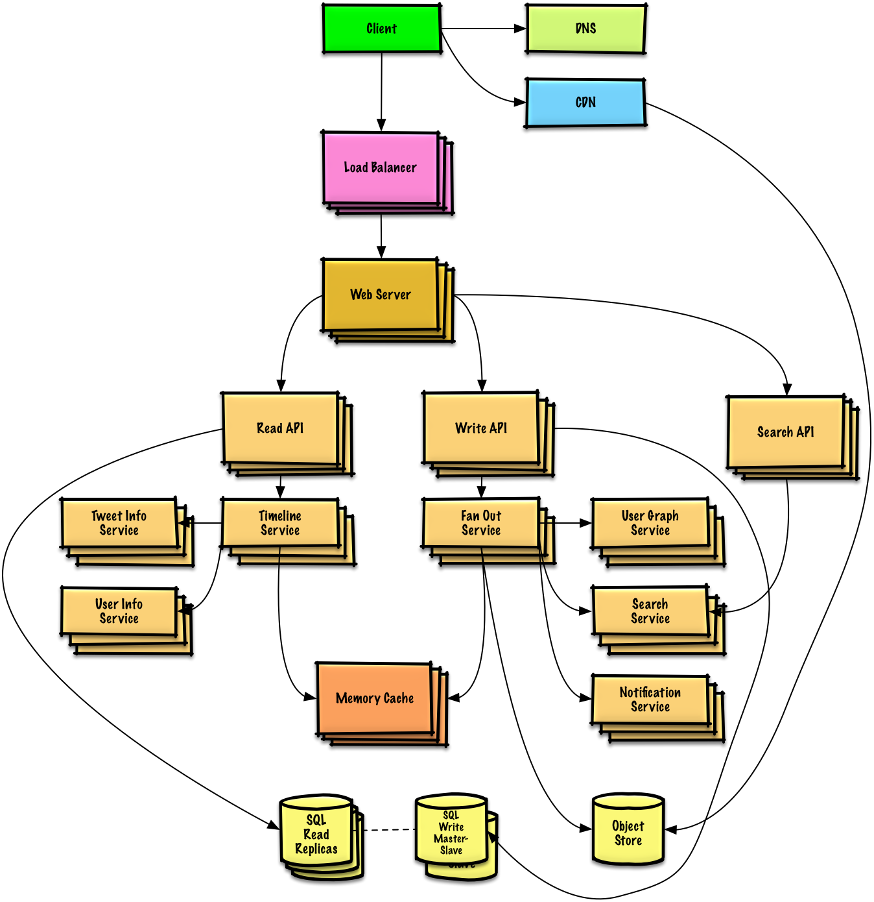

# Sistem Tasarımı El Kitabı

  
   

## Motivasyon

> Büyük boyutlu sistemlerin nasıl tasarlandığını öğrenin.
>
> Sistem tasarımı mülakatlarına hazırlanın.

### Büyük boyutlu sistemlerin nasıl tasarlandığını öğrenin

Ölçeklenebilir sistemlerin nasıl tasarlandığını öğrenmek sizin daha iyi bir geliştirici olmanızda size yardımcı olacak.

Sistem tasarımı geniş bir konudur. İnternet üzerinde sistem tasarımı hakkında **çok miktarda dağınık** kaynaklar vardır.

Bu repo, sizin ölçeklenebilir sistem tasarımını öğrenmeniz için gereken kaynakların **organize edilip bir araya getirilmiş** halidir.

### Açık kaynak komünitesinden öğrenin

Bu, düzenli bir şekilde güncellenen açık kaynaklı bir projedir.

[Katkıda](#contributing) bulunmaktan çekinmeyin!

### Sistem tasarımı mülakatı için hazırlanın

Kodlama mülakatlarına ek olarak, sistem tasarımı birçok teknoloji şirketinin **teknik mülakat aşamasında gerekli bir bileşendir**.

**Yaygın sistem tasarımı mülakat soruları** için alıştırma yapın ve sonuçlarınızı benzer çözümlerle **karşılaştırın**: Tartışmalarda, kod üzerinde, ve diyagramlarda.

Mülakat hazırlığı için ek konular:

* [Çalışma rehberi](#study-guide)
* [Sistem tasarımı mülakat sorularına nasıl yaklaşılır](#how-to-approach-a-system-design-interview-question)
* [Sistem tasarımı soruları ve cevapları](#system-design-interview-questions-with-solutions)
*[Nesne tabanlı sistem tasarımı mülakat soruları ve cevapları](#object-oriented-design-interview-questions-with-solutions)
*[Ekstra sistem tasarımı mülakat soruları](#additional-system-design-interview-questions)

## Anki bilgi kartları

  
   

Sağlanan [Anki bilgi kartı desteleri](https://apps.ankiweb.net/), temel sistem tasarım kavramlarını akılda tutmanıza yardımcı olmak için aralıklı olarak tekrar kullanır.

* [Sistem tasarım destesi](https://github.com/donnemartin/system-design-primer/tree/master/resources/flash_cards/System%20Design.apkg)

* [Sistem tasarımı egzersiz destesi](https://github.com/donnemartin/system-design-primer/tree/master/resources/flash_cards/System%20Design%20Exercises.apkg)

* [Nesne tabanlı tasarım egzersiz destesi](https://github.com/donnemartin/system-design-primer/tree/master/resources/flash_cards/OO%20Design.apkg)

Öğrenme sürecinde kullanım için harika.

### Kodlama Kaynağı: Etkileşimli Kodlama Yarışmaları

Kodlama mülakatına hazırlanmakta size yardımcı olacak kaynak mı [arıyorsunuz](https://github.com/donnemartin/interactive-coding-challenges)?

  
   

Kardeş repo'ya göz atın: [**Etkileşimli Kodlama Yarışmaları**](https://github.com/donnemartin/interactive-coding-challenges), ayrıca ek bir Anki destesi içerir:

* [Kodlama destesi](https://github.com/donnemartin/interactive-coding-challenges/tree/master/anki_cards/Coding.apkg)

## Katkıda Bulunmak

> Komüniteden öğrenin.

Şu konularda yardımcı olmak için pull request yapmaktan çekinmeyin:

* Hata düzeltmeleri
* Başlıkların iyileştirilmesi
* Yeni başlıkların eklenmesi
* [Çeviri](https://github.com/donnemartin/system-design-primer/issues/28)

Düzeltilmesi gereken içerik [geliştirme altında](#under-development) başlığındadır.

[Katkıda bulunma](CONTRIBUTING.md) rehberini inceleyin.

## Sistem tasarımı başlıkarı dizini

> Farklı sistem tasarımı konu başlıklarının özeti, artıları ve eksileri ile beraber **Herşeyin bir bedeli vardır**
>
> Her bölüm, daha ayrıntılı kaynaklara linkler içerir. 

  
   

* [Sistem tasarım başlıkları: Buradan başlayın](#system-design-topics-start-here)
    * [Adım 1: Ölçeklenebilirlik ile ilgili ders videousunu izleyin](#step-1-review-the-scalability-video-lecture)
    * [Adım 2: Ölçeklenebilirlik ile ilgili makaeleyi inceleyin](#step-2-review-the-scalability-article)
    * [Sonraki adımlar](#next-steps)
* [Performans ve ölçeklenebilirlik](#performance-vs-scalability)
* [Gecikme ve verim](#latency-vs-throughput)
* [Kullanılabilirlik ve tutarlılık](#availability-vs-consistency)
    * [TKB teorisi](#cap-theorem)
        * [TB - Tutarlılık ve bölünme toleransı](#cp---consistency-and-partition-tolerance)
        * [KB - Kullanılabilirlik ve bölünme toleransı](#ap---availability-and-partition-tolerance)
* [Tutarlılık desenleri](#consistency-patterns)
    * [Zayıf tutarlılık](#weak-consistency)
    * [Nihai tutarlılık](#eventual-consistency)
    * [Güçlü tutarlılık](#strong-consistency)
* [Kullanılabilirlik desenleri](#availability-patterns)
    * [Yük devretme](#fail-over)
    * [Çoğaltma](#replication)
    * [Sayılarla kullanılabilirlik](#availability-in-numbers)
* [Domain ismi sistemi](#domain-name-system)
* [İçerik dağıtım ağı(İDA)](#content-delivery-network)
    * [Push İDA'ları](#push-cdns)
    * [Pull İDA'ları](#pull-cdns)
* [Yükleme dengeleyicisi](#load-balancer)
    * [Aktif-pasif](#active-passive)
    * [Aktif-aktif](#active-active)
    * [Katman 4 yükleme dengeleyicisi](#layer-4-load-balancing)
    * [katman 7 yükleme dengeleyicisi](#layer-7-load-balancing)
    * [Yatay ölçekleme](#horizontal-scaling)
* [Tersine vekalet](#reverse-proxy-web-server)
    * [Yükleme dengeleyicisi vs tersine vekalet](#load-balancer-vs-reverse-proxy)
* [Uygulama katmanı](#application-layer)
    * [Mikroservisler](#microservices)
    * [Servis keşfi](#service-discovery)
* [Veritabanı](#database)
    * [İlişkisel veritabanı yönetim sistemi (İVYS)](#relational-database-management-system-rdbms)
        * [Efendi-köle çoğaltması](#master-slave-replication)
        * [Efendi-efendi çoğaltması](#master-master-replication)
        * [Federasyon](#federation)
        * [Parçalama](#sharding)
        * [Denormalizasyon](#denormalization)
        * [SQL ayarı](#sql-tuning)
    * [NoSQL](#nosql)
        * [Anahtar-değer stoğu](#key-value-store)
        * [Dökümantasyon stoğu](#document-store)
        * [Geniş sütun stoğu](#wide-column-store)
        * [Graf veritabanı](#graph-database)
    * [SQL veya NoSQL](#sql-or-nosql)
* [Önbellek](#cache)
    * [İstemci önbelleklemesi](#client-caching)
    * [CDN önbelleklemesi](#cdn-caching)
    * [Web sunucusu önbelleklemesi](#web-server-caching)
    * [Veritabanı önbelleklemesi](#database-caching)
    * [Uygulama önbelleklemesi](#application-caching)
    * [Veritabanı sorgusu seviyesinde önbellekleme](#caching-at-the-database-query-level)
    * [Nesne seviyesinde önbellekleme](#caching-at-the-object-level)
    * [Önbellek ne zaman güncellenmeli](#when-to-update-the-cache)
        * [Önbellekten ayrı](#cache-aside)
        * [Baştan sona yazarak](#write-through)
        * [Arka planda yazmak (geri yazmak)](#write-behind-write-back)
        * [İleride yenilemek](#refresh-ahead)
* [Asenkronizm](#asynchronism)
    * [Mesaj kuyrukları](#message-queues)
    * [Görev kuyrukları](#task-queues)
    * [Geri baskı](#back-pressure)
* [İletişim](#communication)
    * [Geçiş Kontrolü Protokolü (TCP)](#transmission-control-protocol-tcp)
    * [Kullanıcı Datagram Protokolü (UDP)](#user-datagram-protocol-udp)
    * [Uzaktan Prosedür Çağrısı (RPC](#remote-procedure-call-rpc)
    * [Temsili Durum Transferi (REST)](#representational-state-transfer-rest)
* [Güvenlik](#security)
* [Ek](#appendix)
    * [İki tablonun güçleri](#powers-of-two-table)
    * [Her programcının bilmesi gereken gecikme numaraları](#latency-numbers-every-programmer-should-know)
    * [Ek sistem tasarımı mülakat soruları](#additional-system-design-interview-questions)
    * [Gerçek dünya mimarileri](#real-world-architectures)
    * [Şirket mimarileri](#company-architectures)
    * [Şirket mühendisliği blogları](#company-engineering-blogs)
* [Geliştirme devam ediyor](#under-development)
* [Bitiş](#credits)
* [İletişim bilgileri](#contact-info)
* [Lisans](#license)

## Çalışma rehberi

> İncelenmesi önerilen konular sizin mülakat süreniz baz alınarak hazırlanmıştır(kısa, orta, uzun).

**S: Mülakatlar için buradaki her şeyi bilmem gerekiyor mu?**

**C: Hayır, mülakat hazırlığı için buradaki herşeyi bilmeniz gerekmiyor.**.

Bir mülakatta size sorulan sorular aşağıdaki değişkenlere bağlıdır:

* Ne kadar tecrübelisiniz
* Teknik özgeçmişinizin ne olduğu
* Hangi pozisyonlar için mülakata alındığınız
* Mülakatı yaptığınız şirketler
* Şans

Genellikle, daha tecrübeli olan adaylardan sistem tasarımı hakkında daha çok bilgi sahibi olmalaraı beklenir. Mimari tasarımcılarından veya takım liderlerinden, bireysel iştirakçilerden daha bilgili olmaları beklenebilir. Başı çeken teknoloji şirketleri bir veya daha fazla sistem tasarımı mülakatı yapmaya yönelimlidir.

Geniş olarak başlayın ve ardından bazı alanlarda derinlere inin. Bu, sizin çeşitli kilit sistem tasarımı konuları hakkında fikir sahibi olmanıza yardımcı olur. Takip eden rehberi; kendi planlamanıza, tecrübenize, mülakata girdiğiniz pozisyonlara ve hangi şirketlerle mülakat yaptığınza göre kendiniz için uyarlayın.

* **Kısa vadede** - Sistem tasarımı konularının **genelini** hedefleyin. Bunun pratiğini **biraz** mülakat soruları çözerek yapın.
* **Orta vadede** - Sistem tasarımı konularında **biraz derinlere** inin ve bazılarında **genel** seviyeyi hedefleyin. Bunun pratiğini **biraz** mülakat soruları çözerek yapın.
* **Uzun vadede** - Sistem tasarımı konularında **daha derinlere** inin ve bazılarında **genel** seviyeyi hedefleyin. Bunun pratiğini **biraz** mülakat soruları çözerek yapın.

| | Kısa | Orta | Uzun |
|---|---|---|---|
| Sistemlerin nasıl çalıştığı hakkında genel bir fikir edinmek için [Sistem tasarımı konularını](#index-of-system-design-topics) okuyun | :+1: | :+1: | :+1: |
| Mülakat yaptığınız şirketler için, [Şirket mühendisliği bloglarından](#company-engineering-blogs) bazı makaleler okuyun | :+1: | :+1: | :+1: |
| Read through a few [Real world architectures](#real-world-architectures) | :+1: | :+1: | :+1: |
| [Sistem tasarımı mülakat sorularına nasıl yaklaşacağınızı](#how-to-approach-a-system-design-interview-question) inceleyin | :+1: | :+1: | :+1: |
| [Çözümleriyle beraber sistem tasarımı mülakat soruları](#system-design-interview-questions-with-solutions) üzerinde çalışın | Bazısı | Birçoğu | Çoğunluğu |
| [Çözümleriyle beraber nesne tabanlı tasarım mülakat soruları](#object-oriented-design-interview-questions-with-solutions) üzerinde çalışın | Bazısı | Birçoğu | Çoğunluğu |
| [Ek sistem tasarımı mülakat sorularını](#additional-system-design-interview-questions) inceleyin | Bazısı | Birçoğu | Çoğunluğu |

## Sistem tasarımı mülakat sorularına nasıl yaklaşılır

> Bir sistem tasarımı mülakat sorusunun nasıl hakkından gelinir?

Sistem tasarımı mülakatı bir **açık uçlu sohbettir**. Buna önderlik etmeniz beklenir.

Aşağıdaki adımları kullanarak tartışmaya rehberlik edebilirsiniz. İlerlemeyi pekiştirmek için, aşağıdaki adımları kullanarak [çözümleriyle beraber sistem tasarımı mülakat soruları](#system-design-interview-questions-with-solutions) üzerinde çalışın.

### Adım 1: Kullanım senaryolarını, kısıtlamaları ve varsayımları ana hatlarıyla belirtin

Gereklilikleri bir araya getirin ve problemi gözlemleyin. Kullanım senaryolarını ve kısıtlamaları berraklaştırmak için sorular sorun. Varsayımları tartışın.

* Bunu kim kullanacak?
* Nasıl kullanacaklar?
* Kaç tane kullanıcı var?
* Sistem ne işe yarar?
* Sistemin girdileri ve çıktıları nelerdir?
* Ne kadar veriyi işlememiz gerekiyor?
* Saniye başına kaç istek gelmesini bekliyoruz?
* Okuma yazma oranı ne kadar?

### Adım 2: Yüksek seviye bir tasarım oluşturun

* Yüksek seviye bir tasarımı bütün önemli içeriklerini içererek anahatlarıyla belirtin.

* Ana içerikleri ve onların bağlantılarını kabaca açıklayın
* Fikirlerinizi doğrulayın

### Adım 3: Merkez çekirdek içerikleri tasarlayın

Her çekirdek içeriğin detaylarına kadar inin. Örneğin, size [bir url kısaltma servisinin tasarlanması](solutions/system_design/pastebin/README.md) sorulduğunda şunları açıklayın:

* Tam url'nin şifrelenmiş değerinin oluşturulması ve saklanması
    * [MD5](solutions/system_design/pastebin/README.md) ve [Base62](solutions/system_design/pastebin/README.md)
    * Şifreleme çakışmaları
    * SQL veya NoSQL
    * Veritabanı şeması
* Şifrelenmiş url'i tam url'e dönüştürmek
    * Veritabanı araması
* API ve nesne tabanlı tasarım

### Adım 4: Tasarımı ölçekleyin

Kısıtlamalar göz önüne alındığında darboğazları belirleyin ve ele alın. Örneğin, ölçeklenebilirlik sorunlarını çözmek için aşağıdakilere ihtiyacınız var mı?

* Yükleme dengeleyicisi
* Yatay ölçekleme
* Önbellekleme
* Veritabanı bölümleme

Potansiyel çözümleri ve takasları tartışın. Her şey bir takastır. [Ölçeklenebilir sistem tasarımı ilkelerini](#index-of-system-design-topics) kullanarak darboğazların üstesinden gelin.

### Zarf hesaplamalarının Diğer Yüzü

Bazı tahminleri elle yapmanız istenebilir. Aşağıdaki kaynaklar için [Ekler](#appendix) bölümüne bakın:

* [Zarf hesaplamalarının diğer yüzünü kullanın](http://highscalability.com/blog/2011/1/26/google-pro-tip-use-back-of-the-envelope-calculations-to-choo.html)
* [İki tablonun gücü](#powers-of-two-table)