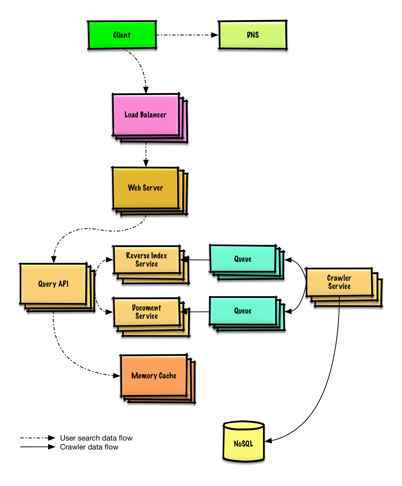
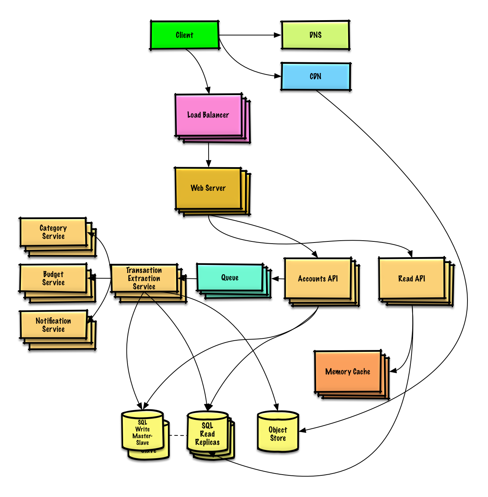
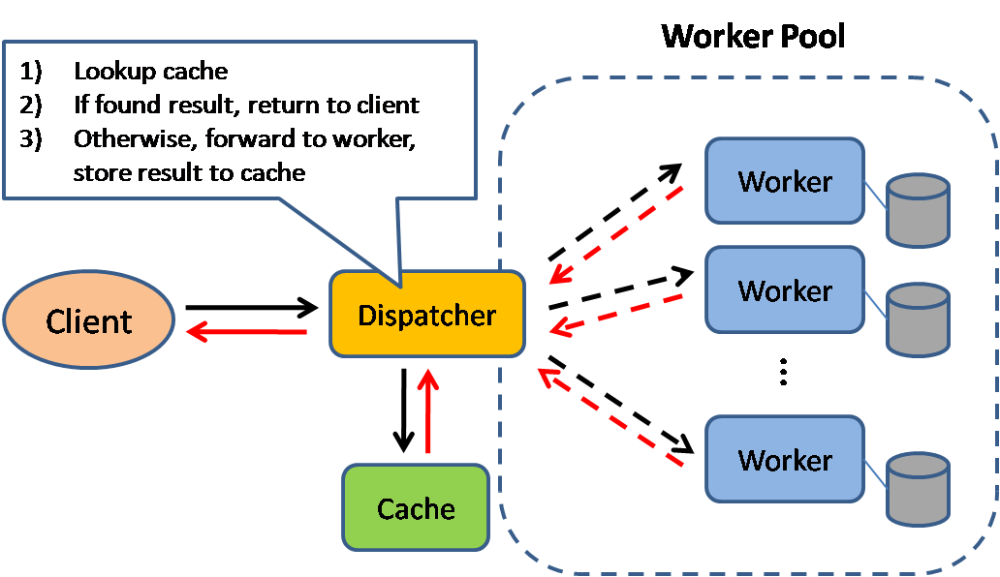

*[Inglizcha](README.md) ∙ [日本語](README-ja.md) ∙ [简体中文](README-zh-Hans.md) ∙ [繁體中文](README-zh-TW.md) | [العَرَبِيَّة‎](https://github.com/donnemartin/system-design-primer/issues/170) ∙ [বাংলা](https://github.com/donnemartin/system-design-primer/issues/220) ∙ [Português do Brasil](https://github.com/donnemartin/system-design-primer/issues/40) ∙ [Deutsch](https://github.com/donnemartin/system-design-primer/issues/186) ∙ [ελληνικά](https://github.com/donnemartin/system-design-primer/issues/130) ∙ [עברית](https://github.com/donnemartin/system-design-primer/issues/272) ∙ [Italiano](https://github.com/donnemartin/system-design-primer/issues/104) ∙ [한국어](https://github.com/donnemartin/system-design-primer/issues/102) ∙ [فارسی](https://github.com/donnemartin/system-design-primer/issues/110) ∙ [Polski](https://github.com/donnemartin/system-design-primer/issues/68) ∙ [русский язык](https://github.com/donnemartin/system-design-primer/issues/87) ∙ [Español](https://github.com/donnemartin/system-design-primer/issues/136) ∙ [ภาษาไทย](https://github.com/donnemartin/system-design-primer/issues/187) ∙ [Türkçe](https://github.com/donnemartin/system-design-primer/issues/39) ∙ [tiếng Việt](https://github.com/donnemartin/system-design-primer/issues/127) ∙ [Français](https://github.com/donnemartin/system-design-primer/issues/250) ∙ [O'zbekcha](README-uz.md) | [Tarjima qo'shish](https://github.com/donnemartin/system-design-primer/issues/28)*

**Ushbu qo'llanmani [tarjima qilish](TRANSLATIONS.md)da yordam bering!**

# The System Design Primer

<p align="center">
  
  <br/>
</p>

## Motivatsiya

> Katta miqyosli tizimlarni qanday loyihalashni o'rganing.
>
> System design bo'yicha suhbatga tayyorlaning.

### Katta miqyosli tizimlarni loyihalashni o'rganing

Shkalalanadigan tizimlarni loyihalashni o'rganish sizni yaxshiroq muhandis qiladi.

System design keng mavzu. Internetda system design tamoyillari haqida juda ko'p tarqalgan resurslar bor.

Bu repozitoriy katta hajmdagi tizimlarni qurishni o'rganishga yordam beradigan resurslarning tartibga solingan to'plamidir.

### Ochiq manba hamjamiyatidan o'rganing

Bu doimo yangilanib boradigan ochiq manbali loyiha.

[Hissa qo'shish](#hissa-qoshish)lar mamnuniyat bilan qabul qilinadi!

### System design bo'yicha suhbatga tayyorlaning

Kodlash intervyularidan tashqari, system design ko'plab texnologik kompaniyalarda texnik intervyu jarayonining majburiy qismidir.

System design bo'yicha keng tarqalgan savollarni mashq qiling va natijalaringizni namuna yechimlari bilan solishtiring: muhokamalar, kod va diagrammalar.

Suhbatga tayyorgarlik uchun qo'shimcha mavzular:

* [O'quv qo'llanma](#oquv-qollanma)
* [System design savollariga qanday yondashish kerak](#system-design-boyicha-suhbat-savollariga-qanday-yondashish-kerak)
* [Yechimlar bilan system design intervyu savollari](#yechimlar-bilan-system-design-intervyu-savollari)
* [Yechimlar bilan obyektga yo'naltirilgan dizayn savollari](#yechimlar-bilan-obyektga-yonaltirilgan-dizayn-savollari)
* [Qo'shimcha system design intervyu savollari](#qoshimcha-system-design-intervyu-savollari)

## Anki fleshkartalar

<p align="center">
  
  <br/>
</p>

Ta'limda bo'shliqli takrorlashdan foydalanadigan [Anki fleshkarta deklari](https://apps.ankiweb.net/) system design bo'yicha asosiy tushunchalarni yodda saqlashga yordam beradi.

* [System design deki](https://github.com/donnemartin/system-design-primer/tree/master/resources/flash_cards/System%20Design.apkg)
* [System design mashqlari deki](https://github.com/donnemartin/system-design-primer/tree/master/resources/flash_cards/System%20Design%20Exercises.apkg)
* [Obyektga yo'naltirilgan dizayn mashqlari deki](https://github.com/donnemartin/system-design-primer/tree/master/resources/flash_cards/OO%20Design.apkg)

Yo'lda ketayotganda foydalanish uchun juda qulay.

### Kodlash resursi: interaktiv kodlash sinovlari

[**Kodlash intervyusi**](https://github.com/donnemartin/interactive-coding-challenges)ga tayyorlanishga yordam beradigan resurslarni qidiryapsizmi?

<p align="center">
  
  <br/>
</p>

Hamkor repozitoriy [**Interactive Coding Challenges**](https://github.com/donnemartin/interactive-coding-challenges)ni ko'rib chiqing, unda yana bir Anki deki bor:

* [Kodlash deki](https://github.com/donnemartin/interactive-coding-challenges/tree/master/anki_cards/Coding.apkg)

## Hissa qo'shish

> Hamjamiyatdan o'rganing.

Quyidagilarga yordam berish uchun pull request yuborishingiz mumkin:

* Xatolarni tuzatish
* Bo'limlarni yaxshilash
* Yangi bo'limlar qo'shish
* [Tarjima qilish](https://github.com/donnemartin/system-design-primer/issues/28)

Qo'shimcha sayqal kerak bo'lgan kontent [ish jarayonida](#ish-jarayonida) bo'limiga joylashtiriladi.

[Hissa qo'shish bo'yicha qo'llanmani](CONTRIBUTING.md) ko'rib chiqing.

## System design mavzularining indekslari

> Turli system design mavzularining qisqa mazmuni, afzallik va kamchiliklar bilan. Hamma narsa savdo-off.
>
> Har bir bo'lim batafsilroq resurslarga havolalar beradi.

<p align="center">
  
  <br/>
</p>

* [System design mavzulari: boshlanish nuqtasi](#system-design-mavzulari-bu-yerdan-boshlang)
    * [1-qadam: Masshtablash bo'yicha video ma'ruzani ko'ring](#1-qadam-masshtablash-bo'yicha-video-maruzani-koring)
    * [2-qadam: Masshtablash haqidagi maqolani o'qing](#2-qadam-masshtablash-haqidagi-maqolani-oqing)
    * [Keyingi qadamlar](#keyingi-qadamlar)
* [Ishlash va masshtablash](#ishlash-va-masshtablash)
* [Kechikish va o'tkazuvchanlik](#kechikish-va-otkazuvchanlik)
* [Mavjudlik va mukammallik](#mavjudlik-va-mukammallik)
    * [CAP teoremasi](#cap-teoremasi)
        * [CP - mukammallik va bo'linishga bardoshlilik](#cp---mukammallik-va-bolinishga-bardoshlilik)
        * [AP - mavjudlik va bo'linishga bardoshlilik](#ap---mavjudlik-va-bolinishga-bardoshlilik)
* [Consistency patterns](#consistency-patterns)
* [Availability patterns](#availability-patterns)
* [Domen nomi tizimi](#domen-nomi-tizimi-dns)
* [Kontent yetkazib berish tarmog'i](#kontent-yetkazib-berish-tarmogi-cdn)
    * [Push CDNlar](#push-cdnlar)
    * [Pull CDNlar](#pull-cdnlar)
* [Yuk muvozanatlagich](#yuk-muvozanatlagich)
    * [Faol-pasiv](#faol-pasiv)
    * [Faol-faol](#faol-faol)
    * [4-qavat yuk muvozanatlash](#4-qavat-yuk-muvozanatlash)
    * [7-qavat yuk muvozanatlash](#7-qavat-yuk-muvozanatlash)
    * [Gorizontal masshtablash](#gorizontal-masshtablash)
* [Teskari proksi (veb server)](#teskari-proksi-veb-server)
    * [Yuk muvozanatlagich va teskari proksi farqi](#yuk-muvozanatlagich-va-teskari-proksi-farqi)
* [Ilova qatlami](#ilova-qatlami)
    * [Microservices](#microservices)
    * [Service discovery](#service-discovery)
* [Ma'lumotlar bazasi](#malumotlar-bazasi)
    * [Relational Database Management System (RDBMS)](#relational-database-management-system-rdbms)
        * [Master-slave replikatsiya](#master-slave-replikatsiya)
        * [Master-master replikatsiya](#master-master-replikatsiya)
        * [Federatsiya](#federatsiya)
        * [Sharding](#sharding)
        * [Denormalizatsiya](#denormalizatsiya)
        * [SQL tuning](#sql-tuning)
    * [NoSQL](#nosql)
        * [Key-value store](#key-value-store)
        * [Document store](#document-store)
        * [Wide column store](#wide-column-store)
        * [Graph database](#graph-database)
    * [SQL yoki NoSQL](#sql-yoki-nosql)
* [Kesh](#kesh)
    * [Client caching](#client-caching)
    * [CDN caching](#cdn-caching)
    * [Web server caching](#web-server-caching)
    * [Database caching](#database-caching)
    * [Application caching](#application-caching)
    * [Database query darajasida kesh](#database-query-darajasida-kesh)
    * [Obyekt darajasida kesh](#obyekt-darajasida-kesh)
    * [Keshni qachon yangilash](#keshni-qachon-yangilash)
        * [Cache-aside (lazy loading)](#cache-aside-lazy-loading)
        * [Write-through](#write-through)
        * [Write-behind (write-back)](#write-behind-write-back)
        * [Refresh-ahead](#refresh-ahead)
* [Asinxronlik](#asinxronlik)
    * [Message queue](#message-queue)
    * [Task queue](#task-queue)
    * [Back pressure](#back-pressure)
* [Kommunikatsiya](#kommunikatsiya)
    * [Transmission Control Protocol (TCP)](#transmission-control-protocol-tcp)
    * [User Datagram Protocol (UDP)](#user-datagram-protocol-udp)
    * [Remote Procedure Call (RPC)](#remote-procedure-call-rpc)
    * [Representational State Transfer (REST)](#representational-state-transfer-rest)
* [Xavfsizlik](#xavfsizlik)
* [Ilova](#ilova)
    * [Ikkining darajalari jadvali](#ikkining-darajalari-jadvali)
    * [Har bir dasturchi bilishi kerak bo'lgan kechikish ko'rsatkichlari](#har-bir-dasturchi-bilishi-kerak-bolgan-kechikish-korsatkichlari)
    * [Qo'shimcha system design intervyu savollari](#qoshimcha-system-design-intervyu-savollari)
    * [Haqiqiy dunyo arxitekturalari](#haqiqiy-dunyo-arxitekturalari)
    * [Kompaniya arxitekturalari](#kompaniya-arxitekturalari)
    * [Kompaniya injiniring bloglari](#kompaniya-injiniring-bloglari)
* [Ish jarayonida](#ish-jarayonida)
* [Kreditlar](#kreditlar)
* [Aloqa ma'lumotlari](#aloqa-malumotlari)
* [Litsenziya](#litsenziya)

## O'quv qo'llanma

> Intervyu tayyorgarligi uchun ko'rib chiqiladigan mavzular (qisqa, o'rta, uzun muddat).


**Savol: Intervyular uchun bu yerda keltirilgan hamma narsani bilishim shartmi?**

**Javob: Yo'q, intervyu oldidan bu yerda keltirilganlarning hammasini bilishingiz shart emas**.

Intervyuda sizdan nima so'ralishi quyidagilarga bog'liq:

* Tajribangiz qancha
* Texnik ma'lumotingiz qanday
* Qaysi lavozimlarga intervyudan o'ryapsiz
* Qaysi kompaniyalar bilan intervyu qilayapsiz
* Omad

Ko'proq tajribaga ega nomzodlardan system design haqida ko'proq bilishlari kutiladi. Arxitektorlar yoki jamoa yetakchilaridan yakka dasturchilarga nisbatan ko'proq bilim talab qilinishi mumkin. Yirik texnologik kompaniyalarda bir yoki bir nechta system design intervyu rondlari bo'lishi ehtimoli yuqori.

Avval keng qamrovli bilim oling, so'ng bir nechta yo'nalishda chuqurlik kiriting. System design bo'yicha asosiy mavzular haqida oz bo'lsa-da tasavvurga ega bo'lish foyda beradi. Quyidagi qo'llanmada vaqt jadvalingiz, tajribangiz, qaysi lavozimlarga va qaysi kompaniyalar bilan intervyu qilayotganingizga qarab o'zgartirishlar kiriting.

* **Qisqa muddat** - system designdagi mavzular bo'yicha keng qamrovga intiling. Bir nechta intervyu savollarini yechib mashq qiling.
* **O'rta muddat** - system designdagi mavzularda keng qamrov va ma'lum chuqurlikka erishing. Ko'plab intervyu savollarini yeching.
* **Uzun muddat** - system designdagi mavzularda keng qamrov va yanada chuqurlikka erishing. Aksariyat intervyu savollarini yeching.

| | Qisqa | O'rta | Uzun |
|---|---|---|---|
| [System design mavzularini](#system-design-mavzularining-indekslari) ko'zdan kechirib, tizimlar qanday ishlashini keng qamrovda tushunib chiqing | :+1: | :+1: | :+1: |
| Intervyudan o'tayotgan kompaniyalaringiz uchun [Kompaniya injiniring bloglari](#kompaniya-injiniring-bloglari)dan bir nechtasini o'qing | :+1: | :+1: | :+1: |
| [Haqiqiy dunyo arxitekturalari](#haqiqiy-dunyo-arxitekturalari)dan bir nechtasini o'qing | :+1: | :+1: | :+1: |
| [System design savollariga qanday yondashish kerak](#system-design-boyicha-suhbat-savollariga-qanday-yondashish-kerak) bo'limini ko'rib chiqing | :+1: | :+1: | :+1: |
| [Yechimlar bilan system design intervyu savollari](#yechimlar-bilan-system-design-intervyu-savollari)ni ishlang | Biroz | Ko'p | Ko'pchilik |
| [Yechimlar bilan obyektga yo'naltirilgan dizayn savollari](#yechimlar-bilan-obyektga-yonaltirilgan-dizayn-savollari)ni ishlang | Biroz | Ko'p | Ko'pchilik |
| [Qo'shimcha system design intervyu savollari](#qoshimcha-system-design-intervyu-savollari)ni ko'rib chiqing | Biroz | Ko'p | Ko'pchilik |

## System design bo'yicha suhbat savollariga qanday yondashish kerak

> System design savollarini qanday hal qilish haqida qo'llanma.

System design intervyusi ochiq muloqot. Suhbatni siz boshqarishingiz kutiladi.

Quyidagi qadamlar suhbatni yo'naltirishga yordam beradi. Ushbu jarayonni mustahkamlash uchun [Yechimlar bilan system design intervyu savollari](#yechimlar-bilan-system-design-intervyu-savollari) bo'limidagi savollarni shu bosqichlardan foydalangan holda yechib chiqing.

### 1-qadam: Foydalanish ssenariylari, cheklovlar va farazlarni aniqlang

Talablarni to'plang va muammoning ko'lamini belgilab oling. Foydalanish ssenariylari va cheklovlarni aniqlashtirish uchun savollar bering. Farazlar haqida suhbatlashing.

* Kim undan foydalanadi?
* Qanday foydalanadi?
* Foydalanuvchilar soni qancha?
* Tizim nima qiladi?
* Tizimga nima kiradi va undan nima chiqadi?
* Qancha hajmdagi ma'lumotni qayta ishlaymiz?
* Sekundiga necha so'rov kutamiz?
* O'qish va yozish nisbati qanday bo'ladi?

### 2-qadam: Yuqori darajadagi dizayn tuzing

Muhim komponentlarning barchasini qamrab oluvchi yuqori darajadagi dizaynni chizing.

* Asosiy komponentlar va ularning o'zaro aloqalarini chizib chiqing
* G'oyalar nega foydali ekanini asoslang

### 3-qadam: Yadro komponentlarini loyihalang

Har bir asosiy komponentni batafsil ko'rib chiqing. Masalan, sizdan [URL qisqartirish servisini loyihalash](solutions/system_design/pastebin/README.md) so'ralsa, quyidagilarni muhokama qiling:

* To'liq URL uchun xesh yaratish va saqlash
    * [MD5](solutions/system_design/pastebin/README.md) va [Base62](solutions/system_design/pastebin/README.md)
    * Xesh to'qnashuvlari
    * SQL yoki NoSQL
    * Ma'lumotlar bazasi sxemasi
* Xeshlangan URLni to'liq URLga qaytarish
    * Ma'lumotlar bazasidan qidiruv
* API va obyektga yo'naltirilgan dizayn

### 4-qadam: Dizaynni masshtablash

Cheklovlarni hisobga olgan holda tor joylarni aniqlang va ularni bartaraf eting. Masalan, masshtablash muammolarini hal qilish uchun quyidagilar kerak bo'lishi mumkinmi?

* Yuk muvozanatlagich
* Gorizontal masshtablash
* Keshlash
* Ma'lumotlar bazasini shardlash

Har bir yechim variantini va savdo-offlarini muhokama qiling. Hamma narsa savdo-off. Tor joylarni [masshtablanuvchi system design tamoyillari](#system-design-mavzularining-indekslari)ga tayanib bartaraf eting.

### Taxminiy hisob-kitoblar

Ba'zan qo'lda taxminiy hisob-kitoblar qilish talab qilinishi mumkin. Quyidagi resurslar uchun [Ilova](#ilova) bo'limini ko'ring:

* [Taxminiy hisob-kitoblardan foydalaning](http://highscalability.com/blog/2011/1/26/google-pro-tip-use-back-of-the-envelope-calculations-to-choo.html)
* [Ikkining darajalari jadvali](#ikkining-darajalari-jadvali)
* [Har bir dasturchi bilishi kerak bo'lgan kechikish ko'rsatkichlari](#har-bir-dasturchi-bilishi-kerak-bolgan-kechikish-korsatkichlari)

### Manbalar va qo'shimcha o'qish uchun

Nimalarni kutish mumkinligini yaxshiroq tushunish uchun quyidagilarni o'qing:

* [System design intervyusini qanday zabt etish kerak](https://www.palantir.com/2011/10/how-to-rock-a-systems-design-interview/)
* [System design intervyusi](http://www.hiredintech.com/system-design)
* [Arxitektura va system design intervyulariga kirish](https://www.youtube.com/watch?v=ZgdS0EUmn70)
* [System design shabloni](https://leetcode.com/discuss/career/229177/My-System-Design-Template)

## Yechimlar bilan system design intervyu savollari

> System design intervyularida uchraydigan savollar uchun namunaviy muhokamalar, kod va diagrammalar.
>
> Yechimlar `solutions/` papkasidagi materiallarga havola qiladi.

| Savol | |
|---|---|
| Pastebin.com (yoki Bit.ly)ni loyihalang | [Yechim](solutions/system_design/pastebin/README.md) |
| Twitter lentasi va qidiruvini (yoki Facebook lentasi va qidiruvini) loyihalang | [Yechim](solutions/system_design/twitter/README.md) |
| Veb-kroularni loyihalang | [Yechim](solutions/system_design/web_crawler/README.md) |
| Mint.com ni loyihalang | [Yechim](solutions/system_design/mint/README.md) |
| Ijtimoiy tarmoq uchun ma'lumotlar tuzilmalarini loyihalang | [Yechim](solutions/system_design/social_graph/README.md) |
| Qidiruv tizimi uchun kalit-qiymat do'konini loyihalang | [Yechim](solutions/system_design/query_cache/README.md) |
| Amazon'ning turkumlar bo'yicha savdo reytingi funksiyasini loyihalang | [Yechim](solutions/system_design/sales_rank/README.md) |
| AWSda millionlab foydalanuvchilarga xizmat qiladigan tizimni loyihalang | [Yechim](solutions/system_design/scaling_aws/README.md) |
| Yangi system design savolini qo'shing | [Hissa qo'shing](#hissa-qoshish) |

### Pastebin.com (yoki Bit.ly)ni loyihalang

[Mashq va yechimni ko'rish](solutions/system_design/pastebin/README.md)


### Twitter lentasi va qidiruvini (yoki Facebook lentasi va qidiruvini) loyihalang

[Mashq va yechimni ko'rish](solutions/system_design/twitter/README.md)


### Veb-kroularni loyihalang

[Mashq va yechimni ko'rish](solutions/system_design/web_crawler/README.md)



### Mint.com ni loyihalang

[Mashq va yechimni ko'rish](solutions/system_design/mint/README.md)



### Ijtimoiy tarmoq uchun ma'lumotlar tuzilmalarini loyihalang

[Mashq va yechimni ko'rish](solutions/system_design/social_graph/README.md)


### Qidiruv tizimi uchun kalit-qiymat do'konini loyihalang

[Mashq va yechimni ko'rish](solutions/system_design/query_cache/README.md)


### Amazon'ning turkumlar bo'yicha savdo reytingi funksiyasini loyihalang

[Mashq va yechimni ko'rish](solutions/system_design/sales_rank/README.md)


### AWSda millionlab foydalanuvchilarga xizmat qiladigan tizimni loyihalang

[Mashq va yechimni ko'rish](solutions/system_design/scaling_aws/README.md)


## Yechimlar bilan obyektga yo'naltirilgan dizayn savollari

> Obyektga yo'naltirilgan dizayn bo'yicha intervyu savollariga misollar, ularning muhokamalari, kodlari va diagrammalari.
>
> Yechimlar `solutions/` papkasidagi materiallarga havola qiladi.

> **Eslatma: bu bo'lim hali ishlab chiqilmoqda**

| Savol | |
|---|---|
| Xesh xaritani loyihalang | [Yechim](solutions/object_oriented_design/hash_table/hash_map.ipynb) |
| Eng kamdan-kam ishlatilgan keshni loyihalang | [Yechim](solutions/object_oriented_design/lru_cache/lru_cache.ipynb) |
| Call-markazni loyihalang | [Yechim](solutions/object_oriented_design/call_center/call_center.ipynb) |
| Kartalar kolodasini loyihalang | [Yechim](solutions/object_oriented_design/deck_of_cards/deck_of_cards.ipynb) |
| Avtoturargohni loyihalang | [Yechim](solutions/object_oriented_design/parking_lot/parking_lot.ipynb) |
| Shashka o'yinini loyihalang | [Yechim](solutions/object_oriented_design/checkers/checkers.ipynb) |
| Ilon o'yinini loyihalang | [Yechim](solutions/object_oriented_design/snake_game/snake_game.ipynb) |
| Obyektga yo'naltirilgan dizayn savolini qo'shing | [Hissa qo'shing](#hissa-qoshish) |

## System design mavzulari: bu yerdan boshlang

System design sohasida yangimisiz?

Avval umumiy tamoyillarni tushunib oling: ular nima, qanday qo'llanadi va afzallik hamda kamchiliklari qanday.

### 1-qadam: Masshtablash bo'yicha video ma'ruzani ko'ring

[Harvarddagi masshtablash ma'ruzasi](https://www.youtube.com/watch?v=-W9F__D3oY4)

* Qamrab olingan mavzular:
    * Vertikal masshtablash
    * Gorizontal masshtablash
    * Keshlash
    * Yuk muvozanatlash
    * Ma'lumotlar bazasini ko'paytirish
    * Ma'lumotlar bazasini bo'lish

### 2-qadam: Masshtablash haqidagi maqolani o'qing

[Masshtablash](https://web.archive.org/web/20221030091841/http://www.lecloud.net/tagged/scalability/chrono)

* Qamrab olingan mavzular:
    * [Klonlar](https://web.archive.org/web/20220530193911/https://www.lecloud.net/post/7295452622/scalability-for-dummies-part-1-clones)
    * [Ma'lumotlar bazalari](https://web.archive.org/web/20220602114024/https://www.lecloud.net/post/7994751381/scalability-for-dummies-part-2-database)
    * [Keshlash](https://web.archive.org/web/20230126233752/https://www.lecloud.net/post/9246290032/scalability-for-dummies-part-3-cache)
    * [Asinxronlik](https://web.archive.org/web/20220926171507/https://www.lecloud.net/post/9699762917/scalability-for-dummies-part-4-asynchronism)

### Keyingi qadamlar

Endi yuqori darajadagi savdo-offlarga qaraymiz:

* Ishlash va masshtablash
* Kechikish va o'tkazuvchanlik
* Mavjudlik va mukammallik

Yodingizda bo'lsin, hamma narsa savdo-off.

Shundan so'ng DNS, CDNlar va yuk muvozanatlagichlar kabi aniq mavzularga o'tamiz.

## Ishlash va masshtablash

Xizmat masshtablanadigan bo'lsa, qo'shilgan resurslarga mutanosib ravishda ishlash ko'rsatkichlari oshadi. Odatda bu ko'proq foydalanuvchiga xizmat ko'rsatishni anglatadi, lekin katta ma'lumot to'plamlarini qayta ishlash ham bo'lishi mumkin.<sup><a href=http://www.allthingsdistributed.com/2006/03/a_word_on_scalability.html>1</a></sup>

Ishlash va masshtablashga yana bir qarash:

* Agar sizda ishlash muammosi bo'lsa, tizimingiz bitta foydalanuvchi uchun sekin.
* Agar sizda masshtablash muammosi bo'lsa, tizimingiz bitta foydalanuvchi uchun tez, lekin katta yuk ostida sekinlashadi.

### Manbalar va qo'shimcha o'qish uchun

* [Masshtablash haqida bir og'iz so'z](http://www.allthingsdistributed.com/2006/03/a_word_on_scalability.html)
* [Scalability, availability, stability, patterns](http://www.slideshare.net/jboner/scalability-availability-stability-patterns/)

## Kechikish va o'tkazuvchanlik

Kechikish - ma'lum bir harakatni bajarish yoki natija olish uchun sarflangan vaqt.

O'tkazuvchanlik - vaqt birligiga to'g'ri keladigan shunday harakatlar yoki natijalar soni.

Odatda, qoniqarli kechikish bilan maksimal o'tkazuvchanlikka intiling.

### Manbalar va qo'shimcha o'qish uchun

* [Kechikish va o'tkazuvchanlikni tushunish](https://community.cadence.com/cadence_blogs_8/b/fv/posts/understanding-latency-vs-throughput)

## Mavjudlik va mukammallik

### CAP teoremasi

<p align="center">
  
  <br/>
  <i><a href=http://robertgreiner.com/2014/08/cap-theorem-revisited>Manba: CAP teoremasi qayta ko'rib chiqildi</a></i>
</p>

Taqsimlangan tizimda quyidagi uch kafolatdan faqat ikkitasini bir vaqtda qo'llab-quvvatlash mumkin:

* **Mukammallik** - Har bir o'qish eng so'nggi yozuvni yoki xatoni qaytaradi
* **Mavjudlik** - Har bir so'rov javob oladi, lekin javob eng so'nggi ma'lumotni o'z ichiga olishi kafolatlanmaydi
* **Bo'linishga bardoshlilik** - Tarmoqdagi uzilishlarga qaramay tizim ishlashda davom etadi

Tarmoqlar ishonchsiz, shuning uchun bo'linishga bardoshlilikni qo'llab-quvvatlashga to'g'ri keladi. Natijada mukammallik va mavjudlik o'rtasida dasturiy savdo-off qilish kerak bo'ladi.

#### CP - mukammallik va bo'linishga bardoshlilik

Bo'lingan tugundan javob kutish taym-aut xatosiga olib kelishi mumkin. Agar biznes talablaringiz atomar o'qish va yozishni talab qilsa, CP yaxshi tanlov.

#### AP - mavjudlik va bo'linishga bardoshlilik

Javoblar har qanday tugunda mavjud bo'lgan eng tezkor versiyani qaytaradi, lekin u eng so'nggi bo'lmasligi mumkin. Bo'linish bartaraf etilgach, yozuvlar tarqalishi uchun vaqt kerak bo'lishi ehtimoli bor.

AP, agar biznesingiz eventual mukammallikni qabul qilsa yoki tashqi xatolarga qaramay tizim ishlashi lozim bo'lsa, yaxshi tanlov.

### Manbalar va qo'shimcha o'qish uchun

* [CAP teoremasi qayta ko'rib chiqildi](http://robertgreiner.com/2014/08/cap-theorem-revisited/)
* [CAP teoremasiga oddiy kirish](http://ksat.me/a-plain-english-introduction-to-cap-theorem)
* [CAP FAQ](https://github.com/henryr/cap-faq)
* [CAP teoremasi](https://www.youtube.com/watch?v=k-Yaq8AHlFA)

## Consistency patterns

Bir xil ma'lumotning bir nechta nusxasi bo'lganda, mijozlar ma'lumotni izchil ko'rishi uchun ularni qanday sinxronlashni tanlashimiz kerak. [CAP teoremasi](#cap-teoremasi)dagi mukammallik ta'rifini eslang: har bir o'qish so'rovi eng so'nggi yozuvni yoki xatoni qaytaradi.

### Zaif mukammallik

Yozuvdan so'ng o'qishlar uni ko'rishi ham, ko'rmasligi ham mumkin. "Bor imkoniyat" yondashuvi qo'llaniladi.

### Eventual mukammallik

Yozuvdan keyin o'qishlar dastlab eski qiymatni ko'rishi mumkin, lekin vaqt o'tishi bilan izchillik tiklanadi. Ketma-ketlik muhim bo'lmasa, lekin tizim uzluksiz ishlashi kerak bo'lgan xizmatlar uchun mos.

### Kuchli mukammallik

Yozuvdan keyin har bir o'qish darhol eng so'nggi natijani qaytaradi. Yozuv yakunlanmaguncha o'qishlar bloklanadi. Moliyaviy tranzaksiyalar yoki qat'iy izchillik talab qilinadigan tizimlar uchun mos.

### Manbalar va qo'shimcha o'qish uchun

* [Mukammallik modellariga kirish](http://pages.cs.wisc.edu/~remzi/Classes/537/Spring2009/Notes/notes.consistency.pdf)
* [Eventual mukammallik nima?](https://www.allthingsdistributed.com/2008/12/eventually_consistent.html)
* [Eventual mukammallik va ACID](https://queue.acm.org/detail.cfm?id=1394128)
* [Eventual mukammallik UXini yaxshilash](https://martinfowler.com/articles/patterns-of-distributed-systems/short-term-consistency.html)

## Availability patterns

Tizimni yuqori mavjudlikda ushlab turish uchun quyidagi yondashuvlardan foydalanish mumkin:

### Failover

* **Faol-harakatdagi zaxira** - asosiy server ishdan chiqsa, zaxira server avtomatik tarzda ishga tushadi.
* **Faol-ishchi zaxira** - asosiy server ishlamay qolsa ham, zaxira so'rovlarni qabul qilishda davom etadi.

### Replikatsiya

Ma'lumotlarni bir nechta serverlarda nusxalash orqali uzluksiz xizmat ko'rsatish.

* **Master-slave replikatsiya** - master yozuvlarni qabul qiladi, slave o'qishlarni bajaradi.
* **Master-master replikatsiya** - bir nechta master tugunlar yozuvlarni qabul qiladi va o'zaro sinxronlashadi.

### Raqamlarda mavjudlik

Mavjudlik ehtimol ko'rsatkichlari orqali ifodalanadi. Masalan, 99.9% yil davomida tizim taxminan 8.76 soat ishlamasligini bildiradi.

### Manbalar va qo'shimcha o'qish uchun

* [High Scalability - High Availability](http://highscalability.com/blog/category/high-availability)
* [High Availability Concepts](https://www.digitalocean.com/community/tutorials/understanding-high-availability)

## Domen nomi tizimi (DNS)

DNS - domen nomini IP manzilga bog'laydigan ierarxik tizim. Keshlar va rekursiv resolverlar yordamida qatlamli mustaqillik va qayta foydalanish ta'minlanadi.

* **Rekursiv rezolver** - mijoz so'rovini boshqa DNS serverlariga uzatadi.
* **Avtoritativ DNS** - ma'lum domen uchun rasmiy yozuvlarni saqlaydi.

### Manbalar va qo'shimcha o'qish uchun

* [How DNS works](https://howdns.works/)
* [DNSni tushunish](https://blog.cloudflare.com/what-is-dns/)

## Kontent yetkazib berish tarmog'i (CDN)

CDN statik aktivlarni foydalanuvchiga yaqin tugunlarda keshga olib, kechikishni kamaytiruvchi global tarmoqdir. Trafik ko'p bo'lgan saytlar CDN yordamida yukni teng taqsimlaydi.

### Push CDNlar

Manba serverdagi o'zgarishlar fayllarni CDN tugunlariga oldindan yuboradi. Kam o'zgaradigan, katta statik fayllar (video, installer) uchun qulay. Birinchi so'rov tez bo'ladi, lekin faylni CDNga initial upload qilish kerak. Saqlash xarajatlari yuqoriroq bo'lishi mumkin.

### Pull CDNlar

Foydalanuvchi so'rov yuborganida, CDN faylni origin serverdan olib, keshga saqlaydi. Birinchi so'rov sekinroq, keyingi so'rovlar keshdan xizmat ko'rsatadi. [TTL](https://en.wikipedia.org/wiki/Time_to_live) kontent qancha vaqt keshda turishini belgilaydi. Fayl muxlati tugasa, yana origin'dan olinadi.

Pull CDNlar trafik yuqori bo'lgan saytlar uchun samarali: faqat yaqinda so'ralgan kontent keshda qoladi. Tez-tez o'zgaradigan fayllar uchun URL versioning (`app.2024.04.js`) kesh invalidatsiyasini soddalashtiradi.

### Kamchiliklari: CDN

* Trafikga qarab CDN xarajatlari sezilarli bo'lishi mumkin.
* TTL tugamaguncha kontent eskirishi xavfi bor.
* Statik kontent URLlarini CDN domeniga yo'naltirish kerak bo'ladi.

### Manbalar va qo'shimcha o'qish uchun

* [Globally distributed content delivery](https://figshare.com/articles/Globally_distributed_content_delivery/6605972)
* [CDN orqali saytlarni xizmat ko'rsatish](https://developer.mozilla.org/en-US/docs/Glossary/CDN)
* [Push va Pull CDNlar](https://www.keycdn.com/support/push-vs-pull-cdn)
* [Wikipedia](https://en.wikipedia.org/wiki/Content_delivery_network)

## Yuk muvozanatlagich

<p align="center">
  
  <br/>
  <i><a href="http://horicky.blogspot.com/2010/10/scalable-system-design-patterns.html">Manba: Scalable system design patterns</a></i>
</p>

Yuk muvozanatlagich kiruvchi so'rovlarni application serverlar, ma'lumotlar bazalari kabi resurslarga taqsimlab, javobni mijozga qaytaradi. Afzalliklari:

* Sog'lom bo'lmagan serverlarga so'rov yuborilishini oldini olish
* Resurslarni ortiqcha yuklanishdan himoya qilish
* Single point of failure'ni kamaytirish

Yuk muvozanatlagichlar qimmat apparat (hardware) yoki HAProxy kabi dasturiy ta'minot bo'lishi mumkin.

Qo'shimcha foydalari:

* **SSL termination** – kelayotgan so'rovlarni shifrdan yechib, javoblarni shifrlaydi, backend serverlar qimmat operatsiyalarni bajarmaydi
    * Har bir serverga [X.509 sertifikati](https://en.wikipedia.org/wiki/X.509) o'rnatish shart emas
* **Session persistence** – cookie chiqarib, sessiyani sovg'a qilgan instansga yo'naltiradi

Nosozliklarga qarshi turish uchun odatda ikki yoki undan ortiq load balancer qo'yiladi (active-passive yoki active-active).

Trafikni taqsimlash mezonlari:

* Tasodifiy (random)
* Eng kam yuklangan server
* Session/cookie asosida
* [Round robin yoki weighted round robin](https://www.g33kinfo.com/info/round-robin-vs-weighted-round-robin-lb)
* [Layer 4](#4-qavat-yuk-muvozanatlash)
* [Layer 7](#7-qavat-yuk-muvozanatlash)

### Faol-pasiv

Bitta faol server va zaxira server mavjud. Faol server ishdan chiqsa, zaxira ishga tushadi.

### Faol-faol

Bir nechta faol serverlar so'rovlarni parallel bajaradi, yuk ularga taqsimlanadi.

### 4-qavat yuk muvozanatlash

TCP/UDP darajasida ishlaydi, paketlarni IP va port asosida taqsimlaydi.

### 7-qavat yuk muvozanatlash

HTTP/HTTPS sarlavhalari, URL yoki cookie asosida aqlli marshrutlashni amalga oshiradi.

### Gorizontal masshtablash

Qo'shimcha serverlar qo'shish orqali ishlashni oshirish. Avtomatlashtirilgan provisioning, stateless dizayn va sessiya replikatsiyasini talab etadi.

#### Kamchiliklari: gorizontal masshtablash

* Servislarni klonlash murakkablikni oshiradi
    * Serverlar stateless bo'lishi kerak (sessiya, rasm kabi foydalanuvchi ma'lumotlarini tashlamaslik)
    * Sessiyalar markaziy [database](#malumotlar-bazasi) yoki persistent [cache](#kesh) (Redis, Memcached)da saqlanishi mumkin
* Kesh va ma'lumotlar bazasi kabi downstream serverlar ko'proq parallel ulanishlarni ko'tarishi kerak

### Kamchiliklari: yuk muvozanatlagich

* Resurs yetarli bo'lmasa yoki noto'g'ri sozlansa, load balancer bottleneck bo'ladi
* Single point of failure ni bartaraf etish uchun load balancer qo'shish murakkablikni oshiradi
* Bitta load balancer o'zi single point of failure bo'lishi mumkin; ko'plikka o'tish yana murakkablik keltiradi

### Manbalar va qo'shimcha o'qish uchun

* [Load Balancing Explained](https://www.nginx.com/resources/glossary/load-balancing/)
* [L4 va L7 farqlari](https://avinetworks.com/glossary/layer-4-load-balancing/)

## Teskari proksi (veb server)

Teskari proksi kiruvchi so'rovlarni qabul qilib, ularni orqa tomondagi serverlarga uzatadi va javoblarni mijozga qaytaradi. Ular quyidagi foydalarni beradi:

* Orqa tomondagi serverlarning IP manzillarini yashirish, ularni bevosita hujumlardan himoya qilish
* Kesh va kompressiya orqali statik kontentni tezroq yetkazish
* SSL/TLSni yakunlash va sertifikatlarni markazlashtirish
* So'rovlarni autentifikatsiya, ruxsat va yuk nazoratidan o'tkazish

Nginx, Apache HTTP Server, Varnish va HAProxy teskari proksi sifatida keng qo'llanadi.

### Yuk muvozanatlagich va teskari proksi farqi

* **Yuk muvozanatlagich** kiruvchi so'rovlarni bir nechta backend instanslarga taqsimlab, mavjudlikni oshiradi.
* **Teskari proksi** bitta domen ortidagi serverlarni yashiradi, kesh, xavfsizlik va request marshrutlashni ta'minlaydi.

Ko'plab mahsulotlar (masalan, Nginx) ikkala rolni ham bajarishi mumkin.

### Manbalar va qo'shimcha o'qish uchun

* [Reverse proxy tushunchasi](https://www.cloudflare.com/learning/cdn/glossary/reverse-proxy/)
* [Nginx as reverse proxy](https://docs.nginx.com/nginx/admin-guide/web-server/reverse-proxy/)

## Ilova qatlami

Ilova qatlami biznes mantiqini, APIlarni va foydalanuvchi interfeysini taqdim etadi. Katta tizimlar odatda quyidagi yondashuvlardan foydalanadi.

### Microservices

Microservices arxitekturasi monolitni kichik, mustaqil service'lar to'plamiga bo'ladi. Har bir service o'zining ma'lumotlar bazasiga ega bo'lishi mumkin va API orqali muloqot qiladi.

Afzalliklari:

* Mustaqil release va deploy
* Texnologiyalarni har bir service uchun alohida tanlash
* Xatoliklarni izolyatsiya qilish, scalability'ni granular boshqarish

Kamchiliklari:

* Servislararo tarmoq chaqiriqlari kechikish va murakkablikni oshiradi
* Monitoring, logging, testing uchun qo'shimcha infratuzilma talab qiladi
* Data consistency muammolari: eventual consistency va distributed transaction'lar

### Service discovery

Service discovery microservice'lar bir-birlarini topishi uchun reyestr (Consul, etcd, Zookeeper)dan foydalanadi. Instanslar ishga tushganda o'zini ro'yxatdan o'tkazadi, mijozlar esa DNS yoki API orqali lokatsiyani aniqlaydi.

Afzalliklari:

* Dinamik muhitda (autoscaling, container orchestrators) endpointlarni avtomatik yangilash
* Health check asosida sog'lom instanslarni tanlash

Kamchiliklari:

* Qo'shimcha komponent, yuqori mavjudlikda saqlanishi shart
* Klient kutubxonalari yoki sidecar agentlarini joriy qilish talab etiladi

### Manbalar va qo'shimcha o'qish uchun

* [Microservices Guide](https://martinfowler.com/articles/microservices.html)
* [Service discovery patterns](https://microservices.io/patterns/server-side-discovery.html)

## Ma'lumotlar bazasi

Ma'lumotlar bazalari ma'lumotlarni saqlash va qayta ishlashga mas'ul. Dizayn tanlovlari ishlash, mavjudlik va konsistensiyaga ta'sir qiladi.

### Relational Database Management System (RDBMS)

RDBMSlar (MySQL, PostgreSQL, SQL Server) ma'lumotlarni jadval va munosabatlar orqali tashkil qiladi, SQL so'rovlarini qo'llab-quvvatlaydi va ACID tranzaksiyalarini ta'minlaydi.

#### Master-slave replikatsiya

* Master yozuvlarni qabul qiladi, slave'lar masterdan ma'lumotni ko'paytiradi va o'qishlarni bajaradi.
* Afzalliklari: o'qishlarni masshtablash, zaxira nusxa, backup uchun qulay.
* Kamchiliklari: master single point of failure; failover uchun qo'shimcha avtomatika kerak; replications lag.

#### Master-master replikatsiya

* Bir nechta master instans yozuvlarni qabul qiladi va o'zaro replika qiladi.
* Afzalliklari: yozuvlarni gorizontal masshtablash, baland mavjudlik.
* Kamchiliklari: yozuv konfliktlarini hal qilish, kompleks replay; strong consistency uchun qiyin.

#### Federatsiya

Federatsiya (functional partitioning) ma'lumotlar bazasini funksional modullar bo'yicha bo'ladi. Misol: foydalanuvchi profili alohida DB, billing alohida DB.

Afzalliklari:

* Qarama-qarshi ish yuklarini izolyatsiya qilish
* Har bir modulni mustaqil masshtablash va tuning

Kamchiliklari:

* Service'lararo join'lar qiyin, cross-database tranzaksiyalar murakkab
* Qo'shimcha apparat va boshqaruv

##### Manbalar: federatsiya

* [Scaling up to your first 10 million users](https://www.youtube.com/watch?v=kKjm4ehYiMs)

#### Sharding

Sharding (horizontal partitioning) ma'lumotlarni asosiy kalit bo'yicha bir nechta shardga bo'ladi. Masalan, user_id hash'iga ko'ra ma'lumotlar turli DB klasterlarga tarqatiladi.

Afzalliklari:

* Har bir shard kichikroq dataset bilan ishlaydi, indexlar kichrayadi
* Parallel o'qish/yozish orqali throughput oshadi
* Bir shard ishlamasa ham qolganlari xizmat ko'rsatadi (replication bilan birga)

Kamchiliklari:

* Application logikasi shard awareness'ga moslashishi kerak
* Ma'lumotlar notekis taqsimlanishi (hot shard) va rebalancing murakkab
* Ko'p sharddan join qilish qimmat

##### Manbalar: sharding

* [The coming of the shard](http://highscalability.com/blog/2009/8/6/an-unorthodox-approach-to-database-design-the-coming-of-the.html)
* [Shard database architecture](https://en.wikipedia.org/wiki/Shard_(database_architecture))
* [Consistent hashing](http://www.paperplanes.de/2011/12/9/the-magic-of-consistent-hashing.html)

#### Denormalizatsiya

Denormalizatsiya o'qish tezligini oshirish uchun ma'lumotlarni bir necha jadvalga nusxa ko'chirish orqali join'larni kamaytiradi.

Afzalliklari:

* O'qish tezroq, diskdan kamroq sakrash
* Kompleks join talab qiladigan so'rovlarni soddalashtiradi

Kamchiliklari:

* Ma'lumotlar dublikatlanadi, izchillikni qo'llash uchun qo'shimcha constraint va logika kerak
* Yozishlar sekinlashishi va anomaliyalar xavfi

###### Manbalar: denormalizatsiya

* [Denormalization](https://en.wikipedia.org/wiki/Denormalization)
#### SQL tuning

SQL tuning bottleneck'larni aniqlash va so'rovlarni optimallashtirishni o'z ichiga oladi.

* **Benchmark** – `ab` kabi vositalar bilan yuqori yukni simulyatsiya qiling
* **Profiling** – slow query log, `EXPLAIN` rejasi orqali muammoli so'rovlarni toping

##### Sxemani tartibga solish

* MySQL ma'lumotni diskda ketma-ket bloklarda saqlaydi, bu tezkor o'qish imkonini beradi
* Fiks uzunlik uchun `CHAR`, o'zgaruvchan uzunlik uchun `VARCHAR` (kerak bo'lsa) qo'llang
* Katta matnlar uchun `TEXT`, valyuta uchun `DECIMAL`, katta sonlar uchun `INT`
* Katta `BLOB`larni DBda saqlash o'rniga ularning joylashuvini yozing
* Mos joylarda `NOT NULL` constraint qo'yish qidiruvni jadallashtiradi

##### Yaxshi indekslardan foydalaning

* `SELECT`, `GROUP BY`, `ORDER BY`, `JOIN` ustunlariga indeks qo'shish so'rovni tezlashtiradi
* Indekslar o'z-o'zini balanslovchi [B-tree](https://en.wikipedia.org/wiki/B-tree) ko'rinishida bo'ladi
* Indeks qo'shish xotira sarfini oshiradi va yozishlarni sekinlashtirishi mumkin
* Katta hajmli ma'lumot yuklanayotganda indekslarni vaqtincha o'chirib, keyin qayta qurish tezroq bo'lishi mumkin

##### Qimmat join'lardan qoching

* Zarurat bo'lsa [denormalizatsiya](#denormalizatsiya) qiling

##### Jadvalni partition qilish

* "Hot spot" ma'lumotlarni alohida jadvalga ajratib, xotirada ushlab turish osonlashadi

##### Query cache'ni tuning

* Ba'zi hollarda [query cache](https://dev.mysql.com/doc/refman/5.7/en/query-cache.html) ishlash muammolarini keltirib chiqarishi mumkin, monitoring qiling

##### Manbalar: SQL tuning

* [Tips for optimizing MySQL queries](http://aiddroid.com/10-tips-optimizing-mysql-queries-dont-suck/)
* [Is there a good reason I see VARCHAR(255) used so often?](http://stackoverflow.com/questions/1217466/is-there-a-good-reason-i-see-varchar255-used-so-often-as-opposed-to-another-l)
* [How do null values affect performance?](http://stackoverflow.com/questions/1017239/how-do-null-values-affect-performance-in-a-database-search)
* [Slow query log](http://dev.mysql.com/doc/refman/5.7/en/slow-query-log.html)

### NoSQL

NoSQL ma'lumotlar bazalari (Cassandra, MongoDB, DynamoDB, Neo4j) denormalizatsiyalangan ma'lumotlarni key-value, document, wide column yoki graph modelda saqlaydi. Ko'pincha eventual consistency ni tanlaydi va BASE xususiyatlariga ega:

* Basically Available
* Soft State
* Eventual Consistency

##### Manbalar: NoSQL

* [NoSQL patterns](http://horicky.blogspot.com/2009/11/nosql-patterns.html)

#### Key-value store

> Abstraksiya: hash jadval

Key-value store odatda O(1) o'qish/yozish tezligiga ega va in-memory yoki SSD bilan ishlaydi. Kalitlar [lexicographic order](https://en.wikipedia.org/wiki/Lexicographical_order)da saqlanishi mumkin, bu kalit oraliqlarini samarali olishga yordam beradi. Qiymat bilan birga metadata ham saqlash qo'llab-quvvatlanadi.

Redis, Riak, DynamoDB kabi tizimlar yuqori ishlashni taklif qiladi, oddiy ma'lumot modeli yoki tez o'zgaradigan ma'lumot (masalan, kesh) uchun mos. Operatsiyalar cheklanganligi sababli murakkablik application qatlamiga ko'chishi mumkin.

##### Manbalar: key-value store

* [Key-value database](https://en.wikipedia.org/wiki/Key-value_database)
* [Disadvantages of key-value stores](http://stackoverflow.com/questions/4056093/what-are-the-disadvantages-of-using-a-key-value-table-over-nullable-columns-or)
* [Redis architecture](http://qnimate.com/overview-of-redis-architecture/)
* [Memcached architecture](https://adayinthelifeof.nl/2011/02/06/memcache-internals/)

#### Document store

> Abstraksiya: qiymat sifatida hujjatlar bilan key-value store

Document store (MongoDB, CouchDB, Cosmos DB) JSON/XML/binary hujjatlarni butun obyekt sifatida saqlaydi. Hujjatlar collection, tag, metadata yoki kataloglar bo'yicha tashkil qilinadi. Bir collection ichidagi hujjatlar turli maydonlarga ega bo'lishi mumkin.

API yoki query tili hujjat ichidagi strukturaga asoslanib qidirish imkonini beradi. Ko'p key-value store'lar metadata bilan ishlashni qo'llab, bu ikki tur orasidagi farqni kamaytiradi.

##### Manbalar: document store

* [Document-oriented database](https://en.wikipedia.org/wiki/Document-oriented_database)
* [MongoDB architecture](https://www.mongodb.com/architecture)
* [When to use document databases](https://www.couchbase.com/resources/when-to-use-a-document-database)

#### Wide column store

> Abstraksiya: key-value store, lekin qiymat column family

Wide column store (Cassandra, HBase, Bigtable) ma'lumotlarni column family'larda saqlaydi, qatorlar turli ustunlarga ega bo'lishi mumkin. Katta dataset va yuqori throughput talab qiladigan tizimlar uchun mo'ljallangan.

##### Manbalar: wide column store

* [Wide-column store](https://en.wikipedia.org/wiki/Wide-column_store)
* [Introduction to Cassandra](http://docs.datastax.com/en/cassandra/3.0/cassandra/architecture/archIntro.html)
* [Google Bigtable paper](https://research.google/pubs/pub27898/)

#### Graph database

> Abstraksiya: vertex va edge'lar graph sifatida

Graph database (Neo4j, Amazon Neptune) ma'lumotlarni tugunlar va bog'lanishlar ko'rinishida saqlaydi. Munosabatlar ko'p bo'lgan domenlar (ijtimoiy graf, tavsiya tizimlari) uchun juda mos.

##### Manbalar: graph database

* [Graph database](https://en.wikipedia.org/wiki/Graph_database)
* [Neo4j use cases](https://neo4j.com/use-cases/)
* [Graph use cases](https://aws.amazon.com/neptune/graph-use-cases/)

### SQL yoki NoSQL

<p align="center">
  
  <br/>
  <i><a href="https://www.infoq.com/articles/Transition-RDBMS-NoSQL/">Manba: Transitioning from RDBMS to NoSQL</a></i>
</p>

**SQL tanlash sabablari:**

* Tuzilgan ma'lumot (structured data)
* Qattiq schema talabi
* Relatsion munosabatlar
* Murakkab join'lar zarur
* ACID tranzaksiyalar
* Skalalash uchun aniq patterns
* Keng qo'llaniladigan ekotizim: developerlar, community, tooling
* Indeks bo'yicha qidiruv juda tez

**NoSQL tanlash sabablari:**

* Semi-structured ma'lumot
* Dinamik yoki fleksible schema
* Norelatsion ma'lumot
* Murakkab join'larga ehtiyoj yo'q
* TB/PB darajadagi ma'lumotni saqlash
* Juda yuqori throughput, IOPS

**NoSQL uchun mos namunaviy ma'lumotlar:**

* Clickstream va loglarni tez ingest qilish
* Leaderboard yoki scoring ma'lumotlari
* Vaqtinchalik ma'lumot (shopping cart)
* Tez-tez o'qiladigan ("hot") jadvallar
* Metadata yoki lookup jadvalari

Ko'p kompaniyalar polyglot persistence'dan foydalanadi, ya'ni bir nechta ma'lumotlar bazasi texnologiyalarini kombinatsiya qiladi.

##### Manbalar: SQL yoki NoSQL

* [Scaling up to your first 10 million users](https://www.youtube.com/watch?v=kKjm4ehYiMs)
* [SQL vs NoSQL differences](https://www.sitepoint.com/sql-vs-nosql-differences/)

## Kesh

<p align="center">
  
  <br/>
  <i><a href="http://horicky.blogspot.com/2010/10/scalable-system-design-patterns.html">Manba: Scalable system design patterns</a></i>
</p>

Kesh sahifa yuklanish vaqtini yaxshilaydi va server hamda ma'lumotlar bazasidagi yukni kamaytiradi. Dispatcher avval so'rov ilgari bajarilgan-bajarilmaganini tekshiradi va imkon qadar natijani keshdan qaytaradi.

Ma'lumotlar bazalari o'qish/yozishning bir maromda taqsimlanishidan foyda ko'radi. Mashhur elementlar taqsimotni notekis qilib, bottleneck keltirib chiqarishi mumkin. Kesh qo'yish shu notekis yukni yutadi.

### Client caching

Brauzer yoki OS `Cache-Control`, `ETag`, `Expires` headerlari orqali resurslarni lokal saqlashi mumkin.

### CDN caching

[CDNlar](#kontent-yetkazib-berish-tarmogi-cdn) keshning bir turi bo'lib, statik kontentni foydalanuvchiga yaqin nuqtalarda saqlaydi.

### Web server caching

[Teskari proksi](#teskari-proksi-veb-server) va Varnish kabi keshlar statik hamda dinamik kontentni to'g'ridan-to'g'ri xizmat qiladi. Veb server o'zi ham keshdan so'rovni qaytarishi mumkin.

### Database caching

Ko'plab ma'lumotlar bazalari sukut bo'yicha buffer pool/bufer kesh bilan keladi. Uni ish yukiga moslab sozlash ishlashni oshiradi.

### Application caching

Memcached, Redis kabi in-memory keshlar ilova va ma'lumotlar bazasi orasida joylashadi. RAM diskdan tez, ammo cheklangan, shuning uchun [kesh invalidatsiyasi](https://en.wikipedia.org/wiki/Cache_algorithms) va [LRU](https://en.wikipedia.org/wiki/Cache_replacement_policies#Least_recently_used_(LRU)) kabi algoritmlar sovuq elementlarni chiqarib tashlaydi.

Cachingning darajalari: **database queries** va **obyektlar**.

* Qator darajasi
* Query darajasi
* To'liq seriyalanadigan obyektlar
* To'liq render qilingan HTML

Odatda fayl-bazaviy keshdan qoching: klonlash va auto-scalingni murakkablashtiradi.

### Database query darajasida kesh

So'rovni hash qilib, natijani keshga yozing. Kamchiliklari:

* Murakkab so'rov natijasini o'chirish qiyin
* Jadvaldagi bitta xujayra o'zgarsa, shu xujayrani o'z ichiga olgan barcha so'rovlarni bekor qilish kerak bo'ladi

### Obyekt darajasida kesh

Ma'lumotni domen obyektlari sifatida ko'ring. Ilova DB ma'lumotlarini to'plab, obyektni keshga qo'yadi.

* Ma'lumot o'zgarsa, obyektni keshdan olib tashlang
* Worker'lar oxirgi keshdan foydalanib asinxron obyekt yig'ishi mumkin

Keshga mos obyektlar:

* User sessiyalari
* To'liq render qilingan veb sahifalar
* Activity stream
* User graph ma'lumotlari

### Keshni qachon yangilash

Kesh hajmi cheklanganligi sababli, to'g'ri strategiyani tanlash zarur.

#### Cache-aside (lazy loading)

<p align="center">
  
  <br/>
  <i><a href="http://www.slideshare.net/tmatyashovsky/from-cache-to-in-memory-data-grid-introduction-to-hazelcast">Manba: From cache to in-memory data grid</a></i>
</p>

Ilova ma'lumotni o'qish/yozish uchun javobgar, kesh DB bilan bevosita muloqot qilmaydi:

* Keshda topilmasa (cache miss)
* DBdan ma'lumot olib keladi
* Keshga qo'shadi
* Natijani qaytaradi

```python
def get_user(self, user_id):
    user = cache.get("user.{0}", user_id)
    if user is None:
        user = db.query("SELECT * FROM users WHERE user_id = {0}", user_id)
        if user is not None:
            key = "user.{0}".format(user_id)
            cache.set(key, json.dumps(user))
    return user
```

[Memcached](https://memcached.org/) ko'pincha shu usulda ishlatiladi. Keyingi o'qishlar tez bo'ladi, faqat so'ralgan ma'lumot keshda saqlanadi.

##### Kamchiliklari: cache-aside

* Har bir cache miss uchta safar (kesh, DB, kesh) – kechikish sezilarli
* DBdagi ma'lumot yangilanganda kesh eskirib qolishi mumkin (TTL yoki write-through bilan yumshatiladi)
* Node ishdan chiqib yangisi paydo bo'lsa, bo'sh kesh latencyni oshiradi

#### Write-through

<p align="center">
  
  <br/>
  <i><a href="http://www.slideshare.net/jboner/scalability-availability-stability-patterns/">Manba: Scalability, availability, stability, patterns</a></i>
</p>

Ilova keshni asosiy do'kon sifatida ko'radi; kesh DBga sinxron yozadi:

* Ilova keshga qo'shadi/yangilaydi
* Kesh synxron tarzda DBga yozadi
* Javob qaytariladi

```python
set_user(12345, {"foo": "bar"})
```

```python
def set_user(user_id, values):
    user = db.query("UPDATE Users WHERE id = {0}", user_id, values)
    cache.set(user_id, user)
```

Yozish sekinroq, lekin keyingi o'qishlar tez. Foydalanuvchilar odatda yozishda biroz kechikishni qabul qiladi.

##### Kamchiliklari: write-through

* Yangi node ishga tushganda kesh bo'sh, DB yozilmaguncha entry paydo bo'lmaydi (cache-aside bilan kombinatsiya qiling)
* Yozilgan ma'lumotning katta qismi hech qachon o'qilmasligi mumkin (TTL bilan cheklang)

#### Write-behind (write-back)

<p align="center">
  
  <br/>
  <i><a href="http://www.slideshare.net/jboner/scalability-availability-stability-patterns/">Manba: Scalability, availability, stability, patterns</a></i>
</p>

Ilova:

* Keshga qo'shadi/yangilaydi
* Kesh ma'lumotni DBga asinxron yozadi (batch qilib)

##### Kamchiliklari: write-behind

* Kesh flush qilinishidan oldin node yiqilsa, ma'lumot yo'qolishi mumkin
* Cache-aside yoki write-through'ga qaraganda implementatsiyasi murakkab

#### Refresh-ahead

<p align="center">
  
  <br/>
  <i><a href="http://www.slideshare.net/tmatyashovsky/from-cache-to-in-memory-data-grid-introduction-to-hazelcast">Manba: From cache to in-memory data grid</a></i>
</p>

Kesh entry muddati tugashidan oldin avtomatik yangilanadi. To'g'ri bashorat qilinsa, read-throughga qaraganda kechikish kamayadi.

##### Kamchiliklari: refresh-ahead

* Qaysi ma'lumot kerakligini noto'g'ri bashorat qilish resursni behuda sarflaydi

### Kamchiliklari: kesh

* Kesh va "source of truth" o'rtasida konsistensiyani saqlash (invalidation) murakkab
* Qachon yangilash/yo'qotishni belgilash qo'shimcha murakkablik keltiradi
* Ilova arxitekturasiga (Redis, Memcached) integratsiya qilish zarur

### Manbalar va qo'shimcha o'qish

* [From cache to in-memory data grid](http://www.slideshare.net/tmatyashovsky/from-cache-to-in-memory-data-grid-introduction-to-hazelcast)
* [Scalable system design patterns](http://horicky.blogspot.com/2010/10/scalable-system-design-patterns.html)
* [Introduction to architecting systems for scale](http://lethain.com/introduction-to-architecting-systems-for-scale/)
* [Scalability, availability, stability, patterns](http://www.slideshare.net/jboner/scalability-availability-stability-patterns/)

## Asinxronlik

Asinxron ishlov berish komponentlarni ajratadi, yukni tekislaydi va tizimni elastik qiladi. Producer va consumer'lar bo'sh bog'lanadi, shuning uchun komponentlar mustaqil skalalanadi.

### Message queue

Message broker (RabbitMQ, Kafka, SQS, NATS) xabarlarni navbatda saqlaydi va consumer'lar o'qib boradi.

Afzalliklari:

* Komponentlarni decouple qiladi, mustaqil release/scale
* Retri va dead-letter queue orqali muvaffaqiyatsiz xabarlarni qayta ishlash
* Spikeni yutib, backendni himoya qiladi

Kamchiliklari:

* Eventual consistency: xabar real vaqt rejimida qayta ishlanmasligi mumkin
* Monitoring va observability talab qiladi

### Task queue

Task queue (Celery, Sidekiq, Resque) background joblarni ishlatadi. Veb so'rov tezda javob qaytaradi, og'ir ish workerga yuklanadi. Ko'pincha message broker (Redis, RabbitMQ) bilan kombinatsiyada.

E'tibor bering:

* Idempotent handler yozish
* Re-queue va retry stsenariylarini boshqarish
* Joblar orasida ustuvorlik va kechiktirishni sozlash

### Back pressure

Back pressure producer'larni sekinlashtirish orqali navbatning cheksiz o'sishini oldini oladi. Qo'llash usullari: queue uzunligini monitoring qilish, circuit breaker, rate limiting, kredit asosidagi protokollar.

### Manbalar va qo'shimcha o'qish uchun

* [The many benefits of queues](http://kr.github.io/beanstalkd/)
* [Applying back pressure when overloaded](http://mechanical-sympathy.blogspot.com/2012/05/apply-back-pressure-when-overloaded.html)
* [Backpressure explained](https://www.reactivemanifesto.org/glossary#Back-Pressure)
* [Little's law](https://en.wikipedia.org/wiki/Little%27s_law)
* [Message queue vs task queue](https://www.quora.com/What-is-the-difference-between-a-message-queue-and-a-task-queue-Why-would-a-task-queue-require-a-message-broker-like-RabbitMQ-Redis-Celery-or-IronMQ-to-function)

## Kommunikatsiya

<p align="center">
  
  <br/>
  <i><a href="http://www.escotal.com/osilayer.html">Manba: OSI 7 layer model</a></i>
</p>

### Hypertext Transfer Protocol (HTTP)

HTTP – mijoz va server o'rtasida ma'lumot kodlash va tashish uslubi. Request/response modeli: mijoz so'rov yuboradi, server mazmun va status bilan javob beradi. HTTP o'z-o'zini o'z ichiga oladi, shuning uchun load balancer, caching, siqish, shifrlash orqali ko'plab oraliq tugunlardan o'tishi mumkin. HTTP application qatlam protokoli bo'lib, **TCP** yoki **UDP** ustiga quriladi.

Asosiy HTTP metodlari:

| Metod | Tavsif | Idempotent* | Safe | Cacheable |
|---|---|---|---|---|
| GET | Resursni o'qish | Ha | Ha | Ha |
| POST | Resurs yaratish yoki jarayon ishga tushirish | Yo'q | Yo'q | Javobda freshness bo'lsa Ha |
| PUT | Resursni yaratish yoki almashtirish | Ha | Yo'q | Yo'q |
| PATCH | Resursni qisman yangilash | Yo'q | Yo'q | Javobda freshness bo'lsa Ha |
| DELETE | Resursni o'chirish | Ha | Yo'q | Yo'q |

\*Bir necha marta chaqirilsa ham natija o'zgarmaydi.

#### Manbalar: HTTP

* [What is HTTP?](https://www.nginx.com/resources/glossary/http/)
* [Difference between HTTP and TCP](https://www.quora.com/What-is-the-difference-between-HTTP-protocol-and-TCP-protocol)
* [Difference between PUT and PATCH](https://laracasts.com/discuss/channels/general-discussion/whats-the-differences-between-put-and-patch?page=1)

### Transmission Control Protocol (TCP)

<p align="center">
  
  <br/>
  <i><a href="http://www.wildbunny.co.uk/blog/2012/10/09/how-to-make-a-multi-player-game-part-1/">Manba: How to make a multiplayer game</a></i>
</p>

TCP [IP tarmog'i](https://en.wikipedia.org/wiki/Internet_Protocol) ustida ulanishga asoslangan protokol. Ulanish [handshake](https://en.wikipedia.org/wiki/Handshaking) orqali o'rnatiladi va yakunlanadi. Paketlar ketma-ket va buzilmay yetib borishi:

* Sequence number va [checksum](https://en.wikipedia.org/wiki/Transmission_Control_Protocol#Checksum_computation)
* [Acknowledgement](https://en.wikipedia.org/wiki/Acknowledgement_(data_networks)) va avtomatik qayta yuborish

TCP shuningdek [flow control](https://en.wikipedia.org/wiki/Flow_control_(data)) va [congestion control](https://en.wikipedia.org/wiki/Network_congestion#Congestion_control)ni ta'minlaydi. Shu kafolatlar kechikishni oshiradi va UDPga qaraganda kamroq samaradorlik keltiradi.

Uzoq muddatli ulanishlar ko'p xotira talab qiladi; connection pool yordam beradi. TCP yuqori ishonchlilik talab qiladigan dasturlar (veb serverlar, DB, SMTP, FTP, SSH) uchun mos.

Use TCP when:

* Barcha ma'lumot to'liq va tartibda yetishi zarur bo'lsa
* Tarmoq o'tkazuvchanligidan maksimal foydalanish kerak bo'lsa

### User Datagram Protocol (UDP)

<p align="center">
  
  <br/>
  <i><a href="http://www.wildbunny.co.uk/blog/2012/10/09/how-to-make-a-multi-player-game-part-1/">Manba: How to make a multiplayer game</a></i>
</p>

UDP ulanish talab qilmaydi. Datagrammalar tartibda kelishi yoki umuman kelmasligi mumkin, congestion control yo'q. Kafolatlar bo'lmagani uchun samaradorlik yuqori.

UDP broadcast qila oladi, bu [DHCP](https://en.wikipedia.org/wiki/Dynamic_Host_Configuration_Protocol) kabi protokollar uchun qulay. Real-time ssenariylar (VoIP, video chat, streaming, ko'p o'yinchi o'yinlar) uchun mos.

Use UDP when:

* Past kechikish muhim va ba'zi paketlar yo'qolishi qabul qilinadi
* Broadcasting yoki multicasting zarur

#### Manbalar: TCP va UDP

* [Networking for game programming](http://gafferongames.com/networking-for-game-programmers/udp-vs-tcp/)
* [Key differences between TCP and UDP](http://www.cyberciti.biz/faq/key-differences-between-tcp-and-udp-protocols/)
* [Difference between TCP and UDP](http://stackoverflow.com/questions/5970383/difference-between-tcp-and-udp)
* [Transmission control protocol](https://en.wikipedia.org/wiki/Transmission_Control_Protocol)
* [User datagram protocol](https://en.wikipedia.org/wiki/User_Datagram_Protocol)
* [Scaling memcache at Facebook](http://www.cs.bu.edu/~jappavoo/jappavoo.github.com/451/papers/memcache-fb.pdf)

### Remote Procedure Call (RPC)

<p align="center">
  
  <br/>
  <i><a href="http://www.puncsky.com/blog/2016-02-13-crack-the-system-design-interview">Manba: Crack the system design interview</a></i>
</p>

RPC (gRPC, Thrift, Avro) klientga masofadagi jarayonni lokal chaqiriq sifatida ishlatishga imkon beradi. IDL orqali interfeys tavsiflanadi, stub kod generatsiya qilinadi, argumentlar marshallashtirilib tarmoqqa yuboriladi, natijalar demarshallashtiriladi.

Jarayon:

* **Client program** – client stub'ni chaqiradi, parametrlarni stack'ka qo'yadi
* **Client stub** – procedure ID va argumentlarni xabarga paketlaydi
* **Client communication module** – xabarni serverga yetkazadi
* **Server communication module** – xabarni server stub'iga uzatadi
* **Server stub** – xabarni ochib, mos server funksiyasini argumentlar bilan chaqiradi
* Natija teskari tartibda qaytariladi

Namuna RPC chaqiriqlari:

```
GET /someoperation?data=anId

POST /anotheroperation
{
  "data": "anId",
  "anotherdata": "another value"
}
```

RPC ko'pincha ichki servislar o'rtasida ishlash samaradorligini oshirish uchun tanlanadi.

Native kutubxona (SDK) tanlash:

* Maqsadli platforma aniq bo'lsa
* Logikaga kirishni qat'iy boshqarish kerak bo'lsa
* Xatoliklarni boshqarishni to'liq nazorat qilmoqchi bo'lsangiz
* Performance va UX birinchi o'rinda bo'lsa

HTTP asosidagi **REST** ko'proq ommaviy APIlar uchun ishlatiladi.

#### Kamchiliklari: RPC

* Klient servis implementatsiyasiga qattiq bog'lanadi
* Har bir yangi operatsiya uchun yangi API aniqlash kerak
* Debug va monitoring qiyin bo'lishi mumkin
* Caching proksilar kabi mavjud infrani darhol ishlatish qiyin

### Representational State Transfer (REST)

REST klient/server modelini majbur etib, server boshqarayotgan resurslarga URL va HTTP metodlari orqali ta'sir ko'rsatadi. Barcha muloqot stateless va cacheable bo'lishi kutiladi.

RESTful interfeysning asosiy tamoyillari:

* **Resursni aniqlash (URI)** – operatsiyadan qat'i nazar bitta URI
* **Reprezentatsiyalar orqali o'zgarish (HTTP verb)** – header, body, verb kombinatsiyasi
* **O'z-o'zini tasvirlovchi xatolik xabarlari** – standart status kodlardan foydalanish
* **[HATEOAS](http://restcookbook.com/Basics/hateoas/)** – klientga linklar orqali keyingi amallarni ko'rsatish

Namuna REST chaqiriqlari:

```
GET /someresources/anId

PUT /someresources/anId
{"anotherdata": "another value"}
```

REST ma'lumotni ekspozitsiya qilishga e'tibor qaratadi, klient/server o'rtasidagi couplingni kamaytiradi va statelessligi sabab gorizontal masshtablashga mos.

#### Kamchiliklari: REST

* Resurslar tabiiy ierarxiyaga ega bo'lmasa, REST modeli murakkab bo'lishi mumkin
* Bir nechta resurslarni qamrab oluvchi murakkab so'rovlar ko'proq round-trip talab qilishi mumkin

### RPC va REST chaqiriqlarini solishtirish

| Operatsiya | RPC | REST |
|---|---|---|
| Signup | **POST** /signup | **POST** /persons |
| Resign | **POST** /resign<br/>{<br/>"personid": "1234"<br/>} | **DELETE** /persons/1234 |
| Read a person | **GET** /readPerson?personid=1234 | **GET** /persons/1234 |
| Read a person’s items list | **GET** /readUsersItemsList?personid=1234 | **GET** /persons/1234/items |
| Add an item to a person’s items | **POST** /addItemToUsersItemsList<br/>{<br/>"personid": "1234";<br/>"itemid": "456"<br/>} | **POST** /persons/1234/items<br/>{<br/>"itemid": "456"<br/>} |
| Update an item | **POST** /modifyItem<br/>{<br/>"itemid": "456";<br/>"key": "value"<br/>} | **PUT** /items/456<br/>{<br/>"key": "value"<br/>} |
| Delete an item | **POST** /removeItem<br/>{<br/>"itemid": "456"<br/>} | **DELETE** /items/456 |

<p align="center">
  <i><a href=https://apihandyman.io/do-you-really-know-why-you-prefer-rest-over-rpc/>Manba: Do you really know why you prefer REST over RPC</a></i>
</p>

#### Manbalar va qo'shimcha o'qish: REST va RPC

* [Do you really know why you prefer REST over RPC](https://apihandyman.io/do-you-really-know-why-you-prefer-rest-over-rpc/)
* [When are RPC-ish approaches more appropriate than REST?](http://programmers.stackexchange.com/a/181186)
* [REST vs JSON-RPC](http://stackoverflow.com/questions/15056878/rest-vs-json-rpc)
* [Debunking the myths of RPC and REST](https://web.archive.org/web/20170608193645/http://etherealbits.com/2012/12/debunking-the-myths-of-rpc-rest/)
* [What are the drawbacks of using REST](https://www.quora.com/What-are-the-drawbacks-of-using-RESTful-APIs)
* [Crack the system design interview](http://www.puncsky.com/blog/2016-02-13-crack-the-system-design-interview)
* [Thrift](https://code.facebook.com/posts/1468950976659943/)
* [Why REST for internal use and not RPC](http://arstechnica.com/civis/viewtopic.php?t=1190508)

## Xavfsizlik

Bu bo'limni yanada boyitish mumkin. [Hissa qo'shishni](#hissa-qoshish) ko'rib chiqing!

Xavfsizlik juda keng mavzu. Agar siz xavfsizlik bo'yicha chuqur tajribaga ega bo'lmasangiz yoki bevosita shu yo'nalishdagi rolga murojaat qilmayotgan bo'lsangiz, odatda quyidagi asosiy tamoyillarni bilish kifoya:

* Ma'lumotni tranzitda ham, saqlanish paytida ham shifrlang.
* Foydalanuvchi kiritgan barcha ma'lumotlarni (yoki foydalanuvchiga ekspozitsiya qilingan parametrlarni) tozalang, [XSS](https://en.wikipedia.org/wiki/Cross-site_scripting) va [SQL injection](https://en.wikipedia.org/wiki/SQL_injection)dan himoyalanish uchun.
* SQL injectionning oldini olish uchun parametrizatsiyalangan so'rovlardan (prepared statements) foydalaning.
* [Least privilege](https://en.wikipedia.org/wiki/Principle_of_least_privilege) tamoyiliga amal qiling.

### Manbalar va qo'shimcha o'qish uchun

* [API security checklist](https://github.com/shieldfy/API-Security-Checklist)
* [Security guide for developers](https://github.com/FallibleInc/security-guide-for-developers)
* [OWASP Top 10](https://owasp.org/www-project-top-ten/)

## Ilova

Ba'zan sizdan oddiy hisob-kitoblarni qo'lda qilish talab etiladi. Masalan, diskdan 100 ta rasmning thumbnail'ini yaratish uchun qancha vaqt kerak bo'lishini yoki ma'lumotlar tuzilmasi necha megabayt xotira egallashini taxmin qilishingiz mumkin. Quyidagi **Powers of two jadvali** va **Har bir dasturchi bilishi kerak bo'lgan kechikish ko'rsatkichlari** tezkor eslatma sifatida foydali.

### Powers of two jadvali

```
Power           Exact Value         Approx Value        Bytes
---------------------------------------------------------------
7                             128
8                             256
10                           1024   1 thousand           1 KB
16                         65,536                       64 KB
20                      1,048,576   1 million            1 MB
30                  1,073,741,824   1 billion            1 GB
32                  4,294,967,296                        4 GB
40              1,099,511,627,776   1 trillion           1 TB
```

#### Manbalar va qo'shimcha o'qish uchun

* [Powers of two](https://en.wikipedia.org/wiki/Power_of_two)

### Har bir dasturchi bilishi kerak bo'lgan kechikish ko'rsatkichlari

```
Latency Comparison Numbers
--------------------------
L1 cache reference                           0.5 ns
Branch mispredict                            5   ns
L2 cache reference                           7   ns                      14x L1 cache
Mutex lock/unlock                           25   ns
Main memory reference                      100   ns                      20x L2 cache, 200x L1 cache
Compress 1K bytes with Zippy            10,000   ns       10 us
Send 1 KB bytes over 1 Gbps network     10,000   ns       10 us
Read 4 KB randomly from SSD*           150,000   ns      150 us          ~1GB/sec SSD
Read 1 MB sequentially from memory     250,000   ns      250 us
Round trip within same datacenter      500,000   ns      500 us
Read 1 MB sequentially from SSD*     1,000,000   ns    1,000 us    1 ms  ~1GB/sec SSD, 4X memory
HDD seek                            10,000,000   ns   10,000 us   10 ms  20x datacenter roundtrip
Read 1 MB sequentially from 1 Gbps  10,000,000   ns   10,000 us   10 ms  40x memory, 10X SSD
Read 1 MB sequentially from HDD     30,000,000   ns   30,000 us   30 ms 120x memory, 30X SSD
Send packet CA->Netherlands->CA    150,000,000   ns  150,000 us  150 ms

Notes
-----
1 ns = 10^-9 seconds
1 us = 10^-6 seconds = 1,000 ns
1 ms = 10^-3 seconds = 1,000 us = 1,000,000 ns
```

Yuqoridagi raqamlarga asoslangan foydali ko'rsatkichlar:

* HDD'dan ketma-ket o'qish ~30 MB/s
* 1 Gbps Ethernet orqali ketma-ket o'qish ~100 MB/s
* SSD'dan ketma-ket o'qish ~1 GB/s
* Asosiy xotiradan ketma-ket o'qish ~4 GB/s
* Global miqyosda soniyasiga 6-7 ta safar
* Bitta data center ichida soniyasiga ~2 000 ta round trip

#### Kechikishlarni tasvirlash


#### Manbalar va qo'shimcha o'qish uchun

* [Latency numbers every programmer should know - 1](https://gist.github.com/jboner/2841832)
* [Latency numbers every programmer should know - 2](https://gist.github.com/hellerbarde/2843375)
* [Designs, lessons, and advice from building large distributed systems](http://www.cs.cornell.edu/projects/ladis2009/talks/dean-keynote-ladis2009.pdf)
* [Software Engineering Advice from Building Large-Scale Distributed Systems](https://static.googleusercontent.com/media/research.google.com/en//people/jeff/stanford-295-talk.pdf)

### Qo'shimcha system design intervyu savollari

> System design intervyularida uchraydigan mashhur savollar va ularni yechish bo'yicha foydali havolalar.

| Savol | Manba(lar) |
|---|---|
| Design a file sync service like Dropbox | [youtube.com](https://www.youtube.com/watch?v=PE4gwstWhmc) |
| Design a search engine like Google | [queue.acm.org](http://queue.acm.org/detail.cfm?id=988407)<br/>[stackexchange.com](http://programmers.stackexchange.com/questions/38324/interview-question-how-would-you-implement-google-search)<br/>[ardendertat.com](http://www.ardendertat.com/2012/01/11/implementing-search-engines/)<br/>[stanford.edu](http://infolab.stanford.edu/~backrub/google.html) |
| Design a scalable web crawler like Google | [quora.com](https://www.quora.com/How-can-I-build-a-web-crawler-from-scratch) |
| Design Google docs | [code.google.com](https://code.google.com/p/google-mobwrite/)<br/>[neil.fraser.name](https://neil.fraser.name/writing/sync/) |
| Design a key-value store like Redis | [slideshare.net](http://www.slideshare.net/dvirsky/introduction-to-redis) |
| Design a cache system like Memcached | [slideshare.net](http://www.slideshare.net/oemebamo/introduction-to-memcached) |
| Design a recommendation system like Amazon's | [hulu.com](https://web.archive.org/web/20170406065247/http://tech.hulu.com/blog/2011/09/19/recommendation-system.html)<br/>[ijcai13.org](http://ijcai13.org/files/tutorial_slides/td3.pdf) |
| Design a tinyurl system like Bitly | [n00tc0d3r.blogspot.com](http://n00tc0d3r.blogspot.com/) |
| Design a chat app like WhatsApp | [highscalability.com](http://highscalability.com/blog/2014/2/26/the-whatsapp-architecture-facebook-bought-for-19-billion.html) |
| Design a picture sharing system like Instagram | [highscalability.com](http://highscalability.com/flickr-architecture)<br/>[highscalability.com](http://highscalability.com/blog/2011/12/6/instagram-architecture-14-million-users-terabytes-of-photos.html) |
| Design the Facebook news feed function | [quora.com](http://www.quora.com/What-are-best-practices-for-building-something-like-a-News-Feed)<br/>[quora.com](http://www.quora.com/Activity-Streams/What-are-the-scaling-issues-to-keep-in-mind-while-developing-a-social-network-feed)<br/>[slideshare.net](http://www.slideshare.net/danmckinley/etsy-activity-feeds-architecture) |
| Design the Facebook timeline function | [facebook.com](https://www.facebook.com/note.php?note_id=10150468255628920)<br/>[highscalability.com](http://highscalability.com/blog/2012/1/23/facebook-timeline-brought-to-you-by-the-power-of-denormaliza.html) |
| Design the Facebook chat function | [erlang-factory.com](http://www.erlang-factory.com/upload/presentations/31/EugeneLetuchy-ErlangatFacebook.pdf)<br/>[facebook.com](https://www.facebook.com/note.php?note_id=14218138919&id=9445547199&index=0) |
| Design a graph search function like Facebook's | [facebook.com](https://www.facebook.com/notes/facebook-engineering/under-the-hood-building-out-the-infrastructure-for-graph-search/10151347573598920)<br/>[facebook.com](https://www.facebook.com/notes/facebook-engineering/under-the-hood-indexing-and-ranking-in-graph-search/10151361720763920)<br/>[facebook.com](https://www.facebook.com/notes/facebook-engineering/under-the-hood-the-natural-language-interface-of-graph-search/10151432733048920) |
| Design a content delivery network like CloudFlare | [figshare.com](https://figshare.com/articles/Globally_distributed_content_delivery/6605972) |
| Design a trending topic system like Twitter's | [michael-noll.com](http://www.michael-noll.com/blog/2013/01/18/implementing-real-time-trending-topics-in-storm/)<br/>[snikolov.wordpress.com](http://snikolov.wordpress.com/2012/11/14/early-detection-of-twitter-trends/) |
| Design a random ID generation system | [blog.twitter.com](https://blog.twitter.com/2010/announcing-snowflake)<br/>[github.com](https://github.com/twitter/snowflake/) |
| Return the top k requests during a time interval | [cs.ucsb.edu](https://www.cs.ucsb.edu/sites/default/files/documents/2005-23.pdf)<br/>[wpi.edu](http://davis.wpi.edu/xmdv/docs/EDBT11-diyang.pdf) |
| Design a system that serves data from multiple data centers | [highscalability.com](http://highscalability.com/blog/2009/8/24/how-google-serves-data-from-multiple-datacenters.html) |
| Design an online multiplayer card game | [indieflashblog.com](https://web.archive.org/web/20180929181117/http://www.indieflashblog.com/how-to-create-an-asynchronous-multiplayer-game.html)<br/>[buildnewgames.com](http://buildnewgames.com/real-time-multiplayer/) |
| Design a garbage collection system | [stuffwithstuff.com](http://journal.stuffwithstuff.com/2013/12/08/babys-first-garbage-collector/)<br/>[washington.edu](http://courses.cs.washington.edu/courses/csep521/07wi/prj/rick.pdf) |
| Design an API rate limiter | [stripe.com](https://stripe.com/blog/rate-limiters) |
| Design a Stock Exchange (like NASDAQ or Binance) | [Jane Street](https://youtu.be/b1e4t2k2KJY)<br/>[around25.com](https://around25.com/blog/building-a-trading-engine-for-a-crypto-exchange/)<br/>[bhomnick.net](http://bhomnick.net/building-a-simple-limit-order-in-go/) |
| Add a system design question | [Hissa qo'shing](#hissa-qoshish) |

### Haqiqiy dunyo arxitekturalari

> Haqiqiy tizimlar qanday loyihalanganiga bag'ishlangan maqolalar.

<p align="center">
  
  <br/>
  <i><a href=https://www.infoq.com/presentations/Twitter-Timeline-Scalability>Manba: Twitter timelines at scale</a></i>
</p>

**Quyidagi maqolalardagi mayda tafsilotlarga berilish o'rniga:**

* Qaysi umumiy prinsiplar, texnologiyalar va patterns qo'llanilganini aniqlang
* Har bir komponent qaysi muammoni hal qilishini, qayerda ishlashini va qayerda cheklanishini o'rganing
* Olingan saboqlarni ko'rib chiqing

| Tur | Tizim | Manba(lar) |
|---|---|---|
| Data processing | **MapReduce** - Google'ning taqsimlangan data processing modeli | [research.google.com](http://static.googleusercontent.com/media/research.google.com/zh-CN/us/archive/mapreduce-osdi04.pdf) |
| Data processing | **Spark** - Databricks'dan taqsimlangan data processing | [slideshare.net](http://www.slideshare.net/AGrishchenko/apache-spark-architecture) |
| Data processing | **Storm** - Twitter'ning real-time data processing tizimi | [slideshare.net](http://www.slideshare.net/previa/storm-16094009) |
| | | |
| Data store | **Bigtable** - Google'ning taqsimlangan column-oriented ma'lumotlar bazasi | [harvard.edu](http://www.read.seas.harvard.edu/~kohler/class/cs239-w08/chang06bigtable.pdf) |
| Data store | **HBase** - Bigtable'ning open source implementatsiyasi | [slideshare.net](http://www.slideshare.net/alexbaranau/intro-to-hbase) |
| Data store | **Cassandra** - Facebook'dan taqsimlangan column-oriented ma'lumotlar bazasi | [slideshare.net](http://www.slideshare.net/planetcassandra/cassandra-introduction-features-30103666) |
| Data store | **DynamoDB** - Amazon'dan document-oriented ma'lumotlar bazasi | [harvard.edu](http://www.read.seas.harvard.edu/~kohler/class/cs239-w08/decandia07dynamo.pdf) |
| Data store | **MongoDB** - Document-oriented ma'lumotlar bazasi | [slideshare.net](http://www.slideshare.net/mdirolf/introduction-to-mongodb) |
| Data store | **Spanner** - Google'ning global taqsimlangan ma'lumotlar bazasi | [research.google.com](http://research.google.com/archive/spanner-osdi2012.pdf) |
| Data store | **Memcached** - Taqsimlangan in-memory cache tizimi | [slideshare.net](http://www.slideshare.net/oemebamo/introduction-to-memcached) |
| Data store | **Redis** - Persistensiya va murakkab qiymat turlari bilan in-memory cache | [slideshare.net](http://www.slideshare.net/dvirsky/introduction-to-redis) |
| | | |
| File system | **Google File System (GFS)** - Taqsimlangan fayl tizimi | [research.google.com](http://static.googleusercontent.com/media/research.google.com/zh-CN/us/archive/gfs-sosp2003.pdf) |
| File system | **Hadoop File System (HDFS)** - GFS'ning open source talqini | [apache.org](http://hadoop.apache.org/docs/stable/hadoop-project-dist/hadoop-hdfs/HdfsDesign.html) |
| | | |
| Misc | **Chubby** - Google'ning loosely-coupled tizimlari uchun lock xizmati | [research.google.com](http://static.googleusercontent.com/external_content/untrusted_dlcp/research.google.com/en/us/archive/chubby-osdi06.pdf) |
| Misc | **Dapper** - Taqsimlangan tizimlar tracing infratuzilmasi | [research.google.com](http://static.googleusercontent.com/media/research.google.com/en//pubs/archive/36356.pdf) |
| Misc | **Kafka** - LinkedIn'dan pub/sub message queue | [slideshare.net](http://www.slideshare.net/mumrah/kafka-talk-tri-hug) |
| Misc | **Zookeeper** - Sinxronlash uchun markazlashtirilgan infratuzilma va xizmatlar | [slideshare.net](http://www.slideshare.net/sauravhaloi/introduction-to-apache-zookeeper) |
| | Arxitektura qo'shing | [Hissa qo'shing](#hissa-qoshish) |

### Kompaniya arxitekturalari

| Kompaniya | Manba(lar) |
|---|---|
| Amazon | [Amazon architecture](http://highscalability.com/amazon-architecture) |
| Cinchcast | [Producing 1,500 hours of audio every day](http://highscalability.com/blog/2012/7/16/cinchcast-architecture-producing-1500-hours-of-audio-every-d.html) |
| DataSift | [Realtime datamining At 120,000 tweets per second](http://highscalability.com/blog/2011/11/29/datasift-architecture-realtime-datamining-at-120000-tweets-p.html) |
| Dropbox | [How we've scaled Dropbox](https://www.youtube.com/watch?v=PE4gwstWhmc) |
| ESPN | [Operating At 100,000 duh nuh nuhs per second](http://highscalability.com/blog/2013/11/4/espns-architecture-at-scale-operating-at-100000-duh-nuh-nuhs.html) |
| Google | [Google architecture](http://highscalability.com/google-architecture) |
| Instagram | [14 million users, terabytes of photos](http://highscalability.com/blog/2011/12/6/instagram-architecture-14-million-users-terabytes-of-photos.html)<br/>[What powers Instagram](http://instagram-engineering.tumblr.com/post/13649370142/what-powers-instagram-hundreds-of-instances) |
| Justin.tv | [Live video broadcasting architecture](http://highscalability.com/blog/2010/3/16/justintvs-live-video-broadcasting-architecture.html) |
| Facebook | [Scaling memcached at Facebook](https://cs.uwaterloo.ca/~brecht/courses/854-Emerging-2014/readings/key-value/fb-memcached-nsdi-2013.pdf)<br/>[TAO: Facebook’s distributed data store](https://cs.uwaterloo.ca/~brecht/courses/854-Emerging-2014/readings/data-store/tao-facebook-distributed-datastore-atc-2013.pdf)<br/>[Facebook’s photo storage](https://www.usenix.org/legacy/event/osdi10/tech/full_papers/Beaver.pdf)<br/>[Facebook Live streaming](http://highscalability.com/blog/2016/6/27/how-facebook-live-streams-to-800000-simultaneous-viewers.html) |
| Flickr | [Flickr architecture](http://highscalability.com/flickr-architecture) |
| Mailbox | [From 0 to one million users in 6 weeks](http://highscalability.com/blog/2013/6/18/scaling-mailbox-from-0-to-one-million-users-in-6-weeks-and-1.html) |
| Netflix | [A 360 Degree View Of The Entire Netflix Stack](http://highscalability.com/blog/2015/11/9/a-360-degree-view-of-the-entire-netflix-stack.html)<br/>[Netflix: What Happens When You Press Play?](http://highscalability.com/blog/2017/12/11/netflix-what-happens-when-you-press-play.html) |
| Pinterest | [From 0 to 10s of billions of page views a month](http://highscalability.com/blog/2013/4/15/scaling-pinterest-from-0-to-10s-of-billions-of-page-views-a.html)<br/>[18 million visitors, 10x growth, 12 employees](http://highscalability.com/blog/2012/5/21/pinterest-architecture-update-18-million-visitors-10x-growth.html) |
| Playfish | [50 million monthly users and growing](http://highscalability.com/blog/2010/9/21/playfishs-social-gaming-architecture-50-million-monthly-user.html) |
| PlentyOfFish | [PlentyOfFish architecture](http://highscalability.com/plentyoffish-architecture) |
| Salesforce | [How they handle 1.3 billion transactions a day](http://highscalability.com/blog/2013/9/23/salesforce-architecture-how-they-handle-13-billion-transacti.html) |
| Stack Overflow | [Stack Overflow architecture](http://highscalability.com/blog/2009/8/5/stack-overflow-architecture.html) |
| TripAdvisor | [40M visitors, 200M dynamic page views, 30TB data](http://highscalability.com/blog/2011/6/27/tripadvisor-architecture-40m-visitors-200m-dynamic-page-view.html) |
| Tumblr | [15 billion page views a month](http://highscalability.com/blog/2012/2/13/tumblr-architecture-15-billion-page-views-a-month-and-harder.html) |
| Twitter | [Making Twitter 10000 percent faster](http://highscalability.com/scaling-twitter-making-twitter-10000-percent-faster)<br/>[Storing 250 million tweets a day](http://highscalability.com/blog/2011/12/19/how-twitter-stores-250-million-tweets-a-day-using-mysql.html)<br/>[150M active users, 300K QPS](http://highscalability.com/blog/2013/7/8/the-architecture-twitter-uses-to-deal-with-150m-active-users.html)<br/>[Timelines at scale](https://www.infoq.com/presentations/Twitter-Timeline-Scalability)<br/>[Big and small data at Twitter](https://www.youtube.com/watch?v=5cKTP36HVgI)<br/>[Operations at Twitter](https://www.youtube.com/watch?v=z8LU0Cj6BOU)<br/>[Handling 3,000 images per second](http://highscalability.com/blog/2016/4/20/how-twitter-handles-3000-images-per-second.html) |
| Uber | [How Uber scales their real-time market platform](http://highscalability.com/blog/2015/9/14/how-uber-scales-their-real-time-market-platform.html)<br/>[Lessons learned from scaling Uber](http://highscalability.com/blog/2016/10/12/lessons-learned-from-scaling-uber-to-2000-engineers-1000-ser.html) |
| WhatsApp | [Architecture Facebook bought for $19B](http://highscalability.com/blog/2014/2/26/the-whatsapp-architecture-facebook-bought-for-19-billion.html) |
| YouTube | [YouTube scalability](https://www.youtube.com/watch?v=w5WVu624fY8)<br/>[YouTube architecture](http://highscalability.com/youtube-architecture) |

### Kompaniya injiniring bloglari

> Intervyu topshirayotgan kompaniyalar arxitekturalari bilan tanishing. Savollar ko'pincha shu domenlardan olinadi.

* [Airbnb Engineering](http://nerds.airbnb.com/)
* [Atlassian Developers](https://developer.atlassian.com/blog/)
* [AWS Blog](https://aws.amazon.com/blogs/aws/)
* [Bitly Engineering Blog](http://word.bitly.com/)
* [Box Blogs](https://blog.box.com/blog/category/engineering)
* [Cloudera Developer Blog](http://blog.cloudera.com/)
* [Dropbox Tech Blog](https://tech.dropbox.com/)
* [Engineering at Quora](https://www.quora.com/q/quoraengineering)
* [Ebay Tech Blog](http://www.ebaytechblog.com/)
* [Evernote Tech Blog](https://blog.evernote.com/tech/)
* [Etsy Code as Craft](http://codeascraft.com/)
* [Facebook Engineering](https://www.facebook.com/Engineering)
* [Flickr Code](http://code.flickr.net/)
* [Foursquare Engineering Blog](http://engineering.foursquare.com/)
* [GitHub Engineering Blog](https://github.blog/category/engineering)
* [Google Research Blog](http://googleresearch.blogspot.com/)
* [Groupon Engineering Blog](https://engineering.groupon.com/)
* [Heroku Engineering Blog](https://engineering.heroku.com/)
* [HubSpot Engineering Blog](http://product.hubspot.com/blog/topic/engineering)
* [High Scalability](http://highscalability.com/)
* [Instagram Engineering](http://instagram-engineering.tumblr.com/)
* [Intel Software Blog](https://software.intel.com/en-us/blogs/)
* [Jane Street Tech Blog](https://blogs.janestreet.com/category/ocaml/)
* [LinkedIn Engineering](http://engineering.linkedin.com/blog)
* [Microsoft Engineering](https://engineering.microsoft.com/)
* [Microsoft Python Engineering](https://blogs.msdn.microsoft.com/pythonengineering/)
* [Netflix Tech Blog](http://techblog.netflix.com/)
* [PayPal Engineering](https://medium.com/paypal-engineering)
* [Pinterest Engineering Blog](https://medium.com/@Pinterest_Engineering)
* [Reddit Blog](http://www.redditblog.com/)
* [Salesforce Engineering Blog](https://developer.salesforce.com/blogs/engineering/)
* [Slack Engineering Blog](https://slack.engineering/)
* [Spotify Labs](https://labs.spotify.com/)
* [Stripe Engineering Blog](https://stripe.com/blog/engineering)
* [Twilio Engineering Blog](http://www.twilio.com/engineering)
* [Twitter Engineering](https://blog.twitter.com/engineering/)
* [Uber Engineering Blog](http://eng.uber.com/)
* [Yahoo Engineering Blog](http://yahooeng.tumblr.com/)
* [Yelp Engineering Blog](http://engineeringblog.yelp.com/)
* [Zynga Engineering Blog](https://www.zynga.com/blogs/engineering)

#### Manbalar va qo'shimcha o'qish uchun

* [kilimchoi/engineering-blogs](https://github.com/kilimchoi/engineering-blogs)

## Ish jarayonida

Quyidagi bo'limlar hali to'liq emas, yordam berishni istasangiz [hissa qo'shing](#hissa-qoshish):

* Distributed computing with MapReduce
* Consistent hashing
* Scatter gather
* [Hissa qo'shing](#hissa-qoshish)

## Kreditlar

Ushbu repozitoriy bo'ylab kreditlar va manbalar ko'rsatilgan. Maxsus tashakkurlar:

* [Hired in tech](http://www.hiredintech.com/system-design/the-system-design-process/)
* [Cracking the coding interview](https://www.amazon.com/dp/0984782850/)
* [High scalability](http://highscalability.com/)
* [checkcheckzz/system-design-interview](https://github.com/checkcheckzz/system-design-interview)
* [shashank88/system_design](https://github.com/shashank88/system_design)
* [mmcgrana/services-engineering](https://github.com/mmcgrana/services-engineering)
* [System design cheat sheet](https://gist.github.com/vasanthk/485d1c25737e8e72759f)
* [A distributed systems reading list](http://dancres.github.io/Pages/)
* [Cracking the system design interview](http://www.puncsky.com/blog/2016-02-13-crack-the-system-design-interview)

## Aloqa ma'lumotlari

Har qanday savol, mulohaza yoki takliflar bo'lsa, bemalol murojaat qiling.

Kontakt ma'lumotlarimni [GitHub sahifamdan](https://github.com/donnemartin) topishingiz mumkin.

## Litsenziya

*I am providing code and resources in this repository to you under an open source license. Because this is my personal repository, the license you receive to my code and resources is from me and not my employer (Facebook).*

    Copyright 2017 Donne Martin

    Creative Commons Attribution 4.0 International License (CC BY 4.0)

    http://creativecommons.org/licenses/by/4.0/
