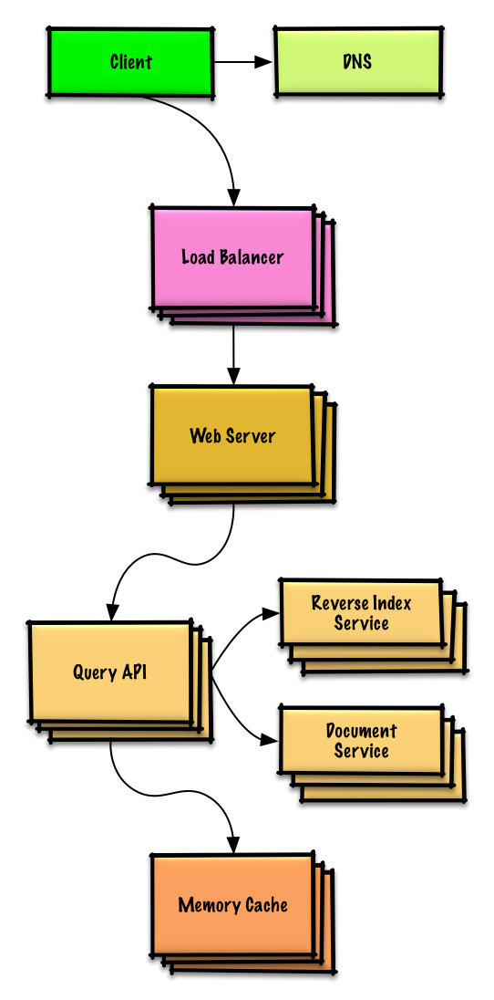
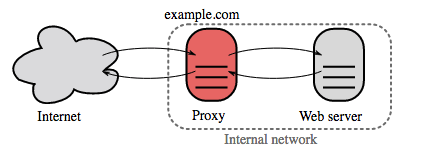
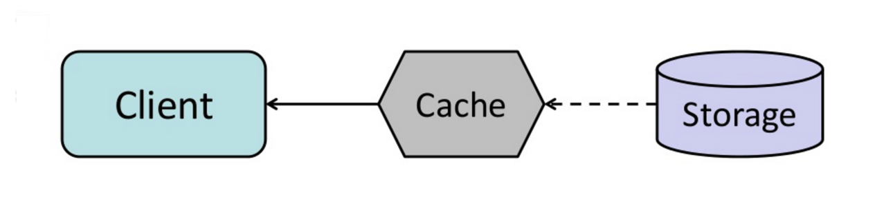
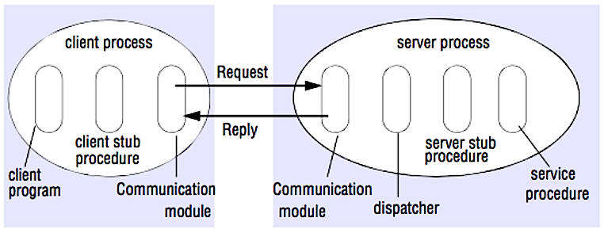

*[English](README.md) ∙ [日本語](README-ja.md) ∙ [简体中文](README-zh-Hans.md) ∙ [繁體中文](README-zh-TW.md) | [العَرَبِيَّة‎](https://github.com/donnemartin/system-design-primer/issues/170) ∙ [বাংলা](https://github.com/donnemartin/system-design-primer/issues/220) ∙ [Português do Brasil](https://github.com/donnemartin/system-design-primer/issues/40) ∙ [Deutsch](https://github.com/donnemartin/system-design-primer/issues/186) ∙ [ελληνικά](https://github.com/donnemartin/system-design-primer/issues/130) ∙ [עברית](https://github.com/donnemartin/system-design-primer/issues/272) ∙ [Italiano](https://github.com/donnemartin/system-design-primer/issues/104) ∙ [한국어](https://github.com/donnemartin/system-design-primer/issues/102) ∙ [فارسی](https://github.com/donnemartin/system-design-primer/issues/110) ∙ [Polski](https://github.com/donnemartin/system-design-primer/issues/68) ∙ [русский язык](https://github.com/donnemartin/system-design-primer/issues/87) ∙ [Español](https://github.com/donnemartin/system-design-primer/issues/136) ∙ [ภาษาไทย](https://github.com/donnemartin/system-design-primer/issues/187) ∙ [Türkçe](https://github.com/donnemartin/system-design-primer/issues/39) ∙ [tiếng Việt](https://github.com/donnemartin/system-design-primer/issues/127) ∙ [Français](https://github.com/donnemartin/system-design-primer/issues/250) | [Add Translation](https://github.com/donnemartin/system-design-primer/issues/28)*

**Help [translate](TRANSLATIONS.md) this guide!**

## Ghi chú từ người dịch

Một số từ khoá hoặc thuật ngữ chuyên ngành được giữ nguyên bản tiếng Anh.
Với hai lí do. Một là không có / khó kiếm từ tiếng Việt tương ứng được đa số chấp nhận.
Hai là mục tiêu của bài dịch này là để đẩy nhanh, giảm ma sát cho các bạn đọc tiếng Việt.
Bản này không nhắm vào trở thành một bản dịch hoàn chỉnh.
Do đó một số từ khoá, dù có thể có từ dịch tiếng Việt nhưng vẫn được để tiếng Anh nhằm mục đích để các bạn có thể dễ dàng tra cứu, research thêm.

# Thiết Kế Hệ Thống Cơ Bản

<p align="center">
  
  <br/>
</p>

## Động Lực

> Học được cách thiết kế những hệ thống lớn.
>
> Chuẩn bị trước khi phỏng vấn thiết kế hệ thống.

### Học cách thiết kế các hệ thống lớn

Học cách thiết kế hệ thống scalable giúp bạn trở thành một kỹ sư tốt hơn.

Thiết kế hệ thống là một chủ đề rộng. Có rất nhiều tài liệu rải rác trên web về các nguyên tắc thiết kế hệ thống.

Repo này là góp nhặt từ nhiều nguồn tài liệu một cách có **sắp xếp* để giúp bạn học được cách xây dựng nên những hệ thống cả khả năng scale được.

### Học hỏi từ cộng đồng mã nguồn mở

This is a continually updated, open source project.
Đây là dự án nguồn mỡ và liên tục được cập nhật

[Contributions](#contributing) are welcome!
[Đóng góp](#contributing) được chào đón!

### Prep for the system design interview
### Chuẩn bị cho phỏng vấn thiết kế hệ thống

In addition to coding interviews, system design is a **required component** of the **technical interview process** at many tech companies.
Bên cạnh phỏng vấn coding, thiết kế hệ thống là một **cấu thành quan trọng** trong **quy trình phỏng vấn kỹ thuật** ở rất nhiều công ty công nghệ.

**Practice common system design interview questions** and **compare** your results with **sample solutions**: discussions, code, and diagrams.

Additional topics for interview prep:
Các chủ đều bổ sung để chuẩn bị phỏng vấn:

* [Hướng dẫn học](#study-guide)
* [How to approach a system design interview question](#how-to-approach-a-system-design-interview-question)
* [Cách tiếp cận câu hỏi phỏng vấn thiết kế hệ thống](#how-to-approach-a-system-design-interview-question)
* [System design interview questions, **with solutions**](#system-design-interview-questions-with-solutions)
* [Các câu hỏi phỏng vấn thiết kế hệ thống, **với lời giải**](#system-design-interview-questions-with-solutions)
* [Object-oriented design interview questions, **with solutions**](#object-oriented-design-interview-questions-with-solutions)
* [Các câu hỏi phỏng vấn thiết kế hướng đối tượng, **với lời giải**](#object-oriented-design-interview-questions-with-solutions)
* [Additional system design interview questions](#additional-system-design-interview-questions)
* [Câu hỏi bổ sung thiết kế hệ thống](#additional-system-design-interview-questions)

## Anki flashcards

<p align="center">
  
  <br/>
</p>

The provided [Anki flashcard decks](https://apps.ankiweb.net/) use spaced repetition to help you retain key system design concepts.
[Bộ Anki flashcard] dùng cách ôn tập giãn cách (spaced repetition) để giúp bạn ghi nhớ sâu hơn các khái niệm thiết kế hệ thống cốt lỗi.

* [System design deck](https://github.com/donnemartin/system-design-primer/tree/master/resources/flash_cards/System%20Design.apkg)
* [Bộ card thiết kế hệ thống](https://github.com/donnemartin/system-design-primer/tree/master/resources/flash_cards/System%20Design.apkg)
* [System design exercises deck](https://github.com/donnemartin/system-design-primer/tree/master/resources/flash_cards/System%20Design%20Exercises.apkg)
* [Bộ card bài tập thiết kế hệ thống](https://github.com/donnemartin/system-design-primer/tree/master/resources/flash_cards/System%20Design%20Exercises.apkg)
* [Object oriented design exercises deck](https://github.com/donnemartin/system-design-primer/tree/master/resources/flash_cards/OO%20Design.apkg)
* [Bộ card thiết kế hướng đối tượng](https://github.com/donnemartin/system-design-primer/tree/master/resources/flash_cards/OO%20Design.apkg)

Great for use while on-the-go.
Phù hợp để ôn trên đường.

### Coding Resource: Interactive Coding Challenges
### Tài liệu code: Tương tác (literal translation would be odd here)

Looking for resources to help you prep for the [**Coding Interview**](https://github.com/donnemartin/interactive-coding-challenges)?
Bạn đang tìm tài liệu để hỗ trợ cho [**Phỏng vấn Coding**](https://github.com/donnemartin/interactive-coding-challenges)

<p align="center">
  
  <br/>
</p>

Check out the sister repo [**Interactive Coding Challenges**](https://github.com/donnemartin/interactive-coding-challenges), which contains an additional Anki deck:
Hãy xem qua repo "em" [**Coding Tương Tác**](https://github.com/donnemartin/interactive-coding-challenges), repo này chứa những bộ Anki bổ sung sau:

* [Coding deck](https://github.com/donnemartin/interactive-coding-challenges/tree/master/anki_cards/Coding.apkg)

## Đóng góp

> Học hỏi từ cộng đồng.

Feel free to submit pull requests to help:
Xin cứ tự nhiên tạo pull requests cho:

* Fix errors
* Improve sections
* Add new sections
* [Translate](https://github.com/donnemartin/system-design-primer/issues/28)

* Sửa lỗi
* Cải thiện các mục
* Tạo các mục mới
* [Phiên dịch](https://github.com/donnemartin/system-design-primer/issues/28)

Content that needs some polishing is placed [under development](#under-development).
Nội dung cần cải thiện được đặt ở [đang phát triển](#under-development)

Review the [Contributing Guidelines](CONTRIBUTING.md).

## Chỉ mục các chủ đề thiết kế hệ thống

> Summaries of various system design topics, including pros and cons.  **Everything is a trade-off**.
> Tóm tắt một loạt chủ đề thiết kế hệ thống, gồm cả mặt mạnh và yếu.  **Tất cả đều là đánh đổi**
>
> Each section contains links to more in-depth resources.
> Mỗi một phân đoạn đều chứa liên kết đều nhiều tài liệu chuyên sâu hơn.

<p align="center">
  
  <br/>
</p>

* [System design topics: start here](#system-design-topics-start-here)
* [Các chủ đề thiết kế hệ thống: bắt đầu ở đây](#system-design-topics-start-here)
    * [Step 1: Review the scalability video lecture](#step-1-review-the-scalability-video-lecture)
    * [Bước 1: Xem qua các video bài giảng về scalability](#step-1-review-the-scalability-video-lecture)
    * [Step 2: Review the scalability article](#step-2-review-the-scalability-article)
    * [Bước 2: Xem qua các bài viết về scalability](#step-2-review-the-scalability-article)
    * [Next steps](#next-steps)
    * [Bước tiếp theo](#next-steps)
* [Performance vs scalability](#performance-vs-scalability)
* [Hiệu suất và scalability](#performance-vs-scalability)
* [Latency vs throughput](#latency-vs-throughput)
* [Độ trễ và công suất](#latency-vs-throughput)
* [Availability vs consistency](#availability-vs-consistency)
* [Tính khả dụng và tính nhất quán](#availability-vs-consistency)
    * [CAP theorem](#cap-theorem)
    * [Định lý CAP](#cap-theorem)
        * [CP - consistency and partition tolerance](#cp---consistency-and-partition-tolerance)
        * [CP - tính nhất quán và dung sai phân vùng](#cp---consistency-and-partition-tolerance)
        * [AP - availability and partition tolerance](#ap---availability-and-partition-tolerance)
        * [AP - tính khả dụng và dung sai phân vùng](#ap---availability-and-partition-tolerance)
* [Consistency patterns](#consistency-patterns)
* [Các mẫu hình về nhất quán](#consistency-patterns)  # FIXME: bad translation
    * [Weak consistency](#weak-consistency)
    * [Nhất quán yếu](#weak-consistency)  # FIXME: bad translation
    * [Eventual consistency](#eventual-consistency)
    * [Hậu nhất quán](#eventual-consistency)  # FIXME: bad translation
    * [Nhất quán mạnh](#strong-consistency)  # FIXME: bad translation
* [Availability patterns](#availability-patterns)
* [Các mẫu hình của tính khả dụng](#availability-patterns)
    * [Fail-over](#fail-over)
    * [Replication](#replication)
    * [Availability in numbers](#availability-in-numbers)
* [Domain name system](#domain-name-system)
* [Hệ thống tên miền](#domain-name-system)
* [Content delivery network](#content-delivery-network)
    * [Push CDNs](#push-cdns)
    * [Pull CDNs](#pull-cdns)
* [Cân bằng tải](#load-balancer)
    * [Active-passive](#active-passive)
    * [Chủ động - bị động](#active-passive)
    * [Active-active](#active-active)
    * [Chủ động - chủ động](#active-active)
    * [Layer 4 load balancing](#layer-4-load-balancing)
    * [Cân bằng tải ở lớp 4](#layer-4-load-balancing)
    * [Layer 7 load balancing](#layer-7-load-balancing)
    * [Cân bằng tải ở lớp 7](#layer-7-load-balancing)
    * [Horizontal scaling](#horizontal-scaling)
    * [Mở rộng bề ngang](#horizontal-scaling)  # FIXME: bad translation
* [Reverse proxy (web server)](#reverse-proxy-web-server)
    * [Load balancer vs reverse proxy](#load-balancer-vs-reverse-proxy)
* [Application layer](#application-layer)
    * [Microservices](#microservices)
    * [Service discovery](#service-discovery)
* [Database](#database)
* [Cơ sở dữ liệu](#database)
    * [Relational database management system (RDBMS)](#relational-database-management-system-rdbms)
    * [Cơ sở dữ liệu quan hệ (RDBMS)](#relational-database-management-system-rdbms)
        * [Master-slave replication](#master-slave-replication)
        * [Tái tạo Master-slaver](#master-slave-replication) # FIXME: bad translation
        * [Master-master replication](#master-master-replication)
        * [Tái tạo master-master](#master-master-replication)
        * [Federation](#federation)
        * [Liên đoàn](#federation)
        * [Sharding](#sharding)
        * [Phân mảnh](#sharding)
        * [Denormalization](#denormalization)
        * [Phản tiêu chuẩn](#demonomalization) # FIXME: really bad translation
        * [SQL tuning](#sql-tuning)
        * [Tinh chỉnh SQL](#sql-tuning)
    * [NoSQL](#nosql)
    * [NoSQL](#nosql)
        * [Key-value store](#key-value-store)
        * [Kho khoá-trị](#key-value-store)
        * [Document store](#document-store)
        * [Kho tài liệu](#document-store) # FIXME: bad translation
        * [Wide column store](#wide-column-store)
        * [Kho cột rộng](#wide-column-store)
        * [Graph Database](#graph-database)
        * [Cơ sở dữ liệu đồ thị](#graph-database)
    * [SQL or NoSQL](#sql-or-nosql)
    * [SQL hay NoSQL](#sql-or-nosql)
* [Cache](#cache)
* [Cache](#cache)
    * [Client caching](#client-caching)
    * [CDN caching](#cdn-caching)
    * [Web server caching](#web-server-caching)
    * [Database caching](#database-caching)
    * [Application caching](#application-caching)
    * [Caching at the database query level](#caching-at-the-database-query-level)
    * [Caching at the object level](#caching-at-the-object-level)
    * [When to update the cache](#when-to-update-the-cache)
        * [Cache-aside](#cache-aside)
        * [Write-through](#write-through)
        * [Write-behind (write-back)](#write-behind-write-back)
        * [Refresh-ahead](#refresh-ahead)
* [Asynchronism](#asynchronism)
* [Bất đồng bộ]
    * [Message queues](#message-queues)
    * [Hàng đợi tin](#message-queues)
    * [Task queues](#task-queues)
    * [Hàng đợi việc](#task-queues)
    * [Back pressure](#back-pressure)
    * [Giảm tải nghịch](#back-pressure) # FIXME: probably bad translation
* [Communication](#communication)
* [Giao tiếp](#communication)
    * [Transmission control protocol (TCP)](#transmission-control-protocol-tcp)
    * [User datagram protocol (UDP)](#user-datagram-protocol-udp)
    * [Remote procedure call (RPC)](#remote-procedure-call-rpc)
    * [Representational state transfer (REST)](#representational-state-transfer-rest)
* [Security](#security)
* [An ninh](#security)
* [Appendix](#appendix)
* [Phụ lục](#security)
    * [Bảng bình phương](#powers-of-two-table)
    * [Latency numbers every programmer should know](#latency-numbers-every-programmer-should-know)
    * [Additional system design interview questions](#additional-system-design-interview-questions)
    * [Real world architectures](#real-world-architectures)
    * [Company architectures](#company-architectures)
    * [Company engineering blogs](#company-engineering-blogs)
* [Under development](#under-development)
* [Đang phát triển](#under-development)
* [Credits](#credits)
* [Contact info](#contact-info)
* [License](#license)

## Hướng dẫn học

> Suggested topics to review based on your interview timeline (short, medium, long).
> Các chủ đề được đề xuất để ôn tập dựa vào lịch trình phỏng vấn (ngắn, vừa, dài)


**Hỏi: Để cho việc phỏng vấn thì tôi có cần biết tất cả mọi thứ ở đây?**

**Đáp: Không, bạn không cần biết tất cả mọi thứ ở đây để chuẩn bị cho phỏng vấn.**

What you are asked in an interview depends on variables such as:
Những gì bạn được hỏi trong buổi phỏng vấn sẽ tuỳ thuộc vào những yếu tố sau:

* How much experience you have
* What your technical background is
* What positions you are interviewing for
* Which companies you are interviewing with
* Luck

* Bạn có bao lâu kinh nghiệm
* Nền kiến thức kỹ thuật của bạn là gì
* Vị trí mà bạn phỏng vấn vào
* Bạn phỏng vấn với công ty nào
* May mắn

More experienced candidates are generally expected to know more about system design.  Architects or team leads might be expected to know more than individual contributors.  Top tech companies are likely to have one or more design interview rounds.
Ứng cử viên càng có bề dày kinh nghiệm thì càng được mong dợi là sẽ biết nhiều hơn về thiết kế hệ thống.  Architects hoặc team leads có được mong là biết nhiều hơn những cá nhân khác.  Các công ty hàng đầu thì khả năng cao là có nhiều phỏng vấn về thiết kế hơn.

Start broad and go deeper in a few areas.  It helps to know a little about various key system design topics.  Adjust the following guide based on your timeline, experience, what positions you are interviewing for, and which companies you are interviewing with.
Bắt đầu ở bề rộng và đi sâu hơn vào từng vùng.  Biết một chút cho nhiều chủ đề khác nhau thì thường sẽ giúp ít bạn hơn.  Điều chỉnh những hướng dẫn trong đây tùy vào thời gian, kinh nghiệm, và vị trí nào mà bạn đang phỏng vấn vào, và công ty nào mà bạn phỏng vấn với.

* **Short timeline** - Aim for **breadth** with system design topics.  Practice by solving **some** interview questions.
* **Medium timeline** - Aim for **breadth** and **some depth** with system design topics.  Practice by solving **many** interview questions.
* **Long timeline** - Aim for **breadth** and **more depth** with system design topics.  Practice by solving **most** interview questions.

* **Thời gian ngắn** - Nhắm vào bề rộng của các chủ đề thiết kế hệ thống. Tập luyện bằng cách giải quyết **một số** câu hỏi phỏng vấn.
* **Thời gian trung bình** - Nhắm vào bề rộng và một chút phần sâu với các chủ đều thiết kế hệ thống. Tập luyện giải quyết **nhiều** câu hỏi phỏng vấn.
* **Thời gian dài** - Nhắm vào bề rộng và nhiều phần sâu với các chủ đề thiết ké hệ thống. Tập luyện giải quyết **hầu hết** các câu hỏi phỏng vấn.

| | Short | Medium | Long |
|---|---|---|---|
| Read through the [System design topics](#index-of-system-design-topics) to get a broad understanding of how systems work | :+1: | :+1: | :+1: |
| Read through a few articles in the [Company engineering blogs](#company-engineering-blogs) for the companies you are interviewing with | :+1: | :+1: | :+1: |
| Read through a few [Real world architectures](#real-world-architectures) | :+1: | :+1: | :+1: |
| Review [How to approach a system design interview question](#how-to-approach-a-system-design-interview-question) | :+1: | :+1: | :+1: |
| Work through [System design interview questions with solutions](#system-design-interview-questions-with-solutions) | Some | Many | Most |
| Work through [Object-oriented design interview questions with solutions](#object-oriented-design-interview-questions-with-solutions) | Some | Many | Most |
| Review [Additional system design interview questions](#additional-system-design-interview-questions) | Some | Many | Most |

## How to approach a system design interview question
## Cách tiếp cận câu hỏi phỏng vấn thiết kế hệ thống

> How to tackle a system design interview question.
> Cách xử trí một câu hỏi thiết kế hệ thống.

The system design interview is an **open-ended conversation**.  You are expected to lead it.
Phỏng vấn thiết kế hệ thống là đối thoại mở.  Bạn được trông đợi là người dẫn dắt.

You can use the following steps to guide the discussion.  To help solidify this process, work through the [System design interview questions with solutions](#system-design-interview-questions-with-solutions) section using the following steps.
Bạn có thể dùng những bước sao để lái cuộc thảo luận.  Để củng cố, hãy đi qua phần [Các câu hỏi phỏng vấn thiết kế hệ thống kèm lời giải](#system-design-interview-questions-with-solutions) sử dụng các bước sau.

### Step 1: Outline use cases, constraints, and assumptions
### Bước 1: Phác thảo các trường hợp sử dụng, ràng buộc, và các giả định

Gather requirements and scope the problem.  Ask questions to clarify use cases and constraints.  Discuss assumptions.
Thu thập nhu cầu và phạm vi của vấn đề.  Đặt các câu hỏi làm rõ các nhu cầu sử dụng và ràng buộc.  Bàn bạc các giả định.

* Who is going to use it?
* How are they going to use it?
* How many users are there?
* What does the system do?
* What are the inputs and outputs of the system?
* How much data do we expect to handle?
* How many requests per second do we expect?
* What is the expected read to write ratio?

* Ai là người sử dụng?
* Họ sử dụng với cách nào?
* Có bao nhiêu người dùng?
* Hệ thống này làm gì?
    * Đầu vào và đ

### Step 2: Create a high level design

Outline a high level design with all important components.

* Sketch the main components and connections
* Phác thảo các thành phần chính và kết nối
* Justify your ideas
* Chứng minh ý tưởng

### Step 3: Design core components
### Bước 3: Thiết kế các thành phần lõi

Dive into details for each core component.  For example, if you were asked to [design a url shortening service](solutions/system_design/pastebin/README.md), discuss:
Đào sâu vào chi tiết của từng thành phần lõi.  Ví dụ, nếu bạn được đề nghị [thiết kế một dịch vụ rút ngắn url](solutions/system_design/pastebin/README.md), hãy trình bày:

* Generating and storing a hash of the full url
* Tạo và lưu trữ một mã băm từ url đầy đủ
    * [MD5](solutions/system_design/pastebin/README.md) và [Base62](solutions/system_design/pastebin/README.md)
    * Hash collisions
    * Va chạm mã băm
    * SQL hay NoSQL
    * Database schema
* Translating a hashed url to the full url
* Dịch một url đã được băm trở lại url đầy đủ
    * Database lookup
    * Truy cứu database
* API and object-oriented design
* API và thiết kế hướng đối tượng

### Step 4: Scale the design
### Bước 4: "Scale" thiết kế

Identify and address bottlenecks, given the constraints.  For example, do you need the following to address scalability issues?
Nhận diện và xử lý cổ chai, với các ràng buộc được đưa ra.  Ví du, bạn có cần những thứ sau để giải quyết vấn đề về scalability?

* Load balancer
* Horizontal scaling
* Caching
* Database sharding

* Cân bằng tải
* Scale ngang
* Caching
* Database sharding  # FIXME: I don't know how to translate this

Discuss potential solutions and trade-offs.  Everything is a trade-off.  Address bottlenecks using [principles of scalable system design](#index-of-system-design-topics).
Thảo luận các phương án khả thi và đánh đổi.  Mọi thứ đều là đánh đổi.  Giải quyết cổ chai bằng cách dùng [các nguyên tắc của thiết kế hệ thống scalable](#index-of-system-design-topics)

### Back-of-the-envelope calculations
### Tính toán nháp

You might be asked to do some estimates by hand.  Refer to the [Appendix](#appendix) for the following resources:
Bạn có thể được yêu cầu làm một số ước lượng bằng tay.  Tham khảo phần [Phụ lục](#appendix) cho một số tài liệu sau:

* [Use back of the envelope calculations](http://highscalability.com/blog/2011/1/26/google-pro-tip-use-back-of-the-envelope-calculations-to-choo.html)
* [Bảng bình phương](#powers-of-two-table)
* [Latency numbers every programmer should know](#latency-numbers-every-programmer-should-know)

* [Tính toán nháp](http://highscalability.com/blog/2011/1/26/google-pro-tip-use-back-of-the-envelope-calculations-to-choo.html)
* [Bảng bình phương](#powers-of-two-table)
* [Những độ trễ mà mọi lập trình viên nên biết](#latency-numbers-every-programmer-should-know)

### Source(s) and further reading

Check out the following links to get a better idea of what to expect:

* [How to ace a systems design interview](https://www.palantir.com/2011/10/how-to-rock-a-systems-design-interview/)
* [The system design interview](http://www.hiredintech.com/system-design)
* [Intro to Architecture and Systems Design Interviews](https://www.youtube.com/watch?v=ZgdS0EUmn70)
* [System design template](https://leetcode.com/discuss/career/229177/My-System-Design-Template)

## Các câu hỏi phỏng vấn thiết kế hệ thống kèm lời giải

> Common system design interview questions with sample discussions, code, and diagrams.
> Các câu hỏi phỏng vấn thiết kế hệ thống phổ biến kèm với các đối thoại mẫu, mã nguồn, và biểu đồ.
>
> Solutions linked to content in the `solutions/` folder.
> Đường dẫn bài giải nằm trong thư mục `solutions/`.

| Question | |
|---|---|
| Design Pastebin.com (or Bit.ly) | [Solution](solutions/system_design/pastebin/README.md) |
| Design the Twitter timeline and search (or Facebook feed and search) | [Solution](solutions/system_design/twitter/README.md) |
| Design a web crawler | [Solution](solutions/system_design/web_crawler/README.md) |
| Design Mint.com | [Solution](solutions/system_design/mint/README.md) |
| Design the data structures for a social network | [Solution](solutions/system_design/social_graph/README.md) |
| Design a key-value store for a search engine | [Solution](solutions/system_design/query_cache/README.md) |
| Design Amazon's sales ranking by category feature | [Solution](solutions/system_design/sales_rank/README.md) |
| Design a system that scales to millions of users on AWS | [Solution](solutions/system_design/scaling_aws/README.md) |
| Add a system design question | [Contribute](#contributing) |


| Câu hỏi | |
|---|---|
| Thiết kế Pastebin.com (or Bit.ly) | [Lời giải](solutions/system_design/pastebin/README.md) |
| Thiết kế Twitter timeline và tìm kiếm (or Facebook feed and tìm kiếm) | [Lời giải](solutions/system_design/twitter/README.md) |
| Thiết kế một web crawler | [Lời giải](solutions/system_design/web_crawler/README.md) |
| Thiết kế Mint.com | [Lời giải](solutions/system_design/mint/README.md) |
| Thiết kế the data structures for a social network | [Lời giải](solutions/system_design/social_graph/README.md) |
| Thiết kế a key-value store for a tìm kiếm engine | [Lời giải](solutions/system_design/query_cache/README.md) |
| Thiết kế Amazon's sales ranking by category feature | [Lời giải](solutions/system_design/sales_rank/README.md) |
| Thiết kế a system that scales to millions of users on AWS | [Lời giải](solutions/system_design/scaling_aws/README.md) |
| Add a system design question | [Contribute](#contributing) |


### Design Pastebin.com (or Bit.ly)
### Thiết kế Pastebin.com (hoặc Bit.ly)

[View exercise and solution](solutions/system_design/pastebin/README.md)
[Xem bài tập và bài giải](solutions/system_design/pastebin/README.md)


### Design the Twitter timeline and search (or Facebook feed and search)
### Thiết kế Twitter timeline và tìm kiếm (hoặc Facebook feed và tìm kiếm)

[Xem bài tập và bài giải](solutions/system_design/twitter/README.md)


### Thiết kế một web crawler

[View exercise and solution](solutions/system_design/web_crawler/README.md)
[](solutions/system_design/web_crawler/README.md)


### Thiết kế Mint.com

[View exercise and solution](solutions/system_design/mint/README.md)
[Xem bài tập và bài giải](solutions/system_design/mint/README.md)


### Thiết kế các cấu trúc dữ liệu cho một mạng xã hội

[Xem bài tập và bài giải](solutions/system_design/social_graph/README.md)


### Design a key-value store for a search engine
### Thiết kế một kho khoá-giá trị (key-value store) phục vụ một máy tìm kiếm (search engine)

[Xem bài tập và bài giải](solutions/system_design/query_cache/README.md)



### Design Amazon's sales ranking by category feature
### Thiết kế bảng xếp hạng bán hàng theo loại cho Amazon.

[Xem bài tập và bài giải](solutions/system_design/sales_rank/README.md


### Design a system that scales to millions of users on AWS
### Thiết kế một hệ thống có thể scale đến hàng triệu người dùng trên AWS

[Xem bài tập và bài giải](solutions/system_design/scaling_aws/README.md)


## Object-oriented design interview questions with solutions
## Các câu hỏi về thiết kế hướng đối với bài giải

> Common object-oriented design interview questions with sample discussions, code, and diagrams.
>
> Solutions linked to content in the `solutions/` folder.

> Các câu hỏi phỏng vấn phổ biến về thiết kế hướng đối tượng với các thảo luận mẫu, code, và biểu đồ.
>
> Bài giải với các nội dung liên kết nằm trong thư mục `solutions/`

>**Note: This section is under development**
>**Chú thích: Phần này vẫn đang được phát triển**

| Question | |
|---|---|
| Design a hash map | [Solution](solutions/object_oriented_design/hash_table/hash_map.ipynb)  |
| Design a least recently used cache | [Solution](solutions/object_oriented_design/lru_cache/lru_cache.ipynb)  |
| Design a call center | [Solution](solutions/object_oriented_design/call_center/call_center.ipynb)  |
| Design a deck of cards | [Solution](solutions/object_oriented_design/deck_of_cards/deck_of_cards.ipynb)  |
| Design a parking lot | [Solution](solutions/object_oriented_design/parking_lot/parking_lot.ipynb)  |
| Design a chat server | [Solution](solutions/object_oriented_design/online_chat/online_chat.ipynb)  |
| Design a circular array | [Contribute](#contributing)  |
| Add an object-oriented design question | [Contribute](#contributing) |


| Câu hỏi | |
|---|---|
| Thiết kế một hash map | [Solution](solutions/object_oriented_design/hash_table/hash_map.ipynb)  |
| Thiết kế một LRU cache | [Solution](solutions/object_oriented_design/lru_cache/lru_cache.ipynb)  |
| Thiết kế một tổng đài | [Solution](solutions/object_oriented_design/call_center/call_center.ipynb)  |
| Thiết kế một bộ bài | [Solution](solutions/object_oriented_design/deck_of_cards/deck_of_cards.ipynb)  |
| Thiết kế một bãi đổ xe | [Solution](solutions/object_oriented_design/parking_lot/parking_lot.ipynb)  |
| Thiết kế một server cho chat | [Solution](solutions/object_oriented_design/online_chat/online_chat.ipynb)  |
| Thiết kế một mảng vòng | [Contribute](#contributing)  |
| Bổ sung một câu hỏi về thiết kế hướng đối tượng | [Contribute](#contributing) |

## System design topics: start here
## Các chủ đề thiết kế hệ thống: bắt đầu ở đây

New to system design?
Mới tiếp cận với thiết kế hệ thống?

First, you'll need a basic understanding of common principles, learning about what they are, how they are used, and their pros and cons.
Đầu tiên bạn sẽ cần một số hiểu biết cơ bản về các nguyên lý chung, học về định nghĩa, cách sử dụng, cùng với điểm điểm được và mất cả các nguyên lý này.

### Step 1: Review the scalability video lecture
### Buốc 1: Xem các video bài giảng về khả năng mở rộng (scalability)

[Scalability Lecture at Harvard](https://www.youtube.com/watch?v=-W9F__D3oY4)
[Bài giảng về tính mở rộng (scalability) tại Harvard](https://www.youtube.com/watch?v=-W9F__D3oY4)

* Topics covered:
    * Vertical scaling
    * Horizontal scaling
    * Caching
    * Load balancing
    * Database replication
    * Database partitioning
* Các chủ đề bao gồm:
    * Vertical scaling
    * Horizontal scaling
    * Caching
    * Cân bằng tải
    * Bản sao cơ sở dữ liệu
    * Phân vùng cơ sở dữ liệu

### Step 2: Review the scalability article
### Bước 2: Xem qua các bài báo về scalability

[Scalability](http://www.lecloud.net/tagged/scalability/chrono)

* Topics covered:
    * [Clones](http://www.lecloud.net/post/7295452622/scalability-for-dummies-part-1-clones)
    * [Databases](http://www.lecloud.net/post/7994751381/scalability-for-dummies-part-2-database)
    * [Caches](http://www.lecloud.net/post/9246290032/scalability-for-dummies-part-3-cache)
    * [Asynchronism](http://www.lecloud.net/post/9699762917/scalability-for-dummies-part-4-asynchronism)

### Next steps

Next, we'll look at high-level trade-offs:

* **Performance** vs **scalability**
* **Latency** vs **throughput**
* **Availability** vs **consistency**

Keep in mind that **everything is a trade-off**.
Nên nhớ rằng **mọi thứ đều là đánh đổi**

Then we'll dive into more specific topics such as DNS, CDNs, and load balancers.
Sau đó chung ta sẽ đi sâu vào từng chủ đề cụ thể như là DNS, CDNs và cân bằng tải.

## Performance vs scalability
## Hiệu năng và tính mở rộng

A service is **scalable** if it results in increased **performance** in a manner proportional to resources added. Generally, increasing performance means serving more units of work, but it can also be to handle larger units of work, such as when datasets grow.<sup><a href=http://www.allthingsdistributed.com/2006/03/a_word_on_scalability.html>1</a></sup>
Một dịch vụ có tính mở rộng nếu đạt tăng được hiệu năng tỷ lệ thuận với tài nguyên được thêm vào. Tăng hiệu năng đồng nghĩa với phục vụ được nhiều đơn vị công việc hơn, nhưng cũng có nghĩa là xử lý được công việc lớn hơn, chẳng hạn như dataset tăng.<sup><a href=http://www.allthingsdistributed.com/2006/03/a_word_on_scalability.html>1</a></sup>

Another way to look at performance vs scalability:
Một cách nhìn khác về hiệu năng và tính mở rộng:

* If you have a **performance** problem, your system is slow for a single user.
* Nếu bạn có vấn đề về **hiệu năng**, hệ thống của bạn chậm cho một người dùng.
* If you have a **scalability** problem, your system is fast for a single user but slow under heavy load.
* Nếu bạn có vấn đề về *tính mở rộng*, hệ thống của bạn nhanh cho một người dùng nhưng chậm khi chịu tải nhiều.

### Source(s) and further reading

* [A word on scalability](http://www.allthingsdistributed.com/2006/03/a_word_on_scalability.html)
* [Scalability, availability, stability, patterns](http://www.slideshare.net/jboner/scalability-availability-stability-patterns/)

## Latency vs throughput
## Độ trễ và lưu lượng

**Latency** is the time to perform some action or to produce some result.
**Độ trễ** là thời gian thực hiện một tác vụ và cho ra kết quả.

**Throughput** is the number of such actions or results per unit of time.
**Lưu lượng** là số lượng tác vụ và kết quả trong một đơn vị thời gian.

Generally, you should aim for **maximal throughput** with **acceptable latency**.
Nhìn chung là bận cần nhắm vào **tối đa hoá lưu lượng** với **độ trễ ở mức chấp nhận**

### Source(s) and further reading
### Nguồn đọc thêm

* [Hiểu về độ trễ và lưu lượng](https://community.cadence.com/cadence_blogs_8/b/sd/archive/2010/09/13/understanding-latency-vs-throughput)

## Tính khả dụng so với tính nhất quán

### Định lý CAP

<p align="center">
  
  <br/>
  <i><a href=http://robertgreiner.com/2014/08/cap-theorem-revisited>Nguồn: CAP theorem revisited</a></i>
</p>

In a distributed computer system, you can only support two of the following guarantees:
Trong một hệ thống máy tính phân tán, ta chỉ có thể hỗ trợ hai trong số những bảo toàn sau đây:

* **Consistency** - Every read receives the most recent write or an error
* **Availability** - Every request receives a response, without guarantee that it contains the most recent version of the information
* **Partition Tolerance** - The system continues to operate despite arbitrary partitioning due to network failures

* **Tính nhất quán** - Mọi thao tác đọc nhận được kết quả ghi gần nhất hoặc lỗi
* **Tính khả dụng** - Mọi yêu cầu đều nhận được hồi đáp, nhưng không bảo đảm là chứa phiên bản gần nhất.
* **Dung sai phân vùng** - Hệ thống tiếp tục hoạt động mặc dù bị phân vùng do lỗi mạng lưới.

*Networks aren't reliable, so you'll need to support partition tolerance.  You'll need to make a software tradeoff between consistency and availability.*

#### CP - tính nhất quán và dung sai phân vùng

Waiting for a response from the partitioned node might result in a timeout error.  CP is a good choice if your business needs require atomic reads and writes.
Việc đợi phản hồi từ một node bị phân vùng (mạng) có thể mang lại kết quả lỗi timeout. CP là một lựa chọn tốt nếu nhu cầu đòi hỏi đọc và ghi phải atomic.

#### AP - availability and partition tolerance
#### AP - availability và partition tolerance

Responses return the most readily available version of the data available on any node, which might not be the latest.  Writes might take some time to propagate when the partition is resolved.
Các câu trả lời trả về phiên bản đang có của dữ liệu trên node, có thể không phải là bản mới nhất.  Việc ghi có thể mất thời gian để lan truyền khi các partition được phân giải.  # FIXME: "phân giải" doesn't sound right.

AP is a good choice if the business needs allow for [eventual consistency](#eventual-consistency) or when the system needs to continue working despite external errors.
AP là một lựa chọn tốt cho các nhu cầu cần [eventual consistency](#eventual-consistency) hoặc các hệ thống cần tiếp tục vận hành khi đối mặt với các lỗi hỏng bên ngoài.

### Source(s) and further reading
### Các nguồn tài liệu đọc thêm

* [CAP theorem revisited](http://robertgreiner.com/2014/08/cap-theorem-revisited/)
* [A plain english introduction to CAP theorem](http://ksat.me/a-plain-english-introduction-to-cap-theorem)
* [CAP FAQ](https://github.com/henryr/cap-faq)
* [The CAP theorem](https://www.youtube.com/watch?v=k-Yaq8AHlFA)

## Consistency patterns
## Các khuôn mẫu về tính nhất quán

With multiple copies of the same data, we are faced with options on how to synchronize them so clients have a consistent view of the data.  Recall the definition of consistency from the [CAP theorem](#cap-theorem) - Every read receives the most recent write or an error.
Với nhiều phiên bản của cùng một dữ liệu, chúng ta đối mặt với những cách thức đồng bộ để các client nhìn dữ liệu một cách nhất quán.  Gợi nhớ lại định nghĩa của tính nhất quán [Định lý CAP](#cap-theorem) - Mọi hành vi đọc nhận được phiên bản ghi gần nhất hoặc là một lỗi.

### Weak consistency
### Nhất quán kém

After a write, reads may or may not see it.  A best effort approach is taken.
Sau một sự kiện ghi, các lần đọc sau có thể hoặc không thấy được sự thay đổi.  Phương cách "tốt nhất có thể" được áp dụng.  # FIXME: bad translation

This approach is seen in systems such as memcached.  Weak consistency works well in real time use cases such as VoIP, video chat, and realtime multiplayer games.  For example, if you are on a phone call and lose reception for a few seconds, when you regain connection you do not hear what was spoken during connection loss.
Phương cách này thấy áp dụng ở nhiều hệ thống như memcached.  Nhất quán kém làm việc tốt trong cách nhu cầu cần thời gian thực như VoIP, video chat, và game thời gian thực nhiều người chơi.  Ví dụ nếu trong một cuộc gọi, ta bị mất tín hiệu một vài giây, khi lấy lại được kết nối thì bạn không nghe lại cuộc nói chuyện trong quá trình đứt kết nối.

### Eventual consistency

After a write, reads will eventually see it (typically within milliseconds).  Data is replicated asynchronously.
Sau một sự kiện ghi, các lần đọc sau sẽ dần thấy được (thường thì trong một vài milli giây).  Dự liệu được tái tạo một cách bất đồng bộ.

This approach is seen in systems such as DNS and email.  Eventual consistency works well in highly available systems.
Cách tiếp cận này được thấy trong các hệ thống như là DNS hay email. Eventual consistency làm việc tốt trong các hệ thống với availability cao.

### Strong consistency

After a write, reads will see it.  Data is replicated synchronously.
Sau một sự kiện ghi, các lần đọc sau sẽ (chắc chắn) thấy.  Dữ liệu được tái tạo một cách đồng bộ.

This approach is seen in file systems and RDBMSes.  Strong consistency works well in systems that need transactions.
Cách tiếp cận này được thấy trong file systems và RDBMS.  Strong consistency làm việc tốt trong các hệ thống cần transactions.

### Source(s) and further reading

* [Transactions across data centers](http://snarfed.org/transactions_across_datacenters_io.html)

## Availability patterns
## Các mẫu hình về tính khả dụng

There are two complementary patterns to support high availability: **fail-over** and **replication**.
Có hai mẫu hình bổ sung lẫn nhau hỗ trợ khả năng khả dụng cao: **fail-over** và **bản tái tạo***  # FIXME: bad translation

### Fail-over

#### Active-passive
#### Chủ động-bị động

With active-passive fail-over, heartbeats are sent between the active and the passive server on standby.  If the heartbeat is interrupted, the passive server takes over the active's IP address and resumes service.
Với fail-over chủ động - bị động, nhịp tim (heartbeat) sẽ được gửi giữa máy chủ chủ động và máy chủ bị động trực chờ.  Nếu nhịp tim bị ngắt quãng, máy chủ bị động sẽ tiếp quản địa chỉ IP của máy chủ động và tiếp tục dịch vụ.

The length of downtime is determined by whether the passive server is already running in 'hot' standby or whether it needs to start up from 'cold' standby.  Only the active server handles traffic.
Độ dài của thời gian dừng sẽ được quyết định bởi việc máy chủ bị động có đang chạy ở chế độ trực chờ sẵn sàng ('hot' standby) hay cần phải được khởi động ('cold' standby).  Chỉ duy nhất máy chủ chủ động xử lí liên lạc.  # FIXME: dull translation

Active-passive failover can also be referred to as master-slave failover.
Failover chủ động - bị động còn được biết dưới tên failover master-slave.

#### Chủ động-chủ động

In active-active, both servers are managing traffic, spreading the load between them.
Trong mô hình chủ động-chủ động, cả hai server đều quản lý traffic, giàn trải load cho nhau.

If the servers are public-facing, the DNS would need to know about the public IPs of both servers.  If the servers are internal-facing, application logic would need to know about both servers.
Nếu các server là public-facing, DNS sẽ cần phải biết public IP của cả hai.  Nếu các server là internal-facing, thì application logic cần biết về cả hai server.

Active-active failover can also be referred to as master-master failover.
Failover trong chủ động-chủ động còn được biết đến là master-master failover.

### Disadvantage(s): failover
### Bất lợi của failover

* Fail-over adds more hardware and additional complexity.
* Fail-over đòi hỏi thêm phần cứng và tăng độ phức tạp.
* There is a potential for loss of data if the active system fails before any newly written data can be replicated to the passive.
* Sẽ có khả năng mất dữ liệu nếu hệ thống đang trạng thái chủ động fail trước khi dữ liệu mới được tái tạo vào hệ thống đang ở trạng thái bị động.

### Replication
### Tái tạo

#### Master-slave and master-master
#### Master-slave và master-master

This topic is further discussed in the [Database](#database) section:
Chủ đề này được sẽ được phân tích thêm trong phần [Cơ sở dữ liệu](#database):

* [Master-slave replication](#master-slave-replication)
* [Tái tạo trong master-slave](#master-slave-replication)
* [Tái tạo trong master-master](#master-master-replication)

### Availability in numbers
### Các con số trong tính khả dụng

Availability is often quantified by uptime (or downtime) as a percentage of time the service is available.  Availability is generally measured in number of 9s--a service with 99.99% availability is described as having four 9s.
Tính khả dụng thường được lượng hoá bởi uptime (hoặc downtime) bằng tỉ lệ phần trăm của thời gian dịch vụ ở trạng thái khả dụng.  Tính khả dụng nhìn chung được đo lường với đơn vị số "9"--như một dịch vụ khả dụng với mức 99.99% sử dụng bốn số "9".

#### 99.9% availability - three 9s
#### 99.9% khả dụng - "ba 9"

| Duration            | Acceptable downtime|
|---------------------|--------------------|
| Downtime per year   | 8h 45min 57s       |
| Downtime per month  | 43m 49.7s          |
| Downtime per week   | 10m 4.8s           |
| Downtime per day    | 1m 26.4s           |

| Thời lượng          | Downtime chấp nhận    |
|---------------------|-----------------------|
| Downtime hằng năm   | 8 giờ 45 phút 57 giây |
| Downtime hằng tháng | 43 phút 49,7 giây     |
| Downtime hằng tuần  | 10 phút 4,8 giây      |
| Downtime hằng ngày  | 1 phút 26,4 giây      |

#### 99.99% availability - four 9s
#### 99.99% khả dụng - "bốn 9"

| Duration            | Acceptable downtime|
|---------------------|--------------------|
| Downtime per year   | 52min 35.7s        |
| Downtime per month  | 4m 23s             |
| Downtime per week   | 1m 5s              |
| Downtime per day    | 8.6s               |

| Thời lượng          | Downtime chấp nhận |
|---------------------|--------------------|
| Downtime hằng năm   | 52 phút 35,7 giây  |
| Downtime hằng tháng | 4 phút 23 giây     |
| Downtime hằng tuần  | 1 phút 5 giây      |
| Downtime hằng ngày  | 8,6 giây           |

#### Availability in parallel vs in sequence
#### Tính khả dụng trong thực thi song song so với trình tự

If a service consists of multiple components prone to failure, the service's overall availability depends on whether the components are in sequence or in parallel.
Nếu một dịch vụ bao gồm nhiều thành phần dễ mắc lỗi, thì tính khả dụng toàn phần của dịch vụ này phụ thuộc vào các thành phần nằm trong một trình tự hay nằm song song.

###### In sequence
###### Trình tự

Overall availability decreases when two components with availability < 100% are in sequence:
Tính khả dụng toàn phần giảm đi khi có 2 thành phần với tính khả dụng < 100% nằm theo trình tự:


```
Availability (Total) = Availability (Foo) * Availability (Bar)
```
```
Tính khả dụng (Tổng) = Tính khả dụng (A) * Tính khả dụng (B)
```

If both `Foo` and `Bar` each had 99.9% availability, their total availability in sequence would be 99.8%.
Nếu cả hai `A` và `B`, có 99,9% "khả dụng", tổng khả dụng trong trình tự sẽ là 99,8%.

###### In parallel
###### Song song

Overall availability increases when two components with availability < 100% are in parallel:
Tính khả dụng tổng thể gia tăng khi hai thành phần có tính khả dụng < 100% được chạy song song:


```
Availability (Total) = 1 - (1 - Availability (Foo)) * (1 - Availability (Bar))
```

```
Khả Dụng (tổng) = 1 - (1 - Khả Dụng (Thành Phần A)) * (1 - Khả Dụng (Thành Phần B))
```

If both `Foo` and `Bar` each had 99.9% availability, their total availability in parallel would be 99.9999%.
Nếu cả hai `A` và `B`, mỗi thành phần có 99,9% khả dụng, thì tổng khả dụng khi chạy song song sẽ là 99,9999%.

## Hệ thống tên miền

<p align="center">
  
  <br/>
  <i><a href=http://www.slideshare.net/srikrupa5/dns-security-presentation-issa>Source: DNS security presentation</a></i>
</p>

A Domain Name System (DNS) translates a domain name such as www.example.com to an IP address.
Hệ thống tên miền (DNS) dịch một tên miền như là www.example.com sang một địa chỉ IP.

DNS is hierarchical, with a few authoritative servers at the top level.  Your router or ISP provides information about which DNS server(s) to contact when doing a lookup.  Lower level DNS servers cache mappings, which could become stale due to DNS propagation delays.  DNS results can also be cached by your browser or OS for a certain period of time, determined by the [time to live (TTL)](https://en.wikipedia.org/wiki/Time_to_live).
DNS được phân cấp, với một vài máy chủ ở cấp cao nhất.  Router hoặc ISP cung cấp thông tin về máy chủ DNS để liên lạc khi cần tra cứu tên miền. Máy chủ DNS cấp thấp sẽ lưu nhớ kết quả, kết quả này có thể trở nên lạc hậu do độ trễ lan truyền của DNS.  Kết quả DNS cũng có thể được lưu nhớ ở trình duyệt hoặc hệ điều hành trong một khoảng thời gian xác định, được quyết định bởi ["thời gian tồn tại" (TTL)](https://en.wikipedia.org/wiki/Time_to_live) # FIXME: incomplete and bad translation

* **NS record (name server)** - Specifies the DNS servers for your domain/subdomain.
* **MX record (mail exchange)** - Specifies the mail servers for accepting messages.
* **A record (address)** - Points a name to an IP address.
* **CNAME (canonical)** - Points a name to another name or `CNAME` (example.com to www.example.com) or to an `A` record.

* **Record NS (name server)** - Chỉ định máy chủ DNS cho tên miền chính và tên miền con của bạn.
* **Record MX (mail exchange)** - Chỉ định máy chủ mai để tiếp nhận thư.
* **Record A (address)** - Chỉ từ tên miền sang một địa chỉ IP.
* **CNAME (canonical)** - Chỉ từ một tên miền sang một tên miền khác hoặc một `CNAME` khác (example.com đến www.example.com) hoặc đến một record `A`.


Services such as [CloudFlare](https://www.cloudflare.com/dns/) and [Route 53](https://aws.amazon.com/route53/) provide managed DNS services.  Some DNS services can route traffic through various methods:

* [Weighted round robin](https://www.g33kinfo.com/info/round-robin-vs-weighted-round-robin-lb)
    * Prevent traffic from going to servers under maintenance
    * Balance between varying cluster sizes
    * A/B testing
* [Latency-based](https://docs.aws.amazon.com/Route53/latest/DeveloperGuide/routing-policy.html#routing-policy-latency)
* [Geolocation-based](https://docs.aws.amazon.com/Route53/latest/DeveloperGuide/routing-policy.html#routing-policy-geo)

### Disadvantage(s): DNS

* Accessing a DNS server introduces a slight delay, although mitigated by caching described above.
* DNS server management could be complex and is generally managed by [governments, ISPs, and large companies](http://superuser.com/questions/472695/who-controls-the-dns-servers/472729).
* DNS services have recently come under [DDoS attack](http://dyn.com/blog/dyn-analysis-summary-of-friday-october-21-attack/), preventing users from accessing websites such as Twitter without knowing Twitter's IP address(es).

### Source(s) and further reading

* [DNS architecture](https://technet.microsoft.com/en-us/library/dd197427(v=ws.10).aspx)
* [Wikipedia](https://en.wikipedia.org/wiki/Domain_Name_System)
* [DNS articles](https://support.dnsimple.com/categories/dns/)

## Content delivery network

<p align="center">
  
  <br/>
  <i><a href=https://www.creative-artworks.eu/why-use-a-content-delivery-network-cdn/>Source: Why use a CDN</a></i>
</p>

A content delivery network (CDN) is a globally distributed network of proxy servers, serving content from locations closer to the user.  Generally, static files such as HTML/CSS/JS, photos, and videos are served from CDN, although some CDNs such as Amazon's CloudFront support dynamic content.  The site's DNS resolution will tell clients which server to contact.

Serving content from CDNs can significantly improve performance in two ways:

* Users receive content from data centers close to them
* Your servers do not have to serve requests that the CDN fulfills

### Push CDNs

Push CDNs receive new content whenever changes occur on your server.  You take full responsibility for providing content, uploading directly to the CDN and rewriting URLs to point to the CDN.  You can configure when content expires and when it is updated.  Content is uploaded only when it is new or changed, minimizing traffic, but maximizing storage.
Push CDN nhận nội dung mới khi thay đổi xày ra phía máy chủ của bạn.  Bạn nhận hoàn toàn trách nhiệm của việc cung cấp nội dung, tải trực tiếp lên CDN và viết lại URL trỏ vvào CDN.  Bạn có thể cấu hình khi nội dung hết hạn và khi nào được cập nhật.  Nội dung được tải lên chỉ khi có nội dung mới hoặc được thay đổi, tối thiểu hoá lưu thông mạng, nhưng lại tối đa việc lưu trữ.

Sites with a small amount of traffic or sites with content that isn't often updated work well with push CDNs.  Content is placed on the CDNs once, instead of being re-pulled at regular intervals.
Các trang với với lưu thông nhỏ hoặc với nội dung không được cập nhật thường xuyên thì thường làm việc tốt với push CDN.  Nội dung được đặt lên CDN chỉ một lần, thay vì phải được kéo về đều đặn.

### Pull CDNs

Pull CDNs grab new content from your server when the first user requests the content.  You leave the content on your server and rewrite URLs to point to the CDN.  This results in a slower request until the content is cached on the CDN.
Pull CDN kéo nội dung mới từ máy chủ của bạn khi có yêu cầu đầu tiên từ người dùng cho nội dung này.  Bạn để nội dung trên máy chủ và viết lại URL để trỏ đến CDN.  Việc này dẫn đến thời gian thực thi yêu cầu sẽ chậm, cho đến hki nội dung được cache trên CDN.

A [time-to-live (TTL)](https://en.wikipedia.org/wiki/Time_to_live) determines how long content is cached.  Pull CDNs minimize storage space on the CDN, but can create redundant traffic if files expire and are pulled before they have actually changed.
TTL (time-to-live - thời gian tồn tại) xác định thời gian mà nội dung sẽ được cache. Pull CDN tối thiểu hoá dụng lượng chứa trên CDN, nhưng có thể tạo ra lưu thông dư thừa nếu các tệp tin bị quá thời hạn cache và được kéo về khi chưa thực sự thay đổi.

Sites with heavy traffic work well with pull CDNs, as traffic is spread out more evenly with only recently-requested content remaining on the CDN.
Các trang với lưu lượng cao sẽ hoạt động tốt với pull CDN, vì lẽ lưu thông sẽ được dàn trải cân bằng hơn với nội dung được yêu cầu gần nhất sẽ được lưu tồn trên CDN.

### Disadvantage(s): CDN
### Bất lợi của CDN

* CDN costs could be significant depending on traffic, although this should be weighed with additional costs you would incur not using a CDN.
* Chi phí cho CDN phụ thuộc rất nhiều vào lưu thông, mặc dù chi phí này cần được đo đếm so với chi phí phát sinh gây ra nếu bạn không dùng CDN.
* Content might be stale if it is updated before the TTL expires it.
* Nội dung có thể là bản cũ nếu được cập nhật trong khi TTL chưa hết hạn.
* CDNs require changing URLs for static content to point to the CDN.
* Cần phải thay đổi URL cho các nội dung tĩnh để trỏ về CDN.

### Source(s) and further reading

* [Globally distributed content delivery](https://figshare.com/articles/Globally_distributed_content_delivery/6605972)
* [The differences between push and pull CDNs](http://www.travelblogadvice.com/technical/the-differences-between-push-and-pull-cdns/)
* [Wikipedia](https://en.wikipedia.org/wiki/Content_delivery_network)

## Load balancer
## Cân bằng tải

<p align="center">
  
  <br/>
  <i><a href=http://horicky.blogspot.com/2010/10/scalable-system-design-patterns.html>Source: Scalable system design patterns</a></i>
</p>

Load balancers distribute incoming client requests to computing resources such as application servers and databases.  In each case, the load balancer returns the response from the computing resource to the appropriate client.  Load balancers are effective at:
Cân bằng tải phân phối các yêu cầu từ máy khách đến các tài nguyên tính toán như là máy chủ ứng dụng và cơ sở dữ liệu.  Trong mỗi trường hợp, các cân bằng tải trả hồi đáp từ các tài nguyên tính toán về cho máy khách thích hợp.  Cân bằng tải hiệu quả cho:


* Preventing requests from going to unhealthy servers
* Tránh gửi yêu cầu đến các máy chủ không khoẻ mạnh  # FIXME: although unhealthy is literally "không khoẻ**, but the translation in this context sounds unusual.
* Preventing overloading resources
* Tránh làm quá tải tài nguyên
* Helping to eliminate a single point of failure
* Giúp triệt tiêu "single point of failure"  # FIXME: any parlance in Vietnamese?

Load balancers can be implemented with hardware (expensive) or with software such as HAProxy.
Cân bằng tải có thể được hiện thực hoá với phân cứng (đắt đỏ) hoặc với phần mềm như là HAProxy.

Additional benefits include:
Các lợi ích thêm:  # FIXME: bad translation

* **SSL termination** - Decrypt incoming requests and encrypt server responses so backend servers do not have to perform these potentially expensive operations
* **Triệt tiêu SSL** - Giải mã các requests đi đến và mã hoá responses từ máy chủ, để các máy chủ không phải thực hiện các thao tác chi phí (tính toán) cao này.
    * Removes the need to install [X.509 certificates](https://en.wikipedia.org/wiki/X.509) on each server
    * Bớt đi nhu cầu phải cài đặt [chứng thực X.509](https://en.wikipedia.org/wiki/X.509) trên mỗi máy chủ
* **Session persistence** - Issue cookies and route a specific client's requests to same instance if the web apps do not keep track of sessions
* **Lưu phiên** - Phát hành cookie và điều hướng yêu cầu từ máy khách đến đúng nơi (máy chủ, ứng dụng) mà máy khách đang làm việc nếu các ứng dụng web không theo dõi phiên.

To protect against failures, it's common to set up multiple load balancers, either in [active-passive](#active-passive) or [active-active](#active-active) mode.
Để bảo vệ failure, thường sẽ nhiều cân bằng tải sẽ được dựng, hoặc dùng mô hình [active-passive](#active-passive) hoặc [active-active](#active-active).

Load balancers can route traffic based on various metrics, including:

* Random
* Least loaded
* Session/cookies
* [Round robin or weighted round robin](https://www.g33kinfo.com/info/round-robin-vs-weighted-round-robin-lb)
* [Layer 4](#layer-4-load-balancing)
* [Layer 7](#layer-7-load-balancing)

### Layer 4 load balancing
### Cân bằng tải lớp 4

Layer 4 load balancers look at info at the [transport layer](#communication) to decide how to distribute requests.  Generally, this involves the source, destination IP addresses, and ports in the header, but not the contents of the packet.  Layer 4 load balancers forward network packets to and from the upstream server, performing [Network Address Translation (NAT)](https://www.nginx.com/resources/glossary/layer-4-load-balancing/).
Cân bằng tải ở lớp 4 nhìn vào thông tin ở [lớp truyền tải (transport)](#communication) để quyết định cách phân phối yêu cầu.  Nhìn chung thì điều này sẽ liên quan đến nguồn, đích của địa chỉ IP, và cổng (port) trong header, nhưng không dựa vào nội dung của gói tin (packet).  Cân bằng tải lớp 4 truyền tải các gói tin mạng đi đến và từ máy trạm đầu nguồn, thực hiện [biên dịch địa chỉ mạng (Network Address Translation - NAT)](https://www.nginx.com/resources/glossary/layer-4-load-balancing/)

### Layer 7 load balancing
### Cân bằng tải lớp 7

Layer 7 load balancers look at the [application layer](#communication) to decide how to distribute requests.  This can involve contents of the header, message, and cookies.  Layer 7 load balancers terminate network traffic, reads the message, makes a load-balancing decision, then opens a connection to the selected server.  For example, a layer 7 load balancer can direct video traffic to servers that host videos while directing more sensitive user billing traffic to security-hardened servers.

Cân bằng tải lớp 7 nhìn vào [lớp ứng dụng (application)](#communication) quyết định cách phân phối yêu cầu.  Việc này có thể liên quan đến nội dung của header, gói tin, và cookie.  Cân bằng tải lớp 7 kết thúc liên lạc, đọc tin, thực hiện quyết định về cân bằng tải, sau đó mở một kết nối đến máy trạm được lựa chọn.  Ví dụ một cân bằng tải lớp 7 có thể điều hướng liên lạc hình ảnh đến các máy trạm chứa dữ liệu hình ảnh, trong khi đó, các liên lạc nhạy cảm hơn về thông tin thanh toán của người dùng có thể được điều hướng đến các máy chủ đã được củng cố về an ninh.  # FIXME: bad translation


At the cost of flexibility, layer 4 load balancing requires less time and computing resources than Layer 7, although the performance impact can be minimal on modern commodity hardware.

### Horizontal scaling

Load balancers can also help with horizontal scaling, improving performance and availability.  Scaling out using commodity machines is more cost efficient and results in higher availability than scaling up a single server on more expensive hardware, called **Vertical Scaling**.  It is also easier to hire for talent working on commodity hardware than it is for specialized enterprise systems.

#### Disadvantage(s): horizontal scaling

* Scaling horizontally introduces complexity and involves cloning servers
    * Servers should be stateless: they should not contain any user-related data like sessions or profile pictures
    * Sessions can be stored in a centralized data store such as a [database](#database) (SQL, NoSQL) or a persistent [cache](#cache) (Redis, Memcached)
* Downstream servers such as caches and databases need to handle more simultaneous connections as upstream servers scale out

### Disadvantage(s): load balancer
### Bất lợi của cân bằng tải

* The load balancer can become a performance bottleneck if it does not have enough resources or if it is not configured properly.
* Cân bằng tải có thể trở thành một điểm nghẽn hiệu suất nếu nó không có đủ tài nguyên hoặc nếu không được cấu hình phù hợp.
* Introducing a load balancer to help eliminate a single point of failure results in increased complexity.
* Việc đưa vào một cân bằng tải sẽ giúp triệt tiêu "single point of failure" sẽ làm tăng thêm tính phức tạp.  # FIXME: incomplete translation
* A single load balancer is a single point of failure, configuring multiple load balancers further increases complexity.
* Bản thân một cân bằng tải là một "single point of failure", cấu hình thêm nhiều cân bằng tải càng tăng thêm tính phức tạp.

### Source(s) and further reading
### Nguồn đọc thêm

* [NGINX architecture](https://www.nginx.com/blog/inside-nginx-how-we-designed-for-performance-scale/)
* [HAProxy architecture guide](http://www.haproxy.org/download/1.2/doc/architecture.txt)
* [Scalability](http://www.lecloud.net/post/7295452622/scalability-for-dummies-part-1-clones)
* [Wikipedia](https://en.wikipedia.org/wiki/Load_balancing_(computing))
* [Layer 4 load balancing](https://www.nginx.com/resources/glossary/layer-4-load-balancing/)
* [Layer 7 load balancing](https://www.nginx.com/resources/glossary/layer-7-load-balancing/)
* [ELB listener config](http://docs.aws.amazon.com/elasticloadbalancing/latest/classic/elb-listener-config.html)

## Reverse proxy (web server)

<p align="center">
  
  <br/>
  <i><a href=https://upload.wikimedia.org/wikipedia/commons/6/67/Reverse_proxy_h2g2bob.svg>Source: Wikipedia</a></i>
  <br/>
</p>

A reverse proxy is a web server that centralizes internal services and provides unified interfaces to the public.  Requests from clients are forwarded to a server that can fulfill it before the reverse proxy returns the server's response to the client.

Additional benefits include:

* **Increased security** - Hide information about backend servers, blacklist IPs, limit number of connections per client
* **Increased scalability and flexibility** - Clients only see the reverse proxy's IP, allowing you to scale servers or change their configuration
* **SSL termination** - Decrypt incoming requests and encrypt server responses so backend servers do not have to perform these potentially expensive operations
    * Removes the need to install [X.509 certificates](https://en.wikipedia.org/wiki/X.509) on each server
* **Compression** - Compress server responses
* **Caching** - Return the response for cached requests
* **Static content** - Serve static content directly
    * HTML/CSS/JS
    * Photos
    * Videos
    * Etc

### Load balancer vs reverse proxy
### Cân bằng tải và proxy đảo  # FIXME: need to check if "proxy đảo** is a word.

* Deploying a load balancer is useful when you have multiple servers.  Often, load balancers  route traffic to a set of servers serving the same function.
* Reverse proxies can be useful even with just one web server or application server, opening up the benefits described in the previous section.
* Solutions such as NGINX and HAProxy can support both layer 7 reverse proxying and load balancing.

* Việc triển khai một cân bằng tải là hữu dụng khi bạn có nhiều máy trạm. Thông thường thì cân bằng tải điều hướng lưu thông đến một tập máy trạm phục vụ chung một chức năng.
* Proxy đảo có thể hữu dụng ngay cả với chỉ một máy trạm web, hoặc một máy trạm ứng dung, mở ra những ưu thế được mô tả ở phần trước.
* Các giải pháp như là NGINX và HAProxy có thể hỗ trợ cả proxy đảo ở lớp 7 và cân bằng tải.

### Disadvantage(s): reverse proxy

* Introducing a reverse proxy results in increased complexity.
* A single reverse proxy is a single point of failure, configuring multiple reverse proxies (ie a [failover](https://en.wikipedia.org/wiki/Failover)) further increases complexity.

### Source(s) and further reading

* [Reverse proxy vs load balancer](https://www.nginx.com/resources/glossary/reverse-proxy-vs-load-balancer/)
* [NGINX architecture](https://www.nginx.com/blog/inside-nginx-how-we-designed-for-performance-scale/)
* [HAProxy architecture guide](http://www.haproxy.org/download/1.2/doc/architecture.txt)
* [Wikipedia](https://en.wikipedia.org/wiki/Reverse_proxy)

## Application layer

<p align="center">
  
  <br/>
  <i><a href=http://lethain.com/introduction-to-architecting-systems-for-scale/#platform_layer>Source: Intro to architecting systems for scale</a></i>
</p>

Separating out the web layer from the application layer (also known as platform layer) allows you to scale and configure both layers independently.  Adding a new API results in adding application servers without necessarily adding additional web servers.  The **single responsibility principle** advocates for small and autonomous services that work together.  Small teams with small services can plan more aggressively for rapid growth.

Workers in the application layer also help enable [asynchronism](#asynchronism).

### Microservices

Related to this discussion are [microservices](https://en.wikipedia.org/wiki/Microservices), which can be described as a suite of independently deployable, small, modular services.  Each service runs a unique process and communicates through a well-defined, lightweight mechanism to serve a business goal. <sup><a href=https://smartbear.com/learn/api-design/what-are-microservices>1</a></sup>
Liên quan đến chủ đề này là [microservices](https://en.wikipedia.org/wiki/Microservices), có thể được diễn đạt là một bộ của những service được deploy độc lập, nhỏ, tách rời. Mỗi service chạy một process duy nhất và liên lạc thông qua một cơ chế đơn giản, được định nghĩa rõ ràng. <sup><a href=https://smartbear.com/learn/api-design/what-are-microservices>1</a></sup>  # FIXME: incomplete translation

Pinterest, for example, could have the following microservices: user profile, follower, feed, search, photo upload, etc.
Ví dụ, Pinterest, có thể có những microservices sau: thông tin người dùng, theo dõi, feed, tìm kiếm, tải hình, vâng vâng.

### Service Discovery

Systems such as [Consul](https://www.consul.io/docs/index.html), [Etcd](https://coreos.com/etcd/docs/latest), and [Zookeeper](http://www.slideshare.net/sauravhaloi/introduction-to-apache-zookeeper) can help services find each other by keeping track of registered names, addresses, and ports.  [Health checks](https://www.consul.io/intro/getting-started/checks.html) help verify service integrity and are often done using an [HTTP](#hypertext-transfer-protocol-http) endpoint.  Both Consul and Etcd have a built in [key-value store](#key-value-store) that can be useful for storing config values and other shared data.

### Disadvantage(s): application layer

* Adding an application layer with loosely coupled services requires a different approach from an architectural, operations, and process viewpoint (vs a monolithic system).
* Microservices can add complexity in terms of deployments and operations.

### Source(s) and further reading
### Nguồn đọc thêm

* [Intro to architecting systems for scale](http://lethain.com/introduction-to-architecting-systems-for-scale)
* [Crack the system design interview](http://www.puncsky.com/blog/2016-02-13-crack-the-system-design-interview)
* [Service oriented architecture](https://en.wikipedia.org/wiki/Service-oriented_architecture)
* [Introduction to Zookeeper](http://www.slideshare.net/sauravhaloi/introduction-to-apache-zookeeper)
* [Here's what you need to know about building microservices](https://cloudncode.wordpress.com/2016/07/22/msa-getting-started/)

## Database
## Cơ Sở Dữ Liệu

<p align="center">
  
  <br/>
  <i><a href=https://www.youtube.com/watch?v=kKjm4ehYiMs>Source: Scaling up to your first 10 million users</a></i>
</p>

### Relational database management system (RDBMS)
### Hệ thống quản lí cơ sở dữ liệu quan hệ (RDBMS)

Cơ sử dữ liệu quan hệ như SQL là một tập các mục dữ liệu được tổ chức vào trong các bảng.

**ACID** là một tập hợp những tính chất của [giao dịch](https://en.wikipedia.org/wiki/Database_transaction) trong cơ sở dữ liệu quan hệ.

* **Atomicity** - Each transaction is all or nothing
* **Consistency** - Any transaction will bring the database from one valid state to another
* **Isolation** - Executing transactions concurrently has the same results as if the transactions were executed serially
* **Durability** - Once a transaction has been committed, it will remain so

* **Atomicity** - Mỗi giao dịch hoặc là hoàn thành tất cả, hoặc là không gì cả
* **Consistency** - Bất kỳ giao dịch nào sẽ chuyển cơ sở dữ liệu từ một trạng thái đúng đắn này sang một trạng thái đúng đắn khác  # FIXME: bad translation
* **Isolation** - Thực thi các giao dịch sẽ mang lại kết quả y như là nếu các giao dịch được thực thi một cách tuần tự
* **Durability** - Một khi giao dịch đã được cam kết (commit), nó sẽ tồn tại như nguyên

There are many techniques to scale a relational database: **master-slave replication**, **master-master replication**, **federation**, **sharding**, **denormalization**, and **SQL tuning**.

#### Master-slave replication

The master serves reads and writes, replicating writes to one or more slaves, which serve only reads.  Slaves can also replicate to additional slaves in a tree-like fashion.  If the master goes offline, the system can continue to operate in read-only mode until a slave is promoted to a master or a new master is provisioned.

<p align="center">
  
  <br/>
  <i><a href=http://www.slideshare.net/jboner/scalability-availability-stability-patterns/>Source: Scalability, availability, stability, patterns</a></i>
</p>

##### Disadvantage(s): master-slave replication

* Additional logic is needed to promote a slave to a master.
* See [Disadvantage(s): replication](#disadvantages-replication) for points related to **both** master-slave and master-master.

#### Master-master replication

Both masters serve reads and writes and coordinate with each other on writes.  If either master goes down, the system can continue to operate with both reads and writes.

<p align="center">
  
  <br/>
  <i><a href=http://www.slideshare.net/jboner/scalability-availability-stability-patterns/>Source: Scalability, availability, stability, patterns</a></i>
</p>

##### Disadvantage(s): master-master replication

* You'll need a load balancer or you'll need to make changes to your application logic to determine where to write.
* Most master-master systems are either loosely consistent (violating ACID) or have increased write latency due to synchronization.
* Conflict resolution comes more into play as more write nodes are added and as latency increases.
* See [Disadvantage(s): replication](#disadvantages-replication) for points related to **both** master-slave and master-master.

##### Disadvantage(s): replication
##### Bất lợi: replication

* There is a potential for loss of data if the master fails before any newly written data can be replicated to other nodes.
* Vẫn có khả năng mất dữ liệu nếu master fail trước khi data mới được replicate lên những node khác.
* Writes are replayed to the read replicas.  If there are a lot of writes, the read replicas can get bogged down with replaying writes and can't do as many reads.
* Write sẽ được replay trên các read replica.  Nếu có quá nhiều thao tác write, các read replica có thể bị nghẽn cho việc ghi và không thể phục vụ cho việc đọc.
* The more read slaves, the more you have to replicate, which leads to greater replication lag.
* Càng có nhiều các read slave thì sẽ càng phải tải nhiều cho replicate hơn, dẫn đến tăng lag của replication.
* On some systems, writing to the master can spawn multiple threads to write in parallel, whereas read replicas only support writing sequentially with a single thread.
* Trong một vài hệ thống, việc ghi vào master có thể tạo nhiều thread để ghi song song, trong khi đó thì read replica sẽ chỉ hỗ trợ ghi nối tiếp trong một thread đơn nhất.
* Replication adds more hardware and additional complexity.
* Replication cần nhiều tài nguyên phần cứng và tăng độ phức tạp.

##### Source(s) and further reading: replication
##### Nguồn đọc thêm: replication

* [Scalability, availability, stability, patterns](http://www.slideshare.net/jboner/scalability-availability-stability-patterns/)
* [Multi-master replication](https://en.wikipedia.org/wiki/Multi-master_replication)

#### Federation

<p align="center">
  
  <br/>
  <i><a href=https://www.youtube.com/watch?v=kKjm4ehYiMs>Nguồn: Scaling up to your first 10 million users</a></i>
</p>

Federation (or functional partitioning) splits up databases by function.  For example, instead of a single, monolithic database, you could have three databases: **forums**, **users**, and **products**, resulting in less read and write traffic to each database and therefore less replication lag.  Smaller databases result in more data that can fit in memory, which in turn results in more cache hits due to improved cache locality.  With no single central master serializing writes you can write in parallel, increasing throughput.

Federation (hay còn gọi là functional partitioning) chia cắt database theo tính năng.  Ví dụ thay vì một database đơn nhất (monolithic database), ta có thể có ba database: **forums**, **users**, và **products**, kết quả là sẽ có ít tác vụ đọc và ghi vào mỗi database và từ đó giảm thiểu độ trễ của replication.  Database nhỏ hơn cũng đồng nghĩa với việc sẽ có nhiều dữ liệu có thể chứa vừa trên vùng nhớ hơn, đồng nghĩa với khả năng cache hit (dữ liệu tương ứng có tồn tại trên cache) cao hơn, bởi cache nằm ở cục bộ của database (cache locality).  Với việc không có một master trung tâm để serialize (sắp xếp lại theo thứ tự) tác vụ ghi, ta có thể thực hiện việc ghi này song song, từ đó tăng được công suất (throughput).

##### Disadvantage(s): federation
##### Bất lợi của federation

* Federation is not effective if your schema requires huge functions or tables.
* Federation không hiệu quả nếu schema của bạn đòi hỏi nhiều hàm hoặc bảng.
* You'll need to update your application logic to determine which database to read and write.
* Bạn sẽ cần cập nhật logic phía ứng dụng để xác định CSDL nào để đọc và ghi.
* Joining data from two databases is more complex with a [server link](http://stackoverflow.com/questions/5145637/querying-data-by-joining-two-tables-in-two-database-on-different-servers).
* Liên kết dữ liệu giữa hai CSDL là phức tạp hơn với [server link](http://stackoverflow.com/questions/5145637/querying-data-by-joining-two-tables-in-two-database-on-different-servers). # FIXME: probably wrong meaning?
* Federation adds more hardware and additional complexity.
* Federation cần thêm phần cứng và tăng độ phức tạp.

##### Source(s) and further reading: federation

* [Scaling up to your first 10 million users](https://www.youtube.com/watch?v=kKjm4ehYiMs)

#### Sharding

<p align="center">
  
  <br/>
  <i><a href=http://www.slideshare.net/jboner/scalability-availability-stability-patterns/>Source: Scalability, availability, stability, patterns</a></i>
</p>

Sharding distributes data across different databases such that each database can only manage a subset of the data.  Taking a users database as an example, as the number of users increases, more shards are added to the cluster.

Similar to the advantages of [federation](#federation), sharding results in less read and write traffic, less replication, and more cache hits.  Index size is also reduced, which generally improves performance with faster queries.  If one shard goes down, the other shards are still operational, although you'll want to add some form of replication to avoid data loss.  Like federation, there is no single central master serializing writes, allowing you to write in parallel with increased throughput.

Common ways to shard a table of users is either through the user's last name initial or the user's geographic location.

##### Disadvantage(s): sharding

* You'll need to update your application logic to work with shards, which could result in complex SQL queries.
* Data distribution can become lopsided in a shard.  For example, a set of power users on a shard could result in increased load to that shard compared to others.
    * Rebalancing adds additional complexity.  A sharding function based on [consistent hashing](http://www.paperplanes.de/2011/12/9/the-magic-of-consistent-hashing.html) can reduce the amount of transferred data.
* Joining data from multiple shards is more complex.
* Sharding adds more hardware and additional complexity.

##### Source(s) and further reading: sharding

* [The coming of the shard](http://highscalability.com/blog/2009/8/6/an-unorthodox-approach-to-database-design-the-coming-of-the.html)
* [Shard database architecture](https://en.wikipedia.org/wiki/Shard_(database_architecture))
* [Consistent hashing](http://www.paperplanes.de/2011/12/9/the-magic-of-consistent-hashing.html)

#### Denormalization

Denormalization attempts to improve read performance at the expense of some write performance.  Redundant copies of the data are written in multiple tables to avoid expensive joins.  Some RDBMS such as [PostgreSQL](https://en.wikipedia.org/wiki/PostgreSQL) and Oracle support [materialized views](https://en.wikipedia.org/wiki/Materialized_view) which handle the work of storing redundant information and keeping redundant copies consistent.

Once data becomes distributed with techniques such as [federation](#federation) and [sharding](#sharding), managing joins across data centers further increases complexity.  Denormalization might circumvent the need for such complex joins.

In most systems, reads can heavily outnumber writes 100:1 or even 1000:1.  A read resulting in a complex database join can be very expensive, spending a significant amount of time on disk operations.

##### Disadvantage(s): denormalization

* Data is duplicated.
* Constraints can help redundant copies of information stay in sync, which increases complexity of the database design.
* A denormalized database under heavy write load might perform worse than its normalized counterpart.

###### Source(s) and further reading: denormalization

* [Denormalization](https://en.wikipedia.org/wiki/Denormalization)

#### SQL tuning
#### Điều chỉnh (tuning) SQL

SQL tuning is a broad topic and many [books](https://www.amazon.com/s/ref=nb_sb_noss_2?url=search-alias%3Daps&field-keywords=sql+tuning) have been written as reference.
Điều chỉnh SQL là một chủ đề rộng và có rất nhiều [quyển sách](https://www.amazon.com/s/ref=nb_sb_noss_2?url=search-alias%3Daps&field-keywords=sql+tuning) đã viết về chủ đề này.

It's important to **benchmark** and **profile** to simulate and uncover bottlenecks.
**Benchmark** và **profile** là hai phương pháp quan trọng để tái tạo và phát hiện cổ chai.

* **Benchmark** - Simulate high-load situations with tools such as [ab](http://httpd.apache.org/docs/2.2/programs/ab.html).
* **Benchmark** - Giả lập trạng thái tải cao với các công cụ như là [ab](http://httpd.apache.org/docs/2.2/programs/ab.html).
* **Profile** - Enable tools such as the [slow query log](http://dev.mysql.com/doc/refman/5.7/en/slow-query-log.html) to help track performance issues.
* **Profile** - Bật các công cụ như là [slow query log](http://dev.mysql.com/doc/refman/5.7/en/slow-query-log.html) để theo dõi các vấn đề về hiệu năng.

Benchmarking and profiling might point you to the following optimizations.
Benchmark và profile có thể sẽ chỉ ra được các phương thức tối ưu hoá sau.

##### Tighten up the schema

* MySQL dumps to disk in contiguous blocks for fast access.
* Use `CHAR` instead of `VARCHAR` for fixed-length fields.
    * `CHAR` effectively allows for fast, random access, whereas with `VARCHAR`, you must find the end of a string before moving onto the next one.
* Use `TEXT` for large blocks of text such as blog posts.  `TEXT` also allows for boolean searches.  Using a `TEXT` field results in storing a pointer on disk that is used to locate the text block.
* Use `INT` for larger numbers up to 2^32 or 4 billion.
* Use `DECIMAL` for currency to avoid floating point representation errors.
* Avoid storing large `BLOBS`, store the location of where to get the object instead.
* `VARCHAR(255)` is the largest number of characters that can be counted in an 8 bit number, often maximizing the use of a byte in some RDBMS.
* Set the `NOT NULL` constraint where applicable to [improve search performance](http://stackoverflow.com/questions/1017239/how-do-null-values-affect-performance-in-a-database-search).

##### Use good indices

* Columns that you are querying (`SELECT`, `GROUP BY`, `ORDER BY`, `JOIN`) could be faster with indices.
* Indices are usually represented as self-balancing [B-tree](https://en.wikipedia.org/wiki/B-tree) that keeps data sorted and allows searches, sequential access, insertions, and deletions in logarithmic time.
* Placing an index can keep the data in memory, requiring more space.
* Writes could also be slower since the index also needs to be updated.
* When loading large amounts of data, it might be faster to disable indices, load the data, then rebuild the indices.

##### Avoid expensive joins

* [Denormalize](#denormalization) where performance demands it.

##### Partition tables

* Break up a table by putting hot spots in a separate table to help keep it in memory.

##### Tune the query cache

* In some cases, the [query cache](https://dev.mysql.com/doc/refman/5.7/en/query-cache.html) could lead to [performance issues](https://www.percona.com/blog/2016/10/12/mysql-5-7-performance-tuning-immediately-after-installation/).

##### Source(s) and further reading: SQL tuning

* [Tips for optimizing MySQL queries](http://aiddroid.com/10-tips-optimizing-mysql-queries-dont-suck/)
* [Is there a good reason i see VARCHAR(255) used so often?](http://stackoverflow.com/questions/1217466/is-there-a-good-reason-i-see-varchar255-used-so-often-as-opposed-to-another-l)
* [How do null values affect performance?](http://stackoverflow.com/questions/1017239/how-do-null-values-affect-performance-in-a-database-search)
* [Slow query log](http://dev.mysql.com/doc/refman/5.7/en/slow-query-log.html)

### NoSQL

NoSQL is a collection of data items represented in a **key-value store**, **document store**, **wide column store**, or a **graph database**.  Data is denormalized, and joins are generally done in the application code.  Most NoSQL stores lack true ACID transactions and favor [eventual consistency](#eventual-consistency).

**BASE** is often used to describe the properties of NoSQL databases.  In comparison with the [CAP Theorem](#cap-theorem), BASE chooses availability over consistency.

* **Basically available** - the system guarantees availability.
* **Soft state** - the state of the system may change over time, even without input.
* **Eventual consistency** - the system will become consistent over a period of time, given that the system doesn't receive input during that period.

In addition to choosing between [SQL or NoSQL](#sql-or-nosql), it is helpful to understand which type of NoSQL database best fits your use case(s).  We'll review **key-value stores**, **document stores**, **wide column stores**, and **graph databases** in the next section.

#### Key-value store
#### Store khoá-trị (key-value store)

> Abstraction: hash table
> Kiểu trừu tượng: hash table  # FIXME

A key-value store generally allows for O(1) reads and writes and is often backed by memory or SSD.  Data stores can maintain keys in [lexicographic order](https://en.wikipedia.org/wiki/Lexicographical_order), allowing efficient retrieval of key ranges.  Key-value stores can allow for storing of metadata with a value.

Một store khoá-trị thông thường sẽ chấp nhận đọc và ghi trong O(1) và thường được chứa trong bộ nhớ (memory) hoặc SSD.  Các data stores có thể sắp xếp khoá với thứ tự [lexicographic](https://en.wikipedia.org/wiki/Lexicographical_order), việc này sẽ cho phép truy vấn dải khoá một cách hiệu quả.  Store khoá-trị có thể chấp nhận chứa metadata kèm với giá trị.

Key-value stores provide high performance and are often used for simple data models or for rapidly-changing data, such as an in-memory cache layer.  Since they offer only a limited set of operations, complexity is shifted to the application layer if additional operations are needed.
Store khoá trị cung cấp hiệu năng cao và thường được dụng trong các mô hình dữ liệu đơn giản hoặc cho dữ liệu thay đổi liên tục, như ở lớp in-memory cache.  Do sẽ có giới hạn cho tập các tác vụ được hỗ trợ, độ phức tạp sẽ được chuyển sang lớp ứng dụng nếu cần thêm các tác vụ khác.

A key-value store is the basis for more complex systems such as a document store, and in some cases, a graph database.
Một store khoá-trị là nền tảng cho các hệ thống phức tạp hơn như store document, và trong một vài tường hợp, một CSDL đồ thị (graph database).

##### Source(s) and further reading: key-value store
#### Nguồn đọc thêm: store khoá-trị

* [Key-value database](https://en.wikipedia.org/wiki/Key-value_database)
* [Disadvantages of key-value stores](http://stackoverflow.com/questions/4056093/what-are-the-disadvantages-of-using-a-key-value-table-over-nullable-columns-or)
* [Redis architecture](http://qnimate.com/overview-of-redis-architecture/)
* [Memcached architecture](https://www.adayinthelifeof.nl/2011/02/06/memcache-internals/)

#### Document store
#### Store tài liệu (document store)

> Abstraction: key-value store with documents stored as values
> Kiểu trừu tượng: store khoá-trị với tài liệu là giá trị

A document store is centered around documents (XML, JSON, binary, etc), where a document stores all information for a given object.  Document stores provide APIs or a query language to query based on the internal structure of the document itself.  *Note, many key-value stores include features for working with a value's metadata, blurring the lines between these two storage types.*
Store tài liệu xoay quanh các loại tài liệu (XML, JSON, binary, vâng vâng), trong đó một tài liệu chứa tất các các thông tin liên quan cho một đối tượng.  Store tài liệu cung cấp API hoặc một ngôn ngữ truy vấn để truy vấn dựa trên cấu trúc bên trong của bản thân tài liệu.  *Lưu ý, có nhiều store khoá-trị đã bao gồm các tính năng cho thao tác với metadata của giá trị, làm mờ đi ranh giới giữa hai store này.**

Based on the underlying implementation, documents are organized by collections, tags, metadata, or directories.  Although documents can be organized or grouped together, documents may have fields that are completely different from each other.
Dựa trên cách hiện thực bên dưới, các tài liệu được tổ chức theo bộ sưu tập (collection), tags, metadata, hoặc thư mục.  Mặc dù tài liệu có thể được tổ chức hoặc gom nhóm với nhau, tài liệu có thể có các trường hoàn toàn khác biệt với nhau.

Some document stores like [MongoDB](https://www.mongodb.com/mongodb-architecture) and [CouchDB](https://blog.couchdb.org/2016/08/01/couchdb-2-0-architecture/) also provide a SQL-like language to perform complex queries.  [DynamoDB](http://www.read.seas.harvard.edu/~kohler/class/cs239-w08/decandia07dynamo.pdf) supports both key-values and documents.
Một vài store tài liệu như là [MongoDB](https://www.mongodb.com/mongodb-architecture và [CouchDB](https://blog.couchdb.org/2016/08/01/couchdb-2-0-architecture/) còn cung cấp ngôn ngữ gần SQL để thực thi các câu truy vấn phức tạp.  [DynamoDB](http://www.read.seas.harvard.edu/~kohler/class/cs239-w08/decandia07dynamo.pdf) hỗ trợ cả hai kiểu khoá-trị và tài liệu.

Document stores provide high flexibility and are often used for working with occasionally changing data.
Store tài liệu cung cấp độ co giãn cao và thường được sử dụng cho những dữ liệu ít bị thay đổi thường xuyên.

##### Source(s) and further reading: document store
##### Nguồn đọc thêm: store tài liệu

* [Document-oriented database](https://en.wikipedia.org/wiki/Document-oriented_database)
* [MongoDB architecture](https://www.mongodb.com/mongodb-architecture)
* [CouchDB architecture](https://blog.couchdb.org/2016/08/01/couchdb-2-0-architecture/)
* [Elasticsearch architecture](https://www.elastic.co/blog/found-elasticsearch-from-the-bottom-up)

#### Wide column store
#### Store wide column

<p align="center">
  
  <br/>
  <i><a href=http://blog.grio.com/2015/11/sql-nosql-a-brief-history.html>Nguồn: SQL & NoSQL, a brief history</a></i>
</p>

> Abstraction: nested map `ColumnFamily<RowKey, Columns<ColKey, Value, Timestamp>>`
> Kiểu trừu tượng: nested map `ColumnFamily<RowKey, Columns<ColKey, Value, Timestamp>>`

A wide column store's basic unit of data is a column (name/value pair).  A column can be grouped in column families (analogous to a SQL table).  Super column families further group column families.  You can access each column independently with a row key, and columns with the same row key form a row.  Each value contains a timestamp for versioning and for conflict resolution.
Đơn vị cơ bản của store wide column là cột (một cặp tên/giá trị).  Một cột có thể được nhóm vào một column family (tương ứng với một bảng SQL).  Super column family nhóm lại cái column family.  Ta có thể truy cập vào từng cột một cách độc lập với một khoá hàng (row key), các cột với cùng một khoá hàng tạo thành một hàng.  Mỗi giá trị chứa một timestamp cho việc giữ phiên bản và giải quyết xung đột (conflict resolution) # FIXME: "giải quyết xung đột" hardly yield the right Vietnamese interpretation.

Google introduced [Bigtable](http://www.read.seas.harvard.edu/~kohler/class/cs239-w08/chang06bigtable.pdf) as the first wide column store, which influenced the open-source [HBase](https://www.edureka.co/blog/hbase-architecture/) often-used in the Hadoop ecosystem, and [Cassandra](http://docs.datastax.com/en/cassandra/3.0/cassandra/architecture/archIntro.html) from Facebook.  Stores such as BigTable, HBase, and Cassandra maintain keys in lexicographic order, allowing efficient retrieval of selective key ranges.

Wide column stores offer high availability and high scalability.  They are often used for very large data sets.

##### Source(s) and further reading: wide column store

* [SQL & NoSQL, a brief history](http://blog.grio.com/2015/11/sql-nosql-a-brief-history.html)
* [Bigtable architecture](http://www.read.seas.harvard.edu/~kohler/class/cs239-w08/chang06bigtable.pdf)
* [HBase architecture](https://www.edureka.co/blog/hbase-architecture/)
* [Cassandra architecture](http://docs.datastax.com/en/cassandra/3.0/cassandra/architecture/archIntro.html)

#### Graph database

<p align="center">
  
  <br/>
  <i><a href=https://en.wikipedia.org/wiki/File:GraphDatabase_PropertyGraph.png>Source: Graph database</a></i>
</p>

> Abstraction: graph

In a graph database, each node is a record and each arc is a relationship between two nodes.  Graph databases are optimized to represent complex relationships with many foreign keys or many-to-many relationships.

Graphs databases offer high performance for data models with complex relationships, such as a social network.  They are relatively new and are not yet widely-used; it might be more difficult to find development tools and resources.  Many graphs can only be accessed with [REST APIs](#representational-state-transfer-rest).

##### Source(s) and further reading: graph

* [Graph database](https://en.wikipedia.org/wiki/Graph_database)
* [Neo4j](https://neo4j.com/)
* [FlockDB](https://blog.twitter.com/2010/introducing-flockdb)

#### Source(s) and further reading: NoSQL

* [Explanation of base terminology](http://stackoverflow.com/questions/3342497/explanation-of-base-terminology)
* [NoSQL databases a survey and decision guidance](https://medium.com/baqend-blog/nosql-databases-a-survey-and-decision-guidance-ea7823a822d#.wskogqenq)
* [Scalability](http://www.lecloud.net/post/7994751381/scalability-for-dummies-part-2-database)
* [Introduction to NoSQL](https://www.youtube.com/watch?v=qI_g07C_Q5I)
* [NoSQL patterns](http://horicky.blogspot.com/2009/11/nosql-patterns.html)

### SQL or NoSQL
### SQL hay NoSQL

<p align="center">
  
  <br/>
  <i><a href=https://www.infoq.com/articles/Transition-RDBMS-NoSQL/>Source: Transitioning from RDBMS to NoSQL</a></i>
</p>

<p align="center">
  
  <br/>
  <i><a href=https://www.infoq.com/articles/Transition-RDBMS-NoSQL/>Nguồn: Chuyển đổi từ RDMBS sang NoSQL</a></i>
</p>


Reasons for **SQL**:
Lí do để dùng **SQL**:**

* Structured data
* Strict schema
* Relational data
* Need for complex joins
* Transactions
* Clear patterns for scaling
* More established: developers, community, code, tools, etc
* Lookups by index are very fast

* Dữ liệu có cấu trúc
* Schema chặt chẽ
* Dữ liệu có quan hệ
* Có nhu cầu cho join phức tạp
* Transaction
* Mô hình rõ ràng cho việc scale
* Vững chắc hơn về: developer, cộng đồng, code, công cụ, vâng vâng.
* Truy vấn nhanh trên chỉ mục


Reasons for **NoSQL**:

* Semi-structured data
* Dynamic or flexible schema
* Non-relational data
* No need for complex joins
* Store many TB (or PB) of data
* Very data intensive workload
* Very high throughput for IOPS

Sample data well-suited for NoSQL:

* Rapid ingest of clickstream and log data
* Leaderboard or scoring data
* Temporary data, such as a shopping cart
* Frequently accessed ('hot') tables
* Metadata/lookup tables

##### Source(s) and further reading: SQL or NoSQL

* [Scaling up to your first 10 million users](https://www.youtube.com/watch?v=kKjm4ehYiMs)
* [SQL vs NoSQL differences](https://www.sitepoint.com/sql-vs-nosql-differences/)

## Cache

<p align="center">
  
  <br/>
  <i><a href=http://horicky.blogspot.com/2010/10/scalable-system-design-patterns.html>Nguồn: Scalable system design patterns</a></i>
</p>

Caching improves page load times and can reduce the load on your servers and databases.  In this model, the dispatcher will first lookup if the request has been made before and try to find the previous result to return, in order to save the actual execution.
Cache cải thiện thời gian tải trang và giảm tải lên máy chủ và cơ sở dữ liệu. Trong mô hình này, bộ điều phối sẽ tra cứu nếu yêu cầu đã được làm trước đây và thử tìm kết quả trước đó để trả về, nhằm mục đích tiết kiệm thời gian thực thi.

Databases often benefit from a uniform distribution of reads and writes across its partitions.  Popular items can skew the distribution, causing bottlenecks.  Putting a cache in front of a database can help absorb uneven loads and spikes in traffic.
Cơ sở dữ liệu thường được lợi từ sự phân phối đồng đều giữa đọc và ghi giữa các phân vùng.  Các mục phổ biến có thể xiên khả năng phân phối, gây nên tắc nghẽn.  Đặt cache trước cơ sở dữ liệu có thể giúp hấp thu mất cân bằng tải và "gai" liên lạc thông tin. # FIXME: bad translation, I'm not sure if whether "gai" as "spike" is an acceptable analogy in Vietnamese.

### Client caching
### Cache ở máy khách

Caches can be located on the client side (OS or browser), [server side](#reverse-proxy-web-server), or in a distinct cache layer.
Cache có thể được đặt ở phía máy khách (hệ điều hành hoặc trình duyệt), [máy chủ](#reverse-proxy-web-server), hoặc ở một lớp cache riêng biệt

### CDN caching
### Cache ở CDN

[CDNs](#content-delivery-network) are considered a type of cache.
[CDNs](#content-delivery-network) được coi là một dạng cache.

### Web server caching
### Cache ở máy chủ web

[Reverse proxies](#reverse-proxy-web-server) and caches such as [Varnish](https://www.varnish-cache.org/) can serve static and dynamic content directly.  Web servers can also cache requests, returning responses without having to contact application servers.
[Reverse proxy](#reverse-proxy-web-server) và cache như là [Varnish](https://www.varnish-cache.org/) có thể trực tiếp cung cấp nội dung tĩnh hoặc động.  Máy chủ web có thể cache request, trả về response mà không cần liên lạc với máy chủ ứng dụng.

### Database caching
### Cache ở cơ sở dữ liệu

Your database usually includes some level of caching in a default configuration, optimized for a generic use case.  Tweaking these settings for specific usage patterns can further boost performance.
Cơ sở dữ liệu có thể bao gồm một vài mức độ cache ở cấu hình mặc định, tối ưu hoá cho những mục chung.  Chỉnh sửa những cấu hình này cho những kiểu sử dụng đặc thù có thể làm tăng được hiệu suất.  # FIXME: bad translation


### Application caching

In-memory caches such as Memcached and Redis are key-value stores between your application and your data storage.  Since the data is held in RAM, it is much faster than typical databases where data is stored on disk.  RAM is more limited than disk, so [cache invalidation](https://en.wikipedia.org/wiki/Cache_algorithms) algorithms such as [least recently used (LRU)](https://en.wikipedia.org/wiki/Cache_replacement_policies#Least_recently_used_(LRU)) can help invalidate 'cold' entries and keep 'hot' data in RAM.

Redis has the following additional features:

* Persistence option
* Built-in data structures such as sorted sets and lists

There are multiple levels you can cache that fall into two general categories: **database queries** and **objects**:

* Row level
* Query-level
* Fully-formed serializable objects
* Fully-rendered HTML

Generally, you should try to avoid file-based caching, as it makes cloning and auto-scaling more difficult.

### Caching at the database query level

Whenever you query the database, hash the query as a key and store the result to the cache.  This approach suffers from expiration issues:

* Hard to delete a cached result with complex queries
* If one piece of data changes such as a table cell, you need to delete all cached queries that might include the changed cell

### Caching at the object level

See your data as an object, similar to what you do with your application code.  Have your application assemble the dataset from the database into a class instance or a data structure(s**:

* Remove the object from cache if its underlying data has changed
* Allows for asynchronous processing: workers assemble objects by consuming the latest cached object

Suggestions of what to cache:

* User sessions
* Fully rendered web pages
* Activity streams
* User graph data

### When to update the cache
### Khi nào cache được cập nhật

Since you can only store a limited amount of data in cache, you'll need to determine which cache update strategy works best for your use case.
Bởi cache chỉ chứa một lượng dữ liệu giới hạn, bạn cần xác định một chiến lược cập nhật cache phù hợp với nhu cầu.

#### Cache-aside

<p align="center">
  
  <br/>
  <i><a href=http://www.slideshare.net/tmatyashovsky/from-cache-to-in-memory-data-grid-introduction-to-hazelcast>Nguồn: From cache to in-memory data grid</a></i>
</p>

The application is responsible for reading and writing from storage.  The cache does not interact with storage directly.  The application does the following:
Ứng dụng chịu trách nhiệm cho việc đọc và ghi từ nơi lưu trữ.  Cache không tương tác với lưu trữ này một cách trự tiếp.  Ứng dụng sẽ thực thi như sau:

* Look for entry in cache, resulting in a cache miss
* Load entry from the database
* Add entry to cache
* Return entry

* Tìm mục trong cache, dẫn đến "cache miss"
* Tải mục này từ database
* Thêm mục này vào cache
* Trả về mục này

```python
def get_user(self, user_id):
    user = cache.get("user.{0}", user_id)
    if user is None:
        user = db.query("SELECT * FROM users WHERE user_id = {0}", user_id)
        if user is not None:
            key = "user.{0}".format(user_id)
            cache.set(key, json.dumps(user))
    return user
```

[Memcached](https://memcached.org/) is generally used in this manner.
[Memcached](https://memcached.org/) thường được sử dụng với cách này.

Subsequent reads of data added to cache are fast.  Cache-aside is also referred to as lazy loading.  Only requested data is cached, which avoids filling up the cache with data that isn't requested.
Cách thao tác đọc sẽ nhanh sau khi dữ liệu nằm trong cache.  Cache-aside còn được biết đến cái tên "lazy loading".  Chỉ những dữ liệu đã yêu cầu được cache, tránh được việc nhồi nhét vào cache những dữ liệu không được yêu cầu.

##### Disadvantage(s): cache-aside
##### Bất lợi của cache-aside

* Each cache miss results in three trips, which can cause a noticeable delay.
* Data can become stale if it is updated in the database.  This issue is mitigated by setting a time-to-live (TTL** which forces an update of the cache entry, or by using write-through.
* When a node fails, it is replaced by a new, empty node, increasing latency.

* Mỗi lần miss cache sẽ dẫn đến ba vòng đi, nên có thể gây ra độ trễ cảm nhận được.
* Dữ liệu ở cache có thể bị cũ (stale) nếu bị update trực tiếp trong CSDL.  Có thể giải quyết phần nào vấn đề này bằng cách cấu hình time-to-live (TTL**, để bắt buộc cập nhật một mục trên cache sau một khoảng thời gian, hoặc sử dụng write-through.
* Khi một nốt bị hỏng được thay thế bởi một nốt rỗng mới, sẽ làm tăng độ trễ.

#### Write-through

<p align="center">
  
  <br/>
  <i><a href=http://www.slideshare.net/jboner/scalability-availability-stability-patterns/>Nguồn: Scalability, availability, stability, patterns</a></i>
</p>

The application uses the cache as the main data store, reading and writing data to it, while the cache is responsible for reading and writing to the database:
Ứng dụng sử dụng cache như là dữ liệu chính, làm nơi đọc / ghi dữ liệu trực tiếp vào, khi đó thì cache chịu trách nhiệm chính cho việc đọc và ghi vào CSDL.

* Application adds/updates entry in cache
* Cache synchronously writes entry to data store
* Return

* Ứng dụng thêm/cập nhật mục vào cache
* Cache đồng bộ hoá việc ghi dữ liệu vào CSDL
* Trả về kết quả

Application code:
Code ở ứng dụng:

```python
set_user(12345, {"foo":"bar"})
```

Cache code:
Code ở cache:

```python
def set_user(user_id, values):
    user = db.query("UPDATE Users WHERE id = {0}", user_id, values)
    cache.set(user_id, user)
```

Write-through is a slow overall operation due to the write operation, but subsequent reads of just written data are fast.  Users are generally more tolerant of latency when updating data than reading data.  Data in the cache is not stale.
Write-through nhìn chung là tương đối chậm do quá trình ghi, nhưng các thao đọc về sau của dư liệu vừa ghi sẽ nhanh.  Người dùng thường chịu chấp nhận độ trễ ở cập nhật dữ liệu hơn là trễ ở việc đọc.  Dữ liệu trong cache sẽ không thể stale.

##### Disadvantage(s): write through
##### Bất lợi của write through

* When a new node is created due to failure or scaling, the new node will not cache entries until the entry is updated in the database.  Cache-aside in conjunction with write through can mitigate this issue.
* Most data written might never be read, which can be minimized with a TTL.

 * Khi một nốt mới được tạo do một nốt khác hỏng hay do mở rộng tải, nốt mới sẽ không có các mục cache hiện tại cho đến khi mục được được cập nhật.  Kết hợp cache-aside và write through có thể giải quyết phần nào vấn đề này.
 * Hầu hết dữ liệu được ghi có thể sẽ không bao giờ được đọc, việc này có thể giảm thiểu bằng TTL.

#### Write-behind (write-back)
#### Write-behind (write-back)

<p align="center">
  
  <br/>
  <i><a href=http://www.slideshare.net/jboner/scalability-availability-stability-patterns/>Nguồn: Scalability, availability, stability, patterns</a></i>
</p>

In write-behind, the application does the following:
Với write-behind, ứng dụng sẽ làm như sau:

* Add/update entry in cache
* Asynchronously write entry to the data store, improving write performance

* Thêm/cập nhật mục vào cache
* Viết mục vào kho dữ liệu một cách bất đồng bộ, tăng cường hiệu năng của ghi

##### Disadvantage(s): write-behind
##### Bất lợi của write-behind

* There could be data loss if the cache goes down prior to its contents hitting the data store.
* It is more complex to implement write-behind than it is to implement cache-aside or write-through.

* Có thể mất dữ liệu nếu cache sập trước khi nội dung cache đến được kho dữ liệu.
* Phức tạp hơn để triển khai write-behind so với cache-aside hay write-through.

#### Refresh-ahead
#### Refresh-ahead

<p align="center">
  
  <br/>
  <i><a href=http://www.slideshare.net/tmatyashovsky/from-cache-to-in-memory-data-grid-introduction-to-hazelcast>Nguồn: From cache to in-memory data grid</a></i>
</p>

You can configure the cache to automatically refresh any recently accessed cache entry prior to its expiration.
Ta có thể cấu hình để cache tự động làm mới các mục cache trước thời điểm hết hạn cho các mục thường xuyên được truy cập.

Refresh-ahead can result in reduced latency vs read-through if the cache can accurately predict which items are likely to be needed in the future.
Refresh-ahead có thể đạt hiệu quả trong việc giảm độ trễ so với read-though nếu cache có thể dự đoán chính xác những mục có khả năng được cần đến trong tương lai.

##### Disadvantage(s): refresh-ahead
#### Bất lợi của refresh-ahead

* Not accurately predicting which items are likely to be needed in the future can result in reduced performance than without refresh-ahead.
* Thiếu chính xác trong việc dự đoán những mục cần trong tương lai có thể làm giảm thiểu hiệu năng so với việc không refresh-ahead.

### Disadvantage(s): cache
### Bất lợi của cache

* Need to maintain consistency between caches and the source of truth such as the database through [cache invalidation](https://en.wikipedia.org/wiki/Cache_algorithms).
* Cache invalidation is a difficult problem, there is additional complexity associated with when to update the cache.
* Need to make application changes such as adding Redis or memcached.

* Cần bảo đảm tính nhất quán giữa cache và nguồn gốc như CSDL thông qua [cache invalidation](https://en.wikipedia.org/wiki/Cache_algorithms).
* Cache invalidation là một vấn đề khó, gia tăng tính phức tạp trong việc tính toán thời điểm khi nào thì cập nhật cache.
* Cần thay đổi ở lớp ứng dụng như là thêm Redis hoặc memcached.

### Source(s) and further reading
### Nguồn đọc thêm

* [From cache to in-memory data grid](http://www.slideshare.net/tmatyashovsky/from-cache-to-in-memory-data-grid-introduction-to-hazelcast)
* [Scalable system design patterns](http://horicky.blogspot.com/2010/10/scalable-system-design-patterns.html)
* [Introduction to architecting systems for scale](http://lethain.com/introduction-to-architecting-systems-for-scale/)
* [Scalability, availability, stability, patterns](http://www.slideshare.net/jboner/scalability-availability-stability-patterns/)
* [Scalability](http://www.lecloud.net/post/9246290032/scalability-for-dummies-part-3-cache)
* [AWS ElastiCache strategies](http://docs.aws.amazon.com/AmazonElastiCache/latest/UserGuide/Strategies.html)
* [Wikipedia](https://en.wikipedia.org/wiki/Cache_(computing))

## Asynchronism
## Bất đồng bộ

<p align="center">
  
  <br/>
  <i><a href=http://lethain.com/introduction-to-architecting-systems-for-scale/#platform_layer>Nguồn: Intro to architecting systems for scale</a></i>
</p>

Asynchronous workflows help reduce request times for expensive operations that would otherwise be performed in-line.  They can also help by doing time-consuming work in advance, such as periodic aggregation of data.
Workflow bất động bộ giúp giảm thiểu thời gian request so với việc thực hiện một cách tuyến tính cho các tác vụ nặng.  Ngoài ra còn có thể giúp thực hiện trước các công việc tốn thời gian, như tổng hợp dữ liệu một cách định kỳ.

### Message queues
### Hàng đợi tin

Message queues receive, hold, and deliver messages.  If an operation is too slow to perform inline, you can use a message queue with the following workflow:
Hàng đợi tin nhận, giữ và giao tin nhắn. Nếu một thao tác quá chậm để thực hiện tại tại chỗ, bạn có thể dùng một hàng đợi với các tiến trình sau:

* An application publishes a job to the queue, then notifies the user of job status
* Một ứng dụng xuất bản một tác vụ đến hàng đợi, rồi thông báo cho các người dùng về trạng thái của công việc
* A worker picks up the job from the queue, processes it, then signals the job is complete
* Worker lấy một tác vụ từng hàng đợi, xử lí, rồi báo hiệu là tác vụ đã hoàn thành

The user is not blocked and the job is processed in the background.  During this time, the client might optionally do a small amount of processing to make it seem like the task has completed.  For example, if posting a tweet, the tweet could be instantly posted to your timeline, but it could take some time before your tweet is actually delivered to all of your followers.

**[Redis](https://redis.io/)** is useful as a simple message broker but messages can be lost.

**[RabbitMQ](https://www.rabbitmq.com/)** is popular but requires you to adapt to the 'AMQP' protocol and manage your own nodes.

**[Amazon SQS](https://aws.amazon.com/sqs/)** is hosted but can have high latency and has the possibility of messages being delivered twice.

### Task queues
### Hàng đợi tác vụ

Tasks queues receive tasks and their related data, runs them, then delivers their results.  They can support scheduling and can be used to run computationally-intensive jobs in the background.
Hàng đợi nhận tác vụ và các dữ liệu liên quan, thực thi và giao kết quả.  Hàng đợi có thể hỗ trợ lên thời gian biểu và có thể được dùng cho các công việc ngầm.

**[Celery](https://docs.celeryproject.org/en/stable/)** has support for scheduling and primarily has python support.

### Back pressure

If queues start to grow significantly, the queue size can become larger than memory, resulting in cache misses, disk reads, and even slower performance.  [Back pressure](http://mechanical-sympathy.blogspot.com/2012/05/apply-back-pressure-when-overloaded.html) can help by limiting the queue size, thereby maintaining a high throughput rate and good response times for jobs already in the queue.  Once the queue fills up, clients get a server busy or HTTP 503 status code to try again later.  Clients can retry the request at a later time, perhaps with [exponential backoff](https://en.wikipedia.org/wiki/Exponential_backoff).

Nếu hạng đợi bắt đầu gia tăng quá lớn, kích thước có thể vượt quá bộ nhớ, dẫn đến "cache miss", truy xuất đĩa, và giảm thiểu hiệu suất.  [Back pressure](http://mechanical-sympathy.blogspot.com/2012/05/apply-back-pressure-when-overloaded.html) có thể giúp ích bằng cách giới hạn kích thước của queue, từ đó bảo đảm tần suất lưu lượng cao và thời gian hồi đáp tốt cho các tác vụ đang có trong hàng đợi.  Khi hàng đợi đầy, client nhận được mã HTTP 503 hoặc "server bận" để thử lại sau.  Client có thể thử lại request ở một thời điểm sau, khả dĩ với [exponential backoff](https://en.wikipedia.org/wiki/Exponential_backoff).

### Disadvantage(s): asynchronism
### Bất lợi của bất đồng bộ

* Use cases such as inexpensive calculations and realtime workflows might be better suited for synchronous operations, as introducing queues can add delays and complexity.
* Những nhu cầu với các tính toán nhanh và workflow yêu cầu thời gian thực có thể tốt hơn là dùng các tác vụ đồng bộ, thêm hàng đợi có thể tăng độ trễ và độ phức tạp.

### Source(s) and further reading
### Tài liệu bổ sung

* [It's all a numbers game](https://www.youtube.com/watch?v=1KRYH75wgy4)
* [Applying back pressure when overloaded](http://mechanical-sympathy.blogspot.com/2012/05/apply-back-pressure-when-overloaded.html)
* [Little's law](https://en.wikipedia.org/wiki/Little%27s_law)
* [What is the difference between a message queue and a task queue?](https://www.quora.com/What-is-the-difference-between-a-message-queue-and-a-task-queue-Why-would-a-task-queue-require-a-message-broker-like-RabbitMQ-Redis-Celery-or-IronMQ-to-function)

## Communication
## Giao tiếp

<p align="center">
  
  <br/>
  <i><a href=http://www.escotal.com/osilayer.html>Source: OSI 7 layer model</a></i>
</p>
<p align="center">
  
  <br/>
  <i><a href=http://www.escotal.com/osilayer.html>Nguồn: OSI 7 layer model</a></i>
</p>

### Hypertext transfer protocol (HTTP)
### Giao thức truyền tải siêu văn bản (HTTP)  # FIXME: @huy: this is one of those things that sounds really weird if literally translated

HTTP is a method for encoding and transporting data between a client and a server.  It is a request/response protocol: clients issue requests and servers issue responses with relevant content and completion status info about the request.  HTTP is self-contained, allowing requests and responses to flow through many intermediate routers and servers that perform load balancing, caching, encryption, and compression.
HTTP là một phương thức mã hoá và truyền tải dữ liệu giữa một client và một server. Là một giao thức yêu cầu/hồi đáp (request/response): client phát yêu cầu và server phát hồi đáp với nội dung tương ứng kèm theo thông tin về trạng thái hoàn tất của yêu cầu. HTTP là độc lập (self-contained), chấp nhận yêu cầu và hồi đáp đi qua nhiều router và server trung gian, cân bằng tải; cache, mã hoá, và nén có thể được thực hiện ở các chặng giữa này.

A basic HTTP request consists of a verb (method) and a resource (endpoint).  Below are common HTTP verbs:
Một yêu cầu HTTP cơ bản bao gồm một động từ (phương thức) và một tài nguyên (điểm cuối).  Dưới đây là các động từ HTTP phổ biến:

| Verb   | Description                                               | Idempotent* | Safe | Cacheable                               |
|--------|-----------------------------------------------------------|-------------|------|-----------------------------------------|
| GET    | Reads a resource                                          | Yes         | Yes  | Yes                                     |
| POST   | Creates a resource or trigger a process that handles data | No          | No   | Yes if response contains freshness info |
| PUT    | Creates or replace a resource                             | Yes         | No   | No                                      |
| PATCH  | Partially updates a resource                              | No          | No   | Yes if response contains freshness info |
| DELETE | Deletes a resource                                        | Yes         | No   | No                                      |

*Can be called many times without different outcomes.

HTTP is an application layer protocol relying on lower-level protocols such as **TCP** and **UDP**.

#### Source(s) and further reading: HTTP

* [What is HTTP?](https://www.nginx.com/resources/glossary/http/)
* [Difference between HTTP and TCP](https://www.quora.com/What-is-the-difference-between-HTTP-protocol-and-TCP-protocol)
* [Difference between PUT and PATCH](https://laracasts.com/discuss/channels/general-discussion/whats-the-differences-between-put-and-patch?page=1)

### Transmission control protocol (TCP)

<p align="center">
  
  <br/>
  <i><a href=http://www.wildbunny.co.uk/blog/2012/10/09/how-to-make-a-multi-player-game-part-1/>Source: How to make a multiplayer game</a></i>
</p>

TCP is a connection-oriented protocol over an [IP network](https://en.wikipedia.org/wiki/Internet_Protocol).  Connection is established and terminated using a [handshake](https://en.wikipedia.org/wiki/Handshaking).  All packets sent are guaranteed to reach the destination in the original order and without corruption through:

* Sequence numbers and [checksum fields](https://en.wikipedia.org/wiki/Transmission_Control_Protocol#Checksum_computation) for each packet
* [Acknowledgement](https://en.wikipedia.org/wiki/Acknowledgement_(data_networks)) packets and automatic retransmission

If the sender does not receive a correct response, it will resend the packets.  If there are multiple timeouts, the connection is dropped.  TCP also implements [flow control](https://en.wikipedia.org/wiki/Flow_control_(data)) and [congestion control](https://en.wikipedia.org/wiki/Network_congestion#Congestion_control).  These guarantees cause delays and generally result in less efficient transmission than UDP.

To ensure high throughput, web servers can keep a large number of TCP connections open, resulting in high memory usage.  It can be expensive to have a large number of open connections between web server threads and say, a [memcached](https://memcached.org/) server.  [Connection pooling](https://en.wikipedia.org/wiki/Connection_pool) can help in addition to switching to UDP where applicable.

TCP is useful for applications that require high reliability but are less time critical.  Some examples include web servers, database info, SMTP, FTP, and SSH.

Use TCP over UDP when:
Sử dụng TCP thay vì UDP khi:

* You need all of the data to arrive intact
* Bạn cần tất cả dữ liệu nguyện vẹn khi nhận
* You want to automatically make a best estimate use of the network throughput
* Bạn muốn ước lượng tốt nhất có thể về công suất đường truyền

### User datagram protocol (UDP)

<p align="center">
  
  <br/>
  <i><a href=http://www.wildbunny.co.uk/blog/2012/10/09/how-to-make-a-multi-player-game-part-1/>Source: How to make a multiplayer game</a></i>
</p>

UDP is connectionless.  Datagrams (analogous to packets) are guaranteed only at the datagram level.  Datagrams might reach their destination out of order or not at all.  UDP does not support congestion control.  Without the guarantees that TCP support, UDP is generally more efficient.

UDP can broadcast, sending datagrams to all devices on the subnet.  This is useful with [DHCP](https://en.wikipedia.org/wiki/Dynamic_Host_Configuration_Protocol) because the client has not yet received an IP address, thus preventing a way for TCP to stream without the IP address.

UDP is less reliable but works well in real time use cases such as VoIP, video chat, streaming, and realtime multiplayer games.

Use UDP over TCP when:

* You need the lowest latency
* Late data is worse than loss of data
* You want to implement your own error correction

#### Source(s) and further reading: TCP and UDP

* [Networking for game programming](http://gafferongames.com/networking-for-game-programmers/udp-vs-tcp/)
* [Key differences between TCP and UDP protocols](http://www.cyberciti.biz/faq/key-differences-between-tcp-and-udp-protocols/)
* [Difference between TCP and UDP](http://stackoverflow.com/questions/5970383/difference-between-tcp-and-udp)
* [Transmission control protocol](https://en.wikipedia.org/wiki/Transmission_Control_Protocol)
* [User datagram protocol](https://en.wikipedia.org/wiki/User_Datagram_Protocol)
* [Scaling memcache at Facebook](http://www.cs.bu.edu/~jappavoo/jappavoo.github.com/451/papers/memcache-fb.pdf)

### Gọi thủ tục từ xa (Remote procedure call - RPC)

<p align="center">
  
  <br/>
  <i><a href=http://www.puncsky.com/blog/2016-02-13-crack-the-system-design-interview>Nguồn: Crack the system design interview</a></i>
</p>

In an RPC, a client causes a procedure to execute on a different address space, usually a remote server.  The procedure is coded as if it were a local procedure call, abstracting away the details of how to communicate with the server from the client program.  Remote calls are usually slower and less reliable than local calls so it is helpful to distinguish RPC calls from local calls.  Popular RPC frameworks include [Protobuf](https://developers.google.com/protocol-buffers/), [Thrift](https://thrift.apache.org/), and [Avro](https://avro.apache.org/docs/current/).

Trong RPC, client làm cho một thủ tục được thực thi trên một vùng địa chỉ khác, thường là một server từ xa.  Thủ tục được lập trình như là một thủ nội bộ, trừu tượng hoá đi chi tiết về cách trao đổi giữa chương trình trên server và chương trình client.  Việc gọi từ xa thường là chậm và ít reliable hơn là gọi nội bộ, nên thường nên cần phân hoá giữa RPC và nội bộ.  Các framework RPC phổ biết: [Protobuf](https://developers.google.com/protocol-buffers/), [Thrift](https://thrift.apache.org/), và [Avro](https://avro.apache.org/docs/current/).


RPC is a request-response protocol:
RPC là một nghi thức request-response

* **Client program** - Calls the client stub procedure.  The parameters are pushed onto the stack like a local procedure call.
* **Client stub procedure** - Marshals (packs) procedure id and arguments into a request message.
* **Client communication module** - OS sends the message from the client to the server.
* **Server communication module** - OS passes the incoming packets to the server stub procedure.
* **Server stub procedure** -  Unmarshalls the results, calls the server procedure matching the procedure id and passes the given arguments.
* The server response repeats the steps above in reverse order.


* **Chương trình ở client** - Sẽ gọi đến thủ tục stub trên client.  Tham số được đẩy vào stack như là một thủ tục nội bộ.
* **Thủ thục stub ở client** - Marshal (đóng gói) id của thủ tục và tham số trong một request message.
* **Module truyền đạt ở client** - OS gửi một message từ client đến server.
* **Module truyền đạt ở server ** - OS packet đến sang thủ thục stub qua server.
* **Thủ tục stub ở server** -  Unmarshal kết quả, gọi đến thủ tục tương ứng với ID và truyền các tham số đã được gửi.

Sample RPC calls:
Ví dụ của gọi RPC:

```
GET /someoperation?data=anId

POST /anotheroperation
{
  "data":"anId";
  "anotherdata": "another value"
}
```

RPC is focused on exposing behaviors.  RPCs are often used for performance reasons with internal communications, as you can hand-craft native calls to better fit your use cases.
RPC chú trọng trên việc phơi bày hành vi.  RPC thường được sử dụng cho lí do hiệu năng trong truyền đạt nội bộ, vì lẽ bạn có thể, một cách thủ công, tạo các cuộc gọi native cho phù hợp với nhu cầu.
(Ghi chú của người dịch: ý chính ở đây khi dịch ra tiếng Việt khó thoát nghĩa. Nhìn chung, khi so sánh với các mô hình không phải RPC, thì ta cần thiết kế một lớp trừu tượng hoá. Chẳng hạn với RESTful thì đối tượng trừu tượng chính sẽ là "resource". RPC mô hình hoá một cách trực tiếp hơn: thủ tục gọi thủ tục. Nên sẽ co giãn hơn vì bạn không cần phải bám theo một mô hình nào ở lớp trừu tượng trên. Nhưng đánh đổi bởi "thủ công" là ở việc phải duy trì những thủ tục đối ứng giữa hai bên client và server).

Choose a native library (aka SDK) when:
Chọn một thư viện native (SDK) khi:

* You know your target platform.
* You want to control how your "logic" is accessed.
* You want to control how error control happens off your library.
* Performance and end user experience is your primary concern.

* Bạn biết cần chạy trên nền tảng nào.
* Bạn muốn khả năng điều chỉnh về quyền sử dụng logic trên server.
* Bạn muốn khả năng điều chỉnh cách xử lí lỗi xảy ra trong thư viện của mình.
* Hiệu năng và trải nghiệm người dùng là ưu tiên chính.

HTTP APIs following **REST** tend to be used more often for public APIs.
HTTP API theo mô hình REST thường được sử dụng hơn đối với các API public.

#### Disadvantage(s): RPC
#### Bất lợi của RPC:

* RPC clients become tightly coupled to the service implementation.
* A new API must be defined for every new operation or use case.
* It can be difficult to debug RPC.
* You might not be able to leverage existing technologies out of the box.  For example, it might require additional effort to ensure [RPC calls are properly cached](http://etherealbits.com/2012/12/debunking-the-myths-of-rpc-rest/) on caching servers such as [Squid](http://www.squid-cache.org/).

* Client RPC trở nên couple với implementation của service.
* Sẽ cần định nghĩa API mới cho cho mọi operation và use case mới.
* Debug RPC có thể sẽ khó khăn.
* Khó tận dụng các công nghệ có sẵn.  Ví dụ, có thể phải bỏ công thêm để [cache RPC call](http://etherealbits.com/2012/12/debunking-the-myths-of-rpc-rest/) trên các cache server như là [Squid](http://www.squid-cache.org/).

### Representational state transfer (REST)

REST is an architectural style enforcing a client/server model where the client acts on a set of resources managed by the server.  The server provides a representation of resources and actions that can either manipulate or get a new representation of resources.  All communication must be stateless and cacheable.

There are four qualities of a RESTful interface:

* **Identify resources (URI in HTTP)** - use the same URI regardless of any operation.
* **Change with representations (Verbs in HTTP)** - use verbs, headers, and body.
* **Self-descriptive error message (status response in HTTP)** - Use status codes, don't reinvent the wheel.
* **[HATEOAS](http://restcookbook.com/Basics/hateoas/) (HTML interface for HTTP)** - your web service should be fully accessible in a browser.

Sample REST calls:

```
GET /someresources/anId

PUT /someresources/anId
{"anotherdata": "another value"}
```

REST is focused on exposing data.  It minimizes the coupling between client/server and is often used for public HTTP APIs.  REST uses a more generic and uniform method of exposing resources through URIs, [representation through headers](https://github.com/for-GET/know-your-http-well/blob/master/headers.md), and actions through verbs such as GET, POST, PUT, DELETE, and PATCH.  Being stateless, REST is great for horizontal scaling and partitioning.

#### Disadvantage(s): REST

* With REST being focused on exposing data, it might not be a good fit if resources are not naturally organized or accessed in a simple hierarchy.  For example, returning all updated records from the past hour matching a particular set of events is not easily expressed as a path.  With REST, it is likely to be implemented with a combination of URI path, query parameters, and possibly the request body.
* REST typically relies on a few verbs (GET, POST, PUT, DELETE, and PATCH) which sometimes doesn't fit your use case.  For example, moving expired documents to the archive folder might not cleanly fit within these verbs.
* Fetching complicated resources with nested hierarchies requires multiple round trips between the client and server to render single views, e.g. fetching content of a blog entry and the comments on that entry. For mobile applications operating in variable network conditions, these multiple roundtrips are highly undesirable.
* Over time, more fields might be added to an API response and older clients will receive all new data fields, even those that they do not need, as a result, it bloats the payload size and leads to larger latencies.

### RPC and REST calls comparison

| Operation | RPC | REST |
|---|---|---|
| Signup    | **POST** /signup | **POST** /persons |
| Resign    | **POST** /resign<br/>{<br/>"personid": "1234"<br/>} | **DELETE** /persons/1234 |
| Read a person | **GET** /readPerson?personid=1234 | **GET** /persons/1234 |
| Read a person’s items list | **GET** /readUsersItemsList?personid=1234 | **GET** /persons/1234/items |
| Add an item to a person’s items | **POST** /addItemToUsersItemsList<br/>{<br/>"personid": "1234";<br/>"itemid": "456"<br/>} | **POST** /persons/1234/items<br/>{<br/>"itemid": "456"<br/>} |
| Update an item    | **POST** /modifyItem<br/>{<br/>"itemid": "456";<br/>"key": "value"<br/>} | **PUT** /items/456<br/>{<br/>"key": "value"<br/>} |
| Delete an item | **POST** /removeItem<br/>{<br/>"itemid": "456"<br/>} | **DELETE** /items/456 |

<p align="center">
  <i><a href=https://apihandyman.io/do-you-really-know-why-you-prefer-rest-over-rpc/>Source: Do you really know why you prefer REST over RPC</a></i>
</p>

#### Source(s) and further reading: REST and RPC

* [Do you really know why you prefer REST over RPC](https://apihandyman.io/do-you-really-know-why-you-prefer-rest-over-rpc/)
* [When are RPC-ish approaches more appropriate than REST?](http://programmers.stackexchange.com/a/181186)
* [REST vs JSON-RPC](http://stackoverflow.com/questions/15056878/rest-vs-json-rpc)
* [Debunking the myths of RPC and REST](http://etherealbits.com/2012/12/debunking-the-myths-of-rpc-rest/)
* [What are the drawbacks of using REST](https://www.quora.com/What-are-the-drawbacks-of-using-RESTful-APIs)
* [Crack the system design interview](http://www.puncsky.com/blog/2016-02-13-crack-the-system-design-interview)
* [Thrift](https://code.facebook.com/posts/1468950976659943/)
* [Why REST for internal use and not RPC](http://arstechnica.com/civis/viewtopic.php?t=1190508)

## Security
## An ninh

This section could use some updates.  Consider [contributing](#contributing)!
Phần cần được bổ sung thêm.  Xin bạn [đóng góp](#contributing)!

Security is a broad topic.  Unless you have considerable experience, a security background, or are applying for a position that requires knowledge of security, you probably won't need to know more than the basics:

An ninh là một chủ đề rộng. Trừ khi bạn có kinh nghiệm đáng kể, một nền tảng về an ninh, hoặc đang ứng tuyển vào một ví trí đòi hỏi kiến thức về an ninh, hầu như bạn sẽ không cần biết nhiều hơn ở mức cơ bản này:

* Encrypt in transit and at rest.
* Sanitize all user inputs or any input parameters exposed to user to prevent [XSS](https://en.wikipedia.org/wiki/Cross-site_scripting) and [SQL injection](https://en.wikipedia.org/wiki/SQL_injection).
* Use parameterized queries to prevent SQL injection.
* Use the principle of [least privilege](https://en.wikipedia.org/wiki/Principle_of_least_privilege).

### Source(s) and further reading

* [API security checklist](https://github.com/shieldfy/API-Security-Checklist)
* [Security guide for developers](https://github.com/FallibleInc/security-guide-for-developers)
* [OWASP top ten](https://www.owasp.org/index.php/OWASP_Top_Ten_Cheat_Sheet)

## Appendix

You'll sometimes be asked to do 'back-of-the-envelope' estimates.  For example, you might need to determine how long it will take to generate 100 image thumbnails from disk or how much memory a data structure will take.  The **Powers of two table** and **Latency numbers every programmer should know** are handy references.

### Bảng bình phương

```
Power           Exact Value         Approx Value        Bytes
---------------------------------------------------------------
7                             128
8                             256
10                           1024   1 thousand           1 KB
16                         65,536                       64 KB
20                      1,048,576   1 million            1 MB
30                  1,073,741,824   1 billion            1 GB
32                  4,294,967,296                        4 GB
40              1,099,511,627,776   1 trillion           1 TB
```

#### Source(s) and further reading

* [Bảng bình phương](https://en.wikipedia.org/wiki/Power_of_two)

### Latency numbers every programmer should know
### Các chỉ số độ trễ mọi programmer nên biết

```
Latency Comparison Numbers
--------------------------
L1 cache reference                           0.5 ns
Branch mispredict                            5   ns
L2 cache reference                           7   ns                      14x L1 cache
Mutex lock/unlock                           25   ns
Main memory reference                      100   ns                      20x L2 cache, 200x L1 cache
Compress 1K bytes with Zippy            10,000   ns       10 us
Send 1 KB bytes over 1 Gbps network     10,000   ns       10 us
Read 4 KB randomly from SSD*           150,000   ns      150 us          ~1GB/sec SSD
Read 1 MB sequentially from memory     250,000   ns      250 us
Round trip within same datacenter      500,000   ns      500 us
Read 1 MB sequentially from SSD*     1,000,000   ns    1,000 us    1 ms  ~1GB/sec SSD, 4X memory
HDD seek                            10,000,000   ns   10,000 us   10 ms  20x datacenter roundtrip
Read 1 MB sequentially from 1 Gbps  10,000,000   ns   10,000 us   10 ms  40x memory, 10X SSD
Read 1 MB sequentially from HDD     30,000,000   ns   30,000 us   30 ms 120x memory, 30X SSD
Send packet CA->Netherlands->CA    150,000,000   ns  150,000 us  150 ms

Notes
-----
1 ns = 10^-9 seconds
1 us = 10^-6 seconds = 1,000 ns
1 ms = 10^-3 seconds = 1,000 us = 1,000,000 ns
``**

Handy metrics based on numbers above:
Một số tham số hữu dụng từ các con số trên:

* Read sequentially from HDD at 30 MB/s
* Read sequentially from 1 Gbps Ethernet at 100 MB/s
* Read sequentially from SSD at 1 GB/s
* Read sequentially from main memory at 4 GB/s
* 6-7 world-wide round trips per second
* 2,000 round trips per second within a data center

* Tốc độ đọc liên tiếp trên ổ cứng từ (HDD) là 30 MB/s
* Tốc độ đọc liên tiếp trên Ethernet 1Gbps là 100 MB/s
* Tốc độ đọc liên tiếp trên ổ đĩa bán dẫn (SSD) là 1 GB/s
* Tốc độ đọc liên tiếp trên bộ nhớ chính (main memory) là 4 GB/s
* Tốc độ truyền tải mỗi giây có thể đi 6-7 vòng trái đất.
* Tốc độ truyền tải có thể đạt 2.0000 hành trình xuyên suốt một trung tâm dữ liệu.

#### Latency numbers visualized
#### Hình tượng hoá các độ trễ khác nhau  # FIXME: bad translation


#### Source(s) and further reading
#### Các tài liệu đọc thêm

* [Latency numbers every programmer should know - 1](https://gist.github.com/jboner/2841832)
* [Latency numbers every programmer should know - 2](https://gist.github.com/hellerbarde/2843375)
* [Designs, lessons, and advice from building large distributed systems](http://www.cs.cornell.edu/projects/ladis2009/talks/dean-keynote-ladis2009.pdf)
* [Software Engineering Advice from Building Large-Scale Distributed Systems](https://static.googleusercontent.com/media/research.google.com/en//people/jeff/stanford-295-talk.pdf)

### Additional system design interview questions
### Các câu hỏi phỏng vấn thiết kế hệ thống bổ sung

> Common system design interview questions, with links to resources on how to solve each.
> Các câu hỏi phỏng vấn thiết kế hệ thống phổ biến, với đường dẫn đến tài liệu hướng dẫn giải.

| Question | Reference(s) |
|---|---|
| Design a file sync service like Dropbox | [youtube.com](https://www.youtube.com/watch?v=PE4gwstWhmc) |
| Design a search engine like Google | [queue.acm.org](http://queue.acm.org/detail.cfm?id=988407)<br/>[stackexchange.com](http://programmers.stackexchange.com/questions/38324/interview-question-how-would-you-implement-google-search)<br/>[ardendertat.com](http://www.ardendertat.com/2012/01/11/implementing-search-engines/)<br/>[stanford.edu](http://infolab.stanford.edu/~backrub/google.html) |
| Design a scalable web crawler like Google | [quora.com](https://www.quora.com/How-can-I-build-a-web-crawler-from-scratch) |
| Design Google docs | [code.google.com](https://code.google.com/p/google-mobwrite/)<br/>[neil.fraser.name](https://neil.fraser.name/writing/sync/) |
| Design a key-value store like Redis | [slideshare.net](http://www.slideshare.net/dvirsky/introduction-to-redis) |
| Design a cache system like Memcached | [slideshare.net](http://www.slideshare.net/oemebamo/introduction-to-memcached) |
| Design a recommendation system like Amazon's | [hulu.com](https://web.archive.org/web/20170406065247/http://tech.hulu.com/blog/2011/09/19/recommendation-system.html)<br/>[ijcai13.org](http://ijcai13.org/files/tutorial_slides/td3.pdf) |
| Design a tinyurl system like Bitly | [n00tc0d3r.blogspot.com](http://n00tc0d3r.blogspot.com/) |
| Design a chat app like WhatsApp | [highscalability.com](http://highscalability.com/blog/2014/2/26/the-whatsapp-architecture-facebook-bought-for-19-billion.html)
| Design a picture sharing system like Instagram | [highscalability.com](http://highscalability.com/flickr-architecture)<br/>[highscalability.com](http://highscalability.com/blog/2011/12/6/instagram-architecture-14-million-users-terabytes-of-photos.html) |
| Design the Facebook news feed function | [quora.com](http://www.quora.com/What-are-best-practices-for-building-something-like-a-News-Feed)<br/>[quora.com](http://www.quora.com/Activity-Streams/What-are-the-scaling-issues-to-keep-in-mind-while-developing-a-social-network-feed)<br/>[slideshare.net](http://www.slideshare.net/danmckinley/etsy-activity-feeds-architecture) |
| Design the Facebook timeline function | [facebook.com](https://www.facebook.com/note.php?note_id=10150468255628920)<br/>[highscalability.com](http://highscalability.com/blog/2012/1/23/facebook-timeline-brought-to-you-by-the-power-of-denormaliza.html) |
| Design the Facebook chat function | [erlang-factory.com](http://www.erlang-factory.com/upload/presentations/31/EugeneLetuchy-ErlangatFacebook.pdf)<br/>[facebook.com](https://www.facebook.com/note.php?note_id=14218138919&id=9445547199&index=0) |
| Design a graph search function like Facebook's | [facebook.com](https://www.facebook.com/notes/facebook-engineering/under-the-hood-building-out-the-infrastructure-for-graph-search/10151347573598920)<br/>[facebook.com](https://www.facebook.com/notes/facebook-engineering/under-the-hood-indexing-and-ranking-in-graph-search/10151361720763920)<br/>[facebook.com](https://www.facebook.com/notes/facebook-engineering/under-the-hood-the-natural-language-interface-of-graph-search/10151432733048920) |
| Design a content delivery network like CloudFlare | [figshare.com](https://figshare.com/articles/Globally_distributed_content_delivery/6605972) |
| Design a trending topic system like Twitter's | [michael-noll.com](http://www.michael-noll.com/blog/2013/01/18/implementing-real-time-trending-topics-in-storm/)<br/>[snikolov .wordpress.com](http://snikolov.wordpress.com/2012/11/14/early-detection-of-twitter-trends/) |
| Design a random ID generation system | [blog.twitter.com](https://blog.twitter.com/2010/announcing-snowflake)<br/>[github.com](https://github.com/twitter/snowflake/) |
| Return the top k requests during a time interval | [cs.ucsb.edu](https://www.cs.ucsb.edu/sites/cs.ucsb.edu/files/docs/reports/2005-23.pdf)<br/>[wpi.edu](http://davis.wpi.edu/xmdv/docs/EDBT11-diyang.pdf) |
| Design a system that serves data from multiple data centers | [highscalability.com](http://highscalability.com/blog/2009/8/24/how-google-serves-data-from-multiple-datacenters.html) |
| Design an online multiplayer card game | [indieflashblog.com](https://web.archive.org/web/20180929181117/http://www.indieflashblog.com/how-to-create-an-asynchronous-multiplayer-game.html)<br/>[buildnewgames.com](http://buildnewgames.com/real-time-multiplayer/) |
| Design a garbage collection system | [stuffwithstuff.com](http://journal.stuffwithstuff.com/2013/12/08/babys-first-garbage-collector/)<br/>[washington.edu](http://courses.cs.washington.edu/courses/csep521/07wi/prj/rick.pdf) |
| Design an API rate limiter | [https://stripe.com/blog/](https://stripe.com/blog/rate-limiters) |
| Design a Stock Exchange (like NASDAQ or Binance) | [Jane Street](https://youtu.be/b1e4t2k2KJY)<br/>[Golang Implementation](https://around25.com/blog/building-a-trading-engine-for-a-crypto-exchange/)<br/>[Go Implemenation](http://bhomnick.net/building-a-simple-limit-order-in-go/) |
| Add a system design question | [Contribute](#contributing) |

### Real world architectures
### Kiến trúc thực tế

> Articles on how real world systems are designed.
> Các bài viết về cách các hệ thống thực tế được thiết kế như thế nào

<p align="center">
  
  <br/>
  <i><a href=https://www.infoq.com/presentations/Twitter-Timeline-Scalability>Source: Twitter timelines at scale</a></i>
</p>

**Don't focus on nitty gritty details for the following articles, instead:**
**Đừng tập trung quá và các tiểu tiết của những bài dưới đây, thay vì đó:**

* Identify shared principles, common technologies, and patterns within these articles
* Nhận dạng cách nguyên tắc chung, các công nghệ phổ biến, và những mẫu hình trong các bài viết này
* Study what problems are solved by each component, where it works, where it doesn't
* Học các vấn đề được giải quyết ở từng thành phần, chỗ nào tốt, chỗ nào chưa
* Review the lessons learned
* Duyệt lại những bài học trước

|Type | System | Reference(s) |
|---|---|---|
| Data processing | **MapReduce** - Distributed data processing from Google | [research.google.com](http://static.googleusercontent.com/media/research.google.com/zh-CN/us/archive/mapreduce-osdi04.pdf) |
| Data processing | **Spark** - Distributed data processing from Databricks | [slideshare.net](http://www.slideshare.net/AGrishchenko/apache-spark-architecture) |
| Data processing | **Storm** - Distributed data processing from Twitter | [slideshare.net](http://www.slideshare.net/previa/storm-16094009) |
| | | |
| Data store | **Bigtable** - Distributed column-oriented database from Google | [harvard.edu](http://www.read.seas.harvard.edu/~kohler/class/cs239-w08/chang06bigtable.pdf) |
| Data store | **HBase** - Open source implementation of Bigtable | [slideshare.net](http://www.slideshare.net/alexbaranau/intro-to-hbase) |
| Data store | **Cassandra** - Distributed column-oriented database from Facebook | [slideshare.net](http://www.slideshare.net/planetcassandra/cassandra-introduction-features-30103666)
| Data store | **DynamoDB** - Document-oriented database from Amazon | [harvard.edu](http://www.read.seas.harvard.edu/~kohler/class/cs239-w08/decandia07dynamo.pdf) |
| Data store | **MongoDB** - Document-oriented database | [slideshare.net](http://www.slideshare.net/mdirolf/introduction-to-mongodb) |
| Data store | **Spanner** - Globally-distributed database from Google | [research.google.com](http://research.google.com/archive/spanner-osdi2012.pdf) |
| Data store | **Memcached** - Distributed memory caching system | [slideshare.net](http://www.slideshare.net/oemebamo/introduction-to-memcached) |
| Data store | **Redis** - Distributed memory caching system with persistence and value types | [slideshare.net](http://www.slideshare.net/dvirsky/introduction-to-redis) |
| | | |
| File system | **Google File System (GFS)** - Distributed file system | [research.google.com](http://static.googleusercontent.com/media/research.google.com/zh-CN/us/archive/gfs-sosp2003.pdf) |
| File system | **Hadoop File System (HDFS)** - Open source implementation of GFS | [apache.org](http://hadoop.apache.org/docs/stable/hadoop-project-dist/hadoop-hdfs/HdfsDesign.html) |
| | | |
| Misc | **Chubby** - Lock service for loosely-coupled distributed systems from Google | [research.google.com](http://static.googleusercontent.com/external_content/untrusted_dlcp/research.google.com/en/us/archive/chubby-osdi06.pdf) |
| Misc | **Dapper** - Distributed systems tracing infrastructure | [research.google.com](http://static.googleusercontent.com/media/research.google.com/en//pubs/archive/36356.pdf)
| Misc | **Kafka** - Pub/sub message queue from LinkedIn | [slideshare.net](http://www.slideshare.net/mumrah/kafka-talk-tri-hug) |
| Misc | **Zookeeper** - Centralized infrastructure and services enabling synchronization | [slideshare.net](http://www.slideshare.net/sauravhaloi/introduction-to-apache-zookeeper) |
| | Add an architecture | [Contribute](#contributing) |

### Company architectures

| Company | Reference(s) |
|---|---|
| Amazon | [Amazon architecture](http://highscalability.com/amazon-architecture) |
| Cinchcast | [Producing 1,500 hours of audio every day](http://highscalability.com/blog/2012/7/16/cinchcast-architecture-producing-1500-hours-of-audio-every-d.html) |
| DataSift | [Realtime datamining At 120,000 tweets per second](http://highscalability.com/blog/2011/11/29/datasift-architecture-realtime-datamining-at-120000-tweets-p.html) |
| Dropbox | [How we've scaled Dropbox](https://www.youtube.com/watch?v=PE4gwstWhmc) |
| ESPN | [Operating At 100,000 duh nuh nuhs per second](http://highscalability.com/blog/2013/11/4/espns-architecture-at-scale-operating-at-100000-duh-nuh-nuhs.html) |
| Google | [Google architecture](http://highscalability.com/google-architecture) |
| Instagram | [14 million users, terabytes of photos](http://highscalability.com/blog/2011/12/6/instagram-architecture-14-million-users-terabytes-of-photos.html)<br/>[What powers Instagram](http://instagram-engineering.tumblr.com/post/13649370142/what-powers-instagram-hundreds-of-instances) |
| Justin.tv | [Justin.Tv's live video broadcasting architecture](http://highscalability.com/blog/2010/3/16/justintvs-live-video-broadcasting-architecture.html) |
| Facebook | [Scaling memcached at Facebook](https://cs.uwaterloo.ca/~brecht/courses/854-Emerging-2014/readings/key-value/fb-memcached-nsdi-2013.pdf)<br/>[TAO: Facebook’s distributed data store for the social graph](https://cs.uwaterloo.ca/~brecht/courses/854-Emerging-2014/readings/data-store/tao-facebook-distributed-datastore-atc-2013.pdf)<br/>[Facebook’s photo storage](https://www.usenix.org/legacy/event/osdi10/tech/full_papers/Beaver.pdf)<br/>[How Facebook Live Streams To 800,000 Simultaneous Viewers](http://highscalability.com/blog/2016/6/27/how-facebook-live-streams-to-800000-simultaneous-viewers.html) |
| Flickr | [Flickr architecture](http://highscalability.com/flickr-architecture) |
| Mailbox | [From 0 to one million users in 6 weeks](http://highscalability.com/blog/2013/6/18/scaling-mailbox-from-0-to-one-million-users-in-6-weeks-and-1.html) |
| Netflix | [A 360 Degree View Of The Entire Netflix Stack](http://highscalability.com/blog/2015/11/9/a-360-degree-view-of-the-entire-netflix-stack.html)<br/>[Netflix: What Happens When You Press Play?](http://highscalability.com/blog/2017/12/11/netflix-what-happens-when-you-press-play.html) |
| Pinterest | [From 0 To 10s of billions of page views a month](http://highscalability.com/blog/2013/4/15/scaling-pinterest-from-0-to-10s-of-billions-of-page-views-a.html)<br/>[18 million visitors, 10x growth, 12 employees](http://highscalability.com/blog/2012/5/21/pinterest-architecture-update-18-million-visitors-10x-growth.html) |
| Playfish | [50 million monthly users and growing](http://highscalability.com/blog/2010/9/21/playfishs-social-gaming-architecture-50-million-monthly-user.html) |
| PlentyOfFish | [PlentyOfFish architecture](http://highscalability.com/plentyoffish-architecture) |
| Salesforce | [How they handle 1.3 billion transactions a day](http://highscalability.com/blog/2013/9/23/salesforce-architecture-how-they-handle-13-billion-transacti.html) |
| Stack Overflow | [Stack Overflow architecture](http://highscalability.com/blog/2009/8/5/stack-overflow-architecture.html) |
| TripAdvisor | [40M visitors, 200M dynamic page views, 30TB data](http://highscalability.com/blog/2011/6/27/tripadvisor-architecture-40m-visitors-200m-dynamic-page-view.html) |
| Tumblr | [15 billion page views a month](http://highscalability.com/blog/2012/2/13/tumblr-architecture-15-billion-page-views-a-month-and-harder.html) |
| Twitter | [Making Twitter 10000 percent faster](http://highscalability.com/scaling-twitter-making-twitter-10000-percent-faster)<br/>[Storing 250 million tweets a day using MySQL](http://highscalability.com/blog/2011/12/19/how-twitter-stores-250-million-tweets-a-day-using-mysql.html)<br/>[150M active users, 300K QPS, a 22 MB/S firehose](http://highscalability.com/blog/2013/7/8/the-architecture-twitter-uses-to-deal-with-150m-active-users.html)<br/>[Timelines at scale](https://www.infoq.com/presentations/Twitter-Timeline-Scalability)<br/>[Big and small data at Twitter](https://www.youtube.com/watch?v=5cKTP36HVgI)<br/>[Operations at Twitter: scaling beyond 100 million users](https://www.youtube.com/watch?v=z8LU0Cj6BOU)<br/>[How Twitter Handles 3,000 Images Per Second](http://highscalability.com/blog/2016/4/20/how-twitter-handles-3000-images-per-second.html) |
| Uber | [How Uber scales their real-time market platform](http://highscalability.com/blog/2015/9/14/how-uber-scales-their-real-time-market-platform.html)<br/>[Lessons Learned From Scaling Uber To 2000 Engineers, 1000 Services, And 8000 Git Repositories](http://highscalability.com/blog/2016/10/12/lessons-learned-from-scaling-uber-to-2000-engineers-1000-ser.html) |
| WhatsApp | [The WhatsApp architecture Facebook bought for $19 billion](http://highscalability.com/blog/2014/2/26/the-whatsapp-architecture-facebook-bought-for-19-billion.html) |
| YouTube | [YouTube scalability](https://www.youtube.com/watch?v=w5WVu624fY8)<br/>[YouTube architecture](http://highscalability.com/youtube-architecture) |

### Company engineering blogs

> Architectures for companies you are interviewing with.
>
> Questions you encounter might be from the same domain.

* [Airbnb Engineering](http://nerds.airbnb.com/)
* [Atlassian Developers](https://developer.atlassian.com/blog/)
* [AWS Blog](https://aws.amazon.com/blogs/aws/)
* [Bitly Engineering Blog](http://word.bitly.com/)
* [Box Blogs](https://blog.box.com/blog/category/engineering)
* [Cloudera Developer Blog](http://blog.cloudera.com/)
* [Dropbox Tech Blog](https://tech.dropbox.com/)
* [Engineering at Quora](https://www.quora.com/q/quoraengineering)
* [Ebay Tech Blog](http://www.ebaytechblog.com/)
* [Evernote Tech Blog](https://blog.evernote.com/tech/)
* [Etsy Code as Craft](http://codeascraft.com/)
* [Facebook Engineering](https://www.facebook.com/Engineering)
* [Flickr Code](http://code.flickr.net/)
* [Foursquare Engineering Blog](http://engineering.foursquare.com/)
* [GitHub Engineering Blog](http://githubengineering.com/)
* [Google Research Blog](http://googleresearch.blogspot.com/)
* [Groupon Engineering Blog](https://engineering.groupon.com/)
* [Heroku Engineering Blog](https://engineering.heroku.com/)
* [Hubspot Engineering Blog](http://product.hubspot.com/blog/topic/engineering)
* [High Scalability](http://highscalability.com/)
* [Instagram Engineering](http://instagram-engineering.tumblr.com/)
* [Intel Software Blog](https://software.intel.com/en-us/blogs/)
* [Jane Street Tech Blog](https://blogs.janestreet.com/category/ocaml/)
* [LinkedIn Engineering](http://engineering.linkedin.com/blog)
* [Microsoft Engineering](https://engineering.microsoft.com/)
* [Microsoft Python Engineering](https://blogs.msdn.microsoft.com/pythonengineering/)
* [Netflix Tech Blog](http://techblog.netflix.com/)
* [Paypal Developer Blog](https://medium.com/paypal-engineering)
* [Pinterest Engineering Blog](https://medium.com/@Pinterest_Engineering)
* [Reddit Blog](http://www.redditblog.com/)
* [Salesforce Engineering Blog](https://developer.salesforce.com/blogs/engineering/)
* [Slack Engineering Blog](https://slack.engineering/)
* [Spotify Labs](https://labs.spotify.com/)
* [Twilio Engineering Blog](http://www.twilio.com/engineering)
* [Twitter Engineering](https://blog.twitter.com/engineering/)
* [Uber Engineering Blog](http://eng.uber.com/)
* [Yahoo Engineering Blog](http://yahooeng.tumblr.com/)
* [Yelp Engineering Blog](http://engineeringblog.yelp.com/)
* [Zynga Engineering Blog](https://www.zynga.com/blogs/engineering)

#### Source(s) and further reading

Looking to add a blog?  To avoid duplicating work, consider adding your company blog to the following repo:

* [kilimchoi/engineering-blogs](https://github.com/kilimchoi/engineering-blogs)

## Under development

Interested in adding a section or helping complete one in-progress?  [Contribute](#contributing)!

* Distributed computing with MapReduce
* Consistent hashing
* Scatter gather
* [Contribute](#contributing)

## Credits

Credits and sources are provided throughout this repo.

Special thanks to:

* [Hired in tech](http://www.hiredintech.com/system-design/the-system-design-process/)
* [Cracking the coding interview](https://www.amazon.com/dp/0984782850/)
* [High scalability](http://highscalability.com/)
* [checkcheckzz/system-design-interview](https://github.com/checkcheckzz/system-design-interview)
* [shashank88/system_design](https://github.com/shashank88/system_design)
* [mmcgrana/services-engineering](https://github.com/mmcgrana/services-engineering)
* [System design cheat sheet](https://gist.github.com/vasanthk/485d1c25737e8e72759f)
* [A distributed systems reading list](http://dancres.github.io/Pages/)
* [Cracking the system design interview](http://www.puncsky.com/blog/2016-02-13-crack-the-system-design-interview)

## Contact info

Feel free to contact me to discuss any issues, questions, or comments.

My contact info can be found on my [GitHub page](https://github.com/donnemartin).

## License

*I am providing code and resources in this repository to you under an open source license.  Because this is my personal repository, the license you receive to my code and resources is from me and not my employer (Facebook).*

    Copyright 2017 Donne Martin

    Creative Commons Attribution 4.0 International License (CC BY 4.0)

    http://creativecommons.org/licenses/by/4.0/


## Vietnamese Meta Notes (will remove after the translation is done)

TODO: probably make a glossary at the beginning of the document?

### Words that I haven't figured out how to translate clearly yet

- Scale / scalable / scalability: "mở rộng" / "khả năng mở rộng"?
- Large-scale system: "hệ thống lớn"?
- Scale: "mở rộng tải" / "tăng tải"?
- Partition tolerance: "dung sai phân vùng" (Typically, "dung sai" in Vietnamese is a scalar value, and often accompanied with an unit. So I'm not sure this is the right one.)
- Client/server
- Service: "dịch vụ"?
- Worker: "công nhân" sounds off.
- Tasks vs. jobs vs. operations: should be translated consistently (tác vụ, công việc, thao tác?).
- Cache: "tiền bộ nhớ"?
- Item: highly contextual, it doesn't really have a parlance on the Vietnamese side.
- Client
- Replication/replica: tái tạo / sao chép?
- Availability: tính sẵn có / hiện có / khả dụng
- Traffic:
- (Data) store: "CSDL" is not technically precise.
- Failover
- Marshal
- Packet
- Couple
- Implementation
- Operation
- Use case
- Call _(as a noun)_
- Node: "nốt"
- Fail: "hỏng"
- Workflow
- Cache: "bộ đệm"?

### Words that does have a translation but the English version is widely accepted among the Vietnamese-speakers

- Database: "cơ sở dữ liệu", but virtually no one use them.
- Programmer: "lập trình viên" is just too mouthful
- Request - response: "yêu cầu / truy vấn" - "hồi đáp / trả lời".
- Message
- OS: "hệ điều hành" is sometimes too mouthful.

### Translation that I found not commonly used / accepted in Vietnamese but is a great translation any way

- stale: thiu