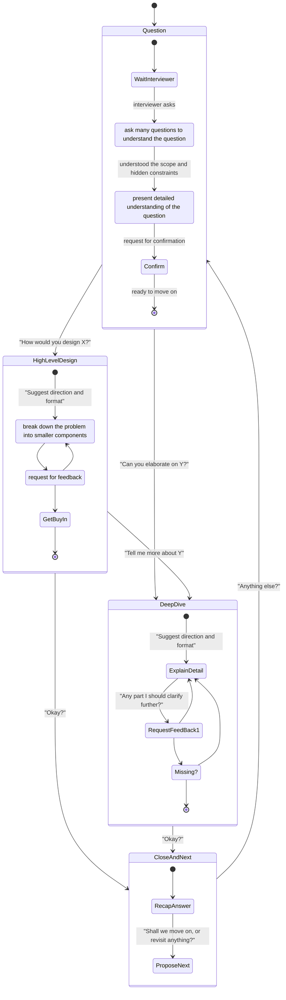
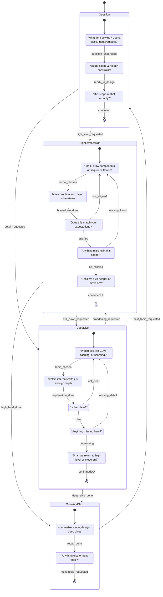

Below is a lean, battle-tested System Design Interview model that keeps everything you *need*—and drops the rest. It merges the best of both versions while:

* **Cutting length & complexity** so you can internalize it quickly
* **Consolidating mnemonics** into a single, unified loop
* **Balancing process + patterns**: you’ll get just enough “how” and “what”

---

## 1. Core Four-Phase Flow

Keep this top of mind. It’s *all* you need once the timer starts.

1. **Scope & Clarify (0–5 min)**

   * **Ask** your high-signal questions: users, scale, core features, non-functional needs.
   * **Brief** back: “So we’ll handle X, Y, Z and ignore A, B for now—okay?”
   * **Clarify** any hidden constraints: security, SLAs, budgets.

2. **High-Level Design (5–15 min)**

   * Sketch a block diagram: clients, services, data stores.
   * Highlight trade-offs (e.g. consistency vs. latency).
   * **Get buy-in**: “Does this match your expectations?”

3. **Deep Dive (15–35 min)**

   * Pick **one or two** hotspots (e.g. caching strategy, data partitioning).
   * Walk through flow diagrams or pseudo-sequence calls.
   * Continuously **Check**: “Does that satisfy our P99 latency goal?”

4. **Wrap-Up (35–45 min)**

   * **Ask**: “Anything you’d like me to revisit?”
   * **Brief** recap of scope, design, deep dive.
   * **Close** with one forward-looking suggestion: e.g. “Next, I’d add rate-limiting and monitoring dashboards.”

---

## 2. The Unified ABC Loop

Instead of three separate mnemonics, use one simple mantra throughout:

1. **A – Ask** a targeted question.
2. **B – Brief** your understanding or proposed solution.
3. **C – Coninterviewerm** alignment or next step.

Every time you stall, run the loop:

> “A: What SLA do we target?
> B: So we need ≤50 ms P99 reads at 10 M QPS?
> C: Does that sound right?”

---

## 3. Quick-Reference Pattern Cheat Sheet

(Have this memorized or on your own one-pager—*not* in the interview.)

| Problem               | Common Solution                                 |
| --------------------- | ----------------------------------------------- |
| Heavy Read Traffic    | Read-through or Write-around Cache (e.g. Redis) |
| URL Generation        | Base62 + collision retry                        |
| Large Payload Storage | Object store (S3/GCS) + metadata in SQL         |
| High Fan-out Writes   | Fan-out via Pub/Sub or Message Queue            |
| Hot Keys / Skew       | Consistent Hashing + Virtual Nodes              |
| Temporal Work (TTL)   | Background worker + TTL index                   |

---

## 4. Lightweight Personal Prep Plan

Spend 30 min daily on:

1. **Mock run**: pick a toy prompt, run the 4-phase + ABC loop on paper.
2. **Pattern drill**: flash-review two patterns (from the cheat sheet).
3. **Gap check**: compare your write-up against a published solution—note 1–2 misses.

In a week you’ll transform process into reflex.

---

### Why It’s Better

* **Concise**: a single page of phases + one mnemonic
* **Focused**: only 4 phases, no extra “2.5” or “Gap loops” in the room
* **Actionable**: clear time allocations, concrete patterns, and buy-in language
* **Scalable**: personalize your own cheat sheet and mock-run checklist

Use this as your **interview playbook**—drill it until it’s muscle memory, then go own every system design conversation.
