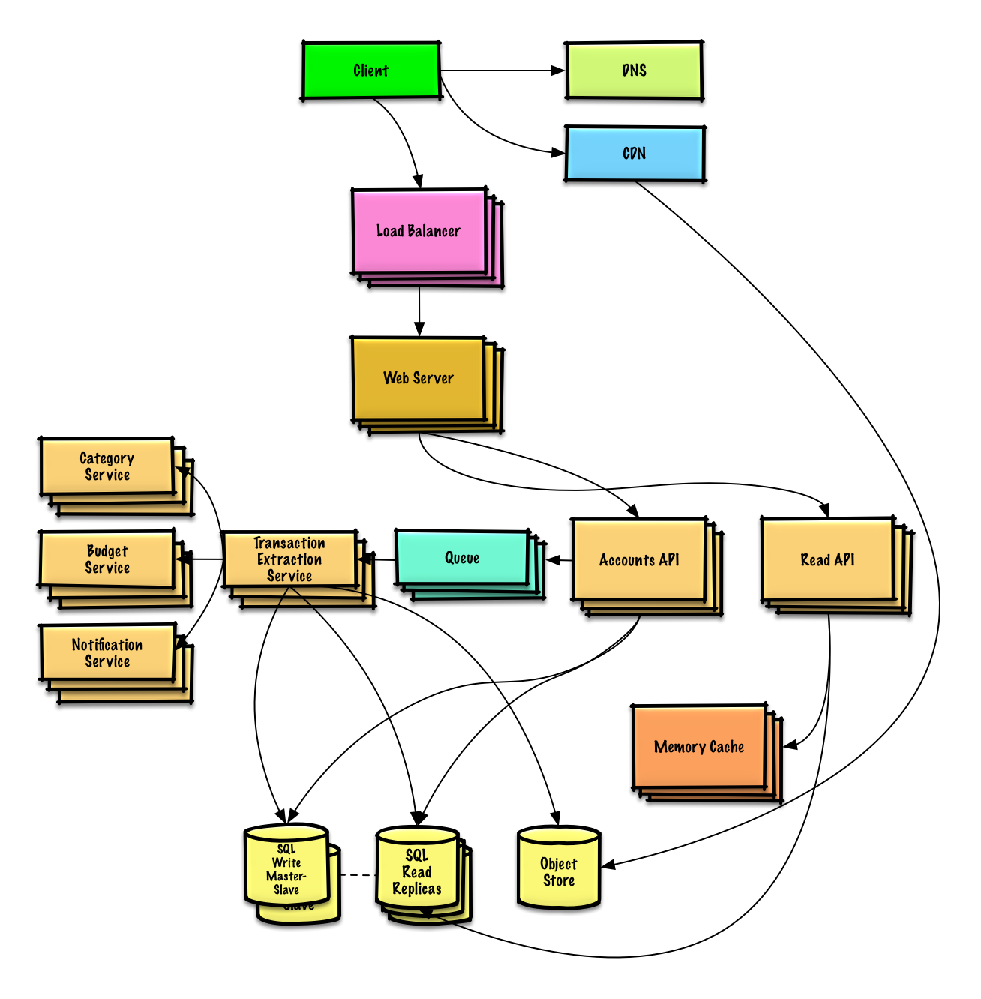
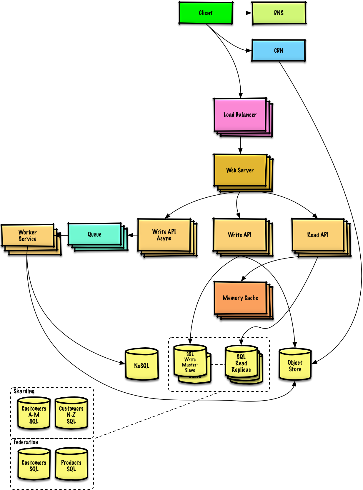

## System design interview solutions reminder Page

The questions list can be found at [Practice solutions](./practice.md)

Don't start here, you should 
1) first read the question and try to solve
2) See solutions 
3) After you worked on the exercises, and you want to brief the final solution as a quick reminder

###  Design Text snippet sharer (e.g. GitHub Gist, Pastebin.com)

[View exercise and solution](../solutions/system_design/pastebin/README.md)

### Design the Twitter timeline and search (or Facebook feed and search)

[View exercise and solution](../solutions/system_design/twitter/README.md)

### Design a web crawler

[View exercise and solution](../solutions/system_design/web_crawler/README.md)

### Design personal budget tracking app (Mint.com)

[View exercise and solution](../solutions/system_design/mint/README.md)

### Design the data structures for a social network

[View exercise and solution](../solutions/system_design/social_graph/README.md)

### Design a key-value store for a search engine

[View exercise and solution](../solutions/system_design/query_cache/README.md)

### Design Amazon's sales ranking by category feature

[View exercise and solution](../solutions/system_design/sales_rank/README.md)

### Design a system that scales to millions of users on AWS

[View exercise and solution](../solutions/system_design/scaling_aws/README.md)

