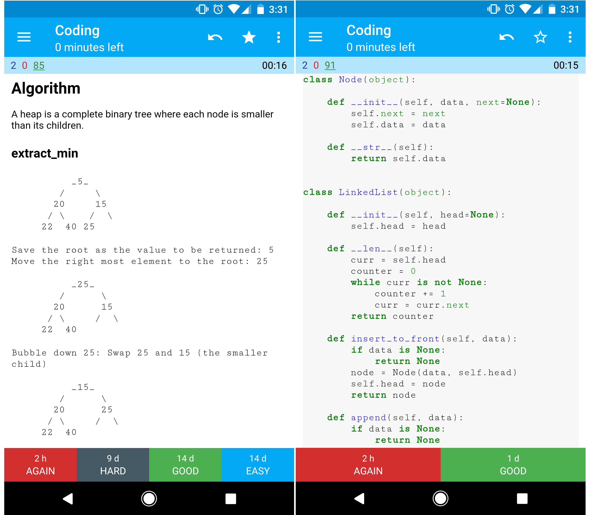

## Anki flashcards

  
   

  
   

  
   

The provided [Anki flashcard decks](https://apps.ankiweb.net/) use spaced repetition to help you retain key system design concepts.

* [System design deck](https://github.com/donnemartin/system-design-primer/tree/master/resources/flash_cards/System%20Design.apkg)
* [System design exercises deck](https://github.com/donnemartin/system-design-primer/tree/master/resources/flash_cards/System%20Design%20Exercises.apkg)
* [Object oriented design exercises deck](https://github.com/donnemartin/system-design-primer/tree/master/resources/flash_cards/OO%20Design.apkg)
  
For an alternative collection of Anki decks tailored specifically to developers, check out [Ankicode by daveight](https://github.com/daveight/ankicode)—a powerful resource that offers curated flashcards covering programming, algorithms, and other technical topics.

Great for use while on-the-go.

### Coding Resource: Interactive Coding Challenges

Looking for resources to help you prep for the [**Coding Interview**](https://github.com/donnemartin/interactive-coding-challenges)?

  
   

Check out the sister repo [**Interactive Coding Challenges**](https://github.com/donnemartin/interactive-coding-challenges), which contains an additional Anki deck:

* [Coding deck](https://github.com/donnemartin/interactive-coding-challenges/tree/master/anki_cards/Coding.apkg)

### Video Resources

* Watch [**20 System Design Concepts**](https://www.youtube.com/watch?v=i53Gi_K3o7I) to become familiar with the various topics within system design.
* Watch the [**System Design Course for Beginners**](https://www.youtube.com/watch?v=MbjObHmDbZo) for a free high level crash course on the system design concepts.
* To learn about specific System Design Concepts in greater detail, check out the [**System Design playlist**](https://www.youtube.com/playlist?list=PLCRMIe5FDPsd0gVs500xeOewfySTsmEjf)
  

