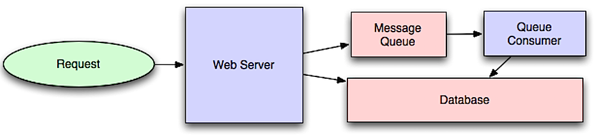

## Asynchronism

  
   
  <i><a href=http://lethain.com/introduction-to-architecting-systems-for-scale/#platform_layer>Source: Intro to architecting systems for scale</a></i>

Asynchronous workflows help reduce request times for expensive operations that would otherwise be performed in-line.  They can also help by doing time-consuming work in advance, such as periodic aggregation of data.

### Message queues

Message queues receive, hold, and deliver messages.  If an operation is too slow to perform inline, you can use a message queue with the following workflow:

* An application publishes a job to the queue, then notifies the user of job status
* A worker picks up the job from the queue, processes it, then signals the job is complete

The user is not blocked and the job is processed in the background.  During this time, the client might optionally do a small amount of processing to make it seem like the task has completed.  For example, if posting a tweet, the tweet could be instantly posted to your timeline, but it could take some time before your tweet is actually delivered to all of your followers.

**[Redis](https://redis.io/)** is useful as a simple message broker but messages can be lost.

**[RabbitMQ](https://www.rabbitmq.com/)** is popular but requires you to adapt to the 'AMQP' protocol and manage your own nodes.

**[Amazon SQS](https://aws.amazon.com/sqs/)** is hosted but can have high latency and has the possibility of messages being delivered twice.

### Task queues

Tasks queues receive tasks and their related data, run them, then deliver their results. They can support scheduling, and can be used to run computationally-intensive jobs in the background.
**[Celery](https://docs.celeryproject.org/en/stable/)** has support for scheduling and primarily has python support.

### Back pressure

If queues start to grow significantly, the queue size can become larger than memory, resulting in cache misses, disk reads, and even slower performance.  [Back pressure](http://mechanical-sympathy.blogspot.com/2012/05/apply-back-pressure-when-overloaded.html) can help by limiting the queue size, thereby maintaining a high throughput rate and good response times for jobs already in the queue.  Once the queue fills up, clients get a server busy or HTTP 503 status code to try again later.  Clients can retry the request at a later time, perhaps with [exponential backoff](https://en.wikipedia.org/wiki/Exponential_backoff).

### Transactional Messaging
Transactional messaging ensures reliable delivery and processing of messages while maintaining consistency across systems, especially in distributed architectures. It is critical for systems where operations must succeed or fail as a unit. [The Outbox Pattern](https://www.decodable.co/blog/revisiting-the-outbox-pattern) is a design to handle distributed transactions in an eventually consistent way. It ensures that messages are not lost even if a failure occurs while performing operations across multiple systems. 

* The application writes a business change and the corresponding event (message) to an outbox table in the same database transaction.
* The transaction is committed, ensuring both the business operation and the event are saved together.
* A background worker periodically reads unprocessed messages from the outbox table and publishes them to the message queue.
* Upon successful delivery, the worker marks the messages as processed to avoid duplicates.

The database used for the outbox table must support ACID transactions to ensure atomicity, consistency, isolation, and durability. This ensures that both the business operation and the event write are treated as a single unit of work and are committed together reliably.

**Example:**

Consider an e-commerce system where a user places an order. As part of the transaction:
* The order's status is updated to "Placed" in the database.
* A corresponding "process payment" event is written to the outbox table within the same transaction.

Once the transaction is committed, a background worker reads the "process payment" event from the outbox table and publishes it to the payment service queue. This ensures that the payment service is notified about the new order only if the database update for the order status was successful. Similarly, the order status update happens only if the event is successfully written to the outbox table, maintaining consistency across the system.

### Disadvantage(s): asynchronism

* Use cases such as inexpensive calculations and realtime workflows might be better suited for synchronous operations, as introducing queues can add delays and complexity.

### Source(s) and further reading

* [It's all a numbers game](https://www.youtube.com/watch?v=1KRYH75wgy4)
* [Applying back pressure when overloaded](http://mechanical-sympathy.blogspot.com/2012/05/apply-back-pressure-when-overloaded.html)
* [Little's law](https://en.wikipedia.org/wiki/Little%27s_law)
* [What is the difference between a message queue and a task queue?](https://www.quora.com/What-is-the-difference-between-a-message-queue-and-a-task-queue-Why-would-a-task-queue-require-a-message-broker-like-RabbitMQ-Redis-Celery-or-IronMQ-to-function)

