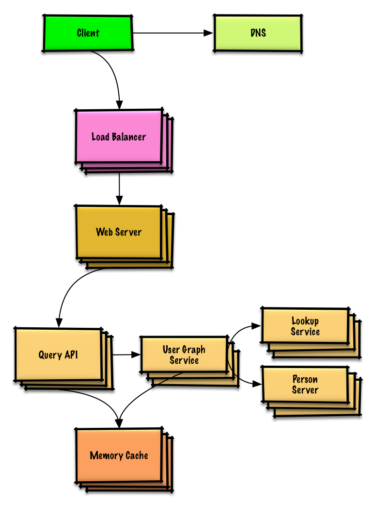

## System design interview questions with solutions

> Common system design interview questions with sample discussions, code, and diagrams.
>
> Solutions linked to content in the `solutions/` folder.

| Question | |
|---|---|
| Design Pastebin.com (or Bit.ly) | [Solution](solutions/system_design/pastebin/README.md) |
| Design the Twitter timeline and search (or Facebook feed and search) | [Solution](solutions/system_design/twitter/README.md) |
| Design a web crawler | [Solution](solutions/system_design/web_crawler/README.md) |
| Design personal budget tracking app (Mint.com) | [Solution](solutions/system_design/mint/README.md) |
| Design the data structures for a social network | [Solution](solutions/system_design/social_graph/README.md) |
| Design a key-value store for a search engine | [Solution](solutions/system_design/query_cache/README.md) |
| Design Amazon's sales ranking by category feature | [Solution](solutions/system_design/sales_rank/README.md) |
| Design a system that scales to millions of users on AWS | [Solution](solutions/system_design/scaling_aws/README.md) |
| Add a system design question | [Contribute](#contributing) |

You can practice a few sample questions and discuss solutions with the community on this [practice platform](https://workat.tech/system-design/practice).

### Design Pastebin.com (or Bit.ly)

[View exercise and solution](solutions/system_design/pastebin/README.md)

### Design the Twitter timeline and search (or Facebook feed and search)

[View exercise and solution](solutions/system_design/twitter/README.md)

### Design a web crawler

[View exercise and solution](solutions/system_design/web_crawler/README.md)

### Design personal budget tracking app (Mint.com)

[View exercise and solution](solutions/system_design/mint/README.md)

### Design the data structures for a social network

[View exercise and solution](solutions/system_design/social_graph/README.md)

### Design a key-value store for a search engine

[View exercise and solution](solutions/system_design/query_cache/README.md)

### Design Amazon's sales ranking by category feature

[View exercise and solution](solutions/system_design/sales_rank/README.md)

### Design a system that scales to millions of users on AWS

[View exercise and solution](solutions/system_design/scaling_aws/README.md)

