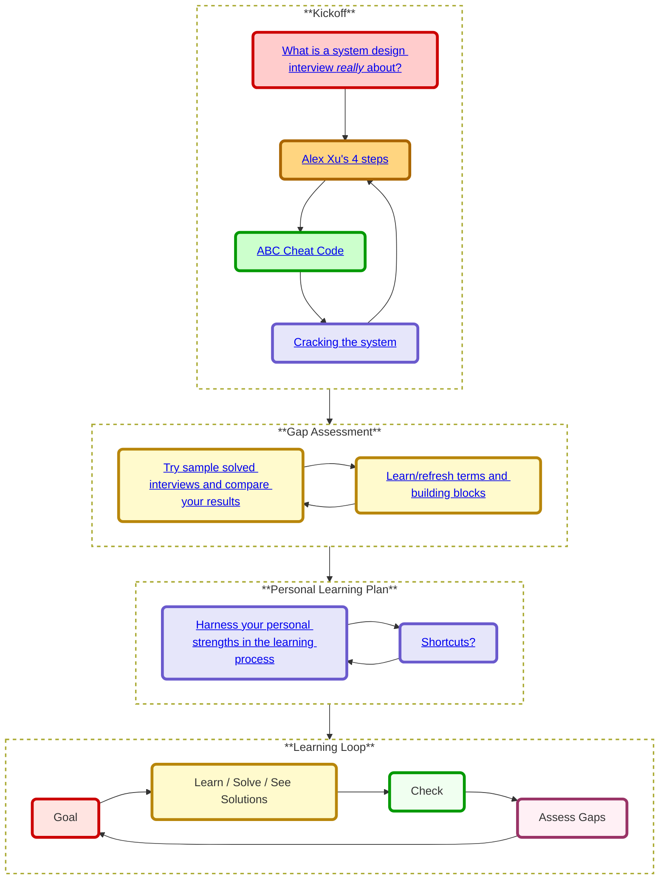
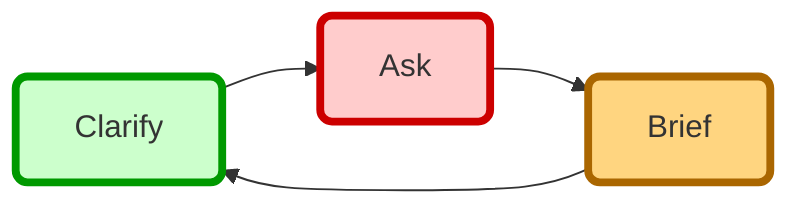

# Study Guide

> Repetition is the mother of all skills
>
> - Tony Robbins

## Understand What a System Design Interview Is *Really* About

Many interviewees fail the system design interview—not for lack of technical knowledge, but for misunderstanding what it's really about.
Many candidates focus on memorizing architectures instead of engaging in a collaborative design **discussion**. In reality, interviewers want to see how you **lead** a targeted conversation to solve a **scoped problem**, not how fast you can sketch an entire production system.

### Key Principles for the System Design Interview

---

1. **Drive the Dialogue by Asking and Suggesting.**
   Unlike coding interviews where you follow prompts, here you're expected to take the lead. Propose directions (“Shall we dive in?”), offer ideas, solicit feedback (“Does this design match your expectations?”), and iterate in real time. You are not just allowed—but ***expected***—to guide the conversation.

2. **Scoping Is Your Responsibility.**
   You won't build an entire production system in 45 minutes; instead, you should lead the conversation to define a manageable subset that simulates real-life constraints without overwhelming detail. Define a narrow, realistic scope—“Which core features should we prioritize?”—so you don't drown in complexity. Think of this as a **negotiation** with the interviewer. You bring your own expertise, which might have some overlaps with the interviewer a priori vision of the `right solution`. Scoping is your chance to steer the discussion (aka interview) towards areas where your knowledge is strongest, while still aligning with what the interviewer considers a valid solution.

3. **Strive to Get Buy-In.**
   Remember, this is a *dialogue*, not a monologue. Don't *explain the solution*—seek agreement at each key stage: after defining the scope, after presenting your high-level design, and during any deep dives. Think of it as **selling** your approach. A successful “sale” solves a problem the “buyer” (interviewer) cares about. If you're not getting buy-in, try to identify the gap and adjust your proposal accordingly.

---

###  ✅ ABC Cheat Code

Alex Xu's have a list of do's and don'ts in his book "System Design Interview - An Insider's Guide".
Let's create a cheat code for remembering them, with the above key principles.
Just think on it as triple ABC:

We divided  the key principles into 3 parts:
- Preparation - Things to do *before* the interview
- Dialogue Loop - How to *communicate* with the interviewer
- Thinking Process - How to *think* about the problem

### 🎯 ABC Preparation 

**A**dopt a Winning Mindset

* Stay positive, **never give up** before or during the interview—resilience is often more important than getting everything right.
* Come in with confidence and determination to **ask questions** and **listen to the interviewer**.

**B**uild Step by Step, your knowledge and solutions 

* Tackle problems incrementally.
* Validate each assumption before moving to the next step.

**C**ome Prepared

* Study typical interview questions and scenarios.
* Know the key concepts, patterns, and tools before you enter the room.

### 🗣️ ABC  Dialogue Loop

Use this simple loop to build clear, structured conversations, especially useful in interviews, meetings, or collaborative design sessions.
This ABC loop is a good way to memorize the above 3 key principles we started with.

1. **Ask** - Start by **A**sking.
2. **Brief** - Rephrase what you heard to ensure mutual understanding and get **B**uy-in.
3. **Clarify** - Ask for any missing information or corrections, and **C**larify the next step / sell.  

Loop until the end of the interview.

### 🔁 Interview ABC Loop

### 🧠 ABC - Thinking Process

Communicate Your Thoughts Effectively

**A**sk for guidance

* Don't hesitate to request hints if you're stuck.
* A good interviewer is a collaborator, not just an evaluator.

**B**ounce ideas off the interviewer

* Think out loud and share your directions, doubts, reasoning and suggestions.
* Use the interviewer as a sounding board to refine your direction.

**C**ommunicate continuously

* **Narrate your thoughts**.
* **Avoid** silent problem-solving.
* **Verbalize your thought** process clearly, **even if it's still evolving**.

---

> *A well-structured system design interview isn't about blurting out the “right” design—it's about owning the conversation. Rather than simply answering, you must lead: ask clarifying questions, listen to sub text, expose hidden constraints, and keep the interviewer engaged. **Alex Xu's four-phase framework** helps you do just that.*

---
### Alex Xu's four-phase framework

**Phase 1: Understand the Problem & Establish Design Scope**  
- **Drive the dialogue with questions.** Who are our users? What scale do we expect? Which features matter most? Every question you ask both narrows scope and demonstrates leadership.  
- **Confirm alignment.** Restate constraints and assumptions back (“So we need to handle 10 M DAUs with ≤100 ms P99 latency, correct?”) to lock in buy-in before diving deeper.

**Phase 2: Propose a High-Level Design & Get Buy-In**  
- **Sketch components at a glance.** Draw clients, gateways, services, data stores—just enough to show your initial blueprint architecture.  
- **Engage actively.** Rather than declaring “Here's my design,” invite feedback: “Does this match what you had in mind?” If you sense any hesitation, ask “What part feels off?” to expose hidden expectations.
- **Think out loud.** Communicate your thoughts and make sure if you need to do back of the envelope calculations to validate your initial design.

**Phase 3: Deep Dive into Key Components**  
- **Select your hotspots.** Based on the feedback you got till here, usually you managed to get a good scope and direction for the deep dive, If this is not the case you need to try to ask more questions to get a better understanding of the problem. If after asking you still don't have a good direction, you can ask the interviewer for suggestions. Such as shall I talk about the main tradeoffs or focus on the areas with the most risk or complexity (e.g., caching, partitioning, queueing)?
- **Try not to get into unnecessary details** Focus on proving your ability to design scalable systems.
- **Validate continuously.** After each trade-off discussion, check back: “Does that satisfy our latency goals given the consistency needs?”

**Phase 4: Wrap Up**  
- **Close the loop.** Ask, “Are there any areas you'd like me to revisit?” If there's lingering doubt, probe its root and address it on the spot.
- **Recap of the design, and the feedback you got.** “We defined scope, sketched the system, deep-dived on X and Y... however we understood that we need to revisit..., ”. This is important mainly if you had some design options to choose from.
- **Ask the interviewer's opinion about the next steps.**  
- **Propose other refinements if you have time.** e.g. Potential improvements, error cases, Operational issues (metrics). Note where you might shard more, add rate limiting, back-pressure, or introduce caching layers as the workload grows.  

*By taking ownership of the conversation—asking clarifying questions, seeking continuous buy-in, and guiding the interviewer through each phase—you transform a static Q&A into a **collaborative design session**. This is the approach that empowers you to steer a system design interview successfully.*

---

# Cracking the system 

## Make the 4 Phases Work for You: From Insight to Interview Mastery  

Let's reverse engineer the process of the system design interview from the interviewer point of view.

### Interviewer's Goals in the 4 Phases of a System Design Interview

1. **Evaluate Communication and Clarification Skills**
   During the *problem clarification* phase, the interviewer wants to see if the candidate can ask the right questions, uncover hidden constraints, and frame the problem with precision — just like they would in real-world ambiguity.

2. **Assess High-Level Thinking and Tradeoff Awareness**
   In the *high-level design* phase, the goal is to understand how the candidate breaks a big system into components, balances trade-offs (e.g., latency vs. throughput), and considers scalability, availability, and reliability.

3. **Test Technical Depth and Practical Decision-Making**
   During the *deep dive*, the interviewer looks for depth — how well the candidate understands core components (e.g., databases, queues, caching) and whether they can explain and defend technical choices under pressure.

4. **Gauge Thought Process, Flexibility, and Maturity**
   In the *wrap-up*, the interviewer wants to know how the candidate handles open questions: can they reflect, summarize trade-offs, suggest improvements, or identify edge cases and limitations?

## Phase 1: Understand the Problem & Establish Design Scope

### 🎯 Interviewer's Goal

**Evaluate Communication and Clarification Skills**
The interviewer wants to see if you can ask the right questions, uncover hidden constraints, and precisely frame the problem — just like in real-world ambiguous scenarios.

### ✅ Candidate's Strategy

Ask clear, somewhat pre-defined open-ended questions that surface assumptions, constraints, and the essence of the system. Aim for high signal questions that map the system's shape without going deep into implementation yet. Ask about requirements regarding: Fault Tolerance, Reliability, Security, Privacy, Scalability, Maintenance and Operational Aspects.

### 🧭 Phase one ABC - Ask wide open questions on the below subjects:

* *Ask* - "What are the main **users, use cases and main features** of the system?" (**A**ctors, **B**usiness Scenarios, **C**ore Features)
* *Brief* So those are our main **A**ssumptions, **B**oundaries (scope), **C**onstraints ? Did I explained **MVP** (Minimum Viable Product) correctly? 
* *Clarify* **Any** important topics we need to talk about the problem scope for this phase **Before** we **Continue** 

### 🔍 Example Dialogue (Pastebin)

**Interviewer**: Design Pastebin.com.

**Candidate**: Thanks. To clarify and understand the scope, may I start with a few quick questions?

**Candidate**: What are the **main features, users, and use cases** of the system?

**Interviewer**: Pastebin is a simple site to share plain text. Users paste content and get a short link to share. Pastebin includes anonymous users as well as logged in users.

**Candidate**: Great. So **can we scope the problem to 2 main flows**:
1. User creates a paste and gets a link to share.
2. User accesses a paste using the link.

**Interviewer**: Yes, that's a good start.

**Candidate**: What are the **other** important topics we need to consider?

**Interviewer**: Pastebin supports two types of users:
* Anonymous users - who can create and share content without an account
* Authenticated users - who can create content and customize their sharing links (e.g., custom URLs, expiration dates, access controls).

**Candidate**: Understood. For this phase, can we **focus** on Anonymous users?

**Interviewer**: You mean that we should ignore the requirements for authenticated users?

**Candidate**: No, I want to **clarify**. I am suggesting and **asking** your confirmation - to be effective I think we can start dealing with the main flows of the system. We will bear in mind the authenticated requirement and **deal with them later on**. 

**Interviewer**: Later on in the interview, or later on in the product life cycle?

**Candidate**: Both. Let me explain. Let's for now assume that we will use REST API to write and read the content. We can have 2 different api endpoints for anonymous and authenticated users, and we can have shared functions that can be used by both. This way we can **focus** on the main flows of the system. On the other hand we can talk about the authenticated requirements now, such as [OAuth 2.0](https://oauth.net/2/).

**Interviewer**: Ok.

**Candidate**: So for now, is it ok to focus on the anonymous users?

**Interviewer**: Yes.

**Candidate**: What are the other important topics we need to consider? What about traffic assumptions / load?

**Interviewer**: 10M writes per month, 100M reads. High read-to-write ratio.

**Candidate**: Got it. Any other specific requirements, assumptions or constraints, data flows?

**Interviewer**: We do track monthly stats. Links can have optional expiration. Expired pastes are auto-deleted.

**Candidate**: Is there anything more we should discuss in terms of latency, availability, or other non-functional constraints?

**Interviewer**: Reads should be low-latency. High availability is expected. 

**Candidate**: Cost efficiency, scaling and security matter, but I suggest to digest those in the next phases.

**Interviewer**: Ok.

**Candidate**: Thanks — that's clear and helps scope my design. Let's me summarize the scope as i understood it and the assumptions to make sure we are on the **same page**.

**Interviewer**: Ok.

**Candidate**: ... (see the full example in the solutions section) 

### 🧭 For more examples for this phase 
see the [Solutions phase 1 examples](#examples-for-phase-2-in-the-solutions-section)
---

## Phase 2: Propose a High-Level Design & Get Buy-In

### 🎯 Interviewer's Goal

**Assess High-Level Thinking and Tradeoff Awareness**
In this phase, the interviewer wants to see how you break a system into logical components, understand their relationships, and think in terms of scalability, availability, performance, and trade-offs.

### 🛠️ Candidate's Strategy

Translate the clarified requirements and use cases into a high-level architecture:

1. Identify the **core read and write operations**
2. Establish **data processing/preparation** workflows
3. Understand **timing** (sync/async, triggered vs. scheduled)
4. Propose a **high-level architecture** (building blocks + interactions)
5. Evaluate **trade-offs and constraints** and Alternative Approaches
6. Optimize for Latency and availability
7. Ask about Fault Tolerance, Reliability, Security, Privacy, and Scalability that might be relevant for the system

#### 🧭 Phase two ABC - Propose a high-level design

* *Artifacts* - "What are the core data models, read and write operations?"
* *Bursting* - "What is processed in synchronic mode and what is processed in the background? How do we handle the bursty nature of the traffic?"
* *Capacity* - "How do we scale the system? What are the bottlenecks? What are the trade-offs?"

##### Examples for Phase 2 in the solutions section

## Phase 3 & 4

we will use the same ABC loop for the deep dive and the wrap up.
However, those phases are more specific and detailed therefore it is harder to build a rigid template for those steps.
Therefore, the best way to prepare for those phases is to practice many examples.

## Phase 3: Deep Dive into Key Components

### 🎯  Interviewer's Goal

**Test Technical Depth and Practical Decision-Making**
Interviewer looks for how well you understand core components (e.g., databases, queues, caching) and whether you can explain and defend choices under pressure.

### ABC Process for Phase 3

* **A**lign your strengths with interview exceptions 
* **Broadcast** your thoughts augmented with your knowledge, and questions
* **Confirm** you cover the expectations and get buy-in

##  Phase 4: Wrap Up

### 🎯  Interviewer's Goal

**Gauge Thought Process, Flexibility, and Maturity**
Interviewer wants to see how you reflect, summarize trade-offs, suggest improvements, and identify edge cases.

### 🛠️ Candidate's Strategy

1. **Close the Loop:** Ask if any area needs revisiting or deeper detail.
2. **Summarize Design:** Recap scope, high-level architecture, deep-dive decisions, and trade-offs made.
3. **Next-Step Suggestions:** Propose enhancements (e.g., metrics/monitoring, rate limiting, canary deployments).
4. **Solicit Feedback:** Invite the interviewer's perspective on your summary and ideas.

### ABC Process for Phase 4

* **A**sk for Gaps: “Are there any parts you'd like to revisit?”
* **B**rief Recap: “Here's what we covered: scope, design, deep dive, and trade-offs.”
* **C**o-create Next Steps: “Given more time, I'd add X, Y, Z or improve metrics and failover strategies. What do you think?”

> This final loop ensures alignment, demonstrates reflection, and leaves a strong closing impression.

---

## Gap Assessment

The best way to assess your gap is to jump over to solved examples and read the assignment, then write the 4 phases and walk your way through a solved example and map gaps.

There are 2 different goals for you to master. The best way to master them is to practice, practice and practice.
The first goal is system design knowledge. The second goal is system design interview practice. 
You might be good in one of them and weak in the other, but you need to master both to ace the system design interview.

Try to test your memory about the system design guides content and to practice the 4 phases.
After you  test see the solutions and map the gaps.

## Refresh Your knowledge 

After mapping your gaps prioritize your learning and learn and practice. 
Learn / Refresh your knowledge by reading the system design topics and practice by solving the interview questions.

---
> Comment: We are working on a tools to help you with this.
---

## Personal Learning Plan

### Timeline matters
* **Short timeline** - Aim for **breadth** with system design topics.  Practice by solving **some** interview questions.
* **Medium timeline** - Aim for **breadth** and **some depth** with system design topics.  Practice by solving **many** interview questions.
* **Long timeline** - Aim for **breadth** and **more depth** with system design topics.  Practice by solving **most** interview questions.

| | Short | Medium | Long |
|---|---|---|---|
| Start with this document, [Study Guide](#study-guide) | :+1: | :+1: | :+1: |
| Do a first pass on [System design topics](index.md#index-of-system-design-topics) to get a broad understanding of how systems work | :+1: | :+1: | :+1: |
| **Learn about the company you addressing**, search for tips and resources about their interview questions and process | :+1: | :+1: | :+1: |
| Work through [System design interview questions with solutions](#system-design-interview-questions-with-solutions) and repeat | Few times | More times | Know by heart |
| Review other books and guides and resources in the web  | Some | More | Most |
| Read through a few articles in the [Company engineering blogs](16_real_world_architectures.md#company-engineering-blogs) for the companies you are interviewing with |  |  | :+1: |
| Read through a few [Real world architectures](16_real_world_architectures.md#real-world-architectures) |  |  | :+1: |

---

## Learning Loop

Time to practice. 

### Repetition is the mother of all skills

---

# FAQ
**Q: For interviews, do I need to know everything here?**

**A: No, you don't need to know everything here to prepare for the interview**.

What you are asked in an interview depends on variables such as:

* How much experience you have
* What your technical background is
* What positions you are interviewing for
* Which companies you are interviewing with
* Luck

More experienced candidates are generally expected to know more about system design.  Architects or team leads might be expected to know more than individual contributors.  Top tech companies are likely to have one or more design interview rounds.

Start broad and go deeper in a few areas.  It helps to know a little about various key system design topics.  Adjust the following guide based on your timeline, experience, what positions you are interviewing for, and which companies you are interviewing with.

### Source(s) and further reading

Check out the following links to get a better idea of what to expect:
### References
1. **Alex Xu**, book, *System Design Interview - An Insider's Guide*, Second Edition, 2020.
2. **GeeksforGeeks**, ["Common Mistakes to Avoid in a System Design Interview"](https://www.geeksforgeeks.org/common-mistakes-to-avoid-in-a-system-design-interview/).
3. **Exponent**, ["Five common system design interview mistakes 😅"](https://www.youtube.com/watch?v=z_YuqLmGZuo&ab_channel=GauravSen).

More (original repo) resources:
* [How to ace a systems design interview](https://www.palantir.com/2011/10/how-to-rock-a-systems-design-interview/)
* [The system design interview](http://www.hiredintech.com/system-design)
* [Intro to Architecture and Systems Design Interviews](https://www.youtube.com/watch?v=ZgdS0EUmn70)
* [System design template](https://leetcode.com/discuss/career/229177/My-System-Design-Template)
