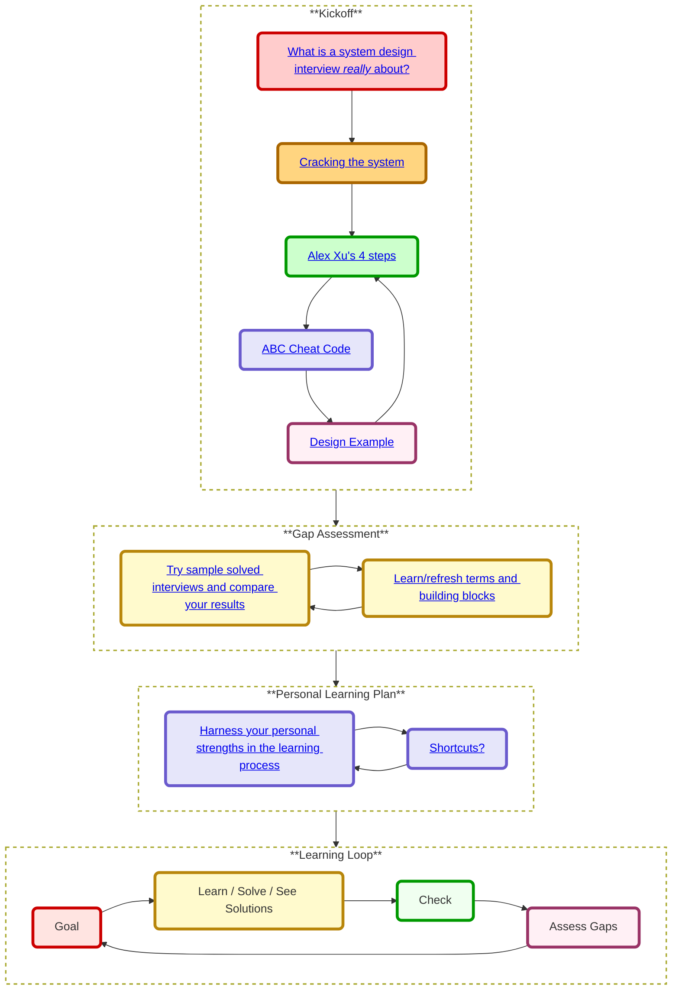
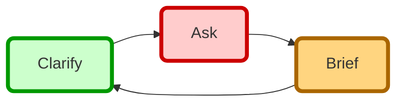
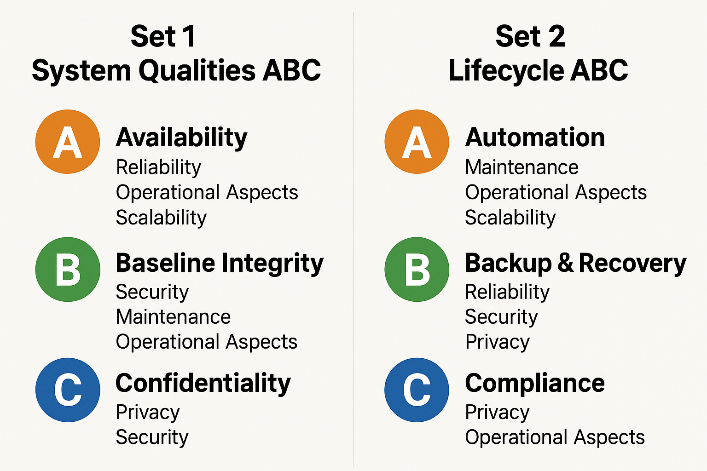
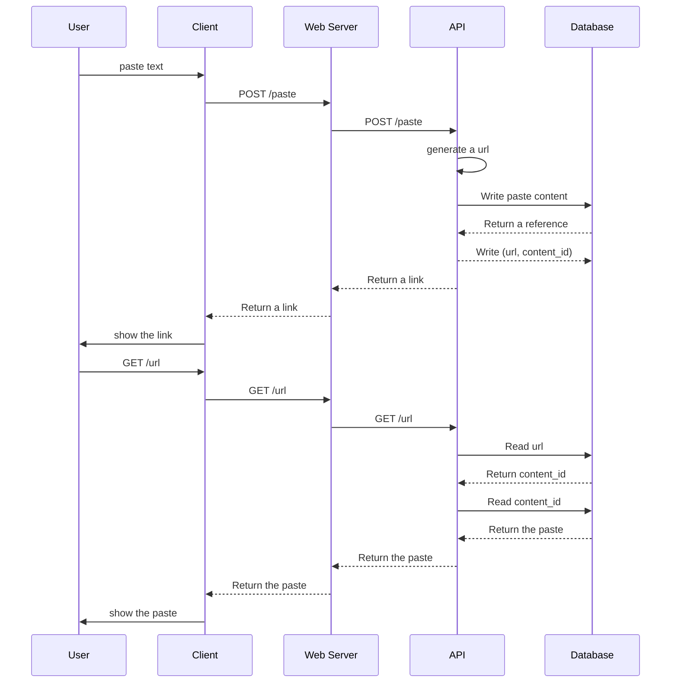
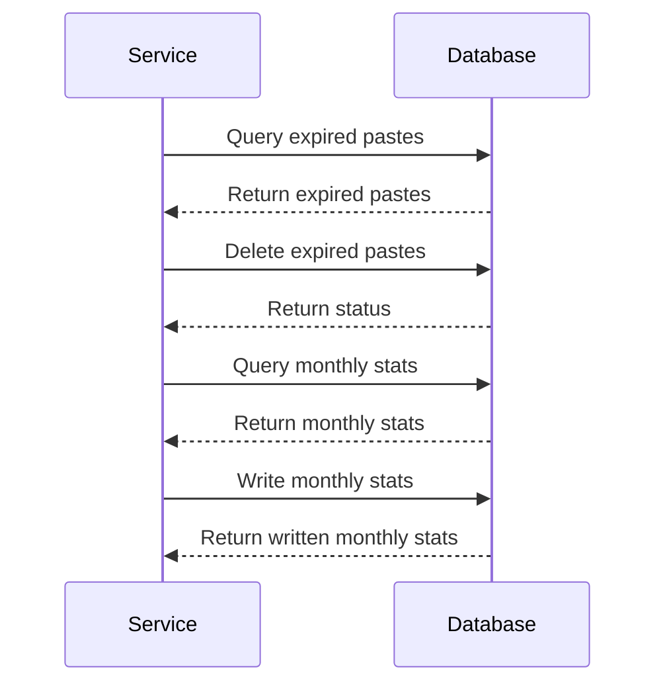
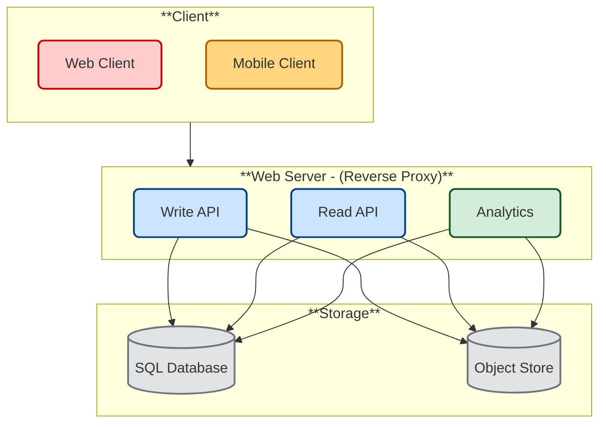

# System Design Interview Study Guide

> Repetition is the mother of all skills
>
> - Tony Robbins

📌 Learning Objectives

By the end of this guide, you will be able to:

1. **Strategize** your preparation by pinpointing the true goals of a system-design interview and crafting a focused, personalized learning plan.
2. **Crack** the interviewer's hidden requirements—avoiding the common pitfall of solving the wrong problem by extracting true constraints and priorities from the outset.
3. **Internalize** the four-phase framework for system design interview via the ABC mnemonic to guide a structured, confidence-driven design conversation, ensuring you stay on track.
4. **Sketch** a clear, high-level architecture in under five minutes and **defend** your choices by articulating key trade-offs.
5. **Apply** this simple, systematic process end-to-end on realistic interview scenarios, iterating and refining based on feedback and reflection.

🗺️ Contents overview

## Understand What a System Design Interview Is *Really* About

No one can build a system from scratch in 45 minutes, but no one excepts it from you. 
The system design interview is a ceremony with per defined rules and **you can’t win the game if you don’t understand the rules of the game**.
Many interviewees fail the system design interview—not for lack of technical knowledge, or preparation but for misunderstanding what it's **really** about.
Many candidates focus on memorizing architectures instead of engaging in a collaborative design **discussion**. In reality, interviewers want to see how you **lead** a targeted conversation to solve a **scoped problem**, not how fast you can sketch an entire production system.

---

> *A well-structured system design interview isn't about blurting out the “right” design—it's about owning the conversation. 
> Rather than simply answering, you must lead: ask clarifying questions, listen to sub text, expose hidden constraints, and keep the interviewer engaged. 
> **Alex Xu's four-phase framework**, the **ABC interview loops** *below* are designed to help you to do just that.*

---

## Cracking the system 
### A Strategic Framework for System Design Interview Preparation

---

1. **Truly understand the interviewer's perspective.**
   The interviewer has a well-defined and consistent goal, to evaluate your ability. Therefore, their behavior during the interview tends to follow a certain **pattern**. This predictability allows candidates to anticipate and respond effectively to key behavioral cues. The best preparation will be to cover each and every pattern that your interviewer may be following. Therefore, the first step is to understand what the interviewer is really after then to cover those patterns and prepare for them. You should start here no matter your timeline.

2. **Learn & practice the 4 phases and the ABC cheat code.**
   The 4 phases and the ABC cheat code are designed to help you work in a systematic way to approach the interviewer patterns. 
   The 4 phases by Alex Xu, as well as his list of do and don't do actions for the entire interview are structured way to target each of the interviewer goals in a dedicated "phase" of the interview. 
   The ABC cheat code is an attempt to help you memorize it and help you work with the 4 phases under stress.
  
3. **Learn common solutions patterns.**
   The interview does not have a fixed flow, Think of it as a tree of interactions and make sure you cover all the most **important branches and leaves**. 
   Many of those branch are relevant many design questions so you can look at it as 2 subjects. 
   - Breaking down the design into sub problems.
   - Knowing the patterns and best practices for many sub problems.

Don't worry - we will go into details in the next sections, but for now let's just keep in mind that truly understanding the interviewer's perspective is the first step in your preparation.

---

#### Interviewer's perspective.

Before talking about the solution - system design interview guide, let's understand the problem.
The interviewer decides on your success in the interview, so let's reverse engineer the process of the system design interview from the interviewer point of view.
Once we know what the interviewer is looking for, we can build a framework that will help us to prepare for the interview and to be more effective during the interview.

The interviewer has a well-defined and consistent goal, to evaluate your ability in a systematic way and limited time and to compare it with other candidates.
The limited time is a challenge for the interviewer, therefore the interviewer will use some shortcuts and triggers to create as many as possible evaluation points to evaluate the candidate's ability.

Understand the interviewer's goals and triggers will help you to prepare for the interview and to be more effective during the interview.

#### Interviewer's Goals in System Design Interview

1. **Evaluate Communication and Clarification Skills**
   During the *problem clarification* phase, the interviewer wants to see if the candidate can ask the right questions, uncover hidden constraints, and frame the problem with precision — just like they would in real-world ambiguity.
   For this reason, many interviews start with vague questions, by design. This is a trigger for evaluation point!
   You start answering without asking for more clarifications - **Boom!** You missed this goal from the interviewer's perspective.  
2. **Assess High-Level Thinking and Tradeoff Awareness**
   In the *high-level design* phase, the goal is to understand how the candidate breaks a big system into components, balances trade-offs (e.g., latency vs. throughput), and considers scalability, availability, and reliability.
   High level design is an art not science, it meant to demonstrate the most important aspects of the system, but pay attention you and the interviewer might have different visions of the most important aspects. 
   Again, this is a trigger! In order to excel in the high level design you need not only to know to break a problem into components but also uncover what is the interviewer looking for.
   
3. **Test Technical Depth and Practical Decision-Making**
   During the *deep dive*, the interviewer looks for depth — how well the candidate understands core components (e.g., databases, queues, caching), edge cases and whether they can explain and defend technical choices with enough details.
   Well, technical depth is a very broad topic, but there are some patterns and common practices that can help you do the deep dive.
   Knowing those patterns and common practices will help you to do the main part of the deep dive for many specific topics.
4. **Gauge Thought Process, Flexibility, and Maturity**
   Overall, the interviewer wants to see how you reflect, summarize trade-offs, suggest improvements, process feedback and work under pressure.
5. **Wrap-up**
   Towards the end of the interview, the interviewer might want to cover some more aspects from his original evaluations points on the above issues as well as other aspects that might be important to her such as gauge thought process, flexibility, and maturity.
   Understanding this can help you utilize the time at the end of the interview for your benefit since it is your last chance to improve on things you underperformed in the interview.

### Alex Xu's four-phase framework for the system design interview

**Phase 1: Understand the Problem & Establish Design Scope**  
- **Drive the dialogue with questions.** Who are our users? What scale do we expect? Which features matter most? Every question you ask both narrows scope and demonstrates leadership.  
- **Confirm alignment.** Restate constraints and assumptions back (“So we need to handle 10 M DAUs with ≤100 ms P99 latency, correct?”) to lock in buy-in before diving deeper.

**Phase 2: Propose a High-Level Design & Get Buy-In**  
- **Sketch components at a glance.** Draw clients, gateways, services, data stores—just enough to show your initial blueprint architecture.  
- **Engage actively.** Rather than declaring “Here's my design,” invite feedback: “Does this match what you had in mind?” If you sense any hesitation, ask “What part feels off?” to expose hidden expectations.
- **Think out loud.** Communicate your thoughts and make sure if you need to do back of the envelope calculations to validate your initial design.

**Phase 3: Deep Dive into Key Components**  
- **Select your hotspots.** Based on the feedback you got till here, usually you managed to get a good scope and direction for the deep dive, If this is not the case you need to try to ask more questions to get a better understanding of the problem. If after asking you still don't have a good direction, you can ask the interviewer for suggestions. Such as shall I talk about the main tradeoffs or focus on the areas with the most risk or complexity (e.g., caching, partitioning, queueing)?
- **Try not to get into unnecessary details** Focus on proving your ability to design scalable systems.
- **Validate continuously.** After each trade-off discussion, check back: “Does that satisfy our latency goals given the consistency needs?”

**Phase 4: Wrap Up**  
- **Close the loop.** Ask, “Are there any areas you'd like me to revisit?” If there's lingering doubt, probe its root and address it on the spot.
- **Recap of the design, and the feedback you got.** “We defined scope, sketched the system, deep-dived on X and Y... however we understood that we need to revisit..., ”. This is important mainly if you had some design options to choose from.
- **Ask the interviewer's opinion about the next steps.**  
- **Propose other refinements if you have time.** e.g. Potential improvements, error cases, Operational issues (metrics). Note where you might shard more, add rate limiting, back-pressure, or introduce caching layers as the workload grows.  

*By taking ownership of the conversation—asking clarifying questions, seeking continuous buy-in, and guiding the interviewer through each phase—you transform a static Q&A into a **collaborative design session**. This is the approach that empowers you to steer a system design interview successfully.*

---

## From Insight to Interview Mastery

### Critical Behaviors in the Interview Room

We will start with some simple principles that are direct output of understanding the Interviewer point of view. 
In the next sections we will build a framework that will help you to implement those principles in real interview scenarios, even under stress.

---

1. **Drive the Dialogue by Asking and Suggesting.**
   Unlike coding interviews where you follow prompts, here you're expected to take the lead. Propose directions (“Shall we dive in?”), offer ideas, solicit feedback (“Does this design match your expectations?”), and iterate in real time. You are not just allowed—but ***expected***—to guide the conversation.

2. **Scoping Is Your Responsibility.**
   You won't build an entire production system in 45 minutes; instead, you should lead the conversation to define a manageable subset that simulates real-life constraints without overwhelming detail. Define a narrow, realistic scope—“Which core features should we prioritize?”—so you don't drown in complexity. Think of this as a **negotiation** with the interviewer. You bring your own expertise, which might have some overlaps with the interviewer a priori vision of the `right solution`. Scoping is your chance to steer the discussion (aka interview) towards areas where your knowledge is strongest, while still aligning with what the interviewer considers a valid solution.

3. **Strive to Get Buy-In.**
   Remember, this is a *dialogue*, not a monologue. Don't *explain the solution*—seek agreement at each key stage: after defining the scope, after presenting your high-level design, and during any deep dives. Think of it as **selling** your approach. A successful “sale” solves a problem the “buyer” (interviewer) cares about. If you're not getting buy-in, try to identify the gap and adjust your proposal accordingly.

---

## ✅ ABC Cheat Codes - A way to memorize during the interview

In addition to the 4 phases, Alex Xu's have a list of do's and don'ts in his book "System Design Interview - An Insider's Guide".
It is hard to remember all of them under stress, so let's create a cheat code for remembering them, with the above key principles.
Let's create a cheat code for remembering them, with the above key principles.
Just think on it as triple ABC:

We divided  the key principles into 3 parts:
- Preparation - Things to do **before** the interview
- Dialogue Loop - How to **communicate** with the interviewer
- Thinking Process - How to **think** about the problem during the interview

## 🔁 Interview ABC Loop

### 🎯 ABC for Preparation 

**A**dopt a Winning Mindset

* Stay positive, **never give up** before or during the interview—resilience is often more important than getting everything right.
* Come in with confidence and determination to **ask questions** and **listen to the interviewer**.

**B**uild Step by Step, your knowledge and solutions 

* Learn the 4 phases and the ABC cheat code.
* Jump in and start with the first question, to assess your gaps.
* Learn the tree - learn key concepts and answers to the most common questions.
* Practice, practice, & practice.

**Come Prepared**

* Study typical interview questions and scenarios.
* Know the key concepts, patterns, and tools before you enter the room.

### 🗣️ ABC  Dialogue Loop

Use this simple loop to build clear, structured conversations, especially useful in interviews, meetings, or collaborative design sessions.
This ABC loop is a good way to memorize a simple mantra that will help you to actually work according to  the above 3 key principles we started with.

1. **Ask** - Start by **A**sking.
2. **Brief** - Rephrase what you heard to ensure mutual understanding and get **B**uy-in.
3. **Clarify** - Ask for any missing information or corrections, and **C**larify the next step / sell.  

Loop until the end of the interview.

### 🧠 ABC - Thinking Process

Communicate Your Thoughts Effectively

**A**sk for guidance

* Don't hesitate to request hints if you're stuck.
* A good interviewer is a collaborator, not just an evaluator.

**B**ounce ideas off the interviewer

* Think out loud and share your directions, doubts, reasoning and suggestions.
* Use the interviewer as a sounding board to refine your direction.

**C**ommunicate continuously

* **Narrate your thoughts**.
* **Avoid** silent problem-solving.
* **Verbalize your thought** process clearly, **even if it's still evolving**.

## Phase 1: Understand the Problem & Establish Design Scope

### 🎯 Interviewer's Goal

**Evaluate Communication and Clarification Skills**
The interviewer wants to see if you can ask the right questions, uncover hidden constraints, and precisely frame the problem — just like in real-world ambiguous scenarios.

### ✅ Candidate's Strategy

Ask clear, somewhat pre-defined open-ended questions that surface assumptions, constraints, and the essence of the system. Aim for high signal questions that map the system's shape without going deep into implementation yet. Ask about requirements regarding: Reliability, Security, Privacy, Scalability, Maintenance and Operational Aspects. 

### 🧭 Phase one Ask ABC - Ask wide open questions on the below subjects:

* *Ask* - "What are the main **users, use cases and main features** of the system?" (**A**ctors, **B**usiness Scenarios, **C**ore Features)
* *Brief* So those are our main **A**ssumptions, **B**oundaries (scope), **C**onstraints ? Did I explained **MVP** (Minimum Viable Product) correctly? 
* *Clarify* **Any** important topics we need to talk about the problem scope for this phase **Before** we **Continue** 

### 🔍 Example Dialogue (Pastebin)

**Interviewer**: Design Pastebin.com.

**Candidate**: Thanks. To clarify and understand the scope, may I start with a few quick questions?

**Interviewer**: Yes, please.

**Candidate**: What are the **main features, users, and use cases** of the system?

**Interviewer**: Pastebin is a simple site to share plain text. Users paste content and get a short link to share. Pastebin includes anonymous users as well as logged in users.

**Candidate**: Great. So **can we scope the problem to 2 main flows**:
1. User creates a paste and gets a link to share.
2. User accesses a paste using the link.

**Interviewer**: Yes, that's a good start.

**Candidate**: What are the **other** important topics we need to consider for the basic **MVP** functionality?

**Interviewer**: Pastebin supports two types of users:
* Anonymous users - who can create and share content without an account
* Authenticated users - who can create content and customize their sharing links (e.g., custom URLs, expiration dates, access controls).

**Candidate**: Understood. For this phase, can we **focus** on Anonymous users?

**Interviewer**: You mean that we should ignore the requirements for authenticated users?

**Candidate**: No, I want to **clarify**. I am suggesting and **asking** your confirmation - to be effective I think we can start dealing with the main flows of the system. We will bear in mind the authenticated requirement and **deal with them later on**. 

**Interviewer**: Later on in the interview, or later on in the product life cycle?

**Candidate**: Both. Let me explain. Let's for now assume that we will use REST API to write and read the content. We can have 2 different api endpoints for anonymous and authenticated users, and we can have shared functions that can be used by both. This way we can **focus** on the main flows of the system. On the other hand we can talk about the authenticated requirements now, such as [OAuth 2.0](https://oauth.net/2/) of [JWT](https://jwt.io/).

**Interviewer**: Ok.

**Candidate**: So for now, is it ok to focus on the anonymous users?

**Interviewer**: Yes.

**Candidate**: What are the *other* important topics we need to consider? What about traffic assumptions / load?

**Interviewer**: 10M writes per month, 100M reads. 

**Candidate**: Got it. High read-to-write ratio. Any *other* specific requirements, assumptions or constraints, data flows?

**Interviewer**: We do track monthly stats. Links can have optional expiration. Expired pastes are auto-deleted.

**Candidate**: Is there **anything more** we should discuss in terms of latency, availability, or other non-functional constraints?

**Interviewer**: Reads should be low-latency. High availability is expected. 

**Candidate**: Cost efficiency, scaling and security matter, but I **suggest** to digest those in the next phases.

**Interviewer**: Ok.

**Candidate**: Thanks — that's clear and helps scope my design. Let's me summarize the scope as i understood it and the assumptions to make sure we are on the **same page**.

**Interviewer**: Ok.

...

As you can see the candidate is **leading** the conversation and **negotiating** the scope with the interviewer.
He uses the `suggest` word to indicate that he is open for a dialog and he is asking for the interviewer's confirmation, and tries to keep the conversation according to the interviewer acceptable path.
When the candidate faces an objections (e.g. authenticated users) he continues the negotiation while providing 2 options (e.g. now or later) while showing knowledge related to the requirements. 
This hints that scoping without this requirement is not for a lack of relevant knowledge but for focusing on the problem we deal with at this moment.
The candidate asks many variations of `Anything else?` or `other?` to uncover more hidden requirements and assumptions.
The candidate mentions scaling and security which are important in interviews but checks if it is ok to deal with those a bit later.

There are a lot of **system considerations** that are important in interviews maybe the below cards will help you to remember them.
But even if you don't remember them, you can still ask the interviewer for other requirements we need to consider.

  
   

#### 🧭 For more examples of the scoping dialogue 

see the [Solutions phase 1 examples](#examples-for-phase-2-in-the-solutions-section)

### 🧭 Phase one Breakdown ABC - Brief the requirements with breakdown at mind:

ok, let's recall why we need to Brief the requirements.

* **Align** - We need to align the requirements with the interviewer, since this is essence of this phase.

However our next phase is the high level design so wouldn't it be great if we use the brief so writing down the high level design will be easy?

The high level is about breaking the problem (aka requirements) into components. So let's summarize the requirements while trying to break them into components.

* **Breakdown** - All we need to do is to group the detailed requirements we just aligned with the interviewer into use case, & background tasks and other non functional requirements. A use case is an interaction between an actor (like a user or another system) and your system, usually described in terms of goals the actor wants to achieve.
* **Compile** - We can compile the grouped requirements into a initial list of components and their interactions.

Let's see how we can do that.

### 🔍 Example Breakdown (Pastebin)

**Candidate**: ok, here a reflection of what I understood from the requirements, I will write it down here

> ### Use cases
> * **User** enters a block of text and gets a randomly generated link
> * **User** enters a paste's url and views the contents
> * **User** is anonymous
>
> ### Background tasks
> * **Service** tracks analytics of pages
>     * Monthly visit stats
> * **Service** deletes expired pastes
>
> ### Non functional requirements
> * **Service** has high availability
>
> ### Out of scope
> * All authenticated users features
> * Any other requirements
>
> ### Other considerations we need to think about (Later on)
> * System Quality Attributes (Reliability, Scalability, Security & Privacy, Operational Aspects, etc.)
> * System life cycle (Deployment, Monitoring, Logging, Automation, CI/CD, etc.)

Does it look good?  Did I miss anything? Any thing else we should cover at this stage?

**Interviewer**: Yes, it looks good.

We will use this structure later on to create the high level design. However at this stage our focus is in making sure we understand the problem and the scope and get the interviewer's approval for how we define the problem.
Another goal is to verify that we have all the details we need to start the high level design. We want the high level be a straight forward step that is driven from the requirements (more on this in the next section).

## Phase 2: Propose a High-Level Design & Get Buy-In

### 🎯 Interviewer's Goal

**Assess High-Level Thinking and Tradeoff Awareness**
In this phase, the interviewer wants to see how you break a system into logical components, understand their relationships, and think in terms of scalability, availability, performance, and trade-offs.

### 🛠️ Candidate's Strategy

We know the problem and the scope, we already approved the scope, use cases, background tasks and other non functional now we need to write the high level design.
So we need to 
- Break the system into logical components, 
- understand their relationships, 

While doing the above we need to think about the design considerations such as maintainability, scalability, availability, performance, security, privacy, and trade-offs. However dealing with all of them in one shot is not realistic and actually will work against you, since we already agreed that the interview is about the process not the final solution.

So we need a process that will help us to cover the design considerations step by step.
In the interview we can't cover everything in great details, and some of the steps might be overkill for you or for the interviewer - so we need to suggest the next step to the interviewer and align with the interviewer expectations.

#### How to create the high level design

While breaking down the design problem we can look at three different aspects:

1. Who (which component) does this sub activity? 
2. When does this activity happen?
3. What are the relationships with other components? 

Answering the above questions will help us to break the problem into sub problems. 
A good way to start is to translate the use cases into sequence diagrams. In the sequence diagram we can see the components that take part in the use case end to end and the interactions between them and while doing that we can uncover additional functionality (components?) that we need to add to the design.

##### Optional: use cases  --> Sequence diagram

Our final goal is to describe the components that take part in our system. 
Depending on the use case, it might be straightforward to write all the components or might need some extra step to uncover.
Making the extra step is a good way to demonstrate the process and the components, and will give you a structured way to define the components. 

Use case is an **interaction** between an actor and system, so let's draw the interaction with sequence diagram.

##### Important: Actually we can use mermaid to draw the sequence diagram, maybe even in the interview room.

> Using mermaid we focus on what we want to draw and avoid wasting time on the editor.
> So take a look at the source of the drawing below as well as the rendered result
> In addition AI autocomplete can help us to draw the diagram. (ask in advance if this is valid in the interview room)

We will start with standard entities we find in every web design.
User, Client (Frontend, Browser, Mobile App), Web Server,  API (Backend), Database.

Use cases:
1. User creates a paste and gets a link to share.
2. User accesses a paste using the link.

Now let's add the background tasks

#### Background tasks
 * **Service** tracks analytics of pages
     * Monthly visit stats
 * **Service** deletes expired pastes

Ok, we draw our draft thoughts on the sequence diagram.
While we draw it we had to refine our understanding about the use case. 
The use case already defined that the system create url for the paste, but **Who** is responsible for creating the url?
While writing our thoughts it became clear that the url creation is a functionality we need to assign to a component, so we did it.
What if we are wrong?  should it be a separate component?  
Those are good questions that you should ask yourself during the drawing process. You should narrate your thoughts and explain your reasoning, or even say I am drawing the first thing that pop up in my mind, maybe I need to revisit it. Remember to ask the interviewer for feedback.

>Remember the solution is not what we are after, it is the the process of getting to a reasonable solution.

So we wrote a draft for the flow of the use case.
Reflecting on the sequence diagram and  the requirements we can see that we can gain the following insights:

- We have 2 different types of data we write to the database:
    - paste content (might be large content)
    - url and content id (metadata that is used for read)
    those are 2 different data artifacts that we need to store in the database, with different size and access patterns.
- We need to add and update the metadata for the expiration.
  e.g. replace 
  -     API-->>Database: Write (url, content_id) 
  with
  -     API-->>Database: Write (url, content_id, creation_time) 
- We need to update the stats for read and write 
- We need someone to aggregate the raw read/write into user stats 
- Although queuing is done in the background, we need to consider the latency and throughput of the queue.
- Read to write ratio is 1:10, but in our draft they are in the same component.

All the above are missing from the sequence diagram, so it is a good time to get the interviewer's feedback on the next step.
Fixing the sequence diagram to include the above is probably not we want to do, since we want to focus on the high level design.
But we can suggest high level ideas and ask the interviewer for feedback.

We can store the different artifacts in different components. The content can be stored in object store that can hold big chunks, and the (url, reference) pairs can be stored in SQL DB.
We can add Analytics service that will aggregate the raw read/write into user stats.
Analytics is required for many web sites, so there are open source tools like prometheus and grafana that can be used to handle it.

In addition we can have different components for read and write api, since in our requirements we can see that read to write has 1:10 ratio. So separating them will enable to scale them independently.

> Never heard of prometheus and grafana? 
> No problem, we will cover tools and common components later on.
> For now let's focus on the high level design process.

### 🧭 Phase two ABC - Propose a high-level design

* *Artifacts* - "What are the core data models, read and write operations?"
* *Bursting* - "What is processed in synchronic mode and what is processed in the background? How do we handle the bursty nature of the traffic?"
* *Capacity* - "How do we scale the system? What are the bottlenecks? What are the trade-offs?"

#### Block diagram

Usually high level design is represented with a block diagram.
We already uncovered the main components and their interactions (either with sequence diagram or in our mind).
Now before we draw it, let's think on the design considerations. 

Here are the design considerations we need to think about:

1. Identify the **core read and write operations**
2. Establish **data processing/preparation** workflows
3. Understand **timing** (sync/async, triggered vs. scheduled)
4. Propose a **high-level architecture** (building blocks + interactions)
5. Evaluate **trade-offs and constraints** and Alternative Approaches
6. Optimize for Latency and availability

Reflecting on the above we can suggest:
- We will have object store to store the content.
- We will have SQL DB to store the url and content id pairs.
- We will have Analytics service to aggregate the raw read/write into user stats.
- We will have have a different component for read api and write api.

Here is the block diagram:

### Get buy-in

Ok, we have the block diagram, now we need to get the interviewer's buy-in.

Here’s an improved and clearer version of your paragraph, preserving all the original ideas while tightening structure, fixing grammar, and improving flow and clarity:

---

### Phase 2.5: After Gaining Buy-In and Before the Deep Dive

> This phase is not part of Alex Xu’s original framework but has been added to emphasize a crucial **pivot** point in the interview process — the transition from high-level design to a deep dive.

### 🎯 Interviewer’s Goal: **Decide What’s Next**

A successful system design interview balances **depth and breadth** — it’s not just about diving into specific components but also about demonstrating a strong **system-level perspective**. After you’ve presented your high-level design, the interviewer will assess the next step:
Should they ask for a deep dive into one component, or pivot to a different topic that aligns with their interests?

### ✅ Candidate’s Strategy: **Steer the Conversation Strategically**

The high-level diagram is a helpful artifact, but it’s **not the core of this phase**. What matters more is how you use it to demonstrate your ability to reason through trade-offs, highlight design alternatives, and surface issues that matter in real-world systems.

This is a great opportunity to identify and propose discussion topics based on what emerged during the high-level design conversation. You’ll often touch on trade-offs, edge cases, or architectural decisions — areas where you can show structured thinking.

In fact, many interviewers care more about these broader conversations than digging into low-level details like code structure, REST endpoints, or database schemas. If you’re stronger in some areas than others, **proactively suggest topics** where you can shine — especially if they match themes raised by the interviewer.

This is what **Phase 2.5** is here to remind you: once you’ve earned buy-in on your high-level plan, **don’t passively wait** for the interviewer to decide — suggest one or more next steps that align with your strengths and keep the momentum going.

You might offer to explore topics like:

* **Scalability** – e.g., introducing caching layers, load balancers, or reverse proxies
* **Reliability** – e.g., adding monitoring, logging, retries, or backups
* **Security** – e.g., applying authentication, authorization, or encryption
* **Efficiency** – e.g., using indexing, compression, or data deduplication

These are **common areas of discussion** that apply to many designs. Mastering them means you can confidently propose them during this transitional moment.

 

## Phase 3: Deep Dive into Key Components

### 🎯  Interviewer's Goal

**Test Technical Depth and Practical Decision-Making**
Interviewer looks for how well you understand core components (e.g., databases, queues, caching) and whether you can explain and defend choices under pressure.

### ✅ Candidate's Strategy

Suggest the topics you are more confident about.
Use common patterns and solutions you know.
Understand the exceptions - should you write code? What questions to answer in the deep dive?

### 🧭 ABC Process for Phase 3

* **A**lign your strengths with interview exceptions 
* **Broadcast** your thoughts augmented with your knowledge, and questions
* **Confirm** you cover the expectations and get buy-in

In the study guide we are focusing on the framework and the process, so we won't dive into the details of the design we proposed in the previous phase.

2 important notes:
- You should try to influence this phase to cover the topics you are more confident about.
- You should know enough patterns of solutions [TBA](to_add_later#sometime) that will help you to navigate through deep dive of questions you never saw (or those you forgot...).

#   Phase 4: Wrap Up

### 🎯  Interviewer's Goal

**Get final observations and revisit some aspects**
You are at the end of the interview, the interviewer will try to get final observations and revisit some aspects to complete the picture.

### ✅ Candidate's Strategy

Opertunity to frame the solution and repeat important points.
Last chance to improve on things you underperformed in the interview.

### 🧭 ABC Process for Phase 4

* **A**sk for Gaps: “Are there any parts you'd like to revisit?”
* **B**rief Recap: “Here's what we covered: scope, design, deep dive, and trade-offs.”
* **C**hance: “Given more time, I'd add X, Y, Z or improve metrics and failover strategies. 

---

## Gap Assessment

There are **two distinct goals** you need to master in parallel:

* **System design interview performance**
* **System design knowledge and understanding**

These are not the same — and confusing them is a common mistake.
Interview performance is about being able to structure your thinking, communicate clearly, and demonstrate practical reasoning **under time pressure and with limited context**.
System design knowledge, on the other hand, is about deeply understanding distributed systems, architectural trade-offs, and design patterns that apply across real-world scenarios.

You need **both**: one is about **knowing**, the other is about **showing** — or more precisely, **communicating and packaging your thinking effectively** for the interview format and the interviewer's expectations.

### System design interview practice

The best way to assess your gap is to jump over and practice solved examples.

In the future we will add interactive tools to aid you.
For the time being you can read the assignment, then write the 4 phases answer and walk your way through a solved example and map gaps.
Do not read the solution, try to solve it on your own. It is better to solve 10 questions on your own than to read 100 solved questions.

### System design knowledge

Review the topics in the repo and learn them.

The original repo had Anki cards to help you practice.
We will add a more modern tools later on.

For now use read the main README.md and practice the Anki cards to memorize the topics and common questions.
list of topics that are covered in the book.

Try to test your memory about the system design guides.

## Refresh Your knowledge 

After mapping your gaps prioritize your learning and learn and practice. 
Learn / Refresh your knowledge by reading the system design topics and practice by solving the interview questions.

---
> Comment: We are working on a tools to help you with this.
---

# Personal Learning Plan

Build your own learning plan based on your timeline, strengths and experience.
Here is a sample plan, you can use it as a template to build your own plan.

Let's us know if it worked for you or if you think we can improve it.

### System design interview

### Timeline matters
* **Short timeline** - **Understand** the process and the framework. **Search** for typical questions in the company you addressing. Solve solved questions. **Practice** the company's typical questions.
* **Medium timeline** - Search **more** about the company. Solve **more** questions.
* **Long timeline** - Practice, practice and practice.

| | Short | Medium | Long |
|---|---|---|---|
| Start with this document, [Study Guide](#study-guide) | :+1: | :+1: | :+1: |
| **Learn about the company you addressing**, search for tips and resources about their interview questions and process | :+1: | :+1: | :+1: |
| Work through [System design interview questions with solutions](#system-design-interview-questions-with-solutions) read a question, try to solve it on your own, then find your gaps from the solution | Few times | More times | Know by heart |
| Once you see that you missed something in your solution jump over to the [System design topics](index.md#index-of-system-design-topics) and refresh your knowledge | Few times | More times | Know by heart |

### System design knowledge

### Timeline matters
* **Short timeline** - Aim for **breadth** with system design topics.  Practice by solving **some** interview questions.
* **Medium timeline** - Aim for **breadth** and **some depth** with system design topics.  Practice by solving **many** interview questions.
* **Long timeline** - Aim for **breadth** and **more depth** with system design topics.  Practice by solving **most** interview questions.

| | Short | Medium | Long |
|---|---|---|---|
| Start with this document, [Study Guide](#study-guide) | :+1: | :+1: | :+1: |
| Do a first pass on [System design topics](index.md#index-of-system-design-topics) to get a broad understanding of how systems work | :+1: | :+1: | :+1: |
| Work through [System design interview questions with solutions](#system-design-interview-questions-with-solutions) read a question, try to solve it on your own, then find your gaps from the solution | Few times | More times | Know by heart |
| Once mastered all the solutions in [System design interview questions with solutions](#system-design-interview-questions-with-solutions) and you still have energy or time left, Go to other resources  |  |  |  |

Other resources 

-  Review other books and guides and resources in the web - See [Resources](#resources)
-  Read through a few articles in the [Company engineering blogs](16_real_world_architectures.md#company-engineering-blogs) for the companies you are interviewing with
- Read through a few [Real world architectures](16_real_world_architectures.md#real-world-architectures) 

---

# Learning Loop

Time to practice. 

### Repetition is the mother of all skills

---

# FAQ
**Q: For interviews, do I need to know everything here?**

**A: No, you don't need to know everything here to prepare for the interview**.

What you are asked in an interview depends on variables such as:

* How much experience you have
* What your technical background is
* What positions you are interviewing for
* Which companies you are interviewing with
* Luck

More experienced candidates are generally expected to know more about system design.  Architects or team leads might be expected to know more than individual contributors.  Top tech companies are likely to have one or more design interview rounds.

Start broad and go deeper in a few areas.  It helps to know a little about various key system design topics.  Adjust the following guide based on your timeline, experience, what positions you are interviewing for, and which companies you are interviewing with.

### Source(s) and further reading

Check out the following links to get a better idea of what to expect:
### References
1. **Alex Xu**, book, *System Design Interview - An Insider's Guide*, Second Edition, 2020.
2. **GeeksforGeeks**, ["Common Mistakes to Avoid in a System Design Interview"](https://www.geeksforgeeks.org/common-mistakes-to-avoid-in-a-system-design-interview/).
3. **Exponent**, ["Five common system design interview mistakes 😅"](https://www.youtube.com/watch?v=z_YuqLmGZuo&ab_channel=GauravSen).

More (original repo) resources:
* [How to ace a systems design interview](https://www.palantir.com/2011/10/how-to-rock-a-systems-design-interview/)
* [The system design interview](http://www.hiredintech.com/system-design)
* [Intro to Architecture and Systems Design Interviews](https://www.youtube.com/watch?v=ZgdS0EUmn70)
* [System design template](https://leetcode.com/discuss/career/229177/My-System-Design-Template)

