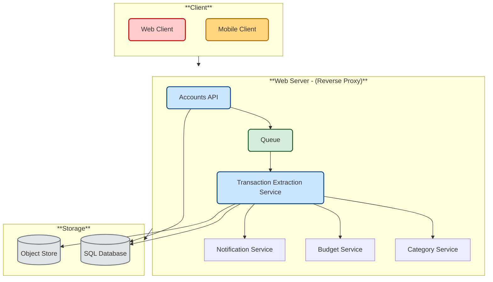

# Design personal budget tracking app (Mint.com)

*Note: This document links directly to relevant areas found in the [system design topics](https://github.com/ido777/system-design-primer-update#index-of-system-design-topics) to avoid duplication. Refer to the linked content for general talking points, trade-offs, and alternatives.*

## Step 1: Investigate the problem, use cases and constraints and establish design scope

> Gather main functional requirements and scope the problem.
> Ask questions to clarify use cases and constraints.
> Discuss assumptions.


Adding clarifying questions is the first step in the process.
Remember your goal is to understand the problem and establish the design scope.

### What questions should you ask to clarify the problem?


Here is an example of the dialog you could have with the interviewer:

**Example dialog with your interviewer:**


**Interviewer**: Design Mint.com.
**Candidate**: Sure—could you remind me what the core value proposition of Mint.com is?
**Interviewer**: It aggregates users’ financial accounts, categorizes transactions, and helps them budget.
**Candidate**: Got it. How do we get the data from the financial accounts?
**Interviewer**: connects to a financial account.
**Candidate**: Should we focus on real-time updates or would a daily refresh suffice?
**Interviewer**: Daily is fine.
**Candidate**: How should categorization work?
**Interviewer**: Auto-categorize based on merchant, but allow manual overrides. No re-categorization once set.
**Candidate**: Understood. What budget features are needed?
**Interviewer**: Recommend budgets by category, allow manual budgets, and notify when users approach or exceed them.
**Candidate**: Any non-functional requirements?
**Interviewer**: High availability is a must; budget alerts don’t need millisecond latency.
**Candidate**: Great. And scale?
**Interviewer**: Target ~10 M users, ~30 M linked accounts, ~5 B transactions/mo, with ~500 M reads/mo.

### Use cases

#### We'll scope the problem to handle only the following use cases

* **User** connects to one or more financial accounts (bank, credit card, investment).  
* **Service** extracts transactions from the account
    * Daily batch updates for active users (last 30 days). 
    * Categorizes transactions
        * Auto-categorization by merchant
        * Allows manual category override by the user
        * No automatic re-categorization after manual change. 
    * Analyzes monthly spending, by category
* **Service** Analyze spending & suggest budgets
    * Compute monthly spend per category.
    * Recommend a budget per category.  
    * Allow users to set or adjust budgets manually.  
    * Send notifications when spending approaches/exceeds budget. 
* **Service** has high availability

#### Out of scope

* **Service** performs additional logging and analytics
 
###  Constraints & assumptions

#### State assumptions

* Traffic is not evenly distributed
* Automatic daily update of accounts applies only to users active in the past 30 days
* Adding or removing financial accounts is relatively rare
* Budget notifications don't need to be instant
* 10 million users
    * 10 budget categories per user = 100 million budget items
    * Example categories:
        * Housing = $1,000
        * Food = $200
        * Gas = $100
    * Sellers are used to determine transaction category
        * 50,000 sellers
* 30 million financial accounts
* 5 billion transactions per month
* 500 million read requests per month
* 10:1 write to read ratio
    * Write-heavy, users make transactions daily, but few visit the site daily 

####  Back-of-the-envelope usage calculations

> **Clarify with your interviewer if you should run back-of-the-envelope usage calculations.**
> **If** you need to calculate usage, here is calculation example:

```text
Size per transaction record:
  user_id           8 bytes
  timestamp         5 bytes
  merchant_id      32 bytes
  amount            5 bytes
  category code     2 bytes
  --------------------------
  ≈ 52 bytes/transaction

Monthly data volume:
  52 bytes × 5 000 000 000 txns ≈ 260 GB/month
  → ~9 TB over 3 years

Request rates:
  5 000 000 000 transactions / (2.5 million sec/mo) ≈ 2 000 writes/sec
  500 000 000 reads / (2.5 million sec/mo)    ≈   200 reads/sec
```

* 260 GB of new transaction content per month
    * 50 bytes per transaction * 5 billion transactions per month
    * 9 TB of new transaction content in 3 years
    * Assume most are new transactions instead of updates to existing ones
* 2,000 transactions per second on average
* 200 read requests per second on average

Handy conversion guide:

* 2.5 million seconds per month
* 1 request per second = 2.5 million requests per month
* 40 requests per second = 100 million requests per month
* 400 requests per second = 1 billion requests per month


## Step 2: Create a high level design & Get buy-in

> Outline a high level design with all important components.

<!--  -->




### Get buy-in

✅ Why This Breakdown?

Rather than diving into implementation, this diagram tells a story:

The microservice breakdown is driven by **Separation of Concerns**:

- **Single-purpose services**: Extraction, Categorization, Budget and Notification each handle only one domain, which simplifies testing, deployment and independent versioning.  
- **Asynchronous decoupling**: We buffer all raw ingestion through a message queue so that spikes or transient failures don’t block users. (The diagram shows the main queue; internal queues between downstream steps are omitted for clarity.) 
- **Optimized storage**: Raw transaction dumps live in an object store, while structured metadata resides in SQL—letting us choose the right storage for each access pattern and consistency requirement.
- **Scalable**: Services are stateless and can be scaled or replaced independently.


You should ask for a feedback after you present the diagram, and get buy-in and some initial ideas about areas to dive into, based on the feedback.


## Step 3: Design core components

> Dive into details for each core component.

### Use case: User connects to a financial account

We could store info on the 10 million users in a [relational database](https://github.com/ido777/system-design-primer-update#relational-database-management-system-rdbms).
We should discuss the [use cases and tradeoffs between choosing SQL or NoSQL](https://github.com/ido777/system-design-primer-update#sql-or-nosql).

* The **Client** sends a request to the **Web Server**, running as a [reverse proxy](https://github.com/ido777/system-design-primer-update#reverse-proxy-web-server)
* The **Web Server** forwards the request to the **Accounts API** server
* The **Accounts API** server updates the **SQL Database** `accounts` table with the newly entered account info

**Clarify with your interviewer the expected amount, style, and purpose of the code you should write**.

The `accounts` table could have the following structure:

```
id int NOT NULL AUTO_INCREMENT
created_at datetime NOT NULL
last_update datetime NOT NULL
account_url varchar(255) NOT NULL
account_login varchar(32) NOT NULL
account_password_hash char(64) NOT NULL
user_id int NOT NULL
PRIMARY KEY(id)
FOREIGN KEY(user_id) REFERENCES users(id)
```

We'll create an [index](https://github.com/ido777/system-design-primer-update#use-good-indices) on `id`, `user_id `, `last_update` and `created_at` to speed up lookups.  Since indexes are typically implemented with B-trees, index lookup is O(log n) instead of O(n). Frequently accessed indexes (like by `last_update` timestamps) are often cached automatically in RAM by the database’s internal cache and since the indexes are smaller, they are likely to stay in memory. Reading 1 MB sequentially from memory takes about 250 microseconds, while reading from SSD takes 4x and from disk takes 80x longer.<sup><a href=https://github.com/ido777/system-design-primer-update.git#latency-numbers-every-programmer-should-know>1</a></sup>


#### REST API

We'll use a public [**REST API**](https://github.com/ido777/system-design-primer-update#representational-state-transfer-rest):

##### Connect to a financial account
```
$ curl -X POST --data '{ "user_id": "foo", "account_url": "bar", \
    "account_login": "baz", "account_password": "qux" }' \
    https://mint.com/api/v1/account
```

Response:

```
{
    "user_id": "foo",
    "account_id": "bar",
    "action": "connect",
    "status": "success"
}
```

Next, the service extracts transactions from the account.

### Use case: Service extracts transactions from the account

We'll want to extract information from an account in these cases:

* The user first links the account
* The user manually refreshes the account
* Automatically each day for users who have been active in the past 30 days

those are the cases for the transaction extraction service.
So each of these cases will `trigger` a `transaction extraction service` request.

Data flow - user manually refreshes the account:

* The **Client** sends a request to the **Web Server**
* The **Web Server** forwards the request to the **Accounts API** server
* The **Accounts API** server places a job on a **Queue** such as [Amazon SQS](https://aws.amazon.com/sqs/) or [RabbitMQ](https://www.rabbitmq.com/)
    * Extracting transactions could take awhile, we'd probably want to do this [asynchronously with a queue](https://github.com/ido777/system-design-primer-update#asynchronism), although this introduces additional complexity
* The **Transaction Extraction Service** does the following:
    * Pulls from the **Queue** and extracts transactions according to job (e.g. for the given account from the financial institution)
    * Stores the results as raw log or json files in the **Object Store**
    * Uses the **Category Service** asynchronously to categorize the transactions
    * Uses the **Budget Service** asynchronously to calculate aggregate monthly spending by category
        * The **Budget Service** uses the **Notification Service** asynchronously to let users know if they are nearing or have exceeded their budget
    * Updates the **SQL Database** `transactions` table with categorized transactions
    * Updates the **SQL Database** `monthly_spending` table with aggregate monthly spending by category
    * Notifies the user the transactions have completed through the **Notification Service**:
        * Uses a **Queue** (not pictured) to asynchronously send out notifications

The `transactions` table could have the following structure:

```
id int NOT NULL AUTO_INCREMENT
created_at datetime NOT NULL
seller varchar(32) NOT NULL
amount decimal NOT NULL
user_id int NOT NULL
PRIMARY KEY(id)
FOREIGN KEY(user_id) REFERENCES users(id)
```

We'll create an [index](https://github.com/ido777/system-design-primer-update#use-good-indices) on `id`, `user_id `, and `created_at`.

The `monthly_spending` table could have the following structure:

```
id int NOT NULL AUTO_INCREMENT
month_year date NOT NULL
category varchar(32)
amount decimal NOT NULL
user_id int NOT NULL
PRIMARY KEY(id)
FOREIGN KEY(user_id) REFERENCES users(id)
```

We'll create an [index](https://github.com/ido777/system-design-primer-update#use-good-indices) on `id` and `user_id `.

#### Category service

For the **Category Service**, we can seed a seller-to-category dictionary with the most popular sellers. If we estimate 50,000 sellers and estimate each entry to take less than 255 bytes, the dictionary would only take about 12 MB of memory.

**Clarify with your interviewer the expected amount, style, and purpose of the code you should write**.

```python
class DefaultCategories(Enum):

    HOUSING = 0
    FOOD = 1
    GAS = 2
    SHOPPING = 3
    ...

seller_category_map = {}
seller_category_map['Exxon'] = DefaultCategories.GAS
seller_category_map['Target'] = DefaultCategories.SHOPPING
...
```

For sellers not initially seeded in the map, we could use a crowdsourcing effort by evaluating the manual category overrides our users provide.  
We could use a heap to quickly lookup the top manual override per seller in O(1) time.

Here we actually want the **most-popular** category override for a given seller (i.e. the one with the highest user-vote count). 
However, Python’s heapq only provides a min-heap, so we store counts as negative numbers. Then the “minimum” of those negatives is the largest positive count.
Heap queues are not designed to handle multiple threads writing the data at the same time, however since writes are rare and missing one count might be acceptable we can use it for a starter.

Generally, a heap (priority queue) shines when you need to:

* **Incrementally insert items** (e.g. new user overrides)
* **Quickly retrieve** the current top-priority element (peek or pop)
* **Maintain the structure** under continuous updates

```python
import heapq
from collections import defaultdict

class Categorizer:
    def __init__(self, seller_category_map):
        self.seller_category_map = seller_category_map
        # each value is a heap of (–override_count, category)
        self.overrides: dict[str, list[tuple[int, DefaultCategories]]] = defaultdict(list)

    def add_override(self, seller: str, category: DefaultCategories, count: int):
        # push negative count so that the largest count comes out first
        heapq.heappush(self.overrides[seller], ( -count, category ))

    def categorize(self, transaction):
        seller = transaction.seller
        if seller in self.seller_category_map:
            return self.seller_category_map[seller]

        heap = self.overrides.get(seller)
        if heap:
            # peek the “min” of the heap, which is (–max_count, category)
            _, top_category = heap[0]
            self.seller_category_map[seller] = top_category
            return top_category

        return None
```

Transaction implementation:

```python
class Transaction(object):

    def __init__(self, created_at, seller, amount):
        self.created_at = created_at
        self.seller = seller
        self.amount = amount
```

##### Solving the thread-safety issue / Scaling the categorizer

* **Lock around the heap** or switch to Python’s built-in PriorityQueue for immediate thread safety.
* **Use a lightweight embedded database** (e.g. SQLite in its default serialized mode) and do atomic SQL updates/queries.
* **Adopt a simple external store** like Redis for atomic counters with INCR.

Each approach trades off complexity versus performance and scalability; pick the simplest that meets your concurrency needs today, then evolve as you grow.


### Use case: Service recommends a budget

To start, we could use a generic budget template that allocates category amounts based on income tiers.  Using  a **common template**, you avoid materializing all 100 million per-category records up front—each new user simply references the same in-memory or table-driven default rules. Only when a user **actually changes** one of those defaults do you write the data; everyone else continues to implicitly use the template values. When a user overrides a budget category,  we could store the override in the `TABLE budget_overrides`.

```python
class Budget(object):

    def __init__(self, income):
        self.income = income
        self.categories_to_budget_map = self.create_budget_template()

    def create_budget_template(self):
        return {
            DefaultCategories.HOUSING: self.income * .4,
            DefaultCategories.FOOD: self.income * .2,
            DefaultCategories.GAS: self.income * .1,
            DefaultCategories.SHOPPING: self.income * .2,
            ...
        }

    def override_category_budget(self, category, amount):
        self.categories_to_budget_map[category] = amount
```

For the **Budget Service**, we can potentially run SQL queries on the `transactions` table to generate the `monthly_spending` aggregate table.  The `monthly_spending` table would likely have much fewer rows than the total 5 billion transactions, since users typically have many transactions per month.

As an alternative, we can run **MapReduce** jobs on the raw transaction files to:

* Categorize each transaction
* Generate aggregate monthly spending by category

Running analyses on the transaction files could significantly reduce the load on the database.

We could call the **Budget Service** to re-run the analysis if the user updates a category.

**Clarify with your interviewer the expected amount, style, and purpose of the code you should write**.

Sample log file format, tab delimited:

```
user_id   timestamp   seller  amount
```

**MapReduce** implementation:

```python
class SpendingByCategory(MRJob):

    def __init__(self, categorizer):
        self.categorizer = categorizer
        self.current_year_month = calc_current_year_month()
        ...

    def calc_current_year_month(self):
        """Return the current year and month."""
        ...

    def extract_year_month(self, timestamp):
        """Return the year and month portions of the timestamp."""
        ...

    def handle_budget_notifications(self, key, total):
        """Call notification API if nearing or exceeded budget."""
        ...

    def mapper(self, _, line):
        """Parse each log line, extract and transform relevant lines.

        Argument line will be of the form:

        user_id   timestamp   seller  amount

        Using the categorizer to convert seller to category,
        emit key value pairs of the form:

        (user_id, 2025-01, shopping), 25
        (user_id, 2025-01, shopping), 100
        (user_id, 2025-01, gas), 50
        """
        user_id, timestamp, seller, amount = line.split('\t')
        category = self.categorizer.categorize(seller)
        period = self.extract_year_month(timestamp)
        if period == self.current_year_month:
            yield (user_id, period, category), amount

    def reducer(self, key, value):
        """Sum values for each key.

        (user_id, 2025-01, shopping), 125
        (user_id, 2025-01, gas), 50
        """
        total = sum(values)
        yield key, sum(values)
```

###  Scale the design

> Identify and address bottlenecks, given the constraints.


**Important: Do not simply jump right into the final design from the initial design!**

State you would 
1) **Benchmark/Load Test**, 
2) **Profile** for bottlenecks 
3) address bottlenecks while evaluating alternatives and trade-offs, and 
4) repeat.  See [Design a system that scales to millions of users on AWS](../scaling_aws/README.md) as a sample on how to iteratively scale the initial design.

It's important to discuss what bottlenecks you might encounter with the initial design and how you might address each of them.  For example, what issues are addressed by adding a **Load Balancer** with multiple **Web Servers**?  **CDN**?  **Master-Slave Replicas**?  What are the alternatives and **Trade-Offs** for each?

We'll introduce some components to complete the design and to address scalability issues.  Internal load balancers are not shown to reduce clutter.

## Step 4 Wrap up

To summarize, we've designed a financial management system that meets the core requirements. We've discussed the high-level design, identified potential bottlenecks, and proposed solutions to address scalability issues. Now it is time to align again with the interviewer expectations.
See if she has any feedback or questions, suggest next steps, improvements, error handling, and monitoring if appropriate.


*To avoid repeating discussions*, refer to the following [system design topics](https://github.com/ido777/system-design-primer-update#index-of-system-design-topics) for main talking points, tradeoffs, and alternatives:

* [DNS](https://github.com/ido777/system-design-primer-update#domain-name-system)
* [CDN](https://github.com/ido777/system-design-primer-update#content-delivery-network)
* [Load balancer](https://github.com/ido777/system-design-primer-update#load-balancer)
* [Horizontal scaling](https://github.com/ido777/system-design-primer-update#horizontal-scaling)
* [Web server (reverse proxy)](https://github.com/ido777/system-design-primer-update#reverse-proxy-web-server)
* [API server (application layer)](https://github.com/ido777/system-design-primer-update#application-layer)
* [Cache](https://github.com/ido777/system-design-primer-update#cache)
* [Relational database management system (RDBMS)](https://github.com/ido777/system-design-primer-update#relational-database-management-system-rdbms)
* [SQL write master-slave failover](https://github.com/ido777/system-design-primer-update#fail-over)
* [Master-slave replication](https://github.com/ido777/system-design-primer-update#master-slave-replication)
* [Asynchronism](https://github.com/ido777/system-design-primer-update#asynchronism)
* [Consistency patterns](https://github.com/ido777/system-design-primer-update#consistency-patterns)
* [Availability patterns](https://github.com/ido777/system-design-primer-update#availability-patterns)

We'll add an additional use case: **User** accesses summaries and transactions.

User sessions, aggregate stats by category, and recent transactions could be placed in a **Memory Cache** such as Redis or Memcached.

* The **Client** sends a read request to the **Web Server**
* The **Web Server** forwards the request to the **Read API** server
    * Static content can be served from the **Object Store** such as S3, which is cached on the **CDN**
* The **Read API** server does the following:
    * Checks the **Memory Cache** for the content
        * If the url is in the **Memory Cache**, returns the cached contents
        * Else
            * If the url is in the **SQL Database**, fetches the contents
                * Updates the **Memory Cache** with the contents

Refer to [When to update the cache](https://github.com/ido777/system-design-primer-update#when-to-update-the-cache) for tradeoffs and alternatives.  The approach above describes [cache-aside](https://github.com/ido777/system-design-primer-update#cache-aside).

Instead of keeping the `monthly_spending` aggregate table in the **SQL Database**, we could create a separate **Analytics Database** using a data warehousing solution such as Amazon Redshift or Google BigQuery.

We might only want to store a month of `transactions` data in the database, while storing the rest in a data warehouse or in an **Object Store**.  An **Object Store** such as Amazon S3 can comfortably handle the constraint of 250 GB of new content per month.

To address the 200 *average* read requests per second (higher at peak), traffic for popular content should be handled by the **Memory Cache** instead of the database.  The **Memory Cache** is also useful for handling the unevenly distributed traffic and traffic spikes.  The **SQL Read Replicas** should be able to handle the cache misses, as long as the replicas are not bogged down with replicating writes.

2,000 *average* transaction writes per second (higher at peak) might be tough for a single **SQL Write Master-Slave**.  We might need to employ additional SQL scaling patterns:

* [Federation](https://github.com/ido777/system-design-primer-update#federation)
* [Sharding](https://github.com/ido777/system-design-primer-update#sharding)
* [Denormalization](https://github.com/ido777/system-design-primer-update#denormalization)
* [SQL Tuning](https://github.com/ido777/system-design-primer-update#sql-tuning)

We should also consider moving some data to a **NoSQL Database**.

## Additional talking points

> Additional topics to dive into, depending on the problem scope and time remaining.

#### NoSQL

* [Key-value store](https://github.com/ido777/system-design-primer-update#key-value-store)
* [Document store](https://github.com/ido777/system-design-primer-update#document-store)
* [Wide column store](https://github.com/ido777/system-design-primer-update#wide-column-store)
* [Graph database](https://github.com/ido777/system-design-primer-update#graph-database)
* [SQL vs NoSQL](https://github.com/ido777/system-design-primer-update#sql-or-nosql)

### Caching

* Where to cache
    * [Client caching](https://github.com/ido777/system-design-primer-update#client-caching)
    * [CDN caching](https://github.com/ido777/system-design-primer-update#cdn-caching)
    * [Web server caching](https://github.com/ido777/system-design-primer-update#web-server-caching)
    * [Database caching](https://github.com/ido777/system-design-primer-update#database-caching)
    * [Application caching](https://github.com/ido777/system-design-primer-update#application-caching)
* What to cache
    * [Caching at the database query level](https://github.com/ido777/system-design-primer-update#caching-at-the-database-query-level)
    * [Caching at the object level](https://github.com/ido777/system-design-primer-update#caching-at-the-object-level)
* When to update the cache
    * [Cache-aside](https://github.com/ido777/system-design-primer-update#cache-aside)
    * [Write-through](https://github.com/ido777/system-design-primer-update#write-through)
    * [Write-behind (write-back)](https://github.com/ido777/system-design-primer-update#write-behind-write-back)
    * [Refresh ahead](https://github.com/ido777/system-design-primer-update#refresh-ahead)

### Asynchronism and microservices

* [Message queues](https://github.com/ido777/system-design-primer-update#message-queues)
* [Task queues](https://github.com/ido777/system-design-primer-update#task-queues)
* [Back pressure](https://github.com/ido777/system-design-primer-update#back-pressure)
* [Microservices](https://github.com/ido777/system-design-primer-update#microservices)

### Communications

* Discuss tradeoffs:
    * External communication with clients - [HTTP APIs following REST](https://github.com/ido777/system-design-primer-update#representational-state-transfer-rest)
    * Internal communications - [RPC](https://github.com/ido777/system-design-primer-update#remote-procedure-call-rpc)
* [Service discovery](https://github.com/ido777/system-design-primer-update#service-discovery)

### Security

Refer to the [security section](https://github.com/ido777/system-design-primer-update#security).

### Latency numbers

See [Latency numbers every programmer should know](https://github.com/ido777/system-design-primer-update#latency-numbers-every-programmer-should-know).

### Ongoing

* Continue benchmarking and monitoring your system to address bottlenecks as they come up
* Scaling is an iterative process
