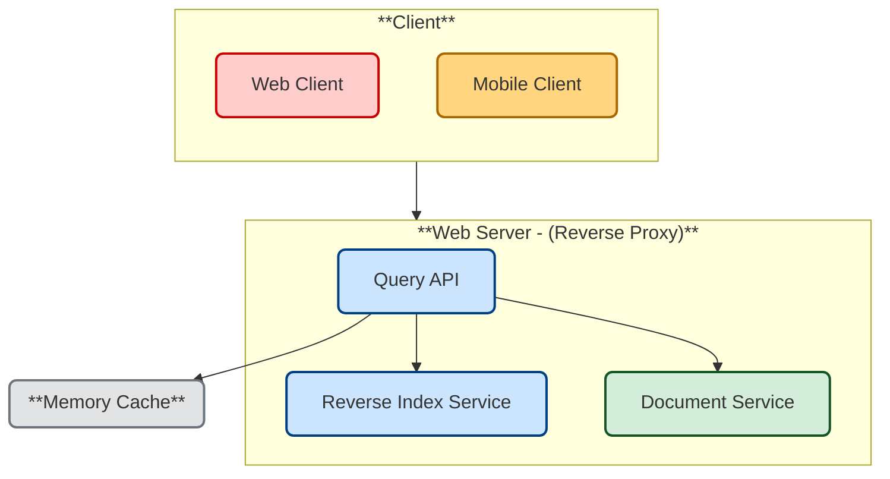

# Design a key-value cache to save the results of the most recent web server queries 

*Note: This document links directly to relevant areas found in the [system design topics](https://github.com/ido777/system-design-primer-update#index-of-system-design-topics) to avoid duplication.  Refer to the linked content for general talking points, tradeoffs, and alternatives.*

## Step 1: Investigate the problem, use cases and constraints and establish design scope

> Gather main functional requirements and scope the problem.
> Ask questions to clarify use cases and constraints.
> Discuss assumptions.


Adding clarifying questions is the first step in the process.
Remember your goal is to understand the problem and establish the design scope.

### What questions should you ask to clarify the problem?

Here is an example of the dialog you could have with the **Interviewer**:
**Interviewer**: Design a key-value cache to save the results of the most recent web server queries.

**Candidate**: ok, do you mean deploy Redis as docker or building Redis like?

**Interviewer**: I mean building Redis like.

**Candidate**: To clarify and understand the scope, may I start with a few quick questions?

**Interviewer**: Yes, please.

**Candidate**: What are the **main features, users, and use cases** of the system?

**Interviewer**: Yes, the cache should be able to handle 10 million users, 10 billion queries per month.

**Candidate**: ok. So here is the scope of the problem:

### Use cases

#### We'll scope the problem to handle only the following use cases

* **User** sends a search request resulting in a cache hit
* **User** sends a search request resulting in a cache miss
* **Service** has high availability

### Constraints and assumptions

#### State assumptions

* Traffic is not evenly distributed
    * Popular queries should almost always be in the cache
    * Need to determine how to expire/refresh
* Serving from cache requires fast lookups
* Low latency between machines
* Limited memory in cache
    * Need to determine what to keep/remove
    * Need to cache millions of queries
* 10 million users
* 10 billion queries per month

#### Calculate usage

**Clarify with your interviewer if you should run back-of-the-envelope usage calculations.**

* Cache stores ordered list of key: query, value: results
    * `query` - 50 bytes
    * `title` - 20 bytes
    * `snippet` - 200 bytes
    * Total: 270 bytes
* 2.7 TB of cache data per month if all 10 billion queries are unique and all are stored
    * 270 bytes per search * 10 billion searches per month
    * Assumptions state limited memory, need to determine how to expire contents
* 4,000 requests per second

Handy conversion guide:

* 2.5 million seconds per month
* 1 request per second = 2.5 million requests per month
* 40 requests per second = 100 million requests per month
* 400 requests per second = 1 billion requests per month

## Step 2: Create a high level design & Get buy-in

> Outline a high level design with all important components.


<!-- Old image for reference  -->

 




### Get buy-in

✅ Why This Breakdown?

Rather than diving into implementation, this diagram tells a story:

It reflects the search query workflow with **separation of concerns**:

- The **Query API** handles parsing and orchestration of the search process
- The **Reverse Index Service** focuses on finding matching documents efficiently when there is a cache miss
- The **Document Service** retrieves and formats the actual content
- The **Memory Cache** the memory cache which is used to serve cache hits

A **Reverse/Inverted Index** is a data structure used in search engines that maps content (like words or terms) to their locations in a set of documents. It's called "reverse" because instead of mapping documents to their contents, it maps contents to their documents - hence inverting the relationship.
Let me break this down with an example:
Suppose we have two documents:
1. "The quick brown fox"
2. "The lazy brown dog"
A reverse index would look something like this:
* "The" -> [doc1, doc2]
* "quick" -> [doc1]
* "brown" -> [doc1, doc2]
* "fox" -> [doc1]
* "lazy" -> [doc2]
* "dog" -> [doc2]

After finding matching documents, the Document Service is then used to fetch the actual content.
Workflow:
   Query API -> Memory Cache -> Cache Miss -> Reverse Index Service:
   1. Receives processed query from Query API
   2. Uses inverted index to find matching documents
   3. Ranks the results
   4. Returns top matches to Query API  

   Query API -> Memory Cache -> Cache Hit:
   1. refresh the cache with the new hit 
   2. Returns top matches to Query API


Since the cache has limited capacity, we'll use a **least recently used (LRU)** approach to expire older entries.
**Recency**: Every time you read or write a key, you mark it as the “most recently used.”

**Eviction**: When inserting a new entry into a full cache, you remove the entry marked as the “least recently used” (i.e. the one you haven’t touched in the longest time).

The architecture supports both the "cache hit" and "cache miss" scenarios while maintaining clear boundaries between components. 

You should ask for a feedback after you present the diagram, and get buy-in and some initial ideas about areas to dive into, based on the feedback.

## Step 3: Design core components

> Dive into details for each core component.

### Use case: User sends a request resulting in a cache hit

Popular queries can be served from a **Memory Cache** such as Redis or Memcached to reduce read latency and to avoid overloading the **Reverse Index Service** and **Document Service**.  Reading 1 MB sequentially from memory takes about 250 microseconds, while reading from SSD takes 4x and from disk takes 80x longer.<sup><a href=https://github.com/ido777/system-design-primer-update#latency-numbers-every-programmer-should-know>1</a></sup>


* The **Client** sends a request to the **Web Server**, running as a [reverse proxy](https://github.com/ido777/system-design-primer-update#reverse-proxy-web-server)
* The **Web Server** forwards the request to the **Query API** server
* The **Query API** server does the following:
    * Parses the query
        * Removes markup
        * Breaks up the text into terms
        * Fixes typos
        * Normalizes capitalization
        * Converts the query to use boolean operations
    * Checks the **Memory Cache** for the content matching the query
        * If there's a hit in the **Memory Cache**, the **Memory Cache** does the following:
            * Updates the cached entry's position to the front of the LRU list
            * Returns the cached contents
        * Else, the **Query API** does the following:
            * Uses the **Reverse Index Service** to find documents matching the query
                * The **Reverse Index Service** ranks the matching results and returns the top ones
            * Uses the **Document Service** to return titles and snippets
            * Updates the **Memory Cache** with the contents, placing the entry at the front of the LRU list

#### Cache implementation

To achieve constant time O(1) for both `get` and `put`, combine two structures:

* **Hash map** (Map<key, node>): for O(1) lookup of nodes.

* **Doubly‐linked list**: nodes ordered by recency, head = most recent, tail = least recent. O(1) for `append` and `remove`


**Clarify with your interviewer the expected amount, style, and purpose of the code you should write**.

**Query API Server** implementation:

```python
class QueryApi(object):

    def __init__(self, memory_cache, reverse_index_service):
        self.memory_cache = memory_cache
        self.reverse_index_service = reverse_index_service

    def parse_query(self, query):
        """Remove markup, break text into terms, deal with typos,
        normalize capitalization, convert to use boolean operations.
        """
        ...

    def process_query(self, query):
        query = self.parse_query(query)
        results = self.memory_cache.get(query)
        if results is None:
            results = self.reverse_index_service.process_search(query)
            self.memory_cache.set(query, results)
        return results
```

**Node** implementation:

```python
class Node(object):
    def __init__(self, query, results):
        self.query   = query    # the cache key
        self.results = results  # the cached payload
        self.prev    = None     # link to previous node
        self.next    = None     # link to next node
```

**LinkedList** implementation:

```python
class LinkedList(object):

    def __init__(self):
        self.head = None
        self.tail = None

    def move_to_front(self, node):
        """Detach `node` wherever it is, then insert it at head."""
        # 1) If node is already head, nothing to do.
        # 2) Otherwise unlink it:
        #      node.prev.next = node.next
        #      node.next.prev = node.prev
        # 3) Re-link at front:
        #      node.next = self.head
        #      self.head.prev = node
        #      self.head = node
        #      node.prev = None

    def append_to_front(self, node):
        """Insert a brand-new node at head."""
        # 1) node.next = self.head
        # 2) if head exists: head.prev = node
        # 3) self.head = node
        # 4) if tail is None (first element): tail = node

    def remove_from_tail(self):
        """Unlink the tail node and return it (the oldest entry)."""
        # 1) old = self.tail
        # 2) self.tail = old.prev
        # 3) if new tail: new_tail.next = None
        #    else (list empty): head = None
        # 4) return old
```

**Cache** implementation:

```python
class Cache(object):

    def __init__(self, MAX_SIZE):
        self.MAX_SIZE = MAX_SIZE
        self.size = 0
        self.lookup = {}  # key: query, value: node
        self.linked_list = LinkedList()

    def get(self, query)
        """Get the stored query result from the cache.

        Accessing a node updates its position to the front of the LRU list.
        """
        node = self.lookup[query]
        if node is None:
            return None
        self.linked_list.move_to_front(node)
        return node.results

    def set(self, results, query):
        """Set the result for the given query key in the cache.

        When updating an entry, updates its position to the front of the LRU list.
        If the entry is new and the cache is at capacity, removes the oldest entry
        before the new entry is added.
        """
        node = self.lookup[query]
        if node is not None:
            # Key exists in cache, update the value
            node.results = results
            self.linked_list.move_to_front(node)
        else:
            # Key does not exist in cache
            if self.size == self.MAX_SIZE:
                # Remove the oldest entry from the linked list and lookup
                self.lookup.pop(self.linked_list.tail.query, None)
                self.linked_list.remove_from_tail()
            else:
                self.size += 1
            # Add the new key and value
            new_node = Node(query, results)
            self.linked_list.append_to_front(new_node)
            self.lookup[query] = new_node
```

Why this is O(1)
* **Lookup**: `self.lookup[query]` is a hash-table lookup → O(1).
* **Reordering**: Doubly-linked list insertions/removals (given a reference to the node) are pointer updates → O(1).
* **Eviction**: Removing tail is O(1), and deleting from the dict is O(1).


#### When to update the cache

The cache should be updated when:

* The page contents change
* The page is removed or a new page is added
* The page rank changes

The most straightforward way to handle these cases is to simply set a max time that a cached entry can stay in the cache before it is updated, usually referred to as time to live (TTL).

Refer to [When to update the cache](https://github.com/ido777/system-design-primer-update#when-to-update-the-cache) for tradeoffs and alternatives.  The approach above describes [cache-aside](https://github.com/ido777/system-design-primer-update#cache-aside).

###  Scale the design

> Identify and address bottlenecks, given the constraints.


**Important: Do not simply jump right into the final design from the initial design!**

State you would 
1) **Benchmark/Load Test**, 
2) **Profile** for bottlenecks 
3) address bottlenecks while evaluating alternatives and trade-offs, and 
4) repeat.  See [Design a system that scales to millions of users on AWS](../scaling_aws/README.md) as a sample on how to iteratively scale the initial design.

It's important to discuss what bottlenecks you might encounter with the initial design and how you might address each of them.  For example, what issues are addressed by adding a **Load Balancer** with multiple **Web Servers**?  **CDN**?  **Master-Slave Replicas**?  What are the alternatives and **Trade-Offs** for each?


## Step 4 Wrap up

To summarize, we've designed a key-value cache to save the results of the most recent web server queries. We've discussed the high-level design, identified potential bottlenecks, and proposed solutions to address scalability issues. Now it is time to align again with the interviewer expectations.
See if she has any feedback or questions, suggest next steps, improvements, error handling, and monitoring if appropriate.


We'll introduce some components to complete the design and to address scalability issues.  Internal load balancers are not shown to reduce clutter.

*To avoid repeating discussions*, refer to the following [system design topics](https://github.com/ido777/system-design-primer-update#index-of-system-design-topics) for main talking points, tradeoffs, and alternatives:

* [DNS](https://github.com/ido777/system-design-primer-update#domain-name-system)
* [Load balancer](https://github.com/ido777/system-design-primer-update#load-balancer)
* [Horizontal scaling](https://github.com/ido777/system-design-primer-update#horizontal-scaling)
* [Web server (reverse proxy)](https://github.com/ido777/system-design-primer-update#reverse-proxy-web-server)
* [API server (application layer)](https://github.com/ido777/system-design-primer-update#application-layer)
* [Cache](https://github.com/ido777/system-design-primer-update#cache)
* [Consistency patterns](https://github.com/ido777/system-design-primer-update#consistency-patterns)
* [Availability patterns](https://github.com/ido777/system-design-primer-update#availability-patterns)

### Expanding the Memory Cache to many machines

To handle the heavy request load and the large amount of memory needed, we'll scale horizontally.  We have three main options on how to store the data on our **Memory Cache** cluster:

* **Each machine in the cache cluster has its own cache** - Simple, although it will likely result in a low cache hit rate.
* **Each machine in the cache cluster has a copy of the cache** - Simple, although it is an inefficient use of memory.
* **The cache is [sharded](https://github.com/ido777/system-design-primer-update#sharding) across all machines in the cache cluster** - More complex, although it is likely the best option.  We could use hashing to determine which machine could have the cached results of a query using `machine = hash(query)`.  We'll likely want to use [consistent hashing](https://github.com/ido777/system-design-primer-update#under-development).

## Additional talking points

> Additional topics to dive into, depending on the problem scope and time remaining.

### SQL scaling patterns

* [Read replicas](https://github.com/ido777/system-design-primer-update#master-slave-replication)
* [Federation](https://github.com/ido777/system-design-primer-update#federation)
* [Sharding](https://github.com/ido777/system-design-primer-update#sharding)
* [Denormalization](https://github.com/ido777/system-design-primer-update#denormalization)
* [SQL Tuning](https://github.com/ido777/system-design-primer-update#sql-tuning)

#### NoSQL

* [Key-value store](https://github.com/ido777/system-design-primer-update#key-value-store)
* [Document store](https://github.com/ido777/system-design-primer-update#document-store)
* [Wide column store](https://github.com/ido777/system-design-primer-update#wide-column-store)
* [Graph database](https://github.com/ido777/system-design-primer-update#graph-database)
* [SQL vs NoSQL](https://github.com/ido777/system-design-primer-update#sql-or-nosql)

### Caching

* Where to cache
    * [Client caching](https://github.com/ido777/system-design-primer-update#client-caching)
    * [CDN caching](https://github.com/ido777/system-design-primer-update#cdn-caching)
    * [Web server caching](https://github.com/ido777/system-design-primer-update#web-server-caching)
    * [Database caching](https://github.com/ido777/system-design-primer-update#database-caching)
    * [Application caching](https://github.com/ido777/system-design-primer-update#application-caching)
* What to cache
    * [Caching at the database query level](https://github.com/ido777/system-design-primer-update#caching-at-the-database-query-level)
    * [Caching at the object level](https://github.com/ido777/system-design-primer-update#caching-at-the-object-level)
* When to update the cache
    * [Cache-aside](https://github.com/ido777/system-design-primer-update#cache-aside)
    * [Write-through](https://github.com/ido777/system-design-primer-update#write-through)
    * [Write-behind (write-back)](https://github.com/ido777/system-design-primer-update#write-behind-write-back)
    * [Refresh ahead](https://github.com/ido777/system-design-primer-update#refresh-ahead)

### Asynchronism and microservices

* [Message queues](https://github.com/ido777/system-design-primer-update#message-queues)
* [Task queues](https://github.com/ido777/system-design-primer-update#task-queues)
* [Back pressure](https://github.com/ido777/system-design-primer-update#back-pressure)
* [Microservices](https://github.com/ido777/system-design-primer-update#microservices)

### Communications

* Discuss tradeoffs:
    * External communication with clients - [HTTP APIs following REST](https://github.com/ido777/system-design-primer-update#representational-state-transfer-rest)
    * Internal communications - [RPC](https://github.com/ido777/system-design-primer-update#remote-procedure-call-rpc)
* [Service discovery](https://github.com/ido777/system-design-primer-update#service-discovery)

### Security

Refer to the [security section](https://github.com/ido777/system-design-primer-update#security).

### Latency numbers

See [Latency numbers every programmer should know](https://github.com/ido777/system-design-primer-update#latency-numbers-every-programmer-should-know).

### Ongoing

* Continue benchmarking and monitoring your system to address bottlenecks as they come up
* Scaling is an iterative process
