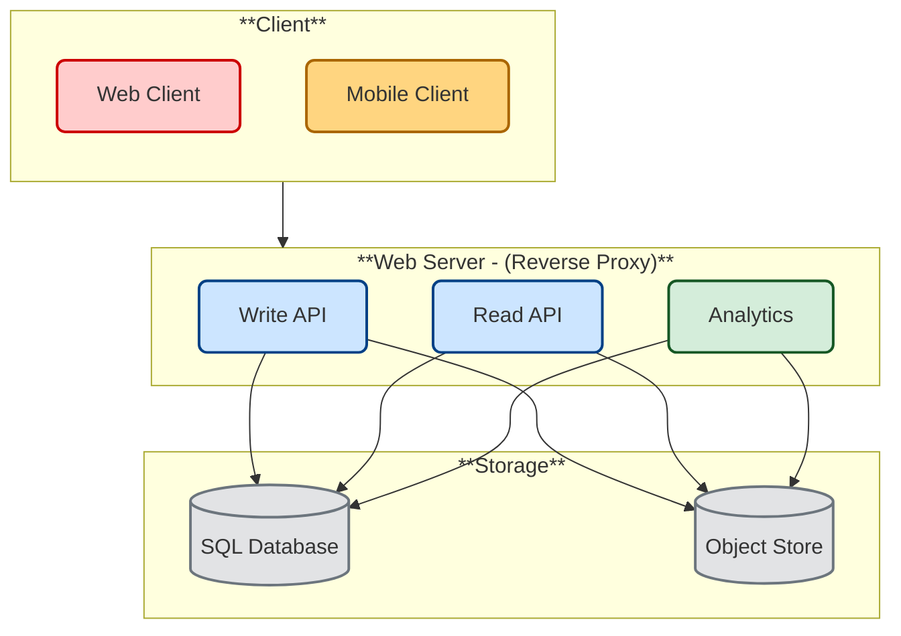

# Design Text snippet sharer (e.g. GitHub Gist, Pastebin.com)

*Note: This document links directly to relevant areas found in the [system design topics](https://github.com/ido777/system-design-primer-update.git#index-of-system-design-topics) to avoid duplication.  Refer to the linked content for general talking points, tradeoffs, and alternatives.*

In this exercise, we'll design a text snippet sharer, e.g. GitHub Gist, Pastebin.com.
We will focus only on the core functionality.

[Design A URL shortener](../url_shortener/README.md)  - e.g. [TinyURL](https://tinyurl.com/), [bit.ly](https://bit.ly/) is a related question, since pastebin requires storing the paste contents instead of the original unshortened url. However, the URL shortener question is more focused on the shortlink generation and redirection, while the pastebin question is more focused on the storage and retrieval of the paste contents.

## Step 1: Investigate the problem, use cases and constraints and establish design scope

> Gather main functional requirements and scope the problem.
> Ask questions to clarify use cases and constraints.
> Discuss assumptions.


Adding clarifying questions is the first step in the process.
Remember your goal is to understand the problem and establish the design scope.

### What questions should you ask to clarify the problem?


Here is an example of the dialog you could have with the **Interviewer**:
**Interviewer**: Design Pastebin.com.
**Candidate**: Could you please remind me what Pastebin.com does at a high level?
**Interviewer**: Do you happen to know GitHub Gist? It is similar to Pastebin.com.

## 📝 Pastebin.com Overview

**Pastebin** is a straightforward web-based tool designed for quickly sharing plain text or code snippets.

### Key Features:

- **User Access**: Allows anonymous pastes; registration enables management of pastes.
- **Paste Visibility**: Options include public, unlisted, and private pastes.
- **Expiration Settings**: Set pastes to expire after a specific time or view count.
- **Syntax Highlighting**: Supports various programming and markup languages.
- **PRO Account Benefits**:
  - Create pastes up to 10 MB (free users limited to 500 KB).
  - Unlimited private and unlisted pastes.
  - Increased daily paste limits (250 per 24 hours).
  - Ad-free browsing and additional alert features.  

### Ideal Use Cases:

- Quickly sharing logs, error messages, or configuration files.
- Temporary storage of text for collaboration or troubleshooting.
- Situations where simplicity and speed are paramount. 

**Candidate**: Got it. Since Pastebin can be quite complex, can we focus on just the core features first?  
**Interviewer**: Sure—what would you target?  
**Candidate**: The main requirement is that the user pastes text and immediately receives a shareable link. Correct?  
**Interviewer**: Can you elaborate on the link?  
**Candidate**: A randomly generated, unique link.  
**Interviewer**: Does it expire?  
**Candidate**: No.  
**Interviewer**: Never?  
**Candidate**: (_Oops, she doesn’t like that we don’t have expiration._) We can add a timed expiration—user can set the expiration.  
**Interviewer**: Sounds good.  
**Candidate**: Cool. Let me summarize.

Conclusion:
- Use cases
  • User enters a block of text and gets a randomly generated link
- Expiration
  • Default setting does not expire
  • Can optionally set a timed expiration

**Candidate**: Mobile or desktop client?
**Interviewer**: Both.
**Candidate**: Is user authentication or account registration required to view or create pastes?
**Interviewer**: No registration is needed; it’s anonymous.
**Candidate**: Great. Do we need to track usage statistics or analytics for these pastes?
**Interviewer**: We will record monthly visit stats.
**Candidate**: Should expired pastes be removed automatically?
**Interviewer**: Yes, the service deletes expired pastes.
**Candidate**: What availability SLA do we expect?
**Interviewer**: High availability is a requirement.
**Candidate**: For this exercise phase, I would like to suggest that we don't need user accounts, login, or custom shortlinks.
**Interviewer**: ok, Those are out of scope for now.
**Candidate**: For capacity planning, can you confirm traffic patterns and volumes?
**Interviewer**: Traffic is unevenly distributed; we target 10M users, 10M writes/month, and 100M reads/month.
**Candidate**: Understood. And are pastes text only, with low-latency URL resolution?
**Interviewer**: Correct.
**Candidate**: Finally, any rough numbers on storage and throughput?
**Interviewer**: I'll leave that to you.
**Candidate**: ok. So here is the scope of the problem:

### Use cases

#### We'll scope the problem to handle only the following use cases

* **User** enters a block of text and gets a randomly generated link
    * Expiration
        * Default setting does not expire
        * Can optionally set a timed expiration
* **User** enters a paste's url and views the contents
* **User** is anonymous
* **Service** tracks analytics of pages
    * Monthly visit stats
* **Service** deletes expired pastes
* **Service** has high availability

#### Out of scope

* **User** registers for an account
    * **User** verifies email
* **User** logs into a registered account
    * **User** edits the document
* **User** can set visibility
* **User** can set the shortlink

### Constraints and assumptions

#### State assumptions

* Traffic is not evenly distributed
* Following a short link should be fast
* Pastes are text only
* Page view analytics do not need to be realtime
* 10 million users
* 10 million paste writes per month
* 100 million paste reads per month
* 10:1 read to write ratio

#### Calculate usage

**Clarify with your interviewer if you should run back-of-the-envelope usage calculations.**
**if** you need to calculate usage, here is calculation example:

* Size per paste
    * 1 KB content per paste
    * `shortlink` - 7 bytes
    * `expiration_length_in_minutes` - 4 bytes
    * `created_at` - 5 bytes
    * `paste_path` - 255 bytes
    * total = ~1.27 KB
* 12.7 GB of new paste content per month
    * 1.27 KB per paste * 10 million pastes per month
    * ~450 GB of new paste content in 3 years
    * 360 million shortlinks in 3 years
    * Assume most are new pastes instead of updates to existing ones
* 4 paste writes per second on average
* 40 read requests per second on average

Handy conversion guide:

* 2.5 million seconds per month
* 1 request per second = 2.5 million requests per month
* 40 requests per second = 100 million requests per month
* 400 requests per second = 1 billion requests per month

## Step 2: Create a high level design & Get buy-in

> Outline a high level design with all important components.


<!-- Old image for reference  -->



### Get buy-in

✅ Why This Breakdown?

Rather than diving into implementation, this diagram tells a story:

It reflects usage patterns (10:1 read/write). This is why we have different components for write and read.

It separates latency-sensitive vs. async processing. Analytics is async processing so it gets its own component.

It shows readiness for growth without premature optimization. Write with load balancer, read with cache.

It creates a solid skeleton that supports further discussion on reverse proxy, caching, sharding, CDN integration, or even queueing systems for analytics—all while staying grounded in the problem as scoped.

You should ask for a feedback after you present the diagram, and get buy-in and some initial ideas about areas to dive into, based on the feedback.


## Step 3: Design core components

> Dive into details for each core component.

### Use case: User enters a block of text and gets a randomly generated link

We could use a [relational database](https://github.com/ido777/system-design-primer-update.git#relational-database-management-system-rdbms) as a large hash table, mapping the generated url to a file server and path containing the paste file.

Instead of managing a file server, we could use a managed **Object Store** such as Amazon S3 or a [NoSQL document store](https://github.com/ido777/system-design-primer-update.git#document-store).

An alternative to a relational database acting as a large hash table, we could use a [NoSQL key-value store](https://github.com/ido777/system-design-primer-update.git#key-value-store).  We should discuss the [tradeoffs between choosing SQL or NoSQL](https://github.com/ido777/system-design-primer-update.git#sql-or-nosql).  The following discussion uses the relational database approach.

* The **Client** sends a create paste request to the **Web Server**, running as a [reverse proxy](https://github.com/ido777/system-design-primer-update.git#reverse-proxy-web-server)
* The **Web Server** forwards the request to the **Write API** server
* The **Write API** server does the following:
    * Generates a unique url
        * Checks if the url is unique by looking at the **SQL Database** for a duplicate
        * If the url is not unique, it generates another url
        * If we supported a custom url, we could use the user-supplied (also check for a duplicate)
    * Saves to the **SQL Database** `pastes` table
    * Saves the paste data to the **Object Store**
    * Returns the url

**Clarify with your interviewer the expected amount, style, and purpose of the code you should write**.

The `pastes` table could have the following structure:

```
shortlink char(7) NOT NULL
expiration_length_in_minutes int NOT NULL
created_at datetime NOT NULL
paste_path varchar(255) NOT NULL
PRIMARY KEY(shortlink)
```

Setting the primary key to be based on the `shortlink` column creates an [index](https://github.com/ido777/system-design-primer-update.git#use-good-indices) that the database uses to enforce uniqueness. We create an additional index on `created_at` so the database can locate pastes created within a time range without full table scans. Since indexes are typically implemented with B-trees, index lookup is O(log n) instead of O(n). Frequently accessed indexes (like by recent timestamps) are often cached automatically in RAM by the database’s internal cache and since the indexes are smaller, they are likely to stay in memory. Reading 1 MB sequentially from memory takes about 250 microseconds, while reading from SSD takes 4x and from disk takes 80x longer.<sup><a href=https://github.com/ido777/system-design-primer-update.git#latency-numbers-every-programmer-should-know>1</a></sup>

To generate the unique url, we could:

* Take the [**MD5**](https://en.wikipedia.org/wiki/MD5) hash of the user's ip_address + timestamp
    * MD5 is a widely used hashing function that produces a 128-bit (16 bytes) hash value
    * MD5 is uniformly distributed
    * Alternatively, we could also take the MD5 hash of randomly-generated data
* [**Base 62**](https://www.kerstner.at/2012/07/shortening-strings-using-base-62-encoding/) encode the MD5 hash
    * Base 62 encodes to `[a-zA-Z0-9]` which works well for urls, eliminating the need for escaping special characters
    * There is only one hash result for the original input and Base 62 is deterministic (no randomness involved)
    * Base 64 is another popular encoding but provides issues for urls because of the additional `+` and `/` characters
    * The following [Base 62 pseudocode](http://stackoverflow.com/questions/742013/how-to-code-a-url-shortener) runs in O(k) time where k is the number of digits = 7:

```text
def base_encode(num, base=62):
    digits = []
    while num > 0
      remainder = modulo(num, base)
      digits.push(remainder)
      num = divide(num, base)
    digits = digits.reverse
```

Here is python example implementation:
```python
def base_encode(num, base=62):
    characters = "0123456789abcdefghijklmnopqrstuvwxyzABCDEFGHIJKLMNOPQRSTUVWXYZ"
    if num == 0:
        return characters[0]
    
    digits = []
    while num > 0:
        remainder = num % base
        digits.append(characters[remainder])
        num //= base  # Integer division

    digits.reverse()
    return ''.join(digits)
```

* Take the first 7 characters of the output, which results in 62^7 possible values and should be sufficient to handle our constraint of 360 million shortlinks in 3 years:

```text
url = base_encode(md5(ip_address+timestamp))[:URL_LENGTH]
```

python example implementation:
```python
import hashlib

def generate_shortlink(ip_address: str, timestamp: str, url_length=7) -> str:
    # Step 1: Create MD5 hash
    raw = f"{ip_address}{timestamp}".encode('utf-8')
    md5_hash = hashlib.md5(raw).digest()
    
    # Step 2: Convert hash to an integer
    num = int.from_bytes(md5_hash, byteorder='big')
    
    # Step 3: Base62 encode the integer
    base62_encoded = base_encode(num)
    
    # Step 4: Take the first `url_length` characters
    return base62_encoded[:url_length]

# Example usage
shortlink = generate_shortlink("192.168.0.1", "2025-04-28T15:30:00Z")
print(shortlink)  # Example output: "4F9dQ2b"

```
#### REST API

We'll use a public [**REST API**](https://github.com/ido777/system-design-primer-update.git#representational-state-transfer-rest):

##### Write API - Create a paste 
```
$ curl -X POST --data '{ "expiration_length_in_minutes": "60", \
    "paste_contents": "Hello World!" }' https://pastebin.com/api/v1/paste
```

Response:

```
{
    "shortlink": "foobar"
}
```

### Use case: User enters a paste's url and views the contents

* The **Client** sends a get paste request to the **Web Server**
* The **Web Server** forwards the request to the **Read API** server
* The **Read API** server does the following:
    * Checks the **SQL Database** for the generated url
        * If the url is in the **SQL Database**, fetch the paste contents from the **Object Store**
        * Else, return an error message for the user

#### REST API

##### Read API - Get a paste
```
$ curl https://pastebin.com/api/v1/paste?shortlink=foobar
```

Response:

```
{
    "paste_contents": "Hello World"
    "created_at": "YYYY-MM-DD HH:MM:SS"
    "expiration_length_in_minutes": "60"
}
```

### Use case: Service tracks analytics of pages

Since realtime analytics are not a requirement, we could simply **MapReduce** the **Web Server** logs to generate hit counts.
While traditional MapReduce jobs are rarely written manually today, the underlying pattern — mapping, grouping, and reducing data — is still everywhere. For website analytics, we typically use SQL engines like BigQuery or Athena for batch queries, or streaming frameworks like Flink for real-time aggregation, depending on data freshness needs and scale.


**Clarify with your interviewer the expected amount, style, and purpose of the code you should write**.

#### Modern "MapReduce" today looks like:

1. If you have logs (e.g., nginx, access logs):
* **Store them** in an object store like:
  * AWS S3
  * Google Cloud Storage

* **Organize them** by time (e.g., `/logs/yyyy/mm/dd/` partition folders).

* **Query them** using **Athena** or **BigQuery** with **SQL**.

You might run a query like:

```sql
SELECT
  DATE(timestamp) as day,
  url,
  COUNT(*) as hits
FROM
  logs
WHERE
  timestamp BETWEEN '2025-04-01' AND '2025-04-30'
GROUP BY
  day, url
ORDER BY
  hits DESC;
```

⚡ And this is **MapReduce under the hood**:

* SQL SELECT → Map
* GROUP BY → Reduce

But you don’t manage the "mapping" and "reducing" manually — the cloud service **optimizes** and **parallelizes** it for you.


#### Example of Local MapReduce Simulation for Testing:


For educational purposes and small local testing, we can simulate MapReduce logic using Python. This is **not how production systems work today**, but it is useful for **understanding the concepts**.

```python
from collections import defaultdict

# Example raw log lines
logs = [
    '2025-04-01 12:00:00 /home',
    '2025-04-01 12:05:00 /about',
    '2025-04-01 12:10:00 /home',
    '2025-04-02 13:00:00 /contact',
]

# Map Step
mapped = []
for line in logs:
    timestamp, url = line.split()
    day = timestamp.split('T')[0] if 'T' in timestamp else timestamp.split()[0]
    mapped.append(((day, url), 1))

# Shuffle & Group Step
grouped = defaultdict(list)
for key, value in mapped:
    grouped[key].append(value)

# Reduce Step
reduced = {}
for key, values in grouped.items():
    reduced[key] = sum(values)

# Output
for key, count in reduced.items():
    print(f"{key}: {count}")
```


### Use case: Service deletes expired pastes

To delete expired pastes, we could just scan the **SQL Database** for all entries whose expiration timestamp are older than the current timestamp.  All expired entries would then be deleted (or  marked as expired) from the table.

### Tradeoffs and Scaling the design

> Identify and address bottlenecks, given the constraints.


**Important: Do not simply jump right into the final design from the initial design!**

State you would do this iteratively: 
1) **Benchmark/Load Test**, 
2) **Profile** for bottlenecks 
3) address bottlenecks while evaluating alternatives and trade-offs, and 
4) repeat.  

See [Design a system that scales to millions of users on AWS](../scaling_aws/README.md) as a sample on how to iteratively scale the initial design.

It's important to discuss what bottlenecks you might encounter with the initial design and how you might address each of them.  
For example, what issues are addressed by adding 
 - a **Load Balancer** with multiple **Web Servers**?
 -  **CDN**?  
 - **Master-Slave Replicas**?
 - What are the alternatives and **Trade-Offs** for each?

We'll introduce some components to complete the design and to address scalability issues.  Internal load balancers are not shown to reduce clutter.


## Step 4 Wrap up

To summarize, we've designed a text snippet sharer system that meets the core requirements. We've discussed the high-level design, identified potential bottlenecks, and proposed solutions to address scalability issues. Now it is time to align again with the interviewer expectations.
See if she has any feedback or questions, suggest next steps, improvements, error handling, and monitoring if appropriate.


*To avoid repeating discussions*, refer to the following [system design topics](https://github.com/ido777/system-design-primer-update.git#index-of-system-design-topics) for main talking points, tradeoffs, and alternatives:

* [DNS](https://github.com/ido777/system-design-primer-update.git#domain-name-system)
* [CDN](https://github.com/ido777/system-design-primer-update.git#content-delivery-network)
* [Load balancer](https://github.com/ido777/system-design-primer-update.git#load-balancer)
* [Horizontal scaling](https://github.com/ido777/system-design-primer-update.git#horizontal-scaling)
* [Web server (reverse proxy)](https://github.com/ido777/system-design-primer-update.git#reverse-proxy-web-server)
* [API server (application layer)](https://github.com/ido777/system-design-primer-update.git#application-layer)
* [Cache](https://github.com/ido777/system-design-primer-update.git#cache)
* [Relational database management system (RDBMS)](https://github.com/ido777/system-design-primer-update.git#relational-database-management-system-rdbms)
* [SQL write master-slave failover](https://github.com/ido777/system-design-primer-update.git#fail-over)
* [Master-slave replication](https://github.com/ido777/system-design-primer-update.git#master-slave-replication)
* [Consistency patterns](https://github.com/ido777/system-design-primer-update.git#consistency-patterns)
* [Availability patterns](https://github.com/ido777/system-design-primer-update.git#availability-patterns)

The **Analytics Database** could use a data warehousing solution such as Amazon Redshift or Google BigQuery.

An **Object Store** such as Amazon S3 can comfortably handle the constraint of 12.7 GB of new content per month.

To address the 40 *average* read requests per second (higher at peak), traffic for popular content should be handled by the **Memory Cache** instead of the database.  The **Memory Cache** is also useful for handling the unevenly distributed traffic and traffic spikes.  The **SQL Read Replicas** should be able to handle the cache misses, as long as the replicas are not bogged down with replicating writes.

4 *average* paste writes per second (with higher at peak) should be do-able for a single **SQL Write Master-Slave**.  Otherwise, we'll need to employ additional SQL scaling patterns:

* [Federation](https://github.com/ido777/system-design-primer-update.git#federation)
* [Sharding](https://github.com/ido777/system-design-primer-update.git#sharding)
* [Denormalization](https://github.com/ido777/system-design-primer-update.git#denormalization)
* [SQL Tuning](https://github.com/ido777/system-design-primer-update.git#sql-tuning)

We should also consider moving some data to a **NoSQL Database**.

## Additional talking points

> Additional topics to dive into, depending on the problem scope and time remaining.

#### NoSQL

* [Key-value store](https://github.com/ido777/system-design-primer-update.git#key-value-store)
* [Document store](https://github.com/ido777/system-design-primer-update.git#document-store)
* [Wide column store](https://github.com/ido777/system-design-primer-update.git#wide-column-store)
* [Graph database](https://github.com/ido777/system-design-primer-update.git#graph-database)
* [SQL vs NoSQL](https://github.com/ido777/system-design-primer-update.git#sql-or-nosql)

### Caching

* Where to cache
    * [Client caching](https://github.com/ido777/system-design-primer-update.git#client-caching)
    * [CDN caching](https://github.com/ido777/system-design-primer-update.git#cdn-caching)
    * [Web server caching](https://github.com/ido777/system-design-primer-update.git#web-server-caching)
    * [Database caching](https://github.com/ido777/system-design-primer-update.git#database-caching)
    * [Application caching](https://github.com/ido777/system-design-primer-update.git#application-caching)
* What to cache
    * [Caching at the database query level](https://github.com/ido777/system-design-primer-update.git#caching-at-the-database-query-level)
    * [Caching at the object level](https://github.com/ido777/system-design-primer-update.git#caching-at-the-object-level)
* When to update the cache
    * [Cache-aside](https://github.com/ido777/system-design-primer-update.git#cache-aside)
    * [Write-through](https://github.com/ido777/system-design-primer-update.git#write-through)
    * [Write-behind (write-back)](https://github.com/ido777/system-design-primer-update.git#write-behind-write-back)
    * [Refresh ahead](https://github.com/ido777/system-design-primer-update.git#refresh-ahead)

### Asynchronism and microservices

* [Message queues](https://github.com/ido777/system-design-primer-update.git#message-queues)
* [Task queues](https://github.com/ido777/system-design-primer-update.git#task-queues)
* [Back pressure](https://github.com/ido777/system-design-primer-update.git#back-pressure)
* [Microservices](https://github.com/ido777/system-design-primer-update.git#microservices)

### Communications

* Discuss tradeoffs:
    * External communication with clients - [HTTP APIs following REST](https://github.com/ido777/system-design-primer-update.git#representational-state-transfer-rest)
    * Internal communications - [RPC](https://github.com/ido777/system-design-primer-update.git#remote-procedure-call-rpc)
* [Service discovery](https://github.com/ido777/system-design-primer-update.git#service-discovery)

### Security

Refer to the [security section](https://github.com/ido777/system-design-primer-update.git#security).

### Latency numbers

See [Latency numbers every programmer should know](https://github.com/ido777/system-design-primer-update.git#latency-numbers-every-programmer-should-know).

### Ongoing

* Continue benchmarking and monitoring your system to address bottlenecks as they come up
* Scaling is an iterative process