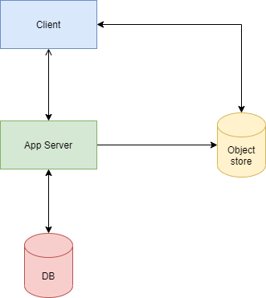
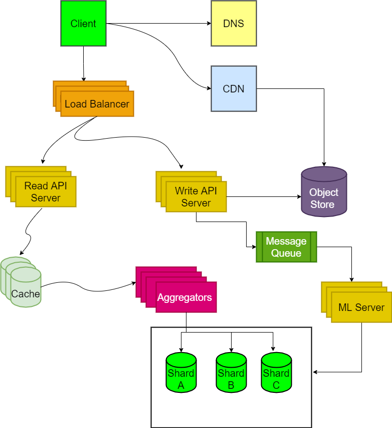

# Design Product Review & Rating System

*Note: This document links directly to relevant areas found in the [system design topics](https://github.com/donnemartin/system-design-primer#index-of-system-design-topics) to avoid duplication.  Refer to the linked content for general talking points, trade-offs, and alternatives.*

## Step 1: Outline use cases and constraints

> Gather requirements and scope the problem.
> Ask questions to clarify use cases and constraints.
> Discuss assumptions.

Without an interviewer to address clarifying questions, we'll define some use cases and constraints.

### Use cases

#### We'll scope the problem to handle only the following use cases

#### NOTE: Assuming that the application is validated that this user is authorized to post the review, the user has to receive the product from our system before writing a review in our system 

**Functional Requirements**
* **User** should be able to post create/update/delete review.
* **User** rate in the range 1-5
* **User** should be able to upload images/videos with the review
* **Service** should be highly reliable

**Non Functional Requirements**
* **Service** should have low latency
* **Service** should not lose any data at any time

**Extended requirements**
* Supporting analytics
* Supporting comments/replies on reviews
* Review tags

### Constraints and assumptions

#### State assumptions

* 1 billion active users
* 1 million reviews are posted in our system per day
* 100 million reviews read request per day

#### Calculate Memory usage

**Clarify with your interviewer if you should run back-of-the-envelope usage calculations.**

**Memory estimations**
* Assuming average 2048 characters are needed per review; 
* 1 byte for rating 
* 4 byte image ids/video ids

Avg review size  = 2050  bytes  * 1M  ~ = 2 GB per day
Image Storage= 200kb * 500k = 100GB

For 5 years  = 100GB * 365  * 5  ~= 132000 GB =132 TB;

5 years with replication + %20 headroom = 0.5PB

**RPS estimation**:
* 100 Read : 1 Write,
* **Total reads** per day = 100 * 1 M  = 100M/86400s = 1k rps
* **Total writes** per day = 1M = 1M/86400s = 10 rps

Handy conversion guide:

* 2.5 million seconds per month
* 1 request per second = 2.5 million requests per month
* 40 requests per second = 100 million requests per month
* 400 requests per second = 1 billion requests per month

## Step 2: System API definition: 

**Write API:**

POST(userId, productId, review_text, review_rating, images, videos); 
* **userId:** User Id for the review user
* **productId:** Review product Id
* **review_text:** Review text/message
* **review_rating:** Rating (1 - 5)
* **images:** Images about review (optional)
* **video:** Video about review (optional)

**Read API**
GET(productId, count, sorted_by, page_token,filters);

* **productId:** Product Id 
* **count:** Number of review need to returned in result
* **sorted_by:** Sort by latest
* **page_token:** page_token will be used as offset 
* **filters:** filter criteria (search terms)

# Step 3: DataModel design

Simplicity case, we can consider my SQL for table structure.

**User Id table**
* UserID
* First_name
* Second_name
* Password
* profile_pic
* createdAt
* updatedAt

**Review table**
* reviewId
* productID
* userID
* review
* image_id
* video_id
* rating
* createAt
* updatedAt

## Step 4: Create a high-level design

> Outline a high-level design with all essential components.

>

## Step 5: Detailed design components

> Dive into details for each core component.

**Clarify with your interviewer how much code you are expected to write**.

**Important: Do not simply jump right into the final design from the initial design!**

State you would 1) **Benchmark/Load Test**, 2) **Profile** for bottlenecks, 3) address bottlenecks while evaluating alternatives and trade-offs, and 4) repeat.  See [Design a system that scales to millions of users on AWS](../scaling_aws/README.md) as a sample on how to scale the initial design iteratively.

It's important to discuss what bottlenecks you might encounter with the initial design and how you might address each of them.  For example, what issues are addressed by adding a **Load Balancer** with multiple **Web Servers**?  **CDN**?  **Master-Slave Replicas**?  What are the alternatives and **Trade-Offs** for each?

We'll introduce some components to complete the design and to address scalability issues.  Internal load balancers are not shown to reduce clutter.

### Application Servers:

* Application server is going to have heavy ready traffic, it's better to divide application server into read and write servers
  * Read Servers
  * Write Servers
* Write servers are responsible for generating review id and uploading media to object store(s3)
  * Review ID Generation:
    * We can use Random Id Generation [blog.twitter.com](https://blog.twitter.com/2010/announcing-snowflake) | [github.com](https://github.com/twitter/snowflake/)
    * It will be easy to sort the review if random twitter generation
* Read Server:
  * Read Server will access the database through the cache to improve read efficiency/low latency
* Write Server:
  * Write server will post the review to [Message queues](https://github.com/donnemartin/system-design-primer#message-queues)
  * Quality servers/ml server will consume the review from the message queue and detect abuse review. 
  * Save the review in DB

### Load balancers

* We need to introduce the load balancers between 
  * client and application servers.
  * application servers and aggregators 

### Data Sharding
* Data sharing can be done based on the hash of reviewId, which will ensure an equal distribution of data of all servers. We can use consistent hashing to ensure adding new servers/removing servers causing a small effect. More details about data sharding and consistent hashing reference are given below
* NO SQL can be used for this application purpose like Casandra
## 
> 

References:

*To avoid repeating discussions*, refer to the following [system design topics](https://github.com/donnemartin/system-design-primer#index-of-system-design-topics) for main talking points, tradeoffs, and alternatives:

* [DNS](https://github.com/donnemartin/system-design-primer#domain-name-system)
* [Load balancer](https://github.com/donnemartin/system-design-primer#load-balancer)
* [Horizontal scaling](https://github.com/donnemartin/system-design-primer#horizontal-scaling)
* [Web server (reverse proxy)](https://github.com/donnemartin/system-design-primer#reverse-proxy-web-server)
* [API server (application layer)](https://github.com/donnemartin/system-design-primer#application-layer)
* [Cache](https://github.com/donnemartin/system-design-primer#cache)
* [Consistency patterns](https://github.com/donnemartin/system-design-primer#consistency-patterns)
* [Availability patterns](https://github.com/donnemartin/system-design-primer#availability-patterns)

To address the constraint of 400 *average* read requests per second (higher at peak), personal data can be served from a **Memory Cache** such as Redis or Memcached to reduce response times and traffic to downstream services.  This could be especially useful for people who do multiple searches in succession and are well-connected.  Reading 1 MB sequentially from memory takes about 250 microseconds while reading from SSD takes 4x and from disk takes 80x longer.<a href=https://github.com/donnemartin/system-design-primer#latency-numbers-every-programmer-should-know>1</a>

Below are further optimizations:

* Store complete or partial BFS traversals to speed up subsequent lookups in the **Memory Cache**
* Batch compute offline then store complete or partial BFS traversals to speed up subsequent lookups in a **NoSQL Database**
* Reduce machine jumps by batching together friend lookups hosted on the same **Person Server**
    * [Shard](https://github.com/donnemartin/system-design-primer#sharding) **Person Servers** by location to further improve this, as friends generally live closer to each other
* Do two BFS searches at the same time, one starting from the source, and one from the destination, then merge the two paths
* Start the BFS search from people with large numbers of friends, as they are more likely to reduce the number of [degrees of separation](https://en.wikipedia.org/wiki/Six_degrees_of_separation) between the current user and the search target
* Set a limit based on time or number of hops before asking the user if they want to continue searching, as searching could take a considerable amount of time in some cases
* Use a **Graph Database** such as [Neo4j](https://neo4j.com/) or a graph-specific query language such as [GraphQL](http://graphql.org/) (if there were no constraint preventing the use of **Graph Databases**)

## Additional talking points

> Additional topics to dive into, depending on the problem scope and time remaining.

### SQL scaling patterns

* [Read replicas](https://github.com/donnemartin/system-design-primer#master-slave-replication)
* [Federation](https://github.com/donnemartin/system-design-primer#federation)
* [Sharding](https://github.com/donnemartin/system-design-primer#sharding)
* [Denormalization](https://github.com/donnemartin/system-design-primer#denormalization)
* [SQL Tuning](https://github.com/donnemartin/system-design-primer#sql-tuning)

#### NoSQL

* [Key-value store](https://github.com/donnemartin/system-design-primer#key-value-store)
* [Document store](https://github.com/donnemartin/system-design-primer#document-store)
* [Wide column store](https://github.com/donnemartin/system-design-primer#wide-column-store)
* [Graph database](https://github.com/donnemartin/system-design-primer#graph-database)
* [SQL vs NoSQL](https://github.com/donnemartin/system-design-primer#sql-or-nosql)

### Caching

* Where to cache
    * [Client caching](https://github.com/donnemartin/system-design-primer#client-caching)
    * [CDN caching](https://github.com/donnemartin/system-design-primer#cdn-caching)
    * [Web server caching](https://github.com/donnemartin/system-design-primer#web-server-caching)
    * [Database caching](https://github.com/donnemartin/system-design-primer#database-caching)
    * [Application caching](https://github.com/donnemartin/system-design-primer#application-caching)
* What to cache
    * [Caching at the database query level](https://github.com/donnemartin/system-design-primer#caching-at-the-database-query-level)
    * [Caching at the object level](https://github.com/donnemartin/system-design-primer#caching-at-the-object-level)
* When to update the cache
    * [Cache-aside](https://github.com/donnemartin/system-design-primer#cache-aside)
    * [Write-through](https://github.com/donnemartin/system-design-primer#write-through)
    * [Write-behind (write-back)](https://github.com/donnemartin/system-design-primer#write-behind-write-back)
    * [Refresh ahead](https://github.com/donnemartin/system-design-primer#refresh-ahead)

### Asynchronism and microservices

* [Message queues](https://github.com/donnemartin/system-design-primer#message-queues)
* [Task queues](https://github.com/donnemartin/system-design-primer#task-queues)
* [Back pressure](https://github.com/donnemartin/system-design-primer#back-pressure)
* [Microservices](https://github.com/donnemartin/system-design-primer#microservices)

### Communications

* Discuss tradeoffs:
    * External communication with clients - [HTTP APIs following REST](https://github.com/donnemartin/system-design-primer#representational-state-transfer-rest)
    * Internal communications - [RPC](https://github.com/donnemartin/system-design-primer#remote-procedure-call-rpc)
* [Service discovery](https://github.com/donnemartin/system-design-primer#service-discovery)

### Security

Refer to the [security section](https://github.com/donnemartin/system-design-primer#security).

### Latency numbers

See [Latency numbers every programmer should know](https://github.com/donnemartin/system-design-primer#latency-numbers-every-programmer-should-know).
